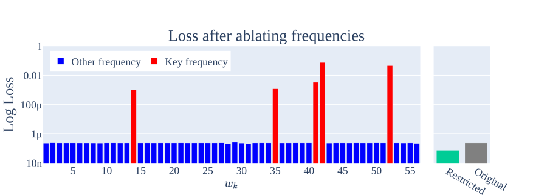

# Causal ablation and intervention

[Spectral analysis / FVE (SVD, ESD)](spectral-analysis-svd-esd-fve.md) ← previous card, next → [Time to grokking](grokking-time.md)

[Concept card index](index.md), category: [6. Analytical tools and metrics](index.md#cat-6)\
→ Next category: [Effective theory and statistical mechanics](effective-theory-statistical-mechanics.md)\
← Previous category: [Grokfast / gradient low-pass filtering](gradient-low-pass-filtering.md)

## Definition

**Causal ablation / intervention** is an experimental methodology that establishes the **causal** (rather than merely correlational) role of a network's internal components in [grokking](grokking.md): a chosen component (a Fourier frequency, a circuit or subnetwork, a gradient direction, a feature) is deliberately **removed** (ablation = zeroing out / cutting) or **substituted** (intervention), and the effect on generalisation is then measured. If generalisation collapses after the ablation, the component is **necessary**; if generalisation survives when only that component is kept, it is **sufficient**. The technique was brought into the context of grokking by Nanda et al. (2023), who confirmed the causality of the learned algorithm by ablating key frequencies in Fourier space \[[1.1](#ref-1-1)\].

## Elaboration

The logic of the method is two-sided. **Ablation for necessity**: zero out the "key" components and see whether the test accuracy falls to chance. **Ablation for sufficiency**: conversely, keep only them and check whether the performance survives. In Nanda et al. this is realised in Fourier space: a network that has grokked [modular addition](modular-arithmetic.md) (addition modulo a prime — the canonical toy task of grokking) rests on 3–8 discrete frequencies; zeroing exactly those frequencies drops the accuracy to chance, whereas zeroing the other 95% of the frequencies even slightly improves it \[[1.1](#ref-1-1)\]. Two [progress measures](progress-measures.md) (continuous indicators of hidden progress that run ahead of the external jump in accuracy) are built on the same operation: the restricted loss (keep only the key frequencies) and the excluded loss (remove the key frequencies) \[[1.1](#ref-1-1)\]. The same technique also confirmed the trigonometric "clock algorithm" ([Clock](clock-vs-pizza.md)) — the scheme of adding angles on a circle.

The works that joined carry causal ablation and intervention from zeroing frequencies to other targets. Yildirim shows the **sufficiency** of a small set of Fourier frequencies: keeping only the top 5, the network retains >99.75% accuracy \[[3.3](#ref-3-3)\]. Xu carries the intervention from a learned feature to the **training dynamics** — suppressing a particular direction of gradient flow and obtaining a monotone dose–response (the stronger the suppression, the worse the generalisation), establishing necessity \[[3.2](#ref-3-2)\]. Zhang et al. apply **causal mediation analysis** (CMA) through activation patching (substituting intermediate activations between two input contexts), localising causality down to individual attention heads \[[3.4](#ref-3-4)\]. Clauw et al. tie causality to subnetworks arising at the emergent phase ([emergence](emergence.md)) \[[3.1](#ref-3-1)\], and Truong et al. give interventional evidence for the causal role of representation entropy through a representation-mixing probe — with an explicit caveat that this is not yet a fully causal claim \[[3.5](#ref-3-5)\]. On the other hand, Furuta et al. use ablation not to confirm a clean universal circuit but to **expose its limits**: the transfer of grokked embeddings between operations is limited, and some operations interfere with each other — that is, the circuits revealed by ablation are not universal \[[2.1](#ref-2-1)\]. Causal ablation thus serves not only to confirm the [phase transition](phase-transition.md) after the [memorisation phase](memorization-phase.md) but also to examine it critically.

## Alternative definitions and nuances

### A. Ablation of features: necessity and sufficiency (Nanda; Yildirim)

The canonical reading: the target of intervention is individual **Fourier frequencies** in the learned representation, and the observed quantity is the test accuracy under (i) removal of the key frequencies and (ii) keeping only them. Nanda: zeroing the key frequencies → chance accuracy, zeroing the other 95% → a slight improvement (necessity) \[[1.1](#ref-1-1)\]; Yildirim: keeping only the top 5 frequencies →
>99.75% (sufficiency) \[[3.3](#ref-3-3)\]. The source of the difference from B and C: the intervention runs on a **static learned feature** rather than on the training dynamics or on activations in the middle of a forward pass.

### B. Intervention on the training dynamics (Xu)

Here the causal handle is not a learned feature but a **direction in the gradient flow** (orthogonal gradient flow) during training. Necessity is established by a monotone dose–response: suppressing the direction prevents generalisation, whereas artificially increasing the curvature has no effect \[[3.2](#ref-3-2)\]. The source of the difference: the causal factor is a dynamic quantity of training time, whence the conclusion "necessary but not sufficient".

### C. Causal mediation analysis of activations (Zhang)

The target is individual **attention heads**, tested by activation patching (substituting intermediate activations between two input contexts) and by an estimate of the causal mediation effect (CMS) \[[3.4](#ref-3-4)\]. The source of the difference: the intervention is performed on the fly inside a single forward pass and localises causality down to specific heads rather than to frequencies or gradient directions.

### Contested

- **Ablation exposes limits rather than a universal circuit** \[[2.1](#ref-2-1)\]: on pre-grokked models, ablation shows that the transferability of grokked embeddings is limited to particular combinations of operations, while some operations interfere and fail to reach the optimum. The source of the difference: the same instrument is used not to confirm a clean causal circuit but to demonstrate its non-universality — the conclusion about the generality of the mechanism is weakened.

### In support

- **The causal role of the emergent phase's subnetworks** \[[3.1](#ref-3-1)\]: subnetworks arising at the emergent phase (by an analysis of synergy and redundancy between neurons) are causally related to delayed generalisation. The source of the difference: the target of causality is a subnetwork, not a frequency.
- **The necessity of orthogonal gradient flow** \[[3.2](#ref-3-2)\]: an intervention on the training dynamics gives a monotone dose–response. The source of the difference: the causal factor is a gradient direction, not a feature.
- **The sufficiency of the top frequencies** \[[3.3](#ref-3-3)\]: an ablation keeping only the top 5 frequencies preserves >99.75% accuracy. The source of the difference: the emphasis is on the sufficiency of a small frequency core.
- **Mediation analysis of attention heads** \[[3.4](#ref-3-4)\]: CMA through activation patching determines which heads are necessary. The source of the difference: causality is localised to individual heads inside a forward pass.
- **Intervention on representation entropy** \[[3.5](#ref-3-5)\]: a representation-mixing probe, with a norm-matched control, separates the contribution of the parameter norm from that of the entropy. The source of the difference: an intervention on an information-theoretic quantity of the representation, with an explicit caveat that the causal claim is incomplete.

## References

###### ref-1-1
**\[1.1\]** 2301.05217 — Nanda et al., "Progress measures for grokking via mechanistic interpretability". [`"ablating key frequencies used by the model reduces performance to chance, while ablating the other 95% of frequencies slightly improves performance"`](../papers/2301.05217.progress-measures-for-grokking-via-mechanistic-interpretability/2301.05217.progress-measures-for-grokking-via-mechanistic-interpretability.card.md#p2-2).\
Also (the method): [`"performing ablations in Fourier space"`](../papers/2301.05217.progress-measures-for-grokking-via-mechanistic-interpretability/2301.05217.progress-measures-for-grokking-via-mechanistic-interpretability.card.md#p1-2).\
Also (the progress measures): [`"restricted loss, where we ablate every non-key frequency, and excluded loss, where we instead ablate all key frequencies"`](../papers/2301.05217.progress-measures-for-grokking-via-mechanistic-interpretability/2301.05217.progress-measures-for-grokking-via-mechanistic-interpretability.card.md#p2-3).

###### ref-1-2
**\[1.2\]** 2306.17844 — Zhong et al. 2023, "The Clock and the Pizza". Introduces the device of *circle isolation*: replacing the embedding matrix by a series of rank-2 approximations over pairs of principal components. Nuance: the intervention is post-training only; the ensembling is inferred from the fall in accuracy on removal, and there is no intervention during training. [`"We call this procedure *circle isolation*."`](../papers/2306.17844.the-clock-and-the-pizza-two-stories-in-mechanistic-explanation-of-neural-networks/original/2306.17844.the-clock-and-the-pizza-two-stories-in-mechanistic-explanation-of-neural-networks.md#p5-1).\
Also: [`"Circle isolation thus reveals an *error correction* mechanism achieved via ensembling"`](../papers/2306.17844.the-clock-and-the-pizza-two-stories-in-mechanistic-explanation-of-neural-networks/original/2306.17844.the-clock-and-the-pizza-two-stories-in-mechanistic-explanation-of-neural-networks.md#p5-1).

###### ref-1-3
**\[1.3\]** 2302.03025 — Chughtai et al., "A Toy Model of Universality: Reverse Engineering how Networks Learn Group Operations". Nuance: a two-sided scheme — exclude what the algorithm predicts, and restrict to it; excluding both key representations in the logits gives a loss worse than chance, whereas ablating what is predicted to be noise improves performance. [`"to 7.60 excluding both, significantly worse than random. Ablating other directions improves performance."`](../papers/2302.03025.a-toy-model-of-universality-reverse-engineering-how-networks-learn-group-operations/2302.03025.a-toy-model-of-universality-reverse-engineering-how-networks-learn-group-operations.card.md#p6-9).\
Also: [`"ablating the components of weights and activations predicted by our algorithm destroys performance, while ablating parts we predict are noise does not affect loss, and often *improves* it"`](../papers/2302.03025.a-toy-model-of-universality-reverse-engineering-how-networks-learn-group-operations/2302.03025.a-toy-model-of-universality-reverse-engineering-how-networks-learn-group-operations.card.md#p2-2).

###### ref-1-4
**\[1.4\]** 2312.06581 — Stander et al. 2024, "Grokking Group Multiplication with Cosets". Nuance: observations are declared insufficient before the experiment, and the circuit is broken deliberately; replacing the ReLU by an absolute value gives 100% accuracy and a loss of 3.69e-13 against 1.97e-6. [`"Neural circuits are complex enough that observational evidence is not enough."`](../papers/2312.06581.grokking-group-multiplication-with-cosets/original/2312.06581.grokking-group-multiplication-with-cosets.md#p7-2).\
Also: [`"The property that the loss goes down when we replace the ReLU activation function with absolute value is a very strange property that GCR does not predict."`](../papers/2312.06581.grokking-group-multiplication-with-cosets/original/2312.06581.grokking-group-multiplication-with-cosets.md#p9-4).

###### ref-1-5
**\[1.5\]** 2407.20199 — Mallinar et al., "Emergence in non-neural models: grokking modular arithmetic via average gradient outer product". Nuance: a device inverse to ablation — a random circulant matrix is substituted at the input, and the delay disappears both for an ordinary kernel and for an ordinary network; this shows that the delay is the time of extracting the feature. [`"a transformation with a *generic* block-circulant matrix enables kernels machines to learn modular arithmetic"`](../papers/2407.20199.emergence-in-non-neural-models-grokking-modular-arithmetic-via-average-gradient-outer-product/original/2407.20199.emergence-in-non-neural-models-grokking-modular-arithmetic-via-average-gradient-outer-product.md#p9-4).\
Also (the network arm of the same intervention): [`"networks trained on transformed integers achieved $100\%$ test accuracy within several hundred epochs and exhibit little delayed generalization while networks trained on non-transformed integers do not achieve $100\%$ test accuracy even within $3000$ epochs"`](../papers/2407.20199.emergence-in-non-neural-models-grokking-modular-arithmetic-via-average-gradient-outer-product/original/2407.20199.emergence-in-non-neural-models-grokking-modular-arithmetic-via-average-gradient-outer-product.md#p12-1).

###### ref-1-6
**\[1.6\]** 2602.18523 — Xu, "The Geometry of Multi-Task Grokking: Transverse Instability, Superposition, and Weight Decay Phase Structure". Nuance: the removal of the orthogonal gradient component is dosed from 1% to 50%, the delay grows to +203%, and at 10% grokking breaks off — the break is reproduced with both two and three tasks, at different parameter counts and different timescales. A control on a random projection of the same strength is run and gives zero. The limitation is named by the authors themselves: one seed (42) and one weight-decay value (1.0). [`"At 10% deletion and above, grokking fails entirely within 60k steps—a sharp cliff between 7% and 10%."`](../papers/2602.18523.the-geometry-of-multi-task-grokking-transverse-instability-superposition-and-weight-decay-phase-structure/original/2602.18523.the-geometry-of-multi-task-grokking-transverse-instability-superposition-and-weight-decay-phase-structure.md#p15-1).\
Also (the random-projection control): [`"PCA projection at strength $s=0.25$ delays grokking by 70–140% ($13.9$k $\to$ $23.7$k steps at seed 42), while random projection at the same strength has no effect"`](../papers/2602.18523.the-geometry-of-multi-task-grokking-transverse-instability-superposition-and-weight-decay-phase-structure/original/2602.18523.the-geometry-of-multi-task-grokking-transverse-instability-superposition-and-weight-decay-phase-structure.md#p14-3).
## References of works that joined the discussion

### Contested

###### ref-2-1
**\[2.1\]** 2402.16726 — Furuta et al., "Towards Empirical Interpretation of Internal Circuits and Properties in Grokked Transformers on Modular Polynomials". Contests: ablation reveals the limits of the circuits rather than their universality. [`"the ablation study with pre-grokked models reveals that the transferability of grokked embeddings and models is limited to specific combinations"`](../papers/2402.16726.towards-empirical-interpretation-of-internal-circuits-and-properties-in-grokked-transformers-on-modular-polynomials/original/2402.16726.towards-empirical-interpretation-of-internal-circuits-and-properties-in-grokked-transformers-on-modular-polynomials.md#p1-3).\
Also (the interference): [`"others may interfere with each other, not reaching optimal solutions"`](../papers/2402.16726.towards-empirical-interpretation-of-internal-circuits-and-properties-in-grokked-transformers-on-modular-polynomials/original/2402.16726.towards-empirical-interpretation-of-internal-circuits-and-properties-in-grokked-transformers-on-modular-polynomials.md#p1-3).

### In support

###### ref-3-1
**\[3.1\]** 2408.08944 — Clauw, Stramaglia, Marinazzo 2024, "Information-Theoretic Progress Measures reveal Grokking is an Emergent Phase Transition". Nuance: ablation confirms the causal role of the emergent phase's subnetworks. [`"sub-networks at the emergent phase may be causally related to delayed generalization"`](../papers/2408.08944.information-theoretic-progress-measures-reveal-grokking-is-an-emergent-phase-transition/original/2408.08944.information-theoretic-progress-measures-reveal-grokking-is-an-emergent-phase-transition.md#p1-7).\
Also (how far this is shown): [`"the contrast between the synergistic sub-networks and its inverse is not that large"`](../papers/2408.08944.information-theoretic-progress-measures-reveal-grokking-is-an-emergent-phase-transition/original/2408.08944.information-theoretic-progress-measures-reveal-grokking-is-an-emergent-phase-transition.md#p4-9).

###### ref-3-2
**\[3.2\]** 2602.16746 — Xu, "Low-Dimensional and Transversely Curved Optimization Dynamics in Grokking". Nuance: an intervention on the gradient flow establishes necessity. [`"Causal intervention experiments establish that orthogonal gradient flow is necessary but not sufficient for grokking: suppressing it prevents generalization with a monotonic dose–response across four operations"`](../papers/2602.16746.low-dimensional-and-transversely-curved-optimization-dynamics-in-grokking/original/2602.16746.low-dimensional-and-transversely-curved-optimization-dynamics-in-grokking.md#p1-2).

###### ref-3-3
**\[3.3\]** 2603.05228 — Yildirim, "The Geometric Inductive Bias of Grokking: Bypassing Phase Transitions via Architectural Topology". Nuance: ablation confirms the sufficiency of a small set of frequencies. [`"causal ablation retaining only the top 5 frequencies preserves >99.75% accuracy across all bounded sphere seeds"`](../papers/2603.05228.the-geometric-inductive-bias-of-grokking-bypassing-phase-transitions-via-architectural-topology/original/2603.05228.the-geometric-inductive-bias-of-grokking-bypassing-phase-transitions-via-architectural-topology.md#p11-2).

###### ref-3-4
**\[3.4\]** 2603.29262 — Zhang et al., "Grokking: From Abstraction to Intelligence". Nuance: causal mediation analysis localises the necessary attention heads. [`"Causal Mediation Analysis (CMA). This framework allows us to identify which attention heads are necessary for the modular arithmetic operations"`](../papers/2603.29262.grokking-from-abstraction-to-intelligence/2603.29262.grokking-from-abstraction-to-intelligence.card.md#p3-2).\
Also (where the patch is applied): [`"patching is applied at the answer-token position (the final token where the model predicts $y$) and is evaluated by the induced logit-difference improvement for the correct answer"`](../papers/2603.29262.grokking-from-abstraction-to-intelligence/2603.29262.grokking-from-abstraction-to-intelligence.card.md#p3-6)

###### ref-3-5
**\[3.5\]** 2604.13123 — Truong et al., "Spectral Entropy Collapse as a Phase Transition in Delayed Generalisation: An Interventional and Predictive Framework for Grokking". Nuance: interventional evidence for the causal role of representation entropy, with a caveat that the causality is incomplete. [`"We provide interventional evidence via a representation-mixing probe, with an extended norm-matched control ($n=30$) disentangling the roles of parameter norm and representation entropy"`](../papers/2604.13123.spectral-entropy-collapse-as-a-phase-transition-in-delayed-generalisation/2604.13123.spectral-entropy-collapse-as-a-phase-transition-in-delayed-generalisation.card.md#p2-3).

###### ref-3-7
**\[3.7\]** 2408.11804 — Yunis et al., "Approaching Deep Learning through the Spectral Dynamics of Weights". The work's only intervention is set up cleanly: random normal perturbations of the weights of growing strength destroy linear mode connectivity and the agreement of the top singular vectors simultaneously (the output layer and the transformer's input layer are deliberately left unperturbed). Nuance: the intervention concerns connectivity, not grokking — on modular addition no intervention is run at all. [`"In Figure 13, when increasingly large random perturbations are applied, the barrier between final checkpoints increases and the LMC behavior disappears."`](../papers/2408.11804.approaching-deep-learning-through-the-spectral-dynamics-of-weights/original/2408.11804.approaching-deep-learning-through-the-spectral-dynamics-of-weights.md#p13-2).

###### ref-3-8
**\[3.8\]** 2602.16967 — Xu, "Early-Warning Signals of Grokking via Loss-Landscape Geometry". Nuance: the scheme 1A-kick / 1A-noise / 1B-project / 1B-penalty is carried over unchanged, but sufficiency diverges across tasks — on modular arithmetic amplification gives nothing, on SCAN a soft one accelerates (${\sim}32$%) while a hard one destabilises, and on Dyck both accelerate (${\sim}50$% and ${\sim}40$%). The numbers of runs per condition are not given, and the strengths of the intervention are not named. [`"The three tasks form a *spectrum* of causal sensitivity to curvature interventions"`](../papers/2602.16967.early-warning-signals-of-grokking-via-loss-landscape-geometry/original/2602.16967.early-warning-signals-of-grokking-via-loss-landscape-geometry.md#p13-4).

###### ref-3-9
**\[3.9\]** 2604.13082 — Gomezjurado Gonzalez, "The Long Delay to Arithmetic Generalization…". [`"projecting out the rank-$15$ probe subspace for $n\bmod 16$ at layer $4$ drops accuracy to $0.043$, a fall of $0.802$, whereas projecting out a random subspace of the same rank costs $0.005$"`](../papers/2604.13082.the-long-delay-to-arithmetic-generalization-when-learned-representations-outrun-behavior/original/2604.13082.the-long-delay-to-arithmetic-generalization-when-learned-representations-outrun-behavior.md#p8-1).\
Also (the hierarchy at convergence): [`"Only magnitude is load-bearing, at $0.141$"`](../papers/2604.13082.the-long-delay-to-arithmetic-generalization-when-learned-representations-outrun-behavior/original/2604.13082.the-long-delay-to-arithmetic-generalization-when-learned-representations-outrun-behavior.md#p28-4), whereas all the residual subspaces are redundant (a drop of $\leq 0.001$ at a probe of $\geq 0.99$).

###### ref-3-10
**\[3.10\]** 2604.20923 — Golwala, "ILDR: Geometric Early Detection of Grokking". [`"This is consistent with ILDR tracking a condition that underlies the transition, rather than merely being correlated with it."`](../papers/2604.20923.ildr-geometric-early-detection-of-grokking/original/2604.20923.ildr-geometric-early-detection-of-grokking.md#p12-3). The evidence is hedged in the abstract too: `mechanistically suggestive evidence`.

###### ref-3-11
**\[3.11\]** 2605.08237 — Wang, Ying, Kanamori 2026, "Distributional Spectral Diagnostics for Localizing Grokking Transitions". Nuance: the perturbations measure sensitivity rather than mechanism; the pools are small — 4 and 5 runs per scale. [`"Monitoring does not directly imply beneficial control."`](../papers/2605.08237.distributional-spectral-diagnostics-for-localizing-grokking-transitions/2605.08237.distributional-spectral-diagnostics-for-localizing-grokking-transitions.card.md#p29-4).\
Also (the perturbations): [`"at scale $0.01$, mean short-horizon deviation is $0.090$ (high-RR) vs. $0.029$ (low-RR), giving high/low ratio $\approx 3.1\times$"`](../papers/2605.08237.distributional-spectral-diagnostics-for-localizing-grokking-transitions/2605.08237.distributional-spectral-diagnostics-for-localizing-grokking-transitions.card.md#p7-1)

###### ref-3-12
**\[3.12\]** 2605.20441 — Verma 2026, "Weight Decay Regimes in Grokking Transformers: Cheap Online Diagnostics". A paired experiment with three groups and pre-declared hypotheses, separating two accounts usually conflated: re-initialising 2 heads out of 8 at the peak of $\sigma_{H}$ lowers that peak, whereas clipping the weight norm to the same median at the same moment does not. Nuance: only the amplitude of phase 2 changes — all three groups grok at a 100% rate, the grokking epoch and the final accuracy do not shift, and the author explicitly makes no claim of transfer to other architectures, tasks or values of $\lambda$ outside $\lbrace0.015,0.05\rbrace$. [`"Group C (weight clipping) yields no significant peak $\sigma_{H}$ change relative to group A at either $\lambda$ (paired $d{=}-0.406$, $p_{t}{=}0.094$ pooled), localising the effect to head-pattern structure rather than weight norm."`](../papers/2605.20441.weight-decay-regimes-in-grokking-transformers-cheap-online-diagnostics/original/2605.20441.weight-decay-regimes-in-grokking-transformers-cheap-online-diagnostics.md#p11-4).\
Also (what the intervention does not change): [`"All three groups grok at $100\%$ rate"`](../papers/2605.20441.weight-decay-regimes-in-grokking-transformers-cheap-online-diagnostics/original/2605.20441.weight-decay-regimes-in-grokking-transformers-cheap-online-diagnostics.md#p11-2).

###### ref-3-13
**\[3.13\]** 2606.13753 — Truong et al. 2026, "The Weight Norm Sets the Grokking Timescale: A Causal Delay Law". A model of experimental design with few equals in the corpus: the seed is derived from the base configuration only, excluding the intervention, so that the control and every clamp share the same initialisation, data split and pre-intervention trajectory. Four rival accounts are named aloud and each closed by its own negative control: not the projection (the $\rho=1.00$ arm), not regularisation (the weight-decay frontier), not a kick but a hold ($1.2\times$ against $7.3\times$), not the inter-layer structure (the per-layer shares drift as in free training). Nuance: the intervention is strong and continuous rather than a fine perturbation, and the authors say so; the link with the Fourier features is not tested by intervention and remains temporal. [`"the random seed is derived from the base configuration only, *excluding* the intervention, so the control and every intervention share identical initialization, data split, and pre-intervention trajectory"`](../papers/2606.13753.the-weight-norm-sets-the-grokking-timescale-a-causal-delay-law/2606.13753.the-weight-norm-sets-the-grokking-timescale-a-causal-delay-law.card.md#p4-10).\
Also (a kick against a hold): [`"a one-shot global rescale to $\rho\,\|W\|_{c}$ that is then released leaves the grokking time nearly flat across $\rho\in[0.70,1.30]$ (median $T_{\mathrm{grok}}$ moves only $1.2\times$, staying within $\sim\!15\%$ of the free control), whereas a *sustained* hold of the same norm spans $7.3\times$ over the narrower range $\rho\in[0.90,1.15]$"`](../papers/2606.13753.the-weight-norm-sets-the-grokking-timescale-a-causal-delay-law/2606.13753.the-weight-norm-sets-the-grokking-timescale-a-causal-delay-law.card.md#p7-2).

###### ref-3-14
**\[3.14\]** 2606.12966 — Sivasankar, "Circuit Synchronization Precedes Generalization: A Causal Precursor to Grokking". [`"we load the add_mod97_s42 checkpoint at step 1,000 (FSD $=0.84$, val acc $=10.6\%$) and fork into six independent branches"`](../papers/2606.12966.circuit-synchronization-precedes-generalization-a-causal-precursor-to-grokking/2606.12966.circuit-synchronization-precedes-generalization-a-causal-precursor-to-grokking.card.md#p6-5).\
Also (what exactly is declared causally confirmed): [`"The strict monotone ordering for $\lambda\in\{1,2,3\}$ causally confirms Phase 2 is a regularisation phase"`](../papers/2606.12966.circuit-synchronization-precedes-generalization-a-causal-precursor-to-grokking/2606.12966.circuit-synchronization-precedes-generalization-a-causal-precursor-to-grokking.card.md#p7-1).\
Also (for the coordinator): the citing work `2607.04333` classes the present work among the **observational** accounts and writes outright that none of them intervenes on the timing — that is, the corpus has already read the causal claim more softly than it is stated.

###### ref-3-15
**\[3.15\]** 2606.18465 — Truong 2026, "What Does the Weight Norm Control in Grokking? Logit-Scale Mediation under Cross-Entropy". Two exemplary interventions: a three-condition temperature mediation — an untrainable $\tau$ outside $\Vert W\Vert$ gives an independent handle on the function-space variable while the norm is physically clamped — and a fork of four arms from a single saved state, where an identical clamp operation at different held values gives a $3.3\text{–}3.4\times$ difference in delay across all 12 seeds of both moduli, closing the objection that the effect is an artefact of the operation. A nuance of the authors' care: the share recovered is called a quantity at the level of the intervention rather than a regression estimate of a natural indirect effect. [`"If the norm effect runs through the logit scale, setting $\tau$ so that the effective logit scale matches the baseline should recover the baseline delay"`](../papers/2606.18465.what-does-the-weight-norm-control-in-grokking-logit-scale-mediation-under-cross-entropy/2606.18465.what-does-the-weight-norm-control-in-grokking-logit-scale-mediation-under-cross-entropy.card.md#p4-2).\
Also (value against operation): [`"Since the operation is identical in the two arms, the difference is not an artifact of the operation: the delay follows the held value"`](../papers/2606.18465.what-does-the-weight-norm-control-in-grokking-logit-scale-mediation-under-cross-entropy/2606.18465.what-does-the-weight-norm-control-in-grokking-logit-scale-mediation-under-cross-entropy.card.md#p8-2).
###### ref-3-16
**\[3.16\]** 2607.06628 — Truong Xuan Khanh 2026, "Cross-Trajectory Chimera Interventions Reveal Dissociable Roles of Weight Magnitude and Direction in Grokking". Three transferable methodological devices for causal interventions: a matched_random control — a random direction at exactly the same angular distance as the donor's (in high dimension a random direction is nearly orthogonal while two trained runs are not, so without matching the angle "the donor acted" is indistinguishable from "a perturbation of that magnitude acted"); adaptive bisection, localising the intervention threshold to $\pm 1/64$ in about three continuations per pair; and an ablation of the optimiser state — a repeat with Adam's moments taken from the recipient and from the donor instead of a reset. Nuance: the stability of repeated continuations, on which "one continuation per grid point" rests, is assumed rather than measured; the declared random_u control is nowhere reported; and the joint probability $6.3\times 10^{-12}$ multiplies six separations as independent under three conditions on the same pairs. [`"we repeat the experiment under three sources for the continuation optimizer’s moments—reset (freshly initialized, as reported above), recipient (transplant $A$’s moments), and donor (transplant $B$’s moments)—and ask whether the reported effect survives all three."`](../papers/2607.06628.cross-trajectory-chimera-interventions-reveal-dissociable-roles-of-weight-magnitude-and-direction-in-grokking/2607.06628.cross-trajectory-chimera-interventions-reveal-dissociable-roles-of-weight-magnitude-and-direction-in-grokking.card.md#p8-1).

### Inheriting

###### ref-3-6
**\[3.6\]** 2405.12755 — Golechha 2024, "Progress Measures for Grokking on Real-world Tasks". Gives the corpus a device that pulls the weight norm and generalisation in opposite directions: a term added to the loss with a negative sign drives the norm up, and grokking arrives all the same — that is, a test of causality by intervention rather than one more observation of curves coinciding. The caveat is made correctly: under AdamW this term goes through the adaptive gradient and does not reduce to "weight decay with the opposite sign". Nuance: for the paper's own three measures there is no intervention at all, and their standing remains exactly what the norm is charged with — a coincidence in time. [`"We employ a clever trick to elicit grokking while the $L_{2}$ norm of the weights increases during generalization."`](../papers/2405.12755.progress-measures-for-grokking-on-real-world-tasks/original/2405.12755.progress-measures-for-grokking-on-real-world-tasks.md#p2-5).\
Also (why this is not reverse weight decay): [`"Note that for the AdamW optimizer, this is implemented differently than weight decay."`](../papers/2405.12755.progress-measures-for-grokking-on-real-world-tasks/original/2405.12755.progress-measures-for-grokking-on-real-world-tasks.md#p3-1).
## Passing mentions

Works that only mention the phenomenon — a literature review, a related-work paragraph, a passing citation — without examining it.

**\[4.1\]** 2505.18266 — McCracken et al. 2025, "Uncovering a Universal Abstract Algorithm for Modular Addition in Neural Networks". Nuance: ablation confirmed the "Fourier multiplication algorithm", later named the Clock. [`"This was termed the *Fourier Multiplication Algorithm* (later *Clock* [5]), and validated through ablation experiments"`](../papers/2505.18266.uncovering-a-universal-abstract-algorithm-for-modular-addition-in-neural-networks/original/2505.18266.uncovering-a-universal-abstract-algorithm-for-modular-addition-in-neural-networks.md#p2-3).
