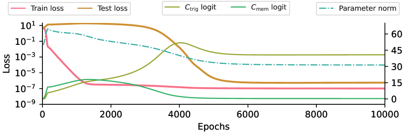

# Circuit efficiency

[Loss landscape and basins](loss-landscape-basins.md) ← previous card, next → [Sparse subnetwork / lottery ticket](sparse-subnetwork-lottery-ticket.md)

[Concept card index](index.md), category: [2. Mechanisms and representations](index.md#cat-2)\
→ Next category: [Modular arithmetic](modular-arithmetic.md)\
← Previous category: [Grokking](grokking.md)

## Definition

**Circuit efficiency** is the property of a circuit (a subnetwork implementing some sub-algorithm inside a network) of producing a given magnitude of logits (the values at the output before the softmax) at a **smaller parameter norm** (the L2 length of the weights). When several circuits solve the training sample equally well, **[weight decay](weight-decay.md)** (the L2 penalty on the weight norms) selects the more efficient among them. The notion was introduced by Varma et al. (2023) to account for [grokking](grokking.md) \[[1.1](#ref-1-1)\].

## Elaboration

The mechanism is built on the opposition of two forces at any loss minimum. Cross-entropy encourages **increasing** the logits (confident answers = a lower loss) and hence growing the weights; weight decay pulls the weights **down**. A more efficient circuit has the stronger cross-entropy "lever" and the weaker weight-decay pressure, so such a circuit dominates \[[1.1](#ref-1-1)\]. Varma et al. posit two families of circuits: a generalising `Cgen` and a memorising `Cmem` (the latter storing the [memorised examples](memorization-phase.md)). Grokking arises under three conditions: `Cgen` generalises, `Cgen` is **more efficient** than `Cmem`, but `Cgen` is **slower to learn**; then the parameter norm "flows" over time from `Cmem` to `Cgen`, producing the [phase transition](phase-transition.md) of the test accuracy \[[1.1](#ref-1-1)\].

The measure by which efficiency is assessed without analysing the scheme itself is called **local circuit complexity**.

The key consequence is a dependence on the amount of data. A generalising circuit works on new points too, so its efficiency does not depend on the size of the set; a memorising one has to learn every added point and therefore **loses efficiency** as the set grows. Hence a **[critical data size](data-fraction-critical-dataset-size.md)** `Dcrit` at which the two circuits are equally efficient \[[1.1](#ref-1-1)\]. This crossover produces kindred phenomena: below `Dcrit` memorisation is again the more profitable and a grokked network slides back — [ungrokking](ungrokking.md), a special case of [catastrophic forgetting](catastrophic-forgetting.md); exactly at `Dcrit` the transition leads only to partial accuracy — [semi-grokking](semi-grokking.md).

The works that joined develop and contest this mechanism. Merrill et al. give a kindred frame of **subnetwork competition**: before the transition a dense subnetwork dominates, after it a sparse one \[[3.1](#ref-3-1)\]; Huang et al. reduce grokking, [double descent](double-descent.md) and kindred phenomena to "circuit competition" \[[3.2](#ref-3-2)\], while Wang et al. carry the relative efficiency of circuits over to tasks of implicit reasoning \[[3.3](#ref-3-3)\]. Tian **derives** Varma's empirical hypothesis from first-principles gradient dynamics \[[3.4](#ref-3-4)\], Singh et al. tie circuit efficiency to the critical data threshold \[[3.5](#ref-3-5)\], and He et al. use the "circuit efficiency hypothesis" directly to set up their experiments \[[3.6](#ref-3-6)\]. On the other hand, the mechanism is criticised for leaning on weight decay: Prakash et al. observe a late collapse of generalisation ([anti-grokking](anti-grokking.md)) **without** weight decay, outside the theory's assumptions \[[2.1](#ref-2-1)\], and Prieto et al. show grokking with no regularisation at all — by removing [softmax collapse](softmax-collapse.md), tied to [naive loss minimisation](nlm.md) \[[2.2](#ref-2-2)\].

## Alternative definitions and nuances

### A. Norm efficiency under weight decay (Varma)

The canonical reading: efficiency = logits per unit of parameter norm, and it is weight decay that performs the selection of the efficient circuit \[[1.1](#ref-1-1)\]. The control parameter is the **size of the training set** (it moves `Dcrit`), and the obligatory premise is a regime of non-zero weight decay. It is exactly this premise that makes the mechanism vulnerable to criticism (see "Contested").

### B. Competition of a dense and a sparse subnetwork (Merrill; Huang)

Here efficiency is made operational not through norm per logit but through **which subnetwork dominates**: the dense memorising one before the transition, the sparse generalising one after \[[3.1](#ref-3-1)\]; Huang et al. generalise this to "circuit competition", a single frame for several phenomena \[[3.2](#ref-3-2)\]. The source of the difference: the observed quantity is the share or density of the active subnetwork, not the arithmetic of "norm per logit".

### C. Efficiency from gradient dynamics (Tian)

In Varma, "`Cgen` is more efficient but slower" is an **empirical hypothesis**; Tian obtains the same claim as a **consequence** of first-principles dynamics: the data distribution sets the optimisation landscape, and that determines which local optimum the weights converge to \[[3.4](#ref-3-4)\]. The source of the difference: efficiency here is not postulated but **derived**, and the order "memorisation first, features later" becomes necessary rather than merely observed.

### Contested

- **Grokking outside weight decay** \[[2.1](#ref-2-1)\]: a late collapse of generalisation ("anti-grokking") arises on the original dataset **without** weight decay after very long training — that is, beyond the theory's key assumption, and it is not predicted by it. The source of the difference: a shift of efficiencies under weight decay does not describe behaviour where weight decay is absent.
- **Grokking without regularisation by removing softmax collapse** \[[2.2](#ref-2-2)\]: if the numerical instability of the softmax is removed, grokking comes without regularisation too — hence the weight efficiency of generalising solutions is not a necessary condition. The source of the difference: the driving factor of the delay is the scaling of the logits (softmax collapse), not the selection of an efficient circuit under weight decay.

- **Coexistence instead of displacement** \[[2.3](#ref-2-3)\]: appendix A.4 of the founding work introduces $k$ equations with permuted answers and reports that the network always interpolates all the labels, while for small $k$ (up to 1000) generalisation barely suffers — the memorised exceptions and the generalising solution live in the same weights in exactly the regime (AdamW, weight decay 1) where displacement is supposed to work. The source of the difference: the picture "an efficient circuit displaces the memorising one" does not account for the peaceful coexistence measured by the founding paper itself.

### In support

- **Competition of a dense/sparse subnetwork** \[[3.1](#ref-3-1)\]: an independent frame in which efficiency shows up as a change of the dominant subnetwork (dense before the transition, sparse after). The source of the difference: the same opposition of circuits is measured through the density of the subnetwork.
- **A unified "circuit competition" view** \[[3.2](#ref-3-2)\]: grokking, double descent and kindred phenomena are explained by a competition of memorising and generalising circuits. The source of the difference: an extension of the mechanism's scope to a family of phenomena.
- **Relative circuit efficiency in reasoning** \[[3.3](#ref-3-3)\]: the formation of a generalising circuit and its relative efficiency account for implicit reasoning in transformers. The source of the difference: a transfer of the mechanism from [modular arithmetic](modular-arithmetic.md) to reasoning tasks.
- **A first-principles derivation** \[[3.4](#ref-3-4)\]: "more efficient but slower" is derived from gradient dynamics rather than postulated. The source of the difference: a theoretical grounding for Varma's empirical hypothesis.
- **The critical data threshold** \[[3.5](#ref-3-5)\]: an analysis of circuit efficiency fixes the critical data size below which the network memorises rather than generalises. The source of the difference: the emphasis on threshold behaviour around `Dcrit`.
- **A direct application of the hypothesis** \[[3.6](#ref-3-6)\]: the ratio of inferred to atomic facts is tuned according to the circuit-efficiency hypothesis so as to hasten the appearance of a generalising circuit. The source of the difference: the mechanism is used as an engineering lever in setting up the experiment.

## References

###### ref-1-1
**\[1.1\]** 2309.02390 — Varma et al., "Explaining grokking through circuit efficiency". [`"weight decay prefers circuits with high “efficiency”, that is, circuits that require less parameter norm to produce a given logit value."`](../papers/2309.02390.explaining-grokking-through-circuit-efficiency/2309.02390.explaining-grokking-through-circuit-efficiency.card.md#p1-6).\
Also (the substance): [`"the generalising solution is slower to learn but more efficient, producing larger logits with the same parameter norm"`](../papers/2309.02390.explaining-grokking-through-circuit-efficiency/2309.02390.explaining-grokking-through-circuit-efficiency.card.md#p1-3).\
Also (the operationalisation): [`"the extent to which the circuit can convert relatively small parameters into relatively large logits"`](../papers/2309.02390.explaining-grokking-through-circuit-efficiency/2309.02390.explaining-grokking-through-circuit-efficiency.card.md#p3-6).\
Also (the ingredient): [`"it can produce equivalent cross-entropy loss on the training set with a lower parameter norm"`](../papers/2309.02390.explaining-grokking-through-circuit-efficiency/2309.02390.explaining-grokking-through-circuit-efficiency.card.md#p3-9).\
Also (Dcrit): [`"memorising circuits become more inefficient with larger training datasets while generalising circuits do not, suggesting there is a critical dataset size"`](../papers/2309.02390.explaining-grokking-through-circuit-efficiency/2309.02390.explaining-grokking-through-circuit-efficiency.card.md#p1-3).

## References of works that joined the discussion

### Contested

###### ref-2-1
**\[2.1\]** 2506.04434 — Prakash & Martin 2025, "Grokking and Generalization Collapse: Insights from HTSR theory". Contests the mechanism's reliance on weight decay: the collapse of generalisation arises without it as well. [`"grokking occurs even without weight decay (leading to an increasing norm), suggesting weight norm alone is not a complete explanation"`](../papers/2506.04434.grokking-and-generalization-collapse-insights-from-htsr-theory/original/2506.04434.grokking-and-generalization-collapse-insights-from-htsr-theory.md#p2-1).\
Also: [`"attributing it to shifting circuit efficiencies under WD"`](../papers/2506.04434.grokking-and-generalization-collapse-insights-from-htsr-theory/original/2506.04434.grokking-and-generalization-collapse-insights-from-htsr-theory.md#p3-1); [`"This distinct phenomenon is not predicted by varma2023explaining as it falls outside of the crucial weight decay assumption on which it relies"`](../papers/2506.04434.grokking-and-generalization-collapse-insights-from-htsr-theory/original/2506.04434.grokking-and-generalization-collapse-insights-from-htsr-theory.md#p3-1).

###### ref-2-2
**\[2.2\]** 2501.04697 — Prieto et al., "Grokking at the Edge of Numerical Stability". Contests the necessity of weight efficiency: grokking is attainable without regularisation. [`"mitigating SC leads to grokking without regularization"`](../papers/2501.04697.grokking-at-the-edge-of-numerical-stability/2501.04697.grokking-at-the-edge-of-numerical-stability.card.md#p1-2).\
Also (the attribution): [`"highlighted weight efficiency of generalizing solutions"`](../papers/2501.04697.grokking-at-the-edge-of-numerical-stability/2501.04697.grokking-at-the-edge-of-numerical-stability.card.md#p1-5).

###### ref-2-3
**\[2.3\]** 2201.02177 — Power et al., "Grokking: Generalization Beyond Overfitting on Small Algorithmic Datasets". Contests the displacement of memorisation by generalisation: in appendix A.4 the network with $k$ corrupted equations always interpolates all the labels, and at small $k$ the memorised exceptions coexist with the generalising solution in the same weights. [`"all experiments reach 100% training accuracy at some point, and this point is not considerably affected by changing the number of outliers $k$"`](../papers/2201.02177.grokking-generalization-beyond-overfitting-on-small-algorithmic-datasets/2201.02177.grokking-generalization-beyond-overfitting-on-small-algorithmic-datasets.card.md#p9-5).\
Also: [`"However the effect of introducing a small number of outliers (up to 1000) is not very pronounced"`](../papers/2201.02177.grokking-generalization-beyond-overfitting-on-small-algorithmic-datasets/2201.02177.grokking-generalization-beyond-overfitting-on-small-algorithmic-datasets.card.md#p9-5).

###### ref-2-4
**\[2.4\]** 2407.20199 — Mallinar et al., "Emergence in non-neural models: grokking modular arithmetic via average gradient outer product". Contests the generality: on a carrier with no circuits at all, grokking is present; the work conducts no analysis of circuits, of their displacement, or of their efficiency. [`"explanations for grokking that depend on the magnitude of the weights or neural circuit efficiency (e.g., [31, 42]) or other attributes of neural networks, such as specific optimization methods, cannot account for the phenomena described in our work"`](../papers/2407.20199.emergence-in-non-neural-models-grokking-modular-arithmetic-via-average-gradient-outer-product/original/2407.20199.emergence-in-non-neural-models-grokking-modular-arithmetic-via-average-gradient-outer-product.md#p16-2).

###### ref-2-5
**\[2.5\]** 2505.11411 — Zhang, Shang, Yang, Zhang, "Is Grokking a Computational Glass Relaxation?". Offers a resolution of the dispute about "efficiency": the disagreement between Varma et al. and Kumar et al. is put down to defining efficiency through the parameter norm alone, and entropy is proposed as the measure — the volume of solutions with the same generalising ability. Nuance: neither Varma et al.'s nor Kumar et al.'s setting is reproduced, "efficiency" through entropy is not measured on a single circuit, and the word "circuit" goes no further in the work than a restatement of someone else's claim. [`"While Varma et al.varma2023explaining argue that grokking requires a transition to an “efficient” generalizing circuit characterized by a lower parameter norm, Kumar et al.kumar2023grokking challenges it as they identified generalizing solutions with higher norm than memorizing solutions."`](../papers/2505.11411.is-grokking-a-computational-glass-relaxation/original/2505.11411.is-grokking-a-computational-glass-relaxation.md#p10-1).\
Also (the proposed resolution): [`"Our framework suggests this conflict stems from using parameter norm alone to define efficiency, while entropy is actually a better indicator since the efficient solution will have more “free” parameters and therefore a larger entropy."`](../papers/2505.11411.is-grokking-a-computational-glass-relaxation/original/2505.11411.is-grokking-a-computational-glass-relaxation.md#p10-1).
###### ref-2-6
**\[2.6\]** 2502.01739 — Manning-Coe, Gliozzi, Stapleton, Hirst, De Tomasi, Bradlyn & Berman 2025, "Grokking vs. Learning: Same features, different encodings". A direct objection to the line "generalisation as a passage to a more economical encoding": if grokking were compression to an efficient scheme, grokked models would compress better — the opposite is shown, with steady learning compressing the same features up to five times more efficiently. [`"In our case, the features learned were the same, and the steady learning regime had higher compression"`](../papers/2502.01739.grokking-vs-learning-same-features-different-encodings/original/2502.01739.grokking-vs-learning-same-features-different-encodings.md#p8-5).\
Also (the size of the gap): [`"we are able to *cut 95% of the weights* in the model for a 5% drop in accuracy, a compressibility 25x that of the original model"`](../papers/2502.01739.grokking-vs-learning-same-features-different-encodings/original/2502.01739.grokking-vs-learning-same-features-different-encodings.md#p5-6).

### In support

###### ref-3-1
**\[3.1\]** 2303.11873 — Merrill et al., "A Tale of Two Circuits: Grokking as Competition of Sparse and Dense Subnetworks". Nuance: efficiency as a change of the dominant subnetwork. [`"two largely distinct subnetworks: a dense one that dominates before the transition and generalizes poorly, and a sparse one that dominates afterwards"`](../papers/2303.11873.a-tale-of-two-circuits-grokking-as-competition-of-sparse-and-dense-subnetworks/original/2303.11873.a-tale-of-two-circuits-grokking-as-competition-of-sparse-and-dense-subnetworks.md#p1-2).

###### ref-3-2
**\[3.2\]** 2402.15175 — Huang et al., "Unified View of Grokking, Double Descent and Emergent Abilities: A Perspective from Circuits Competition". Nuance: a single circuit-competition frame. [`"from the perspective of competition between memorization circuits and generalization circuits in neural models"`](../papers/2402.15175.unified-view-of-grokking-double-descent-and-emergent-abilities/original/2402.15175.unified-view-of-grokking-double-descent-and-emergent-abilities.md#p1-3).

###### ref-3-3
**\[3.3\]** 2405.15071 — Wang et al., "Grokked Transformers are Implicit Reasoners: A Mechanistic Journey to the Edge of Generalization". Nuance: the relative efficiency of circuits in reasoning tasks. [`"its relation to the relative efficiency of generalizing and memorizing circuits"`](../papers/2405.15071.grokked-transformers-are-implicit-reasoners/2405.15071.grokked-transformers-are-implicit-reasoners.card.md#p1-2).

###### ref-3-4
**\[3.4\]** 2509.21519 — Tian, "Provable Scaling Laws of Feature Emergence from Learning Dynamics of Grokking". Nuance: a derivation of Varma's hypothesis from gradient dynamics. [`"generalization circuits $\mathcal{C}_{gen}$ is more efficient but learn slower than memorization circuits $\mathcal{C}_{mem}$"`](../papers/2509.21519.provable-scaling-laws-of-feature-emergence-from-learning-dynamics-of-grokking/original/2509.21519.provable-scaling-laws-of-feature-emergence-from-learning-dynamics-of-grokking.md#p2-2).

###### ref-3-5
**\[3.5\]** 2511.04760 — Singh et al., "When Data Falls Short: Grokking Below the Critical Threshold". Nuance: circuit efficiency fixes the critical data size. [`"Circuit-efficiency analysis shows that generalization is slower but more efficient"`](../papers/2511.04760.when-data-falls-short-grokking-below-the-critical-threshold/original/2511.04760.when-data-falls-short-grokking-below-the-critical-threshold.md#p2-4).

###### ref-3-6
**\[3.6\]** 2601.09049 — He et al., "Is Grokking Worthwhile? Functional Analysis and Transferability of Generalization Circuits". Nuance: the circuit-efficiency hypothesis as a lever for setting up the experiment. [`"According to the circuit efficiency hypothesis, a high ratio like 18.0 increases the relative complexity of a memorizing circuit compared to a generalizing one"`](../papers/2601.09049.is-grokking-worthwhile-functional-analysis-and-transferability-of-generalization-circuits-in-transformers/original/2601.09049.is-grokking-worthwhile-functional-analysis-and-transferability-of-generalization-circuits-in-transformers.md#p9-7).

###### ref-3-7
**\[3.7\]** 2606.12966 — Sivasankar, "Circuit Synchronization Precedes Generalization: A Causal Precursor to Grokking". [`"We view our results as direct, controlled evidence for the mechanism that Varma et al. 2023 argue for on efficiency grounds."`](../papers/2606.12966.circuit-synchronization-precedes-generalization-a-causal-precursor-to-grokking/2606.12966.circuit-synchronization-precedes-generalization-a-causal-precursor-to-grokking.card.md#p16-4).
###### ref-3-8
**\[3.8\]** 2505.18266 — McCracken et al., "Uncovering a Universal Abstract Algorithm for Modular Addition in Neural Networks". Nuance: a numerical measure of the economy of the universal solution — an argument that the winning circuit is small; the work does not check itself against Varma's norm efficiency directly. [`"It predicts that universally learned solutions in DNNs with trainable embeddings or more than one hidden layer require only $\mathcal{O}(\log n)$ features, a result we empirically confirm"`](../papers/2505.18266.uncovering-a-universal-abstract-algorithm-for-modular-addition-in-neural-networks/original/2505.18266.uncovering-a-universal-abstract-algorithm-for-modular-addition-in-neural-networks.md#p1-2).

###### ref-3-9
**\[3.9\]** 2606.26050 — Li, Sreedhar 2026, "Natural Ungrokking: Asymmetric Control of Which Rules Survive Pretraining". A competition of circuits translated from efficiency into measurable statistics of the data and tested causally in both directions: flipping the support into counter-evidence in place (with token counts preserved) kills the rule with exact dose monotonicity ($\rho_{\mathrm{kill}}=-1.00$, $\mathrm{CM}$ from $+3.68$ to $-2.99$) and reproduces on a second rule with five doses within a single corpus ($0.96\to0.00$, strictly monotone); the reverse injection, at an evidence ratio of up to $3{,}565$ against the surviving level of $7.9$, does not bring the behaviour back under uniform, early or late schedules — with a partial rebuilding of the carrying head (in the surviving runs the margin is carried by a single last-layer head, $0.75\text{–}0.90$ of the attribution; in the collapsed ones there is no carrier). Nuance: the asymmetry compares unequal edits — the kill changes exactly the tokens the battery tests, whereas the restoration deliberately pours in disjoint names, so the failure to recover may be a property of the experiment's construction. [`"No dose produces a control-valid recovery in any seed"`](../papers/2606.26050.natural-ungrokking-asymmetric-control-of-which-rules-survive-pretraining/original/2606.26050.natural-ungrokking-asymmetric-control-of-which-rules-survive-pretraining.md#p5-6).

###### ref-3-10
**\[3.10\]** 2602.02859 — Prakash et al., "Late-Stage Generalization Collapse in Grokking: Detecting anti-grokking with WeightWatcher". Nuance: an approximate local circuit complexity is taken as a progress measure — an attempt to measure the efficiency of a scheme without analysing it. [`"Approximate Local Circuit Complexity, which capture broader"`](../papers/2602.02859.late-stage-generalization-collapse-in-grokking-detecting-anti-grokking-with-weightwatcher/original/2602.02859.late-stage-generalization-collapse-in-grokking-detecting-anti-grokking-with-weightwatcher.md#p2-2).

## Passing mentions

Works that only mention the phenomenon — a literature review, a related-work paragraph, a passing citation — without examining it.

**\[4.1\]** 2512.03437 — Liang & Li, "Grokked Models are Better Unlearners". [`"This distributed-to-modular shift involves competition between dense memorizing and sparse generalizing circuits (Merrill et al., 2023; Varma et al., 2023)"`](../papers/2512.03437.grokked-models-are-better-unlearners/2512.03437.grokked-models-are-better-unlearners.card.md#p4-1).

**\[4.2\]** 2601.03162 — Jiang et al., "On the Convergence Behavior of Preconditioned Gradient Descent Toward the Rich Learning Regime". [`"explain the delay including regularization with weights, dynamics of adaptive optimizers, and circuit efficiencies"`](../papers/2601.03162.on-the-convergence-behavior-of-preconditioned-gradient-descent-toward-the-rich-learning-regime/2601.03162.on-the-convergence-behavior-of-preconditioned-gradient-descent-toward-the-rich-learning-regime.card.md#p1-5).

**\[4.3\]** 2602.16746 — Xu, "Low-Dimensional and Transversely Curved Optimization Dynamics in Grokking". [`"Varma et al. (2023) explained it through circuit efficiency"`](../papers/2602.16746.low-dimensional-and-transversely-curved-optimization-dynamics-in-grokking/original/2602.16746.low-dimensional-and-transversely-curved-optimization-dynamics-in-grokking.md#p20-4).

**\[4.4\]** 2603.01968 — Hwang et al., "Intrinsic Task Symmetry Drives Generalization in Algorithmic Tasks". [`"Prevailing explanations for grokking such as implicit biases (Lyu et al., 2024), regularization norms (Liu et al., 2023), and circuit efficiency (Varma et al., 2023) converge"`](../papers/2603.01968.intrinsic-task-symmetry-drives-generalization-in-algorithmic-tasks/original/2603.01968.intrinsic-task-symmetry-drives-generalization-in-algorithmic-tasks.md#p1-4).

**\[4.5\]** 2311.18817 — Lyu et al., "Dichotomy of Early and Late Phase Implicit Biases Can Provably Induce Grokking". Nuance: restates circuit efficiency through the parameter norm and assigns it to accounts without a rigorous analysis of the training dynamics; ungrokking and semi-grokking are only named, not tested experimentally. [`"Varma et al. 2023 hypothesized that grokking happens when the generalizable solutions have a smaller parameter norm than the overfitting solutions, but the former takes a longer time to learn"`](../papers/2311.18817.dichotomy-of-early-and-late-phase-implicit-biases-can-provably-induce-grokking/original/2311.18817.dichotomy-of-early-and-late-phase-implicit-biases-can-provably-induce-grokking.md#p16-1).

**\[4.6\]** 2310.02541 — Xu et al. 2023. Nuance: the notion is merely mentioned; there are no circuits in the work's own analysis — the mechanism there is geometric (an alignment of neurons along cluster means). [`"utilized circuit efficiency to interpret grokking and discovered two novel phenomena called ungrokking and semi-grokking"`](../papers/2310.02541.benign-overfitting-and-grokking-in-relu-networks-for-xor-cluster-data/original/2310.02541.benign-overfitting-and-grokking-in-relu-networks-for-xor-cluster-data.md#p3-2).

**\[4.7\]** 2401.10463 — Zhu et al. 2024. Nuance: circuit efficiency is set out accurately, but exclusively as the content of a neighbouring work from which the authors distance themselves; there is no mechanistic part in the paper at all — the only internal quantities are the L2 norm and histograms of the last layer's weights. [`"They define ‘critical data size’ as the number of data points at which memorizing and generalizing circuits produce identical logits."`](../papers/2401.10463.critical-data-size-of-language-models-from-a-grokking-perspective/2401.10463.critical-data-size-of-language-models-from-a-grokking-perspective.card.md#p12-2).

**\[4.8\]** 2507.20057 — Lyle et al., "What Can Grokking Teach Us About Learning Under Nonstationarity?". A mention only: circuit efficiency enters as one of the two disputing sides (against the "Goldilocks zone" of Liu et al. 2022b), and the work declares that it "finds a grain of truth in both views", shifting the account to the ratio of the step norm to the parameter norm. Neither circuits nor their cost is measured; the experimental architecture, meanwhile, is borrowed precisely from Varma et al. 2023. [`"Varma et al. 2023 argue the converse: grokking occurs when the optimizer converges to an “efficient” circuit which generalizes well, from which point weight decay can reduce the parameter norm without harming accuracy"`](../papers/2507.20057.what-can-grokking-teach-us-about-learning-under-nonstationarity/original/2507.20057.what-can-grokking-teach-us-about-learning-under-nonstationarity.md#p3-2).

**\[4.9\]** 2605.09724 — Song & Ye, "Model Capacity Determines Grokking through Competing Memorisation and Generalisation Speeds". Nuance: presented as a refinement rather than a dispute; the work measures neither the norms of circuits nor their isolation. [`"previous works identify which solution is preferred at convergence, while we give a more formal treatment on which solution gradient descent encounters first as a function of model capacity"`](../papers/2605.09724.model-capacity-determines-grokking-through-competing-memorisation-and-generalisation-speeds/original/2605.09724.model-capacity-determines-grokking-through-competing-memorisation-and-generalisation-speeds.md#p9-4).

**\[4.10\]** 2604.13082 — Gomezjurado Gonzalez, "The Long Delay to Arithmetic Generalization…". [`"Its step-for-step coincidence with the loss elbow is consistent with circuit-competition accounts of grokking (Varma et al., 2023; Merrill et al., 2023)"`](../papers/2604.13082.the-long-delay-to-arithmetic-generalization-when-learned-representations-outrun-behavior/original/2604.13082.the-long-delay-to-arithmetic-generalization-when-learned-representations-outrun-behavior.md#p20-2).

**\[4.11\]** 2605.08237 — Wang, Ying, Kanamori 2026, "Distributional Spectral Diagnostics for Localizing Grokking Transitions". Nuance: a single mention in a survey appendix, with no comparison to their own quantity. [`"Fourier features for modular addition [28] and circuit-efficiency tradeoffs [43]"`](../papers/2605.08237.distributional-spectral-diagnostics-for-localizing-grokking-transitions/2605.08237.distributional-spectral-diagnostics-for-localizing-grokking-transitions.card.md#p30-7).

**\[4.12\]** 2606.13753 — Truong et al. 2026, "The Weight Norm Sets the Grokking Timescale: A Causal Delay Law". Mentions circuit efficiency in its survey as one of the accounts of *what* the network computes, and sets its own subject directly against it — a scalar control variable and its causal role in triggering the transition. Nuance: the work does not relate the two pictures — neither how holding the total norm affects the ratio of the two circuits' efficiencies, nor whether efficiency accounts for the value of the exponent $\alpha$. [`"Varma et al. 2023 framed grokking as competition between a memorizing and a generalizing circuit of differing parameter efficiency, with weight decay tipping the balance."`](../papers/2606.13753.the-weight-norm-sets-the-grokking-timescale-a-causal-delay-law/2606.13753.the-weight-norm-sets-the-grokking-timescale-a-causal-delay-law.card.md#p2-2).

### External works

###### ref-5-1
**\[5.1\]** 2508.17689 — **External work (excerpt): Buchanan et al., "On the Edge of Memorization in Diffusion Models".** Nuance: the same form of explanation — a competition of two solutions by cost, where the cost is played by the weighted training loss and the threshold is called a crossing point. [`"the weighted training loss of a fully generalizing model becomes greater than that of an underparameterized memorizing model at a critical value of model (under)parameterization"`](../externals/2508.17689.on-the-edge-of-memorization-in-diffusion-models/original/2508.17689.on-the-edge-of-memorization-in-diffusion-models.md#p1-2).
