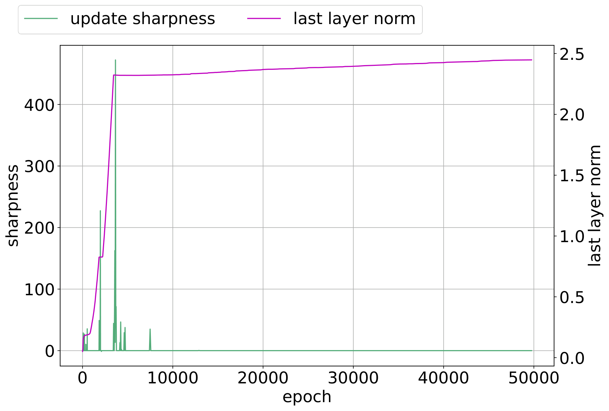

# Edge of stability

[The role of gradient noise (gradient noise / full-batch training)](gradient-noise.md) ← previous card, next → [selective-weight-decay](selective-weight-decay.md)

[Concept card index](index.md), category: [4. Training and optimisation factors](index.md#cat-4)\
→ Next category: [Grokfast / gradient low-pass filtering](gradient-low-pass-filtering.md)\
← Previous category: [Modular arithmetic](modular-arithmetic.md)

## Definition

**The edge of stability** (EoS) is a regime of training by gradient descent in which the "sharpness" of the [loss landscape](loss-landscape-basins.md) (the largest eigenvalue of the Hessian, the matrix of second derivatives of the loss with respect to the parameters) grows through "progressive sharpening" up to the stability threshold 2/η (η being the [learning rate](learning-rate.md)) and then stays near it: beyond that threshold a step no longer guarantees a decrease of the loss, and the training loss becomes non-monotone over short time spans \[[1.1](#ref-1-1)\]. The notion was introduced by Cohen et al. (2021); into the discourse of [grokking](grokking.md) it was carried by Thilak et al., who tied the instability of the [slingshot](slingshot.md) to EoS \[[1.1](#ref-1-1)\].

## Elaboration

The mechanism of EoS has two stages. First comes **progressive sharpening**: the largest eigenvalue of the loss Hessian grows monotonically as training proceeds \[[1.1](#ref-1-1)\]. As soon as it reaches the threshold 2/η, the discrete gradient step stops being contractive — a step may increase rather than decrease the loss — and the system enters a self-stabilising regime: the sharpness oscillates around the critical value, and the training loss produces series of high-frequency spikes. It is exactly this **[phase transition](phase-transition.md)** between stable and unstable dynamics that Cohen et al. called the edge of stability.

In the theory of grokking, EoS is used to account for why generalisation lags. The classical qualification: EoS was originally shown for full-batch gradient descent, whereas the cyclic spikes of the slingshot are observed with **adaptive [optimisers](optimizer-adam-adamw-sgd.md)** (Adam/AdamW — methods that scale the step component-wise by the accumulated gradient variance) \[[1.1](#ref-1-1)\]. Hence the dispute over whether this is one phenomenon. One line (Acharya et al.) reads the instability as **functional**: the edge of stability is the gateway to the "sharp" generalising basin (a minimum region of high curvature), which the optimiser can enter only when the accumulated gradient variance temporarily raises the ceiling of stability; on this reading "instability drives [feature learning](feature-emergence-feature-learning.md)", and the slingshot is not an anomaly but a necessary injection of variance \[[3.1](#ref-3-1)\]. The opposing line (Liu et al.) contests the identification of grokking's late instability with EoS: under cross-entropy loss, at an interpolating solution the largest Hessian eigenvalue tends to zero, so training proceeds **far below** the threshold 2/η, and the late slingshot spikes are a numerical artefact of low precision rather than a genuine edge of stability, which remains an intrinsic property of the landscape \[[2.1](#ref-2-1)\].

## Alternative definitions and nuances

### A. The classical dynamic reading (progressive sharpening → self-stabilisation)

The original definition (Cohen et al. as set out by Thilak et al.): EoS is a deterministic regime of *full-batch* gradient descent, fixed by a single [order parameter](order-parameter.md) — the sharpness λ_max relative to the threshold 2/η. The mechanism: the sharpness grows of itself (progressive sharpening) up to the threshold, after which it stops growing and oscillates around it, while the training loss behaves non-monotonically over short intervals \[[1.1](#ref-1-1)\]. The key feature of this reading is that the source of the instability is **endogenous and geometric**: it is set by the curvature of the landscape and the learning rate, not by the optimiser or the arithmetic.

### B. EoS versus the slingshot: are they one phenomenon

A nuance of its own is how EoS relates to the [slingshot](slingshot.md) effect. Thilak et al. separate them outright by **type of optimiser**: the edge of stability was shown for full-batch gradient descent, whereas they observe the slingshot with adaptive optimisers (above all Adam/AdamW) and with a *repeating cyclic* behaviour that canonical EoS does not have \[[1.1](#ref-1-1)\]. The source of the difference here is not the sharpening mechanism but the **optimisation regime**: whether to count the late cyclic spikes as a manifestation of the same stability threshold or as a separate phenomenon determines the whole subsequent dispute.

### Contested

Liu et al. (2605.06152) contest the thesis that grokking's late instability is EoS. The distinguishing machinery: under cross-entropy loss, at an interpolating solution (when the predicted probability converges to the one-hot label) the largest Hessian eigenvalue tends to zero, so "the progressive sharpening required for EOS does not occur in the late stages of training" \[[2.1](#ref-2-1)\]. Training therefore proceeds far below the threshold 2/η, and the spikes come not from curvature but from the finite precision of the loss computation: moving to float64 removes the slingshot spikes entirely, whereas genuine EoS oscillations would persist in double precision. The upshot: EoS is real, but the late slingshot is a **numerical artefact of low precision**, not the edge of stability; genuine EoS shows up in their setting only at the early stage \[[2.1](#ref-2-1)\].

### In support

Acharya et al. (2603.15492) support and strengthen the EoS reading of grokking: "instability drives feature learning", and "grokking appears to happen near the edge of stability" \[[3.1](#ref-3-1)\]. The distinguishing machinery: for modular-arithmetic tasks the generalising basin is **sharper** than the optimiser's initial stability threshold, so entry into it is blocked until the accumulated gradient variance raises the ceiling 2/η_eff above the basin's curvature. On this reading the slingshot is redefined from an anomaly into a **mechanism for injecting variance** that serves precisely the edge-of-stability constraint. The source of the difference from reading A: EoS here is not an incidental geometric regime but a **causal gate** of generalisation — without reaching the edge of stability the sharp generalising circuit is unreachable.

## References

###### ref-1-1
**\[1.1\]** 2206.04817 — Thilak et al., "The Slingshot Mechanism: An Empirical Study of Adaptive Optimizers and the Grokking Phenomenon". [`"Cohen et al. [4] call Edge of Stability where-in the model shows non-monotonic training loss behavior over short time spans."`](../papers/2206.04817.the-slingshot-mechanism-an-empirical-study-of-adaptive-optimizers-and-grokking/2206.04817.the-slingshot-mechanism-an-empirical-study-of-adaptive-optimizers-and-grokking.card.md#p3-4).\
Also: [`"describe a "progressive sharpening" phenomenon in which the maximum eigenvalue of the loss Hessian increases"`](../papers/2206.04817.the-slingshot-mechanism-an-empirical-study-of-adaptive-optimizers-and-grokking/2206.04817.the-slingshot-mechanism-an-empirical-study-of-adaptive-optimizers-and-grokking.card.md#p3-4); [`"Edge of Stability is shown for full-batch gradient descent while we observe Slingshot Mechanism with adaptive optimizers"`](../papers/2206.04817.the-slingshot-mechanism-an-empirical-study-of-adaptive-optimizers-and-grokking/2206.04817.the-slingshot-mechanism-an-empirical-study-of-adaptive-optimizers-and-grokking.card.md#p3-4).

## References of works that joined the discussion

### Contested

###### ref-2-1
**\[2.1\]** 2605.06152 — Liu, Cao, Li, Zhou 2026, "Grokking or Glitching? How Low-Precision Drives Slingshot Loss Spikes". Contests the identification of grokking's late instability with the edge of stability: EOS is genuine and comes from the landscape, whereas the late slingshot spikes are a numerical trace of low precision. [`"EOS is an intrinsic property of the optimization landscape that persists regardless of numerical precision"`](../papers/2605.06152.grokking-or-glitching-how-low-precision-drives-slingshot-loss-spikes/original/2605.06152.grokking-or-glitching-how-low-precision-drives-slingshot-loss-spikes.md#p16-6).\
Also: [`"the progressive sharpening required for EOS does not occur in the late stages of training"`](../papers/2605.06152.grokking-or-glitching-how-low-precision-drives-slingshot-loss-spikes/original/2605.06152.grokking-or-glitching-how-low-precision-drives-slingshot-loss-spikes.md#p16-3); [`"This confirms that the early instability is genuine EOS, while the late-stage instability is strictly a result of numerical breakdown"`](../papers/2605.06152.grokking-or-glitching-how-low-precision-drives-slingshot-loss-spikes/original/2605.06152.grokking-or-glitching-how-low-precision-drives-slingshot-loss-spikes.md#p16-7).

### In support

###### ref-3-1
**\[3.1\]** 2603.15492 — Acharya et al., "Grokking as a Variance-Limited Phase Transition". Nuance: EoS is the causal gate of generalisation; instability drives feature learning, and the slingshot is a variance-injection mechanism serving the stability threshold. [`"Edge of Stability (EoS): Research arguing that instability drives feature learning [6, 18]."`](../papers/2603.15492.grokking-as-a-variance-limited-phase-transition-spectral-gating-and-the-epsilon-stability-threshold/original/2603.15492.grokking-as-a-variance-limited-phase-transition-spectral-gating-and-the-epsilon-stability-threshold.md#p1-7).\
Also: [`"Grokking appears to happen near the edge of stability. The optimizer needs enough instability to generate variance for exploration"`](../papers/2603.15492.grokking-as-a-variance-limited-phase-transition-spectral-gating-and-the-epsilon-stability-threshold/original/2603.15492.grokking-as-a-variance-limited-phase-transition-spectral-gating-and-the-epsilon-stability-threshold.md#p10-7).\
Also (the gating condition): [`"The optimizer can only converge into a basin with Hessian curvature $\lambda_{max}^{H}$ if it satisfies the **Spectral Gating Condition**"`](../papers/2603.15492.grokking-as-a-variance-limited-phase-transition-spectral-gating-and-the-epsilon-stability-threshold/original/2603.15492.grokking-as-a-variance-limited-phase-transition-spectral-gating-and-the-epsilon-stability-threshold.md#p4-2)

## Passing mentions

Works that only mention the phenomenon — a literature review, a related-work paragraph, a passing citation — without examining it.

**\[4.1\]** 2306.13253 — Notsawo et al., "Predicting Grokking Long Before it Happens". [`"the model to enter an Edge of Stability regime where loss shows non-monotonic training behaviour over short time"`](../papers/2306.13253.predicting-grokking-long-before-it-happens/original/2306.13253.predicting-grokking-long-before-it-happens.md#p12-12) — EoS is mentioned as a consequence of progressive sharpening.

**\[4.2\]** 2408.08944 — Clauw, Stramaglia, Marinazzo 2024, "Information-Theoretic Progress Measures reveal Grokking is an Emergent Phase Transition". [`"Recent work observed distinct phases during optimization when training neural networks (Kalra & Barkeshli, 2023) related to the edge of stability (Cohen et al., 2020)"`](../papers/2408.08944.information-theoretic-progress-measures-reveal-grokking-is-an-emergent-phase-transition/original/2408.08944.information-theoretic-progress-measures-reveal-grokking-is-an-emergent-phase-transition.md#p5-7). — *EoS is named in a list of optimisation phases.*

**\[4.3\]** 2410.04489 — Beck et al., "Grokking at the Edge of Linear Separability". [`"possibly relating to catapults (Lewkowycz et al., 2020) or the edge of stability mechanism"`](../papers/2410.04489.grokking-at-the-edge-of-linear-separability/2410.04489.grokking-at-the-edge-of-linear-separability.card.md#p9-6). — EoS is mentioned as a direction for future study at large learning rates.

**\[4.4\]** 2603.13331 — Truong et al., "The Norm-Separation Delay Law of Grokking: A First-Principles Theory of Delayed Generalization". [`"Alternative mechanisms—such as grokking without weight decay or through edge-of-stability effects (Thilak et al., 2022)—may require separate treatment."`](../papers/2603.13331.the-norm-separation-delay-law-of-grokking-a-first-principles-theory-of-delayed-generalization/2603.13331.the-norm-separation-delay-law-of-grokking-a-first-principles-theory-of-delayed-generalization.card.md#p26-2). — EoS is named as a limit on the range of their theory.

**\[4.5\]** 2210.15435 — Žunkovič, Ilievski, "Grokking phase transitions in learning local rules with gradient descent". Nuance: the edge of stability is mentioned in a single parenthesis while the slingshot mechanism is set out; the work computes no curvature, no Hessian eigenvalues and no quantities relating to the edge of stability. [`"A sling-shot mechanism (related to edge of stability [15]) has been proposed as a necessary condition for grokking."`](../papers/2210.15435.grokking-phase-transitions-in-learning-local-rules-with-gradient-descent/2210.15435.grokking-phase-transitions-in-learning-local-rules-with-gradient-descent.card.md#p4-3).

**\[4.6\]** 2310.16441 — Levi et al. 2023. Nuance: the catapult and the edge of stability are named in a list of directions — as what was left beyond gradient flow; the work contains no measurements of sharpness and no large steps. [`"combining catapult/edge of stability dynamics with grokking analysis"`](../papers/2310.16441.grokking-in-linear-estimators-a-solvable-model-that-groks-without-understanding/original/2310.16441.grokking-in-linear-estimators-a-solvable-model-that-groks-without-understanding.md#p11-3).

**\[4.7\]** 2507.20057 — Lyle et al., "What Can Grokking Teach Us About Learning Under Nonstationarity?". A mention only, but a substantive one: the size of the warm-up is justified through the sharpness of the local basin and the catapult mechanism — the step must exceed the sharpness for the optimiser to jump out of the basin. The work meanwhile measures neither sharpness nor Hessian eigenvalues; the edge of stability enters a survey list of relations between curvature and the effective step size. [`"We propose to instead escape from a local minimum not by changing the loss landscape, but by increasing the learning rate, for example to a value which exceeds the sharpness of the local basin (Lewkowycz et al. 2020)"`](../papers/2507.20057.what-can-grokking-teach-us-about-learning-under-nonstationarity/original/2507.20057.what-can-grokking-teach-us-about-learning-under-nonstationarity.md#p7-5).

**\[4.8\]** 2605.08237 — Wang, Ying, Kanamori 2026, "Distributional Spectral Diagnostics for Localizing Grokking Transitions". Nuance: curvature is not measured in the work at all; the contrast is drawn by where the signal sits. [`"the edge-of-stability phenomenon in which the top Hessian eigenvalue saturates near $2/\eta$ [7, 9]"`](../papers/2605.08237.distributional-spectral-diagnostics-for-localizing-grokking-transitions/2605.08237.distributional-spectral-diagnostics-for-localizing-grokking-transitions.card.md#p31-2).
