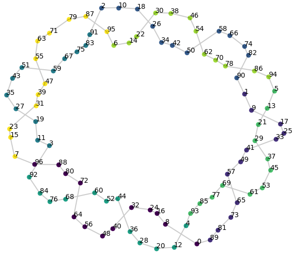

# Feature emergence and feature learning

[Fourier features and circuits](fourier-features-circuits.md) ← previous card, next → [The lazy→rich (kernel-to-feature-learning) transition](lazy-to-rich-kernel-to-feature-learning.md)

[Concept card index](index.md), category: [2. Mechanisms and representations](index.md#cat-2)\
→ Next category: [Modular arithmetic](modular-arithmetic.md)\
← Previous category: [Grokking](grokking.md)

## Definition

**Feature emergence** is the appearance, over the course of training, of structured internal representations (features) that encode the structure of the task and secure generalisation. Empirically it was first noticed in [grokking](grokking.md) as learned symbol embeddings that uncover a recognisable structure of the mathematical objects \[[1.1](#ref-1-1)\], with generalisation coinciding with the emergence of structure in the embeddings \[[1.2](#ref-1-2)\]. In dynamical terms the same phenomenon is called **feature learning** — the "rich" regime as against the "lazy", kernel regime, into which the network passes late in training \[[1.3](#ref-1-3)\].

## Elaboration

The term unites two views of one phenomenon. The empirical: during grokking the hidden layers rearrange from a "memorising" state (see the [memorisation phase](memorization-phase.md)) into structured features — for modular arithmetic, circular, Fourier-like embeddings, "feature maps" of the task \[[1.1](#ref-1-1)\]\[[1.5](#ref-1-5)\]. This rearrangement of the pre-classification layer's features proceeds in a burst and coincides with sharp jumps of the weight norm — the [slingshot](slingshot.md) regime \[[1.6](#ref-1-6)\]. The dynamical: grokking is read as a passage from the **lazy regime** (kernel-like — the network behaves as a linear regression over the tangent kernel, the [neural tangent kernel](neural-tangent-kernel-ntk.md) / NTK, and the features barely change) to **feature learning** (the rich regime, where the hidden representations evolve noticeably) \[[1.3](#ref-1-3)\]. The speed of that passage — the "rate of feature learning" — is governed by the scale of the network's output and is declared the key determinant of grokking \[[1.3](#ref-1-3)\].

Mechanistically, feature emergence is read as a gradual amplification of structured mechanisms encoded in the weights — the formation of a generalising circuit (a subnetwork implementing the task's algorithm) with the subsequent removal of the memorising components \[[1.5](#ref-1-5)\]. A version leaning towards rigorous theory (Tian) derives **provable scaling laws of feature emergence**: the dynamics passes through stages of lazy learning, independent and interactive feature learning, and the "emerging features" are identified with the local maxima of an energy function — the points to which the gradient dynamics of the hidden nodes converges \[[1.4](#ref-1-4)\].

Feature emergence itself is often described as a [phase transition](phase-transition.md): in Rubin and colleagues, useful internal representations appear only after the transition, as a mixed phase after a first-order phase transition \[[3.4](#ref-3-4)\]; in Ersoy, each such transition opens exactly one new learnable feature \[[3.3](#ref-3-3)\]. Kindred phenomena — [emergent abilities](emergence.md) and [double descent](double-descent.md) (the non-monotone dependence of the test error on model or data size) — are likewise explained through the moment when the generalising features take over.

The main dispute is **what exactly triggers the passage into the feature-learning regime**. The "lazy → feature learning" frame is contested: Prieto and colleagues show that without regularisation the passage is blocked by a numerical error in the softmax — [Softmax Collapse](softmax-collapse.md) — and that many aspects of the lazy frame (why tasks induce lazy training at all, why weight decay is needed) remain unexplained \[[2.1](#ref-2-1)\]. On the other hand the frame is supported and sharpened: preconditioned gradient descent shortens the lazy phase and hastens entry into the rich regime \[[3.1](#ref-3-1)\], and singular learning theory derives formulas for the local learning coefficient (LLC — a measure of the effective complexity of a solution) separately for the lazy regime and the feature-learning one \[[3.2](#ref-3-2)\].

## Alternative definitions and nuances

### A. The emergence of structure in the representations (the empirical reading)

A feature has "emerged" when a distinguishable, task-bound structure appears in the internal representations (embeddings, hidden activations) — circular and Fourier patterns in modular arithmetic, a low-dimensional geometry \[[1.1](#ref-1-1)\]\[[1.2](#ref-1-2)\]\[[1.5](#ref-1-5)\]. The source of the difference: the criterion here is the **observable geometry of the representations** rather than the shape of the learning curve; the moment of emergence is dated by the appearance of that structure (for instance by the circular arrangement of the embedding's principal components).

### B. Feature learning as a regime (lazy → rich)

Feature emergence = the **passage from the lazy, kernel regime to the rich one**, where the hidden features evolve rather than stay fixed \[[1.3](#ref-1-3)\]. The source of the difference: the **control parameter is the rate of feature learning** (set by the scale of the network's output); the delay is explained by the misalignment of the leading eigenvectors of the initial NTK with the target function. The distinction is fixed not by geometry but by whether the model moves in feature space or stands still in the kernel (linear) approximation.

### C. Provable scaling laws of feature emergence (the theoretical-dynamical reading)

Feature emergence is described as a sequence of stages (lazy learning → independent → interactive feature learning), where the "emerging features" are the **local maxima of an energy function** to which the gradient dynamics of the hidden nodes converges \[[1.4](#ref-1-4)\]. The source of the difference: a feature is defined **formally and dynamically** (as an attractor of the energy), which yields provable scaling laws in the hyperparameters — weight decay, learning rate, sample size.

### Contested

- **The trigger is not the [lazy](lazy-to-rich-kernel-to-feature-learning.md)→rich transition but Softmax Collapse** \[[2.1](#ref-2-1)\]: without regularisation, entry into the feature-learning regime is blocked by a numerical absorption error in the softmax; the "lazy → feature learning" frame leaves unexplained why tasks induce lazy training and why weight decay is needed. The source of the difference: the cause of the delayed emergence of features is numerical and optimisational rather than a property of the kernel regime.

### In support

- **Hastening entry into the rich regime by preconditioning** \[[3.1](#ref-3-1)\]: preconditioned gradient descent shortens the lazy phase before the passage into the feature-rich regime. The source of the difference: the same lazy→rich passage, but governed by the conditioning of the optimisation rather than by the output scale.
- **The LLC as a probe of both regimes** \[[3.2](#ref-3-2)\]: analytic formulas for the local learning coefficient are derived separately for the lazy and the feature-learning regime, and the LLC trajectory tracks the onset of generalisation. The source of the difference: the lazy / feature-learning dichotomy is taken as given and made measurable through the LLC.
- **Stepwise feature emergence through phase transitions** \[[3.3](#ref-3-3)\]: each first-order phase transition in the strength of [L2 regularisation](weight-decay.md) opens exactly one new learnable feature. The source of the difference: features emerge discretely, one per transition, rather than all at one jump.
- **Features as a post-transition phase** \[[3.4](#ref-3-4)\]: useful internal representations of the teacher appear only after grokking, as a mixed phase following a first-order phase transition. The source of the difference: feature emergence is tied to the moment of the phase transition and sharply separated from the pre-transition state.

## References

###### ref-1-1
**\[1.1\]** 2201.02177 — Power et al., "Grokking: Generalization Beyond Overfitting on Small Algorithmic Datasets". [`"We visualize the symbol embeddings learned by these networks and find that they sometimes uncover recognizable structure of the mathematical objects represented by the symbols"`](../papers/2201.02177.grokking-generalization-beyond-overfitting-on-small-algorithmic-datasets/2201.02177.grokking-generalization-beyond-overfitting-on-small-algorithmic-datasets.card.md#p2-3).

###### ref-1-2
**\[1.2\]** 2205.10343 — Liu et al., "Towards Understanding Grokking: An Effective Theory of Representation Learning". [`"We observe that generalization coincides with the emergence of structure in the embeddings"`](../papers/2205.10343.towards-understanding-grokking-an-effective-theory-of-representation-learning/original/2205.10343.towards-understanding-grokking-an-effective-theory-of-representation-learning.md#fig-1).

###### ref-1-3
**\[1.3\]** 2310.06110 — Kumar et al., "Grokking as the Transition from Lazy to Rich Training Dynamics". [`"late-time feature learning where a generalizing solution is identified after train loss is already low"`](../papers/2310.06110.grokking-as-the-transition-from-lazy-to-rich-training-dynamics/original/2310.06110.grokking-as-the-transition-from-lazy-to-rich-training-dynamics.md#p1-3).\
Also: [`"the key determinants of grokking are the rate of feature learning"`](../papers/2310.06110.grokking-as-the-transition-from-lazy-to-rich-training-dynamics/original/2310.06110.grokking-as-the-transition-from-lazy-to-rich-training-dynamics.md#p1-3).

###### ref-1-4
**\[1.4\]** 2509.21519 — Tian, "Provable Scaling Laws of Feature Emergence from Learning Dynamics of Grokking". [`"Emerging features are the local maxima of an energy function"`](../papers/2509.21519.provable-scaling-laws-of-feature-emergence-from-learning-dynamics-of-grokking/original/2509.21519.provable-scaling-laws-of-feature-emergence-from-learning-dynamics-of-grokking.md#p2-5).\
Also: [`"three key stages for the grokking behavior of 2-layer nonlinear networks: (I) Lazy learning, (II) independent feature learning and (III) interactive feature learning"`](../papers/2509.21519.provable-scaling-laws-of-feature-emergence-from-learning-dynamics-of-grokking/original/2509.21519.provable-scaling-laws-of-feature-emergence-from-learning-dynamics-of-grokking.md#p1-2).

###### ref-1-5
**\[1.5\]** 2301.05217 — Nanda et al., "Progress Measures for Grokking via Mechanistic Interpretability". [`"gradual amplification of structured mechanisms encoded in the weights, followed by the later removal of memorizing components"`](../papers/2301.05217.progress-measures-for-grokking-via-mechanistic-interpretability/2301.05217.progress-measures-for-grokking-via-mechanistic-interpretability.card.md#p1-2).

###### ref-1-6
**\[1.6\]** 2206.04817 — Thilak et al., "The Slingshot Mechanism: An Empirical Study of Adaptive Optimizers and the Grokking Phenomenon". [`"The features (pre-classification layer) show rapid evolution as the weight norm transitions from rapid growth to a growth plateau"`](../papers/2206.04817.the-slingshot-mechanism-an-empirical-study-of-adaptive-optimizers-and-grokking/2206.04817.the-slingshot-mechanism-an-empirical-study-of-adaptive-optimizers-and-grokking.card.md#p2-5).

###### ref-1-7
**\[1.7\]** 2207.08799 — Barak et al., "Hidden Progress in Deep Learning: SGD Learns Parities Near the Computational Limit". Nuance: introduces the term "combinatorial feature learning" and derives the mechanism of a feature's emergence from the Fourier coefficients of the population gradient; the work contains no analysis of what happens to the features after they appear. [`"our findings comprise an elementary example of *combinatorial feature learning*: SGD can only successfully converge by learning a low-width sparse representation"`](../papers/2207.08799.hidden-progress-in-deep-learning-sgd-learns-parities-near-the-computational-limit/2207.08799.hidden-progress-in-deep-learning-sgd-learns-parities-near-the-computational-limit.card.md#p3-5).

###### ref-1-8
**\[1.8\]** 2303.06173 — Davies, Langosco, Krueger, "Unifying Grokking and Double Descent". Nuance: the pattern here is a quantity of the frame, not of the network: the sigmoid parameters are set by hand, were not fitted to the experimental curves, and the "preferred pattern" on which the final passage to generalisation rests is derived from nothing. [`"In our model, a neural network consists of a set of $n$ patterns that develop over time during training."`](../papers/2303.06173.unifying-grokking-and-double-descent/2303.06173.unifying-grokking-and-double-descent.card.md#p2-8).\
Also (what distinguishes it from Heckel & Yilmaz 2020 and Pezeshki et al. 2021): [`"separating maximum predictiveness from learning speed, as well as introducing the notion of a “preferred” pattern"`](../papers/2303.06173.unifying-grokking-and-double-descent/2303.06173.unifying-grokking-and-double-descent.card.md#p4-4).

###### ref-1-9
**\[1.9\]** 2310.02541 — Xu et al. 2023. Nuance: the "features" here are the means of Gaussian clusters, that is, they are given by the construction of the data; what is learned is only the alignment of the neurons, with the direction set by a random imbalance of order $\sqrt{n}$ in how many points of each cluster activate a neuron at initialisation. [`"the neurons gradually align with the core features $\pm\mu_{1}$ and $\pm\mu_{2}$, which is sufficient for generalization"`](../papers/2310.02541.benign-overfitting-and-grokking-in-relu-networks-for-xor-cluster-data/original/2310.02541.benign-overfitting-and-grokking-in-relu-networks-for-xor-cluster-data.md#p2-4).

###### ref-1-10
**\[1.10\]** 2311.07568 — Morwani et al. 2024, "Feature emergence via margin maximization: case studies in algebraic tasks". Shifts the question from "how does the network compute" to "why exactly this way" and gives the corpus an explicit counterexample: a network of $2p^{2}$ neurons solves modular addition exactly while being **dense** in the spectrum (all its weights are signed one-hot), whence correctness of classification does not entail structured features. Nuance: this concerns only the structure of the limiting solution — there is no order of feature emergence and no quantity measured along training other than the margin itself. [`"Note that even with this activation function, there are solutions that fit all the data points, but where the weights do not exhibit any sparsity in Fourier space—see Appendix D for an example construction. Such solutions, however, have lower margin and thus are not reached by training."`](../papers/2311.07568.feature-emergence-via-margin-maximization-case-studies-in-algebraic-tasks/2311.07568.feature-emergence-via-margin-maximization-case-studies-in-algebraic-tasks.card.md#p3-8).\
Also (the conclusion of appendix D): [`"This is to show that Fourier sparsity is not present in any correct classifier."`](../papers/2311.07568.feature-emergence-via-margin-maximization-case-studies-in-algebraic-tasks/2311.07568.feature-emergence-via-margin-maximization-case-studies-in-algebraic-tasks.card.md#p22-3); Also (the original question): [`"why does the network consistently prefer such Fourier-based circuits, amidst other potential circuits capable of performing the same modular addition function?"`](../papers/2311.07568.feature-emergence-via-margin-maximization-case-studies-in-algebraic-tasks/2311.07568.feature-emergence-via-margin-maximization-case-studies-in-algebraic-tasks.card.md#p3-3).

###### ref-1-11
**\[1.11\]** 2407.20199 — Mallinar et al., "Emergence in non-neural models: grokking modular arithmetic via average gradient outer product". Nuance: the AGOP is attached to a model that has no feature learning of its own — which is why the features develop while both losses stay silent; the work gives no explanation of why the AGOP arrives precisely at a circulant. [`"Importantly, AGOP can be computed for any differentiable predictor, including those such as kernel machines that have no native feature learning mechanism."`](../papers/2407.20199.emergence-in-non-neural-models-grokking-modular-arithmetic-via-average-gradient-outer-product/original/2407.20199.emergence-in-non-neural-models-grokking-modular-arithmetic-via-average-gradient-outer-product.md#p6-1).\
Also (the Neural Feature Ansatz holds): [`"we find that the square root of the AGOP and the NFM are highly correlated (greater than $0.92$)"`](../papers/2407.20199.emergence-in-non-neural-models-grokking-modular-arithmetic-via-average-gradient-outer-product/original/2407.20199.emergence-in-non-neural-models-grokking-modular-arithmetic-via-average-gradient-outer-product.md#p11-6).

###### ref-1-12
**\[1.12\]** 2406.06158 — Kunin et al., "Get rich quick: exact solutions reveal how unbalanced initializations promote rapid feature learning". Nuance: the sign of rapid feature learning is a large change in the Hamming distance between activation patterns at a small displacement in parameter space; that combination is given precisely by an upstream initialisation with small $\tau$, whereas downstream at small $\tau$ requires, on the contrary, a large motion of the parameters. What is actually learned is nowhere analysed except for the Gabor filters of a CNN. [`"*Rapid feature learning* occurs from a small-$\tau$ upstream initialization that promotes faster learning in early layers, driving a large change in Hamming distance, but a small change in parameter space."`](../papers/2406.06158.get-rich-quick-exact-solutions-reveal-how-unbalanced-initializations-promote-rapid-feature-learning/2406.06158.get-rich-quick-exact-solutions-reveal-how-unbalanced-initializations-promote-rapid-feature-learning.card.md#fig-5).

###### ref-1-13
**\[1.13\]** 2503.10483 — Pomarico et al., "Grokking as an entanglement transition in tensor network machine learning". Nuance: there is no check that the classifier actually uses this picture — no ablations or interventions are carried out; the similarity to the saliency maps of explainability methods for vision transformers is asserted as an analogy without comparison. [`"we observe positive magnetization corresponding to black pixels in Fig. 3, such that the shape of the corresponding object is recognized"`](../papers/2503.10483.grokking-as-an-entanglement-transition-in-tensor-network-machine-learning/2503.10483.grokking-as-an-entanglement-transition-in-tensor-network-machine-learning.card.md#p10-4).
## References of works that joined the discussion

### Contested

###### ref-2-1
**\[2.1\]** 2501.04697 — Prieto et al., "Grokking at the Edge of Numerical Stability". Contests: the "lazy → feature learning" frame is incomplete, and the true trigger of the delayed emergence of features is Softmax Collapse. [`"several aspects in this framing of grokking remain unclear. These include why grokking tasks induce lazy training and why weight decay is often needed to enter the feature learning regime when using deeper models or cross-entropy (CE) loss"`](../papers/2501.04697.grokking-at-the-edge-of-numerical-stability/2501.04697.grokking-at-the-edge-of-numerical-stability.card.md#p1-5).

### In support

###### ref-3-1
**\[3.1\]** 2601.03162 — Jiang et al., "On the Convergence Behavior of Preconditioned Gradient Descent toward the Rich Learning Regime". Nuance: confirms the "lazy → feature-rich" passage and shows how preconditioning shortens the lazy phase. [`"training lingers in the “lazy” regime before transitioning into the feature-rich regime"`](../papers/2601.03162.on-the-convergence-behavior-of-preconditioned-gradient-descent-toward-the-rich-learning-regime/2601.03162.on-the-convergence-behavior-of-preconditioned-gradient-descent-toward-the-rich-learning-regime.card.md#p2-7).

###### ref-3-2
**\[3.2\]** 2603.01192 — Cullen et al., "A Basin-Selection Perspective on Grokking via Singular Learning Theory". Nuance: joins the lazy / feature-learning dichotomy by deriving LLC formulas for both regimes. [`"we derive analytic formulas for the LLC in shallow quadratic networks under both lazy and feature learning regimes"`](../papers/2603.01192.a-basin-selection-perspective-on-grokking-via-singular-learning-theory/2603.01192.a-basin-selection-perspective-on-grokking-via-singular-learning-theory.card.md#p1-2).\
Also (the late stage): [`"entering a rich feature-learning phase in which the representation changes sufficiently to uncover a structured generalising solution"`](../papers/2603.01192.a-basin-selection-perspective-on-grokking-via-singular-learning-theory/2603.01192.a-basin-selection-perspective-on-grokking-via-singular-learning-theory.card.md#p7-8)

###### ref-3-3
**\[3.3\]** 2606.17120 — Ersoy et al., "Noise-Driven Escape from Metastable Phases explains Grokking in Deep Neural Networks". Nuance: feature emergence proceeds stepwise — each phase transition opens a new learnable feature. [`"with each transition marking the onset of a new learnable feature"`](../papers/2606.17120.noise-driven-escape-from-metastable-phases-explains-grokking/original/2606.17120.noise-driven-escape-from-metastable-phases-explains-grokking.md#p1-2).

###### ref-3-4
**\[3.4\]** 2310.03789 — Rubin et al., "Grokking as a First Order Phase Transition in Two Layer Networks". Nuance: useful internal representations arise precisely after the transition, as a mixed phase following a first-order phase transition. [`"the DNN generates useful internal representations of the teacher that are sharply distinct from those before the transition"`](../papers/2310.03789.grokking-as-a-first-order-phase-transition-in-two-layer-networks/original/2310.03789.grokking-as-a-first-order-phase-transition-in-two-layer-networks.md#p1-2).\
Also: [`"A key property of deep neural networks (DNNs) is their ability to learn new features during training"`](../papers/2310.03789.grokking-as-a-first-order-phase-transition-in-two-layer-networks/original/2310.03789.grokking-as-a-first-order-phase-transition-in-two-layer-networks.md#p1-2).

###### ref-3-5
**\[3.5\]** 2302.03025 — Chughtai et al., "A Toy Model of Universality: Reverse Engineering how Networks Learn Group Operations". Nuance: the one-dimensional sign representation is learned first and reliably but generalises poorly, whereas the high-dimensional faithful ones do the opposite (types 1 and 3 of Davies et al. 2022); there is no strict ordering by dimension, and the authors' own prediction that simple features are preferred is refuted by their own experiment. [`"While it is very easily learned, it also generalizes poorly. In contrast, higher dimensional faithful features are harder to learn but generalize better."`](../papers/2302.03025.a-toy-model-of-universality-reverse-engineering-how-networks-learn-group-operations/2302.03025.a-toy-model-of-universality-reverse-engineering-how-networks-learn-group-operations.card.md#p8-5).\
Also: [`"Empirically, we found this claim to be false."`](../papers/2302.03025.a-toy-model-of-universality-reverse-engineering-how-networks-learn-group-operations/2302.03025.a-toy-model-of-universality-reverse-engineering-how-networks-learn-group-operations.card.md#p8-2).

###### ref-3-6
**\[3.6\]** 2507.20057 — Lyle et al., "What Can Grokking Teach Us About Learning Under Nonstationarity?". Gives the corpus two measures: the shift of the normalised feature covariance $\Delta_{C}^{\ell}$ (formula 3, following the definition of Yang et al. 2022) and the shift of the binary ReLU activation pattern $\Delta_{A}^{\ell}$ (formula 4), introduced precisely because the covariance does not catch the use of the nonlinearities. Both are increments over an interval $T$, that is, a rate of feature change rather than a state. Nuance: they have no absolute scale, and neither is applied to the grokking setting — there the features are measured by the share of changed activation patterns and by the rank of the attention outputs. [`"we use changes in the *activation pattern* $A$ (Poole et al. 2016, a matrix of binary indicators of non-zero activations,) produced by a hidden layer in the network as an additional proxy for feature-learning"`](../papers/2507.20057.what-can-grokking-teach-us-about-learning-under-nonstationarity/original/2507.20057.what-can-grokking-teach-us-about-learning-under-nonstationarity.md#p4-4).

###### ref-3-7
**\[3.7\]** 2604.06256 — Xu, "Spectral Edge Dynamics Reveal Functional Modes of Learning". Nuance: the inheritance of the mode $\omega=26$ by $x^{2}+y^{2}$ is shown by a rise of concentration $0.09\to 0.20$ on a single seed; there is no "add only / mul only / both" ablation. [`"the same modes that organize simple tasks can be recruited by more complex tasks, suggesting that functional modes are reusable primitives of learned computation"`](../papers/2604.06256.spectral-edge-dynamics-reveal-functional-modes-of-learning/original/2604.06256.spectral-edge-dynamics-reveal-functional-modes-of-learning.md#p12-6).

###### ref-3-8
**\[3.8\]** 2604.13082 — Gomezjurado Gonzalez, "The Long Delay to Arithmetic Generalization…". In Pythia-1.4B, probes for $T(n)\bmod 8$ and $n\bmod 16$ read 1.00 at the pretrained checkpoint while exact match is exactly 0.000; the gap closes within about 500 fine-tuning steps. [`"in Pythia-1.4B fine-tuning installs the readout, not the features"`](../papers/2604.13082.the-long-delay-to-arithmetic-generalization-when-learned-representations-outrun-behavior/original/2604.13082.the-long-delay-to-arithmetic-generalization-when-learned-representations-outrun-behavior.md#p7-4).
###### ref-3-9
**\[3.9\]** 2309.03800 — Edelman, Goel, Kakade, Malach & Zhang 2023, "Pareto Frontiers in Neural Feature Learning: Data, Compute, Width, and Luck". A family of provable feature-selection mechanisms governed by a single knob — the sparsity of the initialisation; width is monotonically useful in all the settings, contrary to uniform-convergence estimates. [`"we obtain a family of algorithms which smoothly interpolate between the *small-data/large-width* and *large-data/small-width* regimes of tractability"`](../papers/2309.03800.pareto-frontiers-in-neural-feature-learning-data-compute-width-and-luck/2309.03800.pareto-frontiers-in-neural-feature-learning-data-compute-width-and-luck.card.md#p7-5).\
Also (the monotonicity of width): [`"increasing the model size yields exclusively positive effects on success probability, sample efficiency, and the number of serial steps to convergence"`](../papers/2309.03800.pareto-frontiers-in-neural-feature-learning-data-compute-width-and-luck/2309.03800.pareto-frontiers-in-neural-feature-learning-data-compute-width-and-luck.card.md#p9-1).

###### ref-3-10
**\[3.10\]** 2411.03541 — Kumar, Bordelon, Pehlevan, Murthy & Gershman 2024, "Do Mice Grok? Glimpses of Hidden Progress During Overtraining in Sensory Cortex". The predictive power of late feature learning: the features learned are reusable when the labels are reversed, whence a neural account of the reversal effect after overtraining. Nuance: the model is a two-layer linear network with a squared loss, detached from the margin argument of the rest of the work, and the effect being explained is itself contested in the literature across species and tasks. [`"If a network learns features to compute $y(x)$, it is possible many such features can be reused to compute $-y(x)$"`](../papers/2411.03541.do-mice-grok-glimpses-of-hidden-progress-during-overtraining-in-sensory-cortex/original/2411.03541.do-mice-grok-glimpses-of-hidden-progress-during-overtraining-in-sensory-cortex.md#p10-2).\
Also (the key to the conclusion): [`"Since $K_{y}(T)$ is monotonically increasing with $T$, longer training on the first task will accelerate learning of the reversed task, providing an explanation for overtraining reversal"`](../papers/2411.03541.do-mice-grok-glimpses-of-hidden-progress-during-overtraining-in-sensory-cortex/original/2411.03541.do-mice-grok-glimpses-of-hidden-progress-during-overtraining-in-sensory-cortex.md#p11-4).

###### ref-3-11
**\[3.11\]** 2601.22450 — Huang, Mirzasoleiman 2026, "Tuning the Implicit Regularizer of Masked Diffusion Language Models: Enhancing Generalization via Insights from $k$-Parity". A direct continuation of Tian's energy frame (2509.21519): under an assumption of lazy readout, minimising the MD loss is equivalent to maximising the energy $E(\boldsymbol{W})={\boldsymbol{c}}^{\top}\boldsymbol{\Sigma}^{\dagger}{\boldsymbol{c}}$, and the signal share $P_{S}$ enters it quadratically — the rate of feature learning is governed by the masking distribution; corollary 4.6 states that in the pure-signal limit the energy of a sufficiently expressive network is constant and feature learning collapses, that is, the noise term is what keeps feature learning alive (an analogue of Tian's conclusion about collapse without regularisation). Nuance: the corollary speaks of the unattainable point $P_{N}=0$ and is silent about small non-zero $P_{N}$, where real learning happens; and the laziness of the readout is adopted as a technical convenience, whereas in the corpus the lazy-to-rich passage is the very quantity under examination. [`"Since $E(\boldsymbol{W})\propto P_{S}^{2}$, the signal ratio $P_{S}$ acts as a dynamic gain factor."`](../papers/2601.22450.tuning-the-implicit-regularizer-of-masked-diffusion-language-models-enhancing-generalization-via-insights-from-k-parity/original/2601.22450.tuning-the-implicit-regularizer-of-masked-diffusion-language-models-enhancing-generalization-via-insights-from-k-parity.md#p5-9).\
Also (the collapse): [`"Corollary 4.6 formalizes a critical failure mode where the gradients for the internal parameters $\boldsymbol{W}$ vanish when the training falls entirely into the Pure Signal Regime ($P_{N}\to 0$)."`](../papers/2601.22450.tuning-the-implicit-regularizer-of-masked-diffusion-language-models-enhancing-generalization-via-insights-from-k-parity/original/2601.22450.tuning-the-implicit-regularizer-of-masked-diffusion-language-models-enhancing-generalization-via-insights-from-k-parity.md#p5-12).
###### ref-3-12
**\[3.12\]** 2607.04333 — Howe 2026, "Structure-Specific Representational Priors Causally Control the Grokking Delay". The "correctness" of an injected structure is decided at the level of features, not labels: the sibling structure $(a-b)\bmod p$ requires the same periodic features ($\cos\omega a$, $\sin\omega a$) with a wrong combination — and by "does it happen" it is indistinguishable from the true one (14/15 against 22/30, $p=0.23$), while by "when" it behaves as a perturbation (paired ratios 1.33/1.06/1.25 against 0.80); a random partition, expressible only by memorising features, removes generalisation altogether (0/20) and at high strength defers even the fit to the training set. Reliability of generalisation comes from the coherence of the feature family, speed only from agreement with the task's actual equivalence. Nuance: a second, structure-agnostic channel of the prior is found — both contrast conditions keep the logits soft (confidence 0.6–0.7) against saturation, but anti-saturation without the right content gives nothing; and the word "wrong" in the paper denotes now the sibling, now the shuffled condition. [`"so the sibling prior drives the network toward the right *feature family* without favoring the right *circuit*, preserving the path to generalization without shortening it."`](../papers/2607.04333.structure-specific-representational-priors-causally-control-the-grokking-delay/2607.04333.structure-specific-representational-priors-causally-control-the-grokking-delay.card.md#p6-1).

## Passing mentions

Works that only mention the phenomenon — a literature review, a related-work paragraph, a passing citation — without examining it.

**\[4.1\]** 2301.02679 — Gromov, "Grokking modular arithmetic". [`"grokking modular arithmetic corresponds to learning specific feature maps whose structure is determined by the task"`](../papers/2301.02679.grokking-modular-arithmetic/2301.02679.grokking-modular-arithmetic.card.md#p1-2).

**\[4.2\]** 2403.03942 — Bhaskar et al., "The Heuristic Core: Understanding Subnetwork Generalization in Pretrained Language Models". [`"attention heads emerge early in training and compute shallow, non-generalizing features"`](../papers/2403.03942.the-heuristic-core-understanding-subnetwork-generalization-in-pretrained-language-models/2403.03942.the-heuristic-core-understanding-subnetwork-generalization-in-pretrained-language-models.card.md#p1-2).

**\[4.3\]** 2405.15071 — Wang et al., "Grokked Transformers are Implicit Reasoners: A Mechanistic Journey to the Edge of Generalization". [`"the gradual formation of the generalizing circuit throughout grokking"`](../papers/2405.15071.grokked-transformers-are-implicit-reasoners/2405.15071.grokked-transformers-are-implicit-reasoners.card.md#p2-3).

**\[4.4\]** 2411.05353 — Salah et al., "Controlling Grokking with Nonlinearity and Data Symmetry". [`"accompanied by the emergence of structure in the embeddings"`](../papers/2411.05353.controlling-grokking-with-nonlinearity-and-data-symmetry/original/2411.05353.controlling-grokking-with-nonlinearity-and-data-symmetry.md#p2-2).

**\[4.5\]** 2503.23298 — Wang et al., "Learning Towards Emergence: Paving the Way to Induce Emergence by Inhibiting Monosemantic Neurons on Pre-trained Models". [`"In contrast, polysemantic neurons are activated for multiple features"`](../papers/2503.23298.learning-towards-emergence-inhibiting-monosemantic-neurons-on-pre-trained-models/2503.23298.learning-towards-emergence-inhibiting-monosemantic-neurons-on-pre-trained-models.card.md#p1-4).

**\[4.6\]** 2510.25966 — Hutchison et al., "Grokking in the Ising Model". [`"sequentially identify global features of the input classes, which enables generalization to previously unseen patterns"`](../papers/2510.25966.grokking-in-the-ising-model/original/2510.25966.grokking-in-the-ising-model.md#p1-5).

**\[4.7\]** 2511.01938 — Musat, "The Geometry of Grokking: Norm Minimization on the Zero-Loss Manifold". [`"circular representations emerge gradually during the post-memorization phase"`](../papers/2511.01938.the-geometry-of-grokking-norm-minimization-on-the-zero-loss-manifold/original/2511.01938.the-geometry-of-grokking-norm-minimization-on-the-zero-loss-manifold.md#p1-5).

**\[4.9\]** 2603.01968 — Hwang et al., "Intrinsic Task Symmetry Drives Generalization in Algorithmic Tasks". [`"is characterized by the emergence of low-dimensional representations"`](../papers/2603.01968.intrinsic-task-symmetry-drives-generalization-in-algorithmic-tasks/original/2603.01968.intrinsic-task-symmetry-drives-generalization-in-algorithmic-tasks.md#p1-2).

**\[4.10\]** 2604.00316 — Tomàs et al., "Breaking Data Symmetry is Needed For Generalization in Feature Learning Kernels". [`"the learned feature matrices encode specific elements of the symmetry group"`](../papers/2604.00316.breaking-data-symmetry-is-needed-for-generalization-in-feature-learning-kernels/original/2604.00316.breaking-data-symmetry-is-needed-for-generalization-in-feature-learning-kernels.md#p1-4).\
Also (what exactly the AGOP learns): [`"RFM generalizes by recovering the underlying symmetry group action inherent in the data"`](../papers/2604.00316.breaking-data-symmetry-is-needed-for-generalization-in-feature-learning-kernels/original/2604.00316.breaking-data-symmetry-is-needed-for-generalization-in-feature-learning-kernels.md#p1-4)

**\[4.11\]** 2604.13123 — Truong et al., "Spectral Entropy Collapse as a Phase Transition in Delayed Generalisation". Nuance: non-neural grokking in RFM neither refutes nor confirms the notion — the general form of the transition is not described. [`"RFM grokking and Transformer grokking may share a common feature-learning transition, whose architecture-independent signature remains to be characterised"`](../papers/2604.13123.spectral-entropy-collapse-as-a-phase-transition-in-delayed-generalisation/2604.13123.spectral-entropy-collapse-as-a-phase-transition-in-delayed-generalisation.card.md#p18-3)

**\[4.12\]** 2511.12768 — Hong, Hong, "Evidence of Phase Transitions in Small Transformer-Based Language Models". Nuance: the formation of a word is traced through prefixes — the fragments merge into a stable form exactly at the transition epoch. [`"single-letter (*y*) and two-letter (*yo*) fragments merge into the stable three-letter form (*you*) precisely at the transition epoch"`](../papers/2511.12768.evidence-of-phase-transitions-in-small-transformer-based-language-models/original/2511.12768.evidence-of-phase-transitions-in-small-transformer-based-language-models.md#p12-2)

**\[4.13\]** 2605.08237 — Wang, Ying, Kanamori 2026, "Distributional Spectral Diagnostics for Localizing Grokking Transitions". Nuance: the AGOP is taken as someone else's quantity for a qualitative comparison; the checkpoint coverage is a single run, the TPR is undefined, and the relation between the AGOP and the residual is non-monotone. [`"AGOP-based diagnostics provide a parallel route under sufficient checkpoint coverage; in our setup, sparse checkpoint coverage prevents a fair quantitative comparison"`](../papers/2605.08237.distributional-spectral-diagnostics-for-localizing-grokking-transitions/2605.08237.distributional-spectral-diagnostics-for-localizing-grokking-transitions.card.md#p4-5).

### External works

###### ref-5-1
**\[5.1\]** 2601.21150 — External work (demoted from the corpus): Kvinge et al., "Can Neural Networks Learn Small Algebraic Worlds? An Investigation Into the Group-theoretic Structures Learned By Narrow Models Trained To Predict Group Operations". [`"sudden drops in loss may correspond to a network gaining a specific capability"`](../externals/2601.21150.can-neural-networks-learn-small-algebraic-worlds/2601.21150.can-neural-networks-learn-small-algebraic-worlds.card.md#p3-7).
