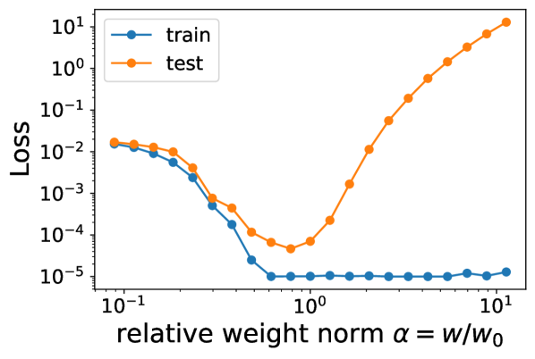

# Initialization scale

[Weight-norm minimization (the zero-loss manifold)](weight-norm-minimization.md) ← previous card, next → [When regularisation is necessary](regularization-necessity.md)

[Concept card index](index.md), category: [4. Training and optimisation factors](index.md#cat-4)\
→ Next category: [Grokfast / gradient low-pass filtering](gradient-low-pass-filtering.md)\
← Previous category: [Modular arithmetic](modular-arithmetic.md)

## Definition

**The initialization scale** is the magnitude (norm) of a network's weights at the initial moment of training, usually set by a factor α applied to the standard initialization scheme. Liu et al. ("Omnigrok", 2023) established that a large enough initialization scale induces [grokking](grokking.md) (a sharp delayed generalisation), while a small scale removes it: if the initialization scale is increased explicitly or implicitly, grokking appears \[[1.1](#ref-1-1)\].

## Elaboration

The mechanism, according to Omnigrok, is the "LU mechanism": if the (reduced) training and test losses are plotted as functions of the weight norm, they take the shapes of the letters "L" and "U" respectively, and between them lies a **[Goldilocks zone](goldilocks-zone.md)** (a narrow range of the weight norm w ≈ wc where generalisation is best) \[[1.1](#ref-1-1)\]. Standard initialization schemes land inside the zone (w ≤ wc), while a large scale carries the weights out into the overfitting region (w > wc); **[weight decay](weight-decay.md)** (an L2 penalty pulling the weight norm towards zero) then slowly brings the weights back to the Goldilocks zone, and generalisation sets in with a long delay — after the [memorisation phase](memorization-phase.md) is already over. It is precisely this protracted drift of the weight norm that, according to Liu et al., explains the delayed generalisation characteristic of grokking.

An alternative mechanistic reading (Kumar et al., 2023) redefines the initialization scale as a **control parameter** of the transition from "lazy" training (the regime where the weights barely change and the network is, in terms of the [neural tangent kernel](neural-tangent-kernel-ntk.md) (NTK), equivalent to a linear model) to "rich" training (the regime of active feature learning): grokking arises when a network that started in the lazy regime first fits the kernel solution over the initial features and only later switches to [feature learning](feature-emergence-feature-learning.md) and finds a generalising solution \[[1.2](#ref-1-2)\]. In this picture the initialization scale sets the rate of feature learning (the degree of "laziness") rather than the distance to the Goldilocks zone; Kumar et al. tie the dynamics of grokking to [double descent](double-descent.md) (the non-monotone dependence of the error on capacity or on training time).

The works that joined the discussion refine different sides of the notion. On the small-scale side: reducing the scale (moving towards the kernel regime) mitigates grokking in regression \[[3.4](#ref-3-4)\], while a zero initialization of the top layer even accelerates feature learning \[[3.6](#ref-3-6)\]; the spectral angle explains this through the [frequency principle](frequency-principle-spectral-bias.md) — under a small initialization the network learns the data from low frequencies to high ones \[[3.1](#ref-3-1)\]. On the large-scale side: it reproduces grokking in deep MLPs \[[3.2](#ref-3-2)\] and even in an LSTM on [real-world data](vision-real-world-data-mnist-cifar.md) \[[3.3](#ref-3-3)\], enhances the synergistic [emergent phase](emergence.md) \[[3.5](#ref-3-5)\] and, analytically, together with the [learning rate](learning-rate.md), provably produces grokking curves with arbitrarily long plateaus \[[3.7](#ref-3-7)\]. Notsawo et al., however, contest the sufficiency of a large scale: in the over-parameterized regime a large initialization with non-zero weight decay does not necessarily lead to grokking \[[2.1](#ref-2-1)\].

## Alternative definitions and nuances

### A. Scale as the norm of the initial weights (the "L–U" geometry and the Goldilocks zone)

A definition through an order parameter — the **weight norm** w. The control parameter is the ratio of the initial norm to the critical wc of the Goldilocks zone: at w > wc the network starts out in the overfitting region, and the time it takes to return to the zone (through weight decay) sets the delay of generalisation \[[1.1](#ref-1-1)\]. The source of difference: grokking is tied to the **geometry of the [loss landscape](loss-landscape-basins.md)** in the "weight norm" coordinate rather than to the feature-learning regime.

### B. Scale as the control parameter of the lazy/rich regime

A definition through the **rate of feature learning**: the scale, which sets the magnitude of the network's output, governs the "laziness", and grokking is a delayed [lazy→rich](lazy-to-rich-kernel-to-feature-learning.md) transition \[[1.2](#ref-1-2)\]. The key conditions according to Kumar et al.: (1) a mismatch between the top eigenvectors of the initial NTK and the target labels, and (2) a start in the lazy regime. The source of difference: the control parameter is not the distance to the Goldilocks zone but the pace of the transition from linear to feature dynamics.

### Contested

- **A large scale is not sufficient for grokking** \[[2.1](#ref-2-1)\]: in the over-parameterized regime (N < n) under L2 regularisation alone the sharp transition of the generalisation error is governed by the weight norm, but a large initialization with weight decay does not by itself guarantee grokking, and the transition may not even converge to the optimal solution. The source of difference: causality shifts from the initialization scale to the character of the regularisation.

### In support

- **The spectral (frequency) angle** \[[3.1](#ref-3-1)\]: a small scale switches on the frequency principle (learning from low frequencies to high ones) as the source of delayed generalisation. The source of difference: the scale is tied to the order in which the frequencies are mastered rather than to the weight norm.
- **The kernel→rich transition** \[[3.4](#ref-3-4)\]: reducing the scale mitigates grokking by holding the network in the kernel regime (in terms of the empirical NTK). The source of difference: the scale is read as a lever between kernel and feature learning.
- **Zero initialization** \[[3.6](#ref-3-6)\]: an extremely small scale of the top layer accelerates feature learning — a mechanism opposite to a large initialization. The source of difference: the effect of the scale is derived from the structure of the signal's gradient.
- **A large scale outside algorithmic tasks** \[[3.2](#ref-3-2)\]\[[3.3](#ref-3-3)\]: a large initialization reproduces grokking in deep MLPs and in an LSTM on real-world data. The source of difference: the scale is a universal trigger of grokking, one not tied to modular arithmetic.
- **The emergent phase** \[[3.5](#ref-3-5)\]: the weight initialization (together with weight decay) enhances the synergistic emergent phase. The source of difference: the scale is assessed through information-theoretic measures of neuron synergy.
- **An analytical derivation of the plateau** \[[3.7](#ref-3-7)\]: the size of the initialization together with the learning rate provably produces grokking plateaus of arbitrary length. The source of difference: the scale enters as a conditioning parameter of the gradient matrices in a solvable model.

## References

###### ref-1-1
**\[1.1\]** 2210.01117 — Liu et al., "Omnigrok: Grokking Beyond Algorithmic Data". [`"if we increase initialization scales (explicitly or implicitly), grokking can appear"`](../papers/2210.01117.omnigrok-grokking-beyond-algorithmic-data/original/2210.01117.omnigrok-grokking-beyond-algorithmic-data.md#p3-3).\
Also (the mechanism): [`"identifying the mismatch between training and test loss landscapes as the cause for grokking. We refer to this as the "LU mechanism""`](../papers/2210.01117.omnigrok-grokking-beyond-algorithmic-data/original/2210.01117.omnigrok-grokking-beyond-algorithmic-data.md#p1-3).

###### ref-1-2
**\[1.2\]** 2310.06110 — Kumar et al., "Grokking as the Transition from Lazy to Rich Training Dynamics". [`"the transition from lazy training to a rich, feature learning regime, and can be tuned by parameters that control this transition"`](../papers/2310.06110.grokking-as-the-transition-from-lazy-to-rich-training-dynamics/original/2310.06110.grokking-as-the-transition-from-lazy-to-rich-training-dynamics.md#p2-4).\
Also (control of grokking): [`"this transition from lazy (linear model) to rich training (feature learning) can control grokking in more general settings"`](../papers/2310.06110.grokking-as-the-transition-from-lazy-to-rich-training-dynamics/original/2310.06110.grokking-as-the-transition-from-lazy-to-rich-training-dynamics.md#p1-3).

###### ref-1-3
**\[1.3\]** 2310.02541 — Xu et al. 2023. Nuance: (A5) is the only assumption that sets the timescale; the authors read it directly as "the step size is large relative to the initialization scale". An experiment with a reduced step size at the same $\omega_{\text{init}}$ stretches the delay to roughly $10^{3}$ steps, but lies outside the scope of the theorem. [`"Assumption (A5) ensures that the step size is large relative to the initialization scale so that the behavior of the network after a single step of GD is significantly different from that at random initialization"`](../papers/2310.02541.benign-overfitting-and-grokking-in-relu-networks-for-xor-cluster-data/original/2310.02541.benign-overfitting-and-grokking-in-relu-networks-for-xor-cluster-data.md#p6-2).

###### ref-1-4
**\[1.4\]** 2211.12316 — Bhattamishra et al., "Simplicity Bias in Transformers and their Ability to Learn Sparse Boolean Functions". Nuance: the gap between the architectures in the complexity of a random function is large under a wide sampling of the weights ($[-10,10]$, Gaussian with $\sigma=10$) and shrinks to "relatively lower" under Xavier normal/uniform, that is, at the working point. [`"The distribution for Transformers is heavily skewed towards functions of very low sensitivity in comparison to LSTMs."`](../papers/2211.12316.simplicity-bias-in-transformers-and-their-ability-to-learn-sparse-boolean-functions/2211.12316.simplicity-bias-in-transformers-and-their-ability-to-learn-sparse-boolean-functions.card.md#p5-1).\
Also (the counting experiment on Parity): [`"it is over **60,000** times more likely to find Parity function by sampling LSTMs than randomly sampling Boolean functions"`](../papers/2211.12316.simplicity-bias-in-transformers-and-their-ability-to-learn-sparse-boolean-functions/2211.12316.simplicity-bias-in-transformers-and-their-ability-to-learn-sparse-boolean-functions.card.md#p15-3).

###### ref-1-5
**\[1.5\]** 2406.06158 — Kunin et al., "Get rich quick: exact solutions reveal how unbalanced initializations promote rapid feature learning". Nuance: the map of regimes is built along two axes at once — the overall scale $\tau$ and the relative one $\delta$ — and at one and the same small overall scale the relative one still moves the network between lazy and rich; a downstream initialization at a small scale turns out to be lazy. The practical lever is the same in every experiment: the initialization of the first layer is divided by $\alpha$, that of the last is multiplied by $\alpha$. [`"rapid rich learning happens when *both* $\tau$ is small and $\delta$ is large – an upstream initialization"`](../papers/2406.06158.get-rich-quick-exact-solutions-reveal-how-unbalanced-initializations-promote-rapid-feature-learning/2406.06158.get-rich-quick-exact-solutions-reveal-how-unbalanced-initializations-promote-rapid-feature-learning.card.md#fig-1).\
Also (the introduction of the terms): [`"While a *balanced initialization* results in all layers learning at similar rates, an *unbalanced initialization* can cause faster learning in either earlier layers, referred to as an *upstream initialization*, or later layers, referred to as a *downstream initialization*."`](../papers/2406.06158.get-rich-quick-exact-solutions-reveal-how-unbalanced-initializations-promote-rapid-feature-learning/2406.06158.get-rich-quick-exact-solutions-reveal-how-unbalanced-initializations-promote-rapid-feature-learning.card.md#p2-2).
## References of works that joined the discussion

### Contested

###### ref-2-1
**\[2.1\]** 2506.05718 — Notsawo et al., "Grokking Beyond the Euclidean Norm of Model Parameters". Contests: in the over-parameterized regime a large initialization scale with non-zero weight decay does not necessarily give grokking. [`"Contrary to prior studies (Lyu et al., 2023; Liu et al., 2023a), we find that in the over-parameterized regime (N < n), large-scale initialization and non-zero weight decay do not necessarily lead to grokking"`](../papers/2506.05718.grokking-beyond-the-euclidean-norm-of-model-parameters/original/2506.05718.grokking-beyond-the-euclidean-norm-of-model-parameters.md#p7-4).

###### ref-2-2
**\[2.2\]** 2310.16441 — Levi et al. 2023. Nuance: in the linear model the initialization scale is not an independent lever but a substitution of $\epsilon$; this is a direct narrowing of the Omnigrok picture. Caveat: the list of contributions of that same paper claims the opposite — that the initialization increases the grokking time (examined in the "Points we could not reconcile" section of that paper's card). [`"which is tantamount to choosing a different threshold parameter $\epsilon\to\frac{2\epsilon}{1+\alpha^{2}}$, leaving the results unchanged"`](../papers/2310.16441.grokking-in-linear-estimators-a-solvable-model-that-groks-without-understanding/original/2310.16441.grokking-in-linear-estimators-a-solvable-model-that-groks-without-understanding.md#p6-4).

###### ref-2-3
**\[2.3\]** 2408.11804 — Yunis et al., "Approaching Deep Learning through the Spectral Dynamics of Weights". A negative result against the theory of deep linear networks: the assumption of a balanced initialization does not hold in large practical networks either at the start or statically over the course of training — only a weak alignment signal develops in the top ranks. Indirectly relevant here is an observation from the LMC experiments: the top singular directions depend on the initialization, not on the architecture and the data alone. The paper does not sweep the initialization scale as a lever. [`"does not hold true at the start of training in these larger networks"`](../papers/2408.11804.approaching-deep-learning-through-the-spectral-dynamics-of-weights/original/2408.11804.approaching-deep-learning-through-the-spectral-dynamics-of-weights.md#p7-4).\
Also: [`"the rank minimization mechanism may differ from what the theory describes"`](../papers/2408.11804.approaching-deep-learning-through-the-spectral-dynamics-of-weights/original/2408.11804.approaching-deep-learning-through-the-spectral-dynamics-of-weights.md#p2-4).

###### ref-2-4
**\[2.4\]** 2506.23286 — Jeffares & van der Schaar, "Not All Explanations for Deep Learning Phenomena Are Equally Valuable". Nuance: there is no sweep of the scale in the paper; the value is taken from other people's works and from the defaults of third-party code, and the $Unif$ initialization surfaces only in the appendix, in the debunking of a parodic measure. [`"this is synthetically produced using a greatly inflated initialization scale of the network parameters"`](../papers/2506.23286.not-all-explanations-for-deep-learning-phenomena-are-equally-valuable/original/2506.23286.not-all-explanations-for-deep-learning-phenomena-are-equally-valuable.md#p4-1).

###### ref-2-5
**\[2.5\]** 2606.13753 — Truong et al. 2026, "The Weight Norm Sets the Grokking Timescale: A Causal Delay Law". Sets a direct experiment against the weight reading of Omnigrok: a downward rescaling of the initial weights followed by free training is washed out — the norm relaxes back towards $\Vert W\Vert_{c}$, and grokking proceeds on the free schedule. This follows directly from the delay law: what matters is not the initial norm but the norm at which the dynamics runs, and only a sustained hold can change it. The same argument closes off a one-off push in either direction ($1.2\times$ over the interval $\rho\in[0.70,1.30]$). Nuance: the experiment is set on modular addition with an MLP, the values of the rescaling factor are not given in the text, and about large initial norms — the very case for which the notion was introduced — the paper says nothing. [`"An *Omnigrok-style* low-norm initialization (rescaling the initial weights, then training freely) is washed out: the norm relaxes back toward $\|W\|_{c}$ and grokking occurs on the free timescale rather than being accelerated by the low start"`](../papers/2606.13753.the-weight-norm-sets-the-grokking-timescale-a-causal-delay-law/2606.13753.the-weight-norm-sets-the-grokking-timescale-a-causal-delay-law.card.md#p7-1).\
Also (what does act, then): [`"only a *sustained* hold changes the timescale"`](../papers/2606.13753.the-weight-norm-sets-the-grokking-timescale-a-causal-delay-law/2606.13753.the-weight-norm-sets-the-grokking-timescale-a-causal-delay-law.card.md#fig-4).
### In support

###### ref-3-1
**\[3.1\]** 2405.17479 — Zhou et al., "A rationale from frequency perspective for grokking in training neural network". Nuance: under a small initialization the network obeys the frequency principle and learns from low frequencies to high ones. [`"With common (small) initialization, NNs adhere to the frequency principle (F-Principle) that they often learn data from low to high frequencies"`](../papers/2405.17479.a-rationale-from-frequency-perspective-for-grokking-in-training-neural-network/2405.17479.a-rationale-from-frequency-perspective-for-grokking-in-training-neural-network.card.md#p1-6).

###### ref-3-2
**\[3.2\]** 2405.19454 — Fan, Pascanu, Jaggi 2024, "Deep Grokking: Would Deep Neural Networks Generalize Better?". Nuance: reproduces grokking in deep networks through a large initialization and a small weight decay (following the scheme of Liu et al.). [`"We apply large initialization and small weight decay to reproduce grokking, mimicking the set-up of Liu et al. (2023)"`](../papers/2405.19454.deep-grokking-would-deep-neural-networks-generalize-better/2405.19454.deep-grokking-would-deep-neural-networks-generalize-better.card.md#p2-1).

###### ref-3-3
**\[3.3\]** 2405.20233 — Lee et al., "Grokfast: Accelerated Grokking by Amplifying Slow Gradients". Nuance: even an LSTM groks if training starts from larger initial weights. [`"LSTM exhibits grokking phenomenon if the training begins with larger weight values at initialization"`](../papers/2405.20233.grokfast-accelerated-grokking-by-amplifying-slow-gradients/2405.20233.grokfast-accelerated-grokking-by-amplifying-slow-gradients.card.md#fig-11).

###### ref-3-4
**\[3.4\]** 2407.12332 — Mohamadi et al., "A Theoretical Analysis of Grokking Modular Addition". Nuance: reducing the initialization scale (a shift towards the kernel regime) mitigates grokking in the regression task. [`"Shrinking the scale of initialization can mitigate grokking in the regression task"`](../papers/2407.12332.why-do-you-grok-a-theoretical-analysis-of-grokking-modular-addition/original/2407.12332.why-do-you-grok-a-theoretical-analysis-of-grokking-modular-addition.md#fig-2).

###### ref-3-5
**\[3.5\]** 2408.08944 — Clauw, Stramaglia, Marinazzo 2024, "Information-Theoretic Progress Measures reveal Grokking is an Emergent Phase Transition". Nuance: the weight initialization enhances the emergent phase of grokking. [`"We show that weight decay and weight initialization can enhance the emergent phase"`](../papers/2408.08944.information-theoretic-progress-measures-reveal-grokking-is-an-emergent-phase-transition/original/2408.08944.information-theoretic-progress-measures-reveal-grokking-is-an-emergent-phase-transition.md#p1-2).

###### ref-3-6
**\[3.6\]** 2509.21519 — Tian, "From Learning Dynamics of Grokking". Nuance: a zero initialization of the top layer (an extremely small scale) accelerates feature learning. [`"zero-init accelerates the feature learning process compared to normal initialization"`](../papers/2509.21519.provable-scaling-laws-of-feature-emergence-from-learning-dynamics-of-grokking/original/2509.21519.provable-scaling-laws-of-feature-emergence-from-learning-dynamics-of-grokking.md#p4-9).

###### ref-3-7
**\[3.7\]** 2510.04930 — Saheb Pasand et al., "Egalitarian Gradient Descent: A Simple Approach to Accelerated Grokking". Nuance: the size of the initialization together with the learning rate provably produces grokking plateaus. [`"size of initialization) interact to provably produce grokking curves with arbitrarily long plateaus"`](../papers/2510.04930.egalitarian-gradient-descent-a-simple-approach-to-accelerated-grokking/original/2510.04930.egalitarian-gradient-descent-a-simple-approach-to-accelerated-grokking.md#p4-4).

###### ref-3-8
**\[3.8\]** 2311.18817 — Lyu et al., "Dichotomy of Early and Late Phase Implicit Biases Can Provably Induce Grokking". Supports: the initialization scale sets the time of the transition logarithmically, $t^{ * }=\frac{1}{\lambda}\log\alpha$. Nuance: $\alpha$ multiplies the He initialization, the baseline run goes at $\alpha=1$, and the authors make no claim that the standard scale is already large; under a large initialization the second layer is zeroed out to remove an instability. [`"Results in Figure 2 show that the sharp transition in test accuracy is delayed when $\alpha$ increases from $1$ to $100$."`](../papers/2311.18817.dichotomy-of-early-and-late-phase-implicit-biases-can-provably-induce-grokking/original/2311.18817.dichotomy-of-early-and-late-phase-implicit-biases-can-provably-induce-grokking.md#p3-7).\
Also (the setup of the experiment): [`"To remove this confounding factor, we set the weights ${\boldsymbol{W}}_{2}$ in the second layer to ${\boldsymbol{0}}$ so that the initial model output is always $0$."`](../papers/2311.18817.dichotomy-of-early-and-late-phase-implicit-biases-can-provably-induce-grokking/original/2311.18817.dichotomy-of-early-and-late-phase-implicit-biases-can-provably-induce-grokking.md#p3-7).

###### ref-3-9
**\[3.9\]** 2402.15555 — Humayun, Balestriero, Baraniuk 2024, "Deep Networks Always Grok and Here is Why". Pushes off from the device of Liu et al. 2022: the main claim is that delayed robustness is visible **without** increasing the norm of the initial weights. The device is nevertheless reproduced as a separate setup (a factor of 8), and a side observation is made there: under a scaled initialization the first descent of LC disappears. Nuance: the paper contains no sweep of the factor and no dependence on it. [`"We induce grokking by randomly initializing a $4$ depth $200$ width ReLU MLP and scaling the initialized parameters by eight following (Liu et al. 2022)."`](../papers/2402.15555.deep-networks-always-grok-and-here-is-why/original/2402.15555.deep-networks-always-grok-and-here-is-why.md#fig-7).\
Also: [`"when grokking is induced in the MLP-MNIST case with scaled initialization, we do not see the first descent"`](../papers/2402.15555.deep-networks-always-grok-and-here-is-why/original/2402.15555.deep-networks-always-grok-and-here-is-why.md#p7-2).

###### ref-3-10
**\[3.10\]** 2401.10463 — Zhu et al. 2024. Nuance: the rescaling equation is taken from Omnigrok verbatim, and the factor serves as the first of two levers of delay; only two values are swept, however (5 and 10), and for modular addition the declared $\alpha=0$ would, by that same equation, zero out all the weights — examined in the "Points we could not reconcile" section of that paper's card. [`"huge initialization $\alpha$ and small weight decay $\gamma$ leads to a delay generalization, i.e., grokking"`](../papers/2401.10463.critical-data-size-of-language-models-from-a-grokking-perspective/2401.10463.critical-data-size-of-language-models-from-a-grokking-perspective.card.md#p4-5).\
Also (the origin of the device): [`"the approach of rescaling initialization (Eq. 2) is derived from Omnigrok [7]"`](../papers/2401.10463.critical-data-size-of-language-models-from-a-grokking-perspective/2401.10463.critical-data-size-of-language-models-from-a-grokking-perspective.card.md#p16-3)

###### ref-3-11
**\[3.11\]** 2505.20172 — Boursier et al., "A Theoretical Framework for Grokking: Interpolation followed by Riemannian Norm Minimisation". Supports: the role of the scale is derived rather than postulated — under a small initialization the point reached after the first phase already has a small norm and the second phase does not happen, while under a large one it is precisely what gives rise to grokking. Nuance: not a single experiment sweeps the scale; in the experiments it is fixed (Gaussian weights with variance $4$ for the ReLU network, $0.1$ for the diagonal one). [`"Conversely, with a large initialisation scale, $\Phi(w^{\lambda}(0))$ retains a large norm, which triggers substantial movement during the second, grokking phase."`](../papers/2505.20172.a-theoretical-framework-for-grokking-interpolation-followed-by-riemannian-norm-minimisation/2505.20172.a-theoretical-framework-for-grokking-interpolation-followed-by-riemannian-norm-minimisation.card.md#p7-12).

###### ref-3-12
**\[3.12\]** 2411.00247 — Jeffares, Curth, van der Schaar, "Deep Learning Through A Telescoping Lens: A Simple Model Provides Empirical Insights On Grokking, Gradient Boosting & Beyond". Supports the role of the initialization scale as a lever and adds a measurable consequence: the better the inductive bias (a small initialization, and then a sigmoid on top of it), the fewer effective parameters are used and the sooner generalisation sets in. Nuance: the guess was voiced before the experiment and confirmed, but intermediate scales were not swept, and the contributions of "a large norm" and "no sigmoid" are not separated. [`"large $\boldsymbol{\theta}_{0}$ thus constitute a very poor inductive bias for this task"`](../papers/2411.00247.deep-learning-through-a-telescoping-lens-a-simple-model-provides-empirical-insights-on-grokking-gradient-boosting-and-beyond/original/2411.00247.deep-learning-through-a-telescoping-lens-a-simple-model-provides-empirical-insights-on-grokking-gradient-boosting-and-beyond.md#p6-1).\
Also (the size of the speed-up): [`"a generalizing solution is found in $10^{2}$ instead of $10^{5}$ steps"`](../papers/2411.00247.deep-learning-through-a-telescoping-lens-a-simple-model-provides-empirical-insights-on-grokking-gradient-boosting-and-beyond/original/2411.00247.deep-learning-through-a-telescoping-lens-a-simple-model-provides-empirical-insights-on-grokking-gradient-boosting-and-beyond.md#p6-1).

###### ref-3-13
**\[3.13\]** 2505.15624 — AlQuabeh, Bojković, Nwadike, Inui, "Mechanistic Insights into Grokking from the Embedding Layer". Gives the initial approximation a role inside the bilinear pair: under the PyTorch initialization $\sigma_{\max}(\mathbf{E})\gg\sigma_{\max}(\mathbf{W})$, and it is precisely this inequality that stands in the rule for the ratio of the learning rates. It also joins the ordinary reading: small initial embeddings improve convergence. Nuance: the two trials (frozen and small initial embeddings) are covered in a single sentence — the paper has no curves, no numbers and no sweep over the initialization scale. [`"This initialization typically ensures $\sigma_{\max}(\mathbf{E})\gg\sigma_{\max}(\mathbf{W})$, as $\mathbf{W}$ is higher-dimensional, amplifying the difference in gradient magnitudes."`](../papers/2505.15624.mechanistic-insights-into-grokking-from-the-embedding-layer/original/2505.15624.mechanistic-insights-into-grokking-from-the-embedding-layer.md#p13-5).\
Also (the two trials covered in a single sentence): [`"we tested two setups: frozen embeddings, which led to slow convergence due to limited representational flexibility; and small initial embeddings, which improved convergence by allowing stronger early gradients"`](../papers/2505.15624.mechanistic-insights-into-grokking-from-the-embedding-layer/original/2505.15624.mechanistic-insights-into-grokking-from-the-embedding-layer.md#p8-3).

###### ref-3-14
**\[3.14\]** 2310.12977 — Humayun, Balestriero, Baraniuk 2023, "Training Dynamics of Deep Network Linear Regions". Shows that an increased norm of the initial weights changes not only the quality curves but also the geometry of the partition: at a factor of 8 the first descent of the local complexity all but disappears, and the rise proceeds from the very beginning of training. Nuance: there is no sweep of the factor and no setup without the device — grokking without scaling appears only in 2402.15555. [`"Following Liu et al. 2022, we induce grokking by scaling the weights of a fully connected DN by $8$ at initialization."`](../papers/2310.12977.training-dynamics-of-deep-network-linear-regions/original/2310.12977.training-dynamics-of-deep-network-linear-regions.md#p8-2).\
Also (the effect of depth in this setup): [`"We also see that increasing depth delays generalization, as well as makes LC drop faster during the second descent phase."`](../papers/2310.12977.training-dynamics-of-deep-network-linear-regions/original/2310.12977.training-dynamics-of-deep-network-linear-regions.md#p8-2).

###### ref-3-15
**\[3.15\]** 2605.09724 — Song & Ye, "Model Capacity Determines Grokking through Competing Memorisation and Generalisation Speeds". Nuance: the growth is set by a single prime $p=139$; the authors' explanation ("an under-trained corner") is a conjecture, not separately verified. [`"Within init_scale$=0.5$ the residual variance is markedly larger"`](../papers/2605.09724.model-capacity-determines-grokking-through-competing-memorisation-and-generalisation-speeds/original/2605.09724.model-capacity-determines-grokking-through-competing-memorisation-and-generalisation-speeds.md#p16-1).

###### ref-3-16
**\[3.16\]** 2506.12284 — Walker et al., "GrokAlign: Geometric Characterisation and Acceleration of Grokking". Translates the lever of Liu et al. into the language of Jacobians: a large initial weight norm means Jacobians of large norm, and those do not align — hence the delay; with that same lever the paper also slows grokking down, increasing the scale of the weights at initialization. Appendix B adds a trade-off: the rate of change of the inner product can be increased by scaling the weights or the output, but the same scaling also increases the norm of the centroid. Nuance: the experiments give no values of the initial scale, they are delegated to the reference to Liu et al.; across the whole sweep of appendix B the largest observed alignment is negative (on a scale from −0.3 to −0.7), and the text does not say so. [`"From our perspective this results in Jacobians with large norm, inhibiting their alignment."`](../papers/2506.12284.grokalign-geometric-characterisation-and-acceleration-of-grokking/original/2506.12284.grokalign-geometric-characterisation-and-acceleration-of-grokking.md#p9-1).\
Also (the other side of the lever): [`"we consider a fully connected network and scale up its weights at initialisation to increase the Jacobian norms, much like Liu et al. [6]"`](../papers/2506.12284.grokalign-geometric-characterisation-and-acceleration-of-grokking/original/2506.12284.grokalign-geometric-characterisation-and-acceleration-of-grokking.md#p8-2)\
Also (the link to the linear regime): [`"such scaling is known to increase the propensity of the network maintaining a linear learning regime"`](../papers/2506.12284.grokalign-geometric-characterisation-and-acceleration-of-grokking/original/2506.12284.grokalign-geometric-characterisation-and-acceleration-of-grokking.md#p16-1).
###### ref-3-17
**\[3.17\]** 2502.01739 — Manning-Coe, Gliozzi, Stapleton, Hirst, De Tomasi, Bradlyn & Berman 2025, "Grokking vs. Learning: Same features, different encodings". The weight factor at initialization is the load-bearing support of the whole paper: the single knob that switches between grokking and smooth learning at unchanged data, architecture and regularisation, which is what makes a comparison of the final models of the two paths possible. [`"we induce grokking by simply multiplying the initialization weights by a scale factor $w_{0}$, favouring overfitting during training"`](../papers/2502.01739.grokking-vs-learning-same-features-different-encodings/original/2502.01739.grokking-vs-learning-same-features-different-encodings.md#p3-8).\
Also (the thresholds): [`"grokking sets approximately at $w_{0}=3$ for the Ising task, and $w_{0}=0.4$ for the modular addition task"`](../papers/2502.01739.grokking-vs-learning-same-features-different-encodings/original/2502.01739.grokking-vs-learning-same-features-different-encodings.md#p3-8).

###### ref-3-18
**\[3.18\]** 2509.10562 — Lopatin, Kozyrev & Pechen 2025, "Predator–Prey Model: Driven Hunt for Accelerated Grokking". The grokking time is measured as growing linearly with the initial weight norm (averaging over hypercubes of random initializations, a method taken from quantum-control landscapes); the baseline times are declared to depend strongly on the initialization. [`"This number of iterations is strongly influenced by the initial initialization, in particular by the initial weight norm of the model"`](../papers/2509.10562.predator-prey-model-driven-hunt-for-accelerated-grokking/2509.10562.predator-prey-model-driven-hunt-for-accelerated-grokking.card.md#p4-1)..

###### ref-3-19
**\[3.19\]** 2605.04396 — Ali 2026, "Critical Windows of Complexity Control: When Transformers Decide to Reason or Memorize". A correction to the recipe "the smaller the initialization the better" (Zhang et al.): on the anchor task the OOD peak lies at a moderate $\gamma{=}0.8$, and a direct count over 12 seeds shows a narrowing of the basin of the reasoning solution at small $\gamma$ — $12/12$ seeds at $\gamma{=}1.1$ against $8/12$ at $\gamma{=}0.5$, where four failures fall to chance; the theoretical support is the growth rate of the reasoning path $\mu_{r}=c_{r}\gamma^{2}\sigma_{e}$ against a $\gamma$-independent memorisation rate, whence a sweet spot in $\gamma$ at finite $T$. Nuance: the claimed shift of the window's position with $\gamma$ is not shown experimentally — only the height of the plateau differs. [`"while the reasoning solution *exists* at small $\gamma$ (some seeds reach OOD $\geq 0.99$), the basin of attraction surrounding it is narrow"`](../papers/2605.04396.critical-windows-of-complexity-control-when-transformers-decide-to-reason-or-memorize/original/2605.04396.critical-windows-of-complexity-control-when-transformers-decide-to-reason-or-memorize.md#p22-2).\
Also (the theoretical grounding): [`"For fixed compute budget $T$, Theorem 6 predicts a sweet spot in $\gamma$"`](../papers/2605.04396.critical-windows-of-complexity-control-when-transformers-decide-to-reason-or-memorize/original/2605.04396.critical-windows-of-complexity-control-when-transformers-decide-to-reason-or-memorize.md#p14-6).
## Passing mentions

Works that only mention the phenomenon — a literature review, a related-work paragraph, a passing citation — without examining it.

**\[4.1\]** 2301.02679 — Gromov, "Grokking modular arithmetic". [`"[8] studied grokking for non-algorithmic datasets and its dependence on the initialization"`](../papers/2301.02679.grokking-modular-arithmetic/2301.02679.grokking-modular-arithmetic.card.md#p2-4).

**\[4.2\]** 2306.13253 — Notsawo et al., "Predicting Grokking Long Before it Happens". [`"Optimization hyper-parameters and initialization strongly affect training dynamics during the above phases"`](../papers/2306.13253.predicting-grokking-long-before-it-happens/original/2306.13253.predicting-grokking-long-before-it-happens.md#p1-4).

**\[4.3\]** 2504.13292 — Xu et al., "Let Me Grok For You: Accelerating Grokking via Embedding Transfer from a Weaker Model". [`"Liu et al. (2023) attributed grokking to large initialization scale and induced grokking on real-world datasets such as MNIST and IMDb"`](../papers/2504.13292.let-me-grok-for-you-accelerating-grokking-via-embedding-transfer-from-a-weaker-model/original/2504.13292.let-me-grok-for-you-accelerating-grokking-via-embedding-transfer-from-a-weaker-model.md#p2-4).

**\[4.4\]** 2507.11645 — Salah & Yevick, "Tracing the Path to Grokking: Embeddings, Dropout, and Network Activation". [`"Liu et al. and Fan et al. [2, 8], demonstrated that multiplying the initial weights of the neural network by a scale factor can lead to or increase the magnitude of grokking"`](../papers/2507.11645.tracing-the-path-to-grokking-embeddings-dropout-and-network-activation/original/2507.11645.tracing-the-path-to-grokking-embeddings-dropout-and-network-activation.md#p2-2).

**\[4.5\]** 2510.25966 — Hutchison & Yevick, "Grokking in the Ising Model". [`"increasing the weight decay or decreasing the initialization amplitude reduces the delay and hence improves generalization"`](../papers/2510.25966.grokking-in-the-ising-model/original/2510.25966.grokking-in-the-ising-model.md#p2-2).

**\[4.6\]** 2601.03162 — Jiang et al., "On the Convergence Behavior of Preconditioned Gradient Descent Toward the Rich Learning Regime". [`"This inherent inductive bias arises from the interplay between architecture, initialization, and gradient dynamics"`](../papers/2601.03162.on-the-convergence-behavior-of-preconditioned-gradient-descent-toward-the-rich-learning-regime/2601.03162.on-the-convergence-behavior-of-preconditioned-gradient-descent-toward-the-rich-learning-regime.card.md#p2-5).

**\[4.7\]** 2601.19791 — Xu et al., "To Grok Grokking: Provable Grokking in Ridge Regression". [`"training a student linear model using randomly initialized GD, on a squared loss objective"`](../papers/2601.19791.to-grok-grokking-provable-grokking-in-ridge-regression/original/2601.19791.to-grok-grokking-provable-grokking-in-ridge-regression.md#p2-2).

**\[4.9\]** 2207.08799 — Barak et al., "Hidden Progress in Deep Learning: SGD Learns Parities Near the Computational Limit". Nuance: the spread of convergence times is generated by the initialization rather than by the trajectory; the controlling quantity here is the distribution (uniform / Gaussian / Bernoulli) rather than the scale — which is taken by the standard convention. [`"loss curves and convergence times are highly correlated with the architecture’s random initialization, and are quite concentrated conditioned on initialization"`](../papers/2207.08799.hidden-progress-in-deep-learning-sgd-learns-parities-near-the-computational-limit/2207.08799.hidden-progress-in-deep-learning-sgd-learns-parities-near-the-computational-limit.card.md#p6-6).

**\[4.10\]** 2405.12755 — Golechha 2024, "Progress Measures for Grokking on Real-world Tasks". Reproduces the device of Liu et al. 2022b unchanged: an initialization scale of 8.0 with 1000 training examples (table 1) — which is what induces grokking on MNIST here. Nuance: there is no sweep of the scale, no dependence on it, and no check of whether what is shown survives under an ordinary initialization; a comparison with the Omnigrok caveat that cross-entropy needs a scale of around $\alpha=100$ is likewise absent from the paper. [`"This was first observed by Liu et al. 2022b, where they found that by training a model using weight decay and starting with a high weight initialization, grokking can be observed on real-world datasets (such as MNIST (Deng 2012))."`](../papers/2405.12755.progress-measures-for-grokking-on-real-world-tasks/original/2405.12755.progress-measures-for-grokking-on-real-world-tasks.md#p2-3).

**\[4.11\]** 2507.20057 — Lyle et al., "What Can Grokking Teach Us About Learning Under Nonstationarity?". The initial norm of the parameters is named as one of three quantities that set the regime of the dynamics at initialization, and appendix C carries this through to an estimate: under a scaling of the first layer by $\alpha$ the rotation of the features goes as $1/\sqrt{1+(\eta^{2}/\alpha^{2})\sigma_{g}^{2}}$, and the probability of a ReLU neuron switching its activity as $\tfrac{1}{2}-\tfrac{1}{\pi}\arctan\tfrac{\alpha^{2}}{\eta\sigma_{g}}$. Nuance: this is a justification rather than a proof (the gradients are modelled by a Gaussian perturbation, the derivation rests on a Stackoverflow answer), and there is no sweep of initialization scales in the experiments — the scale here is held over the course of training rather than set at the start. [`"for large parameter norms, it is necessary to correspondingly increase the learning rate to produce the same effective change in the activation patterns of the representation"`](../papers/2507.20057.what-can-grokking-teach-us-about-learning-under-nonstationarity/original/2507.20057.what-can-grokking-teach-us-about-learning-under-nonstationarity.md#p22-1).

**\[4.12\]** 2605.06352 — Tang et al., "Topological Signatures of Grokking". [`"In this setting, $\alpha$ denotes the initialization scaling factor relative to the default PyTorch initialization rather than the training fractions used in the modular arithmetic experiments."`](../papers/2605.06352.topological-signatures-of-grokking/2605.06352.topological-signatures-of-grokking.card.md#p8-3).

**\[4.13\]** 2502.01774 — Carvalho et al. 2025, "Grokking Explained: A Statistical Phenomenon". [`"we set the learning rate of the models to $10^{-3}$, the weight decay to $10^{-4}$, and have an initialization scale factor of 8"`](../papers/2502.01774.grokking-explained-a-statistical-phenomenon/original/2502.01774.grokking-explained-a-statistical-phenomenon.md#p6-1).

### External works

###### ref-5-1
**\[5.1\]** 2601.21150 — External work (demoted from the corpus): Kvinge et al., "Can Neural Networks Learn Small Algebraic Worlds?". [`"Mathematical world models are sensitive to hyperparameter choice and initialization"`](../externals/2601.21150.can-neural-networks-learn-small-algebraic-worlds/2601.21150.can-neural-networks-learn-small-algebraic-worlds.card.md#p8-1).
