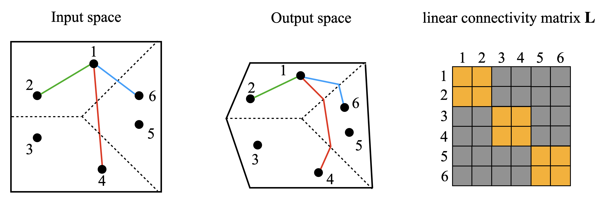

# Kolmogorov complexity

[The Norm-Separation Delay Law](norm-separation-delay-law.md) ← previous card, next → [Criticality and the critical point](criticality-critical-point.md)

[Concept card index](index.md), category: [7. Theory and formal results](index.md#cat-7)\
→ Next category: [Grokking](grokking.md)\
← Previous category: [Progress measures](progress-measures.md)

## Definition

**The Kolmogorov complexity** of an object (in our case, of a trained model) is the length of the minimal program that, on a universal Turing machine, generates a description of that object \[[1.2](#ref-1-2)\]. In work on [grokking](grokking.md) it is introduced as a measure of complexity under which the generalising solution turns out to be "simpler" than the memorising one, so that delayed generalisation is read as the model's descent towards lower Kolmogorov complexity; and since KC itself is uncomputable, computable proxies are proposed for neural networks (for example, the linear mapping number, LMN) \[[1.1](#ref-1-1)\].

## Elaboration

The notion entered the grokking literature from two works of 2023. Miller et al. use Kolmogorov complexity as a unifying formalism for "model complexity": model selection is described as minimising the sum of the error and the complexity, and KC supplies the measure of complexity as the length of the shortest generating program \[[1.2](#ref-1-2)\]. Since exact computation of KC is impossible (the measure is uncomputable — there is no algorithm giving its value for an arbitrary string), approximations are used in practice; in particular, under an assumption of normally distributed weights, the approximate KC turns out to be proportional to the squared weights, so that minimising it coincides with the familiar L2 penalty — that is, with [weight decay](weight-decay.md), the regularisation that penalises the weight norm \[[1.2](#ref-1-2)\]. This directly links Kolmogorov complexity to the [memorisation phase](memorization-phase.md) and the generalisation that follows: a high-complexity memorising solution is gradually displaced by a low-complexity generalising one.

A neighbouring name for the same idea in the corpus is **parsimony** and **minimum description length** (MDL): the preference for a shorter description at equal fit.

Liu et al. carry the same idea over to neural networks directly, calling their proposed linear mapping number (LMN — the number of local linear maps into which the network partitions the input space) "the neural network version of Kolmogorov complexity", since, unlike the L2 norm, LMN admits a natural reading as an amount of information or computation \[[1.1](#ref-1-1)\]. In their setting, grokking is compression: the generalising solution is more efficient (shorter to describe) and therefore appears later than the memorising one; on the XOR task they even observe [double descent](double-descent.md) (a non-monotone dynamics — a renewed decrease of the quantity after a brief rise) in LMN \[[1.1](#ref-1-1)\]. Zhang et al. carry the line through to an analytic formulation: they express KC through the minimum description length principle (MDL — the length of the shortest message encoding the model) and show that the onset of grokking is equivalent to "shedding" algorithmic bits — a continuous decrease of the model's Kolmogorov complexity over the course of training \[[3.1](#ref-3-1)\]. Through the same optics they tie grokking to [emergence](emergence.md) (the sudden appearance of an ability) as a manifestation of Occam's razor.

## Alternative definitions and nuances

### A. The length of the minimal generating program

The classical information-theoretic reading (Miller et al.): the complexity of a model `f` is the length `l(p)` of the shortest program `p` that, on a universal computer `U`, outputs a string representation of the model \[[1.2](#ref-1-2)\]. The distinguishing mark of this formulation is that it makes parsimony (Occam's razor) operational through Solomonoff's theory of inductive inference: of two hypotheses generating the same observation, the more probable is the one with the lower Kolmogorov complexity. In practice the uncomputable KC is replaced by a surrogate — the model description length — and under a normal prior on the weights the approximate KC reduces to the L2 norm, which makes weight decay a special case of complexity minimisation \[[1.2](#ref-1-2)\].

### B. A neural-network proxy: the linear mapping number (LMN)

The computational reading (Liu et al.): in place of the uncomputable KC one takes a concrete measurable quantity — LMN, a generalisation of the number of linear regions of a ReLU network to networks with any (including smooth) activations \[[1.1](#ref-1-1)\]. The distinguishing mark here is the source of the difference from the competing measure L2: LMN counts local or conditioned linear computations and is therefore read directly as an amount of information or computation, and in the compression phase it correlates linearly with the test error, whereas L2 is related to it in a complicated nonlinear way. It is exactly this readability "as information" that makes LMN a candidate for the role of the neural-network version of Kolmogorov complexity \[[1.1](#ref-1-1)\].

### In support

Zhang et al. join the reading of grokking as minimisation of Kolmogorov complexity, but derive it analytically: the KC of a module is formalised through MDL as the bit cost of encoding the topology plus the precision of the weights, and the onset of grokking is proved to be a "shedding" of algorithmic bits — a passage to a solution with lower KC \[[3.1](#ref-3-1)\]. The difference from group 1 is that this is not an empirical proxy but a closed formula tying the geometric complexity of a solution to its algorithmic length.

## References

###### ref-1-1
**\[1.1\]** 2310.05918 — Liu et al., "Grokking as Compression: A Nonlinear Complexity
Perspective". [`"we argue that LMN is a promising candidate as the neural network version of the Kolmogorov complexity, since it explicitly considers local or conditioned linear computations aligned with the nature of modern artificial neural networks"`](../papers/2310.05918.grokking-as-compression-a-nonlinear-complexity-perspective/original/2310.05918.grokking-as-compression-a-nonlinear-complexity-perspective.md#p1-2).\
Also: [`"(1) LMN can be naturally interpreted as information/computation, while $L_{2}$ cannot"`](../papers/2310.05918.grokking-as-compression-a-nonlinear-complexity-perspective/original/2310.05918.grokking-as-compression-a-nonlinear-complexity-perspective.md#p1-2).

###### ref-1-2
**\[1.2\]** 2310.17247 — Miller, O'Neill, Bui 2024, "Grokking Beyond Neural
Networks: An Empirical Exploration with Model Complexity". [`"we measure the complexity as the length of the minimal program required to generate a given model"`](../papers/2310.17247.grokking-beyond-neural-networks-an-empirical-exploration-with-model-complexity/2310.17247.grokking-beyond-neural-networks-an-empirical-exploration-with-model-complexity.card.md#p2-3).\
Also: [`"Essentially, the Kolmogorov complexity is the length of the minimal program required to produce a string representation of a model"`](../papers/2310.17247.grokking-beyond-neural-networks-an-empirical-exploration-with-model-complexity/2310.17247.grokking-beyond-neural-networks-an-empirical-exploration-with-model-complexity.card.md#p16-3); [`"by minimising the approximate Kolmogorov complexity under the assumption of normality, we also minimise the $L_2$ norm of the weights"`](../papers/2310.17247.grokking-beyond-neural-networks-an-empirical-exploration-with-model-complexity/2310.17247.grokking-beyond-neural-networks-an-empirical-exploration-with-model-complexity.card.md#p17-5).

###### ref-1-3
**\[1.3\]** 2211.12316 — Bhattamishra et al., "Simplicity Bias in Transformers and their Ability to Learn Sparse Boolean Functions". Nuance: Kolmogorov complexity serves only as a landmark — what works is a measurable substitute (average sensitivity), whose relation to SOP, label entropy and the share of critical examples has been checked on 200k random models; the relation is one-way (high sensitivity entails high entropy, but not conversely). [`"While measures such as Kolmogorov complexity are uncomputable, sensitivity can be tractably estimated"`](../papers/2211.12316.simplicity-bias-in-transformers-and-their-ability-to-learn-sparse-boolean-functions/2211.12316.simplicity-bias-in-transformers-and-their-ability-to-learn-sparse-boolean-functions.card.md#p1-6).

###### ref-1-4
**\[1.4\]** 2605.09724 — Song & Ye, "Model Capacity Determines Grokking through Competing Memorisation and Generalisation Speeds". Nuance: $K_{\text{alg}}$ is introduced verbally and never computed; the only indirect evidence about it is that models with $P$ slightly below $P_{\text{mem}}$ already reach near-perfect accuracy. [`"We treat modular division as a structured task that admits a much more compact algorithmic description of complexity $K_{\text{alg}}(p)$, although we do not attempt to compute $K_{\text{alg}}$ explicitly here."`](../papers/2605.09724.model-capacity-determines-grokking-through-competing-memorisation-and-generalisation-speeds/original/2605.09724.model-capacity-determines-grokking-through-competing-memorisation-and-generalisation-speeds.md#p4-4).
## References of works that joined the discussion

### In support

###### ref-3-1
**\[3.1\]** 2603.29262 — Zhang et al., "Grokking: From Abstraction to Intelligence". Nuance: grokking as minimisation of an analytic Kolmogorov complexity through MDL. [`"We formalize KC via the Minimum Description Length (MDL) principle"`](../papers/2603.29262.grokking-from-abstraction-to-intelligence/2603.29262.grokking-from-abstraction-to-intelligence.card.md#p7-8).\
Also: [`"The emergence of grokking is thus rigorously characterized as the system shedding algorithmic bits"`](../papers/2603.29262.grokking-from-abstraction-to-intelligence/2603.29262.grokking-from-abstraction-to-intelligence.card.md#p8-1); [`"even in the early stages, when training and test accuracy remain constant, the model internal structure still evolves block-cyclic features, corresponding to a continuous decrease in the model’s KC"`](../papers/2603.29262.grokking-from-abstraction-to-intelligence/2603.29262.grokking-from-abstraction-to-intelligence.card.md#p1-5).\
Also (the BDM substitute): [`"BDM approximates the global complexity of a large tensor $X$ by partitioning it into a set of smaller, non-overlapping sub-blocks"`](../papers/2603.29262.grokking-from-abstraction-to-intelligence/2603.29262.grokking-from-abstraction-to-intelligence.card.md#p2-8)

###### ref-3-2
**\[3.2\]** 2404.16367 — Ahuja et al. 2024, "Learning Syntax Without Planting Trees: Understanding Hierarchical Generalization in Transformers". Simplicity is made operational by Solomonoff's Occam razor over generating grammars: the posterior $p(G\mid D)\propto p(D\mid G)\mkern3mu p(G)$ with a geometric prior on the number of non-terminals and productions (a penalty on description length), and the transformer's preference follows the posterior criterion — on a diverse set (120 sentence types) the context-free grammar wins and the model generalises hierarchically, on a poor one (12 types) the single-state grammar wins and the model is indifferent; sensitivity to the prior is checked over 49 combinations, and the hand-made character of the grammars by Bayesian model merging. Nuance: the whole part rests on two points at which data diversity and the posterior's advantage are not separated; the likelihood is computed over sentence types while the model is trained on 50k sentences; by the authors' own admission this is a correspondence at Marr's computational level, not a causal link. [`"For the high diversity dataset $\mathcal{D}_{\mathrm{train-L}}$, we observe that the CFG best balances the tradeoff between the simplicity and goodness of fit, obtaining the highest posterior."`](../papers/2404.16367.learning-syntax-without-planting-trees-understanding-hierarchical-generalization-in-transformers/original/2404.16367.learning-syntax-without-planting-trees-understanding-hierarchical-generalization-in-transformers.md#p14-3).\
Also (the check by training): [`"we see that the model learns to generalize hierarchically, with the NLL on the $\mathcal{D}_{\mathrm{test}}^{\texttt{Hier}}$ test set being significantly lower than that on the $\mathcal{D}_{\mathrm{test}}^{\texttt{Lin}}$ test set"`](../papers/2404.16367.learning-syntax-without-planting-trees-understanding-hierarchical-generalization-in-transformers/original/2404.16367.learning-syntax-without-planting-trees-understanding-hierarchical-generalization-in-transformers.md#p14-6).
## Passing mentions

Works that only mention the phenomenon — a literature review, a related-work paragraph, a passing citation — without examining it.

**\[4.1\]** 2604.13123 — Truong et al., "Spectral Entropy Collapse as a Phase Transition
in Delayed Generalisation". [`"DeMoss et al. (2024) develop a rate–distortion and Kolmogorov complexity framework for grokking and introduce a regulariser based on the *spectral entropy of weight matrices*"`](../papers/2604.13123.spectral-entropy-collapse-as-a-phase-transition-in-delayed-generalisation/2604.13123.spectral-entropy-collapse-as-a-phase-transition-in-delayed-generalisation.card.md#p3-4)\
Also (a demarcation by what is measured): [`"Both works use the term “spectral entropy”, but applied to different objects"`](../papers/2604.13123.spectral-entropy-collapse-as-a-phase-transition-in-delayed-generalisation/2604.13123.spectral-entropy-collapse-as-a-phase-transition-in-delayed-generalisation.card.md#p3-4)
