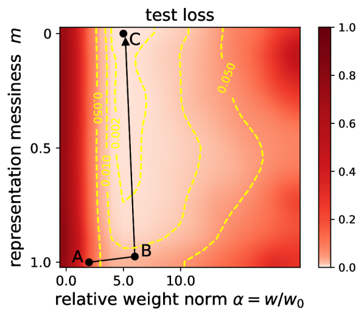

# Loss landscape and basins

[The lazy→rich (kernel-to-feature-learning) transition](lazy-to-rich-kernel-to-feature-learning.md) ← previous card, next → [Circuit efficiency](circuit-efficiency.md)

[Concept card index](index.md), category: [2. Mechanisms and representations](index.md#cat-2)\
→ Next category: [Modular arithmetic](modular-arithmetic.md)\
← Previous category: [Grokking](grokking.md)

## Definition

**The loss landscape** is the geometry of the loss function as a surface over the network's weight space; its lowlands are called **basins** (or basins of attraction — the region from which gradient descent converges to one minimum). In the context of [grokking](grokking.md) this language describes delayed generalisation as the movement of the optimisation trajectory between basins: the network gets stuck for a long time in a "memorising" solution and only much later passes into a "generalising" basin. The loss landscape was first introduced as an explanatory frame for grokking in Omnigrok (Liu et al., 2022): grokking is read through a mismatch of the training and the test loss landscape \[[1.1](#ref-1-1)\].

## Elaboration

The original formalisation is Omnigrok's "LU mechanism": if the losses are plotted against the weight norm, the training loss has the shape of an "L" (it falls quickly and stays low) and the test loss the shape of a "U" (its minimum is reached only at a particular norm); grokking arises from this mismatch between the training and the test landscape \[[1.1](#ref-1-1)\]. The second common image is a **basin of attraction**: the network is stuck in a local (memorising) solution through the [memorisation phase](memorization-phase.md) and groks when it "breaks free" of that basin \[[1.2](#ref-1-2)\]; the same language allows grokking to be predicted from the early dynamics of the landscape \[[1.2](#ref-1-2)\]\[[3.3](#ref-3-3)\]. More formally, basins are told apart through **singular learning theory** (the Bayesian apparatus describing the geometry of degenerate minima): the local learning coefficient (LLC), measuring the degree of degeneracy of a minimum, separates the generalising basin from the memorising one \[[1.3](#ref-1-3)\]. Practically all the accounts come down to the question of what holds the trajectory on the plateau: "flat" directions with almost zero gradient \[[3.1](#ref-3-1)\], an asymmetry of descent rates along the principal directions \[[3.5](#ref-3-5)\], or energy barriers between metastable states, crossed by [SGD](optimizer-adam-adamw-sgd.md) noise on an Arrhenius law (the escape probability depends exponentially on the height of the barrier) \[[3.10](#ref-3-10)\]. A separate discussion is **flatness against sharpness** of the minimum (flat versus sharp minima — a "wide", shallow one against a "narrow", steep one): a number of works tie generalisation precisely to the flatness of the landscape \[[3.4](#ref-3-4)\]\[[3.8](#ref-3-8)\], whereas others contest this for algorithmic tasks, placing the generalising solution in a **sharp** basin \[[2.1](#ref-2-1)\]. The landscape language meets the reading of grokking as a [phase transition](phase-transition.md) (a passage between basins as a jump of an order parameter) and the description through curvature — measured, for instance, by commutator defects (the [non-commutativity](group-composition-non-commutative-s5.md) of successive gradient steps) \[[3.9](#ref-3-9)\].

A restraining fact for noise-based barrier-crossing mechanisms: the founding empirical works train with a full batch — see the chain in the card on the [role of gradient noise](gradient-noise.md).

## Alternative definitions and nuances

### A. A mismatch of the training and test landscapes (the LU mechanism)

A definition through the geometry of the losses in the weight norm: the training and test landscapes do not coincide (the shapes "L" and "U"), so a solution with a low training loss is not yet at the minimum of the test loss; grokking is the drift of the weights towards a region where both surfaces are low \[[1.1](#ref-1-1)\]. The key source of difference here is the weight norm as a control parameter, rather than time as such.

### B. A basin of attraction and escape from a local solution

A definition through getting stuck: the network falls into the basin of attraction of a memorising solution, and how easily it escapes depends on the initialisation and the hyperparameters (the amount of data); grokking comes at the moment the trajectory breaks free of that basin \[[1.2](#ref-1-2)\]. The distinguishing machinery is early oscillations of the learning curve as an indicator of the coming escape, which makes grokking predictable before it happens \[[1.2](#ref-1-2)\].

### C. Selection among competing basins (singular learning theory)

A definition through a comparison of basins: the memorising and the generalising solution are competing basins with different statistical properties, not one solution at different moments \[[1.3](#ref-1-3)\]. The order parameter that tells them apart is the local learning coefficient (LLC): a lower LLC corresponds to a greater concentration of the Bayesian posterior mass and a smaller expected generalisation error, so the selection of the "right" basin is what grokking is \[[1.3](#ref-1-3)\].

### Contested

The nuance of "flat minima" is contested: for algorithmic tasks the generalising solution lies not in a flat but in a **sharp** basin, unreachable at low gradient variance; the "delay" is the accumulation of variance that opens the way into the sharp manifold \[[2.1](#ref-2-1)\]. The pairing "generalisation = flatness of the landscape" is thereby contested directly.

### In support

The landscape-and-basin frame is joined by works refining the particular mechanism of getting stuck and escaping: flat directions with almost zero gradient \[[3.1](#ref-3-1)\]; a slow entry into the "[Goldilocks zone](goldilocks-zone.md)" in weight norm \[[3.2](#ref-3-2)\]; a prediction of the number of epochs to grokking from the early landscape \[[3.3](#ref-3-3)\]; flatness as the only stable predictor of the transition \[[3.4](#ref-3-4)\]; a plateau from an asymmetry of descent rates \[[3.5](#ref-3-5)\]; a link between the landscape, the amount of data and [weight decay](weight-decay.md) \[[3.6](#ref-3-6)\]; a passage from a memorisation basin to a generalisation basin in weight space \[[3.7](#ref-3-7)\]; flatness of the landscape as a sign of post-grokking models \[[3.8](#ref-3-8)\]; the curvature of the landscape through commutator defects \[[3.9](#ref-3-9)\]; and metastable states separated by energy barriers \[[3.10](#ref-3-10)\]. A survey-level appeal to "loss-based" landscape theories is also made by \[[3.11](#ref-3-11)\].

## References

###### ref-1-1
**\[1.1\]** 2210.01117 — Liu et al., "Omnigrok: Grokking Beyond Algorithmic Data". [`"understand grokking by analyzing the loss landscapes of neural networks, identifying the mismatch between training and test loss landscapes as the cause for grokking"`](../papers/2210.01117.omnigrok-grokking-beyond-algorithmic-data/original/2210.01117.omnigrok-grokking-beyond-algorithmic-data.md#p1-3).

###### ref-1-2
**\[1.2\]** 2306.13253 — Notsawo et al., "Predicting Grokking Long Before it Happens: A look into the loss landscape of models which grok". [`"the model achieves grokking when it successfully breaks free from the basin of attraction of such solutions"`](../papers/2306.13253.predicting-grokking-long-before-it-happens/original/2306.13253.predicting-grokking-long-before-it-happens.md#p4-1).\
Also: [`"the model gets stuck in local solutions during the memorization phase"`](../papers/2306.13253.predicting-grokking-long-before-it-happens/original/2306.13253.predicting-grokking-long-before-it-happens.md#p4-1).

###### ref-1-3
**\[1.3\]** 2603.01192 — Cullen et al., "A Basin-Selection Perspective on Grokking via Singular Learning Theory". [`"the presence of competing solution basins with distinct statistical properties"`](../papers/2603.01192.a-basin-selection-perspective-on-grokking-via-singular-learning-theory/2603.01192.a-basin-selection-perspective-on-grokking-via-singular-learning-theory.card.md#p1-2).\
Also: [`"the local learning coefficient (LLC) which quantifies the local degeneracy of the loss surface"`](../papers/2603.01192.a-basin-selection-perspective-on-grokking-via-singular-learning-theory/2603.01192.a-basin-selection-perspective-on-grokking-via-singular-learning-theory.card.md#p1-2).\
Also (the passage between basins): [`"grokking corresponds to a transition from a higher-LLC (memorising) basin to a lower-LLC (generalising) basin that dominates the posterior"`](../papers/2603.01192.a-basin-selection-perspective-on-grokking-via-singular-learning-theory/2603.01192.a-basin-selection-perspective-on-grokking-via-singular-learning-theory.card.md#p1-2)

###### ref-1-4
**\[1.4\]** 2505.20172 — Boursier et al., "A Theoretical Framework for Grokking: Interpolation followed by Riemannian Norm Minimisation". Nuance: the critical set is assumed to be a Morse–Bott manifold consisting only of local minima (equivalent to a local Polyak–Łojasiewicz condition); of the three examples examined this holds globally only in linear regression, while for diagonal networks and matrix sensing it is saved by the qualification "locally, away from the degenerate set". The singular points — which are exactly the sparse vectors and low-rank matrices sought — remain uncovered, and the authors highlight this in bold. [`"our results capture the grokking dynamics near nonsingular points in $\mathcal{M}^{*}$, but do not yet account for potential convergence toward singular points, which represents an important open challenge."`](../papers/2505.20172.a-theoretical-framework-for-grokking-interpolation-followed-by-riemannian-norm-minimisation/2505.20172.a-theoretical-framework-for-grokking-interpolation-followed-by-riemannian-norm-minimisation.card.md#p28-3).\
Also (the exclusion of saddles is justified by references rather than proved here): [`"our assumption rules out the possibility that $w^{\mathrm{GF}}$ converges to a saddle point of $F$. This is justified by a large number of works showing that gradient methods avoid saddle points for *almost all* initialisations."`](../papers/2505.20172.a-theoretical-framework-for-grokking-interpolation-followed-by-riemannian-norm-minimisation/2505.20172.a-theoretical-framework-for-grokking-interpolation-followed-by-riemannian-norm-minimisation.card.md#p5-1).

###### ref-1-5
**\[1.5\]** 2408.11804 — Yunis et al., "Approaching Deep Learning through the Spectral Dynamics of Weights". Ties the convexity of a basin to the spectrum of the weights: the presence of linear mode connectivity (the barrier of Neyshabur et al. 2020) correlates strongly with the agreement of the top singular vectors at the ends of the branches, whereas branches from different trunks at the same branching time and data order give neither LMC nor agreement. The work offers no explanation of the convexity and says so outright. [`"these top directions are not a unique property of the architecture and data, but rather are dependent on initialization"`](../papers/2408.11804.approaching-deep-learning-through-the-spectral-dynamics-of-weights/original/2408.11804.approaching-deep-learning-through-the-spectral-dynamics-of-weights.md#p13-1).\
Also (the intervention): [`"with increasing perturbations the LMC property disappears simultaneously with the agreement in top singular vectors"`](../papers/2408.11804.approaching-deep-learning-through-the-spectral-dynamics-of-weights/original/2408.11804.approaching-deep-learning-through-the-spectral-dynamics-of-weights.md#fig-13).

###### ref-1-6
**\[1.6\]** 2505.11411 — Zhang, Shang, Yang, Zhang, "Is Grokking a Computational Glass Relaxation?". Proposes replacing the local geometry of a minimum (flatness, sharpness, the Hessian) by the global volume of solutions and reads grokking as a failure of exploration: the optimiser wanders inefficiently among basins rather than crossing a barrier. Nuance: the quantity the work operates with is a two-dimensional projection of a volume — it measures neither the width of a minimum nor the barriers between basins. [`"we believe that grokking is a dynamic process caused by the optimizer’s inefficient exploration of the loss landscape basins"`](../papers/2505.11411.is-grokking-a-computational-glass-relaxation/original/2505.11411.is-grokking-a-computational-glass-relaxation.md#p7-3).\
Also (what entropy replaces the local measures with): [`"the combination of flatness and weight norm actually reflects the entropy, the logarithm of the parameter space volume, of the solutions with the same generalizability"`](../papers/2505.11411.is-grokking-a-computational-glass-relaxation/original/2505.11411.is-grokking-a-computational-glass-relaxation.md#p3-1).

###### ref-1-7
**\[1.7\]** 2505.15624 — AlQuabeh, Bojković, Nwadike, Inui, "Mechanistic Insights into Grokking from the Embedding Layer". Measures curvature layer by layer: the largest Hessian eigenvalues are computed separately for $\mathbf{E}$ and for $\mathbf{W}$ by the power method through Hessian-vector products and differ by an order and a half (about 0.13 against about 3.5), converging under Adam-LR. Nuance: saddle points are declared a consequence of the bilinear coupling, but not a single saddle is found or shown; no correction is made for the different numbers of parameters in $\mathbf{E}$ and $\mathbf{W}$, and the conclusion about a division of roles rests on two vertical cut-offs coinciding in a single run. [`"This coupling introduces structural complexity into the optimization landscape, making the process more susceptible to saddle points and increasing the sensitivity to initialization."`](../papers/2505.15624.mechanistic-insights-into-grokking-from-the-embedding-layer/original/2505.15624.mechanistic-insights-into-grokking-from-the-embedding-layer.md#p2-2).\
Also (what exactly is measured): [`"With Adam (left), the eigenvalues for $\mathbf{E}$ are significantly smaller than those for $\mathbf{W}$, reflecting differences in dimensionality and update frequency."`](../papers/2505.15624.mechanistic-insights-into-grokking-from-the-embedding-layer/original/2505.15624.mechanistic-insights-into-grokking-from-the-embedding-layer.md#fig-7).
## References of works that joined the discussion

### Contested

###### ref-2-1
**\[2.1\]** 2603.15492 — Acharya et al., "Grokking as a Variance-Limited Phase Transition: Spectral Gating and the Epsilon-Stability Threshold". Contests the "flat minima" hypothesis: the generalising solution lies in a sharp basin. [`"the generalizing solution resides in a sharp basin"`](../papers/2603.15492.grokking-as-a-variance-limited-phase-transition-spectral-gating-and-the-epsilon-stability-threshold/original/2603.15492.grokking-as-a-variance-limited-phase-transition-spectral-gating-and-the-epsilon-stability-threshold.md#p1-3).\
Also: [`"we challenge the "Flat Minima" hypothesis for algorithmic tasks"`](../papers/2603.15492.grokking-as-a-variance-limited-phase-transition-spectral-gating-and-the-epsilon-stability-threshold/original/2603.15492.grokking-as-a-variance-limited-phase-transition-spectral-gating-and-the-epsilon-stability-threshold.md#p1-4).\
Also (the inversion of sharpness): [`"for algorithmic tasks, the generalizing solution is spectrally sharper than the memorization solution"`](../papers/2603.15492.grokking-as-a-variance-limited-phase-transition-spectral-gating-and-the-epsilon-stability-threshold/original/2603.15492.grokking-as-a-variance-limited-phase-transition-spectral-gating-and-the-epsilon-stability-threshold.md#p2-4)

### In support

###### ref-3-1
**\[3.1\]** 2410.04489 — Beck et al., "Grokking at the Edge of Linear Separability". Nuance: flat directions of the landscape with almost zero gradient hold the dynamics near quasi-stable solutions. [`"in the loss landscape with nearly zero gradient cause training dynamics to linger for arbitrarily long times near quasi-stable solutions"`](../papers/2410.04489.grokking-at-the-edge-of-linear-separability/2410.04489.grokking-at-the-edge-of-linear-separability.card.md#p1-2).

###### ref-3-2
**\[3.2\]** 2405.19454 — Fan, Pascanu, Jaggi 2024, "Deep Grokking: Would Deep Neural Networks Generalize Better?". Nuance: grokking as a slow entry into the "Goldilocks zone" in weight norm. [`"the model needs to *grok* slowly into the *Goldilocks zone* (Fort & Scherlis, 2018) for generalization"`](../papers/2405.19454.deep-grokking-would-deep-neural-networks-generalize-better/2405.19454.deep-grokking-would-deep-neural-networks-generalize-better.card.md#p6-2).

###### ref-3-3
**\[3.3\]** 2411.05353 — Salah et al., "Controlling Grokking with Nonlinearity and Data Symmetry". Nuance: the number of epochs to grokking is predictable from the loss landscape at early stages. [`"predicted the number of epochs required to observe grokking from the loss landscape"`](../papers/2411.05353.controlling-grokking-with-nonlinearity-and-data-symmetry/original/2411.05353.controlling-grokking-with-nonlinearity-and-data-symmetry.md#p13-1).

###### ref-3-4
**\[3.4\]** 2509.17738 — Han et al., "Flatness is Necessary, Neural Collapse is Not: Rethinking Generalization via Grokking". Nuance: of grokking's correlates, only flatness of the landscape predicts it stably. [`"flatness of the loss landscape has been theoretically and empirically linked to generalization"`](../papers/2509.17738.flatness-is-necessary-neural-collapse-is-not-rethinking-generalization-via-grokking/original/2509.17738.flatness-is-necessary-neural-collapse-is-not-rethinking-generalization-via-grokking.md#p1-2).\
Also: [`"only flatness consistently predicts it"`](../papers/2509.17738.flatness-is-necessary-neural-collapse-is-not-rethinking-generalization-via-grokking/original/2509.17738.flatness-is-necessary-neural-collapse-is-not-rethinking-generalization-via-grokking.md#p1-2).

###### ref-3-5
**\[3.5\]** 2510.04930 — Saheb Pasand et al., "Egalitarian Gradient Descent: A Simple Approach to Accelerated Grokking". Nuance: the plateau before grokking is produced by an asymmetry of descent rates along the principal directions; equalising them removes the plateau. [`"it is desirable to reduce the length of such plateaus"`](../papers/2510.04930.egalitarian-gradient-descent-a-simple-approach-to-accelerated-grokking/original/2510.04930.egalitarian-gradient-descent-a-simple-approach-to-accelerated-grokking.md#p1-2).

###### ref-3-6
**\[3.6\]** 2511.04760 — Singh et al., "When Data Falls Short: Grokking Below the Critical Threshold". Nuance: an analysis of the loss landscape ties grokking to data size, weight decay and representation learning. [`"loss-landscape analysis links grokking to data size, weight decay, and representation learning"`](../papers/2511.04760.when-data-falls-short-grokking-below-the-critical-threshold/original/2511.04760.when-data-falls-short-grokking-below-the-critical-threshold.md#p2-4).

###### ref-3-7
**\[3.7\]** 2511.12768 — Hong et al., "Evidence of Phase Transitions in Small (Language) Models". Nuance: in weight space the model moves from a memorisation basin into a generalisation basin. [`"the model moves from a memorization basin to a generalization basin in weight space"`](../papers/2511.12768.evidence-of-phase-transitions-in-small-transformer-based-language-models/original/2511.12768.evidence-of-phase-transitions-in-small-transformer-based-language-models.md#p4-4).

###### ref-3-8
**\[3.8\]** 2512.03437 — Liang & Li, "Grokked Models are Better Unlearners". Nuance: grokked models are distinguished by three properties at once, and the work deliberately separates flatness from the other two. [`"modularity, gradient orthogonality, and loss landscape flatness"`](../papers/2512.03437.grokked-models-are-better-unlearners/2512.03437.grokked-models-are-better-unlearners.card.md#p3-4).

###### ref-3-9
**\[3.9\]** 2602.16746 — Xu, "Low-Dimensional and Transversely Curved Optimization Dynamics in Grokking". Nuance: the curvature of the loss landscape is measured through commutator defects — the non-commutativity of successive gradient steps. [`"We then measure loss-landscape curvature via commutator defects"`](../papers/2602.16746.low-dimensional-and-transversely-curved-optimization-dynamics-in-grokking/original/2602.16746.low-dimensional-and-transversely-curved-optimization-dynamics-in-grokking.md#p1-2).

###### ref-3-10
**\[3.10\]** 2606.17120 — Ersoy et al., "Noise-Driven Escape from Metastable Phases explains Grokking in Deep Neural Networks". Nuance: coexisting metastable states separated by energy barriers trap the network; grokking is a noise-driven escape across a barrier. [`"coexisting metastable states, separated by energy barriers, can trap the network"`](../papers/2606.17120.noise-driven-escape-from-metastable-phases-explains-grokking/original/2606.17120.noise-driven-escape-from-metastable-phases-explains-grokking.md#p1-2).

###### ref-3-11
**\[3.11\]** 2310.17247 — Miller, O'Neill, Bui 2024, "Grokking Beyond Neural Networks: An Empirical Exploration with Model Complexity". Nuance: landscape accounts are classed among "loss-based" theories, and for a Gaussian process with two tunable parameters the "error–complexity" landscape is drawn in full. [`"appeal to the loss landscape of the training and test sets under different measures of complexity and data fit"`](../papers/2310.17247.grokking-beyond-neural-networks-an-empirical-exploration-with-model-complexity/2310.17247.grokking-beyond-neural-networks-an-empirical-exploration-with-model-complexity.card.md#p2-6).\
Also (three initialisations, grokking in only one): [`"As evident in Figure 5, we only saw grokking for case B"`](../papers/2310.17247.grokking-beyond-neural-networks-an-empirical-exploration-with-model-complexity/2310.17247.grokking-beyond-neural-networks-an-empirical-exploration-with-model-complexity.card.md#p8-1).

###### ref-3-12
**\[3.12\]** 2411.00247 — Jeffares, Curth, van der Schaar, "Deep Learning Through A Telescoping Lens: A Simple Model Provides Empirical Insights On Grokking, Gradient Boosting & Beyond". Gives a sufficient condition for linear mode connectivity: if after a point $t^{ * }$ the model's gradients stop changing, then an ensemble and a weight-averaged model become nearly identical — and confirms that the disappearance of the loss barrier coincides with the stabilisation of the gradients on ResNet-20. Nuance: the authors declare the explanation incomplete themselves — the gradients of the other layers keep changing, and in a pretrained model the BatchNorm parameters change more; this case is not connected with grokking in the work. [`"the transition into a lazy regime during training – i.e. reaching a point $t^{*}$ after which the model gradients no longer change – can be *sufficient* to imply LMC during training"`](../papers/2411.00247.deep-learning-through-a-telescoping-lens-a-simple-model-provides-empirical-insights-on-grokking-gradient-boosting-and-beyond/original/2411.00247.deep-learning-through-a-telescoping-lens-a-simple-model-provides-empirical-insights-on-grokking-gradient-boosting-and-beyond.md#p8-4).\
Also (the acknowledged limit): [`"while there may be a connection between gradient stabilization and LMC, it cannot fully explain it"`](../papers/2411.00247.deep-learning-through-a-telescoping-lens-a-simple-model-provides-empirical-insights-on-grokking-gradient-boosting-and-beyond/original/2411.00247.deep-learning-through-a-telescoping-lens-a-simple-model-provides-empirical-insights-on-grokking-gradient-boosting-and-beyond.md#p9-2).

###### ref-3-13
**\[3.13\]** 2602.18523 — Xu, "The Geometry of Multi-Task Grokking: Transverse Instability, Superposition, and Weight Decay Phase Structure". Nuance: the picture of the transition is saddle-based — weight decay pushes the trajectory off the memorisation saddle into a generalising basin; robustness, meanwhile, is attributed not to the flatness of a minimum but to the existence of several central manifolds nearby. The contrast with flat minima remains an argument: the work reports no Hessian trace, no leading eigenvalues and no measure of sharpness at all. [`"robustness in overparameterized models arises not merely from flat minima (Keskar et al. 2017), but from **geometric redundancy in optimization pathways**"`](../papers/2602.18523.the-geometry-of-multi-task-grokking-transverse-instability-superposition-and-weight-decay-phase-structure/original/2602.18523.the-geometry-of-multi-task-grokking-transverse-instability-superposition-and-weight-decay-phase-structure.md#p27-10).\
Also (the saddle picture): [`"weight decay provides the regularization pressure to escape the memorization saddle and reach a generalizing basin"`](../papers/2602.18523.the-geometry-of-multi-task-grokking-transverse-instability-superposition-and-weight-decay-phase-structure/original/2602.18523.the-geometry-of-multi-task-grokking-transverse-instability-superposition-and-weight-decay-phase-structure.md#p9-2).

###### ref-3-14
**\[3.14\]** 2602.16967 — Xu, "Early-Warning Signals of Grokking via Loss-Landscape Geometry". Nuance: the commutator defect as a probe of the landscape is carried over from modular arithmetic to an encoder–decoder and a causal decoder-only transformer; the picture "confinement — accumulation of transverse barriers — escape" is confirmed on both tasks. [`"A large defect signals that the order of gradient updates matters—the loss landscape has developed curvature structure that breaks path-independence."`](../papers/2602.16967.early-warning-signals-of-grokking-via-loss-landscape-geometry/original/2602.16967.early-warning-signals-of-grokking-via-loss-landscape-geometry.md#p4-8).

###### ref-3-16
**\[3.16\]** 2412.18624 — Kozyrev, "How to explain grokking". Nuance: brings into the corpus the ravine language of describing a landscape (narrows of low entropy and wide valleys of high entropy, with a reference to the ravine method of Gelfand and Tsetlin) and decomposes training into a fall into a ravine and motion along it. The width of the valleys is nowhere measured, and the load-bearing thesis "the generalising region is wider than the overfitting one" is postulated: the usual count says rather the opposite — memorising solutions are many, algorithmic ones few. [`"The zero-risk manifold contains narrows, or ravines (regions with lower entropy) and wide valleys (with higher entropy)."`](../papers/2412.18624.how-to-explain-grokking/2412.18624.how-to-explain-grokking.card.md#p4-10).\
Also (the flat-minima approach the construction rests on): [`"narrow (sharp) minima of empirical risk (in the hypothesis space) are associated with overfitting, and wide (flat) minima correspond to solutions of the learning problem with generalization"`](../papers/2412.18624.how-to-explain-grokking/2412.18624.how-to-explain-grokking.card.md#p3-11).
###### ref-3-17
**\[3.17\]** 2509.10562 — Lopatin, Kozyrev & Pechen 2025, "Predator–Prey Model: Driven Hunt for Accelerated Grokking". The ravine picture as an accepted account of grokking: the fall into a ravine (the zero-risk manifold) is memorisation, diffusion along its floor is the delay; here the picture is not tested but used as a basis for an accelerating technique. [`"the system quickly falls into a ravine, and then performs random walks (Brownian motion) along the ravine"`](../papers/2509.10562.predator-prey-model-driven-hunt-for-accelerated-grokking/2509.10562.predator-prey-model-driven-hunt-for-accelerated-grokking.card.md#p2-1).\
Also (the account of the delay): [`"Thus, learning gets stuck in the ravine, which explains the delay in the generalization during grokking"`](../papers/2509.10562.predator-prey-model-driven-hunt-for-accelerated-grokking/2509.10562.predator-prey-model-driven-hunt-for-accelerated-grokking.card.md#p2-1).

###### ref-3-18
**\[3.18\]** 2602.18649 — Xu 2026, "Global Low-Rank, Local Full-Rank: The Holographic Encoding of Learned Algorithms". The geometry of a grokked solution as a manifold-versus-slice duality: the control variables define a low-dimensional manifold in parameter space, and at each of its points the solution occupies a full-dimensional slice of the space of individual matrices; the low dimensionality of the trajectory is inherited from the previous work of the series, but here without its null models. [`"Geometrically, the control variables define a low-dimensional *manifold* in parameter space along which the solution lies"`](../papers/2602.18649.global-low-rank-local-full-rank-the-holographic-encoding-of-learned-algorithms/original/2602.18649.global-low-rank-local-full-rank-the-holographic-encoding-of-learned-algorithms.md#p9-6)..

###### ref-3-19
**\[3.19\]** 2604.07380 — Xu 2026, "The Lifecycle of the Spectral Edge: From Gradient Learning to Weight-Decay Compression". A separation of "orientation" from "displacement along" for flat directions: the spectral gap locks the orientation of the leading direction (a Davis–Kahan bound), while the low curvature makes motion along it harmless — which is why removing the direction is catastrophic and a perturbation along it is negligible; the bound is meanwhile never computed, and the flatness is a property of the whole grokked model, not only of the edge. [`"the spectral gap protects the *orientation* of $v_{1}$ (perturbation $\sin\theta\leq\left\|\Delta G\right\|_{F}/g$, and $g$ is large), while the low curvature $h_{1}=0.08$ means the loss is flat *along* $v_{1}$"`](../papers/2604.07380.the-lifecycle-of-the-spectral-edge-from-gradient-learning-to-weight-decay-compression/original/2604.07380.the-lifecycle-of-the-spectral-edge-from-gradient-learning-to-weight-decay-compression.md#p5-1)..

###### ref-3-20
**\[3.20\]** 2606.32000 — Tiwari, Chauhan & Singh 2026, "Radial Suppression Accelerates Algorithmic Generalization: A Geometric Analysis of Delayed Generalization". A rare combination for the flat-minima line: flattening without spectral collapse — the Hessian trace falls from 42.5 to 1.4 (a factor of 30, and 45 in normalised sharpness) while the effective rank rises from 135 to 443 out of 512; the appendix adds an argument through the edge of stability: bounding $\Vert h\Vert_{2}$ bounds the spectral norm of the weights and keeps $\lambda_{max}$ below $2/\eta$. Nuance: the threshold $2/\eta$ is never measured — the conclusion rests on a local linear substitution with the tensor terms dropped, and the authors themselves call the reduction of curvature "a tested mechanistic hypothesis rather than a formal guarantee". [`"This combination—flatter landscape *and* higher rank—distinguishes the norm penalty from isotropic regularizers, which reduce sharpness by collapsing the spectrum rather than by redistributing it."`](../papers/2606.32000.radial-suppression-accelerates-algorithmic-generalization-a-geometric-analysis-of-delayed-generalization/2606.32000.radial-suppression-accelerates-algorithmic-generalization-a-geometric-analysis-of-delayed-generalization.card.md#p5-3).\
Also (the EoS argument): [`"the local sharpness is forcibly held below the $2/\eta$ threshold, explaining the dramatic reduction in Hessian trace observed in our experiments"`](../papers/2606.32000.radial-suppression-accelerates-algorithmic-generalization-a-geometric-analysis-of-delayed-generalization/2606.32000.radial-suppression-accelerates-algorithmic-generalization-a-geometric-analysis-of-delayed-generalization.card.md#p8-5).

###### ref-3-21
**\[3.21\]** 2605.04396 — Ali 2026, "Critical Windows of Complexity Control: When Transformers Decide to Reason or Memorize". A basin formulation of the choice of solution with a direct measurement of width: memorisation and reasoning are two basins, the choice is made within a window of a few thousand steps, and the width of a basin is for the first time in this line measured by counting seeds (12 per point: $12/12$ at $\gamma{=}1.1$ against $8/12$ at $\gamma{=}0.5$); the range of the phenomenon is bounded by the condition that both basins be reachable — on SCAN add_prim_jump the compositional basin is unreachable altogether, and grokking in modular arithmetic is assigned a single basin. Nuance: the bimodality at 4 layers (some seeds $\geq 0.70$, some at chance) is a direct sign of a narrow basin; and the "single basin" thesis for grokking runs against the line of competition between memorising and generalising circuits. [`"critical-window dynamics manifest only when the loss landscape contains a *structurally distinguishable* memorization basin and reasoning basin both reachable by the model under training"`](../papers/2605.04396.critical-windows-of-complexity-control-when-transformers-decide-to-reason-or-memorize/original/2605.04396.critical-windows-of-complexity-control-when-transformers-decide-to-reason-or-memorize.md#p27-2).\
Also (the narrowing of the basin): [`"The basin of attraction for the reasoning solution shrinks dramatically at small $\gamma$"`](../papers/2605.04396.critical-windows-of-complexity-control-when-transformers-decide-to-reason-or-memorize/original/2605.04396.critical-windows-of-complexity-control-when-transformers-decide-to-reason-or-memorize.md#p22-1).

###### ref-3-22
**\[3.22\]** 2307.09550 — Gokhale 2023, "The semantic landscape paradigm for neural networks". A coarse-graining of the loss landscape into a "semantic" one: the relief is given by an unobservable fallibility $\mathcal{F}$ (a sum of KL divergences over all possible inputs) over a graph of internal algorithms, the transitions are Arrhenius-like, $\tau_{ij}=\tau_{ij}^{0}e^{\beta(\mathcal{F}_ {j}-\mathcal{F}_ {i})}$, and grokking requires crossing "semantic barriers". A useful fork for the corpus: where to place the barrier — in the loss landscape over weights (as later in the Arrhenius kinetics of activation escape, 2606.17120) or on a graph of algorithms, as here. Nuance: the predicted transient rise of the test loss at grokking is supported by references to already published observations — that is a retrodiction; and there are eight free quantities, all unobservable. [`"improvement in performance is only possible if the network is able to cross certain *semantic barriers*"`](../papers/2307.09550.the-semantic-landscape-paradigm-for-neural-networks/original/2307.09550.the-semantic-landscape-paradigm-for-neural-networks.md#p4-3).\
Also (the loss spike): [`"the semantic landscape paradigm predicts that the test loss during grokking should transiently increase with training steps before decreasing again"`](../papers/2307.09550.the-semantic-landscape-paradigm-for-neural-networks/original/2307.09550.the-semantic-landscape-paradigm-for-neural-networks.md#p5-3).
###### ref-3-23
**\[3.23\]** 2607.06628 — Truong Xuan Khanh 2026, "Cross-Trajectory Chimera Interventions Reveal Dissociable Roles of Weight Magnitude and Direction in Grokking". A basin-switching boundary measured by intervention: as an implanted direction slides along the geodesic between two runs at a fixed norm, the identity of the scheme switches at a threshold (82–88% of the change in one grid step, with plateaus on either side), and the location of the threshold is organised by the recipient's norm — high-norm recipients ("far from grokking") flip early, low-norm ones late, with the classes separating without overlap on all 20 pairs (jointly $p=1.9\times 10^{-4}$); the reading is susceptibility: a high norm means a shallow region of the landscape, where a modest directional shift carries the model into a neighbouring basin. Nuance: the causality of the norm itself is not tested — no foreign norm was substituted with the threshold then measured, and the stage of training is an equally good explanatory variable; the "perfect separation" classes contain 2–3 pairs (recoverable from the exact probabilities $1/45$ and $1/120$); and the relation is claimed as an ordering, not as a continuous law. [`"pairs whose recipient has high norm (far from grokking) flip early—only a small move toward $u_{B}$ is needed—whereas pairs whose recipient has low norm (near grokking) flip late."`](../papers/2607.06628.cross-trajectory-chimera-interventions-reveal-dissociable-roles-of-weight-magnitude-and-direction-in-grokking/2607.06628.cross-trajectory-chimera-interventions-reveal-dissociable-roles-of-weight-magnitude-and-direction-in-grokking.card.md#p5-5).

## Passing mentions

**\[4.1\]** 2604.06256 — Xu, "Spectral Edge Dynamics Reveal Functional Modes of Learning". Nuance: the link with curvature is drawn only by a reference to the same author's earlier work on commutator defects (2602.16746). [`"This is a statement about loss landscape geometry, not representation theory."`](../papers/2604.06256.spectral-edge-dynamics-reveal-functional-modes-of-learning/original/2604.06256.spectral-edge-dynamics-reveal-functional-modes-of-learning.md#p5-10).

**\[4.2\]** 2308.09543 — Hu, Chen, Saphra & Cho, "Delays, Detours, and Forks in the Road: Latent State Models of Training Dynamics". [`"We conjecture that grokking is the consequence of a sharp optimization landscape"`](../papers/2308.09543.delays-detours-and-forks-in-the-road-latent-state-models-of-training-dynamics/original/2308.09543.delays-detours-and-forks-in-the-road-latent-state-models-of-training-dynamics.md#p12-2).

### External works

###### ref-5-1
**\[5.1\]** 2406.03999 — External work (demoted from the corpus): Song, Tan, Zou, Ma, Huang, "Unveiling the Dynamics of Information Interplay…". Two copies from one initialisation, different data order and augmentations, then a linear interpolation of the weights ([p. 5, para. 1](../externals/2406.03999.unveiling-the-dynamics-of-information-interplay-in-supervised-learning/2406.03999.unveiling-the-dynamics-of-information-interplay-in-supervised-learning.card.md#p5-1)): on CIFAR-100 there is connectivity and both measures barely change along the segment, while on CIFAR-10 at a step of $3e^{-2}$ there is no connectivity — the accuracy falls to chance at interpolation weights between 0.4 and 0.6. [`"Although we find it difficult to explain this anomaly, it does demonstrate that HDR and MIR have distinctive attributes compared to the accuracy metric"`](../externals/2406.03999.unveiling-the-dynamics-of-information-interplay-in-supervised-learning/2406.03999.unveiling-the-dynamics-of-information-interplay-in-supervised-learning.card.md#p5-2).\
Also (what the figure shows): in [fig. 3](../externals/2406.03999.unveiling-the-dynamics-of-information-interplay-in-supervised-learning/2406.03999.unveiling-the-dynamics-of-information-interplay-in-supervised-learning.card.md#fig-3), panel (a), the MIR has a bump in the middle of the dip, while the HDR falls almost to zero at weights around 0.1 and 0.94 — that is, simultaneously with the fall of accuracy rather than against it.
