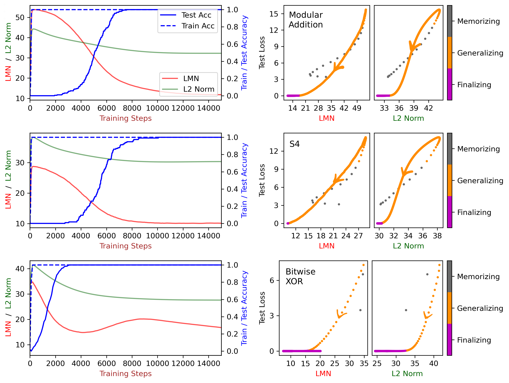

# Manifold / representation compression

[Sparse subnetwork / lottery ticket](sparse-subnetwork-lottery-ticket.md) ← previous card, next → [Neural tangent kernel (NTK)](neural-tangent-kernel-ntk.md)

[Concept card index](index.md), category: [2. Mechanisms and representations](index.md#cat-2)\
→ Next category: [Modular arithmetic](modular-arithmetic.md)\
← Previous category: [Grokking](grokking.md)

## Definition

**Compression of the representation manifold** is a reading of [grokking](grokking.md) in which delayed generalisation arrives at the moment when the network's internal structure — its representations (the activations of the hidden layers) or the trajectory of its weights — contracts from a high-dimensional, "inflated" memorising configuration into a compact low-dimensional or low-rank one (describable by a few independent directions). It is this compression of complexity that distinguishes the generalising solution from the memorising one: the generalising solution is simpler and therefore more efficient, and it appears later. The idea "grokking = compression" was stated most explicitly by Liu et al. \[[1.1](#ref-1-1)\].

## Elaboration

Different works measure "compression" differently, and that is the key source of divergence. Liu et al. propose a complexity measure LMN (linear mapping number — a generalisation of the number of linear regions of a ReLU network, read as an amount of information or computation) which, unlike the L2 weight norm, is linearly related to the test loss in the compression phase \[[1.1](#ref-1-1)\]; the same complexity measure, as an "error + complexity" balance argument, is taken up by Miller et al., who show that grokking reproduces even outside neural networks \[[3.1](#ref-3-1)\]. Another line measures compression geometrically, at the level of the representations themselves. Sakamoto et al. tie grokking to [neural collapse](neural-collapse.md) (the late geometric rearrangement in which the representations of one class contract towards their mean) and to the information bottleneck (the principle that a network discards input information irrelevant to the task), formalising compression as the contraction of the within-class variance \[[3.3](#ref-3-3)\]. Fan et al. observe a "tunnel effect" in deep networks: the later layers compress the features into a low-rank representation, and the feature rank falls along training \[[3.2](#ref-3-2)\]. A third line places the compression in weight space: Xu describes grokking as a prolonged confinement of the trajectory to a low-dimensional subspace (an "execution manifold") in weight space \[[3.5](#ref-3-5)\], Hutchison et al. as a passage of the weight matrices to a low-rank configuration and a [sparse subnetwork](sparse-subnetwork-lottery-ticket.md) \[[3.4](#ref-3-4)\], and Gu et al. read learning as the learning of a manifold of the embedding space \[[1.2](#ref-1-2)\]. Zhang et al. unite both sides, deriving grokking from a principle of parsimony as a "physical collapse of redundant manifolds" and deep information compression \[[1.3](#ref-1-3)\]. The mechanism is, however, contested: some works hold that compression of representations (in the form of neural collapse) is not a necessary condition of generalisation \[[2.1](#ref-2-1)\]; that [weight decay](weight-decay.md) explains the tendency towards compression but not the specific geometry of the resulting manifold \[[2.2](#ref-2-2)\]; and that slow compression can be bypassed altogether by architectural means, removing the [memorisation phase](memorization-phase.md) \[[2.3](#ref-2-3)\].

## Alternative definitions and nuances

### A. Compression of the network's complexity (the Kolmogorov / LMN reading)

A definition through a complexity measure of the network's whole function: grokking is the phase in which the complexity of the input–output mapping falls to a generalising minimum while the training accuracy is already maximal. The distinguishing machinery here is an [order parameter](order-parameter.md) that is not geometric but complexity-based: the linear mapping number LMN (for piecewise-linear ReLU networks), read as an approximation of [Kolmogorov complexity](kolmogorov-complexity.md), which grows during memorisation and falls during compression \[[1.1](#ref-1-1)\]. It is by LMN being read as information/computation (which the L2 norm is not) that this reading separates itself from the norm-oriented ones: compression is defined as a decrease of descriptive complexity rather than of the weight norm, and it carries over to non-neural models \[[3.1](#ref-3-1)\].

### B. Compression of the geometry of representations (neural collapse / the information bottleneck)

A definition through the geometry of the activations: grokking is the contraction of the cloud of representations to a low-dimensional, structured form. The distinguishing order parameter is the within-class variance of the representations: generalisation arrives when the population within-class variance contracts, which accounts at once for grokking and for the information bottleneck \[[3.3](#ref-3-3)\]. In deep networks the same compression shows up as a fall of the feature rank in the later ("tunnel") layers \[[3.2](#ref-3-2)\]. It differs from reading A in that what is compressed is the observable representation of the data rather than the abstract complexity of the function.

### C. Collapse onto a low-dimensional manifold in weight or embedding space

A definition through the geometry of the parameters: grokking is the convergence of the training trajectory onto a compact manifold in weight or embedding space. The distinguishing machinery is the dimension of the carrying subspace: Xu shows that the evolution of the weights under grokking is essentially one-dimensional (one principal component explains 68–83% of the variance) and is held on an "execution manifold" \[[3.5](#ref-3-5)\]; Hutchison et al. record a passage of the weight matrices to a low-rank configuration \[[3.4](#ref-3-4)\]; Gu et al. define the aim of learning as learning a separating manifold in embedding space \[[1.2](#ref-1-2)\]. The difference from variant B is that the order parameter lives in the space of parameters or embeddings, not in the space of activations of individual examples.

### Contested

Three lines of objection. Han et al. separate cause from effect in time using grokking and show that models that are pushed to collapse and models that are prevented from collapsing generalise equally well — hence compression of representations (neural collapse) is not necessary, and the necessary and more fundamental predictor turns out to be flatness (relative flatness — a measure of how shallow the loss minimum is) \[[2.1](#ref-2-1)\]. Hwang et al. agree that norm-reducing optimisation explains the *tendency* towards compression, but insist that it does not explain the *specific form* of the resulting geometry — that is set by the intrinsic symmetry of the task \[[2.2](#ref-2-2)\]. Yildirim contests the inevitability of slow compression: a fully bounded spherical topology of the residual stream removes the memorisation phase entirely, and training and test accuracy rise together from initialisation \[[2.3](#ref-2-3)\].

### In support

The works that join strengthen particular measurements of compression: as a transfer of the LMN complexity measure to a wide class of models \[[3.1](#ref-3-1)\], as a fall of the feature rank in deep networks \[[3.2](#ref-3-2)\], as the contraction of the within-class variance and the discarding of irrelevant information \[[3.3](#ref-3-3)\], as a passage of the weights to a low-rank or sparse configuration \[[3.4](#ref-3-4)\], and as a confinement of the trajectory to a low-dimensional execution manifold in weight space \[[3.5](#ref-3-5)\].

## References

###### ref-1-1
**\[1.1\]** 2310.05918 — Liu et al., "Grokking as Compression: A Nonlinear
Complexity Perspective". [`"We attribute grokking, the phenomenon where generalization is much delayed after memorization, to compression."`](../papers/2310.05918.grokking-as-compression-a-nonlinear-complexity-perspective/original/2310.05918.grokking-as-compression-a-nonlinear-complexity-perspective.md#p1-2).\
Also: [`"There exist a generalization solution and a memorization solution; the memorization solution is easier to be learned so learned at first, but the generalization solution is more efficient so emerges later."`](../papers/2310.05918.grokking-as-compression-a-nonlinear-complexity-perspective/original/2310.05918.grokking-as-compression-a-nonlinear-complexity-perspective.md#p1-3)

###### ref-1-2
**\[1.2\]** 2504.03162 — Gu et al., "Beyond Progress Measures: Theoretical
Insights into the Mechanism of Grokking". [`"The goal of deep learning is to learn the manifold of the embedding space that needs to be separated from the convex hull of discrete samples."`](../papers/2504.03162.beyond-progress-measures-theoretical-insights-into-the-mechanism-of-grokking/2504.03162.beyond-progress-measures-theoretical-insights-into-the-mechanism-of-grokking.card.md#p5-13).

###### ref-1-3
**\[1.3\]** 2603.29262 — Zhang et al., "Grokking: From Abstraction to Intelligence". [`"from memorization to generalization corresponds to the physical collapse of redundant manifolds and deep information compression"`](../papers/2603.29262.grokking-from-abstraction-to-intelligence/2603.29262.grokking-from-abstraction-to-intelligence.card.md#p1-2).\
Also (a circle isomorphic to the group): [`"2D PCA projections confirm that the embeddings evolve from a high-entropy disordered cloud (Step 1k) into a compact 1D circular manifold (Step 100k) perfectly isomorphic to the target cyclic group $\mathbb{Z}_{97}$"`](../papers/2603.29262.grokking-from-abstraction-to-intelligence/2603.29262.grokking-from-abstraction-to-intelligence.card.md#p4-3)

## References of works that joined the discussion

### Contested

###### ref-2-1
**\[2.1\]** 2509.17738 — Han et al., "Flatness is Necessary, Neural Collapse is Not: Rethinking Generalization via Grokking". Contests: compression of representations (neural collapse) is not necessary — flatness of the minimum is. [`"only flatness consistently predicts it. Models encouraged to collapse or prevented from collapsing generalize equally well"`](../papers/2509.17738.flatness-is-necessary-neural-collapse-is-not-rethinking-generalization-via-grokking/original/2509.17738.flatness-is-necessary-neural-collapse-is-not-rethinking-generalization-via-grokking.md#p1-2).

###### ref-2-2
**\[2.2\]** 2603.01968 — Hwang et al., "Intrinsic Task Symmetry Drives Generalization in Algorithmic Tasks". Contests: compression explains the tendency but not the specific form of the resulting geometry — that is set by the symmetry of the task. [`"while *optimization*-centric explanations like weight decay account for the *tendency* toward compression, they alone cannot explain the *specific form* of the resulting geometry"`](../papers/2603.01968.intrinsic-task-symmetry-drives-generalization-in-algorithmic-tasks/original/2603.01968.intrinsic-task-symmetry-drives-generalization-in-algorithmic-tasks.md#p1-4).\
Also: [`"collapse into low-dimensional, structured manifolds"`](../papers/2603.01968.intrinsic-task-symmetry-drives-generalization-in-algorithmic-tasks/original/2603.01968.intrinsic-task-symmetry-drives-generalization-in-algorithmic-tasks.md#p1-4).

###### ref-2-3
**\[2.3\]** 2603.05228 — Yildirim, "The Geometric Inductive Bias of Grokking". Contests the inevitability of slow compression: an architectural topology removes the memorisation phase. [`"A fully bounded spherical topology, enforcing L2 normalization throughout the residual stream, eliminates the memorization phase entirely on modular addition"`](../papers/2603.05228.the-geometric-inductive-bias-of-grokking-bypassing-phase-transitions-via-architectural-topology/original/2603.05228.the-geometric-inductive-bias-of-grokking-bypassing-phase-transitions-via-architectural-topology.md#p1-2).\
Also: [`"slow compression of the representation manifold"`](../papers/2603.05228.the-geometric-inductive-bias-of-grokking-bypassing-phase-transitions-via-architectural-topology/original/2603.05228.the-geometric-inductive-bias-of-grokking-bypassing-phase-transitions-via-architectural-topology.md#p3-3)

###### ref-2-4
**\[2.4\]** 2602.16967 — Xu, "Early-Warning Signals of Grokking via Loss-Landscape Geometry". Nuance: the de-concentration of the first principal component of the weight trajectory precedes grokking on Dyck (a peak at step 600 against grokking at 2,900) but **follows** it on SCAN, where PC1 keeps growing through the transition; whence the author's direct conclusion that spectral concentration is not universal. The negative result is reported honestly and supports the conclusion in favour of the commutator defect. [`"it shows that PC1 de-concentration, while observed in modular arithmetic and Dyck, is *not* a universal precursor to grokking"`](../papers/2602.16967.early-warning-signals-of-grokking-via-loss-landscape-geometry/original/2602.16967.early-warning-signals-of-grokking-via-loss-landscape-geometry.md#p11-3).

###### ref-2-5
**\[2.5\]** 2604.13082 — Gomezjurado Gonzalez, "The Long Delay to Arithmetic Generalization…". [`"the participation ratio of encoder representations falls from $5.2$ to $1.0$ in a single checkpoint"`](../papers/2604.13082.the-long-delay-to-arithmetic-generalization-when-learned-representations-outrun-behavior/original/2604.13082.the-long-delay-to-arithmetic-generalization-when-learned-representations-outrun-behavior.md#p19-8). — and the accuracy meanwhile collapses to zero and does not recover through 500k steps.
###### ref-2-6
**\[2.6\]** 2602.18649 — Xu 2026, "Global Low-Rank, Local Full-Rank: The Holographic Encoding of Learned Algorithms". A counterexample to the low-rank compressibility of grokked weights: recovery requires eighty or more singular components per matrix, whence a warning for LoRA-style methods; the claim of a reverse compression path through trajectory components is undercut by the analysis — one trajectory component is the full parameter vector of the trunk. [`"the grokked solution actively uses the full rank of each weight matrix. Compressing any individual matrix destroys the cross-matrix correlations that encode the algorithm"`](../papers/2602.18649.global-low-rank-local-full-rank-the-holographic-encoding-of-learned-algorithms/original/2602.18649.global-low-rank-local-full-rank-the-holographic-encoding-of-learned-algorithms.md#p11-5)..

### In support

###### ref-3-1
**\[3.1\]** 2310.17247 — Miller, O'Neill, Bui 2024, "Grokking Beyond Neural Networks: An Empirical Exploration with Model Complexity". Nuance: compression as a decrease of the LMN complexity measure, carried over to non-neural models. [`"use a more advanced measure such as the linear mapping number (LMN)"`](../papers/2310.17247.grokking-beyond-neural-networks-an-empirical-exploration-with-model-complexity/2310.17247.grokking-beyond-neural-networks-an-empirical-exploration-with-model-complexity.card.md#p2-3).\
Also (how to "not notice" spurious measurements in a Gaussian process): [`"length scale increases for for input dimensions above three but decrease for input dimensions three and below"`](../papers/2310.17247.grokking-beyond-neural-networks-an-empirical-exploration-with-model-complexity/2310.17247.grokking-beyond-neural-networks-an-empirical-exploration-with-model-complexity.card.md#p27-1).

###### ref-3-2
**\[3.2\]** 2405.19454 — Fan, Pascanu, Jaggi 2024, "Deep Grokking: Would Deep Neural Networks Generalize Better?". Nuance: compression as a fall of the feature rank in the later ("tunnel") layers, and this fall coincides in time with the onset of generalisation. [`"the higher layers (i.e. *Tunnel*) tend to compress it into a low-ranked representation"`](../papers/2405.19454.deep-grokking-would-deep-neural-networks-generalize-better/2405.19454.deep-grokking-would-deep-neural-networks-generalize-better.card.md#p3-5).\
Also (the coincidence with the change of regime): [`"the test accuracy (and linear probe accuracy) begins to rise notably as the feature ranks exhibit a significant decrease"`](../papers/2405.19454.deep-grokking-would-deep-neural-networks-generalize-better/2405.19454.deep-grokking-would-deep-neural-networks-generalize-better.card.md#p3-4).

###### ref-3-3
**\[3.3\]** 2509.20829 — Sakamoto et al., "Explaining Grokking and Information Bottleneck through Neural Collapse Emergence". Nuance: compression as the contraction of the within-class variance and the discarding of irrelevant information. [`"population within-class variance is a key factor underlying both grokking and information bottleneck"`](../papers/2509.20829.explaining-grokking-and-information-bottleneck-through-neural-collapse-emergence/2509.20829.explaining-grokking-and-information-bottleneck-through-neural-collapse-emergence.card.md#p1-2)..\
Also: [`"enter a fitting phase where they memorize the training data, followed by a later compression phase in the later training stage during which task-irrelevant input information is discarded."`](../papers/2509.20829.explaining-grokking-and-information-bottleneck-through-neural-collapse-emergence/2509.20829.explaining-grokking-and-information-bottleneck-through-neural-collapse-emergence.card.md#p1-3).

###### ref-3-4
**\[3.4\]** 2510.25966 — Hutchison et al., "Grokking in the Ising Model". Nuance: compression as a passage of the weight matrices to a low-rank configuration / a sparse subnetwork. [`"transition to a low-rank configuration resulting in a sparse subnetwork"`](../papers/2510.25966.grokking-in-the-ising-model/original/2510.25966.grokking-in-the-ising-model.md#p2-3).\
Also: [`"the weight-space trajectory during grokking lies on a low-dimensional execution manifold"`](../papers/2602.16746.low-dimensional-and-transversely-curved-optimization-dynamics-in-grokking/original/2602.16746.low-dimensional-and-transversely-curved-optimization-dynamics-in-grokking.md#p2-1)

###### ref-3-6
**\[3.6\]** 2210.15435 — Žunkovič, Ilievski, "Grokking phase transitions in learning local rules with gradient descent". Nuance: gives the corpus a cheap operational measure of compression — the exponent of the entropy of the explained-variance shares of the features' principal components — and the observation that it falls sharply just before the transition, most strongly under $L_{1}$. The theoretical conclusion in favour of a small effective dimension is derived at $\lambda_{1}=0$: at $\lambda_{1}>0$ the same model gives the opposite dependence of the grokking probability on the dimension, and in the work's broader formulations this qualification is dropped. [`"As shown in Fig. 15, the average effective dimension drops significantly just before the grokking transition."`](../papers/2210.15435.grokking-phase-transitions-in-learning-local-rules-with-gradient-descent/2210.15435.grokking-phase-transitions-in-learning-local-rules-with-gradient-descent.card.md#p27-2).\
Also (the definition of the measure): [`"Finally, the effective dimension is obtained as the exponent of the entropy, i.e. $D_{\rm eff}=\mathrm{e}^{S}$."`](../papers/2210.15435.grokking-phase-transitions-in-learning-local-rules-with-gradient-descent/2210.15435.grokking-phase-transitions-in-learning-local-rules-with-gradient-descent.card.md#p24-2)\
Also (the conclusion from the theory side): [`"Therefore, latent-space distribution with a low effective dimension is preferred for better generalisation."`](../papers/2210.15435.grokking-phase-transitions-in-learning-local-rules-with-gradient-descent/2210.15435.grokking-phase-transitions-in-learning-local-rules-with-gradient-descent.card.md#p13-5).

###### ref-3-7
**\[3.7\]** 2408.11804 — Yunis et al., "Approaching Deep Learning through the Spectral Dynamics of Weights". A variant of compression measured in the weights rather than in the representations: an SVD truncation keeping the top half of the singular values of every matrix except the last layer barely harms the model, whereas keeping the bottom half does. The authors stress that the outcome was not foreordained. The work computes neither the dimensionality of representations nor the intrinsic dimension of activations. [`"keeping the top half of the SVD is close to the full model performance"`](../papers/2408.11804.approaching-deep-learning-through-the-spectral-dynamics-of-weights/original/2408.11804.approaching-deep-learning-through-the-spectral-dynamics-of-weights.md#fig-4).\
Also (the caveat about it not being foreordained): [`"This may not have been the case."`](../papers/2408.11804.approaching-deep-learning-through-the-spectral-dynamics-of-weights/original/2408.11804.approaching-deep-learning-through-the-spectral-dynamics-of-weights.md#p7-1).

###### ref-3-8
**\[3.8\]** 2602.18523 — Xu, "The Geometry of Multi-Task Grokking: Transverse Instability, Superposition, and Weight Decay Phase Structure". Nuance: on one model two opposite things are shown — the solution is recoverable from 4–10 trajectory directions and yet is not compressible by anything applied afterwards; the combination is called holographic incompressibility. A caveat: "there is no low-rank structure" is shown by two points — rank 64 and rank 128, with no intermediate values tried. [`"the essential algorithmic information appears to be near-maximally compressed within the execution subspace, and further dimensional reduction destroys global function"`](../papers/2602.18523.the-geometry-of-multi-task-grokking-transverse-instability-superposition-and-weight-decay-phase-structure/original/2602.18523.the-geometry-of-multi-task-grokking-transverse-instability-superposition-and-weight-decay-phase-structure.md#p25-8).\
Also (the per-layer SVD): [`"There is no low-rank structure in the weight matrix deltas."`](../papers/2602.18523.the-geometry-of-multi-task-grokking-transverse-instability-superposition-and-weight-decay-phase-structure/original/2602.18523.the-geometry-of-multi-task-grokking-transverse-instability-superposition-and-weight-decay-phase-structure.md#p13-4).

###### ref-3-9
**\[3.9\]** 2211.13239 — Brown et al., "Relating Regularization and Generalization through the Intrinsic Dimension of Activations". Nuance: the corpus's earliest (November 2022) direct observation of compression of representation geometry at the moment of grokking; the measure is a TwoNN estimator on the activations, from which LLID (the last layer) and PID (the maximum over layers) are formed. There are no interventions at all: what is shown is a coincidence in time over 16 runs of one task, some windows giving a smooth decline long before the jump and some a fall followed by a return upwards; PID is not measured for transformers at all. [`"we observe a sudden drop in LLID co-occurent with the sudden rise in validation accuracy observed in models that exhibit sudden generalization"`](../papers/2211.13239.relating-regularization-and-generalization-through-the-intrinsic-dimension-of-activations/original/2211.13239.relating-regularization-and-generalization-through-the-intrinsic-dimension-of-activations.md#p6-1).\
Also: [`"models that grok have an average minimium LLID of $8.53$, much lower than the average minimum LLID – $16.16$ – of models that remain at a low validation accuracy in the allotted compute budget"`](../papers/2211.13239.relating-regularization-and-generalization-through-the-intrinsic-dimension-of-activations/original/2211.13239.relating-regularization-and-generalization-through-the-intrinsic-dimension-of-activations.md#p6-1)\
Also (the authors' caveat about the measure itself): [`"We note that intrinsic dimension cannot increase across neural network layers, which are functions of only their previous activations, and we attribute this inconsistency to errors in the ID estimator."`](../papers/2211.13239.relating-regularization-and-generalization-through-the-intrinsic-dimension-of-activations/original/2211.13239.relating-regularization-and-generalization-through-the-intrinsic-dimension-of-activations.md#p3-4).

###### ref-3-10
**\[3.10\]** 2602.06702 — Singh, Misra, Orvieto, "Explaining Grokking in Transformers…". A single measure stitches two levers together — the placement of LN and the strength of weight decay: [`"configurations that generalize earlier arrive at greater compressibilities earlier"`](../papers/2602.06702.explaining-grokking-in-transformers-through-the-lens-of-inductive-bias/2602.06702.explaining-grokking-in-transformers-through-the-lens-of-inductive-bias.card.md#p7-10).\
Also (the measure): the effective rank $\operatorname{ER}(Z)$ of the correlation matrix of the pre-logits of the "=" token, computed on the training set alone ([p. 7, para. 7](../papers/2602.06702.explaining-grokking-in-transformers-through-the-lens-of-inductive-bias/2602.06702.explaining-grokking-in-transformers-through-the-lens-of-inductive-bias.card.md#p7-7)).\
Also (the authors' caveat): $\mathbf{A^{*}}$ does not reach a lower minimal effective rank than **No LN** — it merely comes within $10\%$ of its own minimum slightly earlier ([p. 7, para. 9](../papers/2602.06702.explaining-grokking-in-transformers-through-the-lens-of-inductive-bias/2602.06702.explaining-grokking-in-transformers-through-the-lens-of-inductive-bias.card.md#p7-9)).

###### ref-3-11
**\[3.11\]** 2605.06352 — Tang et al., "Topological Signatures of Grokking". The LID is estimated by TwoNN (skdim) over 2000 points at $L=64$ ([p. 4, para. 1](../papers/2605.06352.topological-signatures-of-grokking/2605.06352.topological-signatures-of-grokking.card.md#p4-1)). [`"LID rises to roughly $20$–$25$ during memorization and then drops sharply at the grokking step, stabilizing near $5$"`](../papers/2605.06352.topological-signatures-of-grokking/2605.06352.topological-signatures-of-grokking.card.md#p4-7).\
Also (the declared division of labour): [`"PH captures the dual aspect that LID misses: the global loop structure that becomes geometrically apparent only after this compression."`](../papers/2605.06352.topological-signatures-of-grokking/2605.06352.topological-signatures-of-grokking.card.md#p4-7)

###### ref-3-12
**\[3.12\]** 2604.20923 — Golwala, "ILDR: Geometric Early Detection of Grokking". [`"same class examples contract toward shared centroids while distinct classes pull apart, causing ILDR to rise"`](../papers/2604.20923.ildr-geometric-early-detection-of-grokking/original/2604.20923.ildr-geometric-early-detection-of-grokking.md#p4-2).\
Also (the construction of the measure): it is computed on a subsample of up to $N = 1500$ held-out examples — about 15 per class at $p=97$ and about 12 per class in $S_5$ ([p. 5, para. 5](../papers/2604.20923.ildr-geometric-early-detection-of-grokking/original/2604.20923.ildr-geometric-early-detection-of-grokking.md#p5-5)); the within-class spread in 128–256 dimensions is estimated from about a dozen points, and the stability of such an estimate is not discussed.
###### ref-3-13
**\[3.13\]** 2504.12700 — de Mello Koch & Ghosh 2025, "A Two-Phase Perspective on Deep Learning Dynamics". The information bottleneck as a frame for the second spell of grokking: after the training error becomes small, $I(T;X)$ decreases while $I(T;Y)$ stays roughly constant, and the compression is read on the model of the renormalisation group with three geometric coarse-graining moves. Nuance: the way mutual information is estimated is not described at all, the extent of the compression is about two per cent, and the coarse-graining moves are not counted in a single network. [`"the network enters the *compression phase*, during which $I(T;X)$ gradually decreases while $I(T;Y)$ remains roughly constant"`](../papers/2504.12700.a-two-phase-perspective-on-deep-learning-dynamics/original/2504.12700.a-two-phase-perspective-on-deep-learning-dynamics.md#p7-6).\
Also (the three coarse-graining moves): [`"**Alignment:** Zero-locus lines reorient so that they no longer intersect, eliminating vertices and reducing region count"`](../papers/2504.12700.a-two-phase-perspective-on-deep-learning-dynamics/original/2504.12700.a-two-phase-perspective-on-deep-learning-dynamics.md#p13-5).

###### ref-3-14
**\[3.14\]** 2607.06639 — Truong Xuan Khanh 2026, "At-Grok Is Not Converged: A Measurement-Validity Audit for Grokking Representation Metrics". The size of the post-grokking compression lag is governed by the normalisation: in a harness of three arms varying one factor at a time, the share of compression completed by grokking (frac-pre) is 0.87 for the canonical transformer without LayerNorm, 0.66 for an MLP and 0.25 when a single LayerNorm is added — the lag is present on every arm, but LayerNorm makes it large; a pre-registered check rejects the account through per-token scale invariance (the rms arm: PD2 $-0.56$ satisfied, PD1 frac-pre$=0.90$ failed). Nuance: an internal disagreement on exactly the load-bearing arm — fig. 5A gives the LayerNorm arm's frac-pre as 1.00 against 0.25 in the text (and Spearman $+0.13$ against $-0.80$), so the pre-registration threshold would not have separated LayerNorm itself either; the harness has few seeds, and the most striking number (3.2×) is called by the author himself the least supported; the incidental "depth law" is self-falsified by checks of architecture ($+0.14$/$+0.82$ against $-1.0$) and of protocol (the sign reverses, $+1.0$). [`"within this harness it is LayerNorm, not “being a transformer,” that defers compression past grokking."`](../papers/2607.06639.at-grok-is-not-converged-a-measurement-validity-audit-for-grokking-representation-metrics/2607.06639.at-grok-is-not-converged-a-measurement-validity-audit-for-grokking-representation-metrics.card.md#p13-2).

###### ref-3-15
**\[3.15\]** 2607.11666 — Kazanskii 2026, "How to Tame Grokking: Representation Geometry as a Control Signal". A collapse of the effective dimension (the participation ratio) as both a precursor and a lever: in the baseline the deep layers collapse at about 15–25K steps while grokking comes at about 250–500K — a gap of 264.3K steps; the unsmoothed curves show several abrupt simultaneous rearrangements of $D_{\mathrm{eff}}$ and of the local neighbour distance; GeomDR shrinks the "collapse to grokking" lag to 2.2–3.0K steps, pulling the system towards the diagonal $t_{\mathrm{collapse}}=t_{\mathrm{grok}}$. Nuance: "the collapse precedes grokking in all settings" is quantified only for addition and the MLP, and the threshold "half the initial dimension" is arbitrary; causality is not shown — GeomDR changes the training objective itself, and the acceleration may come from the added regularising pressure rather than from the dimension (there is no control with a penalty of the same strength on an unrelated quantity); and the corpus's near neighbours on dimension and geometry (2211.13239, 2605.06352, 2606.08985, 2606.32000) are not engaged at all. [`"Figure 5 shows that dimensionality collapse consistently precedes grokking in both baseline and GeomDR models."`](../papers/2607.11666.how-to-tame-grokking-representation-geometry-as-a-control-signal/original/2607.11666.how-to-tame-grokking-representation-geometry-as-a-control-signal.md#p5-4).

## Passing mentions

Works that only mention the phenomenon — a literature review, a related-work paragraph, a passing citation — without examining it.

**\[4.1\]** 2604.13123 — Truong et al., "Spectral Entropy Collapse as a Phase
Transition in Delayed Generalisation". [`"order parameter for representation geometry, distinct from compression-based complexity measures"`](../papers/2604.13123.spectral-entropy-collapse-as-a-phase-transition-in-delayed-generalisation/2604.13123.spectral-entropy-collapse-as-a-phase-transition-in-delayed-generalisation.card.md#p4-3).

### External works

###### ref-5-1
**\[5.1\]** 2406.03999 — External work (demoted from the corpus): Song, Tan, Zou, Ma, Huang, "Unveiling the Dynamics of Information Interplay…". Through lemma 4.5 (the tail of the singular values) and theorem 4.6 (the bound $1-\frac{\text{rank}(\mathbf{Z}_{2})}{\text{rank}(\mathbf{Z}_{1})}$) the entropy difference is tied to the error of a linear approximation: [`"making the difference of entropy a good surrogate bound for approximation error"`](../externals/2406.03999.unveiling-the-dynamics-of-information-interplay-in-supervised-learning/2406.03999.unveiling-the-dynamics-of-information-interplay-in-supervised-learning.card.md#p4-9). The passage from ranks to entropy rests on the approximation $\exp{(\operatorname{H}(\mathbf{G}(\mathbf{Z}))}\approx\text{rank}(\mathbf{Z})$; the error of that approximation is nowhere estimated.
