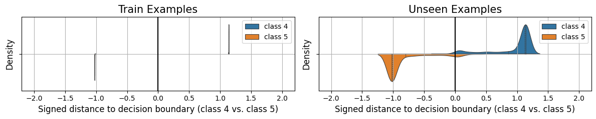

# Margin maximisation and implicit bias

[Effective theory and statistical mechanics](effective-theory-statistical-mechanics.md) ← previous card, next → [Generalisation bounds](generalization-bounds.md)

[Concept card index](index.md), category: [7. Theory and formal results](index.md#cat-7)\
→ Next category: [Grokking](grokking.md)\
← Previous category: [Progress measures](progress-measures.md)

## Definition

**Margin maximisation** is the principle that gradient descent on separable data with a cross-entropy / logistic loss implicitly selects, among all interpolating solutions (those driving the training error to zero), the one with the maximal *margin* (the smallest over the sample gap between the correct logit and the nearest incorrect one, normalised by the weight norm). This implicit preference of the [optimiser](optimizer-adam-adamw-sgd.md) is called **implicit bias**. Applied to [grokking](grokking.md), it yields an account of delayed generalisation: the network quickly reaches zero training error, but the margin grows extremely slowly (for logistic regression at a rate O(1/log t)), so generalisation shows up only as the direction of the weights reaches the max-margin solution \[[1.1](#ref-1-1)\]. The classical result on the convergence of gradient descent to the maximal margin (Soudry et al.,
2018) carries over to homogeneous (positively parameter-homogeneous) networks and is applied to grokking by a whole line of theoretical works \[[1.3](#ref-1-3)\].

## Elaboration

The mechanism rests on splitting training into two stages — the so-called dichotomy of early and late implicit biases \[[1.3](#ref-1-3)\]. In the early stage the network behaves as a kernel predictor — the "lazy" regime, in which the features barely change and the model is linear in its initial tangent features; this is where memorisation happens. In the late, "rich" stage the implicit bias towards margin maximisation switches on, and it is this that pulls the network out of the [memorisation phase](memorization-phase.md) towards the generalising solution \[[1.3](#ref-1-3)\]. Since in homogeneous networks the margin can be scaled arbitrarily by growing the weight norm, the meaningful quantity is the *normalised margin* (the margin divided by the parameter norm); it is to the maximum of the normalised margin that the direction of the weights converges, while the norm itself grows without bound. Different works specify which norm the margin is taken in: ℓ2 in a regression task and ℓ∞ in a classification one \[[1.3](#ref-1-3)\]. For specific algorithmic tasks the max-margin solution is written out explicitly: in [modular addition](modular-arithmetic.md) the network attains the maximal margin when its neurons represent a sufficient set of Fourier frequencies (the spectral components encoding the modular operation), and it is exactly that solution that generalises \[[1.2](#ref-1-2)\]\[[1.5](#ref-1-5)\]. Margin maximisation is closely tied to the reading of grokking through competition of circuits (subnetworks implementing sub-algorithms): "[circuit efficiency](circuit-efficiency.md)" — the ability to produce larger logits at the same weight norm — is in essence a larger normalised margin, so the generalising circuit is described as a large-margin solution \[[3.1](#ref-3-1)\]. In the minimal setting (binary logistic regression) grokking arises at the "edge of linear separability": when the data is barely separable from the origin, the implicit bias towards the hard-margin SVM solution still carries the model to the max-margin solution, but along "flat" directions of the [loss landscape](loss-landscape-basins.md) with almost zero gradient — hence a long delay \[[1.4](#ref-1-4)\]. The question of what exactly sets this bias in motion remains disputed: some theories tie the drift towards the maximal margin to [weight decay](weight-decay.md) (the penalty on the weight norm), but this is contested — such "drift" frames do not explain why, under the same weight decay, isotropic noise or ordinary SGD do not grok \[[2.1](#ref-2-1)\]. A separate line of work supports the claim that it is implicit margin maximisation under cross-entropy that sculpts the structured geometry of the representations, and that the grokking delay is the time this bias needs to do the sculpting \[[3.2](#ref-3-2)\].

A special case of the same line is the **implicit bias of Adam**: adaptive optimisers prefer a different direction from gradient descent, so predictions about the margin do not carry over to them verbatim.

## Alternative definitions and nuances

### A. The classical form: implicit convergence to max-margin on separable data

The basic formulation through implicit-bias theory: on linearly separable data, gradient descent with a logistic or cross-entropy loss converges in direction to the maximal-margin solution, the margin improving slowly (O(1/log t)) while the norm of the classification layer grows fast (O(t)) \[[1.1](#ref-1-1)\]. What matters for grokking: the two rates are orders of magnitude apart, so confident generalisation "catches up" with zero training error at a long lag. The distinguishing machinery is directional convergence (in the direction of the weights, not their norm) to the max-margin classifier \[[1.1](#ref-1-1)\].

### B. Margin maximisation as a shaper of features (feature emergence)

Here the margin is not only a property of the final classifier but also the cause of *which features* appear. For one-hidden-layer networks on modular arithmetic it is proved that at sufficient width the network attains the maximal L2,k+1 margin, and that in this solution every hidden neuron aligns with a specific component of the Fourier spectrum \[[1.2](#ref-1-2)\]. The difference from version A: max-margin fixes not merely the decision boundary but a specific structure of the internal representations (a set of frequencies), which makes the margin bias a theory of *[feature emergence](feature-emergence-feature-learning.md)* rather than only a theory of the separating hyperplane.

### C. Early versus late bias (the kernel → rich transition)

A definition through a change of regime: grokking is the passage from the early implicit bias (the kernel/lazy regime, memorisation) to the late one (margin maximisation in the "rich" regime), and it is the late bias towards the normalised ℓ∞ margin that yields provable generalisation with controlled sample complexity \[[1.3](#ref-1-3)\]. The distinguishing parameter is not the fact of margin maximisation as such but the *moment* it switches on: the gap between the stages is the source of the delay.

### D. The edge of linear separability

A definition through a control parameter of nearness to separability: in binary logistic regression grokking arises when the data is almost linearly separable from the origin under strong noise in the perpendicular directions; the implicit bias towards the hard-margin SVM pulls towards max-margin, but the "flat" directions of the landscape delay the arrival at the global minimum \[[1.4](#ref-1-4)\]. The key difference is an explicit control parameter (the degree of separability) at whose critical value the time to grokking diverges.

### Contested

The drift towards the maximal margin driven by weight decay is contested as a sufficient explanation: "geometric" theories assume a generic gradient flow and do not explain why isotropic noise (SGLD) or ordinary SGD does not grok even when weight decay is present \[[2.1](#ref-2-1)\]. That is, max-margin drift is separated from the specific covariance structure of adaptive optimisers, which on this criticism is the real trigger.

### In support

Joining through circuit efficiency: the generalising solution is defined as the more "efficient" one — producing larger logits at the same weight norm, that is, having a larger normalised margin \[[3.1](#ref-3-1)\]. Joining through the geometry of representations: the emergence of structured circuits is tied directly to implicit margin maximisation under cross-entropy \[[3.2](#ref-3-2)\].

## References

###### ref-1-1
**\[1.1\]** 2206.04817 — Thilak et al., "The Slingshot Mechanism: An Empirical Study of Adaptive Optimizers and the Grokking Phenomenon". [`"converges to the maximum margin solution"`](../papers/2206.04817.the-slingshot-mechanism-an-empirical-study-of-adaptive-optimizers-and-grokking/2206.04817.the-slingshot-mechanism-an-empirical-study-of-adaptive-optimizers-and-grokking.card.md#p2-1).\
Also: [`"the implicit bias of the optimizer coupled with the CE loss, pushes the direction of the classification layer to coincide with that of the maximum margin classifier"`](../papers/2206.04817.the-slingshot-mechanism-an-empirical-study-of-adaptive-optimizers-and-grokking/2206.04817.the-slingshot-mechanism-an-empirical-study-of-adaptive-optimizers-and-grokking.card.md#p4-2).

###### ref-1-2
**\[1.2\]** 2402.09469 — Li, Liang, Shi, Song, Zhou 2024, "Fourier Circuits in Neural Networks and Transformers: A Case Study of Modular Arithmetic with Multiple Inputs". Nuance: the proof is about the maximal-margin solution, not about the course of training. [`"the elucidation of how the principle of margin maximization shapes the features adopted by one-hidden layer neural networks"`](../papers/2402.09469.fourier-circuits-in-neural-networks-and-transformers-a-case-study-of-modular-arithmetic-with-multiple-inputs/original/2402.09469.fourier-circuits-in-neural-networks-and-transformers-a-case-study-of-modular-arithmetic-with-multiple-inputs.md#p1-2).\
Also: [`"has highlighted the implicit bias towards margin maximization inherent in neural network optimization"`](../papers/2402.09469.fourier-circuits-in-neural-networks-and-transformers-a-case-study-of-modular-arithmetic-with-multiple-inputs/original/2402.09469.fourier-circuits-in-neural-networks-and-transformers-a-case-study-of-modular-arithmetic-with-multiple-inputs.md#p5-2).

###### ref-1-3
**\[1.3\]** 2407.12332 — Mohamadi et al., "A Theoretical Analysis of Grokking Modular Addition". [`"focus on the weights learned through margin-maximization implicit bias of gradient descent"`](../papers/2407.12332.why-do-you-grok-a-theoretical-analysis-of-grokking-modular-addition/original/2407.12332.why-do-you-grok-a-theoretical-analysis-of-grokking-modular-addition.md#p10-2).\
Also: [`"a dichotomy of early and late implicit biases of the training algorithm"`](../papers/2407.12332.why-do-you-grok-a-theoretical-analysis-of-grokking-modular-addition/original/2407.12332.why-do-you-grok-a-theoretical-analysis-of-grokking-modular-addition.md#p1-5).

###### ref-1-4
**\[1.4\]** 2410.04489 — Beck et al., "Grokking at the Edge of Linear Separability". [`"implicit bias of gradient descent, we show that logistic regression can exhibit grokking when the training dataset is nearly linearly separable"`](../papers/2410.04489.grokking-at-the-edge-of-linear-separability/2410.04489.grokking-at-the-edge-of-linear-separability.card.md#p1-2).\
Also: [`"determined by the max-margin solution"`](../papers/2410.04489.grokking-at-the-edge-of-linear-separability/2410.04489.grokking-at-the-edge-of-linear-separability.card.md#p25-8).

###### ref-1-5
**\[1.5\]** 2505.18266 — McCracken et al. 2025, "Uncovering a Universal Abstract Algorithm for Modular Addition in Neural Networks". [`"have learned the maximum margin solution"`](../papers/2505.18266.uncovering-a-universal-abstract-algorithm-for-modular-addition-in-neural-networks/original/2505.18266.uncovering-a-universal-abstract-algorithm-for-modular-addition-in-neural-networks.md#p2-2).\
Also: [`"solution maximizes the margin [7], while independently and simultaneously, work connected margin maximization to grokking in similar networks [12]"`](../papers/2505.18266.uncovering-a-universal-abstract-algorithm-for-modular-addition-in-neural-networks/original/2505.18266.uncovering-a-universal-abstract-algorithm-for-modular-addition-in-neural-networks.md#p2-5).

###### ref-1-6
**\[1.6\]** 2311.18817 — Lyu et al., "Dichotomy of Early and Late Phase Implicit Biases Can Provably Induce Grokking". Nuance: the primary source of the early/late implicit-bias dichotomy; the late bias is set by a maximum-margin problem (R1) in classification and a minimum-norm one (R2) in regression, with the switching time $\frac{1}{\lambda}\log\alpha$. [`"our theory suggests a sharp transition at time $\frac{1}{\lambda}\log\alpha$ from max $L^{2}$-margin linear classifier to max $L^{1}$-margin linear classifier"`](../papers/2311.18817.dichotomy-of-early-and-late-phase-implicit-biases-can-provably-induce-grokking/original/2311.18817.dichotomy-of-early-and-late-phase-implicit-biases-can-provably-induce-grokking.md#p7-5).\
Also (a limit of the result that gets lost in citation): [`"the KKT condition is a first-order necessary condition for global optimality, but it is not sufficient in general since $f_{i}({\boldsymbol{\theta}})$ can be highly non-convex"`](../papers/2311.18817.dichotomy-of-early-and-late-phase-implicit-biases-can-provably-induce-grokking/original/2311.18817.dichotomy-of-early-and-late-phase-implicit-biases-can-provably-induce-grokking.md#p6-8).

###### ref-1-7
**\[1.7\]** 2311.07568 — Morwani, Edelman, Oncescu, Zhao, Kakade 2024, "Feature emergence via margin maximization: case studies in algebraic tasks". The first work in which margin maximisation is used not to bound generalisation but as a condition **completely fixing** the features learned; from it the corpus takes the device of a "certificate pair" $(\theta^{*},q^{*})$ and the class-weighted margin that restores neuron-wise decomposability in a multiclass task. Nuance: what is proved is a property of the set of maximal-margin solutions, not of the outcome of training — the link with training runs through the theorem of Wei et al. 2019a about the **global** minima of weakly regularised cross-entropy as $\lambda\to 0$, and the authors themselves call the maximal margin a "proxy". [`"the margin maximization property alone — typically used for the study of generalization — is sufficient to *comprehensively and precisely* characterize the richly structured features that are actually learned by neural networks in these settings"`](../papers/2311.07568.feature-emergence-via-margin-maximization-case-studies-in-algebraic-tasks/2311.07568.feature-emergence-via-margin-maximization-case-studies-in-algebraic-tasks.card.md#p2-1).\
Also (the limit of the result): [`"This provides the motivation behind studying maximum margin classifiers as a proxy for understanding the global minimizers of ${\mathcal{L}}_{\lambda}$ as $\lambda\to 0$."`](../papers/2311.07568.feature-emergence-via-margin-maximization-case-studies-in-algebraic-tasks/2311.07568.feature-emergence-via-margin-maximization-case-studies-in-algebraic-tasks.card.md#p5-11); Also (the power of the device): [`"By just identifying this single solution, we can characterize the set of *all* maximum margin solutions."`](../papers/2311.07568.feature-emergence-via-margin-maximization-case-studies-in-algebraic-tasks/2311.07568.feature-emergence-via-margin-maximization-case-studies-in-algebraic-tasks.card.md#p7-3).

###### ref-1-8
**\[1.8\]** 2406.06158 — Kunin et al., "Get rich quick: exact solutions reveal how unbalanced initializations promote rapid feature learning". Extends theorem 2 of Azulay et al. 2021 to the region $\delta<0$: the interpolating solution minimises a trade-off between minimal norm and preservation of the initial direction, and at vanishing initialisation the upstream and balanced cases are functionally indistinguishable — only downstream makes a difference. Nuance: from the mirror flow on the singular values the authors do not directly derive a claim about the inductive bias at interpolation, since the singular vectors change during training. [`"the dynamics of the singular values of $\beta$ can be described as a mirror flow with a *hyperbolic entropy* potential, which smoothly interpolates between an $\ell^{1}$ and $\ell^{2}$ penalty on the singular values for the rich ($\delta\to 0$) and lazy ($\delta\to\pm\infty$) regimes respectively"`](../papers/2406.06158.get-rich-quick-exact-solutions-reveal-how-unbalanced-initializations-promote-rapid-feature-learning/2406.06158.get-rich-quick-exact-solutions-reveal-how-unbalanced-initializations-promote-rapid-feature-learning.card.md#p8-1).\
Also (depth): [`"This inductive bias strikes a depth-dependent balance between attaining the minimum norm solution and preserving the initialization direction."`](../papers/2406.06158.get-rich-quick-exact-solutions-reveal-how-unbalanced-initializations-promote-rapid-feature-learning/2406.06158.get-rich-quick-exact-solutions-reveal-how-unbalanced-initializations-promote-rapid-feature-learning.card.md#p8-2).
## References of works that joined the discussion

### Contested

###### ref-2-1
**\[2.1\]** 2603.15492 — Acharya et al., "Grokking as a Variance-Limited Phase Transition". Contests: drift towards max-margin under weight decay is insufficient as an explanation. [`"these frameworks assume a generic gradient flow. They often fail to explain why isotropic noise (SGLD) or standard SGD does not grok, even when weight decay is present"`](../papers/2603.15492.grokking-as-a-variance-limited-phase-transition-spectral-gating-and-the-epsilon-stability-threshold/original/2603.15492.grokking-as-a-variance-limited-phase-transition-spectral-gating-and-the-epsilon-stability-threshold.md#p1-7).\
Also: [`"weight decay slowly pushes the model toward max-margin"`](../papers/2603.15492.grokking-as-a-variance-limited-phase-transition-spectral-gating-and-the-epsilon-stability-threshold/original/2603.15492.grokking-as-a-variance-limited-phase-transition-spectral-gating-and-the-epsilon-stability-threshold.md#p1-7) (the contested thesis of "geometric drift").\
Also (direction matters more than magnitude): [`"isotropic noise helps the model move, but geometric rectification ensures it moves in the right direction"`](../papers/2603.15492.grokking-as-a-variance-limited-phase-transition-spectral-gating-and-the-epsilon-stability-threshold/original/2603.15492.grokking-as-a-variance-limited-phase-transition-spectral-gating-and-the-epsilon-stability-threshold.md#p10-3)

### In support

###### ref-3-1
**\[3.1\]** 2309.02390 — Varma et al., "Explaining Grokking Through Circuit Efficiency". Nuance: the efficiency of the generalising circuit = a larger margin at the same norm. [`"producing larger logits with the same parameter norm"`](../papers/2309.02390.explaining-grokking-through-circuit-efficiency/2309.02390.explaining-grokking-through-circuit-efficiency.card.md#p1-3).

###### ref-3-2
**\[3.2\]** 2603.05228 — Yildirim, "The Geometric Inductive Bias of Grokking". Nuance: the emergence of structured circuits is driven by implicit margin maximisation. [`"the emergence of structured circuits is driven by implicit margin maximization under cross-entropy loss"`](../papers/2603.05228.the-geometric-inductive-bias-of-grokking-bypassing-phase-transitions-via-architectural-topology/original/2603.05228.the-geometric-inductive-bias-of-grokking-bypassing-phase-transitions-via-architectural-topology.md#p3-3).

###### ref-3-3
**\[3.3\]** 2505.20172 — Boursier et al., "A Theoretical Framework for Grokking: Interpolation followed by Riemannian Norm Minimisation". Supports and divides the roles: the implicit preference is responsible for the first spell, whereas the second spell is an explicit preference induced by the regulariser, and in the examples it is written out — the $\ell_{1}$ norm for diagonal linear networks, the nuclear norm (that is, low rank) for matrix sensing. [`"While prior work has extensively analysed the first phase via the implicit bias of optimisation algorithms, the second phase—norm minimisation constrained to the interpolation manifold—has received little attention."`](../papers/2505.20172.a-theoretical-framework-for-grokking-interpolation-followed-by-riemannian-norm-minimisation/2505.20172.a-theoretical-framework-for-grokking-interpolation-followed-by-riemannian-norm-minimisation.card.md#p10-4).\
Also (what exactly the second spell prefers): [`"we conclude that in the second, slow phase of the dynamics, the Riemannian gradient flow which minimizes $\|u\|^{2}+\|v\|^{2}$ on $\mathcal{M}^{*}$ tends to drift towards solutions of low $\ell_{1}$ norm"`](../papers/2505.20172.a-theoretical-framework-for-grokking-interpolation-followed-by-riemannian-norm-minimisation/2505.20172.a-theoretical-framework-for-grokking-interpolation-followed-by-riemannian-norm-minimisation.card.md#p27-4).

###### ref-3-4
**\[3.4\]** 2603.07323 — Truong, Truong, "Norm-Hierarchy Transitions in Representation Learning…". Nuance: the slowness of the implicit bias is declared measurable through the norm gap. [`"implicit bias is slow, and the slowness is quantifiable via $\Delta V$"`](../papers/2603.07323.norm-hierarchy-transitions-in-representation-learning-when-and-why-neural-networks-abandon-shortcuts/2603.07323.norm-hierarchy-transitions-in-representation-learning-when-and-why-neural-networks-abandon-shortcuts.card.md#p16-4).
###### ref-3-5
**\[3.5\]** 2411.03541 — Kumar, Bordelon, Pehlevan, Murthy & Gershman 2024, "Do Mice Grok? Glimpses of Hidden Progress During Overtraining in Sensory Cortex". Carries the corpus's margin line over to living cortex: of three notions of margin maximisation, the one adopted is that in which the features change and the decoder is retrained to convergence at every step, and the SVM margin on piriform data grows over the days of overtraining. Nuance: the causal argument is a single hinge ablation in a synthetic model. [`"if the margin of the max-margin (converged) classifier is increasing in (3), it implies the features are evolving to allow for a max-margin classifier with larger margin"`](../papers/2411.03541.do-mice-grok-glimpses-of-hidden-progress-during-overtraining-in-sensory-cortex/original/2411.03541.do-mice-grok-glimpses-of-hidden-progress-during-overtraining-in-sensory-cortex.md#p6-2).\
Also (the result on the neural data): [`"PPC representations evolve to increase the margin of the maximum margin classifier trained on those representations"`](../papers/2411.03541.do-mice-grok-glimpses-of-hidden-progress-during-overtraining-in-sensory-cortex/original/2411.03541.do-mice-grok-glimpses-of-hidden-progress-during-overtraining-in-sensory-cortex.md#p7-1).

###### ref-3-6
**\[3.6\]** 2602.12039 — Beck, Bar-Sinai & Levi 2026, "The Implicit Bias of Logit Regularization". The implicit-bias frame is extended to a class of convex logit penalties: a finite target minimum replaces margin maximisation by a clustering of the logits, and for Gaussian data or a quadratic loss it is proved that the optimal direction is the Fisher discriminant, depending only on the geometry of the data. [`"In the unregularized case ($\alpha=0$), the per-sample cross-entropy loss $\ell_{\mathrm{CE}}$ is monotonic, and the optimal solution maximizes the margins"`](../papers/2602.12039.the-implicit-bias-of-logit-regularization/original/2602.12039.the-implicit-bias-of-logit-regularization.md#p2-11).\
Also (the Fisher discriminant): [`"If the data is Gaussian, the optimal weight direction is $\hat{\boldsymbol{S}}_{\min}\propto\Sigma^{-1}\mu$"`](../papers/2602.12039.the-implicit-bias-of-logit-regularization/original/2602.12039.the-implicit-bias-of-logit-regularization.md#p3-12).

###### ref-3-7
**\[3.7\]** 2606.05863 — Tan, Gai & Zhang 2026, "Deciphering Two Training Clocks in Grokking via Deep Linear Network Theory with Conditional ReLU Reduction". A rare piece of care in a place usually passed over in silence: a deliberately negative lemma showing that a constant positive margin does not give a uniform Polyak–Łojasiewicz condition for cross-entropy (the softmax Hessian degenerates as the margin grows) — so the fast clock of fitting honestly hangs on an assumption of growing margins rather than on PL contraction. [`"margin persistence alone is insufficient to justify geometric decay of the cross-entropy loss"`](../papers/2606.05863.deciphering-two-training-clocks-in-grokking-via-deep-linear-network-theory-with-conditional-relu-reduction/2606.05863.deciphering-two-training-clocks-in-grokking-via-deep-linear-network-theory-with-conditional-relu-reduction.card.md#p8-8)..

###### ref-3-8
**\[3.8\]** 2602.08302 — Das, Vedantam, Lakshminarayanan 2026, "Grokking in Linear Models for Logistic Regression". The apparatus of Soudry et al. is carried through to a solvable model of grokking: $\mathbf{w}(t)=\hat{\mathbf{w}}\log t+\rho(t)$ converges in direction to the max-margin separator early (phase 1), while the delay is created entirely by the late support-vector dynamics of the bias, $\frac{db}{dt}=\frac{1}{t}(A_{S}^{+}e^{-b}-A_{S}^{-}e^{b})$, with the limit $b_{\infty}=-\log\delta$, where $\delta=\sqrt{A_{S}^{-}/A_{S}^{+}}$ is the skew of the support vectors. Nuance: in parameters the model does not converge to the generalising solution at all ($b_{\infty}\neq 0$) — what generalises is only the normalised distance $|b|/||\mathbf{w}||$; the theorem is proved for the exponential loss while the experiments use the logistic one, and the condition "the support vectors span the data" is not checked at $d=1024$. [`"For any smooth monotonically decreasing loss function with an exponential tail, and for small learning rate, gradient descent iterates follow"`](../papers/2602.08302.grokking-in-linear-models-for-logistic-regression/original/2602.08302.grokking-in-linear-models-for-logistic-regression.md#p3-17).\
Also (the unlearning): [`"The asymmetry between $A_{S}^{+}e^{-b}$ and $A_{S}^{-}e^{b}$ drives $b$ away from the generalizing solution $b=0$."`](../papers/2602.08302.grokking-in-linear-models-for-logistic-regression/original/2602.08302.grokking-in-linear-models-for-logistic-regression.md#p6-3).
## Passing mentions

Works that only mention the phenomenon — a literature review, a related-work paragraph, a passing citation — without examining it.

**\[4.1\]** 2501.04697 — Prieto et al., "Grokking at the Edge of Numerical Stability". [`"attributed this increased robustness to a bias of SGD towards a max-margin solution"`](../papers/2501.04697.grokking-at-the-edge-of-numerical-stability/2501.04697.grokking-at-the-edge-of-numerical-stability.card.md#p10-1).

**\[4.2\]** 2506.05718 — Notsawo et al., "Grokking Beyond the Euclidean Norm of Model Parameters". [`"This behavior arises from the principle of margin maximization, even without explicit regularization, providing a theoretical explanation for grokking"`](../papers/2506.05718.grokking-beyond-the-euclidean-norm-of-model-parameters/original/2506.05718.grokking-beyond-the-euclidean-norm-of-model-parameters.md#p17-2).

**\[4.3\]** 2510.04930 — Saheb Pasand et al., "Egalitarian Gradient Descent: A Simple Approach to Accelerated Grokking". [`"correspond to the large margin of the training data (their separation is 2s)"`](../papers/2510.04930.egalitarian-gradient-descent-a-simple-approach-to-accelerated-grokking/original/2510.04930.egalitarian-gradient-descent-a-simple-approach-to-accelerated-grokking.md#fig-5).

**\[4.4\]** 2604.00316 — Tomàs et al., "Breaking Data Symmetry is Needed For Generalization in Feature Learning Kernels". [`"These works attempt to explain grokking via margin maximization (Morwani et al., 2024)"`](../papers/2604.00316.breaking-data-symmetry-is-needed-for-generalization-in-feature-learning-kernels/original/2604.00316.breaking-data-symmetry-is-needed-for-generalization-in-feature-learning-kernels.md#p8-3).

**\[4.5\]** 2312.06581 — Stander et al. 2024, "Grokking Group Multiplication with Cosets". A conjecture about why the coset circuit concentrates on exactly one irreducible representation; there is no experiment in that direction. [`"We hypothesize that it may have something to do with the margin maximization effect discussed in [Morwani et al. 2024]."`](../papers/2312.06581.grokking-group-multiplication-with-cosets/original/2312.06581.grokking-group-multiplication-with-cosets.md#p23-5).

**\[4.6\]** 2310.02541 — Xu et al. 2023. Nuance: generalisation is attributed to the implicit regularisation of GD, and the lower bound is derived through the normalised margin ${\mathbb{E}}_{x\sim N(\nu,I_{p})}[f(x;W)]/\|W\|_{F}$; but the work does not consider the limiting direction as $t\to\infty$, so it cannot be used to judge convergence to a margin-maximising solution. [`"showed how stationary points of margin-maximization problems associated with homogeneous neural network training problems can exhibit benign overfitting"`](../papers/2310.02541.benign-overfitting-and-grokking-in-relu-networks-for-xor-cluster-data/original/2310.02541.benign-overfitting-and-grokking-in-relu-networks-for-xor-cluster-data.md#p3-1).

**\[4.7\]** 2407.20199 — Mallinar et al., "Emergence in non-neural models: grokking modular arithmetic via average gradient outer product". Nuance: the margin-maximisation line is mentioned as promising but not examined; the work conducts no analysis of margins of its own. [`"While the direction is promising, general underlying principles have not yet been elucidated."`](../papers/2407.20199.emergence-in-non-neural-models-grokking-modular-arithmetic-via-average-gradient-outer-product/original/2407.20199.emergence-in-non-neural-models-grokking-modular-arithmetic-via-average-gradient-outer-product.md#p15-2).

**\[4.8\]** 2606.13753 — Truong, "The Weight Norm Sets the Grokking Timescale: A Causal Delay Law". Nuance: the dichotomy of late-phase implicit biases is mentioned in a single survey phrase alongside lazy-to-rich; there are no measurements of the margin in the work. [`"Related accounts cast the jump as a lazy-to-rich transition [7], or as a late-phase implicit-bias dichotomy [8], connected to the classical max-margin bias of gradient descent [9]."`](../papers/2606.13753.the-weight-norm-sets-the-grokking-timescale-a-causal-delay-law/2606.13753.the-weight-norm-sets-the-grokking-timescale-a-causal-delay-law.card.md#p2-3).
