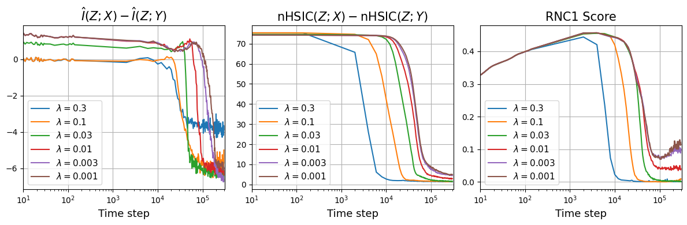

# Neural collapse

[Group representations and cosets](group-representations-cosets.md) ← previous card, next → [The Clock and the Pizza algorithms](clock-vs-pizza.md)

[Concept card index](index.md), category: [2. Mechanisms and representations](index.md#cat-2)\
→ Next category: [Modular arithmetic](modular-arithmetic.md)\
← Previous category: [Grokking](grokking.md)

## Definition

Neural collapse (NC) is a structural phenomenon of the terminal phase of training deep networks: the representations of objects of one class in the penultimate layer (the layer before the classifier) contract towards their class mean, while the centred class means arrange themselves into a symmetric configuration — a Simplex Equiangular Tight Frame (ETF: a set of vectors of equal length with pairwise equal angles). The notion was introduced by Papyan, Han and Donoho (2020); into the context of [grokking](grokking.md) — delayed generalisation, where test performance rises sharply long after overfitting — it was carried by Sakamoto and Sato, who proposed to explain the late-phase phenomena of training through the lens of neural collapse, which characterises the geometry of the learned representations \[[1.1](#ref-1-1)\].

## Elaboration

Classically NC is described by three properties: NC1 — "variability collapse", where the within-class variance of the representations (the spread of the vectors of objects of one class) tends to zero; NC2 — the centred class means form a simplex ETF; NC3 — "self-duality", the rows of the classifier's weight matrix align with the class means. Sakamoto and Sato tie NC1 in particular to grokking: they derive an upper bound on the generalisation error through the population within-class variance and show that the collapse of the empirical within-class representations on the training data (NC1 proper) governs the late transition \[[1.1](#ref-1-1)\]. The work claims for the first time that the dynamics of neural collapse provides a unified explanation of two late-phase phenomena at once — grokking and the information bottleneck (the network's gradual discarding of input information irrelevant to the task) \[[1.1](#ref-1-1)\].

The causal role of NC is contested. Han et al. separate neural collapse from "flatness" (small curvature of the [loss landscape](loss-landscape-basins.md) near the solution) and, using grokking as an observation window, find that what predicts generalisation is flatness alone and not collapse \[[2.1](#ref-2-1)\]. On the other hand, NC is used as a working geometric assumption: in an analysis of the [slingshot](slingshot.md) (periodic late-stage loss spikes) the collapse state interacts with [softmax collapse](softmax-collapse.md) (the zeroing of the correct class's gradient through an absorption error in floating-point arithmetic) \[[3.2](#ref-3-2)\]. Earlier still, the [effective theory](effective-theory-statistical-mechanics.md) of representations partially reproduced NC — it predicted the contraction to class means (NC1) but not the construction of an ETF (NC2) \[[3.1](#ref-3-1)\]. NC is set alongside other late-phase phenomena — [emergence](emergence.md) and the lazy/rich regime (lazy training with almost no change of features, against "rich" training with their rearrangement) — as is visible in the passing mentions too (see "Passing mentions").

## Alternative definitions and nuances

### A. NC as a measure of the contraction of within-class variance

On Sakamoto and Sato's reading, the [order parameter](order-parameter.md) (the quantity whose value marks the transition) is the population within-class variance of the representations, while its empirical counterpart NC1 is tied to it through an analysis analogous to a generalisation-error bound. The key difference from Papyan et al.'s original definition is that the emphasis falls not on the static geometry of the ETF but on the DYNAMICS of NC1: the desynchronisation of the timescales of fitting the training set and of the progress of collapse is what produces the delay in grokking.

### B. NC as an assumed feature geometry

In the work of Liu Hanqing et al., neural collapse is not a phenomenon to be explained but an initial assumption about the structure of feature space in the terminal phase: the model is taken to have converged to a collapse state, which fixes the geometry of the classifier's weight matrix and of its input activations \[[3.2](#ref-3-2)\]. The difference lies in the direction of the inference: not "what causes NC" but "what follows from NC" — it is precisely from the assumed collapse that the numerical feature inflation triggering the slingshot is derived.

### Contested

Han et al. contest outright the widespread assumption that collapse is necessary for generalisation \[[2.1](#ref-2-1)\]. The source of the divergence is an interventional contrast: models that are encouraged to collapse and models that are prevented from collapsing generalise equally well, whereas regularising against flatness shifts generalisation in time. So the discriminating feature is flatness, not collapse \[[2.1](#ref-2-1)\].

### In support

The effective theory of representations of Liu et al. supports NC partially, as a testable consequence of its own dynamics: it can predict the same-class collapse (contraction to class means) but does not necessarily put the class means into equiangular tight frames \[[3.1](#ref-3-1)\]. The distinguishing nuance: NC1 (contraction to class means) is reproduced but not NC2 (the ETF); the authors conjecture that an ETF requires an explicit mutual repulsion between classes.

## References

###### ref-1-1
**\[1.1\]** 2509.20829 — Sakamoto and Sato, "Explaining Grokking and Information Bottleneck through Neural Collapse Emergence". [`"through the lens of neural collapse, which characterizes the geometry of learned representations"`](../papers/2509.20829.explaining-grokking-and-information-bottleneck-through-neural-collapse-emergence/2509.20829.explaining-grokking-and-information-bottleneck-through-neural-collapse-emergence.card.md#p1-2)..\
Also (on NC1): [`"whose properties include the collapse of empirical within-class representations in the training data, known as NC1"`](../papers/2509.20829.explaining-grokking-and-information-bottleneck-through-neural-collapse-emergence/2509.20829.explaining-grokking-and-information-bottleneck-through-neural-collapse-emergence.card.md#p2-1)..\
Also (the unified explanation): [`"demonstrate that the dynamics of neural collapse (Papyan et al., 2020) provide a unified explanation for these late-phase phenomena"`](../papers/2509.20829.explaining-grokking-and-information-bottleneck-through-neural-collapse-emergence/2509.20829.explaining-grokking-and-information-bottleneck-through-neural-collapse-emergence.card.md#p1-5)..

## References of works that joined the discussion

### Contested

###### ref-2-1
**\[2.1\]** 2509.17738 — Han et al., "Flatness is Necessary, Neural Collapse is Not: Rethinking Generalization via Grokking". Contests: collapse is not necessary for generalisation; its causal role is taken over by flatness. [`"we challenge the common conjecture that NC is necessary for generalization"`](../papers/2509.17738.flatness-is-necessary-neural-collapse-is-not-rethinking-generalization-via-grokking/original/2509.17738.flatness-is-necessary-neural-collapse-is-not-rethinking-generalization-via-grokking.md#p2-1)..\
Also (the definition): [`"Neural collapse, i.e., the emergence of highly symmetric, class-wise clustered representations, is frequently observed in deep networks and is often assumed to reflect or enable generalization"`](../papers/2509.17738.flatness-is-necessary-neural-collapse-is-not-rethinking-generalization-via-grokking/original/2509.17738.flatness-is-necessary-neural-collapse-is-not-rethinking-generalization-via-grokking.md#p1-2)..\
Also (the intervention): [`"Models encouraged to collapse or prevented from collapsing generalize equally well"`](../papers/2509.17738.flatness-is-necessary-neural-collapse-is-not-rethinking-generalization-via-grokking/original/2509.17738.flatness-is-necessary-neural-collapse-is-not-rethinking-generalization-via-grokking.md#p1-2)..

###### ref-2-2
**\[2.2\]** 2606.08985 — Tan, Gai & Zhang 2026, "Beyond Neural Collapse: Task-Intrinsic Geometry Governs Neural Representations in Modular Arithmetic". Contests the geometric prediction of a simplex ETF as the benchmark for modular arithmetic: the right class of comparison is "the best separation compatible with the task symmetry under the induced regularisation", where a cyclic rank-2 code loses only a bounded $O(1)$ in cross-entropy and gains $\Theta(K)$ in the complexity penalty; exactly two hand-built configurations are compared, and there is no training in the work. [`"The correct theoretical benchmark is not *maximal separation at any dimension*, but rather *best separation compatible with the task symmetry under the regularization actually induced during training*"`](../papers/2606.08985.beyond-neural-collapse-task-intrinsic-geometry-governs-neural-representations-in-modular-arithmetic/2606.08985.beyond-neural-collapse-task-intrinsic-geometry-governs-neural-representations-in-modular-arithmetic.card.md#p3-1)..

### In support

###### ref-3-1
**\[3.1\]** 2205.10343 — Liu et al., "Towards Understanding Grokking: An Effective Theory of Representation Learning". Nuance: the effective theory reproduces NC1 (contraction to class means) but not NC2 (the ETF). [`"It was observed in [28] that image representations in the penultimate layer of the model have some interesting features"`](../papers/2205.10343.towards-understanding-grokking-an-effective-theory-of-representation-learning/original/2205.10343.towards-understanding-grokking-an-effective-theory-of-representation-learning.md#p23-6)..\
Also (the partiality): [`"Our effective theory is able to predict the same-class collapse, but does not necessarily put class-means into equiangular tight frames"`](../papers/2205.10343.towards-understanding-grokking-an-effective-theory-of-representation-learning/original/2205.10343.towards-understanding-grokking-an-effective-theory-of-representation-learning.md#p23-6)..

###### ref-3-2
**\[3.2\]** 2605.06152 — Liu, Cao, Li, Zhou 2026, "Grokking or Glitching? How Low-Precision Drives Slingshot Loss Spikes". Nuance: NC is taken as the initial feature geometry, and through its interaction with softmax collapse the slingshot is derived from it. No measure of departure from NC is reported in the experiments. [`"We assume the model has converged to the Neural Collapse (NC) state, which characterizes the geometry of the classifier weight matrix $\boldsymbol{W}$ and its input activations (features) $\boldsymbol{h}$"`](../papers/2605.06152.grokking-or-glitching-how-low-precision-drives-slingshot-loss-spikes/original/2605.06152.grokking-or-glitching-how-low-precision-drives-slingshot-loss-spikes.md#p4-8).\
Also (the role in the slingshot): [`"the interaction between SC and NC induces *Numerical Feature Inflation*, a process that directly triggers the Slingshot Mechanism"`](../papers/2605.06152.grokking-or-glitching-how-low-precision-drives-slingshot-loss-spikes/original/2605.06152.grokking-or-glitching-how-low-precision-drives-slingshot-loss-spikes.md#p4-10).\
Also (a survey of the dispute): [`"While generalization does not strictly require NC, Han et al. Han et al. (2025) suggest that models exhibit a strong propensity toward NC in the absence of explicit regularization"`](../papers/2605.06152.grokking-or-glitching-how-low-precision-drives-slingshot-loss-spikes/original/2605.06152.grokking-or-glitching-how-low-precision-drives-slingshot-loss-spikes.md#p3-2).

###### ref-3-4
**\[3.4\]** 2604.20923 — Golwala, "ILDR: Geometric Early Detection of Grokking". [`"The post-grokking stabilization of ILDR may relate to neural collapse dynamics (Papyan et al., 2020), which is left for future work."`](../papers/2604.20923.ildr-geometric-early-detection-of-grokking/original/2604.20923.ildr-geometric-early-detection-of-grokking.md#p13-3).\
Also (for the coordinator, not for the card): in `2509.20829` exactly this quantity — the ratio of traces — is examined and rejected as conflating the within-class and the between-class parts, which is why RNC1 is introduced there; in `2509.17738`, in the same penultimate layer, the measure of class clustering (NCC) is already falling during the memorisation phase. Neither of the two works is mentioned here, and no comparison is made.
###### ref-3-5
**\[3.5\]** 2602.12039 — Beck, Bar-Sinai & Levi 2026, "The Implicit Bias of Logit Regularization". In the multiclass case the clustering targets form the vertices of a symmetric simplex in logit space — the resemblance to neural collapse is asserted by the authors with the word "reminiscent", and not a single NC measure is computed; grokking is reproduced as a late fall of the logits into the simplex vertices. [`"The set of target vectors $\{\boldsymbol{z}^{*}_{(1)},\dots,\boldsymbol{z}^{*}_{(K)}\}$ forms the vertices of a symmetric simplex in logit space"`](../papers/2602.12039.the-implicit-bias-of-logit-regularization/original/2602.12039.the-implicit-bias-of-logit-regularization.md#p8-2)..

## Passing mentions

Works that only mention the phenomenon — a literature review, a related-work paragraph, a passing citation — without examining it.

**\[4.1\]** 2604.00316 — Tomàs et al., "Breaking Data Symmetry is Needed For Generalization in Feature Learning Kernels". [`"such as low-rank matrix recovery (Radhakrishnan et al., 2024b), neural collapse (Beaglehole et al., 2024b)"`](../papers/2604.00316.breaking-data-symmetry-is-needed-for-generalization-in-feature-learning-kernels/original/2604.00316.breaking-data-symmetry-is-needed-for-generalization-in-feature-learning-kernels.md#p8-4)..

**\[4.2\]** 2604.13123 — Truong Xuan Khanh et al., "Spectral Entropy Collapse as a Phase Transition in Delayed Generalisation: An Interventional and Predictive Framework for Grokking". [`"Papyan et al. (2020) documented *neural collapse*, the terminal-phase convergence of last-layer features to a simplex equiangular tight frame"`](../papers/2604.13123.spectral-entropy-collapse-as-a-phase-transition-in-delayed-generalisation/2604.13123.spectral-entropy-collapse-as-a-phase-transition-in-delayed-generalisation.card.md#p3-3).

**\[4.3\]** 2210.15435 — Žunkovič, Ilievski, "Grokking phase transitions in learning local rules with gradient descent". Nuance: one of the first works to put neural collapse and grokking side by side as two observations about the terminal phase of training — and one that admits outright that no relation between them had been discussed, and that the authors themselves do not observe NC. The work measures none of the four NC quantities; in training the full model it says only that "phenomena related to neural collapse" are observed. [`"However, no relation to grokking has been discussed so far. Although we do not observe NC as defined above, our findings regarding the spikes in the training loss and latent-space data structure might also be relevant for the NC dynamics."`](../papers/2210.15435.grokking-phase-transitions-in-learning-local-rules-with-gradient-descent/2210.15435.grokking-phase-transitions-in-learning-local-rules-with-gradient-descent.card.md#p5-1).\
Also (the framing of the question): [`"Two recent empirical observations, neural collapse [5] and grokking (generalisation beyond over-fitting) [6], can help us understand the training and generalisation properties of over-parameterised models."`](../papers/2210.15435.grokking-phase-transitions-in-learning-local-rules-with-gradient-descent/2210.15435.grokking-phase-transitions-in-learning-local-rules-with-gradient-descent.card.md#p3-1).

**\[4.4\]** 2402.15555 — Humayun, Balestriero, Baraniuk 2024, "Deep Networks Always Grok and Here is Why". Neural collapse is named in the conclusions as a possible but unexplored connection with region migration; the work computes no measure of neural collapse. [`"There can be possible connections between region migration and neural collapse (Papyan et al. 2020) which are not explored in this paper."`](../papers/2402.15555.deep-networks-always-grok-and-here-is-why/original/2402.15555.deep-networks-always-grok-and-here-is-why.md#p9-6).

**\[4.5\]** 2407.20199 — Mallinar et al., "Emergence in non-neural models: grokking modular arithmetic via average gradient outer product". Nuance: deep neural collapse is named as one of the phenomena explicable by AGOP-based mechanisms; there are no measurements of collapse in the work. [`"These include generalization with multi-index models [32], deep neural collapse [7], and the ability to perform low-rank matrix completion [36]."`](../papers/2407.20199.emergence-in-non-neural-models-grokking-modular-arithmetic-via-average-gradient-outer-product/original/2407.20199.emergence-in-non-neural-models-grokking-modular-arithmetic-via-average-gradient-outer-product.md#p16-4).

**\[4.6\]** 2606.13753 — Truong et al. 2026, "The Weight Norm Sets the Grokking Timescale: A Causal Delay Law". Carries a mechanism across two phenomena: the rate-versus-threshold dissociation found for the penultimate-layer feature norm under neural collapse is declared to be the same as that for the weight norm under grokking, and the null result of a one-shot rescaling of the features (the norm self-corrects back, and the collapse time does not change) is named outright as what prompted their experimental design — the effect shows up only under continuous clamping. Nuance: the cited work (arXiv:2604.00230) is not part of the corpus, so the transfer can only be checked from the citing paper's account; there are no measurements of neural collapse of its own here. [`"the feature norm self-corrects back to the same value from either direction, with collapse time essentially unchanged ($p>0.2$), and the authors read this as evidence that the threshold is a gradient-flow *attractor rather than a cause*"`](../papers/2606.13753.the-weight-norm-sets-the-grokking-timescale-a-causal-delay-law/2606.13753.the-weight-norm-sets-the-grokking-timescale-a-causal-delay-law.card.md#p3-2).\
Also (what the parallel consists in): [`"A parallel study of neural-collapse dynamics [19] reports the same rate-vs-threshold dissociation for a *different* observable — the penultimate-layer *feature* norm in image classification"`](../papers/2606.13753.the-weight-norm-sets-the-grokking-timescale-a-causal-delay-law/2606.13753.the-weight-norm-sets-the-grokking-timescale-a-causal-delay-law.card.md#p2-3).

### External works

###### ref-5-1
**\[5.1\]** 2406.03999 — External work (demoted from the corpus): Song, Tan, Zou, Ma, Huang, "Unveiling the Dynamics of Information Interplay in Supervised Learning". From the conditions of neural collapse, exact values are derived for two matrix quantities relating the Gram matrix of the classification head's rows to the Gram matrix of the class means: $\operatorname{HDR}=0$ and $\operatorname{MIR}=\frac{1}{C-1}+\frac{(C-2)\log(C-2)}{(C-1)\log(C-1)}$ ([theorem 4.2](../externals/2406.03999.unveiling-the-dynamics-of-information-interplay-in-supervised-learning/2406.03999.unveiling-the-dynamics-of-information-interplay-in-supervised-learning.card.md#p3-19)). [`"HDR reaches the minimum possible value and MIR approximately reaches the highest possible value"`](../externals/2406.03999.unveiling-the-dynamics-of-information-interplay-in-supervised-learning/2406.03999.unveiling-the-dynamics-of-information-interplay-in-supervised-learning.card.md#p3-22).\
Also (what is inferred from this): [`"In summary, MIR and HDR effectively describe the process of training towards Neural Collapse."`](../externals/2406.03999.unveiling-the-dynamics-of-information-interplay-in-supervised-learning/2406.03999.unveiling-the-dynamics-of-information-interplay-in-supervised-learning.card.md#p4-12) The conclusion is drawn from the shape of the curves: the conditions NC1–NC3 are never checked in the work, and in [fig. 1](../externals/2406.03999.unveiling-the-dynamics-of-information-interplay-in-supervised-learning/2406.03999.unveiling-the-dynamics-of-information-interplay-in-supervised-learning.card.md#fig-1) the MIR on CIFAR-10 reaches only about 0.55 against a theoretical $\approx 0.996$ for ten classes.\
Also (the batch-level estimate): [`"Due to constraints in computational resources, we approximate the dataset’s matrix entropy using batch matrix entropy."`](../externals/2406.03999.unveiling-the-dynamics-of-information-interplay-in-supervised-learning/2406.03999.unveiling-the-dynamics-of-information-interplay-in-supervised-learning.card.md#p4-10) On CIFAR-100 the batch (64) is smaller than the number of classes (100).
