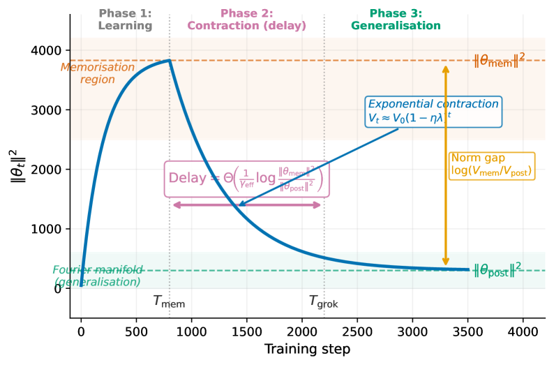

# The Norm-Separation Delay Law

[Generalisation bounds](generalization-bounds.md) ← previous card, next → [Kolmogorov complexity](kolmogorov-complexity.md)

[Concept card index](index.md), category: [7. Theory and formal results](index.md#cat-7)\
→ Next category: [Grokking](grokking.md)\
← Previous category: [Progress measures](progress-measures.md)

## Definition

The norm-separation delay law is a quantitative law introduced by Truong et al. \[[1.1](#ref-1-1)\], stating that the [grokking](grokking.md) delay (the interval between the memorisation step Tmem and the generalisation step Tgrok) scales as Θ((1/γeff)·log(‖θmem‖²/‖θpost‖²)): inversely with the effective rate of norm contraction γeff (for [SGD](optimizer-adam-adamw-sgd.md) this is the product of the [learning rate](learning-rate.md) and the weight-decay coefficient, ηλ; for AdamW γeff ≥ ηλ) and logarithmically with the ratio of the squared L2 norms of the memorising solution θmem and the generalising solution θpost \[[1.1](#ref-1-1)\]. In the same work grokking is recast not as a mysterious artefact of optimisation but as a norm-driven representational phase transition in regularised training dynamics \[[1.1](#ref-1-1)\].

## Elaboration

The law's mechanism splits the delay into two structurally different phases \[[1.1](#ref-1-1)\]. In the "optimisation escape" phase, weight decay ([weight decay](weight-decay.md) — the L2 regularisation penalising the weight norm) exponentially contracts the parameter norm by a factor 1 − ηλ per step, carrying the trajectory away from the high-norm memorisation manifold towards the low-norm "Fourier manifold" — the subspace of structured, generalising solutions implementing the correct periodic (Fourier) scheme for modular arithmetic. The delay is exactly the time such an exponential contraction needs to cross the geometric norm gap log(‖θmem‖²/‖θpost‖²); hence the logarithmic dependence and the role of the weight norm as an [order parameter](order-parameter.md) (a quantity from statistical physics whose jump marks a [phase transition](phase-transition.md)). In the second phase (statistical confirmation), after entry into the Fourier region a uniform validation margin opens up and the accumulation of evidence gives a sharp rise in test accuracy — that is, the exit from the [memorisation phase](memorization-phase.md) proper. The upper bound on the delay is proved by a discrete Lyapunov contraction argument, the matching lower bound from dynamical constraints of regularised first-order optimisation, which makes the characterisation tight. The key nuance: norm separation (the strict inequality ‖θmem‖ > ‖θpost‖) is declared not a correlation but a necessary condition for grokking \[[1.1](#ref-1-1)\]. Empirically, over 293 runs (modular addition, multiplication and sparse parity) three falsifiable predictions are confirmed: inverse scaling with weight decay, inverse scaling with learning rate, and a logarithmic dependence on the norm ratio; where the norm ratio is inverted (sparse parity) the delay is zero, exactly as the necessity theorem requires. A separate observation of the work — that grokking requires an optimiser able to decouple memorisation from contraction (AdamW groks, SGD at the same hyperparameters does not) — sharpens the boundaries of the law's applicability. The thesis that the weight norm is a sufficient but not a timely predictive signal is contested by an earlier work \[[2.1](#ref-2-1)\]; the necessity of norm separation is independently confirmed by an architectural experiment \[[3.1](#ref-3-1)\].

## Alternative definitions and nuances

### A. The delay as the time to contract a geometric norm gap

The first self-contained reading defines the law dynamically: the order parameter is the squared weight norm Vt = ‖θt‖², high-norm memorising interpolants are non-stationary under weight decay (no such θ satisfies the stationarity condition ∇L + λθ = 0), so regularisation contracts the norm exponentially with base 1 − ηλ per step \[[1.1](#ref-1-1)\]. The delay is then the number of steps in which the exponential process closes the gap log(Vmem/Vpost); hence the key difference from purely "mechanistic" or "circuit" accounts of grokking: the time of the transition is set not by the appearance of a particular circuit but by the scalar geometry of the norms and the contraction rate γeff. The immediate consequence: the delay scales inversely with the effective contraction rate and logarithmically with the ratio of the memorisation and generalisation norms \[[1.1](#ref-1-1)\].

### B. Norm separation as a necessary condition (a mechanistic characterisation)

The second reading shifts the emphasis from the size of the delay to the existence of the transition itself: the law is stated as a necessity theorem (Theorem 3.8) — under regularised first-order optimisation a positive grokking delay is impossible without the strict separation ‖θmem‖ > ‖θpost‖ \[[1.1](#ref-1-1)\]. The distinguishing source of difference here is not the rate but the sign of the norm gap: if the norm ratio does not exceed one (as in sparse parity, where the final norm is larger than the memorisation norm), there is no delayed transition at all, and norm separation turns from an observed correlate into a testable causal characterisation of grokking.

### Contested

The work on grokking "from a robustness viewpoint" \[[2.1](#ref-2-1)\] contests the law's central premise — that the weight norm predicts the delay closely and in a timely way. The distinguishing thesis: the popular L2 weight norm is declared a sufficient but not a necessary signal of grokking, and empirically the norm correlates with test generalisation "not in a timely way" — that is, the fall of the norm and grokking proper are separated in time, so the norm is a poor predictor of the moment of transition. Robustness-based and information-theoretic metrics are proposed instead and called better indicators of grokking than the weight norm itself. This undercuts exactly the tight temporal tie between the delay and the norm ratio on which the law rests (chronologically the work precedes the law's formalisation, but empirically it strikes at its main assumption).

### In support

The architectural work on geometric inductive bias \[[3.1](#ref-3-1)\] independently confirms the direction of necessity. The distinguishing source of support is an orthogonal, architectural test: instead of analysing a trained network, the authors remove the very possibility of norm separation in advance by introducing a fully bounded spherical topology (L2 normalisation throughout the residual stream). High-norm memorising interpolants then cannot be built, the norm gap collapses, the "escape" phase is eliminated, and the network generalises with no memorisation phase at all — exactly as the necessity theorem predicts \[[3.1](#ref-3-1)\]. The authors read their own architectural intervention directly through the law's dynamics: weight decay exponentially contracts the parameter norms, and where there is no norm gap this contraction phase has nothing to cross.

## References

###### ref-1-1
**\[1.1\]** 2603.13331 — Truong et al., "The Norm-Separation Delay Law of Grokking: A First-Principles Theory of Delayed Generalization". [`"We call this the Norm-Separation Delay Law."`](../papers/2603.13331.the-norm-separation-delay-law-of-grokking-a-first-principles-theory-of-delayed-generalization/2603.13331.the-norm-separation-delay-law-of-grokking-a-first-principles-theory-of-delayed-generalization.card.md#p2-5).\
Also (the recasting thesis): [`"grokking is a norm-driven representational phase transition in regularised training dynamics"`](../papers/2603.13331.the-norm-separation-delay-law-of-grokking-a-first-principles-theory-of-delayed-generalization/2603.13331.the-norm-separation-delay-law-of-grokking-a-first-principles-theory-of-delayed-generalization.card.md#p1-2).\
Also (necessity): [`"norm separation is a necessary condition for grokking"`](../papers/2603.13331.the-norm-separation-delay-law-of-grokking-a-first-principles-theory-of-delayed-generalization/2603.13331.the-norm-separation-delay-law-of-grokking-a-first-principles-theory-of-delayed-generalization.card.md#p2-6).

## References of works that joined the discussion

### Contested

###### ref-2-1
**\[2.1\]** 2311.06597 — Tan et al., "Understanding Grokking Through A Robustness Viewpoint". Contests: the weight norm is a sufficient but neither timely nor necessary predictor of the delay; robustness metrics work better. [`"We also empirically find that l2 norm correlates with grokking on the test data not in a timely way"`](../papers/2311.06597.understanding-grokking-through-a-robustness-viewpoint/2311.06597.understanding-grokking-through-a-robustness-viewpoint.card.md#p1-2).\
Also: [`"This makes them better indicators for grokking than the l2 weight norm."`](../papers/2311.06597.understanding-grokking-through-a-robustness-viewpoint/2311.06597.understanding-grokking-through-a-robustness-viewpoint.card.md#p9-8).

###### ref-2-2
**\[2.2\]** 2606.18465 — Truong 2026, "What Does the Weight Norm Control in Grokking? Logit-Scale Mediation under Cross-Entropy". Contests the reading of the clamped dose–response (see \[3.4\]) — and this is a self-refutation: the same group, the same setting and the same calibration ($w_{c}=54.49$; the slope times the calibration, $0.140\cdot 54.49\approx 7.6$, reproduces that work's exponent $\alpha=7.64$), yet the earlier work is not named in the bibliography. The clamp holds the scalar norm by rescaling the weights, which drags the logit scale along with it; an untrainable temperature at a clamped norm restores $0.83\text{–}0.89$ of the norm-induced delay by restoring the logit scale alone, and the dose–response itself is demoted to an empirical regularity read off the measurements. [`"So when a higher held norm lengthens the delay, we cannot yet tell whether the scalar norm is the operative variable or whether it is the logit scale that the rescaling drags along"`](../papers/2606.18465.what-does-the-weight-norm-control-in-grokking-logit-scale-mediation-under-cross-entropy/2606.18465.what-does-the-weight-norm-control-in-grokking-logit-scale-mediation-under-cross-entropy.card.md#p2-1).\
Also (the standing of the law): [`"We read this as a robust empirical regularity of the fixed-norm dose response, not a law derived from first principles"`](../papers/2606.18465.what-does-the-weight-norm-control-in-grokking-logit-scale-mediation-under-cross-entropy/2606.18465.what-does-the-weight-norm-control-in-grokking-logit-scale-mediation-under-cross-entropy.card.md#p3-5).
### In support

###### ref-3-1
**\[3.1\]** 2603.05228 — Yildirim, "The Geometric Inductive Bias of Grokking: Bypassing Phase Transitions via Architectural Topology". Nuance: an independent confirmation of the necessity theorem — removing the architectural capacity for norm separation removes the delayed transition. [`"This is consistent with Truong et al.’s necessity theorem: when the architectural capacity for norm separation is absent, no delayed transition is possible"`](../papers/2603.05228.the-geometric-inductive-bias-of-grokking-bypassing-phase-transitions-via-architectural-topology/original/2603.05228.the-geometric-inductive-bias-of-grokking-bypassing-phase-transitions-via-architectural-topology.md#p15-2).\
Also: [`"during which weight decay exponentially contracts parameter norms"`](../papers/2603.05228.the-geometric-inductive-bias-of-grokking-bypassing-phase-transitions-via-architectural-topology/original/2603.05228.the-geometric-inductive-bias-of-grokking-bypassing-phase-transitions-via-architectural-topology.md#p15-1).

**\[4.1\]** 2408.11804 — Yunis et al., "Approaching Deep Learning through the Spectral Dynamics of Weights". Nuance: the work derives no temporal regularity and does not measure the time to generalisation, but its observation reads as an upper bound on theories that derive the delay from the weight norm: two generalising solutions of one task differ in norm by a factor of several, while the low-rank behaviour is shared. [`"We currently lack a precise understanding of how low-rank behavior directly relates to generalization"`](../papers/2408.11804.approaching-deep-learning-through-the-spectral-dynamics-of-weights/original/2408.11804.approaching-deep-learning-through-the-spectral-dynamics-of-weights.md#p6-2).

###### ref-3-3
**\[3.3\]** 2605.20441 — Verma 2026, "Weight Decay Regimes in Grokking Transformers: Cheap Online Diagnostics". The first empirical check of the AdamW amplification factor from the delay law, and an inversion of it: where Truong et al. predict a delay, here a threshold is predicted through a dual horizon constraint, $\lambda_{c}=-\ln(1-p_{\text{relax}})/(\eta\kappa T_{\max})$. Nuance: the delay law itself is not tested on these data, the argument rests on two fitted quantities (only $p_{\text{relax}}=0.99$ out of five values checked falls inside the interval), and $\kappa$ is bimodal across seeds — the author calls the result a calibrated consistency check rather than a derivation from first principles. [`"Where Khanh et al. predict the grokking *delay* via Lyapunov contraction, we predict the critical *threshold* via the dual horizon constraint, with cross-seed bimodal $\kappa$ documenting a remaining gap that motivates the SDE-based refinement they leave open."`](../papers/2605.20441.weight-decay-regimes-in-grokking-transformers-cheap-online-diagnostics/original/2605.20441.weight-decay-regimes-in-grokking-transformers-cheap-online-diagnostics.md#p17-2).\
Also (the numerical agreement): [`"The natural physical choice $p_{\text{relax}}{=}0.99$ (matching the test-accuracy $\geq 0.99$ grokking criterion) gives $\lambda_{c}^{\text{bound}}=0.0124$, inside the empirical 95% CI $[0.0109,0.0200]$ for $\lambda_{c}=0.0158$."`](../papers/2605.20441.weight-decay-regimes-in-grokking-transformers-cheap-online-diagnostics/original/2605.20441.weight-decay-regimes-in-grokking-transformers-cheap-online-diagnostics.md#p26-4).

###### ref-3-4
**\[3.4\]** 2606.13753 — Truong et al. 2026, "The Weight Norm Sets the Grokking Timescale: A Causal Delay Law". The experimental half of the same programme, run by the same group: where the theory predicts the logarithmic delay of free contraction, the clamp **blocks** the contraction path and measures the exponential cost of being held away from the threshold. The two laws are declared complementary, not one and the same; the authors do not claim a quantitative match of the exponent $\alpha\approx 7.5$ with the closed-form formula and leave its derivation to future work. An essential nuance: the earlier work's key experiment is described here as a "causal test by freezing the norm", implying that freezing the norm prevents grokking — there is no such experiment in the cited work (necessity there is proved by a theorem and checked by a negative example on sparse parity), and the one fixed-norm intervention examined there acts the other way round. [`"The exponential pinned-norm law is thus complementary to, not the same as, the logarithmic free-contraction law"`](../papers/2606.13753.the-weight-norm-sets-the-grokking-timescale-a-causal-delay-law/2606.13753.the-weight-norm-sets-the-grokking-timescale-a-causal-delay-law.card.md#p9-1).\
Also (the limit of the claim): [`"We do not claim a quantitative match between the measured exponent $\alpha\approx 7.5$ and a closed-form theoretical prediction"`](../papers/2606.13753.the-weight-norm-sets-the-grokking-timescale-a-causal-delay-law/2606.13753.the-weight-norm-sets-the-grokking-timescale-a-causal-delay-law.card.md#p9-1).

###### ref-3-5
**\[3.5\]** 2607.12735 — Howe 2026, "What Makes a Representational Prior Work? Feature Families, Label-Free Invariances, and Critical Windows in Grokking". The exponent of the clamped law (see \[3.4\]) is for the first time measured in both regimes — with and without a representational prior grafted on: plain cross-entropy follows a steep exponential (a slope of $0.344$ per unit of norm — a lower bound, since the high-norm cells are censored entirely), whereas with the structural prior the slope falls to $0.020$, and the law is restated as conditional on structure-agnostic training. Nuance: the flattening estimate is a ratio of two slopes with censoring in opposite directions, without confidence intervals, over 3 seeds per cell; at the optimal clamp ($\sim 45$) plain cross-entropy generalises just as fast as the prior — the speed of low-norm training belongs to the norm control itself. [`"The delay law is thus conditional on structure-agnostic training in a precise, measurable sense: the exponent is a function of the representational forces present."`](../papers/2607.12735.what-makes-a-representational-prior-work-feature-families-label-free-invariances-and-critical-windows-in-grokking/2607.12735.what-makes-a-representational-prior-work-feature-families-label-free-invariances-and-critical-windows-in-grokking.card.md#p4-2).\
Also (the size of the flattening): [`"plain CE slows $31\times$ per $+10$ norm units (and is fully censored by $+20$), while the prior slows only $1.22\times$ — a ${\sim}17\times$ flattening of the exponent"`](../papers/2607.12735.what-makes-a-representational-prior-work-feature-families-label-free-invariances-and-critical-windows-in-grokking/2607.12735.what-makes-a-representational-prior-work-feature-families-label-free-invariances-and-critical-windows-in-grokking.card.md#p4-2).
###### ref-3-6
**\[3.6\]** 2607.04333 — Howe 2026, "Structure-Specific Representational Priors Causally Control the Grokking Delay". A bound on the delay law's range in norm: the per-epoch norm trajectory of a SupCon run, reproduced on plain cross-entropy (a matched-counterfactual method), gives the disease without the benefit — 0/15 generalisations, logits up to $\sim 10^{4}$, confidence $>0.99$, a diverging test entropy — whereas the structural prior generalises at norms of 105–150, where structure-agnostic training dies; the law is declared a law for structure-agnostic training, and the same knob is turned the other way: the median speed-up is monotone in the norm level held (a clamp at $\Vert W\Vert=45$ — $8.6\times$, reproduction — $6.6\times$, annealing — $1.7\times$), with individual seeds within 850 epochs. Nuance: there is no "norm clamp on plain CE without SupCon" run, so the prior's contribution to the $8.6\times$ is not separated from the leverage of the law itself; the monotonicity rests on four points, of which a pair with nearly equal norms (56 against 57) differ in speed by $2.4\times$ — the level held is admitted to be an incomplete summary. [`"the norm signature of acceleration confers no acceleration."`](../papers/2607.04333.structure-specific-representational-priors-causally-control-the-grokking-delay/2607.04333.structure-specific-representational-priors-causally-control-the-grokking-delay.card.md#p6-2).

### Inheriting

###### ref-3-2
**\[3.2\]** 2603.07323 — Truong, Truong, "Norm-Hierarchy Transitions in Representation Learning: When and Why Neural Networks Abandon Shortcuts". Nuance: a generalisation of the law to an arbitrary pair of manifolds; grokking is declared a special case, but the work contains no runs on it of its own. [`"Setting $\mathcal{M}_{\mathrm{sc}}=\mathcal{M}_{\mathrm{mem}}$ and $\mathcal{M}_{\mathrm{st}}=\mathcal{M}_{\mathrm{post}}$ recovers the Norm-Separation Delay Law"`](../papers/2603.07323.norm-hierarchy-transitions-in-representation-learning-when-and-why-neural-networks-abandon-shortcuts/2603.07323.norm-hierarchy-transitions-in-representation-learning-when-and-why-neural-networks-abandon-shortcuts.card.md#p5-10).\
Also (the limit of the transfer): [`"The quantitative delay law $T\propto 1/\lambda$ does not hold ($r=-0.43$)"`](../papers/2603.07323.norm-hierarchy-transitions-in-representation-learning-when-and-why-neural-networks-abandon-shortcuts/2603.07323.norm-hierarchy-transitions-in-representation-learning-when-and-why-neural-networks-abandon-shortcuts.card.md#p7-6).
