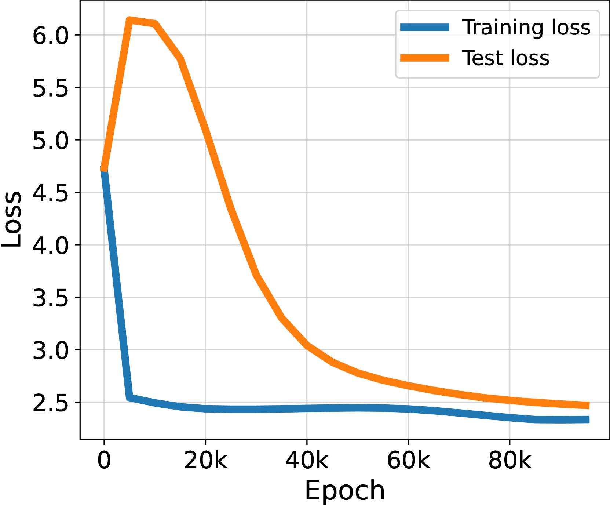

# StableMax / perp-Grad (numerical-stability fix)

[Grokfast / gradient low-pass filtering](gradient-low-pass-filtering.md) ← previous card, next → [Freezing a subnetwork / edge-popup](freezing-subnetwork.md)

[Concept card index](index.md), category: [5. Interventions and methods](index.md#cat-5)\
→ Next category: [Progress measures](progress-measures.md)\
← Previous category: [Weight decay (L2 regularisation)](weight-decay.md)

## Definition

**The numerical-stability fix** is a family of interventions proposed by Prieto et al. (2025) that remove either the numerical failure of the softmax ([Softmax Collapse](softmax-collapse.md)) or the gradient component that produces it ([naive loss minimisation, NLM](nlm.md)), and thereby switch [grokking](grokking.md) on without regularisation. The two key remedies are **StableMax** (a replacement for the softmax that does not saturate at large logits) and **⊥Grad** (an [optimiser](optimizer-adam-adamw-sgd.md) that removes the NLM direction from the gradient); the simplest variant is raising the arithmetic precision from float32 to float64 \[[1.1](#ref-1-1)\].

## Elaboration

All three remedies strike at one and the same chain: past the point of overfitting the gradient goes almost entirely into the NLM direction — growth of the **logits** (the network's pre-softmax outputs) without any change of prediction — which sooner or later causes an **absorption error** (a small addend lost when added to a much larger one) in the softmax and zeroes the gradient, halting training right after the [memorisation phase](memorization-phase.md) \[[1.1](#ref-1-1)\]. The remedies differ in which link of the chain they intervene at.

**StableMax** replaces the exponential in the softmax with a "softer" ramp function that grows linearly rather than exponentially for a positive argument and decays more slowly for a negative one; the summation therefore produces no extreme addends, and the loss is computed stably even under unboundedly growing logits \[[1.1](#ref-1-1)\]. Tellingly, StableMax yields grokking **while the weight norm is growing** (Fig. 4) — that is, it decouples grokking from the customary fall of the weight norm and shows that a decrease of the weight norm is not required for grokking \[[1.1](#ref-1-1)\]. **Raising the precision** to float64 acts in the same spirit: it only **postpones** the absorption-error threshold and cannot be extended indefinitely, so with small datasets it does not save the day \[[1.1](#ref-1-1)\]. **⊥Grad** strikes not at the symptom but at the cause: it keeps in the step only that part of the gradient which is orthogonal to the current direction of the weights (that is, it cuts out the NLM direction), and therefore leads to generalisation with no initial overfitting phase at all, in settings where without regularisation no improvement on the test set is usually observed \[[1.1](#ref-1-1)\].

The works that joined the discussion assess these remedies differently. Yıldırım objects that StableMax merely **tolerates** unbounded scaling, leaving the model numerically stable while the logits grow, whereas a norm-bounded spherical topology architecturally **removes the very degree of freedom** responsible for the growth \[[2.1](#ref-2-1)\]. Liu et al. confirm the instrumental part: casting the output logits to float64 only during the loss computation removes the numerical spike (the [slingshot](slingshot.md)) — but stress that precision cures the symptom rather than the cause: the growth of the logits does not stop with more bits \[[3.2](#ref-3-2)\]. Singh et al. simply **adopt StableMax** and report that it already accelerates the onset of grokking on its own \[[3.1](#ref-3-1)\].

## Alternative definitions and nuances

### A. A fix by symptom (stable computation of the softmax)

A reading through removal of the numerical failure: StableMax and higher precision do not touch the dynamics of the weights but make the computation of the softmax and the loss stay correct at arbitrarily large logits \[[1.1](#ref-1-1)\]. The source of the difference: the remedy is fixed by the **symptom** (the arithmetic of the softmax), while the logits still grow — only their numerical consequence is removed.

### B. A fix by cause (removal of the NLM direction)

A reading through removal of the generating mechanism: ⊥Grad projects the gradient onto the hyperplane orthogonal to the weight vector, cutting out the direction that only scales the logits; as a result the pathology never arises and grokking comes without any preceding overfitting \[[1.1](#ref-1-1)\]. The source of the difference: the intervention is tied to the **cause** (the NLM component of the gradient), not to the moment of the numerical failure.

### Contested

- **A fix as an architectural removal of a degree of freedom** \[[2.1](#ref-2-1)\]: Yıldırım holds that StableMax merely lets the model stay numerically stable during unbounded scaling, whereas it would be more correct to remove the radial degree of freedom of the residual stream itself (a bounded [spherical](spherical-weight-norm-constraint.md) topology). The source of the difference: numerical stabilisation is read as a half-measure that leaves the first cause (the growth of magnitudes) untouched.

### In support

- **A fix as a ready-made accelerating tool** \[[3.1](#ref-3-1)\]: Singh et al. use StableMax cross-entropy as a working remedy and observe that it already gives an acceleration of grokking by itself. The source of the difference: the remedy is taken utilitarianly, without a reassessment of the mechanism.
- **A fix by precision as a symptomatic remedy** \[[3.2](#ref-3-2)\]: Liu et al. confirm that casting the logits to float64 removes the numerical spike, but show that more bits do not stop the growth of the logits. The source of the difference: the precision variant of the fix is granted to work against the symptom and to be insufficient against the cause.

## References

###### ref-1-1
**\[1.1\]** 2501.04697 — Prieto et al., "Grokking at the Edge of Numerical Stability". [`"stable version of Softmax (StableMax), cause grokking in settings where it was previously absent without regularization"`](../papers/2501.04697.grokking-at-the-edge-of-numerical-stability/2501.04697.grokking-at-the-edge-of-numerical-stability.card.md#p2-4).\
Also (StableMax, the mechanism): [`"we propose using a softer version of Softmax to transform logits into probabilities before calculating the CE Loss"`](../papers/2501.04697.grokking-at-the-edge-of-numerical-stability/2501.04697.grokking-at-the-edge-of-numerical-stability.card.md#p5-4).\
Also (StableMax, the form): [`"a simple ramp function that scales linearly instead of exponentially"`](../papers/2501.04697.grokking-at-the-edge-of-numerical-stability/2501.04697.grokking-at-the-edge-of-numerical-stability.card.md#p5-7).\
Also (raising the precision): [`"The simplest way to avoid SC is to extend the FP precision from float32 to float64 for the Softmax calculation"`](../papers/2501.04697.grokking-at-the-edge-of-numerical-stability/2501.04697.grokking-at-the-edge-of-numerical-stability.card.md#p5-3).\
Also (the limit of precision): [`"FP precision cannot be extended indefinitely to allow for generalization"`](../papers/2501.04697.grokking-at-the-edge-of-numerical-stability/2501.04697.grokking-at-the-edge-of-numerical-stability.card.md#p5-3).\
Also (⊥Grad, the rule): [`"the part of the gradient that is orthogonal to the current direction of the weights"`](../papers/2501.04697.grokking-at-the-edge-of-numerical-stability/2501.04697.grokking-at-the-edge-of-numerical-stability.card.md#p8-6).\
Also (⊥Grad, the result): [`"lead to generalization without a phase of initial overfitting, in contexts where no improvement in test performance is usually observed without weight decay"`](../papers/2501.04697.grokking-at-the-edge-of-numerical-stability/2501.04697.grokking-at-the-edge-of-numerical-stability.card.md#p8-11).\
Also (the decoupling from the weight norm): [`"this happens while the norm of the weights increases substantially"`](../papers/2501.04697.grokking-at-the-edge-of-numerical-stability/2501.04697.grokking-at-the-edge-of-numerical-stability.card.md#p5-10).

## References of works that joined the discussion

### Contested

###### ref-2-1
**\[2.1\]** 2603.05228 — Yıldırım, "The Geometric Inductive Bias of Grokking: Bypassing Phase Transitions via Architectural Topology". Contests: StableMax merely permits numerically stable scaling rather than removing it; it is more correct to remove the degree of freedom architecturally. [`"While recent work proposes numerical stabilizations (e.g., StableMax) that allow models to remain numerically stable during this unconstrained scaling phase"`](../papers/2603.05228.the-geometric-inductive-bias-of-grokking-bypassing-phase-transitions-via-architectural-topology/original/2603.05228.the-geometric-inductive-bias-of-grokking-bypassing-phase-transitions-via-architectural-topology.md#p10-2).\
Also (the alternative): [`"our bounded spherical topology instead removes this internal magnitude degree of freedom at the architectural level"`](../papers/2603.05228.the-geometric-inductive-bias-of-grokking-bypassing-phase-transitions-via-architectural-topology/original/2603.05228.the-geometric-inductive-bias-of-grokking-bypassing-phase-transitions-via-architectural-topology.md#p10-2).

### In support

###### ref-3-1
**\[3.1\]** 2511.04760 — Singh et al., "When Data Falls Short: Grokking Below the Critical Threshold". Nuance: StableMax is taken as a ready-made remedy and accelerates the onset of grokking. [`"We utilize StableMax Cross Entropy [27] since cross entropy with softmax function causes numerical instability"`](../papers/2511.04760.when-data-falls-short-grokking-below-the-critical-threshold/original/2511.04760.when-data-falls-short-grokking-below-the-critical-threshold.md#p3-3).\
Also (the acceleration): [`"We observe that the usage of StableMax [27] already gives a prior speedup in inducing grokking"`](../papers/2511.04760.when-data-falls-short-grokking-below-the-critical-threshold/original/2511.04760.when-data-falls-short-grokking-below-the-critical-threshold.md#p3-5).

###### ref-3-2
**\[3.2\]** 2605.06152 — Liu, Cao, Li, Zhou 2026, "Grokking or Glitching? How Low-Precision Drives Slingshot Loss Spikes". Nuance: the fix through precision removes the numerical spike but does not remove the growth of the logits in a language model. [`"Even when model parameters are stored in float32, casting the output logits to float64 solely during the loss computation is sufficient to eliminate the Slingshot effect"`](../papers/2605.06152.grokking-or-glitching-how-low-precision-drives-slingshot-loss-spikes/original/2605.06152.grokking-or-glitching-how-low-precision-drives-slingshot-loss-spikes.md#p3-4).\
Also (the counter-case): [`"higher precision does not reduce logit growth in this setting. After $10^{5}$ steps, the mean logit is $183$ under float32 training, but increases to $498$ when the loss is computed in float64"`](../papers/2605.06152.grokking-or-glitching-how-low-precision-drives-slingshot-loss-spikes/original/2605.06152.grokking-or-glitching-how-low-precision-drives-slingshot-loss-spikes.md#p9-4).

###### ref-3-3
**\[3.3\]** 2607.05104 — Ootani 2026, "Grokking Is Conditional and Fragile: A Fully-Tractable, Multi-Seed Study at 12K Parameters". A numerical blade of a new kind, different from Softmax Collapse: changing the number of CPU threads — a pure permutation of the summation order under non-associative floating-point addition (4 and 16 threads give bit-identical weights; the clean perturbation is 1 against 4) — flips the grok outcome for 49 of 300 paired seeds (mean shift of best accuracy 0.17, maximum 0.85), while CPU against GPU with TF32 disabled flips 19 of 100; neither perturbation shifts the aggregate share (McNemar $p=0.39$/$1.0$, Newcombe intervals within $\pm 10$ points). In Prieto et al. the numerical failure systematically suppresses grokking; here the perturbation permutes which seeds generalise without changing how many. Nuance: the reading "the basin is so shallow that sub-ULP differences decide entry" is declared a reading, not a measurement; the share of flips rests on a threshold of 0.70, and in 16% of cases seeds that sat at the threshold cannot be separated out; the setting is narrow — Intel MKL on AMD Zen 2 and a single RTX 3090 Ti. [`"The perturbation flips *which* seeds generalize, not *how many*."`](../papers/2607.05104.grokking-is-conditional-and-fragile-a-fully-tractable-multi-seed-study-at-12k-parameters/original/2607.05104.grokking-is-conditional-and-fragile-a-fully-tractable-multi-seed-study-at-12k-parameters.md#p8-1).

## Passing mentions

Works that only mention the phenomenon — a literature review, a related-work paragraph, a passing citation — without examining it.

**\[4.1\]** 2410.04489 — Beck et al., "Grokking at the Edge of Linear Separability". [`"and of numerical precision (Prieto et al., 2025), which may significantly impact grokking in certain scenarios"`](../papers/2410.04489.grokking-at-the-edge-of-linear-separability/2410.04489.grokking-at-the-edge-of-linear-separability.card.md#p2-3).

**\[4.2\]** 2509.21519 — Tian, "Provable Scaling Laws of Feature Emergence from Learning Dynamics of Grokking". [`"(Prieto et al., 2025) uses stable softmax (linear form) rather than regular softmax (exponential form) in computing probability"`](../papers/2509.21519.provable-scaling-laws-of-feature-emergence-from-learning-dynamics-of-grokking/original/2509.21519.provable-scaling-laws-of-feature-emergence-from-learning-dynamics-of-grokking.md#p11-8).

**\[4.3\]** 2510.04930 — Saheb Pasand et al., "Egalitarian Gradient Descent: A Simple Approach to Accelerated Grokking". [`"Prieto et al. (2025) argue that operating near the edge of numerical stability can induce grokking-like delays and propose remedies that restore or accelerate test performance"`](../papers/2510.04930.egalitarian-gradient-descent-a-simple-approach-to-accelerated-grokking/original/2510.04930.egalitarian-gradient-descent-a-simple-approach-to-accelerated-grokking.md#p4-1).

**\[4.4\]** 2603.15492 — Acharya, Dhakal, "Grokking as a Variance-Limited Phase Transition: Spectral Gating and the Epsilon-Stability Threshold". Nuance: the stability parameter $\epsilon$ is made the control: grokking lives in a narrow band near the level of [gradient noise](gradient-noise.md). [`"Grokking occurs when $\epsilon$ is balanced"`](../papers/2603.15492.grokking-as-a-variance-limited-phase-transition-spectral-gating-and-the-epsilon-stability-threshold/original/2603.15492.grokking-as-a-variance-limited-phase-transition-spectral-gating-and-the-epsilon-stability-threshold.md#p3-11)

**\[4.5\]** 2503.23298 — Wang et al., "Learning Towards Emergence: Paving the Way to Induce Emergence by Inhibiting Monosemantic Neurons on Pre-trained Models". Nuance: the denominator of the monosemanticity measure blows the gradients up, which is cured by taking a logarithm. [`"we discovered that the denominator term $S^{2}$ could become extremely small, leading to unstable gradients"`](../papers/2503.23298.learning-towards-emergence-inhibiting-monosemantic-neurons-on-pre-trained-models/2503.23298.learning-towards-emergence-inhibiting-monosemantic-neurons-on-pre-trained-models.card.md#p7-5)

**\[4.6\]** 2504.16041 — Tveit, Remseth, Skogvold, "Muon Optimizer Accelerates Grokking". Nuance: the experimental design was two-factor (2 optimisers x 3 softmax variants) and would have allowed measuring whether Muon's gain overlaps with the numerical-stability fix, yet only the main effect of the optimiser is reported — not a word is said about what stablemax and sparsemax gave; ⊥Grad is not tested. [`"we also explored the potential influence of the softmax activation function, motivated by research suggesting numerical stability issues in standard softmax can affect grokking [4]"`](../papers/2504.16041.muon-optimizer-accelerates-grokking/original/2504.16041.muon-optimizer-accelerates-grokking.md#p3-1).\
Also: [`"A variant using a piecewise transformation designed to enhance numerical stability"`](../papers/2504.16041.muon-optimizer-accelerates-grokking/original/2504.16041.muon-optimizer-accelerates-grokking.md#p3-2).

**\[4.7\]** 2505.15624 — AlQuabeh, Bojković, Nwadike, Inui, "Mechanistic Insights into Grokking from the Embedding Layer". A mention only: Prieto et al. is named as connecting delayed generalisation with numerical instability and declared complementary — there the numerical instability of the softmax, here a disproportion of the updates. Nuance: neither StableMax, nor $\perp$Grad, nor the softmax-collapse phenomenon itself is reproduced or tested in the work; the shared motif "grokking as a trouble of optimisation" remains asserted. [`"Prieto et al. (prieto2025grokking) connect delayed generalization to numerical instability (Softmax Collapse), proposing solutions that complement our focus on structural coupling and gradient imbalance."`](../papers/2505.15624.mechanistic-insights-into-grokking-from-the-embedding-layer/original/2505.15624.mechanistic-insights-into-grokking-from-the-embedding-layer.md#p3-1)..

**\[4.8\]** 2506.23286 — Jeffares & van der Schaar, "Not All Explanations for Deep Learning Phenomena Are Equally Valuable". Nuance: neither an analysis of the mechanism nor an assessment of the replacement's range of applicability; in the same paragraph, someone else's result about delayed adversarial robustness is also attributed to Prieto et al. [`"On the methodological front, grokking encouraged Prieto et al. 2025 to highlight numerical instabilities in the *Softmax* function and develop a more stable alternative"`](../papers/2506.23286.not-all-explanations-for-deep-learning-phenomena-are-equally-valuable/original/2506.23286.not-all-explanations-for-deep-learning-phenomena-are-equally-valuable.md#p4-2).
