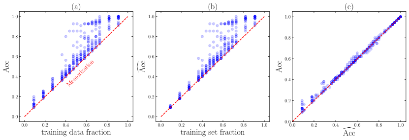

# Order parameter

[Time to grokking](grokking-time.md) ← previous card, next → [seed-variance-reproducibility](seed-variance-reproducibility.md)

[Concept card index](index.md), category: [6. Analytical tools and metrics](index.md#cat-6)\
→ Next category: [Effective theory and statistical mechanics](effective-theory-statistical-mechanics.md)\
← Previous category: [Grokfast / gradient low-pass filtering](gradient-low-pass-filtering.md)

## Definition

**An order parameter** is a macroscopic scalar (more rarely vector) quantity characterising the state of a system and changing abruptly when a control parameter (the quantity being varied — sample size, weight-decay strength, number of training steps) crosses a critical threshold; in statistical physics it is the canonical marker of a [phase transition](phase-transition.md) \[[1.2](#ref-1-2)\]. In theories of [grokking](grokking.md), an order parameter is an internal quantity whose jump (or crossing of a threshold) marks the passage from memorisation to generalisation; it was first formalised as the overlap of a neuron's weights with the "teacher" direction (the target vector in a teacher–student setting) \[[1.1](#ref-1-1)\].



## Elaboration

The notion comes from [statistical mechanics](effective-theory-statistical-mechanics.md): at a continuous (second-order) transition the order parameter grows smoothly from zero with diverging fluctuations, whereas at a first-order transition it changes by a jump, reflecting the coexistence and exchange of phases \[[1.2](#ref-1-2)\]. Its chief role is to reduce a high-dimensional state of the network to a single scalar: in Rubin et al. the posterior over all the weights is reduced to a probability over a single quantity Φ (the overlap of a neuron's weights with the teacher vector), and it is exactly the jump of Φ between saddles of the action that constitutes a first-order phase transition \[[1.1](#ref-1-1)\]. Different works propose order parameters of their own for grokking: in Hong et al. it is lexical coherence (consistency at the level of words), playing the part of an order parameter for [emergent](emergence.md) linguistic abilities (skills that appear suddenly as scale grows) \[[1.2](#ref-1-2)\]; in Truong et al. it is the spectral entropy of the representation covariance \[[3.1](#ref-3-1)\]; in Bi et al. it is the head–tail spectral contrast of the representations' eigenspectrum \[[2.1](#ref-2-1)\]. The very fitness of an order parameter as proof of a transition is contested: Bi et al. insist that fitting a sigmoid to a single run is not enough and demand finite-size scaling — checks of the crossing of Binder cumulants (dimensionless combinations of the order parameter's moments) and of the power-law growth of the susceptibility \[[2.1](#ref-2-1)\] — while Truong et al., supporting the frame, qualify that a single scalar order parameter does not fully describe the spread across random initialisations \[[3.1](#ref-3-1)\].

## Alternative definitions and nuances

### A. The formal statistical-physics order parameter: overlap with the teacher

The strictest reading — a literal statistical-physics order parameter. Rubin et al. show that in a suitable scaling limit the whole posterior over the network's weights reduces to a scalar probability over a single quantity Φ = w·w* (the overlap of a neuron's weight vector with the teacher's) \[[1.1](#ref-1-1)\]. The control parameter u (an effective interaction set by the sample size, the [noise](gradient-noise.md) and the network width) generates new saddles of the action at a critical u_c, and the mean of Φ changes by a jump — which makes grokking a first-order phase transition. The key difference: the order parameter is derived from a first-principles statistical-physics model, and its discontinuity is a prediction of the theory rather than merely an observed step on a curve.

### B. Landau's canonical definition and a lexical order parameter

Hong et al. take the textbook Landau–Lifshitz definition: an order parameter is a macroscopic quantity characterising the state of the system and changing abruptly as a control parameter crosses a critical threshold; at a continuous transition it grows smoothly from zero, at a first-order one it jumps \[[1.2](#ref-1-2)\]. Applying this to small transformer language models, they appoint a concrete order parameter — lexical coherence (structure at the level of words) — whose synchronous discontinuities during training mark the appearance of connected speech. The key difference from reading A: the order parameter here is not derived from a model but chosen as a measurable observable, and the transition is diagnosed from its empirical discontinuity directly on a linear (not logarithmic) training scale.

### Contested

**An order parameter proves nothing by itself** \[[2.1](#ref-2-1)\]: Bi et al. object to the practice accepted in machine learning of "fitting a sigmoid to one run and declaring a transition". They accept the head–tail spectral contrast as a representation-level order parameter but demand the full finite-size diagnostic chain (a crossing of Binder cumulants across group size p, a power-law growth of the susceptibility), which rejects a smooth crossover (a difference of 16.8 in AIC in favour of a transition) — while the order of the transition itself remains undetermined. The source of the difference: an order parameter is legitimate only inside a falsifiable FSS protocol, not as a free analogy.

### In support

**Spectral entropy as a phenomenological order parameter** \[[3.1](#ref-3-1)\]: Truong et al. join the frame, introducing an order parameter for the geometry of representations — the spectral entropy of the activation covariance, invariant to a rescaling of the weights (unlike compression and complexity measures, which live in parameter space). A qualifying nuance: a single scalar order parameter cannot fully capture the stochasticity across seeds (different initialisations reach the entropy threshold at different speeds), so the power law predicting the time to grokking is presented as a probabilistic forecast rather than a deterministic one. The source of the difference: the same order-parameter frame, but carried into activation space and honestly bounded by a single scalar.

## References

###### ref-1-1
**\[1.1\]** 2310.03789 — Rubin et al., "Grokking as a First Order Phase Transition in Two Layer Networks". [`"can be approximately marginalized to track a single random variable called an order parameter"`](../papers/2310.03789.grokking-as-a-first-order-phase-transition-in-two-layer-networks/original/2310.03789.grokking-as-a-first-order-phase-transition-in-two-layer-networks.md#p4-2).\
Also: [`"Notably, this expression reduces the high-dimensional network posterior into a scalar probability"`](../papers/2310.03789.grokking-as-a-first-order-phase-transition-in-two-layer-networks/original/2310.03789.grokking-as-a-first-order-phase-transition-in-two-layer-networks.md#p6-4).

###### ref-1-2
**\[1.2\]** 2511.12768 — Hong et al., "Evidence of Phase Transitions in Small Transformer-Based Language Models". [`"Landau and Lifshitz’s canonical treatment establishes the foundational concepts: an order parameter—a macroscopic quantity characterizing the state of the system—changes abruptly as a control parameter crosses a critical threshold [8]"`](../papers/2511.12768.evidence-of-phase-transitions-in-small-transformer-based-language-models/original/2511.12768.evidence-of-phase-transitions-in-small-transformer-based-language-models.md#p2-3).\
Also: [`"We argue that lexical-level coherence functions as an order parameter for emergent linguistic ability"`](../papers/2511.12768.evidence-of-phase-transitions-in-small-transformer-based-language-models/original/2511.12768.evidence-of-phase-transitions-in-small-transformer-based-language-models.md#p1-9).


###### ref-1-3
**\[1.3\]** 2505.11411 — Zhang, Shang, Yang, Zhang, "Is Grokking a Computational Glass Relaxation?". Appoints the test accuracy as the order parameter explicitly and by analogy with density at a liquid–gas transition, and builds a denial of a first-order transition on its continuity. Nuance: the same quantity serves as the second sampling coordinate and, for the sake of a gradient in the parameters, is smoothed by a sigmoid with slope $s=7$ — that is, it is continuous by construction; the sensitivity of the conclusions to the slope is not shown. [`"Given this, we identify the test accuracy as the order parameter for characterizing grokking."`](../papers/2505.11411.is-grokking-a-computational-glass-relaxation/original/2505.11411.is-grokking-a-computational-glass-relaxation.md#p6-1).\
Also (the quantity's double role): [`"We choose $ln(L_{train})$ as the energy in a broad sense $x_{WL}$, and $A_{test}$ as the order parameter $y_{WL}$."`](../papers/2505.11411.is-grokking-a-computational-glass-relaxation/original/2505.11411.is-grokking-a-computational-glass-relaxation.md#p5-4)\
Also (the smoothing for the sake of a gradient): [`"Since $A_{test}$ is discrete, we approximate its gradient using the sigmoid function, following the approach in yang2025high."`](../papers/2505.11411.is-grokking-a-computational-glass-relaxation/original/2505.11411.is-grokking-a-computational-glass-relaxation.md#p5-5).

###### ref-1-4
**\[1.4\]** 2503.10483 — Pomarico et al., "Grokking as an entanglement transition in tensor network machine learning". Nuance: the transition is observed in all 20 gene communities, and effective grokking in nearly 60%; in an artificial degenerate check of "sneakers against sneakers" the transition is visible where there is nothing to classify. [`"The observation of a gain in independent sets classification implies that an entanglement transition occurs, but the viceversa does not hold true"`](../papers/2503.10483.grokking-as-an-entanglement-transition-in-tensor-network-machine-learning/2503.10483.grokking-as-an-entanglement-transition-in-tensor-network-machine-learning.card.md#p27-4).\
Also (what exactly is measured): [`"The training dynamics of each gene community in Table 1 undergoes an entanglement transition, with an effective grokking in independent sets classification observed in almost $60\%$ of cases"`](../papers/2503.10483.grokking-as-an-entanglement-transition-in-tensor-network-machine-learning/2503.10483.grokking-as-an-entanglement-transition-in-tensor-network-machine-learning.card.md#p13-1).

###### ref-1-5
**\[1.5\]** 2605.20441 — Verma 2026, "Weight Decay Regimes in Grokking Transformers: Cheap Online Diagnostics". Introduces two order parameters differing from the earlier ones in cost and in where they are taken: the mean pairwise cosine similarity of the heads and the spread of entropies across heads are computed from the forward-pass activations, cost about 3% of wall-clock time when taken every 10 steps, and require neither checkpoints nor sampling chains. Nuance: the quantities are defined only for architectures with heads; the work draws no connection with a broken symmetry; and by its own pre-registered criterion (AUC $\geq 0.85$) the diagnostics are judged correlational rather than predictive. [`"We define two scalar quantities computable at every training step: mean pairwise cosine similarity $\bar{s}(t)$ and entropy standard deviation $\sigma_{H}(t)$."`](../papers/2605.20441.weight-decay-regimes-in-grokking-transformers-cheap-online-diagnostics/original/2605.20441.weight-decay-regimes-in-grokking-transformers-cheap-online-diagnostics.md#p2-2).\
Also (its own negative verdict): [`"the order parameters at epoch 1 K carry retention signal but do not reach the predictor threshold on out-of-distribution WDs"`](../papers/2605.20441.weight-decay-regimes-in-grokking-transformers-cheap-online-diagnostics/original/2605.20441.weight-decay-regimes-in-grokking-transformers-cheap-online-diagnostics.md#p13-4).

###### ref-1-6
**\[1.6\]** 2606.13753 — Truong et al. 2026, "The Weight Norm Sets the Grokking Timescale: A Causal Delay Law". Treats the weight norm as a control parameter in the working, not the lexical sense: the quantity is held at a prescribed value by a step-wise projection and a dose–response is built along it, while the second axis (the learning rate) is swept over the same grid to show separability. Nuance: the work introduces no "order parameter" in the statistical-physics sense — it names no broken symmetry, performs no finite-size collapse about a critical point, and explicitly declines to assign universality classes by exponents; the collapse here runs over task size at a single common exponent, not over distance to a threshold. [`"we identify a scalar control parameter — the weight norm — and measure its causal, quantitative effect on the timescale of the transition"`](../papers/2606.13753.the-weight-norm-sets-the-grokking-timescale-a-causal-delay-law/2606.13753.the-weight-norm-sets-the-grokking-timescale-a-causal-delay-law.card.md#p4-2).\
Also (the separation of the two axes): [`"The norm sets the *timescale* of grokking; the learning rate sets the rate within it."`](../papers/2606.13753.the-weight-norm-sets-the-grokking-timescale-a-causal-delay-law/2606.13753.the-weight-norm-sets-the-grokking-timescale-a-causal-delay-law.card.md#p6-2).
## References of works that joined the discussion

### Contested

###### ref-2-1
**\[2.1\]** 2603.24746 — Bi et al., "Grokking as a Falsifiable Finite-Size Transition". Contests: an order parameter is legitimate only inside a falsifiable finite-size protocol, not as an analogy. [`"phase-transition language, but that claim has lacked falsifiable finite-size inputs"`](../papers/2603.24746.grokking-as-a-falsifiable-finite-size-transition/2603.24746.grokking-as-a-falsifiable-finite-size-transition.card.md#p1-2).\
Also: [`"requires two inputs that are not automatic: an extensive size variable and a representation-level order parameter"`](../papers/2603.24746.grokking-as-a-falsifiable-finite-size-transition/2603.24746.grokking-as-a-falsifiable-finite-size-transition.card.md#p1-5).

### In support

###### ref-3-1
**\[3.1\]** 2604.13123 — Truong et al., "Spectral Entropy Collapse as a Phase Transition in Delayed Generalisation". Nuance: joins the frame by introducing the spectral entropy of representations as an order parameter, but qualifies that a single scalar is not enough. [`"analogous but distinct phase-transition-like signature in the small-scale grokking setting, characterised by a single scalar order parameter"`](../papers/2604.13123.spectral-entropy-collapse-as-a-phase-transition-in-delayed-generalisation/2604.13123.spectral-entropy-collapse-as-a-phase-transition-in-delayed-generalisation.card.md#p4-1).\
Also: [`"A single scalar order parameter cannot fully capture this stochasticity"`](../papers/2604.13123.spectral-entropy-collapse-as-a-phase-transition-in-delayed-generalisation/2604.13123.spectral-entropy-collapse-as-a-phase-transition-in-delayed-generalisation.card.md#p9-4).\
Also (the measured threshold): [`"there exists an empirically stable threshold $\tilde{H}^{*}=0.609$"`](../papers/2604.13123.spectral-entropy-collapse-as-a-phase-transition-in-delayed-generalisation/2604.13123.spectral-entropy-collapse-as-a-phase-transition-in-delayed-generalisation.card.md#p5-10)

###### ref-3-2
**\[3.2\]** 2412.----- — Zheng, Daruwalla, Benjamin, Klindt 2024, "Delays in generalization match delayed changes in representational geometry" (UniReps 2024, PMLR 285; the work is not on arXiv). The quantity offered for the role of marking the moment of the transition is the capacity of the class manifolds: before grokking it barely changes, during it grows, and where generalisation is not delayed there is no sharp transition at all. [`"the manifold capacity across layers αC barely changed before grokking but increases steadily during grokking"`](../papers/2412.-----.delays-in-generalization-match-delayed-changes-in-representational-geometry/2412.-----.delays-in-generalization-match-delayed-changes-in-representational-geometry.card.md#p5-5).

## Passing mentions

Works that only mention the phenomenon — a literature review, a related-work paragraph, a passing citation — without examining it.

**\[4.1\]** 2602.16746 — Xu, "Low-Dimensional and Transversely Curved Optimization Dynamics in Grokking". [`"and the curvature defect serving as an order parameter"`](../papers/2602.16746.low-dimensional-and-transversely-curved-optimization-dynamics-in-grokking/original/2602.16746.low-dimensional-and-transversely-curved-optimization-dynamics-in-grokking.md#p18-6).

**\[4.2\]** 2603.01192 — Cullen et al., "A Basin-Selection Perspective on Grokking via Singular Learning Theory". Nuance: the LLC is proposed as a quantity computed from the training data alone that nevertheless follows the course of the validation loss. [`"Despite the LLC being calculated exclusively from the training data, its evolution closely mirrors that of the validation loss"`](../papers/2603.01192.a-basin-selection-perspective-on-grokking-via-singular-learning-theory/2603.01192.a-basin-selection-perspective-on-grokking-via-singular-learning-theory.card.md#p8-8)

**\[4.3\]** 2306.17844 — Zhong et al. 2023, "The Clock and the Pizza". Builds a two-dimensional phase diagram with a sharp boundary and two scalar measures that tell the phases apart, but does not use the term "order parameter" and does not show any singularity of the measures at the transition point: figure 6 is a joint distribution over an ensemble of runs. [`"These model-internal phase transitions are harder to study, but closer to corresponding phenomena in physical systems [24]."`](../papers/2306.17844.the-clock-and-the-pizza-two-stories-in-mechanistic-explanation-of-neural-networks/original/2306.17844.the-clock-and-the-pizza-two-stories-in-mechanistic-explanation-of-neural-networks.md#p9-4).

**\[4.4\]** 2210.15435 — Žunkovič, Ilievski, "Grokking phase transitions in learning local rules with gradient descent". Nuance: the work introduces no order parameter and names no symmetry — the non-analytic quantity is the test error itself, and the control parameter is training time; a Landau-style landscape framing must not be attributed to the authors. Something else is valuable here: the roles of the quantities are separated — the probability and the time of grokking depend on the initial conditions and on the course of training, whereas the exponent depends only on the data density at the boundary of the domain. [`"Obtained critical exponent $\nu=\frac{D+1}{2}$ is universal for isotropic probability densities that do not vanish at the ball boundary and is consistent with the result in Eq. 23."`](../papers/2210.15435.grokking-phase-transitions-in-learning-local-rules-with-gradient-descent/2210.15435.grokking-phase-transitions-in-learning-local-rules-with-gradient-descent.card.md#p17-5).\
Also: [`"the critical exponent $\nu$ depends only on the data distribution at the boundary of the domain"`](../papers/2210.15435.grokking-phase-transitions-in-learning-local-rules-with-gradient-descent/2210.15435.grokking-phase-transitions-in-learning-local-rules-with-gradient-descent.card.md#p18-1).

### External works

```
concept:
  category: 6                    # 6. Analytical tools and metrics
  papers_linked: 13             # distinct papers across the reference sections
  counted_at: 2026-08-20
```

###### ref-5-1
**\[5.1\]** 2408.12578 — An external work (excerpt): Lubana, Kawaguchi, Dick & Tanaka 2024, "A Percolation Model of Emergence: Analyzing Transformers Trained on a Formal Language". The role of order parameters is played by grammaticality and the type checks — quantities measuring the acquisition of a particular structure of the language rather than the performance on a task. Nuance: the sufficiency is declared for an approximate prediction of the moment of the jump; the term "progress measures" does not occur in the work. [`"grammaticality and type constraints serve as our order parameters (here order is the grammar and types), and are sufficient to approximately predict when sudden performance improvements will be seen for a task"`](../externals/2408.12578.a-percolation-model-of-emergence-analyzing-transformers-trained-on-a-formal-language/2408.12578.a-percolation-model-of-emergence-analyzing-transformers-trained-on-a-formal-language.card.md#p9-1).
