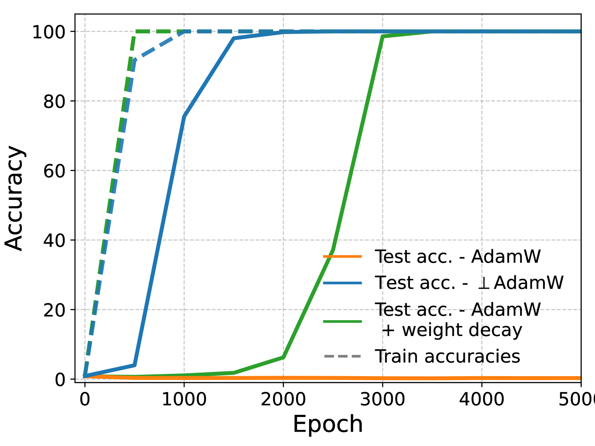

# Orthogonal gradient (⊥Grad)

[Frequency principle and spectral bias](frequency-principle-spectral-bias.md) ← previous card, next → [The universality hypothesis](universality-hypothesis.md)

[Concept card index](index.md), category: [2. Mechanisms and representations](index.md#cat-2)\
→ Next category: [Modular arithmetic](modular-arithmetic.md)\
← Previous category: [Grokking](grokking.md)

## Definition

**Gradient orthogonality** is a property, and the technique named after it, in which only the component of the loss gradient orthogonal to some distinguished direction is retained — either the direction of the weight vector (which is also the direction of [naive loss minimisation (NLM)](nlm.md)) or the direction orthogonal to the zero-loss manifold (the set of parameters with zero training error). In the context of [grokking](grokking.md) this is the component along which motion actually changes the model's predictions and leads to generalisation, whereas the parallel (non-orthogonal) component merely scales the logits (the network's unnormalised outputs before the softmax) without changing the predictions. The notion was introduced explicitly by Prieto et al. (2025) as the [optimiser](optimizer-adam-adamw-sgd.md) ⊥Grad (perp-Grad), which keeps only the part of the gradient orthogonal to the direction of the weights \[[1.1](#ref-1-1)\], and was formalised by Musat (2025) as a theorem stating that near the zero-loss manifold the gradient becomes orthogonal to the tangent directions \[[1.2](#ref-1-2)\].

## Elaboration

Prieto et al. tie gradient orthogonality to the mechanism of the delay in generalisation. Past the point of overfitting, the cross-entropy gradient aligns ever more strongly with the direction they call naive loss minimisation (NLM) — scaling of the logits (multiplication by a constant): this lowers the loss without changing the predictions, but in the limit leads to [softmax collapse](softmax-collapse.md) (overflow and absorption of values in floating-point arithmetic, which halts training). The ⊥Grad optimiser projects the gradient onto the hyperplane orthogonal to the current weight vector, thereby removing the NLM component, and leads to fast generalisation with no initial [memorisation phase](memorization-phase.md) \[[1.1](#ref-1-1)\]. Musat arrives at orthogonality from the other side: in the post-memorisation phase, at small [learning rates](learning-rate.md) and with [weight decay](weight-decay.md) (L2 regularisation), training reduces to minimising the weight norm on the [zero-loss manifold](weight-norm-minimization.md), and the gradient there becomes ever more orthogonal to the tangents of that manifold \[[1.2](#ref-1-2)\]. Xu strengthens the causal side: causal interventions (direct suppression of motion along the low-dimensional "execution manifold" — the weight subspace along which training proceeds) show that orthogonal gradient flow is necessary but not sufficient for grokking \[[3.1](#ref-3-1)\]. The three works thus form a spectrum: ⊥Grad is a controlling intervention, Musat's theorem an emergent geometry, Xu's interventions a causal test. This links the notion to the wider circle of readings of grokking — as a [phase transition](phase-transition.md) and as a change of the dominant solution.

## Alternative definitions and nuances

### A. ⊥Grad: removal of the NLM component (the operational reading)

Prieto et al. define gradient orthogonality operationally, through the update rule θ_{t+1} = θ_t − η∇⊥L, where ∇⊥L is the projection of the gradient onto the hyperplane orthogonal to the current weight vector. The distinguishing parameter here is what exactly gets subtracted: the component parallel to the weights, which in homogeneous networks (those for which f(αθ) is a multiple of f(θ)) is identical to the NLM direction. By removing it, ⊥Grad prevents uncontrolled logit growth and leads to generalisation without the overfitting phase that defines grokking \[[1.1](#ref-1-1)\]. The key feature of this reading: orthogonality is a control lever (an intervention inside the optimiser), not an observed property of the dynamics.

### B. Orthogonality to the zero-loss manifold (the geometric reading)

Musat defines gradient orthogonality as an emergent geometric property: as the trajectory approaches the zero-loss set, the gradient becomes orthogonal to every tangent direction of that set (up to a constant). The control parameter here is not the optimiser but the distance to the manifold: the closer the trajectory, the more complete the orthogonality, and the remaining motion reduces to minimising the weight norm along the manifold \[[1.2](#ref-1-2)\]. The difference from reading A: orthogonality is not imposed by a projection but arises of itself in the post-memorisation dynamics under weight decay; ⊥Grad in effect forces what this geometry arrives at naturally.

### In support

Xu joins the reading of orthogonal gradient flow as the driver of grokking, but sharpens it causally. A series of interventions with a monotone dose–response relation (gradual suppression of motion along the execution manifold) shows that orthogonal gradient flow is **necessary** — suppressing it blocks generalisation — but **not sufficient**: artificially increasing the curvature of the loss does not by itself induce grokking \[[3.1](#ref-3-1)\]. The difference from readings A and B: this is not a new definition but a causal boundary — the notion acquires the standing of a necessary condition for grokking rather than of a merely correlational sign.

## References

###### ref-1-1
**\[1.1\]** 2501.04697 — Prieto et al., "Grokking at the Edge of Numerical
Stability". [`"only preserves the part of the gradient that is orthogonal to the NLM direction"`](../papers/2501.04697.grokking-at-the-edge-of-numerical-stability/2501.04697.grokking-at-the-edge-of-numerical-stability.card.md#p2-2).\
Also: [`"the part of the gradient that is orthogonal to the current direction of the weights"`](../papers/2501.04697.grokking-at-the-edge-of-numerical-stability/2501.04697.grokking-at-the-edge-of-numerical-stability.card.md#p8-6); [`"that directly prevents scaling along the NLM direction"`](../papers/2501.04697.grokking-at-the-edge-of-numerical-stability/2501.04697.grokking-at-the-edge-of-numerical-stability.card.md#p8-11).

###### ref-1-2
**\[1.2\]** 2511.01938 — Musat, "The Geometry of Grokking: Norm Minimization on
the Zero-Loss Manifold". [`"the loss gradients become perfectly orthogonal to the zero-loss set as we approach it"`](../papers/2511.01938.the-geometry-of-grokking-norm-minimization-on-the-zero-loss-manifold/original/2511.01938.the-geometry-of-grokking-norm-minimization-on-the-zero-loss-manifold.md#p4-3).\
Also: [`"effectively minimizes the weight norm on the zero-loss manifold"`](../papers/2511.01938.the-geometry-of-grokking-norm-minimization-on-the-zero-loss-manifold/original/2511.01938.the-geometry-of-grokking-norm-minimization-on-the-zero-loss-manifold.md#p1-2).

## References of works that joined the discussion

### In support

###### ref-3-1
**\[3.1\]** 2602.16746 — Xu, "Low-Dimensional and Transversely Curved Optimization Dynamics in Grokking". Nuance: orthogonal gradient flow is causally necessary but not sufficient for grokking. [`"orthogonal gradient flow is necessary but not sufficient for grokking"`](../papers/2602.16746.low-dimensional-and-transversely-curved-optimization-dynamics-in-grokking/original/2602.16746.low-dimensional-and-transversely-curved-optimization-dynamics-in-grokking.md#p1-2).\
Also: [`"that orthogonal gradient flow is causally necessary for generalization"`](../papers/2602.16746.low-dimensional-and-transversely-curved-optimization-dynamics-in-grokking/original/2602.16746.low-dimensional-and-transversely-curved-optimization-dynamics-in-grokking.md#p13-3); [`"suppressing orthogonal gradient flow prevents grokking with a monotonic dose–response across four operations"`](../papers/2602.16746.low-dimensional-and-transversely-curved-optimization-dynamics-in-grokking/original/2602.16746.low-dimensional-and-transversely-curved-optimization-dynamics-in-grokking.md#p21-1).

###### ref-3-2
**\[3.2\]** 2602.18523 — Xu, "The Geometry of Multi-Task Grokking: Transverse Instability, Superposition, and Weight Decay Phase Structure". Nuance: a continuation of line \[3.1\] in a multi-task setting, with a quantitative estimate — the causally necessary share of the gradient amounts to less than 1% of its variance, and removing 10% of the orthogonal component kills grokking with both two and three tasks. Unlike \[3.1\], there is no random-subspace control for the measure $\rho$ here. [`"These results demonstrate that grokking depends critically on rare transverse updates that constitute $<1\%$ of gradient variance."`](../papers/2602.18523.the-geometry-of-multi-task-grokking-transverse-instability-superposition-and-weight-decay-phase-structure/original/2602.18523.the-geometry-of-multi-task-grokking-transverse-instability-superposition-and-weight-decay-phase-structure.md#p26-7).\
Also (the same estimate in the three-task setting): [`"This establishes that $<1\%$ of the gradient variance (orthogonal to the PCA manifold) is causally necessary for grokking to occur."`](../papers/2602.18523.the-geometry-of-multi-task-grokking-transverse-instability-superposition-and-weight-decay-phase-structure/original/2602.18523.the-geometry-of-multi-task-grokking-transverse-instability-superposition-and-weight-decay-phase-structure.md#p15-1).

###### ref-3-3
**\[3.3\]** 2602.16967 — Xu, "Early-Warning Signals of Grokking via Loss-Landscape Geometry". Nuance: the necessity of orthogonal flow is confirmed on all three families of tasks out of three (modular arithmetic, SCAN, Dyck); on SCAN a soft suppression by a penalty prevents grokking altogether, while a hard one by projection merely delays it. [`"across all three tasks, suppression of orthogonal gradient flow delays or prevents grokking, establishing the *necessity* of transverse curvature dynamics as a universal finding"`](../papers/2602.16967.early-warning-signals-of-grokking-via-loss-landscape-geometry/original/2602.16967.early-warning-signals-of-grokking-via-loss-landscape-geometry.md#p13-6).
## Passing mentions

Works that only mention the phenomenon — a literature review, a related-work paragraph, a passing citation — without examining it.

**\[4.1\]** 2512.03437 — Liang & Li, "Grokked Models are Better Unlearners". Nuance: what is measured is the cosine similarity of the gradients of the forget and the retain sets (0.999 before grokking against 0.426 after) and the corresponding angle (2.57 against 64.78 degrees). [`"Grokked models show substantially lower correlations (0.521 for CNN, 0.426 for ResNet), indicating that grokking creates more orthogonal gradient spaces"`](../papers/2512.03437.grokked-models-are-better-unlearners/2512.03437.grokked-models-are-better-unlearners.card.md#p9-5).

**\[4.2\]** 2504.16041 — Tveit, Remseth, Skogvold, "Muon Optimizer Accelerates Grokking". A nuance that matters for keeping things apart: in Muon it is the update matrix that is orthogonalised (by a Newton–Schulz iteration over the momentum buffer), not the gradient component along the weight direction that is removed, as in the ⊥Grad of Prieto et al.; these are different operations with different aims. The paper gives neither Muon's update formula, nor the number of Newton–Schulz iterations, nor an ablation of this operation, so there is nothing here by which to check that orthogonalisation is what does the work. [`"Uses orthogonalized gradient updates"`](../papers/2504.16041.muon-optimizer-accelerates-grokking/original/2504.16041.muon-optimizer-accelerates-grokking.md#fig-1).
