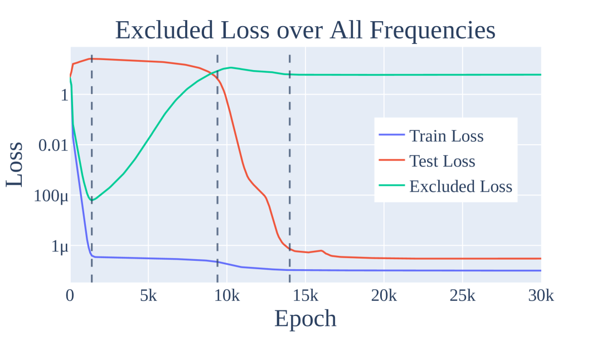

# Progress measures

— ← previous card, next → [Mechanistic interpretability](mechanistic-interpretability.md)

[Concept card index](index.md), category: [6. Analytical tools and metrics](index.md#cat-6)\
→ Next category: [Effective theory and statistical mechanics](effective-theory-statistical-mechanics.md)\
← Previous category: [Grokfast / gradient low-pass filtering](gradient-low-pass-filtering.md)

## Definition

**Progress measures** are continuous (smoothly changing) metrics computed from the internal state of a network during training which *precede* an abrupt qualitative jump in capability and are *causally* linked to it, laying bare a gradual hidden process behind the outward "suddenness" of [grokking](grokking.md). The notion was introduced by Nanda et al. (2023); the aim is to find *"hidden progress measures (Barak et al., 2022): metrics that precede and are causally linked to the phase transition, and which vary more smoothly"* \[[1.1](#ref-1-1)\].

## Elaboration

The motivation for progress measures is to explain [emergence](emergence.md) (the abrupt appearance of a new capability as training is scaled) and the [phase transition](phase-transition.md) (a jump of a metric after a long plateau): if the test accuracy itself changes by a jump, then *underneath* it there must exist a quantity that grows smoothly and in advance. Nanda et al. build such metrics mechanistically — having deciphered the algorithm of [modular addition](modular-arithmetic.md) (the discrete Fourier transform plus trigonometric identities) and introducing the **restricted loss** and the **excluded loss** (the losses under the ablation of, respectively, all non-key / all key frequencies): *"Both metrics improve continuously prior to when grokking occurs"* \[[1.1](#ref-1-1)\]. By their dynamics training is divided into three stages — [memorisation](memorization-phase.md), *circuit formation* (the appearance of a generalising subnetwork) and *cleanup* ([weight decay](weight-decay.md) removes the memorising component).

Since then whole families of indicators have been called "progress measures", differing in the source of the signal: information-theoretic ones (the synergy and redundancy of neurons as a higher-order mutual information) \[[1.2](#ref-1-2)\]; Fourier metrics of frequency density \[[1.3](#ref-1-3)\]; metrics from robustness theory and information theory that predict grokking better than the ℓ2 weight norm \[[1.4](#ref-1-4)\]; structural metrics (the Jaccard distance between subnetwork masks in the spirit of the [lottery ticket](sparse-subnetwork-lottery-ticket.md)) \[[3.1](#ref-3-1)\]; spectral quantities and *[order parameters](order-parameter.md)* (scalar indicators from statistical physics separating the "ordered" phase from the "disordered" one) \[[3.8](#ref-3-8)\]\[[3.9](#ref-3-9)\]; metrics of routing complexity for monitoring grokking in the pre-training of large language models \[[3.5](#ref-3-5)\]. The thesis common to them all is a *"hiddenness to the loss function"*: progress goes on long before it becomes visible in the train/test curves. The adequacy of progress measures is contested, however: some works show that optimisation under weight decay leads only to token uniformity, which is not enough for grokking \[[2.1](#ref-2-1)\], and that the existing measures do not detect the late phase of [anti-grokking](anti-grokking.md) — the collapse of the test accuracy after grokking \[[2.2](#ref-2-2)\]. The notion intersects with the explanation through [circuit efficiency](circuit-efficiency.md): Varma et al. read the slow growth of the generalising circuit relative to the memorising one as a manifestation of progress measures; and the link between progress measures and [double descent](double-descent.md) (the non-monotone dependence of the error on capacity or training time) is noted in the spectral work of Truong et al., which summarises the hypothesis of Davies et al. \[[3.9](#ref-3-9)\].

## Alternative definitions and nuances

### A. Mechanistic progress measures

A definition through reverse engineering of the algorithm: a progress measure is a metric read off the *deciphered* internal mechanism of the network which approaches the final value of the generalising solution monotonically. In Nanda et al. these are the restricted / excluded losses, which isolate the contribution of the "key" Fourier frequencies \[[1.1](#ref-1-1)\]; the key difference from purely behavioural metrics is that the quantity is meaningful only once the algorithm of the task is already understood, and is therefore directly causally linked to generalisation rather than correlated with it by accident.

### B. Information-theoretic progress measures

A definition without reverse engineering: a progress measure is a statistic of the joint activity of the neurons. Clauw et al. use a higher-order mutual information, distinguishing *synergy* (the information the neurons carry only jointly) from *redundancy* (the duplicated information): *"To understand this phase transition, we utilize higher-order mutual information to analyze the collective behavior (synergy) and shared properties (redundancy) between neurons during training. We identify distinct phases before grokking allowing us to anticipate when it occurs"* \[[1.2](#ref-1-2)\]. The difference: the signal is model-independent (it does not require knowing the algorithm), and the distinguishing machinery is the growth of synergy as a sign of an approaching transition.

### C. Spectral measures and order parameters

A definition from statistical physics: a progress measure is an *order parameter*, that is, a scalar quantity that is almost zero in the "disordered" (memorising) phase and rises sharply in the "ordered" (generalising) one. Bi et al. take as such a parameter the spectral head–tail contrast of the representations \[[3.8](#ref-3-8)\]; Truong et al. take the collapse of the spectral entropy of the activation covariance, and in their case the remaining time to grokking obeys a power law, which makes the measure *predictive* \[[3.9](#ref-3-9)\]. The key source of difference from the mechanistic measures: the quantity lives in representation space and is invariant to a rescaling of the weights, whereas compression metrics are not.

### Contested

Some works contest not the existence of progress measures but their *sufficiency* as an explanation. Gu et al. ("Beyond Progress Measures") show that reducing the dynamics to the minimisation of weight decay gives only token uniformity, which is not enough for grokking \[[2.1](#ref-2-1)\], and that there is no theoretical account of *why* a successful measure catches the transition at all. Prakash et al. add an empirical counterexample: none of the accepted progress measures tells grokking apart from the late phase of [anti-grokking](anti-grokking.md) — only their [HTSR](heavy-tailed-self-regularization-htsr.md) layer-quality metric manages that \[[2.2](#ref-2-2)\].

### In support

A number of works join the paradigm by proposing a consistent measure of their own: a structural shift of the subnetwork (the Jaccard distance between masks) \[[3.1](#ref-3-1)\], the entropy of the last-layer weights \[[3.3](#ref-3-3)\], a score of the monosemanticity of neurons \[[3.4](#ref-3-4)\], metrics of the routing complexity of experts for LLMs \[[3.5](#ref-3-5)\], vocabulary-statistical probes of the phase transition \[[3.6](#ref-3-6)\], a symmetry-based diagnostic \[[3.7](#ref-3-7)\] and spectral order parameters \[[3.8](#ref-3-8)\]\[[3.9](#ref-3-9)\]. The thesis common to them is that behind the jump there stands a smooth internal process observable by a progress measure; Lee et al. directly support the conclusion that *"grokking may not occur abruptly but rather exhibits an internal progress measure"* \[[3.2](#ref-3-2)\].

## References

###### ref-1-1
**\[1.1\]** 2301.05217 — Nanda et al., "Progress Measures for Grokking via
Mechanistic Interpretability". [`"understand and predict these phase transitions by finding hidden progress measures (Barak et al., 2022): metrics that precede and are causally linked to the phase transition, and which vary more smoothly"`](../papers/2301.05217.progress-measures-for-grokking-via-mechanistic-interpretability/2301.05217.progress-measures-for-grokking-via-mechanistic-interpretability.card.md#p1-4).\
Also: [`"we construct two progress measures for the modular addition task"`](../papers/2301.05217.progress-measures-for-grokking-via-mechanistic-interpretability/2301.05217.progress-measures-for-grokking-via-mechanistic-interpretability.card.md#p2-3) (the restricted loss and the excluded loss); [`"Both metrics improve continuously prior to when grokking occurs"`](../papers/2301.05217.progress-measures-for-grokking-via-mechanistic-interpretability/2301.05217.progress-measures-for-grokking-via-mechanistic-interpretability.card.md#p2-3).

###### ref-1-2
**\[1.2\]** 2408.08944 — Clauw, Stramaglia, Marinazzo 2024, "Information-Theoretic Progress Measures reveal Grokking is an Emergent Phase Transition". Nuance: the measure is tied neither to the task nor to a hand analysis of circuits, but the boundaries of the phases are drawn by the look of the curves. [`"To understand this phase transition, we utilize higher-order mutual information to analyze the collective behavior (synergy) and shared properties (redundancy) between neurons during training. We identify distinct phases before grokking allowing us to anticipate when it occurs"`](../papers/2408.08944.information-theoretic-progress-measures-reveal-grokking-is-an-emergent-phase-transition/original/2408.08944.information-theoretic-progress-measures-reveal-grokking-is-an-emergent-phase-transition.md#p1-2).\
Also: [`"one approach is to identify hidden progress measures – metrics causally related to the loss (Barak et al., 2023) - to predict and understand grokking"`](../papers/2408.08944.information-theoretic-progress-measures-reveal-grokking-is-an-emergent-phase-transition/original/2408.08944.information-theoretic-progress-measures-reveal-grokking-is-an-emergent-phase-transition.md#p1-4).

###### ref-1-3
**\[1.3\]** 2402.16726 — Furuta et al., "Towards Empirical Interpretation of
Internal Circuits and Properties in Grokked Transformers on Modular
Polynomials". [`"we introduce the notion of pre-grokked models, and propose a pair of novel progress measures for grokking in modular arithmetic; Fourier Frequency Density (FFD) and Fourier Coefficient Ratio (FCR)"`](../papers/2402.16726.towards-empirical-interpretation-of-internal-circuits-and-properties-in-grokked-transformers-on-modular-polynomials/original/2402.16726.towards-empirical-interpretation-of-internal-circuits-and-properties-in-grokked-transformers-on-modular-polynomials.md#p4-5).

###### ref-1-4
**\[1.4\]** 2311.06597 — Tan et al., "Understanding Grokking Through A Robustness
Viewpoint". [`"Borrowing ideas from robustness and information theory, we introduce new metrics that correlate better with the grokking process and may be used to predict grokking"`](../papers/2311.06597.understanding-grokking-through-a-robustness-viewpoint/2311.06597.understanding-grokking-through-a-robustness-viewpoint.card.md#p2-4).

###### ref-1-5
**\[1.5\]** 2207.08799 — Barak et al., "Hidden Progress in Deep Learning: SGD Learns Parities Near the Computational Limit". Nuance: the primary source of the notion; the definition is general — a prediction of the time to convergence — and the causal link with the transition appears only in the citing works. [`"we define a *progress measure* $\rho:\Theta\rightarrow\mathbb{R}$ to be any function of the training algorithm’s state"`](../papers/2207.08799.hidden-progress-in-deep-learning-sgd-learns-parities-near-the-computational-limit/2207.08799.hidden-progress-in-deep-learning-sgd-learns-parities-near-the-computational-limit.card.md#p40-2).\
Also (the authors' caveat, lost in citation): [`"the purpose of demonstrating hidden progress measures $\rho$ is *not* to provide further evidence that SGD finds the features using Fourier gaps"`](../papers/2207.08799.hidden-progress-in-deep-learning-sgd-learns-parities-near-the-computational-limit/2207.08799.hidden-progress-in-deep-learning-sgd-learns-parities-near-the-computational-limit.card.md#p41-1).

###### ref-1-6
**\[1.6\]** 2407.20199 — Mallinar et al., "Emergence in non-neural models: grokking modular arithmetic via average gradient outer product". Nuance: introduces the circulant deviation and the AGOP agreement; the authors themselves class both as a posteriori — one requires knowing the form of the answer, the other a trained model — and put the Fourier gap and the inverse participation ratio on the same footing. [`"we introduce two “hidden progress measures” (cf. [3])"`](../papers/2407.20199.emergence-in-non-neural-models-grokking-modular-arithmetic-via-average-gradient-outer-product/original/2407.20199.emergence-in-non-neural-models-grokking-modular-arithmetic-via-average-gradient-outer-product.md#p3-2).\
Also (the authors' caveat, lost in citation): [`"it is still an *a posteriori* measurement of progress as it requires access to the features of a fully trained model"`](../papers/2407.20199.emergence-in-non-neural-models-grokking-modular-arithmetic-via-average-gradient-outer-product/original/2407.20199.emergence-in-non-neural-models-grokking-modular-arithmetic-via-average-gradient-outer-product.md#p9-3).

###### ref-1-7
**\[1.7\]** 2310.12977 — Humayun, Balestriero, Baraniuk 2023, "Training Dynamics of Deep Network Linear Regions". The work in which local complexity (LC) is **introduced**: a quantity depending only on the architecture and the weights of the network, computed by a single forward pass over the vertices of a neighbourhood of a point and therefore measurable around randomly taken points as well. Nuance: the terms "progress measure" and Barak et al. 2022 do not occur in the paper — the measure was tied to that notion only in 2402.15555; the error of the approximation is nowhere bounded. [`"We propose a first step in that direction by proposing a novel expressivity measure of a DN that does not rely on the dataset, labels, or loss function that is used during training."`](../papers/2310.12977.training-dynamics-of-deep-network-linear-regions/original/2310.12977.training-dynamics-of-deep-network-linear-regions.md#p2-3).\
Also (a substitution acknowledged by the authors): [`"Note that for deeper layers, our complexity measure is actually computing the number of hyperplane intersections with the convex hull of the embedded vertices instead of the convex hull of the vertices in the input space."`](../papers/2310.12977.training-dynamics-of-deep-network-linear-regions/original/2310.12977.training-dynamics-of-deep-network-linear-regions.md#p4-4).
## References of works that joined the discussion

### Contested

###### ref-2-1
**\[2.1\]** 2504.03162 — Gu et al., "Beyond Progress Measures: Theoretical Insights into the Mechanism of Grokking". Contests: minimising the weight decay gives only token uniformity — and that is not enough for grokking. [`"However, we find that this optimization merely leads to token uniformity, which is not a sufficient condition for grokking"`](../papers/2504.03162.beyond-progress-measures-theoretical-insights-into-the-mechanism-of-grokking/2504.03162.beyond-progress-measures-theoretical-insights-into-the-mechanism-of-grokking.card.md#p1-2).\
Also: [`"existing methods fall short of adequately explaining why a well-designed progress measure can effectively capture the grokking process"`](../papers/2504.03162.beyond-progress-measures-theoretical-insights-into-the-mechanism-of-grokking/2504.03162.beyond-progress-measures-theoretical-insights-into-the-mechanism-of-grokking.card.md#p1-4).

###### ref-2-2
**\[2.2\]** 2506.04434 — Prakash & Martin 2025, "Grokking and Generalization Collapse: Insights from HTSR theory". Contests the completeness: the accepted progress measures do not see the anti-grokking period. [`"This late-stage collapse is distinct, however, from the known *pre-grokking* and *grokking* phases, and is not detected by other proposed grokking progress measures"`](../papers/2506.04434.grokking-and-generalization-collapse-insights-from-htsr-theory/original/2506.04434.grokking-and-generalization-collapse-insights-from-htsr-theory.md#p1-2).\
Also: [`"outperforming the $l^{2}$ weight norm and the other progress metrics"`](../papers/2506.04434.grokking-and-generalization-collapse-insights-from-htsr-theory/original/2506.04434.grokking-and-generalization-collapse-insights-from-htsr-theory.md#p2-3).

###### ref-2-3
**\[2.3\]** 2605.06352 — Tang et al., "Topological Signatures of Grokking". The cross-correlation function of the first differences, with a peak at a negative lag ([fig. 12](../papers/2605.06352.topological-signatures-of-grokking/2605.06352.topological-signatures-of-grokking.card.md#fig-12)). [`"This suggests a two-stage learning dynamic in which the model first discovers a functionally correct input–output mapping, followed by a delayed geometric reorganization of the latent space"`](../papers/2605.06352.topological-signatures-of-grokking/2605.06352.topological-signatures-of-grokking.card.md#p8-2).\
Also (a double caveat): the lag is measured on a snapshot grid of 500 steps, is shown only for $H_{0}$ total and depends on the layer (in [fig. 12](../papers/2605.06352.topological-signatures-of-grokking/2605.06352.topological-signatures-of-grokking.card.md#fig-12) the peak falls at roughly $-1000$ steps after the embedding, at roughly $-500$ after the first encoder layer and at almost zero after the second); for the MLP the peak lies at zero for all four statistics ([fig. 14](../papers/2605.06352.topological-signatures-of-grokking/2605.06352.topological-signatures-of-grokking.card.md#fig-14)).
###### ref-2-4
**\[2.4\]** 2502.01739 — Manning-Coe, Gliozzi, Stapleton, Hirst, De Tomasi, Bradlyn & Berman 2025, "Grokking vs. Learning: Same features, different encodings". Refutes the universality of progress measures: on modular addition the Fourier localisation grows throughout the plateau, whereas on the Ising task there is no hidden formation of the model at all — even though generalisation still arrives by a jump. [`"The model trained on the Ising task, however, does not improve its representation of the energy in the plateau - all three metrics are roughly constant across all layers in the plateau"`](../papers/2502.01739.grokking-vs-learning-same-features-different-encodings/original/2502.01739.grokking-vs-learning-same-features-different-encodings.md#p6-4).\
Also (a question to the corpus): [`"This raises the question of whether we can define new progress measures that would indicate a coming jump in capability before generalisation"`](../papers/2502.01739.grokking-vs-learning-same-features-different-encodings/original/2502.01739.grokking-vs-learning-same-features-different-encodings.md#p2-2).

### In support

###### ref-3-1
**\[3.1\]** 2310.19470 — Minegishi et al., "Bridging Lottery Ticket and Grokking: Understanding Grokking from Inner Structure of Networks". Nuance: a structural shift of the subnetwork as a progress measure. [`"we propose a metric of structural changes in the network, named Jaccard Distance (JD)"`](../papers/2310.19470.bridging-lottery-ticket-and-grokking-understanding-grokking-from-inner-structure-of-networks/original/2310.19470.bridging-lottery-ticket-and-grokking-understanding-grokking-from-inner-structure-of-networks.md#p8-6).

###### ref-3-2
**\[3.2\]** 2405.20233 — Lee et al., "Grokfast: Accelerated Grokking by Amplifying Slow Gradients". Nuance: supports the conclusion that behind the jump there stands an internal progress measure. [`"grokking may not occur abruptly but rather exhibits an internal progress measure"`](../papers/2405.20233.grokfast-accelerated-grokking-by-amplifying-slow-gradients/2405.20233.grokfast-accelerated-grokking-by-amplifying-slow-gradients.card.md#p9-2).

###### ref-3-3
**\[3.3\]** 2411.05353 — Salah et al., "Controlling Grokking with Nonlinearity and Data Symmetry". Nuance: the entropy of the last-layer weights as a measure of the extent of grokking. [`"Here a metric is introduced to quantify the extent of grokking of a network based on of the weights of the last layer"`](../papers/2411.05353.controlling-grokking-with-nonlinearity-and-data-symmetry/original/2411.05353.controlling-grokking-with-nonlinearity-and-data-symmetry.md#p4-3).

###### ref-3-4
**\[3.4\]** 2503.23298 — Wang et al., "Learning Towards Emergence: Paving the Way to Induce Emergence by Inhibiting Monosemantic Neurons on Pre-trained Models". Nuance: a monosemanticity score as a measure of hidden progress towards [emergence](emergence.md). [`"Monosemanticity Score (MS) has been devised to quantify monosemanticity throughout the model training"`](../papers/2503.23298.learning-towards-emergence-inhibiting-monosemantic-neurons-on-pre-trained-models/2503.23298.learning-towards-emergence-inhibiting-monosemantic-neurons-on-pre-trained-models.card.md#p2-1).

###### ref-3-5
**\[3.5\]** 2506.21551 — Li et al., "Grokking in LLM Pretraining? Monitor Memorization-to-Generalization without Test". Nuance: metrics of routing complexity for monitoring grokking without a test set. [`"Two novel metrics are developed to quantify these patterns: one computes the pathway similarity between samples, while the other measures the consistency of aggregated experts between subsequent layers for each sample"`](../papers/2506.21551.grokking-in-llm-pretraining-monitor-memorization-to-generalization-without-test/2506.21551.grokking-in-llm-pretraining-monitor-memorization-to-generalization-without-test.card.md#p1-2).

###### ref-3-6
**\[3.6\]** 2511.12768 — Hong et al., "Evidence of Phase Transitions in Small Transformer-Based Language Models". Nuance: vocabulary-statistical probes as measures that lay bare a transition invisible in the loss curves. [`"these transitions are not apparent in standard loss or validation curves, but become visible through our vocabulary- and statistics-based probes"`](../papers/2511.12768.evidence-of-phase-transitions-in-small-transformer-based-language-models/original/2511.12768.evidence-of-phase-transitions-in-small-transformer-based-language-models.md#p1-4).

###### ref-3-7
**\[3.7\]** 2603.01968 — Hwang et al., "Intrinsic Task Symmetry Drives Generalization in Algorithmic Tasks". Nuance: a symmetry-based diagnostic that anticipates the onset of generalisation. [`"we introduce a symmetry-based diagnostic that anticipates the onset of generalization"`](../papers/2603.01968.intrinsic-task-symmetry-drives-generalization-in-algorithmic-tasks/original/2603.01968.intrinsic-task-symmetry-drives-generalization-in-algorithmic-tasks.md#p1-2).

###### ref-3-8
**\[3.8\]** 2603.24746 — Bi et al., "Grokking as a Falsifiable Finite-Size Transition". Nuance: the spectral contrast of the representations as an order parameter. [`"requires two inputs that are not automatic: an extensive size variable and a representation-level order parameter"`](../papers/2603.24746.grokking-as-a-falsifiable-finite-size-transition/2603.24746.grokking-as-a-falsifiable-finite-size-transition.card.md#p1-5).

###### ref-3-9
**\[3.9\]** 2604.13123 — Truong et al., "Spectral Entropy Collapse as a Phase Transition in Delayed Generalisation". Nuance: the collapse of the spectral entropy as a predictive progress measure. [`"The remaining training time until grokking follows a power law"`](../papers/2604.13123.spectral-entropy-collapse-as-a-phase-transition-in-delayed-generalisation/2604.13123.spectral-entropy-collapse-as-a-phase-transition-in-delayed-generalisation.card.md#p1-2).\
Also (the prediction of the timing): [`"The mean advance warning — the first step at which prediction error first falls below $20\%$ — is approximately $\mathbf{12{,}000}$ steps"`](../papers/2604.13123.spectral-entropy-collapse-as-a-phase-transition-in-delayed-generalisation/2604.13123.spectral-entropy-collapse-as-a-phase-transition-in-delayed-generalisation.card.md#p10-1)

###### ref-3-10
**\[3.10\]** 2302.03025 — Chughtai et al., "A Toy Model of Universality: Reverse Engineering how Networks Learn Group Operations". Nuance: carries the restricted and the excluded loss over from modular addition to group composition, replacing frequencies with representations; introduces no new measures, and the assumption on which the restricted loss rests is stated outright and not verified. [`"A limitation of prior work on using *hidden progress measures* from mechanistic explanations as a methodology for understanding emergence (Nanda et al. 2023) is that the technique developed may not generalize beyond one specific task."`](../papers/2302.03025.a-toy-model-of-universality-reverse-engineering-how-networks-learn-group-operations/2302.03025.a-toy-model-of-universality-reverse-engineering-how-networks-learn-group-operations.card.md#p6-10).\
Also (the authors' caveat): [`"This assumes that the memorising algorithm has no privileged subspace in the MLP layer."`](../papers/2302.03025.a-toy-model-of-universality-reverse-engineering-how-networks-learn-group-operations/2302.03025.a-toy-model-of-universality-reverse-engineering-how-networks-learn-group-operations.card.md#p18-2).

###### ref-3-11
**\[3.11\]** 2402.15555 — Humayun, Balestriero, Baraniuk 2024, "Deep Networks Always Grok and Here is Why". Introduces **local complexity** (LC) — the density of the non-linearities of the spline partition in a neighbourhood of a point, approximated by the number of neuron hyperplanes intersecting a cross-polytope of radius $r$. Nuance: the measure depends neither on the dataset, nor on the labels, nor on the loss, and is therefore computed around random points too; the causality that enters the definition of Barak et al., which the authors themselves quote, is not shown — there is no intervention in the paper that changes the LC independently. [`"Our novel measure does not rely on the dataset, labels, or loss function that is used during training."`](../papers/2402.15555.deep-networks-always-grok-and-here-is-why/original/2402.15555.deep-networks-always-grok-and-here-is-why.md#p2-6).\
Also (the definition taken from Barak et al.): [`"Barak et al. 2022 introduced the notion of *progress measures* for DNN training, as scalar quantities that are causally linked with the training state of a network."`](../papers/2402.15555.deep-networks-always-grok-and-here-is-why/original/2402.15555.deep-networks-always-grok-and-here-is-why.md#p3-5); Also (what is actually shown): [`"we see that the second descent always precedes the onset of delayed generalization or delayed robustness"`](../papers/2402.15555.deep-networks-always-grok-and-here-is-why/original/2402.15555.deep-networks-always-grok-and-here-is-why.md#p7-5).

###### ref-3-12
**\[3.12\]** 2405.12755 — Golechha 2024, "Progress Measures for Grokking on Real-world Tasks". Introduces three progress measures for non-algorithmic tasks: activation sparsity (the fraction of a layer's activations below a threshold), the absolute weight entropy and an approximate local circuit complexity (the KL divergence of the logits before and after zeroing a random 10 % of a layer's weights). Nuance: the causality that enters the definition of Barak et al. is shown for none of the three — there is no intervention in the paper that changes a measure independently of the grokking; the "stronger correlation" with grokking compared with the weight norm, claimed in the abstract, is nowhere computed, and the comparison is entirely by eye from the curves of two figures; the sparsity threshold is not given as a number. [`"we introduce three new progress measures: activation sparsity, absolute weight entropy, and approximate local circuit complexity"`](../papers/2405.12755.progress-measures-for-grokking-on-real-world-tasks/original/2405.12755.progress-measures-for-grokking-on-real-world-tasks.md#p1-2).\
Also (measure 1): [`"we observe activation sparsity to plateau right before the model starts to grok"`](../papers/2405.12755.progress-measures-for-grokking-on-real-world-tasks/original/2405.12755.progress-measures-for-grokking-on-real-world-tasks.md#p3-6); Also (measure 2): [`"the weight entropy sharply decreases with generalization in both increasing and decreasing weight norms and does not change during overfitting"`](../papers/2405.12755.progress-measures-for-grokking-on-real-world-tasks/original/2405.12755.progress-measures-for-grokking-on-real-world-tasks.md#p5-1); Also (measure 3, what it actually measures): [`"approximate local circuit complexity measures the sensitivity of the model’s output to small perturbations in the weights"`](../papers/2405.12755.progress-measures-for-grokking-on-real-world-tasks/original/2405.12755.progress-measures-for-grokking-on-real-world-tasks.md#p5-5).

###### ref-3-13
**\[3.13\]** 2602.18523 — Xu, "The Geometry of Multi-Task Grokking: Transverse Instability, Superposition, and Weight Decay Phase Structure". Nuance: the onset of the commutator defect leads generalisation in 42 conditions out of 42, and the lead itself is declared a property of the model as a whole rather than of a particular task. It follows from that same claim that the sign criterion of $p=2^{-27}$ counts 27 conditions as independent where there are nine independent runs. [`"indicating that the defect spike is a *shared* signal of the entire model approaching the grokking transition, rather than a task-specific indicator"`](../papers/2602.18523.the-geometry-of-multi-task-grokking-transverse-instability-superposition-and-weight-decay-phase-structure/original/2602.18523.the-geometry-of-multi-task-grokking-transverse-instability-superposition-and-weight-decay-phase-structure.md#p10-2).\
Also (the dual-task part of the count): [`"Across all 15 dual-task conditions, commutator defect onset *always* precedes grokking"`](../papers/2602.18523.the-geometry-of-multi-task-grokking-transverse-instability-superposition-and-weight-decay-phase-structure/original/2602.18523.the-geometry-of-multi-task-grokking-transverse-instability-superposition-and-weight-decay-phase-structure.md#p10-1).

###### ref-3-14
**\[3.14\]** 2602.16967 — Xu, "Early-Warning Signals of Grokking via Loss-Landscape Geometry". Nuance: the commutator defect is carried through to an observation protocol with a threshold and a predictable window, but it predicts **when**, not **whether**: the paper does not test the selection between a grokking and a non-grokking setting, and in the two runs at $\lambda=1$ where there was no grokking the behaviour of the defect is not described. [`"Once the defect spikes, generalization is likely to follow within a predictable window governed by the power-law"`](../papers/2602.16967.early-warning-signals-of-grokking-via-loss-landscape-geometry/original/2602.16967.early-warning-signals-of-grokking-via-loss-landscape-geometry.md#p21-1).\
Also (the decision rule): [`"We define the defect onset step $t_{\text{onset}}$ as the first step where the median defect exceeds both"`](../papers/2602.16967.early-warning-signals-of-grokking-via-loss-landscape-geometry/original/2602.16967.early-warning-signals-of-grokking-via-loss-landscape-geometry.md#p7-6).

###### ref-3-15
**\[3.15\]** 2409.09281 — Lv et al., "Language Models “Grok” to Copy". Nuance: the contribution is negative — it is shown that the training-loss curve does not reveal the formation of the in-context capability; in its place someone else's index is presented (the ICL score of Olsson et al. 2022), and the paper introduces no progress measure of its own and does not use the term. [`"their development isn’t necessarily reflected in pre-training loss reduction"`](../papers/2409.09281.language-models-grok-to-copy/2409.09281.language-models-grok-to-copy.card.md#p2-3).\
Also (the substitute index): [`"the ICL score stabilizes at -0.5 nats"`](../papers/2409.09281.language-models-grok-to-copy/2409.09281.language-models-grok-to-copy.card.md#p5-6).

###### ref-3-16
**\[3.16\]** 2604.13082 — Gomezjurado Gonzalez, "The Long Delay to Arithmetic Generalization…". [`"This trajectory is a mechanistic *progress measure* in the sense of Nanda et al."`](../papers/2604.13082.the-long-delay-to-arithmetic-generalization-when-learned-representations-outrun-behavior/original/2604.13082.the-long-delay-to-arithmetic-generalization-when-learned-representations-outrun-behavior.md#p29-1).

###### ref-3-17
**\[3.17\]** 2602.06702 — Singh, Misra, Orvieto, "Explaining Grokking in Transformers…". [`"using of (3) for grokking in Section 4 brings out a progress measure for grokking that is plausibly setting-agnostic"`](../papers/2602.06702.explaining-grokking-in-transformers-through-the-lens-of-inductive-bias/2602.06702.explaining-grokking-in-transformers-through-the-lens-of-inductive-bias.card.md#p8-4).\
Also (a divergence in strength): in the conclusion the same thought is put without the hedge — [`"existing studies on generalizable features (3) afford a setting-agnostic progress measure for grokking"`](../papers/2602.06702.explaining-grokking-in-transformers-through-the-lens-of-inductive-bias/2602.06702.explaining-grokking-in-transformers-through-the-lens-of-inductive-bias.card.md#p8-3),. In citation the hedged formulation should be taken.

###### ref-3-18
**\[3.18\]** 2506.12284 — Walker et al., "GrokAlign: Geometric Characterisation and Acceleration of Grokking". Introduces a cheap trackable quantity — the alignment of a centroid with the point that produced it, where the centroid is the row-sum of the Jacobian and is computed by a single Jacobian-vector product; a separate applied turn is that the quantity coming to a plateau is taken as a sign that prolonging training is pointless. Nuance: the words "progress measure" do not occur in the paper and it does not cite Barak et al.; the lead over the jump is not verified — the course of the quantity is compared with an already-occurred rise in accuracy; and on modular addition the quantity goes into the negative range at the moment of grokking. [`"we can use the degree of centroid alignment as a metric for effectively monitoring the emergence of generalisation and robustness in deep network training dynamics"`](../papers/2506.12284.grokalign-geometric-characterisation-and-acceleration-of-grokking/original/2506.12284.grokalign-geometric-characterisation-and-acceleration-of-grokking.md#p5-8).\
Also (why it is cheap): [`"the centroid can be computed through a Jacobian vector product, which is more computationally efficient than directly computing the Jacobian"`](../papers/2506.12284.grokalign-geometric-characterisation-and-acceleration-of-grokking/original/2506.12284.grokalign-geometric-characterisation-and-acceleration-of-grokking.md#p4-7)\
Also (the stopping criterion): [`"by monitoring centroid alignment we can determine that prolonging training is unlikely to improve the properties of the GrokAligned model significantly"`](../papers/2506.12284.grokalign-geometric-characterisation-and-acceleration-of-grokking/original/2506.12284.grokalign-geometric-characterisation-and-acceleration-of-grokking.md#p7-5).

###### ref-3-19
**\[3.19\]** 2604.20923 — Golwala, "ILDR: Geometric Early Detection of Grokking". [`"A metric that directly measures the geometric quality of the model's internal representations, whether classes are cleanly separated in the latent space, could in principle detect the onset of generalization before it is visible in validation accuracy."`](../papers/2604.20923.ildr-geometric-early-detection-of-grokking/original/2604.20923.ildr-geometric-early-detection-of-grokking.md#p2-7).\
Also (a boundary of the sign, acknowledged by the author): [`"ILDR reliably detects when representational structure forms but does not predict how long full generalization will take"`](../papers/2604.20923.ildr-geometric-early-detection-of-grokking/original/2604.20923.ildr-geometric-early-detection-of-grokking.md#p11-1); the validation accuracy at the stopping point ranges from 7.1% to 99.3% across five seeds.

###### ref-3-21
**\[3.21\]** 2606.12966 — Sivasankar, "Circuit Synchronization Precedes Generalization: A Causal Precursor to Grokking". [`"Our FSD and Fourier rank are progress measures that *do not* require knowing the circuit in advance."`](../papers/2606.12966.circuit-synchronization-precedes-generalization-a-causal-precursor-to-grokking/2606.12966.circuit-synchronization-precedes-generalization-a-causal-precursor-to-grokking.card.md#p2-6).\
Also (what exactly is taken as the baseline for comparison): [`"This is our instantiation of Nanda et al.’s “excluded loss”"`](../papers/2606.12966.circuit-synchronization-precedes-generalization-a-causal-precursor-to-grokking/2606.12966.circuit-synchronization-precedes-generalization-a-causal-precursor-to-grokking.card.md#p5-1); by construction this is the restricted rather than the excluded loss — analysed in the "Common misreadings and overstatements" section of that paper's card, anchor `mc-2301-05217`.\
Also (a promise not kept in the paper): [`"Statistical significance is assessed via permutation test (1,000 shuffles of the dominant-frequency assignment across neurons); we report $p$-values and flag significance at $\alpha=0.05$."`](../papers/2606.12966.circuit-synchronization-precedes-generalization-a-causal-precursor-to-grokking/2606.12966.circuit-synchronization-precedes-generalization-a-causal-precursor-to-grokking.card.md#p4-7) — there is not a single permutation $p$-value in any of the eleven tables.
###### ref-3-22
**\[3.22\]** 2308.09543 — Hu, Chen, Saphra & Cho, "Delays, Detours, and Forks in the Road: Latent State Models of Training Dynamics". Nuance: the progress measures are extracted without supervision from a set of general metrics rather than chosen by hand. [`"instead of carefully choosing a single metric, we compute a variety of metrics and use unsupervised learning to find structure amongst them"`](../papers/2308.09543.delays-detours-and-forks-in-the-road-latent-state-models-of-training-dynamics/original/2308.09543.delays-detours-and-forks-in-the-road-latent-state-models-of-training-dynamics.md#p12-4).

###### ref-3-24
**\[3.24\]** 2504.12700 — de Mello Koch & Ghosh 2025, "A Two-Phase Perspective on Deep Learning Dynamics". Proposes $I(T;X)$ between the input and the output of a hidden layer as a progress measure "complementary" to the circuit measures (LC and LMN). Nuance: neither LC nor LMN is measured in the paper, the status of the measure oscillates between a "progress measure" and a "process measure", and information measures for grokking had been proposed earlier without being cited. [`"A key outcome of our work is the proposal that the mutual information between inputs and outputs of a hidden layer serves as a natural progress measure for deep network training"`](../papers/2504.12700.a-two-phase-perspective-on-deep-learning-dynamics/original/2504.12700.a-two-phase-perspective-on-deep-learning-dynamics.md#p3-2).\
Also (a different status of the same measure): [`"the mutual information $I(T;X)$ itself serves as a *process measure* of learning"`](../papers/2504.12700.a-two-phase-perspective-on-deep-learning-dynamics/original/2504.12700.a-two-phase-perspective-on-deep-learning-dynamics.md#p12-3).

###### ref-3-25
**\[3.25\]** 2507.11645 — Salah & Yevick 2025, "Tracing the Path to Grokking: Embeddings, Dropout, and Network Activation". Five practical precursor quantities on modular addition: the variance of the test accuracy under MC dropout, the dropout robustness curve (DRC), the cosine proximity and bimodality of the embeddings, statistics of the weight distributions and the fraction of inactive neurons. Nuance: all the curves are single runs, none of the measures is carried through to a predictor of the timing with a number, and there is no comparison with the corpus line of precursors. [`"At the onset of generalization, the variance in the values of test accuracy variance increases rapidly,"`](../papers/2507.11645.tracing-the-path-to-grokking-embeddings-dropout-and-network-activation/original/2507.11645.tracing-the-path-to-grokking-embeddings-dropout-and-network-activation.md#p3-4)\
Also (DRC): [`"This suggests that generalization is accompanied by a decrease in sensitivity to the network structure"`](../papers/2507.11645.tracing-the-path-to-grokking-embeddings-dropout-and-network-activation/original/2507.11645.tracing-the-path-to-grokking-embeddings-dropout-and-network-activation.md#p4-2).

###### ref-3-26
**\[3.26\]** 2507.23346 — Pomarico et al. 2025, "Transfer entropy and O-information to detect grokking in tensor network multi-class classification problems". Two information measures are proposed as signs of the generalisation of an MPS classifier (the line of 2408.08944 — Stramaglia is a co-author of both): the O-information of the three output scores changes sign from synergy to redundancy simultaneously with the jump in accuracy for fashion MNIST, while for the overfitting PRISMA it grows by almost as much but stays negative; the transfer entropy between the masks is claimed as evidence of a "causal hierarchy", yet the curves $TE_{1\rightarrow 0}$ and $TE_{0\rightarrow 1}$ inside the task itself practically coincide, and the "significant influence" is $z\approx 1.5$ ($p\approx 0.13$) without a correction for 60 comparisons; the jumps of the training and the test accuracy here are simultaneous, so the measure has shown no leading power. [`"The O-information jumps into the positive regime, peaking significantly before stabilizing."`](../papers/2507.23346.transfer-entropy-and-o-information-to-detect-grokking-in-tensor-network-multi-class-classification-problems/2507.23346.transfer-entropy-and-o-information-to-detect-grokking-in-tensor-network-multi-class-classification-problems.card.md#p13-2).\
Also (the transfer entropy): [`"The asymmetry of transfer entropy confirms a causal hierarchy: the sneaker mask organizes meaningful features early, and this structure propagates to influence other masks."`](../papers/2507.23346.transfer-entropy-and-o-information-to-detect-grokking-in-tensor-network-multi-class-classification-problems/2507.23346.transfer-entropy-and-o-information-to-detect-grokking-in-tensor-network-multi-class-classification-problems.card.md#p12-1).

###### ref-3-27
**\[3.27\]** 2509.21016 — Sun et al. 2025, "RL Grokking Recipe: How Does RL Unlock and Transfer New Algorithms in LLMs?". An RL analogue of hidden progress on the plateau: during the warm-up the fraction of tests passed (a dense reward) grows while the binary reward for a full pass is still zero — unlike the supervised measures of the corpus this is not an internal diagnostic of the model but simply a second, denser reward for the same task; the limit of the sign is honestly shown — on the harder PREPEND family the fraction of tests passed grows modestly, saturates, and full passes stay at zero throughout training. [`"this signal allows the model to move beyond the all-zero region: although the full-pass rate remains $<1\%$, the model begins to accumulate positive gradients."`](../papers/2509.21016.rl-grokking-recipe-how-does-rl-unlock-and-transfer-new-algorithms-in-llms/2509.21016.rl-grokking-recipe-how-does-rl-unlock-and-transfer-new-algorithms-in-llms.card.md#p6-8).
###### ref-3-28
**\[3.28\]** 2604.12434 — Qchohi, Rossi 2026, "A Bayesian Perspective on the Role of Epistemic Uncertainty for Delayed Generalization in In-Context Learning". The claim "epistemic uncertainty as a label-free sign of generalisation": grokking has until now been defined through the accuracy (which needs labels), whereas EU is measured from the posterior (IVON and a last-layer Laplace); at a low diversity of tasks almost all the total uncertainty is epistemic, and at $T\geq 256$ the EU falls sharply while the aleatoric part stays high, consistently for both methods. Nuance: nothing is compared with the existing progress measures (Clauw, Golechha — both cited) on this same task, and no firing threshold for the EU is proposed; the EU is computed on a pre-set OOD slice, so "without labels" is only half true; and IVON and Laplace are two differently trained models whose weight decay differs by six orders of magnitude. [`"here we show that it also has a clear signature in the model’s posterior uncertainty, which can be measured without access to labels and provides a more direct window into the model’s learning dynamics."`](../papers/2604.12434.a-bayesian-perspective-on-the-role-of-epistemic-uncertainty-for-delayed-generalization-in-in-context-learning/original/2604.12434.a-bayesian-perspective-on-the-role-of-epistemic-uncertainty-for-delayed-generalization-in-in-context-learning.md#p4-10).

###### ref-3-29
**\[3.29\]** 2604.25143 — Xu 2026, "Gradient-Direction Sensitivity Reveals Linear-Centroid Coupling Hidden by Optimizer Trajectories". A reversal the paper itself does not notice: under the update SED (the SVD of the AdamW updates) the peak of the ratio $R_{k}$ falls in the pre-grokking band and collapses at the transition — the old "wrong" measure worked as a progress measure — whereas under the "correct" gradient SED the peak of 110–330 persists after grokking as well, that is, it stops being a progress measure. Nuance: the only quantity tied to the transition event itself is the rank-90 of the centroid matrix (a fall of $60{+}\to 20$–$50$), the same under both diagnostics; the contrast "a diagnostic of features against a progress measure" is not discussed in the paper. [`"peaks at 8–12$\times$ in the pre-grokking band and collapses with rank-90 at grokking."`](../papers/2604.25143.gradient-direction-sensitivity-reveals-linear-centroid-coupling-hidden-by-optimizer-trajectories/original/2604.25143.gradient-direction-sensitivity-reveals-linear-centroid-coupling-hidden-by-optimizer-trajectories.md#p4-6).

###### ref-3-30
**\[3.30\]** 2605.08119 — Xu 2026, "Feature Repulsion and Spectral Lock-in: An Empirical Study of Two-Layer Network Grokking". Two candidates with opposite shortcomings: the level metric $\rho_{\mathrm{tian}}$ leads the test by 84 epochs and separates 15/15 against 15/15 at the working point, but on a 60-run sweep over $(M,p)$ it fires in 60/60 at an almost constant epoch regardless of the grokking outcome, and under ReLU at epoch zero; the lock-in detector $\sigma_{2}/\sigma_{3}$ is perfectly specific (15/15 against 0/15) but fires 35 epochs after the test reaches 0.99 — as a warning it is useless. Nuance: the comparison is only against $\eta=0$, and specificity against a slowly grokking run was not tested; the detector has four fitted quantities, and the choice of window is load-bearing. [`"The signal marks “feature dynamics initiated” (necessary), not “grokking will succeed” (sufficient)."`](../papers/2605.08119.feature-repulsion-and-spectral-lock-in-an-empirical-study-of-two-layer-network-grokking/original/2605.08119.feature-repulsion-and-spectral-lock-in-an-empirical-study-of-two-layer-network-grokking.md#p9-7).

###### ref-3-31
**\[3.31\]** 2605.08464 — Walker, Roddenberry, Humayun, Balestriero, Baraniuk 2026, "The Geometric Structure of Models Learning Sparse Data". A cheap geometric sign: the centroid of a cell of the power diagram equals the row-sum of the Jacobian and is available by a single Jacobian-vector product for any network; for a one-layer transformer on modular arithmetic (the pipeline of Nanda et al.) the alignment of the centroids grows together with the test accuracy coming to a plateau. Nuance: this is a correlation, and there is no intervention on the transformer; under cross-entropy the centroids of a normally aligned solution are zero — the sign degenerates precisely under the most common loss (the intermediate layers of a ResNet rescue it); and the left panel of figure 1 is measured on networks trained with GrokAlign already switched on — the sign is observed in the presence of the device that induces it. [`"centroid alignment correlates with the generalization of the transformer from the training set to a test set."`](../papers/2605.08464.the-geometric-structure-of-models-learning-sparse-data/original/2605.08464.the-geometric-structure-of-models-learning-sparse-data.md#p5-15).

###### ref-3-32
**\[3.32\]** 2605.24057 — Yang 2026, "Feature Lottery? A Bifurcation Theory of Concept Emergence". A label-free phase coordinate $\beta(t)/\beta_{c}(t)$, computed from the hidden states and a passive probe: it reads the current act of a run (subcritical, metastable, escape) and at step 100 already places a grokking run in act 2 — together with a known weight decay it predicts both "will the transition happen" and roughly "when"; the steps of the acts do not change at all for $K_{\text{probe}}\in\{2,\dots,50\}$. Nuance: the "48-epoch lead" in the DINO diagnostic is a divergence with no predicted sign (the authors themselves write "regardless of sign"); the diagnostic part has one seed per regime and post-hoc thresholds; and the negative control "without the arc" has $r=-0.48$ at $n=300$ — not negligible. [`"the trajectory has become *eligible to grok*, $\sim 8\,400$ training steps before test accuracy provides any signal."`](../papers/2605.24057.feature-lottery-a-bifurcation-theory-of-concept-emergence/2605.24057.feature-lottery-a-bifurcation-theory-of-concept-emergence.card.md#p11-1).

###### ref-3-33
**\[3.33\]** 2607.06639 — Truong Xuan Khanh 2026, "At-Grok Is Not Converged: A Measurement-Validity Audit for Grokking Representation Metrics". An instrument for reading progress measures: the audit separates the onset clock ($T_{\mathrm{grok}}$) from the compression clock ($T_{\mathrm{compress}}$), gates under-generalising boundary cells, flags censoring, checks the plateau of the reference shelf and declines a verdict when the rank statistic is undetermined; nine adversarial cases fix the verdict and the reason in advance and caught a real regression (a verdict of "one clock" under a NaN Spearman); the argument for the whole corpus is that different representational quantities cross the transition in different directions: circuit synchronisation leads grokking by ~1,700 steps while the embedding rank lags by ~$2\times 10^{4}$ — "which quantity to read and when" determines the picture. Nuance: the decisive "shelf on the plateau" check is nowhere given a threshold and a procedure (it is not among the five free sensitivity parameters); the rule for selecting verdicts in the sensitivity table cannot be recovered; and for the main MLP sweep neither the training fraction, nor the learning rate, nor the decay strength is given. [`"A test that checked only for the presence of the words “one clock” would have passed the broken analyzer; its own bundled test did."`](../papers/2607.06639.at-grok-is-not-converged-a-measurement-validity-audit-for-grokking-representation-metrics/2607.06639.at-grok-is-not-converged-a-measurement-validity-audit-for-grokking-representation-metrics.card.md#p17-4).

###### ref-3-34
**\[3.34\]** 2608.07436 — Janati, El Maghraoui, Kanavalau, Belfatmi 2026, "Post-Grokking Collapse at the Representation–Readout Interface in Muon-Trained Transformers". A direct test of the blindness of measures with respect to support and to power, predicted before the measurement from the symmetry of the residual stream: the support is invariant under any invertible change of basis, the distribution of power under an orthogonal one, and measures of the function itself under neither. In the interval between two adjacent measurements, where the training accuracy falls from $100\%$ to $21.12\%$ and the test accuracy to $19.04\%$, the set of dominant frequencies inside the task family does not change at all (a Jaccard index of $1.0000$), the power shifts by one per cent (a cosine of $0.9899$), and the mean margin of the isolated circuit moves from $+18.14$ to $-46.85$. Nuance: the measures are applied not to just anything but precisely to the modes that carry the algorithm, so the test is set in its strictest form; the displacement, meanwhile, is one-sided — the readout moves by $1.285$ of its own norm against $0.392$ for the representation. [`"the set of dominant frequencies is identical to the pre-collapse state with a Jaccard index of $1.0000$ and the power distribution across them has a cosine similarity of $0.9899$"`](../papers/2608.07436.post-grokking-collapse-at-the-representation-readout-interface-in-muon-trained-transformers/original/2608.07436.post-grokking-collapse-at-the-representation-readout-interface-in-muon-trained-transformers.md#p26-3).

###### ref-3-35
**\[3.35\]** 2412.----- — Zheng, Daruwalla, Benjamin, Klindt 2024, "Delays in generalization match delayed changes in representational geometry" (UniReps 2024, PMLR 285; the work is not on arXiv). Gives a family of measures the corpus did not hold: the manifold capacity, the effective dimension and the effective radius of the object manifolds, computed on the test activations. Nuance: the authors deliberately do not treat the loss as a progress measure, since under AdamW the accuracy can rise while the loss rises. [`"the manifold capacity across layers αC barely changed before grokking but increases steadily during grokking"`](../papers/2412.-----.delays-in-generalization-match-delayed-changes-in-representational-geometry/2412.-----.delays-in-generalization-match-delayed-changes-in-representational-geometry.card.md#p5-5).

### Stepping outside

###### ref-3-20
**\[3.20\]** 2605.08237 — Wang, Ying, Kanamori 2026, "Distributional Spectral Diagnostics for Localizing Grokking Transitions". Nuance: the quantity is numerically compared with no progress measure of the corpus. [`"is intended as a window-level monitoring signal rather than a mechanism-specific progress measure"`](../papers/2605.08237.distributional-spectral-diagnostics-for-localizing-grokking-transitions/2605.08237.distributional-spectral-diagnostics-for-localizing-grokking-transitions.card.md#p31-1).\
Also (what is presented instead of a measure): [`"the median lead computed only over true-positive alarms is $1068$ steps"`](../papers/2605.08237.distributional-spectral-diagnostics-for-localizing-grokking-transitions/2605.08237.distributional-spectral-diagnostics-for-localizing-grokking-transitions.card.md#p6-2)
###### ref-3-23
**\[3.23\]** 2411.03541 — Kumar, Bordelon, Pehlevan, Murthy & Gershman 2024, "Do Mice Grok? Glimpses of Hidden Progress During Overtraining in Sensory Cortex". Progress measures on neural data: three independent internal quantities (LDA decoding, between-class anticorrelation, the SVM margin) grow while the behaviour of four mice stays flat. Nuance: there is no formal statistics — no standard errors and no comparison with a chance baseline; the authors call the findings suggestive rather than conclusive. [`"representations of target and non-target odors continue to separate over the course of overtraining"`](../papers/2411.03541.do-mice-grok-glimpses-of-hidden-progress-during-overtraining-in-sensory-cortex/original/2411.03541.do-mice-grok-glimpses-of-hidden-progress-during-overtraining-in-sensory-cortex.md#p4-2).\
Also (the decoder measure): [`"Increase in decoding accuracy from 10-fold linear discriminant analysis for each session"`](../papers/2411.03541.do-mice-grok-glimpses-of-hidden-progress-during-overtraining-in-sensory-cortex/original/2411.03541.do-mice-grok-glimpses-of-hidden-progress-during-overtraining-in-sensory-cortex.md#fig-1).

## Passing mentions

Works that only mention the phenomenon — a literature review, a related-work paragraph, a passing citation — without examining it.

**\[4.1\]** 2303.11873 — Merrill et al., "A Tale of Two Circuits: Grokking as Competition of Sparse and Dense Subnetworks". [`"Past work analyzing grokking has reverse-engineered the network behavior in Fourier space (Nanda et al., 2023) and found measures of progress towards generalization before the grokking transition (Barak et al., 2022)"`](../papers/2303.11873.a-tale-of-two-circuits-grokking-as-competition-of-sparse-and-dense-subnetworks/original/2303.11873.a-tale-of-two-circuits-grokking-as-competition-of-sparse-and-dense-subnetworks.md#p1-5).

**\[4.2\]** 2309.02390 — Varma et al., "Explaining grokking through circuit efficiency". [`"Nanda et al. (2023, Figure 7) demonstrate “progress measures” showing that the generalising circuit develops and strengthens long after the network achieves perfect training accuracy in modular addition"`](../papers/2309.02390.explaining-grokking-through-circuit-efficiency/2309.02390.explaining-grokking-through-circuit-efficiency.card.md#p7-5).

**\[4.3\]** 2310.17247 — Miller, O'Neill, Bui 2024, "Grokking Beyond Neural Networks: An Empirical Exploration with Model Complexity". Nuance: what serve as observables here are not accuracies but the two terms of the loss taken separately — the fit to the data and the complexity. [`"it has been shown that stochastic gradient descent (SGD) slowly amplifies a sparse solution to algorithmic problems which is hidden to loss and error metrics (Barak et al., 2022)"`](../papers/2310.17247.grokking-beyond-neural-networks-an-empirical-exploration-with-model-complexity/2310.17247.grokking-beyond-neural-networks-an-empirical-exploration-with-model-complexity.card.md#p3-3).\
Also (the order in which the two terms fall): [`"At first, there is a significant decrease in error followed by a decrease in complexity and it is in this region, where complexity is decreasing most, that grokking occurs"`](../papers/2310.17247.grokking-beyond-neural-networks-an-empirical-exploration-with-model-complexity/2310.17247.grokking-beyond-neural-networks-an-empirical-exploration-with-model-complexity.card.md#p8-4).

**\[4.4\]** 2603.01192 — Cullen et al., "A Basin-Selection Perspective on Grokking via Singular Learning Theory". Nuance: the LLC is compared with the Hutchinson trace as an index of curvature; up to the end of the grokking they agree. [`"the Hutchinson trace and the LLC are closely aligned until the end of the grokking phase, with both peaking prior to the generalisation transition and subsequently decreasing"`](../papers/2603.01192.a-basin-selection-perspective-on-grokking-via-singular-learning-theory/2603.01192.a-basin-selection-perspective-on-grokking-via-singular-learning-theory.card.md#p9-1)

**\[4.5\]** 2603.15492 — Acharya, Dhakal, "Grokking as a Variance-Limited Phase Transition: Spectral Gating and the Epsilon-Stability Threshold". Nuance: the assembly of the circuit is tracked by the force ratio, the Hessian trace and the Fourier sparsity. [`"the **Force Ratio** ($R=C_{push}/C_{pull}$), the **Hessian Trace** (via Hutchinson’s estimator), and **Fourier Sparsity**"`](../papers/2603.15492.grokking-as-a-variance-limited-phase-transition-spectral-gating-and-the-epsilon-stability-threshold/original/2603.15492.grokking-as-a-variance-limited-phase-transition-spectral-gating-and-the-epsilon-stability-threshold.md#p4-8)

**\[4.7\]** 2306.17844 — Zhong et al. 2023, "The Clock and the Pizza". Introduces the gradient symmetricity and the distance irrelevance — measures of membership in an algorithm rather than of progress: they are computed on a trained model, are not measured over the course of training, the term "progress measures" does not occur in the paper, and the thresholds (98%, 0.6, 99.5%) are assigned by hand. [`"We consider distance irrelevance as the decisive factor of the *Pizza* algorithm"`](../papers/2306.17844.the-clock-and-the-pizza-two-stories-in-mechanistic-explanation-of-neural-networks/original/2306.17844.the-clock-and-the-pizza-two-stories-in-mechanistic-explanation-of-neural-networks.md#p7-11).

**\[4.8\]** 2311.18817 — Lyu et al., "Dichotomy of Early and Late Phase Implicit Biases Can Provably Induce Grokking". Nuance: introduces and computes no progress measures; it gives them a subsection of the review and raises one objection — that the progress of the measure itself is unexplained. [`"A common issue with these works is that why progress measures themselves can make progress is still not well understood and requires new insights into the training dynamics, which is the focus of our work."`](../papers/2311.18817.dichotomy-of-early-and-late-phase-implicit-biases-can-provably-induce-grokking/original/2311.18817.dichotomy-of-early-and-late-phase-implicit-biases-can-provably-induce-grokking.md#p16-2).

**\[4.9\]** 2312.06581 — Stander et al. 2024, "Grokking Group Multiplication with Cosets". The term "progress measures" appears only in the bibliography; the quantity itself is the median $\min_{H}C_{H}$. [`"As the validation loss approaches a small value, there is a rapid transition from the median coset concentration being approximately $1$, to a minuscule value."`](../papers/2312.06581.grokking-group-multiplication-with-cosets/original/2312.06581.grokking-group-multiplication-with-cosets.md#p6-1).

**\[4.10\]** 2310.02541 — Xu et al. 2023. Nuance: the notion is only mentioned in the review, is not used in the paper's own analysis and has no experimental verification. [`"proposed progress metrics to measure the progress towards generalization during training"`](../papers/2310.02541.benign-overfitting-and-grokking-in-relu-networks-for-xor-cluster-data/original/2310.02541.benign-overfitting-and-grokking-in-relu-networks-for-xor-cluster-data.md#p3-2).

**\[4.11\]** 2305.18741 — Murty et al. 2023, "Grokking of Hierarchical Structure in Vanilla Transformers". Raises the question of recognising and predicting the transition and sweeps three internal quantities, computing them every 3 thousand steps, but does not use the term "progress measures" and does not cite Nanda et al. 2023. Nuance: the answer is discriminative rather than temporal — the tree-likeness singles out the suitable **depth**, and about the moment of the transition the paper says nothing; the weight norm and attention sparsity as candidates for such measures are rejected by a direct experiment. [`"can we identify when it has happened (or predict when it will occur)?"`](../papers/2305.18741.grokking-of-hierarchical-structure-in-vanilla-transformers/original/2305.18741.grokking-of-hierarchical-structure-in-vanilla-transformers.md#p3-3).\
Also: [`"by computing these quantities every 3k gradient updates for Question-Formation and Tense-Inflection"`](../papers/2305.18741.grokking-of-hierarchical-structure-in-vanilla-transformers/original/2305.18741.grokking-of-hierarchical-structure-in-vanilla-transformers.md#p4-4).

**\[4.12\]** 2311.07568 — Morwani et al. 2024, "Feature emergence via margin maximization: case studies in algebraic tasks". Merely mentions progress measures while retelling Nanda et al. 2023 and Chughtai et al. 2023. It introduces no measure of its own and measures no quantity over the course of training apart from the normalised margin and the spectrum of the embeddings: what is proved is a property of the limit point rather than of the way to it. [`"the authors manage to fully interpret how one-layer transformers implement modular addition and use this knowledge to define progress measures that precede the grokking phase transition"`](../papers/2311.07568.feature-emergence-via-margin-maximization-case-studies-in-algebraic-tasks/2311.07568.feature-emergence-via-margin-maximization-case-studies-in-algebraic-tasks.card.md#p18-5).

**\[4.13\]** 2211.12316 — Bhattamishra et al., "Simplicity Bias in Transformers and their Ability to Learn Sparse Boolean Functions". Nuance: the sensitivity is measured at every epoch and tells a generalising model from an overfitted one, but the term "progress measure" does not occur in the paper, the time to convergence is not predicted from it, and on the grokking runs of appendix E it is not computed; the quantity was made a progress measure later (Vasudeva et al. 2024, `2403.06925`↗). [`"Since Transformers generalize perfectly, their sensitivity matches that of the target function."`](../papers/2211.12316.simplicity-bias-in-transformers-and-their-ability-to-learn-sparse-boolean-functions/2211.12316.simplicity-bias-in-transformers-and-their-ability-to-learn-sparse-boolean-functions.card.md#p8-3).\
Also (the negative half): [`"on real datasets, we did not find Transformers converging to functions with lower sensitivity"`](../papers/2211.12316.simplicity-bias-in-transformers-and-their-ability-to-learn-sparse-boolean-functions/2211.12316.simplicity-bias-in-transformers-and-their-ability-to-learn-sparse-boolean-functions.card.md#p17-8).

**\[4.14\]** 2411.00247 — Jeffares, Curth, van der Schaar, "Deep Learning Through A Telescoping Lens: A Simple Model Provides Empirical Insights On Grokking, Gradient Boosting & Beyond". Claims metrics that "help predict and understand" the unexpected performance of networks, but does not use a progress measure in the sense accepted by the corpus: in none of the three case studies is the quantity computed before the phenomenon is observed or used for a prediction — in every experiment it is plotted alongside the error curves and matched with them after the fact. The term "progress measure" does not occur in the paper. [`"this model allows us to construct and extract metrics that help predict and understand the a priori unexpected performance of neural networks"`](../papers/2411.00247.deep-learning-through-a-telescoping-lens-a-simple-model-provides-empirical-insights-on-grokking-gradient-boosting-and-beyond/original/2411.00247.deep-learning-through-a-telescoping-lens-a-simple-model-provides-empirical-insights-on-grokking-gradient-boosting-and-beyond.md#p1-2).\
Also (the place closest to a prediction — and it is declared a hypothesis): [`"This leads us to hypothesize that this difference may be able to explain [MKV+23]’s observation that GBTs perform better whenever features are heavy-tailed"`](../papers/2411.00247.deep-learning-through-a-telescoping-lens-a-simple-model-provides-empirical-insights-on-grokking-gradient-boosting-and-beyond/original/2411.00247.deep-learning-through-a-telescoping-lens-a-simple-model-provides-empirical-insights-on-grokking-gradient-boosting-and-beyond.md#p7-3).

**\[4.15\]** 2507.20057 — Lyle et al., "What Can Grokking Teach Us About Learning Under Nonstationarity?". Merely mentions them: progress measures are named as a means of identifying generalising features before the uptick in test performance (Nanda et al. 2023; Varma et al. 2023). The paper's own quantities — the shift of the feature covariance and the shift of the activation pattern — are not called progress measures and are not declared precursors: they measure the rate at which the features change rather than the nearness of a generalising solution. A note on the term: the authors write `progress metrics` rather than `progress measures`. [`"progress metrics can identify the emergence of these generalizing features prior to the uptick in test performance, sometimes tracking the formation of partially-generalizing solutions along the way"`](../papers/2507.20057.what-can-grokking-teach-us-about-learning-under-nonstationarity/original/2507.20057.what-can-grokking-teach-us-about-learning-under-nonstationarity.md#p3-1).

**\[4.16\]** 2211.13239 — Brown et al., "Relating Regularization and Generalization through the Intrinsic Dimension of Activations". Nuance: the LLID is not a progress measure here and is not called one — it *coincides* with the jump in time ("co-occurent") rather than preceding it, there is no causal check, and optimising for it is deferred to future work. Closer to a precursor stands the spike of the LLID at the start of the grokking, but it is described on a single window and interpreted by an argument. [`"optimizing for LLID with the aim of replicating this increase in generalization is an exciting direction for future optimization and regularization methods"`](../papers/2211.13239.relating-regularization-and-generalization-through-the-intrinsic-dimension-of-activations/original/2211.13239.relating-regularization-and-generalization-through-the-intrinsic-dimension-of-activations.md#p6-1).

**\[4.18\]** 2605.09724 — Song & Ye, "Model Capacity Determines Grokking through Competing Memorisation and Generalisation Speeds". Nuance: the quantities are measured on separate runs and as functions of the model size rather than over the course of a single training run. [`"complexity-based progress measures [4, 6] interpret grokking as an emergent transition in the network’s internal organisation"`](../papers/2605.09724.model-capacity-determines-grokking-through-competing-memorisation-and-generalisation-speeds/original/2605.09724.model-capacity-determines-grokking-through-competing-memorisation-and-generalisation-speeds.md#p3-2).

**\[4.19\]** 2506.23286 — Jeffares & van der Schaar, "Not All Explanations for Deep Learning Phenomena Are Equally Valuable". Nuance: the paper's own figure plots a quantity deliberately designed to be a useless measure — the number of primes among the rounded parameters. [`"Grokking suggests that if we observe surprising qualitative jumps during training, then we need to reevaluate and improve our internal performance progress measures to better capture the true, steady, underlying improvement"`](../papers/2506.23286.not-all-explanations-for-deep-learning-phenomena-are-equally-valuable/original/2506.23286.not-all-explanations-for-deep-learning-phenomena-are-equally-valuable.md#p4-2).

**\[4.20\]** 2604.06256 — Xu, "Spectral Edge Dynamics Reveal Functional Modes of Learning". Nuance: the quantity is there, the name "progress measure" is not; and the citation of Nanda et al. here is mistaken (see `mc-2301-05217` in that paper's card). [`"Circuit analysis identifies Fourier structure in the *final trained weights*—describing the destination. Spectral edge analysis identifies the same Fourier structure in the *training dynamics*—describing the trajectory."`](../papers/2604.06256.spectral-edge-dynamics-reveal-functional-modes-of-learning/original/2604.06256.spectral-edge-dynamics-reveal-functional-modes-of-learning.md#p15-1).

**\[4.21\]** 2605.20441 — Verma 2026, "Weight Decay Regimes in Grokking Transformers: Cheap Online Diagnostics". A rare case in the corpus of a candidate progress measure being rejected by its own author against a pre-declared threshold: on held-out runs at unseen values of the weight decay a random forest gives an AUC of $0.799$ against a threshold of $0.85$, and the diagnostics are declared correlational. Nuance: the paper uses neither the term "progress measure" nor "hidden progress" and computes neither Barak et al. 2022 nor Nanda's measures; the comparison with the rLLC is made on 11 checkpoints, and the confidence interval of the correlation covers everything from zero to a strong link. [`"the $n{=}11$ ckpt benchmark gives a wide Fisher-$z$ 95% CI $[-0.20,0.82]$ that is consistent with anything from no correlation to a strong one"`](../papers/2605.20441.weight-decay-regimes-in-grokking-transformers-cheap-online-diagnostics/original/2605.20441.weight-decay-regimes-in-grokking-transformers-cheap-online-diagnostics.md#p4-1).\
Also (the numbers of the negative result): [`"Random forest holdout area under the ROC curve (AUC) is $0.799$ with Brier score $0.098$ on the canonical scikit-learn 1.5.x training environment"`](../papers/2605.20441.weight-decay-regimes-in-grokking-transformers-cheap-online-diagnostics/original/2605.20441.weight-decay-regimes-in-grokking-transformers-cheap-online-diagnostics.md#p13-4).

**\[4.22\]** 2502.01774 — Carvalho et al. 2025, "Grokking Explained: A Statistical Phenomenon". [`"They suggest that by defining progress measures for each network component, one should be able to track and understand the training dynamics better."`](../papers/2502.01774.grokking-explained-a-statistical-phenomenon/original/2502.01774.grokking-explained-a-statistical-phenomenon.md#p2-8).

**\[4.23\]** 2606.13753 — Truong et al. 2026, "The Weight Norm Sets the Grokking Timescale: A Causal Delay Law". Mentions progress measures in a single line of the review, as what earlier works used to show the smoothness of the hidden course before the visible jump. It does not itself act in that role: the weight norm here is a control quantity to be disposed of rather than a measure by which the course of training is judged, and the question of its predictiveness is not raised. A nuance useful for the card: the paper gives progress measures a counter-argument — if the norm can be held, then any measure tied to its value is measuring not the progress towards a solution but a position on a time scale assigned by an intervention. [`"introduced progress measures (e.g. a restricted loss) that improve smoothly before the visible jump"`](../papers/2606.13753.the-weight-norm-sets-the-grokking-timescale-a-causal-delay-law/2606.13753.the-weight-norm-sets-the-grokking-timescale-a-causal-delay-law.card.md#p2-2).

### External works

###### ref-5-1
**\[5.1\]** 2212.07677 — External work (demoted from the corpus): von Oswald et al., "Transformers Learn In-Context by Gradient Descent". Nuance: a pre-terminological observation of an internal precursor — the sensitivity of the first layer to the neighbouring token grows before the loss breaks off the plateau; the term "progress measures" appeared later and is not used in the paper. [`"Before the Transformer performance jumps to the one of GD, the first layer becomes highly sensitive to the next token"`](../externals/2212.07677.transformers-learn-in-context-by-gradient-descent/2212.07677.transformers-learn-in-context-by-gradient-descent.card.md#fig-5).

###### ref-5-2
**\[5.2\]** 2406.03999 — External work (demoted from the corpus): Song, Tan, Zou, Ma, Huang, "Unveiling the Dynamics of Information Interplay…". The term does not occur in the paper; the closing formulation of the section on grokking is [`"providing a basis for further research"`](../externals/2406.03999.unveiling-the-dynamics-of-information-interplay-in-supervised-learning/2406.03999.unveiling-the-dynamics-of-information-interplay-in-supervised-learning.card.md#p6-4),. The MIR is by construction not a progress measure: it is not monotone and at the generalisation period falls to its lowest value of the run, no threshold for predicting the transition is built, and the quantity is compared with neither the restricted/excluded loss, nor the weight norm, nor the share of energy in the key frequencies. The only place where the measure could work as an early sign is the start of the slow decline of the MIR from roughly $10^{3}$ epochs, long before the rise of the test accuracy ([fig. 7](../externals/2406.03999.unveiling-the-dynamics-of-information-interplay-in-supervised-learning/2406.03999.unveiling-the-dynamics-of-information-interplay-in-supervised-learning.card.md#fig-7)); the moment of departure is not measured.

###### ref-5-3
**\[5.3\]** 2508.17689 — **External work (excerpt): Buchanan et al., "On the Edge of Memorization in Diffusion Models".** Nuance: the same requirement of a measure — to move smoothly where the observable jumps; the paper arrives at it from the side of diffusion and ascribes the same behaviour to the circuits of Nanda et al. [`"these and other mechanistically derived quantities may serve as a continuous proxy for the rapid phase transition"`](../externals/2508.17689.on-the-edge-of-memorization-in-diffusion-models/original/2508.17689.on-the-edge-of-memorization-in-diffusion-models.md#p43-1).
