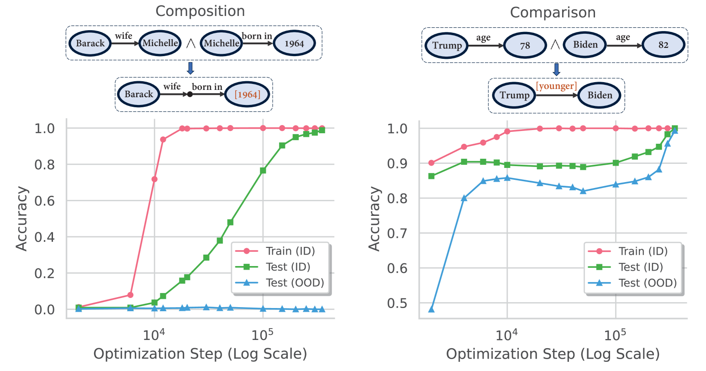

# Reasoning and knowledge graphs

[Group composition and non-commutativity (S5)](group-composition-non-commutative-s5.md) ← previous card, next → [Grokking outside neural networks (non-neural and solvable models)](grokking-in-non-neural-models.md)

[Concept card index](index.md), category: [3. Tasks and datasets](index.md#cat-3)\
→ Next category: [Weight decay (L2 regularisation)](weight-decay.md)\
← Previous category: [Structured representation learning](structured-representation-learning.md)

## Definition

**Reasoning over knowledge graphs** in the context of grokking is the connection established by Wang et al. (2024) between delayed generalisation and a transformer's capacity for *implicit reasoning* — deriving new facts without explicit intermediate steps written out, doing it "in the head" rather than by enumerating a chain in the text — over parametric knowledge \[[1.1](#ref-1-1)\]. Knowledge here is represented as a **knowledge graph**: a set of fact-edges of the form (subject, relation, object); "reasoning" is the derivation of new, unseen facts from the stored ones by latent rules (composition, comparison). The key observation: this skill is reliably acquired only through [grokking](grokking.md) — extended training far beyond overfitting \[[1.1](#ref-1-1)\].

## Elaboration

The setting of Wang et al. is maximally controllable: a random knowledge graph G is built from entities and relations, its edges being "atomic facts" (axioms) of the form (subject, relation, object) \[[1.1](#ref-1-1)\]. From the atomic facts, "inferred facts" (playing the role of theorems) follow by a latent rule: for *composition* this is a two-step derivation — from (h, r1, b) and (b, r2, t) follows a link between h and t through a bridge entity; for *comparison* it is a transitive order over the entities' attributes. The model is trained to predict the tail of an inferred fact; the test on unseen inferred facts — in distribution (ID) and out of it (OOD) — measures whether the rules were learned rather than the answers memorised. The skill of implicit reasoning appears only after a long plateau, that is, through grokking; and the speed of reaching generalisation is governed not by the absolute size of the data but by its *distribution* — by the ratio of inferred facts to atomic ones \[[1.1](#ref-1-1)\]. Mechanistically this is read as the displacement of a memorising circuit (Cmem, which stores facts in the weights; a circuit being a subnetwork implementing a sub-algorithm) by a generalising one (Cgen), which assembles the answer from atomic facts on the fly; the change of solution makes the phenomenon akin to the general picture of a [memorisation phase](memorization-phase.md) followed by generalisation. This picture is, however, contested: He et al. show that a grokked and a non-grokked model follow identical inference paths, and that grokking "merely integrates memorized facts into naturally established circuits" and gives limited transferability to new facts — that is, there may be no genuine *generalising reasoning* at all \[[2.1](#ref-2-1)\]. On the other hand, the "task-as-knowledge-graph" scaffold is taken up and developed: Hwang et al. reproduce the comparison task as a small knowledge graph and account for generalisation by the intrinsic symmetry of the task (the invariance of the labelling under permutations, which fixes the structure of the target representation) \[[3.1](#ref-3-1)\]. In applied LLM pretraining, reasoning figures already as one of the classes of benchmarks on which grokking-like dynamics are tracked \[4.1\].

## Alternative definitions and nuances

### A. Implicit reasoning over parametric knowledge

The reading of Wang et al.: the model's knowledge is a graph of facts sewn into the weights (parametric, not supplied in the context), and reasoning is the derivation of unseen inferred facts from atomic ones by latent rules, carried out "in a single pass" without an explicit textual chain \[[1.1](#ref-1-1)\]. The distinguishing machinery here is a control parameter in the form of the *ratio* of inferred to atomic facts: it is this, and not the absolute volume of data, that determines whether generalisation comes and how fast. This restates the "critical data size" hypothesis as a "critical data distribution" hypothesis \[[1.1](#ref-1-1)\].

### B. The knowledge graph as the task substrate

Here the knowledge graph is not a metaphor but a concrete format for a synthetic dataset: entities as vertices, relations as edge types, facts as triples; the comparison task is instantiated in a "form analogous to a small knowledge graph", where supervision is given only by binary pairwise order relations and the model must infer the global structure itself \[[3.1](#ref-3-1)\]. The difference from reading A is one of emphasis: A defines the *phenomenon* (implicit reasoning arises through grokking), B fixes the *experimental setup* (a knowledge graph as a reproducible test bed) that lets the works of this line be compared.

### Contested

He et al. contest that grokking on knowledge graphs yields genuine generalising reasoning: the inference paths of a grokked and a non-grokked model are identical, grokking "merely integrates memorized facts into naturally established circuits", and a mature generalising circuit transfers poorly to new facts \[[2.1](#ref-2-1)\]. The source of the difference is the separation of behavioural grokking (a jump in accuracy) from the formation of a circuit: they can happen independently, so a jump in accuracy does not by itself prove that a new "paradigmatic" mechanism of reasoning has been acquired.

### In support

Hwang et al. join the "reasoning-over-a-knowledge-graph" scaffold (explicitly following Wang et al., 2024) and build on it: generalisation in such tasks comes at the stage of symmetry acquisition, after which the representations rearrange into a structured geometry aligned with the task \[[3.1](#ref-3-1)\]. Their distinctive thesis is the *intrinsic symmetry of the task* as the first cause of the organisation of representations (rather than the size of the data or the weight norm).

Abramov et al. join from another side: they carry the frame of Wang et al. over from a synthetic graph to a real one (2WikiMultiHopQA) and run into the fact that in a real graph the ratio of inferred to atomic facts is an order of magnitude below the threshold \[[3.2](#ref-3-2)\]. Their distinctive move is the conclusion that enlarging the graph itself is useless and that the missing inferred facts have to be manufactured: augmentation by a language model lifts the ratio above the threshold, and on the comparison task grokking sets in where without augmentation there was no late jump at all (on the compositional task there is none even after augmentation). The "critical data distribution" of reading A thus becomes a quantity that can be controlled from outside, rather than a property of the dataset one happens to have.

## References

###### ref-1-1
**\[1.1\]** 2405.15071 — Wang et al., "Grokked Transformers are Implicit Reasoners: A Mechanistic Journey to the Edge of Generalization". [`"learn to implicitly reason over parametric knowledge"`](../papers/2405.15071.grokked-transformers-are-implicit-reasoners/2405.15071.grokked-transformers-are-implicit-reasoners.card.md#p1-2).\
Also: [`"composition and comparison, we consistently find that transformers can learn implicit reasoning, but only through grokking"`](../papers/2405.15071.grokked-transformers-are-implicit-reasoners/2405.15071.grokked-transformers-are-implicit-reasoners.card.md#p1-2); [`"For atomic facts, we generate a random knowledge graph $\mathcal{G}$ consisting of $|\mathcal{E}|$ entities and $|\mathcal{R}|=200$ relations"`](../papers/2405.15071.grokked-transformers-are-implicit-reasoners/2405.15071.grokked-transformers-are-implicit-reasoners.card.md#p3-4); [`"transformers can learn to perform implicit reasoning, but this skill is only robustly acquired through extended training far beyond overfitting"`](../papers/2405.15071.grokked-transformers-are-implicit-reasoners/2405.15071.grokked-transformers-are-implicit-reasoners.card.md#p2-2).

## References of works that joined the discussion

### Contested

###### ref-2-1
**\[2.1\]** 2601.09049 — He et al., "Is Grokking Worthwhile? Functional Analysis and Transferability of Generalization Circuits in Transformers". Contests: grokking does not yield genuine generalising reasoning but merely embeds memorised facts into circuits that had already formed. [`"Our findings challenge the view that grokking represents genuine acquisition of generalized reasoning"`](../papers/2601.09049.is-grokking-worthwhile-functional-analysis-and-transferability-of-generalization-circuits-in-transformers/original/2601.09049.is-grokking-worthwhile-functional-analysis-and-transferability-of-generalization-circuits-in-transformers.md#p4-6).\
Also: [`"grokking merely integrates memorized facts into naturally established circuits"`](../papers/2601.09049.is-grokking-worthwhile-functional-analysis-and-transferability-of-generalization-circuits-in-transformers/original/2601.09049.is-grokking-worthwhile-functional-analysis-and-transferability-of-generalization-circuits-in-transformers.md#p4-6); [`"the “curse of two-hop reasoning” in compositional tasks"`](../papers/2601.09049.is-grokking-worthwhile-functional-analysis-and-transferability-of-generalization-circuits-in-transformers/original/2601.09049.is-grokking-worthwhile-functional-analysis-and-transferability-of-generalization-circuits-in-transformers.md#p1-2).

### In support

###### ref-3-1
**\[3.1\]** 2603.01968 — Hwang et al., "Intrinsic Task Symmetry Drives Generalization in Algorithmic Tasks". Nuance: joins the reading of the task as a knowledge graph (following Wang) and accounts for generalisation by the intrinsic symmetry of the task. [`"form analogous to a small knowledge graph, following prior works (Wang et al., 2024; Allen-Zhu & Li, 2024)"`](../papers/2603.01968.intrinsic-task-symmetry-drives-generalization-in-algorithmic-tasks/original/2603.01968.intrinsic-task-symmetry-drives-generalization-in-algorithmic-tasks.md#p3-4).\
Also: [`"the model must infer global structure solely from binary pairwise relations"`](../papers/2603.01968.intrinsic-task-symmetry-drives-generalization-in-algorithmic-tasks/original/2603.01968.intrinsic-task-symmetry-drives-generalization-in-algorithmic-tasks.md#p3-3).

###### ref-3-2
**\[3.2\]** 2504.20752 — Abramov et al., "Grokking in the Wild: Data Augmentation for Real-World Multi-Hop Reasoning with Transformers". Nuance: carries the frame of Wang et al. over from a synthetic graph to a real one (2WikiMultiHopQA) and manufactures the missing inferred facts by synthesis. [`"for the first time, we extend grokking to real-world factual data and address the challenge of dataset sparsity by augmenting existing knowledge graphs with carefully designed synthetic data"`](../papers/2504.20752.grokking-in-the-wild-data-augmentation-for-real-world-multi-hop-reasoning-with-transformers/2504.20752.grokking-in-the-wild-data-augmentation-for-real-world-multi-hop-reasoning-with-transformers.card.md#p1-2).\
Also: [`"even factually incorrect synthetic data can strengthen emergent reasoning circuits rather than degrade accuracy"`](../papers/2504.20752.grokking-in-the-wild-data-augmentation-for-real-world-multi-hop-reasoning-with-transformers/2504.20752.grokking-in-the-wild-data-augmentation-for-real-world-multi-hop-reasoning-with-transformers.card.md#p1-2).

## Passing mentions

Works that only mention the phenomenon — a literature review, a related-work paragraph, a passing citation — without examining it.

**\[4.1\]** 2506.21551 — Li et al., "Grokking in LLM Pretraining? Monitor Memorization-to-Generalization without Test". [`"generalization on diverse benchmark tasks covering math/commonsense reasoning, code generation, and domain-specific retrieval"`](../papers/2506.21551.grokking-in-llm-pretraining-monitor-memorization-to-generalization-without-test/2506.21551.grokking-in-llm-pretraining-monitor-memorization-to-generalization-without-test.card.md#p1-2).
