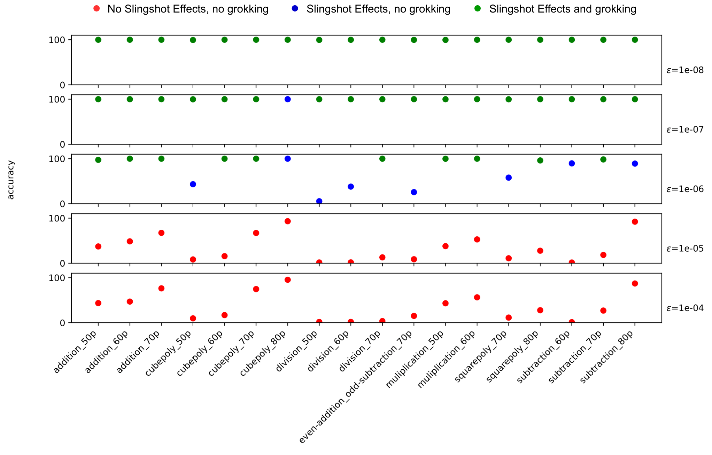

# When regularisation is necessary

[Initialization scale](initialization-scale.md) ← previous card, next → [Learning rate](learning-rate.md)

[Concept card index](index.md), category: [4. Training and optimisation factors](index.md#cat-4)\
→ Next category: [Grokfast / gradient low-pass filtering](gradient-low-pass-filtering.md)\
← Previous category: [Modular arithmetic](modular-arithmetic.md)

## Definition

**When regularisation is necessary** is an open question of dispute in the corpus: is regularisation (above all [weight decay](weight-decay.md); for the range of kinds see [regularisation variants](regularization-variants.md)) a necessary condition of grokking. There is no agreed position: the corpus contains directly opposite experimental answers, each honestly obtained in its own setting, and no work states a rule as to when exactly regularisation is obligatory. The question is present already in the primary source: in Power et al. weight decay is the most effective of the interventions, yet their own canonical plot is obtained with Adam and no weight decay at all, with the budget stretched to $10^{6}$ steps \[[1.1](#ref-1-1)\]. Below are all the positions represented in the corpus.

## Positions

### A. Necessary — without regularisation there is no grokking

Nanda et al., in their setting (cross-entropy, AdamW, $P=113$), are categorical: *"our networks do not grok on the modular arithmetic task without weight decay or some other form of regularization"* \[[2.1](#ref-2-1)\]; the heading of their appendix D.1 is "Both regularisation and limited data are necessary for grokking". The same picture is given by DeMoss et al.'s unregularised baseline run: *"the unregularized network never generalizes, and its complexity remains large"* \[[2.2](#ref-2-2)\].

### B. Not necessary — grokking occurs without it too

Gromov demonstrates *"fully-connected two-layer networks that exhibit grokking on various modular arithmetic tasks under vanilla gradient descent with the MSE loss function in the absence of any regularization"* \[[3.1](#ref-3-1)\]; Kumar et al. a perceptron that *"groks on our polynomial regression task (no weight decay, vanilla GD)"* \[[3.2](#ref-3-2)\], and with a growing weight norm at that; and Power's own canonical figure was obtained without weight decay. The common denominator of this group is the MSE loss and plain gradient descent.

### C. Conditionally necessary — without regularisation the slingshots save the day

Thilak et al.: *"without explicit regularization, Grokking as reported in [17] almost exclusively happens at the onset of Slingshots, and is absent without it"* \[[4.1](#ref-4-1)\] — under cross-entropy with an adaptive optimiser, grokking without regularisation is possible, but almost exclusively through the [slingshot effect](slingshot.md); Nanda et al. (appendix D.2) reproduce the slingshots and add that with weight decay switched on they are not necessary.

### D. "Necessity" as an artefact of arithmetic

Prieto et al. turn the question around: *"SC is responsible for the absence of grokking without regularization"* \[[4.2](#ref-4-2)\] — without regularisation, training with softmax and cross-entropy runs into [Softmax Collapse](softmax-collapse.md), a floating-point absorption error; once that is removed (StableMax or the gradient projection ⊥Grad), grokking proceeds without regularisation, [with a growing weight norm](../papers/2501.04697.grokking-at-the-edge-of-numerical-stability/2501.04697.grokking-at-the-edge-of-numerical-stability.card.md#p5-10). On this version the "necessity of regularisation" is a property of softmax arithmetic, not of the training dynamics.

### E. It depends on the initialisation scale

Omnigrok makes the necessity depend on a third axis: *"large initialization ($\alpha=2.0$) can demonstrate no generalization (no reg), grokking (small reg) and fast generalization (large reg). Bottom: small initialization ($\alpha=0.5$) always generalizes fast, regardless of weight decay"* \[[4.3](#ref-4-3)\] — at a large initialisation there is no generalisation without regularisation, at a small one it is fast without regularisation too (and without grokking).

### F. Regularisation as a trigger rather than a condition

Notsawo et al. 2025 generalise: *"grokking can be induced by regularization, either explicit or implicit"* \[[4.4](#ref-4-4)\] — grokking is induced by a small non-zero regularisation towards an arbitrary suitable property of the solution, depth works as an implicit regularisation without an explicit one, and an excess gives "grokking without understanding" — a turn of the curve without a real solution (see [the direction of the weight-decay effect](weight-decay-direction.md)).

## Relating the positions (an editor's remark)

The positions barely overlap in their settings, and that is the key to the apparent contradiction: A was obtained under cross-entropy with AdamW, B under MSE with plain gradient descent, C describes cross-entropy with an adaptive optimiser and no regularisation, D explains the difference between A and B by softmax arithmetic, E adds an axis of initialisation scale, and F redescribes regularisation from a condition into a control knob. A summary rule — "the necessity of regularisation is determined by the loss function, the optimiser and the initialisation scale" — is consistent with all the observations listed, but **no work in the corpus states or tests it as a rule**: it is the editor's speculation, consistent with the data. The main choice also remains open — whether to count the dependence on regularisation as a real property of the dynamics (A against B) or as an artefact of arithmetic (D) — as does how it relates to the axis of [gradient noise](gradient-noise.md): there is no direct experiment in the corpus separating these two readings in one setting.

## References

###### ref-1-1
**\[1.1\]** 2201.02177 — Power et al., "Grokking: Generalization Beyond Overfitting on Small Algorithmic Datasets". The canonical run without regularisation. [`"we increased the optimization budget to $10^{6}$, and used Adam optimizer with no weight decay, for emphasizing how late into the optimization process the generalization can begin"`](../papers/2201.02177.grokking-generalization-beyond-overfitting-on-small-algorithmic-datasets/2201.02177.grokking-generalization-beyond-overfitting-on-small-algorithmic-datasets.card.md#sec-a1-2).

###### ref-1-2
**\[1.2\]** 2310.02541 — Xu et al. 2023. Nuance: grokking is obtained with no explicit regulariser at all; the delay is derived from the geometry of the data (the nonlinear separability of XOR plus high dimension) rather than from a penalty on the norm. [`"we observe grokking without any explicit forms of regularization, revealing the significance of the implicit regularization of GD"`](../papers/2310.02541.benign-overfitting-and-grokking-in-relu-networks-for-xor-cluster-data/original/2310.02541.benign-overfitting-and-grokking-in-relu-networks-for-xor-cluster-data.md#p11-5).

###### ref-1-3
**\[1.3\]** 2311.07568 — Morwani et al. 2024, "Feature emergence via margin maximization: case studies in algebraic tasks". A work in which regularisation is not a lever but the load-bearing structure: training runs on the objective ${\mathcal{L}}_{\lambda}(\theta)=\frac{1}{|D|}\sum_{(x,y)\in D}l(f(\theta,x),y)+\lambda\|\theta\|^{r}$, and the whole bridge from training to the maximal margin is the limit $\lambda\to 0$. Nuance: the norm taken is not the ordinary one but $L_{2,\nu}$, matched to the network's homogeneity constant ($L_{2,3}$ for the quadratic activation, $L_{2,k+1}$ for $k$-parity), and the authors explain the choice $b=\nu$ by the fact that only it leaves the freedom to assemble a certifying network. One may not cite this work in support of the claim that features emerge "even without explicit regularisation". [`"The following theorem of Wei et al. 2019a states that, when using vanishingly small regularization $\lambda$, the normalized margin of global optimizers of ${\mathcal{L}}_{\lambda}$ converges to $\gamma^{*}$."`](../papers/2311.07568.feature-emergence-via-margin-maximization-case-studies-in-algebraic-tasks/2311.07568.feature-emergence-via-margin-maximization-case-studies-in-algebraic-tasks.card.md#p5-9).\
Also (why $b=\nu$): [`"for any such $b$ we would not get the same flexibility to build a $\theta^{*}$ satisfying Equation 1. This is the reason behind choosing $b=\nu$."`](../papers/2311.07568.feature-emergence-via-margin-maximization-case-studies-in-algebraic-tasks/2311.07568.feature-emergence-via-margin-maximization-case-studies-in-algebraic-tasks.card.md#p23-1); Also (the numbers in the experiment): [`"For quadratic network, we use a $L_{2,3}$ regularization of $1e-4$. For ReLU network, we use a $L_{2}$ regularization of $1e-4$."`](../papers/2311.07568.feature-emergence-via-margin-maximization-case-studies-in-algebraic-tasks/2311.07568.feature-emergence-via-margin-maximization-case-studies-in-algebraic-tasks.card.md#p19-2).
## References of works that joined the discussion

### Position A: necessary

###### ref-2-1
**\[2.1\]** 2301.05217 — Nanda et al., "Progress Measures for Grokking via Mechanistic Interpretability". [`"our networks do not grok on the modular arithmetic task without weight decay or some other form of regularization"`](../papers/2301.05217.progress-measures-for-grokking-via-mechanistic-interpretability/2301.05217.progress-measures-for-grokking-via-mechanistic-interpretability.card.md#sec-5-3).

###### ref-2-2
**\[2.2\]** 2412.09810 — DeMoss et al., "The Complexity Dynamics of Grokking". [`"the unregularized network never generalizes, and its complexity remains large"`](../papers/2412.09810.the-complexity-dynamics-of-grokking/original/2412.09810.the-complexity-dynamics-of-grokking.md#fig-1).

###### ref-2-3
**\[2.3\]** 2505.20172 — Boursier et al., "A Theoretical Framework for Grokking: Interpolation followed by Riemannian Norm Minimisation". Draws the boundary of necessity by **type of task**: in classification the implicit bias is enough, whereas in regression grokking, "to the best of our knowledge", does not occur without weight decay. The same division explains why the corpus's counter-evidence does not contradict the theory: it was obtained in classification, which the theory excludes by an assumption of a bounded flow. Nuance: there is no proof of this fork — the sentence stands in a survey section. [`"While grokking can be observed in classification tasks even without weight decay—thanks to the algorithm’s implicit bias—to the best of our knowledge, it cannot occur in regression tasks unless weight decay is used."`](../papers/2505.20172.a-theoretical-framework-for-grokking-interpolation-followed-by-riemannian-norm-minimisation/2505.20172.a-theoretical-framework-for-grokking-interpolation-followed-by-riemannian-norm-minimisation.card.md#p3-2).

###### ref-2-4
**\[2.4\]** 2603.25009 — Manir, Rupa, "A Systematic Empirical Study of Grokking…". [`"The relatively large weight decay ($\lambda=1.0$) follows Liu et al. (2022) and is required to reliably induce grokking with AdamW."`](../papers/2603.25009.a-systematic-empirical-study-of-grokking-depth-architecture-activation-and-regularization/2603.25009.a-systematic-empirical-study-of-grokking-depth-architecture-activation-and-regularization.card.md#p4-4).

###### ref-2-5
**\[2.5\]** 2604.06256 — Xu, "Spectral Edge Dynamics Reveal Functional Modes of Learning". Nuance: "only under weight decay" refers to two settings tested, not to weight decay as such; there are no attempts to obtain the edge by another norm constraint. [`"This is consistent with the observation that the spectral edge forms only under weight decay ($\mathrm{wd}=1.0$), not without it."`](../papers/2604.06256.spectral-edge-dynamics-reveal-functional-modes-of-learning/original/2604.06256.spectral-edge-dynamics-reveal-functional-modes-of-learning.md#p5-11).

###### ref-2-6
**\[2.6\]** 2506.12284 — Walker et al., "GrokAlign: Geometric Characterisation and Acceleration of Grokking". Takes the side of "necessary", but with a different argument: without regularisation there is nothing to hold the Jacobian norm down, and an initialisation cannot be chosen in advance. Nuance: there is no run without regularisation at all in the work — weight decay stays on in every setting compared, including the baseline — so the conclusion rests on the sweep over weight and output scales in appendix B rather than on a direct measurement. [`"a priori, knowing how to initialise the deep network for favourable alignment dynamics is challenging, hence, in practice some sort of regularisation is necessary"`](../papers/2506.12284.grokalign-geometric-characterisation-and-acceleration-of-grokking/original/2506.12284.grokalign-geometric-characterisation-and-acceleration-of-grokking.md#p16-2).\
Also (why the "no regularisation" case is not measured): [`"In each method we do not manipulate the weight-decay of the training procedure."`](../papers/2506.12284.grokalign-geometric-characterisation-and-acceleration-of-grokking/original/2506.12284.grokalign-geometric-characterisation-and-acceleration-of-grokking.md#p9-2)

###### ref-2-7
**\[2.7\]** 2310.13061 — Doshi, Das, He, Gromov 2024, "To grok or not to grok: Disentangling generalization and memorization on corrupted algorithmic datasets". A direct objection: on modular addition grokking sets in without explicit regularisation as well, and robustly to label corruption at that. Nuance: the claim is made for this setting rather than for grokking in general; adding regularisation, the authors say, only makes grokking more robust. [`"We emphasise that this is in stark contrast to the common belief that grokking requires explicit regularization."`](../papers/2310.13061.to-grok-or-not-to-grok-disentangling-generalization-and-memorization-on-corrupted-algorithmic-datasets/original/2310.13061.to-grok-or-not-to-grok-disentangling-generalization-and-memorization-on-corrupted-algorithmic-datasets.md#p4-5).
### Position B: not necessary

###### ref-3-1
**\[3.1\]** 2301.02679 — Gromov, "Grokking modular arithmetic". [`"fully-connected two-layer networks that exhibit grokking on various modular arithmetic tasks under vanilla gradient descent with the MSE loss function in the absence of any regularization"`](../papers/2301.02679.grokking-modular-arithmetic/2301.02679.grokking-modular-arithmetic.card.md#p1-2).

###### ref-3-2
**\[3.2\]** 2310.06110 — Kumar et al., "Grokking as the Transition from Lazy to Rich Training Dynamics". [`"groks on our polynomial regression task (no weight decay, vanilla GD)"`](../papers/2310.06110.grokking-as-the-transition-from-lazy-to-rich-training-dynamics/original/2310.06110.grokking-as-the-transition-from-lazy-to-rich-training-dynamics.md#fig-4).

###### ref-3-6
**\[3.6\]** 2308.15594 — Charton, "Learning the greatest common divisor: explaining transformer predictions". Nuance: neither weight decay, nor dropout, nor any other explicit regularisation is mentioned even once, and steps and late jumps are observed — under cross-entropy and Adam, that is, outside this group's usual denominator (MSE + vanilla gradient descent). A caveat is obligatory: the author himself denies that Power et al.'s definition is satisfied here, and there is no experiment with regularisation switched on. [`"Transformers with $4$ layers, $512$ dimensions and $8$ attention heads, using Adam (Kingma & Ba 2014) are trained with a learning rate of $10^{-5}$ (no scheduling is needed) on batches of $256$ examples."`](../papers/2308.15594.learning-the-greatest-common-divisor-explaining-transformer-predictions/original/2308.15594.learning-the-greatest-common-divisor-explaining-transformer-predictions.md#p2-5).\
Also: [`"long periods of stagnation followed by sudden drops in the loss, and rises in accuracy, as new GCD are learned"`](../papers/2308.15594.learning-the-greatest-common-divisor-explaining-transformer-predictions/original/2308.15594.learning-the-greatest-common-divisor-explaining-transformer-predictions.md#p4-6).

###### ref-3-7
**\[3.7\]** 2211.12316 — Bhattamishra et al., "Simplicity Bias in Transformers and their Ability to Learn Sparse Boolean Functions". Nuance: explicit regularisation is not needed where the architecture generalises and does not save the day where it does not (dropout and L2 on an LSTM); implicit regularisation is named but described by no minimised quantity. [`"there is a form of implicit regularization in the procedure used to train neural models which prevent them from overfitting despite their incredible capacity"`](../papers/2211.12316.simplicity-bias-in-transformers-and-their-ability-to-learn-sparse-boolean-functions/2211.12316.simplicity-bias-in-transformers-and-their-ability-to-learn-sparse-boolean-functions.card.md#p9-6).

###### ref-3-8
**\[3.8\]** 2408.11804 — Yunis et al., "Approaching Deep Learning through the Spectral Dynamics of Weights". An intermediate and careful position: weight decay is not declared necessary but is called replaceable by a larger amount of data — at 30% of the data without it there is neither grokking nor a low-rank solution, at 90% generalisation comes and still coincides with the minimisation of the effective rank. The work states no rule about when regularisation is obligatory. [`"we demonstrate that increasing the training data can partially compensate for the absence of weight decay in terms of generalization and rank minimization"`](../papers/2408.11804.approaching-deep-learning-through-the-spectral-dynamics-of-weights/original/2408.11804.approaching-deep-learning-through-the-spectral-dynamics-of-weights.md#p2-2).\
Also (the difference between labels obtained without regularisation): [`"even without weight decay, inner layers align with true labels, while with random labels, this alignment occurs and then disappears with more training"`](../papers/2408.11804.approaching-deep-learning-through-the-spectral-dynamics-of-weights/original/2408.11804.approaching-deep-learning-through-the-spectral-dynamics-of-weights.md#p9-1).

###### ref-3-9
**\[3.9\]** 2411.00247 — Jeffares, Curth, van der Schaar, "Deep Learning Through A Telescoping Lens: A Simple Model Provides Empirical Insights On Grokking, Gradient Boosting & Beyond". Accepts Kumar et al.'s argument that weight decay and adaptive optimisers cannot be the sole cause of grokking, and supports it with a set of settings: the polynomial experiment runs on full-batch gradient descent with no regularisation, the MNIST one under AdamW with $\lambda=.1$, and the divergence of the effective parameters is visible in both. Nuance: there is no intervention of their own — regularisation is neither switched on nor off, and the authors make no claim about necessity. [`"[KBGP24] highlight that the latter two explanations cannot be the sole reason for grokking by constructing an experiment where grokking occurs as the weight norm grows without the use of adaptive optimizers."`](../papers/2411.00247.deep-learning-through-a-telescoping-lens-a-simple-model-provides-empirical-insights-on-grokking-gradient-boosting-and-beyond/original/2411.00247.deep-learning-through-a-telescoping-lens-a-simple-model-provides-empirical-insights-on-grokking-gradient-boosting-and-beyond.md#p18-2).

###### ref-3-11
**\[3.11\]** 2507.20057 — Lyle et al., "What Can Grokking Teach Us About Learning Under Nonstationarity?". Gives a two-sided argument. On one hand, weight decay is not necessary for grokking: networks with a periodic projection back to the initial norm grok fast and stably across seeds, and there a large weight decay is not needed. On the other, a high effective learning rate alone is not enough either: with layer normalisation a network with projection does not generalise at all until weight decay is applied to the normalisation's scale parameters ("scale decay"). What turns out to be necessary is not a particular regulariser but a combination of a sufficient change of the representation and a suitable landscape. [`"generalization requires *both* meaningful changes to the learned representation, and a suitable loss landscape in which these changes converge to a smooth, generalizing solution"`](../papers/2507.20057.what-can-grokking-teach-us-about-learning-under-nonstationarity/original/2507.20057.what-can-grokking-teach-us-about-learning-under-nonstationarity.md#p6-1).\
Also (what exactly replaces weight decay): [`"we see a stronger effect of learning rate compared to weight decay value on grokking in the variable-norm networks, again reinforcing that the effective learning rate, and not the parameter norm on its own, is responsible for grokking"`](../papers/2507.20057.what-can-grokking-teach-us-about-learning-under-nonstationarity/original/2507.20057.what-can-grokking-teach-us-about-learning-under-nonstationarity.md#p5-6).

###### ref-3-12
**\[3.12\]** 2505.11411 — Zhang, Shang, Yang, Zhang, "Is Grokking a Computational Glass Relaxation?". Supports the conclusion that regularisation is not necessary, from a new side: grokking is removed not by a regulariser but by the optimiser itself — WanD reaches generalisation without norm constraints and without output scaling. Nuance: the comparison is against an AdamW baseline curve taken at weight decay 1, and the interaction of the glassy dynamics with explicit regularisation is assigned by the authors to the unexamined. [`"In the modular addition task, WanD has similar time efficiency and generalization performance as AdamW but can eliminate grokking without any explicit regularization (like weight norm constraints)."`](../papers/2505.11411.is-grokking-a-computational-glass-relaxation/original/2505.11411.is-grokking-a-computational-glass-relaxation.md#p2-5).\
Also (under what condition they agree with Kumar et al.): [`"This also agrees with the conclusion of Kumar et al. kumar2023grokking that regularization is not always necessary for grokking, but in a strictly-defined situation without output scaling."`](../papers/2505.11411.is-grokking-a-computational-glass-relaxation/original/2505.11411.is-grokking-a-computational-glass-relaxation.md#p2-5)\
Also (how the baseline curve is regularised): [`"training for 10000 optimization steps with weight decay 1 or fixed weight norm 30"`](../papers/2505.11411.is-grokking-a-computational-glass-relaxation/original/2505.11411.is-grokking-a-computational-glass-relaxation.md#p14-2).

###### ref-3-13
**\[3.13\]** 2409.09281 — Lv et al., "Language Models “Grok” to Copy". To position B: the delayed sharp rise is obtained on an ordinary model with no regularisation at all, while dropout and weight decay appear only in the applied section and change the timing and the final level rather than the presence of the transition. Nuance: the coincidence of technique with Nanda et al. 2023, from whom both regularisations are taken, does not mean a coincidence of mechanism — there, without regularisation, grokking does not occur at all; and the authors do not raise the question of necessity. [`"with dropout, the model groks to copy earlier"`](../papers/2409.09281.language-models-grok-to-copy/2409.09281.language-models-grok-to-copy.card.md#p5-1).\
Also (the comparison with the base model): [`"Compared with vanilla models, dropout accelerates the grokking process"`](../papers/2409.09281.language-models-grok-to-copy/2409.09281.language-models-grok-to-copy.card.md#fig-7).

###### ref-3-16
**\[3.16\]** 2502.01774 — Carvalho et al. 2025, "Grokking Explained: A Statistical Phenomenon". [`"grokking is a statistical phenomenon derived from a distribution shift between test data and training data, which can be reproduced systematically and which is amplified, not defined, by high regularization and use of specific parametrization and initialization values"`](../papers/2502.01774.grokking-explained-a-statistical-phenomenon/original/2502.01774.grokking-explained-a-statistical-phenomenon.md#p4-3).\
Also (a conflicting explanation of the delay): [`"their impact on the test set performance was seen only after training converged and weight decay led the network to a more sparse internal representation"`](../papers/2502.01774.grokking-explained-a-statistical-phenomenon/original/2502.01774.grokking-explained-a-statistical-phenomenon.md#p6-3).
### Positions C–F: conditional and reframing

###### ref-4-1
**\[4.1\]** 2206.04817 — Thilak et al., "The Slingshot Mechanism". [`"without explicit regularization, Grokking as reported in [17] almost exclusively happens at the onset of Slingshots, and is absent without it"`](../papers/2206.04817.the-slingshot-mechanism-an-empirical-study-of-adaptive-optimizers-and-grokking/2206.04817.the-slingshot-mechanism-an-empirical-study-of-adaptive-optimizers-and-grokking.card.md#p1-2).

###### ref-4-2
**\[4.2\]** 2501.04697 — Prieto et al., "Grokking at the Edge of Numerical Stability". [`"SC is responsible for the absence of grokking without regularization"`](../papers/2501.04697.grokking-at-the-edge-of-numerical-stability/2501.04697.grokking-at-the-edge-of-numerical-stability.card.md#p2-2).

###### ref-4-3
**\[4.3\]** 2210.01117 — Liu et al., "Omnigrok". Necessity depends on the initialisation scale. [`"large initialization ($\alpha=2.0$) can demonstrate no generalization (no reg), grokking (small reg) and fast generalization (large reg). Bottom: small initialization ($\alpha=0.5$) always generalizes fast, regardless of weight deacy"`](../papers/2210.01117.omnigrok-grokking-beyond-algorithmic-data/original/2210.01117.omnigrok-grokking-beyond-algorithmic-data.md#fig-2).

###### ref-4-4
**\[4.4\]** 2506.05718 — Notsawo et al., "Grokking Beyond the Euclidean Norm of Model Parameters". [`"grokking can be induced by regularization, either explicit or implicit"`](../papers/2506.05718.grokking-beyond-the-euclidean-norm-of-model-parameters/original/2506.05718.grokking-beyond-the-euclidean-norm-of-model-parameters.md#p1-2).

###### ref-4-5
**\[4.5\]** 2407.20199 — Mallinar et al., "Emergence in non-neural models: grokking modular arithmetic via average gradient outer product". Nuance: a third answer in the dispute — what is necessary is not the $\ell_{2}$ norm of the weights specifically but some penalty acting on the AGOP; the RFM setting itself, meanwhile, takes no part in the dispute, since the regression there is ridgeless and grokking arises with no regularisation at all. [`"we find that, akin to weight decay, AGOP regularization leads to grokking in cases where using no regularization results in no grokking and poor generalization"`](../papers/2407.20199.emergence-in-non-neural-models-grokking-modular-arithmetic-via-average-gradient-outer-product/original/2407.20199.emergence-in-non-neural-models-grokking-modular-arithmetic-via-average-gradient-outer-product.md#p12-3).
### In support

###### ref-3-3
**\[3.3\]** 2311.18817 — Lyu et al., "Dichotomy of Early and Late Phase Implicit Biases Can Provably Induce Grokking". Nuance: separates two questions that the other positions merge — without weight decay grokking remains (the test creeps from ~0% to 100% as $t$ grows from $10^{10^{2}}$ to $10^{10^{4}}$) but stops being sharp; the slowness is explained by the known rate of convergence to the maximal margin, $\mathcal{O}(\frac{\log\log t}{\log t})$. The setting: cross-entropy, full-batch GD with learning rate $\frac{\eta}{\mathcal{L}({\boldsymbol{\theta}}(t))}$, modular addition. [`"We empirically show that training two-layer neural nets without weight decay indeed leads to grokking, but the transition is no longer sharp."`](../papers/2311.18817.dichotomy-of-early-and-late-phase-implicit-biases-can-provably-induce-grokking/original/2311.18817.dichotomy-of-early-and-late-phase-implicit-biases-can-provably-induce-grokking.md#p18-4).\
Also: [`"But the weight decay has to be non-zero: we will discuss in Section B.1 that training without weight decay leads to perfect generalization in the end, but the transition in test accuracy is no longer sharp."`](../papers/2311.18817.dichotomy-of-early-and-late-phase-implicit-biases-can-provably-induce-grokking/original/2311.18817.dichotomy-of-early-and-late-phase-implicit-biases-can-provably-induce-grokking.md#p4-1).

###### ref-3-4
**\[3.4\]** 2401.10463 — Zhu et al. 2024. Nuance: dropout is set to 0 deliberately, so that training is governed only by cross-entropy and weight decay; there is no experiment with a complete absence of regularisation ($\lambda=0$) in the work — the ablation sweeps four non-zero values. [`"we set the dropout ratio to 0, indicating that the learning process of the model $\mathbf{w}$ is exclusively influenced by cross-entropy loss and weight decay"`](../papers/2401.10463.critical-data-size-of-language-models-from-a-grokking-perspective/2401.10463.critical-data-size-of-language-models-from-a-grokking-perspective.card.md#p4-2).

###### ref-3-5
**\[3.5\]** 2310.16441 — Levi et al. 2023. Nuance: grokking comes out at zero weight decay by construction, and the argument is structural rather than empirical — the gradients are set by the training loss, and the generalisation loss lags by a constant factor. There is no comparison of regularised and unregularised runs as an experiment: WD enters the analysis as one more term in the equation. [`"we set $d_{\mathrm{out}}=1$, reducing $S,T\in\mathbb{R}^{d_{\mathrm{in}}}$ from matrices to vectors, and assume no weight decay $\gamma=0$"`](../papers/2310.16441.grokking-in-linear-estimators-a-solvable-model-that-groks-without-understanding/original/2310.16441.grokking-in-linear-estimators-a-solvable-model-that-groks-without-understanding.md#p4-3).

###### ref-3-14
**\[3.14\]** 2603.07323 — Truong, Truong, "Norm-Hierarchy Transitions in Representation Learning…". Nuance: norm contraction is separated from an improvement in performance by experiment rather than by argument. [`"norm contraction is necessary but not sufficient for a successful transition"`](../papers/2603.07323.norm-hierarchy-transitions-in-representation-learning-when-and-why-neural-networks-abandon-shortcuts/2603.07323.norm-hierarchy-transitions-in-representation-learning-when-and-why-neural-networks-abandon-shortcuts.card.md#p10-1).

###### ref-3-15
**\[3.15\]** 2605.08237 — Wang, Ying, Kanamori 2026, "Distributional Spectral Diagnostics for Localizing Grokking Transitions". Nuance: the budget is cut off at 6000 steps, so "non-grokking" here means "did not manage to generalise" rather than "does not generalise". [`"some seeds do not generalize until beyond $5\times 10^{5}$ steps"`](../papers/2605.08237.distributional-spectral-diagnostics-for-localizing-grokking-transitions/2605.08237.distributional-spectral-diagnostics-for-localizing-grokking-transitions.card.md#p16-4).\
Also (the other side): [`"all runs with weight decay generalize within 6000 steps"`](../papers/2605.08237.distributional-spectral-diagnostics-for-localizing-grokking-transitions/2605.08237.distributional-spectral-diagnostics-for-localizing-grokking-transitions.card.md#p16-4)
## Passing mentions

**\[4.6\]** 2504.16041 — Tveit, Remseth, Skogvold, "Muon Optimizer Accelerates Grokking". Nuance: the position "regularisation is necessary" is taken as settled and passed on without support — of the two references one ([8]) does not exist, and the other ([7] = Liu et al. 2205.10343) shows the opposite: sufficient weight decay and dropout remove grokking. The work offers no evidence of its own and does not investigate the question. [`"Prior work has established that weight decay and other regularization techniques are crucial prerequisites for observing the grokking phenomenon [7, 8]."`](../papers/2504.16041.muon-optimizer-accelerates-grokking/original/2504.16041.muon-optimizer-accelerates-grokking.md#p1-4).

**\[4.7\]** 2211.13239 — Brown et al., "Relating Regularization and Generalization through the Intrinsic Dimension of Activations". Nuance: weight decay is taken as a sweep axis rather than as a condition; the work neither raises nor answers the question of necessity. Meanwhile, in its 4×4 sweep grokking is observed at weight decay $=0$ as well — which the authors do not note. [`"sweeping over the strength of weight decay regularization and the size of the training dataset, since these parameters strongly affect when models begin to grok and the duration of the grokking period"`](../papers/2211.13239.relating-regularization-and-generalization-through-the-intrinsic-dimension-of-activations/original/2211.13239.relating-regularization-and-generalization-through-the-intrinsic-dimension-of-activations.md#p5-4).

**\[4.8\]** 2605.20441 — Verma 2026, "Weight Decay Regimes in Grokking Transformers: Cheap Online Diagnostics". Explicitly declines the strong claim in response to Yıldırım 2026's counter-frame: weight decay is declared an empirical control parameter within the standard attention architecture, but not a necessary condition of generalisation. On the other hand, three probes on attention-free architectures (MLP, LSTM, Mamba) show that the weight-decay-controlled transition itself is not peculiar to attention. Nuance: there is no setting with $\lambda=0$ in the work at all — necessity is not tested but sidestepped by a caveat; and the counter-frame is cited inaccurately (see `mc-2603-05228` in that card). [`"we do not claim that weight decay is *necessary* for generalization, only that within the standard attention architecture weight decay behaves as an empirical control parameter with a well-defined regime diagram"`](../papers/2605.20441.weight-decay-regimes-in-grokking-transformers-cheap-online-diagnostics/original/2605.20441.weight-decay-regimes-in-grokking-transformers-cheap-online-diagnostics.md#p3-1).\
Also (the cross-architecture side): [`"Grokking is therefore not attention-specific in our setting, but the transition-scale $\lambda$ depends strongly on architecture"`](../papers/2605.20441.weight-decay-regimes-in-grokking-transformers-cheap-online-diagnostics/original/2605.20441.weight-decay-regimes-in-grokking-transformers-cheap-online-diagnostics.md#p14-1).

###### ref-3-10
**\[3.10\]** 2602.18523 — Xu, "The Geometry of Multi-Task Grokking: Transverse Instability, Superposition, and Weight Decay Phase Structure". Nuance: at $\lambda=0$ negative curvature is present and not small ($\lambda_{\text{min}}\approx-50$ against $-63$ at $\lambda=1.0$), yet there is no generalisation at all within a budget of up to 250 thousand steps. A caveat for the corpus: this is shown in one setting — an encoder, cross-entropy, AdamW. [`"negative Hessian curvature is *necessary but not sufficient* for grokking"`](../papers/2602.18523.the-geometry-of-multi-task-grokking-transverse-instability-superposition-and-weight-decay-phase-structure/original/2602.18523.the-geometry-of-multi-task-grokking-transverse-instability-superposition-and-weight-decay-phase-structure.md#p9-2).\
Also (the control without weight decay): [`"confirming that weight decay is essential for multi-task grokking as in the single-task case"`](../papers/2602.18523.the-geometry-of-multi-task-grokking-transverse-instability-superposition-and-weight-decay-phase-structure/original/2602.18523.the-geometry-of-multi-task-grokking-transverse-instability-superposition-and-weight-decay-phase-structure.md#p5-1).
