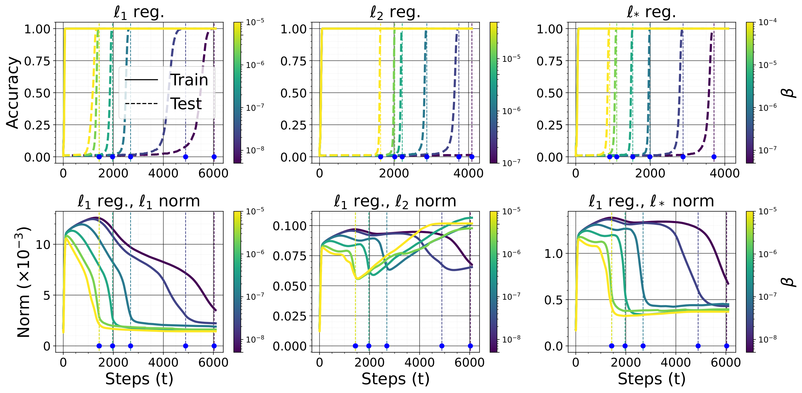

# Regularisation variants

[Learning rate](learning-rate.md) ← previous card, next → [The Goldilocks zone](goldilocks-zone.md)

[Concept card index](index.md), category: [4. Training and optimisation factors](index.md#cat-4)\
→ Next category: [Grokfast / gradient low-pass filtering](gradient-low-pass-filtering.md)\
← Previous category: [Modular arithmetic](modular-arithmetic.md)

## Definition

**Regularisation variants** are a family of regularisation techniques OTHER than the canonical [weight decay](weight-decay.md) (the penalty on the squared L2 norm of the weights) which, in the context of [grokking](grokking.md) — the delayed generalisation in which a network first memorises the training sample almost perfectly and generalises orders of magnitude later — induce or accelerate that delayed transition. The key generalisation is that grokking is not tied to L2 in particular: if there exists a model with some property P (say, sparse or low-rank weights) that fits the data, then gradient descent with a small non-zero regularisation of that property (the l1 norm or the nuclear norm — the sum of a weight matrix's singular values) also leads to grokking \[[1.1](#ref-1-1)\].

## Elaboration

Besides weight decay, the corpus describes several regularisers in their own right, each of which initiates or accelerates grokking in its own way. The generalised theory of property P shows that a penalty on the l1 norm (the sum of the absolute values of the weights, encouraging sparsity) or on the nuclear norm (encouraging low rank) works on a par with L2, while the L2 norm itself stops being a reliable predictor when the property sought is not a small Euclidean norm \[[1.1](#ref-1-1)\]. The second variant is perturbation-based training: starting from the connection between grokking and robustness (a network's ability to keep its prediction under small perturbations of the input or the weights), controlled perturbations are introduced into training, which accelerates generalisation \[[1.2](#ref-1-2)\]. The third is a regularisation-style inhibition of monosemantic neurons (neurons each of which encodes exactly one human-interpretable feature): the suppression of such neurons is introduced as a regularising term and serves as a way of inducing [emergence](emergence.md) (a step-like rise of performance once a threshold of scale is reached) \[[1.3](#ref-1-3)\]. The fourth is dropout (the random deactivation of part of the neurons during training, a classical regulariser), robustness to which is used as a diagnostic signal of the passage from memorisation to generalisation \[[1.4](#ref-1-4)\]. Around the whole family a dispute runs about necessity: some works demonstrate grokking with no explicit regularisation at all — as a passage from the "lazy" regime (close to the linear [NTK](neural-tangent-kernel-ntk.md) approximation) to the "rich" one (with [feature learning](feature-emergence-feature-learning.md)) \[[2.1](#ref-2-1)\], as a result of moving away from the edge of numerical stability (removing [softmax collapse](softmax-collapse.md)) \[[2.3](#ref-2-3)\], or in analytically solvable settings where regularisation is not needed at all \[[2.2](#ref-2-2)\]; others, by contrast, show that without a regularising term grokking does not occur in their setting \[[3.1](#ref-3-1)\].

Whether regularisation is a necessary condition of grokking is an open dispute with opposite answers in different settings; all the positions are gathered in the card on [when regularisation is necessary](regularization-necessity.md).

## Alternative definitions and nuances

### A. Generalised regularisation of a property P (l1 / nuclear norm)

A definition through the property of the model sought rather than through a particular norm: a regulariser is any small penalty on a property P (sparsity, low rank) possessed by a solution that fits the data; with a large enough sample and a complex enough model, such a penalty produces grokking exactly as L2 does \[[1.1](#ref-1-1)\]. The key source of difference from the reading through [weight decay](weight-decay.md) is that the driver here is not the Euclidean norm as such but the agreement of the penalty with the true property of the generalising solution; if P is not a small L2 norm, then the weight norm need not fall at all when generalisation arrives.

### B. Regularisation through robustness: perturbation-based training

A definition through robustness: the decay of the L2 norm is explained by its raising the network's robustness, and if so, robustness can be raised directly — by controlled perturbations during training, and this accelerates generalisation \[[1.2](#ref-1-2)\]. The difference from variant A is that the source of difference lies not in a norm or a property of the weights but in the target quantity of prediction robustness: the regulariser here is defined through the invariance of the output to perturbations, not through a penalty on parameters.

### C. Regularisation-style inhibition of monosemantic neurons

A definition through an architectural statistic of the activations: the regulariser is introduced as a term penalising the monosemanticity of neurons, so as to induce [emergence](emergence.md) in comparatively small or pretrained models \[[1.3](#ref-1-3)\]. The key difference is that the controlled quantity is neither a norm nor robustness but the degree of monosemanticity of the representations: grokking/emergence is read as a consequence of a deliberate shift in the distribution of features across neurons.

### D. Dropout as a regulariser and as a robustness signal

A definition through robustness to stochastic thinning: dropout is a classical regulariser (random zeroing of neurons), and the change of accuracy as its intensity is varied (the "dropout robustness curve") serves as a practical metric of the passage from memorisation to generalisation \[[1.4](#ref-1-4)\]. The difference is that here the regulariser works not as an explicit penalty in the loss but as noise in the forward pass, and its diagnostic value lies in how robustness to that noise changes over the course of grokking.

### Contested

Several works contest the necessity of any explicit regularisation for grokking. Grokking is reproduced without regularisation as a passage from the "lazy" to the "rich" training regime, in a way that previous theories do not account for \[[2.1](#ref-2-1)\]. In an analytically solvable setting at the edge of linear separability the authors stress that their account requires neither a [slingshot](slingshot.md), nor oscillations, nor regularisation \[[2.2](#ref-2-2)\]. Finally, it is shown that the usual pairing "no regularisation — no grokking" is explained not by the absence of a regulariser but by the task drifting to the edge of numerical stability: removing [softmax collapse](softmax-collapse.md) yields grokking with no regularisation at all \[[2.3](#ref-2-3)\].

### In support

The opposite line shows that in some settings there is no grokking without a regularising term. In a Gaussian-process setting, experiments without the complexity term arising from the variational approximation give no grokking, which demonstrates the necessity of "some form of regularisation" in that scenario \[[3.1](#ref-3-1)\].

## References

###### ref-1-1
**\[1.1\]** 2506.05718 — Notsawo et al., "Grokking Beyond the Euclidean Norm of Model Parameters". [`"If there exists a model with a property P (e.g., sparse or low-rank weights) that fits the data, then GD with a small non-zero regularization of P"`](../papers/2506.05718.grokking-beyond-the-euclidean-norm-of-model-parameters/original/2506.05718.grokking-beyond-the-euclidean-norm-of-model-parameters.md#p1-4).

###### ref-1-2
**\[1.2\]** 2311.06597 — Tan et al., "Understanding Grokking Through A Robustness Viewpoint". [`"Motivated by improving robustness, we use perturbation-based training to speed up generalization."`](../papers/2311.06597.understanding-grokking-through-a-robustness-viewpoint/2311.06597.understanding-grokking-through-a-robustness-viewpoint.card.md#p2-4).

###### ref-1-3
**\[1.3\]** 2503.23298 — Wang et al., "Learning Towards Emergence: Paving the Way to Induce Emergence by Inhibiting Monosemantic Neurons on Pre-trained Models". [`"proposes a regularization-style inhibition approach, which addresses the limitations of previous approaches in both efficiency and effectiveness"`](../papers/2503.23298.learning-towards-emergence-inhibiting-monosemantic-neurons-on-pre-trained-models/2503.23298.learning-towards-emergence-inhibiting-monosemantic-neurons-on-pre-trained-models.card.md#p1-2).

###### ref-1-4
**\[1.4\]** 2507.11645 — Salah et al., "Tracing the Path to Grokking: Embeddings, Dropout, and Network Activation". [`"introduces  several  practical  metrics  including  variance  under  dropout,  robustness,  embedding"`](../papers/2507.11645.tracing-the-path-to-grokking-embeddings-dropout-and-network-activation/original/2507.11645.tracing-the-path-to-grokking-embeddings-dropout-and-network-activation.md#p1-5).

###### ref-1-5
**\[1.5\]** 2210.15435 — Žunkovič, Ilievski, "Grokking phase transitions in learning local rules with gradient descent". Nuance: the only work in the corpus where the difference between $L_{1}$ and $L_{2}$ is derived analytically rather than measured: $L_{2}$ acts on the margin multiplicatively, $L_{1}$ additively, so at an infinitesimal margin and finite $N$ only $L_{1}$ keeps the probability of zero test error finite. Numerically the same holds on a cellular automaton (higher grokking probability, shorter time, lower effective dimension), but the transfer to deep networks is stated as an expectation, and when the full model is trained the critical exponent begins to depend on the regularisation ($\nu\approx 2.5$ without it, $\approx 0.7$ under $L_{1}$, $\approx 0.9$ under $L_{2}$). [`"The $L_{2}$ regularisation is multiplicative, and the $L_{1}$ regularisation is additive concerning the gap between the positive and negative samples $\epsilon$."`](../papers/2210.15435.grokking-phase-transitions-in-learning-local-rules-with-gradient-descent/2210.15435.grokking-phase-transitions-in-learning-local-rules-with-gradient-descent.card.md#p8-7).\
Also (the consequence in the ball model): [`"In contrast, for $\lambda_{1}>0$ the grokking probability can increase even above $90\%$ for any $D\geq 2$."`](../papers/2210.15435.grokking-phase-transitions-in-learning-local-rules-with-gradient-descent/2210.15435.grokking-phase-transitions-in-learning-local-rules-with-gradient-descent.card.md#p14-4)\
Also (where the difference breaks down): [`"Larger regularisation leads to a sharper transition to zero test error, in contrast with the linear case studied in the Section 3.2.2 and in the Section 4.3.1, where the critical exponent was found to be independent of the regularisation strengths $\lambda_{1,2}$."`](../papers/2210.15435.grokking-phase-transitions-in-learning-local-rules-with-gradient-descent/2210.15435.grokking-phase-transitions-in-learning-local-rules-with-gradient-descent.card.md#p27-1).

###### ref-1-6
**\[1.6\]** 2402.15555 — Humayun, Balestriero, Baraniuk 2024, "Deep Networks Always Grok and Here is Why". Finds an intervention that **extinguishes** grokking rather than shifting it: batch normalisation removes the grokking of adversarial examples, removes the first descent and raises the level of LC overall. Nuance: the promised justification is missing — appendix B breaks off at formula (11), and the substantive claim (that normalisation pushes the partition boundaries right up against the training data) is borrowed from Balestriero & Baraniuk 2022. [`"Batch normalization removes grokking."`](../papers/2402.15555.deep-networks-always-grok-and-here-is-why/original/2402.15555.deep-networks-always-grok-and-here-is-why.md#p9-3).\
Also: [`"With the presence of batchnorm, the LC values increase, the initial descent gets removed and most importantly, grokking does not occur for adversarial samples."`](../papers/2402.15555.deep-networks-always-grok-and-here-is-why/original/2402.15555.deep-networks-always-grok-and-here-is-why.md#fig-12).
## References of works that joined the discussion

### Contested

###### ref-2-1
**\[2.1\]** 2310.06110 — Kumar et al., "Grokking as the Transition from Lazy to Rich Training Dynamics". Contests the necessity of regularisation: grokking arises without it. [`"grokking without regularization in a way that cannot be explained by existing theories"`](../papers/2310.06110.grokking-as-the-transition-from-lazy-to-rich-training-dynamics/original/2310.06110.grokking-as-the-transition-from-lazy-to-rich-training-dynamics.md#p1-3).

###### ref-2-2
**\[2.2\]** 2410.04489 — Beck et al., "Grokking at the Edge of Linear Separability". Contests: the account requires no regularisation. [`"that our work requires none of these in order to exhibit or explain grokking"`](../papers/2410.04489.grokking-at-the-edge-of-linear-separability/2410.04489.grokking-at-the-edge-of-linear-separability.card.md#p2-3).\
Also (the context of what exactly is not required): [`"role of regularization (Power et al., 2022; Liu et al., 2023)"`](../papers/2410.04489.grokking-at-the-edge-of-linear-separability/2410.04489.grokking-at-the-edge-of-linear-separability.card.md#p2-3).

###### ref-2-3
**\[2.3\]** 2501.04697 — Prieto et al., "Grokking at the Edge of Numerical Stability". Contests: the cause is not the absence of regularisation but numerical stability. [`"why grokking often does not happen without regularization"`](../papers/2501.04697.grokking-at-the-edge-of-numerical-stability/2501.04697.grokking-at-the-edge-of-numerical-stability.card.md#p1-2).\
Also: [`"mitigating SC leads to grokking without regularization"`](../papers/2501.04697.grokking-at-the-edge-of-numerical-stability/2501.04697.grokking-at-the-edge-of-numerical-stability.card.md#p1-2).

### In support

###### ref-3-1
**\[3.1\]** 2310.17247 — Miller, O'Neill, Bui 2024, "Grokking Beyond Neural Networks: An Empirical Exploration with Model Complexity". Nuance: the necessity of regularisation is tested by ablation — without the complexity term there is no grokking either in the Gaussian process or in the linear model. [`"This demonstrates that some form of regularisation is needed in this scenario and provides further evidence for the possible necessity of the grokking mechanism we propose in Section 3"`](../papers/2310.17247.grokking-beyond-neural-networks-an-empirical-exploration-with-model-complexity/2310.17247.grokking-beyond-neural-networks-an-empirical-exploration-with-model-complexity.card.md#p5-8).\
Also (the linear model without weight decay): [`"we show that without weight decay we do not see grokking"`](../papers/2310.17247.grokking-beyond-neural-networks-an-empirical-exploration-with-model-complexity/2310.17247.grokking-beyond-neural-networks-an-empirical-exploration-with-model-complexity.card.md#p5-3).

###### ref-3-2
**\[3.2\]** 2405.12755 — Golechha 2024, "Progress Measures for Grokking on Real-world Tasks". Appendix C gives an intervention that **extinguishes** the phenomenon rather than shifting it: with dropout on every linear layer, delayed generalisation disappears completely, and with it the overfitting zone. Nuance: there is no prediction and no test — the connection with the third measure is asserted in the words "this is consistent with our experiments", although the measure zeroes weights "like dropout" and training with dropout ought to optimise it directly; there is no sweep over the fraction $p$, and a single value is shown. [`"the addition of dropout makes delayed generalization (grokking) completely vanish"`](../papers/2405.12755.progress-measures-for-grokking-on-real-world-tasks/original/2405.12755.progress-measures-for-grokking-on-real-world-tasks.md#p9-8).\
Also (the value): [`"We set the dropout fraction as $p=0.3$."`](../papers/2405.12755.progress-measures-for-grokking-on-real-world-tasks/original/2405.12755.progress-measures-for-grokking-on-real-world-tasks.md#p9-7)

###### ref-3-3
**\[3.3\]** 2310.12977 — Humayun, Balestriero, Baraniuk 2023, "Training Dynamics of Deep Network Linear Regions". The first setting in this line where batch normalisation acts as an intervention extinguishing the phenomenon: it removes the second descent of local complexity while simultaneously raising its overall level — on training, validation and random points at once (a CNN and ResNet18 on CIFAR10). Nuance: the explanation (that normalisation pushes the partition boundaries layer by layer right up against the training data) is taken ready-made from Balestriero & Baraniuk 2022 and is not derived here, while the rise of the measure's overall level is not analysed at all. [`"The first thing to note is that BN largely removes the second descent for all the experiments."`](../papers/2310.12977.training-dynamics-of-deep-network-linear-regions/original/2310.12977.training-dynamics-of-deep-network-linear-regions.md#p7-2).\
Also (the figure caption): [`"Batch normalization removes second descent while increasing overall LC."`](../papers/2310.12977.training-dynamics-of-deep-network-linear-regions/original/2310.12977.training-dynamics-of-deep-network-linear-regions.md#fig-4).

###### ref-3-4
**\[3.4\]** 2211.13239 — Brown et al., "Relating Regularization and Generalization through the Intrinsic Dimension of Activations". Nuance: dropout and weight decay are compared by a shared consequence — both lower the LLID uniformly — and from this a trade-off is derived: regularisation also lowers the ID of the early layers, that is, the PID, and beyond the point of best regularisation the PID and the accuracy collapse together. A layer-dependent regulariser is merely called desirable, but neither proposed nor tested; and high values of the PID/LLID ratio come exclusively from weight-decay runs, so the relation may be between families. [`"one cannot arbitrarily decrease LLID through regularization and expect a guaranteed improvement in generalization"`](../papers/2211.13239.relating-regularization-and-generalization-through-the-intrinsic-dimension-of-activations/original/2211.13239.relating-regularization-and-generalization-through-the-intrinsic-dimension-of-activations.md#p2-1).\
Also: [`"soon after regularization is increased beyond the value that gives optimal validation accuracy, there is a rapid decrease in both PID and validation accuracy"`](../papers/2211.13239.relating-regularization-and-generalization-through-the-intrinsic-dimension-of-activations/original/2211.13239.relating-regularization-and-generalization-through-the-intrinsic-dimension-of-activations.md#p5-3)\
Also (a call left unanswered): [`"calls for more targeted regularization techniques that are layer-dependent"`](../papers/2211.13239.relating-regularization-and-generalization-through-the-intrinsic-dimension-of-activations/original/2211.13239.relating-regularization-and-generalization-through-the-intrinsic-dimension-of-activations.md#p4-1).

###### ref-3-5
**\[3.5\]** 2409.09281 — Lv et al., "Language Models “Grok” to Copy". Nuance: the corpus's only test of transferring regularisations from small algorithmic tasks into LM pretraining — two techniques, at one parameter value each, without matching for compute and without a stated number of seeds; Grokfast is named in the list of works but not tried. [`"dropout accelerates the grokking process, advancing the abrupt accuracy increase from 15B tokens to 10B tokens, albeit with increased fluctuation in the evolutionary dynamics"`](../papers/2409.09281.language-models-grok-to-copy/2409.09281.language-models-grok-to-copy.card.md#fig-7).\
Also (the composition): [`"We train models using (1) 10% attention dropout and (2) weight decay ($\lambda=0.1$)."`](../papers/2409.09281.language-models-grok-to-copy/2409.09281.language-models-grok-to-copy.card.md#p5-1)

###### ref-3-6
**\[3.6\]** 2506.12284 — Walker et al., "GrokAlign: Geometric Characterisation and Acceleration of Grokking". Introduces GrokAlign — a penalty on the mean Frobenius norm of the input–output Jacobians computed on the training data, with a coefficient λ_Jac; unlike the corpus's other variants the penalty is imposed not on the weights but on the Jacobian, and it is declared a control knob in both directions: holding the Jacobian norm high, the same technique slows generalisation down. Nuance: Jacobian regularisation itself is not new and the authors say so; there is no rule for choosing λ_Jac — across the experiments it varies over four orders of magnitude (1.0, 0.001, 0.0001) with no sensitivity analysis; and there is no comparison with penalties on the rank or the norm of the weight matrices. [`"By explicitly enforcing the Jacobian norm constraint of Theorem 2 -- a method we introduce as GrokAlign -- we can guarantee that optimising the training objective will lead to a grokked network."`](../papers/2506.12284.grokalign-geometric-characterisation-and-acceleration-of-grokking/original/2506.12284.grokalign-geometric-characterisation-and-acceleration-of-grokking.md#p4-1).\
Also (the pedigree of the technique): [`"forcing the network to maintain a low Lipschitz constant, which is equivalent to having a low Jacobian norm, has been identified to balance the observed trade-off between generalisation and robustness"`](../papers/2506.12284.grokalign-geometric-characterisation-and-acceleration-of-grokking/original/2506.12284.grokalign-geometric-characterisation-and-acceleration-of-grokking.md#p4-2).
###### ref-3-7
**\[3.7\]** 2602.12039 — Beck, Bar-Sinai & Levi 2026, "The Implicit Bias of Logit Regularization". Label smoothing is formally reduced to a convex logit penalty ($f_{\mathrm{LS}}$ with $\alpha=2\varepsilon$ in the binary case), and all the conclusions — clustering, the Fisher discriminant, the shift of the threshold, grokking — are claimed for a whole class of convex logit regularisers, to which entropic and logit-norm penalties also belong. [`"We show that label smoothing (LS) can be written as a convex *logit regularizer* added to cross-entropy"`](../papers/2602.12039.the-implicit-bias-of-logit-regularization/original/2602.12039.the-implicit-bias-of-logit-regularization.md#p12-7)..

###### ref-3-8
**\[3.8\]** 2601.22450 — Huang, Mirzasoleiman 2026, "Tuning the Implicit Regularizer of Masked Diffusion Language Models: Enhancing Generalization via Insights from $k$-Parity". A regulariser built into the training objective itself: the MD loss decomposes analytically into $P_{S}\mathbb{E}_{S}[\ldots(f_\theta-f^{*})^{2}]+P_{N}\mathbb{E}_{N}[\ldots f_\theta^{2}]$, where the second term requires the model to stay silent on informationally unrecoverable inputs — regularisation with no explicit penalty on the weights at all, closing off, by design, the route to pure memorisation; it is extended to cross-entropy so that the mechanism does not look like an artefact of the squared loss. Nuance: weight decay is meanwhile fixed at $0.1$ in all the runs — the interaction of the two regularisers is not tested (there is no run at zero weight decay), and on generative tasks the best range turns out to be one of near-total masking, which their own theory assigns to noise. [`"The decomposition in Theorem 4.3 reveals that the MD objective functions as a composite loss with a built-in regularizer."`](../papers/2601.22450.tuning-the-implicit-regularizer-of-masked-diffusion-language-models-enhancing-generalization-via-insights-from-k-parity/original/2601.22450.tuning-the-implicit-regularizer-of-masked-diffusion-language-models-enhancing-generalization-via-insights-from-k-parity.md#p5-4).
###### ref-3-9
**\[3.9\]** 2605.08464 — Walker, Roddenberry, Humayun, Balestriero, Baraniuk 2026, "The Geometric Structure of Models Learning Sparse Data". GrokAlign is the penalty $\mathbb{E}_{\boldsymbol{\epsilon}}(\|f(\boldsymbol{x}+\boldsymbol{\epsilon})-f(\boldsymbol{x})\|_{2}^{2}/\sigma^{2})\to\|\boldsymbol{J}_{\boldsymbol{x}}\|_{F}^{2}$, removing the components of the Jacobian orthogonal to the input that are invisible at the output; appendix E reduces to the same Frobenius norm both a direct optimisation of alignment and the nuclear norm (all via a Hutchinson estimator), and the implementation chosen, with a single projection in output space, reuses gradients already accumulated and is therefore nearly free. Nuance: the connection of theorem 1's norm constraint with weight decay is declared an analogy rather than derived; the penalty strengths are tuned per task; and in the "OrthoGrad, XOR" cell the mean is printed over the 20% of runs that survived — a selection on the outcome. [`"GrokAlign regularization can be interpreted as a method for removing the orthogonal components of a classifier’s Jacobians."`](../papers/2605.08464.the-geometric-structure-of-models-learning-sparse-data/original/2605.08464.the-geometric-structure-of-models-learning-sparse-data.md#p7-5).

###### ref-3-10
**\[3.10\]** 2607.11666 — Kazanskii 2026, "How to Tame Grokking: Representation Geometry as a Control Signal". A new class of regulariser — a penalty on the spectrum of the activation covariance (not of the weights): $L_{\mathrm{GeomDR}}=\sum_{j>d^{*}}\mu_{j}$, with three proved properties of the objective (control of the effective rank, a low-rank approximation bound via Eckart–Young, contraction of the volume of the covariance ellipsoid — explicitly noted to be properties of the definition, not a proof of acceleration); in the comparison the best weight decay gives 27.2K steps, GrokFast 372.1K, GeomDR 7.0K, while the combination GrokFast+GeomDR does not grok once (0/5). Nuance: "GrokFast improves on the baseline" at 372.1K against a baseline of 362.1K — only the success rate is improved; the comparison table mixes rows with different numbers of runs (GeomDR 10/10, the rest 5 each); and the failure of the combination of two accelerators is the second such case in the corpus (after 2607.04333, where Grokfast on top of SupCon broke every seed) and deserves a check of its own. [`"In contrast to the individual methods, the combined configuration failed to satisfy the grokking criterion in any run within the available training budget"`](../papers/2607.11666.how-to-tame-grokking-representation-geometry-as-a-control-signal/original/2607.11666.how-to-tame-grokking-representation-geometry-as-a-control-signal.md#p21-3).

## Passing mentions

Works that only mention the phenomenon — a literature review, a related-work paragraph, a passing citation — without examining it.

**\[4.1\]** 2301.02679 — Gromov, "Grokking modular arithmetic". [`"Various forms of regularization improve how quickly grokking happens."`](../papers/2301.02679.grokking-modular-arithmetic/2301.02679.grokking-modular-arithmetic.card.md#p1-5).

**\[4.2\]** 2410.03569 — Saxena et al. 2024, "Making Hard Problems Easier with Custom Data Distributions and Loss Regularization: A Case Study in Modular Arithmetic". [`"two changes to the training process—using custom training data distributions and problem-specific loss regularization—may help models better learn modular arithmetic"`](../papers/2410.03569.making-hard-problems-easier-with-custom-data-distributions-and-loss-regularization/original/2410.03569.making-hard-problems-easier-with-custom-data-distributions-and-loss-regularization.md#p2-2).

**\[4.3\]** 2504.13292 — Xu et al., "Let Me Grok For You: Accelerating Grokking". [`"regularization methods including no regularization, weight decay, and dropout"`](../papers/2504.13292.let-me-grok-for-you-accelerating-grokking-via-embedding-transfer-from-a-weaker-model/original/2504.13292.let-me-grok-for-you-accelerating-grokking-via-embedding-transfer-from-a-weaker-model.md#p2-4).

**\[4.4\]** 2601.03162 — Jiang et al., "On the Convergence Behavior of Preconditioned Gradient Descent Toward the Rich Learning Regime". [`"attempt to explain the delay including regularization with weights, dynamics of adaptive optimizers, and circuit efficiencies"`](../papers/2601.03162.on-the-convergence-behavior-of-preconditioned-gradient-descent-toward-the-rich-learning-regime/2601.03162.on-the-convergence-behavior-of-preconditioned-gradient-descent-toward-the-rich-learning-regime.card.md#p1-5).

**\[4.5\]** 2302.03025 — Chughtai et al., "A Toy Model of Universality: Reverse Engineering how Networks Learn Group Operations". Nuance: grokking of group composition is obtained under dropout as well, and the progress measures work there — but all this is said in a single phrase with a reference to Nanda et al. 2023, without numbers, curves or a table. [`"Other regularizers are also capable of exhibiting grokking."`](../papers/2302.03025.a-toy-model-of-universality-reverse-engineering-how-networks-learn-group-operations/2302.03025.a-toy-model-of-universality-reverse-engineering-how-networks-learn-group-operations.card.md#p7-1).

**\[4.6\]** 2505.20172 — Boursier et al., "A Theoretical Framework for Grokking: Interpolation followed by Riemannian Norm Minimisation". A mention only: carrying the analysis over to other regularisers, in particular to SAM, is asserted in a single sentence of the conclusion and hedged ("we believe"); no derivation and no experiment stand behind it. [`"we believe empirical observations reported for training with Sharpness-Aware Minimization (1, p. 7) may also be interpreted through the lens of grokking, albeit driven by SAM-style regularisation rather than standard weight decay"`](../papers/2505.20172.a-theoretical-framework-for-grokking-interpolation-followed-by-riemannian-norm-minimisation/2505.20172.a-theoretical-framework-for-grokking-interpolation-followed-by-riemannian-norm-minimisation.card.md#p10-6).

**\[4.7\]** 2603.07323 — Truong, Truong, "Norm-Hierarchy Transitions in Representation Learning…". Nuance: the limit of applicability is declared by the authors themselves. [`"Theory assumes $\ell_{2}$ regularisation; dropout may produce transitions through different pathways."`](../papers/2603.07323.norm-hierarchy-transitions-in-representation-learning-when-and-why-neural-networks-abandon-shortcuts/2603.07323.norm-hierarchy-transitions-in-representation-learning-when-and-why-neural-networks-abandon-shortcuts.card.md#p15-4).
