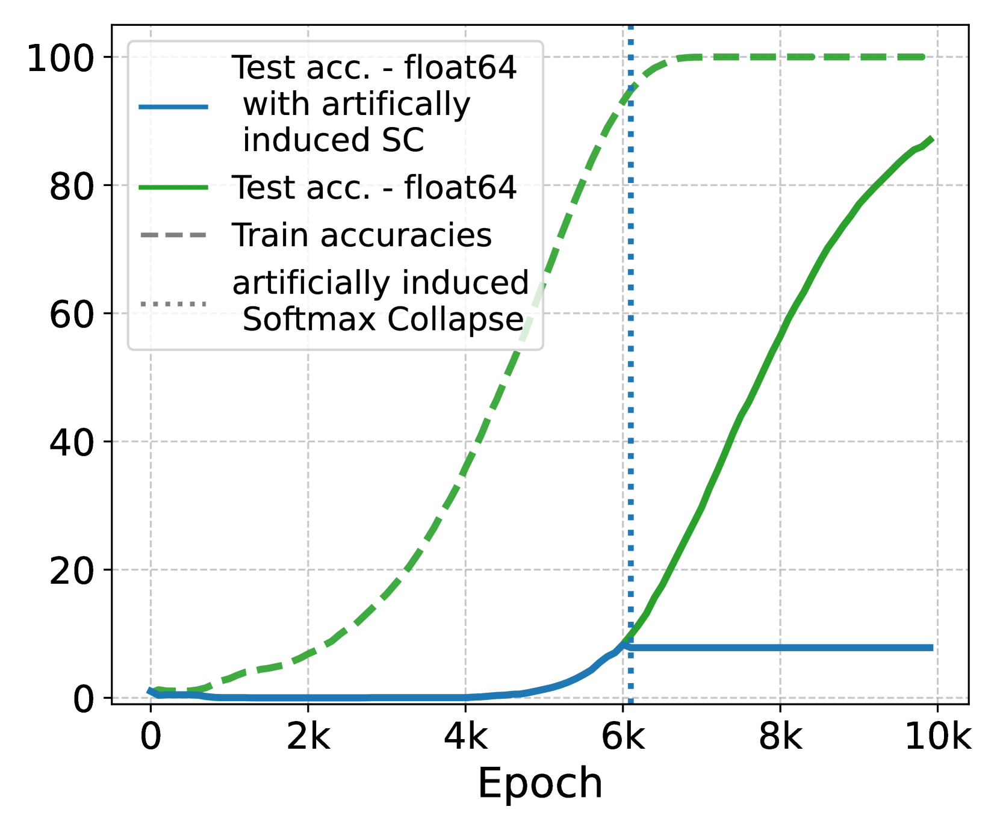

# Softmax Collapse

[Double descent](double-descent.md) ← previous card, next → [Ungrokking](ungrokking.md)

[Concept card index](index.md), category: [1. Phenomena](index.md#cat-1)\
→ Next category: [Structured representation learning](structured-representation-learning.md)\
← Previous category: [Effective theory and statistical mechanics](effective-theory-statistical-mechanics.md)

## Definition

**Softmax Collapse (SC)** is a numerical instability in which training without regularisation pushes the model to the "edge of numerical stability", and floating-point errors appear in the softmax; SC **halts training** and therefore prevents [grokking](grokking.md) \[[1.1](#ref-1-1)\]. The notion was introduced by Prieto et al. (2025).

## Elaboration

The mechanism of SC lies in **[naive loss minimisation](nlm.md)** (NLM). Past the point of overfitting, once the training examples are already classified correctly, the gradient aligns almost entirely with a direction that **does not change the predictions** but lowers the cross-entropy loss simply by **scaling the logits** (the network's pre-softmax outputs) up — usually through growth of the weight norms along the current direction \[[1.1](#ref-1-1)\]. Unbounded logit growth inflates the gap between the largest logit and the rest; once it exceeds a threshold set by the precision of the floating-point arithmetic, the softmax saturates, and the computation yields zero or distorted gradients — training stalls right after the [memorisation phase](memorization-phase.md). It is exactly this protracted scaling of the logits that, on Prieto et al.'s account, **explains the delay in generalisation** characteristic of grokking: until SC is mitigated, generalisation does not come \[[1.1](#ref-1-1)\].

SC ties the account of grokking to **numerical stability**: removing the collapse yields generalisation without regularisation. Prieto et al. propose two remedies — **[StableMax](numerical-stability-fix.md)** (a replacement for the softmax that does not saturate at large logits) and **[⊥Grad](orthogonal-gradient-perp-grad.md)** (training from which the NLM component of the gradient has been removed) \[[1.1](#ref-1-1)\]. The works that joined the discussion refine different sides of SC. Some take logit growth as the first cause and design a **norm-bounded output layer** (a bounded unembedding) that rules the collapse out in advance \[[3.1](#ref-3-1)\]. Others uncover the numerical mechanism itself: SC sets in when the gap between the largest logit and the rest exceeds the floating-point threshold, and an **absorption error** (a small addend lost when added to a much larger one) makes the computed softmax differ from the exact one \[[3.2](#ref-3-2)\].

It was separately checked whether SC is removed by simply **raising the precision** of the arithmetic. Casting the softmax and the loss to `float64` (double) **postpones** the collapse: under float64, SC comes later than under float32, and the model has time to gain further test accuracy \[[1.1](#ref-1-1)\]; casting the logits and the loss alone to float64 even **eliminates** the spikes on MLP/CNN/ViT, which confirms the numerical rather than optimisational nature of the phenomenon \[[3.2](#ref-3-2)\]. But this cures the **symptom, not the cause**: the absorption-error threshold for double is many times higher, whereas the growth of the logits (NLM) continues — in long training of a language model, raising the precision did not stop the logit growth (the mean logit even rose from 183 to 498) \[[3.2](#ref-3-2)\]. The "real" remedies therefore remain StableMax/⊥Grad and a bounded output layer, not more bits \[[1.1](#ref-1-1)\].

## Alternative definitions and nuances

### A. SC by symptom (a failure of the softmax)

A definition through the observed effect: SC is the floating-point errors in the softmax that halt training past the point of overfitting \[[1.1](#ref-1-1)\]. The source of the difference: the notion is fixed by the **symptom** (a failure in computing the softmax), regardless of what brought it about.

### B. SC by cause (unbounded logit growth)

A definition through the generating mechanism: NLM drives the logits upwards without changing the predictions, and sooner or later this leads to a collapse \[[1.1](#ref-1-1)\]\[[3.1](#ref-3-1)\]. The source of the difference: the notion is tied to the **cause** (the weights drifting into pure logit scaling), not to the moment of failure.

### In support

- **SC as an obstacle that design can circumvent** \[[3.1](#ref-3-1)\]: unbounded logit growth is taken as the first cause and the norm of the output layer is bounded in advance so that the collapse never comes. The source of the difference: SC is read as a defect of the output geometry, removable by engineering.
- **SC as an effect of finite precision** \[[3.2](#ref-3-2)\]: the collapse is explained by the limits of floating-point arithmetic (an absorption error at a large logit gap). The source of the difference: SC is not an abstract instability but a concrete numerical artefact, dependent on the number of bits.

## References

###### ref-1-1
**\[1.1\]** 2501.04697 — Prieto et al., "Grokking at the Edge of Numerical Stability". [`"grokking tasks push models to the edge of numerical stability, introducing floating point errors in the Softmax that we refer to as Softmax Collapse"`](../papers/2501.04697.grokking-at-the-edge-of-numerical-stability/2501.04697.grokking-at-the-edge-of-numerical-stability.card.md#p1-2).\
Also (the consequence): [`"We show that SC prevents grokking and that mitigating SC leads to grokking without regularization"`](../papers/2501.04697.grokking-at-the-edge-of-numerical-stability/2501.04697.grokking-at-the-edge-of-numerical-stability.card.md#p1-2).\
Also (the mechanism): [`"the gradient becomes aligned with a direction that corresponds to scaling up the logits by a constant"`](../papers/2501.04697.grokking-at-the-edge-of-numerical-stability/2501.04697.grokking-at-the-edge-of-numerical-stability.card.md#p2-1).\
Also (precision): [`"networks trained using $\mathrm{float64}$ in the $\mathrm{Softmax}$ face SC later in training which allows for a further increase in test performance"`](../papers/2501.04697.grokking-at-the-edge-of-numerical-stability/2501.04697.grokking-at-the-edge-of-numerical-stability.card.md#p5-3).

## References of works that joined the discussion

### In support

###### ref-3-1
**\[3.1\]** 2603.05228 — Yıldırım, "The Geometric Inductive Bias of Grokking: Bypassing Phase Transitions via Architectural Topology". Nuance: logit growth is taken as the first cause of SC and motivates a norm-bounded output layer. [`"unconstrained logit growth leads to Softmax Collapse, motivating our bounded unembedding design"`](../papers/2603.05228.the-geometric-inductive-bias-of-grokking-bypassing-phase-transitions-via-architectural-topology/original/2603.05228.the-geometric-inductive-bias-of-grokking-bypassing-phase-transitions-via-architectural-topology.md#p3-4).

###### ref-3-2
**\[3.2\]** 2605.06152 — Liu, Cao, Li, Zhou 2026, "Grokking or Glitching? How Low-Precision Drives Slingshot Loss Spikes". Nuance: SC is uncovered as an effect of finite precision (an absorption error at a large logit gap), and a second consequence of it is found — a violation of the zero-sum condition across classes. [`"when the gap between the largest logit $z_{m}$ and the other logits exceeds a threshold determined by floating-point precision, absorption error causes the computed result to differ from the exact real-number value"`](../papers/2605.06152.grokking-or-glitching-how-low-precision-drives-slingshot-loss-spikes/original/2605.06152.grokking-or-glitching-how-low-precision-drives-slingshot-loss-spikes.md#p1-5).\
Also (the remedy): [`"casting the output logits to float64 solely during the loss computation is sufficient to eliminate the Slingshot effect"`](../papers/2605.06152.grokking-or-glitching-how-low-precision-drives-slingshot-loss-spikes/original/2605.06152.grokking-or-glitching-how-low-precision-drives-slingshot-loss-spikes.md#p3-4).\
Also (the counter-case): [`"higher precision does not reduce logit growth in this setting. After $10^{5}$ steps, the mean logit is $183$ under float32 training, but increases to $498$ when the loss is computed in float64"`](../papers/2605.06152.grokking-or-glitching-how-low-precision-drives-slingshot-loss-spikes/original/2605.06152.grokking-or-glitching-how-low-precision-drives-slingshot-loss-spikes.md#p9-4).

###### ref-3-3
**\[3.3\]** 2602.12039 — Beck, Bar-Sinai & Levi 2026, "The Implicit Bias of Logit Regularization". A declared continuation of Prieto et al.'s observation about logit regularisation — but the mechanism here is different and incompatible, which the paper does not spell out: in Prieto et al. the penalty merely keeps the logits from diverging until finite arithmetic zeroes the gradient, whereas here the arithmetic is exact and the delay is created by the penalty itself; not a word is said about the precision of the baseline's computations. [`"Logit regularization in this context was briefly discussed in Prieto et al. 2025; we identify an analogous delayed generalization region with a shifted threshold"`](../papers/2602.12039.the-implicit-bias-of-logit-regularization/original/2602.12039.the-implicit-bias-of-logit-regularization.md#p12-5)..

###### ref-3-4
**\[3.4\]** 2606.18465 — Truong 2026, "What Does the Weight Norm Control in Grokking? Logit-Scale Mediation under Cross-Entropy". The SC channel is placed as the mediator of the norm-induced delay: a temperature test isolates its upstream end (the effective logit scale) with the norm physically clamped, while a float64 audit reaches the same point without any intervention — at $\rho=1.15$ the law is robust to precision (the collapse frequency is zero at both precisions), whereas at $\rho=1.25$ a float32 collapse with frequency $0.31$ hastens a spurious transition that does not occur in float64 by 60k steps. Nuance: the sign of the effect is the reverse of the original account — here saturation of the softmax lengthens the delay in a dose-dependent way, and the collapse is only its abrupt extreme. [`"softmax collapse is the extreme of the same logit-saturation channel that the temperature test isolates, reached by precision without any intervention"`](../papers/2606.18465.what-does-the-weight-norm-control-in-grokking-logit-scale-mediation-under-cross-entropy/2606.18465.what-does-the-weight-norm-control-in-grokking-logit-scale-mediation-under-cross-entropy.card.md#p9-1).\
Also (the upstream end of the channel): [`"Our temperature test isolates the upstream of that channel, the logit scale, and shows it mediates most of the norm-induced delay under cross-entropy"`](../papers/2606.18465.what-does-the-weight-norm-control-in-grokking-logit-scale-mediation-under-cross-entropy/2606.18465.what-does-the-weight-norm-control-in-grokking-logit-scale-mediation-under-cross-entropy.card.md#p9-3).

###### ref-3-5
**\[3.5\]** 2606.32000 — Tiwari, Chauhan & Singh 2026, "Radial Suppression Accelerates Algorithmic Generalization: A Geometric Analysis of Delayed Generalization". The saturation mechanism is taken as the source of "radial inflation" of the activations, and Prieto's intervention is carried over from parameter space into activation space: instead of the gradient projection $\perp\mathrm{Grad}$, a soft penalty on the norm of the hidden representation, built into the loss. Nuance: the radius $\Vert h(t)\Vert_{2}$ itself — the central quantity of the mechanism — is nowhere shown in the paper; the inflation is judged from the share of radial energy of the gradient $\tilde{\Phi}_{\mathrm{rad}}$ and from indirect consequences. [`"standard cross-entropy incentivizes outward growth of hidden activations to push logits into the saturating regime of softmax"`](../papers/2606.32000.radial-suppression-accelerates-algorithmic-generalization-a-geometric-analysis-of-delayed-generalization/2606.32000.radial-suppression-accelerates-algorithmic-generalization-a-geometric-analysis-of-delayed-generalization.card.md#p1-6).\
Also (what exactly was carried over): [`"their $\perp$Grad projects gradients away from magnitude-scaling directions in *parameter* space"`](../papers/2606.32000.radial-suppression-accelerates-algorithmic-generalization-a-geometric-analysis-of-delayed-generalization/2606.32000.radial-suppression-accelerates-algorithmic-generalization-a-geometric-analysis-of-delayed-generalization.card.md#p2-6).
## Passing mentions

Works that only mention the phenomenon — a literature review, a related-work paragraph, a passing citation — without examining it.

**\[4.1\]** 2506.05718 — Notsawo et al., "Grokking Beyond the Euclidean Norm of Model Parameters". [`"Prieto et al. (2025) explain grokking as a result of Softmax Collapse—numerical instability from floating-point errors that halts learning after memorization"`](../papers/2506.05718.grokking-beyond-the-euclidean-norm-of-model-parameters/original/2506.05718.grokking-beyond-the-euclidean-norm-of-model-parameters.md#p16-2).

**\[4.2\]** 2601.19791 — Xu et al., "To Grok Grokking: Provable Grokking in Ridge Regression". [`"the dependence of grokking on regularization by showing that Softmax Collapse (i.e. floating point errors due to numerical instability) is responsible for the absence of grokking without regularization"`](../papers/2601.19791.to-grok-grokking-provable-grokking-in-ridge-regression/original/2601.19791.to-grok-grokking-provable-grokking-in-ridge-regression.md#p3-2).

**\[4.3\]** 2603.15492 — Acharya et al., "Grokking as a Variance-Limited Phase Transition: Spectral Gating and the Epsilon-Stability Threshold". [`"Prieto et al. [21] suggest that numerical instability (like Softmax Collapse) prevents learning"`](../papers/2603.15492.grokking-as-a-variance-limited-phase-transition-spectral-gating-and-the-epsilon-stability-threshold/original/2603.15492.grokking-as-a-variance-limited-phase-transition-spectral-gating-and-the-epsilon-stability-threshold.md#p10-4).

**\[4.4\]** 2504.16041 — Tveit, Remseth, Skogvold, "Muon Optimizer Accelerates Grokking". Nuance: the link between Muon and escaping softmax collapse is asserted in a line of the hypothesis table in the introduction and is never checked after the experiment — neither logits, nor signs of absorption in floating-point addition, nor a comparison of ordinary softmax with stablemax under Muon is measured in the work. [`"Keeps training stable and avoids “softmax collapse”"`](../papers/2504.16041.muon-optimizer-accelerates-grokking/original/2504.16041.muon-optimizer-accelerates-grokking.md#fig-1).

**\[4.5\]** 2605.08237 — Wang, Ying, Kanamori 2026, "Distributional Spectral Diagnostics for Localizing Grokking Transitions". Nuance: logits appear in the work as an alternative observable (3 out of 4 alarms, none before onset), but no connection with softmax collapse is drawn. [`"stability-based accounts link it to logit scaling and softmax collapse [42, 32]"`](../papers/2605.08237.distributional-spectral-diagnostics-for-localizing-grokking-transitions/2605.08237.distributional-spectral-diagnostics-for-localizing-grokking-transitions.card.md#p30-7).
