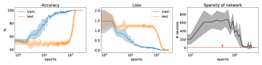

# Sparse parity

[Vision and real-world data (MNIST, CIFAR, …)](vision-real-world-data-mnist-cifar.md) ← previous card, next → [Label noise and random labels](label-noise-random-labels.md)

[Concept card index](index.md), category: [3. Tasks and datasets](index.md#cat-3)\
→ Next category: [Weight decay (L2 regularisation)](weight-decay.md)\
← Previous category: [Structured representation learning](structured-representation-learning.md)

## Definition

**Sparse parity** is a synthetic binary classification task that has become one of the canonical test beds for studying [grokking](grokking.md): the input is a string of n random bits, and the label equals the *parity* (the product modulo 2, that is, the XOR) of k "hidden" bits from a fixed secret subset S of size |S| = k, with k much smaller than n \[[1.1](#ref-1-1)\]\[[1.2](#ref-1-2)\]. Formally, (n, k)-parity maps a string to the parity of k relevant coordinates; the task is called *sparse* precisely because the number of significant bits k is far smaller than the input dimension n \[[1.2](#ref-1-2)\]. The task was brought into the context of grokking as a model of "hidden progress" ([Barak et al., 2022](../papers/2207.08799.hidden-progress-in-deep-learning-sgd-learns-parities-near-the-computational-limit/2207.08799.hidden-progress-in-deep-learning-sgd-learns-parities-near-the-computational-limit.card.md)), and its systematic analysis in grokking terms is due to Merrill et al. \[[1.1](#ref-1-1)\].

## Elaboration

Sparse parity is attractive as a grokking test bed for two reasons. First, it is computationally hard: (n, k)-parity is notorious for its statistical-query hardness (an SQ lower bound on the number of queries, neurons or steps, exponential in k), so the generalising solution stays hidden behind a plateau for a long time and the passage to it looks abrupt. Second, the task has an exact "right" subnetwork (the product of k bits), which makes mechanistic analysis convenient. Merrill et al. showed that on this task the [memorisation phase](memorization-phase.md) corresponds to a dense network, and the generalisation jump that follows is a [phase transition](phase-transition.md) in which control over the predictions is seized by a [sparse subnetwork](sparse-subnetwork-lottery-ticket.md) that has emerged \[[1.1](#ref-1-1)\]. Competing readings have formed around this driver: a frequency mismatch between the training and the test spectrum (the F-principle — the tendency of networks to learn frequencies from low to high) \[[3.1](#ref-3-1)\]; the discovery of a "good subnetwork" in the spirit of the lottery ticket hypothesis (a sparse subgraph trainable to the same accuracy) \[[3.2](#ref-3-2)\]; numerical stability and [softmax collapse](softmax-collapse.md) as the condition of late generalisation \[[3.3](#ref-3-3)\]. That the transition on sparse parity is real is indirectly confirmed by methods of accelerating it — transferring embeddings from a weaker model \[[3.4](#ref-3-4)\] and "egalitarian" gradient descent, which removes the plateau \[[3.5](#ref-3-5)\]. The nonlinear complexity measure LMN ([nonlinear complexity](nlm.md)) separately records how an XOR network (the special case of 2-parity) switches between two generalising solutions. Meanwhile the very standing of sparse parity as a "grokking" task is contested: training an MLP on plentiful data makes generalisation arrive simultaneously with memorisation, with no delay and no norm separation \[[2.1](#ref-2-1)\].

## Alternative definitions and nuances

### A. (n, k)-parity as a supervised task

The basic formulation: an example's label is the XOR (parity) of the k bits falling into a fixed secret subset S ⊂ {1, …, n}, while the remaining n − k bits are irrelevant and play the part of noise features \[[1.1](#ref-1-1)\]. The key control parameter is the sparsity k/n: with k much smaller than n the number of possible secret subsets is enormous, and any individual bit is statistically uncorrelated with the label, so greedy feature heuristics do not work and the model is forced to learn the exact product of k coordinates \[[1.2](#ref-1-2)\].

### B. The canonical benchmark of "hidden progress" and SQ hardness

The alternative reading looks at the task not as a particular function but as a *hardness class*: (n, k)-parity is the standard example of an SQ-hard problem, used to demonstrate the computational obstacles to learning. It is exactly this hardness that makes it a convenient model of grokking: there is no visible progress on the test set for a long time ("hidden progress") while the internal structure gradually forms, and then generalisation appears in a jump. On this reading sparse parity is interesting not in itself but as a controlled source of an abrupt delayed transition \[[3.1](#ref-3-1)\]\[[3.5](#ref-3-5)\].

### Contested

Truong et al. show that the "grokkability" of sparse parity is not universal and depends on the setting: for 3-sparse parity on an MLP with plentiful data their [delay law](norm-separation-delay-law.md) predicts the *absence* of grokking, and this is confirmed empirically — 0 out of 15 runs show a delay, and generalisation arrives at the same time as memorisation \[[2.1](#ref-2-1)\]. The control quantity here is the ratio of norms between the "memorising" and the "generalising" solutions (Vfinal against Vmem): on sparse parity it is *inverted* (Vfinal > Vmem), that is, there is no norm separation and therefore no lookup-table phase to be displaced; the MLP's [implicit bias](margin-maximization-implicit-bias.md) finds the parity function directly, without a delay \[[2.1](#ref-2-1)\].

### In support

The works that join treat sparse parity as a genuinely grokking task and disagree about naming the driver. Zhou et al. explain the transition by a frequency mismatch: the network first picks up spurious low-frequency components arising from undersampling and only later aligns with the true spectrum of parity \[[3.1](#ref-3-1)\]. Minegishi et al. tie the removal of the delay to the discovery of a good subnetwork (a grokked lottery ticket) rather than to a lowering of the norm or to sparsity as such \[[3.2](#ref-3-2)\]. Prieto et al. carry over to sparse parity their account through numerical stability and softmax collapse \[[3.3](#ref-3-3)\]. Xu et al. and Saheb Pasand et al. confirm the reality of the transition indirectly — by deliberately removing the grokking plateau (with embedding transfer and "egalitarian" gradient descent respectively) \[[3.4](#ref-3-4)\]\[[3.5](#ref-3-5)\].

## References

###### ref-1-1
**\[1.1\]** 2303.11873 — Merrill et al., "A Tale of Two Circuits: Grokking as Competition of Sparse and Dense Subnetworks". [`"of networks undergoing grokking on the sparse parity task, and find that the"`](../papers/2303.11873.a-tale-of-two-circuits-grokking-as-competition-of-sparse-and-dense-subnetworks/original/2303.11873.a-tale-of-two-circuits-grokking-as-competition-of-sparse-and-dense-subnetworks.md#p1-2).\
Also: [`"We focus on analyzing grokking in the problem of learning a sparse $(n,k)$-parity function"`](../papers/2303.11873.a-tale-of-two-circuits-grokking-as-competition-of-sparse-and-dense-subnetworks/original/2303.11873.a-tale-of-two-circuits-grokking-as-competition-of-sparse-and-dense-subnetworks.md#p2-2); [`"our sparse parity task indeed displays grokking, both in accuracy and loss."`](../papers/2303.11873.a-tale-of-two-circuits-grokking-as-competition-of-sparse-and-dense-subnetworks/original/2303.11873.a-tale-of-two-circuits-grokking-as-competition-of-sparse-and-dense-subnetworks.md#p3-2).

###### ref-1-2
**\[1.2\]** 2301.02679 — Gromov, "Grokking modular arithmetic". [`"the authors of [1] studied online learning of the (k, n) sparse parity problem where the network function is asked to compute parity of k bits in a length-n string of random bits"`](../papers/2301.02679.grokking-modular-arithmetic/2301.02679.grokking-modular-arithmetic.card.md#p2-3).

###### ref-1-3
**\[1.3\]** 2207.08799 — Barak et al., "Hidden Progress in Deep Learning: SGD Learns Parities Near the Computational Limit". Nuance: brings the task into the corpus as a test bed with a proved computational limit (an SQ lower bound), not with an empirical threshold. [`"a learner who guesses indices $S^{\prime}$ cannot use correlations (equivalently, the accuracy of the hypothesis $\chi_{S^{\prime}}$) as feedback to reveal which indices in $S^{\prime}$ are correct, unless $S^{\prime}$ is *exactly* the correct subset"`](../papers/2207.08799.hidden-progress-in-deep-learning-sgd-learns-parities-near-the-computational-limit/2207.08799.hidden-progress-in-deep-learning-sgd-learns-parities-near-the-computational-limit.card.md#p4-4).\
Also: [`"SGD solved the parity problem (with $100\%$ accuracy, validated on a batch of $2^{13}$ samples) in at least $20\%$ of $25$ random trials"`](../papers/2207.08799.hidden-progress-in-deep-learning-sgd-learns-parities-near-the-computational-limit/2207.08799.hidden-progress-in-deep-learning-sgd-learns-parities-near-the-computational-limit.card.md#p6-1).

###### ref-1-4
**\[1.4\]** 2311.07568 — Morwani et al. 2024, "Feature emergence via margin maximization: case studies in algebraic tasks". Gives a closed form for the maximal margin of $(n,k)$-parity with activation $x^{k}$: $\gamma^{*}=k!\sqrt{2(k+1)^{-(k+1)}}$ for $m\geq 2^{k-1}$ — and shows that in any solution attaining this margin the support of every non-zero $u_{i}$ is exactly the relevant set $S$, all $|u_{i}[j]|$ equal $\|w_{i}\|$, and the output vector lies along $[1,-1]$. Nuance: the case is simpler than the other two precisely because the task is binary ($g^{\prime}=g$, so condition C.1 holds for free); the work says nothing about the computational hardness of parity or about the number of steps to a solution. [`"Consider a single hidden layer neural network of width $m$ with the activation function given by $x^{k}$, i.e, $f(x)=\sum_{i=1}^{m}(u_{i}^{\top}x)^{k}w_{i}$, where $u_{i}\in\mathbb{R}^{n}$ and $w_{i}\in\mathbb{R}^{2}$, trained on the $(n,k)-$sparse parity task."`](../papers/2311.07568.feature-emergence-via-margin-maximization-case-studies-in-algebraic-tasks/2311.07568.feature-emergence-via-margin-maximization-case-studies-in-algebraic-tasks.card.md#p11-2).\
Also (the experimental setting): [`"Final neurons with highest norm and the evolution of normalized $L_{2,5}$ margin over training of a 1-hidden layer quartic network (activation $x^{4}$) on $(10,4)$ sparse parity dataset with $L_{2,5}$ regularization."`](../papers/2311.07568.feature-emergence-via-margin-maximization-case-studies-in-algebraic-tasks/2311.07568.feature-emergence-via-margin-maximization-case-studies-in-algebraic-tasks.card.md#fig-5).

###### ref-1-5
**\[1.5\]** 2211.12316 — Bhattamishra et al., "Simplicity Bias in Transformers and their Ability to Learn Sparse Boolean Functions". Nuance: sparse parity acts as a discriminating task — on full parity the LSTM generalises, on the sparse one the transformer does — and the transformer holds near-perfect generalisation with 5–20% of labels flipped. [`"on $\text{Parity}\text{-}(40,4)$, we find that while Transformers generalize well, LSTMs severely overfit and achieve poor validation accuracy"`](../papers/2211.12316.simplicity-bias-in-transformers-and-their-ability-to-learn-sparse-boolean-functions/2211.12316.simplicity-bias-in-transformers-and-their-ability-to-learn-sparse-boolean-functions.card.md#p7-6).\
Also: [`"Learning $\text{Parity}\text{-}(n,k)$ with gradient-based methods has well-known hardness results $-$ requiring at least $n^{\Omega(k)}$ computational steps to find the correct target function (Kearns 1998)"`](../papers/2211.12316.simplicity-bias-in-transformers-and-their-ability-to-learn-sparse-boolean-functions/2211.12316.simplicity-bias-in-transformers-and-their-ability-to-learn-sparse-boolean-functions.card.md#p7-1).
## References of works that joined the discussion

### Contested

###### ref-2-1
**\[2.1\]** 2603.13331 — Truong et al., "The Norm-Separation Delay Law of Grokking". Contests: on sparse parity there is no grokking — generalisation arrives at the same time as memorisation. [`"The theory also correctly predicts when grokking does not occur : sparse parity tasks"`](../papers/2603.13331.the-norm-separation-delay-law-of-grokking-a-first-principles-theory-of-delayed-generalization/2603.13331.the-norm-separation-delay-law-of-grokking-a-first-principles-theory-of-delayed-generalization.card.md#p2-10).\
Also: [`"sparse parity tasks exhibit an inverted norm ratio ($V_{\mathrm{final}}>V_{\mathrm{mem}}$) and zero grokking delay in 15/15 runs"`](../papers/2603.13331.the-norm-separation-delay-law-of-grokking-a-first-principles-theory-of-delayed-generalization/2603.13331.the-norm-separation-delay-law-of-grokking-a-first-principles-theory-of-delayed-generalization.card.md#p2-10).

###### ref-2-2
**\[2.2\]** 2606.13753 — Truong et al. 2026, "The Weight Norm Sets the Grokking Timescale: A Causal Delay Law". Uses sparse parity as a test of whether the critical norm is a trace of Fourier structure, and gets a transfer exactly by halves. What does transfer is the concentrated, weight-decay-set grokking norm, independent of the learning rate (a fourfold range of learning rate changes the norm by about $3\%$ while the time changes about fourfold). What does not transfer is the main thing: the grokking norm here depends on the amount of data, and the clamp lies on the weight-decay frontier in both directions, so there is no high-norm state unreachable by regularisation. Nuance: the authors themselves separate the two claims by scope — only the concentrated norm is declared general; the explanation of the discrepancy through the number of generalising solutions is offered as a conjecture. [`"What does *not* transfer is the regularization-unreachable above-norm delay. The grokking norm here drifts with the amount of training data (it is not data-invariant)"`](../papers/2606.13753.the-weight-norm-sets-the-grokking-timescale-a-causal-delay-law/2606.13753.the-weight-norm-sets-the-grokking-timescale-a-causal-delay-law.card.md#p11-2).\
Also (what is declared general): [`"The *concentrated, regularization-set grokking norm* is task-general (modular arithmetic and sparse parity; MLP and, on the functional norm, the Transformer)."`](../papers/2606.13753.the-weight-norm-sets-the-grokking-timescale-a-causal-delay-law/2606.13753.the-weight-norm-sets-the-grokking-timescale-a-causal-delay-law.card.md#p11-3).
### In support

###### ref-3-1
**\[3.1\]** 2405.17479 — Zhou et al., "A rationale from frequency perspective for grokking in training neural network". Nuance: grokking on parity is explained by a frequency mismatch (the F-principle). [`"we consider one-dimensional synthetic data and high-dimensional parity"`](../papers/2405.17479.a-rationale-from-frequency-perspective-for-grokking-in-training-neural-network/2405.17479.a-rationale-from-frequency-perspective-for-grokking-in-training-neural-network.card.md#p1-6).

###### ref-3-2
**\[3.2\]** 2310.19470 — Minegishi et al., "Bridging Lottery Ticket and Grokking". Nuance: delayed generalisation on sparse parity is removed by a "grokked ticket" (a good subnetwork) rather than by a lowering of the norm. [`"we also demonstrate that delayed generalization is reduced by the grokked ticket in both the polynomial regression and sparse parity tasks"`](../papers/2310.19470.bridging-lottery-ticket-and-grokking-understanding-grokking-from-inner-structure-of-networks/original/2310.19470.bridging-lottery-ticket-and-grokking-understanding-grokking-from-inner-structure-of-networks.md#p5-3).

###### ref-3-3
**\[3.3\]** 2501.04697 — Prieto et al., "Grokking at the Edge of Numerical Stability". Nuance: the account through numerical stability and softmax collapse is confirmed on sparse parity. [`"We also validate some of our results on the Sparse Parity task outlined in Barak et al. (2022)"`](../papers/2501.04697.grokking-at-the-edge-of-numerical-stability/2501.04697.grokking-at-the-edge-of-numerical-stability.card.md#p3-3).

###### ref-3-4
**\[3.4\]** 2504.13292 — Xu et al., "Let Me Grok For You: Accelerating Grokking via Embedding Transfer from a Weaker Model". Nuance: embedding transfer (GrokTransfer) eliminates delayed generalisation on sparse parity. [`"the sparse parity task. Our experiments verify that GrokTransfer effectively reshapes the training dynamics and eliminate delayed generalization"`](../papers/2504.13292.let-me-grok-for-you-accelerating-grokking-via-embedding-transfer-from-a-weaker-model/original/2504.13292.let-me-grok-for-you-accelerating-grokking-via-embedding-transfer-from-a-weaker-model.md#p8-5).

###### ref-3-5
**\[3.5\]** 2510.04930 — Saheb Pasand et al., "Egalitarian Gradient Descent: A Simple Approach to Accelerated Grokking". Nuance: "egalitarian" gradient descent (EGD) removes the grokking plateau on sparse parity. [`"we empirically show that on classical arithmetic problems like modular addition and sparse parity"`](../papers/2510.04930.egalitarian-gradient-descent-a-simple-approach-to-accelerated-grokking/original/2510.04930.egalitarian-gradient-descent-a-simple-approach-to-accelerated-grokking.md#p1-2).\
Also: [`"works have shown that this problem induces grokking in (stochastic) gradient descent"`](../papers/2510.04930.egalitarian-gradient-descent-a-simple-approach-to-accelerated-grokking/original/2510.04930.egalitarian-gradient-descent-a-simple-approach-to-accelerated-grokking.md#p9-5).

###### ref-3-6
**\[3.6\]** 2309.03800 — Edelman, Goel, Kakade, Malach & Zhang 2023, "Pareto Frontiers in Neural Feature Learning: Data, Compute, Width, and Luck". Unfolds offline $(n,k)$-parity into a multi-resource frontier: the SQ bound ties together data, width, time and the probability of success, and grokking lives on the edge of that frontier. [`"The $(n,k)$-parity learning problem is to identify $S$ from samples $(x\sim\mathrm{Unif}(\{\pm 1\}^{n},y=\chi_{S}(x)))$"`](../papers/2309.03800.pareto-frontiers-in-neural-feature-learning-data-compute-width-and-luck/2309.03800.pareto-frontiers-in-neural-feature-learning-data-compute-width-and-luck.card.md#p4-1).\
Also (the strict sense of the hardness): [`"it is a *maximally hard* toy problem in a rigorous sense"`](../papers/2309.03800.pareto-frontiers-in-neural-feature-learning-data-compute-width-and-luck/2309.03800.pareto-frontiers-in-neural-feature-learning-data-compute-width-and-luck.card.md#p10-1).

###### ref-3-7
**\[3.7\]** 2601.22450 — Huang, Mirzasoleiman 2026, "Tuning the Implicit Regularizer of Masked Diffusion Language Models: Enhancing Generalization via Insights from $k$-Parity". The $(20,6)$-parity test bed in a new role — a comparison of training objectives: the label is glued on as the last symbol of the sequence, and the same task is solved either by supervision on the label (nanoGPT groks) or by reconstructing stochastically masked symbols (no grokking, the curves converge together); the signal share $P_{S}=(k+1)\mathbb{E}[t(1-t)^{k}]$ is governed by the masking distribution, and the fastest convergence comes from ranges near the theoretical optimum $\mathcal{U}[0,0.246]$. Nuance: against the line of Barak et al. there are no hidden-progress measures here at all — from two accuracy curves one cannot tell whether the plateau was removed or merely shortened; and the paper's own signal optimum from corollary 4.8 ($t=1/7$ pointwise) is never tested. [`"We conduct experiments on the $(n,k)=(20,6)$ parity task using a standard Transformer architecture and cross-entropy loss to validate our theoretical framework."`](../papers/2601.22450.tuning-the-implicit-regularizer-of-masked-diffusion-language-models-enhancing-generalization-via-insights-from-k-parity/original/2601.22450.tuning-the-implicit-regularizer-of-masked-diffusion-language-models-enhancing-generalization-via-insights-from-k-parity.md#p6-5).

###### ref-3-8
**\[3.8\]** 2407.----- — Sanguino Bautiste, Bachmann, He, Noci, Hofmann 2024, "Feature Learning Dynamics under Grokking in a Sparse Parity Task" (the HiLD workshop at ICML 2024; the work is not on arXiv). Sparse parity is taken as a bench for a spectral analysis: the clean bits enter the target, the noisy ones do not, and the question asked is when the kernel's eigenfunctions begin to lean on the former. [`"In this paper, we analyze the phenomenon of Grokking in a sparse parity task trained with Deep Neural Networks through the lens of feature learning"`](../papers/2407.-----.feature-learning-dynamics-under-grokking-in-a-sparse-parity-task/original/2407.-----.feature-learning-dynamics-under-grokking-in-a-sparse-parity-task.md#p1-3).
## Passing mentions

Works that only mention the phenomenon — a literature review, a related-work paragraph, a passing citation — without examining it.

**\[4.1\]** 2310.05918 — Liu et al., "Grokking as Compression: A Nonlinear Complexity Perspective". [`"intriguing phenomenon of the XOR network switching between two generalization solutions, while $L_{2}$ does not"`](../papers/2310.05918.grokking-as-compression-a-nonlinear-complexity-perspective/original/2310.05918.grokking-as-compression-a-nonlinear-complexity-perspective.md#p1-2).

**\[4.2\]** 2402.09469 — Li, Liang, Shi, Song, Zhou 2024, "Fourier Circuits in Neural Networks and Transformers: A Case Study of Modular Arithmetic with Multiple Inputs". Nuance: at $p=2$ the task degenerates into parity, and the estimate of the number of neurons agrees with the known lower bound. [`"$(n,k)$-sparse parity problem is notorious hard to learn, i.e., Statistical Query (SQ) hardness"`](../papers/2402.09469.fourier-circuits-in-neural-networks-and-transformers-a-case-study-of-modular-arithmetic-with-multiple-inputs/original/2402.09469.fourier-circuits-in-neural-networks-and-transformers-a-case-study-of-modular-arithmetic-with-multiple-inputs.md#p14-2).

**\[4.3\]** 2407.12332 — Mohamadi et al., "A Theoretical Analysis of Grokking Modular Addition". [`"grokking can happen in tasks beyond modular arithmetic: in learning sparse parities (Barak et al., 2022; Bhattamishra et al., 2023)"`](../papers/2407.12332.why-do-you-grok-a-theoretical-analysis-of-grokking-modular-addition/original/2407.12332.why-do-you-grok-a-theoretical-analysis-of-grokking-modular-addition.md#p1-3).

**\[4.4\]** 2410.03569 — Saxena et al. 2024, "Making Hard Problems Easier with Custom Data Distributions and Loss Regularization: A Case Study in Modular Arithmetic". [`"Our techniques also help ML models learn other well-studied problems better, including copy, associative recall, and parity"`](../papers/2410.03569.making-hard-problems-easier-with-custom-data-distributions-and-loss-regularization/original/2410.03569.making-hard-problems-easier-with-custom-data-distributions-and-loss-regularization.md#p1-3).

**\[4.5\]** 2604.00316 — Tomàs, Mallinar, Belkin, "Breaking Data Symmetry is Needed For Generalization in Feature Learning Kernels". Nuance: a partition invariant under a subgroup of symmetries locks the model in and prevents it from generalising. [`"RFM fails to generalize only when using train-test partitions that are invariant under the action of a non-singleton subgroup"`](../papers/2604.00316.breaking-data-symmetry-is-needed-for-generalization-in-feature-learning-kernels/original/2604.00316.breaking-data-symmetry-is-needed-for-generalization-in-feature-learning-kernels.md#p4-2)

**\[4.6\]** 2310.02541 — Xu et al. 2023. Nuance: sparse parity is named as a variant of the same family, but there are no experiments on parities of their own; XOR here is a mixture of four Gaussians in $\mathbb{R}^{p}$, not a Boolean function on the hypercube. [`"or its variants like the sparse parity problem"`](../papers/2310.02541.benign-overfitting-and-grokking-in-relu-networks-for-xor-cluster-data/original/2310.02541.benign-overfitting-and-grokking-in-relu-networks-for-xor-cluster-data.md#p3-3).

**\[4.7\]** 2504.16041 — Tveit, Remseth, Skogvold, "Muon Optimizer Accelerates Grokking". Nuance: the parity here is **full** — all ten bits of a ten-bit string — rather than the corpus's $k$-sparse parity; there is no secret subset, no parameters $(n,k)$ and no computational hardness in the setting, and the work cannot be assigned to the sparse-parity test bed. [`"The parity task involves predicting the parity bit for 10-bit binary strings, with 1024 possible combinations."`](../papers/2504.16041.muon-optimizer-accelerates-grokking/original/2504.16041.muon-optimizer-accelerates-grokking.md#p2-4).

**\[4.8\]** 2606.12966 — Sivasankar, "Circuit Synchronization Precedes Generalization: A Causal Precursor to Grokking". Of the "hidden progress" of Barak et al. 2022 it says: [`"an observation directly analogous to our FSD precursor"`](../papers/2606.12966.circuit-synchronization-precedes-generalization-a-causal-precursor-to-grokking/2606.12966.circuit-synchronization-precedes-generalization-a-causal-precursor-to-grokking.card.md#p16-2).
