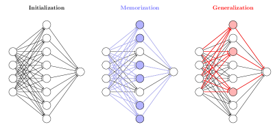

# Sparse subnetwork / lottery ticket

[Circuit efficiency](circuit-efficiency.md) ← previous card, next → [Manifold / representation compression](manifold-representation-compression.md)

[Concept card index](index.md), category: [2. Mechanisms and representations](index.md#cat-2)\
→ Next category: [Modular arithmetic](modular-arithmetic.md)\
← Previous category: [Grokking](grokking.md)

## Definition

**The sparse subnetwork / lottery ticket** is a reading of [grokking](grokking.md) in which delayed generalisation is tied to the emergence, inside a dense network, of a small **sparse subnetwork** (a set of neurons or weights far smaller than the whole network) that implements the generalising algorithm and displaces the dense memorising one. Merrill et al. (2023) introduced the "two circuits" frame: the grokking [phase transition](phase-transition.md) corresponds to the emergence of a sparse subnetwork that dominates the model's predictions \[[1.1](#ref-1-1)\]. Minegishi et al. (2023) tied the same phenomenon to the **lottery ticket hypothesis** (Frankle & Carbin 2019 — the hypothesis that a randomly initialised dense network already contains a sparse subnetwork, a "winning ticket", that can be trained to full performance) and introduced the notion of "grokked tickets" — lottery tickets extracted from a network that has already generalised \[[1.2](#ref-1-2)\].

## Elaboration

Both founding works isolate the subnetwork by **pruning** (cutting weights: removing the smallest-magnitude connections and checking whether what remains preserves the full network's performance). Merrill et al. measure the "effective sparsity" — the size of the smallest active subnetwork that reproduces the network's behaviour — and show that under grokking the dominance passes from the dense subnetwork (a circuit, that is, a subnetwork implementing some sub-algorithm) to the sparse one; mechanically the transition is driven by **fast norm growth** (of the L2 magnitude of the weights) in a small set of neurons while the rest decay \[[1.1](#ref-1-1)\]. Here grokking, from "late generalisation after the [memorisation phase](memorization-phase.md)", is recast as a **change of the dominant solution**, which brings it close to the language of emergence (the abrupt appearance of an ability — [emergence](emergence.md)) for large language models.

The instrument by which the subnetwork is isolated is called in the corpus **magnitude pruning**: the weights of smallest modulus are removed and it is checked whether the remainder preserves the solution.

Within the notion itself there is a disputed nuance — *what exactly* makes a subnetwork the carrier of generalisation. Merrill et al. stress sparsity and norm growth \[[1.1](#ref-1-1)\]. Minegishi et al. contest that emphasis: by substituting a "grokked ticket" for the dense network they remove the generalisation delay and show that the matter is neither a lower norm nor sparsity as such, but the **good structure** of the subnetwork found \[[1.2](#ref-1-2)\]. Bhaskar et al. go further still: instead of *disjoint* competing subnetworks they find a shared "heuristic core" — a set of attention heads present in all the subnetworks, including the non-generalising ones — and thereby contest the literal picture of "two different circuits replacing one another" \[[2.1](#ref-2-1)\]. On the other hand, the sparse-subnetwork frame is supported by a number of works: sparsity (the share of inactive neurons) serves as a metric predicting the onset of grokking \[[3.1](#ref-3-1)\]; in the task of classifying Ising-model configurations, grokking is read as a passage to a group of sparse subnetworks \[[3.2](#ref-3-2)\]; and under grokking on [real-world data](vision-real-world-data-mnist-cifar.md) a large number of neurons become inactive, reducing the network to a smaller effective subnetwork \[[3.3](#ref-3-3)\].

One more form of the same subnetwork is isolated without pruning: the **synergistic subnetwork** — the set of features carrying synergy (an information-theoretic quantity carried by a combination of features but not by any of them separately). Its size grows exactly at the passage from memorisation, and the peak of the test loss falls at the same moment \[[3.9](#ref-3-9)\]. The difference from pruning is essential: there the subnetwork is defined by weights and no data is needed, here by responses on a sample.

## Alternative definitions and nuances

### A. Competition of a dense and a sparse subnetwork (Merrill)

A definition through an **[order parameter](order-parameter.md)** — the norm or the share of active neurons: before the transition the predictions are determined by a dense subnetwork that generalises poorly; at grokking a small set of neurons sharply grows in norm and begins to dominate, forming a sparse generalising subnetwork. The key difference here is the *mechanism*: a targeted growth of norm in a few neurons while the rest decay, with the size of the sparse subnetwork matching the size of the parity computation scheme \[[1.1](#ref-1-1)\].

### B. The winning lottery ticket / grokked ticket (Minegishi)

A definition through a **subnetwork mask**: the generalising solution is a "winning ticket" already present in the dense network, and starting directly from it (masking out the other weights) removes the generalisation delay. The source of the difference from frame A is neither sparsity nor norm but precisely the *structure* of the subnetwork: controlling norm, sparsity and structure separately, the authors show that only the last accelerates generalisation \[[1.2](#ref-1-2)\].

### Contested

Bhaskar et al. contest the premise of *disjoint* competing subnetworks on which frames A and B rest. In their setting (fine-tuning language models), generalising and non-generalising subnetworks share a common "heuristic core" — a set of a few attention heads present in all the subnetworks; they therefore hold the picture "a dense memorising circuit is replaced by a sparse generalising one" to be incomplete, and in their case generalisation is accompanied not by a decrease but by a rise in effective size \[[2.1](#ref-2-1)\].

### In support

The sparse-subnetwork frame is joined by works in which sparsity figures as an observable sign or as a direct mechanism of grokking: Salah et al. use the dynamics of sparsity (the share of inactive neurons) as a metric predicting grokking and describe the transition as a conversion of a dense subnetwork into a sparse one \[[3.1](#ref-3-1)\]; Hutchison et al., on the Ising task, read grokking as a passage from a connected network to a group of sparse subnetworks with the number of active weights decreasing with depth \[[3.2](#ref-3-2)\]; Zhang et al. observe an "implicit architectural selection" under grokking — a mass deactivation of neurons reducing the network to a smaller effective subnetwork \[[3.3](#ref-3-3)\].

## References

###### ref-1-1
**\[1.1\]** 2303.11873 — Merrill et al., "A Tale of Two Circuits: Grokking as Competition of Sparse and Dense Subnetworks". [`"grokking phase transition corresponds to the emergence of a sparse subnetwork that dominates model predictions"`](../papers/2303.11873.a-tale-of-two-circuits-grokking-as-competition-of-sparse-and-dense-subnetworks/original/2303.11873.a-tale-of-two-circuits-grokking-as-competition-of-sparse-and-dense-subnetworks.md#p1-2).\
Also: [`"the grokking phase transition can be understood to emerge from competition of two largely distinct subnetworks: a dense one that dominates before the transition and generalizes poorly, and a sparse one that dominates afterwards"`](../papers/2303.11873.a-tale-of-two-circuits-grokking-as-competition-of-sparse-and-dense-subnetworks/original/2303.11873.a-tale-of-two-circuits-grokking-as-competition-of-sparse-and-dense-subnetworks.md#p1-2).

###### ref-1-2
**\[1.2\]** 2310.19470 — Minegishi et al., "Bridging Lottery Ticket and Grokking: Understanding Grokking from Inner Structure of Networks". [`"utilizing lottery tickets obtained during the generalizing phase (termed grokked tickets) significantly reduces delayed generalization across various tasks"`](../papers/2310.19470.bridging-lottery-ticket-and-grokking-understanding-grokking-from-inner-structure-of-networks/original/2310.19470.bridging-lottery-ticket-and-grokking-understanding-grokking-from-inner-structure-of-networks.md#p1-2).\
Also: [`"mitigation of delayed generalization is not due solely to reduced weight norms or increased sparsity, but rather to the discovery of good subnetworks"`](../papers/2310.19470.bridging-lottery-ticket-and-grokking-understanding-grokking-from-inner-structure-of-networks/original/2310.19470.bridging-lottery-ticket-and-grokking-understanding-grokking-from-inner-structure-of-networks.md#p1-2).

###### ref-1-3
**\[1.3\]** 2408.11804 — Yunis et al., "Approaching Deep Learning through the Spectral Dynamics of Weights". A contribution unrelated to grokking: global magnitude pruning (the top 5% of weights, a mask from the end of training, rewound to epoch 4 of 164) preserves the top singular vectors of the final model, that is, behaves like an approximately low-rank truncation; a random mask of the same per-layer sparsity does not, and after it the network stops learning long before convergence. The authors explicitly mark their account of the failure as an interpretation. [`"magnitude masks preserve the top singular vectors of parameters, and with increasing sparsity fewer directions are preserved"`](../papers/2408.11804.approaching-deep-learning-through-the-spectral-dynamics-of-weights/original/2408.11804.approaching-deep-learning-through-the-spectral-dynamics-of-weights.md#p11-3).\
Also (the authors' "interpretation" marker): [`"We interpret this as evidence that the mask has somehow cut signal flow between layers"`](../papers/2408.11804.approaching-deep-learning-through-the-spectral-dynamics-of-weights/original/2408.11804.approaching-deep-learning-through-the-spectral-dynamics-of-weights.md#p11-5).
## References of works that joined the discussion

### Contested

###### ref-2-1
**\[2.1\]** 2403.03942 — Bhaskar et al., "The Heuristic Core: Understanding Subnetwork Generalization in Pretrained Language Models". Contests: instead of disjoint competing subnetworks, a shared heuristic core. [`"distinct subnetworks that compete during training. We instead find evidence of a heuristic core: a set of attention heads that appear in all generalizing subnetworks"`](../papers/2403.03942.the-heuristic-core-understanding-subnetwork-generalization-in-pretrained-language-models/2403.03942.the-heuristic-core-understanding-subnetwork-generalization-in-pretrained-language-models.card.md#fig-1).\
Also (a characterisation of the contested picture): [`"as the model switches from a dense, memorizing subnetwork to a sparse, generalizing subnetwork"`](../papers/2403.03942.the-heuristic-core-understanding-subnetwork-generalization-in-pretrained-language-models/2403.03942.the-heuristic-core-understanding-subnetwork-generalization-in-pretrained-language-models.card.md#p2-1).

###### ref-2-2
**\[2.2\]** 2602.18523 — Xu, "The Geometry of Multi-Task Grokking: Transverse Instability, Superposition, and Weight Decay Phase Structure". Nuance: magnitude pruning fails completely — half of the largest weight increments carry 99.3% of the squared norm and give chance accuracy. A caveat: no retraining after pruning was performed, whereas the lottery ticket hypothesis is precisely about retraining the subnetwork found; and the reference to the primary source misspells the second author's surname ("Frankle and Carlin"). [`"keeping 50% of the largest entries (99.3% of $\left\|\Delta\theta\right\|^{2}$) gives chance. Partial recovery begins only at 80% retention."`](../papers/2602.18523.the-geometry-of-multi-task-grokking-transverse-instability-superposition-and-weight-decay-phase-structure/original/2602.18523.the-geometry-of-multi-task-grokking-transverse-instability-superposition-and-weight-decay-phase-structure.md#p13-5).\
Also (a prediction for practice): [`"Our results predict that pruning beyond ${\sim}10\%$ of transverse capacity should degrade generalization sharply."`](../papers/2602.18523.the-geometry-of-multi-task-grokking-transverse-instability-superposition-and-weight-decay-phase-structure/original/2602.18523.the-geometry-of-multi-task-grokking-transverse-instability-superposition-and-weight-decay-phase-structure.md#p28-3).

###### ref-2-3
**\[2.3\]** 2506.23286 — Jeffares & van der Schaar, "Not All Explanations for Deep Learning Phenomena Are Equally Valuable". Nuance: there are no experiments with tickets of their own, and figure 3 is a schematic; the link between the lottery ticket and grokking, which the corpus follows as a separate line, is not considered in the work. [`"progress toward a viable technique has been limited and the lottery ticket approach has not materialized as a practical method"`](../papers/2506.23286.not-all-explanations-for-deep-learning-phenomena-are-equally-valuable/original/2506.23286.not-all-explanations-for-deep-learning-phenomena-are-equally-valuable.md#p4-4).
### In support

###### ref-3-1
**\[3.1\]** 2507.11645 — Salah et al., "Tracing the Path to Grokking: Embeddings, Dropout, and Network Activation". Nuance: sparsity as a predictive metric; the passage of a dense subnetwork into a sparse one. [`"a dense, poorly generalizing subnetwork is converted to a sparse"`](../papers/2507.11645.tracing-the-path-to-grokking-embeddings-dropout-and-network-activation/original/2507.11645.tracing-the-path-to-grokking-embeddings-dropout-and-network-activation.md#p2-2).\
Also: [`"the evolution of the sparsity provides a further metric that can be employed to predict grokking"`](../papers/2507.11645.tracing-the-path-to-grokking-embeddings-dropout-and-network-activation/original/2507.11645.tracing-the-path-to-grokking-embeddings-dropout-and-network-activation.md#p13-1).

###### ref-3-2
**\[3.2\]** 2510.25966 — Hutchison et al., "Grokking in the Ising Model". Nuance: grokking as a passage to a group of sparse subnetworks. [`"from a connected network to a group of sparse subnetworks in which the number of active weights in each layer decreases monotonically with depth"`](../papers/2510.25966.grokking-in-the-ising-model/original/2510.25966.grokking-in-the-ising-model.md#p1-5).

###### ref-3-3
**\[3.3\]** 2603.29262 — Zhang et al., "Grokking: From Abstraction to Intelligence". Nuance: implicit architectural selection — a mass deactivation of neurons under grokking. [`"a vast number of neurons become inactive or perform identity mapping, reducing a model with millions of parameters to a much smaller network with comparable performance"`](../papers/2603.29262.grokking-from-abstraction-to-intelligence/2603.29262.grokking-from-abstraction-to-intelligence.card.md#p1-5).\
Also (the Occam gate): [`"This operator acts as a hard-thresholding non-linearity that annihilates any spectral connection whose signal-to-noise ratio (SNR) falls below the information-theoretic lower bound"`](../papers/2603.29262.grokking-from-abstraction-to-intelligence/2603.29262.grokking-from-abstraction-to-intelligence.card.md#p6-12)

###### ref-3-4
**\[3.4\]** 2505.11411 — Zhang, Shang, Yang, Zhang, "Is Grokking a Computational Glass Relaxation?". Translates Merrill et al.'s finding into the language of volume: parameters outside the working subnetwork can be perturbed without loss of performance, so the solution set of a sparse subnetwork occupies a larger volume and hence a larger entropy — and this is used to explain why the generalising solution turns out to be high-entropy. Nuance: an argument rather than a measurement — the work measures neither the sparsity of the solutions nor the subnetworks, and does not compare the entropies of the dense and the sparse solution separately. [`"In the sparse subnetworks, only a few neurons participate in the memorization of the rules, and the remaining degrees of freedom contribute to the entropy, so it should have a larger entropy as we observed."`](../papers/2505.11411.is-grokking-a-computational-glass-relaxation/original/2505.11411.is-grokking-a-computational-glass-relaxation.md#p10-1).\
Also (the same argument through volume): [`"Perturbing such parameters preserves model performance, implying that the corresponding solution set occupies a larger volume in parameter space."`](../papers/2505.11411.is-grokking-a-computational-glass-relaxation/original/2505.11411.is-grokking-a-computational-glass-relaxation.md#p18-1).
###### ref-3-5
**\[3.5\]** 2309.03800 — Edelman, Goel, Kakade, Malach & Zhang 2023, "Pareto Frontiers in Neural Feature Learning: Data, Compute, Width, and Luck". A provable version of the lottery mechanism: every neuron has its own sample complexity set by the Fourier gap at initialisation, and width works as a parallel drawing of tickets. Nuance: the direct check by pruning is set in a single online configuration. [`"the full network implicitly acts as an ensemble model over these neurons, whose overall sample complexity is determined by the “winning lottery tickets”"`](../papers/2309.03800.pareto-frontiers-in-neural-feature-learning-data-compute-width-and-luck/2309.03800.pareto-frontiers-in-neural-feature-learning-data-compute-width-and-luck.card.md#p2-2).\
Also (the check by pruning): [`"the neurons which end up being important in a wide sparsely-initialized network form an unusually lucky ‘winning ticket’ subnetwork"`](../papers/2309.03800.pareto-frontiers-in-neural-feature-learning-data-compute-width-and-luck/2309.03800.pareto-frontiers-in-neural-feature-learning-data-compute-width-and-luck.card.md#p33-4).

###### ref-3-6
**\[3.6\]** 2502.01739 — Manning-Coe, Gliozzi, Stapleton, Hirst, De Tomasi, Bradlyn & Berman 2025, "Grokking vs. Learning: Same features, different encodings". Compressibility under magnitude pruning as an axis for comparing training paths: in the "compressing regime" of smooth learning a linear trade-off between training loss and compressibility appears, absent under grokking. Nuance: the regime is fragile (it disappears at batch size 200) and occurs only for modular addition. [`"there emerges a striking linear trade-off between encoding efficiency and end model training loss"`](../papers/2502.01739.grokking-vs-learning-same-features-different-encodings/original/2502.01739.grokking-vs-learning-same-features-different-encodings.md#p5-4).\
Also (the limit of compression): [`"we are able to *cut 95% of the weights* in the model for a 5% drop in accuracy, a compressibility 25x that of the original model"`](../papers/2502.01739.grokking-vs-learning-same-features-different-encodings/original/2502.01739.grokking-vs-learning-same-features-different-encodings.md#p5-6).

###### ref-3-7
**\[3.7\]** 2404.16367 — Ahuja et al. 2024, "Learning Syntax Without Planting Trees: Understanding Hierarchical Generalization in Transformers". A competition not of "memorisation against generalisation" but of **two different generalisations**: by pruning attention heads (48 gates with an $L_{0}$ penalty and the weights frozen) in a transformer on ambiguous syntactic data, both a hierarchical-rule subnetwork (100% generalisation where the full model generalises at only 5%) and a linear-rule one (0% generalisation at 100% in distribution) are found; the linear one is extractable from about 6000 steps, the hierarchical one from about 9000, and both coexist to the end of training. The reason for the coexistence is established by intervention: adding 10k unambiguously hierarchical examples destroys the linear subnetwork (128 pruning hyperparameter settings fail to find it), and adding linear ones destroys the hierarchical one. Nuance: there is a single control group (random initialisations); and with 1 head per layer no subnetwork is found at all, although the model generalises better than the four-head one. [`"throughout training, there is competition between the two sub-networks, and while the behavior of the aggregate model becomes closer to the hierarchical rule with training, the competing linear-rule subnetwork does not really disappear"`](../papers/2404.16367.learning-syntax-without-planting-trees-understanding-hierarchical-generalization-in-transformers/original/2404.16367.learning-syntax-without-planting-trees-understanding-hierarchical-generalization-in-transformers.md#p9-3).\
Also (the source of the coexistence): [`"ambiguity in the training data appears to drive the joint existence of these contrasting subnetworks"`](../papers/2404.16367.learning-syntax-without-planting-trees-understanding-hierarchical-generalization-in-transformers/original/2404.16367.learning-syntax-without-planting-trees-understanding-hierarchical-generalization-in-transformers.md#p10-1).
###### ref-3-8
**\[3.8\]** 2605.15787 — Hidajat, Stoll, An 2026, "Grokking as Structural Inference: Transformers Need Bayesian Lottery Tickets". A recasting of Minegishi et al.'s lucky ticket: the transferable winning ticket is not monolithic but decomposes into a routing ticket (attention with $\mathcal{B}_{\gamma}$) and a representation ticket (the MLP weights with $\mathcal{N}$); a "Bayesian ticket" — a fresh MLP initialisation plus a KL prior towards oracle attention — replaces the transfer of weights entirely. Nuance: the comparison is not on equal terms — the Bayesian ticket uses oracle knowledge of the informative positions, whereas Minegishi's ticket is extracted from a trained model without external knowledge, and the abstract does not qualify this; a mitigation is that teacher attention transfers almost the same acceleration; and there is no comparison with any grokking accelerator of the corpus. [`"Figure 4 demonstrates that the Bayesian Ticket matches or outperforms the full Lottery Ticket transfer across random initializations."`](../papers/2605.15787.grokking-as-structural-inference-transformers-need-bayesian-lottery-tickets/2605.15787.grokking-as-structural-inference-transformers-need-bayesian-lottery-tickets.card.md#p9-1).

###### ref-3-9
**\[3.9\]** 2408.08944 — Clauw et al., "Information-Theoretic Progress Measures reveal Grokking is an Emergent Phase Transition". Nuance: the subnetwork is isolated not by pruning but by an information-theoretic measure — as the set of features carrying synergy — and its growth coincides with the transition. [`"a generalizing synergistic sub-network that is growing as it explores"`](../papers/2408.08944.information-theoretic-progress-measures-reveal-grokking-is-an-emergent-phase-transition/original/2408.08944.information-theoretic-progress-measures-reveal-grokking-is-an-emergent-phase-transition.md#p3-3).

###### ref-3-10
**\[3.10\]** 2310.13061 — Doshi, Das, He, Gromov 2024, "To grok or not to grok: Disentangling generalization and memorization on corrupted algorithmic datasets". The memorising and the generalising subnetworks are separated operationally: the neurons are sorted by the inverse participation ratio, and pruning from the lower end drops the accuracy on the corrupted data without touching generalisation. [`"The accuracy on corrupted training data decreases, providing evidence that low IPR neurons are responsible for memorization."`](../papers/2310.13061.to-grok-or-not-to-grok-disentangling-generalization-and-memorization-on-corrupted-algorithmic-datasets/original/2310.13061.to-grok-or-not-to-grok-disentangling-generalization-and-memorization-on-corrupted-algorithmic-datasets.md#fig-6).

## Passing mentions

Works that only mention the phenomenon — a literature review, a related-work paragraph, a passing citation — without examining it.

**\[4.1\]** 2504.13292 — Xu et al., "Let Me Grok For You: Accelerating Grokking via Embedding Transfer from a Weaker Model". [`"Minegishi et al. (2024) demonstrated that the gap between memorization and generalization can be nearly eliminated if a lottery ticket, a set of sparse mask matrices, is applied to the model during training"`](../papers/2504.13292.let-me-grok-for-you-accelerating-grokking-via-embedding-transfer-from-a-weaker-model/original/2504.13292.let-me-grok-for-you-accelerating-grokking-via-embedding-transfer-from-a-weaker-model.md#p3-1).

**\[4.2\]** 2511.04760 — Singh et al., "When Data Falls Short: Grokking Below the Critical Threshold". [`"attributed grokking to competition between sparse (generalizing) and dense (memorizing) subnetworks"`](../papers/2511.04760.when-data-falls-short-grokking-below-the-critical-threshold/original/2511.04760.when-data-falls-short-grokking-below-the-critical-threshold.md#p2-2).

**\[4.3\]** 2512.03437 — Liang & Li, "Grokked Models are Better Unlearners". [`"This distributed-to-modular shift involves competition between dense memorizing and sparse generalizing circuits (Merrill et al., 2023; Varma et al., 2023)"`](../papers/2512.03437.grokked-models-are-better-unlearners/2512.03437.grokked-models-are-better-unlearners.card.md#p4-1).

**\[4.4\]** 2503.23298 — Wang et al., "Learning Towards Emergence: Paving the Way to Induce Emergence by Inhibiting Monosemantic Neurons on Pre-trained Models". Nuance: inhibiting monosemanticity conflicts with sparsity-based pruning but may coexist with it. [`"When we reduce monosemanticity, a single input would activate multiple neurons, rendering pruning based on sparsity ineffective"`](../papers/2503.23298.learning-towards-emergence-inhibiting-monosemantic-neurons-on-pre-trained-models/2503.23298.learning-towards-emergence-inhibiting-monosemantic-neurons-on-pre-trained-models.card.md#p20-5)

**\[4.5\]** 2306.17844 — Zhong et al. 2023, "The Clock and the Pizza". The language of lottery tickets is borrowed in an explicitly declared conjecture about the training dynamics; there is neither a tracking of circles from initialisation nor a restart with masks in the work. [`"We conjecture that training dynamics are as follows: (1) At initialization, pizzas #1/#2/#3 correspond to three different “lottery tickets” [9]."`](../papers/2306.17844.the-clock-and-the-pizza-two-stories-in-mechanistic-explanation-of-neural-networks/original/2306.17844.the-clock-and-the-pizza-two-stories-in-mechanistic-explanation-of-neural-networks.md#p6-2).

**\[4.6\]** 2302.03025 — Chughtai et al., "A Toy Model of Universality: Reverse Engineering how Networks Learn Group Operations". Nuance: a mention only, in the future-work section — a conjecture that the arbitrariness of the choice of representations might be explained by lottery tickets in the initialisation; there is no experiment in that direction. [`"lottery tickets (Frankle & Carbin 2019) may be present in initialized weights that could allow the learned features of a trained network to be anticipated *before training*"`](../papers/2302.03025.a-toy-model-of-universality-reverse-engineering-how-networks-learn-group-operations/2302.03025.a-toy-model-of-universality-reverse-engineering-how-networks-learn-group-operations.card.md#p9-1).

**\[4.7\]** 2310.02541 — Xu et al. 2023. Nuance: the competition of dense and sparse subnetworks is merely mentioned; in the work's own setting there are no subnetworks, all the neurons take part, and the difference runs along the sign of the frozen second layer. [`"studied the learning dynamics in a two-layer neural network on a sparse parity task, attributing grokking to the competition between dense and sparse subnetworks"`](../papers/2310.02541.benign-overfitting-and-grokking-in-relu-networks-for-xor-cluster-data/original/2310.02541.benign-overfitting-and-grokking-in-relu-networks-for-xor-cluster-data.md#p3-2).

**\[4.8\]** 2405.12755 — Golechha 2024, "Progress Measures for Grokking on Real-world Tasks". The lottery ticket hypothesis is the sole support for a verbal argument about why the absolute weight entropy should fall: there are few critical weights growing in magnitude. Nuance: the work extracts no ticket at all — no subnetwork is isolated, no pruning is done, and the sparsity of the weights is not measured (what is measured is the sparsity of activations, a different quantity); nevertheless the survey 2605.15787 classes the work among readings of grokking as "the sudden appearance of winning tickets". [`"due to the lottery ticket hypothesis (shown to hold to a good degree for MLPs trained on MNIST (Frankle and Carbin 2018)), this is often limited to a much smaller subset of the weights"`](../papers/2405.12755.progress-measures-for-grokking-on-real-world-tasks/original/2405.12755.progress-measures-for-grokking-on-real-world-tasks.md#p4-6).

**\[4.10\]** 2605.09724 — Song & Ye, "Model Capacity Determines Grokking through Competing Memorisation and Generalisation Speeds". Nuance: sparsity is not measured in the work. [`"document grokking as the emergence of a sparse subnetwork via selective norm growth in a small set of neurons"`](../papers/2605.09724.model-capacity-determines-grokking-through-competing-memorisation-and-generalisation-speeds/original/2605.09724.model-capacity-determines-grokking-through-competing-memorisation-and-generalisation-speeds.md#p3-2).

**\[4.11\]** 2606.13753 — Truong et al. 2026, "The Weight Norm Sets the Grokking Timescale: A Causal Delay Law". Takes the grokking-ticket argument (a norm-matched dense network generalises more slowly than a sparse one) not as a refutation but as a narrowing of scope: the norm is causal where it sets the scale of the function. Nuance: the argument gets no direct answer. It says that the norm is **not sufficient** for generalisation, whereas what is measured here is the sufficiency of the norm state for controlling **time** at a fixed architecture; the text does not distinguish these two claims, and the work runs no norm-matched sparse networks. [`"Minegishi et al. 2023 show a sparse “grokking ticket” generalizes faster than a *norm-matched* dense network, so the norm is not sufficient."`](../papers/2606.13753.the-weight-norm-sets-the-grokking-timescale-a-causal-delay-law/2606.13753.the-weight-norm-sets-the-grokking-timescale-a-causal-delay-law.card.md#p3-1).\
Also (how the argument is taken into account): [`"our results delimit *when* the norm is causal: it controls the grokking timescale in settings where it sets the function scale"`](../papers/2606.13753.the-weight-norm-sets-the-grokking-timescale-a-causal-delay-law/2606.13753.the-weight-norm-sets-the-grokking-timescale-a-causal-delay-law.card.md#p3-1).

### External works

###### ref-5-1
**\[5.1\]** 2406.03999 — External work (demoted from the corpus): Song, Tan, Zou, Ma, Huang, "Unveiling the Dynamics of Information Interplay…". [`"even when the model sparsity is 90%, the features extracted by the pruned model maintain a high MIR with those extracted before pruning"`](../externals/2406.03999.unveiling-the-dynamics-of-information-interplay-in-supervised-learning/2406.03999.unveiling-the-dynamics-of-information-interplay-in-supervised-learning.card.md#p6-2).\
Also (the size of "high"): by [fig. 6](../externals/2406.03999.unveiling-the-dynamics-of-information-interplay-in-supervised-learning/2406.03999.unveiling-the-dynamics-of-information-interplay-in-supervised-learning.card.md#fig-6) the MIR stays around 0.5 on the right axis across the whole sparsity sweep from 0 to 0.9, so "high" here means "unchanged" rather than "close to 1".
