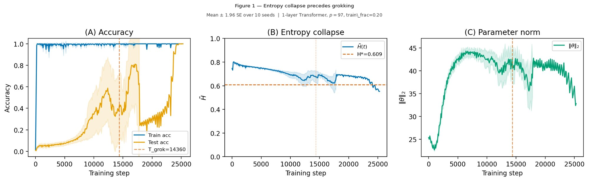

# Spectral analysis / FVE (SVD, ESD)

[Mechanistic interpretability](mechanistic-interpretability.md) ← previous card, next → [Causal ablation and intervention](causal-ablation-intervention.md)

[Concept card index](index.md), category: [6. Analytical tools and metrics](index.md#cat-6)\
→ Next category: [Effective theory and statistical mechanics](effective-theory-statistical-mechanics.md)\
← Previous category: [Grokfast / gradient low-pass filtering](gradient-low-pass-filtering.md)

## Definition

**Spectral analysis** in the study of [grokking](grokking.md) is a family of diagnostic methods that track delayed generalisation through the **spectrum** (the set of eigenvalues or singular values) of the network's internal matrices: weight matrices, the gradient, the covariance of activations or of representations. The key instruments of the family are **SVD** (singular value decomposition — a representation of a matrix through its singular values and directions), **ESD** (empirical spectral density — the distribution of the eigenvalues of a matrix) and **FVE** (Fraction of Variance Explained — the share of the variance of the activations explained by a given set of basis directions). The family's common hypothesis is that the transition from memorisation to generalisation shows up as a reproducible rearrangement of the spectrum — for example, the [HTSR](heavy-tailed-self-regularization-htsr.md) analysis examines *"the empirical spectral density (ESD) of individual layer weight matrices"* \[[1.3](#ref-1-3)\], while the SVD analysis of the weights shows that *"grokking is preceded by a near-degeneracy of the leading singular values of the attention matrices"* \[[1.7](#ref-1-7)\].

## Elaboration

The works of this family differ above all in **whose matrix's spectrum** is taken as the diagnostic signal. In the **weights**: the singular values of the weight matrices through SVD (near-degeneracy — the two leading singular values σ1 ≈ σ2 nearly coinciding before grokking, and the lifting of that coincidence at the moment of generalisation) \[[1.7](#ref-1-7)\], and the empirical spectral density of the weights, ESD, with the power-law exponent α from the theory of heavy-tailed self-regularisation (HTSR) \[[1.3](#ref-1-3)\]. In the same ESD vein, anomalously large eigenvalues beyond the Marchenko–Pastur "bulk" (the region predicted by random matrix theory, where the bulk of the eigenvalues of "pure noise" lies) serve as a signal of [anti-grokking](anti-grokking.md) and, as the authors show, can provoke [catastrophic forgetting](catastrophic-forgetting.md) \[[1.6](#ref-1-6)\]. In the **gradient**: an ill-conditioned spectrum (a large condition number — the ratio of the largest singular value to the smallest) holds the dynamics on the plateau and causes delayed generalisation \[[1.4](#ref-1-4)\]. In the **activations and representations**: FVE — the share of the variance of the MLP activations explained by the ideal Fourier basis functions \[[1.8](#ref-1-8)\], and the normalised spectral entropy of the covariance of the representations \[[1.11](#ref-1-11)\]. In the **representations as such**: the Fourier spectrum of the internal circuits (subnetworks implementing a sub-algorithm) — [Fourier circuits](fourier-features-circuits.md) make this line a relative of the [clock vs pizza](clock-vs-pizza.md) storyline — with the progress measures FFD and FCR \[[1.2](#ref-1-2)\]; the spectrum of the latent kernel (the matrix of pairwise inner products of the neurons' pre-activations), in which "spikes" appear in the direction of the target \[[1.1](#ref-1-1)\]; and a PCA analysis of the layers (principal component analysis — the same spectral analysis of the covariance of the activations) \[[1.5](#ref-1-5)\]. Finally, there are works that integrate spectral measures with causal and algorithmic ones into a single frame \[[1.10](#ref-1-10)\], and a work that raises a spectral quantity to the status of an **[order parameter](order-parameter.md)** (a quantity from statistical physics that changes by a jump at a [phase transition](phase-transition.md)) in order to test whether grokking really is a finite-size transition \[[1.9](#ref-1-9)\].

The discussion inside the family concerns **where exactly the decisive signal lives**. The HTSR line insists that a spectral metric of the weights (α ≈ 2 and "correlation traps" in the ESD) is a universal diagnostic feature that requires no access to test data, whereas the competing non-spectral measures (activation sparsity, weight entropy, circuit complexity, the ℓ2 norm) do not tell anti-grokking apart \[[1.3](#ref-1-3)\]\[[1.6](#ref-1-6)\]. The representation line, by contrast, places the proximal signal in the spectrum of the covariance of the representations and, by means of an intervention, shows that it is precisely the collapse of the spectral entropy — and not the growth of the parameter norm — that is the primary driver of the delay \[[1.11](#ref-1-11)\].

## Alternative definitions and nuances

### A. The singular values of the weights (weight-SVD)

The diagnostic quantity is the leading singular values of the weight (in particular, attention) matrices. The distinguishing mechanism: grokking is preceded by a **near-degeneracy** of the two leading singular values (σ1 ≈ σ2), which creates an orientational instability, while generalisation coincides with the **breaking of that spectral symmetry**, when one mode begins to dominate \[[1.7](#ref-1-7)\]. The source of difference: the signal is taken from the spectrum of the **weights**, and what crosses is the ratio of the two top singular values.

### B. The empirical spectral density of the weights (ESD / HTSR)

The diagnostic quantity is the shape of the whole eigenvalue distribution of a weight matrix (the ESD), compressed into a power-law exponent α (HTSR). The distinguishing feature: the passage into the grokking phase is visible as a change of α, and the subsequent degradation of generalisation ([anti-grokking](anti-grokking.md)) as α < 2 together with the appearance of "correlation traps", that is, of outliers beyond the Marchenko–Pastur edge \[[1.3](#ref-1-3)\]\[[1.6](#ref-1-6)\]. The source of difference: **the whole mass** of the weight spectrum is used (rather than the two top values), and the metric requires no test data.

### C. The Fourier spectrum of the representations (FFD / FCR)

The diagnostic quantity is the Fourier spectrum of the internal representations of a grokked model, reduced to the progress measures Fourier Frequency Density (FFD) and Fourier Coefficient Ratio (FCR). The distinguishing property: the authors prove that FFD and FCR **decrease** as the test accuracy grows and that they reflect the make-up of the internal circuits \[[1.2](#ref-1-2)\]. The source of difference: the spectrum is taken in the **Fourier basis of the representations** rather than from the singular values of the weights; this is a spectral measure of the complexity of the solution, specific to [modular arithmetic](modular-arithmetic.md).

### D. FVE — the fraction of variance of the activations explained

The diagnostic quantity is the Fraction of Variance Explained: for every dominant frequency k one measures the share of the variance of the MLP activations that the ideal 2D basis functions cos and sin explain \[[1.8](#ref-1-8)\]. The distinguishing role: FVE is a measure of the **geometric coherence** of a Fourier circuit (a high FVE = a clean low-dimensional structure; its fall = the destruction of the circuit). The source of difference: the spectral quantity is computed in the space of **activations** relative to a known ideal basis, rather than as the eigenvalues of a weight matrix.

### E. The spectral entropy of the covariance of the representations

The diagnostic quantity is the normalised spectral entropy ˜H of the covariance matrix of the representations (the entropy of the distribution of its eigenvalues). The distinguishing thesis: grokking passes through two phases — an expansion of the norm and then a **collapse of the entropy** — and it is the collapse (the passage of ˜H through a critical threshold) that precedes generalisation; an intervention that impedes the collapse postpones grokking \[[1.11](#ref-1-11)\]. The source of difference: the signal is the "width" of the spectrum of the **covariance of the representations**, and the causal driver is declared to be the entropy of the spectrum rather than the parameter norm.

### F. The spectrum of the gradient

The diagnostic quantity is the singular spectrum of the **gradient** matrix of a hidden layer. The distinguishing mechanism: ill-conditioning (the largest singular value being far greater than the smallest) makes the dynamics of gradient descent "stall" for an arbitrarily long time, which is what produces delayed generalisation; equalising all the singular values of the gradient accelerates grokking \[[1.4](#ref-1-4)\]. The source of difference: the spectrum is taken from the **gradient** rather than from the weights or the activations, and what matters is the conditioning, not a particular crossing.

### G. The spectrum of the latent kernel and the PCA of the layers

The diagnostic quantity is the spectrum of the covariance/kernel of the layers' activations. In the latent-kernel variant, [feature learning](feature-emergence-feature-learning.md) shows up as the appearance of spectral **spikes** of the kernel in the direction of the target \[[1.1](#ref-1-1)\]; in the PCA variant, the principal components of the layers' activations reveal a transition from a connected network to a set of sparse subnetworks \[[1.5](#ref-1-5)\]. The source of difference: the spectrum is computed for the **kernel/covariance of the activations** and is interpreted as the evolution of the structure of the features rather than as a threshold scalar.

### H. A spectral order parameter (HTC)

The diagnostic quantity is the spectral **head–tail contrast** (HTC), raised to the status of an **order parameter**. The distinguishing purpose: not merely to describe the dynamics but to give a falsifiable finite-size criterion — with Binder crossings and a susceptibility analysis it is tested whether grokking is organised as a [phase transition](phase-transition.md) rather than as a smooth crossover \[[1.9](#ref-1-9)\]. The source of difference: the spectral quantity here is not a progress measure but an order parameter in the strict physical sense, tied to a size variable (the order of the group p).

## References

###### ref-1-1
**\[1.1\]** 2310.03789 — Rubin et al., "Droplets of Good Representations: Grokking as a First Order Phase Transition". [`"the latent kernel itself develops notable spikes in the target direction, indicating feature learning"`](../papers/2310.03789.grokking-as-a-first-order-phase-transition-in-two-layer-networks/original/2310.03789.grokking-as-a-first-order-phase-transition-in-two-layer-networks.md#p1-4).

###### ref-1-2
**\[1.2\]** 2402.16726 — Furuta et al., "Internal Circuits in Grokked Transformers on Modular Polynomials". [`"Our Fourier analysis and novel progress measure for modular arithmetic, *Fourier Frequency Density* and *Fourier Coefficient Ratio*, characterize distinctive internal representations of grokked models per modular operation"`](../papers/2402.16726.towards-empirical-interpretation-of-internal-circuits-and-properties-in-grokked-transformers-on-modular-polynomials/original/2402.16726.towards-empirical-interpretation-of-internal-circuits-and-properties-in-grokked-transformers-on-modular-polynomials.md#p1-1).\
Also (the link to accuracy): [`"We prove that our proposed FFD and FCR decrease accompanying the test accuracy improvement"`](../papers/2402.16726.towards-empirical-interpretation-of-internal-circuits-and-properties-in-grokked-transformers-on-modular-polynomials/original/2402.16726.towards-empirical-interpretation-of-internal-circuits-and-properties-in-grokked-transformers-on-modular-polynomials.md#p1-3).

###### ref-1-3
**\[1.3\]** 2506.04434 — Prakash & Martin 2025, "Grokking and Generalization Collapse: Insights from HTSR theory". [`"HTSR theory examines the empirical spectral density (ESD) of individual layer weight matrices $(\mathbf{W})$, quantified by the heavy-tailed power law (PL) exponent $\alpha$"`](../papers/2506.04434.grokking-and-generalization-collapse-insights-from-htsr-theory/original/2506.04434.grokking-and-generalization-collapse-insights-from-htsr-theory.md#p1-4).\
Also: [`"tracking the transition into the grokking phase, and crucially, predicting a subsequent decrease in generalization"`](../papers/2506.04434.grokking-and-generalization-collapse-insights-from-htsr-theory/original/2506.04434.grokking-and-generalization-collapse-insights-from-htsr-theory.md#p1-4).

###### ref-1-4
**\[1.4\]** 2510.04930 — Saheb Pasand et al., "Egalitarian Gradient Descent: A Simple Approach to Accelerated Grokking". [`"Ill-conditioned Gradient Spectra causes delayed generalization"`](../papers/2510.04930.egalitarian-gradient-descent-a-simple-approach-to-accelerated-grokking/original/2510.04930.egalitarian-gradient-descent-a-simple-approach-to-accelerated-grokking.md#fig-4).\
Also (the mechanism): [`"the largest singular-value (corresponding to a fast direction) is much larger than the smallest (corresponding to slow directions)"`](../papers/2510.04930.egalitarian-gradient-descent-a-simple-approach-to-accelerated-grokking/original/2510.04930.egalitarian-gradient-descent-a-simple-approach-to-accelerated-grokking.md#fig-4).

###### ref-1-5
**\[1.5\]** 2510.25966 — Hutchison et al., "Grokking in the Ising Model". [`"novel PCA-based network layer analysis techniques"`](../papers/2510.25966.grokking-in-the-ising-model/original/2510.25966.grokking-in-the-ising-model.md#p1-5).\
Also (what is revealed): [`"the observed behavior is interpreted as a transition from a connected network to a group of sparse subnetworks"`](../papers/2510.25966.grokking-in-the-ising-model/original/2510.25966.grokking-in-the-ising-model.md#p1-5).

###### ref-1-6
**\[1.6\]** 2602.02859 — Prakash et al., "Late-Stage Generalization Collapse in Grokking: Detecting anti-grokking with WeightWatcher". [`"large eigenvalues beyond the Marchenko–Pastur bulk in the empirical spectral density of shuffled weight matrices"`](../papers/2602.02859.late-stage-generalization-collapse-in-grokking-detecting-anti-grokking-with-weightwatcher/original/2602.02859.late-stage-generalization-collapse-in-grokking-detecting-anti-grokking-with-weightwatcher.md#p1-4).

###### ref-1-7
**\[1.7\]** 2602.16746 — Xu, "Low-Dimensional and Transversely Curved Optimization Dynamics in Grokking". [`"grokking is preceded by a near-degeneracy of the leading singular values of the attention matrices"`](../papers/2602.16746.low-dimensional-and-transversely-curved-optimization-dynamics-in-grokking/original/2602.16746.low-dimensional-and-transversely-curved-optimization-dynamics-in-grokking.md#p1-2).\
Also (the breaking of the symmetry): [`"Generalization coincides with the breaking of this spectral symmetry as one mode dominates. This spectral structure is confirmed to be basis-independent"`](../papers/2602.16746.low-dimensional-and-transversely-curved-optimization-dynamics-in-grokking/original/2602.16746.low-dimensional-and-transversely-curved-optimization-dynamics-in-grokking.md#p1-2).

###### ref-1-8
**\[1.8\]** 2603.05228 — Yildirim, "The Geometric Inductive Bias of Grokking: Bypassing Phase Transitions via Topology". [`"we computed the Fraction of Variance Explained (FVE)"`](../papers/2603.05228.the-geometric-inductive-bias-of-grokking-bypassing-phase-transitions-via-architectural-topology/original/2603.05228.the-geometric-inductive-bias-of-grokking-bypassing-phase-transitions-via-architectural-topology.md#p13-1).\
Also (how it is computed): [`"we measured the proportion of variance in the MLP activations explained by the ideal 2D basis functions"`](../papers/2603.05228.the-geometric-inductive-bias-of-grokking-bypassing-phase-transitions-via-architectural-topology/original/2603.05228.the-geometric-inductive-bias-of-grokking-bypassing-phase-transitions-via-architectural-topology.md#p13-1).

###### ref-1-9
**\[1.9\]** 2603.24746 — Bi et al., "Grokking as a Falsifiable Finite-Size Transition". [`"a held-out spectral head–tail contrast (HTC) as the order parameter"`](../papers/2603.24746.grokking-as-a-falsifiable-finite-size-transition/2603.24746.grokking-as-a-falsifiable-finite-size-transition.card.md#p1-7).

###### ref-1-10
**\[1.10\]** 2603.29262 — Zhang et al., "Grokking: From Abstraction to Intelligence". [`"We integrate causal, spectral, and algorithmic complexity measures alongside Singular Learning Theory"`](../papers/2603.29262.grokking-from-abstraction-to-intelligence/2603.29262.grokking-from-abstraction-to-intelligence.card.md#p1-2).

###### ref-1-11
**\[1.11\]** 2604.13123 — Truong Xuan Khanh et al., "Spectral Entropy Collapse as an Empirical Signature of Delayed Generalisation". [`"the key quantity is the normalised spectral entropy"`](../papers/2604.13123.spectral-entropy-collapse-as-a-phase-transition-in-delayed-generalisation/2604.13123.spectral-entropy-collapse-as-a-phase-transition-in-delayed-generalisation.card.md#p1-2).\
Also (the two-phase mechanism): [`"proceeds in two phases — norm expansion followed by entropy collapse — and that entropy collapse is the proximate signal preceding generalisation"`](../papers/2604.13123.spectral-entropy-collapse-as-a-phase-transition-in-delayed-generalisation/2604.13123.spectral-entropy-collapse-as-a-phase-transition-in-delayed-generalisation.card.md#p1-2).\
Also (the spectrum of the activations, not of the weights): [`"we study the spectrum of the *activation covariance* $\hat{\Sigma}=\mathbb{E}[zz^{\top}]$ as a phenomenological order parameter observed during training, without introducing a regulariser"`](../papers/2604.13123.spectral-entropy-collapse-as-a-phase-transition-in-delayed-generalisation/2604.13123.spectral-entropy-collapse-as-a-phase-transition-in-delayed-generalisation.card.md#p3-4)

### In support

###### ref-3-1
**\[3.1\]** 2306.17844 — Zhong et al. 2023, "The Clock and the Pizza". Nuance: FVE here is a means of choosing between two formulas across all $59^{3}$ logits (99.18–99.28% against 75.38–75.62%), not a characteristic of the spectrum of the weights; all the numbers are taken from trained models. [`"We find that $Q_{abc}({\it Pizza})$ explains substantially more variance than $Q_{abc}({\it Clock})$."`](../papers/2306.17844.the-clock-and-the-pizza-two-stories-in-mechanistic-explanation-of-neural-networks/original/2306.17844.the-clock-and-the-pizza-two-stories-in-mechanistic-explanation-of-neural-networks.md#p5-2).

###### ref-1-12
**\[1.12\]** 2302.03025 — Chughtai et al., "A Toy Model of Universality: Reverse Engineering how Networks Learn Group Operations". Nuance: FVE is computed over the subspaces of the irreducible representations rather than over frequencies; the activations are centred before the count, otherwise the positive mean after a ReLU inflates all the shares. The shortfall from $100$% the authors explain by the fact that a ReLU only approximates matrix multiplication. [`"our algorithm’s prediction does not explain all of the logits, as can be seen from FVE being less than 100%"`](../papers/2302.03025.a-toy-model-of-universality-reverse-engineering-how-networks-learn-group-operations/2302.03025.a-toy-model-of-universality-reverse-engineering-how-networks-learn-group-operations.card.md#p23-9).\
Also: [`"Accounting for this would artificially increase all ‘fraction of variance explained’ metrics."`](../papers/2302.03025.a-toy-model-of-universality-reverse-engineering-how-networks-learn-group-operations/2302.03025.a-toy-model-of-universality-reverse-engineering-how-networks-learn-group-operations.card.md#p23-1).

###### ref-3-2
**\[3.2\]** 2310.16441 — Levi et al. 2023. Nuance: a rare case in which the delay is read off the spectrum of the Gram matrix of the **data**; the lower edge of the spectrum $\lambda_{-}=(1-\sqrt{\lambda})^{2}$ sets both the rate of the late decay and the constant ratio of the losses, which together make up the formula for the grokking time. There are no spectra of weight matrices, no ESD and no SVD in the paper. [`"its eigenvalues, $\nu_{i}$, follow the Marchenko-Pastur (MP) distribution [13]"`](../papers/2310.16441.grokking-in-linear-estimators-a-solvable-model-that-groks-without-understanding/original/2310.16441.grokking-in-linear-estimators-a-solvable-model-that-groks-without-understanding.md#p4-5).

###### ref-1-13
**\[1.13\]** 2408.11804 — Yunis et al., "Approaching Deep Learning through the Spectral Dynamics of Weights". A separate variant of the family: the signal is taken from the spectrum of the weight matrices and folded into the entropy of the normalised distribution of the singular values, divided by the rank; and on top of the spectrum of values a spectrum of vectors is added — the alignment $A(t)$ of neighbouring layers and the coincidence $S(t)$ with the end of training. The measure is computed on any architecture without knowledge of the task. [`"we compute the (normalized) effective rank of a matrix $W$ (Roy & Vetterli 2007) with rank $R$ as"`](../papers/2408.11804.approaching-deep-learning-through-the-spectral-dynamics-of-weights/original/2408.11804.approaching-deep-learning-through-the-spectral-dynamics-of-weights.md#p4-4).\
Also: [`"$\text{EffRank}(W)$ is the entropy of the normalized singular value distribution"`](../papers/2408.11804.approaching-deep-learning-through-the-spectral-dynamics-of-weights/original/2408.11804.approaching-deep-learning-through-the-spectral-dynamics-of-weights.md#p4-5)\
Also (the boundary of applicability): [`"we disregard 1D bias and normalization parameters in our analysis"`](../papers/2408.11804.approaching-deep-learning-through-the-spectral-dynamics-of-weights/original/2408.11804.approaching-deep-learning-through-the-spectral-dynamics-of-weights.md#p6-7).

### In support

###### ref-3-3
**\[3.3\]** 2602.18523 — Xu, "The Geometry of Multi-Task Grokking: Transverse Instability, Superposition, and Weight Decay Phase Structure". Nuance: there are two spectral signals and they are independent — the gap $g_{12}=\sigma_{1}(W_{Q})-\sigma_{2}(W_{Q})$ in the attention operators themselves and the gap $g_{23}=\sigma_{2}^{2}-\sigma_{3}^{2}$ of a sliding Gram matrix of the updates; the second separates grokking runs from controls by non-overlapping distributions. The quantities "curvature threshold $\omega$" and "remark 12.22", on which the analysis rests, are taken from a preprint by the same author and are not defined in this paper. [`"*degeneracy breeds instability, symmetry breaking resolves it, and generalization follows*"`](../papers/2602.18523.the-geometry-of-multi-task-grokking-transverse-instability-superposition-and-weight-decay-phase-structure/original/2602.18523.the-geometry-of-multi-task-grokking-transverse-instability-superposition-and-weight-decay-phase-structure.md#p16-2).\
Also (the count over runs): [`"$g_{23}$ declines before grokking in 18 of 18 runs with weight decay (mean $39\times$, range $8$–$111\times$) and in only 1 of 18 matched controls"`](../papers/2602.18523.the-geometry-of-multi-task-grokking-transverse-instability-superposition-and-weight-decay-phase-structure/original/2602.18523.the-geometry-of-multi-task-grokking-transverse-instability-superposition-and-weight-decay-phase-structure.md#p20-2).

### Contested

###### ref-2-1
**\[2.1\]** 2602.16967 — Xu, "Early-Warning Signals of Grokking via Loss-Landscape Geometry". Nuance: a direct revision of the chronology of `2602.16746` — there the opening of the spectral gap $\sigma_{1}\gg\sigma_{2}$ was placed before grokking, here it comes after and is declared a consequence of weight decay acting on an already generalising model. [`"The dominant-mode separation is a *consequence* of grokking (driven by continued weight decay), not a prerequisite."`](../papers/2602.16967.early-warning-signals-of-grokking-via-loss-landscape-geometry/original/2602.16967.early-warning-signals-of-grokking-via-loss-landscape-geometry.md#p16-9).\
Also (the eigenvalue gap of the Gram matrix): [`"The eigenvalue gap $g_{23}$ declines by $\mathbf{33\times}$ (Dyck mean) and $\mathbf{43\times}$ (SCAN mean) during the grokking transition."`](../papers/2602.16967.early-warning-signals-of-grokking-via-loss-landscape-geometry/original/2602.16967.early-warning-signals-of-grokking-via-loss-landscape-geometry.md#p19-2).

###### ref-2-2
**\[2.2\]** 2602.18649 — Xu 2026, "Global Low-Rank, Local Full-Rank: The Holographic Encoding of Learned Algorithms". A direct warning against spectral measures as substitutes for functional ones: at a rank that captures about eighty-eight per cent of the Frobenius energy of the change in the weights, the accuracy is close to chance — the working part of the solution lies in the tail of the spectrum, and there is no sharp spectral break; the matrices, meanwhile, were all truncated simultaneously and to a single rank. [`"spectral energy concentration is not a reliable proxy for functional compression: components that are energetically small can be essential when coordinated across matrices"`](../papers/2602.18649.global-low-rank-local-full-rank-the-holographic-encoding-of-learned-algorithms/original/2602.18649.global-low-rank-local-full-rank-the-holographic-encoding-of-learned-algorithms.md#p5-6)..

###### ref-1-14
**\[1.14\]** 2505.15624 — AlQuabeh, Bojković, Nwadike, Inui, "Mechanistic Insights into Grokking from the Embedding Layer". Traces the ranks of $\mathbf{E}$, $\mathbf{W}$ and their product in three settings and arrives at a negative conclusion, valuable for its honesty: $\text{rank}(\mathbf{E}\mathbf{W})$ falls in all three, but this does not govern the moment of grokking. Nuance: the claim that the rank of $\mathbf{E}$ is stable holds only for the panel with ordinary Adam — under Adam-LR the rank of $\mathbf{E}$ falls from 99 to about 30 and returns, and at $wd=0.005$ it falls to about 20; the third setting does not generalise at all, and its training accuracy collapses to zero, which the text does not mention. [`"However, only Adam-LR shows continued rank changes after generalization, suggesting that rank evolution alone does not capture the onset of grokking."`](../papers/2505.15624.mechanistic-insights-into-grokking-from-the-embedding-layer/original/2505.15624.mechanistic-insights-into-grokking-from-the-embedding-layer.md#p15-7).\
Also (a description of the three phases of the rank of $\mathbf{W}$): [`"As shown in Figure 10, $\mathbf{W}$ exhibits three distinct phases: an early drop during training loss reduction, a plateau, and a final decline aligned with grokking. In contrast, $\mathbf{E}$’s rank remains largely stable throughout."`](../papers/2505.15624.mechanistic-insights-into-grokking-from-the-embedding-layer/original/2505.15624.mechanistic-insights-into-grokking-from-the-embedding-layer.md#p15-6).

###### ref-1-15
**\[1.15\]** 2503.10483 — Pomarico et al., "Grokking as an entanglement transition in tensor network machine learning". Nuance: the first values to break away reach about 0.5, then gather into a group centred on 0.018; there are no power-law fits, no heavy-tailed exponents and no random-matrix baselines — only histograms, and the causal verb "activate" is not backed by an intervention. [`"a split off from the continuous distribution of eigenvalues, that activate the grokking transition"`](../papers/2503.10483.grokking-as-an-entanglement-transition-in-tensor-network-machine-learning/2503.10483.grokking-as-an-entanglement-transition-in-tensor-network-machine-learning.card.md#p11-3).

###### ref-1-16
**\[1.16\]** 2604.06256 — Xu, "Spectral Edge Dynamics Reveal Functional Modes of Learning". Nuance: the spectrum is taken from the Gram matrix of consecutive updates, not from the weights; the window is $W=20$ in a space of $D=131{,}072$, without a random baseline and without a check of stability with respect to $W$. [`"Over a sliding window of $W=20$ consecutive updates, we form the *Gram matrix*"`](../papers/2604.06256.spectral-edge-dynamics-reveal-functional-modes-of-learning/original/2604.06256.spectral-edge-dynamics-reveal-functional-modes-of-learning.md#p3-5).\
Also (what is measured by this): [`"the $g_{23}$ gap cleanly separates grokking from non-grokking regimes"`](../papers/2604.06256.spectral-edge-dynamics-reveal-functional-modes-of-learning/original/2604.06256.spectral-edge-dynamics-reveal-functional-modes-of-learning.md#p6-7).

### In support

###### ref-3-4
**\[3.4\]** 2602.06702 — Singh, Misra, Orvieto, "Explaining Grokking in Transformers…". [`"we fit a powerlaw to the eigenvalue spectrum of the feature correlation matrix"`](../papers/2602.06702.explaining-grokking-in-transformers-through-the-lens-of-inductive-bias/2602.06702.explaining-grokking-in-transformers-through-the-lens-of-inductive-bias.card.md#p7-7). The lower the exponent $\alpha$, the heavier the tail; the ordering of the settings by $\alpha$ coincides with the ordering by grokking.\
Also (the processing): [`"To eliminate noisy spikes caused by slingshots, this is shown under minimum aggregation over $5$ seeds"`](../papers/2602.06702.explaining-grokking-in-transformers-through-the-lens-of-inductive-bias/2602.06702.explaining-grokking-in-transformers-through-the-lens-of-inductive-bias.card.md#fig-6).

### In support

###### ref-3-5
**\[3.5\]** 2506.12284 — Walker et al., "GrokAlign: Geometric Characterisation and Acceleration of Grokking". Carries FVE over from the activations to the input-output Jacobian: the share of the variance explained by the first principal component of the Jacobian, averaged over the training points, is tracked over the course of training and read as an effective rank. Nuance: the quantity serves as a prop for the low-rank assumption rather than as an independent measure of the transition — the paper does not measure the spectrum of the weight matrices, the assumption itself is attributed to five other people's works and admitted to require a deeper characterisation; under cross-entropy the share reaches only ≈0.8 in 500 steps, and the curves under weight decay and under GrokAlign coincide. [`"we recorded the average explained variance of the first principal component of the Jacobians evaluated at the training data (PC1)"`](../papers/2506.12284.grokalign-geometric-characterisation-and-acceleration-of-grokking/original/2506.12284.grokalign-geometric-characterisation-and-acceleration-of-grokking.md#fig-2).\
Also (what rests on this assumption): [`"some of our reasoning is dependent on the assumption that deep network training dynamics minimise the rank of the weight matrices"`](../papers/2506.12284.grokalign-geometric-characterisation-and-acceleration-of-grokking/original/2506.12284.grokalign-geometric-characterisation-and-acceleration-of-grokking.md#p11-3).

###### ref-1-17
**\[1.17\]** 2605.08237 — Wang, Ying, Kanamori 2026, "Distributional Spectral Diagnostics for Localizing Grokking Transitions". [`"the residual itself should then be interpreted as a transition or fragility signal"`](../papers/2605.08237.distributional-spectral-diagnostics-for-localizing-grokking-transitions/2605.08237.distributional-spectral-diagnostics-for-localizing-grokking-transitions.card.md#p4-3).\
Also (where the signal lives): [`"Because the diagnostic is computed from the chosen output distribution rather than from hidden-unit coordinates, it does not depend on hidden-unit indexing."`](../papers/2605.08237.distributional-spectral-diagnostics-for-localizing-grokking-transitions/2605.08237.distributional-spectral-diagnostics-for-localizing-grokking-transitions.card.md#p2-1)\
Also (why the pipeline is one-dimensional): [`"there is generally no global isometric isomorphism that maps the Wasserstein space into a linear space [44]"`](../papers/2605.08237.distributional-spectral-diagnostics-for-localizing-grokking-transitions/2605.08237.distributional-spectral-diagnostics-for-localizing-grokking-transitions.card.md#p13-1)

### In support

###### ref-3-6
**\[3.6\]** 2605.20441 — Verma 2026, "Weight Decay Regimes in Grokking Transformers: Cheap Online Diagnostics". Carries the spectral diagnostic over from the weights into the activations: the affinely normalised participation ratio of the spectrum of the covariance of the head patterns falls from $0.86$ at initialization to $0.13$ at the late collapse and is declared a direct test of the breaking of the permutation symmetry $S_{H}$. Nuance: the check certifies only the algebraic equivalence of the participation ratio and the coefficient of variation of the spectrum (the identity is proved and machine-checked in Lean 4 over 183 layer-epoch lines); there is no causal threshold for the breaking of the symmetry, and the diagnostic does not carry over to architectures without attention. [`"initialization $0.86\to$ Phase 1 attention-head coordination $0.71$ at epochs 100 to 500 (grokking onset) $\to$ Phases 2 to 4 differentiation oscillation (epochs 1000 to 12 500) $\to$ Phase 5 collapse $0.13$ at epoch 20 000"`](../papers/2605.20441.weight-decay-regimes-in-grokking-transformers-cheap-online-diagnostics/original/2605.20441.weight-decay-regimes-in-grokking-transformers-cheap-online-diagnostics.md#p8-1).\
Also (what exactly is measured): [`"Head indices are exchangeable at initialization (permutation group $S_{H}$ acts transitively on heads); post-Phase-2, head-pattern covariance becomes lower-participation and permutation-distinguishable."`](../papers/2605.20441.weight-decay-regimes-in-grokking-transformers-cheap-online-diagnostics/original/2605.20441.weight-decay-regimes-in-grokking-transformers-cheap-online-diagnostics.md#p7-2).
###### ref-3-7
**\[3.7\]** 2604.07380 — Xu 2026, "The Lifecycle of the Spectral Edge: From Gradient Learning to Weight-Decay Compression". A dynamic decomposition of the spectral edge: the share of the gradient energy on the leading Gram direction falls from 88–98% before grokking to 0.2–5.3% at its point, and the remainder is supplied by weight decay; the analysis notes that the "alignment" itself is not measured by an angle, that the definition of the gap has silently changed against the earlier works of the series, and that for Dyck the dominance of weight decay rests on a single control point. [`"At grokking, this flips: gradient drops to 5.3% (Dyck) and 0.2% (SCAN), with weight decay providing the remainder"`](../papers/2604.07380.the-lifecycle-of-the-spectral-edge-from-gradient-learning-to-weight-decay-compression/original/2604.07380.the-lifecycle-of-the-spectral-edge-from-gradient-learning-to-weight-decay-compression.md#p3-5)..

###### ref-3-8
**\[3.8\]** 2605.12394 — Prakash & Martin 2026, "Detecting overfitting in Neural Networks during long-horizon grokking using Random Matrix Theory". A spectral definition of the instrument: a trap is an eigenvalue of the shuffled covariance beyond the fitted Marchenko–Pastur edge plus Tracy–Widom fluctuations, with a reference to the Baik–Ben Arous–Péché transition; the interpretation is a breakdown of self-averaging through geometric localisation or spectral condensation, and it is stated outright that a violation of MP is not a sign rule. [`"By the Baik–Ben Arous–Péché (BBP) theory, an eigenvalue that separates beyond the TW edge is a structural outlier"`](../papers/2605.12394.detecting-overfitting-in-neural-networks-during-long-horizon-grokking-using-random-matrix-theory/original/2605.12394.detecting-overfitting-in-neural-networks-during-long-horizon-grokking-using-random-matrix-theory.md#p4-7)..

###### ref-3-9
**\[3.9\]** 2606.05863 — Tan, Gai & Zhang 2026, "Deciphering Two Training Clocks in Grokking via Deep Linear Network Theory with Conditional ReLU Reduction". The stable rank is taken as one transparent road from structure to generalisation — with an explicit caveat that another structural gap could be put in its place, and with a boundary case rare for this line: spectral contraction is weaker than a low effective rank, since the strength of the data can balance the contraction and rotations of the singular vectors can redistribute the energy. [`"If the learned rule genuinely requires many comparable directions, the stable rank need not collapse"`](../papers/2606.05863.deciphering-two-training-clocks-in-grokking-via-deep-linear-network-theory-with-conditional-relu-reduction/2606.05863.deciphering-two-training-clocks-in-grokking-via-deep-linear-network-theory-with-conditional-relu-reduction.card.md#p41-1)..

###### ref-3-10
**\[3.10\]** 2606.32000 — Tiwari, Chauhan & Singh 2026, "Radial Suppression Accelerates Algorithmic Generalization: A Geometric Analysis of Delayed Generalization". The spectrum as the arena of an "antagonistic gradient": the implicit bias of cross-entropy towards low-rank factorisations inflates $\sigma_{1}$, while the strictly radial gradient of the penalty on the norm of the activations strikes exactly along $\sigma_{1}$, distributing the energy over the tail singular values; the numbers — $\sigma_{\max}$ falls from $>52{,}000$ to $36.5$, the stable rank $\Vert A\Vert_{F}^{2}/\Vert A\Vert_{2}^{2}$ grows from 135 to 443 out of 512. Nuance: the convergence of the Hutchinson estimator is checked only for the penalised model (traces 1.38–1.41); there is no such check for the reference trace of 42.5. [`"Because this opposing gradient is strictly radial, it exerts its maximal suppressive force exactly along the direction of $\sigma_{1}$."`](../papers/2606.32000.radial-suppression-accelerates-algorithmic-generalization-a-geometric-analysis-of-delayed-generalization/2606.32000.radial-suppression-accelerates-algorithmic-generalization-a-geometric-analysis-of-delayed-generalization.card.md#p9-6).\
Also (the bias of CE towards rank 1): [`"Specifically, $L_{CE}$ inflates the dominant singular value $\sigma_{1}$ exponentially faster than the tail, driving $s(A)\to 1$."`](../papers/2606.32000.radial-suppression-accelerates-algorithmic-generalization-a-geometric-analysis-of-delayed-generalization/2606.32000.radial-suppression-accelerates-algorithmic-generalization-a-geometric-analysis-of-delayed-generalization.card.md#p9-4).

###### ref-3-11
**\[3.11\]** 2607.20512 — Wang 2026, "The Active Ingredient in Muon’s Grokking". A spectral trace of the choice of optimizer: the orthogonalising variants of Muon come to grokking at a largest singular value of $5.5\text{–}6.2$ against $15.9$ for AdamW and with a spread-out Fourier spectrum of the embeddings (IPR $0.022$ against $0.085$), while the objection that "orthogonal updates simply move the embedding less" is removed by a direct comparison. Nuance: the singular value is a single scalar without a spread and without an indication of which matrix it is taken from; the power-averaged IPR is admitted by the authors themselves to be a crude substitute for a per-neuron analysis. [`"The orthogonalizing variants (M0, M1) grok at roughly $3\times$ lower spectral norm than AdamW"`](../papers/2607.20512.the-active-ingredient-in-muons-grokking/original/2607.20512.the-active-ingredient-in-muons-grokking.md#p3-7).\
Also (the comparison of the movement of the embeddings): [`"Every optimizer rewrites the embedding by essentially the same amount (relative change ${\approx}1.0$), yet Muon and Lean5 end Fourier-uniform while AdamW concentrates."`](../papers/2607.20512.the-active-ingredient-in-muons-grokking/original/2607.20512.the-active-ingredient-in-muons-grokking.md#p6-4).
###### ref-3-12
**\[3.12\]** 2604.25143 — Xu 2026, "Gradient-Direction Sensitivity Reveals Linear-Centroid Coupling Hidden by Optimizer Trajectories". A direct trial of two spectral estimators on the same checkpoints and probes: the SVD of a sliding window of AdamW updates against the SVD of a window of attention gradients ($P_{\text{attn}}=131{,}072$, $W=20$, $K=3$); the replacement raises the response of the LCH centroids from 3–9 to 110–330 in the single-task setting and from $\leq 1$ to 20–45 in the multi-task one (the per-op decomposition). Nuance: the ablation over $W$ shows that at $W=1$ the basis degenerates into the instantaneous gradient with a ceiling of $R_{1}=648$, quasi-tautological by the chain rule (the gradient and the centroid are built from the same Jacobians), while the sliding window merely cleans the signal of noise, monotonically lowering $R_{1}$; the denominator of the ratio is a random direction in a 131072-dimensional space, small by construction; and the claimed monotonicity along the $W$ axis is broken at the point $W=10$, where a footnote measures a different quantity. [`"the rolling SVD reduces to the normalized instantaneous gradient direction itself"`](../papers/2604.25143.gradient-direction-sensitivity-reveals-linear-centroid-coupling-hidden-by-optimizer-trajectories/original/2604.25143.gradient-direction-sensitivity-reveals-linear-centroid-coupling-hidden-by-optimizer-trajectories.md#p5-1).

###### ref-3-13
**\[3.13\]** 2605.08119 — Xu 2026, "Feature Repulsion and Spectral Lock-in: An Empirical Study of Two-Layer Network Grokking". A cheap online instrument — the top 5 eigenvalues of a sliding Gram matrix of the increments $\Delta W$ (a $W\times W$ matrix, window $W=20$): at $\sigma=x^{2}$ a "rank-2 lock-in" develops between epochs 150 and 200, while at ReLU the spectrum stays rank-one and the detector never fires once — the spectral trace is activation-specific, whereas Tian's sign rule of repulsion holds under both activations. Nuance: "rank 2" is exact precisely at those small windows at which the detector fires falsely in the comparison; the natural ReLU analogue ($\sigma_{1}/\sigma_{2}$) is named and not tested; and later $\sigma_{2}/\sigma_{3}$ is inconsistent between tables (6.8 against 300 at the same $\eta$; 1949 at $\eta=5\times 10^{-5}$ — the non-monotonicity is not explained). [`"in the grok condition, $\sigma_{2}$ stabilizes near $5\!\times\!10^{-3}$ between epochs 150 and 200 while $\sigma_{3}$ collapses two orders of magnitude"`](../papers/2605.08119.feature-repulsion-and-spectral-lock-in-an-empirical-study-of-two-layer-network-grokking/original/2605.08119.feature-repulsion-and-spectral-lock-in-an-empirical-study-of-two-layer-network-grokking.md#p6-5).

###### ref-3-14
**\[3.14\]** 2607.06639 — Truong Xuan Khanh 2026, "At-Grok Is Not Converged: A Measurement-Validity Audit for Grokking Representation Metrics". A measurement hazard of spectral measures: the effective rank of the embedding at $T_{\mathrm{grok}}$ is a transient outlier, overstating the converged value by a factor of 3–5 on a modular MLP (1.3–1.5 on a transformer, up to 3.6 on $W_{\mathrm{out}}$) and erasing the distinction "contracts / does not contract"; the transience is reproduced without a norm clamp (2–7×, most vividly on parity $23\to 3$) and is metric-agnostic — visible in the participation ratio and in the stable rank; the denominator can be transient too (at wd $=0.5$ a shelf of $\approx 22$ collapses in a second collapse to $\approx 4$ as the norm doubles). Nuance: a numerical strain in the title — "3–5×, median 3.3×" sits next to "$\approx 50\to\approx 7$", which gives 6–7×; the quadratic normalisation of the spectral entropy differs from the original Roy–Vetterli one and is flagged; the independent support is Brown et al. with the same spike-and-fall in the intrinsic dimension of the activations. [`"the boundary cell ($\rho=1.00$, converged rank $\approx 42$) and its neighbour ($\rho=1.05$, converged rank $\approx 12$) read $46$ and $48$ at grok, a $4\%$ difference that hides a $3.6\times$ difference in the converged solution."`](../papers/2607.06639.at-grok-is-not-converged-a-measurement-validity-audit-for-grokking-representation-metrics/2607.06639.at-grok-is-not-converged-a-measurement-validity-audit-for-grokking-representation-metrics.card.md#p8-5).

###### ref-3-15
**\[3.15\]** 2607.11666 — Kazanskii 2026, "How to Tame Grokking: Representation Geometry as a Control Signal". The spectrum of the covariance of the activations as a working axis of control: the measure is the participation ratio $D_{\mathrm{eff}}=(\sum\mu_{i})^{2}/\sum\mu_{i}^{2}$; the spectrum can be estimated on a random 5–25% of the representations almost without loss of speed-up (a computational gain of 2.4–2.7×), whence a guess about compatibility with mini-batches (not directly tested); the width ablation shows the limit — for an MLP the device helps at every width from 32 to 256 (including cases where the baseline does not grok at all: 0/5 → 5/5), while for a transformer at widths 64 and 128 it makes things worse (2/5 and 1/5 against 5/5 for the baseline), a fixed low-dimensional target not scaling with the width. Nuance: at a sample of 1% (28 examples in dimension 128) the sample covariance is degenerate by construction — the row is in the table, the analysis is not; the complexity $O(Nd^{2}+d^{3})$ per layer is honestly stated; the text is not proof-read (a missing "If", "he Transformer", a repeated sentence). [`"However, this benefit does not persist at larger widths."`](../papers/2607.11666.how-to-tame-grokking-representation-geometry-as-a-control-signal/original/2607.11666.how-to-tame-grokking-representation-geometry-as-a-control-signal.md#p18-4).

###### ref-3-16
**\[3.16\]** 2607.29503 — Zhang, Chan, Shang, Zhang, Yang 2026, "The Grokked Illusion: True Equilibrium Mitigates Catastrophic Forgetting". The effective rank of Roy & Vetterli (the exponential of the entropy of the normalised spectrum of the singular values) is taken as a measure of reserve rather than of progress: in the equilibrium network it is, before the noise injection, much higher in all four attention matrices and both MLP layers ($W_{Q}$ 96.8 against 2.2, $W_{K}$ 97.4 against 7.2, $W_{\text{in}}$ 116.1 against 48.1); after the injection it falls in both and falls more in absolute terms in the equilibrium one, yet the residual level is still higher — hence the reading through a representational buffer. Nuance: the line is opposite in sign to the one in which a fall of the same quantity counts as progress towards generalisation; the exceptions are stated (for the unembedding the pre-injection levels are close and after it the equilibrium network's is lower; for the embeddings there is almost no advantage), and the link to robustness remains a correspondence — interventions are deferred to future work. [`"the WLMD-equilibrium NN exhibits significantly higher ER than the AdamW-goldilocks NN prior to noise injection"`](../papers/2607.29503.the-grokked-illusion-true-equilibrium-mitigates-catastrophic-forgetting/original/2607.29503.the-grokked-illusion-true-equilibrium-mitigates-catastrophic-forgetting.md#p4-2).

## Passing mentions

Works that only mention the phenomenon — a literature review, a related-work paragraph, a passing citation — without examining it.

**\[4.2\]** 2511.12768 — Hong et al., "Evidence of Phase Transitions in Small Transformer-Based Language Models". [`"applying singular value decomposition, neuron activation analysis, and embedding alignment to track how grokking unfolds inside the network"`](../papers/2511.12768.evidence-of-phase-transitions-in-small-transformer-based-language-models/original/2511.12768.evidence-of-phase-transitions-in-small-transformer-based-language-models.md#p4-5).

**\[4.3\]** 2505.20172 — Boursier et al., "A Theoretical Framework for Grokking: Interpolation followed by Riemannian Norm Minimisation". Merely makes use of it: the singular values of the recovered matrix $UV^{\top}$ serve as the main measured indicator of the drift towards a low rank — of ten, seven go off to zero during the grokking phase and three come to the true values. The paper introduces no spectral measures in the sense of the corpus (ESD, heavy tails, FVE). [`"as grokking starts around time $t\approx 10^{2}$, all but three begin decay towards zero. The remaining three approach the true singular values"`](../papers/2505.20172.a-theoretical-framework-for-grokking-interpolation-followed-by-riemannian-norm-minimisation/2505.20172.a-theoretical-framework-for-grokking-interpolation-followed-by-riemannian-norm-minimisation.card.md#fig-2).

**\[4.4\]** 2504.16041 — Tveit, Remseth, Skogvold, "Muon Optimizer Accelerates Grokking". Nuance: the paper gives neither singular values of the weights, nor spectra, nor per-layer norms, although a constraint on the spectral norm is declared one of the acting principles; and it is named inaccurately at that — Muon normalises and orthogonalises the update rather than constraining the spectral norm of the weights. [`"Applies spectral norm constraints"`](../papers/2504.16041.muon-optimizer-accelerates-grokking/original/2504.16041.muon-optimizer-accelerates-grokking.md#fig-1).

**\[4.5\]** 2604.20923 — Golwala, "ILDR: Geometric Early Detection of Grokking". Of the spectral entropy of the singular values of the first two weight matrices it says: [`"Logged as a diagnostic but not used for flagging."`](../papers/2604.20923.ildr-geometric-early-detection-of-grokking/original/2604.20923.ildr-geometric-early-detection-of-grokking.md#p5-8); in the introduction the same measures are rejected as indirect and barely leading ([p. 2, para. 3](../papers/2604.20923.ildr-geometric-early-detection-of-grokking/original/2604.20923.ildr-geometric-early-detection-of-grokking.md#p2-3)).

### External works

###### ref-5-1
**\[5.1\]** 2502.20763 — External work (demoted from the corpus): Tan & Huang 2025, "Information-Theoretic Perspectives on Optimizers". Nuance: what is proposed instead is the entropy gap of the Hessian spectrum — a measure of its unevenness. [`"Traditional methods for analyzing optimizers, such as sharpness metrics based on the Hessian matrix, offer valuable insights into the local landscape around minima or saddle points but fail to fully capture the underlying optimization dynamics"`](../externals/2502.20763.information-theoretic-perspectives-on-optimizers/2502.20763.information-theoretic-perspectives-on-optimizers.card.md#p1-2).
