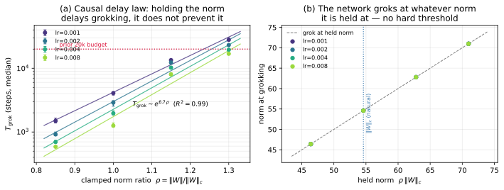

# The direction of the weight-decay effect

[selective-weight-decay](selective-weight-decay.md) ← previous card, next → [Overparameterisation and depth](overparameterization-depth.md)

[Concept card index](index.md), category: [4. Training and optimisation factors](index.md#cat-4)\
→ Next category: [Grokfast / gradient low-pass filtering](gradient-low-pass-filtering.md)\
← Previous category: [Modular arithmetic](modular-arithmetic.md)

## Definition

**The direction of the weight-decay effect** is the question of which way and by what law the strength of [weight decay](weight-decay.md) shifts [grokking](grokking.md), and one of the few points in the corpus where the empirical evidence formally contradicts itself. The primary source for a positive effect is Power et al.: *"we find that weight decay is particularly effective at improving generalization on the tasks we study"* \[[1.1](#ref-1-1)\], with the size of the effect in §3.3 — *"adding weight decay has a very large effect on data efficiency, more than halving the amount of samples needed compared to most other interventions"* \[[1.2](#ref-1-2)\]. A quantitative law in time was predicted and measured by Omnigrok: <i>"we predicted that the training time required for a model to generalize should be $t\propto\gamma^{-1}$ where $\gamma$ is the weight decay"</i> \[[1.3](#ref-1-3)\] — larger weight decay gives faster grokking, inversely proportionally.

## Elaboration

The positive direction rests on three kinds of evidence. **Power's measure** — the saving in data at a fixed budget: weight decay more than halves the number of examples required \[[1.2](#ref-1-2)\]. **Omnigrok's measurement** — the time to generalisation: on an exact reproduction of Nanda's setup (a one-layer transformer, $p=113$, fraction 0.3, learning rate 0.001), <i>"from Figure 10(a), we find that $t\propto\gamma^{-1}$ holds across roughly two orders of magnitude of $t$ and $\gamma$"</i> \[[1.4](#ref-1-4)\] — by the figure, the law holds from $\gamma\approx 0.1$ to $\gamma\approx 5$, monotonically, with no bend. **Later confirmations**: Truong et al. confirm *"inverse scaling with weight decay"* with $R^{2}=0.97$ \[[3.1](#ref-3-1)\]; Notsawo et al. 2025 prove a general law of a delay growing as $1/(\alpha\beta)$ for an arbitrary suitable regulariser, weight decay being a special case (see the card on the [delay law](norm-separation-delay-law.md)); Kumar et al. read Nanda's own figure 27 the same way: *"Nanda et al. [2023] finds that the time taken to generalize drops by a factor of ten in Figure 27 of that paper, when weight decay is increased by a factor of again, again linear"* \[[3.2](#ref-3-2)\] — the sentence is corrupted in the published paper ("by a factor of again"), but the direction of the reading is unambiguous.

The pieces of evidence are incommensurable in metric, and this is part of the dispute: Power measures the saving in data at a fixed budget, Omnigrok and Truong the time to generalisation, Notsawo (2023) the accuracy within a fixed number of steps. Under the law $t\propto\gamma^{-1}$ a fixed budget ought to favour **larger** weight decay — which makes Notsawo's observation (see "Contested") a substantive counter-piece of evidence rather than an artefact of the metric.

## Contested

**Nanda's D.1 numbers** are the only direct counter-voice within the working range. One sentence of appendix D.1 carries the whole conflict: <i>"Smaller amounts of weight decay lead to slower grokking, while larger amounts of weight decay lead to faster grokking—on average, it takes around 3k epochs for models to grok with weight decay $\lambda=0.3$, 5-10k epochs … with weight decay $\lambda=1.0$, and 20k epochs … with weight decay $\lambda=3.0$"</i> \[[2.1](#ref-2-1)\] — the words say "more is faster", the numbers say "more is slower", and the contradiction is not noted in the paper (documented in the Nanda card, section "Points we could not reconcile"). Against the numbers stand two independent sources on the same setup and the same learning rate: Omnigrok's measurement \[[1.4](#ref-1-4)\] and Kumar's reading of figure 27 \[[3.2](#ref-3-2)\].

**Notsawo et al. (2023)** are a counter-piece of evidence at a fixed budget: *"the generalization is most observed for small learning rate and small weight decay"* \[[2.2](#ref-2-2)\]. Their heat map (fig. 2, a grid of learning rates 0.001–0.005 against weight decay 0–5, accuracy within 10k steps) shows the other side as well: at lr = 0.001 generalisation holds up to weight decay 3.5 and collapses at 5.0; at lr = 0.005 it collapses already above ≈1; and the weight-decay = 0 column fails almost everywhere.

**Omnigrok themselves bound their law**: on MNIST the relation $t\propto\gamma^{-1}$ holds for $\gamma$ roughly between 0.1 and 1.0, and beyond that *"very high values of weight decay seem to mess with optimization"* \[[2.3](#ref-2-3)\].

**Notsawo et al. 2025** show that beyond the limit too strong a regularisation gives a false signal: *"the use of weight decay alone causes an abrupt transition in the generalization error, as predicted by previous works, but that this transition does not correspond to generalization"* \[[2.4](#ref-2-4)\] — an abrupt turn of the curve without a real solution ("grokking without understanding"). A kindred piece of evidence is the phase diagrams of [Liu et al. 2205.10343](../papers/2205.10343.towards-understanding-grokking-an-effective-theory-of-representation-learning/2205.10343.towards-understanding-grokking-an-effective-theory-of-representation-learning.card.md): too large a decoder weight decay drives training into the confusion phase.

## A supposition of the wiki editor

This section is the editor's synthesis, not the position of any paper; the standing of each part is marked explicitly.

**The summary picture**: the dependence is non-monotone — larger weight decay accelerates grokking by a law $\sim 1/\gamma$ up to a destabilisation threshold, beyond which training breaks down (instability, the confusion phase, a "transition without generalisation"; the neighbouring dispute over whether regularisation is needed at all is [when regularisation is necessary](regularization-necessity.md)); the threshold is not universal and depends on the setting — above all on the learning rate.

**What is supported by the papers' own reasoning**: the $1/\gamma$ law within the working range — predicted from the LU mechanism and measured \[[1.3](#ref-1-3)\], \[[1.4](#ref-1-4)\], confirmed \[[3.1](#ref-3-1)\] and generalised by Notsawo's 2025 theorem; the existence of a breakdown at large values — stated outright by Omnigrok \[[2.3](#ref-2-3)\], shown by "grokking without understanding" \[[2.4](#ref-2-4)\], by the top of Notsawo's heat map \[[2.2](#ref-2-2)\] and by the confusion phase of Liu et al. The task-dependence of the threshold is supported by Nanda's own data as well (appendix C.2.2, set out in the [Nanda card](../papers/2301.05217.progress-measures-for-grokking-via-mechanistic-interpretability/2301.05217.progress-measures-for-grokking-via-mechanistic-interpretability.card.md)): at $P=53$ models with $\lambda=1$ "never generalized", and grokking appeared only at $\lambda=5$ — the optimum depends on the task and on the size of the memorising solution, and is not a universal constant. The probable resolution of the Nanda conflict — that in the text of D.1 the correspondence between the numbers and the values of $\lambda$ is transposed — is supported by two independent sources on the same setup \[[1.4](#ref-1-4)\], \[[3.2](#ref-3-2)\], but is not acknowledged by the authors themselves: it is a probable resolution, not an established fact.

**What remains speculation, consistent with the data but nowhere tested**: (1) the mechanism of the breakdown — a hypothesis of the repository owner: too strong a weight decay destroys the network faster than it manages to shift it towards the generalising solution, whence an optimum in $\lambda$: below it there is not enough pressure to displace the memorising solution, above it the regularisation gets in the way of learning itself; (2) the unification of all the observations into a single non-monotone curve with an optimum — no work in the corpus has drawn such a curve or measured such an optimum; (3) the reading of Notsawo's heat map on which the breakdown boundary roughly follows a constant product lr·γ (at lr = 0.001 the breakdown is at γ = 5, at lr = 0.005 above γ ≈ 1) — this observation is not in Notsawo's text, it is made from one figure of one setting, and it implies that on other test beds the threshold will be different.

## References

###### ref-1-1
**\[1.1\]** 2201.02177 — Power et al., "Grokking: Generalization Beyond Overfitting on Small Algorithmic Datasets". [`"We find that weight decay is particularly effective at improving generalization on the tasks we study"`](../papers/2201.02177.grokking-generalization-beyond-overfitting-on-small-algorithmic-datasets/2201.02177.grokking-generalization-beyond-overfitting-on-small-algorithmic-datasets.card.md#p2-3).

###### ref-1-2
**\[1.2\]** 2201.02177 — the same, the size of the effect (§3.3). [`"adding weight decay has a very large effect on data efficiency, more than halving the amount of samples needed compared to most other interventions"`](../papers/2201.02177.grokking-generalization-beyond-overfitting-on-small-algorithmic-datasets/2201.02177.grokking-generalization-beyond-overfitting-on-small-algorithmic-datasets.card.md#p4-1).

###### ref-1-3
**\[1.3\]** 2210.01117 — Liu et al., "Omnigrok". The prediction of the law from the LU mechanism. [`"we predicted that the training time required for a model to generalize should be $t\propto\gamma^{-1}$ where $\gamma$ is the weight decay"`](../papers/2210.01117.omnigrok-grokking-beyond-algorithmic-data/original/2210.01117.omnigrok-grokking-beyond-algorithmic-data.md#sec-c).

###### ref-1-4
**\[1.4\]** 2210.01117 — the same, the measurement on a reproduction of Nanda's setup (appendix C, fig. 10a). [`"From Figure 10(a), we find that $t\propto\gamma^{-1}$ holds across roughly two orders of magnitude of $t$ and $\gamma$"`](../papers/2210.01117.omnigrok-grokking-beyond-algorithmic-data/original/2210.01117.omnigrok-grokking-beyond-algorithmic-data.md#sec-c).

## References of works that joined the discussion

### Contested

###### ref-2-1
**\[2.1\]** 2301.05217 — Nanda et al., "Progress Measures for Grokking via Mechanistic Interpretability". The numbers of appendix D.1 against its own words. [`"Smaller amounts of weight decay lead to slower grokking, while larger amounts of weight decay lead to faster grokking—on average, it takes around 3k epochs for models to grok with weight decay $\lambda=0.3$, 5-10k epochs for the models to grok with weight decay $\lambda=1.0$, and 20k epochs for the models to grok with weight decay $\lambda=3.0$"`](../papers/2301.05217.progress-measures-for-grokking-via-mechanistic-interpretability/2301.05217.progress-measures-for-grokking-via-mechanistic-interpretability.card.md#sec-d-1).

###### ref-2-2
**\[2.2\]** 2306.13253 — Notsawo et al., "Predicting Grokking Long Before it Happens". A counter-piece of evidence at a fixed budget (10k steps). [`"The generalization is most observed for small learning rate and small weight decay"`](../papers/2306.13253.predicting-grokking-long-before-it-happens/original/2306.13253.predicting-grokking-long-before-it-happens.md#p3-4).

###### ref-2-3
**\[2.3\]** 2210.01117 — Liu et al., "Omnigrok". Their own bound on the law (MNIST, $\gamma$ between 0.1 and 1.0). [`"Very high values of weight decay seem to mess with optimization"`](../papers/2210.01117.omnigrok-grokking-beyond-algorithmic-data/original/2210.01117.omnigrok-grokking-beyond-algorithmic-data.md#sec-c).

###### ref-2-4
**\[2.4\]** 2506.05718 — Notsawo et al., "Grokking Beyond the Euclidean Norm of Model Parameters". "Grokking without understanding" under excessive regularisation. [`"the use of weight decay alone causes an abrupt transition in the generalization error, as predicted by previous works, but that this transition does not correspond to generalization"`](../papers/2506.05718.grokking-beyond-the-euclidean-norm-of-model-parameters/original/2506.05718.grokking-beyond-the-euclidean-norm-of-model-parameters.md#p4-3).

### In support

###### ref-3-1
**\[3.1\]** 2603.13331 — Truong et al., "The Norm-Separation Delay Law of Grokking". A confirmation of the inverse law. [`"we confirm three falsifiable predictions: inverse scaling with weight decay ($R^{2}=0.97$), inverse scaling with learning rate ($R^{2}=0.92$), and logarithmic dependence on the norm ratio"`](../papers/2603.13331.the-norm-separation-delay-law-of-grokking-a-first-principles-theory-of-delayed-generalization/2603.13331.the-norm-separation-delay-law-of-grokking-a-first-principles-theory-of-delayed-generalization.card.md#p1-2).

###### ref-3-2
**\[3.2\]** 2310.06110 — Kumar et al., "Grokking as the Transition from Lazy to Rich Training Dynamics". An independent reading of Nanda's figure 27 (appendix 13; the sentence is corrupted in print — "by a factor of again"). [`"Nanda et al. [2023] finds that the time taken to generalize drops by a factor of ten in Figure 27 of that paper, when weight decay is increased by a factor of again, again linear"`](../papers/2310.06110.grokking-as-the-transition-from-lazy-to-rich-training-dynamics/original/2310.06110.grokking-as-the-transition-from-lazy-to-rich-training-dynamics.md#p19-4).

###### ref-3-3
**\[3.3\]** 2605.20441 — Verma 2026, "Weight Decay Regimes in Grokking Transformers: Cheap Online Diagnostics". The first work in the corpus to measure **both** edges on one grid: a collapse of the grokking share below $\lambda_{c}=0.0158$, a monotone acceleration inside the working interval, and a collapse at $\lambda=10$. Within the working interval the direction supports the side of Omnigrok and Kumar against the numbers of Nanda's appendix D.1, but the acceleration is slower than inverse proportionality: a 20-fold rise of $\lambda$ gives a 13.1-fold speed-up. Nuance: there are no measurements between $\lambda=2.0$ and $\lambda=10$, so the upper boundary rests on a single grid point and on a formula fitted by symbolic regression; there is no comparison with the law $t\propto\gamma^{-1}$ in the paper. [`"$\lambda\in[0.1,2.0]$ gives roughly 90 to 100% grokking with monotone time-to-grok decrease $1090\to 83$ epochs"`](../papers/2605.20441.weight-decay-regimes-in-grokking-transformers-cheap-online-diagnostics/original/2605.20441.weight-decay-regimes-in-grokking-transformers-cheap-online-diagnostics.md#p6-2).\
Also (the upper edge): [`"$\lambda=10$ collapses all heads to identical patterns ($\bar{s}=1.000$ exact)"`](../papers/2605.20441.weight-decay-regimes-in-grokking-transformers-cheap-online-diagnostics/original/2605.20441.weight-decay-regimes-in-grokking-transformers-cheap-online-diagnostics.md#p6-2).

###### ref-3-4
**\[3.4\]** 2606.13753 — Truong et al. 2026, "The Weight Norm Sets the Grokking Timescale: A Causal Delay Law". The first work in the corpus to separate two accelerations that used to be conflated: the acceleration from stronger weight decay and the acceleration from clamping the norm directly downwards lie on one and the same frontier and are declared indistinguishable, while a slowdown from clamping upwards cannot be reproduced by regularisation, because weight decay can only lower the equilibrium norm. The direction of the effect thereby acquires not only a sign but also a boundary: half of the neighbourhood of the regularisation threshold is inaccessible. Nuance: the demarcation is specific to settings where a single weight norm sets the scale of the function — on sparse parity the clamp lies on the same frontier in both directions, and the separation disappears. [`"The below-clamp points lie *on* this frontier: the below-direction speed-up is not distinguishable from stronger regularization, and we do not claim it as a separate effect."`](../papers/2606.13753.the-weight-norm-sets-the-grokking-timescale-a-causal-delay-law/2606.13753.the-weight-norm-sets-the-grokking-timescale-a-causal-delay-law.card.md#p7-1).\
Also (where the separation disappears): [`"the norm clamp lies *on* the weight-decay frontier in both directions"`](../papers/2606.13753.the-weight-norm-sets-the-grokking-timescale-a-causal-delay-law/2606.13753.the-weight-norm-sets-the-grokking-timescale-a-causal-delay-law.card.md#p11-2).
