# von Oswald et al. 2023 — Transformers Learn In-Context by Gradient Descent

**An external work (demoted from the corpus, task-019).** The subject of the paper is the mechanism of in-context learning; grokking occupies a single hedged paragraph of appendix A.11. The card is kept whole as an over-complete excerpt; the work takes no part in the corpus's indices and counters. The convention is `papers/README.md`, the section "External works". The original — [`original/`](https://arxiv.org/abs/2212.07677); the analysis of the claims is the neighbouring `…claims.txt`.

See also: [the global concept index](../../concepts/index.md). arXiv [2212.07677v2](https://arxiv.org/abs/2212.07677), 15 December 2022 (v2 — 31 May 2023). The PDF's running head: "Proceedings of the 40th International Conference on Machine Learning, Honolulu, Hawaii, USA. PMLR 202, 2023".

**Johannes von Oswald** — Department of Computer Science, ETH Zürich; Google Research.
**Eyvind Niklasson, Ettore Randazzo, Alexander Mordvintsev, Andrey Zhmoginov, Max Vladymyrov** — Google Research.
**João Sacramento** — Department of Computer Science, ETH Zürich.

The files of this paper's analysis:

- [`2212.07677.transformers-learn-in-context-by-gradient-descent.license.txt`](2212.07677.transformers-learn-in-context-by-gradient-descent.license.txt) — the arXiv licence record for this paper.

The anchor scheme and the rules for linking into a card are in the [README of the papers folder](../README.md).

**Excerpt card.** The paper's licence (`arxiv-nonexclusive`) does not permit republishing the paper itself; what stands here are the editorial sections and the fragments the corpus quotes (right of quotation). The paper: <https://arxiv.org/abs/2212.07677>.

## Concepts covered

**[Grokking](../../concepts/grokking.md)** — the paper gives the corpus an observation of a grokking-like transition on a new carrier, and does so in a single paragraph of an appendix ([A.11](#p22-2)): with a "careful tuning of the learning rate and batchsize", one transformer block (a self-attention layer and an MLP) trained on a limited set of 8192 linear-regression tasks shows "grokking like" phase transitions of the training and the validation loss — the validation loss first rises sharply, then around 12 thousand steps both collapse almost to the gradient-descent loss ([fig-15](#fig-15), right). The reference to Power et al. 2022 is the only reference to grokking in the whole paper, and it is framed as a similarity in the shape of the curves ("look reminiscent of") rather than as a transfer of mechanism. What is missing: the training loss does not reach a near-zero level by the moment of the jump, the curves fall simultaneously, the settings of the run are not named, and the paragraph ends with "We leave a thorough investigation of these phenomena for future study" — it must not be cited as a measured grokking in in-context regression. It matters for the corpus that the transition is obtained outside the classical setting: MSE regression instead of classification, a limited set of tasks instead of memorising a table, without weight decay ([A.12](#p22-4): "We did not use any regularisation"), under Adam, with the learning rate and the batch size as the levers.

**[Phase transition](../../concepts/phase-transition.md)** — the paper observes phase transitions in an unusual place: in the meta-learning of an internal algorithm rather than in the learning of a task. In the main experiment the loss descends in steps ([fig-2](#fig-2), left), and in [A.11](#p22-1) it is shown that with a single self-attention head some of the ten seeds sit on a plateau "with virtually zero progress" for 1500–4000 steps, after which the loss abruptly collapses to the gradient-descent level; going to two heads removes the dependence on the seed, and all the runs converge smoothly and fast ([fig-15](#fig-15), left and centre). The paper introduces neither the language of phase transitions as a theory nor any order parameters — the word "transition" is descriptive for the authors, and their main contribution here is an architectural lever (a second head) that switches the delay off.

**[Progress measures](../../concepts/progress-measures.md)** — the paper gives an early observation of an internal quantity leading the outward jump, without calling it by any term: when a two-layer transformer is trained on alternating tokens, the norm of the partial derivative of the first layer's output with respect to the neighbouring token begins to grow before the loss breaks off the plateau ([fig-5](#fig-5): "Before the Transformer performance jumps to the one of GD, the first layer becomes highly sensitive to the next token"), while the sensitivity to the other tokens stays at zero. The term "progress measures" appeared in Nanda et al. (2023) after this paper was submitted and is not used in it; the "hidden progress" of Barak et al. (2022) is cited but not in that role. A framing in terms of progress measures must not be attributed to the authors — yet the measurable quantity that foretells the break is there.

**[Data fraction / critical dataset size](../../concepts/data-fraction-critical-dataset-size.md)** — a limitation of the volume of the data is the condition of both key observations involving data. The grokking-like transition ([A.11](#p22-2)) is obtained only when training on a fixed 8192 tasks — in the main experiments each step draws fresh tasks, and there is no overfitting there by construction. Separately, in [A.12](#p23-1), when training on a fixed set of $B$ tasks the alignment of the trained layer with the construction collapses at $B=128$ and becomes almost perfect at $B>2048$ ([fig-16](#fig-16)). The paper formulates no law of the critical size — there are two points of a dependence of the behaviour on the volume of the set.

**[Learning rate](../../concepts/learning-rate.md)** — in the single grokking paragraph ([A.11](#p22-2)) it is precisely the tuning of the learning rate and the batch size that is named as what switches the grokking-like transition on: "when carefully tuning the learning rate and batchsize we can also make the Transformers … *grokk*". The values are not named; the general settings ([A.12](#p22-4): Adam, lr 0.001 at depth $K<3$ and 0.0005 otherwise, batch 2048) belong to the other experiments. The paper does not measure the dependence on these levers — it only records that they switch the transition on.

---

## Points we could not reconcile

**Proposition 1 differs in its indices between the main text and the appendix.** In the [main formulation](#p4-2) the dynamics is written as $(x_{j},y_{j})+P\,VK^{T}q_{j}$, whereas in the repetition of the proposition in [A.1](#sec-a1) the first pair carries the index $i$: $(x_{i},y_{i})+P\,VK^{T}q_{j}$. A typo, but it stands in the formulation of the central proposition; when citing the formula one should check it against the derivation in A.1.

**The hypothesis extends to autoregressive tasks, the experiments do not.** [Hypothesis 1](#p3-1) speaks of autoregressive tasks, whereas all the experiments are regression with a loss on a single last token, with no noise and no regularisation; the authors themselves admit that such a loss "stands in contrast to usual autoregressive training and the training setup of Garg et al. 2022" ([sec-a12](#sec-a12)). The hypothesis is not narrowed accordingly — the reader should keep the gap in mind.

---

# Quoted fragments

Only the fragments the corpus cards refer to are
reproduced here (right of quotation); the paper's licence does not permit
republishing the whole text. Anchor numbering matches the original.

###### p3-1

*When training Transformers on auto-regressive tasks, in-context learning in the Transformer forward pass is implemented by gradient-based optimization of an implicit auto-regressive inner loss constructed from its in-context data.*

We acknowledge work done in parallel, investigating the same hypothesis. Akyürek et al. 2023 puts forward a weight construction based on a chain of Transformer layers (including MLPs) that together implement a single step of gradient descent with weight decay. Similar to work done by Garg et al. 2022, they then show that trained Transformers match the performance of models obtained by gradient descent. Nevertheless, it is not clear that optimization finds Transformer weights that coincide with their construction.

Here, we present a much simpler construction that builds on Schlag et al. 2021 and *only requires a single linear self-attention layer* to implement a step of gradient descent. This allows us to (1) show that optimizing self-attention-only Transformers finds weights that match our weight construction (Proposition 1), demonstrating its practical relevance, and (2) explain in-context learning in shallow two layer Transformers intensively studied by Olsson et al. 2022. Therefore, although related work provides comprehensive empirical evidence that Transformers indeed seem to implement gradient descent based learning on the data given in-context, we will in the following present mechanistic verification of this hypothesis and provide compelling evidence that our construction, which implements GD in a Transformer forward pass, is found in practice.

###### p4-2

*Given a 1-head linear attention layer and the tokens $e_{j}=(x_{j},y_{j})$, for $j=1,\ldots,N$, one can construct key, query and value matrices $W_{K},W_{Q},W_{V}$ as well as the projection matrix $P$ such that a Transformer step on every token $e_{j}$ is identical to the gradient-induced dynamics $e_{j}\leftarrow(x_{j},y_{j})+(0,-\Delta Wx_{j})=(x_{j},y_{j})+P\,VK^{T}q_{j}$ such that $e_{j}=(x_{j},y_{j}-\Delta y_{j})$. For the test data token $(x_{N+1},y_{N+1})$ the dynamics are identical.*

The simple construction can be found in Appendix A.1 and we denote the corresponding self-attention weights by $\theta_{\text{GD}}$.

Below, we provide some additional insights on what is needed to implement the provided LSA-layer weight construction, and further details on what it can achieve:

- **Full self-attention.** Our dynamics model training is based on in-context tokens only, i.e., only $e_{1},\ldots,e_{N}$ are used for computing key and value matrices; the query token $e_{N+1}$ (containing test data) is excluded. This leads to a linear function in $x_{\text{test}}$ as well as to the correct $\Delta W$, induced by gradient descent on a loss consisting only of the training data. This is a minor deviation from full self-attention. In practice, this modification can be dropped, which corresponds to assuming that the underlying initial weight matrix is zero, $W_{0}\approx 0$, which makes $\Delta W$ in equation A.1 independent of the test token even if incorporating it in the key and value matrices. In our experiments, we see that these assumptions are met when initializing the attention weights $\theta$ to small values.
- **Reading out predictions.** When initializing the $y$-entry of the test-data token with $-W_{0}x_{N+1}$, i.e. $e_{\text{test}}=(x_{\text{test}},-W_{0}x_{\text{test}})$, the test-data prediction $\hat{y}$ can be easily read out by simply multiplying again by $-1$ the updated token, since $-y_{N+1}+\Delta y_{N+1}=-(y_{N+1}-\Delta y_{N+1})=y_{N+1}+\Delta Wx_{N+1}$. This can easily be done by a final projection matrix, which incidentally is usually found in Transformer architectures. Importantly, we see that a single head of self-attention is sufficient to transform our training targets as well as the test prediction simultaneously.
- **Uniqueness.** We note that the construction is not unique; in particular, it is only required that the products $PW_{V}$ as well as $W_{K}W_{Q}$ match the construction. Furthermore, since no nonlinearity is present, any rescaling $s$ of the matrix products, i.e., $PW_{V}s$ and $W_{K}W_{Q}/s$, leads to an equivalent result. If we correct for these equivalent formulations, we can experimentally verify that weights of our learned Transformers indeed match the presented construction.
- **Meta-learned task-shared learning rates.** When training self-attention parameters $\theta$ across a family of in-context learning tasks $\tau$, where the data $(x_{\tau,i},y_{\tau,i})$ follows a certain distribution, the learning rate can be implicitly (meta-)learned such that an optimal loss reduction (averaged over tasks) is achieved given a fixed number of update steps. In our experiments, we find this to be the case. This kind of meta-learning to improve upon plain gradient descent has been leveraged in numerous previous approaches for deep neural networks (Li et al. 2017; Lee & Choi 2018; Park & Oliva 2019; Zhao et al. 2020; Flennerhag et al. 2020).
- **Task-specific data transformations.** A self-attention layer is in principle further capable of exploiting statistics in the current training data samples, beyond modeling task-shared curvature information in $\theta$. More concretely, a LSA layer updates an input sample according to a data transformation $x_{j}\leftarrow x_{j}+\Delta x_{j}=(I+P(X)V(X)K(X)^{T}W_{Q})x_{j}=H_{\theta}(X)x_{j}$, with $X$ the $N_{x}\times N$ input training data matrix, when neglecting influences by target data $y_{i}$. Through $H_{\theta}(X)$, a LSA layer can encode in $\theta$ an algorithm for carrying out data transformations which depend on the actual input training samples in $X$. In our experiments, we see that trained self-attention learners employ a simple form of $H(X)$ and that this leads to substantial speed ups in for GD and TF learning.

###### fig-2

*Figure 2: **Comparing one step of GD with a trained single linear self-attention layer.** *Outer left:* Trained single LSA layer performance is identical to the one of gradient descent. *Center left*: Almost perfect alignment of GD and the model generated by the SA layer after training, measured by cosine similarity and the L2 distance between models as well as their predictions. *Center right:* Identical loss of GD, the LSA layer model as well as the model obtained by interpolating between the construction and the optimized LSA layer weights for different $N=N_{x}$. *Outer right:* The trained LSA layer, gradient descent and their interpolation show identically loss (in log-scale) when provided input data different than during training i.e. with scale of 1. We display the mean/std. or the single runs of 5 seeds.* **[p. 5]**

We now experimentally investigate whether trained attention-based models implement gradient-based in-context learning in their forward passes. We gradually build up from single linear self-attention layers to multi-layer nonlinear models, approaching full Transformers. In this section, we follow the assumption of Proposition 1 tightly and construct our tokens by concatenating input and target data, $e_{j}=(x_{j},y_{j})$ for $1\leq j\leq N$, and our query token by concatenating the test input and a zero vector, $e_{N+1}=(x_{\text{test}},0)$. We show how to lift this assumption in the last section of the **[p. 5]** paper. The prediction $\hat{y}_{\theta}(\{e_{\tau,1},\ldots,e_{\tau,N}\},e_{\tau,N+1})$ of the attention-based model, which depends on all tokens and on the parameters $\theta$, is read-out from the $y$-entry of the updated $N+1$-th token as explained in the previous section.

The objective of training, visualized in Figure 1, is to minimize the expected squared prediction error, averaged over tasks $\min_{\theta}\mathbb{E}_{\tau}[||\hat{y}_{\theta}(\{e_{\tau,1},\ldots,e_{\tau,N}\},e_{\tau,N+1})-y_{\tau,\text{test}}||^{2}]$. We achieve this by minibatch online minimization (by Adam (Kingma & Ba 2014)): At every optimization step, we construct a batch of novel training tasks and take a step of stochastic gradient descent on the loss function:

$$
\mathcal{L}(\theta)=\frac{1}{B}\sum_{\tau=1}^{B}||\hat{y}_{\theta}(\{e_{\tau,i}\}_{i=1}^{N},e_{\tau,N+1})-y_{\tau,\text{test}}||^{2} \tag{5}
$$

where each task (context) $\tau$ consists of in-context training data $D_{\tau}=\{(x_{\tau,i},y_{\tau,i})\}_{i=1}^{N}$ and test point $(x_{\tau,N+1},y_{\tau,N+1})$, which we use to construct our tokens $\{e_{\tau,i}\}_{i=1}^{N+1}$ as described above. We denote the optimal parameters found by this optimization process by $\theta^{*}$. In our setup, finding $\theta^{*}$ may be thought of as meta-learning, while learning a particular task $\tau$ corresponds to simply evaluating the model $\hat{y}_{\theta}(\{e_{\tau,1},\ldots,e_{\tau,N}\},e_{\tau,N+1})$. Note that we therefore never see the exact same training task twice during training. See Appendix A.12, especially Figure 16 for an analyses when using a fixed dataset size which we cycle over during training.

We focus on solvable tasks and similarly to Garg et al. 2022 generate data for each task using a teacher model with parameters $W_{\tau}\sim\mathcal{N}(0,I)$. We then sample $x_{\tau,i}\sim U(-1,1)^{n_{I}}$ and construct targets using the task-specific teacher model, $y_{\tau,i}=W_{\tau}x_{\tau,i}$. In the majority of our experiments we set the dimensions to $N=n_{I}=10$ and $n_{O}=1$. Since we use a noiseless teacher for simplicity, we can expect our regression tasks to be well-posed and analytically solvable as we only compute a loss on the Transformers last token, which stands in contrast to usual autoregressive training and the training setup of Garg et al. 2022. Full details and results for training with a fixed training set size may be found in Appendix A.12.

###### fig-5

*Figure 5: **Training a two layer SA-only Transformer using the standard token construction.** *Left:* The loss of trained TFs matches one step of GD, not two, and takes an order of magnitude longer to train. *Right*: Norm of the partial derivatives of the output of the first self-attention layer w.r.t. input tokens. Before the Transformer performance jumps to the one of GD, the first layer becomes highly sensitive to the next token.* **[p. 8]**

We interpret this as evidence for a copying mechanism of the Transformer’s first layer to merge input and output data into single tokens as required by Proposition 1. Then, in the second layer the Transformer performs a single step of GD. Notably, we were not able to train the Transformer with linear self-attention layers, but had to incorporate the softmax operation in the first layer. These preliminary findings support the study of Olsson et al. 2022 showing that softmax self-attention layers easily learn to copy; we confirm this claim, and further show that such copying allows the Transformer to proceed by emulating gradient-based learning in the second or deeper attention layers.

We conclude that copying through (softmax) attention layers is the second crucial mechanism for in-context learning in Transformers. This operation enables Transformers to merge data from different tokens and then to compute dot products of input and target data downstream, allowing for in-context learning by gradient descent to emerge.

###### sec-a1

### A.1 Proposition 1

###### p22-1

We comment shorty on the curiously looking phase transitions of the training loss observed in many of our experiments, see Figure 2. Nevertheless, simply switching from a single-headed self-attention layer to a two-headed self-attention layer mitigates the random seed dependent training instabilities in our experiments presented in the main text, see left and center plot of Figure 15.

###### p22-2

Furthermore, these transitions look reminiscent of the recently observed ”grokking” behaviour (Power et al. 2022). Interestingly, when carefully tuning the learning rate and batchsize we can also make the Transformers trained in these linear regression tasks *grokk*. For this, we train a single Transformer block (self-attention layer and MLP) on a limited amount of data (8192 tasks), see right plot of Figure 15, and observe grokking like train and test loss phase transitions where test set first increases drastically before experiencing a sudden drop in loss almost matching the desired GD loss of $~0.2$. We leave a thorough investigation of these phenomena for future study.

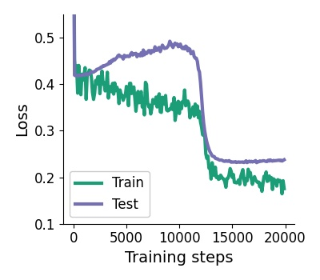

###### fig-15

*Figure 15: **Phase transitions during training**. *Left:* Loss based on 10 different random seeds when optimizing a single-headed self-attention layer. We observe for some seeds very long initial phases of virtually zero progress after which the loss drops suddenly to the desired GD loss. *Center:* The same experiment but optimizing a *two*-headed self-attention layer. We observe fast and robust convergence to the loss of GD. *Right:* Training a single Transformer block i.e. a self-attention layer with MLP and a reduced training set size of 8192 tasks. We observe grokking like train and test loss phase transitions where test set first increases drastically before experiencing a sudden drop in loss almost matching the desired GD loss of $~0.2$.* **[p. 23]**

###### sec-a12

### A.12 Experimental details

###### p22-4

- Optimizer: Adam (Kingma & Ba 2014) with default parameters and learning rate of 0.001 for Transformer with depth $K<3$ and 0.0005 otherwise. We use a batchsize of 2048 and applied gradient clipping to obtain gradients with global norm of $10$. We used the Optax library.
- Haiku weight initialisation (fan-in) with truncated normal and std $0.002/K$ where $K$ the number of layers.
- We did not use any regularisation and observed for deeper Transformers with $K>2$ instabilities when reaching GD performance. We speculate that this occurs since the GD performance is, for the given training tasks, already close to divergence as seen when providing tasks with larger input ranges. Therefore, training Transformers also becomes **[p. 23]** instable when we approach GD with an optimal learning rate. In order to stabilize training, we simply clipped the token values to be in the range of $[-10,10]$.
- When applicable we use standard positional encodings of size $20$ which we concatenated to all tokens.
- For simplicity, and to follow the provided weight construction closely, we did use square key, value and query parameter matrix in all experiments.
- The training length varied throughout our experimental setups and can be read off our training plots in the article.
- When training meta-parameters for gradient descent i.e. $\eta$ and $\gamma$ we used an identical training setup but usually training required much less iterations.
- In all experiments we choose inital $W_{0}=0$ for gradient descent trained models.

###### p23-1

Inspired by (Garg et al. 2022), we additionally provide results when training a single linear self-attention layer on a fixed number of training tasks. Therefore, we iterate over a single fixed batch of size $B$ instead of drawing new batch of tasks at every iteration. Results can be found in Figure 16. Intriguingly, we find that (meta-)gradient descent finds Transformer weights that align remarkable well with the provided construction and therefore gradient descent even when provided with an arguably very small number of training tasks. We argue that this again highlights the strong inductive bias of the LSA-layer to match (approximately) gradient descent learning in its forward pass.

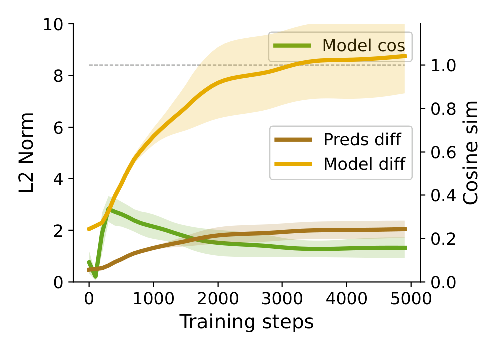

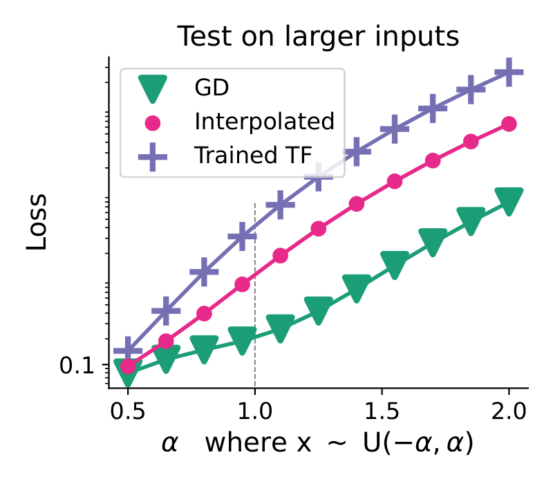

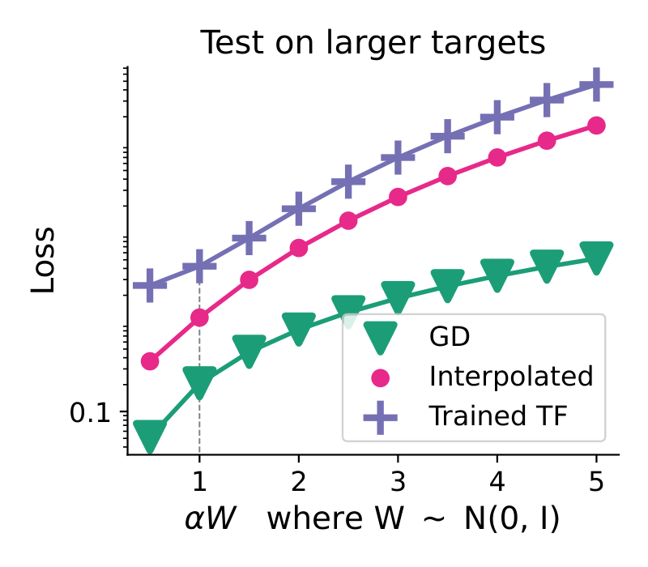

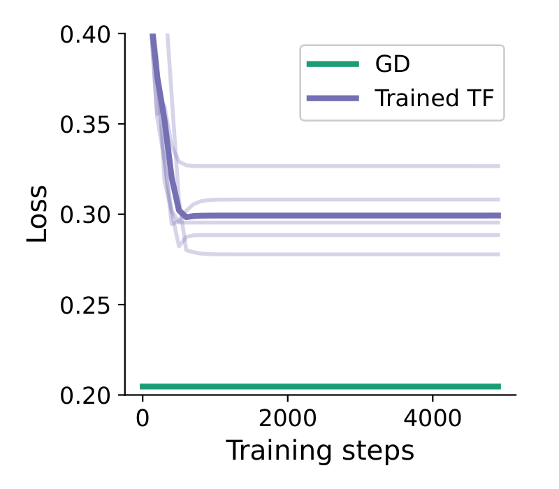

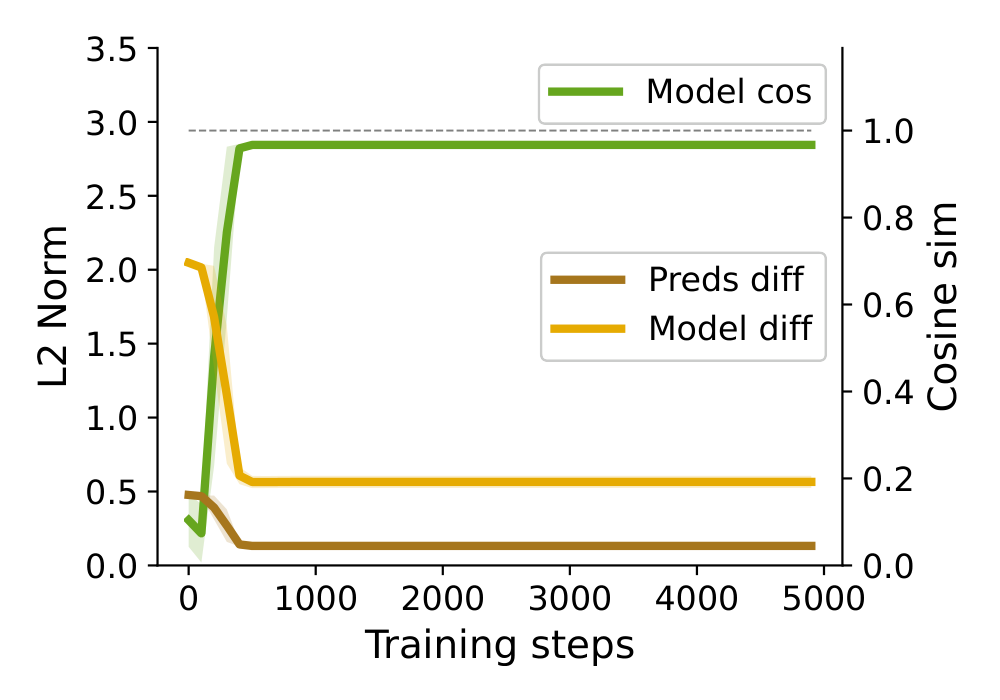

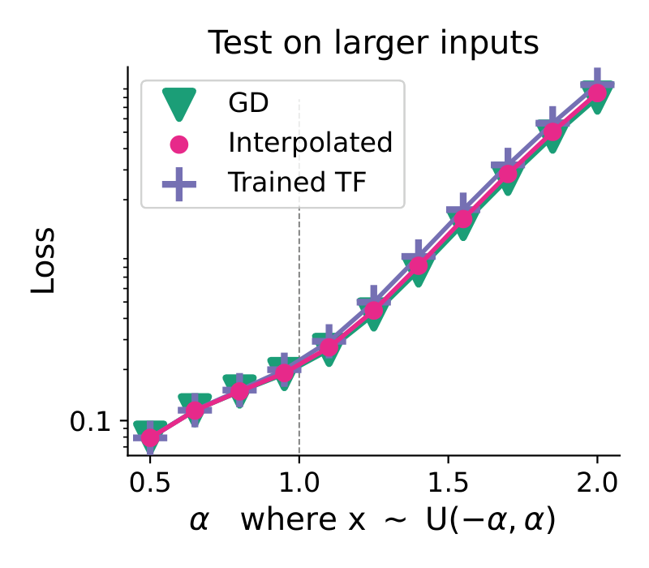

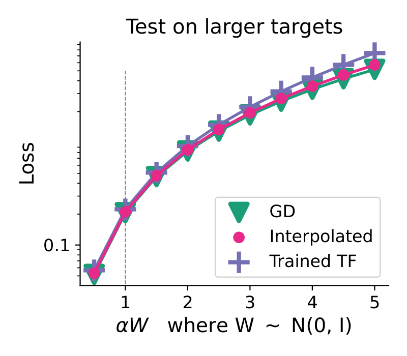

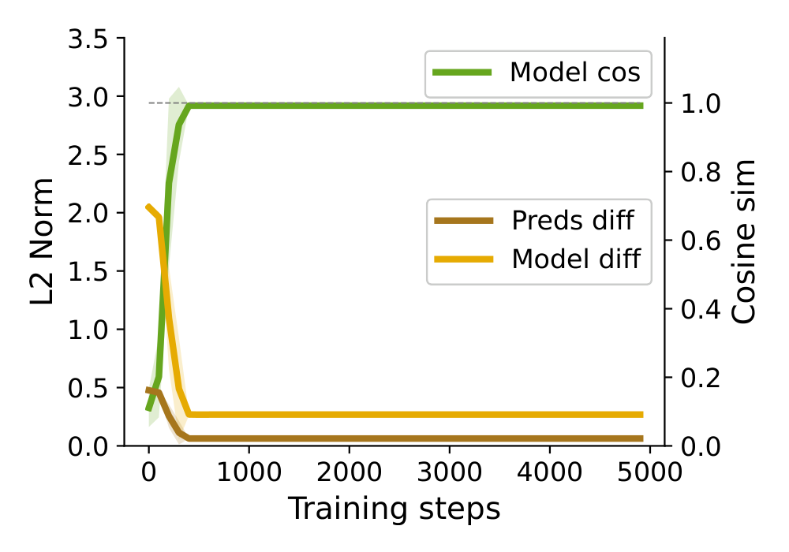

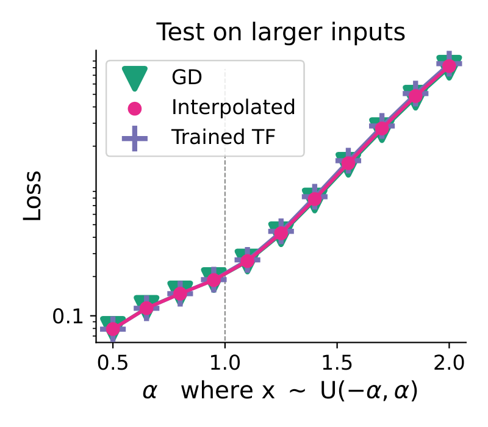

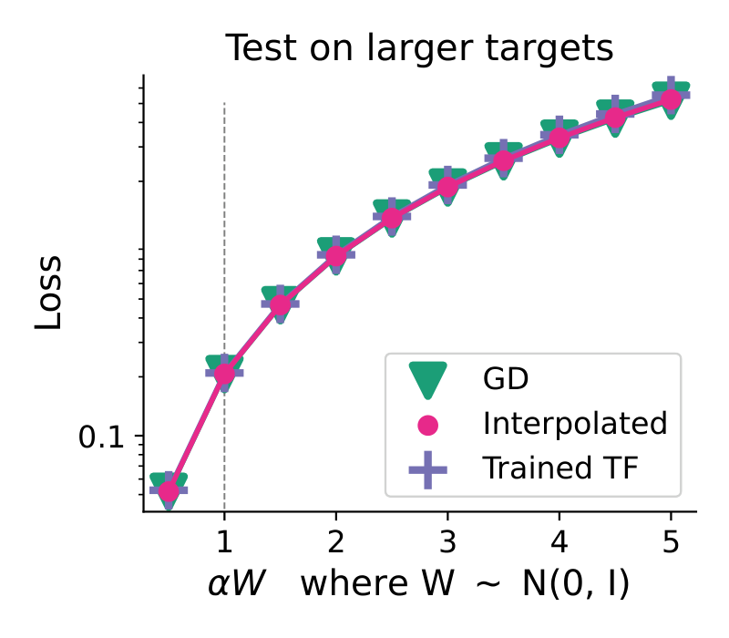

###### fig-16

*Figure 16: **Comparing trained Transformers with GD and their weight interpolation when training the Transformer on a fixed training set size $B$**. Across our alignment measures as well as our tests on out-of-training behaviour, trained Transformers fail to align with GD when provided with a very small amount of tasks. Nevertheless, we see already almost perfect alignment in our base setting $N=N_{x}=10$ when provided with $B>2048$ tasks. In all settings, we train the Transformer on (non-stochastic) gradient descent iterating over a single batch of tasks of size $B$ equal to the number provided in the Figure titles (128, 512, 2048, 8192).* **[p. 24]**
