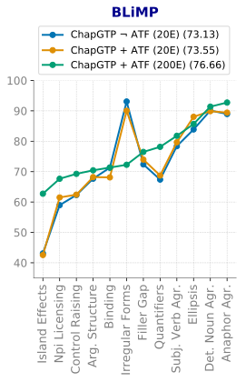
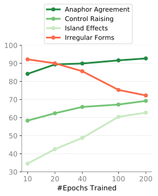
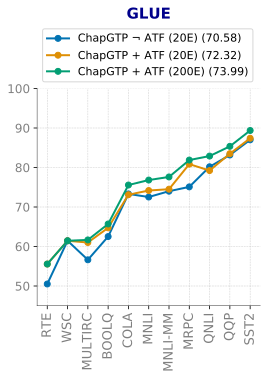
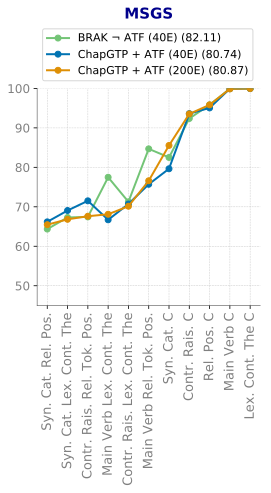

# ChapGTP, ILLC’s Attempt at Raising a BabyLM: Improving Data Efficiency by Automatic Task Formation

Jaap Jumelet Anna Langedijk Michael Hanna Charlotte Pouw Marianne de Heer Kloots Oskar van der Wal Affiliation: Institute for Logic, Language and Computation (ILLC) Affiliation: University of Amsterdam

## Abstract

We present the submission of the ILLC at the University of Amsterdam to the BabyLM challenge (Warstadt et al. 2023), in the strict-small track. Our final model, ChapGTP, is a masked language model that was trained for 200 epochs, aided by a novel data augmentation technique called Automatic Task Formation. We discuss in detail the performance of this model on the three evaluation suites: BLiMP, (Super)GLUE, and MSGS. Furthermore, we present a wide range of methods that were ultimately not included in the model, but may serve as inspiration for training LMs in low-resource settings.

## 1 Introduction

Modern language models (LMs) are trained on datasets that are many orders of magnitude larger than the amount of text a human can read in a single lifetime. Driven by the *scaling law* paradigm, which states that model performance scales as a power law with model and data size, language model training has become increasingly data hungry (Kaplan et al. 2020; Hoffmann et al. 2022). This has raised questions about the *efficiency* of the paradigm: is it possible to train proficient models on amounts of data similar to that what humans process when learning language? The **BabyLM** challenge (Warstadt et al. 2023) proposes a community effort to find efficient training strategies for model training, providing a fixed, “developmentally plausible” training data set.

This paper presents the submission of the Institute of Logic, Language and Computation at the University of Amsterdam to the BabyLM challenge. We participated in the strict-small track of the challenge, which limits the amount of training data to a fixed set of 10 million tokens. The usage of any sources trained on external data was not allowed, which forced us to utilize the training data as efficiently as possible. Evaluation is based on various benchmarks, including BLiMP (Warstadt et al. 2020a), (Super)GLUE (Wang et al. 2018; Wang et al. 2019), and MSGS (Warstadt et al. 2020b).

Our final model, **ChapGTP**11 1 Chaperoned Generalised Task formation and Pretraining, DynaBench ID 1448. HuggingFace hub link: https://huggingface.co/mwhanna/ChapGTP, is a bidirectional masked LM based on the DeBERTa architecture (He et al. 2023). Our core contribution is a novel data augmentation technique called **Automatic Task Formation (ATF)**, which generates meaningful textual formulations from the existing training data based on pre-defined templates. These formulations are tailored for learning specific tasks such as question answering and sentiment classification. The procedure relies solely on shallow surface heuristics, and requires no external data or expert labeling.

Besides ATF, we explored many other strategies: prosodic guidance, formal languages, tokenizer and model engineering, emergent language games, and grokking. Although not all of these were included in ChapGTP, many showed potential. Notably, we find that “pre-pre-training” a language model on constituency-labeled text (induced by an unsupervised constituency parser) or on synthetic emergent languages (generated by neural agents in a referential game with real images) can lead to improvements on the final evaluation benchmarks—but more research is needed to explore the practicality and effectiveness of these approaches in more detail. We hope that our discussion of the various strategies for training data-efficient language models will inspire other researchers and engineers working on NLP in low-resource settings.

## 2 Data-efficient NLP

The exponential growth in computing resources needed to train recent language models has underscored the need for more data-efficient models. Increased model training efficiency would avoid **[p. 2]** environmental harms (Schwartz et al. 2020) and ensure the model openness and accountability that is needed to democratize technological development (Ahmed and Wahed 2020; Liesenfeld et al. 2023). From a cognitive perspective, which aims to model human-like generalization abilities, sample efficiency should be more of priority than is currently reflected in leaderboard-like model comparisons (Linzen 2020).

Language models’ resource consumption can be decreased at all stages of model development, on both the model and data sides; see He et al. 2023 for an overview. On the modeling side, many studies have aimed to improve data-efficiency by injecting neural models with inductive biases that aid generalization. Examples of such work include distilling inductive biases from other neural models (Abnar et al. 2020) or Bayesian learning algorithms (McCoy and Griffiths 2023). Other work has compared different types of bias by transfer learning to English after “pre-pre-training” models on synthetically generated structures (Papadimitriou and Jurafsky 2023).

Most relevant to the BabyLM challenge is Huebner et al. 2021’s work inspired by child language learning abilities, which drastically decreased model parameters as well as training data size. They pre-trained RoBERTa-base from scratch on a developmentally plausible amount of data, resulting in a model with lower grammatical competence than the original, large-scale model (Liu et al. 2019). However, via careful hyperparameter tuning, they developed *BabyBERTa*, which performs well even with acquisition-scale training data. Their model has only 8 million parameters, 8912 vocabulary items and—importantly—does not predict unmasked tokens.

Data-oriented approaches provide a complementary strategy for improving training efficiency. One successful strategy is to *filter* the training data, for example by removing duplicates (Lee et al. 2022), or excluding thematic document clusters that lead to undesirable model behavior (Kaddour 2023). Mishra and Sachdeva 2020 used human-inspired heuristics to remove irrelevant and redundant data, aiming to select the optimal dataset for learning a specific task. Via a combination of coarse and fine pruning techniques, they achieved competitive results on out-of-distribution NLI datasets with only $\sim$2% of the SNLI training set.

Finally, *data augmentation* has proven to be useful in low-resource settings. Such techniques aim to diversify the set of training examples without collecting more data (Feng et al. 2021); this can lead to task-specific or domain-general improvement on model performance. Fabbri et al. 2020 showed that performance on a downstream question answering (QA) task increased when models’ training data was augmented with synthetically generated questions that helped models learn more complex question-context relationships. Their most successful approach used simple templates to generate wh-questions based on sentences retrieved from the original training data.

Jia et al. 2022 showed that including automatically generated question-answer pairs in pre-training data leads to a better encoding of contextual information in token-level representations. They found that this *question-infused pre-training* strategy results in improved model performance on a range of standard NLP tasks beyond QA, including paraphrase detection, named entity recognition, and sentiment analysis.

## 3 The BabyLM Challenge

The BabyLM Challenge is a shared task that challenges researchers to train a language model from scratch on an amount of linguistic data similar to what is available to a child. The task has two main goals: 1) developing novel techniques for learning efficiently in low-resource settings; and 2) increasing access to cognitively plausible models of language, which could improve our understanding of human language learning.

#### Training Data

The BabyLM Challenge offers a *developmentally plausible* training dataset, drawing inspiration from the linguistic input children typically receive until the age of 13. The dataset contains fewer than 100 million words and predominantly uses transcribed speech, as children are primarily exposed to spoken language during their early years. The data come from various domains: *child-directed speech* (CHILDES; MacWhinney 2000), *dialogue* (Switchboard Dialog Act Corpus; Stolcke et al. 2000), *subtitles* (OpenSubtitles, Lison and Tiedemann 2016, and QCRI Educational Domain Corpus (QED), Abdelali et al. 2014), *simple written English* (Simple Wikipedia, Children’s Book Test Hill et al. 2015, Children Stories Text Corpus), and *regular written English* (Wikipedia, Standardized Project Gutenberg Corpus Gerlach and Font-Clos 2018).

**[p. 3]**

The challenge features three participation tracks: strict, strict-small, and loose. In the strict track, the training dataset is limited to 100 million written words extracted from the sources above. In the strict-small track, the training dataset is further restricted to a subset of merely 10 million words from the strict dataset. In the loose track, models could additionally be trained on an unlimited amount of non-linguistic data (e.g. symbolic data, audio, images, etc.). For the exact number and proportion of words per data source included in the strict and strict-small dataset, see Warstadt et al. 2023.

#### Evaluation

The evaluation of BabyLM models is based on various benchmarks, namely BLiMP (Warstadt et al. 2020a), (Super)GLUE (Wang et al. 2018; Wang et al. 2019), and MSGS (Warstadt et al. 2020b). These benchmarks cover a wide range of linguistic phenomena and aim to collectively provide a comprehensive assessment of a model’s linguistic capabilities. BabyLM provides filtered versions of the benchmarks, where each example only includes words that have appeared in the strict-small training set at least twice.

BLiMP (Benchmark of Linguistic Minimal Pairs for English) targets linguistic acceptability judgments, and contains sentence pairs that differ in grammatical acceptability based on only one distinct linguistic element. The sentence pairs cover 12 phenomena from English morphology, syntax and semantics, such as anaphor agreement, binding and filler-gap constructions. If a language model is sensitive to the linguistic phenomenon under consideration, it should assign higher probability to the acceptable sentence of the minimal pair.

GLUE (General Language Understanding Evaluation) is a collection of diverse natural language understanding tasks, such as sentiment analysis and textual entailment. SuperGLUE is an improvement upon GLUE and additionally includes coreference resolution and question answering tasks. Both GLUE and SuperGLUE are used for BabyLM evaluation, summing to 11 tasks in total.

MSGS (Mixed Signals Generalization Set) aims to test whether a model prefers linguistic or surface generalizations, through a range of binary classification tasks. It contains *unambiguous tasks* that can be solved by relying on either a surface *or* a linguistic feature (not both), and *ambiguous tasks* that can be solved both by relying on a surface feature *and* by relying on a linguistic feature. The unambiguous tasks test whether a model represents the features of interest in the first place. The ambiguous tasks tests the model’s preference for linguistic or surface generalization. The BabyLM evaluation includes 5 unambiguous tasks and 6 ambiguous tasks.

Evaluation on BLiMP is performed in a zero-shot setting, by calculating the proportion of minimal pairs for which the model assigns higher probability to the acceptable sentence. For (Super)GLUE and MSGS, evaluation involves fine-tuning models on each task and then calculating accuracy or macro-F1. The task-specific scores are averaged to arrive at a final score for each of the three benchmarks.

## 4 ChapGTP

In this section we describe the components of our final model, ChapGTP, that we submitted to the strict-small track of BabyLM. The results of the model are presented in §6. In §7 we describe various approaches that were not successful, but that may inspire future work on improving data efficiency in language modeling.

#### Model Architecture

In our experiments we initially considered both causal and masked LM architectures; we ultimately chose a masked LM since it outperformed causal LMs on all evaluation tasks. The model is based on the DeBERTa-small architecture (He et al. 2023): a 6 layer bidirectional transformer, 12 attention heads, a hidden state size of 768, and intermediate state size of 3072. The final model has 43.5 million parameters.

#### Data Processing

We use a Byte-Pair Encoding tokenizer (Sennrich et al. 2016), which we train on the strict-small corpora, limited to a vocabulary size of 10,000 tokens. This relatively small vocabulary size was sufficient for the challenge, and allowed for more compact models and faster model training.

We preprocessed the corpora by appending all sentences together, separated by a special separator token. This ensures that consecutive sentences within a paragraph will occur together in a single batch item, allowing the model to leverage inter-sentential information. It also significantly improves training speed, since all batches are fully filled up, with little to no padding overhead.

#### Model Training

We train the model with a masked token prediction objective, with a token **[p. 4]** masking probability of 15%. We train for 200 epochs with a batch size of 64 and a maximum sentence length of 128. We investigate the impact of the number of epochs in more detail in §6. We use the AdamW optimizer (Loshchilov and Hutter 2019), with a cosine learning rate scheduler that interpolates from $5\cdot 10^{-4}$ to 0, weight decay set to 0.1, and gradient accumulation for 8 steps. We train models using the transformers library (Wolf et al. 2020).

## 5 ATF: Automatic Task Formation

The strict-small track of the BabyLM challenge did not permit the usage of external data sources to improve the learning procedure. It was therefore vital to use all data in the training corpora as efficiently as possible. To this end, we defined **Automatic Task Formation (ATF)**, a procedure that looks for simple regex patterns in the training data that we can use to augment the data. The main goal of ATF was to improve performance on the GLUE tasks: we hoped that if the training data were augmented with patterns that resembled data found in GLUE, the model could already start learning representations useful for GLUE tasks during pre-training.

#### Question Answering

The text in the pre-training corpora already contains questions, such as those found in dialogue. However, most of these questions do not require a retrieval-based approach of finding the answer to the question (e.g. “*How are you doing?*”). To aid the model with retrieval-based question answering, which is vital for GLUE tasks like QNLI (Rajpurkar et al. 2018), we augment the training corpus with question-answer pairs about various topics. The patterns we consider are:

1. **Birth date** The (Simple) Wikipedia data contains many patterns of the form ‘$\langle$*Name$\rangle$ (born $\langle$DD$\rangle$ $\langle$Month$\rangle$ $\langle$YYYY$\rangle$)*’. For each such instance, we add a question-answer pair of the form ‘*On what date was $\langle$Name$\rangle$ born?* [SEP] $\langle$*DD$\rangle$ $\langle$Month$\rangle$ $\langle$YYYY$\rangle$*’.
2. **Nationality & Profession** The Simple Wikipedia articles describe people in the same template: ‘$\langle$*Name$\rangle$ (born X) is a $\langle$Profession$\rangle$ from $\langle$Nationality$\rangle$*’. We use this pattern to augment the data with question-answer pairs of the form ‘*Where is $\langle$Name$\rangle$ from?*’ and ‘*What is the profession of $\langle$Name$\rangle$?*’.
3. **Discovery, Founding & Naming** We consider three other patterns, of the form ‘$\langle$*Name$\rangle$ was discovered in $\langle$Year$\rangle$*’, ‘$\langle$*Name$\rangle$ was founded in $\langle$Year$\rangle$*’, and ‘$\langle$*Name${}_{1}\rangle$ was named after $\langle$Name${}_{2}\rangle$*’.

In total this procedure yielded 1663 question-answer pairs that we append to the training corpus.

#### Sentiment Classification

To aid the model with the sentiment classification task of SST-2 (Socher et al. 2013), we augment our dataset by exploiting sentences containing sentiment carrying tokens. After each sentence that contains a token from a list of positive tokens (*great, terrific, etc.*) or negative tokens (*not good, terrible, etc.*)22 2 We report the full lists in Appendix A., we add a special sentiment token followed by the sentence sentiment. Sentence sentiment is solely based on the presence of a positive or negative token; we skip sentences containing both positive and negative tokens. The procedure yielded 2500 positive and 2500 negative sentences, which we appended to the training corpus.

Note that we do not modify the masked language modeling training objective for this: the prediction of answers (as well as questions) is performed in the same way as any other token prediction. Incorporating the procedure with a separate classification head is something that we leave open for future work.

## 6 Results

*Table 1: Aggregate results for the ChapGTP model with various configurations on the three evaluation suites. $n$e denotes a model trained for $n$ epochs. $\dagger$ models are baseline models made available by the BabyLM organisers. Best performing model per suite is in **bold**.* **[p. 5]**

| **Model** | **BLiMP** | **GLUE** | **MSGS** | **Avg.** |
|---|---|---|---|---|
| ChapGTP(20e) | 73.5 | 72.3 | 79.2 | 75.0 |
| $\neg$ ATF (§5) | 73.1 | 70.6 | 80.4 | 74.7 |
| + 40e | 74.8 | 73.4 | 80.7 | 76.3 |
| + 100e | 76.5 | 73.8 | 80.0 | 76.8 |
| + 200e | **76.6** | **74.0** | 80.9 | **77.2** |
| + FLOTA | 57.8 | – | – | – |
| + BRAK (40e, §7.4) | 75.0 | 72.0 | **82.1** | 76.4 |
| dGPT-2 ($\neg$ATF, 40e) | 68.9 | 70.2 | 79.9 | 73.0 |
| + OMG (§7.3) | 70.8 | 69.7 | 80.0 | 73.5 |
| OPT† | 62.6 | 63.4 | 79.8 | 68.6 |
| RoBERTa† | 69.5 | 71.4 | 80.9 | 73.9 |

We report the results of our models in Table 1. Results are aggregated over individual subtasks in BLiMP, GLUE, and MSGS. Our final ChapGTP model, trained for 200 epochs with ATF data augmentation, obtained an average score of 77.2. Next to this model we report various alterations to the training regime. To investigate the impact of the ATF procedure, we also train a model without the augmented data. The strongest gains of ATF are achieved in the GLUE tasks (+1.7 points), which is in line with our original goal of aligning the pre-training data more with that of the fine-tuning tasks. Furthermore, prolonging model training has a strong positive impact on both BLiMP and GLUE, but not for the MSGS tasks. In Figure 1 we present a more fine-grained overview of the results split **[p. 5]** out for each individual task in the evaluation suites, for a subset of models that showcase improvements driven by ATF and prolonged model training.

#### BLiMP

For BLiMP, increasing the amount of epochs has a positive effect on almost all tasks. One clear outlier, however, is the Irregular Forms tasks, where our 200 epoch model performs significantly worse than models trained for shorter. We plot this behavior for models trained on increasing amounts of epochs in Figure 1B, from which it can be seen that this task follows a peculiar *inverse scaling* pattern (McKenzie et al. 2023). Exploring this pattern in more detail could provide an interesting direction for future research, connecting it to the rule learning of irregular forms in LMs (Dankers et al. 2021).

#### GLUE

The impact of training longer is less pronounced on GLUE than for BLiMP, but it still has a positive effect for most tasks. The ATF procedure appears to have a positive effect on only a small number of tasks, especially MultiRC and MRPC. Surprisingly, performance on QNLI and SST2, the tasks targeted by ATF, did not improve significantly.

*Figure 1: (A) Results for BLiMP on the individual conditions, ordered increasingly by the performance of the final 200e model. (B) Inverse scaling behavior on the Irregular Forms condition, which worsens as the amount of training is increased. For other tasks the opposite is true: training for longer leads to a monotonic improvement. (C) Results for the individual GLUE tasks, ordered similarly to the BLiMP scores in (A). (D) Results for the individual MSGS tasks, including the BRAK model that outperforms the ChapGTP on average.* **[p. 6]**

## 7 Additional Experiments

Our final ChapGTP model adopted only a small number of the techniques we investigated for the BabyLM challenge. In this section we highlight various approaches that were not entirely successful, but could serve as inspiration for future work. Note that some of these approaches would not be permitted under the strict-small conditions of the BabyLM challenge, but would be possible within the loose track.

### 7.1 Model Architecture

#### FLOTA

Our ChapGTP model uses a BPE subword tokenizer, a common tokenizer used by many LMs, such as GPT-3 (Brown et al. 2020). From a linguistic point of view, this tokenization procedure may be sub-optimal: it is based solely on frequency statistics, and takes no morphological information into account (e.g. *undesirable* → *undesi*+*rable*). The FLOTA tokenizer (Hofmann et al. 2022) addresses this concern, and presents a tokenization procedure that adheres more strongly to the morphological formation of English words (e.g. *undesirable* → *un*+*desirable*). We incorporated this tokenizer in our pipeline, but unfortunately it resulted in sub-par results on BLiMP (Table 1). A reason for this might be the relatively low vocabulary size (10.000), though it remains surprising that this tokenizer led to such a significant drop in performance.

#### LLaMA

LLaMA (Touvron et al. 2023) is a pre-trained model whose performance rivals that of many larger models trained on more data. In order to achieve this performance, it incorporates a variety of architectural tweaks that aim to improve performance or training stability; these include pre-normalization of transformer block inputs using RMSNorm (Zhang and Sennrich 2019), the SwiGLU activation function (Shazeer 2020), and rotary embeddings (Su et al. 2022). Unlike our ChapGTP model, LLaMA uses the SentencePiece tokenizer (Kudo and Richardson 2018).

Motivated by LLaMA’s successful training on smaller data using a smarter architecture, we trained our own LLaMA model. We used a variety of scaled-down model architectures, e.g. with a hidden (residual stream) size of 64, an intermediate (MLP) size of 256, 4 layers, 4 attention heads, and a vocabulary size of 10000. However, these models exhibited no performance gains over similarly sized models that used a more traditional, GPT-like architecture.

### 7.2 Model Training

#### Prosodic Guidance

Information in speech is not only conveyed through which words are said, but also how they are spoken (Wallbridge et al. 2023). **[p. 6]** Hence even models trained on transcribed speech data miss out on the rich auditory cues available in spoken language, which could be informative for learning (Chrupała 2023). We explored the use prosodic information as one such guiding signal for language model training. Prosody is thought to play an important role in scaffolding human language learning (Gervain et al. 2020), for example in helping infants learn non-adjacent dependencies by highlighting the relevant linguistic elements (Martinez-Alvarez et al. 2023).

One way to provide a text-based language model with a similar learning signal would be to train the model on spoken language transcriptions for which audio recordings are available. Prosodic prominence cues based on properties like pitch and duration, or more advanced scores estimated based on continuous wavelet transforms (Suni et al. 2017), could be extracted from the audio recordings to guide model training. Though we considered this a promising approach to study if language modeling can be improved with access to prosodic information, it was not feasible for us to pursue within the constraints of the BabyLM challenge—curating an audio-aligned text dataset at the 10M- or 100M-word scale poses a significant challenge on its own. We therefore left experiments into using prosodic information for language model training out of our BabyLM submission and hope to work on this idea separately in the future.

#### Grokking

Grokking is a phenomenon in which models seemingly neural networks begin to generalize better after overfitting (Power et al. 2022). In such scenarios, models initially achieve high training performance, but poor held-out (evaluation) performance. Extended training leads models to suddenly generalize, achieving higher evaluation performance. Grokking has been shown to occur not only on toy algorithmic tasks, but also image and sentiment classification (Liu et al. 2022; Liu et al. 2023). More recent work has suggested that transformers can grok hierarchical linguistic structure after extremely prolonged training (Murty et al. 2023).

On the basis of this recent evidence, we conduct experiments to determine if longer training can help language models capture the hierarchical structure of language, even when trained on small data. Our grokking setup is simple: we train a DistilGPT2 model for 500 epochs on the small (10M word) dataset. We set training hyperparameters as in Murty et al. 2023. We find that grokking does not occur in this scenario: evaluation loss does not improve. Moreover, while our long-training model performed reasonably well on the zero-shot linguistic tasks from BLiMP, performance on the SuperGLUE tasks, which required fine-tuning, is much worse. We conclude that while longer training may not have hurt linguistic knowledge, it may have hurt the model’s ability to be fine-tuned.

These results may be surprising, given that in §**[p. 7]** 6, longer training generally led to better performance on BLiMP and GLUE. Unfortunately, differences in model architecture and training procedure (particularly ATF) could have led to different training dynamics, making direct comparison difficult. Moreover, prior work suggests that the occurrence of grokking is reliant on specific conditions such as a large initial weight norm, or specific adaptive optimizers (Thilak et al. 2022; Liu et al. 2023). More controlled and extensive study is needed to shed light on grokking in LMs.

### 7.3 OMG: Data from Object Mediated Games

Simulating cooperative games with deep neural agents that need to communicate about objects in their environment is an active area of research; the communication protocols emerging in these settings have been studied extensively in previous works (Havrylov and Titov 2017; Kottur et al. 2017; Bouchacourt and Baroni 2018; Lazaridou and Baroni 2020; Luna et al. 2020, i.a.).

An important motivation for these experiments is to simulate conditions under which certain natural language properties may develop (e.g. Kirby 2002; Kirby et al. 2015). Others suggest that these settings may enable language models to learn aspects of human communication difficult to acquire from passive language modeling alone (e.g. Lazaridou et al. 2020).

Interestingly, Yao et al. 2022 show that pre-pre-training LMs on synthetic emergent languages generated in referential games with images can in fact improve their performance in low-resource settings. We aim to reproduce the findings of Yao et al. 2022 with our particular setup; as such, compare the performance of DistilGPT2 trained on BabyLM with and without first pre-pre-training on their synthetic emergent languages.

#### Approach

We pre-pre-train DistilGPT2 on a synthetic emergent language coming from a referential game played with neural agents, as provided by Yao et al. 2022.33 3 https://github.com/ysymyth/ec-nl/ In this referential game, deep neural agents successfully communicate about images from the Conceptual Captions dataset Sharma et al. 2018. We use the set of messages with vocabulary size 4035 and maximum message length 15, sampling $2,721,927$ messages for the training data, and $143,260$ for the development set (split in roughly $95\%$ and $5\%$, respectively).44 4 An example of an emergent message (before tokenization and converting to integers) is: 1019 3876 601 2194 3360 3360 3360 3360 3360 3360 3360 3360 3360 3360 0.

We pre-pre-train on the emergent language for 8 epochs, after which we continue pre-training on the BabyLM 10M dataset ($\neg$ ATF) for $40$ epochs. We compare this to the baseline where we do not pre-pre-train DistilGPT2 on the emergent messages.55 5 Note that the results for this baseline are slightly different from Table 1 but comparable, as we used another random seed for training the 40e DistilGPT2.

#### Results

Table 2 shows the aggregate results of pre-pre-training on synthetic emergent languages (OMG). Curiously, OMG pre-pre-training seems to result in a better performance on BLiMP and GLUE compared to the baseline. In our experiments, we also noticed that the loss curves converge faster during training, indicating that OMG pre-pre-training may be a viable strategy for initializing language models in low-resource settings; this is in line with the findings of the original authors Yao et al. 2022.

*Table 2: Aggregate results for pre-pretraining DistilGPT2 with text from object mediated games (OMG) and ChapGTP with constituency labelled text (BRAK). We also show the difference with their respective baselines ($\Delta_{baseline}$) as discussed in §7.3 and §7.4, where + indicates an improvement. All models shown here are further trained on the BabyLM dataset for 40 epochs *without* the ATF data augmentation (§5).* **[p. 7]**

| **Task** | **OMG** | $\Delta_{baseline}$ | **BRAK** | $\Delta_{baseline}$ |
|---|---|---|---|---|
| BLiMP | 70.8 | +0.7 | 75.0 | -0.6 |
| GLUE | 69.7 | +1.4 | 72.0 | -0.7 |
| MSGS | 80.0 | -0.1 | 82.1 | +3.2 |

### 7.4 BRAK: Bracketed pre-pre-training

Can initially pre-training on texts where the structure is explicitly marked be used to improve the LM’s performance later on? To test this approach, we train the *Deep Inside-Outside Recursive Autoencoders* model (DIORA, Drozdov et al. 2019), to augment a portion of the training data with *bracketing* that indicate the constituents of the sentences. The general idea is that the bidirectional ChapGTP can use this extra training signal to quickly learn the syntactic structures of the data—bootstrapping its further language modeling.

#### Approach

We pre-pre-train ChapGTP for 4 epochs on a subset of $15,030$ sentences from the **[p. 8]** BabyLM 10M dataset, where the constituents of each sentence is marked using the ‘‘[’’ and ‘‘]’’ tokens.66 6 An example of a constituency-labeled sentence is: [[[[they are] placed] into] [[[one [character [and [it is]]]] [[mostly [used with]] [east asian]]] fonts]]. After this, pre-training continued on the entirety of the unbracketed BabyLM dataset (without ATF) for $40$ epochs.

To obtain the constituents for the $15,030$ sentences, we trained a DIORA model with a hidden dimension of $50$ and batch size of $128$ for a maximum of $5$ epochs. We initialized its embeddings using GloVe Pennington et al. 2014 (embedding size 16) trained on the same corpus as DIORA. Since DIORA requires sentences as input, we use the dot (“.”) to split the documents in the datasets into individual sentences, which are then split into words using the space token. We lower-cased each token and removed all punctuation from the sentences. This approach is deliberately kept simple to avoid using any techniques requiring non-trivial expert knowledge. From this set, we labeled $15,030$ sentences with a minimum length of three with the trained DIORA model. As a baseline, we pre-pre-train ChapGTP on the same $15,030$ sentences, but without the bracketing.

#### Results

The aggregate results of the bracketed pre-pre-training (BRAK) are shown in Table 1 and compared to the baseline in Table 2. While BRAK ChapGTP performs slightly worse on BLiMP and GLUE, it performs considerably better on the MSGS tasks, as seen in Figure 1D. BRAK’s main gains stem from two tasks: ‘*Main Verb Lexical Control The*’, and ‘*Main Verb Relative Token Position*’. We encourage future work on how including inductive biases can improve the performance of language models in low-resource settings.

## 8 Conclusion

In this paper, we introduced our submission to the strict-small track of the BabyLM challenge. ChapGTP is a DeBERTa-based masked LM, trained for 200 epochs with help of our novel data augmentation technique: Automatic Task Formation (ATF). We proposed ATF as a means of creating more task-specific textual formulations based on the existing training data. In particular, we focused on improving representations for question answering and sentiment classification. The idea behind these specific ATF augmentations was that they might lead our model to learn useful representations for the retrieval- and classification-based GLUE tasks during pre-training; such representations could be harder to learn from the primarily spoken language data in the BabyLM strict-small training set alone.

Our results show that the ATF procedure indeed improved performance on GLUE tasks, especially for the paraphrase detection (MRPC) and multi-sentence reading comprehension (MultiRC) subtasks. The QNLI and SST2 tasks targeted by the Sentiment Classification component of ATF did not improve significantly. Our experiments with prolonged training of ChapGTP up to 200 epochs resulted in increased performance for most evaluation benchmarks, but we also found *inverse scaling* behavior for the *Irregular Forms* BLiMP task. Based on this result, exploring how prolonged training affects LM’s memorization of linguistic patterns beyond generalizable rules seems an interesting direction for future research.

ChapGTP outperforms the baseline models provided by the BabyLM challenge, and our ATF augmentation technique proved successful at improving performance on specific targeted tasks. Jia et al. 2022 motivated their QA-infused pre-training approach by the intuition that phrase representations should encode all questions that the phrase can answer in context. Such relational information integration might be encouraged by the addition of ATF question-answer pairs in our augmented training data as well, and could potentially result in more human-like encodings of contextual knowledge.

Nevertheless, the performance of ChapGTP on BabyLM admittedly does not present significant advances in terms of cognitive plausibility. We believe that promising approaches for stimulating more human-like learning in language models incorporate some form of human-like inductive biases in model training. Since humans presumably come to the language learning task from much less of a “blank slate” state than randomly-initialized masked language models, this area leaves much potential for further research. Our use of unsupervised constituency parsers for BRAK ChapGTP (§7.4) was an attempt to make use of such inductive biases in the syntactic domain, and resulted in notable performance gains on hierarchical generalization tasks (MSGS), although ideally such biases would be integrated into LMs more holistically.

Finally, ChapGTP is only trained only on text, **[p. 9]** while children rely on many other modalities to learn language (e.g. audition and vision). Although we made efforts to indirectly incorporate multimodal cues through speech prosody and object-mediated referential games, we only scratched the surface of what is possible. The BabyLM challenge provided an inspiring start to explore such possibilities, and we hope that our range of experiments presented here will usefully inform future work on data-efficient and cognitively plausible NLP.

## Limitations

There are various aspects in our setup that could have been addressed more rigorously. For reproducibility, the number of random seeds should be increased to obtain more robust insights into the impact of various training enhancements. The optimality of our hyperparameter setup is not guaranteed, a wider hyperparameter search sweep would be necessary for this.

## Acknowledgements

The authors gratefully acknowledge Sarenne Wallbridge for insightful discussions about prosody-enhanced LM training, and Jelle Zuidema for useful feedback during the project.

## References

- Ahmed Abdelali, Francisco Guzman, Hassan Sajjad, and Stephan Vogel. 2014. The amara corpus: Building parallel language resources for the educational domain. In *LREC*, volume 14, pages 1044–1054.

- Samira Abnar, Mostafa Dehghani, and Willem Zuidema. 2020. Transferring Inductive Biases through Knowledge Distillation. ArXiv:2006.00555 [cs, stat].

- Nur Ahmed and Muntasir Wahed. 2020. The De-democratization of AI: Deep Learning and the Compute Divide in Artificial Intelligence Research. ArXiv:2010.15581 [cs].

- Diane Bouchacourt and Marco Baroni. 2018. How agents see things: On visual representations in an emergent language game. In *Proceedings of the 2018 Conference on Empirical Methods in Natural Language Processing*, pages 981–985.

- Tom Brown, Benjamin Mann, Nick Ryder, Melanie Subbiah, Jared D Kaplan, Prafulla Dhariwal, Arvind Neelakantan, Pranav Shyam, Girish Sastry, Amanda Askell, Sandhini Agarwal, Ariel Herbert-Voss, Gretchen Krueger, Tom Henighan, Rewon Child, Aditya Ramesh, Daniel Ziegler, Jeffrey Wu, Clemens Winter, Chris Hesse, Mark Chen, Eric Sigler, Mateusz Litwin, Scott Gray, Benjamin Chess, Jack Clark, Christopher Berner, Sam McCandlish, Alec Radford, Ilya Sutskever, and Dario Amodei. 2020. Language models are few-shot learners. In *Advances in Neural Information Processing Systems*, volume 33, pages 1877–1901. Curran Associates, Inc.

- Grzegorz Chrupała. 2023. Putting Natural in Natural Language Processing. In *Findings of the Association for Computational Linguistics: ACL 2023*, pages 7820–7827, Toronto, Canada. Association for Computational Linguistics.

- Verna Dankers, Anna Langedijk, Kate McCurdy, Adina Williams, and Dieuwke Hupkes. 2021. Generalising to German plural noun classes, from the perspective of a recurrent neural network. In *Proceedings of the 25th Conference on Computational Natural Language Learning*, pages 94–108, Online. Association for Computational Linguistics.

- Andrew Drozdov, Pat Verga, Mohit Yadav, Mohit Iyyer, and Andrew McCallum. 2019. Unsupervised latent tree induction with deep inside-outside recursive autoencoders. In *North American Association for Computational Linguistics*.

- Alexander Fabbri, Patrick Ng, Zhiguo Wang, Ramesh Nallapati, and Bing Xiang. 2020. Template-Based Question Generation from Retrieved Sentences for Improved Unsupervised Question Answering. In *Proceedings of the 58th Annual Meeting of the Association for Computational Linguistics*, pages 4508–4513, Online. Association for Computational Linguistics.

- Steven Y. Feng, Varun Gangal, Jason Wei, Sarath Chandar, Soroush Vosoughi, Teruko Mitamura, and Eduard Hovy. 2021. A Survey of Data Augmentation Approaches for NLP. In *Findings of the Association for Computational Linguistics: ACL-IJCNLP 2021*, pages 968–988, Online. Association for Computational Linguistics.

- Martin Gerlach and Francesc Font-Clos. 2018. A standardized project gutenberg corpus for statistical analysis of natural language and quantitative linguistics. *CoRR*, abs/1812.08092.

- Judit Gervain, Anne Christophe, and Reiko Mazuka. 2020. Prosodic Bootstrapping. In Carlos Gussenhhoven and Aoju Chen, editors, *The Oxford Handbook of Language Prosody*. Oxford University Press.

- Serhii Havrylov and Ivan Titov. 2017. Emergence of language with multi-agent games: Learning to communicate with sequences of symbols. *Advances in neural information processing systems*, 30.

- Pengcheng He, Jianfeng Gao, and Weizhu Chen. 2023. Debertav3: Improving deberta using electra-style pre-training with gradient-disentangled embedding sharing. In *The Eleventh International Conference on Learning Representations, ICLR 2023, Kigali, Rwanda, May 1-5, 2023*. OpenReview.net.

**[p. 10]**

- Felix Hill, Antoine Bordes, Sumit Chopra, and Jason Weston. 2015. The goldilocks principle: Reading children’s books with explicit memory representations. *arXiv preprint arXiv:1511.02301*.

- Jordan Hoffmann, Sebastian Borgeaud, Arthur Mensch, Elena Buchatskaya, Trevor Cai, Eliza Rutherford, Diego de Las Casas, Lisa Anne Hendricks, Johannes Welbl, Aidan Clark, et al. 2022. An empirical analysis of compute-optimal large language model training. *Advances in Neural Information Processing Systems*, 35:30016–30030.

- Valentin Hofmann, Hinrich Schuetze, and Janet Pierrehumbert. 2022. An embarrassingly simple method to mitigate undesirable properties of pretrained language model tokenizers. In *Proceedings of the 60th Annual Meeting of the Association for Computational Linguistics (Volume 2: Short Papers)*, pages 385–393, Dublin, Ireland. Association for Computational Linguistics.

- Philip A. Huebner, Elior Sulem, Fisher Cynthia, and Dan Roth. 2021. BabyBERTa: Learning more grammar with small-scale child-directed language. In *Proceedings of the 25th Conference on Computational Natural Language Learning*, pages 624–646, Online. Association for Computational Linguistics.

- Robin Jia, Mike Lewis, and Luke Zettlemoyer. 2022. Question Answering Infused Pre-training of General-Purpose Contextualized Representations. In *Findings of the Association for Computational Linguistics: ACL 2022*, pages 711–728, Dublin, Ireland. Association for Computational Linguistics.

- Jean Kaddour. 2023. The minipile challenge for data-efficient language models. *arXiv preprint arXiv:2304.08442*.

- Jared Kaplan, Sam McCandlish, Tom Henighan, Tom B. Brown, Benjamin Chess, Rewon Child, Scott Gray, Alec Radford, Jeffrey Wu, and Dario Amodei. 2020. Scaling laws for neural language models. *CoRR*, abs/2001.08361.

- Simon Kirby. 2002. Natural language from artificial life. *Artificial life*, 8(2):185–215.

- Simon Kirby, Monica Tamariz, Hannah Cornish, and Kenny Smith. 2015. Compression and communication in the cultural evolution of linguistic structure. *Cognition*, 141:87–102.

- Satwik Kottur, José Moura, Stefan Lee, and Dhruv Batra. 2017. Natural language does not emerge ‘naturally’in multi-agent dialog. In *Proceedings of the 2017 Conference on Empirical Methods in Natural Language Processing*, pages 2962–2967.

- Taku Kudo and John Richardson. 2018. SentencePiece: A simple and language independent subword tokenizer and detokenizer for neural text processing. In *Proceedings of the 2018 Conference on Empirical Methods in Natural Language Processing: System Demonstrations*, pages 66–71, Brussels, Belgium. Association for Computational Linguistics.

- Angeliki Lazaridou and Marco Baroni. 2020. Emergent multi-agent communication in the deep learning era. *arXiv preprint arXiv:2006.02419*.

- Angeliki Lazaridou, Anna Potapenko, and Olivier Tieleman. 2020. Multi-agent communication meets natural language: Synergies between functional and structural language learning. In *Proceedings of the 58th Annual Meeting of the Association for Computational Linguistics*, pages 7663–7674.

- Katherine Lee, Daphne Ippolito, Andrew Nystrom, Chiyuan Zhang, Douglas Eck, Chris Callison-Burch, and Nicholas Carlini. 2022. Deduplicating Training Data Makes Language Models Better. In *Proceedings of the 60th Annual Meeting of the Association for Computational Linguistics (Volume 1: Long Papers)*, Dublin, Ireland. Association for Computational Linguistics.

- Andreas Liesenfeld, Alianda Lopez, and Mark Dingemanse. 2023. Opening up ChatGPT: Tracking openness, transparency, and accountability in instruction-tuned text generators. In *Proceedings of the 5th International Conference on Conversational User Interfaces*, CUI ’23, pages 1–6, New York, NY, USA. Association for Computing Machinery.

- Tal Linzen. 2020. How Can We Accelerate Progress Towards Human-like Linguistic Generalization? In *Proceedings of the 58th Annual Meeting of the Association for Computational Linguistics*, pages 5210–5217, Online. Association for Computational Linguistics.

- Pierre Lison and Jörg Tiedemann. 2016. Opensubtitles2016: Extracting large parallel corpora from movie and tv subtitles.

- Yinhan Liu, Myle Ott, Naman Goyal, Jingfei Du, Mandar Joshi, Danqi Chen, Omer Levy, Mike Lewis, Luke Zettlemoyer, and Veselin Stoyanov. 2019. Roberta: A robustly optimized bert pretraining approach.

- Ziming Liu, Ouail Kitouni, Niklas Nolte, Eric J Michaud, Max Tegmark, and Mike Williams. 2022. Towards understanding grokking: An effective theory of representation learning. In *Advances in Neural Information Processing Systems*.

- Ziming Liu, Eric J Michaud, and Max Tegmark. 2023. Omnigrok: Grokking beyond algorithmic data. In *The Eleventh International Conference on Learning Representations*.

- Ilya Loshchilov and Frank Hutter. 2019. Decoupled weight decay regularization. In *7th International Conference on Learning Representations, ICLR 2019, New Orleans, LA, USA, May 6-9, 2019*. OpenReview.net.

- Diana Rodríguez Luna, Edoardo Maria Ponti, Dieuwke Hupkes, and Elia Bruni. 2020. Internal and external pressures on language emergence: least effort, object **[p. 11]** constancy and frequency. In *Findings of the Association for Computational Linguistics: EMNLP 2020*, pages 4428–4437.

- Brian MacWhinney. 2000. *The CHILDES project: The database*, volume 2. Psychology Press.

- Anna Martinez-Alvarez, Judit Gervain, Elena Koulaguina, Ferran Pons, and Ruth de Diego-Balaguer. 2023. Prosodic cues enhance infants’ sensitivity to nonadjacent regularities. *Science Advances*, 9(15):eade4083. Publisher: American Association for the Advancement of Science.

- R. Thomas McCoy and Thomas L. Griffiths. 2023. Modeling rapid language learning by distilling Bayesian priors into artificial neural networks. ArXiv:2305.14701 [cs].

- Ian R. McKenzie, Alexander Lyzhov, Michael Pieler, Alicia Parrish, Aaron Mueller, Ameya Prabhu, Euan McLean, Aaron Kirtland, Alexis Ross, Alisa Liu, Andrew Gritsevskiy, Daniel Wurgaft, Derik Kauffman, Gabriel Recchia, Jiacheng Liu, Joe Cavanagh, Max Weiss, Sicong Huang, The Floating Droid, Tom Tseng, Tomasz Korbak, Xudong Shen, Yuhui Zhang, Zhengping Zhou, Najoung Kim, Samuel R. Bowman, and Ethan Perez. 2023. Inverse scaling: When bigger isn’t better.

- Swaroop Mishra and Bhavdeep Singh Sachdeva. 2020. Do we need to create big datasets to learn a task? In *Proceedings of SustaiNLP: Workshop on Simple and Efficient Natural Language Processing*, pages 169–173, Online. Association for Computational Linguistics.

- Shikhar Murty, Pratyusha Sharma, Jacob Andreas, and Christopher Manning. 2023. Grokking of hierarchical structure in vanilla transformers. In *Proceedings of the 61st Annual Meeting of the Association for Computational Linguistics (Volume 2: Short Papers)*, pages 439–448, Toronto, Canada. Association for Computational Linguistics.

- Isabel Papadimitriou and Dan Jurafsky. 2023. Pretrain on just structure: Understanding linguistic inductive biases using transfer learning. ArXiv:2304.13060 [cs].

- Jeffrey Pennington, Richard Socher, and Christopher D Manning. 2014. Glove: Global vectors for word representation. In *Proceedings of the 2014 conference on empirical methods in natural language processing (EMNLP)*, pages 1532–1543.

- Alethea Power, Yuri Burda, Harri Edwards, Igor Babuschkin, and Vedant Misra. 2022. Grokking: Generalization beyond overfitting on small algorithmic datasets.

- Pranav Rajpurkar, Robin Jia, and Percy Liang. 2018. Know what you don’t know: Unanswerable questions for SQuAD. In *Proceedings of the 56th Annual Meeting of the Association for Computational Linguistics (Volume 2: Short Papers)*, pages 784–789, Melbourne, Australia. Association for Computational Linguistics.

- Roy Schwartz, Jesse Dodge, Noah A. Smith, and Oren Etzioni. 2020. Green AI. *Commun. ACM*, 63(12):54–63.

- Rico Sennrich, Barry Haddow, and Alexandra Birch. 2016. Neural machine translation of rare words with subword units. In *Proceedings of the 54th Annual Meeting of the Association for Computational Linguistics (Volume 1: Long Papers)*, pages 1715–1725, Berlin, Germany. Association for Computational Linguistics.

- Piyush Sharma, Nan Ding, Sebastian Goodman, and Radu Soricut. 2018. Conceptual captions: A cleaned, hypernymed, image alt-text dataset for automatic image captioning. In *Proceedings of the 56th Annual Meeting of the Association for Computational Linguistics (Volume 1: Long Papers)*, pages 2556–2565.

- Noam Shazeer. 2020. Glu variants improve transformer.

- Richard Socher, Alex Perelygin, Jean Wu, Jason Chuang, Christopher D. Manning, Andrew Ng, and Christopher Potts. 2013. Recursive deep models for semantic compositionality over a sentiment treebank. In *Proceedings of the 2013 Conference on Empirical Methods in Natural Language Processing*, pages 1631–1642, Seattle, Washington, USA. Association for Computational Linguistics.

- Andreas Stolcke, Klaus Ries, Noah Coccaro, Elizabeth Shriberg, Rebecca Bates, Daniel Jurafsky, Paul Taylor, Rachel Martin, Carol Van Ess-Dykema, and Marie Meteer. 2000. Dialogue act modeling for automatic tagging and recognition of conversational speech. *Computational linguistics*, 26(3):339–373.

- Jianlin Su, Yu Lu, Shengfeng Pan, Ahmed Murtadha, Bo Wen, and Yunfeng Liu. 2022. Roformer: Enhanced transformer with rotary position embedding.

- Antti Suni, Juraj Šimko, Daniel Aalto, and Martti Vainio. 2017. Hierarchical representation and estimation of prosody using continuous wavelet transform. *Computer Speech & Language*, 45:123–136.

- Vimal Thilak, Etai Littwin, Shuangfei Zhai, Omid Saremi, Roni Paiss, and Joshua Susskind. 2022. The slingshot mechanism: An empirical study of adaptive optimizers and the grokking phenomenon.

- Hugo Touvron, Thibaut Lavril, Gautier Izacard, Xavier Martinet, Marie-Anne Lachaux, Timothée Lacroix, Baptiste Rozière, Naman Goyal, Eric Hambro, Faisal Azhar, Aurelien Rodriguez, Armand Joulin, Edouard Grave, and Guillaume Lample. 2023. Llama: Open and efficient foundation language models.

- Sarenne Wallbridge, Peter Bell, and Catherine Lai. 2023. Quantifying the perceptual value of lexical and non-lexical channels in speech. In *Interspeech 2023: 24th Annual Conference of the International Speech Communication Association*.

**[p. 12]**

- Alex Wang, Yada Pruksachatkun, Nikita Nangia, Amanpreet Singh, Julian Michael, Felix Hill, Omer Levy, and Samuel R. Bowman. 2019. *SuperGLUE: A Stickier Benchmark for General-Purpose Language Understanding Systems*. Curran Associates Inc., Red Hook, NY, USA.

- Alex Wang, Amanpreet Singh, Julian Michael, Felix Hill, Omer Levy, and Samuel Bowman. 2018. GLUE: A multi-task benchmark and analysis platform for natural language understanding. In *Proceedings of the 2018 EMNLP Workshop BlackboxNLP: Analyzing and Interpreting Neural Networks for NLP*, pages 353–355, Brussels, Belgium. Association for Computational Linguistics.

- Alex Warstadt, Leshem Choshen, Ryan Cotterell, Tal Linzen, Aaron Mueller, Ethan Wilcox, Williams Adina, and Chengxu Zhuang. 2023. Findings of the BabyLM Challenge: Sample-efficient pretraining on developmentally plausible corpora. In *Proceedings of the BabyLM Challenge*. Association for Computational Linguistics (ACL).

- Alex Warstadt, Alicia Parrish, Haokun Liu, Anhad Mohananey, Wei Peng, Sheng-Fu Wang, and Samuel R. Bowman. 2020a. BLiMP: The benchmark of linguistic minimal pairs for English. *Transactions of the Association for Computational Linguistics*, 8:377–392.

- Alex Warstadt, Yian Zhang, Xiaocheng Li, Haokun Liu, and Samuel R. Bowman. 2020b. Learning which features matter: RoBERTa acquires a preference for linguistic generalizations (eventually). In *Proceedings of the 2020 Conference on Empirical Methods in Natural Language Processing (EMNLP)*, pages 217–235, Online. Association for Computational Linguistics.

- Thomas Wolf, Lysandre Debut, Victor Sanh, Julien Chaumond, Clement Delangue, Anthony Moi, Pierric Cistac, Tim Rault, Remi Louf, Morgan Funtowicz, Joe Davison, Sam Shleifer, Patrick von Platen, Clara Ma, Yacine Jernite, Julien Plu, Canwen Xu, Teven Le Scao, Sylvain Gugger, Mariama Drame, Quentin Lhoest, and Alexander Rush. 2020. Transformers: State-of-the-art natural language processing. In *Proceedings of the 2020 Conference on Empirical Methods in Natural Language Processing: System Demonstrations*, pages 38–45, Online. Association for Computational Linguistics.

- Shunyu Yao, Mo Yu, Yang Zhang, Karthik R Narasimhan, Joshua B Tenenbaum, and Chuang Gan. 2022. Linking emergent and natural languages via corpus transfer. *arXiv preprint arXiv:2203.13344*.

- Biao Zhang and Rico Sennrich. 2019. *Root Mean Square Layer Normalization*. Curran Associates Inc., Red Hook, NY, USA.

## Appendix A Sentiment Tokens

To augment the training corpus with sentiment classification we use the following lists of negative and positive tokens.

**Negative**: {*"not good", "not great", "not like", "didn’t like", "not [a-z]+ great", "not [a-z]+ good", "horrible", "terrible", "hate", "hated", "bad", "disliked", "annoying", "frustrating", "worst"*}

**Positive**: {*"loved", "not bad", "not [a-z]+ bad", "great", "fantastic", "incredible", "terrific", "gorgeous", "enjoyed", "enjoy", "beautiful"*}
