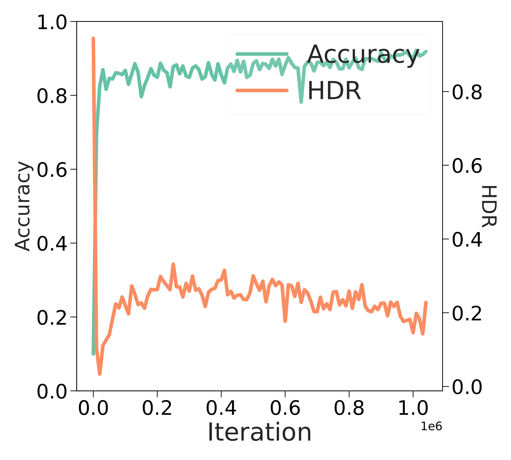
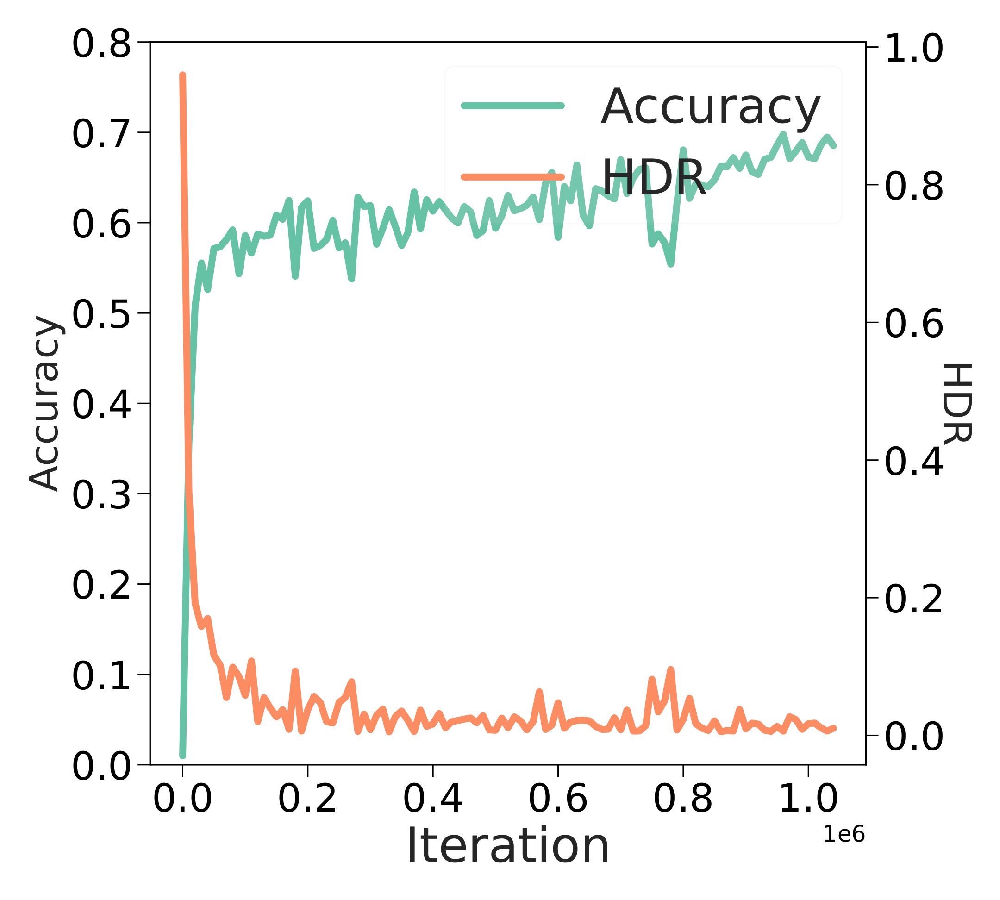
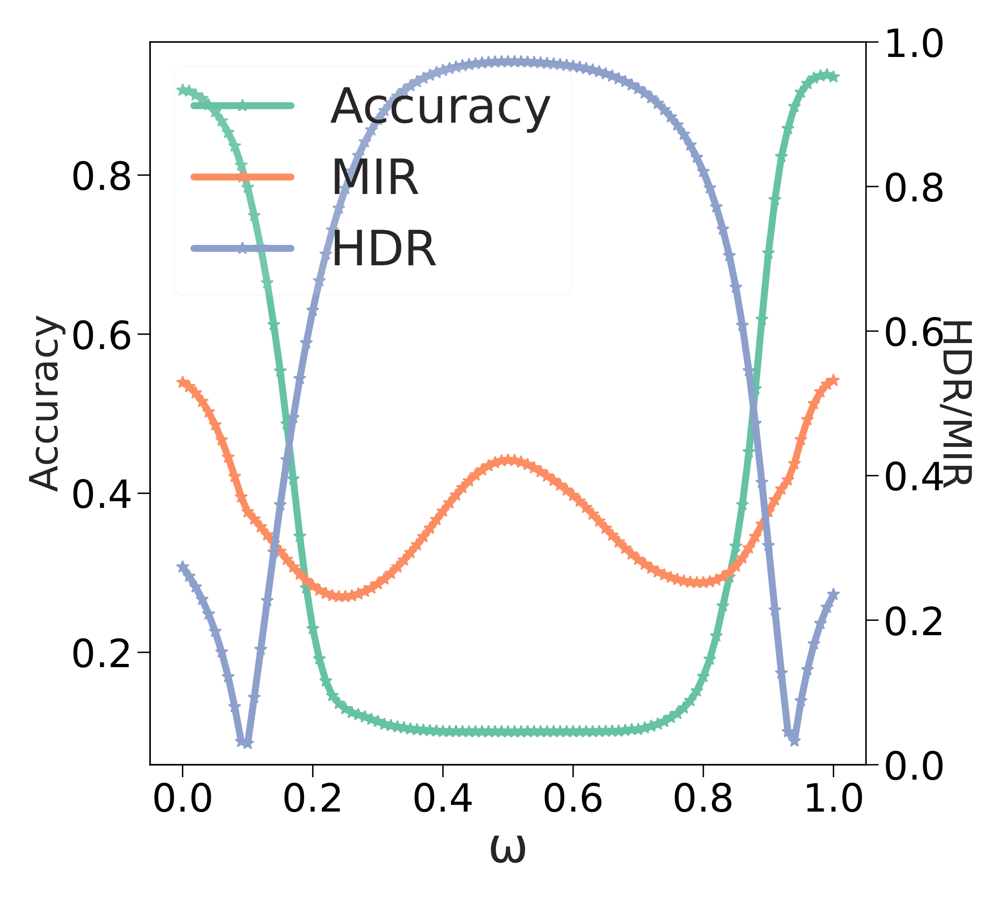
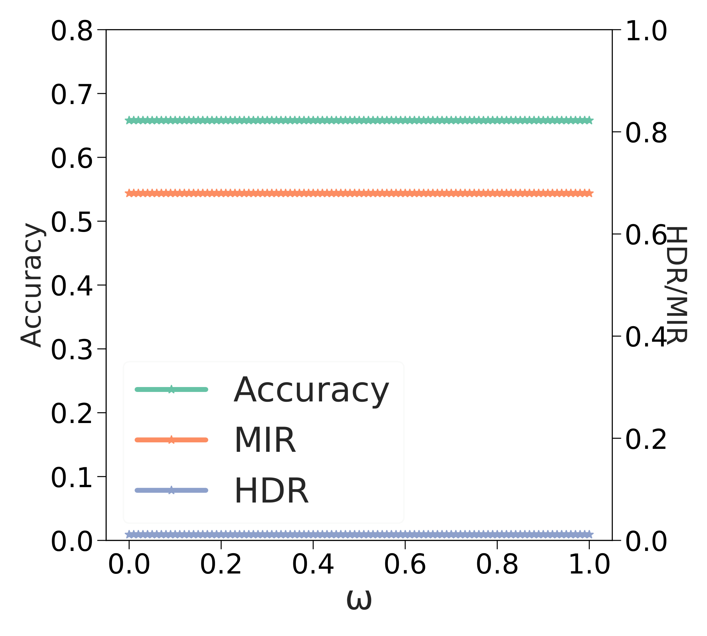
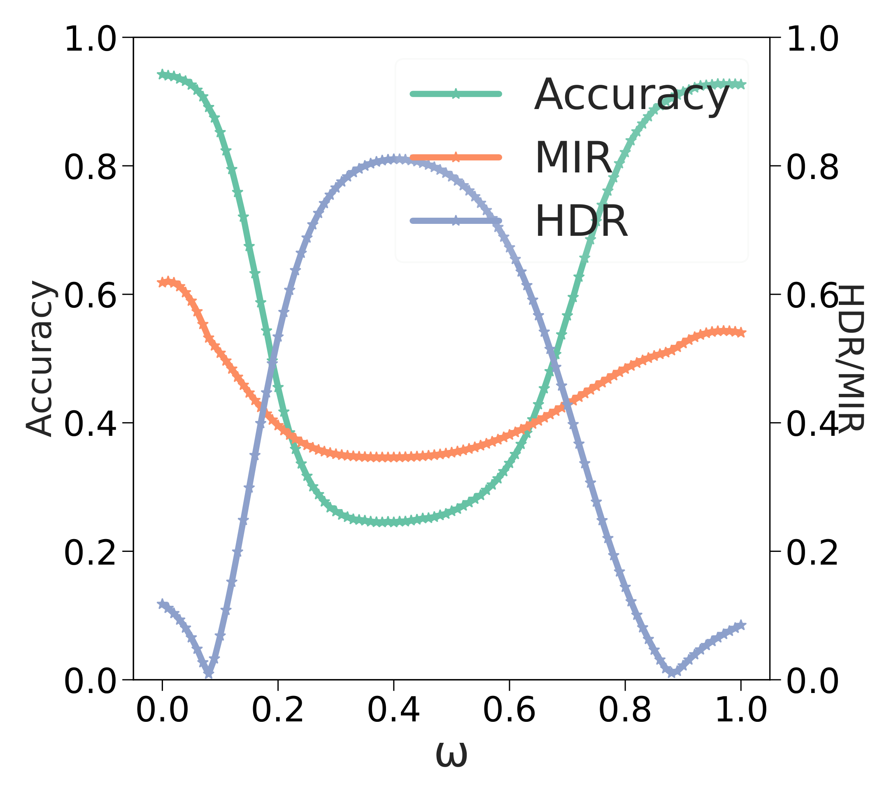
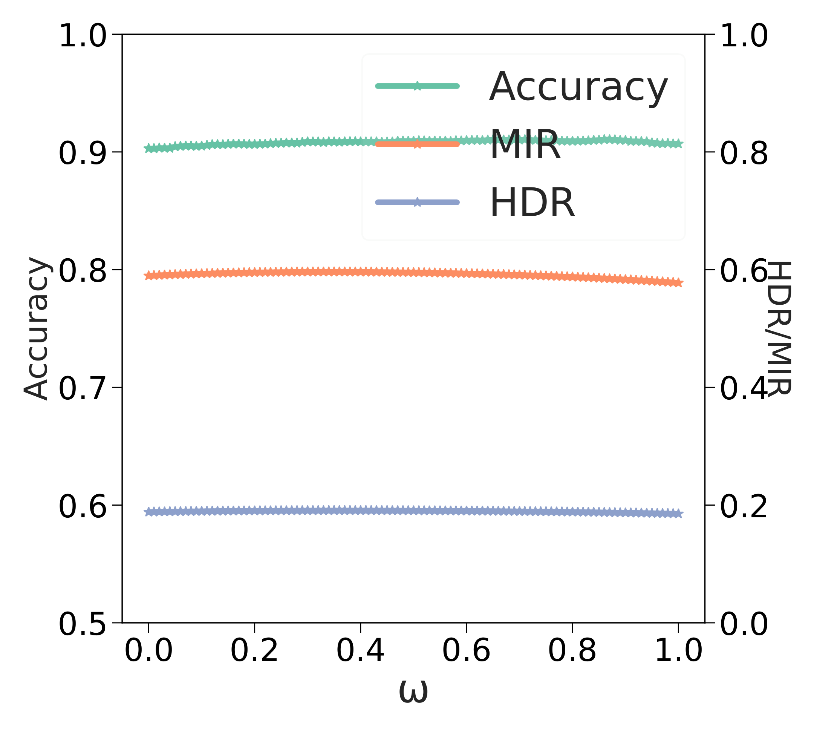
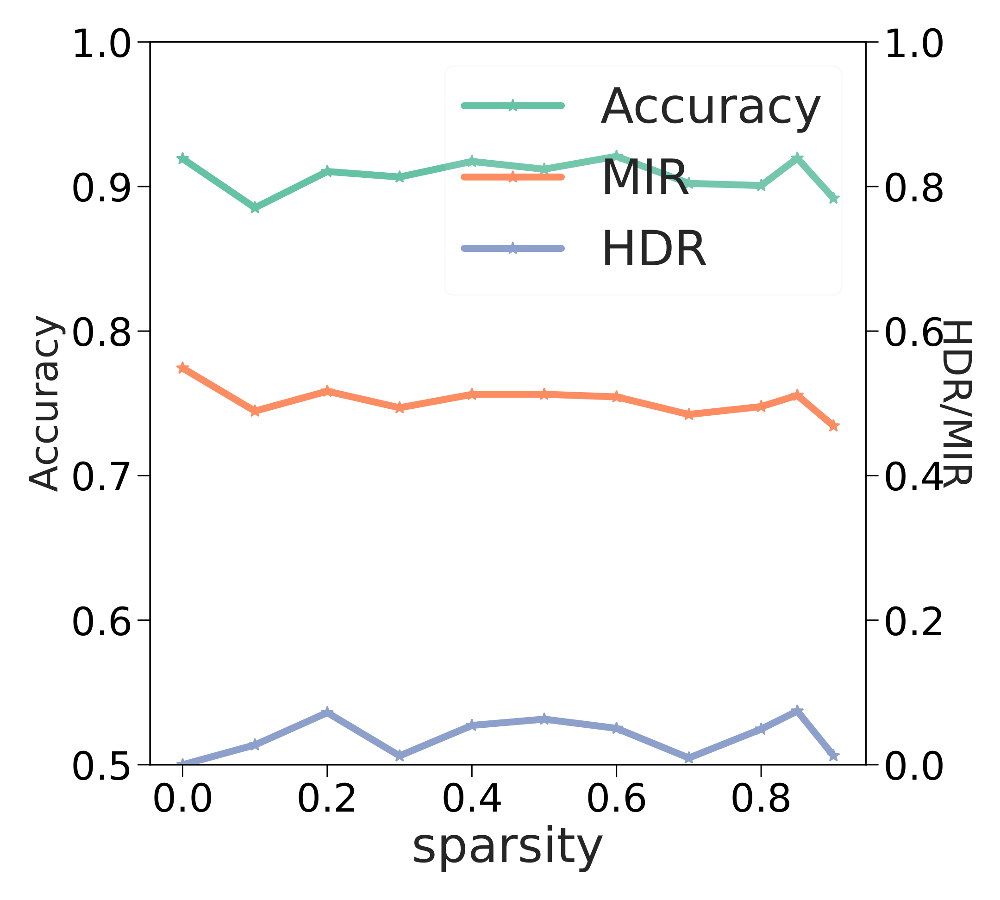
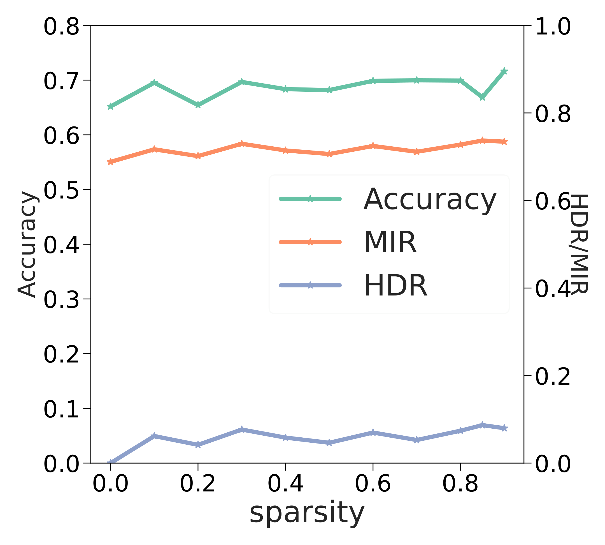

# Song et al. 2024 — Unveiling the Dynamics of Information Interplay in Supervised Learning

**An external work (demoted from the corpus, task-019).** The paper's subject is neural collapse; grokking is one subsection of five, with no theory. The card has been kept entire as an over-complete excerpt; the work takes no part in the corpus's indexes and counters. The convention is in `papers/README.md`, section "External works". The original is in [`original/`](https://arxiv.org/abs/2406.03999); the analysis of the claims is in the neighbouring `…claims.txt`.

See also: [the global concept index](../../concepts/index.md). arXiv [2406.03999v1](https://arxiv.org/abs/2406.03999), 6 June 2024. PDF running head: "Proceedings of the 41 st International Conference on Machine Learning, Vienna, Austria. PMLR 235, 2024".

**Kun Song** — University of Science and Technology Beijing (equal contribution). **Zhiquan Tan** — Department of Mathematical Sciences, Tsinghua University (equal contribution). **Bochao Zou** — University of Science and Technology Beijing. **Huimin Ma** — University of Science and Technology Beijing (correspondence). **Weiran Huang** — MIFA Lab, Qing Yuan Research Institute, SEIEE, Shanghai Jiao Tong University; Shanghai AI Laboratory (correspondence).

The files of this paper's analysis:

- [`2406.03999.unveiling-the-dynamics-of-information-interplay-in-supervised-learning.license.txt`](2406.03999.unveiling-the-dynamics-of-information-interplay-in-supervised-learning.license.txt) — the arXiv licence record for this paper.

The anchor scheme and the rules for linking into a card are in the [README of the papers folder](../README.md).

**Excerpt card.** The paper's licence (`arxiv-nonexclusive`) does not permit republishing the paper itself; what stands here are the editorial sections and the fragments the corpus quotes (right of quotation). The paper: <https://arxiv.org/abs/2406.03999>.

## Concepts covered

**[Neural collapse](../../concepts/neural-collapse.md)** — the work sets out an instrument rather than an explanation: it takes the three conditions of NC as given and computes what two matrix quantities between the Gram matrix of the representations and the Gram matrix of the rows of the classification head equal under them. Theorem 4.2 ([p. 3, para. 19](#p3-19)) gives $\operatorname{HDR}=0$ and $\operatorname{MIR}=\frac{1}{C-1}+\frac{(C-2)\log(C-2)}{(C-1)\log(C-1)}$, and the remark after corollary 4.3 ([p. 3, para. 22](#p3-22)) adds that this expression is $\approx 1$ — whence the whole paper's working expectation: over the course of the training MIR rises and HDR falls ([p. 1, para. 5](#p1-5)). Its value for the corpus is that both quantities are computed **between** the features and the head rather than within the features: NC3 (self-duality) receives a scalar observable. What the work does not contain: not a single direct measurement of the collapse itself — the conditions NC1–NC3 are nowhere checked, and the conclusion that "MIR and HDR describe the path to neural collapse" ([p. 4, para. 12](#p4-12)) is drawn from the shape of the curves; they never once reach the value MIR $\approx 1$ ([fig. 1](#fig-1)). There is no causality here either: the collapse is neither encouraged nor hindered, and there are no interventions.

**[Grokking](../../concepts/grokking.md)** — grokking occupies one subsection of five in the paper ([§5.5](#sec-5-5)), one figure of seven and not a line of theory. The contribution is an observation: both measures behave in two phases, at first as in ordinary training (MIR rising, HDR falling), and then they turn, and at the very era of generalisation give a sharp excursion ([p. 6, para. 4](#p6-4)). By [fig. 7](#fig-7) HDR jumps from about 0.08 to 0.49 exactly where the test accuracy goes up, while MIR collapses from a shelf of about 0.62 to the lowest value of the whole run, about 0.36 — lower than at the start of the training. This makes the transition visible from a side related neither to the accuracy nor to the weight norm. What the work does not contain: an explanation (the reading "the model is seeking new optimal points" the authors present as an argument), a prediction of the time of the transition, an intervention, seeds, spreads or controls — there is one run, one task, one modulus. It matters separately that the experiment's outcome diverges from the paper's own frame: a model that has reached 100 % on the test set has the lowest MIR and an HDR above its minimum, whereas theorem 4.2 promises the reverse; the divergence is not noted in the text — the analysis is below, in the section "Internal inconsistencies".

**[The memorisation phase / the plateau](../../concepts/memorization-phase.md)** — the work gives one incidental measurement of this phase that is absent from the original settings: while the test accuracy stands at zero, the information quantities do not stand still. By [fig. 7](#fig-7) the training accuracy reaches 100 % at around 150 epochs, whereas MIR goes on rising until about $10^{3}$ epochs and only then begins to fall slowly — that is, within the plateau there are two distinguishable parts, separated not by the accuracy but by the turn of a measure. The authors do not articulate this division: they say only that "in the early eras of the training the model rapidly fits the training data" and that MIR thereafter begins to fall ([p. 6, para. 4](#p6-4)). What the work does not contain: the moment of the turn is not measured by a number, not checked for reproducibility and not related to any known quantity of the plateau.

**[Progress measures](../../concepts/progress-measures.md)** — the notion is not used in the paper even once, although the experimental setting is taken from a work in which progress measures were built. This is worth recording outright, because citing works already credit MIR with the role of a progress measure — the formulations observed are analysed below, in the section "Erroneous retellings and citations of this paper". MIR is not a progress measure by construction: it is not monotone, at the era of the transition it falls rather than rises, and it is not compared with the restricted/excluded loss, with the fraction of energy in the key frequencies, or with the weight norm. The one place where the quantity might work as an early feature is the onset of the slow fall of MIR at around $10^{3}$ epochs, long before the rise of the test accuracy ([fig. 7](#fig-7)); the moment of departure is not measured in the paper. The section's own concluding formulation — that the information measures "are able to describe" the phenomenon and provide "a basis for further research" ([p. 6, para. 4](#p6-4)) — is exactly as strong as it is written, and cannot be read more strongly.

**[Phase transition](../../concepts/phase-transition.md)** — there is no language of phase transitions in the paper: the authors write of a "two-phase variation" of MIR and HDR ([p. 6, para. 4](#p6-4)) and stop there. No order parameter, no critical point, no exponents and no finite-size analysis is introduced here, and the excursion of HDR at the era of generalisation is not called an order parameter. For the corpus this is nonetheless a candidate observable: a quantity that jumps by an order of magnitude in a narrow window around the transition and settles after it — but an unchecked candidate, on a single run.

**[The canonical grokking proving ground](../../concepts/canonical-grokking-testbed.md)** — the setting is inherited at second hand, through Nanda et al. and Tan & Huang: a single-layer ReLU transformer, a token dimension of 128, four heads of 32, an MLP of width 512, an input "$a~b=$", full-batch descent, AdamW, a step of 0.001 ([p. 6, para. 3](#p6-3)). The work is thereby evidence of how transferable the proving ground had become by 2024: it is taken entire, with no justification and no analysis. What the work does not contain: a link to code, a number of runs, seeds, any control (other $p$, other operations, random labels, a different fraction of training pairs), or an answer to where exactly the representations are taken from — it says only "between the representation and the weight of the fully connected layer", with no indication of the token or the sample.

**[Modular arithmetic](../../concepts/modular-arithmetic.md)** — the task is taken in its most ordinary form: $c\equiv(a+b)\pmod{p}$ at $p$ equal to 113, with the inputs encoded as $p$-dimensional one-hot vectors ([p. 6, para. 3](#p6-3)). The work makes use of not a single feature of modular arithmetic: there is no Fourier structure, no circular representation and no analysis of attention heads here — the task serves only as a carrier of grokking on which two quantities are measured that are defined for any classification whatever. What the work does not contain: a carry-over to other operations and other moduli, and hence any grounds for taking the observed two-phase behaviour to be a property of the task rather than of a single run.

**[Structured representation learning](../../concepts/structured-representation-learning.md)** — the paper raises the question of the agreement of the sample's representations with the classification head and makes that agreement its sole object of measurement ([p. 4, para. 10](#p4-10)). This is a different cut from the one customary in the corpus: the structure of the representations is not described geometrically (no parallelograms, no circles, no clusters) but collapsed into two scalars taken from Gram matrices. Hence too the chief limitation, which the authors caveat themselves: the dataset entropy is replaced by a batch entropy for reasons of computational cost — and on CIFAR-100 the batch (64) is smaller than the number of classes (100), so the batch's Gram matrix cannot possibly carry the structure of all the heads.

**[Compression of the representation manifold](../../concepts/manifold-representation-compression.md)** — the work's second theoretical line relates the entropy difference to ranks: lemma 4.5 bounds the regression error by the tail of the singular values, theorem 4.6 bounds that bound above by $1-\frac{\text{rank}(\mathbf{Z}_ {2})}{\text{rank}(\mathbf{Z}_ {1})}$, and the passage from ranks to entropy rests on the approximation $\exp{(\operatorname{H}(\mathbf{G}(\mathbf{Z}))}$ $\approx$ $\text{rank}(\mathbf{Z})$, taken from Wei et al. 2024 and Zhang et al. 2023a ([p. 4, para. 9](#p4-9)). HDR thereby acquires the sense of a surrogate bound on the difference in expressiveness of two representations — a quantity of compression rather than of structure. What the work does not contain: an estimate of the error of this approximation; the ranks are not measured in the experiments even once, and the relation "entropy ↔ effective rank" remains borrowed rather than checked here.

**[The loss landscape / basins](../../concepts/loss-landscape-basins.md)** — linear mode connectivity is analysed as a separate topic ([p. 5, para. 1](#p5-1)): two copies from one initialisation, a different data order and augmentations, then a linear interpolation of the weights. On CIFAR-100 there is connectivity, and both measures barely change along the segment; on CIFAR-10 at a step of $3e^{-2}$ there is none — at an interpolation weight between 0.4 and 0.6 the accuracy falls to chance ([fig. 3](#fig-3)). The most valuable thing here is the divergence of the measures from the accuracy: in the middle of the dip MIR gives a hump, and at weights of about 0.1 and 0.93 HDR falls together with the accuracy, and the authors write outright that they find this hard to explain ([p. 5, para. 2](#p5-2)). What the work does not contain: a loss barrier as a number, an analysis of what exactly distinguishes the interpolated model, or any relation of this topic to grokking.

**[The learning rate](../../concepts/learning-rate.md)** — the only lever by which anything in the paper is switched on and off: mode connectivity on CIFAR-10 is absent at $3e^{-2}$ and is restored at $3e^{-4}$, and the oscillations of the accuracy, MIR and HDR damp down as the step is lowered ([p. 5, para. 3](#p5-3), [fig. 4](#fig-4)). The dependence of connectivity on the training settings is itself taken from Altıntaş et al. 2023; the work's contribution is the measurement of two quantities on top of the known. What the work does not contain: a sweep of the step in the grokking experiments — there it is fixed at 0.001 and is not varied.

**[The sparse subnetwork / the lottery ticket](../../concepts/sparse-subnetwork-lottery-ticket.md)** — pruning enters as a fourth topic: unstructured magnitude pruning with a subsequent fine-tuning of the remaining weights ([p. 6, para. 1](#p6-1)). It is shown that the features before and after pruning retain a high mutual MIR even at 90 % sparsity, and that the measures themselves and the accuracy change little ([p. 6, para. 2](#p6-2), [fig. 6](#fig-6)). An essential caveat absent from the text: here MIR is computed between two sets of features rather than between the features and the head — the meaning of the quantity changes silently between sections, and a "high" MIR in [fig. 6](#fig-6) is about 0.5 on the right-hand axis. What the work does not contain: the subnetwork itself — the masks are not analysed, the lottery-ticket hypothesis is not checked, and pruning is not related to grokking.

**[Real data and vision](../../concepts/vision-real-world-data-mnist-cifar.md)** — the paper's principal setting is entirely on CIFAR-10 (WideResNet-28-2) and CIFAR-100 (WideResNet-28-8): SGD with momentum 0.9 and weight decay $5e^{-4}$, an initial step of 0.03 with cosine decay, a batch of 64 and $2^{20}$ iterations ([p. 4, para. 11](#p4-11)). For the corpus it matters to record this negatively: the work neither observes nor seeks grokking on this data — four of the five topics run in the ordinary training regime, in which there is no delay, and grokking is carried off to a separate synthetic proving ground. This work cannot be counted as evidence of grokking on real data.

**[Weight decay / L2 regularisation](../../concepts/weight-decay.md)** — the quantity is present in both settings and is studied in neither: $5e^{-4}$ in the CIFAR experiments ([p. 4, para. 11](#p4-11)) and 1 in the grokking experiment ([p. 6, para. 3](#p6-3)). The second value is the very one at which grokking on this proving ground is usually obtained, and it is inherited together with the setting. What the work does not contain: a sweep of the weight decay, a separate run without it, or any attempt to relate the behaviour of MIR and HDR to the strength of the regularisation — even though the whole topic unfolds precisely at $\lambda=1$.

**[The optimiser](../../concepts/optimizer-adam-adamw-sgd.md)** — two coexist in the paper: SGD with momentum 0.9 in the CIFAR experiments ([p. 4, para. 11](#p4-11)) and AdamW in the grokking experiment ([p. 6, para. 3](#p6-3)). The change is not discussed and no consequences are drawn from it, but for the corpus this is a further entry into the observation that the two-phase picture of MIR and HDR is taken under AdamW at a weight decay of 1, while the "reference" of ordinary training with which it is compared is taken under SGD at $5e^{-4}$. What the work does not contain: a comparison of optimisers on one task, and hence any grounds for ascribing the difference between the two pictures to the phenomenon itself rather than to the settings.

**[The data fraction / the critical dataset size](../../concepts/data-fraction-critical-dataset-size.md)** — the fraction is fixed: 30 % of all possible inputs ($113\times 113$ pairs) in training, the remaining 70 % as test ([p. 6, para. 3](#p6-3)). The value is inherited together with the setting and is never varied, so the work gives no dependence of the delay or of the measures' behaviour on the volume of data. What the work does not contain: a second split, and hence any grounds for separating the spread over initialisations from the spread over samples — the run is single in any case.

---

## Points we could not reconcile

**Grokking is credited to different works in different places.** In the introduction the phenomenon is named in one row with neural collapse and linear mode connectivity and assigned to Power et al. 2022 ([p. 1, para. 3](#p1-3)); the survey says outright that it was they who discovered the passage from simple memorisation to inductive processing ([p. 2, para. 5](#p2-5)), with Nanda et al. 2022 standing beside them in a separate sentence as having found the relation of grokking on modular addition to trigonometric functions. In the grokking section itself ([p. 6, para. 3](#p6-3)), however, the phenomenon is called `"a phenomenon referred to as Grokking(Nanda et al. 2022)"`, that is, the source of the term is replaced by a work that analyses it. The error is a narrow one, but it stands in the only section for whose sake the corpus cites the work.

**The outcome of the grokking experiment diverges from the paper's own frame.** The whole setting rests on an expectation derived from theorem 4.2 and the remark after corollary 4.3: in a well-trained model MIR should be at its greatest value and HDR at zero ([p. 3, para. 22](#p3-22)), and it is precisely this expectation that the introduction declares to be the working one ([p. 1, para. 5](#p1-5)). In the grokking experiment the model reaches 100 % on the test set — and turns out to have the lowest MIR of the whole run and an HDR settled above its minimum ([p. 6, para. 4](#p6-4), [fig. 7](#fig-7)). The authors describe this as it stands (`"MIR reaches its lowest, and HDR rapidly declines from its highest point"`) but neither note nor explain the divergence from the theorem. For a citing author this is the key place: one and the same pair of quantities is declared both a feature of motion towards collapse and a feature of generalisation, and in the experiment these two readings point in opposite directions.

**The appendices are renumbered, but the references inside them are not.** Appendices A and B repeat the paragraphs of sections 4.1 and 4.2 word for word and introduce numbers of their own for the statements (Theorem A.1, Corollary A.2, Lemma B.1, Lemma B.2, Theorem B.3), but the text inside the appendices goes on referring to the numbers of the main text: "theorem 4.3" ([p. 11, para. 5](#p11-5)), "lemma 4.4" ([p. 12, para. 1](#p12-1)), "lemma 4.5" and "theorem 4.6" ([p. 12, para. 5](#p12-5)). In addition, in the main text itself the corollary is called Corollary 4.3, while the reference to it in the remark and in the appendix is given as "theorem 4.3".

**Corollary A.2 is stated about some matrices and proved about others.** The statement speaks of $\operatorname{HDR}(\mathbf{Z}_ {1},\mathbf{Z}_ {2})$ and $\operatorname{MIR}(\mathbf{Z}_ {1},\mathbf{Z}_ {2})$, where $\mathbf{Z}_ {1}$ is the sample's representations and $\mathbf{Z}_ {2}$ the corresponding rows of the head ([p. 11, para. 6](#p11-6)); the computation, however, is conducted about $\mathbf{G}(\mathbf{W}^{T})$ and $\mathbf{G}(\mathbf{M})$ ([p. 11, para. 9](#p11-9)) — the same matrices as in theorem 4.2, only multiplied by a Kronecker product with a matrix of ones. The statement is correct, but it is written about objects other than those about which the proof is conducted.

**One thing is measured and another optimised.** The whole analysis is conducted in the normalised MIR and HDR, while the loss has the unnormalised $\text{MI}\left(\mathbf{G}(f),\mathbf{G}(V)\right)$ and $\left|\text{H}(\mathbf{G}(f))-\text{H}(\mathbf{G}(V))\right|$ added to it; the relation between what describes the dynamics and what is optimised is nowhere articulated.

## What is measured, what is shown and what is conjectured

**Measured.** Two quantities taken from Gram matrices over a batch, along the training on CIFAR-10 and CIFAR-100 ([fig. 1](#fig-1), [fig. 2](#fig-2)); the same quantities along the interpolation segment of two copies of the model at three learning rates ([fig. 3](#fig-3), [fig. 4](#fig-4)); the same at different levels of label smoothing ([fig. 5](#fig-5)) and different sparsities ([fig. 6](#fig-6)); the same along a single grokking run ([fig. 7](#fig-7)). Plus two applied comparisons: semi-supervised learning (table 1) and supervised learning (table 2).

**Shown.** That MIR runs almost level with the accuracy and HDR against it in ordinary training, and that on CIFAR-100 HDR approaches its theoretical zero. That in the absence of mode connectivity both measures behave unlike the accuracy. That at sparsities up to 90 % the features before and after pruning remain mutually consistent. That under grokking both measures are two-phase and give an excursion at the era of generalisation. The authors' hedges stand in these places and are carried over as they are: "in most cases", "in most instances".

**Conjectured.** The reading of the turn — `"indicating the model is seeking new optimal points"` — is measured by nothing; this is an argument rather than a result. Equally unmeasured is the explanation of the failure of connectivity on CIFAR-10 by too large a step: the authors write outright `"we posit"`.

**What the evidence does not sustain.** The conclusion that "MIR and HDR describe the path to neural collapse" ([p. 4, para. 12](#p4-12)) is drawn with not a single measurement of the collapse; the curves do not approach the theoretical value — in [fig. 1](#fig-1) MIR on CIFAR-10 reaches about 0.55 against a theoretical $\approx 0.996$ for ten classes. About label smoothing the conclusion is drawn that the measures "effectively describe" the technique — from the fact that the measures do not change where the accuracy does not change ([fig. 5](#fig-5)); this is an absence of signal, not a signal. In the pruning section the quantity "a high MIR" is about 0.5 on the right-hand axis of [fig. 6](#fig-6), and it is computed between two sets of features rather than between the features and the head.

**The volume of evidence.** For the CIFAR experiments the number of runs is stated vaguely — `"We report the performance metrics over several runs of seeds"` — and spreads are given only in table 1; in table 2 there are none. For grokking the number of runs is not stated at all, and by [fig. 7](#fig-7) there is one. There is no link to code in the paper.

## Common misreadings and overstatements of this paper

Below are the patterns observed in the citing works of the corpus. Each entry says what exactly is distorted and leads to the authors' paragraphs where the lost caveat stands. The analysis of the particular formulations belongs in the "Erroneous citations" sections of the citing cards; at the time this card was assembled no such sections exist as yet, so no "details" links are given here.

**"MIR is a progress measure separating generalisation from memorisation" (erroneous).** The work is placed in a list of quantities by which the approach of generalisation is tracked, on a par with the weight norm, sparsity, the Fourier gap and neuron activity: in 2506.05718 it stands in a list of "progressions measures for generalization" as `"mutual information ratio of neural representation (Song et al., 2024)"`. Not one part of this follows from the paper. The term "progress measure" does not appear in it; the quantity is not monotone; at the era of generalisation MIR does not rise but falls to the lowest value of the run ([p. 6, para. 4](#p6-4), [fig. 7](#fig-7)); no threshold by which the transition might be predicted is constructed; and MIR is not compared with the known progress measures on the same task. The authors' own concluding formulation is an order of magnitude weaker: the information measures "are able to describe" the phenomenon and provide "a basis for further research".

**"MIR/HDR give a unified view of grokking" (widening, unchecked).** In 2504.03162 the work is named in a row of methods aiming to give a more unified point of view: `"Recently, some methods have aimed to provide a more unified perspective (Yunis et al., 2024; Song et al., 2024)."` The formulation is itself cautious ("aimed to"), but it carries over to the paper a design absent from its grokking section: the unified frame in it is built around neural collapse and ordinary training, while grokking stands as a fifth topic beside label smoothing and pruning ([p. 1, para. 2](#p1-2)) and does not return to the theory — the theoretical part does not touch it at all. Moreover, the sole attempt to apply the frame to grokking yields a result opposite to the frame's expectation (see "Inconsistencies").

**"The information measures explain the dynamics of grokking" (widening).** The formulation comes from the paper's own abstract and conclusion: there it is said that MIR and HDR are applied in order to "gain insight into the dynamics of grokking" ([p. 1, para. 2](#p1-2)), and in the conclusion grokking is named as an example of the phenomena in whose elucidation the measures showed their effectiveness ([p. 8, para. 4](#p8-4)). This cannot be read as an explanation: what is shown is the behaviour of two curves on one run of one task, no mechanism behind them is proposed, and there are no interventions. A separate danger is a second version of the same work: 2409.16767 (the same authors, an extended variant) describes the same experiment, and in the corpus these two entries cannot be counted as independent confirmations.

---

# Quoted fragments

Only the fragments the corpus cards refer to are
reproduced here (right of quotation); the paper's licence does not permit
republishing the whole text. Anchor numbering matches the original.

###### p1-2

In this paper, we use matrix information theory as an analytical tool to analyze the dynamics of the information interplay between data representations and classification head vectors in the supervised learning process. Specifically, inspired by the theory of Neural Collapse, we introduce matrix mutual information ratio (MIR) and matrix entropy difference ratio (HDR) to assess the interactions of data representation and class classification heads in supervised learning, and we determine the theoretical optimal values for MIR and HDR when Neural Collapse happens. Our experiments show that MIR and HDR can effectively explain many phenomena occurring in neural networks, for example, the standard supervised training dynamics, linear mode connectivity, and the performance of label smoothing and pruning. Additionally, we use MIR and HDR to gain insights into the dynamics of grokking, which is an intriguing phenomenon observed in supervised training, where the model demonstrates generalization capabilities long after it has learned to fit the training data. Furthermore, we introduce MIR and HDR as loss terms in supervised and semi-supervised learning to optimize the information interactions among samples and classification heads. The empirical results provide evidence of the method’s effectiveness, demonstrating that the utilization of MIR and HDR not only aids in comprehending the dynamics throughout the training process but can also enhances the training procedure itself.

###### p1-3

Supervised learning is a significant part of machine learning, tracing its development back to the early days of artificial intelligence. Leveraging ample annotated data from large-scale datasets like ImageNet (Krizhevsky et al. 2012) and COCO (Lin et al. 2014), supervised learning has achieved outstanding performance in tasks such as image recognition (He et al. 2016; Girshick 2015; Ronneberger et al. 2015), speech recognition (Hinton et al. 2012; Chan et al. 2016), and natural language processing (Vaswani et al. 2017), thereby advancing the development of artificial intelligence. Concurrently, with its enhanced performance in real-world applications, some interesting phenomena in supervised learning, such as Neural Collapse (Papyan et al. 2020), linear mode connectivity (Frankle et al. 2020), and grokking (Power et al. 2022) have emerged. More and more work is beginning to explore the reasons behind these phenomena.

Neural Collapse (Papyan et al. 2020) is an interesting phenomenon observed during the training process of supervised learning. In different stages of network training, features of samples within the same class become more similar in the feature space, meaning that intra-class differences decrease. At the same time, feature vectors of different classes become more distinct in feature space, leading to more significant inter-class differences. In supervised learning classification tasks, after prolonged training, a special alignment occurs, this alignment is formed between the weights of the network’s final fully connected layer and the feature vectors of the classes. This indicates that for each class, the centroid of its feature vector almost coincides with the weight vector of its corresponding classifier (classification head vector).

###### p1-5

Existing work on the theory of Neural Collapse primarily solely focuses on feature or classification head similarity, with few studies exploring the information between features and class classification heads. We introduce matrix information theory as an analytical tool, using similarity matrices constructed from sample features and class classification heads to analyze the information dynamics along the training process. According to Neural Collapse, for a well-trained model at its terminal phase, sample features and the corresponding class classification heads align well. Thus, at the stage of Neural Collapse, the similarity matrix of sample **[p. 2]** features aligns with the similarity matrix constructed by the corresponding class classification heads. Therefore, we first theoretically calculate their matrix mutual information ratio and the matrix entropy difference ratio at the point of Neural Collapse. We find that at the point of Neural Collapse, the theoretical MIR is nearing its maximum, and the HDR reaches its theoretical minimum. Therefore, we expect an increase in MIR and a decrease in HDR during the training process. Experiments demonstrate that MIR and HDR effectively describe such phenomena during training. Motivated by the success of understanding dynamics in standard training, we also explore their uses in other settings like linear mode connectivity, label smoothing, pruning, and grokking. Compared to accuracy, MIR and HDR not only can describe the above phenomena but also possess unique analytical significance. We also explore integrating information constraints on model performance, by adding MIR and HDR as a loss term in supervised and semi-supervised learning. Experiments show that adding additional information constraints during training effectively enhances model performance, especially in semi-supervised learning with limited labeled samples, where information constraints help the model better learn information from unlabeled samples.

Our contributions are as follows:

1. Motivated by Neural Collapse and matrix information theory, we introduce two new metrics: Matrix Mutual Information Ratio (MIR) and Matrix Entropy Difference Ratio (HDR), for which we also deduce their theoretical values when Neural Collapse happens.

2. Through rigorous experiments, we find that MIR and HDR are capable of explaining various phenomena, such as the standard training of supervised learning, linear mode connectivity, pruning, label smoothing, and grokking.

3. We integrate matrix mutual information and information entropy differences as a loss term in both supervised and semi-supervised learning. Experiments demonstrate that these information metrics can effectively improve model performance.

###### p2-5

Recent research has revealed several interesting phenomena that are significant for understanding the behavior and learning dynamics of neural networks. Firstly, Papyan et al. 2020 observe that in the final stages of deep neural network training, the feature vectors of the last layer tend to converge to their class centroids, and these class centroids align with the weights of the corresponding class in the final fully connected layer. This phenomenon is known as **Neural Collapse**. Neural Collapse occurs in both MSE loss and cross-entropy loss (Han et al. 2021; Zhou et al. 2022). Secondly, Frankle et al. 2020 find that models trained from the same starting point, even when changing the input data sequence and data augmentation, eventually converge to the same local area. This phenomenon is termed **Linear Mode Connectivity**, which is influenced by architecture, training strategy, and dataset (Altıntaş et al. 2023). Lastly, Power et al. 2022 discover that after prolonged training, models can transition from simply memorizing data to inductively processing it. This phenomenon is known as the **Grokking**. Nanda et al. 2022 finds the connections of grokking on the modulo addition task with trigonometric functions.

###### p3-19

*Suppose Neural collapse happens. Then $\operatorname{HDR}(\mathbf{G}(\mathbf{W}^{T}),\mathbf{G}(\mathbf{M}))=0$ and $\operatorname{MIR}(\mathbf{G}(\mathbf{W}^{T}),\mathbf{G}(\mathbf{M}))=\frac{1}{C-1}+\frac{(C-2)\log(C-2)}{(C-1)\log(C-1)}$.*

The proof can be seen in Appendix A.1. As the linear weight matrix $\mathbf{W}$ can be seen as (prototype) embedding for each class. It is natural to consider the mutual information and entropy difference between sample embedding and label embedding. We discuss this in the following Corollary 4.3.

###### p11-6

*Suppose the dataset is class-balanced, $\mu_{G}=0$ and Neural collapse happens. Denote $\mathbf{Z}_{1}=[h(\mathbf{x}_{1})\cdots h(\mathbf{x}_{n})]\in\mathbb{R}^{d\times n}$ and $\mathbf{Z}_{2}=[w_{y_{1}}\cdots w_{y_{n}}]\in\mathbb{R}^{d\times n}$. Then $\operatorname{HDR}(\mathbf{Z}_{1},\mathbf{Z}_{2})=0$ and $\operatorname{MIR}(\mathbf{Z}_{1},\mathbf{Z}_{2})=\frac{1}{C-1}+\frac{(C-2)\log(C-2)}{(C-1)\log(C-1)}$.*

###### p3-22

**Remark:** Note $\frac{1}{C-1}+\frac{(C-2)\log(C-2)}{(C-1)\log(C-1)}\approx\frac{1}{C-1}+\frac{(C-2)\log(C-1)}{(C-1)\log(C-1)}=1$ and MIR, HDR $\in[0,1]$. These facts make quantities obtained by Theorem 4.2 and 4.3 very interesting, as HDR reaches the minimum possible value and MIR approximately reaches the highest possible value.

**[p. 4]**

###### p4-9

The proof can be found in Appendix B.3. From (Wei et al. 2024; Zhang et al. 2023a), $\exp{(\operatorname{H}(\mathbf{G}(\mathbf{Z}))}$ is a good approximate of $\text{rank}(\mathbf{Z})$. Then we can see that $\frac{\text{rank}(\mathbf{Z}_{2})}{\text{rank}(\mathbf{Z}_{1})}\approx\exp{(\operatorname{H}(\mathbf{G}(\mathbf{Z}_{2}))-\operatorname{H}(\mathbf{G}(\mathbf{Z}_{1})))}$, making the difference of entropy a good surrogate bound for approximation error.

###### p4-10

Inspired by matrix information theory and Neural Collapse theory, we focus more on the consistency between sample representations and class classification heads. We determine the relationships among samples by constructing a similarity matrix of the representations of dataset samples. According to NC1 and NC3, the similarity matrix between samples approximates the similarity matrix of the corresponding class centers, which is also the similarity matrix of the corresponding weights in the fully connected layer. Therefore, under Neural Collapse, the similarity relationship among samples is equivalent to the similarity relationship of the corresponding category weights in the fully connected layer. Our analysis, grounded in matrix information theory, primarily concentrates on the relationship between the representations of samples and the weights in the fully connected layer. Due to constraints in computational resources, we approximate the dataset’s matrix entropy using batch matrix entropy.

###### p4-11

Our models are trained on CIFAR-10 and CIFAR-100. The default experimental configuration comprise training the models with an SGD optimizer (momentum of 0.9, weight decay of $5e^{-4}$), an initial learning rate of 0.03 with cosine annealing, a batch size of 64, and a total of $2^{20}$ training iterations. The backbone architecture is WideResNet-28-2 for CIFAR-10 and WideResNet-28-8 for CIFAR-100.

###### fig-1

*Figure 1: Accuracy and MIR on the test set during training.* **[p. 4]**

###### p4-12

According to Neural Collapse, during the terminal stages of training, sample features align with the weights of the fully connected layer. Theorem 4.2 indicates that during the training process, MIR increases to its theoretical upper limit, while HDR decreases to 0. We plot the model’s accuracy on the test set during the training process, as well as the MIR and the HDR between data representations and the corresponding classification heads. As shown in Figure 1, on CIFAR-10 and CIFAR-100, the accuracy and MIR exhibit almost identical trends of variations. In most cases, both accuracy and MIR increase or decrease simultaneously, and MIR consistently shows an upward trend, having its trajectory toward its theoretical maximum value. As shown in Figure 2, during the training process, in most instances, accuracy and HDR show opposite trends, with HDR continually decreasing and even nearing its theoretical minimum **[p. 5]** value of 0 on CIFAR-100. In summary, MIR and HDR effectively describe the process of training towards Neural Collapse.

*(a) CIFAR-10*

*(b) CIFAR-100*

###### fig-2

*Figure 2: Accuracy and HDR on the test set during training.* **[p. 5]**

*(a) CIFAR-10*

*(b) CIFAR-100*

###### fig-3

*Figure 3: Accuracy, MIR, and HDR of models interpolated with different weights on the test set.* **[p. 5]**

*(a) lr: $3e^{-2}$*

*(b) lr: $3e^{-3}$*

*(c) lr: $3e^{-4}$*

###### fig-4

*Figure 4: Accuracy, MIR, and HDR of models interpolated with different weights on CIFAR-10 test set.* **[p. 5]**

###### p5-1

Linear mode connectivity (Frankle et al. 2020) suggests that under specific datasets and experimental setups, models initialized with the same random parameters will be optimized near the same local optimal basin, even if the order of training data and data augmentation differs. We investigate the behaviors of MIR and HDR under the setting of linear mode connectivity. We initialize models with the same random parameters and train them using different data sequences and random augmentations. Subsequently, we linearly interpolate these two checkpoints and obtain a new model $h=(1-\omega)\cdot h_{1}+\omega\cdot h_{2}$, where $h_{1}$ and $h_{2}$ are the two ckeckpoints and $\omega$ is the interpolation weight. Then we test these models on a test set for accuracy, MIR, and HDR.

###### p5-2

We conduct experiments on CIFAR-10 and CIFAR-100. As shown in Figure 3(a) and 3(b). On CIFAR-100, the performance of models obtained along the interpolation line is close, aligning with the linear mode connectivity. At this point, MIR and HDR remain almost unchanged. However, on CIFAR-10, the models do not exhibit linear mode connectivity. When the value of interpolation weight is between 0.4 and 0.6, the performance of the interpolated models even drop to that of random guessing. Surprisingly, at this time, MIR shows an additional upward trend. Moreover, when the value of interpolation weight is close to 0 and 1, despite a slight decrease in performance, HDR also decreases. Although we find it difficult to explain this anomaly, it does demonstrate that HDR and MIR have distinctive attributes compared to the accuracy metric, presenting an intriguing avenue for further exploration.

###### p5-3

Altıntaş et al. 2023 point that linear mode connectivity is related to the experimental configuration. Therefore, we posit that the performance decline of the interpolated model on CIFAR-10 is associated with an excessively high learning rate. In the training phase, models navigate the loss landscapes in search of minimal values, and two models with linear mode connectivity are optimized near the same local optimum. When the learning rate is too high, different training sample ordering and data augmentations lead to directing model optimization towards distinct regions within the loss landscapes. We experiment with different learning rates on CIFAR-10 and test their linear mode connectivity. It is observed that as the learning rate decreased, fluctuations in accuracy, MIR, and HDR also reduced. When the learning rate is lowered to $3e^{-4}$, the model demonstrate linear mode connectivity on CIFAR-10. This suggests that HDR and MIR are also effective in describing linear mode connectivity when it exists.

###### fig-5

*Figure 5: Accuracy, MIR, and HDR under different smoothness levels.* **[p. 6]**

Label smoothing (Szegedy et al. 2016) is a widely used technique in deep learning. It improves the generalization of the model by setting smoothness of labels. $y^{\prime}=(1-\epsilon)\cdot y+\frac{\epsilon}{C}$, where $\epsilon$ is the smoothness and $y$ is the one-hot label. We train models with various smoothness levels to explore their impact on accuracy, HDR, and MIR. As shown in Figure 5, the variation in accuracy, MIR, and HDR are minimal, indicating that HDR and MIR can effectively describe the performance of label smoothing technique.

*(a) CIFAR-10*

*(b) CIFAR-100*

###### fig-6

*Figure 6: Accuracy, MIR, and HDR of the features extracted by the model before and after pruning.* **[p. 6]**

**[p. 6]**

###### p6-1

We would like to use MIR and HDR to understand why the pruning technique is effective in maintaining relatively high accuracy. We apply standard unstructured pruning to models: for a well-trained model, we determine the number of parameters to prune, denoted as $k$. The model’s parameters are sorted in descending order based on their absolute values, and the smallest $k$ parameters are removed. Subsequently, the remaining parameters are fine-tuned again on the dataset (Han et al. 2015).

###### fig-7

*Figure 7: Accuracy, MIR, and HDR during Grokking.* **[p. 6]**

###### p6-2

We prune the model under various sparsity levels and extract features using the model before and after pruning. We calculate the MIR and HDR of the features extracted by the model before and after pruning. As shown in Figure 6, even when the model sparsity is 90%, the features extracted by the pruned model maintain a high MIR with those extracted before pruning. At various sparsity ratio, the variations in MIR and HDR for models after pruning are little compared to these before pruning, the performance differences of the models before and after pruning are also not significant. This indicates that fine-tuning the pruned subnetwork can restore adequate information extraction capabilities.

###### sec-5-5

### 5.5 Information interplay in grokking

###### p6-3

In supervised learning, training models on certain datasets can result in an anomalous situation. Initially, models quickly learn the patterns of the training set, but at this point, their performance on the test set is very poor. As training continues, the models learn representations that can generalize to the test set, a phenomenon referred to as Grokking(Nanda et al. 2022). We aim to explore the information interplay in Grokking. Following Nanda et al. 2022; Tan & Huang 2023, we train a transformer to learn modular addition $c\equiv(a+b)\pmod{p}$, with $p$ being 113. The model input is “$a~b=$”, where $a$ and $b$ are encoded into $p$-dimensional one-hot vectors, and “$=$” is used to signify the output value $c$. Our model employ a single-layer ReLU transformer with a token encoding dimension of 128 to learn positional encodings, four attention heads each of dimension 32, and an MLP with a hidden layer of dimension 512. We train the model using full-batch gradient descent, a learning rate of 0.001, and an AdamW optimizer with a weight decay parameter of 1. We use 30% of all possible inputs ($113\times 113$ pairs) for training data and test performance on the remaining 70%.

###### p6-4

As shown in Figure 7, we plot the accuracy of both the training and test sets during the grokking process, as well as the variation in MIR and HDR between the representation and the fully connected layer. It can be observed that, in the early stages of training, the model quickly fits the training data and achieves 100% accuracy on the training set. However, at this point, the performance on the test set is nearly equivalent to that of random guessing. As training continues, the model gradually shows generalization capability on the test set, ultimately achieving 100% accuracy, which is a hallmark of grokking. Figure 7 also reveals a clear two-phase variation in both MIR and HDR between data representation and the weight of fully connected layer. Initially, similar to fully supervised learning, MIR increases, while HDR decreases. However, as training proceeds, MIR begins to decrease, and HDR starts to increase, indicating the model is seeking new optimal points. After the model achieves the grokking, MIR reaches its lowest, and HDR rapidly declines from its highest point. The experiments demonstrate that HDR and MIR exhibit distinct phenomena in two stages, suggesting that information metrics can **[p. 7]** describe the grokking phenomenon, providing a basis for further research.

###### p8-4

Through a series of rigorous theoretical and empirical analyses, we demonstrate the effectiveness of MIR and HDR in elucidating various neural network phenomena, such as **[p. 9]** grokking, and their utility in improving training dynamics. The incorporation of these metrics as loss functions in supervised and semi-supervised learning shows promising results, indicating their potential to enhance model performance and training efficiency. This study not only contributes to the field of machine learning by offering new analytical tools but also applies matrix information to optimize supervised learning algorithms.

###### p11-5

As the linear weight matrix $\mathbf{W}$ can be seen as (prototype) embedding for each class. It is natural to consider the mutual information and entropy difference between sample embedding and label embedding. We discuss this in the following theorem 4.3.

###### p11-9

From (NC 1), we know that $\mathbf{G}(\mathbf{W}^{T})=\mathbf{G}(\mathbf{M})=\mathcal{E}(\frac{-1}{C-1})\otimes\mathbf{1}_{n_{1},n_{1}}$ and $\mathbf{G}(\mathbf{W}^{T})\odot\mathbf{G}(\mathbf{M})=\mathcal{E}(\frac{1}{(C-1)^{2}})\otimes\mathbf{1}_{n_{1},n_{1}}$, where $\otimes$ is the Kronecker product. By the property of the Kronecker product spectrum, the non-zero spectrum of $\mathbf{G}(\mathbf{W}^{T})$ will be $n_{1}$ times the spectrum of $\mathcal{E}(\frac{-1}{C-1})$. Then this corollary follows by the same proof of the theorem 4.2. ∎

###### p12-1

From lemma 4.4, we know that the regression error of $\mathbf{Z}_{1}$ to $\mathbf{Z}_{2}$ is crucial for understanding the differences of representations. We further bound the regression error with rank and singular values in the following lemma 4.5.

###### p12-5

The bound given by lemma 4.5 is not that straightforward to understand. Assuming the features are normalized, we successfully derived the connection of regression error and ratio of ranks in theorem 4.6.
