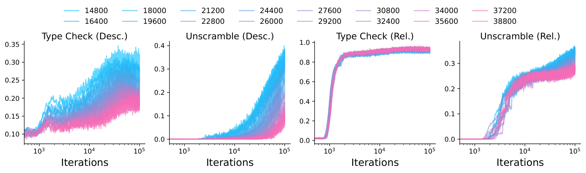
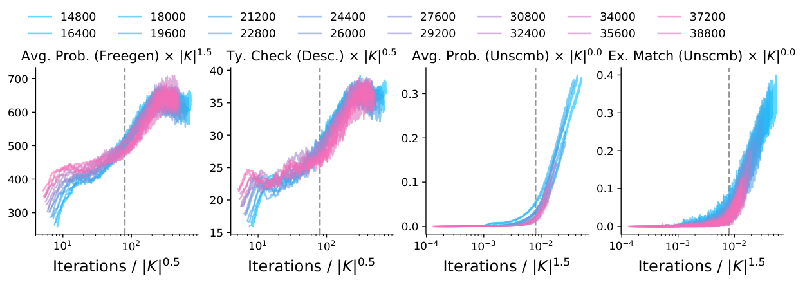

# Lubana et al. 2024 — A Percolation Model of Emergence: Analyzing Transformers Trained on a Formal Language

**An external work; the abstract, the introduction and the quoted paragraphs are given.** The subject of the paper is the emergence of capabilities under the scaling of data, not grokking: grokking gets one paragraph of demarcation in section 2 and a line in the bibliography. The work was entered among the external ones by the owner's decision of 2026-09-04 for the sake of two observations: a "memorisation → generalisation" transition in a setting where there is no training set as such (the data are sampled afresh at every step), and the authors' argument that explanations of grokking which lean on a phase of complete memorisation of the training data do not apply to such a setting. The work is entered in the "External works" groups of six concept cards (the memorisation phase, grokking, emergence, phase transition, order parameter, data fraction and critical dataset size) with the ↗ mark on mentions in the running text; external works take no part in the indexes and counters of the corpus. The convention is in `papers/README.md`, the section "External works".

See also: [the global concept index](../../concepts/index.md).

**Ekdeep Singh Lubana** — CBS-NTT Program in Physics of Intelligence, Harvard University; EECS Department, University of Michigan, Ann Arbor (equal contribution).
**Kyogo Kawaguchi** — RIKEN Cluster for Pioneering Research; Institute for Physics of Intelligence, Department of Physics, The University of Tokyo.
**Robert P. Dick** — EECS Department, University of Michigan, Ann Arbor.
**Hidenori Tanaka** — CBS-NTT Program in Physics of Intelligence, Harvard University; Physics & Informatics Laboratories, NTT Research, Inc., Sunnyvale, CA; Nonequilibrium Physics of Living Matter RIKEN Hakubi Research Team, RIKEN Center for Biosystems Dynamics Research.

arXiv [2408.12578v2](https://arxiv.org/abs/2408.12578), 22 August 2024 (v2 — 7 September 2024), 58 pages, 63 figures. The "Comments" field of the arXiv page: "Preprint". The same work lives on OpenReview under a different title — "The Concept Percolation Hypothesis: Analyzing the Emergence of Capabilities in Neural Networks Trained on Formal Grammars" (kiNU4jwUoW); it is under that title that Semantic Scholar counts it among the works citing Power et al., with no arXiv id, which is why task-008 never saw it. There is no citation number in the corpus table — external works do not enter it.

The licence is `arxiv-nonexclusive` (the publication of excerpts is limited), so the folder has two cards: the working full one and the generated publishable excerpt.

**On the pagination.** Pages 55–57 of the PDF hold nothing but figures: there is no running text on them by which `paginate.py` finds the start of a page. The marks `**[p. 55]**` and `**[p. 56]**` stand at the boundary of the nearest block of text (both at one and the same point), and there is no mark for page 57 at all; the page numbers of the figures themselves are kept in their captions.

The anchor scheme and the rules for linking into a card are in the [README of the papers folder](../../papers/README.md).

## A short summary

The paper asks not "why does a network suddenly learn" but "what is to be called emergence at all", and answers with a definition modelled on physics. A capability is declared emergent if three conditions hold: the performance on a task that needs the capability grows non-linearly; the non-linear growth happens on several tasks at once; and the model acquires a structure of the data-generating process whose acquisition is directly related to that growth. The authors' key formulation is that what is emergent is the structure, while what is observed is a change in the model's capabilities. The notion of structure is left deliberately informal: its distinguishing property is only that once the structure is acquired, the tasks that follow come more easily.

The experimental system is a context-sensitive formal language in which the grammar and the type constraints ("which properties are admissible for which entity") are stated explicitly and are therefore measurable. A GPT-architecture transformer learns three tasks over it: free generation, unscrambling and conditional generation. The dynamics fall into three phases: in about 100 iterations the grammar is acquired; at about 1000 iterations the relative type constraints are acquired abruptly, from nearly zero to full accuracy; and much later a sublinear growth of the descriptive type constraints begins. The performance on the narrow tasks jumps each time shortly after the corresponding structure has been acquired, not simultaneously with it. Grammaticality and the type checks are declared to be order parameters, sufficient to predict the moment of the jump approximately.

For the corpus the interest of this work lies in the third phase. The data are sampled online: a fresh batch at every iteration, no example is almost surely met twice, and there is no split into training and validation sets at all. Nevertheless the authors describe the transition precisely as a memorising solution giving way to a generalising one, and support that by counting: over the order of 0^{4}$ iterations a model that learns "entity–property" pairs by presentation could give about 15 % on average and 20 % at best, whereas 30–35 % is observed. Hence the model infers the admissibility of unseen pairs from the structure of the graph of type constraints. In a separate paragraph of section 2 the authors demarcate themselves from grokking: their setting is online training, and therefore the mechanistic explanations of grokking that lean on a phase of complete memorisation of the training data (Nanda et al. 2023 and Liu et al. 2022b are named) are "unlikely to help" explain what is observed. The argument is hedged, the paper runs no experiment against those explanations, and it speaks itself of "the effect of memorisation" in phase 2 — that is, memorisation means two different things in two places of the paper: learning a dataset, and learning the pairs that have been seen.

The explanation of the transition is built as percolation. The data are represented by a concept density matrix (rows are entities, columns are properties), and the ability to link an unseen pair by a concept propagation matrix ^{(n)}=(DD^{T})^{n}D$: a pair is linked if there is a path between the vertices, and remains fundamentally unlearnable if they lie in different components. Generalisation is then the appearance of a giant component, that is, bond percolation on a bipartite graph with the threshold {c}\simeq\sqrt{1/|\mathtt{E}||\mathtt{K}|}$; since a growing number of iterations under online training means a growing density of edges, the transition point should be proportional to $\sqrt{|\mathtt{E}||\mathtt{K}|}$. The check confirms this for the descriptive type checks and for the mean probability of a correct property: rescaling the iteration axis by $|\mathtt{K}|^{0.5}$ collapses the curves of different languages onto one. For the narrow unscrambling task the exponent turns out to be /2$ and shifts almost to $ when the number of entities is doubled; the authors have "no explanation as yet" for it. The agreement with the theory is called strong qualitatively rather than quantitatively, and the aim of the work is called "primarily demonstrative".

**Excerpt card.** The paper's licence (`arxiv-nonexclusive`) does not permit republishing the paper itself; what stands here are the editorial sections and the fragments the corpus quotes (right of quotation). The paper: <https://arxiv.org/abs/2408.12578>.

## Concepts covered

**[Emergence](../../concepts/emergence.md)** — the paper gives the notion a working definition instead of a description. A capability is declared emergent if the performance on a task that needs it grows non-linearly, if the non-linear growth happens on several tasks at once, and if the model acquires a structure of the data-generating process whose acquisition is directly related to that growth ([`p4-4`](#p4-4)). The authors call the definition only one of the possible ones and leave the notion of structure itself informal; the work has no checkable criterion of a structure ([`p4-4`](#p4-4)).

**[Phase transition](../../concepts/phase-transition.md)** — the carry-over from physics is made with a mechanism rather than by analogy: generalisation is identified with the appearance of a giant component on a bipartite graph, that is, with bond percolation, and the percolation threshold gives the position of the transition ([`p11-4`](#p11-4)). The experiments confirm the predicted exponent for one family of metrics and disagree with it for another ([`p12-1`](#p12-1), [`p12-2`](#p12-2)).

**[The order parameter](../../concepts/order-parameter.md)** — the role of order parameters is played by grammaticality and the type checks: quantities measuring the acquisition of a particular structure of the language rather than the performance on a task. The authors declare them sufficient to "roughly predict" when the sudden growth of performance will be seen ([`p9-1`](#p9-1)). The term "progress measures" does not occur in the work.

**[The memorisation phase](../../concepts/memorization-phase.md)** — the work observes a transition from a memorising solution to a generalising one where there is no training set at all: the data are sampled afresh at every step, and one example is unlikely to be met twice ([`p6-3`](#p6-3)). What is memorised is not examples but the "entity–property" pairs that have been seen; the argument against memorisation is a count of the attainable performance: about 15 % on average and 20 % at best against the 30–35 % observed ([`p8-1`](#p8-1)).

**[Grokking](../../concepts/grokking.md)** — the paper demarcates itself from it in a separate paragraph: its setting is online training, it has no distinction between training and validation data, and therefore the mechanistic explanations of grokking that lean on a phase of complete memorisation of the training data are "unlikely to help" explain what is observed ([`p3-3`](#p3-3)). The argument is hedged; the paper runs no experiment testing those explanations, and speaks itself of the effect of memorisation in its own second phase ([`p8-1`](#p8-1)).

**[Data fraction and the critical dataset size](../../concepts/data-fraction-critical-dataset-size.md)** — here the position of the transition is computed from the structure of the data rather than measured by a grid of runs: the number of iterations to the transition should be proportional to $\sqrt{|\mathtt{E}||\mathtt{K}|}$, where $|\mathtt{E}|$ is the number of entities and $|\mathtt{K}|$ the number of properties ([`p11-4`](#p11-4)). Rescaling the iteration axis by $|\mathtt{K}|^{0.5}$ collapses the curves of different languages onto one ([`p12-1`](#p12-1)).

## The main observations

1. **What is emergent is the structure; what is observed is a change of capabilities.** Definition 1 demands three properties at once: a non-linear growth on a task, a simultaneous growth on several tasks, and the acquisition of a structure of the generating process ([`p4-4`](#p4-4)).

2. **Three phases of training, each with its own structure.** The grammar is acquired in about 100 iterations ([`p7-4`](#p7-4)); the relative type constraints at about 1000 iterations, in a jump from nearly zero to full accuracy, exactly at the point where grammaticality first reaches its highest value; the descriptive type constraints much later, by a sublinear growth ([`p8-1`](#p8-1)).

3. **Capabilities follow the structures with a delay rather than together with them.** The performance on unscrambling and on conditional generation jumps shortly after a phase boundary rather than at it ([`p7-4`](#p7-4), [`p8-1`](#p8-1)).

4. **A "memorisation → generalisation" transition in a setting with no training set.** The data are sampled online ([`p6-3`](#p6-3)); the performance attainable by memorisation is estimated at 15–20 %, and 30–35 % is observed, whence the conclusion that the model infers the admissibility of unseen pairs from the structure of the graph of type constraints ([`p8-1`](#p8-1)).

5. **A direct demarcation from grokking.** The explanations of grokking that lean on a phase of complete memorisation of the training data are declared inapplicable to an online setting — with the hedge "unlikely to help" and with no experiment ([`p3-3`](#p3-3)).

6. **Order parameters instead of task metrics.** Grammaticality and the type checks are sufficient to predict the moment of the jump approximately; the conclusions are declared insensitive to the choice of metrics ([`p9-1`](#p9-1)).

7. **The transition point moves out as the number of properties grows, while the geometry of the curves is preserved.** The acquisition of the grammar and of the relative constraints does not depend on the number of descriptive properties ([`p9-2`](#p9-2)).

8. **The percolation model.** The concept density matrix $ and the propagation matrix ^{(n)}=(DD^{T})^{n}D$ turn the problem into bond percolation on a bipartite graph; a pair from different components is "fundamentally unlearnable" ([`p9-3`](#p9-3)). The threshold {c}\simeq\sqrt{1/|\mathtt{E}||\mathtt{K}|}$ gives the position of the transition ([`p11-4`](#p11-4)).

9. **The prediction is confirmed for one family of metrics.** The exponent 0.5 collapses the curves of the descriptive type checks and of the mean probability of a correct property ([`p12-1`](#p12-1)).

10. **And is not explained for the narrow task.** For unscrambling the exponent equals /2$ and shifts almost to $ when the number of entities is doubled; the authors give no explanation and leave it to future work ([`p12-2`](#p12-2)).

---

# Quoted fragments

Only the fragments the corpus cards refer to are
reproduced here (right of quotation); the paper's licence does not permit
republishing the whole text. Anchor numbering matches the original.

###### p3-3

**Grokking vs. Emergence.** We focus on the effect of data scaling on a model’s capabilities; often called ‘learning curve’ or ‘data scaling’ analysis (Viering & Loog, 2022; Blumer et al., 1989; Bousquet et al., 2021; Seung et al., 1992; Watkin et al., 1993; Amari, 1993; Haussler et al., 1994). On surface, this might look similar to the seemingly related phenomenon of grokking (Power et al., 2022; Liu et al., 2023b; Žunkovič & Ilievski, 2022; Murty et al., 2023; Barak et al., 2022; Edelman et al., 2023; Nanda et al., 2022), wherein a model’s performance on a task rapidly improves long after it has fit the training data. However, we emphasize that we focus on an *online learning* setting in our experiments, i.e., a given sample is unlikely to be seen multiple times during training. Emergence is generally studied in such online learning scenarios. Since there is no distinction between train versus test data in such a setting, we argue mechanistic explanations of grokking identified in past work that involve a perfect training data memorization phase (Nanda et al., 2023; Liu et al., 2022b) are unlikely to help explain our results of emergence under data scaling in an online learning scenario.

**[p. 4]**

###### p4-4

The definition above assigns a broader meaning to emergence than mere sudden performance improvement on a narrow task: it argues there should be precise structures learned by the model that have downstream effects on *several* capabilities, hence leading to sudden improvements in performance on several tasks. Note that we intentionally leave the notion of ‘structure’ informal in the definition. The salient property of a structure is that if a model learns it, downstream tasks should become easier to perform. For example, a fine-grained notion of a structure can be previous token and copy attention heads that lead to in-context learning (Reddy, 2023; Edelman et al., 2024; Olsson et al., 2022); a more coarse-grained structure can include the model learning the syntactical rules of a language that help it with generation of coherent language and hence with any task where coherence is important (Chen et al., 2024). *In this sense, what is emergent is a structure, and what is observed is a change in the model’s capabilities.* Hypothesizing what this structure is by identifying shared characteristics of a set of tasks that simultaneously show sudden learning, one can likely develop an evaluation meant to precisely gauge learning of the corresponding structure and hence infer at what point an independent training run will show sudden improvements on these tasks.

We note the intuition for Def. 1 comes from prior work in the fields of complex systems and physics (Anderson, 1972; Newman et al., 2001; Newman, 2003), from where the term has sought its inspiration in recent machine learning literature (Steinhardt, 2023; Wei et al., 2022). Therein, emergence describes the scenario where rapid changes occur in a system’s properties as some control parameter is varied. A range where the system’s properties change relatively smoothly is called a phase, and a change of phase with a change in the control variable is called a phase transition. A crucial step in studying emergence in physics is identifying an *order parameter*—a measure that captures the formation of some specific structure in the system such that the development of this structure is what alters the system’s properties and drives a phase transition. For example, in Fig. 1a, a system of particles transitions through phases (solid, liquid, gas) as the temperature is changed; the formation of a crystalline structure with the decrease in temperature can be identified by analyzing the bond-orientation order parameter, while the liquid-to-gas transition can be described by a jump in particle density. We argue that we must similarly define order parameters for studying emergence in neural networks as well, i.e., we must develop evaluation measures that are focused towards detecting the learning of *specific structures* that are *generally of use* to several downstream capabilities.

###### p6-3

Having described our language $\mathcal{L}$, now we briefly discuss our experimental setup (see App. C for details). We train a GPT architecture model (Andrej Karpathy, 2023) with the standard autoregressive language modeling objective. Data is sampled “online”, i.e., we sample a fresh batch of strings every iteration from $\mathcal{L}$. Unless mentioned otherwise, $\mathcal{L}$ is constituted of $|\mathtt{E}|=900$ entities and $|\mathtt{K}|=18000$ properties, equally and disjointly distributed over $|C|=10$ classes, and with edges connecting entities to $p=0.15$ fraction valid properties of a class in a uniformly random manner; results ablating these settings are in App. D. Before being fed into the model for training or evaluation, strings sampled from the language are restructured into a format that enables the specification of particular tasks (see Fig. 3). Specifically, we train the model to learn the following tasks with 80/10/10% splits.

- **Free generation:** Produce a valid string, i.e., one that respects the grammar and type constraints.
- **Unscrambling:** A string is sampled from $\mathcal{L}$ and randomly permuted; the model is expected to unscramble it. This task is known to show sudden learning in LLMs (Wei et al., 2022).
- **Conditional Generation:** A set of tokens corresponding to entities or properties are shown to the model, which is expected to generate a string combining these tokens in a valid manner.

**Evaluation Protocols.** Given an input $x$, which may correspond to any of the three tasks above, denote the model output as $f(x)$. Let $\delta(.)$ be an indicator variable that evaluates to $1$ if its input is logically true. We track several metrics throughout training, as described below. We often decompose evaluations according to strings of two types: (i) *descriptive*, i.e., ones that describe that an entity possesses a descriptive property, and (ii) *relative*, i.e., ones that demonstrate a subject, object, and verb can be combined to create a valid sentence. All results are averaged over 3 seeds.

- **Grammaticality/Type Check.** Used for evaluating free generation. Grammaticality involves checking whether model output follows the underlying grammar $\mathtt{G}$, i.e., $\delta(f(x)\in\Sigma)$. Type checks involve first extracting subjects, objects, and properties from the sentence and then evaluating whether this set of tokens is allowed in the context of each other. **[p. 7]** We decompose type checks as *descriptive* (do entities and descriptors match), *relative* (do subject, object, and verb match), and *all* (product of all constraints, including adjectives and adverbs).
- **Exact Match / Per Token Accuracy.** Used for evaluating unscrambling. Assume the ground-truth unscrambled sentence $y$ has $l$ tokens. We compare whether the model output exactly matches the ground-truth $\left(\Pi_{i=1}^{l}\delta(y_{i}=f(x)_{i})\right)$ or the per-token match ratio $\left(\nicefrac{{1}}{{l}}\sum_{i=1}^{l}\delta(y_{i}=f(x)_{i})\right)$.
- **Conditions Satisfied.** Used for evaluating conditional generation. If the model is expected to produce a sentence with $m$ conditioning tokens $\{v_{c_{1}},\dots,v_{c_{m}}\}$, we analyze how many of those tokens are present in $f(x)$, i.e., we evaluate $\nicefrac{{1}}{{m}}\sum_{i=1}^{m}\delta(v_{c_{i}}\in f(x))$.
- **Average Probability of Valid Tokens.** Used for evaluating descriptive type constraints in free generation and unscrambling. Specifically, we sample a sentence from $\mathcal{L}$ that remarks on an entity possessing a property (i.e., a descriptive sentence), and then evaluate the probability of the property being the next token when this sentence is inputted to the model. For example, let $x=$ The fire was large. We evaluate $\mathtt{Pr}\left(\delta(f(x)_{1}=\mathtt{large})|x_{-1}\right)$, where $x_{-1}$ denotes the sentence up to the last token and $f(x)_{1}$ denotes the first token predicted by the model.

**Other Evaluations.** We perform several other evaluations, e.g., computing log-likelihoods of valid versus adversarially perturbed sentences that do not follow grammar or type constraints to check how well the model follows our language; comparing the distribution of lengths and parse tree depth for model’s generations with the language’s; analyzing grammaticality and type check accuracy for unscrambling and conditional generation; rank of property predictions; and the evolution of attention maps across time. These results are reported in App. D.

###### p7-4

**Phase 1: Grammar acquisition.** We find the model first learns to produce grammatically correct sentences, as measured by the grammaticality measure defined in Sec. 5. This process is relatively rapid, as we see the model starts generating grammatically accurate sentences in a short period of approximately $100$ iterations; attention heads also rapidly evolve and reflect the parse structure of a sentence (see App. D.6) In this regime, however, the narrower tasks of unscrambling and conditional generation exhibit poor performance. However, precisely when grammaticality improves, we find that per-token accuracy starts to improve. *This indicates that the model learning a broad structure underlying the data (i.e., grammar) has an impact on the learning of other capabilities.*

**Phase 2: Acquisition of relative type constraints.** At around $1000$ iterations, we find there is a sudden increase in the model’s performance on relative types from essentially zero to perfect accuracy; precisely at this point, we find the loss for all tasks, especially free generation, shows a sudden drop. Interestingly, we find this sudden improvement occurs precisely at the point where the model reaches its maximum performance on grammaticality for the first time. That is, *as soon as the first structure underlying the data is learned, the model rapidly learns the next relevant structure of relative type constraints*. Improvement occurs in descriptive constraints as well (and hence the overall Type Check performance), but hovers around slightly above $0.1$. This is expected, since with $|C|=10$ classes, if a model produces grammatically correct sentences, it will achieve a random performance of $\nicefrac{{1}}{{|C|}}=0.1$ on descriptive type checks. This also implies that the model is primarily relying on its syntactical knowledge and does not respect descriptive type constraints much.

During this phase, we see that shortly after the phase change, there is a sudden increase in performance for both unscrambling and conditional generation, across all metrics. These tasks’ losses also show another loss drop occurs at this point; though the drop seems smoother in the total loss, likely due **[p. 8]** to averaging effects (Michaud et al., 2023). As shown in Fig. 4e, we find that this performance improvement is driven by sentences that require primarily correctness of grammar and relative type constraints, i.e., knowledge of which descriptors are associated with an entity is not necessary to perform well on these sentences. This also explains the loss drop seen in Fig. 4: *once grammar and relative type constraints are learned, the model learns to use them to solve inputs that do not require knowledge of descriptive properties, leading to a sudden improvement in both loss and accuracy.*

###### p8-1

**Phase 3: Learning of descriptive type constraints.** During Phase 2, we find that the model’s performance on descriptive type checks witnesses minimal improvement. However, as training proceeds, the model enters a third phase at whose boundary we see a sudden change of slope from a saturation region to approximately proportional growth in the performance of descriptive type checks with log-amount of data/iterations (i.e., sublinear growth). With a slight delay, we see a similar effect kicks in for the unscrambling and condition generation tasks as well, which start to show approximately linear improvement with log-amount of data/iterations. Zooming in at this point (see inset plots in Fig. 4), we see there is in fact a small, but nevertheless noticeable, loss drop in the unscrambling and condition generation tasks. We emphasize that since the model has seen merely an order of $10^{4}$ iterations up to this point, if we assume the model can perfectly learn in only a few observations that some entity and a property can be seen together in a sentence, then our experimental setting can on average see only up to $15$% performance (which matches the observed performance) and $20$% at best (see App. C.0.1; the argument is that only a subset of pairs is shown during training, restricting maximum performance). However, as the model enters and progresses through the third phase, it shows a much larger rate of improvement and reaches $\sim$30–35% performance, indicating it **[p. 9]** is generalizing beyond the pairs of entities and properties it has seen together during training. If the model were simply relying on memorized knowledge, the performance values we observed would not be feasible. *We thus claim that the model is implicitly inferring, based on the structure of the type constraints graph, which properties and entities constitute a valid context.* This suggests a memorization effect is at play during Phase 2, and the end of this phase corresponds to a transition from a memorizing to a generalizing solution.

###### p9-1

**Takeaways.** While the results above are for a specific configuration, we find the claims consistently generalize to an extremely broad array of experimental settings (see App. D). Specifically, we consistently see that the model first learns the two structures underlying our language (grammar and type constraints), and then witnesses performance improvements on narrower tasks in the data. Drawing on the physics analogy before, we emphasize that in this sense grammaticality and type constraints serve as our order parameters (here order is the grammar and types), and are sufficient to approximately predict when sudden performance improvements will be seen for a task. We also note that our results are not sensitive to specific choice of metrics, as shown by loss curves and several other metrics discussed in App. D.

*Figure 5: **Effect of scaling number of descriptive properties.** Scaling the number of descriptive properties in our language (see legend), we find relative type checks and unscrambling performance for relative sentences are essentially unaffected by the number of properties. Meanwhile, both descriptive type checks and unscrambling performance for descriptive sentences show a change in performance and delay in transition points. Despite these effects, we find the geometry of performance curves is extremely consistent; for descriptive type checks, this geometry indicates a memorization to generalization picture.* **[p. 9]**

###### p9-2

Given the above picture of a model’s learning dynamics, we next ask how the phase boundaries change with an increase in the number of properties $|\mathtt{K}|$ (see Fig. 5). We intentionally scale only the number of descriptive properties and hypothesize the learning of both grammar and relative type constraints to not be affected by this change. We relegate grammar learning to appendix (see App. D.2), which, as expected, is not affected by $|\mathtt{K}|$ since it is an entirely independent structure from type constraints. However, we see that even relative type constraints’ learning is not affected by the increase in descriptive properties, indicating the model deems them (justifiably) to be independent structures. Focusing on descriptive type constraints then, we see performance curves for descriptive type checks and unscrambling performance on descriptive sentences are indeed affected, achieving higher values for fewer properties (i.e., the easier task). We further make two more interesting observations. (i) *The point of transition from memorization to generalization is delayed as we increase the number of properties.* This is most prominently seen in the delay in the transition point where the ability to unscramble descriptive sentences emerges. (ii) *We find the geometry of these performance curves are extremely similar to the geometry we observed for our base setting studied in Sec. 6.1*, indicating despite the increase in difficulty of the task, the same learning dynamics are at play. We devote the next section to formulate a hypothesis justifying these observations.

###### p9-3

We next propose a framework for modeling the emergence of capabilities that require a model to compose unseen entities and descriptive properties, e.g., learning descriptive type constraints, **[p. 10]** which, beyond allowing a model to produce accurate free generations, will aid with narrower tasks like conditional generation and unscrambling. We argue the relevant structure to analyze for this purpose is the *concept class*: if a model understands what entities and properties belong to the same concept class, regardless of whether they have been seen together in a sentence, it will deem their co-occurrence to be valid. We thus develop an abstraction for concept classes as bipartite graphs and cast their learning as a problem of percolation on a bipartite graph.

###### p11-4

We posit that the percolation threshold corresponds to the point at which our model generalizes from the sparse learning of pairs to a complete representation of the concept classes. When the number of edges surpasses the threshold, the model can infer novel compositions, even for entity-feature pairs that were not explicitly present in the training data. The model should also start to be able to discriminate between distinct concept classes beyond this threshold; in the community detection problem, for example in the stochastic block model (Abbe, 2018; Decelle et al., 2011), the detection threshold for the partitions have the same scaling as $p_{c}$ (Florescu & Perkins, 2016). Since increasing the iterations through online learning should amount to increasing $p$ (i.e., seeing more combinations in data), the iteration point at which the transition occurs in the model performance should be proportional to $\sqrt{|\mathtt{E}||\mathtt{K}|}$.

**[p. 12]**

###### p12-1

To check whether such theoretically predicted scaling can be seen in our experiments with formal language learning, we plot again the various performances of the model as a function of iterations divided by the square root of the number of properties (i.e., number of entities is kept constant). Results are shown in Fig. 7. *We find that indeed there is a growth trend in the descriptive type check metric and the average probability scores of free generation of descriptive sentences that occur at iterations proportional to $\sqrt{|\mathtt{K}|}$.* This is in contrast to the first large growth that is observed in these evaluations, which seems to be occurring at iteration numbers that do not depend on $|\mathtt{K}|$ (see Fig. 5 and Fig. 52), likely because this step corresponds to the point where the model learns about syntax, which requires a constant amount of data irrespective of the number of properties (see Fig. 17).

*Figure 7: **Scaling of point of emergence matches with our theory.** We replot the result from Fig. 5 by rescaling the x-axis with a power of the number of descriptive properties; See App. E.1 for further discussion on the intuition underlying this visualization. For Average probability of generating a valid descriptive property given some object in context under free generation and descriptive type check accuracy, we see a 0.5 exponent scaling yields a collapse of the transition point—this matches the toy model of percolation posited in Sec. 7.2. We also see a very clear scaling of the point where the ability to unscramble descriptive sentences starts to emerge, but with an exponent of 1.5.* **[p. 12]**

###### p12-2

We also analyzed the scaling of the transition point for the narrower task of unscrambling upon change in the number of properties. Here, we found a different scaling of $|\mathtt{K}|^{3/2}$. We so far do not have an explanation for this scaling, but we believe it is likely due to interactions with learning of other mechanisms, as it seems to be sensitive to other characteristics of the language; e.g., when we increased $|\mathtt{E}|$ from 900 to 1800, the exponent shifted from $3/2$ to close to $2$ (see Fig. 44), but remained $0.5$ for descriptive type checks (see Fig. 54). Given the task involves the composition of entities and properties too, we expect a transition and scaling effect to occur for unscrambling as well; however, learning the precise circuit to perform unscrambling over the learned grammar and type constraints will yield a delay (as was seen in experiments) that likely has some interaction with the complexity of the language. We leave explaining this scaling for future work.
