# Do We Always Need the Simplicity Bias? Looking for Optimal Inductive Biases in the Wild

Damien Teney Affiliation: Idiap Research Institute Liangze Jiang Affiliation: EPFL Florin Gogianu Affiliation: Bitdefender Ehsan Abbasnejad Affiliation: University of Adelaide

## Abstract

Neural architectures tend to fit their data with relatively simple functions. This “simplicity bias” is widely regarded as key to their success. This paper explores the limits of this principle. Building on recent findings that the simplicity bias stems from ReLU activations Teney et al. 2024b, we introduce a method to meta-learn new activation functions and inductive biases better suited to specific tasks.

**Findings. We identify multiple tasks where the simplicity bias is inadequate and ReLUs suboptimal. In these cases, we learn new activation functions that perform better by inducing a prior of higher complexity. Interestingly, these cases correspond to domains where neural networks have historically struggled: tabular data, regression tasks, cases of shortcut learning, and algorithmic grokking tasks. In comparison, the simplicity bias induced by ReLUs proves adequate on image tasks where the best learned activations are nearly identical to ReLUs and GeLUs.**

**Implications. Contrary to popular belief, the simplicity bias of ReLU networks is not universally useful. It is near-optimal for image classification, but other inductive biases are sometimes preferable. We showed that activation functions can control these inductive biases, but future tailored architectures might provide further benefits. Advances are still needed to characterize a model’s inductive biases beyond “complexity”, and their adequacy with the data.**

## 1 Introduction

#### When and why NNs generalize is yet to be understood.

Neural networks (NNs) have proven more effective than other machine learning models. However, we still miss a complete explanation of their generalization abilities. A better understanding could help address failures from shortcut learning Geirhos et al. 2020; Teney et al. 2021 to distribution shifts Jiang and Teney 2024; Teney et al. 2024a, biases, and spurious correlations in language models for example Gallegos et al. 2024; Harutyunyan et al. 2024; Singhal et al. 2023. Understanding conditions for generalization would also enable the design of architectures and data preparation from first principles, rather than trial and error.

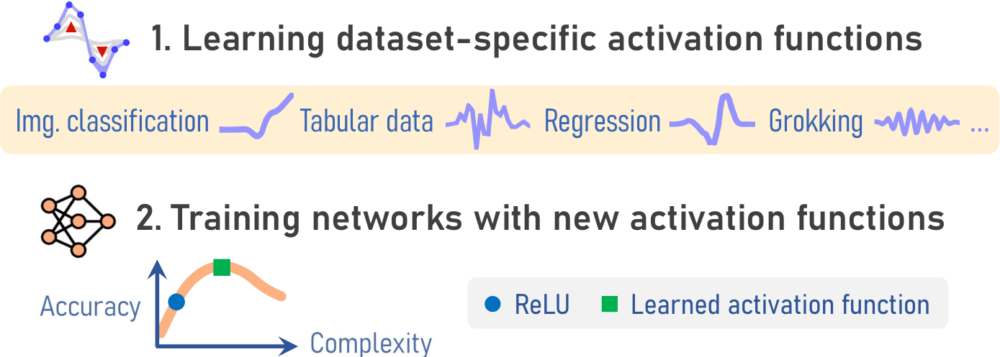

*Figure 1: (1) We modulate the inductive bias of neural architectures by learning novel activation functions that improve generalization on specific datasets. (2) With this tool, we study the relation between model accuracy and complexity. We identify tasks where the simplicity bias of ReLU architectures is suboptimal.* **[p. 1]**

#### This paper studies inductive biases

i.e. the assumptions made by learning algorithms to generalize beyond training data Mitchell 1980.11 1 Inductive biases can formalized as a prior over the space of functions Mingard et al. 2021. A vast literature examines the inductive biases of architectures Cohen and Shashua 2016, optimizers Neyshabur et al. 2014, losses Hui and Belkin 2020, regularizers Kukačka et al. 2017, etc. The **simplicity bias** is one aspect of the inductive biases of NNs that makes them fit their training data with simple22 2 Simplicity can be formalized using Kolmogorov complexity or its approximations, e.g. frequency, compressibility, sensitivity, etc. Teney et al. 2024b; Dingle et al. 2018; Hahn et al. 2021; Dherin et al. 2022 functions Arpit et al. 2017; Poggio et al. 2018. Despite wide belief that the simplicity bias could be due to SGD Arora et al. 2019; Hermann and Lampinen 2020; Lyu et al. 2021; Tachet et al. 2018, work on untrained networks showed that it can be explained with architectures alone De Palma et al. 2019; Goldblum et al. 2023; Mingard et al. 2019; Valle-Perez et al. 2018. ReLUs also seem critical to induce the simplicity bias in typical architectures Teney et al. 2024b.

#### Limits of the simplicity bias.

The simplicity bias is an intuitive explanation for the ability to generalize on real-world data. It embodies Occam’s razor Mingard et al. 2023 and assumes that data-generating processes in the real world are simple. Additionally, a prior for simplicity is supported by results in algorithmic information theory Dingle et al. 2018 stating essentially that “*a bias in the distribution of target functions must be towards low complexity*”. However, this only means that simplicity is a good prior on average, but not necessarily the best choice on any task or dataset. This matches the no-free lunch theorem Wolpert 2002 according to which no inductive bias is universally useful. Therefore, this paper asks the following.

> Are there practical applications of machine learning where the simplicity bias is detrimental? In these cases, what do the optimal inductive biases look like?

**[p. 2]**

For example, shortcut learning is one situation where the simplicity bias is already known to be detrimental Shah et al. 2020; Teney et al. 2021.

#### Searching for optimal inductive biases by learning activation functions.

Prior work Teney et al. 2024b showed that ReLU activations are critical to obtain the simplicity bias in typical architectures. Hence we build a new tool to modulate the simplicity bias by learning dataset-specific activation functions. It uses bi-level optimization and a spline parametrization to learn activations free of any prior, such as constraints of smoothness or monotonicity (unlike prior work Alexandridis et al. 2024; Apicella et al. 2021; Scardapane et al. 2019b). This (1) enables the discovery of entirely new activation functions and inductive biases that improve generalization (Figure 1) and (2) highlights the suboptimality of the simplicity bias by comparing the accuracy and complexity of models with ReLUs vs. learned activations.

#### Findings.

We examine four domains that we hypothesized to be impaired by the simplicity bias: tabular data, regression tasks, cases of shortcut learning, and algorithmic tasks. Our intuition is that they require learning functions with high sensitivity or sharp transitions. For each domain, we collect existing datasets then train and analyze models without and with learned activation functions. In all cases, we obtain better generalization with dataset-specific activations, and the improvements are attributable to learning higher-complexity solutions. In comparison, this analysis also shows that classical image datasets (mnist, cifar, fashion-mnist, svhn) are extremely well suited to the inductive biases of ReLUs. The best learned activations are then strikingly similar to variants like GeLUs Hendrycks and Gimpel 2016.

#### Summary of contributions.

- A new method to discover dataset-specific activation functions optimized for generalization.
- An examination of $\,>$20 datasets showing that the simplicity bias of ReLU architectures can be suboptimal. (1) For **regression** tasks and **tabular** data, new learned activations greatly improve accuracy by helping learn complex functions. (2) For **image classification**, the process rediscovers smooth variants of ReLUs, suggesting a near-optimal choice for these popular tasks. (3) In cases of **shortcut learning**, we show that different learned activations can steer the learning towards different image features. (4) For **grokking** tasks, new learned activations can eliminate the phenomenon, supporting the explanation as a mismatch between data and architectures. We also measure a positive **transferability** of learned activations across related tasks.
- An analysis showing that improvements with learned activations correlate with the learning of complex functions.

#### Implications.

All cases where the simplicity bias proved suboptimal are in domains where NNs have historically struggled. We now connect them to a common explanation. This implies that architectures tailored to some specific domains may still have a place besides scaling up models and data. Conversely, the suitability of ReLUs to image classification suggests that researchers successfully converged by trial and error to designs well tuned to popular tasks.

## 2 Methods

This section introduces tools to analyze trained models and to learn new dataset-specific activation functions.

### 2.1 Visualizing a Model’s Function

A neural network implements a function $f_{\boldsymbol{\theta}}:\mathbb{R}^{d_{\textrm{in}}}\!\rightarrow\!\mathbb{R}^{d_{\textrm{out}}}$ of parameters ${\boldsymbol{\theta}}$ (weights and biases) that maps an input ${\boldsymbol{x}}\in\mathbb{R}^{d_{\textrm{in}}}$ to an output ${\boldsymbol{y}}\in\mathbb{R}^{d_{\textrm{out}}}$. For a regression task, ${\boldsymbol{y}}\!\in\!\mathbb{R}$ is the predicted value. For a classification task, ${\boldsymbol{y}}$ is a vector of logits passed through a sigmoid or softmax to obtain class probabilities. Because $d_{\textrm{in}}$ can be large, $f$ can be difficult to visualize and analyze. A workaround is to examine $f$ over 1D or 2D slices of the input space Fridovich-Keil et al. 2022; Teney et al. 2024b. To obtain a slice in a region of plausible data, we use the training data $\mathcal{T}$. For a 1D slice (linear path), we sample ${\boldsymbol{x}}_{1},{\boldsymbol{x}}_{2}\sim\mathcal{T}$ then define the path ${\mathbf{X}}_{{\boldsymbol{x}}_{1},{\boldsymbol{x}}_{2}}=[\,(1\!-\!\lambda)\,{\boldsymbol{x}}_{1}+\lambda\,{\boldsymbol{x}}_{2},\;\lambda\in[0,1]\,]$. We proceed analogously with three points for a 2D slice. We sample $\lambda$ regularly in [0,1] such that ${\mathbf{X}}$ is a finite sequence of points. Then $f$ is evaluated on these points to give a 1D sequence or 2D grid of values that are convenient to display and analyze (Figure 7c). When $d_{\textrm{out}}\!>\!1$ (multi-class task), we examine one random dimension of $f$’s output at a time.

### 2.2 Measuring a Model’s Complexity

We wish to quantify the complexity of the function $f$ implemented by a model trained on data $\mathcal{T}$. Prior work used Fourier decompositions Fridovich-Keil et al. 2022; Teney et al. 2024b but this requires a delicate implementation. We found a reliable alternative with the total variation (TV) of $f$ averaged over many 1D paths:

$$
\operatorname{TV}(f,\mathcal{T})~=~{\mathbb{E}}_{{\boldsymbol{x}}_{1},{\boldsymbol{x}}_{2}\;\sim\mathcal{T}}\int_{{\boldsymbol{x}}_{1}}^{{\boldsymbol{x}}_{2}}\big|f^{\prime}({\boldsymbol{x}})\big|\;d{\boldsymbol{x}}\;. \tag{1}
$$

with $f^{\prime}$ the first derivative. We estimate (1) using a path as defined in Section 2.1. We name the points in such a path ${\mathbf{X}}_{{\boldsymbol{x}}_{a},{\boldsymbol{x}}_{z}}:=[{\boldsymbol{x}}_{a},{\boldsymbol{x}}_{b},{\boldsymbol{x}}_{c},...\,{\boldsymbol{x}}_{y},{\boldsymbol{x}}_{z}]$. We then have:

$$
\begin{split}\operatorname{TV}(f,\mathcal{T})~\approx~{\mathbb{E}}_{{\boldsymbol{x}}_{a},{\boldsymbol{x}}_{z}\;\sim\mathcal{T}}~~&~|f({\boldsymbol{x}}_{b})-f({\boldsymbol{x}}_{a})|\\[-3.0pt]
&\!\!\!\!\!+|f({\boldsymbol{x}}_{c})-f({\boldsymbol{x}}_{b})|\,+\,\ldots\\[-3.0pt]
&\!\!\!\!\!+|f({\boldsymbol{x}}_{z})-f({\boldsymbol{x}}_{y})|\,.\end{split} \tag{2}
$$

Appendix F shows that (2) correlates closely with a Fourier-based measure of complexity: the higher the TV, the higher the complexity. Yet, it is straightforward to implement and discriminative across small and large values.

**[p. 3]**

### 2.3 Meta-Learning Activation Functions

Our goal is to optimize the inductive biases of a neural network and recent work Teney et al. 2024b showed that the activation functions are the most important component. The typical approach to learn activations Alexandridis et al. 2024; Apicella et al. 2019; Apicella et al. 2021; Bingham et al. 2020; Chelly et al. 2024; Ducotterd et al. 2024; Jagtap et al. 2020; Scardapane et al. 2019b; Sütfeld et al. 2020 (see Related Work) replaces them with a small shared ReLU MLP that implements an $\mathbb{R}\!\rightarrow\!\mathbb{R}$ function. Its parameters are optimized along the network’s. However this cannot discover truly novel activations because the embedded ReLU MLP has itself a simplicity bias and activations are optimized together with the model. We propose instead:

- an **unbiased** parametrization of the activations as splines,
- a bi-level optimization to learn **reusable** activations,
- an episodic training to **optimize for generalization** rather than simply to fit the training data.

#### Parametrization as splines.

We want a space of activation functions free of priors such as the smoothness and monotonicity enforced in prior work Apicella et al. 2019; Chelly et al. 2024. We implement an activation $g_{\boldsymbol{\psi}}:\mathbb{R}\!\rightarrow\!\mathbb{R}$ as a linear spline with control points defined by ${\boldsymbol{\psi}}$. We define $n_{\textrm{c}}$ points spread regularly in an interval $[a,b]$, typically $\sim\!50$ points in $[-5,+5]$. Then $g$ represents piecewise linear segments interpolating values specified in the learned parameters ${\boldsymbol{\psi}}:=[\,g_{\boldsymbol{\psi}}(a),\ldots g_{\boldsymbol{\psi}}(b))\,]\in\mathbb{R}^{n_{\textrm{c}}}$. $g$ can represent simple and complex functions, including smooth curves, periodic functions, sharp transitions, etc.

#### Bi-level optimization & episodic training.

Our goal is to get an activation function that can be reused like any other in subsequent training runs. This differs from prior work (e.g. Alexandridis et al. 2024) that continuously updates the activation during training: the final one may not be suitable to start training with. Our solution is a bi-level meta-learning loop. An inner loop trains the model with a fixed activation function. An outer loop trains the activation function to maximize generalization. Each outer step simulates a new learning task or *episode*. This means (1) initializing the model with different weights and (2) using different subsets of data for training and validation. With suitable choices, this can simulate in- or out-of-distribution conditions (see Section 3.4). Without episodes, the learned activation could overfit to a particular model initialization for example, and would not generalize in subsequent training runs. The method is outlined as Algorithm 1. Its implementation is discussed in Appendix C.

![[Uncaptioned image]](../images/fig1-excl1.png)

> Inductive bias and simplicity bias are not interchangeable. Our method optimizes toward better generalization. Simplicity is only one aspect of the trained models that we analyze post-hoc (e.g. Figure 4).

**Algorithm 1** Meta-learning an activation function (AF).

**Input**: training data $\mathcal{T}$; untrained neural model $f_{{\boldsymbol{\theta}},{\boldsymbol{\psi}}}$  
Initialize ${\boldsymbol{\psi}}$ with zeros — *Parametrization of AF*  
$n_{\textrm{tr}}\leftarrow 0$ — *Number of inner-loop iterations*  
**while** $n_{\textrm{tr}}<n_{\textrm{tr}}^{\textrm{max}}$ — *Outer loop: train AF*  
    Increment $n_{\textrm{tr}}$  
    Sample the episode's tr. ($\mathcal{T}^{\prime}$) and val. ($\mathcal{V}$) sets from $\mathcal{T}$  
    Initialize ${\boldsymbol{\theta}}$ randomly — *Model weights and biases*  
    **for** $n_{\textrm{tr}}$ steps — *Inner loop: train model with fixed AF*  
        Eval. loss on $\mathcal{T}^{\prime}$: $L\leftarrow\Sigma_{({\boldsymbol{x}},{\boldsymbol{y}})\in\mathcal{T}^{\prime}}\,\mathcal{L}\big(f_{{\boldsymbol{\theta}},{\boldsymbol{\psi}}}({\boldsymbol{x}},{\boldsymbol{y}})\big)$  
        Gradient step on weights/biases: ${\boldsymbol{\theta}}\leftarrow\operatorname{GD}({\boldsymbol{\theta}},\nabla_{\boldsymbol{\theta}}L)$  
    Eval. loss on $\mathcal{V}$: $L\leftarrow\Sigma_{({\boldsymbol{x}},{\boldsymbol{y}})\in\mathcal{V}}\,\mathcal{L}\big(f_{{\boldsymbol{\theta}},{\boldsymbol{\psi}}}({\boldsymbol{x}},{\boldsymbol{y}})\big)$  
    Gradient step on AF: ${\boldsymbol{\psi}}\leftarrow\operatorname{GD}({\boldsymbol{\psi}},\nabla_{\boldsymbol{\psi}}L)$  
    **if** performance on $\mathcal{V}$ worsens **then** break — *Early stopping*  
**Output**: optimized AF ${\boldsymbol{\psi}}$

## 3 Tasks and Results

We now examine tasks that we hypothesized to be ill-suited to the simplicity bias of ReLU architectures. The intuition is that the target function to learn (e.g. optimal classifier) contains sharp transitions (regression tasks, tabular datasets), or repeating patterns (algorithmic tasks) that contradict the ReLUs’ simplicity bias. For each task, we examine existing datasets with the tools from Section 2. In all cases, we find benefits from architectures whose inductive biases favor more complex functions. Additional details and results are provided in Appendix E.

### 3.1 Image Classification Tasks

#### Background.

We start with classical datasets to validate our methodology: mnist, fashion-mnist, svhn, cifar-10 LeCun et al. 1998; Krizhevsky and Hinton 2009; Netzer et al. 2011; Xiao et al. 2017. They are representative of the vision tasks that guided the development of deep learning. **Our hypothesis** is therefore that the inductive biases of modern architectures and ReLUs are well suited to these datasets.

#### Setup.

For each dataset, we learn activation functions with Algorithm 1. We experiment with two initializations of the spline parameters: as zeros and so as to mimic a ReLU. The goal of the latter is to explore the space of functions similar to ReLUs. Because of the difficulty of the optimization, the algorithm is likely to converge to a *local* optimum similar to ReLUs if there is one. We also experiment with the sharing of the activation function. By default, a single function is shared across the network. Alternatively, we learn a different activation function per layer. This provides more ways to affect the model’s inductive biases. Our base architecture is a 3-layer MLP (details in Appendix E).

#### Results.

We compare in Figure 2a the accuracy of models with ReLUs vs. learned activation functions. Differences are small. The learned activations only improve slightly on svhn and cifar. This suggests that the inductive biases of ReLUs are generally well suited to these datasets.

*Figure 2: Test accuracy on image datasets. (a) For **classification** tasks, all models perform similarly, suggesting that the inductive biases of ReLUs are well suited to these datasets. (b) For **regression** tasks, models with learned activations perform better, especially from an initialization as zeros, which enables the discovery of completely novel activation functions.* **[p. 4]**

*(a) **Image classification***

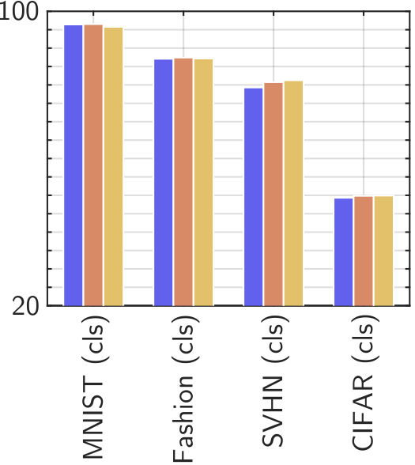

*(b) **Image regression***

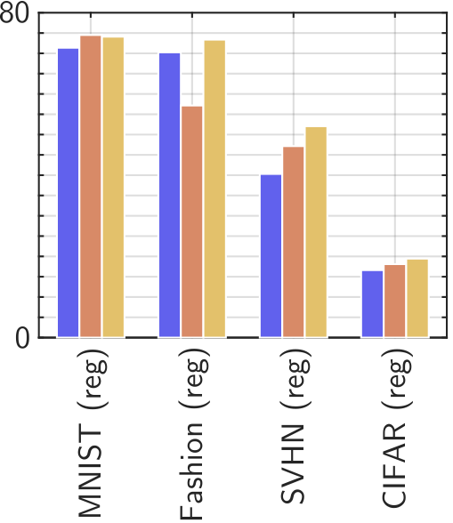

*Legend: ◼ ReLU activations, ◼ Learned act., ReLU init., ◼ Learned act., zero init. X axis of both panels: MNIST, Fashion, SVHN, CIFAR. Y axis: Accuracy (%).*

We examine the learned activations in Figure 3a. **[p. 4]** With an initialization as ReLUs, the optimization converges to a smooth variant remarkably similar to GeLUs Bingham et al. 2020 which are widely used. This suggests that the research community has empirically converged on a local optimum in the space of activation functions. With an initialization as zeros, we discover wavelets Saragadam et al. 2023 that are unlike common activations but perform as well as ReLUs, i.e. another local optimum.

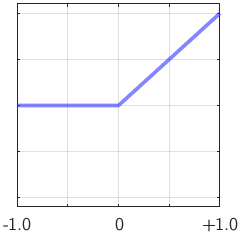

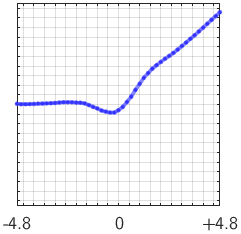

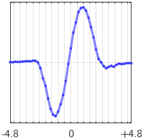

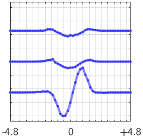

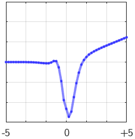

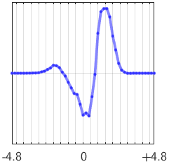

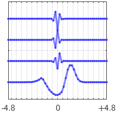

*Columns: ReLU | Learned activation functions (ReLU init. | Zero init. | Layer-specific). Rows: (a) mnist as a **classification** task | (b) mnist as a **regression** task.*

*Figure 3: Activation functions learned for mnist. For a **classification** task, the activation learned from a ReLU resembles the popular GeLUs. For a **regression** task, the learned activations contain irregularities that help a network represent complex functions. See Figure 16 for similar results on other datasets.* **[p. 4]**

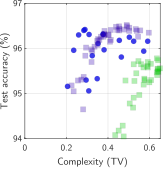

*Panels: (a) mnist as **classification** task | (b) mnist as **regression** task.*

*Figure 4: Accuracy vs. complexity on image datasets. Each marker is a model with different hyperparameters and ReLUs (⚫) or learned activations initialized as ReLUs (◼) or as zeros (◼). For **classification** (a), ReLUs are close to best. Activations optimized from ReLUs only improve the accuracy slightly, corresponding to the GeLU-like function in Figure 3. For **regression** (b), new activations (learned from zeros) are best. Moreover, accuracy and complexity are clearly correlated only for regression. This supports the hypothesis that regression is more complex than classification and thus benefits from alternatives to the ReLUs’ simplicity bias. See Figure 18 for similar results on other datasets.* **[p. 4]**

> **Take-away:** for image classification, learned activations provide very little benefit over ReLUs. Smooth variants of ReLUs are a local optimum in the space of activations. ReLUs' popularity for such tasks could thus be explained with their proximity to this optimum.

### 3.2 Regression Tasks

#### Background.

Regression tasks are known to be difficult for NNs Stewart et al. 2023. They are often turned into a classification through discretization Farebrother et al. 2024; Imani et al. 2024. Existing explanations that invoke implicit biases of gradient descent are clearly incomplete Stewart et al. 2023. **Our hypothesis** is that regression is difficult because it often involves irregular decision boundaries Grinsztajn et al. 2022 in opposition to the typical solutions of ReLU networks Dherin et al. 2022.

#### Setup.

We use the same setup and image datasets as Section 3.1. The task is now to directly predict class IDs. E.g. for mnist this means predicting digit values. Models are trained with an MSE loss. To measure accuracy, we discretize the predictions to the nearest class ID.

#### Results.

The first observation from Figure 2b is that regression is clearly more difficult for NNs than classification (lower accuracies) despite the identical underlying task. Importantly, the learned activations now provide clear improvements, especially when learned from scratch (initialization as zeros). This confirms the hypothesis that the inductive biases of ReLUs are not well suited to these tasks.

Figure 3b shows that the learned activations contain more irregularities for regression than classification. Prior work Teney et al. 2024b showed that this can help models represent complex functions with sharp transitions. An analysis of the complexity of trained models (Figures 4 and 18) shows that the accuracy is correlated with complexity for regression but not classification. And regression models with learned activations implement functions of higher complexity than with ReLUs. This supports the claim that the improvements arise from overcoming the simplicity bias of ReLUs.

#### Complexity is only one dimension

of the inductive biases. The complexity plots for svhn (Figure 18) interestingly show that models with ReLUs and learned activations get different accuracies at the same complexity level. This shows that our meta learning approach can search over dimensions of the inductive biases that are not captured by our complexity measure, and are yet to be explicitly studied.

**[p. 5]**

> **Take-away:** regression is more difficult for NNs than classification, and the simplicity bias of ReLUs is partly to blame. Learned activations improve performance by helping networks represent more complex functions.

### 3.3 Tabular Data

#### Background.

Tabular data is any data with few unstructured dimensions, which often contains low-cardinality variables such as dates or categorical attributes. This contrasts e.g. with images, which contain many correlated, continuous dimensions (pixels). NNs struggle with tabular datasets and are often inferior to decision trees Grinsztajn et al. 2022; McElfresh et al. 2024. **Our hypothesis** is that the inductive biases of standard architectures are ill-suited to such data because of the simplicity bias. It makes it difficult to learn functions where small changes in the input (e.g. day of the week) correspond to abrupt changes in the target — the definition of *sensitivity*, a proxy for complexity Dherin et al. 2022. This seldom occurs in vision where similar images correspond to similar labels.

#### Setup.

We use 16 real-world classification datasets from Grinsztajn et al. Grinsztajn et al. 2022; Grinsztajn 2022. Baselines include a linear classifier, k-NNs, and boosted decision trees. Our models are MLPs with 1–4 hidden layers (details in Appendix E.4). We compare learned activations functions with ReLUs and TanHs with a global prefactor, $\operatorname{tanh}(\alpha x)$ with $\alpha\!\in\!\mathrm{R}^{+}$ tuned on the validation set. This is a simple option with tunable complexity, albeit with inductive biases of TanHs Jagtap et al. 2020; Teney et al. 2024b.

We also experiment with learned *input activation functions* (IAFs). The motivation is to learn a different behavior for each input dimension. Since they carry different information, e.g. continuous vs. categorical variables, one could be suited to the simplicity bias while another is not, for example. IAFs are dimension-specific activation functions applied directly on the data before a standard MLP. IAFs are learned like AFs, from an initialization as the identity i.e. no effect by default. They subsume the gated inputs, and Fourier/numerical embeddings from prior work Dragoi et al. 2024; Fiedler 2021; Gorishniy et al. 2022.

#### Results.

We compare the accuracy of models on the 16 datasets in Figures 5 and 20. Vanilla MLPs generally perform worse than trees. But adjusting the MLPs’ inductive biases with learned prefactors or activations eliminates the gap. IAFs perform best, sometimes even surpassing trees. We analyze below the reasons for these improvements.

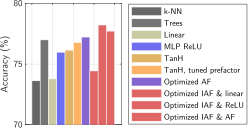

*Figure 5: Comparison of model types over 16 tabular datasets. Vanilla MLPs often perform worse than decision trees, but adjusting their inductive biases with learned activation functions (AFs) eliminates this gap. The *input activation functions* (IAFs) enable even better performance. See Figure 20 for results per dataset.* **[p. 5]**

*Figure 6: Test accuracy vs. complexity on tabular datasets. Each marker represents a model with different hyperparameters, and ReLUs (⚫) or learned activations initialized as ReLUs (◼) or as zeros (◼). The learned activations perform better in all cases, but the accuracy peaks at different complexity levels. For some datasets, a low complexity is best and ReLUs thus perform quite well (leftmost panel, note the smaller Y scale). For other datasets, the opposite is true and the improvements with learned activations is larger.* **[p. 5]**

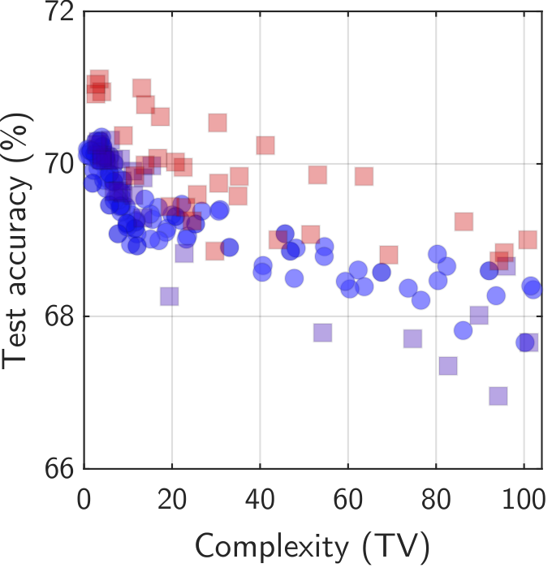

*defaultCreditCard*

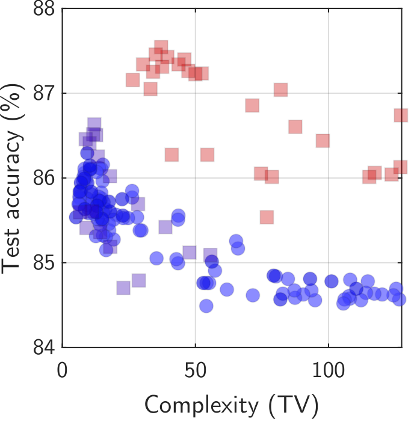

*house16h*

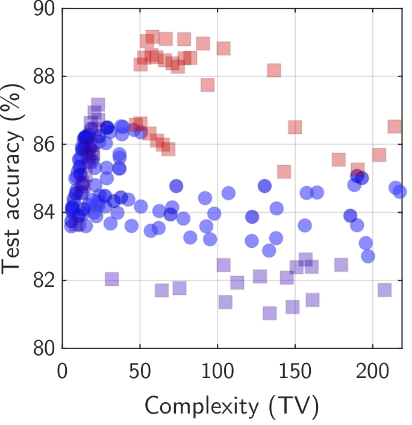

*california*

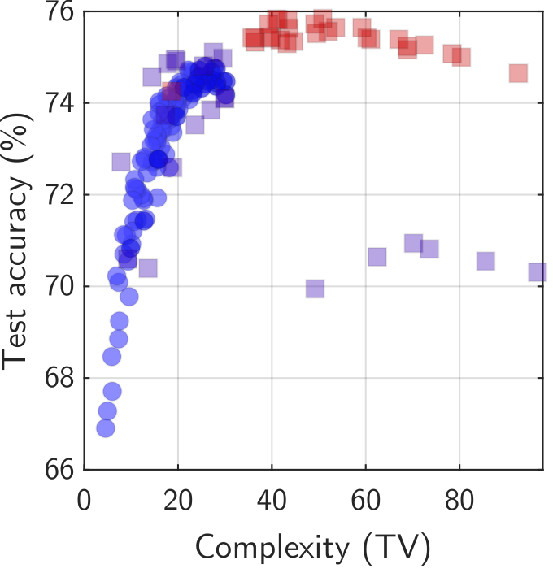

*credit*

***Best at low complexity** $\uparrow$ Different datasets **Best at higher complexity** $\uparrow$*

#### Learned activation functions close the gap to decision trees by mimicking their inductive bias.

We visualize in Figure 7c the functions implemented by different models, plotting their output over slices of the input space (Section 2.1). ReLUs produce the smoothest function while TanHs and learned activations induce sharper patterns. Notably, the IAFs induce sharp axis-aligned decision boundaries that are also characteristic of trees, with which they share a high accuracy. Axis-aligned transitions are the consequence of IAFs applied *independently* to each dimension. Sharp transitions originate from the complex shape of the learned activation function (Figure 7a) which is possible thanks to the unbiased spline parametrization (Section 2.3).

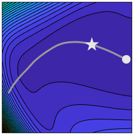

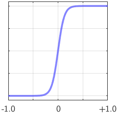

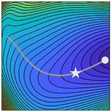

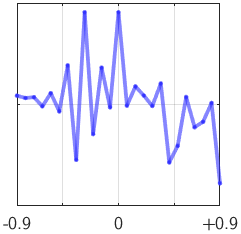

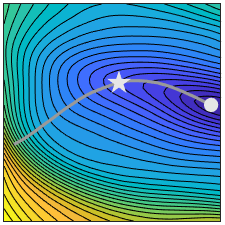

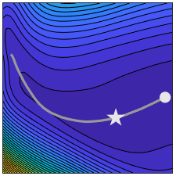

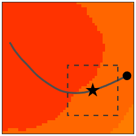

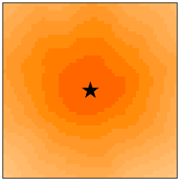

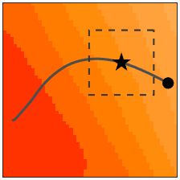

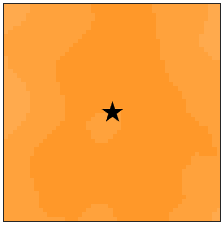

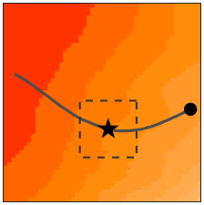

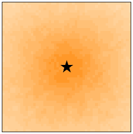

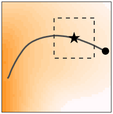

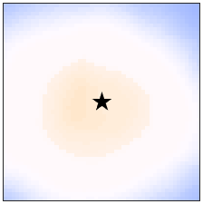

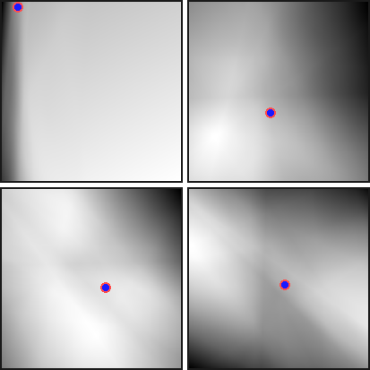

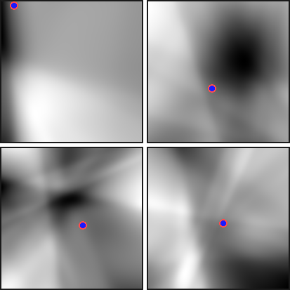

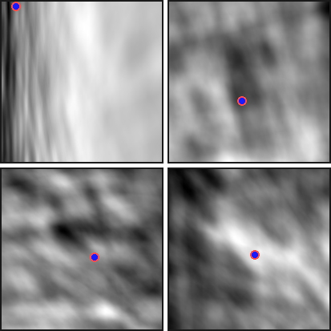

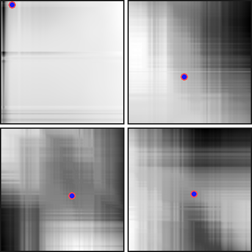

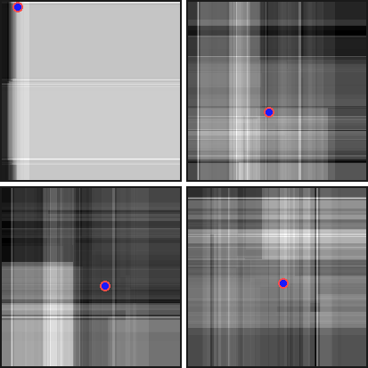

*Column headers: (a) **Activation function & loss landscape** (◼ training trajectory, $\bigstar$ early-stopping checkpoint, $\bullet$ last checkpoint) | (b) **Complexity landscape** (in weight space along the PCA plane of the training trajectory) **& zoom-in** (random plane) | (c) **Function implemented by the network** (in input space along four random planes containing each one training point). Row labels: **MLP, ReLU** | **MLP, TanH w/ tuned prefactor** | **MLP, learned AF** | **MLP, learned IAFs** | **Boosted decision trees**.*

*Figure 7: Models trained on the electricity Grinsztajn 2022 tabular dataset. ReLU MLPs perform worst (left). TanHs induce sharper transitions in the **network’s function (c)**. So does the learned **activation function (a)** which is itself very irregular. The input activation functions (IAFs) perform best and mimic the axis-aligned boundaries of trees (bottom-right). The **complexity landscapes (b)** show that complexity increases to the highest level in the best model (IAFs). The zoom-in shows that the ambient complexity is also much higher than in other models. This means that it is inherently more likely to represent complex functions since they are more abundant in parameter space.* **[p. 6]**

#### The simplicity/complexity bias is a property of the architecture.

We visualize *complexity landscapes* of MLPs in Figure 7b. Similarly to standard *loss* landscapes Li et al. 2018, we plot model complexity over 2D slices of the parameter space. A first global view over a plane aligned with the training trajectory shows that complexity steadily increases during training for all models Kalimeris et al. 2019; Rahaman et al. 2019; Xu et al. 2019a but does so to the highest level for the best model (IAFs). A second view zooms in on each optimized solution in a random 2D plane. This examines the effect of *arbitrary* perturbations to the parameters.33 3 This resembles an analysis of untrained models De Palma et al. 2019; Mingard et al. 2019; Teney et al. 2024b; Valle-Perez et al. 2018 but focuses on relevant regions on the parameter space, near optimized models. It shows that the ambient complexity of perturbed solutions of the best model is much higher than the solution itself, and than with less accurate models. This means that this architecture is more likely to represent complex functions because they are more abundant in parameter space Mingard et al. 2021; Scimeca et al. 2021. **This is why the simplicity bias can be overcome**: it results from architecture choices and not from an inevitable “implicit bias” of SGD Shah et al. 2020; Soudry et al. 2018; Tsoy and Konstantinov 2024; Xu et al. 2019b.

#### Different tabular datasets require different inductive biases.

We examine the relation between accuracy and complexity in Figure 6. The accuracy peaks at different complexity levels for different datasets. For some, a low complexity is best and ReLU MLPs perform well. **[p. 6]** For others, a higher complexity is best and the improvements with learned activations are larger. This supports the hypothesis that improvements over ReLU MLPs come from overcoming their simplicity bias. The variance across datasets is also unsurprising since they have little in common besides their low dimensionality (full results in Appendix E.4).

#### Effect of width and depth.

We show in Figure 8 that the learned activations can be reused in networks of different widths than they were trained for. The accuracy varies with width similarly as with ReLUs. Teney et al. 2024b indeed showed that a model’s width affects its capacity but not its inductive biases. Therefore width does not interfere with the effects of the learned activations. Figures 8 and 21 also show that good performance can be achieved with fewer layers than with ReLUs. Learned activations might thus have utility in model compression and distillation.

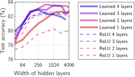

*Figure 8: The learned activation functions surpass ReLUs, often with fewer layers. They can also be reused with different network widths (covertype Grinsztajn 2022 tabular dataset, see Figure 21 for others).* **[p. 6]**

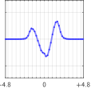

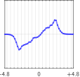

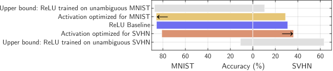

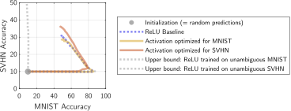

*Figure 9: Experiments on shortcut learning with mnist/cifar collages. The ReLU baseline (◼) relies mostly on simple mnist features. We learn two activation functions that shift the preference towards different features ($\leftarrow$/$\rightarrow$). Training trajectories (right) clearly differ with the activation optimized for cifar (◼), for mnist (◼), or a ReLU (◼ ◼ ◼). The model at initialization (random weights) is marked with $\bullet\,$.* **[p. 7]**

> **Take-away:** many tabular datasets are ill-suited to ReLU models because they require learning a complex function. Learned activations improve accuracy by implementing sharp axis-aligned decision boundaries that mimic the inductive biases of decision trees.

### 3.4 Shortcut Learning

#### Background.

Shortcut learning occurs when a model learns spurious features instead of generalizable ones. It is a known consequence of the simplicity bias Shah et al. 2020; Teney et al. 2021 when the training data contains multiple features of different complexity. **Our hypothesis** is that the preference for some features depends on their alignment with the inductive biases. We will evaluate whether this can be controlled with activation functions.

#### Setup.

We use mnist/cifar collages Shah et al. 2020; Teney et al. 2021; Teney et al. 2022, a classification task over images combining tiles from mnist and cifar-10. The **training set** is ambiguous: both tiles are predictive of the labels. Two unambiguous **test sets** evaluate reliance on either tile: one is predictive, the other contains a random class. We similarly build two **validation sets** to learn **two activation functions** optimized for either tile. We simulate OOD conditions by setting $\mathcal{V}$ in Algorithm 1. The models are the fully-connected MLPs used in Teney et al. 2021.

#### Results.

Figure 9 shows that a baseline with ReLUs is prone to shortcut learning. It relies exclusively on mnist and the accuracy on the cifar test set is not better than chance (10%). In comparison, using either learned activation steers the learning towards either tile. **[p. 7]** The accuracy shifts towards either of two tiles as the model prioritizes different features, merely with a change of activation function. This shows that the simplicity bias is not an inevitable effect of SGD. Instead, it directly reflects the alignment between the chosen architecture and the data.

#### Training dynamics.

The accuracy on cifar remains below a model trained on unambiguous cifar data. This is because training dynamics are also important. In Figure 9 (right), we plot the accuracy on the two tiles for the whole training trajectory. The reliance on different features varies, and the model eventually relies primarily on simple ones with enough iterations (i.e. without early stopping). This calls for future work combining our findings with the extensive literature on ID / OOD training dynamics Jain et al. 2024; Teney et al. 2024a; Tsoy and Konstantinov 2024.

> **Take-away:** we confirm that shortcut learning is a side effect of the simplicity bias. Different activation functions, while not completely avoiding shortcut learning, can steer the learning towards particular input features.

### 3.5 Algorithmic Tasks and Grokking

#### Background.

Grokking is a phenomenon where a model first overfits the data (i.e. high training accuracy, low test accuracy) then shifts to high test accuracy after many training steps Power et al. 2022. This is typically observed on algorithmic tasks and architectures from MLPs to transformers. **Our hypothesis** is that grokking is due to a mismatch between the target function and the model’s inductive biases. Indeed, typical architectures were not developed for the algorithmic tasks where grokking is typically observed. To verify this hypothesis, we will show that endowing an architecture with the right inductive biases, using learned activation functions, can eliminate the phenomenon. Supporting this hypothesis, Zhou et al. 2024 proposed that grokking comes from the frequency principle (i.e. low frequencies learned first by SGD), and Kumar et al. 2023 showed that it correlates with a misalignment between features at initialization and the target function.

#### Setup.

Following Gromov 2023; Kumar et al. 2023; Liu et al. 2022 we train $1$-hidden layer MLPs on algorithmic tasks, defined each by one binary operation (Figures 10 and 27). e.g. $y\!=\!(x_{1}\!+x_{2})\bmod\,13$. The operands are passed as one-hot vectors and the task is a classification over possible outputs. Details in Appendix E.6.

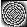

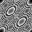

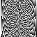

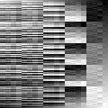

*Panel labels: $a\!+\!b$ $(\bmod\,27)$ | $ab$ $(\bmod\,27)$ | $a^{2}\!+\!ab\!+\!b^{2}$ $(\bmod\,53)$ | $a^{2}+b^{2}$ $(\bmod\,27)$ | $a^{3}+ab$ $(\bmod\,53)$ | $a.b$ in $S_{4}$.*

*Figure 10: Target functions used to investigate grokking Power et al. 2022 (details in Appendix, Figure 27). These patterns are very different from the tasks for which typical architectures were developed.* **[p. 7]**

#### Results.

We compare models with ReLU vs. learned activations across various tasks, network widths, and fractions of training data. We find that the learned, task-specific activations lead to faster convergence and/or higher test accuracy (Figures 11–13). On modular addition (a common task in the grokking literature) the learned-activation model converges $\sim\!10\times$ faster than ReLUs. Curiously, some models with learned activations also end up overfitting (decreasing test accuracy) with prolonged training. In contrast, ReLU networks either never generalize (test accuracy $\sim\!0$) or *grok* and keep a high accuracy indefinitely. Further investigation is needed to explain this difference. We examine learned activation functions in Figure 12. See Figure 28 in the Appendix for results on other algorithmic tasks Power et al. 2022.

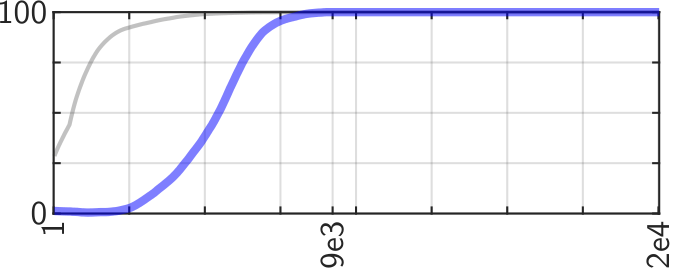

*(a) **ReLU baseline**. Y axis: Accuracy (%); ◼ Training, ◼ Test. X axis: Tr. steps.*

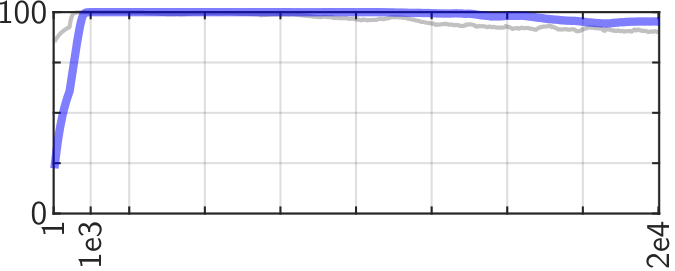

*(b) **Learned activation function**. X axis: Tr. steps.*

*Figure 11: The learned activations essentially eliminate grokking (delayed convergence). On the above task (addition $\bmod~27$), our model converges $\sim\!10\times$ faster than ReLUs.* **[p. 7]**

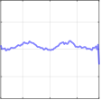

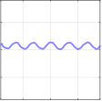

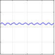

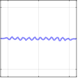

*Panel labels: $(\bmod\,13)$ | $(\bmod\,27)$ | $(\bmod\,29)$ | $(\bmod\,41)$.*

*Figure 12: Activations learned for modular addition. The frequency of the sine-like function varies across versions of the task.* **[p. 7]**

*(a) Y axis: Num. training steps to reach $\ge 95\%$ test accuracy. X axis: Fraction of tr. data.*

*(b) X axis: Network width.*

*Figure 13: Models with learned activations (◼) converge faster than ReLUs (◼ ◼ ◼) across a variety of settings (addition $\bmod\,27$).* **[p. 7]**

**[p. 8]**

> **Take-away:** learned activations eliminate grokking in all our cases, suggesting, as a cause, the mismatch between the data and the architectures' inductive biases.

## 4 Do the Activations Transfer Across Tasks?

So far, we used dataset-specific activation functions and found that there exist better alternatives to ReLUs. A practical application would be the learning of activation functions suitable to a broad task, or range of related datasets.

As a first step, we study the specialization of the activations functions (AFs) learned for the 22 algorithmic tasks from Figure 27 Power et al. 2022. We evaluate every task/activation combination, yielding the $22\!\times\!22$ matrix of Figure 14. The learned activations do transfer, with improvements in accuracy and convergence shared across tasks. We also evaluate an activation learned learned on *all tasks* simultaneously. The accuracy across tasks (i.e. per-column average) reaches $61.5\%$ vs. only $19.9\%$ for ReLUs. and $54.0\%$ on average for tasks-specific solutions. This procedure can thus improve performance on a *range* of related tasks. Future work could leverage it to discover activation functions that improve performance in other specific domains. See Appendix E.3 for other transfer experiments using image regression tasks.

*(a) The $22\!\times\!22$ transfer matrix. Columns: **AFs optimized for each task** (same order as Y axis). Rows (top): **Easy tasks** (solved with ReLUs, improv. in **convergence**); rows (bottom): **Hard tasks** (**not** solved with ReLUs, improv. in **accuracy**). **Scores per column (%): mean 54.0, min/max 22.2 / 80.5**.*

*(b) **ReLU** column: **19.9**.*

*(c) AF optimized for **all** tasks: **61.5**.*

*Figure 14: Transfer of AFs (columns) across algorithmic tasks (rows). Colors represent the fraction of the best convergence speed or accuracy per task (brighter is better). If the activations were over-specialized, the matrix would be diagonal. On the contrary, it is densely filled, indicating positive transfer across many tasks.* **[p. 8]**

## 5 Discussion

We used activation functions as a tool to show that there exist a variety of inductive biases that are useful across applications of NNs. The impossibility of *universal* inductive biases is well known Wolpert 2002 but a strong argument has also been made that deep learning research is converging towards few architectures with wide applicability Goldblum et al. 2023. This argument rests on the NNs’ simplicity bias being a good match for real-world data Buchanan 2018; Dingle et al. 2018; Lin et al. 2017. Our results do not invalidate these assumptions: NNs are widely applicable and their simplicity bias is evidently very effective *on average*. Our results show instead the following.

1. There exist **real-world tasks where the inductive biases of typical architectures’ are suboptimal**. This explanation connects four domains where NNs historically struggled.
2. The **simplicity bias in modern NNs depends on particular design choices**, the activation functions in particular. Research has converged on these choices by trial and error, in large part by optimizing performance on vision tasks. Therefore the adequacy of ReLUs for image classification (Section 3.1) is not accidental.

#### Relevance to transformers and language models.

The simplicity bias exists in transformers Bhattamishra et al. 2022; Zhou et al. 2023 and language models AlKhamissi et al. 2024; Goldblum et al. 2023; Teney et al. 2024b. Their embedding layer resembles *input activations functions* (Section 3.3). Could this explain the transformers’ remarkable flexibility? I.e. a simplicity bias on an initial mapping of arbitrary complexity. Zhong and Andreas 2024 indeed trained embeddings alone in a random-weight transformer and could learn complex tasks.

#### Limitations and open questions.

We prioritized breadth by establishing a new connection across multiple disparate topics in machine learning. Each section could expand into its own paper with additional models, datasets, comparisons, etc. Our findings on shortcut learning for example (Section 3.4) could yield new methods to address distribution shifts, though no such claim is made here. Here are the most promising follow-up questions opened by this paper.

- **How to fully characterize inductive biases?** We focused on simplicity for its prevalence in AI Goldblum et al. 2023, philosophy Popper 1959, and the natural sciences Buchanan 2018. But it is only one dimension among many to characterize inductive biases.
- **Can we improve state-of-the-art architectures?** We used simple MLPs to isolate the effects of activations functions since they are central to the simplicity bias Teney et al. 2024b. But other existing mechanisms (architectural, optimization) may already tweak or attenuate the simplicity bias.
- **Can we learn transferable activation functions for other domains?** We examined transferability in Sections 4 and E.3. The results suggest the possibility of better architectures optimized for specific domains. Predicting the suitability of an architecture/dataset pair ex ante (prior to training) would be extremely useful. This may follow from advances on the first open question above.
- **Are there other detrimental effects of the simplicity bias?** Any learning algorithm needs inductive biases to “fill the gaps” between training examples. The better they are, the fewer examples are needed. Researching what inductive biases are most useful on real-world tasks might thus hold the key for machine learning to become as data-efficient as humans. More speculatively, high-level cognition has been argued to require postulating explanations beyond the data Deutsch 2011; Elton 2021. In this regard, simplicity-biased architectures might also hold us back.

## References

**[p. 9]**

- Sravanti Addepalli, Anshul Nasery, Venkatesh Babu Radhakrishnan, Praneeth Netrapalli, and Prateek Jain. Feature reconstruction from outputs can mitigate simplicity bias in neural networks. In *ICLR*, 2022.

- Konstantinos Panagiotis Alexandridis, Jiankang Deng, Anh Nguyen, and Shan Luo. Adaptive parametric activation. *arXiv preprint arXiv:2407.08567*, 2024.

- Konstantinos Panagiotis Alexandridis, Jiankang Deng, Anh Nguyen, and Shan Luo. Adaptive parametric activation. In *ECCV*, 2025.

- Badr AlKhamissi, Greta Tuckute, Antoine Bosselut, and Martin Schrimpf. Brain-like language processing via a shallow untrained multihead attention network. *arXiv preprint arXiv:2406.15109*, 2024.

- Andrea Apicella, Francesco Isgro, and Roberto Prevete. A simple and efficient architecture for trainable activation functions. *Neurocomputing*, 2019.

- Andrea Apicella, Francesco Donnarumma, Francesco Isgrò, and Roberto Prevete. A survey on modern trainable activation functions. *Neural Networks*, 2021.

- Sanjeev Arora, Nadav Cohen, Wei Hu, and Yuping Luo. Implicit regularization in deep matrix factorization. *NeurIPS*, 2019.

- Devansh Arpit, Stanislaw Jastrzebski, Nicolas Ballas, David Krueger, Emmanuel Bengio, Maxinder S Kanwal, Tegan Maharaj, Asja Fischer, Aaron Courville, Yoshua Bengio, et al. A closer look at memorization in deep networks. In *ICML*. PMLR, 2017.

- Samuel James Bell and Levent Sagun. Simplicity bias leads to amplified performance disparities. In *Proceedings of the 2023 ACM Conference on Fairness, Accountability, and Transparency*, pages 355–369, 2023.

- Satwik Bhattamishra, Arkil Patel, Varun Kanade, and Phil Blunsom. Simplicity bias in transformers and their ability to learn sparse boolean functions. *arXiv preprint arXiv:2211.12316*, 2022.

- Garrett Bingham, William Macke, and Risto Miikkulainen. Evolutionary optimization of deep learning activation functions. In *Genetic and Evolutionary Computation Conference*, 2020.

- Mark Buchanan. A natural bias for simplicity. *Nature Physics*, 2018.

- Irit Chelly, Shahaf E Finder, Shira Ifergane, and Oren Freifeld. Trainable highly-expressive activation functions. *arXiv preprint arXiv:2407.07564*, 2024.

- Nadav Cohen and Amnon Shashua. Inductive bias of deep convolutional networks through pooling geometry. *arXiv preprint arXiv:1605.06743*, 2016.

- Giacomo De Palma, Bobak Kiani, and Seth Lloyd. Random deep neural networks are biased towards simple functions. *NeurIPS*, 2019.

- David Deutsch. *The beginning of infinity: Explanations that transform the world*. Penguin, 2011.

- Benoit Dherin, Michael Munn, Mihaela Rosca, and David Barrett. Why neural networks find simple solutions: The many regularizers of geometric complexity. *NeurIPS*, 35, 2022.

- Kamaludin Dingle, Chico Q Camargo, and Ard A Louis. Input–output maps are strongly biased towards simple outputs. *Nature communications*, 2018.

- Pedro Domingos. The role of occam’s razor in knowledge discovery. *Data mining and knowledge discovery*, 1999.

- Marius Dragoi, Florin Gogianu, and Elena Burceanu. Closing the gap on tabular data with fourier and implicit categorical features. *Submission to ICLR (available on OpenReview)*, 2024.

- Shiv Ram Dubey, Satish Kumar Singh, and Bidyut Baran Chaudhuri. Activation functions in deep learning: A comprehensive survey and benchmark. *Neurocomputing*, 2022.

- Stanislas Ducotterd, Alexis Goujon, Pakshal Bohra, Dimitris Perdios, Sebastian Neumayer, and Michael Unser. Improving lipschitz-constrained neural networks by learning activation functions. *Journal of Machine Learning Research*, 2024.

- Daniel C Elton. Applying deutsch’s concept of good explanations to artificial intelligence and neuroscience–an initial exploration. *Cognitive Systems Research*, 2021.

- Jesse Farebrother, Jordi Orbay, Quan Vuong, Adrien Ali Taïga, Yevgen Chebotar, Ted Xiao, Alex Irpan, Sergey Levine, Pablo Samuel Castro, Aleksandra Faust, et al. Stop regressing: Training value functions via classification for scalable deep rl. *arXiv preprint arXiv:2403.03950*, 2024.

- James Fiedler. Simple modifications to improve tabular neural networks. *CoRR*, abs/2108.03214, 2021.

- Sara Fridovich-Keil, Raphael Gontijo Lopes, and Rebecca Roelofs. Spectral bias in practice: The role of function frequency in generalization. *NeurIPS*, 2022.

- Gallant. There exists a neural network that does not make avoidable mistakes. In *IEEE International Conference on Neural Networks*. IEEE, 1988.

- Isabel O Gallegos, Ryan A Rossi, Joe Barrow, Md Mehrab Tanjim, Sungchul Kim, Franck Dernoncourt, Tong Yu, Ruiyi Zhang, and Nesreen K Ahmed. Bias and fairness in large language models: A survey. *Computational Linguistics*, 2024.

- Robert Geirhos, Jörn-Henrik Jacobsen, Claudio Michaelis, Richard Zemel, Wieland Brendel, Matthias Bethge, and Felix A Wichmann. Shortcut learning in deep neural networks. *Nature Machine Intelligence*, 2020.

- Florin Gogianu, Tudor Berariu, Mihaela C Rosca, Claudia Clopath, Lucian Busoniu, and Razvan Pascanu. Spectral normalisation for deep reinforcement learning: an optimisation perspective. In *ICML*, 2021.

- Micah Goldblum, Marc Finzi, Keefer Rowan, and Andrew Gordon Wilson. The no free lunch theorem, kolmogorov complexity, and the role of inductive biases in machine learning. *arXiv preprint arXiv:2304.05366*, 2023.

- Yury Gorishniy, Ivan Rubachev, and Artem Babenko. On embeddings for numerical features in tabular deep learning. *NeurIPS*, 2022.

**[p. 10]**

- Anirudh Goyal and Yoshua Bengio. Inductive biases for deep learning of higher-level cognition. *Proceedings of the Royal Society A*, 2022.

- Léo Grinsztajn. Tabular data learning benchmark. *https://github.com/LeoGrin/tabular-benchmark*, 2022.

- Léo Grinsztajn, Edouard Oyallon, and Gaël Varoquaux. Why do tree-based models still outperform deep learning on typical tabular data? *NeurIPS*, 2022.

- Andrey Gromov. Grokking modular arithmetic. *arXiv preprint arXiv:2301.02679*, 2023.

- Michael Hahn, Dan Jurafsky, and Richard Futrell. Sensitivity as a complexity measure for sequence classification tasks. *Transactions of the ACL*, 2021.

- Hrayr Harutyunyan, Rafayel Darbinyan, Samvel Karapetyan, and Hrant Khachatrian. In-context learning in presence of spurious correlations. *arXiv preprint arXiv:2410.03140*, 2024.

- Dan Hendrycks and Kevin Gimpel. Gaussian error linear units (GeLUs). *arXiv preprint arXiv:1606.08415*, 2016.

- Katherine L Hermann and Andrew K Lampinen. What shapes feature representations? exploring datasets, architectures, and training. *arXiv preprint arXiv:2006.12433*, 2020.

- Hossein Hosseini, Baicen Xiao, Mayoore Jaiswal, and Radha Poovendran. Assessing shape bias property of convolutional neural networks. In *Proceedings of the IEEE Conference on Computer Vision and Pattern Recognition Workshops*, 2018.

- Like Hui and Mikhail Belkin. Evaluation of neural architectures trained with square loss vs cross-entropy in classification tasks. *arXiv preprint arXiv:2006.07322*, 2020.

- Ehsan Imani, Kai Luedemann, Sam Scholnick-Hughes, Esraa Elelimy, and Martha White. Investigating the histogram loss in regression. *arXiv preprint arXiv:2402.13425*, 2024.

- Ameya D Jagtap and George Em Karniadakis. How important are activation functions in regression and classification? a survey, performance comparison, and future directions. *Journal of Machine Learning for Modeling and Computing*, 4(1), 2023.

- Ameya D Jagtap, Kenji Kawaguchi, and George Em Karniadakis. Adaptive activation functions accelerate convergence in deep and physics-informed neural networks. *Journal of Computational Physics*, 2020.

- Anchit Jain, Rozhin Nobahari, Aristide Baratin, and Stefano Sarao Mannelli. Bias in motion: Theoretical insights into the dynamics of bias in sgd training. *arXiv preprint arXiv:2405.18296*, 2024.

- Liangze Jiang and Damien Teney. OOD-chameleon: Is algorithm selection for ood generalization learnable? *arXiv preprint arXiv:2410.02735*, 2024.

- Dimitris Kalimeris, Gal Kaplun, Preetum Nakkiran, Benjamin Edelman, Tristan Yang, Boaz Barak, and Haofeng Zhang. SGD on neural networks learns functions of increasing complexity. *NeurIPS*, 2019.

- Alex Krizhevsky and Geoffrey Hinton. Learning multiple layers of features from tiny images. Technical report, University of Toronto, 2009.

- Jan Kukačka, Vladimir Golkov, and Daniel Cremers. Regularization for deep learning: A taxonomy. *arXiv preprint arXiv:1710.10686*, 2017.

- Tanishq Kumar, Blake Bordelon, Samuel J Gershman, and Cengiz Pehlevan. Grokking as the transition from lazy to rich training dynamics. *arXiv preprint arXiv:2310.06110*, 2023.

- Yann LeCun, Léon Bottou, Yoshua Bengio, and Patrick Haffner. Gradient-based learning applied to document recognition. *Proceedings of the IEEE*, 86(11):2278–2324, 1998.

- Alexander Li and Deepak Pathak. Functional regularization for reinforcement learning via learned fourier features. *NeurIPS*, 2021.

- Hao Li, Zheng Xu, Gavin Taylor, Christoph Studer, and Tom Goldstein. Visualizing the loss landscape of neural nets. *NeurIPS*, 2018.

- Xuan Li, Yun Wang, and Bo Li. Tree-regularized tabular embeddings. *arXiv preprint arXiv:2403.00963*, 2024.

- Henry W Lin, Max Tegmark, and David Rolnick. Why does deep and cheap learning work so well? *Journal of Statistical Physics*, 2017.

- Ziqi Liu, Wei Cai, and Zhi-Qin John Xu. Multi-scale deep neural network (mscalednn) for solving poisson-boltzmann equation in complex domains. *arXiv preprint arXiv:2007.11207*, 2020.

- Ziming Liu, Ouail Kitouni, Niklas S Nolte, Eric Michaud, Max Tegmark, and Mike Williams. Towards understanding grokking: An effective theory of representation learning. *NeurIPS*, 2022.

- Ziming Liu, Yixuan Wang, Sachin Vaidya, Fabian Ruehle, James Halverson, Marin Soljačić, Thomas Y Hou, and Max Tegmark. Kan: Kolmogorov-arnold networks. *arXiv preprint arXiv:2404.19756*, 2024.

- Kaifeng Lyu, Zhiyuan Li, Runzhe Wang, and Sanjeev Arora. Gradient descent on two-layer nets: Margin maximization and simplicity bias. *NeurIPS*, 2021.

- Andrew L Maas, Awni Y Hannun, Andrew Y Ng, et al. Rectifier nonlinearities improve neural network acoustic models. In *ICML*, 2013.

- Augustine N Mavor-Parker, Matthew J Sargent, Caswell Barry, Lewis Griffin, and Clare Lyle. Frequency and generalisation of periodic activation functions in reinforcement learning. *arXiv preprint arXiv:2407.06756*, 2024.

- Duncan McElfresh, Sujay Khandagale, Jonathan Valverde, Vishak Prasad C, Ganesh Ramakrishnan, Micah Goldblum, and Colin White. When do neural nets outperform boosted trees on tabular data? *NeurIPS*, 2024.

- Chris Mingard, Joar Skalse, Guillermo Valle-Pérez, David Martínez-Rubio, Vladimir Mikulik, and Ard A Louis. Neural networks are a priori biased towards boolean functions with low entropy. *arXiv preprint arXiv:1909.11522*, 2019.

**[p. 11]**

- Chris Mingard, Guillermo Valle-Pérez, Joar Skalse, and Ard A Louis. Is SGD a bayesian sampler? well, almost. *Journal of Machine Learning Research*, 2021.

- Chris Mingard, Henry Rees, Guillermo Valle-Pérez, and Ard A Louis. Do deep neural networks have an inbuilt occam’s razor? *arXiv preprint arXiv:2304.06670*, 2023.

- Tom M Mitchell. The need for biases in learning generalizations. *Rutgers University CS tech report CBM-TR-117*, 1980.

- Yuval Netzer, Tao Wang, Adam Coates, Alessandro Bissacco, Bo Wu, and Andrew Y Ng. Reading digits in natural images with unsupervised feature learning. *NIPS Workshop on Deep Learning and Unsupervised Feature Learning*, 2011.

- Behnam Neyshabur, Ryota Tomioka, and Nathan Srebro. In search of the real inductive bias: On the role of implicit regularization in deep learning. *arXiv preprint arXiv:1412.6614*, 2014.

- Mohammad Pezeshki, Oumar Kaba, Yoshua Bengio, Aaron C Courville, Doina Precup, and Guillaume Lajoie. Gradient starvation: A learning proclivity in neural networks. *NeurIPS*, 2021.

- Tomaso Poggio, Kenji Kawaguchi, Qianli Liao, Brando Miranda, Lorenzo Rosasco, Xavier Boix, Jack Hidary, and Hrushikesh Mhaskar. Theory of deep learning III: the non-overfitting puzzle. *CBMM Memo*, 2018.

- Karl Popper. *”7. Simplicity”. The logic of scientific discovery*. Routledge, 1959.

- Alethea Power, Yuri Burda, Harri Edwards, Igor Babuschkin, and Vedant Misra. Grokking: Generalization beyond overfitting on small algorithmic datasets. *arXiv preprint arXiv:2201.02177*, 2022.

- Aahlad Manas Puli, Lily Zhang, Yoav Wald, and Rajesh Ranganath. Don’t blame dataset shift! shortcut learning due to gradients and cross entropy. *NeurIPS*, 2023.

- Nasim Rahaman, Aristide Baratin, Devansh Arpit, Felix Draxler, Min Lin, Fred Hamprecht, Yoshua Bengio, and Aaron Courville. On the spectral bias of neural networks. In *ICML*. PMLR, 2019.

- Prajit Ramachandran, Barret Zoph, and Quoc V Le. Swish: a self-gated activation function. *arXiv preprint arXiv:1710.05941*, 2017.

- Sameera Ramasinghe and Simon Lucey. Beyond periodicity: Towards a unifying framework for activations in coordinate-MLPs. In *ECCV*. Springer, 2022.

- Sameera Ramasinghe, Lachlan E MacDonald, and Simon Lucey. On the frequency-bias of coordinate-MLPs. *NeurIPS*, 2022.

- Mihaela Rosca, Theophane Weber, Arthur Gretton, and Shakir Mohamed. A case for new neural network smoothness constraints. *I Can’t Believe It’s Not Better (ICBINB) Workshop at NeurIPS*, 2020.

- Vishwanath Saragadam, Daniel LeJeune, Jasper Tan, Guha Balakrishnan, Ashok Veeraraghavan, and Richard G Baraniuk. Wire: Wavelet implicit neural representations. In *CVPR*, 2023.

- Simone Scardapane, Michele Scarpiniti, Danilo Comminiello, and Aurelio Uncini. Learning activation functions from data using cubic spline interpolation. *Neural Advances in Processing Nonlinear Dynamic Signals*, 2019a.

- Simone Scardapane, Steven Van Vaerenbergh, Simone Totaro, and Aurelio Uncini. Kafnets: Kernel-based non-parametric activation functions for neural networks. *Neural Networks*, 2019b.

- Jürgen Schmidhuber. Discovering neural nets with low kolmogorov complexity and high generalization capability. *Neural Networks*, 1997.

- Luca Scimeca, Seong Joon Oh, Sanghyuk Chun, Michael Poli, and Sangdoo Yun. Which shortcut cues will DNNs choose? a study from the parameter-space perspective. *arXiv preprint arXiv:2110.03095*, 2021.

- Harshay Shah, Kaustav Tamuly, Aditi Raghunathan, Prateek Jain, and Praneeth Netrapalli. The pitfalls of simplicity bias in neural networks. *NeurIPS*, 2020.

- Kexuan Shi, Xingyu Zhou, and Shuhang Gu. Improved implicit neural representation with fourier reparameterized training. In *CVPR*, 2024.

- Prasann Singhal, Tanya Goyal, Jiacheng Xu, and Greg Durrett. A long way to go: Investigating length correlations in rlhf. *arXiv preprint arXiv:2310.03716*, 2023.

- Vincent Sitzmann, Julien Martel, Alexander Bergman, David Lindell, and Gordon Wetzstein. Implicit neural representations with periodic activation functions. *NeurIPS*, 2020.

- Daniel Soudry, Elad Hoffer, Mor Shpigel Nacson, Suriya Gunasekar, and Nathan Srebro. The implicit bias of gradient descent on separable data. *The Journal of Machine Learning Research*, 2018.

- Lawrence Stewart, Francis Bach, Quentin Berthet, and Jean-Philippe Vert. Regression as classification: Influence of task formulation on neural network features. In *ICML*. PMLR, 2023.

- Leon René Sütfeld, Flemming Brieger, Holger Finger, Sonja Füllhase, and Gordon Pipa. Adaptive blending units: Trainable activation functions for deep neural networks. In *Intelligent Computing: Proceedings of the Computing Conference*. Springer, 2020.

- Remi Tachet, Mohammad Pezeshki, Samira Shabanian, Aaron Courville, and Yoshua Bengio. On the learning dynamics of deep neural networks. *arXiv preprint arXiv:1809.06848*, 2018.

- Damien Teney, Ehsan Abbasnejad, Simon Lucey, and Anton van den Hengel. Evading the simplicity bias: Training a diverse set of models discovers solutions with superior ood generalization. *arXiv preprint arXiv:2105.05612*, 2021.

- Damien Teney, Maxime Peyrard, and Ehsan Abbasnejad. Predicting is not understanding: Recognizing and addressing underspecification in machine learning. In *ECCV*. Springer, 2022.

- Damien Teney, Yong Lin, Seong Joon Oh, and Ehsan Abbasnejad. ID and OOD performance are sometimes inversely correlated on real-world datasets. *NeurIPS*, 2024a.

**[p. 12]**

- Damien Teney, Armand Mihai Nicolicioiu, Valentin Hartmann, and Ehsan Abbasnejad. Neural redshift: Random networks are not random functions. In *CVPR*, 2024b.

- Tijmen Tieleman. Lecture 6.5-rmsprop: Divide the gradient by a running average of its recent magnitude. *COURSERA: Neural networks for machine learning*, 4(2):26, 2012.

- Nikita Tsoy and Nikola Konstantinov. Simplicity bias of two-layer networks beyond linearly separable data. *arXiv preprint arXiv:2405.17299*, 2024.

- Guillermo Valle-Perez, Chico Q Camargo, and Ard A Louis. Deep learning generalizes because the parameter-function map is biased towards simple functions. *arXiv preprint arXiv:1805.08522*, 2018.

- Colin White, Mahmoud Safari, Rhea Sukthanker, Binxin Ru, Thomas Elsken, Arber Zela, Debadeepta Dey, and Frank Hutter. Neural architecture search: Insights from 1000 papers. *arXiv preprint arXiv:2301.08727*, 2023.

- David H Wolpert. The supervised learning no-free-lunch theorems. *Soft computing and industry: Recent applications*, 2002.

- Han Xiao, Kashif Rasul, and Roland Vollgraf. Fashion-mnist: A novel image dataset for benchmarking machine learning algorithms. *arXiv preprint arXiv:1708.07747*, 2017.

- Yiheng Xie, Towaki Takikawa, Shunsuke Saito, Or Litany, Shiqin Yan, Numair Khan, Federico Tombari, James Tompkin, Vincent Sitzmann, and Srinath Sridhar. Neural fields in visual computing and beyond. In *Computer Graphics Forum*. Wiley Online Library, 2022.

- Zhi-Qin John Xu, Yaoyu Zhang, Tao Luo, Yanyang Xiao, and Zheng Ma. Frequency principle: Fourier analysis sheds light on deep neural networks. *arXiv preprint arXiv:1901.06523*, 2019a.

- Zhi-Qin John Xu, Yaoyu Zhang, and Yanyang Xiao. Training behavior of deep neural network in frequency domain. In *ICONIP*. Springer, 2019b.

- Zhi-Qin John Xu, Yaoyu Zhang, and Tao Luo. Overview frequency principle/spectral bias in deep learning. *Communications on Applied Mathematics and Computation*, 2024.

- Ge Yang, Anurag Ajay, and Pulkit Agrawal. Overcoming the spectral bias of neural value approximation. *arXiv preprint arXiv:2206.04672*, 2022.

- Ziqian Zhong and Jacob Andreas. Algorithmic capabilities of random transformers. *arXiv preprint arXiv:2410.04368*, 2024.

- Hattie Zhou, Arwen Bradley, Etai Littwin, Noam Razin, Omid Saremi, Josh Susskind, Samy Bengio, and Preetum Nakkiran. What algorithms can transformers learn? a study in length generalization. *arXiv preprint arXiv:2310.16028*, 2023.

- Zhangchen Zhou, Yaoyu Zhang, and Zhi-Qin John Xu. A rationale from frequency perspective for grokking in training neural network. *arXiv preprint arXiv:2405.17479*, 2024.

Supplementary Material

**[p. 13]**

## Appendix A Reviewers’ FAQ

This section contains interesting questions raised during the review of this paper (paraphrased) and our answers.

#### Why use MLPs instead of CNNs or ViTs for example?

The choice of **unstructured MLPs** is deliberate. Since the primary goal is to discover optimal inductive biases via optimization, it makes sense to start with architectures that impose little initial constraints.

#### Can the proposed method for learning activation functions be applied to other architectures?

In principle yes, but the bi-level optimization is expensive. We did not attempt to use it with large models. This method is meant as an exploratory tool, and the insights it delivered are much more fundamental. They could serve in the design/selection of future architectures independently of this optimization method. For example, Teney et al. 2024b already evaluated how various components (e.g. attention) can nudge inductive biases in ways similar to activation functions.

#### Why is the scale of TV values different across datasets?

TV values are not comparable across datasets because of the different distances between data points in input space.

#### Are learned activation functions more akin to pre-trained initialization than architecture choices?

Not really, because initializations can vanish with enough iterations of fine-tuning, while the effects of activation functions remain. However, it is true that parametrized activations carry more information than typical architecture choices.

## Appendix B Related Work

#### Inductive biases in deep learning

are due to choices of architecture Goyal and Bengio 2022 and of the learning algorithm (optimizer, objective, regularizers Kukačka et al. 2017). We focus on the former. The simplicity bias has been studied from both aspects. Most explanations attribute it to loss functions Pezeshki et al. 2021 and gradient descent Arora et al. 2019; Hermann and Lampinen 2020; Lyu et al. 2021; Tachet et al. 2018. But work on untrained networks shows that it can be explained with architectures alone De Palma et al. 2019; Goldblum et al. 2023; Mingard et al. 2019; Teney et al. 2024b; Valle-Perez et al. 2018. Teney et al. 2024b showed that the choice of activation function can modulate the simplicity bias. The **spectral bias** Rahaman et al. 2019; Kalimeris et al. 2019 or frequency principle Xu et al. 2019a is a related but different effect related to training dynamics: NNs approximate low-frequency components of the target function earlier during training with SGD.

#### Suitability of the simplicity bias.

The tendency of NNs to represent simple functions is thought as the key why overparametrized networks avoid overfitting Arpit et al. 2017; Poggio et al. 2018. Schmidhuber 1997 even proposed to regularize a model’s Kolmogorov complexity to improve generalization. The preference for simplicity aligns with **Occam’s razor**, a philosophical principle whose (absence of) justification has long been debated (Mingard et al. 2023, Appendix A). Domingos 1999 discussed arguments against Occam’s razor for knowledge discovery.

#### Side-effects of the simplicity bias.

The simplicity bias is responsible for **shortcut learning** Geirhos et al. 2020; Puli et al. 2023; Teney et al. 2021 and for amplifying performance disparities Bell and Sagun 2023. A vast literature addresses shortcut learning with alternative losses Puli et al. 2023, architectures Hosseini et al. 2018, diversification mechanisms Addepalli et al. 2022; Teney et al. 2022; Teney et al. 2024a, etc. No study has however addressed its root cause, which we pinpoint to architectural choices, activation functions in particular. The simplicity bias is also detrimental in the use of NNs for **scientific computing** such as solving PDEs (Xu et al. 2024, Section 5.4). A solution relevant to activation functions was proposed in MscaleDNNs Liu et al. 2020 by restricting them to a compact support. The simplicity bias makes it difficult for **implicit neural representations** to represent sharp image edges for example Ramasinghe et al. 2022. The prevailing solution is to replace activation functions with sines Sitzmann et al. 2020, Gaussians Ramasinghe and Lucey 2022, or wavelets Saragadam et al. 2023. Fourier features Shi et al. 2024 are another solution, in fact mathematically equivalent to periodic activations (Xie et al. 2022, Sect. 5). With **tabular data**, NNs are known to often perform poorly Dragoi et al. 2024; Grinsztajn et al. 2022. Solutions include Fourier features and numerical embeddings Gorishniy et al. 2022; Li et al. 2024 which can be seen as special cases of learned activation functions. In **reinforcement learning**, a few studies have suggested that the spectral bias of typical architectures may be suboptimal Li and Pathak 2021 and have experimented with Fourier features Yang et al. 2022 and sine activations Mavor-Parker et al. 2024. These examples support our message that the simplicity bias is not always desirable. They also support the search for new activation functions to modulate it.

#### Activation functions

are key for introducing non-linearities in NNs. Many options were considered early on, e.g. sine activations in the Fourier Neural Networks from 1988 Gallant 1988. ReLUs are often credited for enabling the rise of deep learning by avoiding vanishing gradients Maas et al. 2013. However they are also essential in inducing the simplicity bias Teney et al. 2024b which may be just as important. The research community has slowly converged towards smooth handcrafted variants of ReLUs such as GeLUs Dubey et al. 2022; Hendrycks and Gimpel 2016; Ramachandran et al. 2017. Some works proposed to **learn activation functions** using extra parameters optimized alongside the weights of the network Alexandridis et al. 2024; Apicella et al. 2019; Apicella et al. 2021; Bingham et al. 2020; Chelly et al. 2024; Ducotterd et al. 2024; Jagtap et al. 2020; Scardapane et al. 2019b; Sütfeld et al. 2020. See Jagtap and Karniadakis 2023 for a comprehensive review. The goal is to better fit the training data with an activation function that can **[p. 14]** evolve during training. In contrast, we use meta learning to find an activation function that induces better inductive biases, such that training with this *fixed* activation provides better generalization. This requires bi-level optimization, episodic training, and unbiased parametrization that allows us to learn activations very different from existing ones. **Kolmogorov-Arnold Networks** Liu et al. 2024 parametrize the connections in a NN, which is equivalent to learning different activation functions across channels and layers. They use a parametrization as splines similar to ours. Their benefits in physics-related problems likely result from the alterations to the inductive biases studied in this paper. Our method differs from **neural architecture search** White et al. 2023 in its ability to discover novel activation functions from scratch, rather than selecting from predefined candidates Sütfeld et al. 2020 or restricted parametric functions Alexandridis et al. 2025.

## Appendix C Method for Learning Activation Functions

This section provides details about the proposed method.

#### Novelty.

Our method is designed to support an analysis of inductive biases and their effects in two steps.

1. **Learning an activation function** optimized for generalization on a specific dataset.
2. **Using this new fixed activation function** to train a network “as usual”, such that the trained model can be analyzed and compared with any other e.g. a baseline ReLU architecture.

Our method is therefore very different from most existing works about learning activation functions Alexandridis et al. 2024; Apicella et al. 2019; Apicella et al. 2021; Bingham et al. 2020; Chelly et al. 2024; Ducotterd et al. 2024; Jagtap et al. 2020; Scardapane et al. 2019b; Sütfeld et al. 2020. These usually train the model weights and activation function together for the same objective i.e. fitting the training data. In our formulation, the activation function is trained for a different objective i.e. maximizing *generalization*. We exploit this in Section 3.4 (Shortcut Learning) by simulating in-domain (ID) and out-of-distribution (OOD) conditions. Each setting then learns a different activation function that prioritizes the learning of different features.

#### Parametrization as splines.

We parametrize the learned activation functions as splines such that we can learn function with arbitrary, irregular shapes if needed. This contrasts with existing works on the learning of activation functions that constrain the search e.g. to combinations of existing activations Sütfeld et al. 2020, a small MLP Apicella et al. 2019, or other parametric functions Alexandridis et al. 2025. A parametrization as splines was already used by Scardapane et al. 2019a and in work concurrent to ours on Kolmogorov-Arnold networks Liu et al. 2024. Some technical details:

- The parametrization takes three hyperparameters $n_{\textrm{c}}$, $a$, $b$.
- $n_{\textrm{c}}$ specifies the number of control points, typically 50.
- The control points are spread regularly in the $[a,b]$, typically $[-5,+5]$ to cover typical activation values.
- A spline then represents piecewise linear segments that interpolate the values specified in the parameters ${\boldsymbol{\psi}}:=[\,g_{\boldsymbol{\psi}}(a),\ldots g_{\boldsymbol{\psi}}(b))\,]\in\mathbb{R}^{n_{\textrm{c}}}$. Outside $[a,b]$, $g$ extrapolates the values of $g(a)$ and $g(b)$.
- In our exploratory work, we compared this piecewise linear version with cubic splines, which are smoother but computationally more expensive. Both performed similarly. We also compared it with a faster nearest-neighbor interpolation of control points. This performed much worse than the piecewise linear version.

#### Implementation of the algorithm.

We reproduce the complete procedure below. The model $f_{{\boldsymbol{\theta}},{\boldsymbol{\psi}}}$ represents any chosen architecture with weights/biases ${\boldsymbol{\theta}}$ and activation functions parametrized by ${\boldsymbol{\psi}}$. The gradient updates $\operatorname{GD}(\cdot,\cdot)$ are described as full-batch updates, but they can be implemented with any optimizer e.g. mini-batch SGD or Adam.

**Algorithm 1** Meta-learning an activation function (AF).

**Input**: training data $\mathcal{T}$; untrained neural model $f_{{\boldsymbol{\theta}},{\boldsymbol{\psi}}}$  
Initialize ${\boldsymbol{\psi}}$ with zeros — *Parametrization of AF*  
$n_{\textrm{tr}}\leftarrow 0$ — *Number of inner-loop iterations*  
**while** $n_{\textrm{tr}}<n_{\textrm{tr}}^{\textrm{max}}$ — *Outer loop: train AF*  
    Increment $n_{\textrm{tr}}$  
    Sample the episode's tr. ($\mathcal{T}^{\prime}$) and val. ($\mathcal{V}$) sets from $\mathcal{T}$  
    Initialize ${\boldsymbol{\theta}}$ randomly — *Model weights and biases*  
    **for** $n_{\textrm{tr}}$ steps — *Inner loop: train model with fixed AF*  
        Eval. loss on $\mathcal{T}^{\prime}$: $L\leftarrow\Sigma_{({\boldsymbol{x}},{\boldsymbol{y}})\in\mathcal{T}^{\prime}}\,\mathcal{L}\big(f_{{\boldsymbol{\theta}},{\boldsymbol{\psi}}}({\boldsymbol{x}},{\boldsymbol{y}})\big)$  
        Gradient step on weights/biases: ${\boldsymbol{\theta}}\leftarrow\operatorname{GD}({\boldsymbol{\theta}},\nabla_{\boldsymbol{\theta}}L)$  
    Eval. loss on $\mathcal{V}$: $L\leftarrow\Sigma_{({\boldsymbol{x}},{\boldsymbol{y}})\in\mathcal{V}}\,\mathcal{L}\big(f_{{\boldsymbol{\theta}},{\boldsymbol{\psi}}}({\boldsymbol{x}},{\boldsymbol{y}})\big)$  
    Gradient step on AF: ${\boldsymbol{\psi}}\leftarrow\operatorname{GD}({\boldsymbol{\psi}},\nabla_{\boldsymbol{\psi}}L)$  
    **if** performance on $\mathcal{V}$ worsens **then** break — *Early stopping*  
**Output**: optimized AF ${\boldsymbol{\psi}}$

The bi-level optimization is expensive since every outer iteration trains the model from scratch. We mitigate this as follows. First, we train small-width models. Section 3.3 shows that the learned activations subsequently transfer to wider models. Second, we do not train the model to convergence in the inner loop. Instead, we progressively increase the number of inner iterations. This reduces the computational expense and makes the inner task progressively harder. Third, second-order derivatives (i.e. backpropagating through the inner gradient updates) are only computed over the last $t$ inner steps (typically $t{=}5$). Our exploratory work found this to be better than a complete linearization (no second-order derivatives) and vastly cheaper than backpropagating through the whole inner loop (which was not even testable at all because of the required GPU memory).

#### Optimization.

The optimization of the activation function in Algorithm 1 proved to be a very difficult non-convex **[p. 15]** problem with many local minima. We tried various optimizers for the gradient updates on $\psi$ (SGD with and without momentum, RMSprop). No option was consistently better. We also tried to run multiple instances of the inner loop in parallel (with several models initialized differently) to stabilize the gradients $\nabla_{\boldsymbol{\psi}}L$. However this usually provides worse solutions, indicating that exploration is indeed beneficial to avoid local minima.

A simple but effective workaround is to use vanilla gradient descent with restarts, i.e. running Algorithm 1 with a different:

- random seed,
- learning rate to update $\psi$ in $[0.01,0.2]$,
- number of control points $n_{\textrm{c}}\in[50,400]$,
- number of inner steps backpropagated through $t\in[1,50]$,
- initialization as zeros or as a ReLU.

This is enough to learn slightly different activation functions. We then keep the best one according to its performance on the validation set after using it to retrain a model from scratch (as a fixed activation function).

## Appendix D Ablations of the Proposed Method

We evaluate below the design choices of the proposed method to learn activation functions. We perform these experiments on the image regression task with fashion-mnist and 1-hidden layer MLPs We report averages and standard deviations over 10 random seeds. See Section E.2 for other experimental details. See the captions of Tables 1–3 for the takeaways of each experiment.

*Table 1: Evaluation of the variance across runs (over 10 random seeds and 4 restarts). It is quite similar for the baseline and the learned-activation models. The latter models obtain a higher accuracy on average. These results verify that the improvements from the learned activations are not simply due to running more trials with more chances of finding a “lucky run”. We also show that the restarts (i.e. running the optimization with multiple hyperparameters, see Section C) help find a better solution but are not indispensable to obtain an improvement over the baseline.* **[p. 15]**

| Activation function | Accuracy (%) |
|---|---|
| ReLU baseline | 53.1 $\pm$ 0.4 |
| Learned, average across restarts / hyperparameters | 56.6 $\pm$ 0.7 |
| Learned, **best** across restarts / hyperparameters | **57.2 $\pm$ 0.5** |

*Table 2: Evaluation of different interpolation methods to represent learned activation functions. The nearest-neighbor interpolation is cheap to evaluate but performs the worst. The linear one (used in all our experiments) is almost identical to the cubic one (in appearance and performance) while being faster to evaluate.* **[p. 15]**

| Activation function | Accuracy (%) |
|---|---|
| ReLU | 53.1 $\pm$ 0.4 |
| Learned, nearest-neighbor interpolation | 55.1 $\pm$ 0.9 |
| Learned, linear spline (default) | 57.2 $\pm$ 0.5 |
| Learned, **cubic** spline | **57.3 $\pm$ 0.7** |

*Panel labels: **Nearest-neighbor** | **Linear spline** | **Cubic spline**.*

*Figure 15: Activation functions learned with different interpolation methods. The linear and cubic ones are nearly identical.* **[p. 15]**

*Table 3: Evaluation of different outer-loop objectives. The naive version simply optimizes the activation for minimum loss on the *training* data, but this is suboptimal. Ideally, one would like to optimize the loss on the *test* data (which would require cheating by accessing the test labels). We approximate it by optimizing on held-out *validation* data, which the results show to be about as good (the last row would is expected to be the best without any evaluation noise).* **[p. 15]**

| Activation function | Accuracy (%) |
|---|---|
| ReLU | 53.1 $\pm$ 0.4 |
| Learned to minimize loss on training data (naive) | 56.7 $\pm$ 0.3 |
| Learned to minimize loss on **validation** data (default) | **57.2 $\pm$ 0.5** |
| Learned to minimize loss on test data (cheating) | 56.9 $\pm$ 0.5 |

**[p. 16]**

## Appendix E Experimental Details & Additional Results

### E.1 General Experimental Details

When training MLPs on a given dataset, we first **tune standard hyperparameters** for the best validation accuracy using ReLUs (optimizer, batch size, learning rate). We reuse these hyperparameters for all other experiments on this dataset, i.e. we do not tune them again for the learned activation functions. Every experiment uses **early stopping** i.e. we keep the model at the training step with the best validation accuracy.

All experiments were run on a single laptop (Dell XPS 15) with an Nvidia RTX 3050 Ti (4 GB of GPU memory).

#### Variance in the results.

In order to make the analysis of results stable and consistently reproducible, we use two interventions that greatly reduce the variance across seeds and training iterations. First, the models are trained with large- or full-batch gradient descent (typically 4096 examples per mini-batch). This eliminates most of the variation across seeds. Second, we use a simple stochastic weight averaging (SWA). That is, when evaluating a model, we use the average of the optimized weights over the last 50 training steps. This consistently improves the accuracy of all models, but it does not alter the training trajectories (by design) and we verified that it does not alter the ranking of models. The main advantage here is that it greatly stabilizes the performance across training iterations, i.e. the training curves are much smoother hence easier to analyze.

### E.2 Image Datasets

#### Data.

We use slightly cropped versions of the images in the original datasets. This makes the data and models smaller and allows us to run a larger number of experiments with limited computational resources. This makes the tasks slightly more difficult, hence the accuracies being lower baselines reported in prior work. For mnist, we crop 5 pixels on every side. For svhn, we crop 8 pixels on each of the the left and right sides.

#### Architecture.

We use fully-connected MLP. Given that our goal is to evaluate the inductive biases induced by the choice of activation function, MLPs minimizes the possible interactions with other architectural components that would complicate the analysis.

The only improvement over vanilla MLPs is the inclusion of **residual connections**. After each hidden layer, the output of the activation function is summed with the input to the layer (from before the application of weights and biases). This never hurts the accuracy, and helps when learning different layer-specific activations functions.

For each dataset, we trained MLPs with 1 to 4 hidden layers, both with ReLUs and learned activation functions. Our main results retain the MLP whose depth is best for each activation function. We provide in Figure 17 the full results for every depth. We can see that the best number of layers is sometimes different across activation functions.

#### Regression tasks.

We use the same data as the image classification tasks. The ground-truth regression targets are the class IDs $\{0,1,...,9\}$ that we normalized to $[-1,1]$. I.e. we assign to the classes values regularly spread within $[-1,1]$. This normalization is standard practice for regression models to make the optimization numerically easier. The MLP models output a single scalar with their last layer with no softmax or sigmoid.

#### Additional results.

We provide below results on all four image datasets. The main paper only includes results on mnist for space reasons, but similar observations can be made on the others.

*Columns: **Classification** | **Regression**. Rows: **mnist** | **fashion-mnist** | **svhn** | **cifar**.*

*Figure 16: Activation functions learned for image datasets treated as classification or regression tasks. The activation functions learned for regression contain more irregularities. These help networks represent complex functions with sharp transitions.* **[p. 17]**

*Columns: **Classification** | **Regression**. Rows: **mnist** | **fashion-mnist** | **svhn** | **cifar**. Legend: **◼ ReLU activations ◼ Learned act., ReLU init. ◼ Learned act., zero init.**.*

*Figure 17: Image datasets, results per number of layers.* **[p. 17]**

*Columns: Test vs. training accuracy (Classification | Regression) | Test accuracy vs. complexity (Classification | Regression). Rows: mnist | fashion-mnist | svhn | cifar.*

*Figure 18: Analysis of models trained on image datasets. Each marker represents a model with different hyperparameters or number of training steps, and ReLUs (⚫) or learned activations with initialization as ReLUs (◼) or as zeros (◼). (Left) tr/test acc, models with learned activations have better accuracy than ReLUs, especially those learned from a random initialization.* **[p. 18]**

**[p. 19]**

### E.3 Transfer of Learned Activation Functions across Image Regression Datasets

We provide below additional results on the transfer of learned activations across datasets, using the image regression tasks and 4-hidden layer MLPs. As in most experiments, we train a dataset-specific activation on each dataset (mnist, fashion-mnist, cifar, svhn) then use each of them to train a different model on each dataset. This gives a $4\!\times\!4$ matrix of results (middle rows in Table 4). We also attempt to learn an activation function on all datasets simultaneously (last row). See the table caption of the observations.

*Table 4: Transfer of learned activation functions across image regression datasets. The diagonal elements (**gray cells**) correspond to activation functions optimized for a specific dataset then used to train a model on the same dataset. These obviously work well, but other combinations also surpass the ReLU baseline, which indicates positive transfer across datasets. The one learned on all datasets (**last row**) only improves over ReLUs on the two harder datasets (svhn, cifar) and the improvements are (expectedly) smaller than with dataset-specific solutions. Further work may be needed to better balance multiple tasks when learning an activation function for multiple datasets.* **[p. 19]**

|  | Accuracy (%) of models trained on | Average $\Delta$ accuracy |  |  |  |
|---|---|---|---|---|---|
| Activation function | mnist | fashion-m. | svhn | cifar | compared to ReLU |
| ReLU | 76.7 | 73.9 | 42.9 | 16.1 | $+$0.0 |
| Learned on mnist | **79.7** | 73.0 | 41.0 | 18.2 | **$+$0.6 $\pm$ 2.3** |
| Learned on fashion-mnist | 64.3 | **75.1** | 39.7 | **23.7** | $-$1.7 $\pm$ 8.4 |
| Learned on svhn | 61.0 | 73.2 | **54.1** | 19.2 | $-$0.5 $\pm$ 11.3 |
| Learned on cifar | 57.6 | 74.5 | 41.0 | 22.6 | $-$3.5 $\pm$ 11.0 |
| Learned on all datasets simultaneously | 76.2 | 72.8 | 45.0 | 17.4 | $+$0.4 $\pm$ 1.5 |

*Figure 19: Transfer across image regression datasets. Each marker represents an MLP architecture with 1 to 4 hidden layers, with ReLUs (⚫) or activation functions learned on each of the four datasets (◼). We plot the accuracy of each architecture on pairs of datasets to show that improvements often correlate across datasets (the line represents the best linear fit to the ◼).* **[p. 19]**

**[p. 20]**

### E.4 Tabular Data

#### Implementation details

- **Nearest-neighbor (k-NN)**. We use Matlab’s implementation fitcknn​() with Bayesian hyperparameter optimization for the number of neighbors and the distance measure (L1 or L2).
- **Boosted trees**. We use Matlab’s implementation fitcensemble​() with Bayesian hyperparameter optimization of standard hyperparameters. All the tabular datasets that we use are binary classification tasks, and the classification trees therefore produce discrete class predictions. To make the visualizations of “soft predictions” as in Figure 7c, we also train *regression* trees with fitrensemble​(), using the class labels in $\{0,1\}$ as regression targets. The output of these regression trees is then more comparable to the outputs (logits) from the MLP models.
- **Linear model**. We implement this baseline with the same code as our MLP models but with no hidden layer.
- **MLP models**. Our models use 1 to 4 hidden layers, a width of 256, and they are trained with RMSprop Tieleman 2012 with large mini-batches of 4096 examples to provide stable and consistent results. The number of layers is selected for the best validation accuracy for each type of activation function. The learning rate is also selected for best validation accuracy, but only once with ReLUs then reused for other activation functions. The performance of our models would likely improve with additional hyperparameter tuning. The **width** alone has a large impact on accuracy, as evaluated in Figures 8 and 21. Our goal is not best absolute performance so we did not expend resources in hyperparameter tuning and focused on **like-for-like comparisons** (i.e. only changing the activation function). If anything, our MLP models (and those with learned activation functions in particular) are at a disadvantage compared to the baselines.
- The **TanH activation functions with a prefactor** follow Teney et al. 2024b. They are simple TanH functions with a multiplier: $\operatorname{tanh}(\alpha x)$. The scalar $\alpha\in[0.01,8]$ is tuned for the best validation accuracy and shared across layers. The learning rate $\lambda$, which is originally tuned on the ReLU model as mentioned above, is adjusted as $\lambda\!\leftarrow\!\lambda/\alpha$.
- **Data normalization**. For every tabular dataset, we normalize the data (shift and scale) such that every input dimension (“column” in tabular terms) occupies the $[-1,1]$ range. We experimented with other options: a normalization to unit standard deviation, and a quantile normalization to approximate a Gaussian or uniform distribution for every dimension. However they produced disparate results across our 16 datasets, so we settled with the simplest option to keep things consistent. If absolute performance is the objective, this should be optimized for each dataset. It has a large effect on the accuracy of MLPs, but not of trees nor k-NN classifiers. So again, our models are likely at a disadvantage compared to the baselines.

#### Details on the visualizations

- In Figure 7c, the grayscale images are produced by evaluating each model on $200\!\times\!200\!=\!40,000$ points in a 2D slice of the input space defined as follows. We first select one training example ${\boldsymbol{x}}$ at random. We then select two input dimensions $m$, $n$ at random. We create every point of the slice by replacing the $m$th and $n$th values (the scalars $x[m]$ and $x[n]$). of ${\boldsymbol{x}}$ by every possible value in a grid of $200\!\times\!200$ values over $[-1,1]\times[-1,1]$. Since our data is normalized such that every dimension covers $[-1,1]$, we now have a slice of inputs in a realistic range. This also explains why the training examples, marked by a small red-outlined blue dot in Figure 7c are not centered in the images. They would be centered only if $x[m]\!=\!x[n]\!=\!0$. The values plotted as a grayscale image are the network’s output before a softmax/sigmoid activation. These values are not bounded to a specific range, so we scale them in each image to fill the black $\rightarrow$ white range.
- In Figure 7a and b, the loss and complexity landscapes are produced by evaluating models over a $50\!\times\!50$ grid covering a 2D slice of the parameter space (weights and biases). The slices are chosen to align with the first two principal directions of the trajectory. We obtain them by computing the PCA of a matrix made of the parameters from a number of checkpoints recorded over the training of the model. The $50\!\times\!50$ sets of parameters are obtained by applying perturbations to the trained model along these two directions. For each such set of parameters, we evaluate the model’s training loss and its complexity (Section F) to make the loss and complexity landscapes. The range of loss/complexity values is consistent across all the visualization of a given dataset (i.e. a given color represents the same level of complexity across all plots in Figure 7b for example).

#### Intuition for the “input activation functions” (IAFs).

The IAFs are activation functions that are applied directly on the input data, before it is passed to a standard MLP. The key is that these IAFs are applied independently to each dimension, such that they can implement a different behavior for each dimension (or “column” of the data). This is particularly useful for tabular data because every dimension can represent a different type of information. In comparison, once the data is passed **[p. 21]** through the first layer of an MLP, the dimensions are all mixed together, and the subsequent activation function(s) are applied similarly to every dimension of the hidden representations.

The property of tabular datasets of requiring little or sparse feature interaction is well known and has been exploited in prior architectures designed for tabular data, see e.g. Gorishniy et al. 2022. This property is also a likely reason why decision trees are well suited to tabular data, since they implement decision boundaries aligned with dimensions of the data.

#### Additional results.

See the figure below and their captions for details and observations. In Figures 22 and 23, each marker represents a model with different hyperparameters, number of training steps, and ReLUs (⚫) or learned activations initilized as ReLUs (◼) or as zeros (◼). The k-NN and tree models are represented as ◆ and ▲.

*Figure 20: Comparison of model types on every tabular dataset Grinsztajn 2022, approximately sorted by decreasing performance. In almost all cases, the ReLU baseline is surpassed by optimized activation functions (TanH with prefactor, learned AFs, and learned IAFs).* **[p. 21]**

*Panel labels: **Average (all tabular datasets)** | **electricity** | **coverType** | **magicTelescope**.*

*Figure 21: (Left) On the tabular datasets, the activation functions learned from scratch (initialized with zeros) are usually better than from an initialization as ReLUs. But this varies across datasets and the opposite is sometimes true (right). Models with learned activation also often perform best with fewer layers than with ReLUs, such as on the three datasets pictured.* **[p. 21]**

*Panel labels: credit | electricity | covertype | pol | house16h | magictelescope | bankMarketing | miniboone | higgs | eyeMovements | diabetes130us | jannis | defaultOfCC | bioresponse | california | heloc.*

*Figure 22: **Training vs. test accuracy** for all tabular datasets. The accuracy of ReLUs is generally surpassed by TanHs with the right prefactor. The accuracy is almost always best with the learned IAFs. As expected, these better models also show a clearly higher complexity. We also observe that the k-NN/trees/learned AFs models lie outside the pareto front of the ReLU models. In other words, they exhibit a different relation between training and test accuracy, which indicates that they clearly posses different inductive biases.* **[p. 21]**

*Panel labels: credit | electricity | covertype | pol | house16h | magictelescope | bankMarketing | miniboone | higgs | eyeMovements | diabetes130us | jannis | defaultOfCC | bioresponse | california | heloc.*

*Figure 23: **Test accuracy vs. complexity** for all tabular datasets. As highlighted in Figure 6, the accuracy peaks at different complexity levels across datasets. This explains why *dataset-specific* activation functions (and inductive biases) outperform the baselines.* **[p. 22]**

*Column headers (repeated per dataset block): $\leftarrow$ **Activation function & loss landscape** | $\leftarrow$ **Complexity landscape**. Row labels: **MLP, ReLU** | **MLP, TanH w/ prefactor** | **MLP, learned AF** | **MLP, learned IAFs** | **Boosted decision trees** | **k-NN**.*

*Figure 24: Models trained on three tabular datasets: electricity magicTelescope, and coverType Grinsztajn 2022. See Figure 7 in the main paper for details on the meaning of these visualizations. The observations are similar across datasets.* **[p. 22]**

**[p. 23]**

### E.5 Shortcut Learning

#### Data.

The collages datasets are built using all 10 classes from the original datasets. This is a more difficult task that prior work Shah et al. 2020; Teney et al. 2021 that only used 2 classes from each dataset. Our training set uses random combinations of training images from the original dataset. Ditto for the validation and test sets. When no validation data is defined, we hold out a fraction of the training set of the same size as the test set.

#### Architecture.

Our models are 1-layer fully-connected MLPs of width 32, trained with large-batch SGD (4096 examples per mini-batch) and a learning rate of 0.01. Only the activation function varies across experiments.

#### Spectral normalization.

Our most successful experiments on shortcut learning use **spectral normalization** Gogianu et al. 2021; Rosca et al. 2020 on all layers when training and using the learned activation functions. The motivation comes from Teney et al. 2024b who showed that the magnitude of the weights in a layer, together with the choice of activation function, influences the level of “preferred complexity” of the network. We therefore hypothesized that the level of “preferred complexity” of a learned activation would be more stable (invariant to weight magnitudes) if these could be constrained in a narrow range. Spectral normalization is one way to constrain the magnitude of the linear transformation. We compare in Figure 25 the same experiments performed without and with spectral normalization. We see that the ability of the learned activations to steer the model is slightly better with spectral normalization (clearer differences in the training trajectories).

*Figure 25: Experiments on shortcut learning (mnist/cifar collages) **without (left)** and **with (right)** spectral normalization. The training trajectory with the activation optimized for cifar clearly differs from the baseline when using spectral normalization.* **[p. 23]**

#### Additional results.

We repeat our experiments with collages made from mnist/svhn. The training trajectories are not as distinct as with mnist/cifar, but the models do also achieve different top accuracies on the two datasets.

*Figure 26: Experiments on shortcut learning with mnist/svhn collages. Similar effects are obtained as with mnist/cifar (Figure 9).* **[p. 23]**

**[p. 24]**

### E.6 Algorithmic Tasks and Grokking

#### Data.

We visualize in Figure 10 the target functions of the algorithmic tasks used to investigate grokking used in prior work Power et al. 2022. Each axis of the visualizations corresponds to one of the two discrete-valued operands. Grayscale values correspond to the target function’s output, scaled to fit within the black $\rightarrow$ white range. From the point of view of a network, operands and output are represented as one-hot vectors. For example, for the task $a\!+\!b\bmod\,27$, each operands can take 27 different values. Each is represented by a one-hot vector of length 27. The two are concatenated such that the input to the network is a vector of size $2\!\times\!27\,{=}\,54$. The output of the network is a classification over the $27$ possible values. For every task, we generate all possible data (i.e. every combination of values of the two operands) and make random 80/20 training/test splits.

#### Architecture.

All networks in this section are 1-hidden layer MLPs of width 256, trained with an MSE loss and large-batch ($4096$) gradient descent, no weight decay, learning rate of $1.0$, for max. $6e4$ training steps.

*Panel labels, left to right then top to bottom: $a\!+\!b$ $(\bmod\,27)$ | $a\!-\!b$ $(\bmod\,27)$ | $ab$ $(\bmod\,27)$ | If $b$ odd, $ab$ else $a\!+\!b$ | $a^{2}+b^{2}$ $(\bmod\,27)$ | $a^{2}+ab+b^{2}$ $(\bmod\,27)$ | $a^{2}+ab+b^{2}+a$ $(\bmod\,27)$ | $a^{3}+ab$ $(\bmod\,27)$ | $a.b$ in $S_{4}$ | $a.b.a$ in $S_{4}$ | $a.b.a^{-1}$ in $S_{4}$ | then the same eight operations $(\bmod\,53)$ and the same three group operations in $S_{5}$.*

*Figure 27: Algorithmic tasks used to investigate grokking, also used by Power et al. 2022. Each task is defined as an operation over two discrete-valued operands, passed to the model as one-hot encodings. We visualize the target function of each task by plotting its value over all possible values of the operands (corresponding to the X/Y axes of each image). $S_{n}$ is the group of permutations of $n$ elements ($|S_{4}|\!=\!24$, $|S_{5}|\!=\!120$).* **[p. 24]**

*$a\!+\!b$ $(\bmod\,27)$ — ReLU, training curves*

*$a\!+\!b$ $(\bmod\,27)$ — learned activation, training curves*

*$a\!+\!b$ $(\bmod\,27)$ — the learned activation function*

*$a\!-\!b$ $(\bmod\,27)$ — ReLU, training curves*

*$a\!-\!b$ $(\bmod\,27)$ — learned activation, training curves*

*$a\!-\!b$ $(\bmod\,27)$ — the learned activation function*

*$ab$ $(\bmod\,27)$ — ReLU, training curves*

*$ab$ $(\bmod\,27)$ — learned activation, training curves*

*$ab$ $(\bmod\,27)$ — the learned activation function*

*If $b$ odd, $ab$ else $a\!+\!b$ $(\bmod\,27)$ — ReLU, training curves*

*If $b$ odd, $ab$ else $a\!+\!b$ $(\bmod\,27)$ — learned activation, training curves*

*If $b$ odd, $ab$ else $a\!+\!b$ $(\bmod\,27)$ — the learned activation function*

*$a^{2}+b^{2}$ $(\bmod\,27)$ — ReLU, training curves*

*$a^{2}+b^{2}$ $(\bmod\,27)$ — learned activation, training curves*

*$a^{2}+b^{2}$ $(\bmod\,27)$ — the learned activation function*

*$a^{2}+ab+b^{2}$ $(\bmod\,27)$ — ReLU, training curves*

*$a^{2}+ab+b^{2}$ $(\bmod\,27)$ — learned activation, training curves*

*$a^{2}+ab+b^{2}$ $(\bmod\,27)$ — the learned activation function*

*$a^{2}+ab+b^{2}+a$ $(\bmod\,27)$ — ReLU, training curves*

*$a^{2}+ab+b^{2}+a$ $(\bmod\,27)$ — learned activation, training curves*

*$a^{2}+ab+b^{2}+a$ $(\bmod\,27)$ — the learned activation function*

*$a^{3}+ab$ $(\bmod\,27)$ — ReLU, training curves*

*$a^{3}+ab$ $(\bmod\,27)$ — learned activation, training curves*

*$a^{3}+ab$ $(\bmod\,27)$ — the learned activation function*

*$a.b$ in $S_{4}$ — ReLU, training curves*

*$a.b$ in $S_{4}$ — learned activation, training curves*

*$a.b$ in $S_{4}$ — the learned activation function*

*$a.b.a$ in $S_{4}$ — ReLU, training curves*

*$a.b.a$ in $S_{4}$ — learned activation, training curves*

*$a.b.a$ in $S_{4}$ — the learned activation function*

*$a.b.a^{-1}$ in $S_{4}$ — ReLU, training curves*

*$a.b.a^{-1}$ in $S_{4}$ — learned activation, training curves*

*$a.b.a^{-1}$ in $S_{4}$ — the learned activation function*

*$a\!+\!b$ $(\bmod\,53)$ — ReLU, training curves*

*$a\!+\!b$ $(\bmod\,53)$ — learned activation, training curves*

*$a\!+\!b$ $(\bmod\,53)$ — the learned activation function*

*$a\!-\!b$ $(\bmod\,53)$ — ReLU, training curves*

*$a\!-\!b$ $(\bmod\,53)$ — learned activation, training curves*

*$a\!-\!b$ $(\bmod\,53)$ — the learned activation function*

*$ab$ $(\bmod\,53)$ — ReLU, training curves*

*$ab$ $(\bmod\,53)$ — learned activation, training curves*

*$ab$ $(\bmod\,53)$ — the learned activation function*

*If $b$ odd, $ab$ else $a\!+\!b$ $(\bmod\,53)$ — ReLU, training curves*

*If $b$ odd, $ab$ else $a\!+\!b$ $(\bmod\,53)$ — learned activation, training curves*

*If $b$ odd, $ab$ else $a\!+\!b$ $(\bmod\,53)$ — the learned activation function*

*$a^{2}+b^{2}$ $(\bmod\,53)$ — ReLU, training curves*

*$a^{2}+b^{2}$ $(\bmod\,53)$ — learned activation, training curves*

*$a^{2}+b^{2}$ $(\bmod\,53)$ — the learned activation function*

*$a^{2}+ab+b^{2}$ $(\bmod\,53)$ — ReLU, training curves*

*$a^{2}+ab+b^{2}$ $(\bmod\,53)$ — learned activation, training curves*

*$a^{2}+ab+b^{2}$ $(\bmod\,53)$ — the learned activation function*

*$a^{2}+ab+b^{2}+a$ $(\bmod\,53)$ — ReLU, training curves*

*$a^{2}+ab+b^{2}+a$ $(\bmod\,53)$ — learned activation, training curves*

*$a^{2}+ab+b^{2}+a$ $(\bmod\,53)$ — the learned activation function*

*$a^{3}+ab$ $(\bmod\,53)$ — ReLU, training curves*

*$a^{3}+ab$ $(\bmod\,53)$ — learned activation, training curves*

*$a^{3}+ab$ $(\bmod\,53)$ — the learned activation function*

*$a.b$ in $S_{5}$ — ReLU, training curves*

*$a.b$ in $S_{5}$ — learned activation, training curves*

*$a.b$ in $S_{5}$ — the learned activation function*

*$a.b.a$ in $S_{5}$ — ReLU, training curves*

*$a.b.a$ in $S_{5}$ — learned activation, training curves*

*$a.b.a$ in $S_{5}$ — the learned activation function*

*$a.b.a^{-1}$ in $S_{5}$ — ReLU, training curves*

*$a.b.a^{-1}$ in $S_{5}$ — learned activation, training curves*

*$a.b.a^{-1}$ in $S_{5}$ — the learned activation function*

*Figure 28: Training curves for all tasks from Figure 27 (same order, left-to-right then top-to-bottom). For each task, we show the accuracy across training iterations (◼ training accuracy, ◼ test accuracy) for models with ReLUs and learned activations, and the learned activation function itself over $[-1,1]$. In almost all cases, the learned activation functions converge faster and/or to a higher test accuracy than ReLUs.* **[p. 25]**

**[p. 26]**

## Appendix F Measure of Complexity based on Total Variation

#### Validation against Fourier complexity.

To validate the proposed measure of complexity based on total variation (TV), we compare it against a Fourier-based measure from prior work Teney et al. 2024b. We plot the two for a large number of models in Figure 29. They are very closely correlated. The TV is discriminative for both small and large values, its evaluation is numerically more stable, and it is more straightforward to implement. We made similar observations with other models and other datasets.

*Figure 29: Comparison of the measure of complexity based on total variation (TV) vs. a Fourier-based measure of complexity from prior work Teney et al. 2024b. We plot the values for a large number of models trained on the electricity tabular dataset Grinsztajn 2022. The models use a TanH activation with a prefactor ranging from 0.1 to 8. The shade of the markers corresponds to the value of the prefactor (darker $\approx$ smaller).* **[p. 26]**

#### Implementation.

The TV complexity involves a few implementation choices. Most are not critical as long as they are consistent across values being compared. We provide precise hyperparameter values that we used but they are easy to tune. One can simply evaluate the TV of some models multiple times (with different random seeds for the choice of paths) and verify that the variance is small.

- Number of linear paths: $200$. This simply needs to be high enough to probe the function along many dimensions.
- Number of points on each path: $100$. This simply need to be high enough to capture the resolution of the variations in the function (see Figure 30).
- The two points defining each path are chosen as two points from the training set with **different labels**. One can also include points with the same label, but the path between them often is a constant line that does not bring any information.
- We account for the fact that the function may not perfectly fit the ground truth values by first subtracting, from the evaluated path (blue line in Figure 30), the straight path connecting the predicted values at the two end points. What we measure is therefore the **deviation from a piecewise linear model**. Therefore, by design, the TV complexity of a linear model is $0$.
- Conceptually, it could make sense to normalize the TV of every path by the distance between its end points, because more variations could be expected along a longer path. In practice however, this would make no difference as long as the complexity values being compared are measured on the same set of paths/end points, or even just many paths from the same distribution of end points (i.e. the same dataset).

*Figure 30: Examples of 1D paths (along the X axis) used to compute the TV complexity. The Y axis represents the model output. These examples correspond to a model trained on a tabular classification dataset with ground truth labels in $\{0,1\}$. The blue dots ($\bullet$) represent the paths’ end points, which are training examples picked at random, and their ground truth values. The blue lines (◼) represent the output of the model (capped to $[0,1]$ for visualization). Note that this model does not perfectly interpolate the training points, i.e. the line does not always pass through the blue points. Dashed lines in the background represent the distance to the closest point in the dataset, for debugging purposes.* **[p. 26]**
