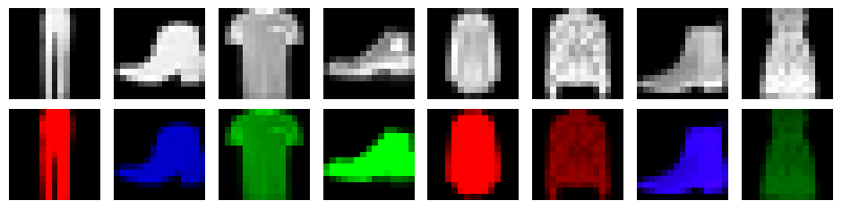

# On the Edge of Memorization in Diffusion Models

Sam Buchanan ††thanks: These authors contributed equally to this work. Affiliation: TTIC Druv Pai* Affiliation: UC Berkeley Yi Ma Affiliation: UC Berkeley, HKU Valentin De Bortoli Affiliation: Google DeepMind

## Abstract

###### p1-2

When do diffusion models reproduce their training data, and when are they able to generate samples beyond it? A practically relevant theoretical understanding of this interplay between memorization and generalization may significantly impact real-world deployments of diffusion models with respect to issues such as copyright infringement and data privacy. In this work, to disentangle the different factors that influence memorization and generalization in practical diffusion models, we introduce a scientific and mathematical “laboratory” for investigating these phenomena in diffusion models trained on fully synthetic or natural image-like structured data. Within this setting, we hypothesize that the memorization or generalization behavior of an underparameterized trained model is determined by the *difference in training loss* between an associated memorizing model and a generalizing model. To probe this hypothesis, we theoretically characterize a *crossover point* wherein the weighted training loss of a fully generalizing model becomes greater than that of an underparameterized memorizing model at a critical value of model (under)parameterization. We then demonstrate via carefully-designed experiments that the location of this crossover predicts a phase transition in diffusion models trained via gradient descent, validating our hypothesis. Ultimately, our theory enables us to analytically predict the model size at which memorization becomes predominant. Our work provides an analytically tractable and practically meaningful setting for future theoretical and empirical investigations. Code for our experiments is available at https://github.com/DruvPai/diffusion_mem_gen.

## 1 Introduction

###### p1-3

Diffusion models are one of the premier methodologies for deep generative modeling. They exhibit great capabilities across modalities and are state-of-the-art at synthesizing images (Saharia et al., 2022; Podell et al., 2023), videos (Ho et al., 2022; Blattmann et al., 2023), or proteins (Watson et al., 2023). Despite significant success when used in practice, in the context of large-scale commercial deployment (Ramesh et al., 2022) diffusion models are often plagued with data privacy and copyright infringement issues (Ghalebikesabi et al., 2023; Carlini et al., 2023; Nasr et al., 2023; Cui et al., 2023; Wang et al., 2024a; Vyas et al., 2023; Franceschelli and Musolesi, 2022), which may have significant long-term consequences. These issues stem from the possibility and (sometimes) propensity for diffusion models to *memorize* their training data. Namely, in some cases, trained diffusion models generate outputs which are verbatim copies of the training samples (Zhang et al., 2023; Kadkhodaie et al., 2023). Yet, in many other cases, these models can generate outputs which appear natural but are not present in the training set; this behavior is often described as *creativity* (Kamb and Ganguli, 2024) or *generalization* (Zhang et al., 2023; Kadkhodaie et al., 2023; Niedoba et al., 2024).

###### p1-4

In general, memorization and generalization are difficult to disambiguate. There has been significant *empirical* work focusing on building heuristic approaches to detect and study memorization in large-scale diffusion models (Zhang et al., 2023; Gu et al., 2023; Yoon et al., 2023; Carlini et al., 2023; Somepalli et al., 2023; Wen et al., 2024; Ross et al., 2024; Wang et al., 2024b; Wang et al., 2024**[p. 2]** a; Chen et al., 2024a). Most such approaches use ad-hoc definitions of memorization which compare the features of the generated samples (w.r.t. some deep neural network encoder) to features of samples from the training data (Pizzi et al., 2022). This choice effectively reduces the question of *how exactly can we define memorization?* to *how are the features of the chosen encoder related to the input data?* which is also a difficult problem (Papyan et al., 2020; Yu et al., 2023). While such methods appear to perform reasonably well in some practical cases, we emphasize that such measures of memorization are ultimately heuristic and there is still scientific disagreement about their efficacy (Stein et al., 2024). This is unsuitable for building a scientific understanding of diffusion models that could, among other things, potentially suggest resolutions to the aforementioned legal and societal issues.

###### p2-1

Thus, building a theoretical and scientific understanding of memorization in diffusion models is critical. The central problem that such a theory needs to contend with is that the training loss promotes memorization: given a fixed sample set, a sufficiently powerful and perfectly-optimized diffusion model will *always* reproduce the training data exactly, i.e., every single one of its generations will be exactly a training point (Peluchetti, 2023; Biroli et al., 2024; Kamb and Ganguli, 2024). Any theory of memorization must therefore explain why well-trained diffusion models do not always memorize. Several previous works have proposed different explanations for this issue in terms of certain aspects of the training procedure, such as the landscape of the stochastic optimization problem which minimizes the training loss (Wu et al., 2025; Vastola, 2025) and the parameterization of the backbone denoiser in the diffusion model (Yoon et al., 2023; Zhang et al., 2023; Wang et al., 2024c; Kamb and Ganguli, 2024; Niedoba et al., 2024; George et al., 2025). However, a precise and predictive theoretical characterization of memorization remains elusive.

#### Our contributions.

###### p2-2

In this work, we theoretically investigate memorization and generalization in diffusion models. We first introduce a *memorization laboratory*, a natural setting for investigating memorization and generalization in diffusion models trained on synthetic data. We justify this setting by proving that within it, we may distinguish a target distribution from its empirical version for many configurations of problem parameters. To explore the behavior of trained models, we hypothesize that *denoisers trained via gradient descent-like methods memorize or generalize depending on whether the empirical (training) loss is lower for parameter-matched memorizing denoisers or generalizing denoisers*. This hypothesis, to the best of our knowledge, has not been formally explored by prior work, and can only be probed here due to the controlled laboratory setting. To formalize and eventually attempt to falsify this hypothesis, we introduce a *partially memorizing denoiser*, an underparameterized denoiser whose output distribution’s samples are always memorized. Within a simple setting of our laboratory, we characterize the critical level of model (under)parameterization (“crossover point”) at which the training loss of the partially memorizing denoiser first becomes lower than the idealized generalizing denoiser, by deriving and using tight theoretical approximations to these losses. We show that, if our hypothesis is true, then this crossover characterization naturally provides the location of the *phase transition* from generalization to memorization in trained denoisers. Ultimately, we use these theoretically-derived tools to build a *predictive model for the phase transition* from generalization to memorization in terms of a minimal set of problem parameters, and show via experiments that our model achieves extremely low error in practice, validating our hypothesis. We finish our experiments by examining another setting of our laboratory which captures more of the complexities involved in training diffusion models on natural images, showing that despite its additional complexity it is qualitatively very similar to the first case. Beyond the current investigation, the framework we propose provides an analytically tractable yet rich setting for further investigation of memorization and generalization in diffusion models.

All proofs are included in the appendices. Our notation is presented in Tables 1 and 2.

## 2 A Memorization/Generalization Laboratory

Diffusion models show a complex tradeoff between model capacity, training compute, and dataset size with respect to key behaviors such as memorization and generalization. We present a framework (“laboratory”) to disentangle these different factors. The class of models we study is sufficiently expressive to admit a rich family of behaviors while remaining tractable for theoretical analysis.

**[p. 3]**

#### Diffusion models.

Given a target probability distribution $\pi_{\star}$ and a training dataset $(\boldsymbol{x}^{i})_{i=1}^{N}$ from $\pi_{\star}$, the goal of generative modeling is to define an *output probability distribution* $\hat{\pi}$ which approximates the underlying target $\pi_{\star}$. Diffusion models (Sohl-Dickstein et al., 2015; Song and Ermon, 2019; Ho et al., 2020) define such an output distribution $\hat{\pi}$ as the result of a stochastic process. More precisely, we consider, for $t\in[0,1]$, a noising process with marginals as follows:

$$
X_{t}\overset{d}{=}\alpha_{t}X_{0}+\sigma_{t}Z,\quad Z\sim\mathcal{N}(\mathbf{0},\boldsymbol{I}),\quad X_{0}\sim\pi_{\star}, \tag{2}
$$

with $\alpha_{0}=\sigma_{1}=1$ and $\alpha_{1}=\sigma_{0}=0$. This noising process can be associated with the dynamic

$$
\mathrm{d}X_{t}=f_{t}X_{t}\mathrm{d}t+g_{t}\mathrm{d}B_{t},\quad X_{0}\sim\pi_{\star}. \tag{3}
$$

where $f_{t}$ and $g_{t}$ can be obtained in closed form, see Gao et al. (2024) for instance, and $(B_{t})_{t\in[0,1]}$ is a $d$-dimensional Brownian motion. We recall that the backward process associated with (3) is given by

$$
\mathrm{d}Y_{t}=\{-f_{1-t}Y_{t}+(g_{1-t}^{2}/2)\nabla\log p_{1-t}(Y_{t})\}\mathrm{d}t+g_{1-t}\mathrm{d}B_{t},\quad Y_{0}\sim\mathcal{N}(\mathbf{0},\boldsymbol{I}), \tag{4}
$$

where $p_{t}$ is the density of $X_{t}$ at time $t$. Using Tweedie’s identity (Robbins, 1956), we have

$$
\nabla\log p_{t}(\boldsymbol{x}_{t})=(\alpha_{t}\bar{\boldsymbol{x}}(t,\boldsymbol{x}_{t})-\boldsymbol{x}_{t})/\sigma_{t}^{2}, \tag{5}
$$

where $\bar{\boldsymbol{x}}(t,\boldsymbol{x}_{t})=\mathbb{E}[X_{0}\ |\ X_{t}=\boldsymbol{x}_{t}]$. Thus, using the samples $(\boldsymbol{x}^{i})_{i=1}^{N}$, practical diffusion models define a denoiser that approximates $\bar{\boldsymbol{x}}$ by solving the training loss minimization problem

$$
\min_{\theta}\mathcal{L}_{N}(\bar{\boldsymbol{x}}_{\theta},\lambda) \tag{6}
$$

where

$$
\mathcal{L}_{N}(\bar{\boldsymbol{x}},\lambda)=\mathop{\mathbb{E}}_{#1}\left[\lambda(t)\mathcal{L}_{N,t}(\bar{\boldsymbol{x}})\right],\qquad\mathcal{L}_{N,t}(\bar{\boldsymbol{x}})=\frac{1}{N}\sum_{i=1}^{N}\mathop{\mathbb{E}}_{#1}\left[\left\lVert\bar{\boldsymbol{x}}(t,X_{t}^{i})-\boldsymbol{x}^{i}\right\rVert^{2}\right] \tag{7}
$$

over a parametric class of denoisers $\bar{\boldsymbol{x}}_{\theta}$, with $\lambda(t)$ a weighting function, $t$ distributed as $\operatorname{Unif}([0,1])$, and $X_{t}^{i}$ distributed according to the noising process (2) with $X_{0}=\boldsymbol{x}^{i}$, i.e., $X_{t}^{i}\overset{d}{=}\alpha_{t}\boldsymbol{x}^{i}+\sigma_{t}Z$. We then substitute the learned denoiser $\bar{\boldsymbol{x}}_{\theta}(t,\boldsymbol{x}_{t})$ into a suitable discretization of the backward process (4), via (5), which defines the *output distribution* $\hat{\pi}$ as the marginal distribution of $Y_{1}$.

As has been well noted in the literature, the training objective (6) is at odds with the stated goal of diffusion models. This is because the non-parametric minimizer of (6) memorizes the training data:

$$
\mathop{\mathrm{arg\,min}}_{\bar{\boldsymbol{x}}}\mathcal{L}_{N}(\bar{\boldsymbol{x}},\lambda)=\sum_{i=1}^{N}\boldsymbol{x}^{i}\operatorname{softmax}(\boldsymbol{w}(\,\cdot\,))_{i}, \tag{8}
$$

where $\bar{\boldsymbol{x}}(t,\,\cdot\,)$ is square-integrable, for any $\boldsymbol{v}\in\mathbb{R}^{N}$ we have $\operatorname{softmax}(\boldsymbol{v})_{i}=\mathrm{e}^{v_{i}}/\sum_{j=1}^{N}\mathrm{e}^{v_{j}}$, and

$$
w_{i}(\boldsymbol{x}_{t})=-\frac{1}{2\sigma_{t}^{2}}\|\alpha_{t}\boldsymbol{x}^{i}-\boldsymbol{x}_{t}\|^{2},\quad i=1,\dots,N. \tag{9}
$$

We denote the memorizing denoiser in (8) as $\bar{\boldsymbol{x}}_{\mathrm{mem}}(t,\boldsymbol{x}_{t})$. Towards theoretically studying the memorization/generalization trade-off in diffusion models, we first specify our main assumptions regarding the data and our models which define our memorization/generalization laboratory.

#### Data and model assumptions.

We set $\pi_{\star}$ to be an equally-weighted mixture of $K$ Gaussians in $\mathbb{R}^{d}$ with means $\boldsymbol{\mu}_{\star}^{k}\in\mathbb{R}^{d}$ and covariances $\boldsymbol{\Sigma}_{\star}^{k}\succeq\mathbf{0}$:

$$
\pi_{\star}=\frac{1}{K}\sum_{k=1}^{K}\mathcal{N}(\boldsymbol{\mu}_{\star}^{k},\boldsymbol{\Sigma}_{\star}^{k}\boldsymbol{I}). \tag{10}
$$

Gaussian mixture models are flexible enough to represent a large class of datasets while being amenable to theoretical investigation, see (Wang and Vastola, 2024; Shah et al., 2023; Wang et al., 2024c) for instance, Section 4.2 for an example, and Appendix A for a further discussion.

Let $M\in\mathbb{N}$ denote the number of equally-weighted mixture components in a generic Gaussian mixture $\pi_{\theta}$, with $\theta=(\boldsymbol{\mu}^{1},\boldsymbol{\Sigma}^{1},\dots,\boldsymbol{\mu}^{M},\boldsymbol{\Sigma}^{M})$. Tweedie’s identity (5) links the statistical model $\pi_{\theta}$ and its associated denoiser $\bar{\boldsymbol{x}}_{\theta}$, which we recall below in Section 2 and prove in Appendix A.

$$
\bar{\boldsymbol{x}}_{\theta}(t,\boldsymbol{x}_{t})=\frac{1}{\alpha_{t}}\left(\boldsymbol{x}_{t}-\sigma^{2}_{t}\sum_{i=1}^{M}(\alpha_{t}^{2}\boldsymbol{\Sigma}^{i}+\sigma_{t}^{2}\boldsymbol{I})^{-1}(\boldsymbol{x}_{t}-\alpha_{t}\boldsymbol{\mu}^{i})\operatorname{softmax}(\boldsymbol{w}(t,\boldsymbol{x}_{t}))_{i}\right), \tag{11}
$$

$$
w_{i}(t,\boldsymbol{x}_{t})=-\frac{1}{2}\log\det(\alpha_{t}^{2}\boldsymbol{\Sigma}^{i}+\sigma_{t}^{2}\boldsymbol{I})-\frac{1}{2}(\boldsymbol{x}_{t}-\alpha_{t}\boldsymbol{\mu}^{i})^{\top}(\alpha_{t}^{2}\boldsymbol{\Sigma}^{i}+\sigma_{t}^{2}\boldsymbol{I})^{-1}(\boldsymbol{x}_{t}-\alpha_{t}\boldsymbol{\mu}^{i}). \tag{12}
$$

**[p. 4]**

The class of $M$-parameter Gaussian mixture models constitutes a rich framework for investigating memorization and generalization. For at one extreme, where $M=K$, $\boldsymbol{\Sigma}^{k}=\boldsymbol{\Sigma}_{\star}^{k}$ and $\boldsymbol{\mu}^{k}=\boldsymbol{\mu}_{\star}^{k}$ for $k\in[K]$ we recover the *generalizing denoiser* associated to the target distribution (10), which we will denote as $\bar{\boldsymbol{x}}_{\star}$; and at the other extreme, with $M=N$, $\boldsymbol{\Sigma}^{i}=\mathbf{0}$, and $\boldsymbol{\mu}^{i}=\boldsymbol{x}^{i}$ for $i\in[N]$ we recover the *memorizing denoiser* $\bar{\boldsymbol{x}}_{\mathrm{mem}}$ as in (8). We will therefore consider the training loss (6) with the model class specified by Section 2, and study the role played by the model capacity $M$ as a function of the data complexity $K$, the dimension $d$, and the number of training samples $N$.

#### Memorization and generalization.

We now aim to quantify our notions of memorization and generalization. Quantifying memorization in generative models is a complicated issue and many metrics have been proposed to evaluate it in practice. We adopt a popular, relatively strict metric for memorization, proposed by Yoon et al. (2023).

On the other hand, generalization is easily formalized in statistical learning terms (in contrast to, e.g., assessing creativity of practical image diffusion models), see Appendix A. In experiments, we estimate the generalization error on a held-out set of samples from $\pi_{\star}$, which we can freely generate.

Given these quantitative definitions, the key question that we investigate in our laboratory is:

*For a trained denoiser $\bar{\boldsymbol{x}}_{\theta}$, can we quantitatively predict, based on problem parameters $M$, $N$, $d$, and $K$, whether it memorizes or generalizes?*

By the phrases “the denoiser memorizes/generalizes” we mean that its associated output distribution $\hat{\pi}$ produces memorized samples or samples (approximately) from the true distribution, as defined above. As we will immediately see, it is also fruitful to understand these behaviors as $\hat{\pi}$ being “close” to the empirical distribution $\pi_{\star}^{N}$ of the training set $(\boldsymbol{x}^{i})_{i=1}^{N}$ or the target distribution $\pi_{\star}$ respectively.

#### Scaling the number of samples.

Under the Gaussian mixture model $\pi_{\star}$ that generates the training data $(\boldsymbol{x}^{i})_{i=1}^{N}$, the parameters $K$ and $d$ (together with the means $\boldsymbol{\mu}^{k}_{\star}$ and covariances $\boldsymbol{\Sigma}_{\star}^{k}$) control the geometric complexity of the data. Relative to these measures of complexity, the scaling of the number of samples $N$ plays a fundamental role in the dichotomy between memorization and generalization behavior we seek to establish. We will focus on the case where $N=\operatorname{poly}(d)$, which we argue below is a correct scaling in which to study memorization and generalization.

For assessing the similarity of probability distributions, it is standard to use the $2$-Wasserstein distance $\mathrm{W}_{2}$ (Blau and Michaeli, 2017). We will argue that when $N=\exp[d\log d]$, there is no meaningful distinction between memorization and generalization in sufficiently high dimensions. For simplicity, assume all covariance matrices $\boldsymbol{\Sigma}_{\star}^{k}$ in the definition of $\pi_{\star}$ in (10) are full rank. Then by (Weed and Bach, 2019, Theorem 1, Proposition 7), we have for all $d\geq 4$ that $\mathbb{E}[\mathrm{W}_{2}(\pi_{\star},\pi^{N}_{\star})]\leq C_{0}N^{-1/2d}\leq C_{0}/\sqrt{d}$, for a constant $C_{0}\geq 0$. Therefore, $\mathrm{W}_{2}(\pi_{\star},\pi^{N}_{\star})\to 0$ and we cannot distinguish the true distribution $\pi_{\star}$ from its samples $\pi^{N}_{\star}$: memorization and generalization are equivalent. On the other hand, using (Weed and Bach, 2019, Theorem 1, Proposition 2), one has for *any* draw of the empirical measure that $\mathrm{W}_{2}(\pi_{\star},\pi_{\star}^{N})\geq C_{1}N^{-2/d}$ for a constant $C_{1}\geq 0$. In particular, if $N=\operatorname{poly}(d)$ then the $2$-Wasserstein distance is lower bounded by a constant for any dimension, implying a meaningful distinction between memorization and generalization.

| Notation | Interpretation |
|---|---|
| $N$ | Number of samples |
| $M$ | Capacity of the model |
| $K$ | Number of modes |
| $d$ | Problem dimension |

*Table 1: Data and model scalings.* **[p. 5]**

| Notation | Interpretation |
|---|---|
| $(\boldsymbol{\mu}^{i}_{\star})_{i=1}^{K},\sigma_{\star}^{2}$ | Data generating process parameters |
| $(\boldsymbol{\mu}^{i})_{i=1}^{M},\sigma^{2}$ | Learned model parameters |
| $\bar{\boldsymbol{x}}_{\star}(t,\boldsymbol{x}_{t})$ | MMSE denoiser, data generating process |
| $\bar{\boldsymbol{x}}_{\theta}(t,\boldsymbol{x}_{t})$ | MMSE denoiser, learned model |
| $\bar{\boldsymbol{x}}_{\mathrm{mem}}(t,\boldsymbol{x}_{t})$ | MMSE denoiser, empirical distribution |
| $\bar{\boldsymbol{x}}_{\mathrm{pmem},M}(t,\boldsymbol{x}_{t})$ | Partially memorizing denoiser |
| $\boldsymbol{w}$ | Softmax weight vector |

*Table 2: Data and model parameters.* **[p. 5]**

**[p. 5]**

## 3 Training Losses and Memorization

Now that we have set up the framework, we turn to answering the following fundamental question: *when do trained denoisers (i.e., approximate optimizers of (6)) memorize, and when do they generalize*? One first approach to answering this question would be to directly examine the critical points of the diffusion model training optimization problem (6) w.r.t. the denoiser parameterization (11). However, this is not straightforward; the problem is non-convex and there are many spurious critical points. Therefore, we posit a hypothesis which, roughly speaking, says that *the training losses of surrogate memorizing denoisers with $M$ parameters and generalizing denoisers is all that matters* for predicting the behavior of trained models with $M$ parameters.

To formalize this hypothesis, we will define two simple surrogate denoisers whose training losses will help us identify transitions between memorization and generalization as a function of the models’ underparameterization. The first of these two summary models is the generalizing denoiser $\bar{\boldsymbol{x}}_{\star}$. The second is a *partially memorizing* denoiser $\bar{\boldsymbol{x}}_{\mathrm{pmem},M}$, which memorizes the first $M$ training samples:11 1 For our theory, the choice of the subset of samples we use in the partial memorizing denoiser is irrelevant, as long as its size is $M$ and it is chosen independently of the samples.

$$
\bar{\boldsymbol{x}}_{\mathrm{pmem},M}(t,\boldsymbol{x}_{t})=\sum_{i=1}^{M}\boldsymbol{x}^{i}\operatorname{softmax}(\boldsymbol{w}(t,\boldsymbol{x}_{t}))_{i},\quad\text{where}\quad w_{i}(t,\boldsymbol{x}_{t})=-\frac{1}{2}\|\alpha_{t}\boldsymbol{x}^{i}-\boldsymbol{x}_{t}\|^{2}/\sigma_{t}^{2}. \tag{13}
$$

Note that here $\boldsymbol{w}\colon\mathbb{R}\times\mathbb{R}^{d}\to\mathbb{R}^{M}$, and in the case where $M=N$, it holds $\bar{\boldsymbol{x}}_{\mathrm{pmem},M}=\bar{\boldsymbol{x}}_{\mathrm{mem}}$. Therefore, we can formulate our hypothesis as follows:

*There exists a loss weighting $\lambda$ such that a trained denoiser $\bar{\boldsymbol{x}}_{\theta}$ with $M$ parameters memorizes if and only if $\mathcal{L}_{N}(\bar{\boldsymbol{x}}_{\mathrm{pmem},M},\lambda)\leq\mathcal{L}_{N}(\bar{\boldsymbol{x}}_{\star},\lambda)$.*

To attempt to verify this hypothesis, we will estimate the (excess) training losses of the two denoisers $\bar{\boldsymbol{x}}_{\mathrm{pmem},M}$ and $\bar{\boldsymbol{x}}_{\star}$ and compare them to develop a criterion for when a trained denoiser memorizes. For tractability, we focus on a special case of the general mixture of Gaussians model (10) where each mixture component has identical covariance, equal to a constant multiple of the identity matrix (i.e., $\boldsymbol{\Sigma}_{\star}^{k}=\sigma_{\star}^{2}\boldsymbol{I}$ for each $k\in[K]$ for the ground truth model (10), and $\boldsymbol{\Sigma}^{i}=\sigma^{2}\boldsymbol{I}$ for each $i\in[M]$ for general denoisers $\bar{\boldsymbol{x}}_{\theta}$), as reflected in Table 2. This is a common assumption in the theoretical literature on diffusion models (Shah et al., 2023; Gatmiry et al., 2024). The structure of the learned denoiser $\bar{\boldsymbol{x}}_{\theta}$ implied by Section 2 simplifies to:

$$
\bar{\boldsymbol{x}}_{\theta}(t,\boldsymbol{x}_{t})=\frac{\alpha_{t}\sigma^{2}}{\alpha_{t}^{2}\sigma^{2}+\sigma_{t}^{2}}\boldsymbol{x}_{t}+\frac{\sigma_{t}^{2}}{\alpha_{t}^{2}\sigma^{2}+\sigma_{t}^{2}}\sum_{i=1}^{M}\boldsymbol{\mu}^{i}\operatorname{softmax}(\boldsymbol{w}(\boldsymbol{x}_{t}))_{i}, \tag{14}
$$

where

$$
w_{i}(\boldsymbol{x}_{t})=-\frac{1}{2}\|\alpha_{t}\boldsymbol{\mu}^{i}-\boldsymbol{x}_{t}\|^{2}/(\alpha_{t}^{2}\sigma^{2}+\sigma_{t}^{2}),\quad i=1,\dots,M, \tag{15}
$$

with the analogous structure for $\bar{\boldsymbol{x}}_{\star}=\bar{\boldsymbol{x}}_{(\boldsymbol{\mu}^{1}_{\star},\dots,\boldsymbol{\mu}^{K}_{\star},\sigma_{\star}^{2})}$. In contrast to (14), the form of the memorizing and partially memorizing denoisers (8) and (13) does not change. Note that when $M\geq K$, the denoiser $\bar{\boldsymbol{x}}_{\theta}$ with $M$ parameters can generalize, and when $M\geq N$, it can memorize.22 2 As we show rigorously in Appendix B using properties of the softmax function, the loss (6) of any $M$-parameter denoiser $\bar{\boldsymbol{x}}_{(\boldsymbol{\mu}^{1},\dots,\boldsymbol{\mu}^{M},\sigma^{2})}$ can be achieved by a sequence of $M+1$ parameter denoisers. Therefore for a fixed value of $M\geq K$, a denoiser with $M$ parameters can be (arbitrarily close to) the generalizing denoiser, i.e., denoisers with arbitrarily many parameters can generalize, and similarly for memorization with $M\geq N$.

*Figure 1: **We observe a remarkable degree of agreement between our loss approximations and the empirical losses. A simulation of the loss of the partially memorizing and generalizing denoisers $\bar{\boldsymbol{x}}_{\star}$ and $\bar{\boldsymbol{x}}_{\mathrm{pmem},M}$ at a high-SNR value of $t$, with $d=50$, $K=12$, and $N=200$, and compare them to the approximations introduced in Sections 3 and 3. **[p. 6]** We use a constant $2$ for the $\Theta(\,\cdot\,)$ expression appearing in Section 3, which we can prove is also an upper-bound.*** **[p. 6]**

#### Training losses of memorizing and generalizing denoisers.

In what follows, we are going to state our main theoretical results which characterize the behavior of two denoisers of interest. More precisely, we compare the training loss (6) computed for the $K$-parameter generalizing denoiser $\bar{\boldsymbol{x}}_{\star}$ with the training loss obtained by an $M$-parameter partially memorizing denoiser (13), with $M\geq K$. To do this we compute the high dimensional asymptotics of these denoisers’ excess training losses. Note that these asymptotics provide approximations (annotated with hats, i.e., $\hat{\mathcal{L}}_{N,t}$) which agree well with experiments at even moderate dimensions (see Figure 1 and Section 4).

We recall the standard re-expression of the objective in (6) via the orthogonality principle: for any $t$,

$$
\mathcal{L}_{N,t}(\bar{\boldsymbol{x}}) =\frac{1}{N}\sum_{i=1}^{N}\mathop{\mathbb{E}}_{#1}\left[\left\lVert\bar{\boldsymbol{x}}(t,X_{t}^{i})-\bar{\boldsymbol{x}}_{\mathrm{mem}}(t,X_{t}^{i})\right\rVert^{2}\right]+\frac{1}{N}\sum_{i=1}^{N}\mathop{\mathbb{E}}_{#1}\left[\left\lVert\bar{\boldsymbol{x}}_{\mathrm{mem}}(t,X_{t}^{i})-\boldsymbol{x}^{i}\right\rVert^{2}\right], \\
=\frac{1}{N}\sum_{i=1}^{N}\mathop{\mathbb{E}}_{#1}\left[\left\lVert\bar{\boldsymbol{x}}(t,X_{t}^{i})-\bar{\boldsymbol{x}}_{\mathrm{mem}}(t,X_{t}^{i})\right\rVert^{2}\right]+\mathcal{L}_{N,t}(\bar{\boldsymbol{x}}_{\mathrm{mem}}), \tag{16}
$$

where $\bar{\boldsymbol{x}}_{\mathrm{mem}}$ is the memorizing denoiser (8) and $X_{t}^{i}$ is distributed as (2) initialized with $\boldsymbol{x}^{i}$, i.e., $X_{t}^{i}\overset{d}{=}\alpha_{t}\boldsymbol{x}^{i}+\sigma_{t}Z$ where $Z\sim\mathcal{N}(\mathbf{0},\boldsymbol{I})$.

Our first result fully characterizes the expected excess training loss of the generalizing denoiser $\bar{\boldsymbol{x}}_{\star}$, given by (14) with $\theta=(\boldsymbol{\mu}_{\star}^{1},\dots,\boldsymbol{\mu}_{\star}^{K},\sigma_{\star}^{2})$, over a draw of the random i.i.d. sample $(\boldsymbol{x}^{1},\dots,\boldsymbol{x}^{N})$ from $\pi_{\star}$, under an assumption that the cluster centers $\boldsymbol{\mu}_{\star}^{k}$ are well-separated in $\ell^{2}$ distance. For simplicity, we state our results in the regime where $\max_{k}\lVert\boldsymbol{\mu}_{\star}^{k}\rVert^{2}=O(d)$ and $\sigma_{\star}^{2}=\Theta(1)$.33 3 To motivate this regime, note that in intuitive terms, images sampled from such a $\pi_{\star}$ are centered at a nominal image whose pixel intensities are normalized to $[0,1]$, and the variability due to the Gaussian noise can change each pixel by a constant amount. Denote the signal-to-noise ratio (SNR) of the noising process (2) by $\psi:(0,1)\to(0,+\infty)$, where $\psi_{t}=\alpha_{t}^{2}/\sigma_{t}^{2}$, which is assumed to be decreasing, and its inverse by $\varsigma\colon(0,+\infty)\to(0,1)$.

$$
\mathop{\mathbb{E}}_{#1}\left[\mathcal{L}_{N,t}(\bar{\boldsymbol{x}}_{\star})-\mathcal{L}_{N,t}(\bar{\boldsymbol{x}}_{\mathrm{mem}})\right]=\Theta\left(\frac{d\sigma_{\star}^{2}}{\psi_{t}\sigma_{\star}^{2}+1}\right). \tag{18}
$$

Although Section 3 is stated for the excess training loss, our proofs further establish high-probability bounds on the behavior of the excess loss of the same order of magnitude. Moreover, in the scaling regime for $\sigma_{\star}^{2}$ and $(\boldsymbol{\mu}_{\star}^{k})_{k=1}^{K}$ treated in Section 3, it is easily shown that for practically-relevant choices of $\alpha_{t}$ and $\sigma_{t}$, for example the scheme $\alpha_{t}=\sqrt{1-t^{2}}$, $\sigma_{t}=t$ that we use in our experiments in Section 4, $\kappa(d)\to 1$ as $d\to\infty$. As a consequence, for sufficiently large $d$, the uniform control of the risk for $t\in[0,\kappa(d)]$ that is established in Section 3 implies uniform control of the weighted integrated loss (6), via (16).

**[p. 7]**

Our second result estimates the excess training loss of the partially memorizing denoiser $\bar{\boldsymbol{x}}_{\mathrm{pmem},M}$.

$$
\mathop{\mathbb{E}}_{#1}\left[\mathcal{L}_{N,t}(\bar{\boldsymbol{x}}_{\mathrm{pmem},M})-\mathcal{L}_{N,t}(\bar{\boldsymbol{x}}_{\mathrm{mem}})\right]=\Theta\left(\left(1-\frac{M}{N}\right)d\sigma_{\star}^{2}\right). \tag{19}
$$

Note that by following the proof, we can also derive a corresponding high-probability bound.

#### When does each denoiser have lower training loss?

Comparing Section 3 and Section 3, in high dimensions ($d\to\infty$) we estimate the training loss difference as

$$
\mathop{\mathbb{E}}_{#1}\left[\mathcal{L}_{N}(\bar{\boldsymbol{x}}_{\mathrm{pmem},M},\lambda)-\mathcal{L}_{N}(\bar{\boldsymbol{x}}_{\star},\lambda)\right]\approx\mathop{\mathbb{E}}_{#1}\left[\lambda(t)\left\{C\left(1-\frac{M}{N}\right)d\sigma_{\star}^{2}-\frac{d\sigma_{\star}^{2}}{\psi_{t}\sigma_{\star}^{2}+1}\right\}\right], \tag{20}
$$

where $C\in[1,2]$ is a constant. Notice that this expression is monotonically decreasing as $M\to N$, so there exists a “crossover point” $M_{\star}$ such that the (approximate) training loss of the partially memorizing denoiser is higher than that of the generalizing denoiser for $M\leq M_{\star}$ and lower for $M\geq M_{\star}$. Solving for $M_{\star}$, we obtain

$$
\mathop{\mathbb{E}}_{#1}\left[\mathcal{L}_{N}(\bar{\boldsymbol{x}}_{\mathrm{pmem},M_{\star}},\lambda)-\mathcal{L}_{N}(\bar{\boldsymbol{x}}_{\star},\lambda)\right]\approx 0\implies M_{\star}\approx N\left\{1-\frac{\mathop{\mathbb{E}}_{#1}\left[\lambda(t)/(\psi_{t}\sigma_{\star}^{2}+1)\right]}{C\mathop{\mathbb{E}}_{#1}\left[\lambda(t)\right]}\right\}, \tag{21}
$$

which is a *linear* function of $N$. This criterion provides a *test* for our hypothesis: if we believe that there exists a loss weighting $\lambda$ such that the memorization and generalization properties of trained denoisers are controlled by the location of the crossover point w.r.t. $\lambda$, then we should see an approximately linear relationship between the location of memorization and the number of samples. We conduct this test in Section 4, in the immediate sequel.

## 4 Experiments

In this section, we illustrate the versatility and efficacy of our laboratory through experimental analysis. First, we show that inside the setting of our laboratory, *trained* models exhibit a *phase transition from generalization to memorization*. Specifically in the isotropic Gaussian mixture setting, our main result builds a *predictive model* for the onset of memorization, and shows that it resolves to a simple linear fit as in (21), which *validates our hypothesis* from Section 3. Finally, we showcase the flexibility of our laboratory by studying a low-rank Gaussian mixture setting which is constructed to imitate the structure of training a denoiser on natural images, yet still belongs to the setting of our theoretical laboratory and exhibits similar phase transition behavior as in the simple isotropic case. We provide further details and more results, including mechanistic analyses, in Appendix H.

#### High-level experiment details, and memorization criterion.

For training, we use the training loss (6) with the loss weighting $\lambda(t)=(\alpha_{t}/\sigma_{t})^{2}$ (i.e., “noise prediction”). For sampling, we use the DDIM sampler (Song et al., 2020), more precisely the implementation suggested by (De Bortoli et al., 2025), with the “variance preserving” coefficients $\alpha_{t}=\sqrt{1-t^{2}}$ and $\sigma_{t}=t$. We discretize the time interval $[\epsilon,1-\epsilon]$ uniformly into $L+1$ timesteps $(t_{\ell})_{\ell=0}^{L}$, where $\epsilon=10^{-3}$, and use these timesteps for both training and sampling. For completeness we formally describe the end-to-end procedure in Section H.2. We consider the memorization criterion introduced in Section 2 with constant $c=1/9$, i.e., $\hat{\boldsymbol{x}}$ is memorized if $\lVert\hat{\boldsymbol{x}}-\boldsymbol{x}^{(1)}\rVert^{2}\leq(1/9)\lVert\hat{\boldsymbol{x}}-\boldsymbol{x}^{(2)}\rVert^{2}$ where $\hat{\boldsymbol{x}}$ is the generated sample, and $\boldsymbol{x}^{(k)}$ is the $k^{\mathrm{th}}$ closest point to $\hat{\boldsymbol{x}}$ in the training dataset. Then, we say that a denoiser $\bar{\boldsymbol{x}}$ is *memorizing on average* if its *memorization ratio* is $\geq 1/2$, i.e., at least 50% of the samples $\hat{\boldsymbol{x}}$ drawn from the associated output measure $\hat{\pi}$ are memorized; we say it has *started the phase transition* if its memorization ratio is $\geq 1/10$ and *ended the phase transition* if its memorization ratio is $\geq 9/10$.

**[p. 8]**

### 4.1 Experiments for an Isotropic Gaussian Mixture Model

First, as in Section 3, we consider the target measure $\pi_{\star}$ to be an isotropic Gaussian mixture model, namely, $\pi_{\star}=(1/K)\sum_{i=1}^{K}\mathcal{N}(\boldsymbol{\mu}_{\star}^{i},\sigma_{\star}^{2}\boldsymbol{I})$. As emphasized in the rest of the work, we will study what happens when we use a denoiser $\bar{\boldsymbol{x}}_{\theta}$ corresponding to an isotropic Gaussian mixture model with a different number of components $M$, with the parameterization given by (14).

*Figure 2: **We observe a clear phase transition between from generalization to memorization in trained models. *Left:* A plot of the “memorization ratio” — the ratio of generated samples that are memorized over a set of $N_{\mathrm{eval}}=50$ generations — as the number of components of the trained denoiser increases. The start and end of the phase transition, as formally defined at the beginning of Section 4, are bracketed by the gray shaded region. *Middle:* A plot of the training loss of the trained model in terms of the number of components, compared to partially memorizing, fully memorizing, and ground truth denoisers, at a representative $t\approx 0.3$ with SNR $\psi_{t}\approx 6.704$. *Right:* A plot of the test loss $\mathcal{L}_{t}$, estimated over a hold-out set, in the same setting. *We observe that there is a phase transition from generalization to memorization, visible through the behavior of the memorization ratio and loss plots*; the model stops generalizing (i.e., having an acceptable test loss) only when it starts memorizing (i.e., generating samples which are approximately contained in the training data).*** **[p. 8]**

*Figure 3: **We can accurately predict the phase transition using our loss approximations. The optimal loss weighting as per (22) using normalized *approximate losses*. Train and test errors are $\leq 2\times 10^{-4}$ when the regression targets are $\approx 10^{0}$.*** **[p. 8]**

#### Existence of a phase transition.

The first and arguably most critical property of the trained denoisers in our laboratory is that *there exists a phase transition from generalization to memorization as the model size increases*, which we show in Figure 2. Namely, we observe in the rightmost panel that initially, heavily underparameterized trained denoisers exhibit statistical generalization (i.e., similar train and test loss to the ground truth denoiser $\bar{\boldsymbol{x}}_{\star}$); then, as the model size $M$ increases, we observe a rapid transition to *memorization* where the generated samples are memorized (nearly) 100% of the time (center and left panels). We emphasize that this replicates the central observations of many empirical studies of memorization in diffusion models, such as Zhang et al. (2023); Kadkhodaie et al. (2023).

#### Predicting the phase transition.

Next, we show (via Figure 3) that the phase transition is *predictable* using *only the approximate training losses derived in Section 3*; namely, it serves as the “crossover point” of the integrated approximate training loss $\hat{\mathcal{L}}_{N}(\cdot,\tilde{\lambda})$ for a particular timestep weighting $\tilde{\lambda}(t)$, and this crossover point is *a linear function* of the number of training samples $N$. To show this, we compute $\tilde{\lambda}(t)$ as follows. First, we create a grid of $(N,d,K)$ tuples and train several denoisers in each setting in order to estimate the location of the phase transition $M_{\mathrm{pt}}(N,d,K)$, the first $M$ such that the trained denoiser $\bar{\boldsymbol{x}}_{\theta}$ is memorizing on average. Then, we solve the following optimization problem in the loss weighting $\tilde{\lambda}$ to make $M_{\mathrm{pt}}(N,d,K)$ close to the crossover point:

$$
\min_{\tilde{\lambda}}\sum_{(N,d,K)}\left(\frac{\tilde{M}_{\mathrm{pt}}(N,d,K,\tilde{\lambda})}{N}-\frac{M_{\mathrm{pt}}(N,d,K)}{N}\right)^{2}, \tag{22}
$$

**[p. 9]**

where $\tilde{M}_{\mathrm{pt}}(N,d,K,\tilde{\lambda})$ is the nearest $M$ to the crossover point with loss weighting $\tilde{\lambda}$, i.e.,

$$
\tilde{M}_{\mathrm{pt}}(N,d,K,\tilde{\lambda})=\mathop{\mathrm{arg\,min}}_{M}\left(\sum_{\ell=0}^{L}\tilde{\lambda}(t_{\ell})\{\hat{\mathcal{L}}_{N,t}(\bar{\boldsymbol{x}}_{\mathrm{pmem},M}(N,d,K))-\hat{\mathcal{L}}_{N,t}(\bar{\boldsymbol{x}}_{\star}(N,d,K))\}\right)^{2}. \tag{23}
$$

The optimization and normalization details are postponed to Section H.3.In Figure 3, we report that the train error and test error (evaluated on a holdout set) are less than $2\times 10^{-4}$, signifying that we are able to compute the location of the memorization phase transition within one or two $M$’s on average, making our predictive model extremely accurate. Moreover, the recovered $\tilde{M}_{\mathrm{pt}}$ is always a *linear function* of $N$, namely $\tilde{M}_{\mathrm{pt}}(N,d,K,\tilde{\lambda})=(4/5)N$. Therefore, $M_{\mathrm{pt}}(N,d,K)\approx\tilde{M}_{\mathrm{pt}}(N,d,K,\tilde{\lambda})=(4/5)N$, demonstrating experimentally that the consequences of our hypothesis (e.g., (21)) do indeed hold. Overall, *the generalization-memorization phase transition is effectively predictable via our hypothesis and subsequent theoretical characterization of the loss*.

### 4.2 Experiments for a Simple Image Model

In the previous Section 4.1, we considered data which belonged to an isotropic Gaussian mixture model. To showcase the versatility of our Gaussian mixture model formulation, we construct a (low-rank) Gaussian mixture model whose samples resemble natural images. Namely, we consider a flattened and monochromatic $d\times d$ image (“template”) $\boldsymbol{x}_{\star}\in\mathbb{R}^{d^{2}}$. Now, we endow $\boldsymbol{x}_{\star}$ with a *color* $\boldsymbol{c}$, sampled randomly as $\boldsymbol{c}\sim\mathcal{N}(\boldsymbol{u}_{\star},\sigma_{\star}^{2}\boldsymbol{I})\in\mathbb{R}^{c}$. The colored output $\boldsymbol{y}\in\mathbb{R}^{cd^{2}}$ is given by $\boldsymbol{y}=\boldsymbol{c}\mathbin{\otimes}\boldsymbol{x}_{\star}$ where $\mathbin{\otimes}$ is the Kronecker product. Defining the matrix $\boldsymbol{A}_{\boldsymbol{x}}:=\boldsymbol{I}\mathbin{\otimes}\boldsymbol{x}$ we have $\boldsymbol{y}=\boldsymbol{A}_{\boldsymbol{x}_{\star}}\boldsymbol{c}$. The colored image $\boldsymbol{Y}\in\mathbb{R}^{c\times d\times d}$ is obtained by reshaping $\boldsymbol{y}$. Since $\boldsymbol{c}\sim\mathcal{N}(\boldsymbol{u}_{\star},\sigma_{\star}^{2}\boldsymbol{I})$ and $\boldsymbol{y}=\boldsymbol{A}_{\boldsymbol{x}_{\star}}\boldsymbol{c}$, it holds that $\boldsymbol{y}\sim\mathcal{N}(\boldsymbol{A}_{\boldsymbol{x}_{\star}}\boldsymbol{u}_{\star},\sigma_{\star}^{2}\boldsymbol{A}_{\boldsymbol{x}_{\star}}\boldsymbol{A}_{\boldsymbol{x}_{\star}}^{\top})$. Note, in particular, that $\boldsymbol{y}$ is a low-rank Gaussian random variable. By combining multiple templates and color distributions, we obtain a mixture of low-rank Gaussians for our data distribution, namely, $\boldsymbol{y}\sim\pi_{\star}:=(1/K)\sum_{i=1}^{K}\mathcal{N}(\boldsymbol{A}_{\star}^{i}\boldsymbol{u}_{\star}^{i},\sigma_{\star}^{2}\boldsymbol{A}_{\star}^{i}(\boldsymbol{A}_{\star}^{i})^{\top})$. This is an instance of Equation 10, and so we can compute its denoiser via Section 2. In Section H.4 we discuss some ways to efficiently implement this class of low-rank denoisers. We visualize some samples in Figure 4 with FashionMNIST templates (Xiao et al., 2017).

*Figure 4: **Our memorization laboratory enables modeling of natural image distributions with latent low-dimensional structure. Some sample synthetic images from our simple image model (*bottom*) visualized alongside their corresponding monochromatic image templates (*top*).*** **[p. 9]**

*Figure 5: **A phase transition persists in the low-rank Gaussian natural image model. *Left:* The memorization ratio as the number of components of the trained denoiser increases while everything else is fixed. *Middle:* The training loss of the trained model in terms of the number of components, compared to partially memorizing, fully memorizing, and ground truth denoisers, at a representative $t\approx 0.3$ with SNR $\psi\approx 6.704$. *Right:* The test loss, computed over a hold-out set, in the same setting. We emphasize the identical qualitative picture to Figure 2, wherein we can observe a phase transition from generalization to memorization from the memorization ratio and loss plots. Transient “jaggedness” may be explained by larger variance in the loss estimation.*** **[p. 10]**

Our main result demonstrates that our framework is still expressive enough to model this facsimile of real-world image distributions, and that it exhibits similar phenomena to the isotropic case, enabling it to be studied in detail via our laboratory. Notably, we show in Figure 5 that we can still identify a phase transition phenomenon, which looks qualitatively similar to the isotropic Gaussian mixture model studied in Section 4.1 and throughout the work.

## 5 Related Works

Understanding memorization and generalization properties of diffusion models is crucial for practitioners (Somepalli et al., 2023; Ren et al., 2024; Rahman et al., 2024; Wang et al., 2024a; Chen et al., 2024b; Stein et al., 2024). Indeed, concerns about privacy (Ghalebikesabi et al., 2023; Carlini et al., 2023; Nasr et al., 2023) and copyright infringement (Cui et al., 2023; Wang et al., 2024a; Vyas et al., 2023; Franceschelli and Musolesi, 2022) are key issues as these models are deployed. Several factors can influence the memorization capabilities of diffusion models such as duplication (Carlini et al., 2023; Ross et al., 2024; Webster, 2023) or model architecture (Chavhan et al., 2024). We refer to (Gu et al., 2023; Kadkhodaie et al., 2023) for an in-depth experimental investigation of those issues.

**[p. 10]**

On the theoretical side, memorization in diffusion models has been investigated through the lens of statistical physics leveraging the concept of *phase transition* (Biroli et al., 2024; Li et al., 2023; Ambrogioni, 2023; Ventura et al., 2024; Raya and Ambrogioni, 2024; Sakamoto et al., 2024; Pavasovic et al., 2025). In particular in (Biroli et al., 2024), the authors identify three critical transitions for the diffusion model generative trajectories assuming that the score is assumed to be perfectly learned. George et al. (2025) investigated generalization and memorization in trained random features neural network denoisers (nonparametric models) in the case where the data is a standard Gaussian. Our work is complementary to the theories of “creativity” and generalization of Kamb and Ganguli (2024); Niedoba et al. (2024); Vastola (2025), which suggest in different contexts that generalization in diffusion models arises from the implicit bias of an underparameterized denoiser (Vastola (2025) also considers the landscape of the training objective, see (Bertrand et al., 2025) for a rebuttal). Our work disentangles the competing factors in the implicit biases discussed in these works and captures the essential features into our theoretical laboratory. While in this work we only study in detail the simplest and most interpretable instantiation of the laboratory, further connections from our framework to such previous work may be possible and enable us to broaden the scope of practical settings for which we have robust theoretical results.

## 6 Conclusion

In this paper, we have introduced a theoretical laboratory for measuring and predicting memorization and creativity in diffusion models. Focusing on data drawn from $K$-component Gaussian mixture models and Gaussian mixture denoisers with a number of components ranging from $K$ to the number of training samples $N$, our laboratory disentangles different factors contributing to memorization and generalization, enabling us to compute tight theoretical approximations for the losses of representative denoisers within this model class and thereby predict the onset of memorization in trained models at inference time.

While our current framework allows us to study generalization and memorization behavior in a rigorous and testable setting, we highlight several avenues of improvement. First, our model can be extended to capture additional properties of larger and more realistic datasets such as intrinsic dimensionality or partial data replication. In future work, we plan on expanding the memorization/generalization laboratory to cover those cases and refining the asymptotics of our training losses. We envision the laboratory growing to encompass a framework for understanding memorization and generalization purely in terms of the *geometry of the data*, with a robust and extensive experimental apparatus to test hypotheses and verify predictions, and a rich theoretical toolkit that reduces statistical questions of sampling in trained diffusion models to geometric questions about the data itself.

#### Acknowledgements.

YM acknowledges support from the joint Simons Foundation-NSF DMS grant #2031899, the ONR grant N00014-22-1-2102, the NSF grant #2402951, and the startup fund from the University of Hong Kong.

**[p. 11]**

## References

- Chitwan Saharia, William Chan, Saurabh Saxena, Lala Li, Jay Whang, Emily L Denton, Kamyar Ghasemipour, Raphael Gontijo Lopes, Burcu Karagol Ayan, Tim Salimans, et al. Photorealistic text-to-image diffusion models with deep language understanding. *Advances in neural information processing systems*, 35:36479–36494, 2022.

- Dustin Podell, Zion English, Kyle Lacey, Andreas Blattmann, Tim Dockhorn, Jonas Müller, Joe Penna, and Robin Rombach. Sdxl: Improving latent diffusion models for high-resolution image synthesis. *arXiv preprint arXiv:2307.01952*, 2023.

- Jonathan Ho, Tim Salimans, Alexey Gritsenko, William Chan, Mohammad Norouzi, and David J Fleet. Video diffusion models. *Advances in Neural Information Processing Systems*, 35:8633–8646, 2022.

- Andreas Blattmann, Robin Rombach, Huan Ling, Tim Dockhorn, Seung Wook Kim, Sanja Fidler, and Karsten Kreis. Align your latents: High-resolution video synthesis with latent diffusion models. In *Proceedings of the IEEE/CVF conference on computer vision and pattern recognition*, pages 22563–22575, 2023.

- Joseph L Watson, David Juergens, Nathaniel R Bennett, Brian L Trippe, Jason Yim, Helen E Eisenach, Woody Ahern, Andrew J Borst, Robert J Ragotte, Lukas F Milles, et al. De novo design of protein structure and function with rfdiffusion. *Nature*, 620(7976):1089–1100, 2023.

- Aditya Ramesh, Prafulla Dhariwal, Alex Nichol, Casey Chu, and Mark Chen. Hierarchical text-conditional image generation with clip latents. *arXiv preprint arXiv:2204.06125*, 1(2):3, 2022.

- Sahra Ghalebikesabi, Leonard Berrada, Sven Gowal, Ira Ktena, Robert Stanforth, Jamie Hayes, Soham De, Samuel L Smith, Olivia Wiles, and Borja Balle. Differentially private diffusion models generate useful synthetic images. *arXiv preprint arXiv:2302.13861*, 2023.

- Nicolas Carlini, Jamie Hayes, Milad Nasr, Matthew Jagielski, Vikash Sehwag, Florian Tramer, Borja Balle, Daphne Ippolito, and Eric Wallace. Extracting training data from diffusion models. In *32nd USENIX Security Symposium (USENIX Security 23)*, pages 5253–5270, 2023.

- Milad Nasr, Nicholas Carlini, Jonathan Hayase, Matthew Jagielski, A Feder Cooper, Daphne Ippolito, Christopher A Choquette-Choo, Eric Wallace, Florian Tramèr, and Katherine Lee. Scalable extraction of training data from (production) language models. *arXiv preprint arXiv:2311.17035*, 2023.

- Yingqian Cui, Jie Ren, Han Xu, Pengfei He, Hui Liu, Lichao Sun, Yue Xing, and Jiliang Tang. Diffusionshield: A watermark for copyright protection against generative diffusion models. *arXiv preprint arXiv:2306.04642*, 2023.

- Wenhao Wang, Yifan Sun, Zongxin Yang, Zhengdong Hu, Zhentao Tan, and Yi Yang. Replication in visual diffusion models: A survey and outlook. *arXiv preprint arXiv:2408.00001*, 2024a.

- Nikhil Vyas, Sham M Kakade, and Boaz Barak. On provable copyright protection for generative models. In *International Conference on Machine Learning*, pages 35277–35299. PMLR, 2023.

- Giorgio Franceschelli and Mirco Musolesi. Copyright in generative deep learning. *Data & Policy*, 4:e17, 2022.

- Huijie Zhang, Jinfan Zhou, Yifu Lu, Minzhe Guo, Peng Wang, Liyue Shen, and Qing Qu. The emergence of reproducibility and generalizability in diffusion models. *arXiv preprint arXiv:2310.05264*, 2023.

- Zahra Kadkhodaie, Florentin Guth, Eero P Simoncelli, and Stéphane Mallat. Generalization in diffusion models arises from geometry-adaptive harmonic representation. *arXiv preprint arXiv:2310.02557*, 2023.

- Mason Kamb and Surya Ganguli. An analytic theory of creativity in convolutional diffusion models. *arXiv preprint arXiv:2412.20292*, 2024.

**[p. 12]**

- Matthew Niedoba, Berend Zwartsenberg, Kevin Murphy, and Frank Wood. Towards a mechanistic explanation of diffusion model generalization. *arXiv preprint arXiv:2411.19339*, 2024.

- Xiangming Gu, Chao Du, Tianyu Pang, Chongxuan Li, Min Lin, and Ye Wang. On memorization in diffusion models. *arXiv preprint arXiv:2310.02664*, 2023.

- TaeHo Yoon, Joo Young Choi, Sehyun Kwon, and Ernest K Ryu. Diffusion probabilistic models generalize when they fail to memorize. In *ICML 2023 Workshop on Structured Probabilistic Inference $\{$$\backslash$&$\}$ Generative Modeling*, 2023.

- Gowthami Somepalli, Vasu Singla, Micah Goldblum, Jonas Geiping, and Tom Goldstein. Diffusion art or digital forgery? investigating data replication in diffusion models. In *Proceedings of the IEEE/CVF Conference on Computer Vision and Pattern Recognition*, pages 6048–6058, 2023.

- Yuxin Wen, Yuchen Liu, Chen Chen, and Lingjuan Lyu. Detecting, explaining, and mitigating memorization in diffusion models. In *The Twelfth International Conference on Learning Representations*, 2024.

- Brendan Leigh Ross, Hamidreza Kamkari, Tongzi Wu, Rasa Hosseinzadeh, Zhaoyan Liu, George Stein, Jesse C Cresswell, and Gabriel Loaiza-Ganem. A geometric framework for understanding memorization in generative models. *arXiv preprint arXiv:2411.00113*, 2024.

- Hanyu Wang, Yujin Han, and Difan Zou. On the discrepancy and connection between memorization and generation in diffusion models. In *ICML 2024 Workshop on Foundation Models in the Wild*, 2024b.

- Yunhao Chen, Xingjun Ma, Difan Zou, and Yu-Gang Jiang. Towards a theoretical understanding of memorization in diffusion models. *arXiv preprint arXiv:2410.02467*, 2024a.

- Ed Pizzi, Sreya Dutta Roy, Sugosh Nagavara Ravindra, Priya Goyal, and Matthijs Douze. A self-supervised descriptor for image copy detection. In *Proceedings of the IEEE/CVF Conference on Computer Vision and Pattern Recognition*, pages 14532–14542, 2022.

- Vardan Papyan, XY Han, and David L Donoho. Prevalence of neural collapse during the terminal phase of deep learning training. *Proceedings of the National Academy of Sciences*, 117(40):24652–24663, 2020.

- Yaodong Yu, Sam Buchanan, Druv Pai, Tianzhe Chu, Ziyang Wu, Shengbang Tong, Benjamin Haeffele, and Yi Ma. White-box transformers via sparse rate reduction. *Advances in Neural Information Processing Systems*, 36:9422–9457, 2023.

- George Stein, Jesse Cresswell, Rasa Hosseinzadeh, Yi Sui, Brendan Ross, Valentin Villecroze, Zhaoyan Liu, Anthony L Caterini, Eric Taylor, and Gabriel Loaiza-Ganem. Exposing flaws of generative model evaluation metrics and their unfair treatment of diffusion models. *Advances in Neural Information Processing Systems*, 36, 2024.

- Stefano Peluchetti. Non-denoising forward-time diffusions. *arXiv preprint arXiv:2312.14589*, 2023.

- Giulio Biroli, Tony Bonnaire, Valentin De Bortoli, and Marc Mézard. Dynamical regimes of diffusion models. *arXiv preprint arXiv:2402.18491*, 2024.

- Yu-Han Wu, Pierre Marion, GÊrard Biau, and Claire Boyer. Taking a big step: Large learning rates in denoising score matching prevent memorization. *arXiv preprint arXiv:2502.03435*, 2025.

- John J Vastola. Generalization through variance: how noise shapes inductive biases in diffusion models. *arXiv preprint arXiv:2504.12532*, 2025.

- Peng Wang, Huijie Zhang, Zekai Zhang, Siyi Chen, Yi Ma, and Qing Qu. Diffusion models learn low-dimensional distributions via subspace clustering. *arXiv preprint arXiv:2409.02426*, 2024c.

- Anand Jerry George, Rodrigo Veiga, and Nicolas Macris. Denoising score matching with random features: Insights on diffusion models from precise learning curves. *arXiv preprint arXiv:2502.00336*, 2025.

**[p. 13]**

- Jascha Sohl-Dickstein, Eric Weiss, Niru Maheswaranathan, and Surya Ganguli. Deep unsupervised learning using nonequilibrium thermodynamics. In *International conference on machine learning*, pages 2256–2265. pmlr, 2015.

- Yang Song and Stefano Ermon. Generative modeling by estimating gradients of the data distribution. *Advances in neural information processing systems*, 32, 2019.

- Jonathan Ho, Ajay Jain, and Pieter Abbeel. Denoising diffusion probabilistic models. *Advances in neural information processing systems*, 33:6840–6851, 2020.

- Ruiqi Gao, Emiel Hoogeboom, Jonathan Heek, Valentin De Bortoli, Kevin P. Murphy, and Tim Salimans. Diffusion meets flow matching: Two sides of the same coin, 2024. URL https://diffusionflow.github.io/.

- Herbert Robbins. An empirical bayes approach to statistics. In *Proceedings of the Third Berkeley Symposium on Mathematical Statistics and Probability, Volume 1: Contributions to the Theory of Statistics*, volume 3.1, pages 157–164. University of California Press, January 1956. URL https://projecteuclid.org/ebooks/berkeley-symposium-on-mathematical-statistics-and-probability/Proceedings-of-the-Third-Berkeley-Symposium-on-Mathematical-Statistics-and/chapter/An-Empirical-Bayes-Approach-to-Statistics/bsmsp/1200501653.

- Binxu Wang and John J Vastola. The unreasonable effectiveness of gaussian score approximation for diffusion models and its applications. *arXiv preprint arXiv:2412.09726*, 2024.

- Kulin Shah, Sitan Chen, and Adam Klivans. Learning mixtures of gaussians using the DDPM objective. *arXiv [cs.DS]*, July 2023. URL http://arxiv.org/abs/2307.01178.

- Yochai Blau and Tomer Michaeli. The perception-distortion tradeoff. *arXiv [cs.CV]*, November 2017. URL http://arxiv.org/abs/1711.06077.

- Jonathan Weed and Francis Bach. Sharp asymptotic and finite-sample rates of convergence of empirical measures in wasserstein distance. *Bernoulli: official journal of the Bernoulli Society for Mathematical Statistics and Probability*, 25(4A):2620–2648, November 2019. ISSN 1350-7265. doi: 10.3150/18-BEJ1065. URL https://projecteuclid.org/euclid.bj/1568362038.

- Khashayar Gatmiry, Jonathan Kelner, and Holden Lee. Learning mixtures of gaussians using diffusion models. *arXiv [cs.LG]*, April 2024. URL http://arxiv.org/abs/2404.18869.

- Jiaming Song, Chenlin Meng, and Stefano Ermon. Denoising diffusion implicit models. *arXiv preprint arXiv:2010.02502*, 2020.

- Valentin De Bortoli, Alexandre Galashov, J Swaroop Guntupalli, Guangyao Zhou, Kevin Murphy, Arthur Gretton, and Arnaud Doucet. Distributional diffusion models with scoring rules. *arXiv [cs.LG]*, February 2025. URL http://arxiv.org/abs/2502.02483.

- Han Xiao, Kashif Rasul, and Roland Vollgraf. Fashion-mnist: a novel image dataset for benchmarking machine learning algorithms. *arXiv preprint arXiv:1708.07747*, 2017.

- Jie Ren, Yaxin Li, Shenglai Zeng, Han Xu, Lingjuan Lyu, Yue Xing, and Jiliang Tang. Unveiling and mitigating memorization in text-to-image diffusion models through cross attention. In *European Conference on Computer Vision*, pages 340–356. Springer, 2024.

- Aimon Rahman, Malsha V Perera, and Vishal M Patel. Frame by familiar frame: Understanding replication in video diffusion models. *arXiv preprint arXiv:2403.19593*, 2024.

- Chen Chen, Enhuai Liu, Daochang Liu, Mubarak Shah, and Chang Xu. Investigating memorization in video diffusion models. *arXiv preprint arXiv:2410.21669*, 2024b.

- Ryan Webster. A reproducible extraction of training images from diffusion models. *arXiv preprint arXiv:2305.08694*, 2023.

- Ruchika Chavhan, Ondrej Bohdal, Yongshuo Zong, Da Li, and Timothy Hospedales. Memorized images in diffusion models share a subspace that can be located and deleted. *arXiv preprint arXiv:2406.18566*, 2024.

**[p. 14]**

- Puheng Li, Zhong Li, Huishuai Zhang, and Jiang Bian. On the generalization properties of diffusion models. *Advances in Neural Information Processing Systems*, 36:2097–2127, 2023.

- Luca Ambrogioni. The statistical thermodynamics of generative diffusion models. *arXiv preprint arXiv:2310.17467*, 2023.

- Enrico Ventura, Beatrice Achilli, Gianluigi Silvestri, Carlo Lucibello, and Luca Ambrogioni. Manifolds, random matrices and spectral gaps: The geometric phases of generative diffusion. *arXiv preprint arXiv:2410.05898*, 2024.

- Gabriel Raya and Luca Ambrogioni. Spontaneous symmetry breaking in generative diffusion models. *Advances in Neural Information Processing Systems*, 36, 2024.

- Kotaro Sakamoto, Ryosuke Sakamoto, Masato Tanabe, Masatomo Akagawa, Yusuke Hayashi, Manato Yaguchi, Masahiro Suzuki, and Yutaka Matsuo. The geometry of diffusion models: Tubular neighbourhoods and singularities. In *ICML 2024 Workshop on Geometry-grounded Representation Learning and Generative Modeling*, 2024.

- Krunoslav Lehman Pavasovic, Jakob Verbeek, Giulio Biroli, and Marc Mezard. Understanding classifier-free guidance: High-dimensional theory and non-linear generalizations. *arXiv preprint arXiv:2502.07849*, 2025.

- Quentin Bertrand, Anne Gagneux, Mathurin Massias, and Rémi Emonet. On the closed-form of flow matching: Generalization does not arise from target stochasticity. *arXiv preprint arXiv:2506.03719*, 2025.

- Sanjoy Dasgupta and Leonard Schulman. A probabilistic analysis of EM for mixtures of separated, spherical gaussians. *Journal of machine learning research: JMLR*, 8(7):203–226, 2007. ISSN 1532-4435,1533-7928. URL https://jmlr.org/papers/v8/dasgupta07a.html.

- Rong Ge, Holden Lee, and Andrej Risteski. Simulated tempering langevin monte carlo II: An improved proof using soft markov chain decomposition. *arXiv [cs.LG]*, November 2018. URL http://arxiv.org/abs/1812.00793.

- Marvin Li and Sitan Chen. Critical windows: non-asymptotic theory for feature emergence in diffusion models. *arXiv [cs.LG]*, March 2024. URL http://arxiv.org/abs/2403.01633.

- Daniel Zoran and Yair Weiss. From learning models of natural image patches to whole image restoration. In *2011 International Conference on Computer Vision*. IEEE, November 2011. ISBN 9781457711022,9781457711015. doi: 10.1109/iccv.2011.6126278. URL http://dx.doi.org/10.1109/iccv.2011.6126278.

- Stéphane Boucheron, Gábor Lugosi, and Olivier Bousquet. Concentration inequalities. In *Summer school on machine learning*, pages 208–240. Springer, 2003.

- Pál Erdős and Alfréd Rényi. On a classical problem of probability theory. *A Magyar Tudományos Akadémia Matematikai Kutató Intézetének Közleményei*, 6(1-2):215–220, 1961.

- Giannis Daras, Kulin Shah, Yuval Dagan, Aravind Gollakota, Alex Dimakis, and Adam Klivans. Ambient diffusion: Learning clean distributions from corrupted data. *Advances in Neural Information Processing Systems*, 36, 2024.

- Niva Elkin-Koren, Uri Hacohen, Roi Livni, and Shay Moran. Can copyright be reduced to privacy? *arXiv preprint arXiv:2305.14822*, 2023.

- Trevor Hastie, Robert Tibshirani, Jerome Friedman, et al. The elements of statistical learning, 2009.

- Peter L Bartlett, Philip M Long, Gábor Lugosi, and Alexander Tsigler. Benign overfitting in linear regression. *Proceedings of the National Academy of Sciences*, 117(48):30063–30070, 2020.

- Mikhail Belkin, Daniel Hsu, Siyuan Ma, and Soumik Mandal. Reconciling modern machine-learning practice and the classical bias–variance trade-off. *Proceedings of the National Academy of Sciences*, 116(32):15849–15854, 2019.

**[p. 15]**

- Patrick Kidger and Cristian Garcia. Equinox: neural networks in JAX via callable PyTrees and filtered transformations. *Differentiable Programming workshop at Neural Information Processing Systems 2021*, 2021.

- Tero Karras, Miika Aittala, Timo Aila, and Samuli Laine. Elucidating the design space of diffusion-based generative models. *Advances in neural information processing systems*, 35:26565–26577, 2022.

- Druv Pai. Diffusionlab. https://github.com/DruvPai/DiffusionLab, 2025.

- Neel Nanda, Lawrence Chan, Tom Lieberum, Jess Smith, and Jacob Steinhardt. Progress measures for grokking via mechanistic interpretability. *arXiv preprint arXiv:2301.05217*, 2023.

- Rylan Schaeffer, Brando Miranda, and Sanmi Koyejo. Are emergent abilities of large language models a mirage? *Advances in Neural Information Processing Systems*, 36:55565–55581, 2023.

**[p. 16]**

## Organization of the Appendix

In Appendix A, we recall some basic calculations around Gaussian Mixture Model denoisers and provide additional discussion of our setting. Justifications about our model class are given in Appendix B. Next, we recall some results on Gaussian concentration bounds in Appendix C. In Appendix D, we present key results for approximating softmax operators. We combine our concentration bounds and softmax approximation results in Appendix E in order to provide approximation of the denoisers in generalizing and memorizing scenarios. Our main results regarding the training loss approximations such as Section 3 are proved in Appendix F. Finally, full experimental details are provided in Appendix H.

## Appendix A Gaussian Mixture Model Denoisers: Basic Calculations

#### Justification of Gaussian Mixture Models.

Gaussian mixture models represent a canonical model for assessing learning and sampling algorithms in theoretical computer science, including in the context of diffusion models [Dasgupta and Schulman, 2007, Ge et al., 2018, Shah et al., 2023, Gatmiry et al., 2024], and they have the appealing ability to model data with *geometric structure*, including hierarchical structure [Li and Chen, 2024] and low-dimensional structure in natural images [Zoran and Weiss, 2011, Wang et al., 2024c] Most importantly, the task of training and sampling with a diffusion model on a Gaussian mixture target $\pi_{\star}$ via (6) represents an ideal test-bed for investigating issues of memorization and generalization, because as the number of components in the mixture is varied, and in particular is as made as large as the number of training data samples $N$, one can simultaneously represent the true distribution (10) and the memorizing denoiser (8) within the same class of models.

#### Discussion around the denoisers.

The key technical challenges we investigate in our laboratory setting are the characterization of the denoiser $\bar{\boldsymbol{x}}_{\theta}$ minimizing (7) (or, equivalently its parameters $\theta$), and using its properties to prove that its associated sampling measure $\hat{\pi}$ either memorizes or generalizes. For the first challenge, typical theoretical studies of regression over a parametric class of models (as in (6)) rely on the model class being well-specified with respect to the true model parameters, here those corresponding to $\pi_{\star}$. In (6), this is the case when $M=K$, but as soon as $M>K$, existing studies of the loss landscape for diffusion model training with Gaussian mixture model data/denoisers break down [Wang et al., 2024c, Shah et al., 2023]. With regards to both challenges, a clear complication that we have alluded to previously is that as $M\to N$, the model class becomes expressive enough to represent the optimal, memorizing denoiser (8), which is suggestive that at intermediate values of $M$, parameters $\theta$ that lead to generalizing-denoiser-like behavior of $\hat{\pi}$ are no longer prevalent. To overcome these challenges, we adopt the hybrid theoretical-empirical methodology outlined in the main body, which our laboratory setting enables.

#### Basic denoiser calculations.

We recall Section 2.

$$
\bar{\boldsymbol{x}}_{\theta}(t,\boldsymbol{x}_{t})=\frac{1}{\alpha_{t}}\left(\boldsymbol{x}_{t}-\sigma^{2}_{t}\sum_{i=1}^{M}(\alpha_{t}^{2}\boldsymbol{\Sigma}^{i}+\sigma_{t}^{2}\boldsymbol{I})^{-1}(\boldsymbol{x}_{t}-\alpha_{t}\boldsymbol{\mu}^{i})\operatorname{softmax}(\boldsymbol{w}(t,\boldsymbol{x}_{t}))_{i}\right), \tag{24}
$$

$$
w_{i}(t,\boldsymbol{x}_{t})=-\frac{1}{2}\log\det(\alpha_{t}^{2}\boldsymbol{\Sigma}^{i}+\sigma_{t}^{2}\boldsymbol{I})-\frac{1}{2}(\boldsymbol{x}_{t}-\alpha_{t}\boldsymbol{\mu}^{i})^{\top}(\alpha_{t}^{2}\boldsymbol{\Sigma}^{i}+\sigma_{t}^{2}\boldsymbol{I})^{-1}(\boldsymbol{x}_{t}-\alpha_{t}\boldsymbol{\mu}^{i}). \tag{25}
$$

In the rest of this section, we are going to prove Section 2. This property is well-known and can be found in [Peluchetti, 2023, Biroli et al., 2024, Kamb and Ganguli, 2024] for instance but we include its proof for completeness. First, we compute $p_{t}$. Recalling the noising process, (2), we get that for any $t\in[0,1]$ and $\boldsymbol{x}_{t}\in\mathbb{R}^{d}$

$$
p_{t}(\boldsymbol{x}_{t}) =\int_{\mathbb{R}^{d}}p_{t|0}(\boldsymbol{x}_{t}|\boldsymbol{x}_{0})\mathrm{d}\pi(\boldsymbol{x}_{0}) \\
=(1/M)\sum_{i=1}^{M}\int_{\mathbb{R}^{d}}p_{t|0}(\boldsymbol{x}_{t}|\boldsymbol{x}_{0})\mathcal{N}(\boldsymbol{\mu}^{i},\boldsymbol{\Sigma}^{i})(\boldsymbol{x}_{0})\mathrm{d}\boldsymbol{x}_{0} \\
=(1/M)\sum_{i=1}^{M}\mathcal{N}(\boldsymbol{x}_{t};\alpha_{t}\boldsymbol{\mu}^{i},\sigma_{t}^{2}\boldsymbol{I}+\alpha_{t}^{2}\boldsymbol{\Sigma}^{i}). \tag{26}
$$

Therefore, we get that for any $t\in[0,1]$ and $\boldsymbol{x}_{t}\in\mathbb{R}^{d}$

$$
\nabla\log p_{t}(\boldsymbol{x}_{t}) =\nabla p_{t}(\boldsymbol{x}_{t})/p_{t}(\boldsymbol{x}_{t}) \\
=\frac{\sum_{i=1}^{M}(\sigma_{t}^{2}\boldsymbol{I}+\alpha_{t}^{2}\boldsymbol{\Sigma}^{i})^{-1}(\alpha_{t}\boldsymbol{\mu}^{i}-\boldsymbol{x}_{t})\mathcal{N}(\boldsymbol{x}_{t};\alpha_{t}\boldsymbol{\mu}^{i},\sigma_{t}^{2}\boldsymbol{I}+\alpha_{t}^{2}\boldsymbol{\Sigma}^{i})}{\sum_{i=1}^{M}\mathcal{N}(\boldsymbol{x}_{t};\alpha_{t}\boldsymbol{\mu}^{i},\sigma_{t}^{2}\boldsymbol{I}+\alpha_{t}^{2}\boldsymbol{\Sigma}^{i})} \\
={\sum_{i=1}^{M}(\sigma_{t}^{2}\boldsymbol{I}+\alpha_{t}^{2}\boldsymbol{\Sigma}^{i})^{-1}(\alpha_{t}\boldsymbol{\mu}^{i}-\boldsymbol{x}_{t})\operatorname{softmax}(\boldsymbol{w}(\boldsymbol{x}_{t}))_{i}}, \tag{29}
$$

**[p. 17]**

with $\boldsymbol{w}$ defined as in the lemma statement. Finally, using Tweedie’s identity we get that for any $t\in[0,1]$ and $x_{t}\in\mathbb{R}^{d}$

$$
\nabla\log p_{t}(\boldsymbol{x}_{t})=(\alpha_{t}\bar{\boldsymbol{x}}_{\theta}(t,\boldsymbol{x}_{t})-\boldsymbol{x}_{t})/\sigma_{t}^{2}. \tag{32}
$$

Therefore combining this result and (31), we get that for any $t\in[0,1]$ and $\boldsymbol{x}_{t}\in\mathbb{R}^{d}$

$$
\bar{\boldsymbol{x}}_{\theta}(t,\boldsymbol{x}_{t})=\frac{1}{\alpha_{t}}\left(\boldsymbol{x}_{t}-\sigma^{2}_{t}\sum_{i=1}^{M}(\alpha_{t}^{2}\boldsymbol{\Sigma}^{i}+\sigma_{t}^{2}\boldsymbol{I})^{-1}(\boldsymbol{x}_{t}-\alpha_{t}\boldsymbol{\mu}^{i})\operatorname{softmax}(\boldsymbol{w}(\boldsymbol{x}_{t}))_{i}\right), \tag{33}
$$

which concludes the proof.

## Appendix B Nesting of Model Classes

Here we will sketch a rigorous proof of the claim that the loss (7) associated to any $M$-parameter GMM denoiser can be represented, in a limiting sense, by that of a $(M+1)$-parameter GMM denoiser. For simplicity, we will treat the case where $\boldsymbol{\Sigma}^{i}=\boldsymbol{\Sigma}$ for $i\in[M]$, i.e. all components have the same variance. Given such a $M$-parameter GMM denoiser following the form in Section 2, we show that the $M+1$ parameter model given by the parameters $(\boldsymbol{\mu}^{1},\boldsymbol{\Sigma},\dots,\boldsymbol{\mu}^{M},\boldsymbol{\Sigma},m\boldsymbol{\mu}^{M},\boldsymbol{\Sigma})$, for $m\in\mathbb{N}$, provides a suitable loss approximation as $m\to\infty$. Comparing the denoisers in Section 2, we see that it suffices to show a suitable degree of approximation of the softmax autoregression

$$
\begin{bmatrix}\boldsymbol{\mu}^{1}&\ldots&\boldsymbol{\mu}^{M}&m\boldsymbol{\mu}^{M}\end{bmatrix}\operatorname{softmax}(\boldsymbol{w}_{M+1}(\boldsymbol{x}_{t}))\approx\begin{bmatrix}\boldsymbol{\mu}^{1}&\ldots&\boldsymbol{\mu}^{M}\end{bmatrix}\operatorname{softmax}(\boldsymbol{w}_{M}(\boldsymbol{x}_{t})), \tag{34}
$$

where the weight vectors are subscripted to denote the number of parameters. Because we are concerned with loss approximations, it suffices to show this approximation for $\boldsymbol{x}_{t}$ given by a noisy sample from the GMM $\pi_{\star}$, following Equation 2. We have

$$
\begin{bmatrix}\boldsymbol{\mu}^{1}&\ldots&\boldsymbol{\mu}^{M}&m\boldsymbol{\mu}^{M}\end{bmatrix}\operatorname{softmax}(\boldsymbol{w}_{M+1}(\boldsymbol{x}_{t})) \\
\qquad=m\boldsymbol{\mu}^{M}\frac{e^{-\tfrac{1}{2}(m\alpha_{t}\boldsymbol{\mu}^{M}-\boldsymbol{x}_{t})^{\top}(\alpha_{t}^{2}\boldsymbol{\Sigma}+\sigma_{t}^{2}\boldsymbol{I})^{-1}(m\alpha_{t}\boldsymbol{\mu}^{M}-\boldsymbol{x}_{t})}}{\sum_{\ell=1}^{M}e^{w_{\ell}}+e^{-\tfrac{1}{2}(m\alpha_{t}\boldsymbol{\mu}^{M}-\boldsymbol{x}_{t})^{\top}(\alpha_{t}^{2}\boldsymbol{\Sigma}+\sigma_{t}^{2}\boldsymbol{I})^{-1}(m\alpha_{t}\boldsymbol{\mu}^{M}-\boldsymbol{x}_{t})}} \\
\qquad\qquad+\sum_{k=1}^{M}\boldsymbol{\mu}^{k}\frac{e^{w_{k}}}{\sum_{\ell=1}^{M}e^{w_{\ell}}+e^{-\tfrac{1}{2}(m\alpha_{t}\boldsymbol{\mu}^{M}-\boldsymbol{x}_{t})^{\top}(\alpha_{t}^{2}\boldsymbol{\Sigma}+\sigma_{t}^{2}\boldsymbol{I})^{-1}(m\alpha_{t}\boldsymbol{\mu}^{M}-\boldsymbol{x}_{t})}}, \tag{35}
$$

where we write $w_{k}$ for the $k$-th entry of $\boldsymbol{w}_{M+1}$ above. From here, we can construct a high-probability event (using Gaussian concentration) on which $X_{t}^{i}$ is bounded for any sample $\boldsymbol{x}^{i}$ initializing the noising process (coming from (7)), and then it follows by an application of Gaussian concentration that on this event,

$$
\lim_{m\to\infty}e^{-\tfrac{1}{2}(m\alpha_{t}\boldsymbol{\mu}^{M}-\boldsymbol{x}_{t})^{\top}(\alpha_{t}^{2}\boldsymbol{\Sigma}+\sigma_{t}^{2}\boldsymbol{I})^{-1}(m\alpha_{t}\boldsymbol{\mu}^{M}-\boldsymbol{x}_{t})}=0, \tag{38}
$$

whence by the previous expression

$$
\begin{bmatrix}\boldsymbol{\mu}^{1}&\ldots&\boldsymbol{\mu}^{M}&m\boldsymbol{\mu}^{M}\end{bmatrix}\operatorname{softmax}(\boldsymbol{w}_{M+1}(\boldsymbol{x}_{t}))\to_{m\to\infty}\begin{bmatrix}\boldsymbol{\mu}^{1}&\ldots&\boldsymbol{\mu}^{M}\end{bmatrix}\operatorname{softmax}(\boldsymbol{w}_{M}(\boldsymbol{x}_{t})). \tag{39}
$$

Given that loss approximations for (7) only evaluate on $X_{t}^{i}$ **[p. 18]** for which we can construct the aforementioned high-probability event, this establishes the claim that $(M+1)$-parameter models’ losses can achieve any $M$-parameter model’s loss.

## Appendix C Concentration Bounds

### C.1 Chernoff-Cramér bound for $\chi_{2}$

In this section, we give some basic results regarding the concentration bounds of $\chi_{2}$ random variables. Those lemmas will be key to establish our main sparsity results in Appendix E. First, we recall the Chernoff-Cramér bound, see [Boucheron et al., 2003, page 21] for instance.

$$
\mathbb{P}(X\leq(1-\varepsilon)p)\leq\exp\left[\frac{p}{2}(\varepsilon+\log(1-\varepsilon))\right], \tag{40}
$$

$$
\mathbb{P}(X\geq(1+\varepsilon)p)\leq\exp\left[-\frac{p}{2}(\varepsilon-\log(1+\varepsilon))\right]. \tag{41}
$$

$$
\mathbb{P}(\lvert X-p\rvert\geq\varepsilon p)\leq 2\exp\left[-\frac{p\varepsilon^{2}}{8}\right]. \tag{42}
$$

##### Proof.

We have that (40) and (41) are direct consequences of the Chernoff-Cramér bounds. Then for any $x\in[0,1]$, we have that $\log(1-x)+x\leq-x^{2}/2$ and $\log(1+x)-x\leq-x^{2}/2+x^{3}/6$. Hence, we have that for any $x\in[0,1]$, we have that $\log(1-x)+x\leq-x^{2}/8$ and $\log(1+x)-x\leq-x^{2}/8$ which concludes the proof of (42) using an union bound. ∎

One of the main application of Section C.1 is to establish the concentration of the squared norm of Gaussian random variables.

$$
\mathbb{P}\left[\left\lvert\lVert\boldsymbol{g}\rVert^{2}-(\lVert\boldsymbol{\mu}\rVert^{2}+\sigma^{2}d)\right\rvert\geq\varepsilon\sigma\sqrt{d}(\sigma\sqrt{d}+\lVert\boldsymbol{\mu}\rVert)\right]\leq 4\exp[-d\varepsilon^{2}/8]. \tag{43}
$$

##### Proof.

We have $\boldsymbol{g}\overset{d}{=}\boldsymbol{\mu}+\sigma\boldsymbol{w}$, where $\boldsymbol{w}\sim\mathcal{N}(\mathbf{0},\boldsymbol{I})$, so

$$
{\lVert\boldsymbol{g}\rVert^{2}}\overset{d}{=}{\lVert\boldsymbol{\mu}+\sigma\boldsymbol{w}\rVert^{2}}=\left\lVert\boldsymbol{\mu}\right\rVert^{2}+\sigma^{2}\lVert\boldsymbol{w}\rVert^{2}+2\sigma\langle\boldsymbol{\mu},\boldsymbol{w}\rangle \overset{d}{=}\left\lVert\boldsymbol{\mu}\right\rVert^{2}+\sigma^{2}\lVert\boldsymbol{w}\rVert^{2}+2\sigma\langle\boldsymbol{\mu},\boldsymbol{w}\rangle \\
\overset{d}{=}\lVert\boldsymbol{\mu}\rVert^{2}+\sigma^{2}\lVert\boldsymbol{w}\rVert^{2}+2\sigma\lVert\boldsymbol{\mu}\rVert w_{1} \tag{44}
$$

where the last line follows by rotational invariance of the Gaussian distribution, and therefore in particular

$$
\mathbb{E}\left[\lVert\boldsymbol{g}\rVert^{2}\right]=\left\lVert\boldsymbol{\mu}\right\rVert^{2}+d\sigma^{2}. \tag{46}
$$

By Section C.1, we have for every $0\leq\varepsilon\leq 1$

$$
\mathbb{P}\left[\left\lvert\lVert\boldsymbol{w}\rVert^{2}-d\right\rvert\geq d\varepsilon\right]\leq 2\exp[-d\varepsilon^{2}/8], \tag{47}
$$

and by Gaussian concentration, for any $t\geq 0$, we have

$$
\mathbb{P}\left[\lvert w_{1}\rvert\geq t\right]\leq 2\exp[-t^{2}/2], \tag{48}
$$

so in particular

$$
\mathbb{P}\left[\lvert w_{1}\rvert\geq\frac{\varepsilon\sqrt{d}}{2}\right]\leq 2\exp[-d\varepsilon^{2}/8]. \tag{49}
$$

Thus, using a union bound, we have for any $\varepsilon\in[0,1]$

$$
\mathbb{P}\left[\left\lvert\lVert\boldsymbol{g}\rVert^{2}-(\lVert\boldsymbol{\mu}\rVert^{2}+\sigma^{2}d)\right\rvert\geq\varepsilon\sigma\sqrt{d}(\sigma\sqrt{d}+\lVert\boldsymbol{\mu}\rVert)\right] \\
\qquad=\mathbb{P}\left[\left\lvert\sigma^{2}\lVert\boldsymbol{w}\rVert^{2}+2\sigma\lVert\boldsymbol{\mu}\rVert w_{1}-\sigma^{2}d\right\rvert\geq\varepsilon\sigma\sqrt{d}(\sigma\sqrt{d}+\lVert\boldsymbol{\mu}\rVert)\right] \\
\qquad\leq\mathbb{P}\left[\sigma^{2}\left\lvert\lVert\boldsymbol{w}\rVert^{2}-d\right\rvert+2\sigma\lVert\boldsymbol{\mu}\rVert\left\lvert w_{1}\right\rvert\geq\varepsilon\sigma\sqrt{d}(\sigma\sqrt{d}+\lVert\boldsymbol{\mu}\rVert)\right] \\
\qquad\leq\mathbb{P}\left[\sigma^{2}\left[\left\lvert\lVert\boldsymbol{w}\rVert^{2}-d\right\rvert-d\varepsilon\right]+2\sigma\lVert\boldsymbol{\mu}\rVert\left[\left\lvert w_{1}\right\rvert-\frac{\varepsilon\sqrt{d}}{2}\right]\geq 0\right] \\
\qquad\leq 4\exp[-d\varepsilon^{2}/8], \tag{50}
$$

**[p. 19]**

which concludes the proof. ∎

The following result will be used in the proof of Appendix F.

$$
d\sigma_{\star}^{2}(1-3\varepsilon)\leq\left\lVert\sum_{j=1}^{n-1}\operatorname{softmax}(\boldsymbol{w})_{j}\boldsymbol{x}^{j}-\boldsymbol{x}^{n}\right\rVert^{2}\leq 2d\sigma_{\star}^{2}(1+3\varepsilon). \tag{55}
$$

##### Proof.

First, we have that

$$
\left\lVert\sum_{j=1}^{n-1}\operatorname{softmax}(\boldsymbol{w})_{j}\boldsymbol{x}^{j}-\boldsymbol{x}^{n}\right\rVert^{2} =\left\lVert\sum_{j=1}^{n-1}\operatorname{softmax}(\boldsymbol{w})_{j}(\boldsymbol{x}^{j}-\boldsymbol{x}^{n})\right\rVert^{2} \\
\leq\sum_{j=1}^{n-1}\operatorname{softmax}(\boldsymbol{w})_{j}\left\lVert\boldsymbol{x}^{j}-\boldsymbol{x}^{n}\right\rVert^{2}. \tag{56}
$$

Therefore, using that $\boldsymbol{x}^{j}-\boldsymbol{x}^{n}$ is a Gaussian random variable $\mathcal{N}(0,2\sigma_{\star}^{2}\operatorname{\mathrm{Id}})$, we get using a union bound and Section C.1, that with probability $1-2n\exp[-\varepsilon^{2}d/8]$

$$
\left\lVert\sum_{j=1}^{n-1}\operatorname{softmax}(\boldsymbol{w})_{j}\boldsymbol{x}^{j}-\boldsymbol{x}^{n}\right\rVert^{2}\leq 2d\sigma_{\star}^{2}(1+\varepsilon). \tag{58}
$$

For the second part of the proof, we have that

$$
\left\lVert\sum_{j=1}^{n-1}\operatorname{softmax}(\boldsymbol{w})_{j}\boldsymbol{x}^{j}-\boldsymbol{x}^{n}\right\rVert^{2} =\left\lVert\boldsymbol{x}^{n}\right\rVert^{2}+\left\lVert\sum_{j=1}^{n-1}\operatorname{softmax}(\boldsymbol{w})_{j}\boldsymbol{x}^{j}\right\rVert^{2}-2\sum_{j=1}^{n-1}\operatorname{softmax}(\boldsymbol{w})_{j}\langle\boldsymbol{x}^{j},\boldsymbol{x}^{n}\rangle \\
\geq\left\lVert\boldsymbol{x}^{n}\right\rVert^{2}-2\sum_{j=1}^{n-1}\operatorname{softmax}(\boldsymbol{w})_{j}\langle\boldsymbol{x}^{j},\boldsymbol{x}^{n}\rangle \\
\geq\left\lVert\boldsymbol{x}^{n}\right\rVert^{2}-2\sum_{j=1}^{n-1}\operatorname{softmax}(\boldsymbol{w})_{j}|\boldsymbol{x}^{j}_{1}|\left\lVert\boldsymbol{x}^{n}\right\rVert \\
\geq\sum_{j=1}^{n-1}\operatorname{softmax}(\boldsymbol{w})_{j}\{\left\lVert\boldsymbol{x}^{n}\right\rVert^{2}-2|\boldsymbol{x}^{j}_{1}|\left\lVert\boldsymbol{x}^{n}\right\rVert\}. \tag{59}
$$

We have that with probability at least $1-2n\exp[-d\varepsilon^{2}/8]$ that $\lvert\boldsymbol{x}^{j}_{1}\rvert\leq\tfrac{\sigma_{\star}\varepsilon\sqrt{d}}{2}$. **[p. 20]** Combining this result with Section C.1 and a union bound we get that, on an event of probability at least $1-4n\exp[-d\varepsilon^{2}/8]$,

$$
\left\lVert\sum_{j=1}^{n-1}\operatorname{softmax}(\boldsymbol{w})_{j}\boldsymbol{x}^{j}-\boldsymbol{x}^{n}\right\rVert^{2} \geq\sum_{j=1}^{n-1}\operatorname{softmax}(\boldsymbol{w})_{j}\{\left\lVert\boldsymbol{x}^{n}\right\rVert^{2}-|\boldsymbol{x}^{j}_{1}|\left\lVert\boldsymbol{x}^{n}\right\rVert\} \\
\geq\sum_{j=1}^{n-1}\operatorname{softmax}(\boldsymbol{w})_{j}\{\left\lVert\boldsymbol{x}^{n}\right\rVert^{2}-\varepsilon\sqrt{d}\left\lVert\boldsymbol{x}^{n}\right\rVert\} \\
\geq\sigma_{\star}^{2}d(1-\varepsilon)-\varepsilon\sigma_{\star}^{2}d(1+\varepsilon)^{1/2}\geq d(1-3\varepsilon), \tag{63}
$$

which concludes the proof upon using a union bound. ∎

### C.2 Coupon Collector Bounds

In order to derive our results in the case of the partial memorizing denoiser, we will consider the following result from the coupon collector’s problem.

$$
\mathbb{P}\left[\mathsf{A}\right]\geq 1-K^{-\log(d)}(1+\log(K)\log(d)). \tag{66}
$$

This result is a simple control of the tails of the coupon collector problem. In fact, much more precise estimates could be derived, see [Erdős and Rényi, 1961] for instance.

##### Proof.

We only deal with the case $K\geq 2$. The case $K=1$ is trivial. First, note that we have for any $k\in[K]$

$$
\mathbb{P}\left[\mathsf{A}_{k}^{\mathrm{c}}\right] =\left(1-\frac{1}{K}\right)^{\ell}+\frac{\ell}{K}\left(1-\frac{1}{K}\right)^{\ell-1} \\
\leq\left(1-\frac{1}{K}\right)^{\ell}\left(1+\frac{\ell}{K-1}\right) \\
\leq\exp[-\ell/K]\left(1+\frac{\ell}{K-1}\right). \tag{67}
$$

Note that $t\mapsto\exp[-t/K]\frac{t}{K-1}$ is decreasing on $[K,+\infty)$ and therefore we get that

$$
\mathbb{P}\left[\mathsf{A}_{k}^{\mathrm{c}}\right]\leq\exp[-(1+\log(d))\log(K)]\left(1+\frac{K\log(K)\log(d)}{K-1}\right). \tag{70}
$$

Using a union bound and that $K/(K-1)\leq 2$ we get

$$
\mathbb{P}\left[\mathsf{A}\right]\geq 1-2K^{-\log(d)}\left(1+\log(K)\log(d)\right), \tag{71}
$$

which concludes the proof. ∎

## Appendix D Softmax Approximation

#### Low-Temperature Behavior.

The following elementary lemma is useful. It shows that the key quantity controlling $1$-sparsity of the softmax is the scale of the temperature $T$ relative to the gap between the largest and second-largest element of the softmax weight vector. **[p. 21]** For completeness we recall the definition of the $\operatorname{softmax}$ operation. For any $\boldsymbol{v}\in\mathbb{R}^{n}$ we have that $\boldsymbol{v}\in\mathbb{R}^{n}$ and for any $i\in\{1,\dots,n\}$

$$
\operatorname{softmax}(\boldsymbol{v})_{i}=\frac{\exp[v_{i}]}{\sum_{k=1}^{n}\exp[v_{k}]}. \tag{72}
$$

$$
\gamma=\min_{i\neq k}\left(v_{k}-v_{i}\right), \tag{73}
$$

$$
\left\lVert\operatorname{softmax}(\boldsymbol{v}/T)-\boldsymbol{e}_{k}\right\rVert_{p}\leq 2(n-1)e^{-\gamma/T}. \tag{74}
$$

##### Proof.

The idea is to notice that taking the ratio between elements of the softmax has a simple expression, namely

$$
\frac{\operatorname{softmax}(\boldsymbol{v}/T)_{i}}{\operatorname{softmax}(\boldsymbol{v}/T)_{k}}=e^{-(v_{k}-v_{i})/T}, \tag{75}
$$

where $k$ is as in the statement of the lemma. By definition of $k$, we then have for every $i\neq k$

$$
{\operatorname{softmax}(\boldsymbol{v}/T)_{i}}\leq e^{-\gamma/T}{\operatorname{softmax}(\boldsymbol{v}/T)_{k}}\leq e^{-\gamma/T}, \tag{76}
$$

and thus

$$
\operatorname{softmax}(\boldsymbol{v}/T)_{k}\geq 1-(n-1)e^{-\gamma/T}. \tag{77}
$$

This gives

$$
\left\lVert\operatorname{softmax}(\boldsymbol{v}/T)-\boldsymbol{e}_{k}\right\rVert_{p}^{p}\leq(n-1)^{p}e^{-p\gamma/T}+(n-1)e^{-p\gamma/T}, \tag{78}
$$

so in particular

$$
\left\lVert\operatorname{softmax}(\boldsymbol{v}/T)-\boldsymbol{e}_{k}\right\rVert_{p} \leq(n-1)e^{-\gamma/T}\left(1+(n-1)^{-1+1/p}\right) \\
\leq 2(n-1)e^{-\gamma/T}. \tag{79}
$$

∎

Note that to guarantee approximation in $\ell^{p}$, in the worst case (reflected in the proof) it is necessary that the temperature depends logarithmically on the number of vector elements $n$.

This proof operates in a worst-case regime where every non-maximal element of the vector $\boldsymbol{v}$ may have the same magnitude. In reality, if there is a more structured distribution of non-maximizers, the estimates improve correspondingly. The proof could be improved to capture this by using a different, more precise measure of the distribution of entries of $\boldsymbol{v}$. For example, if some precise rate of decay of the entry distribution could be asserted, it seems reasonable that this, rather than the vector dimension $n$, would force the ultimate dependence of $T$ for $\ell^{p}$ approximation. It seems reasonable that something like this should obtain for weight vectors of distances between random vectors.

The following lemma is a slight extension of Appendix D.

$$
\gamma_{\mathsf{S}}=\min_{i\notin\mathsf{S}}\left(v_{k}-v_{i}\right), \tag{81}
$$

$$
\operatorname{softmax}(\boldsymbol{v}_{|\mathsf{S}}/T)_{\ell}=\frac{\exp[v_{\ell}/T]}{\sum_{i\in\mathsf{S}}\exp[v_{i}/T]}, \tag{82}
$$

$$
\left\lVert\operatorname{softmax}(\boldsymbol{v}/T)-\operatorname{softmax}(\boldsymbol{v}_{|\mathsf{S}}/T)\right\rVert_{p}\leq(1+|\mathsf{S}|)^{1/p}(n-|\mathsf{S}|)\exp[-\gamma_{\mathsf{S}}/T]. \tag{83}
$$

Note that Appendix D is a special case of Appendix D where $\mathsf{S}=\{k\}$.

##### Proof.

Let $\ell\not\in\mathsf{S}$, we have that

$$
\operatorname{softmax}(\boldsymbol{v}/T)_{\ell}=\operatorname{softmax}(\boldsymbol{v}/T)_{k}\exp[(-v_{k}+v_{i})/T]\leq\exp[-\gamma_{\mathsf{S}}/T]. \tag{84}
$$

In addition, we have that for any $\ell\in\mathsf{S}$

$$
\operatorname{softmax}(\boldsymbol{v}_{|\mathsf{S}}/T)_{\ell}-\operatorname{softmax}(\boldsymbol{v}/T)_{\ell} =\frac{\exp[v_{\ell}/T]}{\sum_{i\in\mathsf{S}}\exp[v_{i}/T]}-\frac{\exp[v_{\ell}/T]}{\sum_{i\in\mathsf{S}}\exp[v_{i}/T]+\sum_{i\notin\mathsf{S}}\exp[v_{i}/T]} \\
=\frac{\exp[v_{\ell}/T]}{\sum_{i\in\mathsf{S}}\exp[v_{i}/T]}\frac{\sum_{i\notin\mathsf{S}}\exp[v_{i}/T]}{\sum_{i\in\mathsf{S}}\exp[v_{i}/T]+\sum_{i\notin\mathsf{S}}\exp[v_{i}/T]} \\
\leq\sum_{i\notin\mathsf{S}}\operatorname{softmax}(\boldsymbol{v}/T)_{i}\leq(n-|\mathsf{S}|)\exp[-\gamma_{\mathsf{S}}/T]. \tag{85}
$$

Therefore, we get that for any $p\geq 1$

$$
\left\lVert\operatorname{softmax}(\boldsymbol{v}/T)-\operatorname{softmax}(\boldsymbol{v}_{|\mathsf{S}}/T)\right\rVert_{p}^{p} \leq|\mathsf{S}|(n-|\mathsf{S}|)^{p}\exp[-\gamma_{\mathsf{S}}p/T]+(n-|\mathsf{S}|)\exp[-\gamma_{\mathsf{S}}p/T] \\
\leq(n-|\mathsf{S}|)^{p}\exp[-\gamma_{\mathsf{S}}p/T](|\mathsf{S}|+(n-|\mathsf{S}|)^{-1+1/p}) \\
\leq(n-|\mathsf{S}|)^{p}\exp[-\gamma_{\mathsf{S}}p/T](1+|\mathsf{S}|), \tag{88}
$$

which concludes the proof. ∎

## Appendix E Results on High-Dimensional Denoiser Behavior

**[p. 22]**

In Section E.1, we present some results which will help us control softmax approximation in Section E.2, where we leverage those results to obtain controls on different denoisers.

### E.1 Gaussian Mixtures and Softmax

The following lemmas are the key to establish our main results. They allow us to use our softmax sparsity results in the context of diffusion denoisers. In particular, Section E.1 will be used in Section E.2 while Section E.1 will be used in Section E.2.

$$
\min_{k\neq k^{\prime}}\,\left\lVert\boldsymbol{\mu}_{\star}^{k}-\boldsymbol{\mu}_{\star}^{k^{\prime}}\right\rVert\geq\gamma>0, \tag{91}
$$

$$
\varepsilon\leq\frac{\alpha_{t}\gamma}{4\sqrt{d(\alpha_{t}^{2}\sigma_{\star}^{2}+\sigma_{t}^{2})}}, \tag{92}
$$

$$
\min_{k\neq k_{i}}\,\left\lVert\alpha_{t}\boldsymbol{\mu}_{\star}^{k}-\boldsymbol{x}\right\rVert^{2}-\left\lVert\alpha_{t}\boldsymbol{\mu}_{\star}^{k_{i}}-\boldsymbol{x}\right\rVert^{2}\geq\frac{\gamma^{2}\alpha_{t}^{2}}{2}. \tag{93}
$$

##### Proof.

Start by writing $\boldsymbol{x}^{i}\overset{d}{=}\boldsymbol{\mu}_{\star}^{k_{i}}+\sigma_{\star}\boldsymbol{w}$, where $k_{i}\in[K]$ is unique and $\boldsymbol{w}\sim\mathcal{N}(\mathbf{0},\boldsymbol{I})$ is independent, then write, for any $k\in[K]$,

$$
\left\lVert\alpha_{t}\boldsymbol{\mu}_{\star}^{k}-\boldsymbol{x}\right\rVert^{2}=\left\lVert\alpha_{t}(\boldsymbol{\mu}_{\star}^{k}-\boldsymbol{x}^{i})-\sigma_{t}\boldsymbol{g}\right\rVert^{2}=\left\lVert\alpha_{t}(\boldsymbol{\mu}_{\star}^{k}-\boldsymbol{\mu}_{\star}^{k_{i}}-\sigma_{\star}\boldsymbol{w})-\sigma_{t}\boldsymbol{g}\right\rVert^{2}. \tag{94}
$$

This is equal in distribution to the squared $\ell^{2}$ norm of a Gaussian random variable with mean $\alpha_{t}(\boldsymbol{\mu}_{\star}^{k}-\boldsymbol{\mu}_{\star}^{k_{i}})$ and covariance $(\alpha_{t}^{2}\sigma_{\star}^{2}+\sigma_{t}^{2})\boldsymbol{I}$. Applying Section C.1, it follows

$$
\mathbb{P}\left[\left\lvert\left\lVert\alpha_{t}\boldsymbol{\mu}_{\star}^{k}-\boldsymbol{x}\right\rVert^{2}-(\alpha_{t}^{2}\left\lVert\boldsymbol{\mu}_{\star}^{k}-\boldsymbol{\mu}_{\star}^{k_{i}}\right\rVert^{2}+(\alpha_{t}^{2}\sigma_{\star}^{2}+\sigma_{t}^{2})d)\right\rvert\geq\varepsilon\Xi^{k}\right]\leq 3\exp[-d\varepsilon^{2}/8], \tag{95}
$$

where for concision **[p. 23]** $\Xi^{k}=\sqrt{d(\alpha_{t}^{2}\sigma_{\star}^{2}+\sigma_{t}^{2})}(\sqrt{d(\alpha_{t}^{2}\sigma_{\star}^{2}+\sigma_{t}^{2})}+\alpha_{t}\lVert\boldsymbol{\mu}_{\star}^{k}-\boldsymbol{\mu}_{\star}^{k_{i}}\rVert)$. Taking a union bound over $k\in[K]$, the above control holds for all $k$ simultaneously with probability at least $1-3K\exp[-d\varepsilon^{2}/8]$. More precisely, we have that with probability at least $1-3K\exp[-d\varepsilon^{2}/8]$, for any $k\in[K]$ with $k\neq k_{i}$

$$
\left\lVert\alpha_{t}\boldsymbol{\mu}_{\star}^{k}-\boldsymbol{x}\right\rVert^{2}-(\alpha_{t}^{2}\left\lVert\boldsymbol{\mu}_{\star}^{k}-\boldsymbol{\mu}_{\star}^{k_{i}}\right\rVert^{2}+(\alpha_{t}^{2}\sigma_{\star}^{2}+\sigma_{t}^{2})d)\geq-\varepsilon\Xi^{k}, \tag{96}
$$

and

$$
\left\lVert\alpha_{t}\boldsymbol{\mu}_{\star}^{k_{i}}-\boldsymbol{x}\right\rVert^{2}\leq(1+\varepsilon){d(\alpha_{t}^{2}\sigma_{\star}^{2}+\sigma_{t}^{2})}, \tag{97}
$$

Using (96), we have that for any $k\in[K]$ with $k\neq k_{i}$

$$
\left\lVert\alpha_{t}\boldsymbol{\mu}_{\star}^{k}-\boldsymbol{x}\right\rVert^{2} \geq(1-\varepsilon){d(\alpha_{t}^{2}\sigma_{\star}^{2}+\sigma_{t}^{2})}+\alpha_{t}^{2}\left\lVert\boldsymbol{\mu}_{\star}^{k}-\boldsymbol{\mu}_{\star}^{k_{i}}\right\rVert^{2}-\varepsilon\alpha_{t}\sqrt{d(\alpha_{t}^{2}\sigma_{\star}^{2}+\sigma_{t}^{2})}\left\lVert\boldsymbol{\mu}_{\star}^{k}-\boldsymbol{\mu}_{\star}^{k_{i}}\right\rVert. \tag{98}
$$

Consequently, we have on this event that, for each $k\in[K]$ with $k\neq k_{i}$,

$$
\left\lVert\alpha_{t}\boldsymbol{\mu}_{\star}^{k}-\boldsymbol{x}\right\rVert^{2}-\left\lVert\alpha_{t}\boldsymbol{\mu}_{\star}^{k_{i}}-\boldsymbol{x}\right\rVert^{2} \geq\alpha_{t}^{2}\left\lVert\boldsymbol{\mu}_{\star}^{k}-\boldsymbol{\mu}_{\star}^{k_{i}}\right\rVert^{2} \\
\quad-\varepsilon\left(2{d(\alpha_{t}^{2}\sigma_{\star}^{2}+\sigma_{t}^{2})}+\alpha_{t}\sqrt{d(\alpha_{t}^{2}\sigma_{\star}^{2}+\sigma_{t}^{2})}\left\lVert\boldsymbol{\mu}_{\star}^{k}-\boldsymbol{\mu}_{\star}^{k_{i}}\right\rVert\right). \tag{99}
$$

To simplify this bound, notice that we have for all $k\in[K]$ with $k\neq k_{i}$

$$
\frac{\alpha_{t}^{2}}{2}\left\lVert\boldsymbol{\mu}_{\star}^{k}-\boldsymbol{\mu}_{\star}^{k_{i}}\right\rVert^{2}-\varepsilon\alpha_{t}\sqrt{d(\alpha_{t}^{2}\sigma_{\star}^{2}+\sigma_{t}^{2})}\left\lVert\boldsymbol{\mu}_{\star}^{k}-\boldsymbol{\mu}_{\star}^{k_{i}}\right\rVert\geq\frac{\alpha_{t}^{2}}{4}\left\lVert\boldsymbol{\mu}_{\star}^{k}-\boldsymbol{\mu}_{\star}^{k_{i}}\right\rVert^{2} \tag{101}
$$

if and only if

$$
\alpha_{t}\gamma\geq 4\varepsilon\sqrt{d(\alpha_{t}^{2}\sigma_{\star}^{2}+\sigma_{t}^{2})}. \tag{102}
$$

Similarly, we have for all $k\neq k_{i}$

$$
\frac{\alpha_{t}^{2}}{2}\left\lVert\boldsymbol{\mu}_{\star}^{k}-\boldsymbol{\mu}_{\star}^{k_{i}}\right\rVert^{2}-2\varepsilon d(\alpha_{t}^{2}\sigma_{\star}^{2}+\sigma_{t}^{2})\geq\frac{\alpha_{t}^{2}}{4}\left\lVert\boldsymbol{\mu}_{\star}^{k}-\boldsymbol{\mu}_{\star}^{k_{i}}\right\rVert^{2} \tag{103}
$$

if and only if

$$
\alpha_{t}\gamma\geq\sqrt{8\varepsilon d(\alpha_{t}^{2}\sigma_{\star}^{2}+\sigma_{t}^{2})}. \tag{104}
$$

So it is enough to enforce

$$
\max\{\varepsilon,\sqrt{\varepsilon}\}\leq\frac{\alpha_{t}\gamma}{4\sqrt{d(\alpha_{t}^{2}\sigma_{\star}^{2}+\sigma_{t}^{2})}} \tag{105}
$$

to get that on the aforementioned event, for every $k\in[K]$ with $k\neq k_{i}$

$$
\min_{k\neq k_{i}}\,\left\lVert\alpha_{t}\boldsymbol{\mu}_{\star}^{k}-\boldsymbol{x}\right\rVert^{2}-\left\lVert\alpha_{t}\boldsymbol{\mu}_{\star}^{k_{i}}-\boldsymbol{x}\right\rVert^{2}\geq\frac{\gamma^{2}\alpha_{t}^{2}}{2}, \tag{106}
$$

which concludes the proof. ∎

The following lemma is more involved than Section E.1. The main reason is that contrary to Section E.1, the softmax weights we are investigating involve not only the means $(\boldsymbol{\mu}^{k}_{\star})_{k=1}^{K}$ but the datapoints $(\boldsymbol{x}^{j})_{j=1}^{N}$ which are random.

$$
\min_{k\neq k^{\prime}}\,\left\lVert\boldsymbol{\mu}_{\star}^{k}-\boldsymbol{\mu}_{\star}^{k^{\prime}}\right\rVert\geq\gamma>0, \tag{107}
$$

$$
\varepsilon\leq\frac{\alpha_{t}\gamma}{2\sqrt{d(2\alpha_{t}^{2}\sigma_{\star}^{2}+\sigma_{t}^{2})}} \tag{108}
$$

$$
\frac{\varepsilon^{2}}{1-\varepsilon}\leq\frac{\alpha_{t}^{2}\sigma_{\star}^{2}}{2\sigma_{t}^{2}}, \tag{109}
$$

$$
\min_{j\neq i}\,\left\lVert\alpha_{t}\boldsymbol{x}^{j}-\boldsymbol{x}\right\rVert^{2}-\left\lVert\alpha_{t}\boldsymbol{x}^{i}-\boldsymbol{x}\right\rVert^{2}\geq\alpha_{t}^{2}\sigma_{\star}^{2}(1-\varepsilon)d. \tag{110}
$$

**[p. 24]**

##### Proof.

We start by writing $\boldsymbol{x}^{j}\overset{d}{=}\boldsymbol{\mu}_{\star}^{k_{j}}+\sigma_{\star}\boldsymbol{w}^{j}$ for each $j\in[N]$, where $k_{j}\in[K]$ is unique and $\boldsymbol{w}^{j}\sim\mathcal{N}(\mathbf{0},\boldsymbol{I})$ is independent. We will first argue that it is enough to consider only those indices $j$ for which the class assignments agree: that is, $k_{j}=k_{i}$, where we recall that $\boldsymbol{x}\sim\alpha_{t}\boldsymbol{x}^{i}+\sigma_{t}\boldsymbol{g}$ and therefore $\boldsymbol{x}$ is associated with $k_{i}$. We have for any $j\in[N]$

$$
\alpha_{t}\boldsymbol{x}^{j}-\boldsymbol{x}\overset{d}{=}\alpha_{t}\sigma_{\star}(\boldsymbol{w}^{j}-\boldsymbol{w}^{i})+\alpha_{t}(\boldsymbol{\mu}_{\star}^{k_{j}}-\boldsymbol{\mu}_{\star}^{k_{i}})-\sigma_{t}\boldsymbol{g}, \tag{111}
$$

so by rotational invariance

$$
\left\lVert\alpha_{t}\boldsymbol{x}^{j}-\boldsymbol{x}\right\rVert^{2} \overset{d}{=}\alpha_{t}^{2}\left\lVert\boldsymbol{\mu}_{\star}^{k_{j}}-\boldsymbol{\mu}_{\star}^{k_{i}}\right\rVert^{2}+\left\lVert\alpha_{t}\sigma_{\star}(\boldsymbol{w}^{j}-\boldsymbol{w}^{i})-\sigma_{t}\boldsymbol{g}\right\rVert^{2} \\
\quad+2\alpha_{t}\left\lVert\boldsymbol{\mu}_{\star}^{k_{j}}-\boldsymbol{\mu}_{\star}^{k_{i}}\right\rVert(\alpha_{t}\sigma_{\star}(w^{j}_{1}-w^{i}_{1})-\sigma_{t}g_{1}). \tag{112}
$$

In what follows, we consider the case $j\neq i$.

#### A first lower bound in the case of different means.

First, suppose that $k_{j}\neq k_{i}$. The random variable $\alpha_{t}\sigma_{\star}(w^{j}_{1}-w^{i}_{1})-\sigma_{t}g_{1}$ is equal in distribution to a Gaussian random variable with mean zero and variance $2\alpha_{t}^{2}\sigma_{\star}^{2}+\sigma_{t}^{2}$. Call this random variable $X$; by Gaussian concentration, for any $t\geq 0$, we have

$$
\mathbb{P}\left[\lvert X\rvert\geq t\right]\leq 2\exp[-t^{2}/2(2\alpha_{t}^{2}\sigma_{\star}^{2}+\sigma_{t}^{2})], \tag{114}
$$

so in particular

$$
\mathbb{P}\left[\lvert X\rvert\geq\frac{\varepsilon\sqrt{d(2\alpha_{t}^{2}\sigma_{\star}^{2}+\sigma_{t}^{2})}}{2}\right]\leq 2\exp[-d\varepsilon^{2}/8]. \tag{115}
$$

Combining this result with (113), we get that with probability at least $1-2\lvert\{j\in[N]\nonscript\>|\allowbreak\nonscript\>\mathopen{}k_{j}\neq k_{i}\}\rvert\exp[-d\varepsilon^{2}/8]$, we have for every $j\in[N]$ for which $k_{j}\neq k_{i}$ that

$$
\left\lVert\alpha_{t}\boldsymbol{x}^{j}-\boldsymbol{x}\right\rVert^{2} \\
\qquad\geq\alpha_{t}^{2}\left\lVert\boldsymbol{\mu}_{\star}^{k_{j}}-\boldsymbol{\mu}_{\star}^{k_{i}}\right\rVert^{2}+\left\lVert\alpha_{t}\sigma_{\star}(\boldsymbol{w}^{j}-\boldsymbol{w}^{i})-\sigma_{t}\boldsymbol{g}\right\rVert^{2}-\varepsilon\alpha_{t}\left\lVert\boldsymbol{\mu}_{\star}^{k_{j}}-\boldsymbol{\mu}_{\star}^{k_{i}}\right\rVert\sqrt{d(2\alpha_{t}^{2}\sigma_{\star}^{2}+\sigma_{t}^{2})}. \tag{116}
$$

Given that

$$
\min_{k\neq k^{\prime}}\,\left\lVert\boldsymbol{\mu}_{\star}^{k}-\boldsymbol{\mu}_{\star}^{k^{\prime}}\right\rVert\geq\gamma, \tag{118}
$$

if $\alpha_{t}\gamma\geq 2\varepsilon\sqrt{d(2\alpha_{t}^{2}\sigma_{\star}^{2}+\sigma_{t}^{2})}$, we have on the previous event

$$
\left\lVert\alpha_{t}\boldsymbol{x}^{j}-\boldsymbol{x}\right\rVert^{2} \geq\frac{\alpha_{t}^{2}}{2}\left\lVert\boldsymbol{\mu}_{\star}^{k_{j}}-\boldsymbol{\mu}_{\star}^{k_{i}}\right\rVert^{2}+\left\lVert\alpha_{t}\sigma_{\star}(\boldsymbol{w}^{j}-\boldsymbol{w}^{i})-\sigma_{t}\boldsymbol{g}\right\rVert^{2} \\
>\left\lVert\alpha_{t}\sigma_{\star}(\boldsymbol{w}^{j}-\boldsymbol{w}^{i})-\sigma_{t}\boldsymbol{g}\right\rVert^{2}. \tag{119}
$$

Now, note that for those $j$ for which $k_{j}=k_{i}$, we have as above

$$
\left\lVert\alpha_{t}\boldsymbol{x}^{j}-\boldsymbol{x}\right\rVert^{2}\overset{d}{=}\left\lVert\alpha_{t}\sigma_{\star}(\boldsymbol{w}^{j}-\boldsymbol{w}^{i})-\sigma_{t}\boldsymbol{g}\right\rVert^{2}. \tag{121}
$$

Therefore, we get that with probability $1-2N\exp[-d\varepsilon^{2}/8]$ we have that

$$
\left\lVert\alpha_{t}\boldsymbol{x}^{j}-\boldsymbol{x}\right\rVert^{2}\geq\left\lVert\alpha_{t}\sigma_{\star}(\boldsymbol{w}^{j}-\boldsymbol{w}^{i})-\sigma_{t}\boldsymbol{g}\right\rVert^{2}. \tag{122}
$$

**[p. 25]**

#### Lower bound on the difference (first stochasticity level).

We are going to give a lower bound for $j\neq i$ on the quantity

$$
\left\lVert\alpha_{t}\sigma_{\star}(\boldsymbol{w}^{j}-\boldsymbol{w}^{i})-\sigma_{t}\boldsymbol{g}\right\rVert^{2}-\left\lVert\alpha_{t}\boldsymbol{x}^{i}-\boldsymbol{x}\right\rVert^{2}. \tag{123}
$$

We have for $j\neq i$

$$
\left\lVert\alpha_{t}\sigma_{\star}(\boldsymbol{w}^{j}-\boldsymbol{w}^{i})-\sigma_{t}\boldsymbol{g}\right\rVert^{2}-\left\lVert\alpha_{t}\boldsymbol{x}^{i}-\boldsymbol{x}\right\rVert^{2} \overset{d}{=}\left\lVert\alpha_{t}\sigma_{\star}(\boldsymbol{w}^{j}-\boldsymbol{w}^{i})-\sigma_{t}\boldsymbol{g}\right\rVert^{2}-\left\lVert\sigma_{t}\boldsymbol{g}\right\rVert^{2} \\
=\alpha_{t}^{2}\sigma_{\star}^{2}\left\lVert\boldsymbol{w}^{j}-\boldsymbol{w}^{i}\right\rVert^{2}-2\sigma_{t}\alpha_{t}\sigma_{\star}\left\langle\boldsymbol{w}^{j}-\boldsymbol{w}^{i},\boldsymbol{g}\right\rangle \\
\overset{d}{=}\alpha_{t}^{2}\sigma_{\star}^{2}\left\lVert\boldsymbol{w}^{j}-\boldsymbol{w}^{i}\right\rVert^{2}-2\sigma_{t}\alpha_{t}\sigma_{\star}g_{1}\left\lVert\boldsymbol{w}^{j}-\boldsymbol{w}^{i}\right\rVert \tag{124}
$$

where the last line uses rotational invariance of the Gaussian distribution. Once again using Gaussian concentration, we have that with probability at least $1-2\exp[-d\varepsilon^{2}/8]$ that $\lvert g_{1}\rvert\leq\tfrac{\varepsilon\sqrt{d}}{2}$. It follows from a union bound that, on an event of probability at least $1-2N\exp[-d\varepsilon^{2}/8]$, it holds

$$
\left\lVert\alpha_{t}\sigma_{\star}(\boldsymbol{w}^{j}-\boldsymbol{w}^{i})-\sigma_{t}\boldsymbol{g}\right\rVert^{2}-\left\lVert\alpha_{t}\boldsymbol{x}^{i}-\boldsymbol{x}\right\rVert^{2}\geq\alpha_{t}^{2}\sigma_{\star}^{2}\left\lVert\boldsymbol{w}^{j}-\boldsymbol{w}^{i}\right\rVert^{2}-\varepsilon\sqrt{d}\sigma_{t}\alpha_{t}\sigma_{\star}\left\lVert\boldsymbol{w}^{j}-\boldsymbol{w}^{i}\right\rVert. \tag{127}
$$

#### Lower bound on the difference (second stochasticity level).

Now, as before, if it holds for all such $j$

$$
\lVert\boldsymbol{w}^{j}-\boldsymbol{w}^{i}\rVert\geq\frac{2\varepsilon\sigma_{t}\sqrt{d}}{\alpha_{t}\sigma_{\star}}, \tag{128}
$$

then the preceding bound can be simplified to

$$
\left\lVert\alpha_{t}\sigma_{\star}(\boldsymbol{w}^{j}-\boldsymbol{w}^{i})-\sigma_{t}\boldsymbol{g}\right\rVert^{2}-\left\lVert\alpha_{t}\boldsymbol{x}^{i}-\boldsymbol{x}\right\rVert^{2}\geq\frac{\alpha_{t}^{2}\sigma_{\star}^{2}}{2}\left\lVert\boldsymbol{w}^{j}-\boldsymbol{w}^{i}\right\rVert^{2}. \tag{129}
$$

This leads us to consider the lower tail of the random variable $\min_{j\neq i}\lVert\boldsymbol{w}^{j}-\boldsymbol{w}^{i}\rVert$, which was studied in Appendix C. A coarser approach will be sufficient for our purposes: when $j\neq i$, the random variable $\tfrac{1}{2}\lVert\boldsymbol{w}^{j}-\boldsymbol{w}^{i}\rVert^{2}$ is distributed as a $\chi_{2}(d)$ random variable, so Section C.1 implies that for any $0\leq\varepsilon^{\prime}\leq 1$,

$$
\mathbb{P}\left[\left\lVert\boldsymbol{w}^{j}-\boldsymbol{w}^{i}\right\rVert^{2}\geq 2(1-\varepsilon^{\prime})d\right]\geq 1-\exp\left[\frac{-d(\varepsilon^{\prime})^{2}}{8}\right]. \tag{130}
$$

We can for simplicity simply enforce $\varepsilon^{\prime}=\varepsilon$. In this case, if we add the additional condition

$$
\frac{\varepsilon^{2}}{1-\varepsilon}\leq\frac{\alpha_{t}^{2}\sigma_{\star}^{2}}{2\sigma_{t}^{2}}, \tag{131}
$$

then by a union bound, it holds with probability at least $1-N\exp[-d\varepsilon^{2}/8]$ that for all such $j$,

$$
\left\lVert\alpha_{t}\sigma_{\star}(\boldsymbol{w}^{j}-\boldsymbol{w}^{i})-\sigma_{t}\boldsymbol{g}\right\rVert^{2}-\left\lVert\alpha_{t}\boldsymbol{x}^{i}-\boldsymbol{x}\right\rVert^{2}\geq\frac{\alpha_{t}^{2}\sigma_{\star}^{2}}{2}\left\lVert\boldsymbol{w}^{j}-\boldsymbol{w}^{i}\right\rVert^{2}\geq\alpha_{t}^{2}\sigma_{\star}^{2}(1-\varepsilon)d, \tag{132}
$$

Finally combining (132), (122) and a union bound, we get that with probability at least $1-4N\exp[-d\varepsilon^{2}/8]$, we have

$$
\min_{j\neq i}\,\left\lVert\alpha_{t}\boldsymbol{x}^{j}-\boldsymbol{x}\right\rVert^{2}-\left\lVert\alpha_{t}\boldsymbol{x}^{i}-\boldsymbol{x}\right\rVert^{2}\geq\alpha_{t}^{2}\sigma_{\star}^{2}(1-\varepsilon)d, \tag{133}
$$

which concludes the proof. ∎

$$
\min_{k\neq k^{\prime}}\,\left\lVert\boldsymbol{\mu}_{\star}^{k}-\boldsymbol{\mu}_{\star}^{k^{\prime}}\right\rVert\geq\gamma>0, \tag{134}
$$

$$
\varepsilon\leq\frac{\alpha_{t}\gamma}{2\sqrt{d(2\alpha_{t}^{2}\sigma_{\star}^{2}+\sigma_{t}^{2})}} \tag{135}
$$

$$
\frac{\varepsilon^{2}}{1-\varepsilon}\leq\frac{\alpha_{t}^{2}\sigma_{\star}^{2}}{2\sigma_{t}^{2}}, \tag{136}
$$

$$
\min_{j\notin\mathsf{S}_{i}}\,\left\lVert\alpha_{t}\boldsymbol{x}^{j}-\boldsymbol{x}\right\rVert^{2}-\left\lVert\alpha_{t}\boldsymbol{x}^{i}-\boldsymbol{x}\right\rVert^{2}\geq\frac{\alpha_{t}^{2}\gamma^{2}}{2}, \tag{137}
$$

The proof of this lemma is similar to the one of Section E.1.

**[p. 26]**

##### Proof.

We start by writing $\boldsymbol{x}^{j}\overset{d}{=}\boldsymbol{\mu}_{\star}^{k_{j}}+\sigma_{\star}\boldsymbol{w}^{j}$ for each $j\in[N]$, where $k_{j}\in[K]$ is unique and $\boldsymbol{w}^{j}\sim\mathcal{N}(\mathbf{0},\boldsymbol{I})$ is independent. We have for any $j\in[N]$

$$
\alpha_{t}\boldsymbol{x}^{j}-\boldsymbol{x}\overset{d}{=}\alpha_{t}\sigma_{\star}(\boldsymbol{w}^{j}-\boldsymbol{w}^{i})+\alpha_{t}(\boldsymbol{\mu}_{\star}^{k_{j}}-\boldsymbol{\mu}_{\star}^{k_{i}})-\sigma_{t}\boldsymbol{g}, \tag{138}
$$

so by rotational invariance

$$
\left\lVert\alpha_{t}\boldsymbol{x}^{j}-\boldsymbol{x}\right\rVert^{2} \overset{d}{=}\alpha_{t}^{2}\left\lVert\boldsymbol{\mu}_{\star}^{k_{j}}-\boldsymbol{\mu}_{\star}^{k_{i}}\right\rVert^{2}+\left\lVert\alpha_{t}\sigma_{\star}(\boldsymbol{w}^{j}-\boldsymbol{w}^{i})-\sigma_{t}\boldsymbol{g}\right\rVert^{2} \\
\quad+2\alpha_{t}\left\lVert\boldsymbol{\mu}_{\star}^{k_{j}}-\boldsymbol{\mu}_{\star}^{k_{i}}\right\rVert(\alpha_{t}\sigma_{\star}(w^{j}_{1}-w^{i}_{1})-\sigma_{t}g_{1}). \tag{139}
$$

In what follows, we consider the case $j\neq i$. First, suppose that $k_{j}\neq k_{i}$. The random variable $\alpha_{t}\sigma_{\star}(w^{j}_{1}-w^{i}_{1})-\sigma_{t}g_{1}$ is equal in distribution to a Gaussian random variable with mean zero and variance $2\alpha_{t}^{2}\sigma_{\star}^{2}+\sigma_{t}^{2}$. Call this random variable $X$; by Gaussian concentration, for any $t\geq 0$, we have

$$
\mathbb{P}\left[\lvert X\rvert\geq t\right]\leq 2\exp[-t^{2}/2(2\alpha_{t}^{2}\sigma_{\star}^{2}+\sigma_{t}^{2})], \tag{141}
$$

so in particular

$$
\mathbb{P}\left[\lvert X\rvert\geq\frac{\varepsilon\sqrt{d(2\alpha_{t}^{2}\sigma_{\star}^{2}+\sigma_{t}^{2})}}{2}\right]\leq 2\exp[-d\varepsilon^{2}/8]. \tag{142}
$$

Combining this result with (140), we get that with probability at least $1-2\lvert\{j\in[N]\nonscript\>|\allowbreak\nonscript\>\mathopen{}k_{j}\neq k_{i}\}\rvert\exp[-d\varepsilon^{2}/8]$, we have for every $j\in[N]$ for which $k_{j}\neq k_{i}$ that

$$
\left\lVert\alpha_{t}\boldsymbol{x}^{j}-\boldsymbol{x}\right\rVert^{2} \\
\qquad\geq\alpha_{t}^{2}\left\lVert\boldsymbol{\mu}_{\star}^{k_{j}}-\boldsymbol{\mu}_{\star}^{k_{i}}\right\rVert^{2}+\left\lVert\alpha_{t}\sigma_{\star}(\boldsymbol{w}^{j}-\boldsymbol{w}^{i})-\sigma_{t}\boldsymbol{g}\right\rVert^{2}-\varepsilon\alpha_{t}\left\lVert\boldsymbol{\mu}_{\star}^{k_{j}}-\boldsymbol{\mu}_{\star}^{k_{i}}\right\rVert\sqrt{d(2\alpha_{t}^{2}\sigma_{\star}^{2}+\sigma_{t}^{2})}. \tag{143}
$$

Given that

$$
\min_{k\neq k^{\prime}}\,\left\lVert\boldsymbol{\mu}_{\star}^{k}-\boldsymbol{\mu}_{\star}^{k^{\prime}}\right\rVert\geq\gamma, \tag{145}
$$

if $\alpha_{t}\gamma\geq 2\varepsilon\sqrt{d(2\alpha_{t}^{2}\sigma_{\star}^{2}+\sigma_{t}^{2})}$, we have on the previous event

$$
\left\lVert\alpha_{t}\boldsymbol{x}^{j}-\boldsymbol{x}\right\rVert^{2} \geq\frac{\alpha_{t}^{2}}{2}\left\lVert\boldsymbol{\mu}_{\star}^{k_{j}}-\boldsymbol{\mu}_{\star}^{k_{i}}\right\rVert^{2}+\left\lVert\alpha_{t}\sigma_{\star}(\boldsymbol{w}^{j}-\boldsymbol{w}^{i})-\sigma_{t}\boldsymbol{g}\right\rVert^{2} \\
\geq\left\lVert\alpha_{t}\sigma_{\star}(\boldsymbol{w}^{j}-\boldsymbol{w}^{i})-\sigma_{t}\boldsymbol{g}\right\rVert^{2}+\frac{\alpha_{t}^{2}\gamma^{2}}{2}. \tag{146}
$$

Therefore, we have that with probability at least $1-2N\exp[-d\varepsilon^{2}/8]$ for any $j\notin\mathsf{S}_{i}$

$$
\left\lVert\alpha_{t}\boldsymbol{x}^{j}-\boldsymbol{x}\right\rVert^{2}\geq\left\lVert\alpha_{t}\sigma_{\star}(\boldsymbol{w}^{j}-\boldsymbol{w}^{i})-\sigma_{t}\boldsymbol{g}\right\rVert^{2}+\frac{\alpha_{t}^{2}\gamma^{2}}{2}. \tag{148}
$$

**[p. 27]**

#### Lower bound on the difference (first stochasticity level).

We are going to give a lower bound for $j\neq i$ on the quantity

$$
\left\lVert\alpha_{t}\sigma_{\star}(\boldsymbol{w}^{j}-\boldsymbol{w}^{i})-\sigma_{t}\boldsymbol{g}\right\rVert^{2}-\left\lVert\alpha_{t}\boldsymbol{x}^{i}-\boldsymbol{x}\right\rVert^{2}. \tag{149}
$$

We have for $j\neq i$

$$
\left\lVert\alpha_{t}\sigma_{\star}(\boldsymbol{w}^{j}-\boldsymbol{w}^{i})-\sigma_{t}\boldsymbol{g}\right\rVert^{2}-\left\lVert\alpha_{t}\boldsymbol{x}^{i}-\boldsymbol{x}\right\rVert^{2} \overset{d}{=}\left\lVert\alpha_{t}\sigma_{\star}(\boldsymbol{w}^{j}-\boldsymbol{w}^{i})-\sigma_{t}\boldsymbol{g}\right\rVert^{2}-\left\lVert\sigma_{t}\boldsymbol{g}\right\rVert^{2} \\
=\alpha_{t}^{2}\sigma_{\star}^{2}\left\lVert\boldsymbol{w}^{j}-\boldsymbol{w}^{i}\right\rVert^{2}-2\sigma_{t}\alpha_{t}\sigma_{\star}\left\langle\boldsymbol{w}^{j}-\boldsymbol{w}^{i},\boldsymbol{g}\right\rangle \\
\overset{d}{=}\alpha_{t}^{2}\sigma_{\star}^{2}\left\lVert\boldsymbol{w}^{j}-\boldsymbol{w}^{i}\right\rVert^{2}-2\sigma_{t}\alpha_{t}\sigma_{\star}g_{1}\left\lVert\boldsymbol{w}^{j}-\boldsymbol{w}^{i}\right\rVert \tag{150}
$$

where the last line uses rotational invariance of the Gaussian distribution. Once again using Gaussian concentration, we have that with probability at least $1-2\exp[-d\varepsilon^{2}/8]$ that $\lvert g_{1}\rvert\leq\tfrac{\varepsilon\sqrt{d}}{2}$. It follows from a union bound that, on an event of probability at least $1-2N\exp[-d\varepsilon^{2}/8]$, it holds

$$
\left\lVert\alpha_{t}\sigma_{\star}(\boldsymbol{w}^{j}-\boldsymbol{w}^{i})-\sigma_{t}\boldsymbol{g}\right\rVert^{2}-\left\lVert\alpha_{t}\boldsymbol{x}^{i}-\boldsymbol{x}\right\rVert^{2}\geq\alpha_{t}^{2}\sigma_{\star}^{2}\left\lVert\boldsymbol{w}^{j}-\boldsymbol{w}^{i}\right\rVert^{2}-\varepsilon\sqrt{d}\sigma_{t}\alpha_{t}\sigma_{\star}\left\lVert\boldsymbol{w}^{j}-\boldsymbol{w}^{i}\right\rVert. \tag{153}
$$

#### Lower bound on the difference (second stochasticity level).

Now, as before, if it holds for all such $j$

$$
\lVert\boldsymbol{w}^{j}-\boldsymbol{w}^{i}\rVert\geq\frac{2\varepsilon\sigma_{t}\sqrt{d}}{\alpha_{t}\sigma_{\star}}, \tag{154}
$$

then the preceding bound can be simplified to

$$
\left\lVert\alpha_{t}\sigma_{\star}(\boldsymbol{w}^{j}-\boldsymbol{w}^{i})-\sigma_{t}\boldsymbol{g}\right\rVert^{2}-\left\lVert\alpha_{t}\boldsymbol{x}^{i}-\boldsymbol{x}\right\rVert^{2}\geq\frac{\alpha_{t}^{2}\sigma_{\star}^{2}}{2}\left\lVert\boldsymbol{w}^{j}-\boldsymbol{w}^{i}\right\rVert^{2}. \tag{155}
$$

This leads us to consider the lower tail of the random variable $\min_{j\neq i}\lVert\boldsymbol{w}^{j}-\boldsymbol{w}^{i}\rVert$, which was studied in Appendix C. A coarser approach will be sufficient for our purposes: when $j\neq i$, the random variable $\tfrac{1}{2}\lVert\boldsymbol{w}^{j}-\boldsymbol{w}^{i}\rVert^{2}$ is distributed as a $\chi_{2}(d)$ random variable, so Section C.1 implies that for any $0\leq\varepsilon^{\prime}\leq 1$,

$$
\mathbb{P}\left[\left\lVert\boldsymbol{w}^{j}-\boldsymbol{w}^{i}\right\rVert^{2}\geq 2(1-\varepsilon^{\prime})d\right]\geq 1-\exp\left[\frac{-d(\varepsilon^{\prime})^{2}}{8}\right]. \tag{156}
$$

We can for simplicity simply enforce $\varepsilon^{\prime}=\varepsilon$. In this case, if we add the additional condition

$$
\frac{\varepsilon^{2}}{1-\varepsilon}\leq\frac{\alpha_{t}^{2}\sigma_{\star}^{2}}{2\sigma_{t}^{2}}, \tag{157}
$$

then by a union bound, it holds with probability at least $1-N\exp[-d\varepsilon^{2}/8]$ that for all such $j$,

$$
\left\lVert\alpha_{t}\sigma_{\star}(\boldsymbol{w}^{j}-\boldsymbol{w}^{i})-\sigma_{t}\boldsymbol{g}\right\rVert^{2}-\left\lVert\alpha_{t}\boldsymbol{x}^{i}-\boldsymbol{x}\right\rVert^{2}\geq\frac{\alpha_{t}^{2}\sigma_{\star}^{2}}{2}\left\lVert\boldsymbol{w}^{j}-\boldsymbol{w}^{i}\right\rVert^{2}\geq\alpha_{t}^{2}\sigma_{\star}^{2}(1-\varepsilon)d, \tag{158}
$$

Finally combining (158), (148) and a union bound, we get that with probability at least $1-4N\exp[-d\varepsilon^{2}/8]$, we have

$$
\min_{j\notin\mathsf{S}_{i}}\,\left\lVert\alpha_{t}\boldsymbol{x}^{j}-\boldsymbol{x}\right\rVert^{2}-\left\lVert\alpha_{t}\boldsymbol{x}^{i}-\boldsymbol{x}\right\rVert^{2}\geq\alpha_{t}^{2}\sigma_{\star}^{2}(1-\varepsilon)d+\frac{\alpha_{t}^{2}\gamma^{2}}{2}, \tag{159}
$$

which concludes the proof. ∎

### E.2 Denoiser Approximations

Finally, we prove Section E.2 and Section E.2. Those results control the approximation of the true denoiser in Section E.2 and the memorizing denoiser in Section E.2. Those approximations express that under certain conditions the true denoiser can be replaced by a Gaussian denoiser and that under certain conditions the memorizing denoiser can be replaced by a point in the dataset.

$$
\min_{k\neq k^{\prime}}\,\left\lVert\boldsymbol{\mu}_{\star}^{k}-\boldsymbol{\mu}_{\star}^{k^{\prime}}\right\rVert\geq\gamma>0, \tag{160}
$$

$$
\bar{\boldsymbol{x}}^{\mathrm{nom}}(t,\boldsymbol{x}_{t}^{i})=\frac{\alpha_{t}\sigma_{\star}^{2}}{\alpha_{t}^{2}\sigma_{\star}^{2}+\sigma_{t}^{2}}\boldsymbol{x}_{t}^{i}+\frac{\sigma_{t}^{2}}{\alpha_{t}^{2}\sigma_{\star}^{2}+\sigma_{t}^{2}}\boldsymbol{\mu}_{\star}^{k_{i}}. \tag{161}
$$

$$
\varepsilon\leq\frac{\alpha_{t}\gamma}{4\sqrt{d(\alpha_{t}^{2}\sigma_{\star}^{2}+\sigma_{t}^{2})}}, \tag{162}
$$

$$
\left\lVert\bar{\boldsymbol{x}}_{\star}(t,\boldsymbol{x}_{t}^{i})-\bar{\boldsymbol{x}}^{\mathrm{nom}}(t,\boldsymbol{x}_{t}^{i})\right\rVert\leq\frac{2K\sigma_{t}^{2}\max_{k\in[K]}\,\lVert\boldsymbol{\mu}_{\star}^{k}\rVert}{\alpha_{t}^{2}\sigma_{\star}^{2}+\sigma_{t}^{2}}\exp\left[-\frac{\gamma^{2}\alpha_{t}^{2}}{4(\alpha_{t}^{2}\sigma_{\star}^{2}+\sigma_{t}^{2})}\right], \tag{163}
$$

##### Proof.

We apply Appendices D and E.1. Our hypotheses let us apply Section E.1, which gives that with probability at least $1-4K\exp[-d\varepsilon^{2}/8]$

$$
\min_{k\neq k_{i}}\,\left\lVert\alpha_{t}\boldsymbol{\mu}_{\star}^{k}-\boldsymbol{x}_{t}^{i}\right\rVert^{2}-\left\lVert\alpha_{t}\boldsymbol{\mu}_{\star}^{k_{i}}-\boldsymbol{x}_{t}^{i}\right\rVert^{2}\geq\frac{\gamma^{2}\alpha_{t}^{2}}{2}. \tag{164}
$$

Recall the expression for the denoiser (Section 2, (15)). The weight vector

$$
w_{k}(\boldsymbol{x}_{t}^{i})=-\frac{1}{2}\|\alpha_{t}\boldsymbol{\mu}_{\star}^{k}-\boldsymbol{x}_{t}^{i}\|^{2}/(\alpha_{t}^{2}\sigma_{\star}^{2}+\sigma_{t}^{2}) \tag{165}
$$

**[p. 29]**

**[p. 28]**

is related to the gap condition we have asserted: in particular with probability at least $1-4K\exp[-d\varepsilon^{2}/8]$

$$
\min_{k\neq k_{i}}\,w_{k_{i}}(\boldsymbol{x}_{t}^{i})-w_{k}(\boldsymbol{x}_{t}^{i})\geq\frac{\gamma^{2}\alpha_{t}^{2}}{4(\alpha_{t}^{2}\sigma_{\star}^{2}+\sigma_{t}^{2})}. \tag{166}
$$

Hence, an application of Appendix D gives that for any $p\geq 1$,

$$
\left\lVert\operatorname{softmax}(\boldsymbol{w}(\boldsymbol{x}_{t}^{i}))-\boldsymbol{e}_{k_{i}}\right\rVert_{p}\leq 2(K-1)\exp\left[-\frac{\gamma^{2}\alpha_{t}^{2}}{4(\alpha_{t}^{2}\sigma_{\star}^{2}+\sigma_{t}^{2})}\right]. \tag{167}
$$

Using this result, we get

$$
\left\lVert\bar{\boldsymbol{x}}_{\star}(t,\boldsymbol{x}_{t}^{i})-\bar{\boldsymbol{x}}^{\mathrm{nom}}(t,\boldsymbol{x}_{t}^{i})\right\rVert =\frac{\sigma_{t}^{2}}{\alpha_{t}^{2}\sigma_{\star}^{2}+\sigma_{t}^{2}}\left\lVert\boldsymbol{M}(\boldsymbol{e}_{k_{i}}-\boldsymbol{w}(\boldsymbol{x}_{t}^{i}))\right\rVert \\
\leq\frac{\sigma_{t}^{2}}{\alpha_{t}^{2}\sigma_{\star}^{2}+\sigma_{t}^{2}}\Gamma\left\lVert\boldsymbol{e}_{k_{i}}-\boldsymbol{w}(\boldsymbol{x}_{t}^{i})\right\rVert_{1} \\
\leq\frac{2\Gamma(K-1)\sigma_{t}^{2}}{\alpha_{t}^{2}\sigma_{\star}^{2}+\sigma_{t}^{2}}\exp\left[-\frac{\gamma^{2}\alpha_{t}^{2}}{4(\alpha_{t}^{2}\sigma_{\star}^{2}+\sigma_{t}^{2})}\right], \tag{168}
$$

where we have defined

$$
\boldsymbol{M}=\begin{bmatrix}\boldsymbol{\mu}_{\star}^{1}&\ldots&\boldsymbol{\mu}_{\star}^{K}\end{bmatrix}\in\mathbb{R}^{d\times K},\quad\Gamma=\max_{k\in[K]}\,\lVert\boldsymbol{\mu}_{\star}^{k}\rVert, \tag{171}
$$

which concludes the proof.

∎

$$
\min_{k\neq k^{\prime}}\,\left\lVert\boldsymbol{\mu}_{\star}^{k}-\boldsymbol{\mu}_{\star}^{k^{\prime}}\right\rVert\geq\gamma>0, \tag{172}
$$

$$
\varepsilon\leq\frac{\alpha_{t}\gamma}{2\sqrt{d(2\alpha_{t}^{2}\sigma_{\star}^{2}+\sigma_{t}^{2})}}, \tag{173}
$$

$$
\frac{\varepsilon^{2}}{1-\varepsilon}\leq\frac{\alpha_{t}^{2}\sigma_{\star}^{2}}{2\sigma_{t}^{2}}, \tag{174}
$$

$$
\left\lVert\bar{\boldsymbol{x}}_{\mathrm{mem}}(t,\boldsymbol{x}_{t}^{i})-\boldsymbol{x}^{i}\right\rVert\leq 2N\Gamma_{\star}\exp\left[-\frac{\alpha_{t}^{2}\sigma_{\star}^{2}(1-\varepsilon)d}{2\sigma_{t}^{2}}\right], \tag{175}
$$

$$
\Gamma_{\star}=\max_{k\in[K]}\,\sqrt{\lVert\boldsymbol{\mu}_{\star}^{k}\rVert^{2}+\varepsilon\sigma_{\star}\sqrt{d}\lVert\boldsymbol{\mu}_{\star}^{k}\rVert+(1+\varepsilon)\sigma_{\star}^{2}d}. \tag{176}
$$

##### Proof.

The proof is similar to that of Section E.2: we apply Appendices D and E.1. Our hypotheses let us apply Section E.1, which gives that with probability at least $1-4N\exp[-d\varepsilon^{2}/8]$

$$
\min_{j\neq i}\,\left\lVert\alpha_{t}\boldsymbol{x}^{j}-\boldsymbol{x}_{t}^{i}\right\rVert^{2}-\left\lVert\alpha_{t}\boldsymbol{x}^{i}-\boldsymbol{x}_{t}^{i}\right\rVert^{2}\geq\alpha_{t}^{2}\sigma_{\star}^{2}(1-\varepsilon)d. \tag{177}
$$

Recall the expression for the denoiser (Section 2, (15)). The memorizing denoiser corresponds to $\sigma_{\star}=0$, so the weight vector

$$
w_{j}(\boldsymbol{x}_{t}^{i})=-\frac{1}{2}\|\alpha_{t}\boldsymbol{x}^{j}-\boldsymbol{x}_{t}^{i}\|^{2}/\sigma_{t}^{2}, \tag{178}
$$

is related to the gap condition we have asserted: in particular with probability at least $1-4N\exp[-d\varepsilon^{2}/8]$

$$
\min_{j\neq i}\,w_{j}(\boldsymbol{x}_{t}^{i})-w_{i}(\boldsymbol{x}_{t}^{i})\geq\frac{\alpha_{t}^{2}\sigma_{\star}^{2}(1-\varepsilon)d}{2\sigma_{t}^{2}}. \tag{179}
$$

Hence, an application of Appendix D gives that for any $p\geq 1$,

$$
\left\lVert\operatorname{softmax}(\boldsymbol{w}(\boldsymbol{x}_{t}^{i}))-\boldsymbol{e}_{i}\right\rVert_{p}\leq 2(N-1)\exp\left[-\frac{\alpha_{t}^{2}\sigma_{\star}^{2}(1-\varepsilon)d}{2\sigma_{t}^{2}}\right]. \tag{180}
$$

Using this result, we get

$$
\left\lVert\bar{\boldsymbol{x}}_{\mathrm{mem}}(t,\boldsymbol{x}_{t}^{i})-\boldsymbol{x}^{i}\right\rVert =\left\lVert\boldsymbol{M}(\boldsymbol{e}_{i}-\boldsymbol{w}(\boldsymbol{x}_{t}^{i}))\right\rVert \\
\leq\Gamma\left\lVert\boldsymbol{e}_{k_{i}}-\boldsymbol{w}(\boldsymbol{x}_{t}^{i})\right\rVert_{1} \\
\leq 2\Gamma(N-1)\exp\left[-\frac{\alpha_{t}^{2}\sigma_{\star}^{2}(1-\varepsilon)d}{2\sigma_{t}^{2}}\right], \tag{181}
$$

where we have defined

$$
\boldsymbol{M}=\begin{bmatrix}\boldsymbol{x}^{1}&\ldots&\boldsymbol{x}^{N}\end{bmatrix}\in\mathbb{R}^{d\times N},\quad\Gamma=\max_{j\in[N]}\,\lVert\boldsymbol{x}^{j}\rVert. \tag{184}
$$

Finally, using Section C.1, we have that for any $0\leq\varepsilon\leq 1$

$$
\mathbb{P}\left[\left\lvert\lVert\boldsymbol{x}^{j}\rVert^{2}-(\lVert\boldsymbol{\mu}_{\star}^{k_{j}}\rVert^{2}+\sigma_{\star}^{2}d)\right\rvert\geq\varepsilon\sigma_{\star}\sqrt{d}(\sigma_{\star}\sqrt{d}+\lVert\boldsymbol{\mu}_{\star}^{k_{j}}\rVert)\right]\leq 3\exp[-d\varepsilon^{2}/8], \tag{185}
$$

so with probability at least $1-4N\exp[-d\varepsilon^{2}/8]$ we have

$$
\Gamma\leq\max_{k\in[K]}\,\sqrt{\lVert\boldsymbol{\mu}_{\star}^{k}\rVert^{2}+\varepsilon\sigma_{\star}\sqrt{d}\lVert\boldsymbol{\mu}_{\star}^{k}\rVert+(1+\varepsilon)\sigma_{\star}^{2}d}. \tag{186}
$$

By a union bound, we conclude that with probability at least $1-8N\exp[-d\varepsilon^{2}/8]$ that

$$
\left\lVert\bar{\boldsymbol{x}}_{\mathrm{mem}}(t,\boldsymbol{x}_{t}^{i})-\boldsymbol{x}^{i}\right\rVert\leq{2\Gamma(N-1)}\exp\left[-\frac{\alpha_{t}^{2}\sigma_{\star}^{2}(1-\varepsilon)d}{2\sigma_{t}^{2}}\right], \tag{187}
$$

**[p. 30]**

for each $i$, which concludes the proof.

∎

Finally, we derive similar results for the partially memorizing denoiser. We recall that $\bar{\boldsymbol{x}}_{\mathrm{pmem},M}(t,\boldsymbol{x}_{t}^{i})$ is given by

$$
\bar{\boldsymbol{x}}_{\mathrm{pmem},M}(t,\boldsymbol{x}_{t}^{i})=\sum_{j\in[\ell]}\operatorname{softmax}(\boldsymbol{w})_{j}\boldsymbol{x}^{j}, \tag{188}
$$

where $\boldsymbol{w}_{j}=-\frac{1}{2\sigma_{t}^{2}}\|\alpha_{t}\boldsymbol{x}^{j}-\boldsymbol{x}_{t}^{i}\|^{2}$.

$$
\min_{k\neq k^{\prime}}\,\left\lVert\boldsymbol{\mu}_{\star}^{k}-\boldsymbol{\mu}_{\star}^{k^{\prime}}\right\rVert\geq\gamma>0, \tag{189}
$$

$$
\varepsilon\leq\frac{\alpha_{t}\gamma}{2\sqrt{d(2\alpha_{t}^{2}\sigma_{\star}^{2}+\sigma_{t}^{2})}}, \tag{190}
$$

$$
\frac{\varepsilon^{2}}{1-\varepsilon}\leq\frac{\alpha_{t}^{2}\sigma_{\star}^{2}}{2\sigma_{t}^{2}}. \tag{191}
$$

$$
\left\lVert\bar{\boldsymbol{x}}_{\mathrm{pmem},M}(t,\boldsymbol{x}_{t}^{i})-\boldsymbol{x}^{i}\right\rVert\leq 2N\Gamma_{\star}\exp\left[-\frac{\alpha_{t}^{2}\sigma_{\star}^{2}(1-\varepsilon)d}{2\sigma_{t}^{2}}\right], \tag{192}
$$

$$
\Gamma_{\star}=\max_{k\in[K]}\,\sqrt{\lVert\boldsymbol{\mu}_{\star}^{k}\rVert^{2}+\varepsilon\sigma_{\star}\sqrt{d}\lVert\boldsymbol{\mu}_{\star}^{k}\rVert+(1+\varepsilon)\sigma_{\star}^{2}d}. \tag{193}
$$

$$
\left\lVert\bar{\boldsymbol{x}}_{\mathrm{pmem},M}(t,\boldsymbol{x}_{t}^{i})-\sum_{j\in\mathsf{S}_{i}}\operatorname{softmax}(\boldsymbol{w}|_{\mathsf{S}_{i}})_{j}\boldsymbol{x}^{j}\right\rVert\leq\Gamma_{\star}(1+N)^{2}\exp\left[-\frac{\alpha_{t}^{2}\gamma^{2}}{2\sigma_{t}^{2}}\right]. \tag{194}
$$

##### Proof.

The first part of the proof where $i\in[\ell]$ is identical to Section E.2. We now assume that $i\notin[\ell]$. First, using Section C.2 we have that on an event with probability $1-K^{-\log(d)}(1+\log(K)\log(d))$, $\mathsf{S}_{i}$ is not empty. In addition, using a union bound we have that with probability at least $1-4N\exp[-d\varepsilon^{2}/8]-K^{-\log(d)}(1+\log(K)\log(d))$, $\mathsf{S}_{i}=\{j\in\ell,\ k_{j}=k_{i}\}$ is not empty and

$$
\min_{j\notin\mathsf{S}_{i}}\,\left\lVert\alpha_{t}\boldsymbol{x}^{j}-\boldsymbol{x}\right\rVert^{2}-\left\lVert\alpha_{t}\boldsymbol{x}^{i}-\boldsymbol{x}\right\rVert^{2}\geq\frac{\alpha_{t}^{2}\gamma^{2}}{2}, \tag{195}
$$

Therefore, using Appendix D, we get that

$$
\left\lVert\operatorname{softmax}(\boldsymbol{w})-\operatorname{softmax}(\boldsymbol{w}_{|\mathsf{S}_{i}})\right\rVert_{p} \leq(1+|\mathsf{S}_{i}|)^{1/p}(|\mathsf{S}|-|\mathsf{S}_{i}|)\exp\left[-\frac{\alpha_{t}^{2}\gamma^{2}}{2\sigma_{t}^{2}}\right] \\
\leq(1+N)^{1/p}N\exp\left[-\frac{\alpha_{t}^{2}\gamma^{2}}{2\sigma_{t}^{2}}\right]. \tag{196}
$$

Using this result, we get

$$
\left\lVert\bar{\boldsymbol{x}}_{\mathrm{pmem},M}(t,\boldsymbol{x}_{t}^{i})-\sum_{j\in\mathsf{S}_{i}}\operatorname{softmax}(\boldsymbol{w}|_{\mathsf{S}_{i}})_{j}\boldsymbol{x}^{j}\right\rVert =\left\lVert\boldsymbol{M}(\operatorname{softmax}(\boldsymbol{w}|_{\mathsf{S}_{i}})-\operatorname{softmax}(\boldsymbol{w}))\right\rVert \\
\leq\Gamma\left\lVert\operatorname{softmax}(\boldsymbol{w}|_{\mathsf{S}_{i}})-\operatorname{softmax}(\boldsymbol{w})\right\rVert_{1} \\
\leq(N+1)^{2}\Gamma\exp\left[-\frac{\alpha_{t}^{2}\gamma^{2}}{2\sigma_{t}^{2}}\right], \tag{198}
$$

where we have defined

$$
\boldsymbol{M}=\begin{bmatrix}\boldsymbol{x}^{1}&\ldots&\boldsymbol{x}^{\ell}\end{bmatrix}\in\mathbb{R}^{d\times\ell},\quad\Gamma=\max_{j\in[N]}\,\lVert\boldsymbol{x}^{j}\rVert. \tag{201}
$$

Finally, using Section C.1, we have that for any $0\leq\varepsilon\leq 1$

$$
\mathbb{P}\left[\left\lvert\lVert\boldsymbol{x}^{j}\rVert^{2}-(\lVert\boldsymbol{\mu}_{\star}^{k_{j}}\rVert^{2}+\sigma_{\star}^{2}d)\right\rvert\geq\varepsilon\sigma_{\star}\sqrt{d}(\sigma_{\star}\sqrt{d}+\lVert\boldsymbol{\mu}_{\star}^{k_{j}}\rVert)\right]\leq 3\exp[-d\varepsilon^{2}/8], \tag{202}
$$

so with probability at least $1-4N\exp[-d\varepsilon^{2}/8]$ we have

$$
\Gamma\leq\Gamma_{\star}=\max_{k\in[K]}\,\sqrt{\lVert\boldsymbol{\mu}_{\star}^{k}\rVert^{2}+\varepsilon\sigma_{\star}\sqrt{d}\lVert\boldsymbol{\mu}_{\star}^{k}\rVert+(1+\varepsilon)\sigma_{\star}^{2}d}. \tag{203}
$$

By a union bound, we conclude that with probability at least $1-K^{-\log(d)}(1+\log(K)\log(d))-8N\exp[-d\varepsilon^{2}/8]$ that

$$
\left\lVert\bar{\boldsymbol{x}}_{\mathrm{pmem},M}(t,\boldsymbol{x}_{t}^{i})-\sum_{j\in\mathsf{S}_{i}}\operatorname{softmax}(\boldsymbol{w}|_{\mathsf{S}_{i}})_{j}\boldsymbol{x}^{j}\right\rVert\leq\Gamma_{\star}(1+N)^{2}\exp\left[-\frac{\alpha_{t}^{2}\gamma^{2}}{2\sigma_{t}^{2}}\right], \tag{204}
$$

which concludes the proof.

∎

**[p. 31]**

## Appendix F Training Loss Approximations

In this section, we give proofs of results that imply our main results stated in the main body, namely Section 3 and Section 3. In the proofs, we will use a convenient shorthand for the training loss defined in (7) when specialized to the Gaussian mixture model denoisers of interest. Namely, since in this case the loss is effectively a function of the learnable mean parameters and the shared learnable variance parameter in the model, we will write

$$
\mathbb{E}\left[\mathcal{L}_{N}(\boldsymbol{\mu}^{1}_{\star},\dots,\boldsymbol{\mu}_{\star}^{K},\sigma_{\star}^{2})\right] \tag{205}
$$

to denote the loss of the generalizing denoiser $\mathcal{L}_{N,t}(\bar{\boldsymbol{x}}_{\star})$,

$$
\mathbb{E}\left[\mathcal{L}_{N}(\boldsymbol{x}^{1},\dots,\boldsymbol{x}^{N},0)\right] \tag{206}
$$

to denote the loss of the memorizing denoiser $\mathcal{L}_{N,t}(\bar{\boldsymbol{x}}_{\mathrm{mem}})$, and

$$
\mathbb{E}\left[\mathcal{L}_{N}(\boldsymbol{x}^{1},\dots,\boldsymbol{x}^{\ell},0)\right] \tag{207}
$$

to denote the loss of the partially memorizing denoiser $\mathcal{L}_{N,t}(\bar{\boldsymbol{x}}_{\mathrm{pmem},M})$.

$$
\min_{k\neq k^{\prime}}\,\left\lVert\boldsymbol{\mu}_{\star}^{k}-\boldsymbol{\mu}_{\star}^{k^{\prime}}\right\rVert\geq\gamma>0, \tag{208}
$$

$$
\varepsilon\leq\frac{\alpha_{t}\gamma}{2\sqrt{d(\alpha_{t}^{2}\sigma_{\star}^{2}+\sigma_{t}^{2})}}, \tag{209}
$$

$$
\frac{\varepsilon^{2}}{1-\varepsilon}\leq\frac{\alpha_{t}^{2}\sigma_{\star}^{2}}{2\sigma_{t}^{2}}, \tag{210}
$$

$$
\left\lvert\left[\mathbb{E}\left[\mathcal{L}_{N}(\boldsymbol{\mu}^{1}_{\star},\dots,\boldsymbol{\mu}_{\star}^{K},\sigma_{\star}^{2})\right]-\mathbb{E}\left[\mathcal{L}_{N}(\boldsymbol{x}^{1},\dots,\boldsymbol{x}^{N},0)\right]\right]-\frac{d\sigma_{\star}^{2}\sigma_{t}^{2}}{\alpha_{t}^{2}\sigma_{\star}^{2}+\sigma_{t}^{2}}\right\rvert\leq\Xi(\varepsilon,t,d), \tag{211}
$$

We denote $\psi_{t}=\alpha_{t}^{2}/\sigma_{t}^{2}$ **[p. 32]** and $\varsigma_{t}$ its inverse function.

##### Proof.

The proof will be an application of Section E.2 and Section E.2.

#### Nominal value decomposition.

First, we define for any $i\in[N]$

$$
\bar{\boldsymbol{x}}^{\mathrm{nom}}(t,\boldsymbol{x}_{t}^{i})=\frac{\alpha_{t}\sigma_{\star}^{2}}{\alpha_{t}^{2}\sigma_{\star}^{2}+\sigma_{t}^{2}}\boldsymbol{x}_{t}^{i}+\frac{\sigma_{t}^{2}}{\alpha_{t}^{2}\sigma_{\star}^{2}+\sigma_{t}^{2}}\boldsymbol{\mu}_{\star}^{k_{i}}. \tag{212}
$$

This nominal value $\bar{\boldsymbol{x}}^{\mathrm{nom}}(t,\boldsymbol{x}_{t}^{i})$ will be crucial for the rest of our analysis. Using (16), we have that

$$
\left|\mathbb{E}\left[\mathcal{L}_{N}(\boldsymbol{\mu}_{\star}^{1},\dots,\boldsymbol{\mu}_{\star}^{K},\sigma_{\star}^{2})\right]-\mathbb{E}\left[\mathcal{L}_{N}(\boldsymbol{x}^{1},\dots,\boldsymbol{x}^{N},0)\right]-\frac{d\sigma_{\star}^{2}\sigma_{t}^{2}}{\alpha_{t}^{2}\sigma_{\star}^{2}+\sigma_{t}^{2}}\right| \\
\quad=\frac{1}{N}\sum_{i=1}^{N}\left|\mathbb{E}\left[\left\lVert\bar{\boldsymbol{x}}_{\star}(t,\boldsymbol{x}_{t}^{i})-\bar{\boldsymbol{x}}_{\mathrm{mem}}(t,\boldsymbol{x}_{t}^{i})\right\rVert^{2}\right]-\frac{d\sigma_{\star}^{2}\sigma_{t}^{2}}{\alpha_{t}^{2}\sigma_{\star}^{2}+\sigma_{t}^{2}}\right| \\
\quad=\frac{1}{N}\sum_{i=1}^{N}\left|\mathbb{E}\left[\left\lVert\bar{\boldsymbol{x}}_{\star}(t,\boldsymbol{x}_{t}^{i})-\bar{\boldsymbol{x}}^{\mathrm{nom}}(t,\boldsymbol{x}_{t}^{i})+\bar{\boldsymbol{x}}^{\mathrm{nom}}(t,\boldsymbol{x}_{t}^{i})-\boldsymbol{x}_{i}+\boldsymbol{x}_{i}-\bar{\boldsymbol{x}}_{\mathrm{mem}}(t,\boldsymbol{x}_{t}^{i})\right\rVert^{2}\right]-\frac{d\sigma_{\star}^{2}\sigma_{t}^{2}}{\alpha_{t}^{2}\sigma_{\star}^{2}+\sigma_{t}^{2}}\right|. \tag{213}
$$

In what follows, for simplicity, we denote $\Lambda_{t}^{i}$

$$
\Lambda_{t}^{i}=\bar{\boldsymbol{x}}_{\star}(t,\boldsymbol{x}_{t}^{i})-\bar{\boldsymbol{x}}^{\mathrm{nom}}(t,\boldsymbol{x}_{t}^{i})+\boldsymbol{x}_{i}-\bar{\boldsymbol{x}}_{\mathrm{mem}}(t,\boldsymbol{x}_{t}^{i}). \tag{216}
$$

We have that

$$
\left|\mathbb{E}\left[\mathcal{L}_{N}(\boldsymbol{\mu}_{\star}^{1},\dots,\boldsymbol{\mu}_{\star}^{K},\sigma_{\star}^{2})\right]-\mathbb{E}\left[\mathcal{L}_{N}(\boldsymbol{x}^{1},\dots,\boldsymbol{x}^{N},0)\right]-\frac{d\sigma_{\star}^{2}\sigma_{t}^{2}}{\alpha_{t}^{2}\sigma_{\star}^{2}+\sigma_{t}^{2}}\right| \\
\quad=\frac{1}{N}\sum_{i=1}^{N}\left|\mathbb{E}\left[\left\lVert\Lambda_{t}^{i}+\bar{\boldsymbol{x}}^{\mathrm{nom}}(t,\boldsymbol{x}_{t}^{i})-\boldsymbol{x}_{i}\right\rVert^{2}\right]-\frac{d\sigma_{\star}^{2}\sigma_{t}^{2}}{\alpha_{t}^{2}\sigma_{\star}^{2}+\sigma_{t}^{2}}\right| \\
\quad\leq\frac{1}{N}\sum_{i=1}^{N}\left|\mathbb{E}\left[\left\lVert\bar{\boldsymbol{x}}^{\mathrm{nom}}(t,\boldsymbol{x}_{t}^{i})-\boldsymbol{x}_{i}\right\rVert^{2}\right]-\frac{d\sigma_{\star}^{2}\sigma_{t}^{2}}{\alpha_{t}^{2}\sigma_{\star}^{2}+\sigma_{t}^{2}}\right| \\
\qquad\quad+\frac{1}{N}\sum_{i=1}^{N}\mathbb{E}\left[\left\lVert\Lambda_{t}^{i}\right\rVert^{2}\right]+\frac{2}{N}\sum_{i=1}^{N}\mathbb{E}\left[\left\lVert\Lambda_{t}^{i}\right\rVert^{2}\right]^{1/2}\mathbb{E}\left[\left\lVert\bar{\boldsymbol{x}}^{\mathrm{nom}}(t,\boldsymbol{x}_{t}^{i})-\boldsymbol{x}_{i}\right\rVert^{2}\right]^{1/2} \\
\quad\leq\frac{1}{N}\sum_{i=1}^{N}\left|\mathbb{E}\left[\left\lVert\bar{\boldsymbol{x}}^{\mathrm{nom}}(t,\boldsymbol{x}_{t}^{i})-\boldsymbol{x}_{i}\right\rVert^{2}\right]-\frac{d\sigma_{\star}^{2}\sigma_{t}^{2}}{\alpha_{t}^{2}\sigma_{\star}^{2}+\sigma_{t}^{2}}\right| \\
\qquad\quad+\frac{2}{N}\sum_{i=1}^{N}\left\{\mathbb{E}\left[\left\lVert\bar{\boldsymbol{x}}_{\star}(t,\boldsymbol{x}_{t}^{i})-\bar{\boldsymbol{x}}^{\mathrm{nom}}(t,\boldsymbol{x}_{t}^{i})\right\rVert^{2}\right]+\mathbb{E}\left[\left\lVert\boldsymbol{x}_{i}-\bar{\boldsymbol{x}}_{\mathrm{mem}}(t,\boldsymbol{x}_{t}^{i})\right\rVert^{2}\right]\right\}+ \\
\qquad\quad\frac{4}{N}\sum_{i=1}^{N}\left\{\mathbb{E}\left[\left\lVert\bar{\boldsymbol{x}}_{\star}(t,\boldsymbol{x}_{t}^{i})-\bar{\boldsymbol{x}}^{\mathrm{nom}}(t,\boldsymbol{x}_{t}^{i})\right\rVert^{2}\right]+\mathbb{E}\left[\left\lVert\boldsymbol{x}_{i}-\bar{\boldsymbol{x}}_{\mathrm{mem}}(t,\boldsymbol{x}_{t}^{i})\right\rVert^{2}\right]\right\}^{1/2} \\
\qquad\qquad\qquad\times\mathbb{E}\left[\left\lVert\bar{\boldsymbol{x}}^{\mathrm{nom}}(t,\boldsymbol{x}_{t}^{i})-\boldsymbol{x}_{i}\right\rVert^{2}\right]^{1/2}. \tag{217}
$$

In the rest of the proof, we control each term in (217).

#### Control of generalizing denoiser.

First, we are going to control $\mathbb{E}\left[\left\lVert\bar{\boldsymbol{x}}_{\star}(t,\boldsymbol{x}_{t}^{i})-\bar{\boldsymbol{x}}^{\mathrm{nom}}(t,\boldsymbol{x}_{t}^{i})\right\rVert^{2}\right]$. First, we recall that by (14)

$$
\bar{\boldsymbol{x}}_{\star}(t,\boldsymbol{x}_{t}^{i})=\frac{\alpha_{t}\sigma^{2}_{\star}}{\alpha_{t}^{2}\sigma^{2}_{\star}+\sigma_{t}^{2}}\boldsymbol{x}_{t}^{i}+\frac{\sigma_{t}^{2}}{\alpha_{t}^{2}\sigma^{2}_{\star}+\sigma_{t}^{2}}\sum_{i=1}^{M}\boldsymbol{\mu}^{i}\operatorname{softmax}(\boldsymbol{w})_{i}, \tag{225}
$$

In what follows, we denote

$$
\Gamma=\max_{i\in[K]}\|\mu_{\star}^{i}\|. \tag{226}
$$

In addition, we have that

$$
\boldsymbol{x}_{t}^{i}=\alpha_{t}\boldsymbol{\mu}_{\star}^{k_{i}}+\alpha_{t}\sigma_{\star}\boldsymbol{w}+\sigma_{t}\boldsymbol{g}\overset{d}{=}\alpha_{t}\boldsymbol{\mu}_{\star}^{k_{i}}+(\alpha_{t}^{2}\sigma_{\star}^{2}+\sigma_{t}^{2})^{1/2}\boldsymbol{g}. \tag{227}
$$

**[p. 33]**

where $k_{i}$ is the index of the mean corresponding to $\boldsymbol{x}^{i}$. Finally, we have that for any $p\in\mathbb{N}$

$$
\mathbb{E}\left[\|\boldsymbol{g}\|^{p}\right]\leq\mathbb{E}\left[\|\boldsymbol{g}\|^{2p}\right]^{1/2}\leq 2^{p/2}(\Gamma(d/2+p)/\Gamma(d/2))^{1/2}\leq 2^{p/2}(d/2+p)^{p/2}. \tag{228}
$$

Combining those results, we get that for any $p\in\mathbb{N}$

$$
\mathbb{E}\left[\left\lVert\boldsymbol{x}_{t}^{i}\right\rVert^{p}\right]\leq 2^{2p}\left(\Gamma^{p}+(\alpha_{t}^{2}\sigma_{\star}^{2}+\sigma_{t}^{2})^{p/2}(d/2+p)^{p/2}\right). \tag{229}
$$

Similarly, we have that for any $p\in\mathbb{N}$

$$
\mathbb{E}\left[\left\lVert\bar{\boldsymbol{x}}^{\mathrm{nom}}(t,\boldsymbol{x}_{t}^{i})\right\rVert^{p}\right]\leq 2^{2p}\left(\Gamma^{p}+(\alpha_{t}^{2}\sigma_{\star}^{2}+\sigma_{t}^{2})^{p/2}(d/2+p)^{p/2}\right). \tag{230}
$$

For any event $\mathsf{A}$ such that $\left\lVert\bar{\boldsymbol{x}}_{\star}(t,\boldsymbol{x}_{t}^{i})-\bar{\boldsymbol{x}}^{\mathrm{nom}}(t,\boldsymbol{x}_{t}^{i})\right\rVert^{2}\leq C$, we have that

$$
\mathbb{E}\left[\left\lVert\bar{\boldsymbol{x}}_{\star}(t,\boldsymbol{x}_{t}^{i})-\bar{\boldsymbol{x}}^{\mathrm{nom}}(t,\boldsymbol{x}_{t}^{i})\right\rVert^{2}\right] \leq C\mathbb{P}\left[\mathsf{A}\right]+2\mathbb{P}\left[\mathsf{A}^{\mathrm{c}}\right]^{1/2}\left(\mathbb{E}\left[\left\lVert\boldsymbol{x}_{t}^{i}\right\rVert^{4}\right]^{1/2}+\mathbb{E}\left[\left\lVert\bar{\boldsymbol{x}}^{\mathrm{nom}}(t,\boldsymbol{x}_{t}^{i})\right\rVert^{4}\right]^{1/2}\right) \\
\leq C+16\left(\Gamma^{2}+(\alpha_{t}^{2}\sigma_{\star}^{2}+\sigma_{t}^{2})(d/2+4)\right)\mathbb{P}\left[\mathsf{A}^{\mathrm{c}}\right]^{1/2}. \tag{231}
$$

Now, combining this result and Section E.2 we get that

$$
\mathbb{E}\left[\left\lVert\bar{\boldsymbol{x}}_{\star}(t,\boldsymbol{x}_{t}^{i})-\bar{\boldsymbol{x}}^{\mathrm{nom}}(t,\boldsymbol{x}_{t}^{i})\right\rVert^{2}\right] \\
\quad\leq\left(\frac{2K\sigma_{t}^{2}\max_{k\in[K]}\,\lVert\boldsymbol{\mu}_{\star}^{k}\rVert}{\alpha_{t}^{2}\sigma_{\star}^{2}+\sigma_{t}^{2}}\right)^{2}\exp\left[-\frac{\gamma^{2}\alpha_{t}^{2}}{2(\alpha_{t}^{2}\sigma_{\star}^{2}+\sigma_{t}^{2})}\right] \\
\qquad\quad+64\left(\max_{k\in[K]}\,\lVert\boldsymbol{\mu}_{\star}^{k}\rVert^{2}+(\alpha_{t}^{2}\sigma_{\star}^{2}+\sigma_{t}^{2})(d/2+4)\right)K\exp[-d\varepsilon^{2}/16]. \tag{233}
$$

Therefore, there exists a numerical constant $C_{0}\geq 0$ such that

$$
\mathbb{E}\left[\left\lVert\bar{\boldsymbol{x}}_{\star}(t,\boldsymbol{x}_{t}^{i})-\bar{\boldsymbol{x}}^{\mathrm{nom}}(t,\boldsymbol{x}_{t}^{i})\right\rVert^{2}\right] \\
\qquad\leq C_{0}\left(\max_{k\in[K]}\,\lVert\boldsymbol{\mu}_{\star}^{k}\rVert^{2}+(1+\sigma_{\star}^{2})d\right)K^{2}\left(\exp\left[-\frac{\gamma^{2}\alpha_{t}^{2}}{2(\alpha_{t}^{2}\sigma_{\star}^{2}+\sigma_{t}^{2})}\right]+\exp[-d\varepsilon^{2}/16]\right). \tag{236}
$$

#### Control of memorizing denoiser.

Second, we are going to control $\mathbb{E}\left[\left\lVert\boldsymbol{x}_{i}-\bar{\boldsymbol{x}}_{\mathrm{mem}}(t,\boldsymbol{x}_{t}^{i})\right\rVert^{2}\right]$. The proof is similar to the control of $\mathbb{E}\left[\left\lVert\bar{\boldsymbol{x}}_{\star}(t,\boldsymbol{x}_{t}^{i})-\bar{\boldsymbol{x}}^{\mathrm{nom}}(t,\boldsymbol{x}_{t}^{i})\right\rVert^{2}\right]$. We recall that we have

$$
\bar{\boldsymbol{x}}_{\mathrm{mem}}(t,\boldsymbol{x}_{t})=\sum_{i=1}^{N}\boldsymbol{x}^{i}\operatorname{softmax}(\boldsymbol{w})_{i}, \tag{238}
$$

where

$$
w_{i}(\boldsymbol{x}_{t})=-\frac{1}{2}\|\alpha_{t}\boldsymbol{x}^{i}-\boldsymbol{x}_{t}^{i}\|^{2}/\sigma_{t}^{2} \tag{239}
$$

Similarly as before, we have for any $p\in\mathbb{N}$

$$
\mathbb{E}\left[\max_{i\in[N]}\|\boldsymbol{x}_{i}\|^{p}\right]\leq 2^{2p}N(\Gamma^{p}+(d/2+p)^{p/2}). \tag{240}
$$

Therefore, we get that

$$
\mathbb{E}\left[\|\boldsymbol{x}_{i}\|^{p}\right]\leq 2^{2p}N(\Gamma^{p}+\sigma_{\star}^{p}(d/2+p)^{p/2}),\qquad\mathbb{E}\left[\|\bar{\boldsymbol{x}}_{\mathrm{mem}}(t,\boldsymbol{x}_{t}^{i})\|^{p}\right]\leq 2^{2p}N(\Gamma^{p}+\sigma_{\star}^{p}(d/2+p)^{p/2}). \tag{241}
$$

**[p. 34]**

Note that this upper-bound is rather loose but given the rate of growth of $N$ with respect to $d$ that we will consider we won’t need a tighter bound. For any event $\mathsf{A}$ such that $\left\lVert\bar{\boldsymbol{x}}_{\mathrm{mem}}(t,\boldsymbol{x}_{t}^{i})-\boldsymbol{x}^{i}\right\rVert^{2}\leq C$, we have that

$$
\mathbb{E}\left[\left\lVert\bar{\boldsymbol{x}}_{\mathrm{mem}}(t,\boldsymbol{x}_{t}^{i})-\boldsymbol{x}^{i}\right\rVert^{2}\right] \leq C\mathbb{P}\left[\mathsf{A}\right]+2\mathbb{P}\left[\mathsf{A}^{\mathrm{c}}\right]^{1/2}\left(\mathbb{E}\left[\left\lVert\boldsymbol{x}_{t}^{i}\right\rVert^{4}\right]^{1/2}+\mathbb{E}\left[\left\lVert\bar{\boldsymbol{x}}^{\mathrm{nom}}(t,\boldsymbol{x}_{t}^{i})\right\rVert^{4}\right]^{1/2}\right) \\
\leq C+16\left(\Gamma^{2}+\sigma_{\star}^{2}(d/2+4)\right)\mathbb{P}\left[\mathsf{A}^{\mathrm{c}}\right]^{1/2}. \tag{242}
$$

Therefore, combining this result with Section E.2, there exists a numerical constant $C_{1}\geq 0$ such that

$$
\mathbb{E}\left[\left\lVert\bar{\boldsymbol{x}}_{\mathrm{mem}}(t,\boldsymbol{x}_{t}^{i})-\boldsymbol{x}^{i}\right\rVert^{2}\right] \\
\qquad\leq C_{1}\left(\max_{k\in[K]}\,\lVert\boldsymbol{\mu}_{\star}^{k}\rVert^{2}+(1+\sigma_{\star}^{2})d\right)N^{2}\left(\exp\left[-\frac{\alpha_{t}^{2}\sigma_{\star}^{2}(1-\varepsilon)d}{2\sigma_{t}^{2}}\right]+\exp[-d\varepsilon^{2}/16]\right). \tag{244}
$$

#### Control of the nominal expectation.

For the nominal error $\lVert\bar{\boldsymbol{x}}^{\mathrm{nom}}(t,\boldsymbol{x}_{t}^{i})-\boldsymbol{x}^{i}\rVert$, we have by the nominal denoiser’s definition in Section E.2 and the distributional assumption $\boldsymbol{x}^{i}\sim_{\mathrm{i.i.d.}}\pi$

$$
\left\lVert\bar{\boldsymbol{x}}^{\mathrm{nom}}(t,\boldsymbol{x}_{t}^{i})-\boldsymbol{x}^{i}\right\rVert^{2} =\left\lVert\frac{\alpha_{t}\sigma_{\star}^{2}}{\alpha_{t}^{2}\sigma_{\star}^{2}+\sigma_{t}^{2}}\boldsymbol{x}_{t}^{i}+\frac{\sigma_{t}^{2}}{\alpha_{t}^{2}\sigma_{\star}^{2}+\sigma_{t}^{2}}\boldsymbol{\mu}_{\star}^{k_{i}}-\boldsymbol{x}^{i}\right\rVert^{2} \\
=\left\lVert\frac{\alpha_{t}^{2}\sigma_{\star}^{2}}{\alpha_{t}^{2}\sigma_{\star}^{2}+\sigma_{t}^{2}}\sigma_{\star}\boldsymbol{w}^{i}+\frac{\alpha_{t}\sigma_{\star}^{2}}{\alpha_{t}^{2}\sigma_{\star}^{2}+\sigma_{t}^{2}}\sigma_{t}\boldsymbol{g}^{i}-\sigma_{\star}\boldsymbol{w}^{i}\right\rVert^{2}, \tag{246}
$$

**[p. 35]**

where $\boldsymbol{w}^{i}\sim\mathcal{N}(\mathbf{0},\boldsymbol{I})$ is independent of $\boldsymbol{g}^{i}\sim\mathcal{N}(\mathbf{0},\boldsymbol{I})$. In particular, this is equal in distribution to the squared $\ell^{2}$ norm of a Gaussian random variable, which has zero mean and isotropic diagonal covariance with diagonal elements

$$
\sigma_{\star}^{2}\left(1-\frac{\alpha_{t}^{2}\sigma_{\star}^{2}}{\alpha_{t}^{2}\sigma_{\star}^{2}+\sigma_{t}^{2}}\right)^{2}+\sigma_{t}^{2}\left(\frac{\alpha_{t}\sigma_{\star}^{2}}{\alpha_{t}^{2}\sigma_{\star}^{2}+\sigma_{t}^{2}}\right)^{2}=\frac{\sigma_{\star}^{2}\sigma_{t}^{2}}{\alpha_{t}^{2}\sigma_{\star}^{2}+\sigma_{t}^{2}}. \tag{248}
$$

An application of Section C.1 then gives that with probability at least $1-2\exp[-d\varepsilon^{2}/8]$

$$
\left\lvert\left\lVert\bar{\boldsymbol{x}}^{\mathrm{nom}}(t,\boldsymbol{x}_{t}^{i})-\boldsymbol{x}^{i}\right\rVert^{2}-\frac{d\sigma_{\star}^{2}\sigma_{t}^{2}}{\alpha_{t}^{2}\sigma_{\star}^{2}+\sigma_{t}^{2}}\right\rvert\leq\varepsilon\frac{d\sigma_{\star}^{2}\sigma_{t}^{2}}{\alpha_{t}^{2}\sigma_{\star}^{2}+\sigma_{t}^{2}} \tag{249}
$$

For any event $\mathsf{A}$ such that

$$
\left\lvert\left\lVert\bar{\boldsymbol{x}}^{\mathrm{nom}}(t,\boldsymbol{x}_{t}^{i})-\boldsymbol{x}^{i}\right\rVert^{2}-\frac{d\sigma_{\star}^{2}\sigma_{t}^{2}}{\alpha_{t}^{2}\sigma_{\star}^{2}+\sigma_{t}^{2}}\right\rvert\leq C, \tag{250}
$$

on that event, we have that

$$
\left\lvert\mathbb{E}\left[\left\lVert\bar{\boldsymbol{x}}^{\mathrm{nom}}(t,\boldsymbol{x}_{t}^{i})-\boldsymbol{x}^{i}\right\rVert^{2}\right]-\frac{d\sigma_{\star}^{2}\sigma_{t}^{2}}{\alpha_{t}^{2}\sigma_{\star}^{2}+\sigma_{t}^{2}}\right\rvert\leq\mathbb{E}\left[\left\lvert\left\lVert\bar{\boldsymbol{x}}^{\mathrm{nom}}(t,\boldsymbol{x}_{t}^{i})-\boldsymbol{x}^{i}\right\rVert^{2}-\frac{d\sigma_{\star}^{2}\sigma_{t}^{2}}{\alpha_{t}^{2}\sigma_{\star}^{2}+\sigma_{t}^{2}}\right\rvert\right] \\
\qquad\leq C+\mathbb{P}\left[\mathsf{A}^{\mathrm{c}}\right]^{1/2}\left(\mathbb{E}\left[\left\lVert\boldsymbol{x}^{i}\right\rVert^{4}\right]^{1/2}+\mathbb{E}\left[\left\lVert\bar{\boldsymbol{x}}^{\mathrm{nom}}(t,\boldsymbol{x}_{t}^{i})\right\rVert^{4}\right]^{1/2}\right) \tag{251}
$$

Therefore, there exists $C_{2}\geq 0$, a numerical constant, such that

$$
\left\lvert\mathbb{E}\left[\left\lVert\bar{\boldsymbol{x}}^{\mathrm{nom}}(t,\boldsymbol{x}_{t}^{i})-\boldsymbol{x}^{i}\right\rVert^{2}\right]-\frac{d\sigma_{\star}^{2}\sigma_{t}^{2}}{\alpha_{t}^{2}\sigma_{\star}^{2}+\sigma_{t}^{2}}\right\rvert \\
\qquad\leq\varepsilon\frac{d\sigma_{\star}^{2}\sigma_{t}^{2}}{\alpha_{t}^{2}\sigma_{\star}^{2}+\sigma_{t}^{2}}+C_{2}\left(\max_{k\in[K]}\,\lVert\boldsymbol{\mu}_{\star}^{k}\rVert^{2}+(1+\sigma_{\star}^{2})d\right)\exp[-\varepsilon^{2}d/16]. \tag{253}
$$

Therefore, there exists $C_{3}\geq 0$, a numerical constant, such that

$$
\left|\mathbb{E}\left[\mathcal{L}_{N}(\boldsymbol{\mu}_{\star}^{1},\dots,\boldsymbol{\mu}_{\star}^{K},\sigma_{\star}^{2})\right]-\mathbb{E}\left[\mathcal{L}_{N}(\boldsymbol{x}^{1},\dots,\boldsymbol{x}^{N},0)\right]-\frac{d\sigma_{\star}^{2}\sigma_{t}^{2}}{\alpha_{t}^{2}\sigma_{\star}^{2}+\sigma_{t}^{2}}\right| \\
\qquad\leq\varepsilon\frac{d\sigma_{\star}^{2}\sigma_{t}^{2}}{\alpha_{t}^{2}\sigma_{\star}^{2}+\sigma_{t}^{2}}+C_{3}\left(\max_{k\in[K]}\,\lVert\boldsymbol{\mu}_{\star}^{k}\rVert^{2}+(1+\sigma_{\star}^{2})d\right)(K^{2}+N^{2}) \\
\qquad\qquad\times\left\{\exp\left[-\frac{\gamma^{2}\alpha_{t}^{2}}{2(\alpha_{t}^{2}\sigma_{\star}^{2}+\sigma_{t}^{2})}\right]+\exp\left[-\frac{\alpha_{t}^{2}\sigma_{\star}^{2}(1-\varepsilon)d}{2\sigma_{t}^{2}}\right]+\exp[-\varepsilon^{2}d/16]\right\}. \tag{255}
$$

Let us further simplify the bound. We have that

$$
\left|\mathbb{E}\left[\mathcal{L}_{N}(\boldsymbol{\mu}_{\star}^{1},\dots,\boldsymbol{\mu}_{\star}^{K},\sigma_{\star}^{2})\right]-\mathbb{E}\left[\mathcal{L}_{N}(\boldsymbol{x}^{1},\dots,\boldsymbol{x}^{N},0)\right]-\frac{d\sigma_{\star}^{2}\sigma_{t}^{2}}{\alpha_{t}^{2}\sigma_{\star}^{2}+\sigma_{t}^{2}}\right| \\
\qquad\leq\varepsilon\frac{d\sigma_{\star}^{2}\sigma_{t}^{2}}{\alpha_{t}^{2}\sigma_{\star}^{2}+\sigma_{t}^{2}}+C_{3}\left(1+\max_{k\in[K]}\,\lVert\boldsymbol{\mu}_{\star}^{k}\rVert^{2}/d+\sigma_{\star}^{2}\right)\mathrm{Poly}(d)\frac{d\sigma_{\star}^{2}\sigma_{t}^{2}}{\alpha_{t}^{2}\sigma_{\star}^{2}+\sigma_{t}^{2}}\left(1/\sigma_{\star}^{2}+\psi_{t}\right) \\
\qquad\qquad\times\left\{\exp\left[-\frac{\gamma^{2}\alpha_{t}^{2}}{2(\alpha_{t}^{2}\sigma_{\star}^{2}+\sigma_{t}^{2})}\right]+\exp\left[-\frac{\alpha_{t}^{2}\sigma_{\star}^{2}(1-\varepsilon)d}{2\sigma_{t}^{2}}\right]+\exp[-\varepsilon^{2}d/16]\right\}, \tag{258}
$$

where we have used that

$$
\frac{d\sigma_{\star}^{2}\sigma_{t}^{2}}{\alpha_{t}^{2}\sigma_{\star}^{2}+\sigma_{t}^{2}}\left(1/\sigma_{\star}^{2}+\psi_{t}\right)\geq 1, \tag{261}
$$

with $\psi_{t}=\alpha_{t}^{2}/\sigma_{t}^{2}$.

∎

$$
\mathbb{E}\left[\mathcal{L}_{N}(\boldsymbol{\mu}^{1}_{\star},\dots,\boldsymbol{\mu}_{\star}^{K},\sigma_{\star}^{2})\right]-\mathbb{E}\left[\mathcal{L}_{N}(\boldsymbol{x}^{1},\dots,\boldsymbol{x}^{N},0)\right]=\Theta\left(\frac{d\sigma_{\star}^{2}\sigma_{t}^{2}}{\alpha_{t}^{2}\sigma_{\star}^{2}+\sigma_{t}^{2}}\right). \tag{262}
$$

##### Proof.

**[p. 36]**

First note that $\varepsilon=\Theta(\log(d)/d^{1/2})$ satisfies the coupling condition. Next, if we assume that $d$ is large enough so that $1-\varepsilon\leq 1/2$. We have

$$
\left|\mathbb{E}\left[\mathcal{L}_{N}(\boldsymbol{\mu}_{\star}^{1},\dots,\boldsymbol{\mu}_{\star}^{K},\sigma_{\star}^{2})\right]-\mathbb{E}\left[\mathcal{L}_{N}(\boldsymbol{x}^{1},\dots,\boldsymbol{x}^{N},0)\right]-\frac{d\sigma_{\star}^{2}\sigma_{t}^{2}}{\alpha_{t}^{2}\sigma_{\star}^{2}+\sigma_{t}^{2}}\right| \\
\qquad\leq\varepsilon\frac{d\sigma_{\star}^{2}\sigma_{t}^{2}}{\alpha_{t}^{2}\sigma_{\star}^{2}+\sigma_{t}^{2}}+C_{4}\left(1+\max_{k\in[K]}\,\lVert\boldsymbol{\mu}_{\star}^{k}\rVert^{2}/d+\sigma_{\star}^{2}\right)\mathrm{Poly}(d)\frac{d\sigma_{\star}^{2}\sigma_{t}^{2}}{\alpha_{t}^{2}\sigma_{\star}^{2}+\sigma_{t}^{2}}\left(1/\sigma_{\star}^{2}+\psi_{t}\right) \\
\qquad\qquad\times\exp\left[-\frac{1}{16}\min\left(\log(d)^{2},\psi_{t}\sigma_{\star}^{2}d,\frac{\gamma^{2}\psi_{t}}{1+\sigma_{\star}^{2}\psi_{t}}\right)\right]. \tag{263}
$$

∎

$$
\min_{k\neq k^{\prime}}\,\left\lVert\boldsymbol{\mu}_{\star}^{k}-\boldsymbol{\mu}_{\star}^{k^{\prime}}\right\rVert\geq\gamma>0, \tag{266}
$$

$$
\varepsilon\leq\frac{\alpha_{t}\gamma}{2\sqrt{d(\alpha_{t}^{2}\sigma_{\star}^{2}+\sigma_{t}^{2})}}, \tag{267}
$$

$$
\frac{\varepsilon^{2}}{1-\varepsilon}\leq\frac{\alpha_{t}^{2}\sigma_{\star}^{2}}{2\sigma_{t}^{2}}, \tag{268}
$$

$$
\left(1-\frac{\ell}{N}\right)d\sigma_{\star}^{2}-\Xi(\varepsilon,t,d) \qquad\leq\mathbb{E}\left[\mathcal{L}_{N}(\boldsymbol{x}^{1},\dots,\boldsymbol{x}^{\ell},0)\right]-\mathbb{E}\left[\mathcal{L}_{N}(\boldsymbol{x}^{1},\dots,\boldsymbol{x}^{N},0\right] \qquad\qquad\leq 2\left(1-\frac{\ell}{N}\right)d\sigma_{\star}^{2}+\Xi(\varepsilon,t,d), \tag{269}
$$

##### Proof.

The proof will be an application of Section E.2 and Section E.2.

#### Softmax value decomposition.

Using (16), we have that

$$
\mathbb{E}\left[\mathcal{L}_{N}(\boldsymbol{x}^{1},\dots,\boldsymbol{x}^{\ell},0)\right]-\mathbb{E}\left[\mathcal{L}_{N}(\boldsymbol{x}^{1},\dots,\boldsymbol{x}^{N},0)\right] \\
\quad=\frac{1}{N}\sum_{i=1}^{N}\mathbb{E}\left[\left\lVert\bar{\boldsymbol{x}}_{\mathrm{pmem},M}(t,\boldsymbol{x}_{t}^{i})-\bar{\boldsymbol{x}}_{\mathrm{mem}}(t,\boldsymbol{x}_{t}^{i})\right\rVert^{2}\right] \\
\quad=\frac{1}{N}\sum_{i=1}^{N}\mathbb{E}\left[\left\lVert\bar{\boldsymbol{x}}_{\mathrm{pmem},M}(t,\boldsymbol{x}_{t}^{i})-\boldsymbol{x}_{i}+\boldsymbol{x}_{i}-\bar{\boldsymbol{x}}_{\mathrm{mem}}(t,\boldsymbol{x}_{t}^{i})\right\rVert^{2}\right]. \tag{272}
$$

We have that

$$
\mathbb{E}\left[\mathcal{L}_{N}(\boldsymbol{x}^{1},\dots,\boldsymbol{x}^{\ell},0)\right]-\mathbb{E}\left[\mathcal{L}_{N}(\boldsymbol{x}^{1},\dots,\boldsymbol{x}^{N},0)\right] \\
\qquad=\frac{1}{N}\sum_{i=1}^{N}\mathbb{E}\left[\left\lVert\bar{\boldsymbol{x}}_{\mathrm{pmem},M}(t,\boldsymbol{x}_{t}^{i})-\boldsymbol{x}_{i}+\boldsymbol{x}_{i}-\bar{\boldsymbol{x}}_{\mathrm{mem}}(t,\boldsymbol{x}_{t}^{i})\right\rVert^{2}\right] \\
\qquad=\frac{1}{N}\sum_{i=1}^{N}\mathbb{E}\left[\left\lVert\bar{\boldsymbol{x}}_{\mathrm{pmem},M}(t,\boldsymbol{x}_{t}^{i})-\boldsymbol{x}^{i}\right\rVert^{2}\right]+\mathbb{E}\left[\left\lVert\bar{\boldsymbol{x}}_{\mathrm{mem}}(t,\boldsymbol{x}_{t}^{i})-\boldsymbol{x}^{i}\right\rVert^{2}\right]+2\Lambda_{t}^{i}, \tag{275}
$$

where

$$
|\Lambda_{t}^{i}|\leq\mathbb{E}\left[\left\lVert\bar{\boldsymbol{x}}_{\mathrm{mem}}(t,\boldsymbol{x}_{t}^{i})-\boldsymbol{x}^{i}\right\rVert^{2}\right]^{1/2}\mathbb{E}\left[\left\lVert\bar{\boldsymbol{x}}_{\mathrm{pmem},M}(t,\boldsymbol{x}_{t}^{i})-\boldsymbol{x}^{i}\right\rVert^{2}\right]^{1/2}. \tag{278}
$$

In the rest of the proof, we control each term in (217).

#### Control of memorizing denoiser.

Second, we are going to control $\mathbb{E}\left[\left\lVert\boldsymbol{x}_{i}-\bar{\boldsymbol{x}}_{\mathrm{mem}}(t,\boldsymbol{x}_{t}^{i})\right\rVert^{2}\right]$. The proof is similar to the one of Appendix F but we reproduce it for completeness. We recall that we have

$$
\bar{\boldsymbol{x}}_{\mathrm{mem}}(t,\boldsymbol{x}_{t})=\sum_{i=1}^{N}\boldsymbol{x}^{i}\operatorname{softmax}(\boldsymbol{w})_{i}, \tag{279}
$$

where

$$
w_{i}(\boldsymbol{x}_{t})=-\frac{1}{2}\|\alpha_{t}\boldsymbol{x}^{i}-\boldsymbol{x}_{t}^{i}\|^{2}/\sigma_{t}^{2} \tag{280}
$$

Similarly as before, we have for any $p\in\mathbb{N}$

$$
\mathbb{E}\left[\max_{i\in[N]}\|\boldsymbol{x}_{i}\|^{p}\right]\leq 2^{2p}N(\Gamma^{p}+(d/2+p)^{p/2}). \tag{281}
$$

Therefore, we get that

**[p. 37]**

$$
\mathbb{E}\left[\|\boldsymbol{x}_{i}\|^{p}\right]\leq 2^{2p}N(\Gamma^{p}+\sigma_{\star}^{p}(d/2+p)^{p/2}),\qquad\mathbb{E}\left[\|\bar{\boldsymbol{x}}_{\mathrm{mem}}(t,\boldsymbol{x}_{t}^{i})\|^{p}\right]\leq 2^{2p}N(\Gamma^{p}+\sigma_{\star}^{p}(d/2+p)^{p/2}). \tag{282}
$$

Note that this upper-bound is rather loose but given the rate of growth of $N$ with respect to $d$ that we will consider we won’t need a tighter bound. For any event $\mathsf{A}$ such that $\left\lVert\bar{\boldsymbol{x}}_{\mathrm{mem}}(t,\boldsymbol{x}_{t}^{i})-\boldsymbol{x}^{i}\right\rVert^{2}\leq C$, we have that

$$
\mathbb{E}\left[\left\lVert\bar{\boldsymbol{x}}_{\mathrm{mem}}(t,\boldsymbol{x}_{t}^{i})-\boldsymbol{x}^{i}\right\rVert^{2}\right] \leq C\mathbb{P}\left[\mathsf{A}\right]+2\mathbb{P}\left[\mathsf{A}^{\mathrm{c}}\right]^{1/2}\left(\mathbb{E}\left[\left\lVert\boldsymbol{x}_{t}^{i}\right\rVert^{4}\right]^{1/2}+\mathbb{E}\left[\left\lVert\bar{\boldsymbol{x}}^{\mathrm{nom}}(t,\boldsymbol{x}_{t}^{i})\right\rVert^{4}\right]^{1/2}\right) \\
\leq C+16\left(\Gamma^{2}+\sigma_{\star}^{2}(d/2+4)\right)\mathbb{P}\left[\mathsf{A}^{\mathrm{c}}\right]^{1/2}. \tag{283}
$$

Therefore, combining this result with Section E.2, there exists a numerical constant $C_{1}\geq 0$ such that

$$
\mathbb{E}\left[\left\lVert\bar{\boldsymbol{x}}_{\mathrm{mem}}(t,\boldsymbol{x}_{t}^{i})-\boldsymbol{x}^{i}\right\rVert^{2}\right] \\
\qquad\leq C_{1}\left(\max_{k\in[K]}\,\lVert\boldsymbol{\mu}_{\star}^{k}\rVert^{2}+(1+\sigma_{\star}^{2})d\right)N^{2}\left(\exp\left[-\frac{\alpha_{t}^{2}\sigma_{\star}^{2}(1-\varepsilon)d}{2\sigma_{t}^{2}}\right]+\exp[-d\varepsilon^{2}/16]\right). \tag{285}
$$

#### Control of the partial memorizing denoiser.

Third, we are going to control $\mathbb{E}\left[\left\lVert\boldsymbol{x}_{i}-\bar{\boldsymbol{x}}_{\mathrm{pmem},M}(t,\boldsymbol{x}_{t}^{i})\right\rVert^{2}\right]$. First, similarly as before, we have that

$$
\mathbb{E}\left[\|\boldsymbol{x}_{i}\|^{p}\right]\leq 2^{2p}N(\Gamma^{p}+\sigma_{\star}^{p}(d/2+p)^{p/2}),\qquad\mathbb{E}\left[\|\bar{\boldsymbol{x}}_{\mathrm{mem}}(t,\boldsymbol{x}_{t}^{i})\|^{p}\right]\leq 2^{2p}N(\Gamma^{p}+\sigma_{\star}^{p}(d/2+p)^{p/2}). \tag{287}
$$

For any event $\mathsf{A}$, we have that

$$
\left\lvert\mathbb{E}\left[\left\lVert\bar{\boldsymbol{x}}_{\mathrm{pmem},M}(t,\boldsymbol{x}_{t}^{i})-\boldsymbol{x}^{i}\right\rVert^{2}\right]-\mathbb{E}\left[\left\lVert\bar{\boldsymbol{x}}_{\mathrm{pmem},M}(t,\boldsymbol{x}_{t}^{i})-\boldsymbol{x}^{i}\right\rVert^{2}1_{\mathsf{A}}\right]\right\rvert \\
\qquad\leq 2\mathbb{P}\left[\mathsf{A}^{\mathrm{c}}\right]^{1/2}\left(\mathbb{E}\left[\left\lVert\boldsymbol{x}_{t}^{i}\right\rVert^{4}\right]^{1/2}+\mathbb{E}\left[\left\lVert\bar{\boldsymbol{x}}_{\mathrm{pmem},M}(t,\boldsymbol{x}_{t}^{i})\right\rVert^{4}\right]^{1/2}\right) \\
\qquad\leq 16\left(\Gamma^{2}+\sigma_{\star}^{2}(d/2+4)\right)\mathbb{P}\left[\mathsf{A}^{\mathrm{c}}\right]^{1/2}. \tag{288}
$$

Hence for $i\in[\ell]$, using Section E.2 we have

$$
\mathbb{E}\left[\left\lVert\bar{\boldsymbol{x}}_{\mathrm{pmem},M}(t,\boldsymbol{x}_{t}^{i})-\boldsymbol{x}^{i}\right\rVert^{2}\right] \\
\qquad\leq 2N\Gamma_{\star}\exp\left[-\frac{\alpha_{t}^{2}\sigma_{\star}^{2}(1-\varepsilon)d}{\sigma_{t}^{2}}\right]+16\left(\Gamma^{2}+\sigma_{\star}^{2}(d/2+4)\right)(8N)^{1/2}\exp[-d\varepsilon^{2}/16]. \tag{291}
$$

Now, for $i\notin[\ell]$, we have that

$$
\left\lVert\bar{\boldsymbol{x}}_{\mathrm{pmem},M}(t,\boldsymbol{x}_{t}^{i})-\boldsymbol{x}^{i}\right\rVert^{2}=\left\lVert\bar{\boldsymbol{x}}_{\mathrm{pmem},M}(t,\boldsymbol{x}_{t}^{i})-\sum_{j\in\mathsf{S}_{i}}\operatorname{softmax}(\boldsymbol{w}|_{\mathsf{S}_{i}})_{j}\boldsymbol{x}^{j}+\sum_{j\in\mathsf{S}_{i}}\operatorname{softmax}(\boldsymbol{w}|_{\mathsf{S}_{i}})_{j}\boldsymbol{x}^{j}-\boldsymbol{x}^{i}\right\rVert^{2} \\
=\left\lVert\bar{\boldsymbol{x}}_{\mathrm{pmem},M}(t,\boldsymbol{x}_{t}^{i})-\sum_{j\in\mathsf{S}_{i}}\operatorname{softmax}(\boldsymbol{w}|_{\mathsf{S}_{i}})_{j}\boldsymbol{x}^{j}\right\rVert^{2} \\
\qquad+\left\lVert\sum_{j\in\mathsf{S}_{i}}\operatorname{softmax}(\boldsymbol{w}|_{\mathsf{S}_{i}})_{j}\boldsymbol{x}^{j}-\boldsymbol{x}^{i}\right\rVert^{2} \\
\qquad\quad+2\left\langle\bar{\boldsymbol{x}}_{\mathrm{pmem},M}(t,\boldsymbol{x}_{t}^{i})-\sum_{j\in\mathsf{S}_{i}}\operatorname{softmax}(\boldsymbol{w}|_{\mathsf{S}_{i}})_{j}\boldsymbol{x}^{j},\sum_{j\in\mathsf{S}_{i}}\operatorname{softmax}(\boldsymbol{w}|_{\mathsf{S}_{i}})_{j}\boldsymbol{x}^{j}-\boldsymbol{x}^{i}\right\rangle \tag{293}
$$

Therefore, we have that

$$
\left\lvert\left\lVert\bar{\boldsymbol{x}}_{\mathrm{pmem},M}(t,\boldsymbol{x}_{t}^{i})-\boldsymbol{x}^{i}\right\rVert^{2}-\left\lVert\sum_{j\in\mathsf{S}_{i}}\operatorname{softmax}(\boldsymbol{w}|_{\mathsf{S}_{i}})_{j}\boldsymbol{x}^{j}-\boldsymbol{x}^{i}\right\rVert^{2}\right\rvert \\
\leq\left\lVert\bar{\boldsymbol{x}}_{\mathrm{pmem},M}(t,\boldsymbol{x}_{t}^{i})-\sum_{j\in\mathsf{S}_{i}}\operatorname{softmax}(\boldsymbol{w}|_{\mathsf{S}_{i}})_{j}\boldsymbol{x}^{j}\right\rVert^{2} \\
\qquad+\left\lVert\bar{\boldsymbol{x}}_{\mathrm{pmem},M}(t,\boldsymbol{x}_{t}^{i})-\sum_{j\in\mathsf{S}_{i}}\operatorname{softmax}(\boldsymbol{w}|_{\mathsf{S}_{i}})_{j}\boldsymbol{x}^{j}\right\rVert\left\lVert\sum_{j\in\mathsf{S}_{i}}\operatorname{softmax}(\boldsymbol{w}|_{\mathsf{S}_{i}})_{j}\boldsymbol{x}^{j}-\boldsymbol{x}^{i}\right\rVert \tag{297}
$$

Therefore, we get that

$$
\left\lvert\left\lVert\bar{\boldsymbol{x}}_{\mathrm{pmem},M}(t,\boldsymbol{x}_{t}^{i})-\boldsymbol{x}^{i}\right\rVert^{2}-\left\lVert\sum_{j\in\mathsf{S}_{i}}\operatorname{softmax}(\boldsymbol{w}|_{\mathsf{S}_{i}})_{j}\boldsymbol{x}^{j}-\boldsymbol{x}^{i}\right\rVert^{2}\right\rvert \\
\leq\left\lVert\bar{\boldsymbol{x}}_{\mathrm{pmem},M}(t,\boldsymbol{x}_{t}^{i})-\sum_{j\in\mathsf{S}_{i}}\operatorname{softmax}(\boldsymbol{w}|_{\mathsf{S}_{i}})_{j}\boldsymbol{x}^{j}\right\rVert^{2} \\
\qquad+\left\lVert\bar{\boldsymbol{x}}_{\mathrm{pmem},M}(t,\boldsymbol{x}_{t}^{i})-\sum_{j\in\mathsf{S}_{i}}\operatorname{softmax}(\boldsymbol{w}|_{\mathsf{S}_{i}})_{j}\boldsymbol{x}^{j}\right\rVert\left\lVert\sum_{j\in\mathsf{S}_{i}}\operatorname{softmax}(\boldsymbol{w}|_{\mathsf{S}_{i}})_{j}\boldsymbol{x}^{j}-\boldsymbol{x}^{i}\right\rVert. \tag{300}
$$

Hence, using this result and Section E.2 we get that with probability at least $1-8N\exp[-d\varepsilon^{2}/8]-K^{-\log(d)}(1+\log(K)\log(d))$

$$
\mathbb{E}\left[\left\lvert\left\lVert\bar{\boldsymbol{x}}_{\mathrm{pmem},M}(t,\boldsymbol{x}_{t}^{i})-\boldsymbol{x}^{i}\right\rVert^{2}-\left\lVert\sum_{j\in\mathsf{S}_{i}}\operatorname{softmax}(\boldsymbol{w}|_{\mathsf{S}_{i}})_{j}\boldsymbol{x}^{j}-\boldsymbol{x}^{i}\right\rVert^{2}\right\rvert 1_{\mathsf{A}}\right] \\
\qquad\leq 8\Gamma_{\star}(1+N)^{2}\exp\left[-\frac{\alpha_{t}^{2}\gamma^{2}}{\sigma_{t}^{2}}\right]N(\Gamma+\sigma_{\star}(d/2+p)^{1/2}), \tag{303}
$$

where $\mathsf{A}$ is the event of Section E.2. Hence, combining this result and (290) we have

$$
\left\lvert\mathbb{E}\left[\left\lVert\bar{\boldsymbol{x}}_{\mathrm{pmem},M}(t,\boldsymbol{x}_{t}^{i})-\boldsymbol{x}^{i}\right\rVert^{2}\right]-\mathbb{E}\left[\left\lVert\sum_{j\in\mathsf{S}_{i}}\operatorname{softmax}(\boldsymbol{w}|_{\mathsf{S}_{i}})_{j}\boldsymbol{x}^{j}-\boldsymbol{x}^{i}\right\rVert^{2}\right]\right\rvert \\
\qquad\leq\Gamma_{\star}(1+N)^{2}\exp\left[-\frac{\alpha_{t}^{2}\gamma^{2}}{\sigma_{t}^{2}}\right] \\
\qquad+16\left(\Gamma^{2}+\sigma_{\star}^{2}(d/2+4)\right)\left[(8N)^{1/2}\exp[-d\varepsilon^{2}/16]+K^{-\log(d)/2}(1+\log(K)\log(d))^{1/2}\right] \\
\qquad\qquad+8\Gamma_{\star}(1+N)^{2}\exp\left[-\frac{\alpha_{t}^{2}\gamma^{2}}{\sigma_{t}^{2}}\right]N(\Gamma+\sigma_{\star}(d/2+p)^{1/2}). \tag{305}
$$

Finally, in order to control $\mathbb{E}\left[\left\lVert\sum_{j\in\mathsf{S}_{i}}\operatorname{softmax}(\boldsymbol{w}|_{\mathsf{S}_{i}})_{j}\boldsymbol{x}^{j}-\boldsymbol{x}^{i}\right\rVert^{2}\right]$, we use Section C.1 which concludes the proof. ∎

$$
\mathbb{E}\left[\mathcal{L}_{N}(\boldsymbol{x}^{1},\dots,\boldsymbol{x}^{\ell},0)\right]-\mathbb{E}\left[\mathcal{L}_{N}(\boldsymbol{x}^{1},\dots,\boldsymbol{x}^{N},0)\right]=\Theta\left(\left(1-\frac{\ell}{N}\right)d\sigma_{\star}^{2}\right). \tag{309}
$$

##### Proof.

The proof of this result is similar to Appendix F by letting $\varepsilon=\Theta(\log(d)/d^{1/2})$. ∎

**[p. 39]**

## Appendix G Additional Related Work

#### Memorization in diffusion models.

Understanding memorization and generalization properties of diffusion models is crucial for practitioners [Somepalli et al., 2023, Ren et al., 2024, Rahman et al., 2024, Wang et al., 2024a, Chen et al., 2024b, Stein et al., 2024]. Indeed, concerns about privacy [Ghalebikesabi et al., 2023, Carlini et al., 2023, Nasr et al., 2023] and copyright infringement [Cui et al., 2023, Wang et al., 2024a, Vyas et al., 2023, Franceschelli and Musolesi, 2022] are key issues as these models are deployed. Several factors can influence the memorization capabilities of diffusion models. Duplication and out-of-distribution samples have been shown to lead to replication in diffusion models [Carlini et al., 2023, Ross et al., 2024, Webster, 2023] and solutions have been proposed by curating the dataset [Chen et al., 2024a] or introducing dummy data and adapting diffusion models to unseen data [Daras et al., 2024, Yoon et al., 2023]. Neural network architectures have also been shown to play a role in memorization with [Chavhan et al., 2024] identifying specific neurons causing memorization and [Wen et al., 2024, Wang et al., 2024b] analyzing variability in the prediction function to identify problematic prompts in image models. We refer to [Gu et al., 2023] for an in-depth experimental investigation of those issues. Finally, we highlight the work of [Kadkhodaie et al., 2023], in which the authors investigate the inductive bias image denoisers to investigate the generalization properties of state-of-the-art diffusion models.

#### Definitions of memorization.

Note that our definition of memorization (Section 2) is connected to the one of Eidetic Memorization as introduced by Carlini et al. [2023]. Similarly, to [Carlini et al., 2023], we acknowledge that this notion of memorization is *strong* as it implies that an image is memorized if there exists a near perfect copy in the training dataset which does not fully capture *copyright infringement* or *data privacy* issues. We refer to [Elkin-Koren et al., 2023] for an in-depth discussion of those issues.

#### Memorization and overfitting.

###### p39-4

*A priori*, it may not be clear why memorization in diffusion models is substantially different from *overfitting* which has been a long-standing and well-studied property of machine learning systems Hastie et al. [2009]. Overfitting is characterized by a large gap between training and validation losses. However, overfitting is not directly connected to memorization. For a small number of parameters, the partially memorizing denoisers defined in Section 3 have large training and validation losses which ultimately have a small gap, meaning that such models are not **[p. 40]** significantly overfit; however, every single sample they generate is memorized. Meanwhile, the model corresponding to the fully memorizing denoiser defined in Section 2 is both very overfit and does memorize. It is also worthwhile to discuss the connection of diffusion model memorization with *benign overfitting* [Bartlett et al., 2020] and *double descent* [Belkin et al., 2019]. In particular, we wish to clarify why the setting of diffusion models may be separated from benign overfitting. The core difference is as follows: in the usual double descent setting, one studies an *overparameterized* learning problem, such as regression or classification, and there are many models at a fixed parameter count which obtain the minimal training loss; then it is up to (implicit) regularization to choose the best solution, which benignly interpolates the training data. As the number of parameters increase, the training loss of the trained model never increases, and the validation loss eventually also decreases (after an initial increase for the purpose of overfitting). Meanwhile, in the case of diffusion, there is exactly one model which obtains the minimal training loss, which is the memorizing denoiser, and this does not change no matter how many parameters are allocated. Certainly the memorizing denoiser does not benignly interpolate the training data. As the number of parameters increase past a certain point, the training loss never decreases, and in fact may increase, showing that double descent or benign overfitting indeed do not apply straightforwardly to the case of diffusion.

## Appendix H Experimental Details

We run all experiments on several Nvidia A100 80GB GPUs using Jax 0.6.0 and Equinox 0.12 [Kidger and Garcia, 2021]. Each training/evaluation job occurs on a single A100 and the results are saved to file to be aggregated later. Aggregation, analysis, and visualization occur on a single A100.

### H.1 Datasets, Optimization, and Initialization Details

In our experiments in Section 4.1, we generate synthetic Gaussian mixture models, by generating the $K$ means $\boldsymbol{\mu}_{\star}^{i}$ uniformly on the sphere of radius $\sqrt{d}$ and setting the ground truth variance $\sigma_{\star}^{2}=1$, as prescribed by the results in Section 3. The experiments conducted in Figures 1, 2 and 6 are all under the setting $N=200$, $d=50$, and $K=12$. For the sweep in Figure 3 we take $(N,d,K)$ tuples from $[50,100,150,200]\times[30,40,50,60]\times[3,6,9,12]$, obtaining a total of 64 $(N,d,K)$ tuples. For each setting of $(N,d,K)$ (including the sweep in Figure 3) we train 20 models at different model sizes $M$: starting from $M=\lfloor N/10\rfloor$ and moving in increments of $\lfloor N/10\rfloor$ to $M=10\lfloor N/10\rfloor$; then, training 10 more models where $M$ is equally spaced between the $M$ where the phase transition starts and the $M$ where it ends (using the empirical criterion in Section 4).

In our experiments in Section 4.2, we generate synthetic colored FashionMNIST data by sampling $K$ FashionMNIST [Xiao et al., 2017] images uniformly at random to use as “templates”, then using the PIL (Pillow) utility to reshape them to $15\times 15$ resolution. For each of the $K$ templates (components) we generate a color vector using a Gaussian with ground truth mean and variance $(\boldsymbol{u}_{\star}^{i},\boldsymbol{\sigma}_{\star}^{2})=(\boldsymbol{0},1)\in\mathbb{R}^{3}\times\mathbb{R}$. We take the Kronecker product of the color vector and the template as described in Section 4.2 in order to form the sample. Figure 4 uses the setting $N=K=8$ while the experiment in Figure 5 uses the setting $N=100$, $K=4$, and color dimension $d=3$. Here we train $10$ models at different model sizes $M$, starting from $M=\lfloor N/10\rfloor$ and moving in increments of $\lfloor N/10\rfloor$ to $M=10\lfloor N/10\rfloor$.

For all experiments, we use the “variance preserving” process which yields $\alpha_{t}=\sqrt{1-t^{2}}$ and $\sigma_{t}=t$ for $t\in[0,1]$. We use the objective (6) to train our model denoisers. For training, we always train with the loss weighting $\lambda(t):=\alpha_{t}^{2}/\sigma_{t}^{2}$, which is equivalent to using *noise prediction* ([Karras et al., 2022]), and $t\sim\operatorname{Unif}((t_{\ell})_{\ell=0}^{L})$ where we use $L=25$ decreasing timesteps $t_{\ell}=0.01+0.998(L-\ell)/L=0.999-0.998\ell/L\in(0,1)$. In lieu of computing the (obviously intractable) inner expectation in $\mathcal{L}_{N,t}$, we use $N_{\mathrm{dup}}:=100$ Gaussian noise draws for each of the $N$ samples to estimate the expectation. We use full-batch Adam for $N_{\mathrm{epochs}}$ epochs (also, iterations) to optimize the objective; for experiments in Section 4.1 we have $N_{\mathrm{epochs}}=50,000$ and for experiments in Section 4.2 we have $N_{\mathrm{epochs}}=100,000$. We use a “warmup-decay” learning rate schedule: for $N_{\mathrm{warmup}}:=N_{\mathrm{epochs}}/10$ epochs the learning rate linearly increases from $0$ to $10^{-3}$; for the remaining $N_{\mathrm{decay}}:=N_{\mathrm{epochs}}-N_{\mathrm{warmup}}$ epochs the learning rate linearly decreases from $10^{-3}$ to $10^{-6}$.

For all models we train, we use a “partial memorization initialization” along with the Adam optimizer We use this initialization because the loss at a truly random initialization is extremely high, in many **[p. 41]** cases often *at least eight orders of magnitude* larger than the loss at optimum, and Adam is often unable to learn effectively given this massive conditioning. The partial memorizing initialization, in the context of the isotropic Gaussian mixture model, sets the initial $\sigma^{2}$ to $10^{-6}$, and each mean $\boldsymbol{\mu}^{i}$ to a random sample. In the context of the simple image model, it sets each initial template parameter $\boldsymbol{A}_{\boldsymbol{x}^{i}}$ to the template which generates a sample, the corresponding initial color vector to the unique vector which generates the (not identically zero) sample given that template, and the initial color variance $\sigma^{2}$ to $10^{-6}$. Notice that in the experiments such as Figure 2, even models initialized with this partial memorizing initialization end up learning (nearly) generalizing solutions — unless of course it is more favorable to memorize, which occurs with very large $M$.

### H.2 Formal Description of Sampling Scheme

We use the implementation of the DDIM sample prescribed in De Bortoli et al. [2025], i.e., using the above notation and given a denoiser $\bar{\boldsymbol{x}}$

$$
\hat{\boldsymbol{x}}_{t_{\ell+1}}=\frac{\sigma_{t_{\ell+1}}}{\sigma_{t_{\ell}}}\hat{\boldsymbol{x}}_{t_{\ell}}+\left(\alpha_{t_{\ell+1}}-\frac{\sigma_{t_{\ell+1}}}{\sigma_{t_{\ell}}}\alpha_{t_{\ell}}\right)\bar{\boldsymbol{x}}(t_{\ell},\hat{\boldsymbol{x}}_{t_{\ell}}),\qquad\hat{\boldsymbol{x}}_{t_{0}}\sim\mathcal{N}(\boldsymbol{0},\boldsymbol{I}). \tag{310}
$$

As previously stated, we use increasing timesteps $t_{\ell}=0.999-\ell/L$ for $L=25$ and $\ell\in\{0,1,\dots,L\}$. Notice that we use the same timesteps for sampling as for training. We implement this iteration using the DiffusionLab PyPI package [Pai, 2025].

### H.3 Formal Description of Loss Weighting Regression

Recall that in Section 4.1 we predicted the phase transition using the loss approximations derived in Section 3. To do this, we solved a regression problem (22). Here, we will discuss how we solve this problem efficiently by smoothing and regularization.

Namely, as a bilevel semi-discrete quadratic program, the problem (22) is hard to optimize outright via gradient methods. As a result we parameterize the distribution over $M$ via a temperature-weighted softmax with high temperature $\tau=1/20$, placing an entropy penalty ($\beta_{\mathrm{sparsity}}=10^{-3}$) on the softmax output to ensure that the learned distribution over $M$ is sparse. The overall problem is (using the notation from (22))

$$
\min_{\tilde{\lambda}}\quad \sum_{(N,d,K)}\left(\frac{\bar{M}_{\mathrm{pt}}(N,d,K,\tilde{\lambda})}{N}-\frac{M_{\mathrm{pt}}}{N}\right)^{2} \\
\qquad-\beta_{\mathrm{sparsity}}\sum_{(N,d,K)}\sum_{M}\tilde{p}(N,d,K,M,\tilde{\lambda})\log\tilde{p}(N,d,K,M,\tilde{\lambda}) \\
\bar{M}_{\mathrm{pt}}(N,d,K,\tilde{\lambda})=\sum_{M}M\cdot\tilde{p}(N,d,K,M,\tilde{\lambda}) \\
\tilde{p}(N,d,K,\cdot,\tilde{\lambda})=\resizebox{14131200}{}{$\operatorname{softmax}\mathopen{}\left(\left\{-\frac{1}{\tau}\left(\sum_{\ell=0}^{L}\tilde{\lambda}(t_{\ell})(\check{L}_{N,t}(\theta_{\mathrm{pmem},M}(N,d,K))-\check{L}_{N,t}(\theta_{\star}(N,d,K))\right)^{2}\right\}_{M}\right)$} \tag{311}
$$

In all cases, when we report the loss we refer to just the MSE component described in (311).

### H.4 Simple Image Model Calculations

In this section we simplify the computation of the colored image denoiser in Section 4.2. Recall our setup in Section 4.2 along with the notation in Section 2. Under the settings $\boldsymbol{\mu}_{\star}^{i}=\boldsymbol{A}_{\star}^{i}\boldsymbol{u}_{\star}^{i}$ and $\boldsymbol{\Sigma}_{\star}^{i}=\sigma_{\star}^{2}\boldsymbol{A}_{i}^{\star}(\boldsymbol{A}_{i}^{\star})^{\top}$, it holds that

$$
\boldsymbol{\mu}_{\star}^{i} =\boldsymbol{A}_{\star}^{i}\boldsymbol{u}_{\star}^{i}=(\boldsymbol{I}\mathbin{\otimes}\boldsymbol{x}_{\star}^{i})\boldsymbol{u}_{\star}^{i}=\boldsymbol{u}_{\star}^{i}\mathbin{\otimes}\boldsymbol{x}_{\star}^{i} \\
\boldsymbol{\Sigma}_{\star}^{i} =\sigma_{\star}^{2}(\boldsymbol{I}\mathbin{\otimes}\boldsymbol{x}_{\star}^{i})(\boldsymbol{I}\mathbin{\otimes}\boldsymbol{x}_{\star}^{i})^{\top}=\sigma_{\star}^{2}(\boldsymbol{I}\mathbin{\otimes}\boldsymbol{x}_{\star}^{i})(\boldsymbol{I}\mathbin{\otimes}(\boldsymbol{x}_{\star}^{i})^{\top})=\sigma_{\star}^{2}(\boldsymbol{I}\mathbin{\otimes}\boldsymbol{x}_{\star}^{i}(\boldsymbol{x}_{\star}^{i})^{\top}) \tag{315}
$$

**[p. 42]**

Also, simplifying the inverse $(\alpha^{2}\boldsymbol{\Sigma}_{\star}^{i}+\sigma^{2}\boldsymbol{I})^{-1}$ using the Sherman-Morrison-Woodbury identity obtains

$$
(\alpha^{2}\boldsymbol{\Sigma}_{\star}^{i}+\sigma^{2}\boldsymbol{I})^{-1} =\frac{1}{\sigma^{2}}\left(\boldsymbol{I}+\frac{\alpha^{2}}{\sigma^{2}}\boldsymbol{\Sigma}_{\star}^{i}\right)^{-1} \\
=\frac{1}{\sigma^{2}}\left(\boldsymbol{I}+\frac{\alpha^{2}\sigma_{\star}^{2}}{\sigma^{2}}\boldsymbol{A}_{\star}^{i}(\boldsymbol{A}_{\star}^{i})^{\top}\right)^{-1} \\
=\frac{1}{\sigma^{2}}\left(\boldsymbol{I}-\boldsymbol{A}_{\star}^{i}\left[\frac{\sigma^{2}}{\alpha^{2}\sigma_{\star}^{2}}\boldsymbol{I}+(\boldsymbol{A}_{\star}^{i})^{\top}\boldsymbol{A}_{\star}^{i}\right]^{-1}(\boldsymbol{A}_{\star}^{i})^{\top}\right). \tag{317}
$$

Calculating the interior term first, we obtain

$$
(\boldsymbol{A}_{\star}^{i})^{\top}\boldsymbol{A}_{\star}^{i} =(\boldsymbol{I}\mathbin{\otimes}\boldsymbol{x}_{\star}^{i})^{\top}(\boldsymbol{I}\mathbin{\otimes}\boldsymbol{x}_{\star}^{i})=(\boldsymbol{I}\mathbin{\otimes}(\boldsymbol{x}_{\star}^{i})^{\top})(\boldsymbol{I}\mathbin{\otimes}\boldsymbol{x}_{\star}^{i})=\boldsymbol{I}\mathbin{\otimes}[(\boldsymbol{x}_{\star}^{i})^{\top}(\boldsymbol{x}_{\star}^{i})] \\
=\boldsymbol{I}\mathbin{\otimes}[\lVert\boldsymbol{x}_{\star}^{i}\rVert^{2}]=\lVert\boldsymbol{x}_{\star}^{i}\rVert^{2}\boldsymbol{I}, \tag{320}
$$

which yields

$$
(\alpha^{2}\boldsymbol{\Sigma}_{\star}^{i}+\sigma^{2}\boldsymbol{I})^{-1} =\frac{1}{\sigma^{2}}\left(\boldsymbol{I}-\frac{1}{\frac{\sigma^{2}}{\alpha^{2}\sigma_{\star}^{2}}+\lVert\boldsymbol{x}_{\star}^{i}\rVert^{2}}\boldsymbol{A}_{\star}^{i}(\boldsymbol{A}_{\star}^{i})^{\top}\right) \\
=\frac{1}{\sigma^{2}}\left(\boldsymbol{I}-\frac{\alpha^{2}\sigma_{\star}^{2}}{\sigma^{2}+\alpha^{2}\sigma_{\star}^{2}\lVert\boldsymbol{x}_{\star}^{i}\rVert^{2}}\boldsymbol{A}_{\star}^{i}(\boldsymbol{A}_{\star}^{i})^{\top}\right) \tag{322}
$$

Another part that requires elaboration is the action of $(\boldsymbol{A}_{\star}^{i})^{\top}$ on a (block) vector, say $\boldsymbol{\theta}$, which has

$$
(\boldsymbol{A}_{\star}^{i})^{\top}\boldsymbol{\theta}=(\boldsymbol{I}\mathbin{\otimes}\boldsymbol{x}_{\star}^{i})^{\top}\boldsymbol{\theta}=(\boldsymbol{I}\mathbin{\otimes}(\boldsymbol{x}_{\star}^{i})^{\top})\boldsymbol{\theta}=\begin{bmatrix}(\boldsymbol{x}_{\star}^{i})^{\top}\boldsymbol{\theta}_{1}\\
\vdots\\
(\boldsymbol{x}_{\star}^{i})^{\top}\boldsymbol{\theta}_{c}\end{bmatrix}. \tag{324}
$$

Finally, the last part that can do with simplification is the log-determinant, which obtains

$$
\log\det(\alpha^{2}\boldsymbol{\Sigma}_{\star}^{i}+\sigma^{2}\boldsymbol{I}) =\log\det\left(\sigma^{2}\left[\boldsymbol{I}+\frac{\alpha^{2}}{\sigma^{2}}\boldsymbol{\Sigma}_{\star}^{i}\right]\right) \\
=\log\det(\sigma^{2}\boldsymbol{I})+\log\det\left(\boldsymbol{I}+\frac{\alpha^{2}}{\sigma^{2}}\boldsymbol{\Sigma}_{\star}^{i}\right) \\
=2cd^{2}\log(\sigma)+\log\det\left(\boldsymbol{I}+\frac{\alpha^{2}\sigma_{\star}^{2}}{\sigma^{2}}\boldsymbol{A}_{\star}^{i}(\boldsymbol{A}_{\star}^{i})^{\top}\right) \\
=2cd^{2}\log(\sigma)+\log\det\left(\boldsymbol{I}+\frac{\alpha^{2}\sigma_{\star}^{2}}{\sigma^{2}}(\boldsymbol{A}_{\star}^{i})^{\top}\boldsymbol{A}_{\star}^{i}\right) \\
=2cd^{2}\log(\sigma)+\log\det\left(\boldsymbol{I}+\frac{\alpha^{2}\sigma_{\star}^{2}}{\sigma^{2}}\lVert\boldsymbol{x}_{\star}^{i}\rVert^{2}\boldsymbol{I}\right) \\
=2cd^{2}\log(\sigma)+\log\det\left(\left\{1+\frac{\alpha^{2}\sigma_{\star}^{2}}{\sigma^{2}}\lVert\boldsymbol{x}_{\star}^{i}\rVert^{2}\right\}\boldsymbol{I}\right) \\
=2cd^{2}\log(\sigma)+c\log\left(1+\frac{\alpha^{2}\sigma_{\star}^{2}}{\sigma^{2}}\lVert\boldsymbol{x}_{\star}^{i}\rVert^{2}\right) \\
=c\left(2d^{2}\log(\sigma)+\log\left\{1+\frac{\alpha^{2}\sigma_{\star}^{2}}{\sigma^{2}}\lVert\boldsymbol{x}_{\star}^{i}\rVert^{2}\right\}\right). \tag{325}
$$

These terms are all simple to compute, and therefore so is the true denoiser (as well as any we parameterize).

### H.5 More Experimental Results

#### Interpreting the learned models.

In this section we take advantage of the white-box nature of our denoiser and specifically how it relates to the data generating process, to try to uncover some mechanistic aspects of memorization in this setup. There are two questions we wish to answer:

- Is the learned variance $\sigma_{\mathrm{train}}^{2}$ **[p. 43]** an effective proxy for memorization or generalization?
- How do the learned means $\boldsymbol{\mu}_{\mathrm{train}}^{i}$ behave in memorized and generalized models?

###### p43-1

Recall that the ground truth (generalizing) denoiser has variance $\sigma_{\star}^{2}$ and means $\boldsymbol{\mu}_{\star}^{i}$, and the memorizing denoiser has variance $0$ and means $\boldsymbol{x}^{i}$. Thus, one intuition would be that a smaller variance implies a propensity of the trained model to memorize, and learned means closer to samples would imply the same. To verify this behavior we plot the learned variance and the average distance of the learned means to training samples and ground truth means, respectively, in Figure 6. We can confirm that our basic intuition is true, with a twist: while the learned variance $\sigma_{\mathrm{train}}^{2}$ decreases as the model size $M$ increases, it does so linearly, and *even in the generalization regime*. Similarly the average distance of each learned mean to the closest point in the training dataset decreases linearly to $0$. In this sense, these and other mechanistically derived quantities may serve as a continuous proxy for the rapid phase transition, a behavior also observed in large models with far more complicated “circuits” [Nanda et al., 2023, Schaeffer et al., 2023].

*Figure 6: *Left: A plot of the learned variance as a function of the model size $M$. Middle: The average distance of a learned mean to its nearest sample in the training data, as a function of $M$. Right: The average distance of a learned mean to the nearest ground truth mean, as a function of $M$. All plots include the start and end of the phase transition. While the variance eventually decays to $0$, it surprisingly only does so linearly, and for every $M$ before the end of the phase transition the ground truth variance does not collapse to $0$. Similarly, as the memorization ratio increases and the phase transition occurs, the average distance from a learned mean to the nearest sample decreases linearly as a function of $M$. Meanwhile, the average distance from a learned mean to the nearest true mean increases. Surprisingly, this behavior happens during the generalization phase as well. Note that the provided example is representative among our trained models.** **[p. 43]**

#### Assessing the variance of different seeds.

In Figure 7, we examine multiple runs using different random seeds to see their effect on the loss and memorization plots (akin to Figure 1). The shading on the memorization plot, which showcases the minimum and maximum value of the quantity across three seeds, amounts to error bars on the regression experiment in Figure 3, since the approximated losses will be the same (as they are computed deterministically), and the only remaining variation is the regression target, i.e., the location of the phase transition.

*Figure 7: **Our loss calculations and memorization trends are stable under different random seeds. We observe the same behaviors as Figure 2 when re-attempting the same experiment with three separate random seeds; we provide error bars but note that they are extremely small, indicating a tiny variance.*** **[p. 43]**
