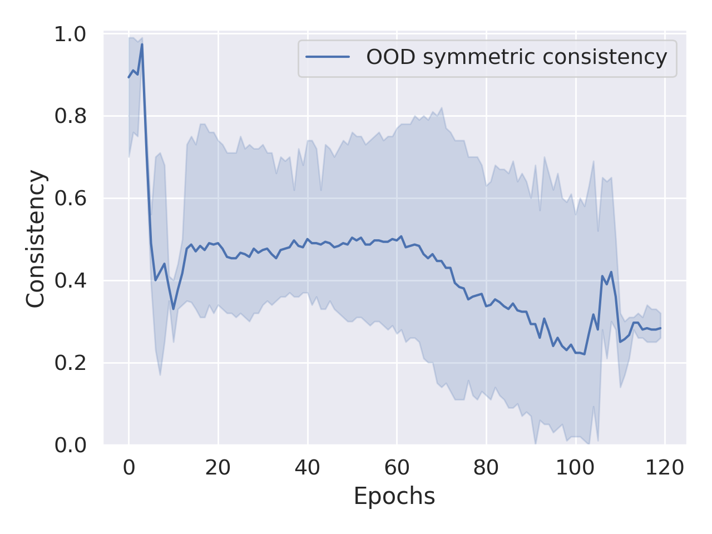
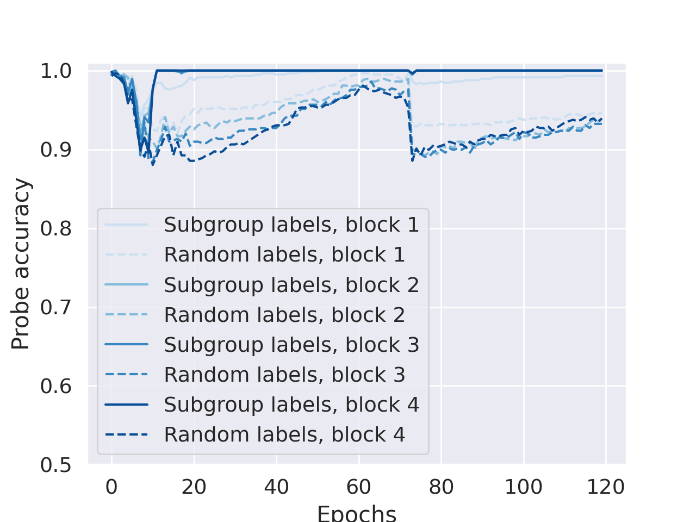

# Kvinge et al. 2026 — Can Neural Networks Learn Small Algebraic Worlds?

**An external work (demoted from the corpus, task-019).** Grokking appears in the paper in a single conjecture; what is valuable to the corpus is the method. The card is kept in full as an over-complete excerpt; the work takes no part in the corpus's indexes and counters. The convention is in `papers/README.md`, the section "External works". The original is in [`original/`](https://arxiv.org/abs/2601.21150); the analysis of the claims is in the neighbouring `…claims.txt`.

See also: [the global concept index](../../concepts/index.md).

**Henry Kvinge**, **Andrew Aguilar**, **Nayda Farnsworth**, **Grace O'Brien**, **Robert Jasper**, **Sarah Scullen**, **Helen Jenne** (Pacific Northwest National Laboratory; Department of Mathematics, University of Washington; Colgate University).

arXiv [2601.21150](https://arxiv.org/abs/2601.21150), January 2026 (the sole version v1), 11 pages, 3 figures, 1 table. There is no citation count for it in the corpus table. The work is not about grokking: it asks whether a narrow network trained on one fixed operation learns a broader mathematical structure that can be extracted from it. The test case is a group operation, and the sought notions are commutativity, the identity and subgroups. Grokking appears in one conjecture: cleaner solutions, of the kind inclined to arise through it, incidentally capture more algebraic structure. The source is the native arXiv HTML of version v1.

The files of this paper's analysis:

- [`2601.21150.can-neural-networks-learn-small-algebraic-worlds.license.txt`](2601.21150.can-neural-networks-learn-small-algebraic-worlds.license.txt) — the arXiv licence record for this paper.

**On the title.** The full title is longer and is carried in the first line of the conversion itself: "Can Neural Networks Learn Small Algebraic Worlds? An Investigation Into the Group-theoretic Structures Learned By Narrow Models Trained To Predict Group Operations". In the corpus index the work is listed under the short part.

The anchor scheme and the rules for linking into a card are in the [README of the papers folder](../README.md).

**Excerpt card.** The paper's licence (`arxiv-nonexclusive`) does not permit republishing the paper itself; what stands here are the editorial sections and the fragments the corpus quotes (right of quotation). The paper: <https://arxiv.org/abs/2601.21150>.

## Concepts covered

**[Modular arithmetic](../../concepts/modular-arithmetic.md)** — one of the three settings analysed, but taken not as a task about grokking but as the simplest example of a group: the cyclic group $\mathbb{Z}/p\mathbb{Z}$ with the operation $\overline{a}+\overline{b}=\overline{a+b\mod p}$ ([`p3-3`](#p3-3)). The sizes are swept deliberately over composite and prime — $C_{64}$, $C_{67}$, $C_{100}$, $C_{256}$, $C_{257}$, $C_{508}$, $C_{512}$ — since the subgroup lattice depends on the divisors of $p$ ([`p4-1`](#p4-1)).

**[The composition of permutations and non-commutativity](../../concepts/group-composition-non-commutative-s5.md)** — the second setting: the symmetric groups $S_{4}$, $S_{5}$, $S_{6}$ of order $n!$, non-commutative, with an alternating subgroup of size $n!/2$ ([`p3-4`](#p3-4)). The third is the dihedral groups $D_{n}$ of order $2n$ with a subgroup of all $n$ rotations ([`p3-5`](#p3-5)). This combination is what makes it possible to separate commutativity as a notion from commutativity as a property of the dataset.

**[Group representations and cosets](../../concepts/group-representations-cosets.md)** — the work's initial motivation. Analyses of models trained on modular arithmetic and on the composition of permutations found in them elaborate algorithms leaning on the representation theory of the corresponding groups ([`p2-1`](#p2-1)); whence the question of whether the group-theoretic notions themselves can be extracted from a network, and not only the algorithm ([`p2-2`](#p2-2)).

**[Linear and sparse probing](../../concepts/linear-sparse-probing.md)** — the main working method and the only check that gave a positive result for subgroups. The activations $v_{g_{1},g_{2}}^{k}$ at layer $k$ are labelled by whether $g_{1},g_{2}\in H$, and a linear probe is trained on those labels ([`p7-2`](#p7-2)). The control matters: the same probe is trained on a random subset $R\subset G$ of the same size that is not a subgroup ([`p7-4`](#p7-4)). The quality on subgroups is markedly higher, especially at the late layers, where the influence of the raw input encoding has weakened ([`p7-6`](#p7-6), [`fig-3`](#fig-3)).

**[Mechanistic interpretability](../../concepts/mechanistic-interpretability.md)** — the work places itself alongside it, but deliberately to one side: the third lens, the structure of the internal representations, "is consonant with the mechanistic interpretability programme" ([`p3-7`](#p3-7)), yet no attempt is made here to take an algorithm apart. The question is posed more weakly and is therefore cheaper: are abstract notions extractable regardless of whether the exact algorithm can be recovered ([`p9-3`](#p9-3)).

**[Structured representation learning](../../concepts/structured-representation-learning.md)** — the subject of the work's second half. Commutativity shows up in the representations of $g_{1}\star g_{2}$ and $g_{2}\star g_{1}$ being closer in cosine than arbitrary pairs of equal value ([`p4-7`](#p4-7), [`p5-5`](#p5-5), [`fig-2`](#fig-2)); membership of a subgroup in a linear separability at the late layers.

**[The emergence of features](../../concepts/feature-emergence-feature-learning.md)** — the first lens leans on it directly: a detailed analysis of training showed that sudden drops of the loss may correspond to the network's acquisition of a particular ability, and the work looks for the same kinks where the network would be learning commutativity or the identity ([`p3-7`](#p3-7)). Of the three notions this lens worked for only one.

**[Grokking](../../concepts/grokking.md)** — mentioned exactly once, and as a conjecture: cleaner solutions, of the kind inclined to arise through grokking, incidentally capture more algebraic structure ([`p8-1`](#p8-1)). The observation beneath it is this: in transformers on $S_{5}$ that converged within 20–50 epochs the alternating subgroup was not detected by the probe, and in those that converged after 100-odd epochs it was.

**[Initialisation scale](../../concepts/initialization-scale.md)** — the same note from another side: the world-pictures are sensitive to the choice of settings and to the initialisation, and even at identical settings the runs differed in which structure could be extracted from them ([`p8-1`](#p8-1)). Hence the advice: sweep over many initialisations even after the model has already been successfully trained ([`p9-1`](#p9-1)).

**[The learning rate](../../concepts/learning-rate.md)** — as a sweep setting: all the models are trained with Adam at various values of the learning rate and the weight decay on a single Nvidia A100 ([`p3-8`](#p3-8)); the exact values for each figure are given in appendix A.

Cards of corpus papers: [Power et al. 2022](../../papers/2201.02177.grokking-generalization-beyond-overfitting-on-small-algorithmic-datasets/2201.02177.grokking-generalization-beyond-overfitting-on-small-algorithmic-datasets.card.md) — the original phenomenon, to which only one conjecture here refers; [Nanda et al. 2023](../../papers/2301.05217.progress-measures-for-grokking-via-mechanistic-interpretability/2301.05217.progress-measures-for-grokking-via-mechanistic-interpretability.card.md) — the analysis of the modular-addition algorithm, from which the work deliberately retreats to a weaker question; [McCracken et al. 2025](../../papers/2505.18266.uncovering-a-universal-abstract-algorithm-for-modular-addition-in-neural-networks/2505.18266.uncovering-a-universal-abstract-algorithm-for-modular-addition-in-neural-networks.card.md) — cited outright as grounds for thinking that subgroup structure participates in the computation; [Gromov 2023](../../papers/2301.02679.grokking-modular-arithmetic/2301.02679.grokking-modular-arithmetic.card.md) — the same task analysed analytically. Zhong et al. 2023, Chughtai et al. 2023, Stander et al. 2023 and Wu et al. 2024, on which the work leans in its related-work section ([`p9-3`](#p9-3)), have no cards in the corpus.

## What is shown and what is conjectured

The card editor's remarks following the analysis of the claims (`…claims.txt`). The work is short: 9 pages of main text, 3 figures, 1 table, and an appendix of settings.

**The frame is built honestly and before the experiments.** Three lenses — the course of the training, out-of-distribution generalisation, the structure of the representations — are laid out in section 3 and applied to all three notions uniformly ([`p3-6`](#p3-6), [`p3-7`](#p3-7)). The outcome is gathered into a grid of eight checks, each cell marked "yes" or "no" ([`tab-1`](#tab-1)). Works that first declare their method of checking and then report the failures too are few in the corpus.

**The defence against the trivial explanation is set up twice, and both times aptly.** Symmetric consistency by itself can be driven to unity by a mere rise in accuracy, hence the introduction of consistency at equal values ([`p4-5`](#p4-5)). A linear probe on a subgroup can be explained by the memorisation of an arbitrary set of elements, hence the introduction of a random set $R$ of the same size ([`p7-4`](#p7-4)). Without these two controls neither positive finding would be worth anything.

**The out-of-distribution check is set up strictly.** An element $g^{\prime}$ is withdrawn from the training entirely, and only then is the consistency measured on pairs involving it ([`p4-6`](#p4-6)). The symmetric consistency there does not recover after an initial fall but stays above the guessing level $1/|G|$ ([`p5-4`](#p5-4), [`fig-1`](#fig-1)) — and that is the argument for a notion rather than a lookup table.

**The negative results are reported outright.** The identity is detected by none of the lenses: the accuracy on it follows the overall accuracy closely, and out of distribution not one model predicted $g\star e=g$ for an unseen $g$ ([`p6-3`](#p6-3)). The accuracy on a subgroup gave nothing either ([`p7-5`](#p7-5)). Moreover, the authors state outright that they cannot distinguish "the notion has not been learned" from "our instruments do not see it" ([`p2-3`](#p2-3)).

**The explanation of the negative result is coherent.** The special property of the identity applies to only $2|G|-1$ cases out of $|G|^{2}$, whereas commutativity applies to all of them; encoding the first is unprofitable, encoding the second is profitable ([`p7-9`](#p7-9)). The rule is formulated as a prediction for future work rather than as an excuse.

**The main argument about commutativity, however, is obtained on an architecture predisposed to it.** The authors themselves write that in a transformer the representations of the tokens $g_{1}$ and $g_{2}$ in $g_{1}\star g_{2}$ and in $g_{2}\star g_{1}$ coincide up to the positional encoding, whereas one-hot encodings for an MLP are in general orthogonal ([`p5-2`](#p5-2)). The caveat is made — but the check that would separate a learned notion from a property of the architecture is not: figures 1 and 2 show only transformers on $C_{100}$, and there is not a single figure on commutativity in MLPs in the work.

**The conjecture about grokking rests on exactly the spread the authors themselves declared excessive.** The observation is this: in transformers on $S_{5}$ the late-converging runs yielded a detectable alternating subgroup and the early-converging ones did not ([`p8-1`](#p8-1)). But the caption of figure 3 says outright that the quality of the transformer on $S_{5}$ varied too much from one initialisation to another for confidence intervals to be built ([`fig-3`](#fig-3)). There are three runs. Grokking, meanwhile, is not measured: neither a gap between training and validation nor curves for the late runs is given, and "converged later" is equated with "grokked".

**The setting was not intended for grokking in the first place.** By appendix A, 80 % of all the cases are given over to training ([`p3-8`](#p3-8)); the data fraction is not swept at all, whereas it is precisely that which serves in the corpus as the main knob of delayed generalisation. The conjecture should be checked not here but where grokking is set up deliberately.

**The text is unproofread in two places.** "Three intuitive rules" for predicting whether a property $X$ will be learned are promised, and two are given ([`p7-8`](#p7-8), [`p7-9`](#p7-9)). The caption of table 1 speaks of "small LLMs", whereas what was trained were decoder-only transformers of four blocks and there are no language models in the work ([`tab-1`](#tab-1)).

**There is not a single number in the text.** Neither the prediction accuracy, nor the probe quality, nor the size of the gap between the solid and the dashed lines — everything is left to the figures. The settings, meanwhile, are given in full: appendix A lists the architecture, the learning rate, the weight decay and the split for every figure. A strange combination of generosity in one respect and parsimony in another.

**What is valuable for the corpus is the method rather than the result.** The grid "notion x lens" carries over to any phenomenon about which one asks "has the model learned a notion rather than a rule"; the random-subset control in linear probing ought to enter common practice; and the conjecture relating late convergence to a richer learned structure deserves a separate check in a setting in which delayed generalisation is induced deliberately.

Henry Kvinge*1,2*, Andrew Aguilar*1,2*, Nayda Farnsworth*1,3*, Grace O'Brien*1,2*, **Robert Jasper*1***, **Sarah Scullen*1***, **Helen Jenne*1* 1**Pacific Northwest National Laboratory 2Department of Mathematics, University of Washington 3Colgate University henry.kvinge@pnnl.gov

---

# Quoted fragments

Only the fragments the corpus cards refer to are
reproduced here (right of quotation); the paper's licence does not permit
republishing the whole text. Anchor numbering matches the original.

###### p1-2

While a real-world research program in mathematics may be guided by a motivating question, the process of mathematical discovery is typically open-ended. Ideally, exploration needed to answer the original question will reveal new structures, patterns, and insights that are valuable in their own right. This contrasts with the exam-style paradigm in which the machine learning community typically applies AI to math. To maximize progress in mathematics using AI, we will need to go beyond simple question answering. With this in mind, we explore the extent to which narrow models trained to solve a fixed mathematical task learn broader mathematical structure that can be extracted by a researcher or other AI system. As a basic test case for this, we use the task of training a neural network to predict a group operation (for example, performing modular arithmetic or composition of permutations). We describe a suite of tests designed to assess whether the model captures significant group-theoretic notions such as the identity element, commutativity, or subgroups. Through extensive experimentation we find evidence that models learn representations capable of capturing abstract algebraic properties. For example, we find hints that models capture the commutativity of modular arithmetic. We are also able to train linear classifiers that reliably distinguish between elements of certain subgroups (even though no labels for these subgroups are included in the data). On the other hand, we are unable to extract notions such as the concept of the identity element. Together, our results suggest that in some cases the representations of even small neural networks can be used to distill interesting abstract structure from new mathematical objects.

###### p2-1

If the goal is to develop methodologies that enable more open-ended discovery, one potential solution is to look more closely at effective narrow models. Might these already contain valuable insights that were learned in the course of solving the original task? There are a range of case studies that provide precedent for such a hypothesis. For instance, careful analysis of models trained to perform modular arithmetic Nanda et al. (2023a) or composition of permutations Chughtai et al. (2023); Stander et al. (2023); Wu et al. (2024) have revealed sophisticated algorithms that depend on the representation theory of the corresponding groups. Similarly, analysis of a graph neural network designed to perform classification of the mutation equivalence class of a finite or affine type quiver was found to naturally cluster instances in ways that align with human classification schemes He et al..

###### p2-2

Motivated by this question, we explore the elementary case of a neural network trained to predict the operation of a group $G$ and ask to what extent we can detect basic group-theoretic concepts from such a network. Notions we consider include commutativity, the identity, and subgroups, all core concepts within group theory. We explore three approaches to detecting these concepts: (i) through training dynamics where we look for changes in loss/accuracy that might correspond to a model learning a new concept, (ii) differences in performance across subsets of input instances (for example, a model that ‘understands’ the identity element $e$ should always get the correct answer on questions of the form $g\star e$ or $e\star g$, even when it has never seen $g$ before), and (iii) the structure of the internal representations of the group.

###### p2-3

We probe MLPs and transformers trained to perform the group operation for cyclic groups, symmetric groups, and dihedral groups of varying sizes. Across these settings we offer evidence that at least some of the mathematical concepts that we study are captured by these simple models. For example, for some subgroups $H$ linear probes are able to reliably distinguish between pairs of elements $(g_{1},g_{2})$ which both belong to $H$ and pairs where either $g_{1}$ or $g_{2}$ does not belong to $H$. This is significant since these models were trained without any information about subgroups. On the other hand, we failed to detect other concepts such as the significance of the identity element. Whether this is because this concept was never learned by the model or it is too nuanced for us to easily capture using our existing set of model analysis methods remains unclear.

All of this suggests that the *mathematical world models* learned by small neural networks (easily accessible to even those with very restricted compute budgets) can contain interesting mathematical insights if one is willing to put in the work to extract them. In summary our contributions include the following.

- We describe a framework that uses finite groups and basic notions from group theory to better understand whether narrowly trained neural networks have world models sufficiently rich for open ended mathematical discovery.
- We evaluate a range of approaches to extract the fingerprints of concepts such as commutativity or the notion of a subgroup from a neural network trained for a fixed task.
- We provide conjectures about the type of concepts most likely to be captured by narrow models.

###### p3-3

**Cyclic groups, $\mathbb{Z}/p\mathbb{Z}$:** Cyclic groups are familiar since they correspond to modular addition. We can represent $\mathbb{Z}/p\mathbb{Z}$ with the elements $\{\overline{0},\overline{1},\dots,\overline{p-1}\}$ and realize the binary operation as $\overline{a}+\overline{b}=\overline{a+b\mod p}$. $\mathbb{Z}/p\mathbb{Z}$ is commutative and has order $|\mathbb{Z}/p\mathbb{Z}|=p$. The subgroups of $\mathbb{Z}/p\mathbb{Z}$ are in one-to-one correspondence with integers $1\leq k\leq p$ such that $k$ divides $p$. If $k$ divides $p$, then we can realize the corresponding subgroup as $\{\overline{0},\overline{k},\overline{2k},\dots\}$.

###### p3-4

**Symmetric groups, $S_{n}$:** The symmetric group $S_{n}$ is the set of all permutations of $n$ elements with the binary operation of composition of permutations. As such, the order of $S_{n}$ is $n!$. It is not commutative. $S_{n}$ has many subgroups but we will work with one of the most well-known, the *alternating (sub)group*, which consists of all permutations of $n$ which are even. The alternating group has size $n!/2$.

###### p3-5

**Dihedral groups $D_{n}$:** The dihedral group $D_{n}$ can be realized as the set of rotations and reflections that preserve the $n$-gon. It consists of $n$ rotations and $n$ reflections, making it a group of order $2n$. Subgroups of $D_{n}$ include the subgroup of all $n$ rotations.

###### p3-6

Suppose $f:G\times G\rightarrow G$ is a neural network that has been trained to perform the binary operation $\star$ of a group. Thus, provided with $g_{1},g_{2}\in G$, $f$ predicts $g_{1}\star g_{2}$. We outline the three broad approaches that we use to detect whether $f$ has ‘learned’ algebraic concepts that characterize groups (at least, as a human mathematician would describe them).

###### p3-7

- **Learning dynamics:** Detailed analysis of neural network training has revealed that (at least in simple problems), sudden drops in loss may correspond to a network gaining a specific capability Chen et al.; Olsson et al. (2022). Might we see similar changes in the loss curve when a network trained on a group binary operation learns a concept like commutativity of $\star$? Motivated by this idea, we explore whether changes in accuracy or loss correlate with changes in model performance on specific subpopulations of the test set which capture a certain concept. For example, one can imagine that a sudden drop in loss might correspond to a model achieving high accuracy on instances of the form $e\star g$ or $g\star e$, suggesting that the model has learned the concept of the identity element.
- **Generalization:** Mathematical concepts are valuable precisely because they allow us to reason broadly across instances we have not seen before. One may not have ever actually worked with the numbers $2,483,402$ and $5,840,202$ but we can immediately say that $2,483,402+5,840,202=5,840,202+2,483,402$ based on mathematical concepts that we already understand. One way to evaluate whether a model has learned a concept is to see whether the model can apply that concept to an out-of-distribution example.
- **Structure of Internal Representations:** A model’s understanding of a concept may manifest as structure in the hidden activations of the model. For example, a model may encode commutativity by representing $g_{1}\star g_{2}$ and $g_{2}\star g_{1}$ as more similar than arbitrary $g_{1}\star g_{2}$ and $g_{3}\star g_{4}$ even when $g_{1}\star g_{2}=g_{3}\star g_{4}$. This perspective aligns with the mechanistic interpretability paradigm.

###### p3-8

In our experiments we use MLPs and transformers that are of a scale that is accessible to most researchers but are sufficient to learn the group operation. Our MLPs consist of dense linear layers **[p. 4]** interleaved with ReLU nonlinearities. Our transformers are decoder-only and use GeLU nonlinearities. The task is framed as prediction and thus uses a standard cross-entropy loss function. All models are trained using the Adam optimizer with varying learning rate values and weight decay on a single Nvidia A100. In most experiments, we explore a wide range of hyperparameters. We provide the hyperparameters that we use for the paper’s visualizations in Section A in the Appendix.

###### p4-1

Our experiments use a one-hot encoding of elements of $G$. For MLPs, we encode $g_{1}\star g_{2}$ by concatenating two length $|G|$ vectors into a single $2|G|$-dimensional input. Since the output prediction is an element of $G$, the output dimension is $|G|$. For transformers we encode $g_{1}\star g_{2}$ as a length 3 sequence, the first token corresponding to $g_{1}$ and the second token corresponding to $g_{2}$. The final token, on which the transformer’s prediction is made, can be taken to correspond to ‘$=$’. Thus, the transformer operates on a vocabulary of size $|G|+1$. In our experiments, we work with the cyclic groups $C_{64}$, $C_{67}$, $C_{100}$, $C_{256}$, $C_{257}$, $C_{508}$, $C_{512}$, the symmetric groups $S_{4}$, $S_{5}$, and $S_{6}$, and the dihedral groups $D_{30}$, $D_{50}$, $D_{60}$, $D_{120}$, and $D_{240}$.

###### p4-5

Symmetric consistency values closer to 1 indicate that $f$ makes more consistent predictions across pairs $(g_{1},g_{2})$ and $(g_{2},g_{1})$. However, care is needed because this consistency statistic alone can be maximized through better performance on the test set. In other words, any model that achieves 100% accuracy on the test examples will have symmetric consistency equal to 1, even if it is simply a look-up table. To mitigate this, we also measure *equal value consistency* which is the fraction of times that $f$ predicts $f(g_{1},g_{2})=f(g_{3},g_{4})$ for $(g_{1},g_{2}),(g_{3},g_{4})\in S$ such that $g_{1}\star g_{2}=g_{3}\star g_{4}$. We compare these over the course of training. Increases in symmetric consistency independent of equal value consistency may be evidence of a learned concept of commutativity in the model.

###### p4-6

Another way we can probe for commutativity is to look at how strongly symmetric consistency holds on out-of-distribution examples that were not seen during training. We call this version *out-of-distribution (OOD) symmetric consistency*. Here we choose some $g^{\prime}\in G$ and remove all examples from $S_{g^{\prime}}:=\{(g^{\prime},g)$,$(g,g^{\prime})\;|\;g\in G\}$ from the training set. We then measure symmetric consistency on $S_{g^{\prime}}$ to see if the model can apply any learned notion of commutativity to elements of $S_{g^{\prime}}$ which feature the unseen element $g^{\prime}$.

###### p4-7

**Cosine similarity:** Commutativity means that, algebraically, we are allowed to treat $g_{1}\star g_{2}$ and $g_{2}\star g_{1}$ as equal. In the context of large language models, Kvinge et al. hypothesized that such an understanding might manifest as the model constructing internal representations of $g_{1}\star g_{2}$ and $g_{2}\star g_{1}$ that are closer in hidden activation space. For a given input $(g_{1},g_{2})$, denote by $v^{k}_{g_{1},g_{2}}$ an activation vector corresponding to $(g_{1},g_{2})$ extracted from the $k$th layer of $f$. The *symmetric representational similarity of $f$ at layer $k$* is

$$
\text{Symmetric representational similiarity of $f$}:=\frac{1}{|S|}\sum_{(g_{1},g_{2}),(g_{2},g_{1})\in\mathcal{S}}\text{Sim}(v_{g_{1},g_{2}}^{k},v_{g_{2},g_{1}}^{k}). \tag{1}
$$

**[p. 5]**

As in the case of symmetric consistency, we also compute a version of (1) where the sum is taken over pairs $(g_{1},g_{2}),(g_{3},g_{4})$ where $g_{1}\star g_{2}=g_{3}\star g_{4}$ to ensure trends that we see do not simply arise because $g_{1}\star g_{2}=g_{2}\star g_{1}$.

###### p5-2

**Do models capture commutativity?:** The only class of commutative groups that we explored were cyclic groups, so we focus our analysis on this setting. We note that by design, transformers are better adapted for capturing commutativity since the representations of the tokens corresponding to $g_{1}$ and $g_{2}$ in $g_{1}\star g_{2}$ are the same as the representations of the tokens corresponding to $g_{1}$ and $g_{2}$ in $g_{2}\star g_{1}$ up to modification by positional encoding. On the other hand, the one-hot encodings of $g_{1}\star g_{2}$ and $g_{2}\star g_{1}$ are generally orthogonal.

For the first few epochs after initialization models have high symmetric consistency, equal value consistency, and OOD symmetric consistency since they tend to predict the same (incorrect) class for all input pairs. This phase passes as all types of consistency drop, with equal value consistency dropping much lower than symmetric consistency. In the non-OOD setting, we then see both symmetric and equal value consistency increase again until they are both near 1 (corresponding to 100% test accuracy). Besides dropping less than equal value consistency, symmetric consistency also increases more quickly than equal value consistency across runs. This suggests that models may capture $f(g_{1},g_{2})=f(g_{2},g_{1})$ via a distinct mechanism relative to $f(g_{1},g_{2})=f(g_{3},g_{4})$ when $g_{1}\star g_{2}=g_{3}\star g_{4}$. Such a distinct mechanism can itself be interpreted as evidence of a concept of commutativity.

###### p5-4

In the OOD setting, symmetric consistency values do not increase again after their initial drop, but remain elevated above what we would expect if these models were simply guessing the value of $g^{\prime}\star g$ and $g\star g^{\prime}$ independently, which is $1/|G|$. This is visualized in Figure 1 for five transformers trained to predict the binary operation of the cyclic group $C_{100}$.

###### p5-5

Finally, examining performant model’s internal representations also reveal the fingerprints of commutativity with higher cosine similarity between pairs $g_{1}\star g_{2}$ and $g_{2}\star g_{1}$ relative to arbitrary equal value pairs. An illustration of this can be found in Figure 2.

On their own, each of these tests provide relatively weak evidence that these models have internalized a notion of commutativity. Together however, they suggest that models capture a fundamental aspects of cyclic groups.

###### fig-1

*Figure 1: Plots of symmetric consistency vs. equal value consistency **(Left)** and OOD symmetric consistency vs. **(Right)** for five transformers trained to perform modular arithmetic in $C_{100}$. Shaded regions correspond to $95\%$ confidence intervals.* **[p. 5]**

###### fig-2

*Figure 2: A plot of the symmetric representational similarity (solid lines) and equal value similarity (dashed lines) at different blocks of a decoder only transformer trained on the group $C_{100}$. Shading corresponds to 95% confidence intervals over 5 random initializations.* **[p. 6]**

###### p6-3

**Do models have a notion of the identity element?:** In all our experiments, identity accuracy tracked the overall accuracy of the model closely giving no hint of a point where the model learned a specific prediction rule around the identity element. This is supported by results on OOD identity accuracy where no models were able to reliably predict that $g\star e=g$ or $e\star g=g$ if they had not seen $g$ during training.

###### p7-2

**Linear probing for subgroup membership:** We can test whether $f$ captures a distinct representation of $H$ by probing for subgroup membership on the hidden activations of $f$. More specifically, we can collect representation $v_{g_{1},g_{2}}^{k}\in\mathbb{R}^{d_{k}}$ corresponding to $g_{1}\star g_{2}$ at layer $k$, label them by whether $g_{1},g_{2}\in H$, and then train a linear probe to predict these labels.

Note that in this test we should expect different behavior based on the data representation of transformers and MLPs. In the MLP case where input is a one-hot encoding of $g_{1}$ stacked on a one-hot encoding of $g_{2}$, this task should be easy in input space since the probe just needs to learn the $|H|$ indices corresponding to elements of $H$ in the first $|G|$ dimensions, the $|H|$ indices corresponding to elements of $H$ in the second $|G|$ dimensions, and be able to perform an ‘and’ operation over these. We expect this task to become more challenging as $f$ transforms this initial representation of $(g_{1},g_{2})$ when computing $g_{1}\star g_{2}$. In the case of transformers where the input is three tokens long: one token for $g_{1}$, one token for $g_{2}$, and one token for ‘$=$’ and we predict $g_{1}\star g_{2}$ from the third token, the task is impossible in input space (since the third token is the same for all input). It only becomes tractable as information from the first and second tokens representing $g_{1}$ and $g_{2}$ are transferred onto the third token via successive self-attention layers. In this situation if the representation of ‘$=$’ retains information identifying the first argument as $g_{1}$ and the second argument as $g_{2}$, then it is possible that the subgroup could be learned via the same procedure described for the MLPs.

###### p7-4

To better calibrate probe accuracy, we also train probes on pairs of elements from $R\subset G$, a random selection of $|H|$ elements of the group which do not form a subgroup. If linear probes can more effectively distinguish elements of $H$ than elements of $R$, we will have evidence that subgroup structure is captured in model hidden representations.

###### p7-5

**Do models see subgroups?:** Unlike the process whereby a human might learn a group, first understanding a simpler subgroup and then building toward understanding the whole group, we find that across groups, subgroups, architectures, and hyperparameters, subgroup accuracy tracks global accuracy. This aligns with the trends for identity accuracy seen in Section 3.3.

###### p7-6

On the other hand, we find substantial evidence that performant models sometimes capture subgroup structure within their internal representations which we can access via the linear probing. We probe for several large subgroups of cyclic groups including the order $50$ and order $20$ subgroups generated in $C_{100}$, the subgroups generated by all rotations in $D_{30}$ and $D_{50}$ (order $30$ and $50$ respectively), and the order $60$ alternating subgroup in $S_{5}$. The accuracy of these probes, trained on both the true subgroup labels (solid lines) and random labels (dashed lines) over the course of training ($x$-axis) and at different layers (colors) are shown in Figure 3 for a transformer trained on $S_{5}$ (left), and an MLP trained on $D_{30}$ (right). Generally, probe performance on subgroups is substantially higher than performance on random subsets, especially at later layers where the impact of clean input encoding has diminished.

We stress that probe performance is variable across runs. Sometimes models achieve high accuracy predicting the group operation and yet their probe performance is close to guessing.

###### fig-3

*Figure 3: Linear probe performance on a **(Left)** transformer trained to predict the binary of $S_{5}$ and a **(Right)** MLP trained to predict the binary operation on $D_{30}$. Solid lines are probe accuracy when labels correspond to the alternating subgroup and rotation subgroup respectively, while the dashed line corresponds to a probe trained on a random labeling of the group. In the right plot, shading indicates 95% confidence intervals over three random initializations (transformer performance on $S_{5}$ varied too much between random initializations to be useful in the case of the transformer). In the case of the MLP, probing was performed after each ReLU layer, in the transformer it was performed after each attention layer.* **[p. 8]**

###### p7-8

**What mathematical structures tend to be captured by a small neural network?** This is an important question to answer as it helps us identify whether the small model paradigm will be useful for a particular AI for math research program. Based on the successes and failures described above, we suggest three intuitive rules of thumb to predict whether a given mathematical property $X$ is likely to be learned by a small model trained on a task $Y$.

###### p7-9

- Encoding $X$ allows the neural network to find a simpler solution applicable across many instances for the task $Y$. As an example, encoding commutativity and the trivial nature of the identity **[p. 8]** element can both lead to simpler solutions. But whereas commutativity applies to all instances, the special property of the identity only applies to $2|G|-1$ instances out of $|G|^{2}$.
- $X$ fits into an existing interpretability framework. We found it hard to investigate whether models recognize the significance of the identity element because this property is challenging to formulate within interpretability and analysis techniques applicable to small models. For example, we could not devise a way of translating this concept into structure that we could look for in activation space.

###### tab-1

*Table 1: Summary of algebraic structure captured in small LLMs and MLPs trained to perform a groups binary operation.* **[p. 8]**

| Name | Type | Captured structure |
|---|---|---|
| Commutativity |  |  |
| Symmetric consistency | Learning dynamics | Yes |
| OOD symmetric consistency | Generalization | Yes |
| Symmetric representational similarity | Representation structure | Yes |
| Identity |  |  |
| Identity accuracy | Learning dynamics | No |
| Identity generalization | Generalization | No |
| Subgroup structure |  |  |
| Subgroup accuracy | Learning dynamics | No |
| Hidden activation probing | Representation structure | Yes |

###### p8-1

**Mathematical world models are sensitive to hyperparameter choice and initialization.** This may in part be due to the ‘fragile’ nature of small algorithmic problems. Like others, we have found that the performance in these settings tends to be more sensitive to initial conditions and sources of randomness in training than other small-scale tasks (e.g., CIFAR10, MNIST). But even among training runs with identical hyperparameters (that converged) we found significant differences in the mathematical structures we were able to extract. For example, one trend that we noticed when training transformers on $S_{5}$ is that when the model converged earlier (after $~20-50$ epochs) the alternating subgroup was undetectable via linear probing but that when the model converged after training for longer ($>100$ epochs), the alternating subgroup was detectable. We hypothesize that cleaner solutions that tend to arise via grokking may capture more algebraic structure along the way.

**[p. 9]**

###### p9-1

We suggest that the tests we offer here may be an interesting window into the fundamentally different solutions learned by a model over different training hyperparameters. Probing for mathematical world models may be a relatively cheap method of learning about the solution a model has converged to without reverse-engineering it (a labor-intensive process). Overall, we strongly recommend that when training models that will be used in downstream mathematical exploration, many different hyperparameters and initializations be explored, even after some models have been effectively trained.

###### p9-3

Closest to our setting are mechanistic studies that reverse-engineer how small MLP and transformer models learn group operations. Nanda et al. (2023a); Zhong et al. (2023); Chughtai et al. (2023); Stander et al. (2023); Wu et al. (2024); McCracken et al. (2025). These works have often found that the learned algorithms use group-theoretic structure, although they sometimes differ in the specific algorithms they reverse-engineer Chughtai et al. (2023); Stander et al. (2023). Our work is complementary, asking whether we can extract evidence of abstract notions like commutativity or subgroup structure, regardless of whether we can extract the precise algorithm used.

Our work is motivated by the potential to use AI systems for mathematical discovery. This is a rapidly growing field, including using AI to generate proofs Yang et al. (2024), discover counterexamples Wagner (2021), and find mathematical constructions Charton et al. (2024); Alfarano et al. (2024); Yip et al. (2025). Some of this work trains a model to solve a task closely related to the problem, and then relies on expert probing to extract mathematical insight Davies et al. (2021); He et al.. In contrast, we take a step back to ask whether narrow models learn abstractions needed in order to gain useful insights.
