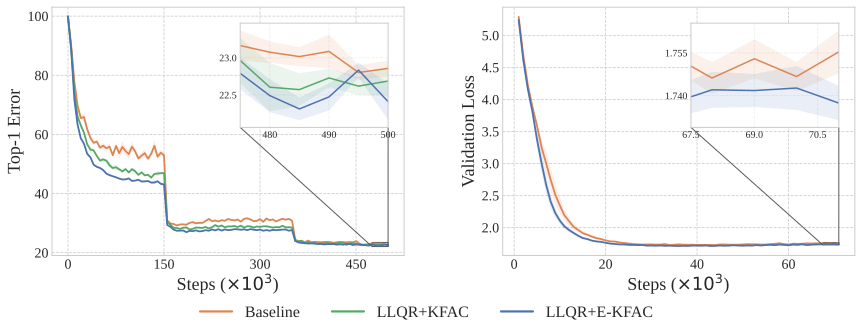
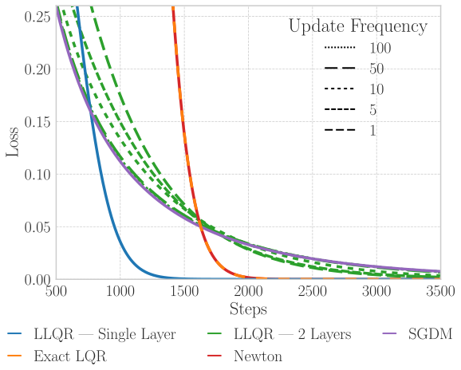
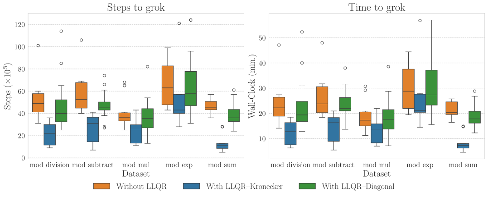
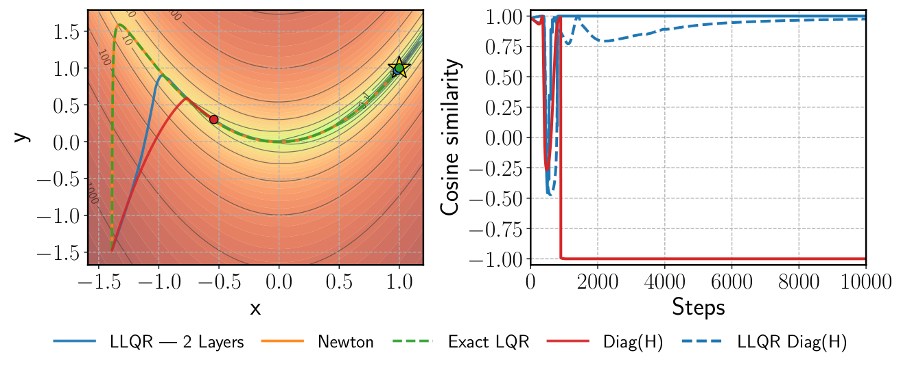
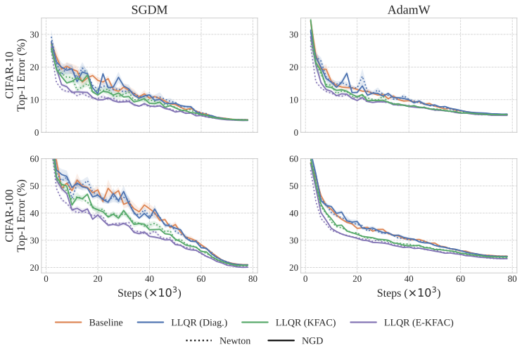

# Layerwise LQR for Geometry-Aware Optimization of Deep Networks

Simon Dufort-Labbé (corresponding author: simon.dufort-labbe@mila.quebec) Affiliation: Mila, Université de Montréal Pierre-Luc Bacon Affiliation: Mila, Université de Montréal Razvan Pascanu Affiliation: Mila, Université de Montréal Simon Lacoste-Julien Affiliation: Samsung – SAIL Montreal Affiliation: Mila, Université de Montréal Aristide Baratin Affiliation: Samsung – SAIL Montreal Affiliation: Mila, Université de Montréal

## Abstract

Geometry-aware optimizers such as Newton and natural gradient can improve conditioning in deep learning, but scalable variants such as K-FAC, Shampoo, and related preconditioners usually impose structural approximations early, often discarding cross-layer interactions induced by the network computation. We introduce Layerwise LQR (LLQR), a framework for learning structured inverse preconditioners under a global layerwise optimal-control objective. The starting point is an exact equivalence: the steepest-descent step under a broad class of divergence-induced quadratic models—including Newton, Gauss–Newton, Fisher/natural-gradient, and intermediate-layer metrics—can be written as a finite-horizon Linear Quadratic Regulator (LQR) problem. This formulation serves as a reference that exposes the layerwise dynamics and cost matrices encoding the original dense geometry. We then derive a scalable relaxation that learns diagonal, (E-)Kronecker-factored, or other structured inverse preconditioners by minimizing the LQR objective and reusing them across iterations. The resulting optimizer wraps standard methods while retaining a principled connection to second-order geometry, without forming or inverting the global curvature matrix. Experiments on ResNets and Transformers show that LLQR improves optimization dynamics and often translates these gains into improved final test performance, while adding only modest wall-clock overhead. It establishes LLQR as a practical framework for geometry-aware second-order methods and a reference for evaluating scalable approximations. Implementation is available at: github.com/SimonDufLab/LLQR

*Figure 1: ImageNet and IWSLT14 training curves under NGD induced divergence. **Left**: ResNet-50 trained for 100 epochs on ImageNet with SGDM, comparing the baseline, LLQR+KFAC, and LLQR+E-KFAC. **Right**: a Fairseq Transformer trained on IWSLT14 De–En with AdamW, comparing the baseline and LLQR+E-KFAC.* **[p. 2]**

## 1 Introduction

Many successful optimization algorithms in deep learning can be understood as steepest-descent methods under a chosen geometry. For a differentiable loss $L(\boldsymbol{\theta})$ with gradient ${\boldsymbol{g}}=\nabla L(\boldsymbol{\theta})$, the gradient descent step is the solution of the variational problem

$$
\arg\min_{\Delta\boldsymbol{\theta}}\left[{\boldsymbol{g}}^{\top}\Delta\boldsymbol{\theta}+\frac{1}{2\eta}\|\Delta\boldsymbol{\theta}\|_{2}^{2}\right]=-\eta{\boldsymbol{g}}
$$

corresponding to steepest descent in the Euclidean norm [9]. Newton’s method uses the local loss Hessian; natural gradient uses the Fisher information matrix; and practical methods such as Adam, Shampoo, Muon, K-FAC, and related algorithms can be interpreted as using structured norms or preconditioners that capture partial information about the local geometry [7]. This viewpoint is increasingly important: the choice of geometry does **[p. 2]** not merely affect conditioning and convergence speed, but also changes the implicit bias of the training trajectory and can therefore influence the solutions found by learning [39].

The classical difficulty is that the most principled geometries are dense and expensive. A generic second-order or geometry-aware step minimizes a local quadratic model

$$
m(\Delta\boldsymbol{\theta})={\boldsymbol{g}}^{\top}\Delta\boldsymbol{\theta}+\frac{1}{2}\Delta\boldsymbol{\theta}^{\top}{\boldsymbol{H}}\Delta\boldsymbol{\theta} \tag{1}
$$

where ${\boldsymbol{H}}$ may be the regularized Hessian, the Gauss–Newton matrix, the Fisher matrix, or another divergence-induced metric. For modern neural networks, ${\boldsymbol{H}}$ is a dense matrix coupling parameters across layers through the chain rule. Directly solving ${\boldsymbol{H}}\Delta\boldsymbol{\theta}=-{\boldsymbol{g}}$ is infeasible at scale. Existing scalable methods therefore introduce structure early: for instance, K-FAC [28] approximates the Fisher by block-diagonal Kronecker-factored blocks. This makes preconditioning tractable, but it also removes inter-layer couplings before the optimization problem defining the update has been solved.

This paper takes a different route. Rather than imposing structure directly on the curvature model, we first rewrite the dense geometry-aware update as a layer-coupled optimal-control problem. Building on the classical link between Newton steps and Linear Quadratic Regulator (LQR) [15], we show that under a broad class of divergence-induced quadratic models, the dense global quadratic form (1) admits an exact layerwise factorization: the forward pass defines linear perturbation dynamics, and the chosen divergence defines the LQR costs. The resulting problem retains the cross-layer dependencies of the original dense quadratic model, but expresses them through layerwise dynamics and costs rather than through an explicitly formed global curvature matrix.

The exact LQR formulation can be solved by Riccati recursions and recovers the corresponding exact geometry-aware update. However, for large neural networks, it still requires manipulating large Jacobian-dependent quantities and solving expensive matrix recursions. Our main contribution is therefore a scalable relaxation of this LQR problem. We parameterize the update as a preconditioned gradient,

$$
\Delta\boldsymbol{\theta}_{i}\;=\;{\boldsymbol{U}}_{i}\,\nabla_{\boldsymbol{\theta}_{i}}L(\boldsymbol{\theta}^{k}), \tag{2}
$$

where ${\boldsymbol{U}}=\mathrm{diag}({\boldsymbol{U}}_{0},\dots,{\boldsymbol{U}}_{N-1})$ is a structured inverse preconditioner, for example diagonal or Kronecker-factored. Crucially, this block structure is imposed on the learned inverse preconditioner, not on the geometry before deriving the update objective. This distinction is important. A block-diagonal learned preconditioner does not represent the full dense inverse curvature matrix, and our relaxation is not exact. But unlike methods that begin by replacing the curvature matrix with a block-diagonal surrogate, our approach first derives a layer-coupled objective equivalent to the dense geometry-aware step, and only then restricts the class of inverse preconditioners used to approximate the resulting update. The learned blocks are therefore optimized in the presence of cross-layer **[p. 3]** couplings encoded by the LQR dynamics and cost matrices. This provides a systematic way to trade expressivity for scalability while retaining a principled connection to the exact second-order geometry.

Our **contributions** are:

1. **A layerwise optimal-control formulation of geometry-aware descent.** We show that steepest descent under a broad class of divergence-induced quadratic models—including Newton, Gauss–Newton, natural gradient, and intermediate-layer metrics—can be written exactly as a finite-horizon LQR problem. This reformulation separates the network dynamics from the choice of descent geometry and provides an exact reference update via Riccati recursions.
2. **A scalable relaxation based on learned structured inverse preconditioners.** We propose to learn a structured inverse preconditioner directly by minimizing the LQR objective. This yields a practical family of geometry-aware optimizers that can use diagonal, Kronecker-factored, or other structured blocks, while preserving the layer-coupled objective induced by the original dense quadratic model.
3. **A new optimizer wrapper for modern architectures.** The relaxed LLQR update can be wrapped around standard optimizers such as SGDM or AdamW, reusing the learned preconditioner across iterations and avoiding explicit curvature inversion. This makes the method flexible with respect to both the underlying divergence and the chosen preconditioner structure.
4. **Empirical validation on ResNets and Transformers.** Experiments show that LLQR improves convergence and final performance on image classification and translation benchmarks, and accelerates grokking in Transformers, while adding only modest computational overhead. The results position LLQR as a practical and extensible framework for studying geometry-aware optimization at scale.

## 2 Related Work

The connection between deep learning and optimal control has been recognized since the early days, with back-propagation framed as a control problem and linked to automatic differentiation [10, 4, 23]. More recently, neural networks have been cast as discrete-time nonlinear dynamical systems, where layers correspond to time steps and weights to control variables [16]. Within this view, tools such as Pontryagin’s Maximum Principle and Differential Dynamic Programming have been used to derive new training algorithms [24, 25, 27]. Our work differs in focus: rather than reformulating the training problem itself, we recast the steepest-descent step as an optimal control problem.

Closer to our approach, [33] proposed a stagewise Newton method for multilayer perceptrons, relying on classical results from [14]—equivalent to [15] that we extend—to propagate Hessian information through the state space without explicitly forming Newton updates. Extensions followed [32, 35, 34], but these remained confined to Newton’s method and were not generalized to other geometries. In contrast, our formulation covers a broad family of quadratic models, including Gauss–Newton, Fisher-based (natural gradient), and intermediate-layer metrics.

Natural gradient descent (NGD) has been especially influential in deep learning [2, 38], though its practical use is limited by the cost of computing and inverting the full Fisher information matrix. K-FAC [28] addressed this by approximating the Fisher with block-diagonal Kronecker-factored surrogates, enabling scalable preconditioning. Follow-up work improved efficiency and robustness through refined factorization and inversion schemes [17, 36, 26, 18]. These methods approximate the preconditioner by imposing structure on the curvature matrix; our approach instead frames the inverse preconditioner itself as an optimization variable–with block structure imposed on the parametrization–learned under the LQR formulation.

## 3 Problem Formulation

We consider a minibatch of size $B$. Throughout the paper, ${\boldsymbol{x}}_{i}$ denotes the full batched activation at layer $i$, i.e. ${\boldsymbol{x}}_{i}\in\mathbb{R}^{B\times d_{i}}$, with rows ${\boldsymbol{x}}_{i}^{(b)}$ corresponding to individual samples. For a feedforward network of depth $N$, the network dynamics are

$$
{\boldsymbol{x}}_{i+1}^{(b)}=f_{i}({\boldsymbol{x}}_{i}^{(b)},\theta_{i}),\qquad i=0,\dots,N-1,
$$

or, equivalently, in batched notation,

**[p. 4]**

$$
{\boldsymbol{x}}_{i+1}=f_{i}({\boldsymbol{x}}_{i},\boldsymbol{\theta}_{i}), \tag{3}
$$

where the same parameter $\boldsymbol{\theta}_{i}$ is shared across all samples. At iteration $k$, the training loss is the empirical minibatch loss $L(\boldsymbol{\theta}^{k})\equiv\ell({\boldsymbol{x}}_{N}(\boldsymbol{\theta}^{k}))$ where $\ell$ acts primarily on the outputs ${\boldsymbol{x}}_{N}$.[^1] Thus, all gradients and quadratic models below are defined with respect to the minibatch objective.

At iterate $\boldsymbol{\theta}^{k}$, we consider the steepest descent

$$
\arg\min_{\Delta\boldsymbol{\theta}}\nabla L(\boldsymbol{\theta}^{k})^{\top}\Delta\boldsymbol{\theta}\;+\;\tfrac{1}{2}\Delta\boldsymbol{\theta}^{\top}{\boldsymbol{H}}(\boldsymbol{\theta}^{k})\Delta\boldsymbol{\theta}, \tag{4}
$$

where ${\boldsymbol{H}}$ is a symmetric matrix-valued function of the parameters. Whenever ${\boldsymbol{H}}$ is positive definite (or suitably regularized), the solution is $\Delta\boldsymbol{\theta}^{\star}=-{\boldsymbol{H}}^{-1}{\boldsymbol{g}}$.

#### Divergence-induced quadratic models.

Rather than arbitrary quadratic forms, we restrict to those arising as second-order expansions of divergences with layerwise structure.

##### **Definition 3.1**(Divergence-Induced Quadratic Models)**.**

Fix the iterate $\boldsymbol{\theta}^{k}$ and its (batched) activations $\{{\boldsymbol{x}}_{i}(\boldsymbol{\theta}^{k})\}_{i=0}^{N}$. A quadratic model is *divergence-induced* if it is the Hessian (in $\boldsymbol{\theta}$) of a divergence of the form:

$$
D(\boldsymbol{\theta}^{k},\boldsymbol{\theta})\;=\;\psi_{N}\!\left({\boldsymbol{x}}_{N}(\boldsymbol{\theta})\right)\;+\;\sum_{i=1}^{N-1}\psi_{i}\!\left({\boldsymbol{x}}_{i}(\boldsymbol{\theta}),\,\boldsymbol{\theta}_{i}\right), \tag{5}
$$

where each $\psi_{i},\psi_{N}$ is twice continuously differentiable.[^2] This form ensures that the dependence on $\boldsymbol{\theta}$ is either direct (layerwise through $\boldsymbol{\theta}_{i}$) or mediated via forward activations ${\boldsymbol{x}}_{i}(\boldsymbol{\theta})$. The associated local quadratic model is:

$$
{\boldsymbol{H}}:=\nabla^{2}_{\boldsymbol{\theta}\boldsymbol{\theta}}D(\boldsymbol{\theta}^{k},\boldsymbol{\theta})\big|_{\boldsymbol{\theta}=\boldsymbol{\theta}^{k}} \tag{6}
$$

This family covers nearly all geometry-aware methods of interest, including Newton, Gauss–Newton, Fisher, and their regularized variants (see Appendix B).

#### Goal.

Compute the update (4) exactly for this class of models, without forming or inverting the dense global ${\boldsymbol{H}}$, by exploiting the sequential structure of the network.

## 4 Steepest Descent as LLQR

In this section, we follow the classical optimal-control derivation for Newton steps [e.g., 8, Ch. 2.6], extending it to the much broader family of divergence-induced quadratic models. Full details are given in Appendix B.

### 4.1 Layerwise linearization

#### Notation

At the iterate $\boldsymbol{\theta}_{i}^{k}$, define parameter perturbations $\delta\boldsymbol{\theta}_{i}:=\boldsymbol{\theta}_{i}-\boldsymbol{\theta}_{i}^{k}$ so that the global update is $\Delta\boldsymbol{\theta}=\mathrm{concat}(\delta\boldsymbol{\theta}_{0},\dots,\delta\boldsymbol{\theta}_{N-1})$. We also introduce *linearized activation perturbations* $\delta{\boldsymbol{x}}_{i}$, obtained by expanding each layer map $f_{i}$ at $({\boldsymbol{x}}_{i}^{k},\boldsymbol{\theta}_{i}^{k})$:

$$
\delta{\boldsymbol{x}}_{i+1}\;=\;{\boldsymbol{A}}_{i}\,\delta{\boldsymbol{x}}_{i}+{\boldsymbol{B}}_{i}\,\delta\boldsymbol{\theta}_{i},\quad\delta{\boldsymbol{x}}_{0}=0,\qquad{\boldsymbol{A}}_{i}:=\frac{\partial f_{i}}{\partial{\boldsymbol{x}}_{i}}({\boldsymbol{x}}_{i}^{k},\boldsymbol{\theta}_{i}^{k}),\quad{\boldsymbol{B}}_{i}:=\frac{\partial f_{i}}{\partial\boldsymbol{\theta}_{i}}({\boldsymbol{x}}_{i}^{k},\boldsymbol{\theta}_{i}^{k}). \tag{7}
$$

In the batched setting, $\delta{\boldsymbol{x}}_{i}\in\mathbb{R}^{B\times d_{i}}$ is batch-indexed, whereas $\delta\boldsymbol{\theta}_{i}$ is shared across the batch; ${\boldsymbol{A}}_{i}$ is block-diagonal over samples and ${\boldsymbol{B}}_{i}$ stacks the samplewise parameter Jacobians.

We note (see Appendix A) that by the chain rule, the first-order variations

$$
\delta{\boldsymbol{x}}_{i}:=\nabla_{\boldsymbol{\theta}}{\boldsymbol{x}}_{i}^{\top}\Delta\boldsymbol{\theta} \tag{8}
$$

are solutions of the recursion (7) when optimizing (4) with ${\boldsymbol{H}}(\boldsymbol{\theta}^{k})={\boldsymbol{I}}$.

**[p. 5]**

### 4.2 From global quadratics to layerwise LQR

We now express the linear and quadratic terms of (4) in terms of $(\delta{\boldsymbol{x}}_{i},\delta\boldsymbol{\theta}_{i})$ and the dynamics (7). This yields a quadratic program with per-layer cost and linear dynamics, whose KKT system is block-tridiagonal along depth and solvable via Riccati recursion. For notational clarity, we present the derivation for a single input ($BS=1$). The minibatch case is obtained by treating ${\boldsymbol{x}}_{i}$ and $\delta{\boldsymbol{x}}_{i}$ as stacked batch activations and perturbations–while $\delta\theta_{i}$ remains shared across all examples–and solving with respect to the whole minibatch. Accordingly, ${\boldsymbol{A}}_{i}$ and ${\boldsymbol{B}}_{i}$ are the Jacobians of the batched layer map, and ${\boldsymbol{Q}}_{i},{\boldsymbol{M}}_{i},{\boldsymbol{R}}_{i}$ are the corresponding Hessian blocks of the minibatch objective with respect to $(\delta{\boldsymbol{x}}_{i},\delta\theta_{i})$.

#### Linear term.

By the chain rule and (8),

$$
{\boldsymbol{g}}^{\top}\Delta\boldsymbol{\theta}\;=\;\nabla\ell({\boldsymbol{x}}^{k}_{N})^{\top}\delta{\boldsymbol{x}}_{N} \tag{9}
$$

#### Quadratic term.

To make the Hessian (6) decomposable by layer, we augment the divergence with multipliers ${\boldsymbol{p}}=[p_{1},\cdots p_{N}]$ for the constraints (7), defining

$$
\mathcal{H}({\boldsymbol{x}},\boldsymbol{\theta},{\boldsymbol{p}})=\psi_{N}({\boldsymbol{x}}_{N})+\sum_{i=1}^{N-1}\Big[\psi_{i}({\boldsymbol{x}}_{i},\boldsymbol{\theta}_{i})+{\boldsymbol{p}}_{i+1}^{\top}\!\big(f_{i}({\boldsymbol{x}}_{i},\boldsymbol{\theta}_{i})-{\boldsymbol{x}}_{i+1}\big)\Big]. \tag{10}
$$

For any choice of ${\boldsymbol{p}}$, $D(\boldsymbol{\theta}^{k},\boldsymbol{\theta})=\mathcal{H}({\boldsymbol{x}}(\boldsymbol{\theta}),\boldsymbol{\theta},{\boldsymbol{p}})$. Choosing ${\boldsymbol{p}}$ to enforce stationarity of $\mathcal{H}$ in the activation variables cancels cross-derivative terms and simplifies the quadratic expansion:

##### **Theorem 4.1****.**

*Let ${\boldsymbol{p}}^{k}$ satisfy the adjoint recursion*

$$
{\boldsymbol{p}}^{k}_{N}=\nabla_{{\boldsymbol{x}}_{N}}\psi_{N}({\boldsymbol{x}}_{N}^{k}),\qquad{\boldsymbol{p}}^{k}_{i}={\boldsymbol{A}}_{i}^{\top}{\boldsymbol{p}}_{i+1}+\nabla_{{\boldsymbol{x}}_{i}}\psi_{i}({\boldsymbol{x}}_{i}^{k},\boldsymbol{\theta}_{i}^{k}).
$$

*Then $\nabla_{{\boldsymbol{x}}}\mathcal{H}\big({\boldsymbol{x}}(\boldsymbol{\theta}^{k}),\boldsymbol{\theta}^{k},{\boldsymbol{p}}^{k}\big)=0$, and the quadratic term in (4) decomposes layerwise:*

$$
\Delta\boldsymbol{\theta}^{\top}{\boldsymbol{H}}\Delta\boldsymbol{\theta}=\delta{\boldsymbol{x}}_{N}^{\top}{\boldsymbol{Q}}_{N}\delta{\boldsymbol{x}}_{N}+\sum_{i=0}^{N-1}\begin{bmatrix}\delta{\boldsymbol{x}}_{i}\\
\delta\boldsymbol{\theta}_{i}\end{bmatrix}^{\!\top}\begin{bmatrix}{\boldsymbol{Q}}_{i}&{\boldsymbol{M}}_{i}^{\top}\\
{\boldsymbol{M}}_{i}&{\boldsymbol{R}}_{i}\end{bmatrix}\begin{bmatrix}\delta{\boldsymbol{x}}_{i}\\
\delta\boldsymbol{\theta}_{i}\end{bmatrix}
$$

*subject to the constraints (7), with local blocks below evaluated at ${\boldsymbol{x}}^{k},\boldsymbol{\theta}^{k},{\boldsymbol{p}}^{k}$.*

$$
{\boldsymbol{Q}}_{i}=\nabla^{2}_{{\boldsymbol{x}}_{i}{\boldsymbol{x}}_{i}}\mathcal{H},\qquad{\boldsymbol{M}}_{i}=\nabla^{2}_{\boldsymbol{\theta}_{i}{\boldsymbol{x}}_{i}}\mathcal{H},\qquad{\boldsymbol{R}}_{i}=\nabla^{2}_{\boldsymbol{\theta}_{i}\boldsymbol{\theta}_{i}}\mathcal{H},
$$

Theorem 4.1 generalizes classical results from [15, 12], extending the Newton–LQR connection to divergence-induced steepest descent. The proof is given in Appendix B.

#### Sequential quadratic program

Combining (9) and Theorem 4.1, the steepest gradient step is equivalent to

$$
\min_{\delta\boldsymbol{\theta}_{i}} {\boldsymbol{g}}_{N}^{\top}\delta{\boldsymbol{x}}_{N}+\tfrac{1}{2}\,\delta{\boldsymbol{x}}_{N}^{\top}{\boldsymbol{Q}}_{N}\delta{\boldsymbol{x}}_{N}+\tfrac{1}{2}\sum_{i=0}^{N-1}\begin{bmatrix}\delta{\boldsymbol{x}}_{i}\\
\delta\boldsymbol{\theta}_{i}\end{bmatrix}^{\top}\begin{bmatrix}{\boldsymbol{Q}}_{i}&{\boldsymbol{M}}_{i}^{\top}\\
{\boldsymbol{M}}_{i}&{\boldsymbol{R}}_{i}\end{bmatrix}\begin{bmatrix}\delta{\boldsymbol{x}}_{i}\\
\delta\boldsymbol{\theta}_{i}\end{bmatrix} \\
\text{s.t.} \delta{\boldsymbol{x}}_{i+1}={\boldsymbol{A}}_{i}\delta{\boldsymbol{x}}_{i}+{\boldsymbol{B}}_{i}\delta\boldsymbol{\theta}_{i},\qquad\delta{\boldsymbol{x}}_{0}=\mathbf{0}. \tag{11}
$$

This is precisely a finite-horizon Linear Quadratic Regulator.

### 4.3 KKT conditions and Riccati recursions

The LQR problem (11) can be solved efficiently by Riccati recursion [21, 43]. Introducing new multipliers ${\boldsymbol{q}}:=[{\boldsymbol{q}}_{1},\cdots,{\boldsymbol{q}}_{n}]$ for the linear constraints, stationarity of the resulting Lagrangian with respect to $\delta\boldsymbol{\theta}_{i}$ and $\delta{\boldsymbol{x}}_{i}$ gives respectively, with ${\boldsymbol{q}}_{N}={\boldsymbol{Q}}_{N}\delta{\boldsymbol{x}}_{N}+{\boldsymbol{g}}_{N}$:

$$
{\boldsymbol{R}}_{i}\delta\boldsymbol{\theta}_{i}+{\boldsymbol{M}}_{i}\delta{\boldsymbol{x}}_{i}+{\boldsymbol{B}}_{i}^{\top}{\boldsymbol{q}}_{i+1} =0 \tag{12} \\
{\boldsymbol{Q}}_{i}\delta{\boldsymbol{x}}_{i}+{\boldsymbol{M}}_{i}^{\top}\delta\boldsymbol{\theta}_{i}+{\boldsymbol{A}}_{i}^{\top}{\boldsymbol{q}}_{i+1}-{\boldsymbol{q}}_{i} =0 \tag{13}
$$

**[p. 6]**

To solve this, posit the quadratic form ${\boldsymbol{q}}_{i}={\boldsymbol{K}}_{i}\delta{\boldsymbol{x}}_{i}+{\boldsymbol{\lambda}}_{i},$ where ${\boldsymbol{K}}_{i}$ and ${\boldsymbol{\lambda}}_{i}$ are to be determined. Substituting into (12):

$$
\delta\boldsymbol{\theta}_{i}^{\star}=-({\boldsymbol{R}}_{i}+{\boldsymbol{B}}_{i}^{\top}{\boldsymbol{K}}_{i+1}{\boldsymbol{B}}_{i})^{-1}\Big[({\boldsymbol{M}}_{i}+{\boldsymbol{B}}_{i}^{\top}{\boldsymbol{K}}_{i+1}{\boldsymbol{A}}_{i})\,\delta{\boldsymbol{x}}_{i}+{\boldsymbol{B}}_{i}^{\top}{\boldsymbol{\lambda}}_{i+1}\Big].
$$

Plugging into (13) yields the Riccati recursion

$$
\begin{gathered}{\boldsymbol{K}}_{i}={\boldsymbol{A}}_{i}^{\top}{\boldsymbol{K}}_{i+1}{\boldsymbol{A}}_{i}+{\boldsymbol{Q}}_{i}-({\boldsymbol{A}}_{i}^{\top}{\boldsymbol{K}}_{i+1}{\boldsymbol{B}}_{i}+{\boldsymbol{M}}_{i}^{\top})({\boldsymbol{R}}_{i}+{\boldsymbol{B}}_{i}^{\top}{\boldsymbol{K}}_{i+1}{\boldsymbol{B}}_{i})^{-1}({\boldsymbol{M}}_{i}+{\boldsymbol{B}}_{i}^{\top}{\boldsymbol{K}}_{i+1}{\boldsymbol{A}}_{i}),\\[3.99994pt]
{\boldsymbol{\lambda}}_{i}={\boldsymbol{A}}_{i}^{\top}{\boldsymbol{\lambda}}_{i+1}-({\boldsymbol{A}}_{i}^{\top}{\boldsymbol{K}}_{i+1}{\boldsymbol{B}}_{i}+{\boldsymbol{M}}_{i}^{\top})({\boldsymbol{R}}_{i}+{\boldsymbol{B}}_{i}^{\top}{\boldsymbol{K}}_{i+1}{\boldsymbol{B}}_{i})^{-1}{\boldsymbol{B}}_{i}^{\top}{\boldsymbol{\lambda}}_{i+1}.\end{gathered} \tag{14}
$$

with boundary conditions ${\boldsymbol{K}}_{N}={\boldsymbol{Q}}_{N}$ and ${\boldsymbol{\lambda}}_{N}={\boldsymbol{g}}_{N}$. Given these backward recursions, the optimal step $\Delta\boldsymbol{\theta}^{\ast}$ is obtained by a forward rollout using (7).

*Figure 2: Validation of the LQR equivalence and relaxation on the Rosenbrock function. (**Red** and **Orange**) Newton’s step and Riccati solution overlap, confirming exact equivalence. (**Green**) Relaxation with block–diagonal ${\boldsymbol{U}}$ converges faster as update frequency increases, though remaining approximate. (**Blue**) Relaxation with dense ${\boldsymbol{U}}$ on the single-layer formulation matches the convergence rate of Newton’s step. (**Violet**) SGDM is provided for comparison. As no line search is used during optimization, the comparison focuses solely on convergence rates.* **[p. 6]**

The Riccati solution illustrates how the layerwise structure of the network can be exploited directly: a backward pass computes local gain matrices (${\boldsymbol{K}}_{i}$) and adjoints (${\boldsymbol{\lambda}}_{i}$), and a forward pass assembles the update. This replaces the cubic $\mathcal{O}(d^{3})$ cost of dense inversion by a sequence of smaller layerwise solves, scaling as $\mathcal{O}(\sum_{i}d_{i}^{3})$ when $\sum_{i}d_{i}=d$. We view this exact solution primarily as a reference for the geometry-aware update defined by the original quadratic model, and validate the equivalence on a toy problem in Section 6.1. For modern networks, however, running Riccati recursions remains impractical. The exact formulation is therefore most useful as a derivation device: it identifies the layerwise dynamics and cost matrices that encode the dense geometry, and motivates our main algorithmic contribution in Section 5, a scalable relaxation that learns a structured inverse preconditioner under the resulting LQR objective.

## 5 Relaxation

The LLQR formulation suggests two direct but impractical strategies: **(i)** solve the Riccati equations exactly and reuse gain matrices $\{{\boldsymbol{K}}_{i}\}$ for $n$ steps, à la K-FAC [28]; or **(ii)** solve the quadratic program (11) directly at every iteration. Both approaches are computationally prohibitive: (i) requires storing Jacobians and running extra passes, while (ii) adds a nested inner loop at each step.

#### Relaxed formulation.

Instead of computing $\delta\boldsymbol{\theta}_{i}$ exactly from the Riccati backward pass, we replace it by a preconditioned gradient with a learned inverse preconditioner ${\boldsymbol{U}}_{i}:={\boldsymbol{P}}_{i}^{-1}$,

$$
\delta\boldsymbol{\theta}_{i}\;=\;-{\boldsymbol{U}}_{i}\,\nabla_{\boldsymbol{\theta}_{i}}L(\boldsymbol{\theta}^{k}),
$$

with block-diagonal ${\boldsymbol{U}}=\mathrm{diag}({\boldsymbol{U}}_{0},\dots,{\boldsymbol{U}}_{N-1})$. Substituting into the LQR objective yields the relaxed problem

$$
\min_{{\boldsymbol{U}}} \nabla_{{\boldsymbol{x}}_{N}}\ell({\boldsymbol{x}}_{N})^{\top}\delta{\boldsymbol{x}}_{N}+\tfrac{1}{2}\,\delta{\boldsymbol{x}}_{N}^{\top}{\boldsymbol{Q}}_{N}\delta{\boldsymbol{x}}_{N} \\
+\sum_{i=0}^{N-1}\!\Big(\tfrac{1}{2}\,\delta{\boldsymbol{x}}_{i}^{\top}{\boldsymbol{Q}}_{i}\delta{\boldsymbol{x}}_{i}+\tfrac{1}{2}\,\delta\boldsymbol{\theta}_{i}^{\top}{\boldsymbol{R}}_{i}\delta\boldsymbol{\theta}_{i}+\delta\boldsymbol{\theta}_{i}^{\top}{\boldsymbol{M}}_{i}\delta{\boldsymbol{x}}_{i}\Big) \\
\text{s.t.} \delta{\boldsymbol{x}}_{i+1}={\boldsymbol{A}}_{i}\delta{\boldsymbol{x}}_{i}-{\boldsymbol{B}}_{i}{\boldsymbol{U}}_{i}\nabla_{\boldsymbol{\theta}_{i}}L(\boldsymbol{\theta}^{k}),\>\delta{\boldsymbol{x}}_{0}=\mathbf{0}, \tag{15}
$$

**[p. 7]**

#### Advantages.

Optimizing directly over ${\boldsymbol{U}}$ has three benefits: (i) It provides the *inverse* preconditioner directly, avoiding costly matrix inversion. (ii) It can be recomputed every $n$ iterations, requiring only cheap layerwise multiplications with gradients in between. (iii) Structure (e.g. diagonal, Kronecker) can be imposed on ${\boldsymbol{U}}_{i}$ to further reduce cost and memory.

#### Remark.

Problem (15) admits many equivalent solutions, since ${\boldsymbol{U}}$ is only constrained along directions spanned by the gradient. This mismatch across iterations creates a gap between the exact LLQR and the relaxed update. To mitigate it, Algorithm 1 (i) restricts ${\boldsymbol{U}}$ structurally, (ii) optimizes it over the full minibatch with $\boldsymbol{\theta}^{k}$ fixed, and (iii) uses Exponential Moving Average (EMA) to smoothly update from the previous solution.

In Appendix E, we explain how Algorithm 1 can be efficiently implemented using automatic differentiation [40, 6]. In particular, we expose in Appendix E.2.1 how a chunking strategy of Eq. (15) can be incorporated to efficiently trade-off memory for compute when needed. We also present the ablations performed to tune the method, and detail how damping can be incorporated. To facilitate reproducibility, the implementation is available at github.com/SimonDufLab/LLQR.

**Algorithm 1** LLQR: Layerwise LQR Steepest Descent (relaxed periodic preconditioner)

**Require:** model $f$, loss $L$; data loader $\mathcal{D}$; outer optimizer $\mathcal{O}_{\mathrm{out}}$; step size $\eta$; layer index $i$
**Require:** recompute period $n$; inner iters $T$; structure $\mathcal{S}$ (e.g., diag/Kronecker); inner optimizer $\mathcal{O}_{\mathrm{in}}$; inner step size $\alpha$; EMA parameter $\beta$
1: Initialize $\boldsymbol{\theta}^{0}$, set ${\boldsymbol{U}}\leftarrow{\boldsymbol{I}}$, project to $\mathcal{S}$
2: **for** $k=0,1,2,\dots$ **do**
3: Sample minibatch $({\boldsymbol{x}}^{k},{\boldsymbol{y}}^{k})\sim\mathcal{D}$ and compute $g_{k}\leftarrow\nabla_{\boldsymbol{\theta}}L(\boldsymbol{\theta}^{k})$
4: **if** $k\bmod n=0$ **then**
5: Linearize $({\boldsymbol{A}}_{i},{\boldsymbol{B}}_{i})\leftarrow(\nabla_{{\boldsymbol{x}}},\nabla_{\boldsymbol{\theta}})f_{i}({\boldsymbol{x}}_{i}^{k},\boldsymbol{\theta}_{i}^{k})$ $\triangleright$ *(Re)fit preconditioner at $\boldsymbol{\theta}^{k}$*
6: Form blocks $({\boldsymbol{Q}}_{i},{\boldsymbol{R}}_{i},{\boldsymbol{M}}_{i})$
7: **for** $t=0$ to $T-1$ **do**
8: ${\boldsymbol{U}}_{t+1}\leftarrow\mathcal{O}_{\mathrm{in}}\!\big({\boldsymbol{U}}_{t},\nabla_{{\boldsymbol{U}}_{t}}J,\alpha\big)$ $\triangleright$ $J$*: relaxed obj. (15)*
9: **end** **for**
10: ${\boldsymbol{U}}\leftarrow\beta{\boldsymbol{U}}+(1-\beta){\boldsymbol{U}}_{T}$ $\triangleright$ *EMA update*
11: **end** **if**
12: Preconditioned step: $\Delta\boldsymbol{\theta}_{k}\leftarrow{\boldsymbol{U}}g_{k}$
13: Update params: $\boldsymbol{\theta}^{k+1}\leftarrow\mathcal{O}_{\mathrm{out}}(\boldsymbol{\theta}^{k},\Delta\boldsymbol{\theta}_{k},\eta)$
14: **end** **for**

## 6 Empirical Validation

We now test LLQR proposed framework across different settings aiming **to showcase LLQR flexibility**. To demonstrate that different block structures and divergence can be integrated seamlessly within our framework, we test (i) a Kronecker-factorized and an E-KFAC inverse preconditioner (${\boldsymbol{U}}$), (ii) a diagonal-factorized ${\boldsymbol{U}}$ (Appendix E.4) and use (a) the KL divergence to perform approximate natural gradient descent, (b) the Bregman gap of the regularized loss to approximate Newton’s descent (Appendix B.2).

### 6.1 Exact LLQR: a toy example

We first use Rosenbrock’s function—a classic non-convex benchmark with a narrow curved valley that is challenging for gradient descent—to validate both the exact LQR equivalence and the relaxed LLQR approximation. Reformulating it as a two-layer network (Appendix F.1), we compare Newton’s step with the update obtained by solving (11) through the Riccati recursions (14); the resulting trajectories match exactly, confirming the equivalence. We then apply the relaxation to learn a block-diagonal inverse preconditioner ${\boldsymbol{U}}$ with one scalar per layer, observing that more frequent preconditioner updates accelerate convergence and make the trajectory increasingly Newton-like.Returning to the single-layer Rosenbrock formulation, we further use a dense structure for ${\boldsymbol{U}}$ and recover a convergence rate matching the exact Newton step. Results are shown in Fig. 2.

To illustrate that LLQR can encode inter-layer couplings even under restricted structure, Fig. 4 compares the two-layer LLQR trajectory with Newton’s method, exact LQR, and an approximate Newton update based only on the diagonal Hessian. LLQR more closely tracks the Newton and exact-LQR trajectories, while the diagonal-Hessian update fails to converge and becomes trapped where the full Rosenbrock Hessian is indefinite. Both methods use diagonal degrees of freedom, but LLQR learns them through an update-aligned curvature correction: by optimizing toward the induced **[p. 8]** step direction, it preserves the effect of inter-layer couplings that $\operatorname{diag}({\boldsymbol{H}})$ discards before inversion. Consistently, the cosine similarity between $-{\boldsymbol{U}}g$ and the Newton direction $-{\boldsymbol{H}}^{-1}g$ remains higher than for $-\operatorname{diag}({\boldsymbol{H}})^{-1}g$, including in the Rosenbrock valley where the relevant curvature is strongly non-diagonal, but where the update direction changes slowly. Together, these results validate the LLQR construction and highlight its ability to approximate richer curvature-aware updates with practical structured preconditioners.

*Table 1: Performance and wall-clock time ratio on ResNet-18. Newton and NGD denote the divergence-induced quadratic used by LLQR. Across our experiments, $\pm$ denotes the standard error.* **[p. 8]**

| **Dataset** | **Optimizer** | **Metric** | **Base** | **Diagonal** | **Diagonal** | **K-FAC** | **K-FAC** | **E-KFAC** | **E-KFAC** |
|---|---|---|---|---|---|---|---|---|---|
|  |  |  | BS = 128 | Newton | NGD | Newton | NGD | Newton | NGD |
| **CIFAR–10** | SGDM | Top-1 Acc. | $96.19{\scriptscriptstyle\,\pm\,0.07}$ | $96.25{\scriptscriptstyle\,\pm\,0.04}$ | $96.29{\scriptscriptstyle\,\pm\,0.07}$ | $96.29{\scriptscriptstyle\,\pm\,0.10}$ | $96.33{\scriptscriptstyle\,\pm\,0.19}$ | $\mathbf{96.37}{\scriptscriptstyle\,\pm\,0.05}$ | $\mathbf{96.37}{\scriptscriptstyle\,\pm\,0.05}$ |
|  |  | Time | $\times 1.0$ | $\times 1.08$ | $\times 1.08$ | $\times 1.22$ | $\times 1.22$ | $\times 1.34$ | $\times 1.31$ |
|  | AdamW | Top-1 Acc. | $94.54{\scriptscriptstyle\,\pm\,0.11}$ | $94.64{\scriptscriptstyle\,\pm\,0.09}$ | $94.55{\scriptscriptstyle\,\pm\,0.06}$ | $94.73{\scriptscriptstyle\,\pm\,0.10}$ | $94.67{\scriptscriptstyle\,\pm\,0.18}$ | $94.72{\scriptscriptstyle\,\pm\,0.04}$ | $\mathbf{94.95}{\scriptscriptstyle\,\pm\,0.05}$ |
|  |  | Time | $\times 1.0$ | $\times 1.01$ | $\times 1.01$ | $\times 1.05$ | $\times 1.04$ | $\times 1.12$ | $\times 1.15$ |
| **CIFAR–100** | SGDM | Top-1 Acc. | $78.97{\scriptscriptstyle\,\pm\,0.22}$ | $79.21{\scriptscriptstyle\,\pm\,0.09}$ | $79.20{\scriptscriptstyle\,\pm\,0.30}$ | $79.42{\scriptscriptstyle\,\pm\,0.25}$ | $79.22{\scriptscriptstyle\,\pm\,0.11}$ | $79.83{\scriptscriptstyle\,\pm\,0.08}$ | $\mathbf{79.96}{\scriptscriptstyle\,\pm\,0.10}$ |
|  |  | Time | $\times 1.0$ | $\times 1.08$ | $\times 1.08$ | $\times 1.22$ | $\times 1.23$ | $\times 1.31$ | $\times 1.32$ |
|  | AdamW | Top-1 Acc. | $76.09{\scriptscriptstyle\,\pm\,0.27}$ | $76.02{\scriptscriptstyle\,\pm\,0.31}$ | $76.28{\scriptscriptstyle\,\pm\,0.13}$ | $76.32{\scriptscriptstyle\,\pm\,0.39}$ | $76.49{\scriptscriptstyle\,\pm\,0.06}$ | $76.96{\scriptscriptstyle\,\pm\,0.03}$ | $\mathbf{77.07}{\scriptscriptstyle\,\pm\,0.16}$ |
|  |  | Time | $\times 1.0$ | $\times 1.01$ | $\times 1.01$ | $\times 1.05$ | $\times 1.06$ | $\times 1.13$ | $\times 1.13$ |

### 6.2 Experiments on CIFAR–10/100

We now evaluate the relaxed formulation of LLQR (Algorithm 1) on modern architectures by training a ResNet-18 [19] on CIFAR–10 and CIFAR–100 [22]. LLQR is applied as a wrapper around SGD with momentum (SGDM) and AdamW, and we benchmark against hyperparameter settings chosen to maximize the performance of the respective optimizer (Appendix F.2). Importantly, LLQR is added on top of these optimizers *without altering their hyperparameters*, serving purely as a gradient preconditioner.

Although this setup is favourable to the unmodified baselines, LLQR consistently improves iteration-wise convergence when paired with (E-)Kronecker structures (Fig. 5) and remains competitive in wall-clock time, converging faster during early and mid-training. Using a diagonal preconditioner does not yield noticeable convergence acceleration, suggesting that this structure is insufficiently expressive to capture layerwise curvature information. In practice, LLQR increases training time only by a few minutes while yielding slight but consistent performance gains (Table 1).

To assess transfer across architectures, we extend the CIFAR evaluation beyond ResNet-18 to PyramidNet-110, VGG-16-BN, and WideResNet-28-10, all using the E-KFAC block structure. For PyramidNet-110, chunking is necessary (Appendix E.2.1) to maintain the batch size of the inner loop equal to the outer one, causing the small slowdown but validating the chunking strategy. We retain the ResNet hyperparameters throughout, sweeping only weight decay for the baselines. LLQR hyperparameters are kept fixed as in the ResNet experiments, demonstrating robust transfer across architectures (Table 2).

*Table 2: Performance and wall-clock time ratio across CIFAR architectures with E-KFAC block structure. Newton and NGD denote the divergence-induced quadratic used by LLQR.* **[p. 8]**

| **Dataset** | **Optimizer** | **Metric** | **PyramidNet-110** | **PyramidNet-110** | **PyramidNet-110** | **VGG-16-BN** | **VGG-16-BN** | **VGG-16-BN** | **WRN-28-10** | **WRN-28-10** | **WRN-28-10** |
|---|---|---|---|---|---|---|---|---|---|---|---|
|  |  |  | **Base** | Newton | NGD | **Base** | Newton | NGD | **Base** | Newton | NGD |
| **CIFAR–10** | SGDM | Top-1 Acc. | $97.18{\scriptscriptstyle\,\pm\,0.08}$ | $\mathbf{97.26}{\scriptscriptstyle\,\pm\,0.04}$ | $97.21{\scriptscriptstyle\,\pm\,0.04}$ | $95.10{\scriptscriptstyle\,\pm\,0.06}$ | $\mathbf{95.41}{\scriptscriptstyle\,\pm\,0.05}$ | $95.27{\scriptscriptstyle\,\pm\,0.09}$ | $96.94{\scriptscriptstyle\,\pm\,0.04}$ | $\mathbf{97.10}{\scriptscriptstyle\,\pm\,0.01}$ | $97.04{\scriptscriptstyle\,\pm\,0.04}$ |
|  |  | Time | $\times 1.0$ | $\times 1.41$ | $\times 1.41$ | $\times 1.0$ | $\times 1.18$ | $\times 1.17$ | $\times 1.0$ | $\times 1.26$ | $\times 1.26$ |
| **CIFAR–100** | SGDM | Top-1 Acc. | $83.96{\scriptscriptstyle\,\pm\,0.11}$ | $84.00{\scriptscriptstyle\,\pm\,0.07}$ | $\mathbf{84.40}{\scriptscriptstyle\,\pm\,0.21}$ | $75.65{\scriptscriptstyle\,\pm\,0.12}$ | $76.31{\scriptscriptstyle\,\pm\,0.05}$ | $\mathbf{76.32}{\scriptscriptstyle\,\pm\,0.16}$ | $82.50{\scriptscriptstyle\,\pm\,0.08}$ | $82.72{\scriptscriptstyle\,\pm\,0.11}$ | $\mathbf{82.80}{\scriptscriptstyle\,\pm\,0.17}$ |
|  |  | Time | $\times 1.0$ | $\times 1.41$ | $\times 1.41$ | $\times 1.0$ | $\times 1.19$ | $\times 1.17$ | $\times 1.0$ | $\times 1.25$ | $\times 1.25$ |

### 6.3 ResNet-50 on ImageNet

*Table 3: Performance and wall-clock time ratio on ResNet-50/ImageNet trained for 100 epochs and Fairseq Transformer IWSLT14 German-to-English translation.* **[p. 8]**

| **Benchmark** | **Metric** | **Optimizer** | **Block** | **Div.** | **Result** | **Time** |
|---|---|---|---|---|---|---|
| **ImageNet** | Top-1 Acc. | SGDM | – | – | $77.42{\scriptscriptstyle\,\pm\,0.12}$ | $\times 1.00$ |
| (100 epochs) |  | SGDM | K-FAC | Newton | $77.78{\scriptscriptstyle\,\pm\,0.31}$ | $\times 1.027$ |
|  |  | SGDM | E-KFAC | Newton | $76.93{\scriptscriptstyle\,\pm\,0.95}$ | $\times 1.032$ |
|  |  | SGDM | K-FAC | NGD | $77.98{\scriptscriptstyle\,\pm\,0.08}$ | $\times 1.027$ |
|  |  | SGDM | E-KFAC | NGD | $\mathbf{78.05}{\scriptscriptstyle\,\pm\,0.05}$ | $\times 1.032$ |
| **IWSLT14 De–En** | BLEU | AdamW | – | – | $34.24{\scriptscriptstyle\,\pm\,0.12}$ | $\times 1.00$ |
|  |  | AdamW | E-KFAC | NGD | $\mathbf{34.51}{\scriptscriptstyle\,\pm\,0.05}$ | $\times 1.16$ |

We evaluate LLQR on ImageNet by training a ResNet-50 for 100 epochs (Appendix F.3). As shown in Fig. 1 (left) and Table 3, **LLQR reaches $\mathbf{78.05\pm 0.05}$** top-1 accuracy, compared to $77.42\pm 0.12$ for the SGDM baseline, while adding only a modest computational overhead of $\approx 1.03\times$ per epoch on ImageNet (see **[p. 9]** Appendix E.3). This overhead is smaller than on CIFAR datasets because the preconditioner is updated at the same per-epoch frequency while ImageNet epochs are substantially longer. When scaling from CIFAR–100 to ImageNet, the same hyperparameter choices worked best, suggesting that LLQR’s hyperparameters are fairly robust across dataset scales.

*Table 4: Performance and wall-clock time comparison on ResNet-18/CIFAR–100 and ResNet-50/ImageNet, with batch size set to **256** across experiments to match benchmarks. LLQR denotes a E-KFAC block structure with NGD updates. Results marked with †follow [18] and enable efficiency comparisons with other approximate second-order methods. We report **time per epoch** to reflect optimizer overhead; all baselines from [18] are trained under exactly matched wall-clock budgets (200 and 90 epochs), and LLQR remains strictly within them.* **[p. 9]**

| **Dataset** | **Metric** | **SGDM** | **LLQR** | **SGDM**† | **Adam**† | **AdaFisher**† | **K-FAC**† | **Shampoo**† |
|---|---|---|---|---|---|---|---|---|
| **CIFAR–100** | Top-1 Acc. | $77.52{\scriptscriptstyle\,\pm\,0.13}$ | $\mathbf{78.34}{\scriptscriptstyle\,\pm\,0.08}$ | $76.56{\scriptscriptstyle\,\pm\,0.20}$ | $75.74{\scriptscriptstyle\,\pm\,0.10}$ | $77.28{\scriptscriptstyle\,\pm\,0.20}$ | $76.03{\scriptscriptstyle\,\pm\,0.30}$ | $76.78{\scriptscriptstyle\,\pm\,0.20}$ |
|  | Time | $\times 1.0$ | $\times 1.25$ | $\times 1.0$ | $\times 1.16$ | $\times 1.33$ | $\times 2.32$ | $\times 10.82$ |
| **ImageNet** | Top-1 Acc. | $77.19{\scriptscriptstyle\,\pm\,0.02}$ | $\mathbf{77.59}{\scriptscriptstyle\,\pm\,0.04}$ | – | $67.78$ | $76.95$ | $70.96$ | $72.82$ |
| (90 epochs) | Time | $\times 1.0$ | $\times 1.034$ | – | – | – | – | – |

### 6.4 IWSLT14 German to English

We further evaluate LLQR on Fairseq IWSLT14 German-to-English translation model [37] using the standard Transformer recipe with AdamW (Appendix F.5). As shown in Fig. 1 (right) and Table 3, LLQR+E-KFAC improves BLEU from $34.24\pm 0.12$ to $\mathbf{34.51\pm 0.05}$ with a $1.16\times$ slowdown. This setting reuses the same NGD-induced LLQR formulation and preconditioner-learning hyperparameters as the preceding large-scale experiments; the only LLQR hyperparameter changed was the preconditioner EMA decay, set to $0.925$ instead of the default $0.95$. The gain is modest but consistent across five seeds, indicating that the learned inverse preconditioner transfers to sequence-to-sequence training with little retuning.

### 6.5 Grokking Acceleration

The grokking phenomenon [42]—characterized by an extended plateau phase before sudden generalization—provides a natural testbed to evaluate whether LLQR can accelerate learning in transformer networks [46]. We tested across five common algorithmic datasets (Appendix F.6), with KFAC structure and KL-induced divergence, finding that LLQR consistently accelerates the onset of grokking (reaching $\geq 95\%$ test accuracy) in terms of iteration count, and either accelerates or at least maintains convergence speed in wall-clock time (see Fig. 3). While the Kronecker structure again exhibits faster convergence, the diagonal structure also accelerates grokking while preserving the optimizer’s linear memory scalability—a desirable property for large transformer models.

*Figure 3: The grokking phenomenon—a long plateau before sudden generalization—serves as a natural testbed to assess whether LLQR accelerates learning in Transformer networks. Across five algorithmic datasets, LLQR consistently speeds up the onset of grokking in iteration count (**left**) and matches or improves wall-clock convergence (**right**).* **[p. 10]**

### 6.6 Wall-Clock Time Comparison

A key concern for curvature-aware and second-order methods is controlling computational cost as expressivity increases. To evaluate the practical efficiency of LLQR, we revisit CIFAR–100 with ResNet-18 under the AdaFisher setup of [18], using their training configuration (Appendix F.2). We report results over 200 SGDM+LLQR epochs, which—being faster than AdaFisher—constitute a conservative comparison against the 200-epoch wall-clock budget reported for AdaFisher (Table 4). Despite using a more expressive E-KFAC block structure, rather than the diagonal approximation used by AdaFisher, LLQR yields faster training dynamics and improves final performance. On ImageNet, we also compare against the wall-clock–matched results of [18]: their baselines are trained under exactly matched wall-clock budgets corresponding to 90 AdaFisher epochs, and we train LLQR for 90 epochs as well so that it remains strictly within budget. LLQR achieves higher top-1 accuracy than AdaFisher despite forgoing additional epochs that could in principle fit within the same wall-clock budget.

These results position LLQR as a methodology for making richer preconditioner structures practically viable at scale. By amortizing the cost of learning the preconditioner and applying it inversion-free during training, LLQR preserves substantially more curvature structure while keeping the overhead **[p. 10]** of LLQR+SGDM comparable to Adam. This changes the usual efficiency/fidelity trade-off faced by scalable second-order methods, which often resort to diagonal or heavily simplified approximations to control cost [18, 26]. This efficiency translates into real wall-clock acceleration: in only 90 epochs, corresponding to a $\times 0.93$ training-time budget, LLQR surpasses plain SGDM trained for 100 epochs. Comparatively, richer structured methods such as K-FAC and Shampoo have wall-clock overhead with more than double training time on similar benchmarks.[^3] Overall, LLQR shifts expressive preconditioning from a theoretically attractive but often impractical option into a computationally viable regime for large-scale deep learning.

## 7 Conclusion

In this paper, we revisited the connection between neural network training and discrete-time optimal control. Extending prior work that linked Newton steps to layerwise LQRs, we showed that a broad class of steepest-descent methods—including natural gradient descent—can be expressed in this framework. We introduced a relaxation that avoids explicit matrix inversions and forms the basis of a novel, divergence- and structure-agnostic framework for geometry-aware optimization. Extensive experiments demonstrated the flexibility and scalability of the approach, consistently improving performance on well-established benchmarks.

**Limitations:** As with other curvature-aware methods, LLQR introduces additional memory and compute overhead beyond standard first-order optimizer states, primarily from storing and periodically refitting the learned inverse preconditioner ${\boldsymbol{U}}$. This cost depends on the chosen block structure: richer Kronecker-style blocks increase memory and update cost, while diagonal blocks recover a lighter footprint. In practice, LLQR overhead is controllable through implementation knobs such as the preconditioner-update frequency and the chunk size used during ${\boldsymbol{U}}$ refitting. These parameters allow practitioners to trade off wall-clock time, peak memory, and preconditioner freshness according to the constraints of the target training setup.

**Future directions:** LLQR opens several directions for studying how optimization geometry affects learning. Alternative divergences, such as Rényi divergences [44], could induce geometries better adapted to heavy-tailed or imbalanced prediction problems. The layerwise formulation also makes it natural to place divergence terms on intermediate activations, which may be useful for architectures whose representations evolve distributionally across depth, such as diffusion models. Beyond the settings studied here, LLQR could be extended to implicit architectures such as DEQs [5] and Neural ODEs [11], used to derive memory-efficient per-parameter learning-rate scalings [47], or serve as a common testbed for comparing optimizers interpretable as steepest descent under different norms [7].

## References

- [1] S. Amari and H. Nagaoka Methods of information geometry. Translations of mathematical monographs, American Mathematical Society. External Links: ISBN 9780821843024, LCCN 00059362, Link Cited by: §B.2, Appendix C.

**[p. 11]**

- [2] S. Amari Natural gradient works efficiently in learning. Neural Computation 10, pp. 251–276. Cited by: Appendix C, §2.

- [3] B. D. Anderson and J. B. Moore Optimal control: linear quadratic methods. Prentice-Hall, Inc., USA. External Links: ISBN 0136385605 Cited by: §B.5.

- [4] M. Athans and P.L. Falb Optimal control: an introduction to the theory and its applications. Dover Books on Engineering, Dover Publications. External Links: ISBN 9780486318189, Link Cited by: §2.

- [5] S. Bai, J. Z. Kolter, and V. Koltun Deep equilibrium models. In Advances in Neural Information Processing Systems 32: Annual Conference on Neural Information Processing Systems 2019, NeurIPS 2019, December 8-14, 2019, Vancouver, BC, Canada, pp. 688–699. Cited by: §7.

- [6] A. G. Baydin, B. A. Pearlmutter, A. A. Radul, and J. M. Siskind Automatic differentiation in machine learning: a survey. J. Mach. Learn. Res. 18, pp. 153:1–153:43. External Links: Link Cited by: §E.2, §5.

- [7] J. Bernstein and L. Newhouse Old optimizer, new norm: an anthology. CoRR abs/2409.20325. External Links: Link, Document, 2409.20325 Cited by: §1, §7.

- [8] D.P. Bertsekas Nonlinear programming. Athena scientific optimization and computation series, Athena Scientific. External Links: ISBN 9781886529052, Link Cited by: Appendix B, §4.

- [9] S. Boyd and L. Vandenberghe Convex optimization. Cambridge University Press. Cited by: §1.

- [10] A.E. Bryson and Y.C. Ho Applied optimal control: optimization, estimation, and control. Blaisdell book in the pure and applied sciences, Blaisdell Publishing Company. External Links: LCCN 69010425, Link Cited by: §2.

- [11] T. Q. Chen, Y. Rubanova, J. Bettencourt, and D. Duvenaud Neural ordinary differential equations. In Advances in Neural Information Processing Systems 31: Annual Conference on Neural Information Processing Systems 2018, NeurIPS 2018, December 3-8, 2018, Montréal, Canada, pp. 6572–6583. Cited by: §7.

- [12] J.F.O. De O. Pantoja and D.Q. Mayne A sequential quadratic programming algorithm for discrete optimal control problems with control inequality constraints. In Proceedings of the 28th IEEE Conference on Decision and Control,, Vol., pp. 353–357 vol.1. External Links: Document Cited by: §4.2.

- [13] T. Devries and G. W. Taylor Improved regularization of convolutional neural networks with cutout. CoRR abs/1708.04552. External Links: Link, 1708.04552 Cited by: §F.2.

- [14] S. E. Dreyfus The numerical solution of non-linear optimal control problems. In Numerical solutions of nonlinear differential equations: Proceedings of an advanced symposium, pp. 97–113. Cited by: §2.

- [15] J. Dunn and D. Bertsekas Efficient dynamic programming implementations of newton’s method for unconstrained optimal control problems. Journal of Optimization Theory and Applications 63, pp. 23–38. Cited by: §1, §2, §4.2.

- [16] W. E A proposal on machine learning via dynamical systems. Communications in Mathematics and Statistics 5, pp. 1 – 11. External Links: Link Cited by: §2.

- [17] T. George, C. Laurent, X. Bouthillier, N. Ballas, and P. Vincent Fast approximate natural gradient descent in a kronecker factored eigenbasis. In Advances in Neural Information Processing Systems 31: Annual Conference on Neural Information Processing Systems 2018, NeurIPS 2018, December 3-8, 2018, Montréal, Canada, pp. 9573–9583. Cited by: 3rd item, §2.

- [18] D. M. Gomes, Y. Zhang, E. Belilovsky, G. **[p. 12]** Wolf, and M. S. Hosseini AdaFisher: adaptive second order optimization via fisher information. In The Thirteenth International Conference on Learning Representations, ICLR 2025, Singapore, April 24-28, 2025, External Links: Link Cited by: §2, §6.6, §6.6, Table 4, Table 4.

- [19] K. He, X. Zhang, S. Ren, and J. Sun Deep residual learning for image recognition. In Proceedings of the IEEE Conference on Computer Vision and Pattern Recognition (CVPR), Cited by: §6.2.

- [20] M. R. Hestenes and E. Stiefel Methods of conjugate gradients for solving linear systems. Journal of research of the National Bureau of Standards 49, pp. 409–435. External Links: Link Cited by: 5th item.

- [21] R. E. Kalman Contributions to the theory of optimal control. Bol. soc. mat. mexicana 5 (2), pp. 102–119. Cited by: §B.5, §4.3.

- [22] A. Krizhevsky et al. Learning multiple layers of features from tiny images. Cited by: §6.2.

- [23] Y. LeCun A theoretical framework for back-propagation. In Proceedings of the 1988 Connectionist Models Summer School, External Links: Link Cited by: §2.

- [24] Q. Li, L. Chen, C. Tai, and W. E Maximum principle based algorithms for deep learning. J. Mach. Learn. Res. 18, pp. 165:1–165:29. External Links: Link Cited by: §2.

- [25] Q. Li and S. Hao An optimal control approach to deep learning and applications to discrete-weight neural networks. In Proceedings of the 35th International Conference on Machine Learning, ICML 2018, Stockholmsmässan, Stockholm, Sweden, July 10-15, 2018, J. G. Dy and A. Krause (Eds.), Proceedings of Machine Learning Research, Vol. 80, pp. 2991–3000. External Links: Link Cited by: §2.

- [26] W. Lin, F. Dangel, R. Eschenhagen, K. Neklyudov, A. Kristiadi, R. E. Turner, and A. Makhzani Structured inverse-free natural gradient descent: memory-efficient & numerically-stable KFAC. In Forty-first International Conference on Machine Learning, ICML 2024, Vienna, Austria, July 21-27, 2024, External Links: Link Cited by: §2, §6.6.

- [27] G. Liu, T. Chen, and E. A. Theodorou DDPNOpt: differential dynamic programming neural optimizer. In 9th International Conference on Learning Representations, ICLR 2021, Virtual Event, Austria, May 3-7, 2021, External Links: Link Cited by: §2.

- [28] J. Martens and R. Grosse Optimizing neural networks with kronecker-factored approximate curvature. In Proceedings of the 32nd International Conference on Machine Learning, F. Bach and D. Blei (Eds.), Proceedings of Machine Learning Research, Vol. 37, Lille, France, pp. 2408–2417. External Links: Link Cited by: 2nd item, §1, §2, §5.

- [29] J. Martens Deep learning via hessian-free optimization. In Proceedings of the 27th International Conference on Machine Learning (ICML-10), June 21-24, 2010, Haifa, Israel, J. Fürnkranz and T. Joachims (Eds.), pp. 735–742. External Links: Link Cited by: §E.2.

- [30] J. Martens New insights and perspectives on the natural gradient method. J. Mach. Learn. Res. 21, pp. 146:1–146:76. External Links: Link Cited by: Appendix C.

- [31] S. Y. Meng, S. Vaswani, I. H. Laradji, M. Schmidt, and S. Lacoste-Julien Fast and furious convergence: stochastic second order methods under interpolation. In The 23rd International Conference on Artificial Intelligence and Statistics, AISTATS 2020, 26-28 August 2020, Online [Palermo, Sicily, Italy], S. Chiappa and R. Calandra (Eds.), Proceedings of Machine Learning Research, Vol. 108, pp. 1375–1386. External Links: Link Cited by: §E.2.

- [32] E. Mizutani, S. E. Dreyfus, and J. W. Demmel Second-order backpropagation algorithms for a stagewise-partitioned separable hessian matrix. In IEEE International Joint Conference on Neural Networks, IJCNN 2005, Montreal, QC, Canada, July 31 - August 4, 2005, pp. 1027–1032. External Links: Link, Document Cited by: §2.

- [33] E. Mizutani and S. E. Dreyfus Stagewise newton, differential dynamic programming, and neighboring optimum control for neural-network learning. In American Control Conference, ACC 2005, Portland, OR, USA, 8-10 June, 2005, pp. 1331–1336. External Links: Link, Document Cited by: §2.

- [34] E. Mizutani and S. E. Dreyfus Second-order stagewise backpropagation for hessian-matrix analyses and investigation of negative curvature. Neural Networks 21 (2-3), pp. 193–203. External Links: Link, Document Cited by: §2.

- [35] E. **[p. 13]** Mizutani and S. Dreyfus On derivation of stagewise second-order backpropagation by invariant imbedding for multi-stage neural-network learning. In Proceedings of the International Joint Conference on Neural Networks, IJCNN 2006, part of the IEEE World Congress on Computational Intelligence, WCCI 2006, Vancouver, BC, Canada, 16-21 July 2006, pp. 4762–4769. External Links: Link, Document Cited by: §2.

- [36] K. Osawa, S. Li, and T. Hoefler PipeFisher: efficient training of large language models using pipelining and fisher information matrices. In Proceedings of the Sixth Conference on Machine Learning and Systems, MLSys 2023, Miami, FL, USA, June 4-8, 2023, D. Song, M. Carbin, and T. Chen (Eds.), Cited by: §2.

- [37] M. Ott, S. Edunov, D. Grangier, and M. Auli Scaling neural machine translation. In Proceedings of the Third Conference on Machine Translation: Research Papers, WMT 2018, Belgium, Brussels, October 31 - November 1, 2018, pp. 1–9. External Links: Document Cited by: §6.4.

- [38] R. Pascanu and Y. Bengio Revisiting natural gradient for deep networks. In 2nd International Conference on Learning Representations, ICLR 2014, Banff, AB, Canada, April 14-16, 2014, Conference Track Proceedings, External Links: Link Cited by: §2.

- [39] R. Pascanu, C. Lyle, I. Modoranu, N. E. Borras, D. Alistarh, P. Velickovic, S. Chandar, S. De, and J. Martens Optimizers qualitatively alter solutions and we should leverage this. CoRR abs/2507.12224. External Links: Link, Document, 2507.12224 Cited by: §1.

- [40] B. A. Pearlmutter Fast exact multiplication by the hessian. Neural Comput. 6 (1), pp. 147–160. External Links: Link, Document Cited by: §E.2, §5.

- [41] L.S. Pontryagin, V.G. Boltyanskii, K. M. R. Collection, L.W. Neustadt, R.V. Gamkrelidze, K.N. Trirogoff, E.F. Mishchenko, and D.E. Brown The mathematical theory of optimal processes. International series of monographs in pure and applied mathematics, Interscience Publishers. External Links: ISBN 9780470693810, LCCN 62017468, Link Cited by: §B.3.

- [42] A. Power, Y. Burda, H. Edwards, I. Babuschkin, and V. Misra Grokking: generalization beyond overfitting on small algorithmic datasets. CoRR abs/2201.02177. External Links: Link, 2201.02177 Cited by: §F.6, §6.5.

- [43] W.T. Reid Riccati differential equations. Mathematics in science and engineering: a series of monographs and textbooks, Academic Press. External Links: ISBN 9780125862509, LCCN 72182636, Link Cited by: §4.3.

- [44] A. Rényi On measures of entropy and information. In Proceedings of the Fourth Berkeley Symposium on Mathematical Statistics and Probability, pp. 547–555. External Links: Link Cited by: §7.

- [45] A. N. Tikhonov On the stability of inverse problems. Proceedings of the USSR Academy of Sciences 39, pp. 195–198. External Links: Link Cited by: §E.1.

- [46] A. Vaswani, N. Shazeer, N. Parmar, J. Uszkoreit, L. Jones, A. N. Gomez, Ł. Kaiser, and I. Polosukhin Attention is all you need. In Advances in Neural Information Processing Systems, I. Guyon, U. V. Luxburg, S. Bengio, H. Wallach, R. Fergus, S. Vishwanathan, and R. Garnett (Eds.), Vol. 30, pp.. External Links: Link Cited by: §6.5.

- [47] M. Xu, L. Xiang, X. **[p. 14]** Cai, and H. Wen No more adam: learning rate scaling at initialization is all you need. CoRR abs/2412.11768. External Links: Link, Document, 2412.11768 Cited by: §7.

- [48] L. Zhang, S. Shi, W. Wang, and B. Li Scalable K-FAC training for deep neural networks with distributed preconditioning. IEEE Trans. Cloud Comput. 11 (3), pp. 2365–2378. External Links: Link, Document Cited by: footnote 3.

**[p. 15]**

## Appendix A Gradient Descent as LQR

We make explicit the correspondence between a single gradient-descent (steepest–descent under Euclidean norm) update on the parameters and a finite–horizon Linear Quadratic Regulator (LQR). Consider a discrete dynamical system composed of $N$ layers

$$
{\boldsymbol{x}}_{i+1}\;=\;f_{i}({\boldsymbol{x}}_{i},\boldsymbol{\theta}_{i}),\qquad i=0,\dots,N-1,
$$

with input ${\boldsymbol{x}}_{0}$ (fixed during the update) and parameters $\boldsymbol{\theta}\!=\![\boldsymbol{\theta}_{0},\dots,\boldsymbol{\theta}_{N-1}]$. Let the loss be $L(\boldsymbol{\theta}):=L({\boldsymbol{x}}_{N}(\boldsymbol{\theta}))$ (using the same symbol $L$ in a slight abuse of notation) where we assume (for clarity) that the primary dependence of $L$ on $\boldsymbol{\theta}$ is via ${\boldsymbol{x}}_{N}$. At the iterate $({\boldsymbol{x}}^{k},\boldsymbol{\theta}^{k})$, the gradient–descent step on $\boldsymbol{\theta}$ solves the quadratic model:

$$
\min_{\Delta\boldsymbol{\theta}}\;\nabla_{\boldsymbol{\theta}}L(\boldsymbol{\theta}^{k})^{\top}\Delta\boldsymbol{\theta}\;+\;\tfrac{1}{2\eta}\sum_{i=0}^{N-1}\|\Delta\boldsymbol{\theta}_{i}\|_{2}^{2} \tag{16}
$$

#### Linearization and sensitivity.

Define the perturbations to current states (embeddings) and parameters as $\delta{{\boldsymbol{x}}}_{i}\mathrel{:=}{\boldsymbol{x}}_{i}-{\boldsymbol{x}}_{i}^{k}$ and $\delta{\boldsymbol{\theta}}_{i}\mathrel{:=}\boldsymbol{\theta}_{i}-\boldsymbol{\theta}_{i}^{k}$, with $\delta{{\boldsymbol{x}}}_{0}=\mathbf{0}$ since the input does not vary. Starting from the steepest–descent term $\nabla_{\boldsymbol{\theta}}L(\boldsymbol{\theta}^{k})^{\top}(\Delta\boldsymbol{\theta})$, we expand by the chain rule. Because $L$ depends on $\boldsymbol{\theta}$ through the terminal state ${\boldsymbol{x}}_{N}$, differentiation yields:

$$
\nabla_{\boldsymbol{\theta}}L(\boldsymbol{\theta}^{k})^{\top}(\Delta\boldsymbol{\theta})=\nabla_{{\boldsymbol{x}}_{N}}L({\boldsymbol{x}}_{N}^{k})^{\top}\,\Big(\nabla_{\boldsymbol{\theta}}{\boldsymbol{x}}_{N}^{k}\cdot(\Delta\boldsymbol{\theta})\Big) \tag{17}
$$

Unrolling ${\boldsymbol{x}}_{N}$ through the composition of layers gives

$$
\begin{split}\nabla_{\boldsymbol{\theta}}{\boldsymbol{x}}_{N}^{k}\cdot(\Delta\boldsymbol{\theta})&=\nabla_{{\boldsymbol{x}}_{N-1}}f_{N-1}^{k}\Big(\nabla_{{\boldsymbol{x}}_{N-2}}f_{N-2}^{k}\big(\cdots\nabla_{{\boldsymbol{x}}_{1}}f_{1}^{k}(\nabla_{\boldsymbol{\theta}_{0}}f_{0}^{k}\,\delta\boldsymbol{\theta}_{0})+\nabla_{\boldsymbol{\theta}_{1}}f_{1}^{k}\,\delta\boldsymbol{\theta}_{1}\cdots\big)\\
&\hskip 170.71652pt+\nabla_{\boldsymbol{\theta}_{N-1}}f_{N-1}^{k}\,\delta\boldsymbol{\theta}_{N-1}\Big)\end{split} \tag{18}
$$

At each layer $i$, the Jacobians $\nabla_{{\boldsymbol{x}}_{i}}f_{i}^{k}$ and $\nabla_{\boldsymbol{\theta}_{i}}f_{i}^{k}$ appear. Collecting notation, define

$$
{\boldsymbol{A}}_{i}\mathrel{:=}\nabla_{{\boldsymbol{x}}_{i}}f_{i}({\boldsymbol{x}}_{i}^{k},\boldsymbol{\theta}_{i}^{k})=\frac{\partial f_{i}}{\partial{\boldsymbol{x}}_{i}}({\boldsymbol{x}}_{i}^{k},\boldsymbol{\theta}_{i}^{k}),\qquad{\boldsymbol{B}}_{i}\mathrel{:=}\nabla_{\boldsymbol{\theta}_{i}}f_{i}({\boldsymbol{x}}_{i}^{k},\boldsymbol{\theta}_{i}^{k})=\frac{\partial f_{i}}{\partial\boldsymbol{\theta}_{i}}({\boldsymbol{x}}_{i}^{k},\boldsymbol{\theta}_{i}^{k})
$$

Then, propagating the perturbations forward, the deviations satisfy the linear recurrence

$$
\delta{{\boldsymbol{x}}}_{i+1}\;=\;{\boldsymbol{A}}_{i}\delta{{\boldsymbol{x}}}_{i}+{\boldsymbol{B}}_{i}\delta{\boldsymbol{\theta}}_{i}, \tag{19}
$$

which is the standard local linearization of each nonlinear transition.

Substituting back, the chain-rule expansion in (17) compactly reduces to

$$
\nabla_{\boldsymbol{\theta}}L(\boldsymbol{\theta}^{k})^{\top}(\Delta\boldsymbol{\theta})\;=\;\nabla_{{\boldsymbol{x}}_{N}}L({\boldsymbol{x}}_{N}^{k})^{\top}\delta{{\boldsymbol{x}}}_{N}, \tag{20}
$$

where $\delta{{\boldsymbol{x}}}_{N}$ is exactly the terminal perturbation generated by the linearized dynamics (19) under controls $\delta{\boldsymbol{\theta}}_{0},\dots,\delta{\boldsymbol{\theta}}_{N-1}$.

#### LQR form.

Using (20) in (16), the steepest–descent subproblem becomes the LQR

$$
\min_{\{\delta{\boldsymbol{\theta}}_{i}\}_{i=0}^{N-1}} \nabla_{{\boldsymbol{x}}_{N}}^{\top}L({\boldsymbol{x}}_{N}^{k})\,\delta{{\boldsymbol{x}}}_{N}\;+\;\tfrac{1}{2}\sum_{i=0}^{N-1}\delta{\boldsymbol{\theta}}_{i}^{\top}\delta{\boldsymbol{\theta}}_{i} \\
\text{s.t.} \delta{{\boldsymbol{x}}}_{i+1}={\boldsymbol{A}}_{i}\delta{{\boldsymbol{x}}}_{i}+{\boldsymbol{B}}_{i}\delta{\boldsymbol{\theta}}_{i},\;\;i=0,\dots,N-1, \\
\delta{{\boldsymbol{x}}}_{0}=\mathbf{0} \tag{21}
$$

#### Equivalence (solution recovers the gradient).

Let $\boldsymbol{\lambda}_{i}$ be the costate sequence for (21). The KKT (discrete Pontryagin’s Maximum Principle) conditions (14) read:

$$
\boldsymbol{\lambda}_{N}\;=\;\nabla_{{\boldsymbol{x}}_{N}}L({\boldsymbol{x}}_{N}^{k}),\qquad\boldsymbol{\lambda}_{i}\;=\;{\boldsymbol{A}}_{i}^{\top}\boldsymbol{\lambda}_{i+1},\;\;i=N-1,\dots,0,\qquad\delta{\boldsymbol{\theta}}_{i}^{\star}\;=\;-\,\eta{\boldsymbol{I}}{\boldsymbol{B}}_{i}^{\top}\boldsymbol{\lambda}_{i+1}.
$$

Unrolling gives $\boldsymbol{\lambda}_{i+1}\!=\!{\boldsymbol{A}}_{i+1}^{\top}\cdots{\boldsymbol{A}}_{N-1}^{\top}\nabla_{{\boldsymbol{x}}_{N}}L({\boldsymbol{x}}_{N}^{k})$ and thus

$$
\delta{\boldsymbol{\theta}}_{i}^{\star}\;=\;-\,\eta{\boldsymbol{I}}{\boldsymbol{B}}_{i}^{\top}{\boldsymbol{A}}_{i+1}^{\top}\!\cdots{\boldsymbol{A}}_{N-1}^{\top}\nabla_{{\boldsymbol{x}}_{N}}L({\boldsymbol{x}}_{N}^{k})\;=\;-\,\eta\nabla_{\boldsymbol{\theta}_{i}}L({\boldsymbol{x}}_{N}^{k}), \tag{22}
$$

which is exactly the gradient component at layer $i$. Therefore, the primal minimizer of (21) yields the usual GD update $\boldsymbol{\theta}_{i}^{k+1}\!=\!\boldsymbol{\theta}_{i}^{k}+\delta{\boldsymbol{\theta}}_{i}^{\star}=\boldsymbol{\theta}_{i}^{k}-\eta\nabla_{\boldsymbol{\theta}_{i}}L\big({\boldsymbol{x}}_{N}^{k}(\boldsymbol{\theta}^{k})\big).$

**[p. 16]**

> **Takeaway.** The linear transitions in (19)—obtained by layerwise linearization around $({\boldsymbol{x}}_{i}^{k},\boldsymbol{\theta}_{i}^{k})$—are the backbone of the LQR view and do not depend on the steps’ metric choice. Changing the geometry (e.g., replacing the Euclidean norm in steepest descent by a different metric) alters the quadratic control penalty in (21), but the linear dynamics remain the same.

#### Remarks.

(i) If $L$ has direct terms in $\boldsymbol{\theta}$ (e.g., weight decay), they appear as additional stage terms in (21). (ii) The derivation remains valid if the loss depends on intermediate states; such terms enter the cost through $\sum_{i}\nabla_{{\boldsymbol{x}}_{i}}L^{\top}\delta{{\boldsymbol{x}}}_{i}$. (iii) Solving (21) via the Riccati recursion reproduces backpropagation algebraically; cf. the costate recursion above.

## Appendix B Generic Steepest Descent as LQR

We now extend the Euclidean case of Appendix A to general steepest descent. The derivation follows [8], but generalizes beyond Newton’s method to a broader family of divergence-induced quadratic models. The key observation is that only the quadratic penalty on parameter perturbations changes: the local linear dynamics and sensitivity relations remain the same as in (19)–(20).

### B.1 Setup and notation

Consider the $N$-layer system ${\boldsymbol{x}}_{i+1}=f_{i}({\boldsymbol{x}}_{i},\boldsymbol{\theta}_{i})$ with fixed input ${\boldsymbol{x}}_{0}$ and parameters $\boldsymbol{\theta}=[\boldsymbol{\theta}_{0},\dots,\boldsymbol{\theta}_{N-1}]$. Let the forward map

$$
{\boldsymbol{x}}(\boldsymbol{\theta})\;\mathrel{:=}\;[{\boldsymbol{x}}_{1}(\boldsymbol{\theta}),{\boldsymbol{x}}_{2}(\boldsymbol{\theta}),\ldots,{\boldsymbol{x}}_{N}(\boldsymbol{\theta})]^{\top},
$$

so that the loss writes $L(\boldsymbol{\theta}):=L({\boldsymbol{x}}_{N}(\boldsymbol{\theta}))$ (primary dependence via ${\boldsymbol{x}}_{N}$, the network’s output, for clarity. By a slight abuse of notation, we use the same symbol $L$ for the functions of the parameter $\theta$ on the left-hand side and the function of the activations ${\boldsymbol{x}}$ on the right-hand side). Again, iterate $({\boldsymbol{x}}^{k},\boldsymbol{\theta}^{k})$ define perturbations

$$
\delta{{\boldsymbol{x}}}_{i}\mathrel{:=}{\boldsymbol{x}}_{i}-{\boldsymbol{x}}_{i}^{k},\qquad\delta{\boldsymbol{\theta}}_{i}\mathrel{:=}\boldsymbol{\theta}_{i}-\boldsymbol{\theta}_{i}^{k},\qquad\delta{{\boldsymbol{x}}}_{0}=\mathbf{0}
$$

### B.2 Problem restatement

Under a divergence [1] $D$ with $D({\boldsymbol{z}},{\boldsymbol{z}})=0$ and $D({\boldsymbol{z}},{\boldsymbol{w}})\geq 0$, we want to solve the steepest-descent step at $({\boldsymbol{x}}^{k},\boldsymbol{\theta}^{k})$:

$$
\min_{\delta{\boldsymbol{\theta}}}\;\nabla_{\boldsymbol{\theta}}^{\top}L\big({\boldsymbol{x}}(\boldsymbol{\theta}^{k})\big)\,\delta{\boldsymbol{\theta}}\;+\;\tfrac{1}{2}\,\delta{\boldsymbol{\theta}}^{\top}\big(\nabla^{2}_{\boldsymbol{\theta}\boldsymbol{\theta}}D(\boldsymbol{\theta}^{k},\boldsymbol{\theta})\big|_{\boldsymbol{\theta}=\boldsymbol{\theta}^{k}}\big)\delta{\boldsymbol{\theta}}. \tag{23}
$$

where ${\boldsymbol{x}}(\boldsymbol{\theta})$ is the forward map producing the terminal state ${\boldsymbol{x}}_{N}$ and $D$ is layerwise decomposable, i.e. $D(\boldsymbol{\theta}^{k},\boldsymbol{\theta})=\psi_{N}({\boldsymbol{x}}_{N}(\boldsymbol{\theta}))+\sum_{i=0}^{N-1}\psi_{i}({\boldsymbol{x}}_{i}(\boldsymbol{\theta}),\boldsymbol{\theta}_{i})$ for some twice differentiable functions $\psi_{i},\,i=1\cdots N$.

As in Appendix A, the perturbations obey the linearized dynamics

$$
\delta{{\boldsymbol{x}}}_{i+1}\;=\;{\boldsymbol{A}}_{i}\delta{{\boldsymbol{x}}}_{i}+{\boldsymbol{B}}_{i}\delta{\boldsymbol{\theta}}_{i},\qquad{\boldsymbol{A}}_{i}=\nabla_{{\boldsymbol{x}}_{i}}f_{i}({\boldsymbol{x}}_{i}^{k},\boldsymbol{\theta}_{i}^{k}),\qquad{\boldsymbol{B}}_{i}=\nabla_{\boldsymbol{\theta}_{i}}f_{i}({\boldsymbol{x}}_{i}^{k},\boldsymbol{\theta}_{i}^{k}),
$$

with $\delta{{\boldsymbol{x}}}_{0}=\mathbf{0}$.

**Note:** The requirement that $D$ be layerwise decomposable is not restrictive. If a term $\psi_{i}$ depends directly on another state ${\boldsymbol{x}}_{j}$ (or parameter $\boldsymbol{\theta}_{j}$), this can be handled by augmenting ${\boldsymbol{x}}_{i}$ with ${\boldsymbol{x}}_{j}$ (or $\boldsymbol{\theta}_{j}$). In practice, this is equivalent to introducing skip connections in the network. However, note that this class of divergence-induced models covers nearly all second-order methods of interest. For example,

- **(Damped) Newton** is obtained by considering the Bregman gap of the locally regularized loss:

$$
D_{\text{N}}(\boldsymbol{\theta}^{(k)},\boldsymbol{\theta}):=F(\boldsymbol{\theta})-F(\boldsymbol{\theta}^{(k)})-\nabla F(\boldsymbol{\theta}^{(k)})^{\top}(\boldsymbol{\theta}-\boldsymbol{\theta}^{(k)}),\quad F(\theta):=L(\boldsymbol{\theta})+\frac{\lambda}{2}(\boldsymbol{\theta}-\boldsymbol{\theta}^{k})^{2}
$$

 with $\lambda>0$ chosen so that $F$ is locally strictly convex in a convex neighborhood of $\theta^{k}$. $D_{N}$ takes the layerwise form 5 and ${\boldsymbol{H}}=\nabla^{2}L+\lambda_{i}d$.
- **Gauss-Newton.** Let the sample loss be $\ell({\boldsymbol{x}}_{N})=\tfrac{1}{2}\|{\boldsymbol{r}}({\boldsymbol{x}}_{N})\|^{2}$ with residual ${\boldsymbol{r}}$. Define the output-space divergence

$$
D_{\text{GN}}({\boldsymbol{x}}_{N}^{k},{\boldsymbol{x}}_{N}):=\tfrac{1}{2}({\boldsymbol{x}}_{N}-{\boldsymbol{x}}_{N}^{k})^{\top}{\boldsymbol{W}}({\boldsymbol{x}}_{N}^{k})({\boldsymbol{x}}_{N}-{\boldsymbol{x}}_{N}^{k}),\quad{\boldsymbol{W}}({\boldsymbol{x}}_{N}^{k}):=J_{{\boldsymbol{r}}}({\boldsymbol{x}}_{N}^{k})^{\top}J_{{\boldsymbol{r}}}({\boldsymbol{x}}_{N}^{k}).
$$

**[p. 17]**

 Pulling this divergence back to parameter space via the network Jacobian $J_{\theta}{\boldsymbol{x}}_{N}$ yields the quadratic model

$$
m(\Delta\theta)=g^{\top}\Delta\theta+\tfrac{1}{2}\Delta\theta^{\top}(J_{\theta}{\boldsymbol{x}}_{N}^{\top}{\boldsymbol{W}}J_{\theta}{\boldsymbol{x}}_{N})\,\Delta\theta,
$$

 so that $H=J_{\theta}{\boldsymbol{x}}_{N}^{\top}{\boldsymbol{W}}J_{\theta}{\boldsymbol{x}}_{N}$, i.e. the Gauss–Newton matrix.
- **Intermediate-layer metrics.** Include layer terms

$$
D_{\text{int}}:=\sum_{i\in\mathcal{K}}\tfrac{1}{2}({\boldsymbol{x}}_{i}(\boldsymbol{\theta})-{\boldsymbol{x}}_{i}(\boldsymbol{\theta}^{(k)}))^{\top}{\boldsymbol{W}}_{i}({\boldsymbol{x}}_{i}(\boldsymbol{\theta}^{(k)}))({\boldsymbol{x}}_{i}(\boldsymbol{\theta})-{\boldsymbol{x}}_{i}(\boldsymbol{\theta}^{(k)}))
$$

 so ${\boldsymbol{H}}$ pulls back these activation metrics via the chain rule.
- **Natural gradient / Fisher.** For probabilistic models, let $p_{\boldsymbol{\theta}}(y\mid{\boldsymbol{x}}_{N})$ and define

$$
D_{\text{NG}}(\boldsymbol{\theta}^{(k)},\boldsymbol{\theta}):=\mathrm{KL}\big(p_{\boldsymbol{\theta}^{(k)}}(\cdot\mid{\boldsymbol{x}}_{N}(\boldsymbol{\theta}^{(k)}))\;\|\;p_{\boldsymbol{\theta}}(\cdot\mid{\boldsymbol{x}}_{N}(\boldsymbol{\theta}))\big)
$$

 linearized at $\boldsymbol{\theta}^{(k)}$. Its Hessian at $\boldsymbol{\theta}^{(k)}$ is the Fisher information matrix.

### B.3 Layerwise decomposition of the local quadratic model

Introducing the block-constraint vector (one row per layer transition)

$$
h({\boldsymbol{x}},\boldsymbol{\theta})\;\mathrel{:=}\;\begin{bmatrix}f_{0}({\boldsymbol{x}}_{0},\boldsymbol{\theta}_{0})-{\boldsymbol{x}}_{1}\\
\vdots\\
f_{N-1}({\boldsymbol{x}}_{N-1},\boldsymbol{\theta}_{N-1})-{\boldsymbol{x}}_{N}\end{bmatrix}=\mathbf{0}\quad\text{on feasible trajectories.}
$$

Define $\mathcal{H}$ (PMP-style) [41]

$$
\mathcal{H}({\boldsymbol{x}},\boldsymbol{\theta},{\boldsymbol{p}})=\psi_{N}({\boldsymbol{x}}_{N})+\sum_{i=1}^{N-1}\Big[\psi_{i}({\boldsymbol{x}}_{i},\boldsymbol{\theta}_{i})+{\boldsymbol{p}}_{i+1}^{\top}\!\big(f_{i}({\boldsymbol{x}}_{i},\boldsymbol{\theta}_{i})-{\boldsymbol{x}}_{i+1}\big)\Big]. \tag{24}
$$

where ${\boldsymbol{p}}=[{\boldsymbol{p}}_{1},\ldots,{\boldsymbol{p}}_{N}]$ stacks Lagrange multipliers (costates) associated with the state constraints.

Because $h=0$ along feasible trajectories, we have the identity

$$
D(\boldsymbol{\theta}^{k},\boldsymbol{\theta})=\mathcal{H}({\boldsymbol{x}}(\boldsymbol{\theta}),\boldsymbol{\theta},{\boldsymbol{p}})\quad\text{for any }{\boldsymbol{p}}_{i}. \tag{25}
$$

We may select ${\boldsymbol{p}}$ so that the following stationarity condition w.r.t. states holds:

$$
\nabla_{{\boldsymbol{x}}}\mathcal{H}\big({\boldsymbol{x}}(\boldsymbol{\theta}^{k}),\boldsymbol{\theta}^{k},{\boldsymbol{p}}\big)\;=\;0, \tag{26}
$$

which yields the discrete adjoint recursion (componentwise, using the layerwise decomposition of $D$):

$$
{\boldsymbol{p}}_{N}\;=\;\nabla_{{\boldsymbol{x}}_{N}}\psi_{N}({\boldsymbol{x}}_{N}^{k}),\qquad{\boldsymbol{p}}_{i}\;=\;{\boldsymbol{A}}_{i}^{\top}{\boldsymbol{p}}_{i+1}+\nabla_{{\boldsymbol{x}}_{i}}\psi_{i}({\boldsymbol{x}}_{i}^{k},\boldsymbol{\theta}_{i}^{k}),\quad i=N-1,\ldots,1. \tag{27}
$$

### B.4 From $\delta{\boldsymbol{\theta}}^{\top}\big(\nabla^{2}_{\boldsymbol{\theta}\boldsymbol{\theta}}D(\boldsymbol{\theta}^{k},\boldsymbol{\theta})\big|_{\boldsymbol{\theta}=\boldsymbol{\theta}^{k}}\big)\,\delta{\boldsymbol{\theta}}$ to a quadratic LQR cost

Differentiate $\mathcal{H}({\boldsymbol{x}}(\boldsymbol{\theta}),\boldsymbol{\theta},{\boldsymbol{p}})$ w.r.t. $\boldsymbol{\theta}$ using the chain rule:

$$
\nabla_{\boldsymbol{\theta}}\big[\mathcal{H}({\boldsymbol{x}}(\boldsymbol{\theta}),\boldsymbol{\theta},{\boldsymbol{p}})\big]=\big(\nabla_{\boldsymbol{\theta}}{\boldsymbol{x}}(\boldsymbol{\theta})\big)^{\top}\nabla_{{\boldsymbol{x}}}\mathcal{H}({\boldsymbol{x}}(\boldsymbol{\theta}),\boldsymbol{\theta},{\boldsymbol{p}})\;+\;\nabla_{\boldsymbol{\theta}}\mathcal{H}({\boldsymbol{x}}(\boldsymbol{\theta}),\boldsymbol{\theta},{\boldsymbol{p}}). \tag{28}
$$

By the choice (26), the first term vanishes at $\boldsymbol{\theta}^{k}$, hence

$$
\nabla_{\boldsymbol{\theta}}D(\boldsymbol{\theta}^{k},\boldsymbol{\theta})\big|_{\boldsymbol{\theta}=\boldsymbol{\theta}^{k}}=\nabla_{\boldsymbol{\theta}}\mathcal{H}({\boldsymbol{x}}(\boldsymbol{\theta}^{k}),\boldsymbol{\theta}^{k},{\boldsymbol{p}}).
$$

Now differentiate (28) again at $\boldsymbol{\theta}^{k}$ in the direction $\delta{\boldsymbol{\theta}}$ to obtain the quadratic form:

$$
\delta{\boldsymbol{\theta}}^{\top}\nabla_{\boldsymbol{\theta}\boldsymbol{\theta}}^{2}D(\boldsymbol{\theta}^{k},\boldsymbol{\theta}^{)}\big|_{\boldsymbol{\theta}=\boldsymbol{\theta}^{k}}\,\delta{\boldsymbol{\theta}} =\delta{\boldsymbol{\theta}}^{\top}\Big[(\nabla_{\boldsymbol{\theta}}{\boldsymbol{x}})^{\top}\nabla_{{\boldsymbol{x}}{\boldsymbol{x}}}^{2}\mathcal{H}\,(\nabla_{\boldsymbol{\theta}}{\boldsymbol{x}})+(\nabla_{\boldsymbol{\theta}}{\boldsymbol{x}})^{\top}\nabla_{{\boldsymbol{x}}\boldsymbol{\theta}}^{2}\mathcal{H}+\nabla_{\boldsymbol{\theta}{\boldsymbol{x}}}^{2}\mathcal{H}\,(\nabla_{\boldsymbol{\theta}}{\boldsymbol{x}})+\nabla_{\boldsymbol{\theta}\boldsymbol{\theta}}^{2}\mathcal{H}\Big]\delta{\boldsymbol{\theta}} \\
\quad+\;\underbrace{\delta{\boldsymbol{\theta}}^{\top}\big[\nabla_{\boldsymbol{\theta}\boldsymbol{\theta}}^{2}{\boldsymbol{x}}\big]^{\top}\nabla_{{\boldsymbol{x}}}\mathcal{H}\,\delta{\boldsymbol{\theta}}}_{=\,0\ \text{by }(26)}. \tag{29}
$$

**[p. 18]**

Remarking that deriving the forward map gives you the backward map, $\delta{{\boldsymbol{x}}}=(\nabla_{\boldsymbol{\theta}}{\boldsymbol{x}})\,\delta{\boldsymbol{\theta}}$, since by recursion:

$$
\nabla_{\boldsymbol{\theta}}{\boldsymbol{x}}_{i}\,\delta{\boldsymbol{\theta}}_{i} =(\nabla_{{\boldsymbol{x}}}f_{i}(\nabla_{\theta}{\boldsymbol{x}}_{i-1})+\nabla_{\boldsymbol{\theta}}f_{i})\,\delta{\boldsymbol{\theta}}_{i} \\
={\boldsymbol{A}}_{i}({\boldsymbol{A}}_{i-1}(\ldots)+{\boldsymbol{B}}_{i-1})\delta{\boldsymbol{\theta}}_{i}+{\boldsymbol{B}}_{i}\delta{\boldsymbol{\theta}}_{i} \\
=\delta{{\boldsymbol{x}}}_{i}
$$

Each block becomes

$$
\delta{\boldsymbol{\theta}}^{\top}(\nabla_{\boldsymbol{\theta}}{\boldsymbol{x}})^{\top}\nabla_{{\boldsymbol{x}}{\boldsymbol{x}}}^{2}\mathcal{H}(\nabla_{\boldsymbol{\theta}}{\boldsymbol{x}})\,\delta{\boldsymbol{\theta}}=\delta{{\boldsymbol{x}}}^{\top}\nabla_{{\boldsymbol{x}}{\boldsymbol{x}}}^{2}\mathcal{H}\,\delta{{\boldsymbol{x}}},\qquad\delta{\boldsymbol{\theta}}^{\top}(\nabla_{\boldsymbol{\theta}}{\boldsymbol{x}})^{\top}\nabla_{{\boldsymbol{x}}\boldsymbol{\theta}}^{2}\mathcal{H}\,\delta{\boldsymbol{\theta}}=\delta{{\boldsymbol{x}}}^{\top}\nabla_{{\boldsymbol{x}}\boldsymbol{\theta}}^{2}\mathcal{H}\,\delta{\boldsymbol{\theta}}, \tag{30}
$$

and similarly for the mixed term with $\nabla_{\boldsymbol{\theta}{\boldsymbol{x}}}^{2}\mathcal{H}$. Moreover, from having $D\in\mathcal{C}^{2}$ and $f\in\mathcal{C}^{2}$, $\nabla_{{\boldsymbol{x}}\boldsymbol{\theta}}^{2}\mathcal{H}$ is a symmetric matrice ($\nabla_{{\boldsymbol{x}}\boldsymbol{\theta}}^{2}\mathcal{H}=\nabla_{\boldsymbol{\theta}{\boldsymbol{x}}}^{2}\mathcal{H}$) Hence (29) gives the desired decomposition:

$$
\delta{\boldsymbol{\theta}}^{\top}\nabla_{\boldsymbol{\theta}\boldsymbol{\theta}}^{2}D(\boldsymbol{\theta}^{k},\boldsymbol{\theta})\big|_{\boldsymbol{\theta}=\boldsymbol{\theta}^{k}}\,\delta{\boldsymbol{\theta}}=\delta{{\boldsymbol{x}}}^{\top}\nabla_{{\boldsymbol{x}}{\boldsymbol{x}}}^{2}\mathcal{H}\,\delta{{\boldsymbol{x}}}+2\delta{\boldsymbol{\theta}}^{\top}\nabla_{\boldsymbol{\theta}{\boldsymbol{x}}}^{2}\mathcal{H}\,\delta{{\boldsymbol{x}}}+\delta{\boldsymbol{\theta}}^{\top}\nabla_{\boldsymbol{\theta}\boldsymbol{\theta}}^{2}\mathcal{H}\,\delta{\boldsymbol{\theta}}. \tag{31}
$$

#### LQR form.

Combining (31) with the linear term $\nabla_{{\boldsymbol{x}}_{N}}^{\top}L({\boldsymbol{x}}^{k},\boldsymbol{\theta}^{k})\,\delta{{\boldsymbol{x}}}_{N}$ (from (20)), and the linearized dynamics (19), we obtain the LQR in the main text (Eq. (11)):

$$
\min_{\{\delta{\boldsymbol{\theta}}_{i}\}_{i=0}^{N-1}}\quad \nabla_{{\boldsymbol{x}}_{N}}^{\top}L({\boldsymbol{x}}^{k},\boldsymbol{\theta}^{k})\,\delta{{\boldsymbol{x}}}_{N}+\tfrac{1}{2}\delta{\boldsymbol{x}}_{N}^{\top}\nabla_{{\boldsymbol{x}}_{N}{\boldsymbol{x}}_{N}}^{2}\psi_{N}({\boldsymbol{x}}_{N})\delta{\boldsymbol{x}}_{N} \\
\qquad\;+\tfrac{1}{2}\sum_{i=0}^{N-1}\!\big[\delta{{\boldsymbol{x}}}_{i}^{\top}\nabla_{{\boldsymbol{x}}_{i}{\boldsymbol{x}}_{i}}^{2}\mathcal{H}_{i}\,\delta{{\boldsymbol{x}}}_{i}+2\delta{\boldsymbol{\theta}}_{i}^{\top}\nabla_{\boldsymbol{\theta}_{i}{\boldsymbol{x}}_{i}}^{2}\mathcal{H}_{i}\,\delta{{\boldsymbol{x}}}_{i}+\delta{\boldsymbol{\theta}}_{i}^{\top}\nabla_{\boldsymbol{\theta}_{i}\boldsymbol{\theta}_{i}}^{2}\mathcal{H}_{i}\,\delta{\boldsymbol{\theta}}_{i}\big] \\
\delta{{\boldsymbol{x}}}_{i+1}={\boldsymbol{A}}_{i}\delta{{\boldsymbol{x}}}_{i}+{\boldsymbol{B}}_{i}\delta{\boldsymbol{\theta}}_{i},\ \\
\delta{{\boldsymbol{x}}}_{0}=\mathbf{0}.
$$

### B.5 Riccati solution (closed form)

Let the block matrices be

$$
{\boldsymbol{Q}}_{i}=\nabla^{2}_{{\boldsymbol{x}}_{i}{\boldsymbol{x}}_{i}}\mathcal{H}_{i},\quad{\boldsymbol{R}}_{i}=\nabla^{2}_{\boldsymbol{\theta}_{i}\boldsymbol{\theta}_{i}}\mathcal{H}_{i},\quad{\boldsymbol{M}}_{i}=\nabla^{2}_{\boldsymbol{\theta}_{i}{\boldsymbol{x}}_{i}}\mathcal{H}_{i},
$$

and terminal data ${\boldsymbol{Q}}_{N}=\nabla_{{\boldsymbol{x}}_{N}{\boldsymbol{x}}_{N}}^{2}\psi_{N}({\boldsymbol{x}}_{N})$, ${\boldsymbol{a}}_{N}=\nabla_{{\boldsymbol{x}}_{N}}L({\boldsymbol{x}}^{k},\boldsymbol{\theta}^{k})$. The finite-horizon LQR is solved by the backward Riccati recursion [21, 3]:

$$
{\boldsymbol{K}}_{i} ={\boldsymbol{A}}_{i}^{\top}{\boldsymbol{K}}_{i+1}{\boldsymbol{A}}_{i}+{\boldsymbol{Q}}_{i}-({\boldsymbol{A}}_{i}^{\top}{\boldsymbol{K}}_{i+1}{\boldsymbol{B}}_{i}+{\boldsymbol{M}}_{i}^{\top})({\boldsymbol{R}}_{i}+{\boldsymbol{B}}_{i}^{\top}{\boldsymbol{K}}_{i+1}{\boldsymbol{B}}_{i})^{-1}({\boldsymbol{M}}_{i}+{\boldsymbol{B}}_{i}^{\top}{\boldsymbol{K}}_{i+1}{\boldsymbol{A}}_{i}), \\
{\boldsymbol{\lambda}}_{i} ={\boldsymbol{A}}_{i}^{\top}{\boldsymbol{\lambda}}_{i+1}-({\boldsymbol{A}}_{i}^{\top}{\boldsymbol{K}}_{i+1}{\boldsymbol{B}}_{i}+{\boldsymbol{M}}_{i}^{\top})({\boldsymbol{R}}_{i}+{\boldsymbol{B}}_{i}^{\top}{\boldsymbol{K}}_{i+1}{\boldsymbol{B}}_{i})^{-1}{\boldsymbol{B}}_{i}^{\top}{\boldsymbol{\lambda}}_{i+1},
$$

with terminal conditions ${\boldsymbol{K}}_{N}={\boldsymbol{Q}}_{N}$, ${\boldsymbol{\lambda}}_{N}={\boldsymbol{a}}_{N}$. The optimal updates follow:

$$
\delta{\boldsymbol{\theta}}_{i}^{\star}=-({\boldsymbol{R}}_{i}+{\boldsymbol{B}}_{i}^{\top}{\boldsymbol{K}}_{i+1}{\boldsymbol{B}}_{i})^{-1}\Big[({\boldsymbol{M}}_{i}+{\boldsymbol{B}}_{i}^{\top}{\boldsymbol{K}}_{i+1}{\boldsymbol{A}}_{i})\delta{{\boldsymbol{x}}}_{i}^{\star}+{\boldsymbol{B}}_{i}^{\top}{\boldsymbol{\lambda}}_{i+1}\Big] \\
\delta{{\boldsymbol{x}}}_{i+1}^{\star}={\boldsymbol{A}}_{i}\delta{{\boldsymbol{x}}}_{i}^{\star}+{\boldsymbol{B}}_{i}\delta{\boldsymbol{\theta}}_{i}^{\star}
$$

#### Takeaway.

> Exactly as in Appendix A, the dynamics $\delta{{\boldsymbol{x}}}_{i+1}={\boldsymbol{A}}_{i}\delta{{\boldsymbol{x}}}_{i}+{\boldsymbol{B}}_{i}\delta{\boldsymbol{\theta}}_{i}$ are fixed by the network; the geometry (from divergence $D$) appears only through the quadratic cost blocks $({\boldsymbol{Q}}_{i},{\boldsymbol{R}}_{i},{\boldsymbol{M}}_{i})$. Solving the LQR via the Riccati equations yields a preconditioned steepest–descent update under that geometry.

## Appendix C Natural Gradient Descent

Natural Gradient Descent (NGD) [2] follows the steepest-descent path in a space scaled by Fisher’s information matrix (${\boldsymbol{F}}$):

$$
{\boldsymbol{d}}^{\star}=\operatorname*{arg\,min}_{{\boldsymbol{d}}\in\mathbb{R}^{n}}\left\{\nabla f({\boldsymbol{x}}^{k},\boldsymbol{\theta}^{k})^{\top}{\boldsymbol{d}}+\tfrac{1}{2}{\boldsymbol{d}}^{\top}{\boldsymbol{F}}{\boldsymbol{d}}\right\}. \tag{32}
$$

Leveraging the well-known relationship [1, 30][^4] between Fischer’s matrix and Kullback–Leibler divergence:

$$
F=\nabla^{2}_{\boldsymbol{\theta}^{\prime}\boldsymbol{\theta}^{\prime}}D_{\mathrm{KL}}[p({\boldsymbol{x}}|\boldsymbol{\theta})||p({\boldsymbol{x}}|\boldsymbol{\theta}^{\prime})]
$$

Allows us to rewrite (32):

**[p. 19]**

$$
{\boldsymbol{d}}^{\star}=\operatorname*{arg\,min}_{{\boldsymbol{d}}\in\mathbb{R}^{n}} \nabla f({\boldsymbol{x}}^{k},\boldsymbol{\theta}^{k})^{\top}{\boldsymbol{d}} \\
+\tfrac{1}{2}{\boldsymbol{d}}^{\top}\nabla^{2}_{\boldsymbol{\theta}^{\prime}\boldsymbol{\theta}^{\prime}}D_{\mathrm{KL}}[p({\boldsymbol{x}}|\boldsymbol{\theta})||p({\boldsymbol{x}}|\boldsymbol{\theta}^{\prime})]{\boldsymbol{d}} \tag{33}
$$

Such that we can directly apply theorem 4.1 to recover an **exact** NGD update by solving the associated LQR.

##### **Lemma C.1****.**

*The NGD update $\delta{\boldsymbol{\theta}}$ at iteration $k$ can be recovered by solving:*

$$
\begin{split}\min_{\delta{\boldsymbol{\theta}}}\kern 5.0pt&\boldsymbol{a}_{N}^{T}\delta{\boldsymbol{x}}_{N}+\frac{1}{2}\delta{\boldsymbol{x}}_{N}^{T}{\boldsymbol{Q}}_{N}\delta{\boldsymbol{x}}_{N}+\sum_{i=0}^{N-1}\big(\frac{1}{2}\delta{\boldsymbol{x}}_{i}^{T}{\boldsymbol{Q}}_{i}\delta{\boldsymbol{x}}_{i}+\frac{1}{2}\delta{\boldsymbol{\theta}}_{i}^{T}{\boldsymbol{R}}_{i}\delta{\boldsymbol{\theta}}_{i}+\delta{\boldsymbol{\theta}}_{i}^{T}{\boldsymbol{M}}_{i}\delta{\boldsymbol{x}}_{i}\big)\\
\mathrm{s.t}\kern 5.0pt&\delta{\boldsymbol{x}}_{i+1}={\boldsymbol{A}}_{i}\delta{\boldsymbol{x}}_{i}+{\boldsymbol{B}}_{i}\delta{\boldsymbol{\theta}}_{i}\\
&\delta{\boldsymbol{x}}_{0}=0\end{split} \tag{34}
$$

*where*

$$
{\boldsymbol{Q}}_{N}=\nabla^{2}_{\boldsymbol{x}^{\prime}_{N}}D_{\mathrm{KL}}(p_{\boldsymbol{x}_{N}}||p_{\boldsymbol{x}^{\prime}_{N}})\Big|_{\boldsymbol{x}^{\prime}_{N}=\boldsymbol{x}_{N}}\>;\>{\boldsymbol{Q}}_{i}=\nabla^{2}_{{\boldsymbol{x}}_{i}{\boldsymbol{x}}_{i}}\mathcal{H}_{i}, \\
\boldsymbol{a}_{N}=\nabla_{{\boldsymbol{x}}_{N}}^{\!\top}L({\boldsymbol{x}}^{k},\boldsymbol{\theta}^{k})\>;\>{\boldsymbol{R}}_{i}=\nabla^{2}_{\boldsymbol{\theta}_{i}\boldsymbol{\theta}_{i}}\mathcal{H}_{i}\>;\>{\boldsymbol{M}}_{i}=\nabla^{2}_{\boldsymbol{\theta}_{i}\boldsymbol{x}_{i}}\mathcal{H}_{i}
$$

*for which an analytical solution, given by Riccati’s equation, exists:*

$$
\delta{\boldsymbol{\theta}}^{\star}_{0}=-({\boldsymbol{R}}_{0}+{\boldsymbol{B}}_{0}^{T}{\boldsymbol{K}}_{1}{\boldsymbol{B}}_{0})^{-1}{\boldsymbol{B}}_{0}^{T}{\boldsymbol{\lambda}}_{1} \\
\delta{\boldsymbol{x}}^{\star}_{i+1}={\boldsymbol{A}}_{i}\delta{\boldsymbol{x}}^{\star}_{i}+{\boldsymbol{B}}_{i}\delta{\boldsymbol{\theta}}^{\star}_{i} \\
\delta{\boldsymbol{\theta}}^{\star}_{i}=-({\boldsymbol{R}}_{i}+{\boldsymbol{B}}_{i}^{T}{\boldsymbol{K}}_{i+1}{\boldsymbol{B}}_{i})^{-1}\left(({\boldsymbol{M}}_{i}+{\boldsymbol{B}}_{i}^{T}{\boldsymbol{K}}_{i+1}{\boldsymbol{A}}_{i})\delta{\boldsymbol{x}}^{\star}_{i}+{\boldsymbol{B}}_{i}^{T}{\boldsymbol{\lambda}}_{i+1}\right) \\
{\boldsymbol{K}}_{N}={\boldsymbol{Q}}_{N}\;;\;{\boldsymbol{\lambda}}_{N}={\boldsymbol{a}}_{N} \\
{\boldsymbol{K}}_{i}={\boldsymbol{A}}^{T}_{i}{\boldsymbol{K}}_{i+1}{\boldsymbol{A}}_{i}+{\boldsymbol{Q}}_{i}-({\boldsymbol{A}}^{T}_{i}{\boldsymbol{K}}_{i+1}{\boldsymbol{B}}_{i}+{\boldsymbol{M}}_{i}^{T})({\boldsymbol{R}}_{i}+{\boldsymbol{B}}_{i}^{T}{\boldsymbol{K}}_{i+1}{\boldsymbol{B}}_{i})^{-1}({\boldsymbol{M}}_{i}+{\boldsymbol{B}}_{i}^{T}{\boldsymbol{K}}_{i+1}{\boldsymbol{A}}_{i}) \\
{\boldsymbol{\lambda}}_{i}={\boldsymbol{A}}^{T}_{i}\lambda_{i+1}-({\boldsymbol{A}}^{T}_{i}{\boldsymbol{K}}_{i+1}{\boldsymbol{B}}_{i}+{\boldsymbol{M}}_{i}^{T})({\boldsymbol{R}}_{i}+{\boldsymbol{B}}_{i}^{T}{\boldsymbol{K}}_{i+1}{\boldsymbol{B}}_{i})^{-1}{\boldsymbol{B}}_{i}^{T}{\boldsymbol{\lambda}}_{i+1} \tag{35}
$$

## Appendix D Further Experiments

### D.1 Rosenbrock Toy Experiment

We supplement the Rosenbrock experiment with trajectory visualizations and directional diagnostics against the exact Newton step. Fig. 4 compares Newton’s method, exact LQR, a two-layer LLQR preconditioner, and the diagonal-Hessian Newton approximation. Although LLQR uses only diagonal degrees of freedom in this experiment, learning them dynamically through the LLQR relaxed objective yields an **update-aligned curvature correction**: LLQR remains close to the Newton and exact-LQR trajectories, while preserving the effect of inter-layer couplings that $\operatorname{diag}({\boldsymbol{H}})$ discards before inversion. This difference is also reflected in the cosine similarity with the Newton direction, where LLQR remains substantially better aligned than the diagonal-Hessian baseline throughout the Rosenbrock valley.

*Figure 4: **Rosenbrock extended diagnostics. Left: optimization trajectories over Rosenbrock level curves for Newton’s method, exact LQR, two-layer LLQR, and a diagonal-Hessian Newton approximation. Right: cosine similarity between each approximate update direction and the exact Newton direction $-{\boldsymbol{H}}^{-1}g$. Despite using diagonal degrees of freedom, LLQR learns an update-aligned correction that remains close to Newton, whereas $\operatorname{diag}({\boldsymbol{H}})^{-1}$ fails to produce a reliably aligned update by discarding cross-layer curvature couplings. The dotted blue line indicates cosine similarity between $\operatorname{diag}({\boldsymbol{H}})^{-1}g$ and $-{\boldsymbol{H}}^{-1}g$ taken along LLQR path.*** **[p. 20]**

### D.2 ResNets

In addition to Fig. 1 in the main paper, we present below similar curves for ResNet-18 on CIFAR–10/100, for both SGDM and AdamW. The training behaviour remains the same across those experiments (Fig. 5).

*Figure 5: ResNet-18 training curves on CIFAR–10 and CIFAR–100 with SGDM and AdamW under state-of-the-art training settings. Rows separate datasets and columns separate optimizers; curves report Top-1 error versus training steps for the baseline and LLQR variants using diagonal, KFAC, and E-KFAC block structures under Newton- and NGD-induced quadratics. Results are averaged over five seeds, with shaded regions indicating standard errors; all experiments were run on NVIDIA L40S GPUs.* **[p. 21]**

## Appendix E Algorithmic Details

### E.1 Damping

Methods such as K-FAC incorporate damping to regularize the preconditioner $(\bar{{\boldsymbol{P}}}={\boldsymbol{P}}+{\boldsymbol{I}})$—similar to Tikhonov regularization [45]—to ensure stability when dealing with near-zero **[p. 20]** eigenvalues. In our method, damping is conveniently incorporated into the ${\boldsymbol{R}}_{i}$ matrices ($\bar{{\boldsymbol{R}}}i={\boldsymbol{R}}_{i}+\lambda_{i}{\boldsymbol{I}}$), equivalent to imposing a trust-region of the form $\lambda_{i}/2||\delta{\boldsymbol{\theta}}_{i}||$ over the update in the LQR objective (Eq. (15)). This per-layer damping can also help to stabilize the inversion step $(\bar{{\boldsymbol{R}}_{i}}+{\boldsymbol{B}}_{i}^{T}{\boldsymbol{K}}_{i+1}{\boldsymbol{B}}_{i})^{-1}\to(\lambda_{i}{\boldsymbol{I}}+{\boldsymbol{R}}_{i}+{\boldsymbol{B}}_{i}^{T}{\boldsymbol{K}}_{i+1}{\boldsymbol{B}}_{i})^{-1}$ involved in the Riccati solutions (Eq. (35)).

### E.2 Efficient implementation

All matrix operations in our formulation are implemented using automatic differentiation primitives—Jacobian–vector products (JVPs), vector–Jacobian products (VJPs), and Hessian–vector products (HVPs)—without explicitly forming or inverting large matrices. In particular, the matrices $Q_{i}$, $R_{i}$, $M_{i}$, as well as all Jacobians involved in the updates, are never instantiated. Instead, all required quantities are computed on the fly via JVPs, VJPs, and HVPs, pre-compiled over each layer’s parameters and representations.

The memory cost of these operations scales **linearly** with the dimension of the layer’s representation or parameter space, and the associated intermediate buffers are released immediately after each preconditioner update. As a result, the overall memory footprint remains controlled and comparable to that of standard backpropagation. These techniques are well supported by modern automatic differentiation frameworks [40, 6] and form the basis of efficient implementations of second-order and curvature-aware optimization methods [29, 31].

#### E.2.1 Chunking

When the learned preconditioner is refit on a large minibatch, the batch dimension can be treated as an implementation axis rather than as an additional modeling approximation. In our implementation, we allow to partition the preconditioner-update batch into smaller chunks and evaluates the same relaxed LLQR objective on each chunk, with the loss-gradient and preconditioner-gradient contributions accumulated using the corresponding chunk weights. Thus the effective objective remains the minibatch objective used to update ${\boldsymbol{U}}$, while the largest activation, adjoint, and second-order intermediate tensors scale with the chunk size rather than with the full preconditioner batch. This yields a practical memory–compute trade-off: smaller chunks reduce peak memory and make larger preconditioner batches feasible, at the cost of additional repeated JVP/VJP/HVP work and less full-batch fusion.

The chunked update exploits the particular block structure of the batched LQR operators. For a minibatch, the state variables $\delta{\boldsymbol{x}}_{i}$ are batch-indexed, so the state-state curvature block ${\boldsymbol{Q}}_{i}$ is block-**[p. 21]** structured over examples, whereas the control $\delta\boldsymbol{\theta}_{i}$ is shared across the batch and the mixed block ${\boldsymbol{M}}_{i}$ acts as a block column mapping batch-indexed state perturbations to a single parameter-side contribution. The implementation therefore applies the $\mathcal{H}$ actions needed by the relaxed objective chunk by chunk: parameter-side terms such as ${\boldsymbol{R}}_{i}\delta\boldsymbol{\theta}_{i}+{\boldsymbol{M}}_{i}\delta{\boldsymbol{x}}_{i}$ are reduced immediately into the shared parameter space, while state-side terms such as ${\boldsymbol{M}}_{i}^{\top}\delta\boldsymbol{\theta}_{i}+{\boldsymbol{Q}}_{i}\delta{\boldsymbol{x}}_{i}$ are produced only for the current chunk. The same idea is used at the grouped LLQR-segment level, so several execution stages can be traversed as one segment while retaining only the segment boundary state needed by the LQR recursion. This keeps the implementation compatible with the exact mixed second-order actions used by LLQR, while exposing the chunk size as a direct knob for trading memory against preconditioner-update compute.

### E.3 Compute-time overhead

The additional cost of LLQR is concentrated in the periodic refitting of the learned inverse preconditioner ${\boldsymbol{U}}$, rather than in its application during the outer optimization loop. Applying ${\boldsymbol{U}}$ to the gradient is a structured matrix action and does not require a linear solve. The main overhead therefore comes from each preconditioner update, which requires one forward pass to cache the per-layer JVP/VJP terms, one backward pass to cache the HVP terms, and a small number of inner optimization steps to refit ${\boldsymbol{U}}$.

In our ImageNet experiments, we use 25 inner forward/backward steps per preconditioner update and perform this update only a few times per epoch (typically 2–4 times). Under the current schedule, this corresponds to roughly $10{,}400$ additional forward/backward steps over 100 epochs. By comparison, ImageNet training with batch size 256 requires approximately $5{,}000$ forward/backward steps per epoch, or about $500{,}000$ steps over 100 epochs. The resulting expected training-time multiplier is therefore approximately

**[p. 22]**

$$
1+\frac{10{,}400}{500{,}000}\simeq 1.02.
$$

Empirically, we measure a training-time multiplier of about $\times 1.03$ on ImageNet. The small difference between the expected and measured values is consistent with implementation overheads, and probably due to the matrix-vector product of the preconditioner on the gradient made at every step.

### E.4 Block Structures

This subsection details the layerwise structures used to parameterize the learned inverse preconditioner ${\boldsymbol{U}}$. In all cases, the structure is solely imposed on the ${\boldsymbol{U}}$, not on the divergence-induced metric before deriving the LQR objective. For kernel-like parameters, including dense, convolutional, embedding, and projection kernels, we reshape the corresponding gradient component into a matrix ${\boldsymbol{X}}_{i}\in\mathbb{R}^{m_{i}\times n_{i}}$; bias and normalization-scale parameters are alwaystreated with diagonal blocks.

- **Diagonal.** The diagonal structure stores one scalar per parameter coordinate. For a vectorized gradient component ${\boldsymbol{g}}_{i}$, the preconditioned component is

$$
{\boldsymbol{U}}_{i}{\boldsymbol{g}}_{i}={\boldsymbol{d}}_{i}\odot{\boldsymbol{g}}_{i},
$$

 where ${\boldsymbol{d}}_{i}$ is learned in the inner loop. This is the least expressive structure considered here, but it is memory efficient and provides a useful reference for purely coordinate-wise rescaling.
- **K-FAC.** The Kronecker-factored structure [28] stores two learned factors for each matrix-shaped parameter component. If ${\boldsymbol{X}}_{i}\in\mathbb{R}^{m_{i}\times n_{i}}$ denotes the reshaped gradient, the block action is

$$
{\boldsymbol{Y}}_{i}={\boldsymbol{C}}_{i}{\boldsymbol{X}}_{i}{\boldsymbol{D}}_{i}^{\top},\qquad\operatorname{vec}({\boldsymbol{Y}}_{i})=({\boldsymbol{D}}_{i}\otimes{\boldsymbol{C}}_{i})\operatorname{vec}({\boldsymbol{X}}_{i}),
$$

 with ${\boldsymbol{C}}_{i}\in\mathbb{R}^{m_{i}\times m_{i}}$ and ${\boldsymbol{D}}_{i}\in\mathbb{R}^{n_{i}\times n_{i}}$. Thus the inverse preconditioner block is represented through a Kronecker product rather than as a dense $m_{i}n_{i}\times m_{i}n_{i}$ matrix. Bias and scale components leverage the same diagonal structure as above.
- **E-KFAC.** The E-KFAC structure [17] separates a change of coordinates from the scaling applied in those coordinates. For a reshaped gradient ${\boldsymbol{X}}_{i}$, it stores transform factors ${\boldsymbol{Q}}_{i}^{\mathrm{L}}\in\mathbb{R}^{m_{i}\times m_{i}}$ and ${\boldsymbol{Q}}_{i}^{\mathrm{R}}\in\mathbb{R}^{n_{i}\times n_{i}}$, together with a learned inverse diagonal ${\boldsymbol{s}}_{i}\in\mathbb{R}^{m_{i}n_{i}}$. The operation is

$$
\widehat{{\boldsymbol{X}}}_{i}=({\boldsymbol{Q}}_{i}^{\mathrm{L}})^{\top}{\boldsymbol{X}}_{i}{\boldsymbol{Q}}_{i}^{\mathrm{R}},\qquad{\boldsymbol{Y}}_{i}={\boldsymbol{Q}}_{i}^{\mathrm{L}}\,\operatorname{unvec}\!\left({\boldsymbol{s}}_{i}\odot\operatorname{vec}(\widehat{{\boldsymbol{X}}}_{i})\right)({\boldsymbol{Q}}_{i}^{\mathrm{R}})^{\top},
$$

 where $\operatorname{unvec}$ reshapes the scaled vector back to an $m_{i}\times n_{i}$ matrix. Equivalently,

$$
\operatorname{vec}({\boldsymbol{Y}}_{i})=({\boldsymbol{Q}}_{i}^{\mathrm{R}}\otimes{\boldsymbol{Q}}_{i}^{\mathrm{L}})\operatorname{diag}({\boldsymbol{s}}_{i})({\boldsymbol{Q}}_{i}^{\mathrm{R}}\otimes{\boldsymbol{Q}}_{i}^{\mathrm{L}})^{\top}\operatorname{vec}({\boldsymbol{X}}_{i}).
$$

 Bias and scale components again remain diagonal.

We note that the usefulness of the E-KFAC structure in LLQR should not be interpreted as requiring the learned factors to recover the exact curvature eigenbasis. In classical E-KFAC, the transform is tied to the eigenspaces of the Kronecker curvature factors, and the diagonal correction refines the approximation in that basis. In LLQR, where the inverse preconditioner is learned directly rather than constructed from an explicit curvature eigendecomposition, we believe E-KFAC structure should rather be viewed as an architectural bias. The factors ${\boldsymbol{Q}}_{i}^{\mathrm{L}}$ and ${\boldsymbol{Q}}_{i}^{\mathrm{R}}$ provide a structured change of coordinates for the layerwise gradient, while the diagonal vector ${\boldsymbol{s}}_{i}$ learns anisotropic scaling in the transformed representation. This yields a more expressive inverse action than a pure Kronecker product, because individual transformed coordinates can be scaled separately, while preserving an efficient structured form.

### E.5 Ablation Findings

- **Damping.** We set damping to zero in all experiments and omit it from the algorithm for clarity. Empirically, small damping values had no measurable effect, while large values degraded performance. We attribute this to (i) the absence of explicit matrix inversions, which reduces sensitivity to conditioning, and (ii) the limited number of inner-loop updates, which mitigates the impact of extreme eigenvalues.
- ****[p. 23]** Inner-loop optimization.** Performance depends on the interaction between update frequency, number of inner steps, and inner-loop learning rate. Less frequent updates or fewer inner steps can be compensated by scaling the inner loop learning rate. Since update frequency dominates computational cost, we recommend 1–4 updates per epoch with 25–50 inner steps. Adam and SGDM perform comparably as inner optimizers; we default to SGDM due to its lower memory and computational footprint.
- ${\boldsymbol{U}}$**update stabilization.** We use EMA to update ${\boldsymbol{U}}$ at every inner loop. Larger EMA decay values yield more stable inner-loop updates, setting $\alpha\in\{0.85-0.95\}$ is a robust default choice. In practice, this approach facilitates the exploration of the inner loop learning rate.
- **Warm-starting ${\boldsymbol{U}}$.** We evaluated warm-starting the inner-loop optimization of ${\boldsymbol{U}}$ from its previous value. While this slightly accelerated very early convergence, it led to less stable training and weaker final performance, particularly on ImageNet, where results only matched SGDM. We also observed mild performance degradation after grokking in grokking-style experiments. In addition, warm-starting required careful tuning, including explicit inner-loop learning-rate decay. For simplicity and robustness, we therefore default to EMA-style updates, reinitializing ${\boldsymbol{U}}$ to the identity at each inner-loop update.
- **Conjugate-gradient inner solvers.** Since the relaxed LLQR subproblem is quadratic in the preconditioner action, we also explored conjugate-gradient-based variants for updating ${\boldsymbol{U}}$ [20]. The main motivation was to replace the additional inner-loop learning rate by a line-search-based solver. In practice, however, CG was not a clear improvement in our experiments. While the resulting updates were functional, they did not improve performance, introduced a noticeable computational slowdown, and remained sensitive to the number of inner iterations used for each preconditioner update. This tuning burden offset much of the practical benefit of removing the inner-loop learning rate. By contrast, SGD-like optimizers are mature in neural-network settings and align naturally with the layerwise relaxed LLQR objective, whose optimization resembles a small structured neural-network training problem. We therefore view CG as a viable alternative implementation choice, but not as a clearly superior default solver under our current setup.

## Appendix F Experiment Details

### F.1 Rosenbrock Validation

The two-dimensional Rosenbrock function is defined as:

$$
R_{a,b}(x,y)=(a-x)^{2}\;+\;b\,\big(y-x^{2}\big)^{2} \tag{36}
$$

Which can equivalently be reformulated as a two-layer function:

$$
{\boldsymbol{x}}_{1}=[\,u_{1},\,u_{2},\,u_{3}\,]^{\top}=[\,a^{2}-2ax,\;x^{2},\;b\,]^{\top} \\
R_{a,b}(x,y)=(u_{1}+u_{2})\;+\;u_{3}\,\big(y-u_{2}\big)^{2}
$$

In our validation setup, we optimize for the minima of $R_{1,100}$ with respect to $x,y$. In the relaxed setup, the inverse preconditioner ${\boldsymbol{U}}$ is learned with SGDM with an inner loop learning rate of $10^{-4}$ over 500 inner steps at every update of the preconditioner.

### F.2 ResNet-18 Experiments

#### CIFAR-100:

We trained ResNet-18 models for 200 epochs, using a batch size of 128 and a weight decay of $10^{-3}$. A cosine annealing schedule was applied to gradually reduce the learning rate over training. For SGDM, we used an initial learning rate of $0.05$ and a momentum of $0.9$. For AdamW, the initial learning rate was rather $5\times 10^{-4}$. All experiments were conducted from scratch with identical random seeds across optimizers to ensure fair comparison. We applied standard data augmentation techniques widely used in CIFAR training: random horizontal flips, random crops with 4-pixel padding, normalization with dataset statistics, and Cutout regularization [13].

#### CIFAR-10:

The setting was the same as for CIFAR-100 runs, except for the weight decay of $5\times 10^{-4}$ and AdamW initial learning rate set to $10^{-3}$.

**[p. 24]**

#### AdaFisher setup on CIFAR–100:

Most settings remain the same–including data augmentation–except for the weight decay of $5\times 10^{-4}$, an initial learning rate set to $0.1$ and a batch size of 256.

### F.3 ResNet-50 on ImageNet

We trained ResNet-50 models on ImageNet for 100 epochs using a batch size of 256 and a weight decay of $10^{-4}$. Optimization was performed with SGDM using an initial learning rate of $0.1$ and a momentum of $0.9$. A warmup followed by a piecewise decay learning-rate schedule was applied throughout training. Label smoothing with coefficient $0.1$ was used. All experiments were trained from scratch with fixed initialization and random seeds to ensure fair comparison across optimizers. For data augmentation, we applied standard ImageNet preprocessing: random $224\times 224$ crops from resized $256\times 256$ images and random horizontal flips during training, and central cropping at evaluation.

For Fig. 1, curves are averaged over five seeds, shaded regions denote standard errors. All ImageNet experiments were run on NVIDIA A100 GPUs.

### F.4 Learning ${\boldsymbol{U}}$:

Across all experiments, we learned the inverse preconditioner with 25 steps of SGDM (constant learning rate of $0.005$, momentum of $0.9$) at every 500 CIFAR iterations (250 iterations in AdaFisher setup with $\mathrm{BS}=256$ to keep update ratio per epoch constant) and 1500 ImageNet iterations of the main optimization loop. EMA–with $\alpha$ set to $0.9$ across all experiments approximating Newton’s descent and to $0.95$ for NGD–was used to update ${\boldsymbol{U}}$. Damping was kept to 0.

### F.5 IWSLT14 German to English

We trained a Fairseq-style Transformer on IWSLT14 German-to-English translation using AdamW with learning rate $5\times 10^{-4}$, betas $(0.9,0.98)$, weight decay $10^{-4}$, dropout $0.3$, label smoothing $0.1$, and an inverse-square-root learning-rate schedule. Data were prepared with the standard Fairseq IWSLT14 De–En preprocessing pipeline, using Moses tokenization, lowercasing, a shared 10k BPE code, and separate source and target dictionaries. BLEU was evaluated with beam size $5$, length rule $1.2\cdot|\mathrm{src}|+10$, BPE removal, and Moses detokenization.

For LLQR, we used an E-KFAC block structure with the NGD-induced divergence and learned ${\boldsymbol{U}}$ with the same inner optimizer as above: 25 SGDM steps, inner learning rate $0.005$, momentum $0.9$, and damping $0$. The preconditioner was updated every 250 training iterations. The only LLQR hyperparameter changed relative to the preceding NGD experiments was the EMA decay for ${\boldsymbol{U}}$, set to $0.925$ instead of $0.95$. All results are averaged over five seeds and the reported time multiplier was measured on NVIDIA L40S GPUs.

### F.6 Grokking Experiments

Grokking experiments were conducted on 5 standard algorithmic datasets (addition, subtraction, multiplication, division, exponentiation), all modulo prime number $p=97$ [42] and using 60% of the dataset for training (40% for test). Models were trained from scratch with a batch size of $512$ and a fixed learning rate of $10^{-3}$. AdamW was used, with $\beta_{2}=0.98$, momentum of $0.9$, and no weight decay to extend further the overfitting plateau [42]. Training ran until Grokking was considered to have happened, i.e. when top-1 test accuracy reached 95% after initial overfitting.

When learning ${\boldsymbol{U}}$, most hyperparameters were kept as above, except for the learning rate for the diagonal structure, which was set to $0.01$, and the EMA decay, which was lowered to values in $[0.65,0.8]$ (per dataset) to enable faster grokking. Damping was kept at 0.

For Fig. 3, results are displayed across 10 random seeds; boxes show the interquartile range (Q1–Q3) with the center line being the median. Whiskers extend to the most extreme points within 1.5×IQR, and points beyond the whiskers are outliers. All experiments were run on NVIDIA L40S GPUs.

[^1]: The formulation extends directly when $\ell$ also depends on intermediate activations ${\boldsymbol{x}}_{i}(\boldsymbol{\theta})$ and includes explicit regularization terms in $\boldsymbol{\theta}_{i}$.

[^2]: Dependence on the basepoint $\boldsymbol{\theta}^{k}$ (and thus the minibatch at iteration $k$) is implicit and ommitted for clarity.

[^3]: For example, K-FAC is reported as $\times 4.0$ slower on ImageNet by [48].

[^4]: See https://jaketae.github.io/study/natural-gradient for a straightforward derivation.
