# Characterizing Learning in Deep Neural Networks using Tractable Algorithmic Complexity Analysis

Pedram Bakhtiarifard(1), Sophia N. Wilson(1), Mahmoud Afifi(2), Jonathan Wenshøj(1), and Raghavendra Selvan(1). (1) Department of Computer Science, University of Copenhagen, Denmark. (2) The American University in Cairo, Egypt. Correspondence: {pba,raghav}@di.ku.dk. Date: April 2026. Code: github.com/saintslab/QuBD

## Abstract

Training large-scale deep neural networks (DNNs) is resource-intensive, making model compression a practical necessity. The widely accepted “learning as compression” hypothesis posits that training induces structure in network weights, which enables compression. Measuring this structure through Kolmogorov-Chaitin-Solomonoff (KCS) complexity is appealing, but existing estimators based on the Coding Theorem Method (CTM) and the Block Decomposition Method (BDM) are limited to small binary objects and do not scale to modern DNNs. We introduce the Quantized Block Decomposition method (QuBD), which extends algorithmic complexity estimation to any $k$-ary object. QuBD first quantizes the network weights to a finite alphabet, then estimates the KCS complexity by aggregating per bit-plane CTM estimates. We show theoretically that QuBD yields a strictly tighter estimation gap with respect to true KCS complexity than binarization-based methods. Using QuBD, we study how the algorithmic complexity of neural network weights evolves during training, showing that it decreases as models learn, scales with data budget, increases during overfitting, follows the delayed generalization observed during grokking, and correlates with generalization performance. We further show that algorithmic information resides predominantly in the most significant bit-planes, which can serve as a practical diagnostic for determining appropriate post-training quantization levels. This work offers novel insights into learning mechanisms in DNNs by providing the first scalable, tractable estimates of KCS complexity for large, non-binary objects such as DNN weights.

## 1 Introduction

Training recent large-scale deep neural networks (DNNs) requires energy-intensive data centers that incur a large environmental footprint [47, 3, 41]. One way to address this is through the standard practice of compressing trained networks by removing the majority of their parameters (pruning), transferring their capabilities into smaller networks (knowledge distillation), or reducing the number of bits used to store each parameter (quantization) [6]. In most cases, such model compression techniques are able to drastically reduce memory, inference speed, and energy costs with only small drops in performance [20, 22, 21, 33]. Despite these benefits, compression is typically introduced as a separate stage after training, rather than as a property arising from the training dynamics themselves.

While the standard modus operandi in DNN compression methods can be characterized as: *start with bigger models to end with smaller ones*. One widely accepted hypothesis of ”learning as compression” by [43] seeks to explain the learning dynamics of DNNs that make such compression possible. Three lines of evidence support this view. First, using the information bottleneck method, [49] shows that a large part of training is devoted to learning more compact representations of the input, rather than improving performance directly. This suggests that the learned function depends on fewer distinct patterns, making it simpler to represent. **[p. 2]** Second, [51] finds that training biases the networks towards simpler functions. Third, the lottery ticket hypothesis [16] demonstrates that such simple functions can be realized by small sub-networks within the original model. However, all three accounts are mostly understood in the context of feedforward networks, and describe *what* structure emerges (simpler representations and sparse sub-networks), rather than *when* it emerges or *how much* compression occurs.

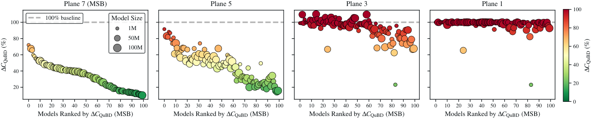

*Figure 1: Relative algorithmic complexity, expressed as the ratio between the complexities of pretrained and random weights, estimated using QuBD, $\Delta\mathcal{C}_{\text{QuBD}}$ (%). We show the trend for 100 pretrained timm models [53], up to 100M parameters, using the QuBD with 8-bit planes. Models are ordered by decreasing $\Delta\mathcal{C}_{\text{QuBD}}$ for the most significant bit-plane (MSB). Further details can be found in Sec. 4, Appx. E.2, and Appx. F.1.* **[p. 2]**

Recent work by [40] addresses these gaps by characterizing learning in binary neural networks through the lens of algorithmic information theory [9]. They show that algorithmic complexity, estimated as structure in weights or the lack thereof, correlates strongly with learning dynamics. This provides direct empirical support for the “learning as compression” hypothesis: training induces structure in the model parameters, and this structure is precisely what enables compression. Building on this, [4] shows that such a structure can be actively enforced throughout training without performance loss, yielding model classes that are inherently more compressible.

Despite this promise, measuring algorithmic [24, 8, 45] (KCS) complexity is non-computable by definition, and is only upper-semicomputable. Current KCS complexity estimators rely on the Coding Theorem Method (CTM), which estimates the output frequency of small Turing machines through large-scale simulations [44]. These simulations are limited to a small number of states and binary symbols, making the method practical only for small binary objects. The Block-Decomposition Method (BDM) proposed by [58] scales this approach by estimating complexity from small sub-structures within larger objects. However, as we show through both theoretical and empirical analyses (Sec. 3), BDM does not scale to DNNs, thereby preventing a comparison of learning dynamics across model sizes and architectures.

To address this, we introduce the Quantized Block-Decomposition method (QuBD), which quantizes any non-binary object into a finite set of integer values and estimates their KCS complexity through a bit-plane decomposition. This extends CTM-based estimators for floating-point objects like the weights of DNNs. We show theoretically that QuBD yields a tighter estimation of KCS complexity of complex objects. Using QuBD, we provide the first scalable empirical characterization of the “learning as compression” hypothesis for DNNs beyond simple feedforward networks. We show that KCS complexity decreases as the models are trained. This is visualized in Fig. 1 for 100 models with up to 100M trainable parameters. Furthermore, we can observe that the algorithmic complexity is lower in the most significant bit-planes, it correlates with generalization, and can serve as a practical diagnostic for model compression settings.

Our main contributions are:

- We introduce QuBD, which combines quantization with a CTM-based estimator over bit-plane decomposition, making KCS complexity analysis feasible for large, non-binary objects.
- We prove that QuBD yields a strictly smaller estimation gap relative to true KCS complexity compared to binarization-based methods.
- We use QuBD to study DNN learning dynamics, showing that KCS complexity decreases as models learn and generalize, increases during over-fitting, and tracks phenomena like grokking.
- **[p. 3]** We demonstrate that QuBD complexity serves as a practical diagnostic for model compression, as algorithmic information concentrates in the most significant bit-planes while those with no complexity reduction during training can be safely discarded.

## 2 Background and Related Work

### 2.1 Algorithmic Complexity of Neural Networks

Different notions of model compression have been used to explain generalization. For instance, classical learning theory [52, 5] suggests that models with more parameters than data points should overfit, yet such models often generalize well in practice [61, 34, 7]. Moreover, a large fraction of model parameters can be removed [22], shared [50], or quantized [21] post-training with only small drops in performance.

Since neural networks admit many function-preserving reparametrizations [15], quantities such as curvature or flatness can vary without changing the learned function, limiting how directly they explain generalization behavior [54, 19]. This motivates the algorithmic complexity view of learning, where complexity and compressibility are studied through the description length of the learned object: the lower the KCS complexity, the shorter the generating description an object admits [28]. From this perspective, [51] shows that models exhibit a simplicity bias, favoring functions with low KCS complexity, explaining why structured targets are often learned in practice and tend to exhibit redundancy. Moreover, [31] find that parameters of a trained model contain measurable correlation structure that evolves during learning and tracks generalization.

Although KCS complexity is non-computable, approximations based on the algorithmic probability of an object [46], computed from large-scale simulations of Turing machines [44, 58], have enabled recent works to assess this perspective for neural networks empirically. Such estimators track structural properties better compared to purely statistical measures like entropy [59], commonly used to explain properties of neural networks [57, 1]. In particular, [40] shows that estimated KCS complexity tracks learning dynamics in binarized neural networks more closely than entropy-based measures. That complexity decreases throughout training, capturing changes in the algorithmic structure of the learned function and how such structure shapes the optimization landscape [4]. However, existing estimators do not scale to modern networks, limiting their applicability and motivating the development of tractable KCS complexity estimators for DNNs.

### 2.2 Algorithmic Information Theory

The central idea formalized in KCS complexity is that structured objects admit shorter descriptions than truly random objects. For a finite binary object $\mathbf{w}\in\{0,1\}^{*}$, program $\mathrm{p}$, this is expressed as

$$
\mathcal{C}(\mathbf{w}):=\min\{|\mathrm{p}|:U(\mathrm{p})=\mathbf{w}\}, \tag{1}
$$

where $U$ is a fixed universal prefix-free Turing machine and $|\mathrm{p}|$ denotes the length of the program in bits. Since determining whether all shorter programs produce $\mathbf{w}$ and halt is undecidable [12], KCS complexity is not computable in general.

Instead, estimates are obtained via algorithmic probability through large-scale simulations of finite Turing machines, using the Coding Theorem [27] as operationalized by [60] in the Coding Theorem Method (CTM). CTM estimates the algorithmic probability of an object by its empirical output frequency across all simulations, and the collection of such estimations is referred to as a CTM table.

BDM [58] extends CTM to larger objects by partitioning them into smaller blocks, estimating the complexity of each block using pre-computed CTM tables, and accounting for repeated blocks with a logarithmic multiplicity term.

**[p. 4]**

Concretely, let $\mathbf{W}$ be a large object partitioned by a lossless function $\Pi(\mathbf{W})=(\mathrm{w}_{1},\ldots,\mathrm{w}_{m})$ and let $\Pi_{u}(\mathbf{W})$ denote the set of distinct blocks of $\mathbf{W}$. The KCS complexity is then estimated as

$$
\mathcal{C}_{\mathrm{BDM}}(\mathbf{W})=\sum_{\mathrm{w}\in\Pi_{u}(\mathbf{W})}\mathcal{C}_{\mathrm{CTM}}(\mathrm{w})+\log_{2}n_{\mathrm{w}}. \tag{2}
$$

where $n_{\mathrm{w}}$ is the number of occurrences of $\mathrm{w}\in\Pi(\mathbf{W})$ and $\mathcal{C}_{\mathrm{CTM}}(\mathrm{w})$ is the estimated KCS complexity of $\mathrm{w}$, derived from its empirical output frequency across Turing machine simulations.

Since CTM tables are defined over binary objects, non-binary objects must first be represented as such prior to partitioning and estimation, which is typically achieved through binarization. Furthermore, the block sizes supported by CTM tables are limited, e.g., $(4\times 4)$ blocks, which creates a problem when meaningful structures are only revealed at larger scales.

Since scaling CTM tables to larger block sizes is computationally prohibitive and the supported two-dimensional blocks are only defined over binary objects, two fundamental limitations arise. First, the binarized representations may be lossy, discarding useful information about the original object, such that the complexity estimate may correspond to a different target object than intended. Second, the representation and partitioning determine which structures are visible in CTM tables; if meaningful structure is not exposed, it becomes difficult to distinguish genuinely complex objects from objects whose structure is simply obfuscated.

We provide further background on algorithmic complexity in Appx. A. All CTM estimates in this work are from the CTM tables in pyBDM [48], with a block size $\pi\in\{(2\times 2),(3\times 3),(4\times 4)\}$ stated for each experiment.

## 3 Tractable Algorithmic Complexity Analysis using QuBD

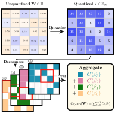

*Figure 2: QuBD first quantizes weights into finite codes **(top)**, then decomposes them into aligned bit-planes, to aggregate the per-plane KCS estimates **(bottom)**.* **[p. 4]**

Our proposed KCS complexity estimation method, QuBD, shown in Fig. 2, first quantizes the model weights to a finite alphabet, then represents each quantized weight by its binary expansion across bit-planes. The KCS complexity estimation is then performed by aggregating the CTM-based estimations over all the bit-planes. We show theoretically that this yields a tighter estimate of KCS complexity than BDM-based methods that rely on binarization. We verify this empirically and further characterize the conditions under which such estimations remain informative across object scales, given the finite CTM tables.

Let $\mathbf{W}=(w_{1},\ldots,w_{d})\in\mathbb{R}^{d}$ denote the object of model weights. We map $\mathbf{W}$ to a finite alphabet $\Sigma_{q}$ using an affine uniform quantizer $Q_{q}:\mathbb{R}^{d}\to\Sigma_{q}^{d}$, described in Appx. B.1. This yields the object

$$
\mathbf{W}^{(q)}=Q_{q}(\mathbf{W})=\bigl(w_{1}^{(q)},\dots,w_{d}^{(q)}\bigr)\in\Sigma_{q}^{d},\text{ with }\Sigma_{q}:=\{0,\dots,2^{q}-1\}, \tag{3}
$$

where each weight $w^{(q)}_{i}$ is a $q$-bit symbol of $2^{q}$ possible elements. We write $q^{\star}$ for the target lossless precision, and $\mathbf{W}^{(q^{\star})}$ for the corresponding target object. For instance, $q^{\star}=32$ for full-precision weights, though precision choices $q\leq 8$ are increasingly relevant for compute-efficient models [18]. Since $\mathbf{W}^{(q)}$ must be decomposed into smaller blocks supported by CTM tables, the choice of quantized representation determines which structures are exposed and therefore affect the theoretical gap between the KCS complexity of the target object $\mathbf{W}^{(q^{\star})}$ and the estimated object $\mathbf{W}^{(q)}$.

#### Lossless Exposure of Objects.

One possible lossless representation of Eq. (3) is the serialized bit string $\mathbf{W}^{(q)}_{\text{ser}}\in\{0,1\}^{d\cdot q}$, which for block size $\pi$ exposes $m=d\cdot q/\pi$ blocks. **[p. 5]** The KCS complexity of the original non-binary object and the CTM-estimate of the corresponding serialized bit-stream may be different due to the limitations of finite CTM tables (see Sec. 2.2). In contrast, binarization $\mathbf{W}_{\text{bin}}\in\{0,1\}^{d}$ exposes $q$ times fewer blocks but yields an unreliable estimate that differs significantly from that of the target object[^1].

[^1]: When binarization is applied through the sign function, it defines a different target object. The additive-constant invariance of KCS complexity applies only to lossless changes of description of the same object [24]; a sign map is many-to-one and therefore falls outside that setting. However, we include it in this work for completeness.

The bit-plane representation uses the binary expansion of each quantized weight

$$
w_{i}^{(q)}=\sum_{\ell=0}^{q-1}2^{\ell}\beta_{i,\ell},\qquad\beta_{i,\ell}\in\{0,1\},\qquad\boldsymbol{\beta_{\ell}}:=(\beta_{1,\ell},\ldots,\beta_{d,\ell})\in\{0,1\}^{d} \tag{4}
$$

where $\beta_{i,q-1}$ denotes the Most Significant Bit (MSB) and $\beta_{i,0}$ denotes the Least Significant Bit (LSB) of $w_{i}^{(q)}$. The vector $\boldsymbol{\beta}_{\ell}$ collects the $\ell$-th bit of each of the $d$ symbols, forming the $\ell$-th bit-plane. The target object can thus be exposed one bit-plane at a time. The representation is lossless when $q=q^{\star}$ since the bit-planes jointly and uniquely determine $\mathbf{W}^{(q)}$. The structural information captured by bit-planes has furthermore been shown to be useful for downstream tasks [35].

Interestingly, bit-planes can also be used to reveal structural information progressively. For $1\leq k\leq q$, define the $k$-bit MSB prefix index as

$$
c_{i}^{(k)}:=\left\lfloor\frac{w_{i}^{(q)}}{2^{,q-k}}\right\rfloor=\left\lfloor\frac{c_{i}^{(k+1)}}{2}\right\rfloor,~~~\text{and}~~~w_{i}^{(q)}\in\{c2^{q-k},\dots,(c+1)2^{q-k}-1\} \tag{5}
$$

when $c_{i}^{(k)}=c$. For instance, if $q^{\star}=4$ and $w_{i}^{(4)}=13=1101_{2}$, then retaining one bit gives the interval $\{8,\dots,15\}$, retaining two bits gives $\{12,\dots,15\}$, and retaining three bits gives $\{12,13\}$.

### 3.1 Quantized Block Decomposition (QuBD) Complexity

A fixed lossless representation changes the KCS complexity of an object only by an additive constant [24]. In contrast, retaining only the first $q$ bit-planes for $1\leq q<q^{\star}$ is not lossless. Crucially, even when $q=q^{\star}$, the object cannot be estimated directly and must be estimated from its decomposition, so its KCS complexity depends on the chosen representation. We consider the change in target object induced by quantization and ask: *What is the loss in KCS complexity between the target object and the estimated quantized object?*

To formalize this estimation gap, let $x^{\star}$ be the target object and consider its decomposition:

$$
y_{q}:=\left\lfloor\frac{x^{\star}}{2^{q^{\star}-q}}\right\rfloor=(y_{q,1},\ldots,y_{q,d}),\qquad y_{q,i}=\left\lfloor\frac{x_{i}^{\star}}{2^{q^{\star}-q}}\right\rfloor=\sum_{\ell=q^{\star}-q}^{q^{\star}-1}2^{\ell-(q^{\star}-q)}\beta_{i,\ell}^{\star}. \tag{6}
$$

Here $y_{q}$ retains exactly the $q$ MSB-planes of $x^{\star}$, while discarding the lower $(q^{\star}-q)$-bit planes. Let $\delta_{q}=(\delta_{q,1},\ldots,\delta_{q,d})$ denote the omitted lower-bit residuals, defined by

$$
\delta_{q}:=x^{\star}-2^{q^{\star}-q}y_{q}. \tag{7}
$$

Here, $\delta_{q,i}=x_{i}^{\star}-2^{q^{\star}-q}y_{q,i}$ and $0\leq\delta_{q,i}<2^{q^{\star}-q}$ for each $i$. Since $y_{q}$ and $\delta_{q}$ capture the retained and omitted $q$ bit planes, respectively, the target object can be estimated as the composite $(y_{q},\delta_{q})$. We analyze the theoretical gap between $x^{\star}$ and $(y_{q},\delta_{q})$ using standard information-symmetry identities of KCS complexity from [28], summarized in Appx. C.1.

##### **Theorem 3.1**(Residual Decomposition)**.**

*For a target object $x^{\star}$ with precision $1\leq q\leq q^{\star}$,*

$$
\mathcal{C}(x^{\star})=\mathcal{C}(y_{q})+R_{q}+O(\log q^{\star}d),\qquad R_{q}:=\mathcal{C}(\delta_{q}\mid y_{q}), \tag{8}
$$

*where $0\leq R_{q}\leq(q^{\star}-q)d+O(1)$. So, estimating $x^{\star}$ from $y_{q}$ misses the complexity due to the residual information $R_{q}$, up to a logarithmic term. If $q=q^{\star}$, then $\delta_{q}=0$ and $R_{q}=O(1)$. Proof in Appx. C.2.*

Estimating $(y_{q},\delta_{q})$ instead results in only a logarithmic error in bit length and in the residual information from the omitted bits. The following analysis demonstrates that this residual diminishes as additional bit-planes are incorporated.

##### **Theorem 3.2**(Bit Plane Residual Loss)**.**

*For $1\leq q<q^{\star}$, let*

**[p. 6]**

$$
b_{q+1}:=(\beta^{\star}_{1,q^{\star}-q-1},\ldots,\beta^{\star}_{d,q^{\star}-q-1})\in\{0,1\}^{d}, \tag{9}
$$

*where $b_{q+1}$ is the next MSB plane after the $q$ retained in $y_{q}$. Then $y_{q+1}=2y_{q}+b_{q+1}$, and*

$$
R_{q} \geq R_{q+1}-O(\log(q^{\star}d)). \tag{10}
$$

*Thus, adding the $(q+1)$st bit-plane cannot increase the residual loss, and more importantly, the residual loss decreases whenever bit-planes are not identical. Proof in Appx. C.3.*

Repeated application of Thm. 3.2 shows that if $q=q^{*}$ only a constant error remains; we refer to Cor. C.1 and its proof in Appx. C.3.1. Importantly, when $q>1$, the bit-plane decomposition yields a strictly smaller residual than one-bit binarization.

We validate our findings in Appx. C.4 (Fig. 8) by comparing the estimation gap to the reference CTM-table complexity across different representations. The figure shows that this gap narrows as QubD retains more bit-planes. We next demonstrate how QuBD scales CTM-tables, providing more informative estimates at larger scales.

### 3.2 Saturation in Finite-state Machines

Let the binary block size $\pi$ be fixed, and define $S_{\pi}\subseteq\{0,1\}^{\pi}$ as the finite CTM support. For an exposure $z_{q,r}=\phi(\mathbf{W}^{(q)})$, the number of blocks $m$ is determined after the quantized object is exposed by representation $r$ and partitioned into binary blocks, $\Pi_{\pi}(z_{q,r})=(\mathrm{w}_{1},\ldots,\mathrm{w}_{m})$, each of size $\pi$. The same $d$ quantized symbols may yield a different number of binary blocks depending on $r$. Define $S_{\pi,r}^{(q)}\subseteq S_{\pi}$ as the set of supported blocks reachable under this exposure, and let $a_{\pi}(z_{q,r})$ denote the number of reachable blocks that appear among $(\mathrm{w}_{1},\ldots,\mathrm{w}_{m})$. Define

$$
H_{\pi,r}^{(q)}:=|S_{\pi,r}^{(q)}|,\qquad\sigma_{\pi,r}(m):=\frac{\mathbb{E}[a_{\pi}(z_{q,r})]}{H_{\pi,r}^{(q)}}. \tag{11}
$$

Here, $\sigma_{\pi,r}(m)$ represents the expected fraction of reachable support that appears after $m$ exposed blocks. The estimate is considered $(1-\epsilon)$-saturated when $\sigma_{\pi,r}(m)\geq 1-\epsilon$. Additional details are provided in Appx. D.1.

##### **Proposition 3.3**(Finite-table Saturation)**.**

*Assume the $m$ exposed blocks are sampled independently and uniformly from $S_{\pi,r}^{(q)}$. Then*

$$
\sigma_{\pi,r}(m)=1-\left(1-\frac{1}{H_{\pi,r}^{(q)}}\right)^{m}\approx 1-e^{-m/H_{\pi,r}^{(q)}},\qquad m_{\epsilon}\gtrsim H_{\pi,r}^{(q)}\log\frac{1}{\epsilon}, \tag{12}
$$

*where $m_{\epsilon}$ is the number of exposed blocks expected for $(1-\epsilon)$-saturation. Proof in Appx D.2.*

By Prop. 3.3, exposure $r$ saturates when $m_{r}\approx H_{\pi,r}^{(q)}\log(1/\epsilon)$. For $d$ quantized symbols, $m_{\mathrm{bin}}=d/\pi$, $m_{\mathrm{ser}}=d\cdot q/\pi$, and $m_{\mathrm{plane}}=d/\pi$ per bit-plane, which yields

$$
d_{\mathrm{bin}}\gtrsim\pi H_{\pi,\mathrm{bin}}\log\frac{1}{\epsilon},\qquad d_{\mathrm{ser}}\gtrsim\frac{\pi H_{\pi,\mathrm{ser}}^{(q)}}{q}\log\frac{1}{\epsilon},\qquad d_{\mathrm{plane}}\gtrsim\pi H_{\pi,\mathrm{plane}}\log\frac{1}{\epsilon}. \tag{13}
$$

While binarization saturates more slowly, it incurs a larger residual loss. In contrast, serialization is lossless but saturates earlier, as it exposes $q$ times more blocks to a single finite table. Bit-plane exposure estimates the same target object by scaling the support according to the number of bit-planes while evaluating local structures independently across its bit-planes. The corresponding saturation rates are illustrated in Appx. D.3 (Fig. 9).

#### When Representations Fail.

The problem with the saturation effect (Sec. 3.2) is that $a_{\pi}(z_{q,r})$ stops growing while $m$ keeps increasing, to the point where only multiplicity is counted (recall Eq.(2)). While this is reasonable for simple objects, it is not for structurally rich or large objects, where additional local structure can no longer be captured. Hence, the estimate becomes uninformative, similar to the entropy collapse described in [40].

Representation failure is illustrated in Fig. 3, which compares a structured $8$-ary object $x=(x_{1},\ldots,x_{d})$ with its partially permuted counterpart $x_{\rho}$ using $\pi=(4\times 4)$, where $\rho$ is the fraction of positions permuted. Let $n_{a}:=|\{i:x_{i}=a\}|$ be the number of occurrences of symbol $a\in\Sigma_{q}$ in $x$.

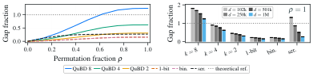

*Figure 3: Complexity gap between estimations of an ordered $8$-ary object and its permutation, where $\rho$ is the fraction of symbols $d$ permuted. The gap is shown **(left)** for an object with $d=1M$ symbols as $\rho$ increases, and **(right)** across object sizes for different methods when $\rho=1$.* **[p. 7]**

**[p. 7]**

Since the permutation preserves all symbol counts and alters only their positions, any difference in complexity estimates must arise from the change in arrangement. The information required to identify one such arrangement is $\log_{2}(d!/\prod_{a}n_{a}!)$ bits [11, 28], which serves as a reference for the complexity added by the permutation. The values in Fig. 3 are normalized by the object type class described in [11]. An informative estimator should assign higher complexity to $x_{\rho}$ than to $x$, with the gap increasing in $\rho$. If the KCS complexity gap $\mathcal{C}(x_{\rho})-\mathcal{C}(x)$ collapses toward zero, the estimator fails to identify structure. As shown in Fig. 3, QuBD maintains a larger and more stable estimation gap than serialization, one-bit, and sign-binarization. Additional results are provided in Appx. 10.

## 4 Characterizing Learning in Deep Neural Networks

We normalize the complexity values relative to a random object of the same length, denoted $\Delta\mathcal{C}_{\text{QuBD}}$, for easier interpretation:

$$
\Delta\mathcal{C}_{\text{QuBD}}=\frac{\mathcal{C}_{\text{QuBD}}(f_{\text{PT}})}{\mathcal{C}_{\text{QuBD}}(f_{\text{RND}})}. \tag{14}
$$

A truly random object has $\Delta\mathcal{C}_{\text{QuBD}}\approx 1$, whereas an algorithmically simple object[^2] has $\Delta\mathcal{C}_{\text{QuBD}}\approx 0$.

[^2]: Strictly speaking, $\Delta\mathcal{C}_{\text{QuBD}}\approx 0$ holds only for sufficiently large objects, as even maximally simple objects such an an all-zero string retain some complexity. For objects of sizes ($8\times 8$), ($16\times 16$), ($32\times 32$), $\Delta\mathcal{C}_{\text{QuBD}}$ for an all zeros string is 0.19, 0.05, and 0.01, respectively.

#### Learning Reduces Algorithmic Complexity of Networks.

Neural network weights are initialized randomly, and from an algorithmic complexity perspective, constitute highly complex objects because they lack structure and therefore cannot be compressed. This raises a natural question: *What happens to the algorithmic complexity of the weights as networks train?*

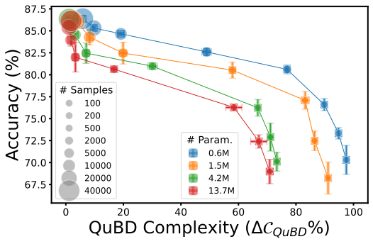

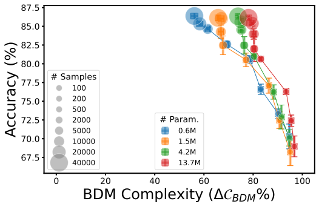

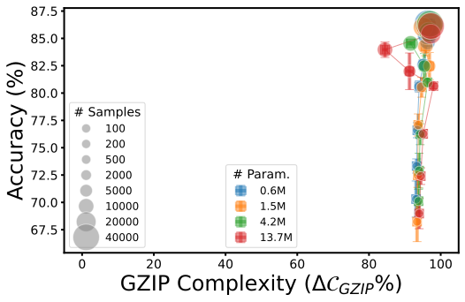

*Figure 4: Complexity of trained models compared to random initialization when using QuBD, BDM, and GZIP-based estimations, measured as $\Delta\mathcal{C}$ based on Eq. 14. Four MLPs with different numbers of trainable parameters ($0.6M-13.7M$) are trained with an increasing number of training data points and validated on the same test set. QuBD complexity tracks the connection between learning and algorithmic complexity better than BDM or GZIP.* **[p. 7]**

In Fig. 4 **(left)**, we present clear empirical evidence that the algorithmic complexity of neural networks measured using the QuBD (Sec. 3) decreases with training. Multi-layered perceptrons (MLPs) with varying numbers of trainable parameters, ranging from $0.6M$-$13.7M$, are trained on the Fashion-MNIST dataset [56] with an increasing number of training samples and evaluated on the same validation set. For each model, the test accuracy improves with more training data, and the normalized algorithmic complexity $\Delta\mathcal{C}$ decreases accordingly, indicating that the improvements in test performance correlate with reductions in algorithmic complexity. This effect is most pronounced for the largest model, whose QuBd complexity reduces to approximately 5% of its value at initialization.

Fig. 4 **(center)** and Fig. 4 **(right)** report two commonly used complexity measures for comparison: BDM with weight binarization [40, 4], and raw weight **[p. 8]** compression using GZIP. As clearly seen in these plots, neither measure correlates meaningfully with learning, in contrast to QuBD. The results shown here are when using 8-bit planes for QuBD. Additional experimental details are provided in Appx E.3.

#### Algorithmic Complexity Tracks Generalization.

Fig. 5 probes into the evolution of algorithmic complexity reduction during training for MLP trained on Fashion MNIST [56] and Tiny-ViT [55] trained on CIFAR-10 [26]. In both cases, $\Delta\mathcal{C}_{\text{QuBD}}$ tracks the generalization performance. The most interesting observation is in Fig. 5 **(left)**, where the algorithmic complexity increases as the network starts to overfit. As overfitting is generally attributed to memorization, this suggests that the network is no longer simplifying its underlying algorithmic structure, leading to an increase in algorithmic complexity. For the Tiny-ViT case, QuBD complexity follows the learning curves, indicating that learning continues to reduce the algorithmic complexity of networks. Additional experimental details are provided in Appx. E.4.

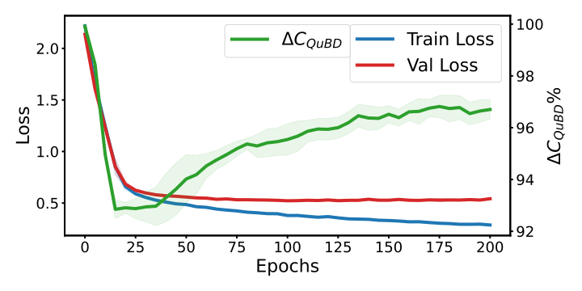

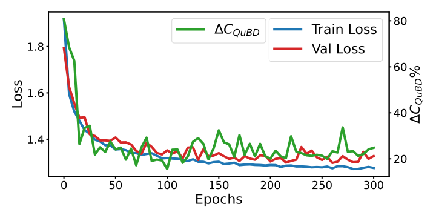

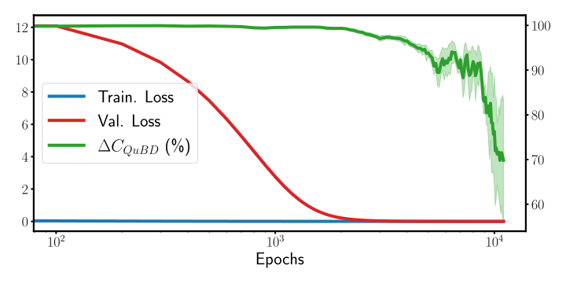

*Figure 5: Learning curves along with $\Delta\mathcal{C}_{\text{QuBD}}$ evolution for MLP **(left)** and Tiny ViT **(center)**. Algorithmic Complexity during **(right)** Grokking for the Modulo operator for $P=97$.* **[p. 8]**

#### Algorithmic Complexity during Grokking.

Grokking [38] is a phenomenon observed in over-parameterized neural networks, where the networks generalize well past the point of overfitting, defying conventional machine learning principles [7]. This raises the question: *What happens to the algorithmic complexity of neural networks in such regimes?*

To study this, we set up grokking experiments for the modulo operator as described in [38], and measure the QuBD complexity during training, as shown in Fig. 5 **(right)**. The network reaches zero training error within the first few epochs, whereas the validation loss drops to zero after about 1000 epochs, consistent with the findings reported in [38] and other works. The algorithmic complexity, measured as the reduction in QuBD complexity, remains high during the high-validation-loss regime and decreases when the validation loss has reached zero. It continues to decrease even after the validation loss is zero, indicating further algorithmic simplification of the neural network. This is in contrast to the overfitting example demonstrated in Fig. 5 **(left)**.

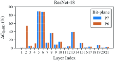

*Figure 6: QuBD complexity ratio $\Delta\mathcal{C}_{\text{QuBD}}$ per layer for ResNet-18 for the two MSB-planes (P7, P6).* **[p. 8]**

#### Algorithmic Information Resides in Higher Bit-Planes.

QuBD complexity offers tighter estimates of KCS complexity of non-binary objects compared to BDM, due to Thm. 3.1 and Thm. 3.2. Adding bit-planes captures additional algorithmic information, but saturates beyond a few. This is illustrated in Fig. 1, where we show the relative complexity reduction achieved by the QuBD method per bit-plane. For the higher bit-planes, in particular the MSB, the normalized QuBD complexity $\Delta\mathcal{C}_{\text{QuBD}}$ is lower for all the 100 models with $1M$ to $100M$ trainable parameters, whereas the lower bit-planes show no reduction in complexity. Additional experimental details can be found in Appx. E.5.

To use QuBD for models with high-dimensional weight tensors, e.g., 4D convolutional layers, the weight tensors must first be preprocessed into 2D matrices prior to estimation, as described in Appx. B.3. Using this, we examine the normalized complexity per layer of ResNet-18 (Fig. 6) and ResNet-50 (Appx. F.2) for the two MSB-planes (P7, P6). It is well established that different layers in a neural network have different importance, and that a uniform level of pruning or quantization can hamper performance. This variation across layers is clearly reflected in the QuBD-complexity reduction for both ResNet models. While there is no clear trend, some inner layers appear to exhibit significant complexity reduction. This could also explain why these inner layers are better suited for compression than input or output layers.

We have seen that lower bit-planes have less algorithmic information (see Fig.1), leading to the question: *If the lower bit-planes contain less algorithmic information, can these planes be discarded?*

#### QuBD Complexity as a Diagnostic for Compression.

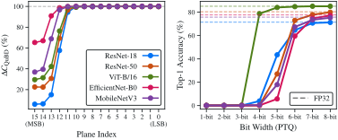

*Figure 7: QuBD complexity $\Delta\mathcal{C}_{\text{QuBD}}$ per bit-plane **(left)** and top-1 PTQ accuracy on ImageNet **(right)** for five pretrained models under 1-to-8-bit quantization. Dashed lines indicate FP32 baseline accuracy.* **[p. 9]**

**[p. 9]**

To test this hypothesis, we measure the QuBD complexity of five full precision (FP32) models: ResNet-18, ResNet-50, ViT, EfficientNet, and MobileNet, trained on ImageNet [14] using 16 bit-planes. We then perform post-training quantization (PTQ) on the same models with weight precision ranging from 1-bit to 8-bit and evaluate the quantized models on the ImageNet validation set. The first observation in Fig. 7 **(left)** is that $\Delta\mathcal{C}_{\text{QuBD}}\approx 100\%$ for the lower bit-planes, indicating they are close to random and might not contain any useful algorithmic information. Notably, meaningful complexity reduction is concentrated in the top five bit-planes. This correlates with the PTQ performance in Fig. 7 **(right)**, which does not show large performance drops after 4-to-6-bit quantization, suggesting that the remaining bit-planes can be discarded without a performance penalty. Measuring KCS complexity using the QuBD method can serve as a diagnostic to determine PTQ quantization levels (Fig. 7) or which layers to prune (Fig. 6). Additional experimental details are provided in Appx. E.6.

*Table 1: Comparison of FP32 and QAT with 32 bits.* **[p. 9]**

| **Precision** | **Accuracy** | $\Delta\mathcal{C}_{\text{QuBD}}$ |
|---|---|---|
| FP32 | 86.13 ± 0.46 | 95.51 ± 0.90 |
| QAT-32 | 86.22 ± 0.44 | 96.39 ± 0.29 |

#### Influence of Quantization on QuBD Complexity.

Estimating the QuBD complexity entails a quantization step as described in Sec. 3. One concern about this transformation is whether the resulting KCS complexity is related to the actual model weights or whether quantization has an adverse impact. We verify this by comparing standard FP32 training with quantization-aware training (QAT) at 32-bit precision, and measuring the QuBD complexity using 8-bit planes. Tab. 1 shows that there is no significant difference between the original model and the QAT model, both in terms of accuracy and QuBD complexity reduction. This is a key difference compared to other methods that rely on binarizing the weights of an FP32 network before estimating KCS complexity, as the two objects (FP32 and binary versions) may not be comparable in those settings.

#### Limitations.

We aggregate the algorithmic complexity per bit-plane in QuBD, which assumes independence across bit-planes. This might not be true as there could be mutual algorithmic information shared across bit-planes, which implies QuBD can be overestimating the underlying algorithmic complexity. While QuBD provides a tighter upper bound than BDM, accounting for inter bit-plane structure could yield even tighter KCS complexity estimations. Further, we demonstrated that QuBD can identify redundant bit-planes and that weight structures can be pruned based on QuBD complexity, suggesting its potential as a practical diagnostic for both PTQ level selection and pruning. A natural extension is to validate these applications within thorough compression experiments and benchmark them against established methods.

## 5 Conclusions

Several attempts have been made to explain learning in deep neural networks. We contribute a novel view based on algorithmic information theory, building on some of the recent works [40, 4]. We operationalize KCS complexity estimation using the QuBD method. To our knowledge, this is the first scalable method to reliably estimate KCS complexity of large, non-binary bit strings. We have shown theoretically that the QuBD method yields a tighter KCS complexity estimate compared to binarization. Using this algorithmic complexity analysis tool, we have shown that learning in deep neural networks induces structure, or equivalently, reduces algorithmic complexity. We have shown, across a wide variety of experiments, that QuBD complexity correlates with generalization and phenomena such as grokking. We have demonstrated that higher bit planes carry more algorithmic structure than lower bit planes. This can be used to identify redundant model capacity, for example, by choosing appropriate PTQ levels. Algorithmic information theory is a powerful paradigm that has been creatively applied to prove Darwinian evolution [10], and we believe it can also be useful for explaining deep learning. In this work, we have contributed a concrete method that can further the investigations of characterizing learning in deep neural networks using algorithmic complexity analysis.

**[p. 10]**

#### Broader Impact Statement.

This paper presents work whose goal is to advance the field of machine learning. There are many potential societal consequences of our work, none of which we feel must be specifically highlighted here.

#### Generative AI Usage Statement

ChatGPT version 5.4 and Google Gemini were used to support programming tasks, including the development of scripts for visualization and setting-up experiments, to edit and refine language and grammar in selected sections of the manuscript.

## Acknowledgments and Disclosure of Funding

All authors acknowledge funding from the European Union’s Horizon Europe Research and Innovation Action program under grant agreements No. 101070284, No. 101070408 and No. 101189771. SW and RS acknowledge funding from the Independent Research Fund Denmark (DFF) under grant agreement No. 4307-00143B. RS also acknowledges funding received under Independent Research Fund Denmark (DFF) under grant agreement number 4307-00143B. The Authors thank members of SAINTS Lab for valuable discussions.

## References

- [1] Achille and Soatto (2018). A. Achille and S. Soatto Emergence of Invariance and Disentanglement in Deep Representations. External Links: 1706.01350, Link Cited by: §2.1.

- [2] Alzahrani (2024). A. Alzahrani Utility of Kolmogorov complexity measures: Analysis of L2 groups and L1 backgrounds. PLOS ONE 19 (4), pp. 1–25. External Links: Document, Link Cited by: Appendix A.

- [3] Anthony et al. (2020). L. F. W. Anthony, B. Kanding, and R. Selvan Carbontracker: Tracking and Predicting the Carbon Footprint of Training Deep Learning Models. In ICML Workshop on Challenges in Deploying and Monitoring Machine Learning Systems, Cited by: §1.

- [4] Bakhtiarifard et al. (2026). P. Bakhtiarifard, T. Chen, J. Wenshøj, E. B. Dam, and R. Selvan Algorithmic Simplification of Neural Networks with Mosaic-of-Motifs. External Links: 2602.14896, Link Cited by: §1, §2.1, §4, §5.

- [5] Bartlett and Mendelson (2002). P. L. Bartlett and S. Mendelson Rademacher and gaussian complexities: Risk bounds and structural results. Journal of machine learning research 3 (Nov), pp. 463–482. Cited by: §2.1.

- [6] Bartoldson et al. (2023). B. R. Bartoldson, B. Kailkhura, and D. Blalock Compute-Efficient Deep Learning: Algorithmic Trends and Opportunities. Journal of Machine Learning Research. Cited by: §1.

- [7] Belkin et al. (2019). M. Belkin, D. Hsu, S. Ma, and S. Mandal Reconciling modern machine-learning practice and the classical bias–variance trade-off. Proceedings of the National Academy of Sciences 116 (32), pp. 15849–15854. External Links: ISSN 1091-6490, Link, Document Cited by: §2.1, §4.

- [8] Chaitin (1966). G. J. Chaitin On the length of programs for computing finite binary sequences. Journal of the ACM (JACM) 13 (4), pp. 547–569. Cited by: Appendix A, §1.

- [9] Chaitin (1977). G. J. Chaitin Algorithmic information theory. IBM journal of research and development 21 (4), pp. 350–359. Cited by: §1.

- [10] Chaitin (2013). G. Chaitin Proving Darwin: making biology mathematical. Vintage. Cited by: §5.

- [11] Cover (1999). T. M. Cover Elements of information theory. John Wiley & Sons. Cited by: Figure 10, §3.2.

- [12] Davis (1982). M. Davis Computability & unsolvability. Courier Corporation. Cited by: Appendix A, §2.2.

- [13] Delahaye and Zenil (2012). J. Delahaye and H. Zenil Numerical evaluation of algorithmic complexity for short strings: A glance into the innermost structure of randomness. Applied Mathematics and Computation 219 (1), pp. 63–77. Cited by: Appendix A, §C.4.

- [14] Deng et al. (2009). J. Deng, W. Dong, R. Socher, L. Li, K. Li, and L. Fei-Fei ImageNet: a large-scale hierarchical image database. In Proceedings of the IEEE Conference on Computer Vision and Pattern Recognition (CVPR), Cited by: §E.6, §4.

- [15] Dinh et al. **[p. 11]** (2017). L. Dinh, R. Pascanu, S. Bengio, and Y. Bengio Sharp Minima Can Generalize For Deep Nets. In Proceedings of the 34th International Conference on Machine Learning (ICML), pp. 1019–1028. External Links: Link Cited by: §2.1.

- [16] Frankle and Carbin (2019). J. Frankle and M. Carbin The Lottery Ticket Hypothesis: Finding Sparse, Trainable Neural Networks. In International Conference on Learning Representations (ICLR), External Links: Link Cited by: §1.

- [17] Gailly and Adler (1992). J. Gailly and M. Adler Gzip: GNU file compression utility. Note: Created as a free replacement for Unix compress External Links: Link Cited by: Appendix A.

- [18] Gholami et al. (2021). A. Gholami, S. Kim, Z. Dong, Z. Yao, M. W. Mahoney, and K. Keutzer A Survey of Quantization Methods for Efficient Neural Network Inference. External Links: 2103.13630, Link Cited by: §3.

- [19] Goldblum et al. (2024). M. Goldblum, M. A. Finzi, K. Rowan, and A. G. Wilson Position: The No Free Lunch Theorem, Kolmogorov Complexity, and the Role of Inductive Biases in Machine Learning. In Forty-first International Conference on Machine Learning, External Links: Link Cited by: §2.1.

- [20] Gong et al. (2014). Y. Gong, L. Liu, M. Yang, and L. Bourdev Compressing deep convolutional networks using vector quantization. arXiv preprint arXiv:1412.6115. Cited by: §1.

- [21] Han et al. (2016). S. Han, H. Mao, and W. J. Dally Deep Compression: Compressing Deep Neural Networks with Pruning, Trained Quantization and Huffman Coding. External Links: 1510.00149, Link Cited by: §1, §2.1.

- [22] Hinton et al. (2014). G. Hinton, O. Vinyals, and J. Dean Distilling the Knowledge in a Neural Network. In Deep Learning and Representation Learning Workshop in Conjunction with NeurIPS, Cited by: §1, §2.1.

- [23] Kingma and Ba (2015). D. P. Kingma and J. Ba Adam: A Method for Stochastic Optimization. In International Conference on Learning Representations (ICLR), Cited by: §E.3.

- [24] Kolmogorov (1965). A. N. Kolmogorov Three approaches to the quantitative definition ofinformation. Problems of information transmission 1 (1), pp. 1–7. Cited by: Appendix A, Appendix A, §1, §3.1, footnote 1.

- [25] Kraft (1949). L. G. Kraft A device for quantizing, grouping, and coding amplitude-modulated pulses. Ph.D. Thesis, Massachusetts Institute of Technology. Cited by: Appendix A.

- [26] Krizhevsky et al. (2009). A. Krizhevsky G. Hinton et al. Learning multiple layers of features from tiny images. Toronto, ON, Canada. Cited by: §E.4, §4.

- [27] Levin (1974). L. A. Levin Laws of information conservation (nongrowth) and aspects of the foundation of probability theory. Problemy Peredachi Informatsii 10 (3), pp. 30–35. Cited by: Appendix A, §C.4, §2.2.

- [28] Li et al. (2008). M. Li P. Vitányi et al. An introduction to Kolmogorov complexity and its applications. Vol. 3, Springer. Cited by: §C.1, §2.1, §3.1, §3.2.

- [29] Liu and Simine (2024). T. Liu and L. Simine DeltaGzip: Computing Biopolymer–Ligand Binding Affinity via Kolmogorov Complexity and Lossless Compression. Journal of Chemical Information and Modeling 64 (14), pp. 5617–5623. Note: PMID: 38980667 External Links: Document, Link, https://doi.org/10.1021/acs.jcim.4c00461 Cited by: Appendix A.

- [30] Machado et al. (2021). J. A. T. Machado, J. M. Rocha-Neves, F. Azevedo, and J. P. Andrade Advances in the computational analysis of SARS-COV2 genome. Nonlinear Dynamics 106 (2), pp. 1525–1555. External Links: Document, Link, ISSN 1573-269X Cited by: Appendix A.

- [31] Martin and Hinrichs (2025). C. H. Martin and C. Hinrichs SETOL: A Semi-Empirical Theory of (Deep) Learning. External Links: 2507.17912, Link Cited by: §2.1.

- [32] McMillan (2003). B. McMillan Two inequalities implied by unique decipherability. IRE Transactions on Information Theory 2 (4), pp. 115–116. Cited by: Appendix A.

- [33] Nagel et al. (2021). M. Nagel, M. Fournarakis, R. A. Amjad, Y. Bondarenko, M. Van Baalen, and T. Blankevoort A white paper on neural network quantization. arXiv preprint arXiv:2106.08295. Cited by: §1.

- [34] Neyshabur et al. **[p. 12]** (2017). B. Neyshabur, S. Bhojanapalli, D. McAllester, and N. Srebro Exploring Generalization in Deep Learning. In Advances in Neural Information Processing Systems (NeurIPS), pp. 5949–5958. External Links: Link Cited by: §2.1.

- [35] Nhan et al. (2025). L. T. Nhan, L. T. Duong, P. N. Nam, and T. C. Thang Improvement of spiking neural network with bit planes and color models. IEEE Access 13, pp. 198607–198622. Cited by: §3.

- [36] Paszke et al. (2019). A. Paszke, S. Gross, F. Massa, A. Lerer, J. Bradbury, G. Chanan, T. Killeen, Z. Lin, N. Gimelshein, L. Antiga, et al. Pytorch: An imperative style, high-performance deep learning library. Advances in neural information processing systems 32. Cited by: §E.1.

- [37] Peptenatu et al. (2022). D. Peptenatu, I. Andronache, H. Ahammer, R. Taylor, I. Liritzis, M. Radulovic, B. Ciobanu, M. Burcea, M. Perc, T. D. Pham, et al. Kolmogorov compression complexity may differentiate different schools of Orthodox iconography. Scientific reports 12 (1), pp. 10743. Cited by: Appendix A.

- [38] Power et al. (2021). A. Power, Y. Burda, H. Edwards, I. Babuschkin, and V. Misra Grokking: Generalization beyond overfitting on small algorithmic datasets. In 1st Mathematical Reasoning in General Artificial Intelligence Workshop, ICLR, Cited by: §E.4, §4, §4.

- [39] Rigau et al. (2007). J. Rigau, M. Feixas, and M. Sbert Conceptualizing Birkhoff’s Aesthetic Measure Using Shannon Entropy and Kolmogorov Complexity.. In Third Eurographics conference on Computational Aesthetics in Graphics, Visualization and Imaging, pp. 105–112. External Links: Document Cited by: Appendix A.

- [40] Sakabe et al. (2025). E. Y. Sakabe, F. S. Abrahão, A. Simões, E. Colombini, P. Costa, R. Gudwin, and H. Zenil Binarized Neural Networks Converge Toward Algorithmic Simplicity: Empirical Support for the Learning-as-Compression Hypothesis. arXiv preprint arXiv:2505.20646v3. Cited by: §1, §2.1, §3.2, §4, §5.

- [41] Sevilla et al. (2022). J. Sevilla, L. Heim, A. Ho, T. Besiroglu, M. Hobbhahn, and P. Villalobos Compute trends across three eras of machine learning. In International Joint Conference on Neural Networks (IJCNN), Cited by: §1.

- [42] Seward (1996). J. Seward bzip2 Compression Program. Note: Version 1.0.8 External Links: Link Cited by: Appendix A.

- [43] Shwartz-Ziv and Tishby (2017). R. Shwartz-Ziv and N. Tishby Opening the black box of deep neural networks via information. arXiv preprint arXiv:1703.00810. Cited by: §1.

- [44] Soler-Toscano et al. (2014). F. Soler-Toscano, H. Zenil, J. Delahaye, and N. Gauvrit Calculating Kolmogorov complexity from the output frequency distributions of small Turing machines. PloS one 9 (5), pp. e96223. Cited by: Appendix A, Appendix A, §1, §2.1.

- [45] Solomonoff (1960). R. J. Solomonoff A preliminary report on a general theory of inductive inference. Zator Company Cambridge, MA. Cited by: Appendix A, §1.

- [46] Solomonoff (1964). R. J. Solomonoff A formal theory of inductive inference. Part I. Information and control 7 (1), pp. 1–22. Cited by: Appendix A, §C.4, §2.1.

- [47] Strubell et al. (2019). E. Strubell, A. Ganesh, and A. McCallum Energy and policy considerations for deep learning in NLP. In Annual Meeting of the Association for Computational Linguistics (ACL), Cited by: §1.

- [48] Talaga and Tsampourakis (2024). S. Talaga and K. Tsampourakis Sztal/pybdm: v0.1.0. Zenodo. Cited by: §B.3, §2.2.

- [49] Tishby et al. (2000). N. Tishby, F. C. Pereira, and W. Bialek The information bottleneck method. arXiv preprint physics/0004057. Cited by: §1.

- [50] Ullrich et al. (2017). K. Ullrich, E. Meeds, and M. Welling Soft Weight-Sharing for Neural Network Compression. In International Conference on Learning Representations, External Links: Link Cited by: §2.1.

- [51] Valle-Perez et al. (2019). G. Valle-Perez, C. Q. Camargo, and A. A. Louis Deep learning generalizes because the parameter-function map is biased towards simple functions. In International Conference on Learning Representations, Cited by: §1, §2.1.

- [52] Vapnik (1999). V. N. Vapnik An overview of statistical learning theory. Trans. Neur. Netw. 10 (5), pp. 988–999. External Links: ISSN 1045-9227, Link, Document Cited by: §2.1.

- [53] Wightman (2019). R. Wightman PyTorch Image Models. GitHub. Note: https://github.com/rwightman/pytorch-image-models External Links: Document Cited by: §E.2, §E.5, §E.6, §F.1, Figure 1.

**[p. 13]**

- [54] Wilson (2025). A. G. Wilson Deep learning is not so mysterious or different. arXiv preprint arXiv:2503.02113. Cited by: §2.1.

- [55] Wu et al. (2022). K. Wu, J. Zhang, H. Peng, M. Liu, B. Xiao, J. Fu, and L. Yuan TinyViT: Fast Pretraining Distillation for Small Vision Transformers. In European Conference on Computer Vision (ECCV), Cited by: §E.4, §4.

- [56] Xiao et al. (2017). H. Xiao, K. Rasul, and R. Vollgraf Fashion-mnist: a novel image dataset for benchmarking machine learning algorithms. arXiv preprint arXiv:1708.07747. Cited by: §E.3, §4, §4.

- [57] Xu and Raginsky (2017). A. Xu and M. Raginsky Information-theoretic analysis of generalization capability of learning algorithms. Advances in neural information processing systems 30. Cited by: §2.1.

- [58] Zenil et al. (2018). H. Zenil, S. Hernández-Orozco, N. A. Kiani, F. Soler-Toscano, A. Rueda-Toicen, and J. Tegnér A decomposition method for global evaluation of Shannon entropy and local estimations of algorithmic complexity. Entropy 20 (8), pp. 605. Cited by: Appendix A, Appendix A, §1, §2.1, §2.2, footnote 3.

- [59] Zenil et al. (2020). H. Zenil, N. Kiani, F. Abrahão, and J. Tegnér Algorithmic information dynamics. Scholarpedia. Cited by: §2.1.

- [60] Zenil et al. (2015). H. Zenil, F. Soler-Toscano, J. Delahaye, and N. Gauvrit Two-Dimensional Kolmogorov Complexity and Validation of the Coding Theorem Method by Compressibility. External Links: 1212.6745, Link Cited by: Appendix A, §2.2.

- [61] Zhang et al. (2021). C. Zhang, S. Bengio, M. Hardt, B. Recht, and O. Vinyals Understanding deep learning requires rethinking generalization. Communications of the ACM 64, pp.. External Links: Document Cited by: §2.1.

**[p. 14]**

## Appendix A Additional Details on Algorithmic Information Theory

For completeness, the definitions introduced in the main text are restated here, with additional detail provided where necessary. Kolmogorov–Chaitin–Solomonoff (KCS) complexity [24, 8, 45] formalizes the principle that structured objects can be described more concisely than random objects. For a finite object $\mathbf{w}\in{0,1}^{*}$ and a program $\mathrm{p}$, this relationship is expressed as:

$$
\mathcal{C}(\mathbf{w}):=\min\{|\mathrm{p}|:U(\mathrm{p})=\mathbf{w}\}, \tag{15}
$$

Here, $\mathrm{p}$ is executed on a fixed universal prefix Turing machine $U$. In general, Eq. (15) is not computable because determining whether all shorter programs produce $\mathbf{w}$ and halt, fail, or run indefinitely is undecidable. This is known as the *halting problem*, as described by [12].

A related measure to the KCS complexity of an object is its algorithmic probability [46], which assigns a probability to each possible output produced by a program:

$$
\mathbb{P}_{U}(\mathbf{w}):=\sum_{\mathrm{p}:U(\mathrm{p})=\mathbf{w}}2^{-|\mathrm{p}|}\leq 1. \tag{16}
$$

Here $\mathbb{P}_{U}(\mathbf{w})$ is the probability that a random program produces $\mathbf{w}$ and halts. The last inequality follows from the Kraft–McMillan inequality [25, 32], since the halting programs form a prefix code, i.e., no program is the start of another program.

To help gain intuition into approaches for estimating KCS using algorithmic probability, consider an object $\mathbf{w}$ produced by a program $\mathrm{p}$, and suppose there are $m$ distinct programs of length $|\mathrm{p}|$ such that $U(\mathrm{p})=\mathbf{w}$. Then $\mathbb{P}_{U}(\mathbf{w})\geq m\cdot 2^{-|\mathrm{p}|}$ by Eq. 16 and $\mathcal{C}(\mathbf{w})\leq|\mathrm{p}|$, expressing the upper bound on its KC. For instance, if $|\mathrm{p}|=4$, each such program contributes $2^{-4}=1/16$, so $\mathbb{P}_{U}(\mathbf{w})\geq m/16$. Thus, the existence of one short program gives a lower bound on the algorithmic probability of $\mathbf{w}$. More generally, a larger output probability suggests the existence of shorter (program) descriptions.

An important caveat is that prefix programs are self-delimiting, meaning their description also contains information about where they end. Therefore, estimating complexity from a decomposed view of an object is not the same as estimating the entire object directly. In particular, suppose the partition $\Pi(\mathbf{w})=(\mathrm{w}_{1},\ldots,\mathrm{w}_{m})$ divides the object $\mathbf{w}$ into $m$ ordered blocks $\mathrm{w}_{i}$. Then,

$$
\mathcal{C}(\mathrm{w}_{1},\ldots,\mathrm{w}_{m})=\sum_{i=1}^{m}\mathcal{C}(\mathrm{w}_{i})-I_{\Pi}(\mathrm{w}_{1},\ldots,\mathrm{w}_{m})+O(\log m), \tag{17}
$$

where $\mathcal{C}(\mathrm{w})$ denotes the prefix KCS complexity of $\mathrm{w}$ and $I_{\Pi}$ denotes the algorithmic information shared across blocks in the partition $\Pi$. An estimate that sums local complexities, therefore, ignores part of this shared structure, and the $O(\log_{2}m)$ term accounts for the overhead needed to delimit and reconstruct the ordered decomposition of $\mathbf{w}$. This induces a representation and partition error, which is why both matter. Some useful identities about these errors are summarized in Appx. C.1.

The coding theorem [27] connects the output probability of an object to its complexity by

$$
\mathcal{C}(\mathbf{w})=-\log_{2}\mathbb{P}_{U}(\mathbf{w})+O(1), \tag{18}
$$

where $O(1)$ is a constant factor depending only on $U$, e.g., changing to a machine that uses different instructions adds a constant cost irrespective of $\mathbf{w}$. The central idea behind the Coding Theorem, that objects that appear often as outputs are of low complexity, motivated the Coding Theorem Method (CTM) for numerically estimating KCS complexity via large-scale simulations of small Turing machines [13, 44, 60].

#### Simulating Turing Machines.

Fix integers $n,k,T\in\mathbb{N}$ and let $\mathcal{M}_{n,k}^{T}$ denote the set of all $n$-state, $k$-symbol Turing machines under a fixed encoding, each run for at most $T$ steps. Since $n,k,T$ are fixed, $\mathcal{M}_{n,k}^{T}$ is finite, and all machines in the class can, in principle, be simulated. Let $\rho_{T}(A)=\mathbf{w}\in\mathcal{W}_{T}$ denote the output of $A$ whenever $A$ halts within $T$ steps. CTM estimates the algorithmic probability of $\mathbf{w}$ by its empirical frequency

$$
\mathrm{Dist}_{n,k}^{T}(\mathbf{w})=\frac{|\{A\in\mathcal{M}{n,k}^{T}:\rho_{T}(A)=\mathbf{w}\}|}{|\{A\in\mathcal{M}_{n,k}^{T}:A\text{ halts within }T\text{ steps}\}|}. \tag{19}
$$

and the corresponding complexity estimate is $\mathcal{C}_{\mathrm{CTM}}(\mathbf{w})=-\log_{2}\mathrm{Dist}_{n,k}^{T}(\mathbf{w})+O(1)$. For larger objects, however, exhaustive simulation is not tractable, since the number of machines grows exponentially with $n$ and $k$.

#### Block Decomposition Method.

To extend the CTM to larger objects, [5**[p. 15]** 8] introduced the Block Decomposition Method (BDM), which partitions the object into contiguous blocks and sums the complexity estimates of its smaller structures. Let $\mathbf{W}\in\Sigma^{H\times W}$ be a large object over a finite alphabet $\Sigma$, and let $\Pi$ be a lossless partition operator such that

$$
\Pi(\mathbf{W})=(\mathrm{w}_{1},\dots,\mathrm{w}_{m}),\qquad\mathbf{W}=\mathrm{w}_{1}\otimes\cdots\otimes\mathrm{w}_{m}, \tag{20}
$$

where each $\mathrm{w}_{i}\in\Sigma^{h\times w}$ is a contiguous block of size $h\times w$, and $\otimes$ denotes the reconstruction of $\mathbf{W}$ by concatenating the ordered blocks. If a block appears several times, its complexity is accounted for only once, with a logarithmic term for its frequency; the idea is that repeated structures need not be described from scratch. Let $\Pi_{u}(\mathbf{W})\subseteq\Pi(\mathbf{W})$ denote the set of distinct blocks in the partition, and let $n_{\mathrm{w}}$ denote the number of occurrences of $\mathrm{w}\in\mathbf{W}$. The KCS complexity is then computed as

$$
\mathcal{C}_{\mathrm{BDM}}(\mathbf{W})=\sum_{\mathrm{w}\in\Pi_{u}(\mathbf{W})}\mathcal{C}_{\mathrm{CTM}}(\mathrm{w})+\log_{2}n_{\mathrm{w}}, \tag{21}
$$

where the logarithmic term accounts for the complexity of repeating a block. Hence, repeated structures have diminishing complexity beyond their first occurrences. For example, consider the objects $\mathbf{W}_{1}=aa\otimes aa\otimes ab\otimes aa$, and $\mathbf{W}_{2}=aa\otimes ab\otimes ba\otimes bb$. Assuming $\mathcal{C}_{\mathrm{CTM}}(aa)=\mathcal{C}_{\mathrm{CTM}}(ab)=\mathcal{C}_{\mathrm{CTM}}(ba)=\mathcal{C}_{\mathrm{CTM}}(bb)=1$, then $\mathrm{BDM}(\mathbf{W}_{1})=1+\log_{2}3+1\approx 3.6$ and $\mathrm{BDM}(\mathbf{W}_{2})=4$.

#### Limitations.

In practice, the accuracy of $\mathcal{C}_{\mathrm{BDM}}$ is limited by the finite CTM tables it relies on, where values are computed from a restricted machine class $\mathcal{M}_{n,k}^{T}$ with fixed $n$, $k$, and $T$. As a result, differences in estimates may reflect either structural differences or limitations of the underlying CTM approximation. In particular, partition choices are not invariant in practice. Although they represent the same object up to an additive constant, different block shapes, e.g., $(2\times 1)$ versus $(1\times 2)$, produce different local blocks and multiplicities, and therefore different $\mathcal{C}_{\mathrm{BDM}}$ estimates. In the unbounded setting, such differences are bounded up to an additive constant for fixed lossless partition functions [24].

The most extensive practical CTM table is the $5$-state, $2$-symbol enumeration of [44], which considered over $2.6\times 10^{13}$ machines and required $450$ CPU days. As the basis for the $\mathrm{BDM}$ approximation, [58] showed that such finite CTM values still provide meaningful local rankings of short patterns and capture simple algorithmic structure[^3]. However, extending CTM tables is computationally infeasible, especially in high-dimensional settings such as neural networks with large parameter spaces and high-precision values. In practice, objects are therefore first transformed to finite representations, and then decomposed into structures that are closer to what the available CTM tables can support.

[^3]: We refer to [58] for further practical considerations, including overlapping versus non-overlapping partitions and their effect on the estimates.

#### Compression Proxies.

A common approach is to use compression algorithms as proxies for KCS complexity. The better an object compresses, the less complex we expect it to be be. Such approximations have been used to reason about structure and how generative patterns emerge. For instance, Gzip [17] has been used to approximate Gibbs entropy in molecular systems [29] and as a language-agnostic metric for distinguishing native from second language writing [2]. Bzip2 [42] has been used as a proxy for KCS complexity to estimate evolutionary distance between SARS-CoV-2 sequences [30]. In image settings, JPG and PNG have been used as practical proxies for categorizing paintings by style and artist [39], and for distinguishing schools of orthodox iconography [37]. These methods are useful diagnostics, but they are not CTM or BDM estimators, since they rely on compressor-specific coding schemes rather than algorithmic probability tables.

**[p. 16]**

## Appendix B QuBD Method Details

### B.1 Quantization

Neural network weights are real-valued. For $b$-bit scalar quantization, we map $\mathbf{w}\in\mathbb{R}^{n}$ to integer codes $\mathbf{q}\in\{0,\dots,q_{\max}\}^{n}$, where $q_{\max}=2^{b}-1$, by applying a quantizer elementwise. Let

$$
w_{\min}:=\min_{i}w_{i},\qquad w_{\max}:=\max_{i}w_{i},\qquad\Delta_{w}:=w_{\max}-w_{\min},\qquad s:=\frac{\Delta_{w}}{q_{\max}}.
$$

Define the (min–max) uniform affine quantizer $\mathbf{q}=Q_{b}(\mathbf{w}),$ where $Q_{b}:\mathbb{R}^{n}\to\{0,\dots,q_{\max}\}^{n}$ by elementwise

$$
q_{i}=\begin{cases}\mathrm{clip}\!\left(\left\lfloor\dfrac{w_{i}-w_{\min}}{s}\right\rceil,\;0,\;q_{\max}\right),&\Delta_{w}\geq\varepsilon,\\[6.0pt]
0,&\Delta_{w}<\varepsilon,\end{cases} \tag{22}
$$

where $\lfloor\cdot\rceil$ rounds to nearest integer, $\mathrm{clip}(\cdot,0,q_{\max})$ clamps to the valid range, and $\varepsilon>0$ is a small constant for numerical stability. The corresponding dequantizer $D_{b}:\{0,\dots,q_{\max}\}^{n}\to\mathbb{R}^{n}$ is

$$
\widehat{\mathbf{w}}=D_{b}(\mathbf{q})=s\,\mathbf{q}+w_{\min}\mathbf{1}. \tag{23}
$$

### B.2 Example of Bit-Plane Decomposition

Consider an object $\mathbf{W}=[w_{1},w_{2}]$ with $w_{1}=4$ and $w_{2}=13$. And for intuition, let the target precision be $q^{\star}=4$. Then the lossless quantized target is

$$
x^{\star}=Q_{q^{\star}}(\mathbf{W})=(4,13)=(0100_{2},1101_{2}). \tag{24}
$$

The corresponding bit-planes are

$$
\boldsymbol{\beta}_{3}^{\star}=(0,1),\qquad\boldsymbol{\beta}_{2}^{\star}=(1,1),\qquad\boldsymbol{\beta}_{1}^{\star}=(0,0),\qquad\boldsymbol{\beta}_{0}^{\star}=(0,1). \tag{25}
$$

If we keep only $q=2$ most significant bit-planes, then

$$
y_{2}=\left\lfloor\frac{x^{\star}}{2^{4-2}}\right\rfloor=\left\lfloor\frac{(4,13)}{4}\right\rfloor=(1,3)=(01_{2},11_{2}). \tag{26}
$$

So only the first two bit-planes, $\boldsymbol{\beta}_{3}^{\star}$ and $\boldsymbol{\beta}_{2}^{\star}$, are retained. The omitted lower-bit residual is

$$
\delta_{2}=x^{\star}-2^{4-2}y_{2}=(4,13)-4(1,3)=(0,1)=(00_{2},01_{2}). \tag{27}
$$

Then we have

$$
x^{\star}=(4,13)=(0100_{2},1101_{2})=2^{4-2}(01_{2},11_{2})+(00_{2},01_{2}). \tag{28}
$$

In this example, $w_{1}=4$ is already determined by its two retained MSB bit-planes, while $w_{2}=13$ still requires the lower residual bit-planes to recover the symbol. Thus estimating $\mathcal{C}(y_{2})$ ignores the information stored in $\delta_{2}$.

### B.3 Weight Tensor Preprocessing

Prior to computing the QuBD complexity of network weights, each weight tensor in the network must be represented as a 2D binary matrix suitable for BDM estimation. This requires two steps: reshaping the weight tensor into a 2D matrix, and extracting its bit-planes as described in Sec. 3. The reshaping strategy is important because BDM is sensitive to the spatial adjacency of elements, and different reshaping choices will expose different local structures to the CTM table.

Fully connected layers have weight tensors of shape $[C_{\text{out}},C_{\text{in}}]$ and are already 2D, requiring no reshaping. Tensors with more than two dimensions (e.g., 4D convolutional kernels of shape $[C_{\text{out}},C_{\text{in}},H,W]$) are flattened along all but the first dimension, yielding a matrix of shape $[C_{\text{out}},C_{\text{in}}\cdot H\cdot W]$. This preserves the output channel structure, such that each row corresponds to one filter. Weight tensors with fewer than 4 rows or columns are excluded, as they cannot be partitioned into blocks of the minimum size supported by the precomputed CTM tables used in this work ($\pi=4\times 4$; [48]). 1D weight tensors, such as those in batch normalization layers, are excluded entirely.

**[p. 17]**

## Appendix C Quantized Block Decomposition (QuBD) Complexity

### C.1 Information Identities for KCS Complexity

We list here some useful KCS complexity identities and briefly interpret them to build further intuition. We refer to [28] for additional details.

**Algorithmic Mutual Information.** For finite binary strings $x,y,z\in\{0,1\}^{*}$, the algorithmic information in $x$ about $y$ (and not) conditioned on $z$ is

$$
I(x:y):=\mathcal{C}(y)-\mathcal{C}(y\mid x),\quad I(x:y\mid z):=\mathcal{C}(y\mid z)-\mathcal{C}(y\mid x,z). \tag{29}
$$

**Chain Rule for KCS Complexity.** For finite binary strings $x,y\in\{0,1\}^{*}$,

$$
\mathcal{C}(x,y) =\mathcal{C}(x)+\mathcal{C}\bigl(y\mid x,\mathcal{C}(x)\bigr)+O(1) \\
\equiv\;\mathcal{C}(x)+\mathcal{C}\bigl(y\mid x,\mathcal{C}(x)\bigr)=\mathcal{C}(y)+\mathcal{C}\bigl(x\mid y,\mathcal{C}(y)\bigr)+O(1). \tag{30}
$$

**Symmetry of Information.** For finite binary strings $x,y\in\{0,1\}^{*}$,

$$
I\bigl((x,\mathcal{C}(x)):y\bigr) =I\bigl((y,\mathcal{C}(y)):x\bigr)+O(1) \\
\equiv\;\mathcal{C}(y)-\mathcal{C}\bigl(y\mid x,\mathcal{C}(x)\bigr)=\mathcal{C}(x)-\mathcal{C}\bigl(x\mid y,\mathcal{C}(y)\bigr)+O(1). \tag{31}
$$

Eq. (29) isolates the part of $y$ that can be reused from $x$, and the residual $\mathcal{C}(y\mid x)$, which remains irreducible. But note that $I(x:y)\neq I(y:x)$ in general, because the description of one object inside another is not self-delimiting, i.e., from $x$ alone we cannot know where the description of $x$ ends inside a description of the pair $(x,y)$. This is apparent in Eq. (30) where the additional conditioning on $\mathcal{C}(x)$ in $\mathcal{C}(y\mid x,\mathcal{C}(x))$ provides the information to distinguish the objects. Conveniently, Eq. (31) shows exactly when mutual information between objects is in fact symmetric.

However, it can be clearer to reason about the symmetry of information assuming *composite* objects, e.g., $(x,y)$ are self-delimiting. We therefore omit additional conditionals in our analysis, which instead incurs an error in information of $O(\log q^{\star}d)$ for objects with bit length $O(q^{\star}d)$.

### C.2 Proof of Theorem 3.1 (Residual Decomposition)

By construction $x^{\star}=2^{q^{\star}-q}y_{q}+\delta_{q}$, so the target object $x^{\star}$ and the composite object $(y_{q},\delta_{q})$ describe each other up to a fixed additive constant:

$$
\mathcal{C}(x^{\star})=\mathcal{C}(y_{q},\delta_{q})+O(1). \tag{32}
$$

Applying the chain rule from Eq. (30) to $(y_{q},\delta_{q})$ gives

$$
\mathcal{C}(y_{q},\delta_{q})=\mathcal{C}(y_{q})+\mathcal{C}(\delta_{q}\mid y_{q},\mathcal{C}(y_{q}))+O(1). \tag{33}
$$

Since the objects here have bit length $O(q^{\star}d)$, the components are self-delimiting up to a logarithmic term, and therefore

$$
\mathcal{C}(y_{q},\delta_{q}) =\mathcal{C}(y_{q})+\mathcal{C}(\delta_{q}\mid y_{q})+O(\log(q^{\star}d)) \\
\implies\quad\mathcal{C}(x^{\star}) =\mathcal{C}(y_{q})+\mathcal{C}(\delta_{q}\mid y_{q})+O(\log(q^{\star}d)). \tag{34}
$$

Letting $R_{q}=\mathcal{C}(\delta_{q}\mid y_{q})$ gives Eq. (8). That is, if $x^{\star}$ is estimated only from the retained prefix $y_{q}$, then the estimate misses the residual information contained in the discarded lower bits, up to the logarithmic term.

It remains to bound the size of $R_{q}$. By the construction, each residual element $\delta_{q,i}$ can take one of $2^{q^{\star}-q}$ possible values, namely from $\{0,\ldots,2^{q^{\star}-q}-1\}$. Therefore, it requires at most $q^{\star}-q$ bits to (encode) represent. Over all $d$ elements, the bit length of $\delta_{q}$ is at most $(q^{\star}-q)d$. A conditional description of $\delta_{q}$ given $y_{q}$ therefore, cannot be longer than this bit length up to an additive constant, so we get

$$
0\leq\mathcal{C}(\delta_{q}\mid y_{q})\leq(q^{\star}-q)d+O(1) \\
\implies\quad 0\leq R_{q}\leq(q^{\star}-q)d+O(1). \tag{35}
$$

Thus, the residual estimation gap is bounded above in the number of discarded bits, $O((q^{\star}-q)d)$. Finally, if $q=q^{\star}$, then no lower bit-planes are omitted, so $\delta_{q}=0$ and $R_{q}=\mathcal{C}(0\mid y_{q})=O(1)$. ∎

**[p. 18]**

### C.3 Proof of Theorem 3.2 (Bit-Plane Residual Loss)

By definition of the MSB-prefixes, for each $i\in\{1,\ldots,d\}$,

$$
y_{q+1,i}=\left\lfloor\frac{x_{i}^{\star}}{2^{q^{\star}-q-1}}\right\rfloor=2\left\lfloor\frac{x_{i}^{\star}}{2^{q^{\star}-q}}\right\rfloor+\beta^{\star}_{i,q^{\star}-q-1}=2y_{q,i}+\beta^{\star}_{i,q^{\star}-q-1}, \tag{36}
$$

which can be more clearly expressed by

$$
y_{q+1}=2y_{q}+b_{q+1}. \tag{37}
$$

Now we write the residual decomposition at precisions $q$ and $q+1$:

$$
x^{\star}=2^{q^{\star}-q}y_{q}+\delta_{q}=2^{q^{\star}-q-1}y_{q+1}+\delta_{q+1}. \tag{38}
$$

Substituting $y_{q+1}=2y_{q}+b_{q+1}$ yields

$$
2^{q^{\star}-q}y_{q}+\delta_{q} =2^{q^{\star}-q-1}(2y_{q}+b_{q+1})+\delta_{q+1} \\
\implies\quad\delta_{q} =2^{q^{\star}-q-1}b_{q+1}+\delta_{q+1}. \tag{39}
$$

So, once $y_{q}$ is fixed, the residual $\delta_{q}$ and the pair $(b_{q+1},\delta_{q+1})$ describe each other up to an additive constant. Hence,

$$
\mathcal{C}(\delta_{q}\mid y_{q})=\mathcal{C}(b_{q+1},\delta_{q+1}\mid y_{q})+O(1). \tag{40}
$$

Applying the chain rule and absorbing the self-delimiting overhead into $O(\log(q^{\star}d))$, gives

$$
\mathcal{C}(\delta_{q}\mid y_{q}) =\mathcal{C}(b_{q+1}\mid y_{q})+\mathcal{C}(\delta_{q+1}\mid y_{q},b_{q+1})+O(\log(q^{\star}d)) \\
=\mathcal{C}(b_{q+1}\mid y_{q})+\mathcal{C}(\delta_{q+1}\mid y_{q+1})+O(\log(q^{\star}d)). \tag{41}
$$

The last equality holds because $y_{q+1}$ and $(y_{q},b_{q+1})$ describe each other by a fixed rule, namely

$$
y_{q+1}=2y_{q}+b_{q+1},\qquad y_{q}=\left\lfloor\frac{y_{q+1}}{2}\right\rfloor,\qquad b_{q+1}=y_{q+1}\bmod 2. \tag{42}
$$

So replacing one condition with the other changes the conditional complexity by at most $O(1)$.

Using $R_{q}=\mathcal{C}(\delta_{q}\mid y_{q})$ and $R_{q+1}=\mathcal{C}(\delta_{q+1}\mid y_{q+1})$,

$$
R_{q} =\mathcal{C}(b_{q+1}\mid y_{q})+R_{q+1}+O(\log(q^{\star}d)) \\
\implies\quad R_{q}-R_{q+1} =\mathcal{C}(b_{q+1}\mid y_{q})+O(\log(q^{\star}d)). \tag{43}
$$

Since $\mathcal{C}(b_{q+1}\mid y_{q})\geq 0$, we get

$$
R_{q}\geq R_{q+1}-O(\log(q^{\star}d)). \tag{44}
$$

Thus, the residual loss is non-increasing up to the same logarithmic term. If the new bit-plane is not already described by $y_{q}$ and contributes information beyond that term, then $R_{q}>R_{q+1}$. ∎

#### C.3.1 Cumulative Bit-Plane Refinement

##### **Corollary C.1**(Cumulative Bit-Plane Refinement)**.**

*For $1\leq q<r\leq q^{\star}$, let $R_{s}:=\mathcal{C}(\delta_{s}\mid y_{s})$ and $s\in\{q,r\}$. Then we obtain*

$$
R_{q} =\mathcal{C}(y_{r}\mid y_{q})+R_{r}+O(\log(q^{\star}d)) \\
\implies\quad\mathcal{C}(y_{r})-\mathcal{C}(y_{q}) =R_{q}-R_{r}+O(\log(q^{\star}d)). \tag{45}
$$

*In particular, setting $r=q^{\star}$ gives*

$$
R_{q}=\mathcal{C}(x^{\star}\mid y_{q})+O(\log(q^{\star}d)),\qquad R_{q^{\star}}=O(1), \tag{46}
$$

*since $y_{q^{\star}}=x^{\star}$ and $\delta_{q^{\star}}=0$. So adding bit-planes from precision $q$ to precision $r$ removes the information needed to refine $y_{q}$ into $y_{r}$, up to the same logarithmic term. At full precision, no residual information remains beyond the additive constant.*

##### Proof.

From Thm 3.1, applied at precisions $q$ and $r$,

$$
\mathcal{C}(x^{\star})=\mathcal{C}(y_{q})+R_{q}+O(\log(q^{\star}d)),\qquad\mathcal{C}(x^{\star})=\mathcal{C}(y_{r})+R_{r}+O(\log(q^{\star}d)). \tag{47}
$$

Subtracting gives

$$
\mathcal{C}(y_{r})-\mathcal{C}(y_{q})=R_{q}-R_{r}+O(\log(q^{\star}d)). \tag{48}
$$

Now $y_{q}$ is a fixed truncation of $y_{r}$, so $\mathcal{C}(y_{q}\mid y_{r})=O(1)$, and hence

$$
\mathcal{C}(y_{q},y_{r})=\mathcal{C}(y_{r})+O(1). \tag{49}
$$

Applying the chain rule to $(y_{q},y_{r})$ therefore gives

$$
\mathcal{C}(y_{r}) =\mathcal{C}(y_{q})+\mathcal{C}(y_{r}\mid y_{q})+O(\log(q^{\star}d)) \\
\implies\quad\mathcal{C}(y_{r})-\mathcal{C}(y_{q}) =\mathcal{C}(y_{r}\mid y_{q})+O(\log(q^{\star}d)). \tag{50}
$$

Comparing the two expressions for $\mathcal{C}(y_{r})-\mathcal{C}(y_{q})$ yields

$$
R_{q}-R_{r} =\mathcal{C}(y_{r}\mid y_{q})+O(\log(q^{\star}d)) \\
\implies\quad R_{q} =\mathcal{C}(y_{r}\mid y_{q})+R_{r}+O(\log(q^{\star}d)). \tag{51}
$$

Finally, set $r=q^{\star}$. Then $y_{q^{\star}}=x^{\star}$ and $\delta_{q^{\star}}=0$, so

**[p. 19]**

$$
R_{q^{\star}} =\mathcal{C}(\delta_{q^{\star}}\mid y_{q^{\star}})=O(1) \\
\implies\quad R_{q} =\mathcal{C}(x^{\star}\mid y_{q})+O(\log(q^{\star}d)). \tag{52}
$$

Therefore, the residual loss at precision $q$ is the information needed to refine $y_{q}$ into the target object $x^{\star}$, up to the same logarithmic term. As more bit-planes are retained, this missing information decreases; at full-precision only the additive constant remains.

Repeated application of Thm. 3.2 gives the equivalent telescoping sum

$$
R_{q}-R_{r}=\sum_{j=q}^{r-1}\mathcal{C}(b_{j+1}\mid y_{j})+O((r-q)\log(q^{\star}d)), \tag{53}
$$

which shows that one conditional contribution is removed at each added bit-plane. ∎

### C.4 Empirical Validation of the Decrease in Residual Loss

We test the estimation gap using the CTM table as a finite reference. By the coding theorem, CTM assigns low complexity to blocks with high empirical algorithmic probability, up to an additive constant [46, 27, 13]. For each block size $\pi$, we sum the CTM values of all supported blocks once. This gives a reference target object for the local structures available to the finite estimator, without BDM multiplicity terms.

We construct an $8$-bit object whose bit-planes expose all supported CTM blocks. For intuition, consider a binary CTM table with $1\times 2$ blocks and support $\{00,01,10,11\}$. With $q=2$, choose $\boldsymbol{\beta}_{1}=0011$ and $\boldsymbol{\beta}_{0}=0101$, which gives the quantized object $[0,1,2,3]$. Under QuBD, $\Pi(\boldsymbol{\beta}_{1})=\{00,11\}$ and $\Pi(\boldsymbol{\beta}_{0})=\{01,01\}$, so the exposed support is $\{00,01,11\}$. The reverse construction, if the binary string is $00011011=00\,01\,10\,11$, then serialization exposes all four supported blocks.

For the aligned object, we note that the gap decreases as more bit-planes are retained, matching Thm. 3.2 and Cor. C.1. For the comparison, we keep the same target object and apply a random symbol relabeling before exposure. Each relabeling assigns a unique new value to each value in $\{0,\ldots,255\}$. This preserves the target object up to an additive constant, while changing the binary blocks exposed to the CTM table. Fig. 8 shows that QuBD remains closer to the finite reference than serialization, one-bit quantization, and sign binarization under these relabelings.

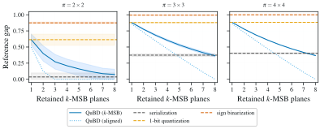

*Figure 8: Relative gap ($\pm 1$ std.) to the finite CTM-support reference over $100$ trials (fixed symbol relabelings). The aligned QuBD control decreases as more MSB bit-planes are retained, validating the residual refinement predicted by Thm 3.2. Under symbol relabeling, QuBD remains closer to the reference than serialization, one-bit quantization, and sign binarization.* **[p. 20]**

## Appendix D Saturation in Finite-state Machines

### D.1 Additional Saturation Details

As discussed in Sec. 3, lossless representations can still expose objects differently. Besides low residual loss, a representation should expose substructures that remain informative under the finite support of the CTM table, i.e., the set of structures available to the estimator.

**[p. 20]**

Fix a block size $\pi$ and a finite CTM table with supported states $S_{\pi}$. Let $f(u)$ denote the empirical frequency of a block $u\in S_{\pi}$, similar to Eq. (19). We write $z_{q,r}=\phi(\mathbf{W}^{(q)})$ to denote the exposure of $\mathbf{W}$ with $q$-bit quantization and representation $r$. Partition $z_{q,r}$ into blocks by $\Pi_{\pi}(z_{q,r})=(\mathrm{w}_{1},\ldots,\mathrm{w}_{m})$, where $m=|z_{q,r}|/\pi$. For each supported block $u\in S_{\pi}$, define

$$
c_{\pi}(u;z_{q,r}) :=|\{i\leq m:\mathrm{w}_{i}=u\}|, \\
A_{\pi}(z_{q,r}) :=\{u\in S_{\pi}:c_{\pi}(u;z_{q,r})>0\}, \\
a_{\pi}(z_{q,r}) :=|A_{\pi}(z_{q,r})|. \tag{54}
$$

Here $c_{\pi}(u;z_{q,r})$ counts how often $u$ is exposed under $z_{q,r}$, while $a_{\pi}(z_{q,r})$ is the number of supported blocks that appear. The KCS estimate of Eq. (2) can then be expressed as

$$
\mathcal{C}_{\mathrm{BDM}}(z_{q,r})=\underbrace{\sum_{u\in A_{\pi}(z_{q,r})}-\log_{2}f(u)}_{\text{new blocks}}+\underbrace{\sum_{u\in A_{\pi}(z_{q,r})}\log_{2}c_{\pi}(u;z_{q,r})}_{\text{multiplicity}}. \tag{55}
$$

Importantly, after most supported blocks have appeared, the first term changes little, and the estimate grows mainly through multiplicities. In this case, we consider CTM tables in the finite setting saturated.

To compare exposures, let $S_{\pi,r}^{(q)}\subseteq S_{\pi}$ be the blocks that can be exposed by $z_{q,r}$, and let $H_{\pi,r}^{(q)}:=|S_{\pi,r}^{(q)}|$. A CTM table may support many structures, but a given exposure may only reach some of them. Let $\rho_{\pi,r}(u)$ denote the probability that one exposed block of $z_{q,r}$ equals $u$. Then, for $m$ exposed blocks, we have

$$
\mathbb{E}[a_{\pi}(z_{q,r})]=\sum_{u\in S_{\pi,r}^{(q)}}\left[1-(1-\rho_{\pi,r}(u))^{m}\right],\quad\sigma_{\pi,r}(m):=\frac{\mathbb{E}[a_{\pi}(z_{q,r})]}{H_{\pi,r}^{(q)}}. \tag{56}
$$

Here $\sigma_{\pi,r}(m)$ is the fraction of reachable support expected to appear after $m$ exposed blocks. We call the estimator $(1-\epsilon)$-saturated when $\sigma_{\pi,r}(m)\geq 1-\epsilon$.

### D.2 Proof of Proposition 3.3 (Finite-table Saturation)

Fix $q$, $r$, $\pi$, and $S_{\pi,r}^{(q)}$. We omit the fixed $q$ for readability and write $S_{\pi,r}$ with $H_{\pi,r}:=|S_{\pi,r}|$. Let $\Pi_{\pi}(z_{q,r})=(\mathrm{w}_{1},\ldots,\mathrm{w}_{m})$ be the exposed blocks of size $\pi$.

For each $u\in S_{\pi,r}$, define $I_{u}:=\mathbf{1}\{c_{\pi}(u;z_{q,r})>0\}$. Then $a_{\pi}(z_{q,r})=\sum_{u\in S_{\pi,r}}I_{u}$, and by linearity

$$
\mathbb{E}[a_{\pi}(z_{q,r})]=\mathbb{E}\left[\sum_{u\in S_{\pi,r}}I_{u}\right]=\sum_{u\in S_{\pi,r}}\mathbb{E}[I_{u}]=\sum_{u\in S_{\pi,r}}\mathbb{P}(c_{\pi}(u;z_{q,r})>0). \tag{57}
$$

**[p. 21]**

Let $\rho_{\pi,r}(u)$ be the probability that one exposed block equals $u$. Since the exposed blocks are sampled independently, the probability that none of the $m$ exposed blocks equals $u$ is $(1-\rho_{\pi,r}(u))^{m}$. Hence

$$
\mathbb{E}[a_{\pi}(z_{q,r})]=\sum_{u\in S_{\pi,r}}\left[1-(1-\rho_{\pi,r}(u))^{m}\right]. \tag{58}
$$

In the uniform setting, which serves as a worst-case upper bound on the number of blocks required for saturation, we assume

$\rho_{\pi,r}(u)=1/H_{\pi,r}$ for all $u\in S_{\pi,r}$, and therefore

$$
\mathbb{E}[a_{\pi}(z_{q,r})] =\sum_{u\in S_{\pi,r}}\left[1-\left(1-\frac{1}{H_{\pi,r}}\right)^{m}\right] \\
=H_{\pi,r}\left[1-\left(1-\frac{1}{H_{\pi,r}}\right)^{m}\right]\approx H_{\pi,r}\left(1-e^{-m/H_{\pi,r}}\right), \tag{59}
$$

where the last step uses $(1-x)^{m}\approx e^{-mx}$ for small $x$. By definition, $\sigma_{\pi,r}(m)=\frac{\mathbb{E}[a_{\pi}(z_{q,r})]}{H_{\pi,r}}$, so

$$
\sigma_{\pi,r}(m) =\frac{H_{\pi,r}\left[1-\left(1-\frac{1}{H_{\pi,r}}\right)^{m}\right]}{H_{\pi,r}} \\
=1-\left(1-\frac{1}{H_{\pi,r}}\right)^{m}\approx 1-e^{-m/H_{\pi,r}}. \tag{60}
$$

Thus, saturation is controlled by $m/H_{\pi,r}$. We now write $a_{\pi}(m)$, but now for the size when the exposure contains $m$ blocks. Then the expected number of new supported blocks added by one more exposed block is

$$
\mathbb{E}[a_{\pi}(m+1)]-\mathbb{E}[a_{\pi}(m)] =H_{\pi,r}\left[\left(1-\frac{1}{H_{\pi,r}}\right)^{m}-\left(1-\frac{1}{H_{\pi,r}}\right)^{m+1}\right] \\
=\left(1-\frac{1}{H_{\pi,r}}\right)^{m}\approx e^{-m/H_{\pi,r}}. \tag{61}
$$

Thus, after $m$ blocks pass the saturation threshold, additional exposed blocks mostly repeat blocks already present in the finite table, and the estimate grows through multiplicity.

Finally, $(1-\epsilon)$-saturation means $\sigma_{\pi,r}(m)\geq 1-\epsilon$, so

$$
\sigma_{\pi,r}(m)\geq 1-\epsilon \Longleftrightarrow 1-\left(1-\frac{1}{H_{\pi,r}}\right)^{m}\geq 1-\epsilon \\
\Longleftrightarrow\left(1-\frac{1}{H_{\pi,r}}\right)^{m}\leq\epsilon \\
\Longleftrightarrow m\log\!\left(1-\frac{1}{H_{\pi,r}}\right)\leq\log\epsilon \\
\Longleftrightarrow m\geq\frac{\log\epsilon}{\log(1-1/H_{\pi,r})}\approx H_{\pi,r}\log\frac{1}{\epsilon}, \tag{62}
$$

where the inequality flips in the last exact step since $\log(1-1/H_{\pi,r})<0$, and the approximation uses $\log(1-x)\approx-x$.

After saturation, the finite table mostly contributes through repeated counts. For uniform exposure, the expected count of each supported block is $m/H_{\pi,r}$, and for large $m$ these counts concentrate around this value. And when $a_{\pi}(z_{q,r})\approx H_{\pi,r}$,

$$
\sum_{u\in A_{\pi}(z_{q,r})}\log_{2}c_{\pi}(u;z_{q,r})\approx\sum_{u\in S_{\pi,r}}\log_{2}\!\left(\frac{m}{H_{\pi,r}}\right)=H_{\pi,r}\log_{2}\!\left(\frac{m}{H_{\pi,r}}\right). \tag{63}
$$

Thus, after saturation, further growth in the estimate comes mainly from multiplicity terms rather than newly observed blocks. $\square$

**[p. 22]**

### D.3 Saturation Across Exposures

We compare binarization, serialization, and bit-plane decomposed exposures by counting how many binary blocks, each representation exposes in the CTM table. Let $d$ be the number of quantized symbols in $\mathbf{W}^{(q)}\in\Sigma_{q}^{d}$, and let $\pi$ be the binary block size. Since the available CTM tables are two-symbol tables, every exposure is evaluated through binary blocks in $S_{\pi}\subseteq\{0,1\}^{\pi}$. The relevant quantity is the number of exposed blocks $m_{r}$ relative to the reachable support $H_{\pi,r}^{(q)}$, and not only $d$, the number of $q$-ary symbols alone.

For the three exposures, the number of blocks is

$$
m_{\mathrm{bin}}=\frac{d}{\pi},\qquad m_{\mathrm{ser}}=\frac{qd}{\pi},\qquad m_{\mathrm{plane},j}=\frac{d}{\pi},\quad j=1,\ldots,k, \tag{64}
$$

where $m_{\mathrm{plane},j}$ is counted per retained bit-plane. If $k$ bit-planes are retained, the estimator considers $k$ binary objects separately and independently, and the aggregate reachable support is

$$
H_{\pi,\mathrm{bit}}^{(k)}=\sum_{j=1}^{k}H_{\pi,\mathrm{bit},j}=kH_{\pi,\mathrm{bit}}. \tag{65}
$$

By Prop. 3.3, the object sizes needed before $(1-\epsilon)$-saturation are

$$
d_{\mathrm{bin}} \gtrsim\pi H_{\pi,\mathrm{bin}}\log\frac{1}{\epsilon},\qquad d_{\mathrm{ser}}\gtrsim\frac{\pi H_{\pi,\mathrm{ser}}^{(q)}}{q}\log\frac{1}{\epsilon}, \\
d_{\mathrm{plane},j} \gtrsim\pi H_{\pi,\mathrm{plane},j}\log\frac{1}{\epsilon},~~~\text{and}~~~d_{\mathrm{plane}}^{(k)}\gtrsim k\pi H_{\pi,\mathrm{plane}}^{(k)}\log\frac{1}{\epsilon}. \tag{66}
$$

Binarization exposes only $d/\pi$ blocks, but estimates a one-bit target. Serialization preserves the $q$-bit target, but exposes $qd/\pi$ blocks to one finite table and therefore saturates earlier. bit-plane exposure preserves the $q$-bit target and scores the planes separately. We note that increasing $k$ reduces residual loss and increases the aggregate support available to the estimator, while each plane is still exposed at the slower rate per bit-plane.

For a concrete example, take $q=8$ and $\pi=16$, corresponding to binary $4\times 4$ blocks. The CTM support is of size $|H|=2^{16}$. With $\epsilon=0.1$, we have

$$
H\log\frac{1}{\epsilon}=2^{16}\log\frac{1}{0.1}\approx 1.51\times 10^{5}. \tag{67}
$$

The corresponding object scales are

$$
d_{\mathrm{ser}} \gtrsim\frac{\pi H}{q}\log\frac{1}{\epsilon}=\frac{16}{8}\cdot 1.51\times 10^{5}\approx 3.0\times 10^{5}, \\
d_{\mathrm{bin}} \gtrsim\pi H\log\frac{1}{\epsilon}=16\cdot 1.51\times 10^{5}\approx 2.4\times 10^{6}, \\
d_{\mathrm{plane}} \gtrsim\pi H\log\frac{1}{\epsilon}=16\cdot 1.51\times 10^{5}\approx 2.4\times 10^{6}. \tag{68}
$$

Serialization reaches the same saturation about $q=8$ times earlier than one bit-plane. Binarization has the same saturation scale as a single bit-plane in this example, but it estimates a different one-bit target and discards the lower-bit residuals. We include it merely for completeness. bit-plane exposure keeps the $q$-bit target while delaying saturation in the number of bit-planes.

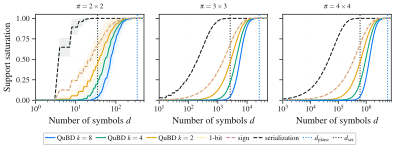

*Figure 9: Empirical saturation rates as the number of symbols $d$ exposed to the CTM table increases across block sizes $\pi\in\{2\times 2,3\times 3,4\times 4\}$. Each curves show the fraction of available support observed for each representation. Vertical lines denote the theoretical saturation rates derived for bit-plane decomposition in QuBD ($d_{\mathrm{plane}}$) and serialized ($d_{\mathrm{ser}}$) representations. Symbols are sampled uniformly at random from the support of the CTM-table for up to $10^{6}$ draws. Results are averaged over 100 trials.* **[p. 23]**

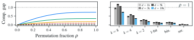

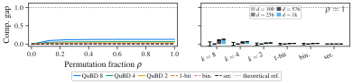

*Figure 10: Complexity gap with **(top)** $\pi=(3\times 3)$ and **(bottom)** $\pi=(2\times 2)$, between estimations of an ordered $8$-ary object and its permutation, where $\rho$ is the fraction of symbols $d$ permuted. The gap is shown **(left)** for an object with $d=1M$ symbols as $\rho$ increases, and **(right)** across object sizes for different methods when $\rho=1$. QuBD keeps a larger and more stable estimation gap than serialization, one-bit, and sign-binarization. Complexity values are normalized by the theoretical reference for its type class [11]. Each object is sampled uniformly at random, and results are averaged over 100 trials.* **[p. 23]**

## Appendix E Additional Experimental Details

### E.1 Experimental Set-Up

The accuracy-versus-complexity, learning curve, and grokking experiments were performed on a desktop workstation with an Intel i7 processor, 64 GB memory, and an Nvidia RTX 5090 GPU with 32GB memory. The QuBD complexity across bit-planes, per-layer, and PTQ experiments were conducted on an Apple Silicon Mac, with the latter using the MPS backend. All code was implemented in Pytorch [36]. Specific choices for individual experiments are presented next.

**[p. 24]**

### E.2 Complexity Across Models and Bit-Planes Experiment

The results reported in Fig. 1 and Fig. 11 are based on 100 pretrained models sourced from the timm library [53]. For each model, QuBD complexity was measured at 8-bit depth and normalized against a randomly initialized counterpart, following the weight tensor preprocessing described in Appx. B.3. This experiment requires no dataset evaluation and took approximately 10 minutes to complete.

### E.3 Accuracy-versus-Complexity Experiment

The results reported in Fig. 4 are based on MLPs trained on FashionMNIST [56]. Four-layered MLPs of varying capacities were configured by doubling the number of hidden units. The base model had $[1024,512,256]$ hidden units; the three other versions were obtained by scaling the hidden units by the factor $s=[0.5,2.0,4.0]$, resulting in the four MLPs reported. All the models were trained for 100 epochs using 40k training samples, tested on 10k test samples using Adam optimizer [23] using a learning rate of $3\times 10^{-4}$ and weight decay of $0.01$ with batch size $128$. All experiments were repeated over three random seeds, and we report the mean and standard deviation of all the metrics. Each experimental run to generate the data in Fig. 4 took about 4.5 hours on the hardware described, and through the project lifetime these experiments were conducted no less than 10 times implying an overall compute budget of about 50 hours.

### E.4 Learning Curve and Grokking Experiment

Learning curves reported in Fig. 5 follow a similar setup as reported above. Tiny ViT [55] on CIFAR-10 [26] was trained for 300 epochs. Each Tiny-Vit experiment took about 6 hours, and these experiments were repeated about five times.

For the Grokking experiment in [38], we use a 2-layered MLP with $[512,256]$ hidden units to model the modular addition task $z=(x+y)\pmod{P}$ with $P=97$. The dataset, consisting of the full $P^{2}$ Cartesian product, was partitioned into a 50% training split and a 50% validation split. The model was trained for 11k epochs and metrics, including QuBD complexity, were logged during training/validation. The grokking experiments took about 5 minutes on the reported hardware.

### E.5 Complexity per Layer Experiment

The results reported in Fig. 6 and Fig. 12 are based on pretrained ResNet-18 and ResNet-50 models sourced from the timm library [53]. For each layer with a weight tensor of at least two dimensions, QuBD complexity was measured at 8-bit depth and normalized against the complexity of a randomly initialized counterpart, following the weight tensor preprocessing described in Appx. B.3. The normalized complexity ratio is reported for the two most significant bit-planes (P7, P6). The experiment requires no dataset evaluation and took about 5 minutes to complete.

### E.6 Post Training Quantization Experiment

The results reported in Fig. 7 are based on five pretrained models sourced from the timm library [53]: ResNet-18, ResNet-50, ViT-B/16, EfficientNet-B0, and MobileNetV3-Large, all trained on ImageNet [14]. QuBD complexity was computed across 16 bit-planes for each model in full precision (FP32), following the weight tensor preprocessing described in Appx. B.3. Post-training quantization (PTQ) was applied using uniform weight quantization at bit-widths ranging from 1 to 8 bits, without any fine-tuning or calibration data. All quantized models were evaluated on the full ImageNet validation set consisting of 50,000 samples, using a batch size of 256. FP32 baseline was evaluated on the same validation set. The total compute time for this experiment was approximately 5 hours.

**[p. 25]**

## Appendix F Additional Results

### F.1 QuBD Complexity Ratio Across All Bit-Planes

Fig. 11 shows the normalized QuBD complexity across all eight bit-planes for 100 pretrained models from the timm library [53].

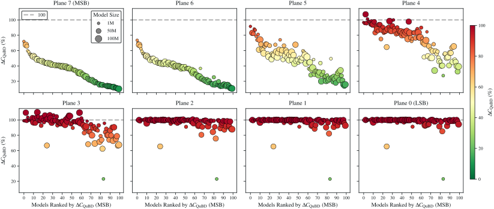

*Figure 11: QuBD complexity ratio (pretrained / random) for 100 pretrained models from the timm library, shown across all bit-planes of an 8-bit quantization. Models are ranked left to right by descending complexity ratio on the most significant bit-plane (Plane 7, MSB). Each dot represents one model proportional to the number of parameters, and the color indicates the complexity ratio. Plane 7 shows the largest complexity reduction across all models, while lower bit-planes show progressively smaller reductions, approaching the random baseline.* **[p. 25]**

### F.2 QuBD Complexity Ratio for ResNet-50

Fig. 12 shows the normalized QuBD complexity per layer for ResNet-50 for the two MSB-planes (P7, P6). It shows significant differences in reduction across different layers spanning close to $\Delta\mathcal{C}_{\text{QuBD}}=0$% and up to $\Delta\mathcal{C}_{\text{QuBD}}=100$%. Experimental details can be found in Appx. E.2.

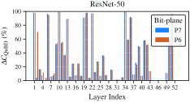

*Figure 12: QuBD complexity ratio $\Delta\mathcal{C}_{\text{QuBD}}$ per layer for ResNet-50 for the two most significant bit-planes (P7, P6).* **[p. 25]**
