# Universal Quantum Transformer for Exact Reasoning in Arithmetic, Algebra, and Linguistics

Sungyong Chung(1,2), Alireza Talebpour(1,2). (1) Grainger College of Engineering, Department of Civil and Environmental Engineering, University of Illinois Urbana-Champaign. (2) Quantaeon Inc. Corresponding author: ataleb@illinois.edu

## Abstract

Classical continuous-space neural networks fundamentally struggle to lock into exact formal rules, whether mathematical, such as modular arithmetic and non-Abelian group algebra, or linguistic, such as systematic compositional generalization. To approximate these discrete logical rules, they often rely on massive parameter scaling, resulting in stochastic instability even after delayed generalization phenomena known as grokking. Here, we introduce the Universal Quantum Transformer (UQT), a novel, quantum-native computing architecture that uses the physical properties of multi-qubit systems as a universal inductive bias for exact algebraic and compositional reasoning. Rather than translating classical neural mechanisms, our framework relies entirely on parameterized geometric phase embedding and $SU(2)$ wave-interference. We demonstrate that an identical quantum attention circuit, operating on a highly compact 5 or 6 qubit substrate with only 551 to 1,650 trainable parameters, exactly learns three highly distinct formal classes: cyclic modular arithmetic ($\mathbb{Z}_{11}$), non-Abelian algebra (the $S_4$ permutation group), and systematic linguistic compositionality (the SCAN language). While standard classical models, including multi-layer perceptrons (MLPs) and Transformers, exhibit stochastic instability at convergence, the UQT achieves mathematically exact, deterministic generalization. We define this stricter regime as crystallization: a step beyond the well-known phenomenon of grokking. Finally, we deploy the UQT on noisy intermediate-scale quantum (NISQ) hardware, achieving 97.5% accuracy on IBM Quantum computers. These results demonstrate that the UQT provides a structurally suited inductive bias for exact formal reasoning that standard classical continuous-space architectures do not natively provide.

While attention-based models have achieved remarkable results in natural language processing, their capacity for reasoning across cyclic arithmetic, non-Abelian group algebra, and systematic compositionality remains brittle, with models often failing to generalize on structurally identical problems outside their training distribution [1, 2, 3]. Standard architectures operating in unconstrained continuous Euclidean space ($\mathbb{R}^n$) carry inductive biases misaligned with periodic, non-commutative, and compositional structure, not because such representations are theoretically impossible, but because they are not designed to handle such problems. As recent studies on algorithmic grokking reveal, utilizing continuous Euclidean space causes networks to default to pure memorization, struggling to generalize to unseen operands without extensive, delayed optimization [4, 5]. More importantly, even when classical networks finally achieve this delayed generalization (i.e., grokking), they still merely approximate the discrete mathematics. Fundamentally, theoretical analyses show that the discrete, periodic structure of formal systems such as modular arithmetic is most naturally encoded through wave interference in phase space, a mechanism classical continuous-space models can only approximate through massive over-parameterization [6]. As we formally establish in the following sections, this approximation **[p. 2]** leaves classical Transformers vulnerable to persistent stochastic instability at convergence, i.e., even when they eventually grok these tasks, they still can oscillate indefinitely without reaching deterministic stability. This failure is not a matter of scale. As our baselines demonstrate, such oscillations can be observed at standard classical multi-layer perceptrons (MLPs) with ${\sim}$1,000 parameters as well as transformer structures with over 400,000 parameters. This suggests the deficiency is structural, not merely parametric.

The deficiency identified above is geometric in nature, as these formal systems possess intrinsic structural regularities that quantum systems natively embody, including the periodicity of cyclic arithmetic, the non-commutativity of group algebra, and the sequential compositionality of language. Specifically, quantum phase angles are $2\pi$-periodic, and $SU(2)$ operator composition is non-commutative, suggesting that a quantum system designed to exploit these structural properties could achieve exact formal reasoning where classical continuous-space models struggle. However, the quantum machine learning literature has broadly pursued two strategies [7, 8, 9]: translating classical architectures, such as neural networks, kernel methods, and attention mechanisms, into parameterized quantum circuits [10, 11, 12], or accelerating classical linear algebra through fault-tolerant quantum routines [13, 14]. Because these conventional strategies treat quantum rotations as universal function approximators rather than as geometric structures deliberately aligned with the symmetries of the target formal system, they do not leverage quantum phase periodicity or operator non-commutativity as task-specific structural inductive biases. While recent equivariant quantum machine learning approaches have successfully aligned circuit structures with the symmetries of physical systems, such as molecular Hamiltonians or geometric point clouds [15, 16], extending these structural advantages to abstract sequential reasoning over discrete mathematical and linguistic spaces remains unexplored.

The Universal Quantum Transformer (UQT) addresses this gap by mapping abstract symbols directly onto the unitary operations of a parameterized quantum system, leveraging these native quantum geometric properties as a universal physical inductive bias for exact mathematical and compositional reasoning. In this study, we establish that a single, unified topological modality, i.e., the quantum attention circuit, jointly embeds tokens into a shared superposition to natively resolve exact arithmetic, non-Abelian group algebra, and systematic linguistic compositionality.

## Universal Quantum Transformer

### From grokking to crystallization

To contextualize the physical advantage of the UQT, it is necessary to formally distinguish between the transient learning dynamics of algorithmic generalization and the structural stability of a model's converged representation. In the machine learning literature, the delayed discovery of generalizing solutions is broadly referred to as grokking [4, 5].

**Definition 1: Grokking.** *Let $t$ denote the optimization epoch, and let $\mathcal{A}_{\mathrm{train}}(t)$ and $\mathcal{A}_{\mathrm{test}}(t)$ denote the training and test accuracies at epoch $t$, respectively. Let $t_{\mathrm{mem}}$ be the epoch at which the model perfectly memorizes the training dataset, i.e., $\mathcal{A}_{\mathrm{train}}(t_{\mathrm{mem}})=100\%$. Grokking is the phenomenon in which $\mathcal{A}_{\mathrm{test}}(t)$ remains near random chance until a much later epoch $t_{\mathrm{grok}} \gg t_{\mathrm{mem}}$, after which it rapidly increases toward $100\%$.*

However, because prior work has often treated grokking as a single, monolithic transition in generalization, it does not distinguish between approximate statistical generalization and exact recovery of the underlying mathematical rule. Achieving grokking merely guarantees that a neural network has found a statistical decision boundary that adequately covers the unseen data. When classical continuous-space Transformers learn algorithmic tasks, their generalization often emerges only after an extended memorization phase, and the resulting solution may remain **[p. 3]** an approximate statistical representation rather than an exact symbolic or algebraic resolution. Consequently, even when classical models exhibit grokking on the training distribution, their generalization may remain statistically fragile, as reflected by persistent accuracy oscillations and nonzero test-accuracy variance, i.e., $\operatorname{Var}[\mathcal{A}_{\mathrm{test}}(t)] > 0$, as we show in the following sections. To capture the ultimate resolution of formal mathematical systems, we introduce the stricter concept of crystallization.

**Definition 2: Crystallization.** *A strict regime of generalization that requires, but supersedes, grokking. A network undergoes crystallization at epoch $t_c \ge t_{\mathrm{grok}}$ if $\mathcal{A}_{\mathrm{test}}(t_c) = 100\%$ and the model achieves deterministic stability, resulting in strictly zero variance for all subsequent epochs: $\operatorname{Var}[\mathcal{A}_{\mathrm{test}}(t)] = 0$ for all $t \ge t_c$.*

While highly restricted classical toy models can theoretically crystallize on simple commutative arithmetic via massive over-parameterization [6], standard classical models operating in unconstrained Euclidean space ($\mathbb{R}^n$) do not natively achieve this zero-variance state, as our empirical results demonstrate. Unlike the statistical approximation inherent to classical grokking, crystallization guarantees that the network has physically embodied the target logic.

### Quantum attention circuit

The UQT encodes input token sequences (discrete symbols) directly into a shared multi-qubit quantum state through sequential unitary composition, enabling the physical wave-interference of quantum mechanics to evaluate relational structure. While classical Transformer architectures [17] implement attention through explicit Query-Key-Value dot products to compute pairwise token relevance via learned projections, the UQT operates through a physically distinct mechanism. Specifically, in the quantum attention circuit (Figure 1a), a sequence of $S$ input tokens ($x_1, \dots, x_S$) is mapped through an embedding table to a set of physical rotation angles that parameterize unitary transformations on an $N_{emb}$-qubit subspace of the total $N$-qubit register. These parameterized unitaries are applied consecutively (from $U(\vec{\theta}_{x_1})$ to $U(\vec{\theta}_{x_S})$) entirely prior to any explicit logical mixing operations. Due to the intrinsic compositional structure of quantum mechanics, where unitary operators combine via matrix multiplication, this sequence does not merely stack independent transformations but produces a joint operation that encodes the interaction between operands implicitly in the geometry of the resulting quantum state. The multi-qubit wave function therefore acts as a native geometric calculator for operand composition, in which the relative phases introduced by each operand interfere constructively or destructively. The resulting superposed state thus contains a distributed encoding of operand interactions, which is subsequently processed by $L$ deeper mixing layers to decode and extract task-relevant features.

As shown in Figure 1b, a single mixing layer $U_{\mathrm{mix}}^{(l)}$ consists of parameterized single-qubit general $SU(2)$ Euler rotations ($U_{\mathrm{Rot}}^{(l)}$) applied to all $N$ qubits, followed by a global, cyclic conveyor-belt ring of CNOT gates. Because physical noisy intermediate-scale quantum (NISQ) hardware suffers severe decoherence when executing complex multi-qubit entangling operations, this hardware-efficient topology progressively generates global entanglement using only fundamental 2-qubit CNOT connections, providing a logical backbone capable of natively solving formal mathematical systems.

In this formulation, representation (phase-based embedding) is cleanly decoupled from reasoning (quantum interference followed by decoding), enabling a unified framework in which formal structure is evaluated through the native physics of the system. This structural inductive bias is realized through gradient optimization, which organically aligns the circuit geometry with the target formal rules.

Across our empirical evaluations, we instantiated the UQT on a highly compact $N=5$ or $N=6$ qubit registers, depending on the experimental domain. The total parameter capacity of the architecture is exceptionally compact, defined strictly by the sum of the token embedding **[p. 4]** rotations and the single-qubit $SU(2)$ rotation angles in the mixing layers. For a token space of size $V$ embedded onto a subspace of $N_{emb}$ qubits (utilizing 4 rotations per qubit), and $L$ total mixing layers across all $N$ qubits, the parameter count is exactly $(V \times N_{emb} \times 4) + (L \times N \times 3)$. Unlike classical continuous-space models that require hundreds of thousands of weights to approximate discrete logic [4, 6], the UQT isolates the exact formal rules using a footprint of only a few hundred to a few thousand parameters.

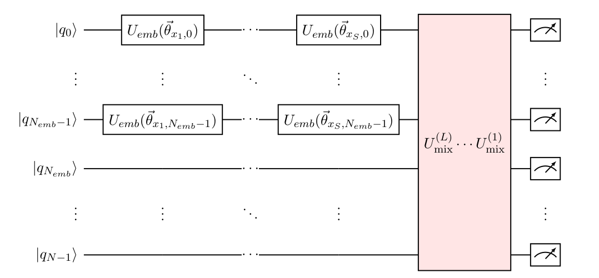

*(a) Quantum attention circuit*

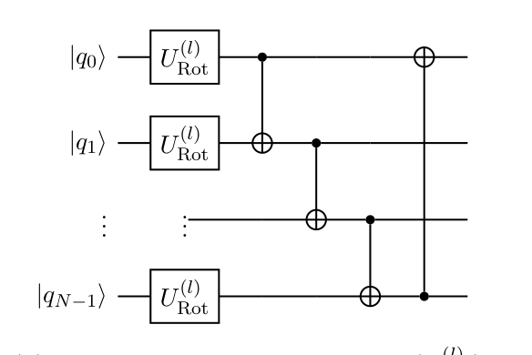

*(b) Single mixing layer architecture ($U_{\mathrm{mix}}^{(l)}$)*

*Figure 1: **Topology of the Universal Quantum Transformer (UQT).** The architecture strictly generalizes to arbitrary $N$-qubit registers and sequence lengths ($S$). **(a)** In the quantum attention circuit, $S$ sequential tokens ($x_1, \dots, x_S$) are embedded entirely prior to structural entanglement. The superposed phases are processed simultaneously by the $L$-layer mixing block. Measurements are performed on all $N$ qubits to generate the output. **(b)** A single layer $l$ of the shared mixing sequence, $U_{\mathrm{mix}}^{(l)}$, consisting of parameterized single-qubit general $SU(2)$ Euler gates ($U_{\mathrm{Rot}}^{(l)}$) and a global cyclic conveyor-belt ring of CNOT gates.* **[p. 4]**

## Results

### Crystallization in modular arithmetic

We tasked the quantum attention circuit with learning modular arithmetic given two input tokens, $x_1$ and $x_2$. To rigorously evaluate its geometric learning capabilities, we tested the architecture across three distinct algebraic regimes. First, we evaluated addition over the full prime Galois field $\mathbb{Z}_{11}$, where the network must predict $x_1 + x_2 \pmod{11}$ (Figures 2a and 2b). Second, we evaluated multiplication over the full field $\mathbb{Z}_{11}$ ($x_1 \times x_2 \pmod{11}$), which includes **[p. 5]** the zero element (Figures 2c and 2d). Finally, we evaluated multiplication restricted strictly to the bijective multiplicative group $\mathbb{Z}_{11}^* = \{1, 2, \dots, 10\}$, which excludes the zero element (Figures 2e and 2f). In our implementation, we mapped the token space across an $N_{emb}=4$ qubit subspace and utilized a mixing depth of $L=25$. Measuring the full 5-qubit register ($N=5$), this architecture requires only 551 trainable parameters.

Modular arithmetic represents a rigid test of machine learning, as the cyclic algebraic structure defies continuous linear approximation. Consequently, while classical models trained on such tasks often exhibit grokking [4], they struggle to crystallize. To contextualize the physical advantage of our architecture, we trained classical attention-based Transformers as a baseline.

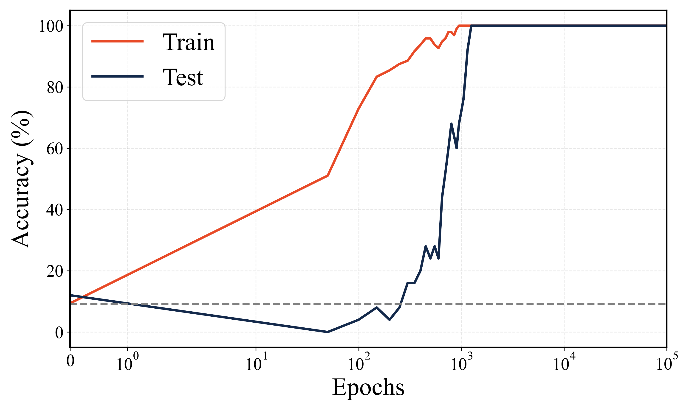

*(a) UQT: Mod 11 addition ($\mathbb{Z}_{11}$)*

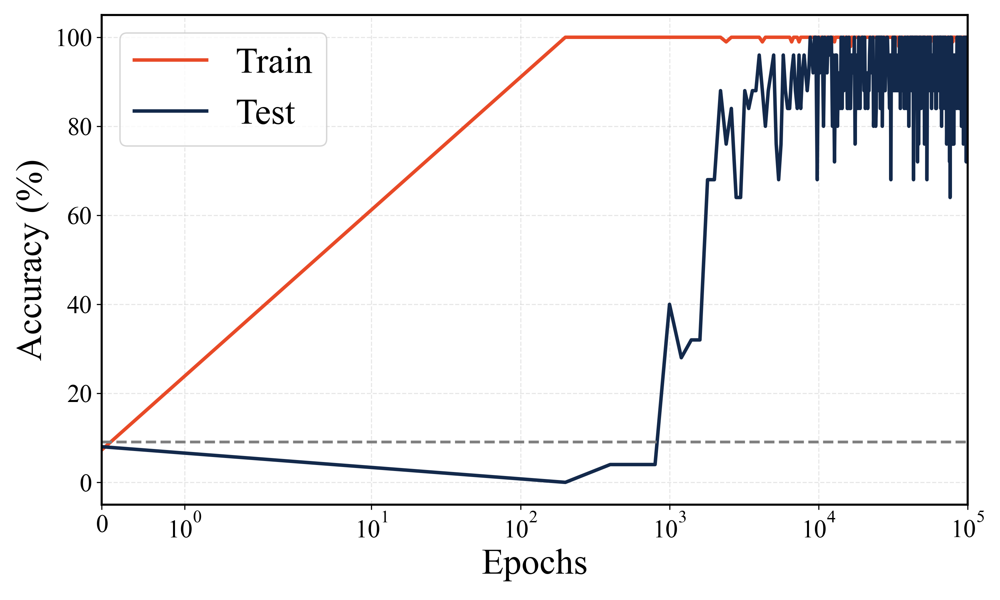

*(b) Transformer: Mod 11 addition ($\mathbb{Z}_{11}$)*

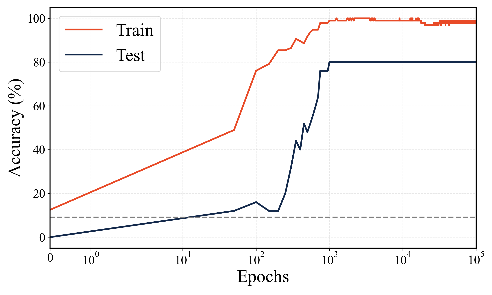

*(c) UQT: Mod 11 multiplication ($\mathbb{Z}_{11}$)*

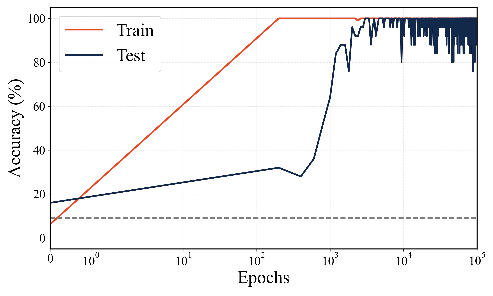

*(d) Transformer: Mod 11 multiplication ($\mathbb{Z}_{11}$)*

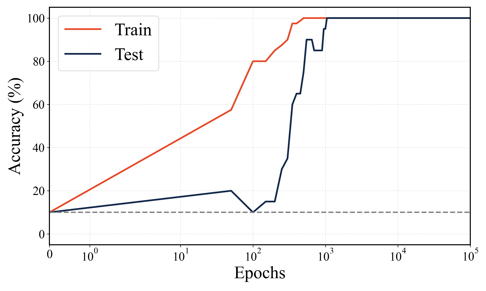

*(e) UQT: Mod 11 multiplication ($\mathbb{Z}_{11}^*$)*

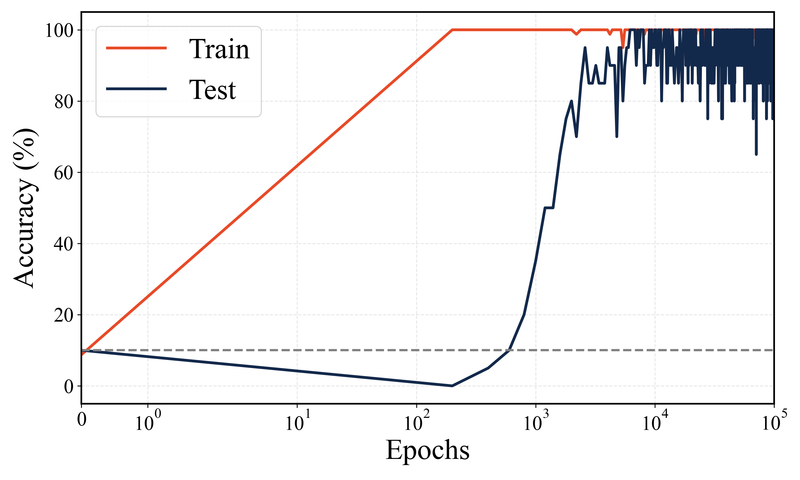

*(f) Transformer: Mod 11 multiplication ($\mathbb{Z}_{11}^*$)*

*Figure 2: **Quantum crystallization in modular arithmetic.** **(a, b)** Both architectures learn addition, but the classical Transformer exhibits severe stochastic instability at convergence. **(c)** The UQT physically fails to learn multiplication with zero, as the irreversible many-to-one mapping ($x_1 \times 0 = 0$) violates the unitary constraints of quantum mechanics ($U^\dagger U = I$). **(d)** The classical Transformer memorizes the zero-rule via pattern matching, artificially buffering its instability. **(e, f)** When restricted to the bijective $\mathbb{Z}_{11}^*$ multiplicative group (excluding the zero element), the UQT achieves exact, deterministic crystallization, whereas the classical network oscillates violently.* **[p. 6]**

As observed in Figures 2b, 2d, and 2f, the classical Transformer requires massive over-parameterization to brute-force the cyclic geometry into a high-dimensional Euclidean space. Although the classical models successfully grok the dataset, exhibiting a delayed transition in test accuracy long after reaching 100% training accuracy, they fail to maintain stable generalization. Instead, the test accuracy exhibits severe, erratic fluctuations. Furthermore, the classical network relies heavily on statistical pattern matching. For instance, it easily isolates and memorizes the simple zero-rule ($x_1 \times 0 = 0 \pmod{11}$) during early epochs of training. This classical shortcut artificially raises the lower bound of the test accuracy, buffering the lowest dips of the oscillations to remain above 80% (Figure 2d). Once the zero element is excluded, the test accuracy oscillates violently between 70% and 100% (Figure 2f).

In stark contrast to the classical model, the UQT is fundamentally incapable of taking the zero-rule shortcut. As demonstrated in Figure 2c, when the UQT attempts to learn the complete $\mathbb{Z}_{11}$ multiplication field (including the $0$ element), the network fails to reach 100% accuracy. This failure is a direct consequence of pure quantum mechanics. Multiplication by zero is a many-to-one mapping that inherently destroys information, rendering the operation fundamentally irreversible. Because quantum evolution is strictly governed by unitary operators ($U^\dagger U = I$), the network cannot natively execute an irreversible mapping without collapsing its own topological geometry. Addition, however, remains perfectly bijective even with zero ($x_1 + 0 = x_1$), allowing the UQT to crystallize (Figure 2a).

When evaluated on the restricted $\mathbb{Z}_{11}^*$ multiplicative group (Figure 2e), the zero element is eliminated. Within this regime, every multiplication operation becomes a perfect bijection, a reversible cyclic permutation of the set. Restored to a purely unitary framework, the UQT exactly generalizes on the dataset, crystallizing into a deterministic 100% accuracy without the stochastic instability characteristic of classical networks.

### Crystallization in non-Abelian algebra

While addition and multiplication are commutative, spatial and physical transformations are inherently non-commutative. To test this regime, we evaluated the architecture on the symmetric permutation group $S_4$. This abstract group consists of 24 distinct elements, meaning the network must learn its entire Cayley table. Here, a Cayley table is a strict algebraic multiplication table, defining the exact outcomes of all $24 \times 24 = 576$ possible paired combinations. Because $S_4$ is non-Abelian (i.e., applying permutation $A$ followed by $B$ yields a fundamentally different state than $B$ followed by $A$), classical networks operating in flat, commutative Euclidean space frequently struggle to learn these operations efficiently [5]. To approximate these discrete, non-commutative rules, classical models must rely on massive over-parameterization. Consequently, even when these networks eventually grok the dataset, they fail to crystallize, resulting in the severe stochastic instability observed at convergence (Figure 3b).

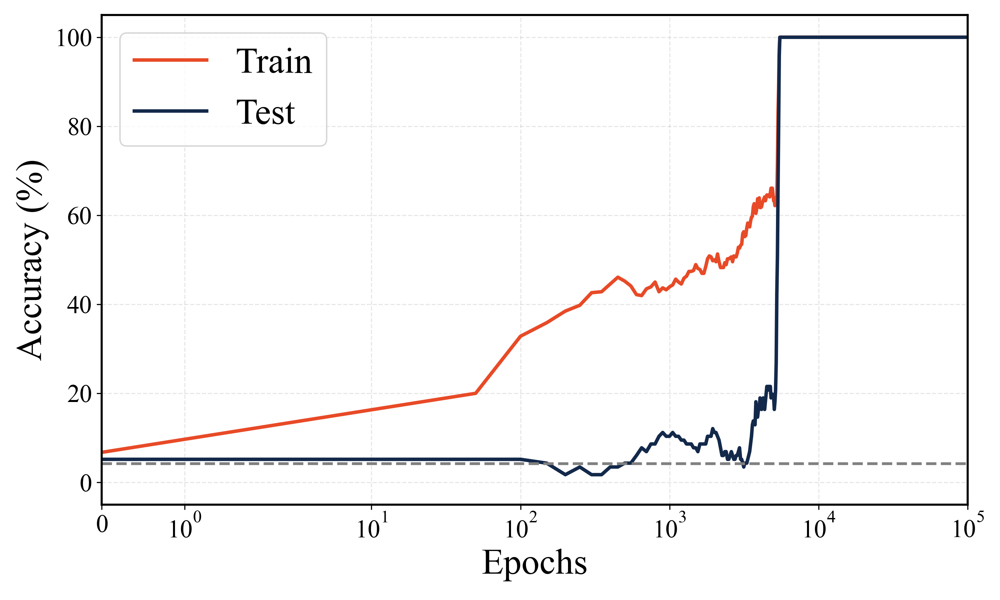

*(a) UQT: $S_4$ permutations*

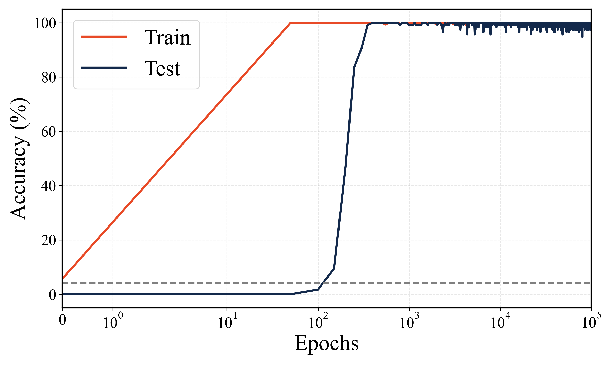

*(b) Transformer: $S_4$ permutations*

*Figure 3: **Quantum crystallization in non-Abelian algebra.** The non-commutative geometry of $SU(2)$ allows the quantum model to cleanly lock into the $S_4$ group laws. In contrast, the classical Transformer struggles to maintain stable generalization due to its continuous Euclidean geometry.* **[p. 7]**

The quantum architecture, however, provides a native algebraic solution. The UQT embeds tokens using $SU(2)$ rotation matrices, the fundamental mathematical group that governs quantum spin and 3D spatial rotations. Because $SU(2)$ operations are intrinsically non-commutative, the physical wave-interference of the sequential quantum gates directly mirrors the geometric rules of the target algebra. By mapping the 24 abstract permutations directly into this **[p. 6]** continuous, non-commutative phase space, the UQT successfully crystallized across all 576 equations without statistical drift (Figure 3a). Note that to accommodate the higher representational density of the 24 permutations ($V=24$), we expanded the embeddings to the full register ($N_{emb}=5$) and reduced the mixing depth to $L=14$. Measuring the full 5-qubit register ($N=5$), this model requires a total of 690 parameters.

**[p. 7]**

### Crystallization in linguistics

The aforementioned results establish that the UQT crystallizes across both commutative ($\mathbb{Z}_{11}$ addition and $\mathbb{Z}_{11}^{*}$ multiplication) and non-commutative ($S_4$) algebraic domains. To determine whether this advantage extends beyond periodic group operations to general rule learning, we turn to systematic linguistic compositionality. Unlike strict group operations, compositionality requires a model to independently isolate abstract conceptual dimensions (such as action and direction) and recombine them in configurations never encountered during training. This zero-shot generalization regime is precisely where standard classical continuous-space models notoriously fail [3].

We evaluated this capacity using the “add jump” zero-shot split of the SCAN language [3]. To strictly isolate the network's capacity for conceptual compositionality from the confounding dynamics of variable-length sequence generation, we distilled the core logic of this benchmark into a controlled, fixed-length dual-classification task. In our implementation, we mapped the $V=50$ vocabulary across the full $N_{emb}=N=6$ qubit register and utilized a mixing depth of $L=25$. Measuring the full 6-qubit register ($N=6$), this architecture requires only 1,650 trainable parameters.

To systematically test this, we constructed a vocabulary consisting of 10 optional prefix words (e.g., “please,” “quickly”), 4 verb concepts (walk, run, jump, look) each containing 6 synonymous tokens, and 4 directional concepts (forward/none, left, right, around) each containing 4 synonymous tokens. Input sequences were strictly formulated as up to three tokens (*Prefix, Verb, Direction*) padded to a fixed length of $S=3$. The objective is a dual-head classification task: the network must simultaneously predict the exact underlying verb concept (4 classes) and the directional concept (4 classes). To test true zero-shot composition, we partitioned the dataset such that the test set exclusively contains commands combining a “jump” concept with a directional modifier (e.g., “jump left,” “spring backwards”). The training set contains all remaining combinations. Consequently, during training, the network sees the “jump” concept in isolation or with prefixes (e.g., “quickly jump”), and it observes all directional modifiers applied to other verbs (e.g., “walk left,” “look around”). However, it never observes “jump” combined with any direction (e.g., “jump right”).

Standard classical attention-based models struggle with this systematic compositionality on the SCAN benchmark, particularly under the held-out jump split [3]. Because classical continuous-space models rely heavily on interpolating within dense Euclidean spaces, they easily memorize the training distribution but fail to cleanly separate the independent algebraic concepts of action and direction. As a result, when forced to evaluate the zero-shot **[p. 8]** combinations, classical networks exhibit extreme stochastic instability, violently oscillating between 0% and 100% accuracy at convergence without ever crystallizing into a stable algebraic linguistic rule (Figure 4b).

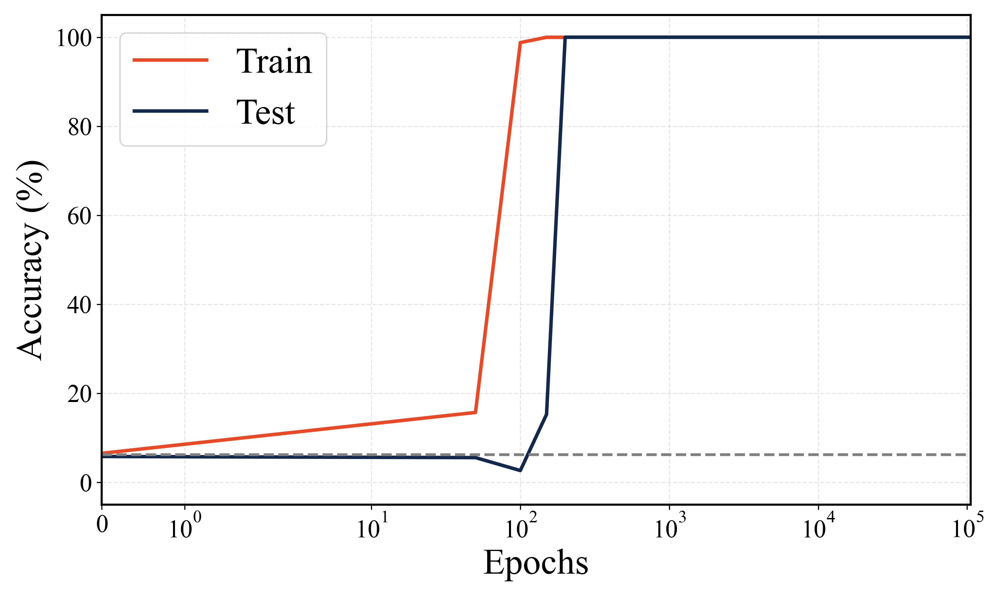

*(a) UQT: SCAN “add jump” split*

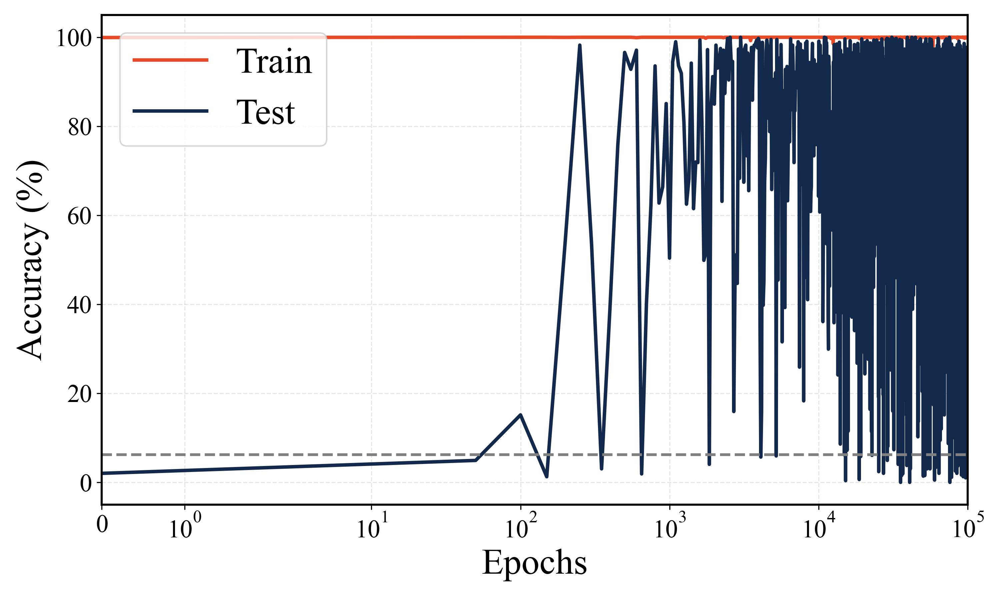

*(b) Transformer: SCAN “add jump” split*

*Figure 4: **Quantum crystallization in linguistic compositionality.** Zero-shot evaluation on the SCAN “add jump” split. **(a)** The UQT perfectly isolates and recombines orthogonal linguistic concepts (actions and directions), using physical wave-interference to stably generalize to unseen commands. **(b)** The classical Transformer, relying on continuous-space statistical pattern matching, fails to systematically compose the concepts, exhibiting severe stochastic instability and erratic hallucinations on the unseen test set despite achieving 100% training accuracy.* **[p. 8]**

In contrast, the UQT crystallized into exact, deterministic generalization. In our implementation, chronological linguistic tokens (prefixes, verbs, modifiers) are mapped directly to phase rotations, generating a superposed multi-qubit wave function. The architecture measures the resulting 64-state Hilbert space via two distinct conceptual heads: one identifying the verb construct (states 0–3) and the other identifying the modifier construct (states 4–7). Because the quantum circuit strictly obeys non-destructive, unitary $SU(2)$ boundaries, the geometric representations of action and direction do not destructively interfere or collapse into a statistical blend. Instead, they physically superimpose, allowing the network to organically decouple the action from the modifier. Leveraging this native physical compositionality, the quantum attention circuit zero-shot crystallizes, achieving stable 100% exact-match accuracy across the unseen compositional combinations (Figure 4a).

### Classical neural network baseline

A natural alternative explanation for the classical Transformer's inability to crystallize is its large parameter count (${\sim}$400,000 weights). One might hypothesize that such massive over-parameterization forces the model into statistical interpolation regimes rather than exact rule discovery, and that a smaller classical architecture might succeed where the Transformer fails. To directly test this hypothesis, we trained a compact standard classical MLP on all four experimental tasks where the UQT crystallizes.

The MLP architecture consists of a token embedding table followed by a single hidden layer with ReLU activation and a linear output projection. Embedding and hidden dimensions were chosen so that each task variant yields approximately 1,000 trainable parameters, comparable to the UQT parameter footprint across the four tasks (551–1,650).

As shown in Figure 5, the compact MLP fails to crystallize across all four tasks. In no case does test accuracy reach 100%. This result directly falsifies the parameter-count hypothesis, i.e., the inability of standard classical architectures to crystallize is not a consequence of over-parameterization, but of a fundamental structural mismatch between continuous Euclidean **[p. 9]** geometry and the discrete algebraic and compositional rules governing these tasks. The UQT's crystallization arises not from having fewer parameters, but from operating within the periodic, non-commutative phase space of a multi-qubit Hilbert system.

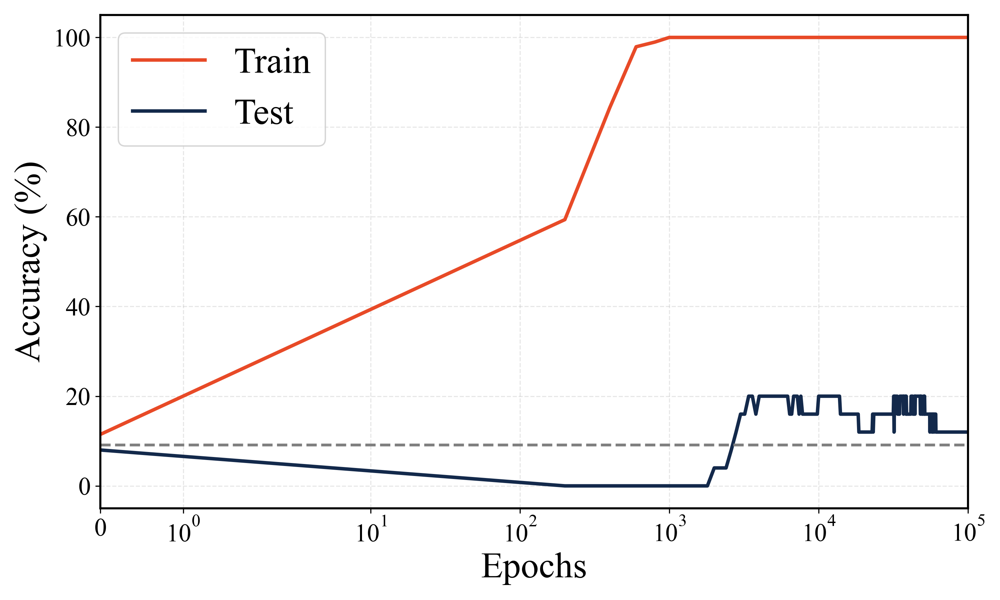

*(a) MLP: Mod 11 addition ($\mathbb{Z}_{11}$)*

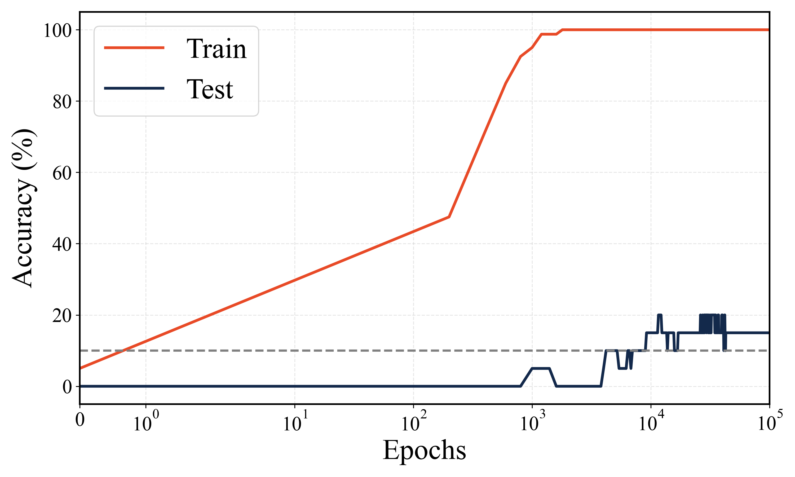

*(b) MLP: Mod 11 multiplication ($\mathbb{Z}_{11}^*$)*

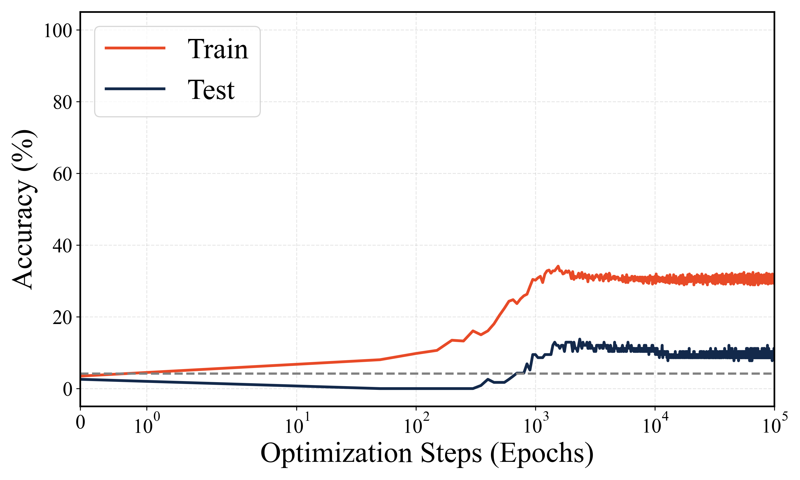

*(c) MLP: $S_4$ non-Abelian permutations*

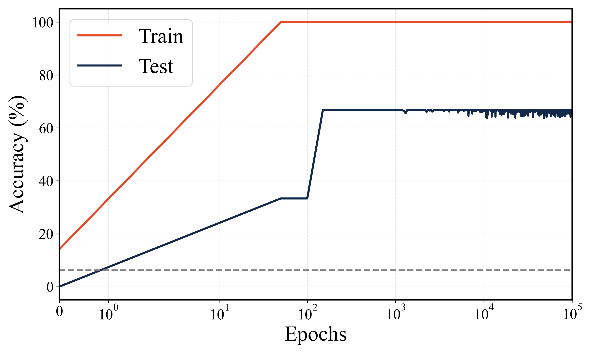

*(d) MLP: SCAN “add jump” split*

*Figure 5: **Classical MLP baseline: failure to crystallize across all four tasks.** A compact ${\sim}$1,000-parameter classical MLP trained with identical settings to the Transformer baseline. Across all four experimental domains where the UQT crystallizes, the standard MLP fails to reach 100% test accuracy in any case, with no crystallization transition. Unlike the classical Transformer, which at least achieves delayed generalization via grokking, the MLP fails to grok.* **[p. 9]**

### Physical deployment on NISQ hardware

To empirically validate that the generalization capabilities of the UQT are not merely artifacts of noiseless classical simulation, we deployed the architecture onto physical superconducting quantum processors. In classical deep learning, gradients are computed via backpropagation. Physical quantum processors, however, lack an analytic computational graph, meaning exact analytic gradients must be evaluated empirically using the Parameter-Shift Rule [18, 19]. While the UQT's extreme parameter efficiency makes physical training theoretically viable, current NISQ devices suffer from two-qubit gate infidelities. The deep unitary depth required for structural entanglement ($L = 25$ layers in modular arithmetic and SCAN linguistic tasks, necessitating $>100$ sequential CNOT gates per forward pass) places unmitigated gradient-evaluation loops beyond the fidelity horizon of bare superconducting qubits.

To bridge this gap, we adopted an offline inference protocol, consistent with recent approaches that validate classically trained quantum networks directly on physical hardware [10]. For each of the four experimental domains, the crystallized parameters $\vec{\theta}_{opt}$ obtained from the noiseless simulations described above were compiled into static physical quantum circuits, then evaluated on IBM Quantum hardware as a proof-of-concept physical validation.

*Table 1: **NISQ hardware inference results.** Unmitigated evaluation of the trained UQT parameters on physical IBM Quantum processors. The architecture achieved an overall 97.5% success rate (39/40), including 100% accuracy on all evaluated generalization test instances. Executions were distributed across three distinct hardware systems (`ibm_marrakesh`, `ibm_fez`, and `ibm_kingston`) based on queue availability.* **[p. 10]**

| **Domains** | **Input / Sequence** | **Target** | **IBM Output** | **Confidence** | **Status** |
|---|---|---|---|---|---|
| **Domain 1: $\mathbb{Z}_{11}$ Modular Addition (`ibm_marrakesh`)** |
| *Train* | $9 + 4 \pmod{11}$ | 2 | 2 | 22.0% | **PASS** |
| *(Memorization)* | $1 + 10 \pmod{11}$ | 0 | 0 | 22.4% | **PASS** |
|  | $2 + 7 \pmod{11}$ | 9 | 9 | 14.7% | **PASS** |
|  | $4 + 7 \pmod{11}$ | 0 | 0 | 24.1% | **PASS** |
|  | $6 + 6 \pmod{11}$ | 1 | 1 | 19.1% | **PASS** |
| *Test* | $5 + 0 \pmod{11}$ | 5 | 5 | 20.5% | **PASS** |
| *(Generalization)* | $3 + 3 \pmod{11}$ | 6 | 6 | 19.1% | **PASS** |
|  | $10 + 8 \pmod{11}$ | 7 | 7 | 17.6% | **PASS** |
|  | $5 + 10 \pmod{11}$ | 4 | 4 | 13.9% | **PASS** |
|  | $3 + 9 \pmod{11}$ | 1 | 1 | 19.4% | **PASS** |
| **Domain 2: $\mathbb{Z}_{11}^*$ Modular Multiplication (`ibm_fez`)** |
| *Train* | $3 \times 5 \pmod{11}$ | 4 | 4 | 12.1% | **PASS** |
| *(Memorization)* | $6 \times 6 \pmod{11}$ | 3 | 3 | 11.5% | **PASS** |
|  | $1 \times 8 \pmod{11}$ | 8 | 8 | 10.8% | **PASS** |
|  | $1 \times 4 \pmod{11}$ | 4 | 4 | 8.5% | **PASS** |
|  | $4 \times 6 \pmod{11}$ | 2 | 2 | 8.0% | **PASS** |
| *Test* | $6 \times 4 \pmod{11}$ | 2 | 2 | 7.7% | **PASS** |
| *(Generalization)* | $5 \times 5 \pmod{11}$ | 3 | 3 | 9.5% | **PASS** |
|  | $4 \times 10 \pmod{11}$ | 7 | 7 | 13.1% | **PASS** |
|  | $5 \times 6 \pmod{11}$ | 8 | 8 | 10.4% | **PASS** |
|  | $2 \times 9 \pmod{11}$ | 7 | 7 | 7.8% | **PASS** |
| **Domain 3: $S_4$ Non-Abelian Permutations (`ibm_marrakesh`)** |
| *Train* | $P(3) \circ P(22)$ | 10 | 10 | 9.7% | **PASS** |
| *(Memorization)* | $P(15) \circ P(17)$ | 18 | 13 | 6.3% | **FAIL*** |
|  | $P(19) \circ P(1)$ | 18 | 18 | 14.2% | **PASS** |
|  | $P(7) \circ P(23)$ | 16 | 16 | 9.1% | **PASS** |
|  | $P(6) \circ P(13)$ | 15 | 15 | 13.5% | **PASS** |
| *Test* | $P(9) \circ P(19)$ | 1 | 1 | 13.8% | **PASS** |
| *(Generalization)* | $P(23) \circ P(11)$ | 12 | 12 | 9.5% | **PASS** |
|  | $P(4) \circ P(13)$ | 6 | 6 | 10.6% | **PASS** |
|  | $P(3) \circ P(5)$ | 1 | 1 | 9.9% | **PASS** |
|  | $P(18) \circ P(8)$ | 1 | 1 | 9.3% | **PASS** |
| **Domain 4: SCAN Linguistic Compositionality (`ibm_kingston`)** |
| *Train* | now saunter ahead | Walk, None | Walk, None | 44.4% / 41.1% | **PASS** |
| *(Memorization)* | carefully stroll back | Walk, Around | Walk, Around | 45.5% / 47.8% | **PASS** |
|  | suddenly race westward | Run, Left | Run, Left | 41.5% / 42.6% | **PASS** |
|  | suddenly walk left | Walk, Left | Walk, Left | 47.4% / 42.5% | **PASS** |
|  | now glance back | Look, Around | Look, Around | 38.7% / 40.1% | **PASS** |
| *Test* | slowly jump port | Jump, Left | Jump, Left | 42.1% / 44.9% | **PASS** |
| *(Zero-Shot)* | now leap right | Jump, Right | Jump, Right | 40.7% / 42.4% | **PASS** |
|  | slowly jump right | Jump, Right | Jump, Right | 37.4% / 44.2% | **PASS** |
|  | hop behind | Jump, Around | Jump, Around | 34.6% / 35.7% | **PASS** |
|  | quietly hop westward | Jump, Left | Jump, Left | 36.8% / 36.9% | **PASS** |

*\*Note: The $S_4$ task experienced a single physical training-set failure. However, raw readout analysis confirmed the target remained the distinct second-most probable state (4.7%), retaining a clear probability peak above the 3.1% physical random noise floor.*

As detailed in Table 1, the quantum architecture demonstrated robust physical resilience. **[p. 11]** Across 40 unmitigated hardware evaluations, the UQT achieved an overall physical success rate of 97.5% (39/40). It is crucial to interpret the raw confidence values through the lens of quantum measurement dimensionality. The Hilbert space for the algebraic and arithmetic evaluations on 5-qubit registers encompasses $2^5 = 32$ basis states, resulting in a random physical noise floor of $\sim 3.1\%$. The recorded confidence peaks across the passing evaluations ($7\%$ to $24\%$) represent significant, statistically decisive constructive interference overriding environmental decoherence. For the SCAN linguistic task, the architecture utilizes a 6-qubit register ($2^6 = 64$ basis states) and measures two independent 4-state sub-spaces (verb and modifier). Within each classification head, the normalized physical random noise floor is exactly 25%. The network consistently generated dominant probability peaks ($34\%$ to $47\%$) simultaneously across both semantic heads. By decisively overcoming hardware decoherence in both sub-spaces, the architecture easily bypassed the rigorous 6.25% ($1/4 \times 1/4$) random exact-match baseline, maintaining a perfect 100% zero-shot exact-match accuracy.

The single misclassification occurred within the training set of the highly complex $S_4$ non-Abelian domain, where the network erroneously predicted Class 13 instead of the target Class 18. However, analysis of the raw probability distribution generated across 8,192 shots (Figure 6) revealed that the true target remained the distinct second-most probable state (4.7%), successfully maintaining a probability peak above the 3.1% random noise floor. This specific failure mode illustrates the boundary of current NISQ fidelity; while the geometric wave-interference correctly isolated the target amplitude within the simulated model, unmitigated hardware decoherence allowed an erroneous state ($|13\rangle$) to marginally overtake the primary signal (6.3%). Despite this, the 100% success rate across all evaluated generalization test instances confirms that the UQT's geometric parameterization inherently generates highly stable physical wave-interference patterns capable of surviving modern NISQ constraints.

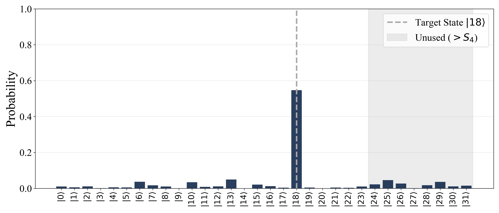

*(a) JAX simulation result*

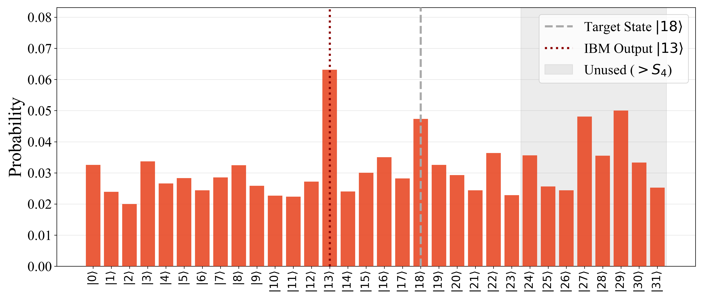

*(b) Hardware inference result*

*Figure 6: **Quantum state amplitude distribution for the failed $S_4$ permutation $P(15) \circ P(17)$.** **(a)** Ideal probability distribution obtained via noiseless JAX simulation, isolating the target state ($|18\rangle$). **(b)** Raw probability distribution evaluated on the `ibm_marrakesh` physical processor. While unmitigated $T_2$ decoherence caused a noise-induced bit-flip allowing state $|13\rangle$ to erroneously peak (6.3%), the geometric wave-interference remained physically robust enough to maintain the true target state $|18\rangle$ as the distinct runner-up (4.7%) well above the 3.1% random noise floor.* **[p. 12]**

### Asymptotic complexity

Consider the representational scaling required to model exact formal systems. In standard classical Transformers, embedding a finite token space of size $V$ requires mapping tokens into a high-dimensional Euclidean space, with an embedding table demanding $\mathcal{O}(V \times d_{\text{model}})$ parameters. Furthermore, classical multi-head attention and feed-forward networks rely on dense projection matrices that scale quadratically with this hidden dimension, imposing a massive $\mathcal{O}(d_{\text{model}}^2)$ parameter bottleneck. Conversely, the UQT maps tokens directly into the continuous phase amplitudes of an $N$-qubit register. Because the multi-qubit Hilbert space scales exponentially ($\mathcal{O}(2^N)$ state dimensions), the UQT achieves massive representational density using only a logarithmic number of physical qubits: $\mathcal{O}(\log V)$. Consequently, the quantum embedding dimension is strictly bounded by the number of phase angles applied to the $N$ qubits, reducing the representation scaling to $\mathcal{O}(V \times \log V)$, while the sequential quantum mixing layers require only $\mathcal{O}(L \times \log V)$ parameters. This allows the UQT to bypass the $\mathcal{O}(d_{\text{model}}^2)$ classical parameter explosion entirely.

Crucially, this logarithmic spatial scaling reveals a profound connection to foundational quantum algorithms. In our modular arithmetic evaluations, the UQT natively learns to decode cyclic, periodic group structures, mathematics fundamentally akin to the phase-estimation logic required for the modular exponentiation step in Shor's algorithm [20]. However, rather than relying on a rigid, general-purpose Inverse Quantum Fourier Transform (IQFT) to extract the phase, the parameterized mixing layers organically learn a highly compressed, task-specific basis transformation. This demonstrates that the UQT provides an exceptional parameter efficiency advantage for learning the exact discrete formal systems that currently forces classical continuous-space models into massive over-parameterization.

Importantly, the present experiments operate at a relatively small scale. Extending this architecture to substantially larger formal domains remains an open challenge, as quantum machine learning approaches face the well-known barren plateau problem where gradients **[p. 12]** vanish exponentially as the Hilbert space expands. Nevertheless, the UQT's compact parameter footprint and asymmetric regularization to selectively prune redundant entanglement pathways establish a structural foundation for addressing this as quantum hardware matures.

## Discussion

The ability of a highly compact, few-qubit physical system (5 or 6 qubits, 551–1,650 trainable parameters) to crystallize across cyclic modular arithmetic, non-Abelian group algebra, and systematic linguistic compositionality using an identical quantum attention topology suggests that the UQT provides a highly viable substrate for exact formal mathematical and compositional reasoning. Physical deployment on IBM Quantum hardware further confirms that this crystallization is not an artifact of noiseless simulation: the UQT achieves 97.5% accuracy across all four tasks under unmitigated NISQ noise, demonstrating that the learned geometric phase-interference is sufficiently robust for execution on current hardware.

In contrast, classical continuous-space baselines (MLPs with ${\sim}$1,000 parameters as well as **[p. 13]** Transformers with ${\sim}$400,000 parameters) across all four domains fail to crystallize, exhibiting persistent stochastic instability at convergence. This failure arises from a geometric mismatch between continuous Euclidean space and the discrete formal systems. The UQT, by contrast, physically embodies the target equations, locking into the $2\pi$-periodic and $SU(2)$ geometric structure of quantum state space to enforce formal logic deterministically. These findings suggest that quantum representations provide structural inductive biases that are well-suited for exact formal systems, an advantage that classical continuous-space architectures do not natively possess.

## Methods

### Mathematical formulation of the UQT

The core function of the UQT relies on encoding classical tokens into geometric quantum states. For an input token $x$ mapped to a parameterized vector $\vec{\theta}_x$, the embedding unitary $\mathcal{E}$ is applied across a dedicated $N_{emb}$-qubit subspace of the total $N$-qubit register:

$$
\mathcal{E}(\vec{\theta}_x) = \left( \bigotimes_{q=0}^{N_{emb}-1} R_y(\theta_{x, q, 3}) R_x(\theta_{x, q, 2}) R_y(\theta_{x, q, 1}) R_x(\theta_{x, q, 0}) \right) \otimes I^{\otimes (N - N_{emb})}, \tag{1}
$$

where $I$ represents the identity operation on the remaining un-embedded ancilla qubits. This alternating sequence of orthogonal rotations provides universal single-qubit control, ensuring that each discrete token can be mapped to any arbitrary geometric coordinate on the Bloch sphere. In our empirical evaluations, we embedded operands into an $N_{emb}=4$ qubit subspace on a 5-qubit register ($N=5$) for modular arithmetic, and utilized the full 5-qubit register ($N_{emb}=N=5$) for the non-Abelian permutations. For the linguistic compositionality task, all 6 qubits were used as embedding qubits ($N_{emb}=N=6$).

Following the rotational embeddings, the quantum state is processed by digital mixing layers to generate deep structural entanglement. Each layer $l$ applies a parameterized general $SU(2)$ rotation to every qubit, followed by a global cyclic ring of CNOT gates ($C_{\mathrm{ring}}$):

$$
U_{\mathrm{mix}}^{(l)} = C_{\mathrm{ring}} \bigotimes_{q=0}^{N-1} U_{\mathrm{Rot}}^{(l)}\left(\alpha_{l,q}, \beta_{l,q}, \gamma_{l,q}\right). \tag{2}
$$

In the quantum attention circuit, a full set of tokens $T = (x_1, x_2, \dots, x_S)$ are embedded consecutively prior to any entanglement, allowing their geometric states to natively superimpose. This state is subsequently processed by $L$ mixing layers to produce the final pre-measurement state:

$$
|\psi_{attn}\rangle = \left( \prod_{l=1}^{L} U_{\mathrm{mix}}^{(l)} \right) \left( \prod_{t=1}^{S} \mathcal{E}(\vec{\theta}_{x_t}) \right) |0\rangle^{\otimes N}, \tag{3}
$$

where the embedding product denotes time-ordered application from right to left.

### Optimization and asymmetric regularization

###### p13-6

The architecture was optimized using the JAX high-performance array computing framework [21] and the Optax AdamW optimizer. Across all experimental domains, we utilized a constant learning rate of $\eta = 0.005$ alongside moment decay rates of $\beta_1 = 0.9$ and $\beta_2 = 0.98$. We applied an asymmetric loss function utilizing an $L_2$ weight decay ($\lambda_{ent} = 0.01$) exclusively on the entanglement logic gates ($W_{ent}$), while the phase embedding angles ($W_{emb}$) were masked from penalization:

$$
L_{total} = \mathcal{L}_{\text{NLL}} + \lambda_{ent} ||W_{ent}||_2^2, \tag{4}
$$

**[p. 14]**

where $W_{ent}$ encompasses the rotational parameters of the mixing layers, and $W_{emb}$ represents the unpenalized token embedding phases. This architectural constraint permits the token geometry to rotate freely across the Bloch sphere. Simultaneously, the $L_2$ penalty forces unnecessary entanglement parameters toward zero, functionally reducing arbitrary $SU(2)$ rotations into Identity operations ($I$). This dynamic natively prunes the circuit during optimization, severely restricting the logical density of the CNOT routing network and preventing over-entanglement.

### Dataset generation

Datasets for modular arithmetic over $\mathbb{Z}_{11}$ and $\mathbb{Z}_{11}^*$, as well as $S_4$ permutations, were partitioned into 80/20 train/test splits. The SCAN linguistic task utilized a strict zero-shot compositional split, where the test set exclusively contains commands combining the “jump” concept with directional modifiers unseen in training combinations. The full vocabulary ($V=50$) consists of: 10 optional prefix tokens (*please, kindly, just, quickly, now, carefully, quietly, slowly, simply, suddenly*), with no-prefix also permitted; 4 verb concepts each represented by 6 synonymous surface tokens (Walk: *walk, stroll, amble, saunter, march, pace*; Run: *run, sprint, dash, jog, race, rush*; Jump: *jump, leap, hop, bound, vault, spring*; Look: *look, stare, gaze, glance, peek, peer*); and 4 directional concepts each represented by up to 4 surface tokens (Forward/None: *no modifier, straight, forward, ahead*; Left: *left, port, counterclockwise, westward*; Right: *right, starboard, clockwise, eastward*; Around: *around, back, backwards, behind*).

Because all four task domains are finite, the held-out test sets constitute exhaustive evaluations: the 20% partitions cover all held-out operand pairs for modular arithmetic and $S_4$, and the zero-shot split covers all possible compositions of the jump concept with directional modifiers in the SCAN task.

### Classical Transformer baseline

To establish a rigorous classical baseline, we trained standard attention-based Transformers using PyTorch [22]. The classical architecture comprised 2 encoder layers, 4 attention heads, an embedding dimension of $d_{\text{model}}=128$, and a feedforward network dimension of 512, requiring approximately $4 \times 10^5$ trainable parameters. Comparing this to the UQT's sub-2,000 parameter footprint empirically validates the massive over-parameterization required for classical continuous-space models to approximate discrete formal logic. Training followed the optimization protocol of Power et al. [4]: AdamW optimizer with $\eta{=}10^{-3}$, $\beta_1{=}0.9$, $\beta_2{=}0.98$, weight decay $\lambda{=}1.0$, and a linear warmup scheduler over the first 10 updates. A minibatch size of 48 was used for all arithmetic and permutation tasks, and 64 for the SCAN linguistic task; these batch sizes were held fixed across all three model types (UQT, Transformer, and MLP).

### Classical MLP baseline

To further isolate whether classical crystallization failure is structural or merely a consequence of over-parameterization, we additionally trained a compact classical MLP on all four tasks where the UQT crystallizes. The architecture follows: $\text{Embedding}(V, d) \rightarrow \text{flatten} \rightarrow \text{Linear}(S \cdot d,\, h) \rightarrow \text{ReLU} \rightarrow \text{Linear}(h,\, C)$, where $V$ is vocabulary size, $d$ the embedding dimension, $S$ the sequence length, $h$ the hidden dimension, and $C$ the number of output classes. For the SCAN task, the final layer is replaced by two parallel output heads (verb and modifier), identical in structure to the classical Transformer baseline. Parameter counts were chosen to be comparable to the UQT: 995 parameters for modular arithmetic tasks ($\mathbb{Z}_{11}$ addition and $\mathbb{Z}_{11}^*$ multiplication, $d{=}8$, $h{=}32$), 984 for $S_4$ ($d{=}5$, $h{=}24$), and 956 for SCAN ($d{=}6$, $h{=}24$). All training hyperparameters were held fixed and identical to the classical Transformer baseline.

**[p. 15]**

### Hardware execution

Inference was evaluated on physical superconducting quantum processors accessed via the IBM Qiskit Runtime Service [23]: `ibm_fez`, `ibm_marrakesh`, and `ibm_kingston` (all featuring the 156-qubit Heron r2 architecture). All hardware executions utilized $8,192$ measurement shots per evaluation.

Because the physical fidelity of superconducting qubits drifts over time due to continuous environmental decoherence, it is necessary to record the exact baseline hardware metrics at the time of execution to appropriately contextualize the algorithmic noise-resilience of the UQT. The median two-qubit ($CZ$) gate infidelities across the processors ranged from $1.82 \times 10^{-3}$ to $2.69 \times 10^{-3}$, and median readout assignment errors ranged from $8.91 \times 10^{-3}$ to $1.52 \times 10^{-2}$. Median $T_1$ relaxation times were bounded between $139.63 \, \mu\text{s}$ and $280.29 \, \mu\text{s}$, while $T_2$ dephasing times ranged from $96.32 \, \mu\text{s}$ to $138.43 \, \mu\text{s}$. Because the UQT does not utilize quantum error correction, the successful, unmitigated hardware classification achieved in our results confirms that the learned geometric phase-interference is robust enough to overcome native environmental decoherence and localized gate degradation.

### Why the proposed architecture crystallizes

We now provide a constructive argument showing that the proposed quantum attention architecture can represent modular addition exactly when its embedding operators are chosen to respect the symmetry of the task. While the following discussion is focused on modular arithmetic as an illustrative case, a unified formal treatment spanning non-Abelian algebra and linguistic compositionality remains an open direction for future theoretical work. Consider the function

$$
f(n,m)=n+m \pmod p, \tag{5}
$$

where $n,m \in \mathbb{Z}_p$ and $p\ge 2$ is the modulus. The key observation is that modular addition is the group operation of the finite cyclic group $\mathbb{Z}_p$ [6]. Therefore, the natural basis for representing this task is given by the characters of $\mathbb{Z}_p$, namely

$$
\chi_k(n)=e^{2\pi i kn/p}, \qquad k=0,\dots,p-1. \tag{6}
$$

These functions diagonalize the translation structure of the problem and satisfy

$$
\chi_k(n)\chi_k(m)=\chi_k(n+m), \tag{7}
$$

where addition is understood modulo $p$. This multiplicative identity is the central reason the architecture can implement modular addition efficiently.

To analyze what happens at the embedding stage, let $\{|k\rangle\}_{k=0}^{p-1}$ denote a computational basis over a $p$-dimensional latent register. Define the token embedding operator by

$$
U_{\mathrm{emb}}(n)|k\rangle=\chi_k(n)|k\rangle
=
e^{2\pi i kn/p}|k\rangle. \tag{8}
$$

Thus each token $n$ is encoded as a phase shift across spectral modes. Unlike unconstrained Euclidean embeddings, this representation is periodic and exactly compatible with modular arithmetic. By initializing the latent register in the uniform superposition, i.e.,

$$
|\psi_0\rangle=\frac{1}{\sqrt p}\sum_{k=0}^{p-1}|k\rangle, \tag{9}
$$

and applying the embedding for token $n$, we have

$$
|\psi(n)\rangle
=
U_{\mathrm{emb}}(n)|\psi_0\rangle
=
\frac{1}{\sqrt p}\sum_{k=0}^{p-1}e^{2\pi i kn/p}|k\rangle. \tag{10}
$$

**[p. 16]**

At the composition step, applying two token embeddings sequentially yields

$$
\begin{aligned}U_{\mathrm{emb}}(m)U_{\mathrm{emb}}(n)|k\rangle
&=
e^{2\pi i km/p}e^{2\pi i kn/p}|k\rangle \\
&=
e^{2\pi i k(n+m)/p}|k\rangle.\end{aligned} \tag{11}
$$

Therefore,

$$
U_{\mathrm{emb}}(m)U_{\mathrm{emb}}(n)|\psi_0\rangle
=
\frac{1}{\sqrt p}\sum_{k=0}^{p-1}e^{2\pi i k(n+m)/p}|k\rangle. \tag{12}
$$

The modular sum is thus accumulated directly in phase space. No learned nonlinear arithmetic rule is required; the group structure of the task is implemented by construction.

Finally, at the readout stage, to decode the symbolic output, we can apply the IQFT ($F_p^\dagger$):

$$
F_p^\dagger |k\rangle
=
\frac{1}{\sqrt p}\sum_{q=0}^{p-1}e^{-2\pi i kq/p}|q\rangle. \tag{13}
$$

Then,

$$
\begin{aligned}F_p^\dagger
\left(
\frac{1}{\sqrt p}\sum_{k=0}^{p-1}e^{2\pi i k(n+m)/p}|k\rangle
\right)
&=
\sum_{q=0}^{p-1}
\left[
\frac{1}{p}\sum_{k=0}^{p-1}e^{2\pi i k(n+m-q)/p}
\right]|q\rangle.\end{aligned} \tag{14}
$$

Using orthogonality of characters,

$$
\sum_{k=0}^{p-1}e^{2\pi i ks/p}=p\,\delta_{s,0 \, (\mathrm{mod}\, p)}, \tag{15}
$$

we obtain

$$
F_p^\dagger U_{\mathrm{emb}}(m)U_{\mathrm{emb}}(n)|\psi_0\rangle
=
|n+m \pmod p\rangle. \tag{16}
$$

Accordingly, measurement returns the correct modular sum with probability one. While this analytical construction relies on an explicitly programmed IQFT and exact character phase shifts, it serves as a foundational existence proof: the exact geometry of modular arithmetic is natively resolvable within a multi-qubit Hilbert space. Classical Euclidean models lack this periodic, wave-interference inductive bias, forcing them to approximate these dynamics through massive over-parameterization.

Note that in our proposed UQT, we do not hardcode the IQFT nor the exact $\mathbb{Z}_p$ group characters. Instead, the architecture utilizes parameterized $SU(2)$ rotations ($R_x$ and $R_y$ gates) and unconstrained gradient optimization to organically discover a task-specific basis transformation. The phenomenon of crystallization we observe empirically suggests that the UQT learns an isomorphic, highly compressed representation of the phase-accumulation and decoding process described above, ultimately achieving the same deterministic, probability-one generalization. By leveraging the continuous, periodic nature of quantum phase space, the UQT natively converges to the target algebraic structure without the stochastic approximation errors inherent to classical continuous-space networks.

It is also important to note the key difference between the aforementioned discussion and the argument presented by Gromov [6]. In their work, they utilized real-valued cosine features as an approximate Fourier basis (unlike the proposed method that employs the full complex characters, $e^{2\pi i kn/p}$). The cosine formulation captures only the real projection of the harmonic structure, effectively discarding the imaginary sine component that carries phase orientation and completes the representation. As a result, the MLP must reconstruct modular relations indirectly through nonlinear interactions and training dynamics, whereas the proposed architecture preserves the full phase information from the outset, allowing modular composition to arise naturally through direct multiplication of complex phases rather than through delayed emergence of partial real-valued harmonics.

**[p. 17]**

## References

1. Dziri, N. et al. Faith and fate: Limits of transformers on compositionality. *Advances in neural information processing systems* **36**, 70293–70332 (2023).

2. Trask, A. et al. Neural arithmetic logic units. *Advances in neural information processing systems* **31** (2018).

3. Lake, B. & Baroni, M. Generalization without systematicity: On the compositional skills of sequence-to-sequence recurrent networks. In *International conference on machine learning*, 2873–2882 (PMLR, 2018).

4. Power, A., Burda, Y., Edwards, H., Babuschkin, I. & Misra, V. Grokking: Generalization beyond overfitting on small algorithmic datasets. *arXiv preprint arXiv:2201.02177* (2022).

5. Liu, Z. et al. Towards understanding grokking: An effective theory of representation learning. *Advances in Neural Information Processing Systems* **35**, 34651–34663 (2022).

6. Gromov, A. Grokking modular arithmetic. *arXiv preprint arXiv:2301.02679* (2023).

7. Biamonte, J. et al. Quantum machine learning. *Nature* **549**, 195–202 (2017).

8. Cerezo, M., Verdon, G., Huang, H.-Y., Cincio, L. & Coles, P. J. Challenges and opportunities in quantum machine learning. *Nature computational science* **2**, 567–576 (2022).

9. Peral-García, D., Cruz-Benito, J. & García-Peñalvo, F. J. Systematic literature review: Quantum machine learning and its applications. *Computer Science Review* **51**, 100619 (2024).

10. Lakhdar-Hamina, D. et al. Benchmarking a tunable quantum neural network on trapped-ion and superconducting hardware. *arXiv preprint arXiv:2507.21222* (2025).

11. Zhang, H. et al. A survey of quantum transformers: Architectures, challenges and outlooks. *arXiv preprint arXiv:2504.03192* (2025).

12. Li, G., Zhao, X. & Wang, X. Quantum self-attention neural networks for text classification. *Science China Information Sciences* **67**, 142501 (2024).

13. Guo, N. et al. Quantum linear algebra is all you need for transformer architectures. *arXiv preprint arXiv:2402.16714* **1** (2024).

14. Khatri, N., Matos, G., Coopmans, L. & Clark, S. Quixer: A quantum transformer model. *arXiv preprint arXiv:2406.04305* (2024).

15. Larocca, M. et al. Group-invariant quantum machine learning. *PRX quantum* **3**, 030341 (2022).

16. Meyer, J. J. et al. Exploiting symmetry in variational quantum machine learning. *PRX quantum* **4**, 010328 (2023).

17. Vaswani, A. et al. Attention is all you need. *Advances in neural information processing systems* **30** (2017).

18. Mitarai, K., Negoro, M., Kitagawa, M. & Fujii, K. Quantum circuit learning. *Physical Review A* **98**, 032309 (2018).

19. Schuld, M., Bergholm, V., Gogolin, C., Izaac, J. & Killoran, N. Evaluating analytic gradients on quantum hardware. *Physical Review A* **99**, 032331 (2019).

**[p. 18]**

20. Shor, P. W. Polynomial-time algorithms for prime factorization and discrete logarithms on a quantum computer. *SIAM review* **41**, 303–332 (1999).

21. Bradbury, J. et al. JAX: composable transformations of Python+NumPy programs (2018). URL http://github.com/jax-ml/jax.

22. Paszke, A. et al. Pytorch: An imperative style, high-performance deep learning library. *Advances in neural information processing systems* **32** (2019).

23. Javadi-Abhari, A. et al. Quantum computing with qiskit. *arXiv preprint arXiv:2405.08810* (2024).

## Author contributions

S.C. conceived the Universal Quantum Transformer architecture and designed its quantum circuit topologies, implemented the JAX and PyTorch codebases, executed the inference evaluations on physical IBM Quantum hardware, and wrote the original manuscript. A.T. supervised the research, collaborated in advancing and refining the initial version of the model architecture, contributed to the theoretical analysis, validated the algorithms and code, and critically revised the writing.

## Funding Declaration

The authors declare that they have no funding sources to disclose for this work.
