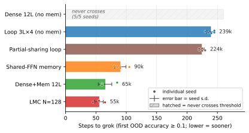
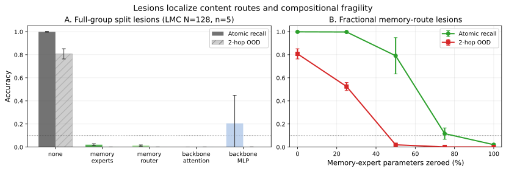
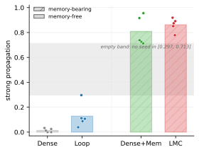

# Repeated Shared Access Enables Grokking, but Edit Propagation Depends on an Addressable Memory

Yanan Niu Thanks: Correspondence: niuyanan@kuaishou.com. Affiliation: Kuaishou Technology

## Abstract

We study factual edit propagation in a controlled synthetic knowledge-graph QA setting using a $2{\times}2$ grid that crosses loop recurrence with shared-memory access: a dense transformer (Dense), a looped transformer (Loop), a dense backbone with shared memory (Dense+Mem), and a looped backbone with shared memory (loop–memory coupling, LMC). The two factors dissociate. For learning, both routes to repeated shared access—looped recomputation and repeated memory rereading—cross the out-of-distribution (OOD) grokking barrier that Dense fails, so repeated shared access is the behavioral regularity, not a specific architecture. For editing, the substrates split along a different axis. Applying a single localized factual edit and measuring propagation on a shared, pre-edit-correct in-distribution set (conditioned on direct edit success), the edit propagates through 2-hop compositions strongly in both memory-bearing cells (LMC $0.78$–$0.92$, Dense+Mem $0.71$–$0.96$) and only weakly in the memory-free ones (Loop $0.04$–$0.30$, Dense $0.00$–$0.03$). The split is along the memory axis, not the loop axis: we do not detect a difference between the two memory cells at our sample size, while every memory-bearing seed exceeds every memory-free seed. Crucially Dense+Mem has no recurrence, so the propagating ingredient is an addressable site that an edit can write to and that later computation rereads, not loop recomputation; Loop, which reuses a fact-bearing computation but for which we do not identify a separately-writable site under our edit protocol, is at best a partial intermediate case. Within LMC, the same edit on LMC’s own pre-edit-correct probe set achieves $100\%$ direct success, mean $0.989$ 2-hop propagation, and ${\approx}0.1\%$ movement of random unrelated probes on that internal set (a held-out unrelated-fact set moves ${\approx}1.5\%$; co-resident facts can move more)—a within-LMC precision characterization, not a recount of the cross-substrate numbers above. The affordance survives coarsening the store ($N{=}128\to N{=}13$): propagation attenuates but the memory/no-memory split persists, so fine granularity buys precision rather than the affordance itself. These results dissociate learning competence from editing affordance—repeated shared access suffices to grok, but edit propagation depends on whether the substrate exposes an addressable memory that the forward computation can write to and later reread, an affordance that loop recurrence provides only partially.

## 1 Introduction

#### Scope.

This paper is a controlled mechanism study—a *model organism* for edit propagation (a deliberately simplified, fully observable system studied to isolate one mechanism, by analogy with model organisms in biology), not an architecture proposal. **[p. 2]** The synthetic KG-QA setting and small five-seed design are chosen so that the fact-bearing site is causally localizable and the propagation protocol can be conditioned on direct edit success; we do not claim, and the design does not test, generalization to natural-language pretraining or to retrieval-augmented (RAG) systems. Within that scope we adjudicate one question: when two architectures both cross the OOD grokking barrier, what makes a successful single-fact edit propagate through composition?

Dense transformers can learn the in-distribution surface of a compositional task while failing at the compositions that matter. In the synthetic knowledge-graph QA setting of [1], a standard dense transformer memorizes training and in-distribution (ID) facts but remains near chance on held-out out-of-distribution (OOD) 2-hop compositions. Two modifications fix this failure: a looped transformer can recompute with the same backbone across recurrent depth, and an LMC-style model can reread an explicit memory store between iterations. The central question of this paper is what these two successful routes have in common, and where they differ. Throughout, we use *grokking* for the delayed onset of OOD generalization. [1] treat it as a binary event (a model either does or does not eventually generalize OOD); we adopt that binary view but make the onset measurable by operationalizing grokking as the first training step at which OOD accuracy crosses $0.1$ ($\approx 25\times$ the chance level), treating $0.1$ as a conservative above-chance event marker rather than a saturation criterion. We use grokking only as an onset event—*whether* and *when* a configuration crosses this threshold; the eventual OOD value enters only to confirm that grokked runs clear chance by a wide margin, and speed claims below refer to time-to-onset.

The two chance levels used below correspond to different metrics: OOD 2-hop accuracy is scored against the candidate tail-entity set of the KG-QA evaluation (the set of entities admissible as answers, which is far smaller than the full vocabulary; chance ${\approx}0.004$), while atomic single-hop recall is scored by exact match over the full word-level vocabulary (chance ${\approx}1/2202\approx 5\times 10^{-4}$). We name which baseline applies whenever we refer to chance.

This behavioral regularity is *repeated shared access*. A looped transformer obtains multiple chances to use the same fact-bearing computation by applying tied backbone weights at several iterations; a memory-augmented loop obtains multiple chances to query the same fact-bearing store.

This view distinguishes two levels. At the learning level, loop and memory are unified at the level of crossing the OOD grokking barrier where a non-sharing dense baseline does not (we do not claim identical training dynamics or representations). At the editing level, however, the relevant axis is not loop-versus-memory but *addressability*: a substrate that exposes an addressable store (LMC, and also a dense backbone with shared memory) lets a localized edit propagate, whereas a substrate that shares only computation does so at best partially. By **addressable** we mean that each stored fact occupies an identifiable site that can be written to in isolation and that the forward computation rereads when it needs the fact. A memory is **fine-grained** to the degree that this fact-to-site mapping is close to one-to-one, so editing a single site moves the target fact with little collateral (this is the $N{=}128$ vs. $N{=}13$ factor of §8). Loop recurrence reuses a fact-bearing computation across iterations but exposes no such separately-writable site, which is why it is an intermediate, partial case on the editing axis rather than a co-equal route.

This distinction frames the paper’s central question. If edit propagation follows only the repeated-access structure, then editing a reused loop site should behave like editing a reused memory site: loop and memory would be the same all the way down. If, instead, edit propagation depends on explicit addressability and on when edited content becomes usable, then memory should afford stronger and cleaner propagation than tied looped weights. We adjudicate between shared-access and addressability accounts rather than assuming the memory answer in advance.

Our results support a refined version of the addressability account. The final pattern is not a binary “memory propagates, loop does not.” Rather, edit propagation splits the substrates along whether they expose an addressable site: the two memory-bearing configurations propagate strongly **[p. 3]** with no difference we detect at our sample size, the dense no-memory model does not propagate, and the looped no-memory model is a partial, intermediate case. We also explored an interchange diagnostic to ask when edited content becomes usable, but it does not predict propagation at the seed level (it saturates within LMC and anti-correlates with propagation within Loop), so we report it only as an auxiliary observation in Appendix D and do not build the account on it.

#### Positioning.

Our task and grokking recipe follow [1], who predict that cross-layer memory sharing—via memory augmentation or recurrence—enables OOD systematicity; concurrent loop-only work [2] confirms the recurrence half. We add the controlled loop-vs-memory separation and, distinctively, the edit-propagation adjudication, holding effective depth fixed in the main grid and using same-scale controls to separate route viability from parameter count. Full related work is in §7.

#### Contributions.

Two terms recur below: a *step* is one loop iteration (step0$\ldots$step3), distinct from a *hop*, which is a reasoning edge; a fact’s *site* is the dominant memory value row at the step where the fact is read (full definitions in §2.1).

1. **Repeated shared access as a behavioral regularity for grokking.** A single-shared-FFN memory control and a partial-sharing loop control each grok, while dense no-memory models remain flat. Behaviorally, crossing the OOD barrier tracks repeated access to a shared substrate rather than sparse MoE routing or full recurrence specifically; we make no claim that the two routes share an internal circuit.
2. **Localization from grokking to editable addressability.** In the fine-grained LMC memory, causal patching and interchange interventions show that one dominant memory site stores each fact and is reused in 2-hop reasoning: the single-hop step0 dominant expert equals the 2-hop step1 dominant expert for every tested atom on each of the five LMC seeds (selection protocol in Appendix C.1), and bridge substitution flips the 2-hop answer in 92–99.5% of cases across all five LMC seeds; the symmetric coarse interchange diagnostic (one site per loop iteration) returns best-site flip-to-donor of $1.00$ on every seed (Section 5, Appendix I).
3. **Local LMC editing.** Editing only the largest activated value row at the step0 edit site gives 100% direct success (LMC-internal probe set) and mean 2-hop bridge propagation $0.989$ on that set; on the cross-substrate shared ID measurement set (Contribution 4), the same edit propagates at $0.78$–$0.92$ across seeds. Locality has three distinct scopes: random unrelated probes move ${\approx}0.1\%$ (internal set, Table 5), a matched held-out unrelated-fact set moves ${\approx}1.5\%$ (Table 15), and co-resident facts sharing the edited expert can move much more (5–50%, Appendix G). Locality is therefore not absolute: hidden-state overlap predicts the co-resident leakage.
4. **A 2$\times$2 edit-propagation adjudication.** Using a shared ID measurement set, pre-edit-correct probes, and conditioning on direct edit success, we compare Dense, Loop, Dense+Mem (a dense backbone with the same memory store but no loop), and LMC. The result ties high semantic propagation to memory-bearing cells (LMC $0.78$–$0.92$, Dense+Mem $0.71$–$0.96$), while Loop remains intermediate ($0.04$–$0.30$) and Dense remains near zero ($0.00$–$0.03$).

The rest of the paper follows this arc: we first define the KG-QA setup and architecture grid, then present Study 1 on learning, a localization bridge that establishes editable memory reuse, and Study 2 on edit propagation. We return to related work after the main evidence, where the contrasts are easier to evaluate.

**[p. 4]**

## 2 Experimental Setup and Protocols

This section defines the task, the architectural variants, and the intervention protocol used in the edit-propagation adjudication. The central design discipline is that learning and editing are evaluated with different controls: Study 1 asks which repeated-access structures cross the OOD grokking barrier, whereas Study 2 asks whether a successful direct edit propagates through a composition.

### 2.1 Task: synthetic knowledge-graph QA

We use the synthetic knowledge-graph QA setting of [1]. The data are generated from a set of atomic facts $(e,r)\mapsto e^{\prime}$ and composed 2-hop queries of the form $(e_{0},r_{1},r_{2})\mapsto e_{2}$, where $e_{0}\xrightarrow{r_{1}}e_{1}\xrightarrow{r_{2}}e_{2}$ and the intermediate entity $e_{1}$ is the *bridge*. Models are trained on single-hop and in-distribution examples and evaluated on held-out OOD compositions. Recall from §1 that we operationalize grokking as the first step at which OOD accuracy exceeds $0.1$, and use only *whether* and *how fast* a configuration crosses it; we do not rank substrates by the eventual OOD value.

The task is useful for the present question because it separates memorizing atomic or ID facts from systematically composing facts. Dense no-memory transformers can fit training and ID data while remaining near random on held-out OOD 2-hop compositions; repeated shared access through a loop or a memory can cross that barrier.

#### Notation and terminology.

We collect the recurring terms in one place so that later sections can use them without repeated re-introduction.

*Step vs. hop.* A step is one loop iteration of the shared backbone. With $R{=}4$ we index the iterations as *step0 $\ldots$ step3*, read memory after step0/1/2, and leave step3 as a memory-free finishing pass before the LM head (see §2.2). The choice $R{=}4$ is fixed by depth-matching rather than tuned: $3\text{L}\times 4$ gives the same $12$ effective layers as the dense and partial-sharing baselines, and four iterations suffice to run a 2-hop chain followed by a memory-free finishing step. A *hop* is a reasoning edge in the query and is not a step.

*The 2-hop query.* For $(e_{0},r_{1},r_{2})\mapsto e_{2}$ with $e_{0}\xrightarrow{r_{1}}e_{1}\xrightarrow{r_{2}}e_{2}$, we call $e_{1}$ the *bridge entity*, $(e_{0},r_{1})\mapsto e_{1}$ the *first-hop fact*, and $(e_{1},r_{2})\mapsto e_{2}$ the *second-hop fact*. The computation is iterative single-hop: step0 resolves the first-hop fact and emits the bridge entity; step1 rereads that bridge entity and resolves the second-hop fact; step2 produces the answer representation. Section 5 measures the same-location reuse that makes a single memory edit meaningful: the second-hop fact uses the same dominant site whether queried directly at step0 or reached compositionally at step1.

*Site, edit, success, propagation.* A fact’s *site* is the dominant value row of its dominant memory expert at the step where the fact is read. Facts that share the same dominant memory expert are *co-resident facts*. An edit retargets one fact at its site. In the propagation study we edit the first-hop fact, replacing its bridge entity $e_{1}$ with $e_{1}^{\prime}$ (chosen so that $(e_{1}^{\prime},r_{2})$ is an existing fact). *Direct edit success* means $(e_{0},r_{1})$ now predicts $e_{1}^{\prime}$. Conditioned on direct success, *strong propagation* means the 2-hop prediction equals the answer implied by the new bridge entity, $\mathrm{fact}(e_{1}^{\prime},r_{2})=e_{2}^{\prime}$, whereas *weak propagation* is any change away from the original answer $e_{2}$; the main text uses strong unless noted.

*Substrate split.* A substrate is *memory-bearing* if it has a shared memory store—LMC and the dense-with-memory control—and *memory-free* otherwise (Loop and Dense). The adjudication asks whether edit propagation tracks the memory-bearing/memory-free split or the backbone (looped/dense) split.

**[p. 5]**

### 2.2 Architectural variants

We organize the main KG-QA architectures as a 2$\times$2 control grid (Table 1) that crosses backbone type with shared-memory access.

*Table 1: Primary configuration grid. Dense is the dense no-memory anchor, Loop isolates repeated recomputation, Dense+Mem is the dense-backbone, memory-only control, and LMC ($\star$) is the full model: looped backbone plus shared memory. Horizontal arrows add shared memory; vertical arrows add loop recurrence.* **[p. 5]**

The grid separates two factors—repeated computation through a looped backbone, and repeated access to a shared memory. The edit-propagation comparison uses all four cells: Dense tests dense no-memory editing, Loop tests loop-only editing, Dense+Mem tests memory without loop recurrence, and LMC combines loop and memory.

Model scale is reported as an architectural covariate rather than force-matched, because the editing protocol aligns on the fact-bearing site and on direct edit success rather than on parameter count (we separately add parameter-matched same-scale controls in §3.1, ruling out a parameter-count explanation). Scale differences do not explain the propagation gap: every substrate reaches a successful direct edit (Loop and Dense at 100% direct success on all five seeds), so the differences arise after the edit takes, in whether it propagates, not in editability or in raw capacity.

#### Loop-memory coupling.

LMC consists of a shared transformer block $f_{\theta}$ of $L$ layers together with a shared memory $\mathrm{Mem}_{\phi}$ (Figure 1). Given token embeddings $x^{(0)}$, the model iterates the shared block $R$ times and queries memory between iterations:

$$
h^{(r)} =f_{\theta}(x^{(r)}), \tag{1} \\
x^{(r+1)} =\begin{cases}h^{(r)}+\mathrm{Mem}_{\phi}(\mathrm{LN}(h^{(r)})),&r<R-1,\\
h^{(r)},&r=R-1.\end{cases} \tag{2}
$$

The memory is implemented as a sparsely routed expert store: a router selects top-$k$ expert MLPs and mixes their outputs. The paper’s claims do not depend on sparse routing alone; Study 1 explicitly tests a single shared-FFN memory variant.

*Figure 1: Loop-Memory Coupling architecture. A thin shared backbone ($L{=}3$ layers) is iterated $R{=}4$ times with tied weights $f_{\theta}$, giving $12$ effective layers. At each non-final iteration the latent state queries the same shared memory $\mathrm{Mem}_{\phi}$ and adds the retrieval by a residual connection; the final iteration is a pure-transformer finish before the LM head. Removing the memory recovers the pure looped backbone (Loop); replacing the loop with a single-pass $12$-layer backbone that rereads the same memory at three matched access points recovers the dense-with-memory cell (Dense+Mem); removing both recovers the dense anchor (Dense). Iterations are indexed step0$\ldots$step$R{-}1$ (the first iteration is step0), matching the body notation; the shared memory is read after step0, step1, step2, and the final iteration (step3) is memory-free.* **[p. 6]**

#### Memory placement across the variants.

The same parameters $\theta,\phi$ are reused across all $R$ iterations; the only per-step variation comes from the evolving latent $h^{(r)}$ and its memory retrieval, and we train end-to-end with the next-token loss using *no* step-level supervision and *no* curriculum. For the dense-with-memory control (Dense+Mem), the backbone is a single-pass dense transformer rather than a loop, but the memory principle is kept identical: one shared memory is reread at each configured access point. In the $12$-layer Dense+Mem cell the shared memory is queried after layers $3$, $6$, and $9$, matching the three non-final reads of LMC, while the terminal layer stays memory-free so the final retrieval is processed by later layers before the LM head. **[p. 6]** Removing the memory from LMC recovers a pure looped transformer (Loop), and removing both recurrence and memory recovers the dense baseline (Dense); together with full LMC (LMC) these form the $2\times 2$ grid above.

### 2.3 Study 1 protocol: repeated shared access

Study 1 tests whether OOD grokking tracks repeated access to a shared substrate rather than an architecture label. We use two diagnostics.

#### Single-shared-FFN memory control.

The MoE memory is replaced by one dense shared FFN inserted at the same repeated access points. If this model groks, sparse MoE routing is not necessary for the existence of grokking under the recipe.

#### Partial-sharing loop control.

We train a partially shared looped model with $4$ unique layers applied $3$ times (4L$\times$3, still $12$ effective layers), so its degree of weight tying lies between the dense $12$-layer baseline (no sharing) and the full 3L$\times$4 loop (maximal sharing). This tests whether the full recurrence pattern is necessary, or whether repeated shared access at an intermediate degree of sharing also crosses the OOD barrier.

Both diagnostics are reported across five seeds. Auxiliary controls support the same conclusion: dense no-memory stays flat, one memory access is insufficient, and at least two memory accesses can cross the OOD barrier.

### 2.4 Localization measurements: addressability and iterative single-hop reuse

The localization step from grokking to editing is the claim that LMC facts are both localized and reused by composition. We use three intervention measurements, with the step/hop terminology of §2.1: editing at step0 means writing to the memory site that reads the first-hop fact.

**[p. 7]**

#### Operational single-store localization.

For each atomic fact, we identify the dominant memory expert at the direct single-hop read step. Fine-grained memory yields an operational single-store regime: within the measured memory read, one dominant expert/value site causally controls the measured fact and is reused in 2-hop. We do not claim that no other parameter carries correlated information. The dominant expert carries weight $0.93$–$0.98$ across seeds, and wrong-expert interventions leave recall intact.

#### Same-location reuse.

We compare the expert used by the direct single-hop fact with the expert used when the same fact appears as the second-hop fact in a 2-hop query. The key measurement is whether the single-hop step0 dominant expert equals the 2-hop step1 dominant expert. This is the precondition for interpreting a single memory edit as an edit to the location composition will later read.

#### Interchange connectivity.

We also use bridge substitution: replace the answer-position memory input at the 2-hop step with the corresponding vector from a donor query sharing $r_{2}$ but having a different bridge entity. If the answer flips to the donor answer, the bridge-entity information in the residual/memory input is causally controlling the 2-hop answer. This distinguishes iterative single-hop composition from a direct memory lookup of a whole 2-hop composition.

### 2.5 Study 2 protocol: edit propagation

Study 2 uses one common edit-propagation protocol across LMC, Loop, Dense+Mem, and Dense. For each substrate, we first localize the smallest causally effective site for the first-hop fact, apply a ROME-style value write [3] toward a replacement bridge entity $e_{1}^{\prime}$, and sweep the edit budget until the direct atomic answer changes. The exact site definitions and sparse updates are in Appendix C.

The edit comparison is restricted to the $2\times 2$ grid because that grid is what isolates the two editing-relevant factors—backbone recurrence and shared-memory access. The Study 1 auxiliary controls (the single-shared-FFN memory and the partial-sharing loop) vary only the *internal implementation* of an already-present factor (memory granularity and degree of weight tying); they were designed to test the necessity of sparse routing and full recurrence for *learning*, and add no new addressability axis for editing. In particular, the single-shared-FFN control is, for editing purposes, on the same memory-bearing side as LMC and Dense+Mem, so we do not treat it as a separate edit-propagation condition.

Propagation is measured only on compositions the model answered correctly before the edit and only after direct edit success. A strong propagation event requires the edited 2-hop answer to equal the answer implied by the new bridge,

$$
\hat{y}_{\text{2-hop after edit}}=\mathrm{fact}(e_{1}^{\prime},r_{2}), \tag{3}
$$

whereas a weak event records any change away from the original answer. The main text uses the strong metric; weak propagation is reported as a secondary diagnostic in Appendix F.

To interpret timing, we use an interchange diagnostic that swaps bridge information while holding the final-answer direction fixed. A flip under this answer-subspace-preserving interchange is consistent with usable bridge information being present, not with direct answer copying. The formal definition and calibration are in Appendix D.1.

**[p. 8]**

## 3 Study 1: Repeated Shared Access Enables OOD Grokking

Study 1 shows that OOD grokking follows repeated shared access rather than a specific implementation.

*Table 2: Study 1 grokking summary. All configurations use 12 effective layers. The grok step is the first training step at which OOD accuracy exceeds 0.1; per-seed values and full configuration details are in Appendix B and Appendix A.* **[p. 8]**

| Model | Shared-access route | Seeds grokked | Grok step |
|---|---|---|---|
| Dense | none | 0/5 | never |
| Shared-FFN memory control | repeated memory read | 5/5 | 80k–105k |
| Partial-sharing loop control | partial recurrence | 5/5 | 220k–230k |
| Loop 3L$\times$4 | tied-backbone recurrence | 5/5 | 230k–245k |
| Dense+Mem (12L dense) | repeated memory read | 5/5 | 60k–85k |
| LMC $N=128$ | routed memory read | 5/5 | 45k–65k |

*Figure 2: **OOD grokking as a binary onset event.** Following the binary view of grokking in [1], we plot only whether each configuration crosses the conservative above-chance threshold and, when it does, the first step at which held-out two-hop OOD accuracy reaches $0.1$. Bars show five-seed mean onset steps; dots show individual seeds; error bars show seed standard deviations. The Dense 12L anchor never crosses on any seed and is shown as a hatched “never” bar. These are the primary, non-parameter-matched cells, so onset steps are descriptive only and are not efficiency or speed comparisons across cells; parameter-matched (Iso) onsets are reported separately in §3.1. The figure intentionally does not compare final OOD accuracy values or saturation levels; speed claims in Study 1 refer to time-to-onset only.* **[p. 9]**

The controls separate repeated access from implementation details. The shared-FFN memory control removes sparse MoE routing but keeps repeated memory reads, and it groks on every seed. The partial-sharing loop control reduces the degree of weight tying, and it also groks. The dense-backbone memory-only cell (Dense+Mem, a dense backbone with the same memory store but no loop recurrence) also groks (60k–85k steps), confirming that repeated memory reads cross the barrier even without loop recurrence; this is the same cell used as the memory-only control in the Study 2 edit comparison. Dense no-memory remains flat. These results support the repeated-shared-access account; per-seed grok steps are in Table 9.

Memory also changes the quantitative regime in the four-cell grid. The fine-grained $N{=}128$ LMC run reaches grok onset (OOD$>0.1$) in 45k–65k steps, about 4.4$\times$ fewer than the loop baseline.[^1] This four-cell speedup is largely a capacity effect, not an advantage of memory per se. Once parameter count is matched (§3.1), the ordering reverses: a loop-only model (Loop-Iso, ${\approx}146$k steps) reaches onset *faster* than the same-scale dense-memory model (DenseMem-Iso, ${\approx}449$k), with the same-scale LMC (LMC-Iso, ${\approx}166$k) comparable to Loop-Iso. The same-scale runs use a larger configuration than the four-cell models above, so absolute step counts are not directly comparable across the two tables; Table 8 disambiguates the four-cell LMC from the same-scale LMC-Iso. Routing granularity is not required for crossing the barrier, but it sharpens atom-to-site addressability for the editing study; all editing results below are at this fine granularity, and we return to the resulting granularity confound as a scope limit in Section 8.

[^1]: Per-step compute differs across cells (Loop reuses 3 unique layers $R{=}4$ times; LMC additionally queries a 128-expert memory store; Dense uses 12 unique layers), so this is a step-count comparison, not an iso-FLOP efficiency claim.

### 3.1 Auxiliary route-viability controls (same-scale and access-count)

The four-cell $2{\times}2$ design above varies recurrence and shared memory along the axes that matter for the editing study, but two further controls are useful for separating “repeated shared access” from confounds (parameter count, mere presence of a store). We collect them here.

#### Same-scale route comparison.

The four-cell grid does not match parameter counts across cells. We therefore add a same-scale control pair at the same $12$ effective layers and the same $\approx 87$M-class budget (the “-Iso” suffix denotes this scale-matched setting): Loop-Iso (widened loop-only **[p. 9]** backbone) versus DenseMem-Iso (narrowed dense backbone with shared memory). LMC-Iso is the mixed reference. Both controls cross $0.1$ on OOD, with the loop route faster ($146{,}000\pm 6{,}500$ vs. $449{,}000\pm 134{,}100$ steps); LMC-Iso sits close to Loop-Iso at $166{,}000\pm 26{,}600$. The memory-only route is far more variable: every Loop-Iso seed groks before every DenseMem-Iso seed ($140$–$155\text{k}$ vs. $310$–$640\text{k}$), maximal rank separation (Mann–Whitney $U{=}25/25$, exact two-sided $p{=}0.008$). This is a route-viability contrast, not a parameter-efficiency claim: with depth and scale fixed, recomputation and rereading both produce the OOD transition, and the pure loop route gets there sooner. Both routes are thus viable for learning—each crosses the barrier that Dense never does—but they are not symmetric: at matched scale the loop route is significantly faster to onset (complete rank separation, $p{=}0.008$). The asymmetry that the editing study turns on runs the other way (memory, not loop), so the two axes are each asymmetric but in opposite directions (§6).

#### Access-count ablation suggests a repeated-read threshold.

Holding the looped backbone and parameters fixed and varying only how many times the shared memory is consulted per forward pass, the access-count controls show a sharp qualitative split: a single access (read-once; $n{=}5$, including a reproduction of [1]’s one-access negative control) does not grok, whereas two or more accesses do (twice at $165\text{k}$, $n{=}5$; every-iteration—i.e. LMC-Iso—at $166\text{k}$, $n{=}5$). The boundary therefore lies between one and two reads; beyond two, the current estimates are close ($165\text{k}$ vs. $166\text{k}$). The operative variable for the memory route in these controls is repeated access, not the mere existence of a store, supporting the unifying interpretation that repetition—whether by re-reading or by re-computing—is a common operational ingredient behind the observed transition. **[p. 10]** This is a behavioral claim about interventions, not evidence that the two routes implement the same internal circuit.

### 3.2 Training without step-level supervision (supporting control)

For the shallow recurrent backbone to *compute* across iterations rather than merely refine a fixed answer, the intermediate steps must be allowed to diverge from the final output—a precondition for the whole setup, which we verify here. Throughout, all configurations are trained with *no* step-level auxiliary loss. We find this matters: a step-level shared-target auxiliary next-token loss collapses the recurrence into iterative refinement (cosine similarity between first- and last-iteration latents rises from $0.47$ to $0.82$). This refines, rather than contradicts, prior work arguing that latent reasoning benefits from step-level supervision [4]: the operative variable is the *diversity* of the supervision target, not its presence (Appendix J).

## 4 Behavioral Localization: Recall and Composition Have Different Damage Thresholds

After Study 1 establishes that LMC and Dense+Mem cross the OOD grokking barrier, the remaining question before the editing study is mechanistic: when the memory route matters, does it merely add raw capacity, or does it create a separable route for storing, addressing, and using facts? We answer this with destructive interventions on trained LMC checkpoints. The resulting claim is behavioral rather than symbolic: factual recall, memory addressability, and compositional use have different damage thresholds under intervention. We characterize the addressable site in LMC because it is the finer-grained of the two memory cells; the cross-substrate adjudication (§6.1) then shows the same affordance in Dense+Mem, which has no loop, so the site—not the loop—is what carries propagation.

#### Frozen-recall knockout.

We use a causal-localization test in the spirit of [3]: take the trained LMC model, and at inference *ablate the external memory* (zero its contribution, leaving the backbone untouched), then measure how much single-hop factual recall survives. The probe set is the atomic facts themselves—every single-hop $(\text{head},\text{rel})\!\to\!\text{tail}$ triple, each of which appears verbatim in the training data—so the test isolates stored *knowledge* from multi-hop reasoning. Our decision variable is the *within-model* drop in recall when memory is knocked out; a memory-free looped backbone (Loop), trained without any store, serves as a context anchor (the recall a same-family backbone reaches when it *must* store facts internally). We evaluate a fixed random probe subset of $4{,}000$ atomic facts (of the ${\approx}40{,}000$ in the KG; see Table 7) under greedy exact-match.

*Table 3: Frozen-recall knockout on the atomic single-hop facts ($N{=}4{,}000$, greedy exact-match; means over $n{=}5$ seeds). Ablating the external memory drops the LMC model’s factual recall from near-perfect ($0.998$) to a substantial-but-minority residual ($0.33\pm 0.12$), while the same backbone left intact in the memory-free anchor Loop recalls almost everything—the bulk of recall is memory-dependent, with a non-trivial minority surviving in the backbone.* **[p. 10]**

| Condition | Memory | Atomic recall |
|---|---|---|
| LMC (full) | on | 0.998 |
| LMC (memory off) | **off** | **0.33** |
| Loop (anchor) | — (none) | 0.998 |

**[p. 11]**

The result is strong but not total (Table 3). With memory intact, LMC recalls $99.8\%$ of atomic facts; knocking the memory out drops recall to $33\%$ (memory-off recall $0.33\pm 0.12$, mean$\pm$std over $5$ seeds)—a within-model collapse of $0.66\pm 0.12$, consistent in direction across all $5$ seeds. This residual sits *well above* the exact-match chance baseline of ${\approx}5\times 10^{-4}$ defined in §2.1: the backbone on its own still answers a substantial minority of atomic queries, while the majority of recall is memory-dependent. The memory-free anchor Loop, which had no store to lean on and therefore had to encode facts in its weights, recalls $99.8\%$. Two readings follow. First, the localization is clear though not total: the bulk of the model’s factual recall depends on the external memory, while a non-trivial minority is retained in the recurrent backbone. Second, the knockout leaves the backbone recalling less than the memory-free Loop ($0.33$ vs. $0.998$). This is the expected signature of decoupling: LMC’s backbone was trained *with* a store and offloaded fact storage to it, whereas Loop had to keep facts in-backbone. We therefore read the verdict from the within-model drop rather than the Loop comparison.

#### Within-LMC split lesions.

The frozen knockout localizes recall dependence to the store as a whole. To ask whether this is merely raw capacity or a more structured memory route, we further split trained LMC checkpoints into their memory experts, memory router, and looped backbone components, zeroing each group at evaluation time while measuring both atomic recall and held-out 2-hop OOD accuracy. Mechanically, this experts-off lesion differs from the frozen knockout above: the knockout zeros the full memory contribution after the module, whereas experts-off zeros the expert transformations while leaving the routing interface present. Panel A of Figure 3 summarizes the five-seed full-group lesions on the main LMC checkpoints ($N{=}128$ experts, top-$k{=}2$, expert hidden $320$; the same checkpoints used elsewhere in the paper). The unlesioned checkpoints retain near-perfect atomic recall ($0.998\pm 0.004$) and non-trivial 2-hop OOD accuracy ($0.807\pm 0.044$). Zeroing the memory experts collapses both behaviours: only $0.020\pm 0.008$ atomic recall and $0.001\pm 0.001$ OOD accuracy survive. Zeroing the routing interface ($98{,}304$ parameters, $768{\times}128$, ${\approx}0.15\%$ of the memory store) is essentially as damaging ($0.013\pm 0.005$ atomic, $0.001\pm 0.000$ OOD), so addressability is not a negligible detail. Conversely, zeroing the backbone MLP leaves a small and seed-variable atomic residual ($0.206\pm 0.243$, ranging from $0.009$ to $0.624$ across the five seeds) but eliminates OOD generalization ($0.001\pm 0.001$), and zeroing attention destroys both.

*Figure 3: **Lesions separate factual recall from compositional use.** **A.** Full-group split lesions on LMC ($n{=}5$ seeds): zeroing either memory content (experts), memory addressability (router), or backbone computation (attention/MLP) drives 2-hop OOD to near zero, while atomic recall retains different residuals across groups. **B.** Fractional memory-expert lesions across five checkpoints and three random masks per fraction show a sharper threshold difference: $25\%$ expert deletion leaves atomic recall nearly intact but substantially reduces 2-hop OOD; by $50\%$, OOD is nearly eliminated while atomic recall remains above chance, and the $100\%$ endpoint matches the full expert-deletion bar in Panel A.* **[p. 12]**

The split lesions separate stored content from addressability. Zeroing either the expert transformations or the routing interface drives atomic recall and 2-hop OOD accuracy near zero, so facts may reside in the experts but become inaccessible without the address path that selects them. This split-lesion result is sharper than the frozen memory-off test above: the frozen knockout removes the module output after the memory, whereas the experts-off lesion zeros the expert transformations themselves while leaving the routing interface present. We therefore use the frozen knockout only to show that recall is memory-dependent, not to numerically identify the same residual as the experts-off lesion. Fractional lesions sharpen the same point (Panel B of Figure 3). Across the same five LMC checkpoints and three random masks per fraction, deleting $25\%$ of memory-expert parameters leaves atomic recall essentially intact ($0.997\pm 0.004$) but already lowers 2-hop OOD from $0.807\pm 0.044$ to $0.524\pm 0.034$; at $50\%$ deletion, OOD has collapsed ($0.020\pm 0.008$) while atomic recall is still substantial ($0.791\pm 0.157$). At $75\%$ atomic recall has dropped to $0.116\pm 0.049$ and OOD remains near zero ($0.001\pm 0.001$); the deterministic $100\%$ endpoint coincides with full memory-expert deletion in Panel A. Atomic factual recall is therefore strictly more robust to partial memory-route damage than compositional use of those facts: there is a wide intermediate fraction at which facts can still be *retrieved* but no longer *composed*.

**[p. 12]**

#### Dense random deletion as a sensitivity check.

A matched raw-deletion control on dense no-memory checkpoints is less diagnostic, because deleting random transformer-block parameters quickly becomes a computation-graph damage test rather than a targeted memory-route intervention. We therefore report it only as a sensitivity analysis in Appendix K.

#### Scope.

These destructive behavioral interventions do not prove a clean symbolic module boundary or quantify bits per parameter; they establish the substrate used below: atomic facts behave as if they live primarily in LMC memory experts and are addressed through a lesion-sensitive routing interface.

## 5 Mechanism Bridge: LMC Reuses a Dominant Causal Memory Site

The transition from Study 1 to Study 2 is the localization of atomic facts in the memory and their reuse during composition. Three measurements, each reported on all five LMC seeds (s0–s4), support this bridge; per-seed numbers are in Appendix I.

#### Dominant causal site.

At the direct single-hop step, each tested fact is dominated by one expert site. Across all five seeds, the step0 dominant routing weight lies in the $0.93$–$0.98$ range; other experts behave like near-tie routing alternatives. Causal patching confirms that this is not merely correlational: suppressing the detected primary expert collapses atomic recall to a mean of $0.169$ across seeds (range $0.020$–$0.460$ when suppressed at every step; range $0.380$–$0.939$ when suppressed only at step0), while suppressing wrong or random experts leaves recall essentially intact (mean $1.000$ for wrong-expert, $0.988$ for random-site controls; per-seed breakdown in Table 19). Two points clarify the “step0” label. First, “step0” names how the site is *identified*—by the dominant routing weight at the direct single-hop step—not a step-specific weight: because the backbone and memory are weight-tied across iterations, editing this expert’s value row edits the same parameters **[p. 13]** that every iteration rereads. Second, this is why suppressing the expert at step0 only partially degrades recall ($0.380$–$0.939$) whereas suppressing it at every iteration collapses it ($0.020$–$0.460$): the fact is reread across steps, so the edited weight matters at each reread, not at step0 alone.

#### Same-location reuse.

On every tested atom of each of the five seeds (Appendix C.1), the expert used by the direct single-hop fact at step0 is the same expert used when that fact is reread as the second-hop fact at step1 in a 2-hop query. Thus composition rereads the same stored location rather than consulting a separate 2-hop copy.

#### Iterative single-hop connectivity.

A coarse symmetric bridge-interchange diagnostic at four candidate sites (one per loop iteration, $R{=}4$; replacing the residual at the answer-position after each loop iteration with the donor’s residual) yields a best-site flip-to-donor rate of $1.00$ on each of the five LMC seeds (best site $=$ step$1$ throughout; per-seed numbers in Table 20). The finer per-pair bridge-substitution measurement, which scores flips at the bridge-entity token specifically rather than at the loop-iteration boundary, gives $92$–$99.5\%$ flips across five seeds with any-change rate $100\%$ (i.e. every intervention changes the answer away from the original, even when it does not land exactly on the donor answer). The mechanism is the iterative single-hop composition described in §2.1: step0 resolves the first-hop fact, step1 rereads the bridge entity and resolves the second-hop fact. This is precisely the setting in which editing the single stored first-hop fact should propagate if the memory site is indeed reused.

## 6 Study 2: Addressable Memory Affords Edit Propagation

Study 2 asks whether a successful direct edit propagates through the composition that normally rereads the edited fact. We first give the cross-substrate result, because it is the paper’s main adjudication, and then show that the LMC memory edit used in that comparison is precise and local.

#### Two measurement sets.

We use two distinct probe sets and never mix their numbers. The *cross-substrate shared-ID set* is the intersection of facts that the three edit-comparison substrates (Dense, Loop, LMC) answer correctly in-distribution before any edit; it is the only fair basis for the cross-substrate adjudication, because it holds the evaluated facts fixed across substrates that otherwise memorize slightly different subsets. Dense+Mem, added as the no-loop control, is scored on this same fixed set; as for every cell its propagation rate is conditioned on its *own* direct edit success (§2.5), so any shared-set fact that Dense+Mem does not answer or edit successfully pre-edit is excluded from its rate rather than counted as a propagation failure. All Table 4 and Table 13 numbers are on this set. The *LMC-internal probe set* is LMC’s own high-confidence pre-edit-correct set (the gold-probability ${\geq}0.90$, top-$2$ margin ${\geq}0.50$ gate of Appendix C.1); it is used only to characterize how precise an LMC edit is in isolation (Table 5) and never enters a cross-substrate comparison. The two sets give different LMC numbers, for a reason we make explicit: the shared set applies only the correct-on-all-substrates criterion, *without* the ${\geq}0.90$ confidence gate of the LMC-internal set, so it admits facts at which LMC is correct but lower-confidence—exactly the facts at which a localized edit occasionally fails to take or whose second-hop reread is less reliable. This is why LMC direct edit success is $100\%$ on the internal set but $177$–$229$ of $213$–$247$ probes on the shared set, and why intended propagation is $0.989$ on the internal set but $0.78$–$0.92$ on the shared set. The shared-set numbers are the conservative ones and carry the paper’s claims; the internal-set numbers are a within-LMC precision ceiling.

**[p. 14]**

### 6.1 Cross-substrate propagation ladder

All four cells are edited under the common protocol from §2.5: rates are measured on a shared pre-edit-correct ID set and conditioned on direct atomic edit success.

#### Edit-site fairness across substrates.

The four configurations are not edited at the same physical weights, because they do not have the same fact-bearing site: the two memory-bearing cells (LMC and Dense+Mem) are edited at a single value row of their dominant memory expert (the site identified in §5), whereas the memory-free Loop and Dense are edited at value columns of the corresponding MLP output projection (c_proj)—the standard targeted-edit site for dense transformer MLPs in the ROME/MEMIT line. We use each architecture’s most natural edit site rather than imposing a single physical site, because the comparison of interest is whether *after* a successful localized edit the substrate’s downstream computation can reread it, not whether one shared physical recipe fits all backbones. Two facts limit how much this could distort the comparison. First, Loop and Dense reach $100\%$ direct edit success on every seed, and LMC’s conditioned direct success stays in $177$–$229$ of $213$–$247$ probes (lowest rate is s2 at $184/247{=}0.745$ on the shared cross-substrate set, see Table 13), so the chosen sites are causally effective at flipping the single-hop fact. Second, the propagation gap separates configurations along the memory axis (LMC and Dense+Mem both propagate strongly; Loop and Dense do not), *even though the two memory-bearing cells are edited at an expert value row while the two memory-free cells are edited at c_proj columns*—so the gap is not explained by the choice of edit operator (expert-row vs. c_proj) alone, since Dense+Mem and Loop fall on opposite sides of the split despite Dense+Mem sharing the dense backbone family. We return to the residual concern (whether a coarser-grained memory would still afford propagation) in §8.

Crucially, the low-propagation substrates are not an artifact of failed edits: Loop and Dense reach *100% direct edit success on every seed*, and conditioned LMC direct success stays high ($177$–$229$ of $213$–$247$ probes; per-seed values in Table 13). The separation therefore reflects whether a successful direct edit propagates, not whether the edit takes. Read along the memory axis, the result is clear: Dense+Mem propagates as strongly as LMC despite having no loop recurrence at all, while the looped-but-memory-free Loop propagates only weakly. Recurrence is therefore neither necessary nor sufficient for edit propagation; an addressable memory that the forward computation rereads is what matters. (We do not read the LMC${\approx}$Dense+Mem non-significance as equivalence; at $n{=}5$ vs. $n{=}5$ a moderate gap is not excluded, see §8.) Figure 4 and Table 4 show the strong-propagation ranges. The two memory-bearing configurations propagate strongly (LMC $0.778$–$0.919$, mean $0.863\pm 0.053$; Dense+Mem $0.713$–$0.955$, mean $0.810\pm 0.116$), Loop remains intermediate ($0.039$–$0.297$, mean $0.129\pm 0.098$), and Dense stays near zero ($0.000$–$0.033$, mean $0.014\pm 0.015$). We report the separation descriptively because with $n{=}5$ vs. $n{=}5$ the exact two-sided Mann–Whitney test attains its floor under complete rank separation: every memory-bearing seed exceeds every memory-free seed, no memory-free seed reaches even the lowest memory-bearing seed (empty band $[0.297,0.713]$), and the ladder does not rest on any single outlier. For reference, this complete separation gives $U{=}25/25$ and the minimum attainable two-sided $p{=}0.0079$. We do not detect a difference between the two memory-bearing cells at this sample size (LMC vs Dense+Mem, $U{=}16/25$, $p{=}0.55$; bootstrap difference of means $0.05$, $95\%$ CI $[-0.05,0.15]$, straddling zero); we do not read this as equivalence. The data thus support a two-level addressability split, not a four-way ranking.[^2]

[^2]: Tests are over the five per-seed strong-propagation values per cell (Table 13). We use the exact (enumerated) two-sided Mann–Whitney $U$ test; for $n{=}5$ vs $n{=}5$, complete rank separation gives $U{=}25/25$ at the minimum attainable two-sided $p{=}0.0079$. Bootstrap CIs resample seeds with replacement ($2\times 10^{5}$ draws).

**[p. 15]**

#### The split is quantitative, not definitional.

It might seem tautological that a memory with separately-writable sites supports localized edits while a substrate without them does not. Three things make the result non-trivial here. (i) The split is quantitative: memory-bearing cells propagate at $0.71$–$0.96$ versus Loop’s $0.04$–$0.30$ and Dense’s near-zero $0.00$–$0.03$, with complete rank separation across seeds, and Loop is weak but nonzero, so the operative variable is not the bare presence of a slot but an addressable site that the forward computation writes to and later rereads. We flag that Loop’s status as a true *intermediate* (rather than effectively memory-free) rests largely on one seed (s2 at $0.297$; the other four are $0.039$–$0.112$, near Dense); at $n{=}5$ we therefore treat “Loop is intermediate” as suggestive, and rest the main claim on the memory/no-memory split, which holds for every seed. (ii) The advantage persists when the loop is removed entirely (Dense+Mem), so it is not a property of recurrence. (iii) It also survives coarsening the store to $N{=}13$ (granularity sweep, §8), so it is not an artifact of our chosen granularity. We return to this point in §8.

*Figure 4: **Edit-propagation ladder by substrate.** Bars show five-seed means of the strong-propagation metric; dots show individual seeds. Colors follow the Study 1 substrate palette, and hatching marks memory-bearing cells. The grey band is empty: every memory-bearing seed is at least $0.713$, while every memory-free seed is at most $0.297$. Thus the main split is along the memory axis, not the recurrence axis; Loop is a weak intermediate rather than a second high-propagation cell.* **[p. 15]**

*Table 4: Main edit-propagation result (five-seed strong-propagation ranges, conditioned on direct edit success). The grid crosses backbone (dense vs. looped) with shared memory (absent vs. present). The split is along the memory axis: both memory-bearing configurations propagate strongly and show no detectable difference (LMC vs. Dense+Mem, $U{=}16/25$, $p{=}0.55$), both cleanly separate from the two memory-free configurations (complete rank separation; $U{=}25/25$, minimum two-sided $p{=}0.0079$), and the looped-but-memory-free configuration is only an intermediate, partial case. Full per-seed values are in Appendix E.* **[p. 16]**

| Backbone | no shared memory | shared memory |
|---|---|---|
| dense | Dense: $0.000$–$0.033$ | Dense+Mem: $0.713$–$0.955$ |
| looped | Loop: $0.039$–$0.297$ | LMC: $0.778$–$0.919$ |

This ladder rules out a flat shared-access account in which LMC and Loop both propagate strongly, and refines the simpler addressability-only claim that only memory matters: Loop is a weak, partial case rather than fully memory-free. We do not claim the *direction* of this result is surprising—that an edit to an explicit, addressable store reread downstream propagates, while a distributed dense-weight edit does not, is the working intuition behind the ROME/MEMIT/MQuAKE line. What this study adds is a controlled, quantified dissociation: a $2{\times}2$ grid that holds effective depth fixed, a no-loop memory control (Dense+Mem) showing recurrence is neither necessary nor sufficient for propagation, and a looped no-memory control (Loop) that places recurrence as at most a partial route. Dense weak changes mostly reflect nonspecific disruption of memorized ID answers **[p. 16]** rather than propagation to the edited bridge (Appendix F); on a matched held-out unrelated-fact set the substrate differences are specifically in propagation, not in collateral damage—all three substrates move ${\lesssim}1.5\%$ of unrelated facts (Appendix F, Table 15). Full per-seed values and the 2$\times$2 table are in Appendix E.

### 6.2 LMC one-row edits are precise

The LMC result is not obtained by a broad destructive write. At the step0 edit site for the target atomic fact, we edit only the single largest activated value row ($m{=}1$). This edit changes the direct fact with 100% success and propagates to bridge 2-hop queries with mean propagation $0.989$.

*Table 5: LMC step0 $m{=}1$ value-row edit at the dominant memory site, evaluated on the *LMC-internal* probe set (atoms LMC predicts pre-edit, with their bridge 2-hop queries). These are within-LMC precision measurements; the cross-substrate comparison uses the shared-ID set (see “Two measurement sets” above; Table 4, Table 13).* **[p. 16]**

| Seed | Direct success*†* | Bridge 2-hop prop.*†* | Random 1-hop moved | Random 2-hop moved |
|---|---|---|---|---|
| s0 | 1.000 | 0.995 | 0.0013 | 0.0000 |
| s1 | 1.000 | 0.988 | 0.0013 | 0.0013 |
| s2 | 1.000 | 0.988 | 0.0014 | 0.0014 |
| s3 | 1.000 | 0.993 | 0.0013 | 0.0033 |
| s4 | 1.000 | 0.979 | 0.0000 | 0.0020 |

*† LMC-internal probe set; the cross-substrate comparison uses the shared-ID set (Table 13).*

Additional edit-budget sweeps clarify what the $m{=}1$ edit actually buys. Direct success ($1.000$) and intended bridge propagation ($\approx 0.99$) are already saturated at $m{=}1$ and do not improve as $m$ grows to the full $320$ rows; what changes is collateral movement of *co-resident* facts—other facts routed to the same dominant expert as the edited fact—which rises roughly an order of magnitude (from $0.06$–$0.30$ at $m{=}1$ to $0.78$–$0.92$ at $m{=}320$; Appendix G.1). (This collateral range $0.78$–$0.92$ coincides numerically with the *intended* cross-substrate propagation range of Table 4 by accident; here it is unwanted movement of co-resident facts, there it is wanted propagation to the bridge query.) The $m{=}1$ edit is therefore not required for the fact to *write or propagate*; its value is a nearly free order-of-magnitude reduction in collateral, i.e. locality bought at essentially no cost in direct success or intended propagation. The locality result has one caveat: these co-resident facts, sharing the same expert, can move. Leakage increases with hidden-state cosine, from about 5% in the $[0.0,0.2)$ bin to 21% in $[0.2,0.4)$ and 50% in $[0.4,0.6)$, while random unrelated facts are nearly unchanged.

**[p. 17]**

### 6.3 Auxiliary timing diagnostic

We also ran an answer-subspace-preserving interchange (HOLDANS; Appendix D) to probe when usable bridge information first appears. It orders the three substrates in the same direction as propagation (LMC$\,>\,$Loop$\,>\,$Dense) but is not a seed-level predictor: it saturates at $1.0$ on every LMC seed and, within Loop, is decoupled from—even anti-correlated with—propagation (the highest-HOLDANS Loop seed propagates least). We therefore treat it as a coarse, substrate-level observation consistent with the ordering, not as a mechanism, and do not rely on it for any claim. The intervention and full per-seed values are in Appendix D (Table 10).

## 7 Related Work and Positioning

#### Looped and recurrent-depth transformers.

A growing family of models obtains additional computation by iterating a shared set of layers in the depth direction (“vertical recurrence”) rather than by adding parameters. The Universal Transformer [5] first proposed weight-tied recurrence; Huginn [6] scales recurrent depth to $3.5$B parameters with a *prelude*–*recurrent*–*coda* structure and randomly sampled iteration counts, while Ouro [7] loops its *entire* layer stack ($24$ layers for the $1.4$B model, $48$ for $2.6$B) $R{=}4$ times and argues that recurrence improves knowledge *manipulation* rather than capacity. On the theoretical side, looped transformers have been shown to length-generalize on algorithmic tasks by emulating iterative computation [8], and [9] show that looped models carry an inductive bias toward *reasoning*—matching far deeper iso-FLOP baselines on reasoning primitives despite worse perplexity than comparable-size dense models, a gap rooted in the long-known capacity cost of cross-layer parameter sharing [10, 11, 12, 13]. LMC sits at the extreme shallow end of this spectrum: only $3$ unique layers, looped $R{=}4$, with *no* prelude/coda. Unlike these models, LMC adds an explicit external memory queried between iterations, and we use the looped-vs-dense contrast as a controlled variable rather than as the headline result.

#### Grokking of implicit reasoning.

[14] first reported grokking—delayed generalization long after the training loss saturates—on small algorithmic tasks, where generalization is essentially binary: validation accuracy eventually climbs from chance to near-perfect. [15] and [16] analyze the transition mechanistically, explaining it as a slow, efficient generalizing circuit overtaking a fast memorizing one. [1] carry grokking into knowledge-graph reasoning: a vanilla transformer learns the in-distribution task but never generalizes OOD to held-out two-hop compositions, and their analysis predicts that cross-layer memory-sharing—via either memory augmentation or explicit recurrence—is needed for OOD systematicity. That prediction is not itself a controlled separation; concurrent work [2] confirms the loop-only half on the same task. **Our contribution is orthogonal: building on Wang’s task design and recipe, we separate two implementations of repeated shared access—loop recomputation and memory rereading—and then ask whether they remain equivalent under edit-propagation interventions.**

#### Memory-augmented models.

Separating a controller from an external memory is a long-standing goal: Neural Turing Machines and Differentiable Neural Computers couple controllers to addressable memories [17, 18], and Memory Networks retrieve supporting facts for question answering [19, 20]. Modern transformer memories take several forms—segment-level memory tokens [21], non-parametric caches [22], trainable key–value stores [23, 24], and auxiliary neural memories [25, 26]—but most attach storage to a fixed, non-recurrent backbone. LMC differs by *coupling*: it co-trains a shallow loop and its memory from scratch, interleaving a memory retrieval into every **[p. 18]** iteration rather than doing long-context retrieval. This coupling matters: [27] show that bolt-on $k$NN-LM memory helps memory-intensive tasks yet *hurts* multi-hop reasoning even with perfect retrieval, so that our in-loop memory instead *accelerating* the reasoning grokking transition is a non-trivial consequence of how it is coupled, not of adding a store per se.

#### Model editing and edit propagation.

ROME and related causal-tracing work localize factual associations in dense transformers and edit them with rank-one updates [3]; MEND and MEMIT scale this direction to faster or batched factual edits [28, 29]. Multi-hop editing benchmarks such as MQuAKE show that a successful direct edit often fails to propagate through downstream compositions [30]. Our goal is a controlled model organism for edit propagation: the fact-bearing site is causally localized, the normal computation either rereads it or does not, and propagation is measured after conditioning on direct edit success.

#### Concurrent loop-plus-memory studies.

Closest to us are recent works pairing recurrence with memory. [2], on the *same* knowledge-graph task as ours, show that a looped transformer groks where a vanilla one fails—but study only the loop route (varying the recurrence count $R$), with no external memory and no loop-vs-memory separation; their looped comparison also lets effective depth grow with $R$ ($4\!\to\!32$), entangling the recurrence *mechanism* with added depth, whereas we hold effective depth fixed. [31] augment an adaptively looped language model with gated local/global memory banks, and [32] add learned memory tokens to a single-block Universal Transformer on Sudoku; both separate knowledge *manipulation* (looping) from knowledge *capacity* (memory), whereas we separate the *two routes to cross-layer sharing* themselves (loop-recompute vs. memory-reread) under a shared task and intervention protocol. Our memory is also a sparse mixture-of-experts *knowledge store* consulted between iterations—holding retrievable *knowledge*, not the transient computation state of a scratchpad/register [32] or per-layer gated key–value bank [31].[^3]

[^3]: [32] find memory and ponder depth *substitutable*, while [31] find them *complementary*; our controls show that either route alone can trigger the transition, but the degree of substitutability depends on the scale and allocation being compared.

## 8 Discussion and Limitations

#### Computation and storage are separable.

The claim is about decoupling rather than recurrence per se: a fact-bearing store can be paired with different computation modules. Both Dense+Mem (a single-pass dense backbone) and LMC (a shallow looped backbone) instantiate this decoupling and both grok, so the transition does not require a recurrent module. The loop is simply a frugal choice—fewer unique parameters than the dense backbone—and, at matched scale (§3.1), it is the faster of the two to reach OOD onset.

#### The dense-backbone memory cell isolates the site from the loop.

As shown in §6.1, the key control is Dense+Mem: no loop recurrence, yet it propagates edits as strongly as LMC ($0.713$–$0.955$ vs. $0.778$–$0.919$) with no detectable difference from it at our sample size (Mann–Whitney $U{=}16/25$, $p{=}0.55$). We do not read this non-significance as equivalence: with $n{=}5$ vs. $n{=}5$ the test is underpowered, and the bootstrap difference of $0.05$ has a $95\%$ CI of $[-0.05,0.15]$, so a moderate gap of order $0.15$ cannot be ruled out. Both memory cells, however, show complete rank separation from the two non-memory cells. The propagating factor is an editable site that an edit can write to and that later computation rereads, not loop recomputation per se. Loop is an intermediate, partial case rather than a co-equal route: it shares computation but exposes no separately-writable site, **[p. 19]** so localized edits sometimes propagate but mostly do not. A timing diagnostic (Appendix D) is consistent with this substrate-level ordering but fails at the seed level, so we do not use it to explain individual seeds; the operative distinction remains whether the substrate exposes an addressable site, not when content becomes usable.

#### Why the addressability split is not definitional.

As argued above, the split is quantitative rather than definitional: Loop is weak but nonzero (a partial intermediate, on the caveat of §6.1), the memory advantage persists when recurrence is removed entirely (Dense+Mem), and the granularity sweep below shows that it is not an artifact of using the fine-grained $N{=}128$ store.

#### Measurement and scope.

Because Dense does not answer OOD compositions correctly, OOD propagation would conflate edit propagation with basic compositional failure; we therefore use a shared pre-edit-correct ID set for the edit-propagation comparison while retaining OOD as the Study 1 learning metric. More broadly, our experiments are deliberately controlled and do not by themselves establish that the same affordance appears in pretrained large language models or retrieval-augmented systems. They establish a mechanism precondition: if a model stores facts in an addressable in-loop memory that the normal forward computation rereads, a localized edit can propagate through composition in a way that dense and looped weight edits do not match. One asymmetry in our evidence should be stated plainly: we localize facts in the LMC memory in depth (dominant expert, same-location reuse, causal patching, and an $m$-budget sweep), but we do not run a parallel localization for Loop. Loop’s weak propagation is therefore established *behaviorally*—under a top-$k$ c_proj edit that reaches $100\%$ direct success, the edit does not carry through composition—rather than by demonstrating that no separately-writable Loop site exists. A Loop-side edit-site and budget sweep that still failed to propagate would strengthen the “no addressable site” reading; we leave it to future work and do not claim Loop facts are provably non-localizable.

#### Locality and future tests.

The LMC value-row edit is highly local for random unrelated facts, while co-resident facts can move in proportion to hidden-state similarity—a superposition view of locality in which unrelated facts stay stable, intended bridge updates propagate, and nearby co-resident facts reveal the remaining interference structure.

#### Granularity confound, and what an $N$ sweep tells us.

Our editing claim is demonstrated at one memory granularity ($N{=}128$ experts, ${\approx}312$ atoms/expert), which we deliberately chose because fine-grained routing sharpens atom-to-site addressability. This raises a fair confound: part of LMC’s editing advantage may be introduced by this design choice rather than by “memory” in general, so that “memory affords editing” risks collapsing into “we tuned memory to be finely addressable.” Because the main comparison fixes $N{=}128$, we run a granularity sweep below to separate the role of addressing granularity from the presence of memory. The mechanism analysis already suggests *why* granularity should matter: at coarse routing ($N{=}13$, ${\approx}3077$ atoms/expert) a single atomic fact cannot occupy its own expert slot and spills onto roughly two neighbors, whereas at $N{=}128$ a fact collapses to essentially one expert (effective fan-out ${\approx}1.04$, $95\%$ single-expert; Appendix G and the single-store analysis). A localized edit is only as clean as the site it can target, so we expect the editing advantage to weaken as $N$ shrinks and the target site smears over co-resident facts—the same superposition mechanism that already governs our co-resident leakage result.

To check this empirically we re-ran the full three-substrate edit-propagation protocol with the LMC configuration replaced by its coarse-granularity counterpart LMC-13 ($N{=}13$, same backbone, **[p. 20]** recipe, and five seeds; see Table 8), holding Loop and Dense fixed; all numbers below are on the same cross-substrate shared-ID set as §6.1 (Table 13), so the $N{=}128$ and $N{=}13$ figures are like-for-like. The sweep splits cleanly along the paper’s own editability-vs-propagation axis. *Editability is preserved*: direct edit success is essentially unchanged ($N{=}128$ mean ${\approx}0.90$, range $0.75$–$1.00$; $N{=}13$ $0.84{\pm}0.15$, fully overlapping), so coarsening the store does not stop a localized edit from taking. *Propagation attenuates but does not collapse*: LMC strong propagation moves from $0.863$ (range $0.778$–$0.919$) at $N{=}128$ to $0.78{\pm}0.09$ at $N{=}13$—its $N{=}13$ mean sits at the $N{=}128$ worst-seed value ($0.778$)—while the memory-free controls do not move (Loop $0.13{\pm}0.10$, Dense $0.01{\pm}0.02$, both indistinguishable from $N{=}128$). Crucially the substrate separation survives at coarse granularity: the $N{=}13$ LMC strong-propagation distribution remains fully disjoint from Loop and Dense (complete rank separation; exact Mann–Whitney $U{=}25/25$, minimum two-sided $p{=}0.0079$ for LMC vs. Loop and for LMC vs. Dense, matching the $N{=}128$ separation), at roughly $5{\times}$ and ${\approx}40{\times}$ their rates, so the two-level memory/no-memory split is not an artifact of fine granularity. What granularity buys is precision, not the existence of the affordance: at $N{=}128$ a fact collapses to essentially one expert and the edit is near-surgical, whereas at $N{=}13$ (${\approx}3077$ atoms/expert) the target site smears over co-resident neighbors and propagation degrades by the same superposition mechanism that governs our co-resident leakage result (Appendix G.2). The claim is therefore refined, not retracted: an addressable, in-loop memory affords edit propagation that dense and loop-only substrates do not, and the precision of that propagation scales with addressing granularity. The narrow form, “a *fine-grained*, addressable memory affords edit propagation,” is supported with highest precision; the broader form, “addressable memory affords edit propagation,” holds in direction at $N{=}13$ at a measured granularity cost.

#### Falsifiable $N$-hop predictions (future work).

Having shown the claim survives a granularity sweep, we note that the addressable-site reading also suggests falsifiable predictions for longer compositions that we leave to future work. If propagation depends on how much computation remains to reread the edited site, fixed-depth Loop should decay faster with hop length than LMC, and adding loop iterations after the editable site is read should recover some propagation. We do not run a 3-hop point in this paper: the present scope deliberately stops at 2-hop, where the bridge site and the reread step are both causally identified, and a clean $N$-hop replication would require redesigning the data-generation protocol, re-establishing grokking at the new hop length, and re-localizing the bridge site—a separate study rather than a single supplementary point.

## 9 Conclusion

Looped transformers and memory-augmented looped transformers both solve an OOD compositional grokking problem that dense no-memory transformers fail. The common enabling ingredient is repeated shared access: recomputing with a tied backbone and rereading a shared store are two ways to reuse a fact-bearing substrate across a computation. But intervention reveals a difference. Fine-grained LMC memory localizes atomic facts to addressable sites, rereads the same site during iterative single-hop composition, and supports one-row edits that propagate through 2-hop reasoning with low unrelated collateral. In the edit grid, both memory-bearing cells propagate strongly (Dense+Mem and LMC), Loop remains intermediate, and Dense remains near zero. Loop and memory both cross the OOD grokking barrier that the dense no-memory model never does; at matched scale the loop route is in fact the faster of the two to onset (§3.1), so even for learning the routes are not symmetric. For editing the asymmetry reverses. What matters is addressability: whether the substrate exposes a site that an edit can target and that later computation rereads. **[p. 21]** The two memory-bearing cells provide such a site and propagate; the dense no-memory model provides neither and does not; loop—which reuses a fact-bearing computation but for which we do not identify a comparable separately-writable site under our edit protocol—is a partial, intermediate case. The precision of propagation, in turn, scales with how finely the store is addressed.

**[p. 22]**

## Appendix A Model, configuration, and training details

This appendix starts with the information a reviewer needs to reproduce the controlled comparisons: the primary architecture grid, the auxiliary controls, and the shared optimizer/data recipe.

#### Reproducibility.

The synthetic KG-QA dataset is generated procedurally from the parameters in Table 7 (2000 entities, 200 relations, per-entity out-degree 20, $2$-hop inference ratio $\phi_{r}{=}12.6$, word-level vocabulary of $2202$) with a fixed generation seed, so the full corpus is reconstructible from the released generator. The model definitions, data-generation and tokenization scripts, training configurations for every cell and seed, and the localization/edit-propagation evaluation harness will be released as an anonymized repository accompanying the submission and de-anonymized on acceptance. All main claims are reported over five seeds (s0–s4), with per-seed values in the appendices.

#### Ethics and broader impact.

This is a controlled interpretability study on synthetic data with no human subjects and no released model capable of real-world factual recall. We study edit propagation to understand when localized edits behave predictably; we do not propose a deployment editing method.

*Table 6: Configuration dictionary organized around the 2$\times$2 control design. The primary cells cross backbone type (dense versus looped) with shared-memory access (absent versus present). The auxiliary controls test whether the conclusion depends on sparse routing or full weight sharing.* **[p. 22]**

| Name | Backbone | Memory | Access pattern | Role |
|---|---|---|---|---|
| Dense | 12L dense | none | none | anchor / neither factor |
| Loop | 3L$\times$4 loop | none | repeated recomputation | loop-alone cell |
| Dense+Mem | 12L dense | shared memory | repeated memory reads | dense memory-only control |
| LMC | 3L$\times$4 loop | shared memory | recompute + reread | LMC / loop+memory cell |
| Shared-FFN memory control | 3L$\times$4 backbone | shared dense FFN | 3 repeated reads | no sparse-routing control |
| Partial-sharing loop control | 4L$\times$3 loop | none | 3 recurrent applications | reduced-sharing loop control |

*Table 7: Shared training configuration. All runs use the same optimizer, schedule, and data so that the only varied factors are backbone type and shared-memory access. Effective depth is held at 12 across the primary cells (dense 12L; looped 3L$\times$4). The fine-grained LMC uses $N{=}128$ routed value experts with top-$k{=}2$ and per-expert hidden $320$, matched to iso-total memory parameters.* **[p. 23]**

| Setting | Value |
|---|---|
| Backbone width $d_{\mathrm{model}}$ | 768 |
| Attention heads | 12 |
| MLP ratio | 4 |
| Effective depth | 12 (dense 12L; loop 3L$\times$4, $R{=}4$) |
| Position embedding | learned absolute |
| Optimizer | AdamW ($\beta_{1}{=}0.9$, $\beta_{2}{=}0.95$) |
| Learning rate | $1\times 10^{-4}$ constant (2000-step warmup) |
| Weight decay | 0.1 |
| Gradient clip | 1.0 |
| Batch size | 512 (no gradient accumulation) |
| Precision | bfloat16 |
| Max steps | up to $5\times 10^{6}$ (until grok or convergence) |
| Seeds | 5 (s0–s4) |
| Memory (LMC $N{=}128$) | 128 experts, top-$k{=}2$, expert hidden 320 |
| Vocabulary size | 2202 (word-level) |
| KG entities / relations | 2000 / 200 |
| Per-entity out-degree | 20 |
| Atomic facts (total) | ${\approx}40{,}000$ ($2000\times 20$); recall probe uses a $4{,}000$ subset |
| 2-hop inference ratio $\phi_{r}$ | $12.6$ (composed 2-hop / atomic), Wang App. E.2 setting |
| Hop structure | $2$-hop only ($n_{\min}{=}n_{\max}{=}2$) |
| Data | synthetic KG-QA [1]: atomic $(e,r)\mapsto e^{\prime}$ |
|  | and 2-hop $(e_{0},r_{1},r_{2})\mapsto e_{2}$; train on single-hop + ID, |
|  | evaluate on held-out OOD compositions |

*Table 8: Run dictionary for the LMC family. LMC denotes the same loop-plus-routed-memory *role* throughout, but four runs instantiate it at different scales, granularities, and measurement sets, so we give each a distinct code and use that code wherever the run appears. This table is the single source of truth: the primary four-cell LMC and the same-scale LMC-Iso are different configurations (hence $45$–$65$k vs. $166$k steps-to-onset), and cross-substrate numbers are compared only to other cross-substrate numbers. “${\approx}87$M-class” refers to the parameter scale of the primary LMC cell; the four cells of the main grid are *not* parameter-matched (that is the job of the LMC-Iso/Loop-Iso/DenseMem-Iso same-scale controls), so the label marks order-of-magnitude, not an exact match. D11 is the internal config code for the $N{=}13$ coarse-granularity run.* **[p. 24]**

| Code | Where used | Configuration | Scale | Measurement set |
|---|---|---|---|---|
| LMC | §3–§6 (primary) | 3L$\times$4 loop $+$ $N{=}128$ top-$k{=}2$ memory | ${\approx}87$M-class | four-cell grid; cross-substrate shared-ID; LMC-internal |
| LMC-Iso | §3.1 (Axis-2 same-scale) | same role, scale-matched to Loop-Iso/DenseMem-Iso | ${\approx}87$M (scale-matched) | grok-onset only |
| LMC-13 | §8 ($N$ sweep) | 3L$\times$4 loop $+$ $N{=}13$ memory (D11), same recipe | ${\approx}87$M-class | cross-substrate shared-ID |
| LMC-OWT | Appendix H | LMC widemem language-modeling role ($H{=}3200$, $R4$) | ${\approx}124$M | OpenWebText perplexity |

## Appendix B Full Study 1 per-seed grokking results

Table 9 gives the complete five-seed results behind the Study 1 summary in the main text. The entries are intentionally reported as first-crossing steps rather than only averages, so the reader can check both the binary grokking outcome and the across-seed spread for every shared-access control.

*Table 9: Study 1 per-seed grokking detail. Entries are the first training step (in thousands) at which OOD accuracy crosses $0.1$; “never” means OOD accuracy stayed below the threshold through the longest run. All configurations use 12 effective layers. Every shared-access configuration groks on all five seeds with low across-seed variance; the dense no-memory anchor never groks.* **[p. 24]**

| Config. | s0 | s1 | s2 | s3 | s4 |
|---|---|---|---|---|---|
| Dense (no shared access) | never | never | never | never | never |
| Shared-FFN memory control | 90k | 90k | 85k | 80k | 105k |
| Partial-sharing loop control | 225k | 230k | 225k | 220k | 220k |
| Loop 3L$\times$4 | 235k | 245k | 245k | 240k | 230k |
| Dense+Mem (12L dense) | 60k | 85k | 60k | 60k | 60k |
| LMC $N=128$ | 45k | 55k | 55k | 55k | 65k |

## Appendix C Site localization and edit protocol

This appendix specifies how facts are localized before editing, then gives the exact sparse edit update used in Study 2.

### C.1 Localization measurements

#### Probe selection.

All localization and edit measurements run on an auto-selected probe set rather than the full ${\approx}40{,}000$-fact KG, because the diagnostics are only meaningful on facts the model already knows pre-edit. For each seed we keep an atomic single-hop fact only if (i) the model predicts it correctly pre-edit under greedy decoding, (ii) its gold-token probability is ${\geq}0.90$ with **[p. 23]** a top-$2$ margin ${\geq}0.50$ (a high-confidence gate, so a failed edit cannot be blamed on a borderline base prediction), and (iii) it participates in at least one held-out 2-hop composition as the first-hop fact. Qualifying atoms are ranked by number of 2-hop probes then by base confidence and capped per seed (the patching matrix uses ${\approx}100$ atoms/seed, the bridge-interchange diagnostic $120$ donor–recipient pairs/seed, and the finer per-pair bridge-substitution $200$–$239$ pairs/seed; exact per-seed counts are in the corresponding tables of Appendix I). The selection is identical across seeds; only the realized counts differ because each seed memorizes a slightly different high-confidence subset.

For each atomic fact, we identify the dominant memory expert at the direct single-hop read step. The same-location reuse test compares this expert with the expert used when the same fact appears as the second-hop fact at the 2-hop step; the match is $100\%$ on every tested atom on each of the five seeds. The interchange-connectivity test replaces the answer-position memory input at the 2-hop step with the corresponding memory input from another query that shares $r_{2}$ but has a different bridge entity.

### C.2 Edit formula

For the first-hop fact $(e,r_{1})\mapsto e_{1}$, the edit target is a replacement bridge entity $e_{1}^{\prime}$ such that $(e_{1}^{\prime},r_{2})$ is a known fact for each measured 2-hop probe. The write direction is

$$
d=\frac{u(e_{1}^{\prime})-u(e_{1})}{\|u(e_{1}^{\prime})-u(e_{1})\|}, \tag{4}
$$

**[p. 24]**

where $u(\cdot)$ is the output-embedding row for the answer token.

#### LMC memory write.

For LMC, we identify the step0 dominant memory expert $a$ for the direct single-hop query and capture the selected-expert hidden key vector $h\in\mathbb{R}^{H}$ at the answer position. The expert’s output is the key-weighted sum of its value rows, $\mathrm{out}=\sum_{j}h_{j}\,W_{2}^{(a)}[j,:]$, so we apply a *sparse masked rank-one* update restricted to the $m$ largest-magnitude rows. Let $S=\operatorname{top}\text{-}m_{j}|h_{j}|$ be the edited row set. The update is

$$
W_{2}^{(a)}[j,:]\leftarrow W_{2}^{(a)}[j,:]+\alpha\,\frac{h_{j}}{\|h_{S}\|}\,d^{\top}\quad(j\in S),\qquad\text{unchanged for }j\notin S, \tag{5}
$$

where $h_{S}=(h_{j})_{j\in S}$ and $\alpha$ is chosen by the direct-success sweep. This realizes $\Delta\mathrm{out}=\alpha\,d$ exactly when the edit is unmasked ($S$ spans all rows); the paper uses the sparsest setting $m{=}1$, editing only the single largest activated value row (so the update reduces to $\alpha\,\mathrm{sign}(h_{j^{\star}})\,d^{\top}$ at the peak row $j^{\star}$). This is an edit to the same memory site later reread by the 2-hop computation; $m{=}H$ recovers the full rank-one ROME write.

#### Loop and Dense value-column write.

For Loop and Dense, the comparable value sites are columns of the MLP output projection (mlp.c_proj). Candidate columns are ranked by activation magnitude at the localized edit site. For selected columns $S$, the sparse write uses the same answer direction $d$:

$$
\Delta W_{\ell,:,j}=\frac{\alpha}{\sum_{i\in S}h_{i}^{2}}\,h_{\ell,j}\,d\qquad(j\in S). \tag{6}
$$

**[p. 25]**

The edit-propagation run uses the first budget that reaches direct success; the default sparse write uses top-$k{=}4$ columns for Loop/Dense and sweeps scale.

### C.3 Direct-success gate and measurement

The protocol has three gates:

1. choose $e_{1}^{\prime}$ only when every measured $(e_{1}^{\prime},r_{2})$ fact exists;
2. keep only compositions the model answers correctly before the edit;
3. score strong propagation only after the direct single-hop prediction changes to $e_{1}^{\prime}$.

Strong propagation then requires the edited 2-hop answer to equal $\mathrm{fact}(e_{1}^{\prime},r_{2})$, not merely to change away from the original answer.

## Appendix D Auxiliary interchange diagnostic (not used for any claim)

This appendix documents an auxiliary timing diagnostic that we report for completeness but do *not* use to support any claim in the main text. It orders the substrates in the same direction as edit propagation at the coarse three-way level but fails as a seed-level predictor (it saturates within LMC and anti-correlates with propagation within Loop), so it functions here as an honest negative result rather than as a mechanism.

### D.1 Definition

The diagnostic is an answer-subspace-preserving interchange. The intervention compares two residual substitutions for a recipient 2-hop query and a donor 2-hop query that share the second relation $r_{2}$ but have different bridge entities and answers. We define two modes:

**FULL.** Replace the recipient’s answer-position residual with the *entire* donor residual.

**HOLDANS (HOLD-ANswer-Subspace).** Replace only the donor’s *non-answer* content, while holding the recipient’s answer-subspace component fixed (defined below).

FULL replacement injects the whole donor residual. This can be tautological late in the computation because the donor residual may already point directly toward the donor answer. The HOLDANS interchange removes this confound. For recipient residual $h_{r}$, donor residual $h_{d}$, recipient answer direction $u_{r}$, and donor answer direction $u_{d}$, let $U=\operatorname{span}\{u_{r},u_{d}\}$ and $P_{U}$ be the orthogonal projection onto $U$. The intervened vector is

$$
h_{\mathrm{HOLDANS}}=P_{U}h_{r}+(I-P_{U})h_{d}. \tag{7}
$$

Thus the recipient answer-subspace component is held fixed while the donor’s non-answer residual content is transferred. The measured event is a flip to the donor answer under this answer-preserving interchange. Such a flip indicates that non-answer bridge information was available early enough for downstream computation to recompute the donor answer, rather than being copied directly through the answer direction.

*Table 10: Auxiliary interchange diagnostic (per-seed HOLDANS flip rates). The flip rate tracks the coarse cross-substrate ordering—stable and high on LMC, late and variable on Loop, and low/unreliable on Dense—but it is *not* a seed-level predictor of propagation (see note below) and is not used for any claim.* **[p. 26]**

| Substrate | Typical site | HOLDANS flip | Interpretation |
|---|---|---|---|
| LMC | step1 | 1.000 / 1.000 / 1.000 / 1.000 / 1.000 | usable bridge information present early |
| Loop | late/variable | 0.683 / 0.517 / 0.075 / 0.000 / 0.008 | late, variable bridge signal |
| Dense | no reliable | 0.000 / 0.008 / 0.042 / 0.033 / 0.092 | small flips; no strong semantic propagation |

**[p. 26]**

#### The diagnostic is a coarse, not a seed-level, predictor.

The HOLDANS flip rate orders the three substrates in the same direction as propagation (LMC$\approx$1 $>$ Loop$\approx$0.26 $>$ Dense$\approx$0.035), but it does not explain within-substrate variation. LMC saturates at $1.000$ on every seed and therefore cannot follow LMC’s own $0.778$–$0.919$ propagation spread. Within Loop the seed-level flip rate is in fact *decoupled* from, even anti-correlated with, propagation: the highest-HOLDANS seed (s0, $0.683$) propagates only $0.112$, while the near-zero-HOLDANS seed (s2, $0.075$) propagates the most ($0.297$). We therefore report this diagnostic only as a coarse, substrate-level observation consistent with the LMC$>$Loop$>$Dense ordering, and do not use it to explain individual seeds or to carry any claim.

## Appendix E Full Study 2 propagation tables

This appendix collects the full Study 2 edit-propagation evidence: the substrate-by-substrate propagation summary, the Dense+Mem memory-only control, and the per-seed values that the main text rounds and summarizes in Table 4.

*Table 11: Three-substrate edit propagation, with the auxiliary HOLDANS diagnostic for reference. Strong propagation is measured on the shared pre-edit-correct ID set and conditioned on direct edit success and carries the paper’s claims. The mean HOLDANS flip (Appendix D) is shown only to indicate that the auxiliary diagnostic orders the substrates in the same direction; it is not selected by propagation and is not a seed-level predictor.* **[p. 26]**

| Substrate | Strong propagation | Mean HOLDANS flip (aux.) | Interpretation |
|---|---|---|---|
| LMC | 0.778–0.919 | ${\approx}1.00$ | addressable edit; strong semantic propagation |
| Loop | 0.039–0.297 | ${\approx}0.26$ | intermediate propagation |
| Dense | 0.000–0.033 | ${\approx}0.035$ | no semantic strong propagation |

*Table 12: Dense+Mem edit-propagation control. The protocol is the same strong-propagation measurement as the edit comparison, with memory value-row edits applied at the first memory access of the dense backbone.* **[p. 26]**

| Seed | Direct success | Dense+Mem strong | Dense+Mem weak |
|---|---|---|---|
| s0 | 157/232 | 0.713 | 0.833 |
| s1 | 199/213 | 0.726 | 0.829 |
| s2 | 243/247 | 0.738 | 0.840 |
| s3 | 219/219 | 0.955 | 1.000 |
| s4 | 232/232 | 0.916 | 1.000 |

*Table 13: Per-seed strong propagation values used by the paper (three significant figures), with per-seed direct edit-success counts (successful direct edits / usable pre-edit-correct probes). Loop and Dense reach 100% direct success on every seed, so their low propagation reflects failed *propagation*, not failed editing.* **[p. 27]**

| Seed | LMC strong | LMC direct | Loop strong | Loop direct | Dense strong | Dense direct |
|---|---|---|---|---|---|---|
| s0 | 0.891 | 228/232 | 0.112 | 232/232 | 0.000 | 232/232 |
| s1 | 0.919 | 213/213 | 0.107 | 213/213 | 0.000 | 213/213 |
| s2 | 0.778 | 184/247 | 0.297 | 247/247 | 0.033 | 247/247 |
| s3 | 0.851 | 177/219 | 0.088 | 219/219 | 0.025 | 219/219 |
| s4 | 0.874 | 229/232 | 0.039 | 232/232 | 0.012 | 232/232 |

**[p. 27]**

## Appendix F Weak propagation explanation

The main text reports strong propagation: the edited 2-hop answer must equal the answer implied by the new bridge. Weak propagation, defined as any change away from the original answer, is secondary.

*Table 14: Weak propagation rates. Dense weak changes can be high without satisfying the strong criterion: high Dense weak rates indicate nonspecific disruption of memorized ID answers, not semantic propagation to the answer implied by the edited bridge.* **[p. 27]**

| Seed | LMC weak | Loop weak | Dense weak |
|---|---|---|---|
| s0 | 0.949 | 0.135 | 0.004 |
| s1 | 0.979 | 0.176 | 0.053 |
| s2 | 0.823 | 0.382 | 0.326 |
| s3 | 0.919 | 0.132 | 0.269 |
| s4 | 0.953 | 0.104 | 0.237 |

We report edit *specificity* on the same footing for all substrates. Re-running the cross-substrate edit protocol against a *fixed shared held-out unrelated-fact set* ($K{=}50$ atoms, identical across seeds and substrates), with the edit still applied we re-predict each unrelated atom’s $1$-hop and $2$-hop answer and record the fraction that *moved* off its pre-edit baseline (lower is better; an ideal local edit moves nothing). Table 15 gives the $5$-seed result conditioned on direct success. The picture is clean and reinforces the main reading: every substrate is highly specific to unrelated facts, so the substrate differences in *bridge propagation* are not an artifact of nonspecific damage. In particular, LMC’s strong propagation ($0.86$) is *not* bought by collateral damage—all three substrates are highly specific (LMC ${\approx}1.5\%$ unrelated-fact movement, Loop and Dense ${\approx}0\%$)—and Dense’s near-zero propagation ($0.014$) coincides with near-zero unrelated movement, confirming that Dense cleanly fails to propagate rather than thrashing nonspecifically. The weak-propagation column is therefore a within-target measure only: the high Dense weak rate ($0.27$–$0.33$ on s2–s4) reflects nonspecific disruption of the *edited* query’s memorized answer, not movement of *other* facts (which is ${\approx}0$). Coarsening the store to $N{=}13$ raises unrelated movement from ${\approx}1.5\%$ to ${\approx}5\%$—the expected superposition cost of a coarser address (§8)—but it remains far below the propagation signal, so granularity buys precision without being a precondition for the affordance.

*Table 15: Held-out unrelated-fact specificity (matched protocol, $K{=}50$ shared atoms, $5$ seeds, mean$\pm$sd, conditioned on direct success). *moved* is the fraction of unrelated atoms whose prediction changed under the edit (lower is better). All substrates are highly specific; the substrate gap is in *bridge propagation* (right column, repeated from Table 13), not in collateral damage. Coarsening LMC to $N{=}13$ (LMC-13) increases leakage as predicted by superposition but stays well below its propagation.* **[p. 28]**

| substrate | unrel. $1$-hop moved | unrel. $2$-hop moved | direct success | strong propagation |
|---|---|---|---|---|
| LMC ($N{=}128$) | $0.015\pm 0.002$ | $0.011\pm 0.002$ | $0.905\pm 0.119$ | $0.863\pm 0.053$ |
| Loop | $0.000\pm 0.000$ | $0.000\pm 0.000$ | $1.000\pm 0.000$ | $0.129\pm 0.098$ |
| Dense | $0.000\pm 0.000$ | $0.000\pm 0.000$ | $1.000\pm 0.000$ | $0.014\pm 0.015$ |
| LMC-13 ($N{=}13$) | $0.047\pm 0.039$ | $0.054\pm 0.035$ | $0.840\pm 0.154$ | $0.779\pm 0.091$ |

**[p. 28]**

## Appendix G Sparse edit locality and co-resident leakage

### G.1 Edit-budget sweep

The sparse value-row edit used in the main text writes only $m{=}1$ row at the dominant expert. To check that this $m{=}1$ choice is not driving the precision result, Table 16 sweeps $m\in\{1,4,22,320\}$ at the same step0 site. Direct success and intended bridge propagation are already saturated at $m{=}1$ (both ${\approx}1.0$) and do not improve as $m$ grows. The single quantity that grows with $m$ is collateral movement of co-resident facts (other facts routed to the same dominant expert), which rises from $0.06$–$0.30$ at $m{=}1$ to $0.78$–$0.92$ at $m{=}320$. The $m{=}1$ choice therefore buys locality at essentially no cost in direct success or intended propagation.

*Table 16: Sparse value-row sweep at the same step0 memory site. Direct writing and intended propagation are already saturated at $m{=}1$; increasing $m$ mainly increases co-resident collateral. Thus the $m{=}1$ edit buys locality at almost no direct-success or intended-propagation cost.* **[p. 28]**

| Edited rows $m$ | Direct success | Bridge 2-hop prop. | Co-resident moved |
|---|---|---|---|
| 1 | 1.000 / 1.000 / 1.000 / 1.000 / 1.000 | 0.995 / 0.988 / 0.988 / 0.993 / 0.979 | 0.300 / 0.063 / 0.094 / 0.156 / 0.115 |
| 4 | 1.000 / 1.000 / 1.000 / 1.000 / 1.000 | 0.996 / 0.994 / 0.994 / 0.994 / 0.988 | 0.300 / 0.375 / 0.344 / 0.188 / 0.385 |
| 22 | 1.000 / 1.000 / 1.000 / 1.000 / 1.000 | 0.996 / 0.994 / 0.994 / 0.994 / 0.988 | 0.650 / 0.625 / 0.688 / 0.594 / 0.769 |
| 320 | 1.000 / 1.000 / 1.000 / 1.000 / 1.000 | 0.996 / 0.994 / 0.994 / 0.994 / 0.988 | 0.900 / 0.875 / 0.812 / 0.781 / 0.923 |

### G.2 Co-resident leakage

The LMC memory edit is local with respect to random unrelated facts, but not absolutely isolated among facts that share an expert. The pooled leakage diagnostic bins co-resident facts by hidden-state cosine with the edited fact:

| Hidden cosine bin | moved fraction |
|---|---|
| $[0.0,0.2)$ | 5% |
| $[0.2,0.4)$ | 21% |
| $[0.4,0.6)$ | 50% |

This supports the superposition interpretation used in the discussion: unrelated facts are stable, but nearby co-resident facts can leak in proportion to representation overlap.

**[p. 29]**

## Appendix H Language-modeling sanity check on OpenWebText

The KG-QA results show that decoupling can retain reasoning; this appendix asks the complementary gatekeeping question—whether the same architectural roles remain competitive on plain language modeling on OpenWebText (OWT). This is a separate $124$M-scale sanity check, not the $87$M-class KG-QA control of the main text (Table 8). Within this OWT setting, the dense and LMC roles are matched at comparable $\approx 124$M scale, and the looped-without-memory role is the corresponding shared- backbone ablation. The dense baseline reaches a strict validation perplexity of $21.2$; the looped-without-memory model is higher ($26.5$), consistent with the long-known capacity cost of cross-layer sharing [10, 9]; and adding the external memory recovers most of this gap, bringing the decoupled LMC to $21.7$, within roughly half a point of the dense baseline (Table 17). The separation therefore carries a small, bounded language- modeling cost rather than a qualitative loss (a gatekeeping prerequisite, not a perplexity win). A deeper looped reference ($12$ layers $\times R{=}4$, not part of the main 124M-scale role comparison) reaches $19.7$, indicating that the recurrent family’s attainable perplexity is not locked below the dense baseline when sufficient effective depth is available.

*Table 17: Language modeling remains close under decoupling (OpenWebText, strict validation perplexity, $12$ effective layers). This table is the separate $124$M-scale OWT sanity-check dictionary: it reuses the KG-QA run names for architectural roles, but the parameter counts are not those of the main-text $87$M-class table. The dense and LMC rows are comparable at $\approx 124$M scale; pure recurrence (Loop) costs perplexity; re-attaching the external memory (LMC-OWT) recovers almost all of it, landing within $\approx 0.5$ of the dense baseline. These numbers serve only as a gatekeeping check that decoupling does not break language modeling; the “loop costs perplexity” gap is specific to the shallow $3$L$\times 4$ configuration and closes once effective depth is added (Deep-Loop $12$L$\times 4$ reaches $19.72$, Table 18), so this table should not be read as independent evidence that memory is required.* **[p. 29]**

| model | configuration | val. ppl $\downarrow$ |
|---|---|---|
| Dense | GPT-2 $12$L dense (no loop, no mem) | $21.19$ |
| Loop | looped $3$L$\times R{=}4$ (no mem) | $26.52$ |
| LMC-OWT | LMC: looped $3$L$\times R{=}4$ $+$ mem | $21.73$ |

#### Memory-width and top-$k$ sweep.

Table 18 expands the sanity check with off-grid variants. (i) **Memory width $H$ is not a sensitive factor in this narrow range**: comparing the matched LMC-OWT to the off-grid $H{=}3072$ variant ($H{:}3200{\to}3072$) shifts ppl by only $0.05$. (ii) **Recurrence depth $R$ appears to be the larger lever**: $R{=}5$ vs. LMC-OWT ($R{:}4{\to}5$, $H$ fixed) gives $-0.48$ ppl. (iii) **Sparsity is cheap in this setting**: the $H{=}3072$ top-$k{=}2$ variant vs. the dense-store ($k{=}13$) variant (both $122.1$M) costs only $+0.32$ ppl, so the remaining gap to the deeper looped reference (Deep-Loop, $19.72$) is more consistent with an effective-depth gap than with memory sparsity alone.

*Table 18: Full OWT strict validation perplexity ladder. “total” and “active” are parameter counts (M); the looped models use $L{=}3$ layers $\times R$; the memory models use an MoE store with the indicated top-$k$. *Top block*: primary dense and LMC rows comparable at $12$ effective layers and $\approx 124$M scale; Loop is the corresponding looped no-memory ablation; remaining LMC rows are two single-factor ablations off LMC-OWT ($R{=}5$ and zero-init projection). *Bottom block*: additional unmatched variants and a deeper looped reference.* **[p. 30]**

| model | configuration | total | active | top-$k$ | ppl |
|---|---|---|---|---|---|
| Dense | GPT-2 $12$L dense | $124.4$ | $124.4$ | — | $21.19$ |
| Loop | Looped $3$L$\times R4$ (no mem) | $60.6$ | $60.6$ | — | $26.52$ |
| LMC-OWT | LMC widemem ($H{=}3200$, $R4$) | $124.6$ | $70.5$ | $2$ | $21.73$ |
| LMC ($R{=}5$) | LMC widemem ($H{=}3200$, $R5$) | $124.6$ | $70.5$ | $2$ | $21.25$ |
| LMC (zero-init) | LMC widemem ($H{=}3200$, zero-init $c_{\text{proj}}$) | $124.6$ | $70.5$ | $2$ | $21.92$ |
| *Additional unmatched variants:* |  |  |  |  |  |
| LMC ($H{=}3072$) | LMC widemem ($H{=}3072$) | $122.1$ | $70.1$ | $2$ | $21.78$ |
| LMC (large-mem) | LMC large-mem | $367.6$ | $155.1$ | $4$ | $19.43$ |
| LMC (dense store) | LMC widemem full ($k{=}13$) | $122.1$ | $122.1$ | $13$ | $21.46$ |
| Deep-Loop ($12$L$\times R4$) | Looped $12$L$\times R4$ (no mem) | $124.4$ | $124.4$ | — | $19.72$ |

## Appendix I Per-seed localization measurements (LMC)

This appendix gives the per-seed numbers underlying the three localization measurements in Section 5. All three measurements are reported on five LMC seeds (s0–s4) and use the same checkpoints, measurement set sizes, and detection protocols described in the main text.

*Table 19: Per-atom routing causal-patching matrix on the LMC dominant-expert site, all five seeds. Each row is a single intervention condition applied to the same $\approx 100$ atomic single-hop probes per seed. “patch_step0” suppresses the detected primary expert at the direct-recall step only; “patch_all” suppresses it at every loop iteration; “wrong_expert” and “random_site” are negative controls (suppressing a non-detected expert or a random non-memory site respectively). Atomic recall collapses on patch_all (mean $0.169$, range $0.020$–$0.460$) while staying near unity on the controls.* **[p. 30]**

| seed | n probes | patch_step0 | patch_all | wrong_expert | random_site |
|---|---|---|---|---|---|
| s0 | $100$ | $0.870$ | $0.020$ | $1.000$ | $0.990$ |
| s1 | $100$ | $0.380$ | $0.040$ | $1.000$ | $0.980$ |
| s2 | $99$ | $0.939$ | $0.111$ | $1.000$ | $0.980$ |
| s3 | $100$ | $0.910$ | $0.460$ | $1.000$ | $1.000$ |
| s4 | $99$ | $0.939$ | $0.212$ | $1.000$ | $0.990$ |
| mean | — | $0.808$ | $0.169$ | $1.000$ | $0.988$ |

*Table 20: Coarse bridge-interchange diagnostic on LMC (one site per loop iteration, $R{=}4$), all five seeds. The diagnostic uses $120$ donor–recipient pairs per seed (clean correct $120/120$ on every seed). The per-step full-residual flip-to-donor vector is $[0.00,\,1.00,\,1.00,\,1.00]$ (ordered step0, step1, step2, step3) on every seed; the best site is step$1$ with flip-to-donor $1.00$ throughout.* **[p. 31]**

| seed | n pairs | clean correct | flip-to-donor by step (full) | best site / best flip |
|---|---|---|---|---|
| s0 | $120$ | $120$ | $[0.00,\,1.00,\,1.00,\,1.00]$ | step$1$ / $1.00$ |
| s1 | $120$ | $120$ | $[0.00,\,1.00,\,1.00,\,1.00]$ | step$1$ / $1.00$ |
| s2 | $120$ | $120$ | $[0.00,\,1.00,\,1.00,\,1.00]$ | step$1$ / $1.00$ |
| s3 | $120$ | $120$ | $[0.00,\,1.00,\,1.00,\,1.00]$ | step$1$ / $1.00$ |
| s4 | $120$ | $120$ | $[0.00,\,1.00,\,1.00,\,1.00]$ | step$1$ / $1.00$ |

**[p. 30]**

#### Finer per-pair bridge-substitution.

The five-seed per-pair bridge-substitution flip-to-donor rate spans $92$–$99.5\%$ (any-change rate $100\%$ on every seed; per-seed numbers in Table 21). The protocol differs from Table 20 in that it patches at the bridge-entity token rather than at the loop-iteration boundary and is therefore a finer-grained test of the same underlying mechanism.

*Table 21: Per-pair bridge-substitution flip-to-donor on LMC across five seeds. “flip” is the fraction of clean-correct donor–recipient pairs whose 2-hop answer flips to the donor’s answer when the bridge-token residual is replaced; “any-change” is the fraction whose answer changes from the original. The auto-selected probe set differs slightly across seeds in size; flip rates lie in the $92$–$99.5\%$ band on every seed.* **[p. 31]**

| seed | pairs | flip-to-donor | any-change |
|---|---|---|---|
| s0 | $200$ | $99.5\%$ | $100\%$ |
| s1 | $199$ | $96.0\%$ | $100\%$ |
| s2 | $239$ | $92.1\%$ | $100\%$ |
| s3 | $239$ | $99.2\%$ | $100\%$ |
| s4 | $238$ | $94.5\%$ | $100\%$ |

## Appendix J Auxiliary-loss diversity and the looped-refinement collapse

The step-level auxiliary-supervision note in the main text refers to a small instrumented run in which adding a step-level shared-target next-token loss to the looped backbone collapses the recurrence onto the final-output manifold: cosine similarity between the first-iteration and last-iteration block-output latents rises from $0.47$ (no aux loss; the recipe used in this paper) to $0.82$ (shared-target aux loss on every iteration). The training accuracy and OOD trajectories are not improved by this collapse—they degrade—which is why the main configurations are trained without step-level supervision. This is consistent with prior work on latent reasoning [4] once the framing is shifted: the operative variable is the *diversity* of the supervision target across iterations (here, none vs. a single shared next-token target), not its presence. In particular, supervisions that vary across iterations (**[p. 31]** e.g. different intermediate targets) have been shown elsewhere to help; this paper does not claim to overturn those results, only that a homogeneous shared-target step loss undoes recurrence-as-computation.

## Appendix K Dense random-deletion sensitivity

Raw parameter deletion is not an architecture-preserving capacity control, but it is a useful sensitivity check. We evaluate the three available dense no-memory checkpoints (Dense, seeds 0–2), each with three random masks, on the same $4{,}000$ atomic single-hop facts used in Section 4. Table 22 summarizes the random deletion curve over transformer-block parameters.

*Table 22: Dense no-memory random-deletion sensitivity. Atomic recall is robust through small and medium random deletions, then enters a seed-dependent destructive cliff between roughly $8$M and $16$M deleted block parameters. This supports treating raw deletion as a sensitivity curve rather than a clean capacity-matched counterfactual.* **[p. 31]**

| deleted params | fraction of 64M target | atomic recall mean $\pm$ std |
|---|---|---|
| $0$ | $0.000$ | $0.9985\pm 0.0000$ |
| $3.2$M | $0.050$ | $0.9949\pm 0.0021$ |
| $6.4$M | $0.100$ | $0.9607\pm 0.0421$ |
| $8.0$M | $0.125$ | $0.8942\pm 0.1097$ |
| $9.6$M | $0.150$ | $0.7773\pm 0.2019$ |
| $11.2$M | $0.175$ | $0.5933\pm 0.2799$ |
| $12.8$M | $0.200$ | $0.3721\pm 0.2557$ |
| $14.4$M | $0.225$ | $0.1941\pm 0.1863$ |

**[p. 32]**

The seed dependence is large in the cliff region: at $14.4$M deleted parameters, the three dense checkpoints average $0.015$, $0.135$, and $0.432$ atomic recall, respectively. This behavior differs from LMC memory-expert lesions at matched budgets, where $15.99$M expert deletion preserves $0.9840$ atomic recall while reducing 2-hop OOD to $0.2606$. We therefore do not interpret raw dense deletion as evidence for or against a clean storage module; it is an upper-bound destructive sensitivity analysis.

## References

- [1] B. Wang, X. Yue, Y. Su, and H. **[p. 33]** Sun (2024) Grokked transformers are implicit reasoners: a mechanistic journey to the edge of generalization. Advances in Neural Information Processing Systems (NeurIPS). Note: arXiv:2405.15071 Cited by: Table 7, §1, §1, §2.1, Figure 2, §3.1, §7.

- [2] H. Kohli, S. Parthasarathy, H. Sun, and Y. Yao (2026) Loop, think, & generalize: implicit reasoning in recurrent-depth transformers. arXiv preprint arXiv:2604.07822. Note: The Ohio State University; concurrent work, same KG-reasoning task as Wang 2024 Cited by: §1, §7, §7.

- [3] K. Meng, D. Bau, A. Andonian, and Y. Belinkov (2022) Locating and editing factual associations in GPT. In Advances in Neural Information Processing Systems (NeurIPS), Note: arXiv:2202.05262 (ROME) Cited by: §2.5, §4, §7.

- [4] X. Wei, X. Liu, Y. Zang, X. Dong, Y. Cao, J. Wang, X. Qiu, and D. Lin (2025) SIM-cot: supervised implicit chain-of-thought. arXiv preprint arXiv:2509.20317. Cited by: Appendix J, §3.2.

- [5] M. Dehghani, S. Gouws, O. Vinyals, J. Uszkoreit, and Ł. Kaiser (2019) Universal transformers. In International Conference on Learning Representations (ICLR), Cited by: §7.

- [6] J. Geiping, S. McLeish, N. Jain, J. Kirchenbauer, S. Singh, B. R. Bartoldson, B. Kailkhura, A. Bhatele, and T. Goldstein (2025) Scaling up test-time compute with latent reasoning: a recurrent depth approach. arXiv preprint arXiv:2502.05171. Note: Huginn-3.5B Cited by: §7.

- [7] R. Zhu, Z. Wang, K. Hua, T. Zhang, Z. Li, H. Que, B. Wei, Z. Wen, F. Yin, H. Xing, L. Li, J. Shi, K. Ma, S. Li, T. Kergan, A. Smith, X. Qu, M. Hui, B. Wu, Q. Min, H. Huang, X. Zhou, W. Ye, J. Liu, J. Yang, Y. Shi, C. Lin, E. Zhao, T. Cai, G. Zhang, W. Huang, Y. Bengio, and J. Eshraghian (2025) Scaling latent reasoning via looped language models. arXiv preprint arXiv:2510.25741. Note: Ouro Cited by: §7.

- [8] Y. Fan, Y. Du, K. Ramchandran, and K. Lee (2025) Looped transformers for length generalization. In International Conference on Learning Representations (ICLR), Note: arXiv:2409.15647 Cited by: §7.

- [9] N. Saunshi, N. Dikkala, Z. Li, S. Kumar, and S. J. Reddi (2025) Reasoning with latent thoughts: on the power of looped transformers. In International Conference on Learning Representations (ICLR), Note: arXiv:2502.17416 Cited by: Appendix H, §7.

- [10] Z. Lan, M. Chen, S. Goodman, K. Gimpel, P. Sharma, and R. Soricut (2020) ALBERT: a lite BERT for self-supervised learning of language representations. In International Conference on Learning Representations (ICLR), Note: arXiv:1909.11942 (cross-layer parameter sharing) Cited by: Appendix H, §7.

- [11] S. Takase and S. Kiyono (2021) Lessons on parameter sharing across layers in transformers. arXiv preprint arXiv:2104.06022. Cited by: §7.

- [12] R. Csordás, K. Irie, J. Schmidhuber, C. Potts, and C. D. Manning (2024) MoEUT: mixture-of-experts universal transformers. In Advances in Neural Information Processing Systems (NeurIPS), Note: arXiv:2405.16039 Cited by: §7.

- [13] A. Mohtashami, M. Pagliardini, and M. **[p. 34]** Jaggi (2025) CoTFormer: a chain-of-thought driven architecture with budget-adaptive computation cost at inference. In International Conference on Learning Representations (ICLR), Note: arXiv:2310.10845 Cited by: §7.

- [14] A. Power, Y. Burda, H. Edwards, I. Babuschkin, and V. Misra (2022) Grokking: generalization beyond overfitting on small algorithmic datasets. arXiv preprint arXiv:2201.02177. Cited by: §7.

- [15] N. Nanda, L. Chan, T. Lieberum, J. Smith, and J. Steinhardt (2023) Progress measures for grokking via mechanistic interpretability. In International Conference on Learning Representations (ICLR), Cited by: §7.

- [16] V. Varma, R. Shah, Z. Kenton, J. Kramár, and R. Kumar (2023) Explaining grokking through circuit efficiency. arXiv preprint arXiv:2309.02390. Cited by: §7.

- [17] A. Graves, G. Wayne, and I. Danihelka (2014) Neural turing machines. arXiv preprint arXiv:1410.5401. Cited by: §7.

- [18] A. Graves, G. Wayne, M. Reynolds, T. Harley, I. Danihelka, A. Grabska-Barwińska, S. Gomez Colmenarejo, E. Grefenstette, T. Ramalho, J. Agapiou, A. Puigdomenech Badia, K. M. Hermann, Y. Zwols, G. Ostrovski, A. Cain, H. King, C. Summerfield, P. Blunsom, K. Kavukcuoglu, and D. Hassabis (2016) Hybrid computing using a neural network with dynamic external memory. Nature 538 (7626), pp. 471–476. Cited by: §7.

- [19] J. Weston, S. Chopra, and A. Bordes (2015) Memory networks. In International Conference on Learning Representations (ICLR), Note: arXiv:1410.3916 Cited by: §7.

- [20] S. Sukhbaatar, A. Szlam, J. Weston, and R. Fergus (2015) End-to-end memory networks. In Advances in Neural Information Processing Systems (NeurIPS), Cited by: §7.

- [21] A. Bulatov, Y. Kuratov, and M. S. Burtsev (2022) Recurrent memory transformer. In Advances in Neural Information Processing Systems (NeurIPS), Note: arXiv:2207.06881 Cited by: §7.

- [22] Y. Wu, M. N. Rabe, D. Hutchins, and C. Szegedy (2022) Memorizing transformers. In International Conference on Learning Representations (ICLR), Note: arXiv:2203.08913 Cited by: §7.

- [23] V. Berges, B. Oğuz, D. Haziza, W. Yih, L. Zettlemoyer, and G. Ghosh (2024) Memory layers at scale. arXiv preprint arXiv:2412.09764. Cited by: §7.

- [24] R. Wei, J. Cao, J. Wang, J. Kai, Q. Guo, B. Zhou, and Z. Lin (2025) MLP memory: a retriever-pretrained memory for large language models. arXiv preprint arXiv:2508.01832. Cited by: §7.

- [25] A. Behrouz, P. Zhong, and V. Mirrokni (2025) Titans: learning to memorize at test time. arXiv preprint arXiv:2501.00663. Cited by: §7.

- [26] J. Kang, W. Wu, F. Christianos, A. J. Chan, F. Greenlee, G. Thomas, M. Purtorab, and A. Toulis (2025) LM2: large memory models. arXiv preprint arXiv:2502.06049. Cited by: §7.

- [27] S. Geng, W. Zhao, and A. M. **[p. 35]** Rush (2025) Great memory, shallow reasoning: limits of kNN-LMs. In Proceedings of NAACL (Short Papers), Note: arXiv:2408.11815; first posted 2024 Cited by: §7.

- [28] E. Mitchell, C. Lin, A. Bosselut, C. Finn, and C. D. Manning (2022) Fast model editing at scale. In International Conference on Learning Representations (ICLR), Note: arXiv:2110.11309 (MEND) Cited by: §7.

- [29] K. Meng, A. S. Sharma, A. Andonian, Y. Belinkov, and D. Bau (2023) Mass-editing memory in a transformer. In International Conference on Learning Representations (ICLR), Note: arXiv:2210.07229 (MEMIT) Cited by: §7.

- [30] Z. Zhong, Z. Wu, C. D. Manning, C. Potts, and D. Chen (2023) MQuAKE: assessing knowledge editing in language models via multi-hop questions. arXiv preprint arXiv:2305.14795. Cited by: §7.

- [31] M. Frey, B. Shomali, A. H. Bashir, D. Berghaus, J. Koehler, and M. Ali (2026) Adaptive loops and memory in transformers: think harder or know more?. arXiv preprint arXiv:2603.08391. Note: Latent & Implicit Thinking Workshop @ ICLR 2026 Cited by: §7, footnote 3.

- [32] G. Sapunov (2026) Universal transformers need memory: depth-state trade-offs in adaptive recursive reasoning. arXiv preprint arXiv:2604.21999. Cited by: §7, footnote 3.
