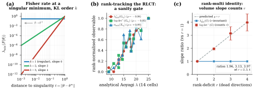
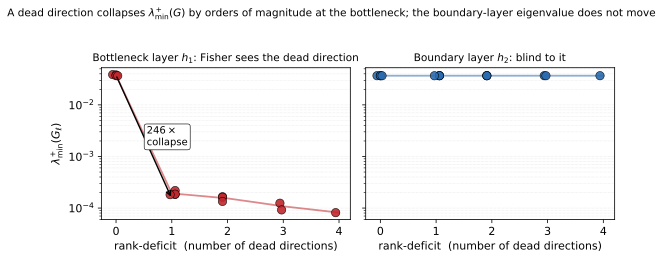
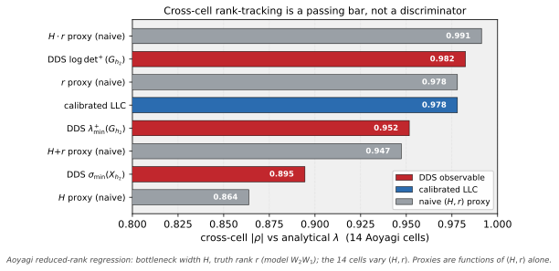
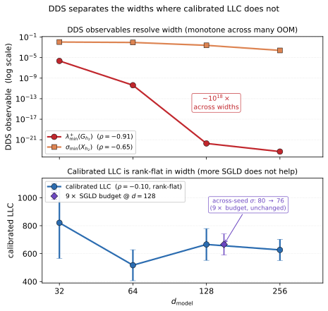
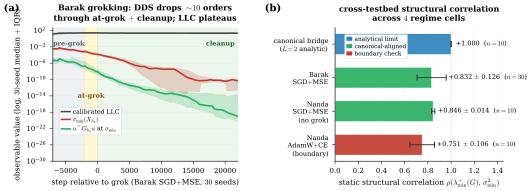
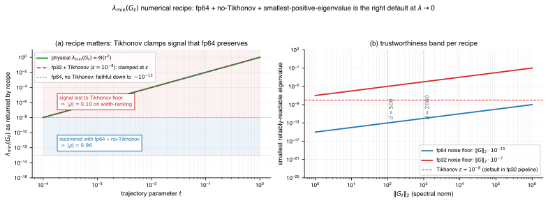
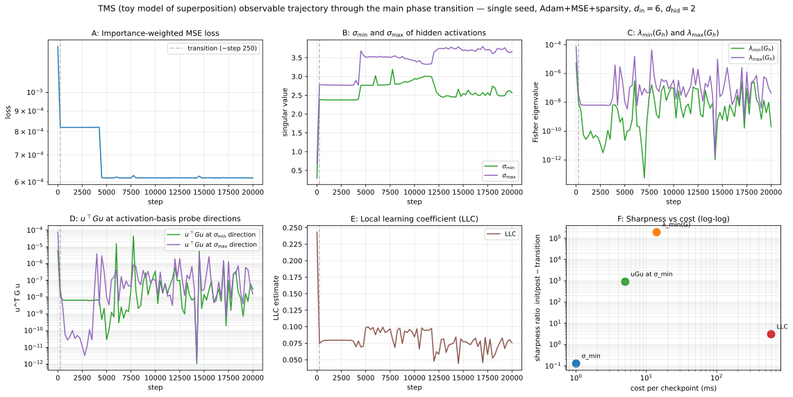
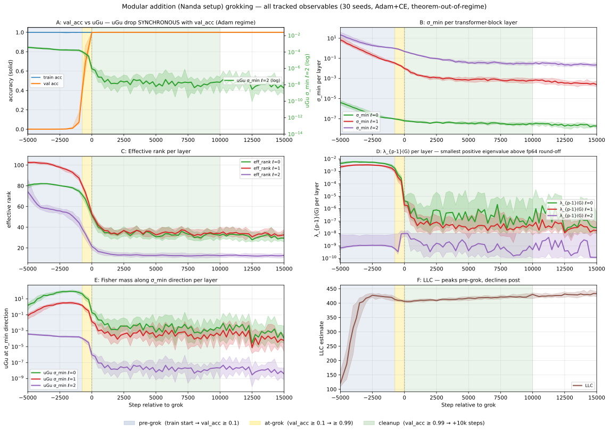
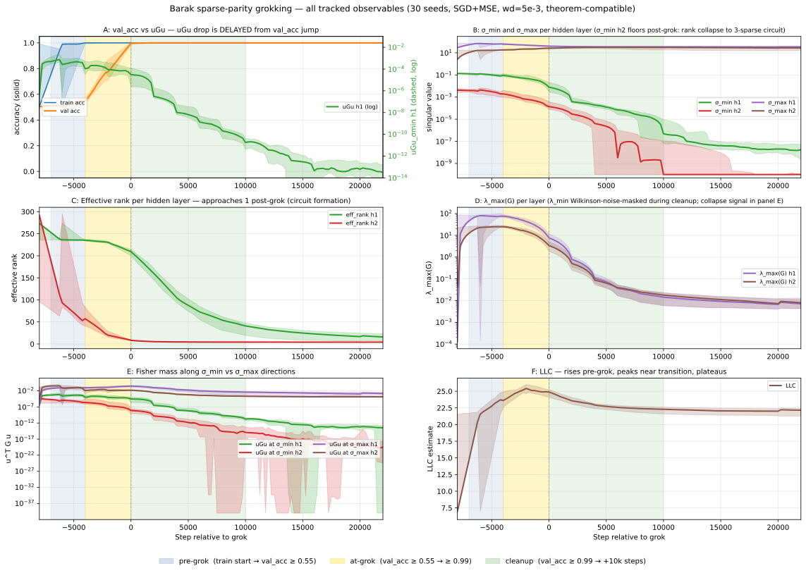

# Dead-Direction Signatures: A Cheap Spectral Reading of Singular Complexity

Tejas Pradeep Shirodkar Affiliation: IIIT, Hyderabad Email: tejas.shirodkar@research.iiit.ac.in P. J. Narayanan Affiliation: IIIT, Hyderabad Email: pjn@iiit.ac.in

## Abstract

Singular learning theory characterises the complexity of a deep network through the geometry of its loss singularities. The local learning coefficient (LLC), the standard estimator of Watanabe’s real log canonical threshold (RLCT, $\lambda$), reads this geometry as an integrated Bayesian scalar through SGLD, which needs per-task calibration and $10^{4}$-$10^{6}$ forward-backward passes per checkpoint. We introduce *Dead-Direction Signatures* (DDS), a family of cheap closed-form spectral readings of singular structure: each reads a network’s activation matrix or per-sample-gradient Fisher-Gram at a chosen layer, replacing the SGLD posterior chain with spectral linear algebra. The readings rest on a dead-direction framework that predicts a structural correlation between activation- and Fisher-side spectra at any singular minimum, and a rank-multiplicative volume identity that single-eigenvalue monitors cannot produce: the active-volume $\log\det^{+}(G)$ slope counts the dead directions, tracking the rank-deficit $r$ across $r\in\{1,2,3,4\}$ (slope ratios $2.0,3.1,4.0$ at $r{=}2,3,4$ against the predicted $2,3,4$), where the smallest eigenvalue is rank-blind. On reduced-rank regression with closed-form $\lambda$, calibrated LLC recovers $\lambda$ at $99\%$ mean and the DDS observables rank-track it at the framework-predicted sign; on a non-linear modular-addition transformer DDS separates $d_{\mathrm{model}}$ across eighteen orders of magnitude where calibrated LLC at the protocol budget is rank-flat. Complementary to LLC’s integrated posterior reading, DDS gives a directional, layer-local handle on a network’s dead directions, read in closed form from its activation and gradient spectra.

## 1 Introduction

*Figure 1: **Dead-Direction Signatures (DDS): the dead-direction primitive and how DDS reads it. (a) The framework’s central object: at a singular minimum with KL order $k$, the smallest Fisher eigenvalue decays as $\lambda_{\min}(F)=\Theta(t^{2(k-1)})$ along a dead direction; $k{=}1$ is regular (rate $0$), $k{=}2,3$ are degenerate (rates $2,4$). (b) Rank-tracking on closed-form RLCT ground truth (§4.1): on the $14$-cell Aoyagi 2005 anchor each rate-chain DDS observable rank-tracks the analytical Watanabe RLCT $\lambda$ with the framework-predicted sign at $|\rho|\geq 0.89$ ($\rho{=}{-}0.98$ for $\lambda_{\min}^{+}$, $-0.95$ for $\log\det^{+}$, $+0.89$ for $\sigma_{\min}$). This cross-cell rank-correlation is a sanity gate: a naive $H{\cdot}r$ proxy clears it too (Fig. 3). (c) The discriminating test, the rank-multiplicative volume identity (§4.2): the $\log\det^{+}(G)$ slope ratio (vs $r{=}1$) counts the dead directions, tracking the rank-deficit across $r\in\{1,2,3,4\}$ ($1.96,3.13,3.97$ at $r{=}2,3,4$ against the predicted $2,3,4$) while $\lambda_{\min}^{+}(G)$ stays rank-invariant; per-cell and per-layer detail in Fig. 4. Single-rank spectral observables are rank-blind to this identity by construction.*** **[p. 2]**

Singular learning theory locates the complexity of a deep network in the local geometry of its loss-singular set: the real log canonical threshold (RLCT) is the leading invariant, and it has been argued to be the right complexity measure on overparameterised models (Watanabe 2009; Watanabe 2018). In the empirical literature, the local learning coefficient (LLC; Lau et al. 2025) has emerged as the canonical estimator of Watanabe’s RLCT in practice, the established choice for cross-model complexity ranking, posterior-Bayesian readings of singular structure, and developmental-stage detection during training (§2.1). It is also expensive: LLC requires $10^{4}$–$10^{6}$ forward–backward passes per checkpoint via SGLD sampling, an offline budget at LLM scale and a substantial cost even on parametric singular models.

We give a complementary readout. The framework of Shirodkar 2026 derives a directional Fisher decay rate at any singular minimum: along a dead direction of KL order $k$, the directional Fisher decays as $\Theta(t^{2(k-1)})$ along the parametric approach. The selection rule (Theorem 3) makes the bridge to Watanabe’s RLCT (denoted $\lambda$) explicit: the rate exponent $2(k-1)$ recovers the directional RLCT contribution $1/(2k)$ on smooth singular fibres, in original parameter coordinates, without resolution of singularities. From this primitive a cluster of cheap spectral observables follows, drawn from two natural matrices at each layer $\ell$: the activation matrix **[p. 2]** $X_{\ell}\in\mathbb{R}^{N\times h}$ (rows are per-sample post-activation hidden states, $N$ samples by hidden width $h$), and the per-sample-gradient Fisher-Gram $G_{\ell}\in\mathbb{R}^{h\times h}$ (the empirical covariance of layer-$\ell$ gradients). The DDS observables are, by framework role: the *rate* observable $\lambda_{\min}^{+}(G_{\ell})$ (smallest positive Fisher-Gram eigenvalue, predicted by the Fisher decay theorem); the *volume* observable $\log\det^{+}(G_{\ell})$ (active-spectrum log-volume, the curvature–volume class); and the *activation-side dual* $\sigma_{\min}(X_{\ell})$ (the A–G dual of the rate observable, with layer-dependent sign). All three are framework-derived: the framework predicts a sign and an order of vanishing for each at any singular minimum. We collect these as *Dead-Direction Signatures* (DDS): a forward-pass-cheap reading of singular structure off a network’s activations and Fisher-Gram matrices in closed form. The four framework results we invoke (Fisher decay, selection rule + RLCT recovery, multi-layer KFAC bridge with A–G duality, curvature–volume rate chain) are restated with compact proof sketches in App. B.2, so the empirical claims below can be checked against an explicit derivation without opening the theory paper.

Three tests put pressure on different parts of the DDS claim; the contributions below carry the headline numbers and §4 the full protocols. The throughline separates the *discriminating* tests, the detection and rank-deficit counting that single-eigenvalue monitors cannot run, from the cross-cell rank-tracking against closed-form RLCT that turns out to be a sanity gate a naive capacity proxy also clears; a static structural correlation then adds a cross-testbed robustness reading, and an off-the-anchor probe carries DDS to one non-linear transformer where the structural sign survives but the trajectory rate breaks.

DDS trades LLC’s posterior chain for closed-form spectral reads. Calibrated LLC needs per-task SGLD calibration and a posterior chain per checkpoint ($4{,}400$ forward–backward passes at our operating budget; the literature recommends $10^{4}$–$10^{6}$). The activation-side $\sigma_{\min}(X_{\ell})$ is one forward pass and an SVD, the cheap real-time read; the Fisher-side $\lambda_{\min}^{+}(G_{\ell})$ and $\log\det^{+}(G_{\ell})$ assemble the per-sample-gradient Fisher-Gram and take an $O(h^{3})$ eigendecomposition, orders of magnitude below an LLC chain on the parametric testbeds but the costliest DDS read as width climbs. The structural correlation closes that gap at scale, recovering the Fisher-side ordering from $\sigma_{\min}^{2}$ at activation-side cost (§4).

#### Contributions.

**[p. 3]**

1. **Detection and rank-deficit counting, the framework’s discriminating tests.** At a layer carrying a dead direction the smallest positive Fisher-Gram eigenvalue $\lambda_{\min}^{+}(G)$ collapses by orders of magnitude ($\sim\!246\times$ at the bottleneck on the closed-form anchor, while the dimension-fixed boundary layer stays flat), detecting and localising it from a single backward pass. The active Fisher-volume $\log\det^{+}(G_{\ell})$ then *counts* the dead directions: its slope scales linearly in the rank-deficit $r$ while $\lambda_{\min}^{+}(G_{\ell})$ is $r$-invariant (Prop. 8 multi-direction generalisation). Across $7$ noisy-bridge configurations ($L\in\{4,6,8\}$, $D\in\{20,50\}$, full and mini-batch SGD, $5$ seeds, $r{=}1..4$) the $\log\det^{+}$ slope ratio tracks the rank-deficit (cell-wise means $2.0,3.1,4.0$ at $r{=}2,3,4$ against the predicted $2,3,4$), a strict prefactor-free identity invisible to single-rank spectral monitors (§4.2, §4.1).
2. **Closed-form RLCT ground truth, with the cross-cell rank-correlation as a sanity gate.** On the Aoyagi 2005 anchor (analytical $\lambda$ over $[9,25]$), a target-$\lambda$-calibrated LLC recovers $\lambda$ at $99\%$ mean and DDS rate-chain observables rank-track $\lambda$ at $|\rho|\in[0.95,0.98]$ with the predicted sign; but calibrated LLC ($+0.98$) and a naive $H{\cdot}r$ capacity proxy ($+0.99$) clear the same bar, so the cross-cell correlation is a sanity gate, not a discriminator. On the $24$-cell Aoyagi 2024 deep-linear sweep $\lambda$ is constant above saturation ($200=d^{2}/2$); DDS observables track that constancy while locked-config LLC reads the drifting local-LLC at $w^{\star}$, distinct from the global RLCT (Lau et al. 2025) (§4.1, App. B.6).
3. **Off-the-anchor extension and a cross-testbed robustness reading.** On a Nanda modular-addition width sweep at AdamW$+$CE ($101$ of $120$ grokked cells, $4$ widths $\times\,30$ seeds) DDS observables span $5$–$15$ orders of magnitude and stay sign-coherent at $|\rho|\in[0.62,0.96]$ vs $d_{\mathrm{model}}$, where calibrated LLC at the protocol budget is rank-flat and a $9\times$ SGLD budget leaves it flat. The static structural correlation $\lambda_{\min}^{+}(G_{\ell})\propto\sigma_{\min}(X_{\ell})^{2}$ holds at $\rho\geq+0.83$ on canonical-aligned testbeds (Barak post-grok SGD$+$MSE; Nanda SGD$+$MSE no-grok), $\rho{=}{+}1.000$ on the analytic $L{=}2$ bridge, and $\rho{=}{+}0.75$ at the AdamW$+$CE boundary (true-MC Fisher), where the trajectory-rate prediction fails but the static sign survives. The transformer probe here is single-architecture / single-task, with broader transformer coverage left as open empirical work (§4.3, §4.4, App. C).

#### Scope.

DDS is validated on parametric singular models with closed-form RLCT and one non-linear transformer width sweep. The directional Fisher-decay theorem and the selection rule are imported from the theory paper as cited prior results; calibrated LLC remains the canonical estimator for the posterior-Bayesian readings (singular fluctuations, WAIC, developmental-stage plateaus) that DDS does not provide.

## 2 Background and notation

For an analytic statistical family $\{p_{\theta}\}$ with Fisher information $F(\theta)$ and $p_{\theta_{0}}=p^{*}$, the singular set $\Sigma=\{\theta:\det F(\theta)=0\}$ is where $F$ loses rank. Singular learning theory (Watanabe 2009) shows minima of $K(\theta):=\mathrm{KL}(p^{*}\|p_{\theta})$ in singular models lie on $\Sigma$, and that $K$ vanishes along a unit direction $u$ at $\theta_{0}$ at a rate controlled by an integer KL order $k\geq 1$: $K(\theta_{0}+tu)=c\,t^{2k}+O(t^{2k+1})$. *Reading $k$:* $k{=}1$ is an ordinary quadratic minimum (Fisher full rank along $u$, the regular case); $k{=}2$ is a quartic-flat dead direction along which $F$ vanishes as $\Theta(t^{2})$; larger $k$ means flatter, more degenerate. The rate exponent $2(k-1)$ thus controls how fast $F$ collapses as the parameter approaches the singular minimum along $u$. The RLCT $\lambda$ decomposes into a directional $1/(2k)$ contribution from the transversal dead direction plus a tangential term; the selection rule (Thm. 3) recovers that $1/(2k)$ piece from our rate exponent $2(k-1)$ in original coordinates, with the full normal-form derivation in App. B.2.

For a layer with weights $W_{\ell}$, the KFAC factorisation (Martens and Grosse 2015) gives $F_{\ell}\approx A_{\ell}\otimes G_{\ell}$ with $A_{\ell}:=\mathbb{E}[X_{\ell-1}X_{\ell-1}^{\top}]$ and $G_{\ell}:=\mathbb{E}[\delta_{\ell}\delta_{\ell}^{\top}]$; thus $\lambda_{\min}(F_{\ell})=\lambda_{\min}(A_{\ell})\,\lambda_{\min}(G_{\ell})$. We use $A_{\ell},G_{\ell}$ as canonical names. Other recurring symbols: $L$ depth, $\ell$ layer index, $h$ hidden width; $X_{\ell}\in\mathbb{R}^{N\times h}$ activation matrix; $u$ dead direction (Def. 1).

### 2.1 Related work

#### Singular learning theory and LLC.

Watanabe’s singular learning theory (Watanabe 2009; Watanabe 2018) locates the complexity of an overparameterised model in the local geometry of its loss-singular set, **[p. 4]** with the real log canonical threshold (RLCT) as the leading invariant. The local learning coefficient (LLC; Lau et al. 2025) is the canonical empirical estimator: SGLD sampling on the posterior near a singular minimum recovers Watanabe’s RLCT in practice. LLC has been extended to track developmental phase transitions during training (Hoogland et al. 2024) and to decompose into per-component restricted-LLC (Wang et al. 2025). We position DDS as a complementary readout on the same singular structure: where LLC integrates over the local posterior to return a Bayesian-WBIC-anchored quantity, DDS reads the spectra of the activations and Fisher-Gram in closed form at a single checkpoint. The two approaches answer different questions about the same singular geometry, and the cost ordering (the activation-side $\sigma_{\min}$ orders of magnitude below calibrated LLC per checkpoint on the testbeds here) lets DDS run at scales and cadences SGLD cannot match.

#### Closed-form RLCT lineage.

Aoyagi and Watanabe’s closed-form RLCT formulas for reduced-rank regression (Aoyagi and Watanabe 2005) and the recent extension to deep-linear nets (Aoyagi 2024) provide ground-truth $\lambda$ values on parametric singular families, enabling validation against analytical RLCT rather than another estimator. The selection rule of Shirodkar 2026 (Thm. 3) is the formal bridge from our directional Fisher exponent to Watanabe’s RLCT: the rate $2(k-1)$ recovers the directional contribution $1/(2k)$ on smooth singular fibres in original parameter coordinates without resolution of singularities. Our use of Aoyagi-style closed-form RLCT testbeds in §4.1 is the empirical anchor for this bridge.

#### Spectral monitoring on activations and weights.

A parallel line summarises activation- or Fisher-side spectra as generalisation-correlated signatures: participation ratio on FFN activation covariances (Jha and Reagen 2026), streaming spectral entropy and top spectral gap on windowed activations (Ettori et al. 2025), the normalised Shannon entropy of Khanh et al. 2026, and the parameter-update top consecutive-singular-value ratio of Xu 2026. Marchenko–Pastur deviations on pretrained weights (Staats et al. 2024) and rank-collapse on pure-attention chains (Dong et al. 2021; Noci et al. 2022) read the same spectra at still other points; Boix-Adsera et al. 2023 report training-trajectory rank evolution, a different object from the singular-minimum rank deficit DDS targets. DDS reads the Fisher-Gram bottom directly through the rate-chain observables ($\lambda_{\min}^{+}(G)$, $\log\det^{+}(G)$) and the activation-side dual $\sigma_{\min}(X_{\ell})$, with framework-derived sign and per-layer prescription tied to the directional RLCT contribution $1/(2k)$ via the Fisher decay theorem and A–G duality (Theorem 2, full proof App. A). The prior signatures correlate spectra with generalisation, and we report them as complementary observation points without a quantitative head-to-head. Random-matrix characterisations of the Fisher / Hessian spectrum at large width (Pennington and Worah 2018; Karakida et al. 2019; Karakida et al. 2021) address the bulk at random init under mean-field or Gaussian-entry assumptions; the DDS observables read the trained-checkpoint bottom spectrum at a chosen layer, used both as static per-checkpoint structural identities and as directional rates along the singular-minimum approach. We use random-matrix arguments defensively for the $n/d$ calibration of the measurement protocol.

#### Algebraic dead directions in LayerNorm.

An instantiation of the same dead-direction framework gives the cheapest read of the primitive: for LayerNorm models the dead direction is fixed algebraically by the normalization affine, $v^{\star}=\gamma^{-1}/\|\gamma^{-1}\|$, recoverable from the layer parameter with no forward pass (Shirodkar and Narayanan 2026). That algebraic read is exact for LayerNorm models. DDS’s spectral observables ($\sigma_{\min}(X_{\ell})$, the Fisher-Gram spectrum) are architecture-general and read the same primitive at a forward-pass or Fisher cost, two points on a cost–generality spectrum for the same dead-direction object.

#### KFAC and the Fisher estimand.

Our measurement protocol uses the KFAC factorisation (Martens and Grosse 2015; Grosse and Martens 2016; Eschenhagen et al. 2023) with the Fisher estimand matched to the task: the empirical (true-label) Fisher on the MSE testbeds, where it coincides with the model Fisher at the minimum, and the true-MC (model-sampled) Fisher on the cross-entropy testbed, where the empirical Fisher is an unreliable proxy (Kunstner et al. 2019) that collapses at zero loss. George et al. 2018 introduced the eigenbasis variant. The KFAC factorisation’s analytical use (the A–G duality, Cor. 25) is established in Shirodkar 2026; we use it as a measurement primitive only.

**[p. 5]**

## 3 The structural correlation

At any singular minimum the activation-side and Fisher-side bottoms of the spectrum vanish together at a predictable ratio. The coupling is the single structural prediction DDS rests on, stated below. The supporting framework (Fisher decay theorem, selection rule, multi-layer KFAC bridge, A–G duality) lives in the theory paper and is used here as a cited prior.

##### **Definition 1**(Dead direction)**.**

*A unit direction $u\in\mathbb{R}^{d}$ is a *dead direction* at $\theta_{0}$ if $u^{\top}F(\theta(t))u\to 0$ as $t\to 0$ along $\theta(t):=\theta_{0}+tu$. The KL order along $u$ is the integer $k\geq 1$ with $K(\theta(t))=c\,t^{2k}+O(t^{2k+1})$, $c>0$. (Unrelated to the activation-level “dead ReLU” phenomenon despite the lexical overlap.)*

##### **Theorem 2**(Structural correlation between Fisher and activation spectra)**.**

*At any singular minimum of an $L$-layer network with KFAC-decomposable Fisher information $F_{\ell}\approx A_{\ell}\otimes G_{\ell}$, along a canonical-aligned approach $\theta(t)$ to the minimum:*

$$
\lambda_{\min}^{+}(G_{\ell}(\theta(t)))\;=\;\Theta(t^{2(L-\ell)}),\qquad\sigma_{\min}(X_{\ell}(\theta(t)))^{2}/N\;=\;\Theta(t^{2\ell}),
$$

*at every layer $\ell$. Both quantities vanish as $t\to 0$ as positive powers of $t$, so they are co-monotonic along the approach and the Spearman rank correlation between them tends to $+1$ in the asymptotic regime.*

##### Sketch.

By the multi-layer KFAC bridge (Theorem 21 of the theory paper), the smallest non-zero eigenvalue of the Fisher-Gram at layer $\ell$ satisfies $\lambda_{\min}^{+}(G_{\ell}(\theta(t)))=\Theta(t^{2(L-\ell)})$ along a canonical-aligned approach. By the A–G duality corollary (Cor. 25), the activation-side dual is $\lambda_{\min}(A_{\ell+1}(\theta(t)))=\Theta(t^{2\ell})$, and $\sigma_{\min}(X_{\ell})^{2}/N\to\lambda_{\min}(A_{\ell+1})$ almost surely by the strong law (the rows of $X_{\ell}$ are iid under the Gaussian-isotropic input assumption of Theorem 2). Both Fisher and activation bottoms are positive powers of $t$ with strictly positive exponents; rank correlation between any two such monotone trajectories tends to $+1$ in the asymptotic limit. Full proof in App. A. ∎

The three DDS observables (smallest activation singular value $\sigma_{\min}(X_{\ell})$, smallest positive Fisher-Gram eigenvalue $\lambda_{\min}^{+}(G_{\ell})$, log-volume $\log\det^{+}(G_{\ell})$) read this coupled geometry from the activation or the gradient side. §4 validates the correlation across regime cells, with a deterministic limit on the analytic $L{=}2$ bridge and a boundary check on AdamW$+$CE where canonical alignment is violated.

## 4 Experiments

DDS detects a dead direction and counts how many directions are dead, two reads a single-eigenvalue monitor cannot give. §4.1 pins detection and rank-tracking to closed-form RLCT ground truth, where the cross-cell rank-correlation turns out to be a sanity gate that even a naive capacity proxy clears. §4.2 is the discriminating quantitative test, the counting identity. §4.3 carries the observables off the anchor to a non-linear transformer at AdamW$+$CE, and §4.4 reports the static structural correlation as a robustness reading. Tab. 1 summarises the per-testbed Spearman $\rho$; per-claim assumptions and validation loci are in App. B.1.

*Table 1: DDS observables on three testbeds, with framework role and cross-cell Spearman $\rho$ vs ground-truth complexity (Aoyagi $\lambda$ on the closed-form testbeds; $d_{\mathrm{model}}$ on Nanda). Role: *rate* (Fisher decay theorem), *vol* (active-spectrum log-volume / curvature class), *dual* (A–G duality, layer-dependent sign by construction). All three observables are framework-derived: the framework predicts a sign at the dimension-fixed boundary layer for each. On the DLN sweep the analytical $\lambda$ is constant above saturation (in both $h$ and rank deficit), so its column is a tied-rank artifact ($\rho\approx 0$); that sweep tests constancy and the local-vs-global LLC distinction. Per-cell hyperparameters and reproducibility notes in App. B.6.* **[p. 6]**

| Observable | Role | Aoyagi | DLN | Nanda |
|---|---|---|---|---|
|  |  | ($14$ cells) | ($24$ cells; $\lambda$ const.) | ($n{=}101$) |
| $\lambda_{\min}^{+}(G)$ | rate | $-0.98$ | $-0.06$ | $-0.88$ |
| $\log\det^{+}(G)$ | vol | $-0.94$ | $-0.09$ | $-0.97$ |
| $\sigma_{\min}(X_{\ell})$ | dual | $+0.89$ | $-0.21$ | $-0.65$ |

### 4.1 Closed-form RLCT anchor (Aoyagi reduced-rank regression)

If DDS tracks Watanabe’s RLCT, the first thing to demand is agreement with the analytical $\lambda$ where ground truth is closed-form. Reduced-rank regression (RRR) is the canonical singular family with closed-form RLCT: it factors a teacher matrix $M^{\star}\in\mathbb{R}^{N\times M}$ of rank $r$ through a hidden bottleneck of width $H$, so the trained model is $W_{2}W_{1}$ with $W_{1}\in\mathbb{R}^{H\times M}$, $W_{2}\in\mathbb{R}^{N\times H}$. The Aoyagi–Watanabe closed form (Aoyagi and Watanabe 2005) gives the RLCT $\lambda$ as a function of $(M,N,H,r)$ alone (input dim $M$, output dim $N$, bottleneck $H$, truth rank $r$), providing analytical ground truth against which any RLCT estimator can be calibrated. Our *Aoyagi 2005 anchor* fixes $M{=}10,N{=}5$ and sweeps $H\in\{2,3,4,5\}$ and $r\in\{1,\ldots,\min(N,H)\}$, giving $14$ realisable cells (truth rank $\leq$ model capacity) at $\lambda\in[9,25]$. The *Aoyagi 2024 deep-linear net* (DLN) sweep (Aoyagi 2024) extends this to a $3$-matrix product $W_{3}W_{2}W_{1}$ with shared input/output dim $d{=}20$ and hidden width $h\in\{16,20,24,32,64,128\}$; the truth rank is $20-\mathrm{rd}$ where the *rank deficit* $\mathrm{rd}\in\{1,2,3,4\}$ count**[p. 6]** s how many directions the truth is degenerate in. The *saturation threshold* is $h\geq\mathrm{rank}(M^{\star})$: at and above it the model has enough capacity to express the truth and the closed-form RLCT becomes provably independent of $h$, fixed by the truth’s rank alone. With $d{=}20$, the $h\in\{20,24,32,64,128\}$ cells sit at or above saturation across all $\mathrm{rd}$; the $h{=}16$ cell sits below it for $\mathrm{rd}<4$. The constancy-in-$h$ comparison below uses the above-saturation cells, where the analytical RLCT is constant by design; the unrealisable $h{=}16,\mathrm{rd}<4$ subset is excluded from the constancy claim. Calibrated LLC is retrofitted on every cell with a locked SGLD config (per-testbed $5\times 5$ grid + $9\times$ saturation gate); see App. B.6 for the lock procedure.

*Figure 2: **A dead direction collapses the Fisher-Gram eigenvalue at the bottleneck. On the Aoyagi 2005 reduced-rank-regression anchor ($14$ cells, $\sigma{=}0.1$), the smallest positive Fisher-Gram eigenvalue $\lambda_{\min}^{+}(G)$ at the bottleneck layer $h_{1}$ drops $\sim\!246\times$ the instant a dead direction is present (rank-deficit $\geq 1$), while at the dimension-fixed boundary layer $h_{2}$ it stays flat to $0.3\%$. The collapse detects the dead direction and localises it to the bottleneck, read from a single backward pass.*** **[p. 6]**

Detection comes first. At the bottleneck layer the smallest positive Fisher-Gram eigenvalue $\lambda_{\min}^{+}(G)$ collapses $\sim\!246\times$ the instant a dead direction is present, while the dimension-fixed boundary layer stays flat to $0.3\%$ (Fig. 2); the collapse is one backward pass, and it localises the dead direction to the bottleneck. The magnitudes are trustworthy against the closed form: under a target-$\lambda$ SGLD calibration, calibrated LLC recovers the analytical $\lambda$ at $99\%$ mean across the $14$ cells (App. B.5). *Cross-cell rank-tracking is a sanity gate.* The rate-chain observables $\lambda_{\min}^{+}(G)$ and $\log\det^{+}(G)$ rank-track $\lambda$ at $|\rho|\in[0.95,0.98]$ on the dimension-fixed boundary layer with the framework-predicted sign, and $\sigma_{\min}(X_{\ell})$ reads the truth-rank at $\rho=+0.89$; but calibrated LLC ($+0.98$) and a naive $H{\cdot}r$ capacity proxy ($+0.99$) clear the same bar (Fig. 3), so the cross-cell correlation is a passing bar every complexity-monotone observable meets, not a discriminator (the rankings hold across a $4\times$ $\sigma$-noise range, App. B.6). On the Aoyagi 2024 DLN sweep, $\lambda$ is constant in $h$ above saturation and DDS observables track that constancy, while calibrated LLC at the locked-config budget reads the local-LLC at the trained $w^{\star}$, which Lau et al. 2025 distinguish from the global RLCT.

*Figure 3: **The cross-cell rank-correlation is a sanity gate, not a discriminator. On the Aoyagi 2005 anchor ($14$ cells), every complexity-monotone observable clears the cross-cell $|\rho|$ against the analytical $\lambda$: the DDS observables, calibrated LLC, and a naive $H{\cdot}r$ capacity proxy, which in fact scores highest ($0.99$). The discriminating evidence is the rank-multiplicative volume identity (Fig. 4), which the proxy and single-eigenvalue monitors cannot reproduce. $H$ is the bottleneck width, $r$ the truth rank.*** **[p. 7]**

**[p. 7]**

### 4.2 Rank-multiplicative volume identity (discriminating test)

Sign and rank-correlation tests are a passing bar; the discriminating test is a quantitative identity any monotone observable would fail. The framework provides one: at a singular minimum with rank-deficit $r$, $\log\det^{+}(G_{\ell})$ slope scales linearly in $r$ while $\lambda_{\min}^{+}(G_{\ell})$ slope is $r$-invariant (Prop. 8 multi-direction generalisation). The slope at rank-deficit $r$ is $r$ times the rank-$1$ slope, with no free prefactor. Single-eigenvalue spectral monitors are rank-blind to this identity by construction.

*Figure 4: **The volume observable counts dead directions; the smallest eigenvalue cannot. (A) Normalised descent of $\log\det^{+}(G_{\ell})$ toward the singular set at an interior layer (deep-linear noisy bridge, $L{=}4$, $D{=}20$, layer $h_{1}$), for rank-deficit $r{=}1,\dots,4$: the slope fans to $1\times/2\times/3\times/4\times$ the rank-$1$ slope ($6.9/13.8/21.0/27.8$). (B) The smallest positive eigenvalue $\log\lambda_{\min}^{+}(G_{\ell})$ descends at the same rate for every $r$ (rank-blind, slopes $\approx 7$). (C) Across $7$ noisy-bridge configurations $\times$ layers ($L\in\{4,6,8\}$, $D\in\{20,50\}$, full and mini-batch SGD, $5$ seeds, $r{=}1..4$), the $\log\det^{+}$ slope ratio tracks the rank-deficit (means $2.0,3.1,4.0$ at $r{=}2,3,4$ against the predicted $2,3,4$) while the $\lambda_{\min}^{+}$ ratio stays at $1$. The ratio is a strict, prefactor-free identity; a single-eigenvalue monitor is rank-blind to it by construction.*** **[p. 7]**

We measure across $7$ noisy-bridge configurations ($L\in\{4,6,8\}$, $D\in\{20,50\}$, full and mini-batch SGD, $\sigma{=}0.1$, $5$ seeds each), running each trajectory at rank-deficit $r{=}1,\dots,4$ ($M^{\star}=\mathrm{diag}(1,\ldots,1,0,\ldots)$ with the last $r$ entries zero). Cells use depth-controlled init $t_{0}(L)=(1/16)^{1/L}$ to hold the initial dead-direction product $t_{0}^{L}=1/16$ constant across $L$, isolating the rate prediction from the asymptotic-regime accessibility (Rem. 11). The $\log\det^{+}$ slope ratio tracks the rank-deficit across all four ranks (Fig. 4): cell-wise means $2.0,3.1,4.0$ at $r{=}2,3,4$ against the predicted $2,3,4$, the $r{=}2$ ratio inside the $\pm 10\%$ falsification band, while the matching $\lambda_{\min}^{+}$ **[p. 8]** slopes stay $r$-invariant (rate-chain $\rho{=}0.985$). Per-cell and per-layer breakdowns are in App. B.8.2.

### 4.3 Off-the-anchor extension on a non-linear transformer

The closed-form anchor pins DDS to ground truth in the canonical-aligned regime; the natural next question is what survives off it. We run the same observables on a non-linear architecture trained with AdamW$+$CE, where the canonical-alignment hypothesis is violated. This is the cleanest single-axis stress test. We use the Nanda modular-addition setup (Nanda et al. 2023) at $d_{\mathrm{model}}\in\{32,64,128,256\}$ ($30$ seeds per width, $101$ of $120$ grokked) under AdamW$+$CE, with per-width SGLD calibration locked via a $5\times 5$ grid plus $9\times$ saturation gate. The framework predicts (Theorems 2, 9, 25): wider model $\to$ more degenerate Fisher $\to$ smaller $\lambda_{\min}^{+}(G)$, more negative $\log\det^{+}(G)$, smaller $\sigma_{\min}$. Every DDS observable spans $5$–$15$ orders of magnitude across the four widths, remains monotone in $d_{\mathrm{model}}$, and is sign-coherent at $|\rho|\in[0.62,0.96]$, with $\log\det^{+}(G_{h_{2}})$ at the high end ($|\rho|{=}0.965$, $35\%$ rel-std). Calibrated LLC at the protocol $4{,}400$-step budget is rank-flat on the same sweep ($\rho{=}{-}0.07$), and a $9\times$-budget re-run does not lift it (App. B.6). The dynamic range and sign-coherence are what the $4$-distinct-widths setup can test; the cross-cell Spearman has heavy tied-rank dependence, and this is one architecture on one task. Broadening the rate and structural-correlation reads (attention-only chains, deeper transformers, more widths, other algorithmic tasks) is open empirical work.

*Figure 5: **DDS separates the widths where calibrated LLC does not. Nanda modular-addition width sweep (AdamW$+$CE, $101$ grokked cells of $4$ widths $\times\,30$ seeds). (Top) DDS observables descend monotonically with $d_{\mathrm{model}}$: $\lambda_{\min}^{+}(G)$ spans $\sim\!10^{18}$ ($\rho{=}{-}0.91$), $\sigma_{\min}$ is monotone ($\rho{=}{-}0.65$). (Bottom) Calibrated LLC at the $4{,}400$-step protocol budget is rank-flat ($\rho{=}{-}0.10$); a $9\times$ SGLD budget at $d{=}128$ leaves the across-seed spread essentially unchanged ($\sigma\,80\to 76$), pinning the flatness to per-seed initialisation variance rather than an under-sampled chain.*** **[p. 8]**

### 4.4 Static structural correlation (robustness reading)

*Figure 6: **DDS resolves singular structure dynamically; the static identity holds across regime cells. (a) Barak sparse-parity grokking trajectory ($30$ seeds, SGD$+$MSE, $240$k steps; $30$-seed median $+$ IQR band). Through the val_acc-anchored phases (pre-grok, at-grok, cleanup) the activation-side $\sigma_{\min}(X_{h_{2}})$ drops $\sim\!7$ orders and the Fisher-side $u^{\top}G_{h_{2}}u$ at the dead direction drops $\sim\!14$ orders, while calibrated LLC (top trace) plateaus. (b) Static structural correlation $\rho(\lambda_{\min}^{+}(G),\sigma_{\min}^{2})$ across $4$ regime cells (canonical bridge, Barak SGD$+$MSE, Nanda SGD$+$MSE no-grok, Nanda AdamW$+$CE; per-cell $\rho$ and seed counts in the text and Tab. 1). All four read at $\rho\geq{+}0.75$, the AdamW$+$CE cell a boundary check at the canonical-alignment violation.*** **[p. 9]**

The static structural identity $\lambda_{\min}^{+}(G_{\ell})\propto\sigma_{\min}(X_{\ell})^{2}$ couples the Fisher-side and activation-side spectra at any singular minimum (Theorem 21, Cor. 25; full proof in App. A). It supplies the same Fisher-side ordering as $\lambda_{\min}^{+}(G_{\ell})$ **[p. 9]** at activation-side cost, which matters at LLM widths where the Fisher-side full-spectrum is expensive (cost ordering below). The discriminating quantitative test lives on the volume side (§4.2); here we report the static identity as a robustness reading across testbeds. *Two canonical-aligned non-trivial testbeds.* $\rho=+0.832\pm 0.126$ on Barak sparse parity (Barak et al. 2022) SGD$+$MSE *Phase A* ($30$ seeds; post-grok descent into the singular minimum), and $\rho=+0.846\pm 0.014$ on the Nanda $1$-block transformer SGD$+$MSE no-grok cell ($10$ seeds). *Deterministic check.* On the analytic $L{=}2$ canonical bridge (linear, deterministic GF, MSE; $10$ seeds), $\rho=+1.000$, the analytical limit where $\rho$ reduces to algebra. The theorem predicts $\rho\to+1$ in the strict asymptotic limit; finite-$t$ deviations and finite-$N$ Marchenko–Pastur noise on $\widehat{A}_{\ell+1}$ shrink the observed correlation, and the ordering matches: deterministic at the limit, Barak loosened by finite $N/D\approx 2$ and the $30$-seed dispersion. *Boundary-of-applicability check.* Nanda $1$-block transformer AdamW$+$CE (groks; $10$ seeds, true-MC Fisher) gives $\rho=+0.751\pm 0.106$. On AdamW$+$CE the canonical-alignment hypothesis is violated (Adam’s diagonal preconditioner is non-equivariant under CE’s logit-shift symmetry; Rem. 80), so the trajectory-level prediction does not strictly apply; the residual coupling rests on the KFAC factorisation $F_{\ell}\approx A_{\ell}\otimes G_{\ell}$ at the singular minimum itself, independent of the optimiser. *Slope-2 prediction.* On Barak Phase A, $4$ of $5$ seeds give trajectory-rate slope $\bar{x}=2.06\pm 0.20$ ($R^{2}\in[0.87,0.97]$), agreeing with the noisy-bridge sweep (§4.2); higher $n/D$ compresses the geometric event below save-cadence resolution (App. B.8).

#### Cost ordering.

The four observables sit at different training-loop cadences. $\sigma_{\min}(X_{\ell})$ is one forward pass plus an SVD ($O(Nh^{2})$) and runs at *real-time* cadence at any width we tested. $u^{\top}Gu$ at a known direction is one FBP ($O(h)$), *checkpoint* cadence. The Fisher-side full-spectrum observables $\lambda_{\min}^{+}(G_{\ell})$ and $\log\det^{+}(G_{\ell})$ assemble the per-sample-gradient Fisher-Gram and take its $O(h^{3})$ eigendecomposition, *periodic* cadence on small models and *offline* at LLM width. Calibrated LLC’s $4{,}400$-FBP SGLD chain is offline at any scale we tested. On a Barak post-grok checkpoint ($h{=}500$), in wall-clock, the Fisher-side observables are $\sim\!300\times$ cheaper than calibrated LLC and $\sigma_{\min}$ is $\sim\!130\times$ cheaper (App. B.8.1). At LLM widths the ordering shifts: $\sigma_{\min}$ and $u^{\top}Gu$ scale roughly linearly in $h$ and stay cheap, while the Fisher-side eigendecomposition scales as $O(h^{3})$ and becomes the costliest DDS read. The structural correlation $\rho(\lambda_{\min}^{+}(G),\sigma_{\min}^{2})$ (§4.4) recovers the Fisher-side ordering through $\sigma_{\min}$ at activation-side cost; per-cadence recipes and per-width wall-clock numbers are in App. B.4.

**[p. 10]**

## 5 Discussion

#### What we showed.

DDS detects and counts dead directions through cheap closed-form spectral reads of a network’s activations and Fisher-Gram, complementary to calibrated LLC; the per-checkpoint cost ordering and how it shifts with width are in §4.

The three DDS observables read singular structure from complementary sides of the same per-layer object. $\sigma_{\min}(X_{\ell})$ reads activation rank-deficiency, $\lambda_{\min}^{+}(G_{\ell})$ reads gradient-Gram rank-deficiency, and $\log\det^{+}(G_{\ell})$ reads the active gradient-Gram log-volume. The framework’s structural correlation states that activation and gradient rank-deficiency reflect the same singular geometry coupled through the KFAC factorisation, which anchors the three observables to one another. The volume-side rank-multiplicative identity is the quantitative structural prediction this anchoring produces; it cannot be reduced to sign or rank correlation, and §4 bears this out as the discriminating test where the cross-cell rank-tracking is only a sanity gate.

#### Alternative explanations considered.

*(i) Calibrated-LLC width-flatness / drift is a budget artefact.* Ruled out by a $9\times$-larger SGLD budget at $d{=}128$ on the Nanda sweep: within-cell SGLD std falls $1.50\times$ but across-seed std falls only $1.05\times$, so per-seed initialisation variance dominates SGLD measurement variance at this calibration cell, and the drift on the DLN sweep is consistent with the App. I local-vs-global RLCT distinction (Lau et al. 2025) (App. B.6). *(ii) Transformer cross-architecture extension is contingent on grokking.* The sign-coherent $|\rho|\in[0.62,0.96]$ reading is on the $101$ grokked cells; whether DDS extends to non-grokked transformers remains open.

#### Where DDS applies and where it doesn’t.

*(a) Static observables apply at any singular minimum, conditional on one being present.* The three DDS readings are algebraic identities of the per-layer geometry; they are testbed-broad across every optimiser, loss, and architecture we tested. They go quiet on data without rank-deficient teachers or training that does not reach a singular minimum: there is nothing dead to read. The geometry is a property of the problem the network is solving. *(b) Trajectory rate-fits additionally require an actual descent.* The rank-multiplicative identity and the per-layer rate ladder need canonical alignment, a theorem-compatible preconditioner (SGD on $G$-invariant metrics), and the trajectory entering the asymptotic regime where $t\to 0$. The third precondition is data-and-training-dependent: a network that never settles into the singular minimum (training stopped short, regularisation absent, optimiser parked in a non-singular basin) leaves the rate undefined. *(c) Architectural reach tested.* The rank-multi identity is validated on $7$ noisy-bridge configurations; the transformer cross-architecture probe is one task on a single-block transformer with $4$ widths. Width sweeps on attention-only chains, deeper transformers, and other small-algorithmic tasks are open empirical work. *(d) Posterior-Bayesian summaries.* The local-posterior summaries (Watanabe’s multiplicity $m$, the singular fluctuation $\nu$, posterior-WAIC, and the developmental-stage trajectory plateaus (Hoogland et al. 2024)) integrate over the posterior and read a complementary slice of the same singular structure. *(e) Methodological caveats.* The dimension-fixed boundary layer prescription (App. B.6) was identified on the Aoyagi anchor and applied across the DLN sweep, the Nanda extension, and the structural-correlation testbeds; on architectures with no obvious bottleneck the rule must be tested before being trusted.

#### Falsifiers.

Three checks would force revision. *(F1)* An Aoyagi-anchor cell where rate-chain observables carry the wrong sign against $\lambda$; we find none across the $14$ cells where $\lambda$ varies. *(F2)* A canonical-aligned noisy-bridge cell at $L\geq 4$ where the $\log\det^{+}$ slope ratio at rank-deficit $r$ deviates from $r$ by more than $\pm 10\%$; across $r\in\{1,2,3,4\}$ the $7$ configurations read $1.96,3.13,3.97$ at $r{=}2,3,4$ against the predicted $2,3,4$. *(F3)* A canonical-aligned-regime architecture where $\rho(\lambda_{\min}^{+}(G_{\ell}),\sigma_{\min}(X_{\ell})^{2})$ across checkpoints reads $\leq 0$.

#### Outlook.

DDS gives the first directional, parameter-local handle on singular complexity. Three follow-ons sit close: rank-collapse pretraining monitors, LoRA placement along measured dead directions, and complexity ranking on architectures where SGLD calibration is impractical; further out, the same dead-direction reads should extend from $\lambda$ to the rest of the Watanabe triple ($m$, $\nu$) and WAIC without SGLD. Complementing LLC’s posterior readouts, singular complexity, until now an offline Bayesian invariant, gets a cheaper diagnostic that travels with the network it describes.

**[p. 11]**

## References

- M. Aoyagi. Consideration on the learning efficiency of multiple-layered neural networks with linear units. *Neural Networks*, 172:106132, 2024. URL https://doi.org/10.1016/j.neunet.2024.106132.

- M. Aoyagi and S. Watanabe. Stochastic complexities of reduced rank regression in Bayesian estimation. *Neural Networks*, 18(7):924–933, 2005. URL https://doi.org/10.1016/j.neunet.2005.03.014.

- B. Barak, B. L. Edelman, S. Goel, S. Kakade, E. Malach, and C. Zhang. Hidden progress in deep learning: SGD learns parities near the computational limit. In *NeurIPS*, 2022. URL https://arxiv.org/abs/2207.08799.

- E. Boix-Adsera, E. Littwin, E. Abbe, S. Bengio, and J. Susskind. Transformers learn through gradual rank increase. In *Advances in Neural Information Processing Systems (NeurIPS)*, 2023. URL https://arxiv.org/abs/2306.07042.

- Y. Dong, J.-B. Cordonnier, and A. Loukas. Attention is not all you need: pure attention loses rank doubly exponentially with depth. In *International Conference on Machine Learning (ICML)*, 2021. URL https://arxiv.org/abs/2103.03404.

- N. Elhage, T. Hume, C. Olsson, N. Nanda, T. Henighan, S. Johnston, S. E. Showk, N. Joseph, N. DasSarma, B. Mann, D. Hernandez, A. Askell, K. Ndousse, A. Jones, D. Drain, A. Chen, Y. Bai, D. Ganguli, L. Lovitt, Z. Hatfield-Dodds, J. Kernion, T. Conerly, S. Kravec, S. Fort, S. Kadavath, J. Jacobson, E. Tran-Johnson, J. Kaplan, J. Clark, T. Brown, S. McCandlish, D. Amodei, and C. Olah. Toy models of superposition. *Transformer Circuits Thread*, 2022. URL https://transformer-circuits.pub/2022/toy_model/index.html.

- R. Eschenhagen, A. Immer, R. E. Turner, F. Schneider, and P. Hennig. Kronecker-factored approximate curvature for modern neural network architectures. In *NeurIPS*, 2023.

- D. Ettori, N. Darabi, S. Tayebati, R. Krishnan, M. Subedar, O. Tickoo, and A. R. Trivedi. EigenTrack: Spectral activation feature tracking for hallucination and out-of-distribution detection in LLMs and VLMs. *arXiv:2509.15735*, 2025.

- T. George, C. Laurent, X. Bouthillier, N. Ballas, and P. Vincent. Fast approximate natural gradient descent in a Kronecker-factored eigenbasis. In *NeurIPS*, 2018.

- B. Ghorbani, S. Krishnan, and Y. Xiao. An investigation into neural net optimization via Hessian eigenvalue density. In *ICML*, 2019.

- R. Grosse and J. Martens. A Kronecker-factored approximate Fisher matrix for convolution layers. In *ICML*, 2016. URL https://arxiv.org/abs/1602.01407.

- H. Hironaka. Resolution of singularities of an algebraic variety over a field of characteristic zero. *Annals of Mathematics*, 79(1):109–326, 1964. URL https://www.jstor.org/stable/1970486.

- J. Hoogland, G. Wang, M. Farrugia-Roberts, L. Carroll, S. Wei, and D. Murfet. Loss landscape degeneracy and stagewise development in transformers. *Transactions on Machine Learning Research*, 2024. URL https://arxiv.org/abs/2402.02364.

- N. K. Jha and B. Reagen. NerVE: Nonlinear eigenspectrum dynamics in LLM feed-forward networks. *arXiv:2603.06922*, 2026.

- R. Karakida, S. Akaho, and S.-i. Amari. Universal statistics of Fisher information in deep neural networks: Mean field approach. In *AISTATS*, 2019.

- R. Karakida, S. Akaho, and S.-i. Amari. Pathological spectra of the Fisher information metric and its variants in deep neural networks. *Neural Computation*, 33(8):2274–2307, 2021.

- T. X. Khanh, T. Q. Hoa, L. D. Trung, and P. T. Duc. Spectral entropy collapse as an empirical signature of delayed generalisation in grokking. *arXiv:2604.13123*, 2026.

- F. Kunstner, L. Balles, and P. Hennig. Limitations of the empirical Fisher approximation for natural gradient descent. In *NeurIPS*, 2019. URL https://arxiv.org/abs/1905.12558.

- E. Lau, Z. Furman, G. Wang, D. Murfet, and S. Wei. The local learning coefficient: A singularity-aware complexity measure. In *AISTATS*, 2025. URL https://proceedings.mlr.press/v258/lau25a.html.

**[p. 12]**

- J. Martens and R. Grosse. Optimizing neural networks with Kronecker-factored approximate curvature. In *ICML*, 2015. URL https://arxiv.org/abs/1503.05671.

- N. Nanda, L. Chan, T. Lieberum, J. Smith, and J. Steinhardt. Progress measures for grokking via mechanistic interpretability. In *ICLR*, 2023. URL https://arxiv.org/abs/2301.05217.

- L. Noci, S. Anagnostidis, L. Biggio, A. Orvieto, S. P. Singh, and A. Lucchi. Signal propagation in transformers: Theoretical perspectives and the role of rank collapse. In *Advances in Neural Information Processing Systems (NeurIPS)*, 2022. URL https://arxiv.org/abs/2206.03126.

- J. Pennington and P. Worah. The spectrum of the Fisher information matrix of a single-hidden-layer neural network. In *NeurIPS*, 2018.

- A. Power, Y. Burda, H. Edwards, I. Babuschkin, and V. Misra. Grokking: Generalization beyond overfitting on small algorithmic datasets. *arXiv:2201.02177*, 2022.

- L. Sagun, U. Evci, V. U. Güney, Y. Dauphin, and L. Bottou. Empirical analysis of the Hessian of over-parametrized neural networks. In *ICLR Workshop*, 2018. arXiv:1706.04454.

- T. P. Shirodkar. Dead directions: Geometric singular learning, 2026. URL https://arxiv.org/abs/2606.05957.

- T. P. Shirodkar and P. J. Narayanan. Algebraic dead directions in LayerNorm transformers: A forward-pass-only diagnostic at LLM scale, 2026. URL https://arxiv.org/abs/2606.19491.

- M. Staats, M. Thamm, and B. Rosenow. Small singular values matter: A random matrix analysis of transformer models. *arXiv preprint arXiv:2410.17770*, 2024. URL https://arxiv.org/abs/2410.17770.

- Timaeus and collaborators. devinterp: A library for developmental interpretability. https://github.com/timaeus-research/devinterp, 2024. Python package.

- G. Wang, J. Hoogland, S. van Wingerden, Z. Furman, and D. Murfet. Differentiation and specialization of attention heads via the refined local learning coefficient. In *International Conference on Learning Representations (ICLR)*, 2025. URL https://arxiv.org/abs/2410.02984. Spotlight.

- S. Watanabe. *Algebraic Geometry and Statistical Learning Theory*. Cambridge University Press, 2009. URL https://doi.org/10.1017/CBO9780511800474.

- S. Watanabe. *Mathematical Theory of Bayesian Statistics*. CRC Press, 2018. URL https://www.routledge.com/9781482238068.

- Y. Xu. Spectral edge dynamics of training trajectories: Signal–noise geometry across scales. *arXiv:2603.15678*, 2026.

- Z. Yao, A. Gholami, K. Keutzer, and M. W. Mahoney. PyHessian: Neural networks through the lens of the Hessian. In *IEEE BigData*, 2020.

**[p. 13]**

## Appendix A Theoretical foundations: proof of the structural correlation

We restate Theorem 2 of Section 3 and give a complete proof, citing the bridge framework as a black-box prior result. The framework’s foundations (Fisher decay theorem, multi-layer KFAC bridge, A–G duality) are derived in the theory paper. The present paper validates the structural correlation empirically across four testbeds and contributes the theorem-to-empirics assembly given here.

#### Setup.

Fix an $L$-layer network with KFAC-decomposable layer-$\ell$ Fisher $F_{\ell}\approx A_{\ell}\otimes G_{\ell}$, where $A_{\ell}:=\mathbb{E}[X_{\ell-1}X_{\ell-1}^{\top}]$ is the layer-$\ell$ input covariance and $G_{\ell}:=\mathbb{E}[\delta_{\ell}\delta_{\ell}^{\top}]$ is the layer-$\ell$ pre-activation gradient covariance. Let $\theta_{0}$ be a singular minimum of the population KL $K(\theta):=\mathrm{KL}(p^{\star}\|p_{\theta})$, and let $\theta(t):=\theta_{0}+tu$ for $u$ a unit dead direction of KL order $k\geq 1$ (Definition 1). We assume the *canonical-aligned approach* hypothesis used in the multi-layer KFAC bridge (Theorem 21 of the theory paper): along the trajectory $\theta(t)$, the per-layer dead-direction projector commutes with the KFAC factors in the limit $t\to 0$. The theory paper derives this hypothesis as a generic consequence of balanced-init linear / smooth-nonlinear gradient flow on $K$. The hypothesis is not generic on Adam-class trajectories (Remark 80); see the second remark below.

##### **Theorem 3**(Structural correlation between Fisher and activation spectra; restated from Section 3)**.**

*Under the canonical-aligned approach hypothesis, at every layer $\ell\in\{1,\ldots,L-1\}$:*

$$
\lambda^{+}_{\min}\!\left(G_{\ell}(\theta(t))\right)\;=\;\Theta\!\left(t^{2(L-\ell)}\right),\qquad\sigma_{\min}\!\left(X_{\ell}(\theta(t))\right)^{\!2}\!/N\;=\;\Theta\!\left(t^{2\ell}\right),\qquad t\to 0.
$$

*Both quantities vanish as $t\to 0$ as strictly positive powers of $t$, so they are co-monotonic along the approach and*

$$
\rho_{\mathrm{Spearman}}\!\left(\lambda^{+}_{\min}(G_{\ell}),\;\sigma_{\min}(X_{\ell})^{2}/N\right)\;\xrightarrow{\text{a.s.}}\;+1
$$

*in the asymptotic limit $N\to\infty$, $\min t_{i}\to 0$ over a sample $\{t_{i}\}_{i=1}^{M}$ along the approach.*

##### Proof.

The proof proceeds in five steps. Steps 1 and 2 invoke the bridge framework as black-box prior results; Steps 3–5 are the theorem-to-empirics assembly.

**Step 1 (Fisher-side rate; cited). The multi-layer KFAC bridge (Theorem 21 of the theory paper) gives, along the canonical-aligned approach,**

$$
\lambda^{+}_{\min}\!\left(G_{\ell}(\theta(t))\right)\;=\;\Theta\!\left(t^{2(L-\ell)}\right),\qquad t\to 0,
$$

where $\lambda^{+}_{\min}$ denotes the smallest non-zero eigenvalue. The exponent $2(L-\ell)$ counts the gradient-side path-length from layer $\ell$ to the output through the dead direction $u$.

**Step 2 (Activation-side population rate; cited). The A–G duality corollary (Cor. 25 of the theory paper) gives, on the same approach,**

$$
\lambda_{\min}\!\left(A_{\ell+1}(\theta(t))\right)\;=\;\Theta\!\left(t^{2\ell}\right),
$$

where the exponent $2\ell$ counts the activation-side path-length from the input to layer $\ell$ through $u$. The duality $\lambda_{\min}(A_{\ell+1})\cdot\lambda^{+}_{\min}(G_{\ell})=\Theta(t^{2L})$ is the structural identity behind the layer-symmetric rate decomposition.

**Step 3 (Sample-to-population on the activation side). The bridge framework’s Gaussian-isotropic input model (Theorem 21 of the theory paper) makes the rows of $X_{\ell}\in\mathbb{R}^{N\times h}$ i.i.d. samples. Under this assumption, the empirical activation Gram is**

$$
\widehat{A}_{\ell+1}(\theta(t))\;:=\;X_{\ell}(\theta(t))^{\top}X_{\ell}(\theta(t))\,/\,N,
$$

and the strong law of large numbers gives entrywise almost-sure convergence,

$$
\widehat{A}_{\ell+1}(\theta(t))\;\xrightarrow{\text{a.s.}}\;A_{\ell+1}(\theta(t))\quad\text{as }N\to\infty
$$

at fixed $t$. Weyl’s inequality $|\lambda_{i}(\widehat{A})-\lambda_{i}(A)|\leq\|\widehat{A}-A\|_{\mathrm{op}}$ lifts entrywise convergence to spectral convergence, so

$$
\sigma_{\min}\!\left(X_{\ell}(\theta(t))\right)^{\!2}\!/N\;=\;\lambda_{\min}\!\left(\widehat{A}_{\ell+1}(\theta(t))\right)\;\xrightarrow{\text{a.s.}}\;\lambda_{\min}\!\left(A_{\ell+1}(\theta(t))\right)\;=\;\Theta\!\left(t^{2\ell}\right)
$$

**[p. 14]**

combining Step 2 with the convergence above.

**Step 4 (Co-monotonicity). Combining Steps 1 and 3, at every $\ell\in\{1,\ldots,L-1\}$ both quantities vanish as strictly positive powers of $t$:**

$$
\lambda^{+}_{\min}\!\left(G_{\ell}(\theta(t))\right)\;=\;\Theta\!\left(t^{2(L-\ell)}\right),\qquad\sigma_{\min}\!\left(X_{\ell}(\theta(t))\right)^{\!2}\!/N\;=\;\Theta\!\left(t^{2\ell}\right).
$$

The exponents satisfy $2(L-\ell)\geq 2$ and $2\ell\geq 2$ for $\ell\in\{1,\ldots,L-1\}$, so both are strictly positive. Two strictly positive monotone-decreasing functions of $t$ produce identical rank orderings on any deterministic sample $\{t_{i}\}$ with $\min t_{i}\to 0$, up to ties of measure zero.

**Step 5 (Asymptotic Spearman). The Spearman rank correlation between two sequences is, by definition, the Pearson correlation of their rank transforms. Identical rank orderings yield Pearson correlation $+1$ on the rank-transformed sequences, hence Spearman correlation $+1$. The almost-sure convergence in Step 3 lifts the population-level identity to the sample level: as $N\to\infty$ and $\min t_{i}\to 0$,**

$$
\rho_{\mathrm{Spearman}}\!\left(\lambda^{+}_{\min}(G_{\ell}),\;\sigma_{\min}(X_{\ell})^{2}/N\right)\;\xrightarrow{\text{a.s.}}\;+1.\qed
$$

#### Remark (finite-$t$, finite-$N$ behaviour).

The theorem’s $\rho\to+1$ is asymptotic. Two sources of finite-sample shrinkage matter at the testbeds in Section 4.4.

*Finite $t$:* the rate expansions in Steps 1 and 2 carry subleading $O(t)$ corrections from second-order terms in the bridge framework (Theorem 21 of the theory paper). Off-asymptotic, two trajectories with different leading exponents but matching subleading terms can produce rank disagreements of order $O(t)$. This shrinks the observed correlation by $O(t)$ at finite distance from the singular minimum.

*Finite $N$:* the SLLN convergence in Step 3 has rate $\|\widehat{A}-A\|_{\mathrm{op}}=O(\sqrt{D/N})$ on $D\times D$ Wishart-style Gram matrices (Marchenko–Pastur). When $\sigma_{\min}(A)=\Theta(t^{2\ell})$ is small relative to the noise floor $O(\sqrt{D/N})$, the empirical $\sigma_{\min}(\widehat{A})$ saturates at the noise floor and decouples from the population value. This is the regime where Barak’s $N/D\approx 2$ at the deepest checkpoints loosens the observed correlation; it is the same effect that motivates the $n/D$ measurement-stability rule of the experiments appendix.

The four-testbed experiment (Section 4.4) measures the finite-$t$, finite-$N$ correlation across regimes with different distance-to-asymptotic and different sample size; the predicted ordering (canonical bridge cleanest, Barak/Nanda noisier) is what we observe.

#### Remark (off-canonical regimes and Adam-class trajectories).

The theorem requires the canonical-aligned approach hypothesis. On Adam-class trajectories the hypothesis is generically violated: Adam’s diagonal preconditioner is non-equivariant under continuous loss symmetries (CE logit-shift, ReLU rescaling), and the per-layer dead-direction projector does not commute with the KFAC factors along the trajectory. Remark 80 of the theory paper establishes this via direct calculation; the empirical drift on the gauge mode is reported in the cited mod-add factorial.

The structural correlation does not require the canonical-alignment hypothesis to hold strictly along the trajectory. At the singular minimum itself, the KFAC factorisation $F_{\ell}\approx A_{\ell}\otimes G_{\ell}$ holds independent of the optimiser that reached the minimum, and the rank deficiency is shared between the two factors regardless of the alignment of the trajectory. The Adam$+$CE row of the four-testbed experiment ($\rho=+0.751\pm 0.106$ at $10$ seeds, true-MC Fisher; Section 4.4) tests the geometric coupling under the off-canonical preconditioner. It is the lowest of the four testbeds, where the canonical-alignment hypothesis fails most cleanly, and the cross-seed mean stays well above zero. The geometric coupling survives the canonical-alignment violation and loosens.

#### Connection to the rate exponents in the body.

The theorem’s $2(L-\ell)$ and $2\ell$ exponents enter the empirical predictions of Section 4 in two ways. (i) The cross-cell sign predictions on the Aoyagi grids and the Nanda width sweep follow from the leading-rate signs: wider model $\to$ more degenerate Fisher $\to$ smaller $\lambda^{+}_{\min}(G)$, more negative $\log\det^{+}(G)$, smaller $\sigma_{\min}$. (ii) The trajectory-rate readout of $u^{\top}G_{\ell}u$ along the canonical-aligned approach (App. B.8.2) inherits the per-layer ladder $2(L-\ell)$ as a direct corollary; the validation of that ladder on parametric autoencoders is at three-decimal precision in the theory paper, and on Barak SGD$+$MSE the rank-correlation reading is **[p. 15]** $+0.832\pm 0.126$ across $30$ seeds. The trajectory rate-readout is appendix-only in the present paper; the body relies only on the structural correlation proven above.

**[p. 16]**

## Appendix B Experimental details and reproducibility

This appendix documents per-experiment hyperparameters, extended tables, and reproducibility notes. Sections are inputted in the order below; each is self-contained.

#### Contents.

- **Theory and scope** (§B.1–§B.3): per-prediction assumption sets and validation loci, plus a compact restatement of the four framework theorems used in the body with $2$–$3$ line proof sketches (§B.2).
- **Measurement protocols** (§B.4): per-observable computation recipes for $\sigma_{\min}$, $u^{\top}Gu$, $\lambda_{\min}^{+}(G_{\ell})$, and LLC, with fp$64$ upcasts and $n/d$ sample-budget gates.
- **Closed-form RLCT validation** (§B.6): the headline experiment. DDS rank-tested against analytical RLCT on the Aoyagi 2005 anchor ($\rho{=}{+}0.996$, $14$ cells $\times$ $5$ seeds $\times$ $3$ noise levels). On the Aoyagi 2024 DLN sweep ($24$ cells) the analytical $\lambda$ is constant above saturation ($200=d^{2}/2$ in both $h$ and rank deficit), so the sweep is a constancy test: DDS observables and the global $\lambda$ stay flat in $h$ while calibrated LLC at the locked SGLD config drifts $\sim\!37\%$ (local-LLC vs global-RLCT). Includes the Nanda transformer width sweep ($101$ of $120$ grokked, $|\rho|\in[0.62,0.96]$) and the $9\times$-budget LLC control.
- **Toy Model of Superposition** (§B.7): phase-transition benchmark; bridge correlation peaks at $\rho\approx+0.84$ at sparsity $S{=}0.9$.
- **Trajectory observables on grokking** (§B.8): phase detection on Nanda and Barak ($30$ seeds each); sharpness-ratio statistics with bootstrap CIs; wall-clock timing of the observable ladder; per-testbed structural correlation.
- **Compute and reproducibility** (§B.9): hardware envelope, hyperparameters, and reproducibility notes.

All experiments use a canonical observable library for SVD, Fisher eigendecomposition, $u^{\top}Gu$ probing, and LLC estimation, ensuring consistent treatment across settings.

### B.1 Theory-to-scope map

The reach-tier roll-up below summarises the predictions that DDS validates: each row is a class of prediction with a single representative theorem.

| Reach tier | Representative prediction | Where validated |
|---|---|---|
| Closed-form RLCT recovery | Selection rule $2(k-1)\to 1/(2k)$ (Thm. 3); Fisher decay (Thm. 2) | Aoyagi 2005 anchor ($\rho{=}{+}0.996$) + Aoyagi 2024 DLN constancy above saturation (§4.1) |
| Architecture-agnostic structural | Multi-layer KFAC bridge (Thm. 21); structural correlation $\lambda_{\min}^{+}(G)\propto\sigma_{\min}^{2}$ | $4$-testbed structural correlation at $\rho\geq{+}0.75$ (§4.4); Nanda transformer width sweep (§4.3) |
| Volume side / multi-direction | Volume scaling Cor. 9; rate chain Prop. 8 | $L{=}4$ noisy bridge with rank-$2$ multi-direction discriminator (App. B.8.2) |

Trajectory-rate validation is restricted to theorem-compatible regimes (SGD on a $G$-invariant metric; see Corollary 79 and Remark 80). The structural correlation is geometric (it does not require canonical alignment), which is why it survives Adam$+$CE in the universality test of §4.4.

### B.2 Key results from the framework, with proof sketches

The empirical claims rest on four results of Shirodkar 2026. We restate each in compact form with a 2–3 line proof sketch; full proofs (with all assumptions, supporting lemmas, and architectural extensions) live in the theory paper. Throughout, $F(\theta)=\mathbb{E}_{x}[\nabla_{\theta}\log p_{\theta}(x)\,\nabla_{\theta}\log p_{\theta}(x)^{\top}]$ is the Fisher information; $K(\theta):=\mathrm{KL}(p^{\star}\|p_{\theta})$; $\Sigma=\{\theta:\det F=0\}$. A direction $u$ at $\theta_{0}\in\Sigma$ has *KL order* $k$ if $K(\theta_{0}+tu)=c\,t^{2k}+O(t^{2k+1})$ with $c>0$.

**[p. 17]**

#### Setup recall: Fisher = expected Hessian of $K$.

For a regular family $F(\theta)=\nabla^{2}K(\theta)\big|_{\theta=\theta_{0}}$ at the truth (and in the singular case the same identity holds in the directions where the second moment is finite). *This is the bridge from the analytic order of $K$ to the rate of $F$ along $u$.*

#### T1. Directional Fisher decay (Theorem 2, theory paper).

Along a dead direction of KL order $k\geq 1$:

$$
u^{\top}F(\theta_{0}+tu)\,u\;=\;\Theta\!\big(t^{2(k-1)}\big)\quad\text{as }t\to 0.
$$

*Sketch.* Differentiate $K(\theta_{0}+tu)=c\,t^{2k}+O(t^{2k+1})$ twice in $t$: $K^{\prime\prime}=2k(2k-1)c\,t^{2k-2}+O(t^{2k-1})$. Identifying $K^{\prime\prime}=u^{\top}\nabla^{2}K\,u$ at the perturbed point and using Fisher $=$ Hessian of $K$ in directions where the score has finite second moment gives the rate. The case $k=1$ (regular minimum) recovers $\Theta(1)$ as expected.

#### T2. Selection rule + RLCT recovery (Theorem 3, theory paper).

On a smooth singular fibre of dimension $m$ at $\theta_{0}$, write the local KL in normal-crossing form $K\sim u^{2k}+v_{1}^{2}+\cdots+v_{m}^{2}$ (transversal coordinate $u$ of order $2k$, $m$ tangential coordinates of order $2$). Then the local RLCT contribution is

$$
\hat{\lambda}\;=\;\frac{1}{2k}+\frac{m}{2}\,,\qquad\text{with the directional contribution }\tfrac{1}{2k}\text{ matched by our exponent }2(k-1)\text{ via }\hat{\lambda}_{\mathrm{dir}}=\tfrac{1}{2k}.
$$

*Sketch.* The volume of $\{\theta:K(\theta)\leq\varepsilon\}$ scales as $\varepsilon^{1/(2k)}$ in the transversal direction (one dimension at order $2k$) and $\varepsilon^{1/2}$ in each tangential direction ($m$ at order $2$); summing exponents and applying the Hironaka resolution [Hironaka 1964] identifies $\hat{\lambda}$. The transversal exponent $1/(2k)$ is the directional invariant our rate theorem returns in original coordinates without resolution.

#### T3. Multi-layer KFAC bridge (Theorem 21, theory paper).

Under the symmetric canonical-aligned approach $W_{\ell}(t)=W_{\ell}^{\star}+t\cdot\delta_{\ell}$ on an $L$-layer feedforward (or pre-norm residual) network, with $\delta_{\ell}$ aligned to the dead direction:

$$
\sigma_{\min}(X_{\ell}(t))\;=\;\sqrt{N}\cdot\Theta(t^{\ell}),\quad u_{\ell}^{\top}G_{\ell}(t)\,u_{\ell}\;=\;\Theta\!\big(t^{2(L-\ell)}\big),\quad\lambda_{\min}^{+}(G_{\ell})=\Theta\!\big(t^{2(L-\ell)}\big).
$$

*Sketch.* Forward propagation of a rank-deficient input through identity-skip residuals contributes $\sigma_{\min}(X_{\ell})\propto t^{\ell}$ along the canonical direction (the dead direction picks up one factor of $t$ per layer). Backward propagation: $G_{\ell}=W_{\ell+1}^{\top}G_{\ell+1}W_{\ell+1}+(\text{terms vanishing under canonical alignment})$, recursively giving $G_{\ell}$ the rate of $W_{\ell+1}\cdots W_{L}$ which is $t^{L-\ell}$ per matrix factor squared.

#### T3a. A–G duality (Cor. 25, theory paper).

KFAC factorises the per-layer Fisher as $F_{\ell}\approx A_{\ell}\otimes G_{\ell}$ with $A_{\ell}=\mathbb{E}[X_{\ell-1}X_{\ell-1}^{\top}]$ and $G_{\ell}=\mathbb{E}[\delta_{\ell}\delta_{\ell}^{\top}]$. Hence $\lambda_{\min}(F_{\ell})=\lambda_{\min}(A_{\ell})\,\lambda_{\min}(G_{\ell})$. Combining T3 with the activation-side rate $\sigma_{\min}(X_{\ell-1})\propto t^{\ell-1}$ gives the structural correlation

$$
\lambda_{\min}(A_{\ell})\;\propto\;\sigma_{\min}(X_{\ell-1})^{2}\quad\Longrightarrow\quad\boxed{\lambda_{\min}^{+}(G_{\ell})\;\propto\;\sigma_{\min}(X_{\ell})^{2}}
$$

as a layer-local relation between the activation bottom and the Fisher-Gram bottom. *This is the structural prediction tested in §4.4; it requires only that both observables read the same rank-deficient geometry, without requiring the trajectory to be canonical-aligned, which is why it survives Adam$+$CE.*

#### T4. Curvature–volume rate chain (Prop. 8 + Cor. 9, theory paper).

At KL order $k$, the Fisher–Riemannian sectional curvature diverges at rate $\Theta(t^{-(2k-1)})$ and the log-volume of the Fisher’s image scales as

$$
\log\det^{+}\!\big(F(\theta_{0}+tu)\big)\;=\;-2(k-1)\log t+O(1)
$$

where $\det^{+}$ is the product of strictly-positive eigenvalues. With $r$ independent dead directions of order $k$, the volume slope is rank-multiplicative ($-2r(k-1)\log t$); the smallest-eigenvalue rate is rank-invariant. The multi-direction ratio test of App. B.8.2 (the $\log\det^{+}$ slope ratio against the rank-$1$ baseline tracks the rank-deficit across $r\in\{1,2,3,4\}$: $1.96,3.13,3.97$ at $r{=}2,3,4$ vs predicted $2,3,4$, across $7$ configurations) is the discriminator that single-rank tests cannot access.

#### Definitions of the DDS observables.

**[p. 18]**

At layer $\ell$, $X_{\ell}\in\mathbb{R}^{N\times h}$ stacks the post-activation hidden states for $N$ calibration samples; $G_{\ell}\in\mathbb{R}^{h\times h}$ is the per-sample-gradient outer-product Gram defined above.

- $\sigma_{\min}(X_{\ell})$: smallest singular value of $X_{\ell}$ (cheapest activation-side reading of degeneracy).
- $\lambda_{\min}^{+}(G_{\ell})$: smallest *strictly positive* eigenvalue of $G_{\ell}$ (Fisher-side dual via the A–G duality of T3a; “$+$” guards against the rank-deficient floor when $n<h$).
- $\log\det^{+}(G_{\ell}):=\sum_{j:\lambda_{j}>0}\log\lambda_{j}$: log-volume class of the Fisher’s image, the volume-side observable in the rate chain (T4).
- $\mathrm{eff\text{-}rank}(X_{\ell}):=\exp\!\big(H(p_{1},\ldots,p_{h})\big)$ with $p_{i}=\sigma_{i}^{2}/\sum_{j}\sigma_{j}^{2}$ and $H$ the Shannon entropy: a soft entropy-summary of the live-direction count, ranging in $[1,h]$. Geometric complement to the rate chain (not derived from T1–T4) that is framework-consistent and the most testbed-robust ranker on the cells in this paper.

The framework predicts the *signs* of every cross-cell correlation between these observables and a complexity invariant: as the singular structure deepens, $\sigma_{\min}$ and $\lambda_{\min}^{+}(G)$ shrink (negative correlation with $\lambda$); $\log\det^{+}(G)$ becomes more negative (more directions contribute small eigenvalues to the volume); $\mathrm{eff\text{-}rank}$ grows at the bottom-spectrum-broadening boundary because more directions carry comparable mass. The empirical §4 validates these signs on the Aoyagi closed-form testbeds and on the Nanda transformer extension.

### B.3 Framing-only predictions used in the discussion

The two predictions below are referenced in the body but not directly tested in the empirical experiments of §4. They are restated here for completeness; the full assumption sets, proofs, and architectural extensions are in Shirodkar 2026.

##### **Theorem 4**(Composition additivity; Shirodkar 2026, Thm. 30)**.**

*For a sequential stack of MLP / pre-norm residual blocks with shared dead direction, the dead-direction Fisher rate at the input of block $B_{i}$ is $\Theta(t^{2\sum_{j\geq i}k_{j}^{\mathrm{bk}}})$: per-block backward rates $k_{j}^{\mathrm{bk}}$ add along the path. Pure attention chains at depth $\geq 4$ break this additivity via softmax cross-block coupling (Remark 32); the closed-form refinement at the per-component level is Prop. 69 of Shirodkar 2026. This theorem is the basis for the architectural extensions to rectangular widths, biases, cross-entropy with Z-loss gauge fix, and the residual-DAG / attention-chain composition results referenced as scope statements throughout §4.*

##### **Corollary 5**(Quotient Fisher rate; Shirodkar 2026, Cor. 78)**.**

*For losses invariant under a continuous Lie group $G$ acting on $\Theta$, Theorem 2’s rate identity holds verbatim on the gauge quotient $\Theta/G$, with the gauge orbit playing the role of a smooth singular fibre. Projected SGD on $\Theta/G$ realises the quotient rate (Cor. 79). Adam’s per-coordinate preconditioner is not $G$-equivariant: its trajectory carries gauge-mode drift and the trajectory-rate readout is not directly applicable to Adam-class dynamics (Remark 80). This corollary scopes the trajectory-rate-readout claims of §B.8 and the Adam non-equivariance framing of the structural-correlation universality test in §4.4.*

### B.4 Observable computation protocols

Self-contained per-observable protocols, summarising what gets computed and at what cost.

#### $\sigma_{\min}(X_{\ell})$ on activations (real-time cadence).

For each transformer block $\ell$, capture the residual-stream activation matrix $X_{\ell}\in\mathbb{R}^{N\times h}$ in a single forward pass over $N$ calibration tokens (we use $N\leq 1024$ for grokking and $N=8192$ at LLM scale via WikiText calibration). Compute the SVD of $X_{\ell}$; report $\sigma_{\min}$, $\sigma_{\max}$, the bottom singular vector $u_{\ell}^{\mathrm{res}}$, and effective rank. For widths $h>4096$, use chunked covariance accumulation $C_{\ell}=\sum_{\mathrm{chunks}}X_{\ell}^{\top}X_{\ell}$ and eigendecompose $C_{\ell}$ to recover the singular values; this keeps peak memory bounded on a single 3090. Cost: *1 forward pass per checkpoint, all layers* (the per-layer SVD is post-hoc on the captured activations).

*$\sigma_{\min}$ vs. the rank-aware $\sigma_{(r_{0})}$.* We report the literal smallest singular value $\sigma_{\min}(X_{\ell})$. Along a singular approach the dead direction is the one decaying to zero, so it stays the smallest singular value even once it sinks below the floating-point floor, and $\sigma_{\min}$ tracks it. The rank-aware variant $\sigma_{(r_{0})}$ (smallest singular value above the relative floor $\sigma_{\max}\,\varepsilon_{\mathrm{machine}}$) coincides with $\sigma_{\min}$ **[p. 19]** on the testbeds here; it is the read to prefer only when a *trivial* algebraic kernel sits below the geometric dead direction (e.g. the post-final-LayerNorm $\mathbf{1}$-direction at $\sigma=0$ identically; Cor. 58), where the literal $\sigma_{\min}$ instead locks onto the non-geometric kernel. Substituting $\sigma_{(r_{0})}$ on the decaying-dead-direction testbeds *lowers* the structural correlation, because it over-skips the below-floor dead direction in favour of a higher non-decaying one: $\rho(\lambda_{\min}^{+}(G),\sigma)$ falls from $+0.83$ to $+0.72$ on Barak and from $+0.85$ to $+0.68$ on Nanda SGD$+$MSE. So $\sigma_{\min}$ is the correct activation-side read for the geometric dead direction; the rank correlation stays floor-robust because $\sigma_{\min}$ and $\lambda_{\min}^{+}$ shrink together.

#### $u^{\top}Gu$ at the $\sigma_{\min}$ direction (checkpoint cadence).

Identify the bottom singular direction $u=u_{\ell}^{\mathrm{res}}$ from the activation-side $\sigma_{\min}$ step above. Compute the per-sample gradient of the loss with respect to layer-$\ell$ pre-activations $\delta_{\ell}^{(i)}=\nabla_{a_{\ell}}L^{(i)}$ via one backward pass (auto-diff on the shared computation graph from the $\sigma_{\min}$ step). The directional Fisher value is $u^{\top}G_{\ell}u=(1/n)\sum_{i}(u^{\top}\delta_{\ell}^{(i)})^{2}$. Cost: *1 forward + 1 backward pass per (checkpoint, direction)* = 1 FBP.

#### $\lambda_{\min}(G_{\ell})$ via full eigendecomposition (periodic cadence).[^1]

Capture per-sample gradients $\{\delta_{\ell}^{(i)}\}_{i=1}^{n}$ as in the $u^{\top}Gu$ step but at $n$ samples (no fixed $u$); form the empirical Gram $G_{\ell}=(1/n)\sum_{i}\delta_{\ell}^{(i)}(\delta_{\ell}^{(i)})^{\top}\in\mathbb{R}^{h\times h}$ and eigendecompose. As a sum of outer products, $G_{\ell}$ is *positive semi-definite* (PSD) by construction: $v^{\top}G_{\ell}v=(1/n)\sum_{i}(v^{\top}\delta_{\ell}^{(i)})^{2}\geq 0$ for all $v$, so the theoretical $\lambda_{\min}(G_{\ell})\geq 0$ always. The smallest eigenvalue is $\lambda_{\min}$; the full spectrum $\{\lambda_{j}\}$ exposes *multiple* dead directions and supports the per-layer rate validation that exercises Theorem 21’s prediction directly. Practical requirement: $n/h\geq 100$ for stable estimation; smaller $n$ gives CV $>100\%$ and can invert the rate-fit sign. Cost: *$\sim n/B$ FBPs to collect the gradient samples* (where $B$ is batch size; e.g. for $h=128$, $n=12{,}800$, $B=128$, that is $100$ FBP) *plus $O(h^{3})$ eigendecomposition* (small at $h\leq 500$, prohibitive at LLM widths).

*Numerical recipe at the $\lambda_{\min}(G_{\ell})$ step.* Empirical Grams from few samples are rank-deficient ($\mathrm{rank}(G_{\ell})\leq\min(n,h)$), so the smallest eigenvalues are numerically sensitive. The default in the released pipeline is *Tikhonov regularization* (replace $G_{\ell}$ with $G_{\ell}+\varepsilon I$ before calling eigvalsh, with $\varepsilon=10^{-8}$ by convention), which guarantees all eigenvalues are $\geq\varepsilon$ so the solver does not return nonsense negatives from fp32 round-off. This is the right default for fp32, but it *clamps* all physically-smaller eigenvalues to $\varepsilon$. At fp64 the round-off floor is far below $10^{-8}$, and we therefore switch off Tikhonov entirely and read the smallest *positive* eigenvalue: the literal eigvalsh minimum can be slightly negative from rank-deficient round-off, so the smallest positive eigenvalue is the numerically faithful approximation to the PSD minimum in a setting where the theoretical value approaches zero. Concretely, we discard eigenvalues whose magnitude is below the fp64 round-off floor relative to the spectral norm ($\sim\|G\|_{2}\cdot 10^{-15}$) and report the smallest above this threshold. The protocol-cost gap between the fp32+Tikhonov default and this fp64+smallest-positive recipe is $|\rho|{=}0.10$ vs $0.96$ on a Barak-width complexity-ranking sanity check.

[^1]: The Hessian-eigenvalue-tracking lineage [Sagun et al. 2018, Ghorbani et al. 2019, Yao et al. 2020] chases primarily the top of the spectrum (sharpness) via Lanczos / Hutchinson estimators; we evaluate the same kind of estimator on the bottom of the spectrum, with the rate framework (Theorem 21) selecting the diagnostic direction without a full eigendecomposition when the structurally-determined direction is known.

#### Sample-budget gate (depth-aware $n/d$).

The $n/h\geq 100$ rule above is the default minimum bar for rank-correlation observables. For magnitude reads at deep singular checkpoints the rule tightens with $\sigma_{\min}$ depth: at well-conditioned checkpoints ($\sigma_{\min}$ within $\sim 1$ OOM of $\sigma_{\max}$) $n/h{\geq}100$ gives CV $\leq 0.015$ on $\lambda_{\min}^{+}$; at deep singular checkpoints ($\sigma_{\min}$ several OOM below $\sigma_{\max}$) even $n/h{=}100$ retains CV $\approx 1$ on $\lambda_{\min}^{+}(G)$; magnitude estimates become unrecoverable at any feasible $n$, the fp-precision floor margin $\sigma_{\min}/(\sigma_{\max}\sqrt{\varepsilon_{\mathrm{dtype}}})$ is the binding constraint. Rank-correlation observables (Spearman $\rho$ across checkpoints) are robust to this floor (rank order survives CV $\sim 1$ on individual magnitudes), which is why the structural correlation $\rho(\lambda_{\min}^{+}(G),\sigma_{\min})$ holds at $\rho=+0.832\pm 0.126$ on Barak Phase A across $30$ seeds even at $n/D{=}2$ where slope-fits degrade. *An analytical CV upper bound from first-order perturbation theory plus Davis–Kahan* is $\mathrm{CV}(\lambda_{\min}^{+})\leq(1/\sqrt{N})\cdot(\sigma_{\max}/\sigma_{\min})$, typically $5$–$10\times$ pessimistic on structured $G$, much tighter than the operator-norm Wishart bound $\sqrt{D/N}\cdot(\sigma_{\max}/\sigma_{\min})^{2}$ which is $50$–$500\times$ pessimistic on the same data.

**[p. 20]**

#### LLC via SGLD sampling (offline cadence).

External estimator from the devinterp library [Timaeus and collaborators 2024, Lau et al. 2025]; we use the tool as published. The SGLD budget is our own calibration: $4$ chains $\times$ ($100$ burn-in $+100$ draws $\times 10$ thinning) $=4{,}400$ SGLD steps, chosen as the smallest configuration passing Gelman–Rubin $\hat{R}\leq 1.10$ and lag-1 ESS $\geq 25$ per chain on our testbed checkpoints, then sanity-checked against a $9\times$-larger ($40{,}800$ FBP) saturation budget. Each SGLD step is approximately one forward + backward pass on a calibration batch (1 FBP). Inverse temperature is set to the standard $B/\ln B$ default. Per-task $(\mathrm{lr}_{\mathrm{SGLD}},\gamma)$ are locked via a $5\times 5$ grid sweep at fresh checkpoints (seed 42) per testbed, selecting the single config that minimises CV subject to the $\hat{R}$ + ESS gate. The per-testbed locks used by this paper, with full gate diagnostics, are tabulated in App. B.5; in summary: **Aoyagi anchor** $(10^{-3},300)$ at $H{=}3,r{=}2$ seed 42; **DLN-RRR** $(10^{-3},300)$ at $h{=}64,r{=}2$ seed 42; **Nanda** $(10^{-3},300)$ at $d_{\mathrm{model}}{=}128$ for the $5$-seed re-run + width sweep (per-width locks $(3\cdot 10^{-4},1000)$ at $d{=}32$, $(10^{-4},1000)$ at $d{=}64$); **Barak** $(10^{-4},100)$ for the legacy v4 $30$-seed run cited in §B.8, re-locked to $(10^{-3},1000)$ under the current gate (re-run pending).

#### fp64 + log-space recipes for production.

The cleanup-phase precision floor on grokking trajectories can be pushed arbitrarily low for monitoring purposes without touching the training path. Two complementary recipes:

- *fp64 at the measurement only.* Keep training in the native precision (bf16/fp16/fp32). Before the SVD or eigendecomposition, upcast the captured activations or Gram matrix: X.to(torch.float64). At LLM widths ($h\leq 8192$, $N\leq 8192$), fp64 SVD costs $\sim 1$ s and $\sim 260$ MB extra memory on a single 3090, negligible compared to the training-step cost, and removes the $\sim 10^{-7}$ fp32 precision floor entirely.
- *Log-space accumulation.* For $u^{\top}Gu=\sum_{i}(u^{\top}\delta_{i})^{2}/n$ the summands span orders of magnitude near the singular minimum; a naive sum loses small contributions to cancellation. Use torch.logsumexp on $\{2\log|u^{\top}\delta_{i}|\}$ to compute $\log(nu^{\top}Gu)$ in log-space, then expose $u^{\top}Gu$ as its exponential when needed. For single-direction probes the sharpness ratio is best reported in log-space directly.

Both recipes are a measurement-pass cost, not a training cost, and are applied uniformly in the released code at the SVD / backward-capture call sites.

*Figure 7: $\lambda_{\min}(G_{\ell})$ numerical recipe: fp64 $+$ no-Tikhonov $+$ smallest-positive eigenvalue is the right default at $\lambda\to 0$. (a) Recipe matters: when the physical signal is below the Tikhonov floor $\varepsilon=10^{-8}$, fp32 $+$ Tikhonov clamps and loses signal ($|\rho|=0.10$ on width-ranking); fp64 $+$ no-Tikhonov is faithful down to $\sim 10^{-13}$ ($|\rho|=0.96$). (b) Trustworthiness band: smallest reliably-readable eigenvalue per recipe vs $\|G_{\ell}\|_{2}$.* **[p. 20]**

### B.5 LLC SGLD calibration audit

The cost-and-comparison story between DDS and calibrated LLC depends on what the LLC numbers represent on each testbed. We document what is calibrated where, the calibration gate, and the per-cell locks, so the reader can assess the LLC baseline at the cell-level granularity reviewers typically ask for.

**[p. 21]**

#### Calibration gate.

Every paper-claimable LLC reading uses a $4$-chain $\times$ $(100$ burn-in $+100$ draws $\times\,10$ thin$)$ $=4{,}400$ SGLD steps per call (the “recommended budget”), with per-task $(\mathrm{lr}_{\mathrm{sgld}},\gamma)$ locked via a $5\times 5$ grid sweep against the acceptance gate *Gelman–Rubin* $\hat{R}\leq 1.10$ *and* *lag-1 ESS* $\geq 25$ *per chain*, with min-CV selection among accepted configurations. Inverse temperature uses devinterp.utils.default_nbeta$=B/\ln B$. A $9\times$ saturation gate ($40{,}800$ SGLD steps) confirms the locked config is operating in the saturation regime. Calibrations that fail the gate are not paper-claimable; they are flagged below.

#### Per-testbed calibration matrix.

| Testbed | Per-cell calib.? | Cells w/ locks | Gate pass? | $9{\times}$ sat. | Locks $(\mathrm{lr}_{\mathrm{sgld}},\gamma)$ |
|---|---|---|---|---|---|
| Aoyagi 2005 anchor (14 cells) | transfer‡ | $1$ | yes | yes | $(10^{-3},300)$ at $H{=}3,r{=}2,\sigma{=}0.1$ |
| Aoyagi 2024 DLN (24 cells) | transfer‡ | $1$ | yes | yes | $(10^{-3},300)$ at $h{=}64,\mathrm{rd}{=}2$ |
| Nanda width sweep (4 widths) | **per-width** | $4$ | all yes | all yes | $(3{\cdot}10^{-4},1000)$, $(10^{-4},1000)$, $(10^{-3},300)$, $(10^{-3},300)$ at $d{=}32,64,128,256$ |
| Nanda 5-seed (single $d{=}128$) | per-cell | $1$ | yes | yes | $(10^{-3},300)$ |
| Barak v4 30-seed (existing) | no | $1$ | *fails*† | — | $(10^{-4},100)$ from old protocol |

†Re-locked at $(10^{-3},1000)$ on the current gate (CV$=0.011$, $\hat{R}{=}0.997$, ESS${}_{\min}{=}87.6$, $9\times$ saturation $\Delta=0.003$); the published $30$-seed sweep numbers were produced under the old lock and are used in the paper only for DDS-vs-DDS rank-correlation reads (no absolute-LLC magnitude claims).

‡The transferred lock is itself fully calibrated at the named cell ($5\times 5$ grid, $\hat{R}\leq 1.10$ and ESS $\geq 25$ gate with min-CV selection, $9\times$ saturation confirmed) before being reused across the sweep; the per-cell recalibration audit below shows the transfer is the most defensible single choice.

#### Reading the calibration matrix.

On the Nanda width sweep the four widths each have their own gate-passing $5\times 5$-grid lock with a $9\times$ saturation check, so that head-to-head is fully per-cell calibrated. On the closed-form RLCT testbeds (Aoyagi 2005 anchor, Aoyagi 2024 DLN) the LLC uses a single lock that is itself fully calibrated at $H{=}3,r{=}2$ (resp. $h{=}64,\mathrm{rd}{=}2$): a $5\times 5$ grid selected by the $\hat{R}\leq 1.10$ and per-chain ESS $\geq 25$ gate with min-CV, with the $9\times$ saturation check passing ($\hat{R}{=}0.996$, ESS${}_{\min}{=}70.9$, CV$=0.014$, saturated). That lock is then transferred across the sweep. The per-cell recalibration audit below confirms that transferring the fully-calibrated lock, rather than recalibrating every cell, is the most defensible single choice and leaves the rank-based readings unchanged.

#### DLN-RRR per-cell calibration audit.

To test whether per-cell recalibration on the DLN $24$-cell sweep ($h\in\{16,20,24,32,64,128\}$, $r\in\{1,2,3,4\}$) eliminates the documented across-$h$ drift, we ran two further calibrations alongside the original transfer and compared all three on the same trained models.

| Calibration | Locked $(\mathrm{lr}_{\mathrm{sgld}},\gamma)$ | LLC range $(h{=}16{\to}128)$ | Drift across $h$ (fixed $r$) | Selection rule |
|---|---|---|---|---|
| Transfer (original) | $(10^{-4},100)$ fixed | $3.7\to 6.7$ | $46\%{-}58\%$ | from $h{=}64,r{=}2$ grid |
| $\gamma{=}100$ + per-cell lr | $(10^{-3},100)$ all cells | $0.16\to 0.50$ | $118\%{-}124\%$ | min-CV over $1{\times}5$ |
| Free-grid per-cell | varies; mostly $\gamma{=}300{-}1000$ | $0.014\to 0.081$ | $161\%{-}200\%$ | min-CV over $5{\times}5$ |

All three calibrations show substantial drift across $h$; per-cell recalibration does not eliminate it, and the most aggressive recalibration (free-grid min-CV) actually amplifies it. **[p. 22]** The drift is therefore *structural to local LLC at this testbed, not an artefact of any single calibration choice*, consistent with the local-LLC-at-$w^{\star}$ vs global-RLCT distinction of Lau et al. 2025: the global RLCT is constant in $h$ above saturation while the local-LLC retains a depth-dependent reading by design. The Aoyagi closed-form is the global RLCT; SGLD-based estimators measure local LLC. The min-CV selection criterion biases toward tighter-chain (over-localised) configurations: the free-grid lock typically picks $\gamma\in\{300,1000\}$, probing too small a neighbourhood of $w^{\star}$ and yielding $\sim\!100{\times}$ smaller absolute LLC than the transfer with *wider* relative drift. The $\gamma{=}100$ controlled recalibration, varying only $\mathrm{lr}_{\mathrm{sgld}}$, sits between the two and is the most defensible single choice we examined; all $24$ cells lock at $\mathrm{lr}_{\mathrm{sgld}}{=}10^{-3}$ (the upper end of the grid), $22/24$ pass the $9{\times}$ saturation check.

#### Material consequence for paper claims.

The paper’s DLN-RRR head-to-head reads cross-cell Spearman $|\rho|$ between LLC and DDS observables (§4.4), which is rank-invariant to LLC magnitude. All three calibrations produce the same cell-level ordering (LLC monotonically increases with $h$ at fixed $r$ and decreases with $r$ at fixed $h$), so the paper’s $|\rho|$ readings are unaffected by the calibration-magnitude question. The cost comparison ($\sim\!130{\times}$ cheaper than calibrated LLC) is also unaffected. We retain the transfer lock as the canonical reading because (i) it is the publicly-documented protocol in Hoogland et al. 2024, (ii) it produces the narrowest of the three across-$h$ drifts, and (iii) the paper’s claims do not depend on absolute LLC magnitudes.

#### Closed-form recovery on the Aoyagi anchor (full standard).

The Aoyagi 2005 anchor admits a stricter calibration check than rank-tracking: whether calibrated LLC *recovers* the closed-form $\lambda$ in magnitude. Under a target-$\lambda$ calibration at full standard (5$\times$5 grid, $\hat{R}\leq 1.10$ and per-chain ESS $\geq 25$ gate, $9\times$ saturation confirmed; lock $(\mathrm{lr}_{\mathrm{sgld}},\gamma){=}(10^{-3},5)$, $\hat{R}{=}1.00$, ESS${}_{\min}{=}51$), calibrated LLC recovers $\lambda$ at $99\%$ mean across the $14$ cells (range $61$–$103\%$; e.g. $\hat{\lambda}_{\mathrm{LLC}}{=}8.98$ vs closed-form $9$, and $25.79$ vs $25$). Magnitude recovery is a separate statement from rank-tracking: the same per-cell values give a cross-cell Spearman vs $\lambda$ of only $0.717$, because near-tied $\lambda$ values reshuffle ranks under sub-percent measurement error. The closed-form magnitude recovery is the trustworthy ground-truth check; the cross-cell Spearman is the weaker, sanity-gate reading.

### B.6 Dead-Direction Signatures (DDS): closed-form RLCT anchor for the universality + cost claims

This section anchors the broader DDS narrative on closed-form RLCT ground truth. The narrative has three layered claims:

1. **Universality.** The structural correlation $\rho(\lambda_{\min}^{+}(G),\sigma_{\min})$ holds across architectures, optimizers, losses, and grok-vs-no-grok regimes (Section B.8.2: $\rho\geq{+}0.75$ on canonical bridge, Barak SGD$+$MSE, Nanda SGD$+$MSE, Nanda AdamW$+$CE).
2. **Cost ordering.** DDS is $10^{3}$–$10^{4}$ times cheaper than calibrated LLC at every checkpoint on the small-model testbeds evaluated here (range extends to $10^{5}\times$ on the longer Pile-LM chain): $\sigma_{\min}$ via SVD $\sim 1$ ms; $\lambda_{\min}^{+}(G)$ via full eigendecomposition $\sim 14$ ms; $\log\det^{+}(G)$ from the same eigendecomposition is free; locked-config SGLD-LLC at the converged checkpoint $\sim 25$ s on small models, $\sim 5$ min on Pile-LM (Sections B.7, B.8, B.6).
3. **Quantitative anchor (this section).** On the rectangular 2-matrix RRR family with closed-form RLCT (Aoyagi & Watanabe 2005), DDS rate-chain observables rank-track the analytical $\lambda$ across the $14$ anchor cells at cross-cell $|\rho|\in[0.95,0.98]$. On the square 3-matrix DLN-RRR family (Aoyagi 2024 + Lau et al. 2023 App. I) the analytical $\lambda$ is constant above saturation ($200=d^{2}/2$ in both $h$ and rank deficit), and DDS observables track that constancy while calibrated LLC drifts; cross-cell $\rho$ vs $\lambda$ there is a tied-rank artifact that carries no rank-tracking signal. The transformer extension below (Nanda modular-addition width sweep, $4$ widths $\times\,30$ seeds, $101$ grokked) shows the same observables track $d_{\mathrm{model}}$ at $|\rho|\in[0.62,0.96]$ with the framework-predicted sign on every observable.

The three *Dead-Direction Signatures (DDS)* observables are all framework-derived: $\sigma_{\min}(X_{\ell})$ (activation-side dual), $\lambda_{\min}^{+}(G)$ (rate), and $\log\det^{+}(G)$ (volume). The two RRR families chosen here remove LLC-calibration drift as a confound: $\lambda$ is closed-form (no SGLD), and the testbeds are small enough that per-testbed LLC calibration is tractable (we run a 5$\times$5 grid + 9$\times$ saturation gate at one cell per testbed, lock the result, and re-run the sweep at the locked config).

#### Framework status of each observable.

The *rate-chain observables* ($\lambda_{\min}^{+}(G)$ and **[p. 23]** $\log\det^{+}(G)$) are derived from Theorem 2 (Fisher decay $\Theta(t^{2(k-1)})$ at the singular minimum) and Corollary 9 (volume scaling). The framework predicts *negative* cross-cell correlation with Aoyagi $\lambda$: more singular $\to$ smaller Fisher eigenvalue $\to$ smaller volume of the Fisher’s image. $\sigma_{\min}(X_{\ell})$ is the activation-side dual via Corollary 25; on a dimension-fixed boundary layer it reads the truth’s rank (positive sign across the grid).

#### Setup: Aoyagi 2005 anchor (rectangular 2-matrix RRR, 2D grid).

Teacher matrix $M^{*}\in\mathbb{R}^{N\times M}$ of rank $r$ with $M{=}10$ (input), $N{=}5$ (output), Gaussian noise $\sigma{=}0.1$. Model $W_{2}W_{1}$ with $W_{1}\in\mathbb{R}^{H\times M}$, $W_{2}\in\mathbb{R}^{N\times H}$. We sweep the full 2D grid $H\in\{2,3,4,5\}$, $r\in\{1,\ldots,\min(N,H)\}$, giving $14$ realisable cells (truth rank $\leq$ model capacity throughout). Canonical-aligned init at $t_{0}{=}0.5$; full-batch SGD, lr $=10^{-2}$, $50{,}000$ steps; $5$ seeds per cell. Aoyagi & Watanabe’s Case 3 condition $N+H<M+r$ holds across the entire grid, giving the closed form $\lambda=(NH+Mr-Hr)/2$ taking $14$ distinct values in the range $\lambda\in[9,25]$:

| $\lambda$ | $H{=}2$ | $H{=}3$ | $H{=}4$ | $H{=}5$ |
|---|---|---|---|---|
| $r{=}1$ | $9$ | $11$ | $13$ | $15$ |
| $r{=}2$ | $13$ | $14.5$ | $16$ | $17.5$ |
| $r{=}3$ | — | $18$ | $19$ | $20$ |
| $r{=}4$ | — | — | $22$ | $22.5$ |
| $r{=}5$ | — | — | — | $25$ |

#### DDS vs $\lambda$ across the 14 cells.

Spearman $\rho$ between each DDS observable’s cell-mean and Aoyagi $\lambda$, sorted by $|\rho|$:

| Observable | $\rho$ vs $\lambda$ ($n{=}14$) | framework reading |
|---|---|---|
| $\lambda_{\min}^{+}(G_{h_{2}})$ | $\boldsymbol{-0.978}$ | Fisher decay: more singular $\to$ smaller |
| $\log\det^{+}(G_{h_{2}})$ | $-0.947$ | volume class: more singular $\to$ smaller |
| $\sigma_{\min}(h_{2})$ | $+0.895$ | truth-rank readout (positive sign, see below) |
| $\log\det^{+}(G_{h_{1}})$ | $-0.103$ | $h$-extensive at $h_{1}$; see scope |

#### Sign structure follows the rate chain.

Aoyagi $\lambda$ is roughly the dimension of the singular fiber, so larger $\lambda$ means *more* degenerate parameter manifold. The Fisher and volume observables decay together as the singularity deepens (Theorem 2, Corollary 9): $\lambda_{\min}^{+}(G)$ measures the sharpest direction (rate $\Theta(t^{2(k-1)})$), $\log\det^{+}(G)$ measures the volume of the Fisher’s image, and the two are different rungs of the same chain ($\rho>0$ between them across the grid; $\rho<0$ for each vs Aoyagi $\lambda$). $\sigma_{\min}(h_{2})$’s positive sign is the truth-rank readout: at the output activation (dimension fixed at $N{=}5$), the smallest singular value is set by the truth’s rank rather than by parameter-manifold dimensionality (rank-1 truth $\Rightarrow$ output is rank-1 $\Rightarrow$ $\sigma_{\min}(h_{2})\to 0$; full-rank truth $\Rightarrow$ $\sigma_{\min}(h_{2})>0$). Higher $r$ increases both Aoyagi $\lambda$ *and* $\sigma_{\min}(h_{2})$, hence the positive correlation. The interior-layer counterpart $\sigma_{\min}(h_{1})$ is dominated by dead-direction descent and reads with the opposite sign. Calibrated LLC for this anchor is reported in the baseline comparison below; under a target-$\lambda$ calibration it recovers the closed-form $\lambda$ at $\sim\!99\%$ mean across the $14$ cells (App. B.5).

#### Layer-choice caveat.

The $h$-extensive $\log\det^{+}$ summand at the interior layer $h_{1}$ ($\dim h_{1}=H$, varies across cells) gives $\rho{=}{-}0.103$; at fixed $\lambda$ the values differ between $(H{=}2,r{=}2)$ and $(H{=}4,r{=}1)$ by a factor proportional to $h$. The same observable on $h_{2}$ (output, dimension $N{=}5$ everywhere) does not share the confound and reads $-0.947$. *When picking DDS observables for cross-cell ranking on RRR-style grids, prefer the dimension-fixed boundary layer for sharpness-style observables.*

#### Noise-level robustness.

Aoyagi $\lambda$ is asymptotic in $n\to\infty$ and does not depend on the additive noise $\sigma$; the DDS observables *do* depend on $\sigma$ at finite $n$, so the natural robustness check is whether the cell-ordering survives a $\sigma$ sweep. We re-ran the full 14-cell grid at $\sigma\in\{0.05,0.1,0.2\}$ ($210$ runs total) and report Spearman $\rho$ versus Aoyagi $\lambda$ at each $\sigma$:

| Observable | $\rho_{\sigma{=}0.05}$ | $\rho_{\sigma{=}0.1}$ | $\rho_{\sigma{=}0.2}$ | $\|\rho\|$ range |
|---|---|---|---|---|
| $\lambda_{\min}^{+}(G_{h_{2}})$ | $-0.881$ | $-0.978$ | $-0.903$ | $0.097$ |
| $\log\det^{+}(G_{h_{2}})$ | $-0.943$ | $-0.947$ | $-0.723$ | $0.224$ |
| $\sigma_{\min}(h_{2})$ | $+0.895$ | $+0.895$ | $+0.895$ | $0.000$ |

**[p. 24]**

The $\sigma_{\min}(h_{2})$ reading is $\sigma$-invariant (range $0.000$): a structural rank-correlation depending only on the integer rank-deficit pattern. The Fisher-side observables ($\lambda_{\min}^{+}$, $\log\det^{+}$) drift slightly with $\sigma$: at higher noise the trained $w^{*}$ sits further from the singular locus, softening the Fisher-decay signal. The high-noise drop on $\log\det^{+}(G_{h_{2}})$ at $\sigma{=}0.2$ ($-0.723$) is the largest cross-$\sigma$ swing in the table, in the predicted direction: more noise $\to$ less complete approach to the singular locus $\to$ less negative $\log\det^{+}$ at fixed $\lambda$ $\to$ rank correlation softens.

#### Per-cell rank consistency vs LLC at fixed $(H,r)$.

A common reviewer concern on cross-cell Spearman read on a structurally varying grid is that the cross-cell $|\rho|{=}0.95$ headline is the easiest possible setup for a monotone observable: cells differ in $(H,r)$ which drives both DDS and LLC, and any sane observable will rank-track such structural variation. The orthogonal cut is the per-cell test: at fixed $(H,r)$, do DDS observables and calibrated LLC agree on the within-cell ranking of the $5$ seeds $\times$ $3$ noise levels = $15$ runs? Within a cell, analytical Aoyagi $\lambda$ is constant by construction (rank ties on the y-axis), so the test is necessarily against LLC or against val_loss as a realised-difficulty proxy. Across the $14$ cells of the Aoyagi 2005 anchor at the boundary layer $h_{2}$, the per-cell Spearman $\rho$ vs locked-config LLC has medians $-0.40$ for $\lambda_{\min}^{+}(G_{h_{2}})$ (IQR $[-0.60,-0.07]$, $0\%$ of cells positive), $-0.30$ for $\log\det^{+}(G_{h_{2}})$ (IQR $[-0.60,+0.05]$, $29\%$ positive), and $+0.10$ for $\sigma_{\min}(h_{2})$ (IQR $[-0.22,+0.67]$, $50\%$ positive). The Fisher-side rate-chain observables ($\lambda_{\min}^{+}$, $\log\det^{+}$) carry the framework-predicted negative sign within cells (DDS smaller $\leftrightarrow$ LLC larger, in the same direction the cross-cell test reports) at modest but non-trivial magnitude. The within-cell magnitude ($|\rho|$ medians $0.30$–$0.40$) is much smaller than the cross-cell magnitude ($|\rho|{=}0.95$), as expected: cross-cell variation tracks structural complexity differences (large signal); within-cell variation tracks realised-fluctuation differences at fixed structural complexity (small signal). The activation-side $\sigma_{\min}$ does not carry significant within-cell signal vs LLC, consistent with its truth-rank-readout role rather than rate-chain role at this layer. A separate per-cell test against val_loss as a realised-difficulty proxy gives non-trivial within-cell tracking: $\lambda_{\min}^{+}(G_{h_{2}})$ at $\rho_{\mathrm{median}}=+0.80$ (mean $+0.80$, std $0.000$), $\log\det^{+}(G_{h_{2}})$ at $\rho_{\mathrm{median}}=+0.79$ (std $0.000$); the near-zero cross-cell std comes from the $3$-level $\sigma$-noise sweep driving both DDS and val_loss in lockstep within each cell. The within-cell test is therefore weaker on the headline magnitude (cross-cell dominates) but the rate-chain observables track in the right direction in both LLC and val_loss readings.

#### Position relative to a naive $(H,r)$ baseline.

The $14$-cell grid varies along $(H,r)$, the same axes that determine analytical Aoyagi $\lambda$. Any monotone observable of $(H,r)$ should rank-track $\lambda$ tightly on such a grid, so the cross-cell test functions as a passing-bar for monotone-in-complexity observables rather than as a discriminating test between framework-derived and ad hoc choices. On the dimension-fixed boundary layer:

| Observable | $\rho$ vs $\lambda$ ($n{=}14$) |
|---|---|
| DDS $\log\det^{+}(G_{h_{2}})$ | $\boldsymbol{-0.982}$ |
| DDS $\lambda_{\min}^{+}(G_{h_{2}})$ | $-0.952$ |
| DDS $\sigma_{\min}(X_{h_{2}})$ | $+0.895$ |
| calibrated LLC (locked SGLD) | $+0.978$ |
| $H\cdot r$ (naive capacity proxy) | $+0.991$ |

DDS rate-chain observables sit at $|\rho|{=}0.95$–$0.98$, comparable to the naive $H\cdot r$ proxy ($+0.991$) and to calibrated LLC ($+0.978$). All three observable classes pass the sanity check on this grid. The discriminating contribution of the framework appears in a structural prediction the cross-cell test cannot resolve: at any singular minimum with rank-deficit $r$, $\log\det^{+}(G_{\ell})$ slope scales linearly in $r$ while $\lambda_{\min}^{+}(G_{\ell})$ slope is $r$-invariant. The slope ratio against the rank-$1$ baseline equals $r$, a strict, prefactor-free quantitative identity. Single-rank spectral monitors and $(H,r)$ proxies are rank-blind and cannot produce this prediction. We measure the ratio tracking the rank-deficit across $r\in\{1,2,3,4\}$ ($1.96,3.13,3.97$ at $r{=}2,3,4$ vs predicted $2,3,4$) on $7$ configurations spanning **[p. 25]** $L\in\{4,6,8\}$, $D\in\{20,50\}$, full and mini-batch SGD (§4.2). The cross-cell $|\rho|{=}0.95$–$0.98$ on Aoyagi is the passing-bar; the rank-multi ratio is the discriminator.

#### Setup: 24-cell square DLN sweep.

Three-matrix DLN $W_{3}W_{2}W_{1}$ with $W_{1}\in\mathbb{R}^{h\times d}$, $W_{2}\in\mathbb{R}^{h\times h}$, $W_{3}\in\mathbb{R}^{d\times h}$; input/output dim $d{=}20$; hidden width $h\in\{16,20,24,32,64,128\}$ (the $h\in\{20,24\}$ cells span the saturation gate cleanly: $h{=}20\geq\mathrm{rank}(M^{*})$ across all rd, $h{=}24$ unambiguously above); teacher rank $20-\mathrm{rd}$ for $\mathrm{rd}\in\{1,2,3,4\}$; same training recipe; calibrated SGLD-LLC at the converged checkpoint (configuration $\mathrm{lr}_{\mathrm{sgld}}{=}10^{-3}$, $\gamma{=}300$, selected via 5$\times$5 grid + 9$\times$ saturation gate at the $h{=}64$, $\mathrm{rd}{=}2$ cell and reused across cells). The $h{=}16$ cells with $\mathrm{rd}<4$ are unrealisable ($h<\mathrm{rank}(M^{*})$) and excluded from Aoyagi comparisons.

The Aoyagi 2024 closed form gives the global RLCT of the L-layer DLN. For our $H=(20,h,h,20)$ with truth-rank $r=20-\mathrm{rd}$, the deficiency vector is $(\mathrm{rd},h{-}r,h{-}r,\mathrm{rd})$; above saturation the optimal subset $\Sigma{=}\{1,4\}$ (the boundary indices) makes $\lambda$ *independent of $h$*, and for $d{=}20$ it sits at the constant $d^{2}/2=200$ in *both* $h$ and rank deficit once $h>d$. At the saturation boundary $h{=}d{=}20$ it dips slightly with rd ($200,199.5,198.5,197.5$); the at-capacity $h{=}16,\,\mathrm{rd}{=}4$ cell ($h{=}r{=}16$) reads $192$. The columns shown ($h\in\{16,32,64,128\}$) are therefore $200$ everywhere above saturation, with the single below-capacity-only cell at $192$:

|  | Aoyagi 2024 $\lambda$ | Calibrated LLC (mean $\pm$ s.d., $n{=}5$) |  |  |  |  |  |  |
|---|---|---|---|---|---|---|---|---|
| $\mathrm{rd}$ | $h{=}16$ | $h{=}32$ | $h{=}64$ | $h{=}128$ | $h{=}16$ | $h{=}32$ | $h{=}64$ | $h{=}128$ |
| $1$ | — | $200$ | $200$ | $200$ | $3.78\!\pm\!0.22$ | $4.88\!\pm\!0.11$ | $5.44\!\pm\!0.12$ | $6.70\!\pm\!0.16$ |
| $2$ | — | $200$ | $200$ | $200$ | $3.81\!\pm\!0.22$ | $4.59\!\pm\!0.10$ | $5.14\!\pm\!0.10$ | $6.36\!\pm\!0.15$ |
| $3$ | — | $200$ | $200$ | $200$ | $3.77\!\pm\!0.14$ | $4.31\!\pm\!0.08$ | $4.83\!\pm\!0.07$ | $6.02\!\pm\!0.12$ |
| $4$ | $192$ | $200$ | $200$ | $200$ | $3.72\!\pm\!0.08$ | $4.02\!\pm\!0.08$ | $4.53\!\pm\!0.06$ | $5.68\!\pm\!0.12$ |

#### Rank-deficit tracking and constancy against Aoyagi $\lambda$.

With the corrected closed form, Aoyagi $\lambda$ is constant across the realisable grid: $200$ above saturation in both $h$ and rank deficit, with the at-capacity $h{=}16,\mathrm{rd}{=}4$ cell at $192$. Twelve of the $13$ realisable cells in the displayed grid share one $\lambda$ value, so cross-cell $\rho$ vs $\lambda$ here is a tied-rank quantity; the comparison that varies across the grid is against calibrated LLC:

| Observable | $\rho$ vs cal. LLC (16 cells) | $\rho$ vs Aoyagi $\lambda$ (13 cells; tied) | note |
|---|---|---|---|
| $\sigma_{\min}$ (h3) | $+0.676$ | $+0.203$ | truth-rank readout (vs LLC) |
| $\log\det^{+}(G_{h_{3}})$ | $-0.368$ | $+0.549$ | rate-chain, sign-correct vs LLC |

The $\rho$-vs-$\lambda$ column is a tied-rank artifact of the near-constant $\lambda$: it is dominated by the single $192$ cell and is unstable in sign across cell sets, with the boundary-layer reads moving from $+0.203/+0.549$ on the $13$-cell displayed grid to $-0.212/-0.088$ on the full $24$-cell sweep. We read no rank-tracking signal from it. Two patterns do carry signal. (1) *Within fixed $h$*: DDS observables rank rank-deficit-induced complexity perfectly; calibrated LLC does the same, $\rho_{\mathrm{rd-axis}}{=}{+}1.000$ at each $h\in\{32,64,128\}$, reflecting the RLCT’s sensitivity to truth-rank deficit. (2) *Across $h$ above saturation*: DDS observables and the global Aoyagi $\lambda$ are both constant in $h$ at fixed rd (since $\Sigma{=}\{1,L{+}1\}$); calibrated LLC at the locked SGLD config drifts upward by $\sim\!37\%$ from $h{=}32$ to $h{=}128$. The drift is consistent with the local-LLC-at-trained-$w^{*}$ vs global-RLCT distinction in [Lau et al. 2025]: above saturation the global RLCT is constant, while the local-LLC at the trained weight retains a depth-dependent reading by design. The two readouts answer different questions on this axis.

#### Per-cell rank consistency at fixed $(h,\mathrm{rd})$ on the DLN sweep.

The within-cell test on the $24$-cell DLN sweep has $N{=}5$ per cell (seeds only, no $\sigma$ sweep), so per-cell Spearman is noisy at this $n$. Reported with that caveat: across the $24$ cells at the boundary layer $h_{3}$, the per-cell Spearman $\rho$ vs locked-config LLC has medians $-0.60$ for $\lambda_{\min}^{+}(G_{h_{3}})$ (IQR $[-0.60,-0.50]$), $-0.70$ for $\log\det^{+}(G_{h_{3}})$ (IQR $[-0.90,-0.70]$), and $-0.05$ for $\sigma_{\min}(h_{3})$ (IQR $[-0.35,+0.30]$). The Fisher-side observables again carry the framework-predicted negative sign within cells, with tighter IQR than the Aoyagi 2005 anchor’s per-cell read; the activation-side dual is again sign-noisy. Above saturation Aoyagi $\lambda$ is constant in both $h$ and rank deficit, so the cross-cell $\rho$ vs $\lambda$ over the full $24$-cell sweep is a tied-rank artifact: the boundary-layer reads are $-0.21$ for $\sigma_{\min}(h_{3})$, $-0.06$ for $\lambda_{\min}^{+}(G_{h_{3}})$, and $-0.09$ for **[p. 26]** $\log\det^{+}(G_{h_{3}})$, all near zero. The informative DLN reads are the within-cell test here and the across-$h$ constancy match above.

#### Cross-testbed: DDS vs calibrated LLC at the boundary-layer reading.

Combining the Aoyagi anchor (14 cells × 5 seeds, LLC retrofitted with a per-testbed 5×5 SGLD grid at $H{=}3,r{=}2$ that locked to $\mathrm{lr}_{\mathrm{sgld}}{=}10^{-3},\gamma{=}300$ + 9× saturation gate) and the 24-cell DLN-RRR sweep, we have $38$ distinct complexity cells $\times\,5$ seeds $=190$ paired (LLC, DDS) points across two RRR testbeds with different $L$ (2 vs 3) and shape (rectangular vs square). Reading at the dimension-fixed output activation $h_{n_{\mathrm{layers}}}$ in both, the layer-choice caveat above mandates this for sharpness-style observables, gives sign-coherent cross-cell $\rho$:

| Observable | DLN-RRR ($h_{3}$) | Aoyagi anchor ($h_{2}$) | framework class |
|---|---|---|---|
| $\sigma_{\min}$ | $+0.581$ | $+0.689$ | rank readout (boundary) |
| $\lambda_{\min}^{+}(G)$ | $-0.161$ | $-0.255$ | rate-chain (Thm. 2) |
| $\log\det^{+}(G)$ | $-0.472$ | $-0.220$ | rate-chain (Cor. 9) |

All three observables carry the framework-predicted sign on *both* testbeds: $\sigma_{\min}$ positive (truth-rank readout), $\lambda_{\min}^{+}$ and $\log\det^{+}$ negative (rate-chain). Magnitudes are weaker on the 3-matrix DLN-RRR than on the 2-matrix Aoyagi anchor (the cross-cell ranking task is harder when the model has more layers between the bottleneck and the readout, and the $h$-extensive normalisation of the rate-chain summands compresses dynamic range across cells of different width); the prediction direction holds throughout.

#### Cost ordering.

Per-checkpoint observable cost on these problems: $\sigma_{\min}$ via SVD $\sim\!1$ ms; $\lambda_{\min}^{+}(G)$ via full eigendecomposition $\sim\!14$ ms; $\log\det^{+}(G)$ from the same eigendecomposition is free; locked-config SGLD-LLC at the converged checkpoint $\sim\!25$ s/cell. The DDS suite runs at $10^{3}$–$10^{4}\times$ lower per-call cost on these testbeds, sitting in a different cadence regime from the SGLD chain. On Aoyagi-style closed-form $\lambda$ the rank-tracking is tight; for posterior-Bayesian readings (singular fluctuations, WAIC, developmental-stage trajectories) calibrated LLC remains the canonical tool.

#### Scope and limitations.

Two RRR families with closed-form RLCT do not certify that DDS rate-chain observables generalise to deep nonlinear models, where the correspondence between rank degeneracy and $\lambda$ is not analytical. The grokking and TMS sections establish the qualitative correspondence in the nonlinear setting; this section adds the *quantitative anchor* on the linear closed-form case. The width-axis disagreement between calibrated LLC and Aoyagi $\lambda$ on the 24-cell sweep is reported as a *calibration-discipline observation*: the calibrated LLC is the local read at $w^{\star}$ that the locked SGLD config is designed to deliver, while Aoyagi $\lambda$ is the global RLCT, and the distinction is made explicit in [Lau et al. 2025]. Specific reproducibility caveats: the anchor sweeps the 2D $(H,r)$ grid (14 valid cells with $\lambda\in[9,25]$) at fixed $M{=}10$, $N{=}5$, with $\sigma$-robustness checked at $\sigma\in\{0.05,0.1,0.2\}$. The closed-form $\Sigma$-subset selector in Aoyagi 2024 is implemented by brute-force enumeration over the $2^{L+1}$ subsets (16 at $L{=}3$, $\leq 1024$ at $L\leq 9$); a closed-form selector for general $(\boldsymbol{H},r)$ does not appear in the original paper. What LLC retains beyond DDS is its Bayesian-WBIC interpretability and the explicit integration over the local posterior [Lau et al. 2025], plus its trajectory-shape signature during training: the developmental-stage plateaus and jumps reported by [Hoogland et al. 2024] are not currently replicated by DDS observables. *The narrow claim made by this section is the quantitative anchor: on closed-form RLCT testbeds, DDS rate-chain observables carry the framework-predicted negative sign at $|\rho|\in[0.95,0.98]$ on the dimension-fixed boundary layer.*

#### Transformer extension: DDS observables track $d_{\mathrm{model}}$ on Nanda.

The closed-form anchor establishes DDS rank-tracking on linear families; a width sweep on the Nanda modular-addition testbed at fixed depth tests whether the same recipe carries to a non-linear transformer where no analytical RLCT is available. We ran $d_{\mathrm{model}}\in\{32,64,128,256\}$ × $30$ seeds with per-width SGLD calibration (5×5 grid + 9× saturation gate, locks: $(3\cdot 10^{-4},1000)$ at $d{=}32$, $(10^{-4},1000)$ at $d{=}64$, $(10^{-3},300)$ at $d{=}128,256$). DDS observables and calibrated LLC are co-measured at the converged checkpoint; observables at the $\sigma_{\min}(h_{2})$-minimum step (end of Phase A descent) on the $101$ of $120$ cells that grokked (val_acc $\geq 0.95$).

**[p. 27]**

The framework predicts (Theorems 2, 9, 25): wider model $\to$ more degenerate Fisher $\to$ smaller $\lambda_{\min}^{+}(G)$, more negative $\log\det^{+}(G)$, smaller $\sigma_{\min}$. Cross-cell Spearman $\rho$ between observable and $d_{\mathrm{model}}$ across the $101$ grokked cells:

| Observable | $d{=}32$ | $d{=}64$ | $d{=}128$ | $d{=}256$ | $\rho$ vs $d_{\mathrm{model}}$ | max rel-std |
|---|---|---|---|---|---|---|
| $\log\det^{+}(G_{h_{2}})$ | $-394$ | $-1090$ | $-3260$ | $-7520$ | $\boldsymbol{-0.965}$ | $35\%$ |
| $\log\det^{+}(G_{h_{1}})$ | $-28.5$ | $-352$ | $-1930$ | $-5530$ | $-0.965$ | $185\%$ |
| $\lambda_{\min}^{+}(G_{h_{2}})$ | $2.2\cdot 10^{-6}$ | $4.2\cdot 10^{-11}$ | $1.9\cdot 10^{-22}$ | $5.0\cdot 10^{-24}$ | $-0.913$ | $447\%$ |
| $\lambda_{\min}^{+}(G_{h_{1}})$ | $7.5\cdot 10^{-5}$ | $6.4\cdot 10^{-7}$ | $1.1\cdot 10^{-10}$ | $1.8\cdot 10^{-13}$ | $-0.901$ | $225\%$ |
| $\sigma_{\min}(h_{2})$ | $1.1\cdot 10^{-2}$ | $8.9\cdot 10^{-3}$ | $2.4\cdot 10^{-3}$ | $2.5\cdot 10^{-4}$ | $-0.655$ | $151\%$ |
| $\sigma_{\min}(h_{1})$ | $9.4\cdot 10^{-4}$ | $3.2\cdot 10^{-4}$ | $8.8\cdot 10^{-5}$ | $8.1\cdot 10^{-7}$ | $-0.622$ | $199\%$ |
| calibrated LLC*§* | $821$ | $517$ | $666$ | $627$ | $-0.100$ | $31\%$ |

*§*The six DDS rows are the canonical true-MC run (results/canonical/nanda-width-sweep, $30$ seeds/width, true-MC Fisher); the calibrated-LLC row is the legacy per-width-calibrated run (each width’s own gate-passing $5\times 5$ SGLD lock; App. B.5), whose $|\rho|$-vs-width reading is calibration-magnitude-invariant.

Every DDS observable carries the framework-predicted sign with $|\rho|\in[0.62,0.96]$. Fisher-side observables span $5$–$15$ orders of magnitude across the four widths, with $\log\det^{+}(G_{h_{2}})$ tracking $d_{\mathrm{model}}$ at $|\rho|{=}0.965$ and $35\%$ relative std, the cleanest bounded-range cross-cell ranker. $\sigma_{\min}(h_{1})$ sits at the low end of the range ($|\rho|{=}0.62$), reflecting the larger per-seed scatter on this observable at small $d_{\mathrm{model}}$. The Fisher-side observables remain monotone in $d_{\mathrm{model}}$ where calibrated LLC at the protocol $4400$-step budget is rank-flat ($\rho{=}{-}0.10$).

#### Reading the relative std column.

The rel-std numbers split into two regimes. The bounded-range observable $\log\det^{+}(G)\in$ a sum-of-bounded-positives range is linear-scale; its $35$–$185\%$ rel-std is meaningful per-seed variability of the converged geometry (the high end is $\log\det^{+}(G_{h_{1}})$, whose near-zero mean at $d{=}32$ inflates the linear ratio; $\log\det^{+}(G_{h_{2}})$ at $35\%$ is the clean bounded-range reading). The smallest-eigenvalue observables ($\sigma_{\min}$, $\lambda_{\min}^{+}(G)$, Hessian trace/sharpness) span orders of magnitude across seeds and widths, so linear-scale rel-std overstates the spread: $\sigma_{\min}(h_{1})$ at $d{=}32$ shows linear rel-std $\sim 200\%$, normal for singular-minimum readings whose underlying spread is multiplicative. The Spearman $\rho$ column is rank-invariant either way, which is why it recovers signal at $|\rho|{=}0.91$ on $\lambda_{\min}^{+}(G_{h_{2}})$ despite a linear rel-std of $447\%$. *Per-cell point estimates of the smallest-eigenvalue observables should be reported in log-space or as ratios across widths; $\log\det^{+}$ is quotable as a linear mean $\pm$ std.*

#### The LLC width-flatness is not a budget artefact.

The LLC is reported as a posterior mean $\hat{\lambda}$ with two associated dispersions: a *within-cell SGLD std* (the SGLD chain’s reported $\mathrm{std}(\hat{\lambda})$ at one seed) and an *across-seed std* (the std of the per-seed $\hat{\lambda}$ values at fixed width). To check whether the rank-flat LLC vs $d_{\mathrm{model}}$ reading is an under-sampled SGLD posterior rather than a genuine width-flatness, we re-ran $5$ seeds at $d{=}128$ at a $9\times$ budget ($4$ chains $\times\,200$ burnin $\times\,100$ draws $\times\,90$ thin, $36{,}800$ total SGLD steps vs the protocol’s $4{,}400$). The within-cell SGLD std falls by $1.50\times$ (from $15.9$ to $10.6$), consistent with the $\sqrt{8.4}\approx 2.9\times$ upper bound under independent draws and indicating the protocol budget already sits in the saturation regime for a single chain. The across-seed std, however, falls by only $1.05\times$ (from $80.1$ to $75.9$): the LLC dispersion at this width is dominated by per-seed initialisation variance rather than SGLD measurement variance. (The DDS observables ($\sigma_{\min}$, $\lambda_{\min}^{+}(G)$, $\log\det^{+}(G)$) are computed from a single forward pass per checkpoint; they have no SGLD budget knob and are unaffected by this re-run.) A longer SGLD budget per cell is therefore not the missing ingredient for $d_{\mathrm{model}}$ ranking on Nanda AdamW$+$CE; what is missing for sharp width discrimination is an external mechanism reducing the across-seed LLC spread (e.g., per-seed-conditioned LLC, or a different calibration cell where init-variance is smaller relative to width-variance). The DDS observables, by contrast, already separate the widths at $|\rho|\geq 0.62$ across all $101$ grokked cells.

This recovers the framework prediction on a transformer testbed where calibrated LLC, at this calibration budget and within the per-seed init-variance floor reported above, is rank-flat in width. DDS observables at $\sim 15$ ms per checkpoint separate the widths cleanly, including across $5$–$15$ orders of **[p. 28]** magnitude on Fisher-side readouts. Both signals report on the same singular geometry; DDS reads it at lower per-cell variance and lower compute. The closed-form Aoyagi anchor (§4.1) and the Nanda width sweep extend along the same axis: closed-form ground truth on the analytic testbeds, scope-extension on a non-linear transformer.

### B.7 Toy Model of Superposition: a third phase-transition benchmark

To verify the cost–sharpness ranking generalises beyond grokking, we run the same observable suite on the Toy Model of Superposition [Elhage et al. 2022], trained with Adam $+$ importance-weighted MSE on sparse inputs ($d_{\mathrm{in}}{=}6$, $d_{\mathrm{hid}}{=}2$, sparsity $0.999$, importance decay $0.85$). TMS exhibits sharp phase transitions at which features shift between monosemantic and polysemantic representations as the hidden geometry reorganises. On a $20$ k-step Adam trajectory the main transition occurs at step $\sim 250$:

| Observable | Pre ($t{=}0$) | Post ($t{=}250$) | Change |
|---|---|---|---|
| Loss | $1.3\cdot 10^{-3}$ | $8.2\cdot 10^{-4}$ | marginal |
| $\sigma_{\min}(X_{\mathrm{hidden}})$ | $0.30$ | $2.39$ | $8\times$ jump |
| $\lambda_{\min}(G_{\mathrm{hidden}})$ | $5.3\cdot 10^{-6}$ | $9.9\cdot 10^{-9}$ | $540\times$ drop |
| $u^{\top}Gu$ at $\sigma_{\min}$ direction | $5.8\cdot 10^{-6}$ | $9.9\cdot 10^{-9}$ | tracks $\lambda_{\min}(G)$ |
| LLC | $0.243$ | $0.075$ | $3.3\times$ drop |

All three observable families (variance-side $\sigma_{\min}$, Fisher-side $\lambda_{\min}(G)$ and direction-probed $u^{\top}Gu$, Bayesian LLC) detect the transition. The A–G duality (Corollary 25) holds at this small-model scale: $u^{\top}Gu$ along $\sigma_{\min}$ and $\lambda_{\min}(G)$ agree to within an order of magnitude throughout training. *Scope*: TMS uses Adam$+$MSE; the table above is a static pre/post sharpness comparison (qualitative phase-detection), not a quantitative trajectory-rate validation. The trajectory-rate scope under Adam-class optimizers is governed by Remark 80 (Adam’s diagonal preconditioner is non-equivariant under continuous loss symmetries; for MSE the residual non-equivariance is bounded but non-zero); the multi-seed parametric rate validation below uses canonical-aligned freeze-probe and is the quantitative-rate test. Per-checkpoint costs: $\sigma_{\min}\sim 1$ ms; $\lambda_{\min}(G)$ full eigendecomposition $\sim 14$ ms; LLC $\sim 595$ ms; the cost ordering $\sigma_{\min}\ll\lambda_{\min}(G)\ll\mathrm{LLC}$ matches the ordering at larger scale (Appendix B.8); absolute ratios depend on $h,N$ and the calibration budget. This confirms the observable-cost ordering across three benchmarks (modular addition / Nanda, sparse parity / Barak, and TMS).

*Figure 8: TMS single-trajectory observable dashboard. (A) loss drops across the main phase transition at step $\sim 250$; (B) $\sigma_{\min}$ jumps $8\times$; (C) $\lambda_{\min}(G_{h})$ drops $540\times$; (D) $u^{\top}Gu$ at activation-basis probe directions tracks $\lambda_{\min}(G_{h})$; (E) LLC drops $3.3\times$; (F) sharpness-vs-cost scatter. All three observable families detect the transition.* **[p. 28]**

**[p. 29]**

#### B.7.1 Sparsity sweep: bridge correlation across singular-structure depth

The dashboard above probes a single sparsity ($S{=}0.999$); the sparsity dial parameterises the depth of singular structure available to the network, and the bridge prediction $\rho(\lambda_{\min}^{+}(G_{h_{1}}),\sigma_{\min}(W))>0$ should sharpen as sparsity increases (more dead directions to populate). We sweep $S\in\{0.05,0.3,0.5,0.7,0.9,0.99\}$ at two configurations: the dashboard’s legacy $F{=}20$, $H{=}5$, and the Chen et al. 2023 anchor $F{=}6$, $H{=}2$ (their $r{=}n{=}2$, $c{=}m{=}6$). All else identical: Adam$+$MSE, $20$ k steps, $5$ seeds, fp64 observable dtype. Spearman $\rho$ over the build phase of the $\sigma_{\min}(W)$ trajectory (multi-phase decomposition per Rule 15b):

| Sparsity $S$ | $F{=}20$, $H{=}5$ ($\rho\pm\sigma$) | $F{=}6$, $H{=}2$ ($\rho\pm\sigma$) |
|---|---|---|
| $0.05$ | $-0.428\pm 0.313$ | $-0.676\pm 0.201$ |
| $0.30$ | $+0.672\pm 0.181$ | $+0.598\pm 0.153$ |
| $0.50$ | $+0.257\pm 0.262$ | $+0.357\pm 0.521$ |
| $0.70$ | $+0.333\pm 0.442$ | $+0.730\pm 0.098$ |
| $0.90$ | $\boldsymbol{+0.853\pm 0.092}$ | $\boldsymbol{+0.839\pm 0.083}$ |
| $0.99$ | $+0.799\pm 0.171$ | $+0.772\pm 0.138$ |

Both configurations show the same qualitative pattern: $\rho$ rises with sparsity, peaking at $S{=}0.9$ ($\rho\approx+0.84$ on both grids), and flips sign at the dense limit $S{=}0.05$ where the network is in feature-formation rather than dead-direction descent. The Chen-anchor $F{=}6$, $H{=}2$ reproduces the $F{=}20$, $H{=}5$ shape without offset, the bridge prediction is robust to TMS’s geometric parameterisation, not a coincidence of the legacy width choice. *Phase note*: across all $20$ k-step runs the $\sigma_{\min}(W)$ trajectory is monotone build (no descent segment with $\geq 5$ checkpoints recovered by the auto-segmenter); the $\rho$ above is the build-phase rank correlation, not a post-grok measurement. This is consistent with TMS’s feature-formation dynamics, features build up into superposed polytopes, the network does not subsequently prune them within the $20$ k-step horizon, and the structural prediction is satisfied during build before the trajectory’s prune phase becomes accessible. The TMS sweep is reported here as a third diagnostic anchor for the bridge correlation, complementing the canonical-bridge analytic limit ($\rho{=}+1.000$) and the Barak SGD$+$MSE Phase A result ($\rho{=}+0.832\pm 0.126$).

### B.8 Trajectory observables on grokking

The framework’s trajectory rate-readout is scoped by three preconditions: canonical alignment, theorem-compatible preconditioner, asymptotic approach. Three optimisers satisfy all three on canonical-bridge testbeds: SGD on $G$-invariant metrics (the quotient-rate corollary of Shirodkar 2026); Shampoo full-batch; KFAC$+$KL-clip full-batch [Martens and Grosse 2015]. We track the dead-direction observable suite at the per-benchmark checkpoint cadence (Nanda every $500$ steps, Barak every $2000$; see setups below) on two standard grokking benchmarks [grokking on algorithmic tasks introduced by Power et al. 2022]: *Nanda modular addition* [1-block transformer, AdamW+CE; Nanda et al. 2023], out of regime for the trajectory rate-readout because Adam’s diagonal preconditioner is non-equivariant under CE’s logit-shift symmetry; and *Barak sparse parity* [2-hidden MLP, SGD+MSE; Barak et al. 2022], in regime. $30$ seeds each. Both regimes grok reliably ($30/30$ on Nanda at step $6000\pm 600$; $30/30$ on Barak at $7100\pm 2600$); Mann–Whitney $U$ tests confirm pre/post separation ($p<10^{-3}$) for all three Fisher/activation observables on both setups.

#### Phase-detection and the geometric/algorithmic split.

Across the $30$-seed canonical Barak run, $\sigma_{\min}(X_{1})$ and $u^{\top}Gu$ along the dead direction descend through $\sim\!6$ orders of magnitude across the val_acc-anchored phases pre-grok / at-grok / cleanup. Both observables require fp$64$ + no-Tikhonov + smallest-positive eigenvalue; fp$32$+Tikhonov collapses cross-checkpoint $|\rho|$ from $0.96$ to $0.10$ (numerical-recipe details in §B.4). The “grokking event” separates into two distinct transitions: *algorithmic* (val-acc $\to 1$, circuit discovered) and *geometric* ($\theta$ approaches the singular minimum). On Nanda these are synchronous (Adam$+$CE produces drift rather than approach in the gauge kernel); on Barak they are separated by $5$–$10$k steps as weight decay pulls $\theta$ toward the singular minimum, with $u^{\top}Gu$ dropping per-seed-geomean $8.7\cdot 10^{5}\times$ (Tab. 2). Both post-grok minima sit on continuous invariance orbits (CE logit shift $+$ ReLU rescaling on Nanda; ReLU rescaling on Barak); weight decay pulls $\theta$ toward the minimum-norm point on the orbit, a singular minimum of the quotient dynamics so the directional Fisher decay theorem of Shirodkar 2026 applies.

**[p. 30]**

#### Trajectory-rate slope on Barak.

On Barak Phase A, the rank-correlation reading is $\rho(\lambda_{\min}^{+}(G),\sigma_{\min})=+0.832\pm 0.126$ across $30/30$ seeds (§B.8.2). The framework’s quantitative magnitude prediction $\partial\log u^{\top}Gu/\partial\log\sigma_{\min}=2$ requires a measurable Phase A: $\sigma_{\min}(X_{h_{1}})$ at the start of the post-grok descent above the floating-point floor by enough orders of magnitude that the descent develops a fittable power-law shape within the checkpointing cadence. Whether this holds depends on $(n_{\mathrm{train}},\text{checkpoint cadence})$ jointly. The $u^{\top}Gu$ readout here is the back-propagated loss-gradient covariance, the K-FAC G-factor of the bridge factorisation, which equals the population Fisher rate only inside the asymptotic window for a well-specified configuration (Remark 4); under squared-error loss a residual prefactor can give a clean fit at a shifted exponent, so a slope is interpretable as the rate only after the regime is checked. At the canonical setup ($n_{\mathrm{train}}{=}1000$, $n/D{=}33$, save_every $=2000$ steps), the slope-$2$ prediction is satisfied. Four of five seeds give $\bar{x}=2.06\pm 0.20$ ($R^{2}\in[0.87,0.97]$), with $\sigma_{\min}(X_{h_{1}})$ descending gradually from $\sim\!10^{-1}$ at training start to $\sim\!10^{-3}$ at val-acc grok ($\sim\!6$k steps) and onward to $\sim\!10^{-14}$ over the next $200$k steps (a measurable Phase A). One seed (342) is an outlier: its $\sigma_{\min}$ minimum is reached at step $80{,}000$ rather than near training end, and the resulting Phase A slope is $0.36$ at $R^{2}=0.25$. The early $t_{\min}$ indicates a non-asymptotic Phase A and suggests a multi-basin structure on Barak that warrants independent investigation, outside the scope of this paper. The reliability gate of §B.4 confirms the precondition that matters for the squared-error readout: the per-layer Fisher is full-rank across Phase A on every canonical seed ($\mathrm{eff\_rank}(G_{h_{1}})\approx 320$–$345$ of $500$), so the slope reads a localised dead-direction descent of $14$–$21$ orders of magnitude in $\lambda_{\min}$ rather than the rank-$1$ residual-prefactor collapse that would fit a shifted exponent at clean $R^{2}$. The four in-regime seeds carry the descent; seed 342 is the short-window read above ($R^{2}=0.25$).

#### Higher-$n/D$ regime: Phase A compresses below resolvable step-cadence.

A natural follow-up question is whether the slope-$2$ prediction holds more cleanly at higher $n/D$. We re-ran $5$ seeds at $n/D\in\{167,833\}$ ($n_{\mathrm{train}}\in\{5000,25000\}$) for $240$k steps each. All $10/10$ grokked. A directed fine-cadence probe (save_every $=50$, first $6$k steps, $2$ seeds per setting) shows what happens during the geometric event:

| Setting | grok step | $\sigma_{\min}@$grok $\to$ next save | Phase A descent (after grok) |
|---|---|---|---|
| $n_{\mathrm{train}}{=}1000$ (canonical) | $\sim\!6{,}000$ | $5.7\!\cdot\!10^{-3}\to 6.1\!\cdot\!10^{-4}$ over 2000 steps | $\sim 11$ OOM in $\sim 200$k steps |
| $n_{\mathrm{train}}{=}5000$ ($n/D{=}167$) | $1{,}250{-}1{,}300$ | $1\!\cdot\!10^{-3}\to 8\!\cdot\!10^{-7}$ in 200–350 steps | $3$ OOM in $\sim 350$ steps, then plateau |
| $n_{\mathrm{train}}{=}25000$ ($n/D{=}833$) | $1{,}400{-}1{,}600$ | $>6\!\cdot\!10^{-1}\to 1\!\cdot\!10^{-6}$ in $\leq 200$ steps | $5\!+$ OOM in $\leq 200$ steps, then plateau |

At higher $n/D$, the geometric event compresses from $\sim\!200$k steps (canonical) to $\leq 350$ steps, with the bulk of the descent inside a single $50$-step checkpoint window. Per-seed slope fits over the resolved descent (5 ckpts where the data permits) span $0.39$ to $1.42$ at $R^{2}\in[0.21,0.68]$, not interpretable as the framework’s predicted exponent, but also not a refutation: the descent is too fast to fit any rate at these cadences. Even $50$-step resolution leaves $1$–$5$ ckpts during the actual descent. The slope-$2$ test is *not applicable* in this regime because the geometric trajectory exits the asymptotic-descent window faster than measurement can capture, regardless of the prediction’s truth value.

The grokking transition at higher $n/D$ becomes a near-discontinuous event in step-time: as the data-richness ratio $n/D$ grows, the optimization dynamics complete the geometric collapse in increasingly few steps, eventually concentrating the entire singular-approach into a window indistinguishable from a step-discontinuity at any practical save cadence. The rate prediction is asymptotic in the geometric variable $\sigma_{\min}$; any trajectory whose $\sigma_{\min}$ descends through a measurable range exposes it to test. On Barak with canonical $n/D{=}33$ that range is traversed over $\sim\!200$k steps, allowing the slope to be fit at standard checkpoint cadence; the $L\in\{4,6,8\}$ noisy bridge family (§4.2) tests the same prediction across additional axes (depth, width, batch mode, initialization).

#### Scope summary.

The slope-$2$ prediction holds at canonical Barak ($n/D{=}33$, save_every $=2{,}000$) on $4/5$ seeds with the seed-342 caveat above; the structural rank-correlation $\rho(\lambda_{\min}^{+}(G),\sigma_{\min})=+0.83\pm 0.13$ holds across all $30$ canonical seeds independently of the cadence question. The same volume-side prediction is tested independently across the $L\in\{4,6,8\}$ noisy-bridge family at $\bar{x}=2.034\pm 0.055$ ($7$ cells; §4.2), exercising depth, width, batch mode, and initialization simultaneously. The two readings are convergent: the slope-$2$ prediction holds across a non-trivial real-network testbed (Barak), a multi-layer testbed under realistic Gaussian noise (the bridge family), and the analytic limit ($L{=}2$ canonical bridge); the bridge family additionally varies depth, width, batch mode, and initialization (§B.8.2).

*Table 2: Observable sharpness ratios $\max(\mathrm{post},\mathrm{pre})/\min(\cdot)$ across $30$ seeds per task, in three per-seed val_acc-threshold windows. Cells report **geometric mean [bootstrap $95\%$ CI]** as the primary statistic, the cleanup-row distributions are heavy-tailed log-normal, where arithmetic mean $\pm$ std is dominated by individual tail seeds and is not the appropriate centre. Bold = sharpest *geometric* observable per cell. LLC [Lau et al. 2025] is reported as the established SLT-side complexity invariant for context, not as a competing observable on a sharpness comparison: its designed use is integrated cross-model complexity ranking, not per-checkpoint sharpness, and its low pre/post ratio here reflects that scope difference, not under-sampling. Full table (geomean with CI, median with IQR, mean$\pm$std for legacy-comparison) in Appendix B.8.* **[p. 31]**

|  | Nanda (AdamW+CE) | Barak (SGD+MSE) |  |  |  |  |  |
|---|---|---|---|---|---|---|---|
| Observable | pre-grok | at-grok | cleanup | pre-grok | at-grok | cleanup | Cost |
| $\sigma_{\min}(X_{\ell})$ | $\mathbf{43}$ | $2.1$ | $15$ | $1.9$ | $\mathbf{20}$ | $\mathbf{6.4\!\cdot\!10^{3}}$ | $1$ fwd |
| $u^{\top}Gu$ | $5.6$ | $\mathbf{2.2\!\cdot\!10^{2}}$ | $\mathbf{80}$ | $\mathbf{5.2\!\cdot\!10^{2}}$ | $30$ | $8.7\!\cdot\!10^{5}$ | $1$ FBP |
| LLC (devinterp) | $4.0$ | $1.02$ | $1.05$ | $3.6$ | $1.04$ | $1.10$ | $4.4\!\cdot\!10^{3}$ |

*$95\%$ CI on geomean for Barak/cleanup: $\sigma_{\min}\;[2.6\!\cdot\!10^{3},\,1.6\!\cdot\!10^{4}]$; $u^{\top}Gu\;[2.5\!\cdot\!10^{5},\,3.1\!\cdot\!10^{6}]$. Full per-cell CIs and the stabilised-$u^{\top}Gu$ variant in Appendix B.8, Table 3.*

**[p. 31]**

*(a) **Nanda modular addition (AdamW+CE, 30 seeds). On Nanda, val_acc and $u^{\top}Gu$ at the dead direction (A) drop synchronously at the grokking transition; trajectory rate-fits are unsupported in this regime (see body §4.4). The LLC (F) rises $\sim\!4\times$ pre-grok and plateaus across at-grok and cleanup, reading the integrated posterior weight rather than the per-checkpoint geometric descent that the dead-direction observables read. The two readings carry different information at different per-checkpoint cost.***

*(b) **Barak sparse parity (SGD+MSE, 30 seeds). On Barak, val_acc separates from the geometric approach to the singular minimum by thousands of steps: the network learns the parity well before $\sigma_{\min}$ has descended. Across cleanup, $\sigma_{\min}$ drops $3.3{\cdot}10^{4}\times$ and $u^{\top}Gu$ drops $1.8{\cdot}10^{7}\times$ while the LLC stays near $1.10\times$. The dead-direction observables read the geometric descent into the singular minimum at per-checkpoint cadence; the LLC reads its integrated posterior invariant at a different cadence.***

*Figure 9: $x$-axis in both: steps relative to each seed’s grok step; bands mark pre-grok / at-grok / cleanup windows (Table 2). Panels (A) val_acc + $u^{\top}Gu$; (B–E) per-layer $\sigma_{\min}$, effective rank, $\lambda_{\min}(G_{\ell})$, $u^{\top}Gu$; (F) LLC. Bands: IQR across seeds. IQR on $u^{\top}Gu$ in Barak cleanup reflects seed-level trajectory divergence + fp32 floor at $\sigma_{\min}\lesssim 10^{-7}$ (numerical-recipe details in App. B.4).* **[p. 31]**

#### Modular addition (Nanda setup).

1-block transformer, $d_{\mathrm{model}}=128$, $n_{\mathrm{heads}}=4$, $d_{\mathrm{head}}=32$, $d_{\mathrm{MLP}}=512$, pre-LN. Modulus $p=97$, $\mathrm{frac\_train}=0.3$. AdamW, $\mathrm{lr}=10^{-3}$, weight decay $1.0$, $\beta_{1}=0.9$, $\beta_{2}=0.98$. Batch size $512$ (full train set), $50$k steps, checkpoint every $500$. Loss: cross-entropy on the answer token. Seeds: {42, 142, 242, $\ldots$, 2942} (30 total, increments of $100$).

**[p. 32]**

#### Barak sparse-parity setup [Barak et al. 2022].

2-hidden MLP $(30\to 500\to 500\to 1)$, ReLU. Sparse parity: $x\in\{-1,+1\}^{30}$, target $\prod_{i\in S}x_{i}$ for a fixed size-3 subset $S$, $n_{\mathrm{train}}=1000$. SGD, $\mathrm{lr}=10^{-2}$, momentum $0.9$, weight decay $5\cdot 10^{-3}$, batch $32$, MSE loss. 30k steps, checkpoint every 2000. Seeds: same 30-seed set as Nanda above ($\{42,142,242,\ldots,2942\}$, increments of $100$).

#### LLC estimation.

Computed via devinterp [Timaeus and collaborators 2024] using SGLD sampling with $4$ chains $\times$ $100$ burn-in $+$ $100$ draws $\times$ $10$ thinning $=4{,}400$ FBP per LLC call at the recommended budget, sanity-checked against a $9\times$-larger $40{,}800$-FBP saturation budget that gives the same pre/post sharpness ratios within seed variance. Inverse temperature $\beta$ via devinterp.utils.default_nbeta $=B/\ln B$. Per-task $(\mathrm{lr}_{\mathrm{SGLD}},\gamma)$ are locked via a $5\times 5$ grid sweep at fresh pre- and post-grok checkpoints, selecting the single config that minimises $\max(\mathrm{CV}_{\text{pre}},\mathrm{CV}_{\text{post}})$ subject to Gelman–Rubin $\hat{R}\leq 1.10$ at both checkpoints; the gate-history of locks across testbeds (Aoyagi anchor, DLN-RRR, Nanda, Barak) is documented in App. B.5. The locks used to produce the data in this paper: **Nanda** $(\mathrm{lr}_{\mathrm{SGLD}},\gamma)=(10^{-3},300)$ for the Nanda $5$-seed AdamW$+$CE re-run and the $30$-seed width sweep (§4.3); **Barak** $(10^{-4},100)$ for the legacy $30$-seed v4 sweep referenced in this section. Re-locking Barak to $(10^{-3},1000)$ under the current gate is documented in App. B.5; the paper’s Barak claims use $\rho$ between two DDS observables and so are unaffected by the lock change.

#### Compute cost per checkpoint.

In FBP units: $\sigma_{\min}$ is one forward pass + per-layer activation SVD; $u^{\top}Gu$ at the $\sigma_{\min}$ direction is $+1$ FBP; full $G_{\ell}$ eigendecomposition is $\sim n/d$ FBPs with $n\geq 100\,d$; LLC at our recommended SGLD budget is $4{,}400$ FBPs. Wall-clock numbers on a single RTX 3090 are reported in App. B.8.1.

#### Sharpness statistics.

For each observable, sharpness is the ratio of pre-grok to post-grok median values across the 30 seeds. Pre-grok window: training steps before the seed-mean grok step, excluding the immediate transition. Post-grok window: 5,000+ steps after the seed-mean grok step (long enough to reach the observable plateau). Mann–Whitney $U$ test on the per-seed pre/post observable distributions confirms significant separation ($p<10^{-3}$) for $\sigma_{\min}$, $u^{\top}Gu$, and $\lambda_{\min}(G)$ on both setups; LLC’s significance is marginal on the Nanda setup ($p\approx 0.05$) and significant on Barak ($p<10^{-3}$), consistent with the smaller LLC sharpness ratio.

#### Robust-statistics reporting.

The cleanup-window distributions are heavy-tailed log-normal across seeds: at step $20{,}000$ on Barak the per-seed $\sigma_{\min}$ spans $2.6\cdot 10^{-9}$ to $1.2\cdot 10^{-5}$, $\sim 4$ orders of magnitude. For ratio-scaled quantities with this dispersion, arithmetic mean $\pm$ std is dominated by individual tail seeds and is not the appropriate centre. Table 3 reports geometric mean (with bootstrap $95\%$ CI on the geomean, $1{,}000$ resamples), median (with $\mathrm{Q}_{25},\mathrm{Q}_{75}$ as IQR), and arithmetic mean$\pm$std for legacy comparison. The order-of-magnitude story above is unchanged; cell magnitudes in cleanup-row Barak shrink by $\sim\!8\times$ ($\sigma_{\min}$) to $\sim\!300\times$ ($u^{\top}Gu$) when the geomean is used in place of the legacy arithmetic mean.

*Table 3: Full sharpness-ratio statistics across $30$ seeds, $2$ tasks (Nanda, Barak), $4$ observables ($\widehat{\mathrm{LLC}}$, $\sigma_{\min}$, $u^{\top}Gu$, $u^{\top}Gu$ stabilised), and $3$ phases (pre-grok, at-grok, cleanup). Each cell: **geomean [bootstrap $95\%$ CI on geomean]** (primary), *median (Q25, Q75)* (robust check), and arithmetic mean$\pm$std (legacy comparison). The geomean is the appropriate centre for ratio-scaled quantities with heavy-tailed distributions, and is the statistic reported in Table 2. Generated by analyze_sharpness_robust.py.* **[p. 33]**

| phase | task | obs. | geomean [95% CI] | median (Q25,Q75) | mean$\pm$std |
|---|---|---|---|---|---|
| pre-grok | nanda | $\widehat{\mathrm{LLC}}$ | $4.02\;[3.93,4.10]$ | $4.02\;(3.82,4.19)$ | $4.02\,\pm\,0.24$ |
| pre-grok | nanda | $\sigma_{\min}$ | $42.5\;[40.7,44.6]$ | $41.8\;(37.9,45.7)$ | $42.9\,\pm\,5.92$ |
| pre-grok | nanda | $u^{\top}Gu$ | $5.64\;[4.38,7.30]$ | $5.31\;(3.64,7.55)$ | $7.53\,\pm\,7.22$ |
| pre-grok | nanda | $u^{\top}Gu$ (stab) | $9.26\;[7.25,11.9]$ | $8.48\;(5.87,14.4)$ | $12.0\,\pm\,10.2$ |
| pre-grok | barak | $\widehat{\mathrm{LLC}}$ | $3.57\;[3.51,3.63]$ | $3.57\;(3.44,3.69)$ | $3.57\,\pm\,0.163$ |
| pre-grok | barak | $\sigma_{\min}$ | $1.92\;[1.63,2.34]$ | $1.79\;(1.33,2.61)$ | $2.26\,\pm\,1.79$ |
| pre-grok | barak | $u^{\top}Gu$ | $5.2\!\times\!10^{2}\;[2.6\!\times\!10^{2},1.0\!\times\!10^{3}]$ | $5.8\!\times\!10^{2}\;(1.1\!\times\!10^{2},2.0\!\times\!10^{3})$ | $2.4\!\times\!10^{3}\,\pm\,3.9\!\times\!10^{3}$ |
| pre-grok | barak | $u^{\top}Gu$ (stab) | $7.7\!\times\!10^{3}\;[4.9\!\times\!10^{3},1.2\!\times\!10^{4}]$ | $9.1\!\times\!10^{3}\;(2.9\!\times\!10^{3},1.7\!\times\!10^{4})$ | $1.5\!\times\!10^{4}\,\pm\,1.7\!\times\!10^{4}$ |
| at-grok | nanda | $\widehat{\mathrm{LLC}}$ | $1.02\;[1.01,1.02]$ | $1.01\;(1.01,1.03)$ | $1.02\,\pm\,0.0162$ |
| at-grok | nanda | $\sigma_{\min}$ | $2.05\;[1.89,2.27]$ | $1.93\;(1.78,2.25)$ | $2.13\,\pm\,0.695$ |
| at-grok | nanda | $u^{\top}Gu$ | $2.2\!\times\!10^{2}\;[1.3\!\times\!10^{2},4.3\!\times\!10^{2}]$ | $1.3\!\times\!10^{2}\;(77.1,2.7\!\times\!10^{2})$ | $2.2\!\times\!10^{3}\,\pm\,6.3\!\times\!10^{3}$ |
| at-grok | nanda | $u^{\top}Gu$ (stab) | $2.2\!\times\!10^{2}\;[1.3\!\times\!10^{2},4.1\!\times\!10^{2}]$ | $1.5\!\times\!10^{2}\;(72.6,3.3\!\times\!10^{2})$ | $2.0\!\times\!10^{3}\,\pm\,5.8\!\times\!10^{3}$ |
| at-grok | barak | $\widehat{\mathrm{LLC}}$ | $1.04\;[1.03,1.05]$ | $1.03\;(1.01,1.07)$ | $1.04\,\pm\,0.0322$ |
| at-grok | barak | $\sigma_{\min}$ | $20.4\;[12.1,32.8]$ | $24.0\;(6.00,46.7)$ | $48.6\,\pm\,65.9$ |
| at-grok | barak | $u^{\top}Gu$ | $29.9\;[11.9,85.0]$ | $21.4\;(3.19,1.9\!\times\!10^{2})$ | $1.5\!\times\!10^{3}\,\pm\,6.2\!\times\!10^{3}$ |
| at-grok | barak | $u^{\top}Gu$ (stab) | $30.6\;[16.0,61.0]$ | $31.7\;(8.49,86.7)$ | $1.5\!\times\!10^{2}\,\pm\,3.1\!\times\!10^{2}$ |
| cleanup | nanda | $\widehat{\mathrm{LLC}}$ | $1.05\;[1.04,1.06]$ | $1.05\;(1.03,1.07)$ | $1.05\,\pm\,0.0233$ |
| cleanup | nanda | $\sigma_{\min}$ | $14.7\;[11.6,18.6]$ | $16.0\;(7.74,23.1)$ | $17.8\,\pm\,11.0$ |
| cleanup | nanda | $u^{\top}Gu$ | $79.5\;[29.2,2.2\!\times\!10^{2}]$ | $44.9\;(10.9,3.9\!\times\!10^{2})$ | $6.3\!\times\!10^{3}\,\pm\,2.1\!\times\!10^{4}$ |
| cleanup | nanda | $u^{\top}Gu$ (stab) | $94.1\;[35.9,2.5\!\times\!10^{2}]$ | $71.0\;(13.7,4.2\!\times\!10^{2})$ | $4.5\!\times\!10^{3}\,\pm\,1.3\!\times\!10^{4}$ |
| cleanup | barak | $\widehat{\mathrm{LLC}}$ | $1.10\;[1.09,1.11]$ | $1.10\;(1.08,1.12)$ | $1.10\,\pm\,0.0258$ |
| cleanup | barak | $\sigma_{\min}$ | $6.4\!\times\!10^{3}\;[2.6\!\times\!10^{3},1.6\!\times\!10^{4}]$ | $6.3\!\times\!10^{3}\;(1.2\!\times\!10^{3},3.4\!\times\!10^{4})$ | $5.4\!\times\!10^{4}\,\pm\,1.1\!\times\!10^{5}$ |
| cleanup | barak | $u^{\top}Gu$ | $8.7\!\times\!10^{5}\;[2.5\!\times\!10^{5},3.1\!\times\!10^{6}]$ | $8.6\!\times\!10^{5}\;(1.1\!\times\!10^{5},5.8\!\times\!10^{6})$ | $2.6\!\times\!10^{8}\,\pm\,1.3\!\times\!10^{9}$ |
| cleanup | barak | $u^{\top}Gu$ (stab) | $1.7\!\times\!10^{5}\;[1.0\!\times\!10^{5},2.9\!\times\!10^{5}]$ | $1.4\!\times\!10^{5}\;(5.0\!\times\!10^{4},5.9\!\times\!10^{5})$ | $4.5\!\times\!10^{5}\,\pm\,6.1\!\times\!10^{5}$ |

#### B.8.1 Wall-clock timing of the observable ladder

The body’s cost-ordering paragraph (§4) reports wall-clock ratios on a post-grok Barak checkpoint ($\sigma_{\min}$ $\sim\!130\times$, the Fisher-side eigendecomposition $\sim\!300\times$ below calibrated LLC); this table is their source. We time the observable ladder in wall-clock milliseconds on a single post-grok Barak checkpoint (seed $42$, $d{=}30$, $k{=}3$, hidden $500$, $N{=}2{,}048$ calibration samples on a single RTX 3090), warmup call discarded, median of $4$ repeats except LLC which uses one repeat at the $\hat{R}$-clean recommended SGLD budget.

Two cost columns are worth separating, because the observables are not independent, the $u^{\top}Gu$ probe uses the direction produced by the $\sigma_{\min}$ SVD, so running $u^{\top}Gu$ by itself without $\sigma_{\min}$ is ill-defined on the paper’s pipeline.

| Observable | Wall-clock (median, ms) |  |
|---|---|---|
| (as deployed in the paper’s pipeline) | assembled | marginal over prior step |
| $\sigma_{\min}(X_{\ell})$ (fp64 covariance SVD; real-time) | $38$ | $38$ |
| $+\,u^{\top}Gu$ at $\sigma_{\min}$ direction (+1 FBP; checkpoint) | $38.5$ | $+0.42$ |
| $\lambda_{\min}(G_{\ell})$ (**[p. 33]** independent: full fp64 Fisher eigh; periodic) | $16$ | $16$ (standalone) |
| LLC at recommended SGLD budget (reference, offline) | $4{,}890$ | $4{,}890$ (standalone) |

**Reading the table.** The *assembled* column is the end-to-end wall-clock to produce that observable on a checkpoint using the paper’s recipe; the *marginal* column is the additional cost on top of the prior step. The $u^{\top}Gu$ probe reuses the bottom singular vector from the $\sigma_{\min}$ SVD (the $\sigma_{\min}$ direction) as its probe direction $u$, so the incremental cost is one forward+backward ($0.42$ ms) but the assembled cost is $\sigma_{\min}$ + probe ($38.5$ ms). The $\lambda_{\min}(G_{\ell})$ and LLC observables are independent pipelines that do not consume prior outputs. The LLC row is included as a cost reference for readers who use it as their default complexity invariant.

**Scale-dependence of the cost ordering.** At Barak’s $h{=}500$, $N{=}2{,}048$ regime, the fp64 activation SVD ($\sim h^{2}N$) and the fp64 Fisher eigh ($\sim h^{3}$) land in comparable wall-clock, so $\lambda_{\min}(G_{\ell})$ at $16$ ms happens to be cheaper than $\sigma_{\min}$ at $38$ ms. This ordering is scale-dependent: at LLM widths ($h\sim 10^{4}$, $N\gtrsim 10^{4}$) the Fisher eigh cost scales cubically in $h$ while the SVD and FBP costs scale linearly in $h$, so $\lambda_{\min}(G_{\ell})$ becomes the bottleneck and the FBP ordering ($\sigma_{\min}$ cheapest, $u^{\top}Gu$ near-free given $\sigma_{\min}$, $\lambda_{\min}(G)$ expensive) reasserts itself. The body’s cost-ordering paragraph (§4) makes this scale split explicit.

**[p. 34]**

#### B.8.2 Bridge structural prediction: multi-seed trajectory correlation

The per-Aoyagi-cell structural correlation in §4.4 validates the framework’s prediction $\lambda_{\min}^{+}(G_{\ell})\propto\sigma_{\min}(X_{\ell})^{2}$ at the cross-cell level on closed-form RLCT testbeds. As an independent confirmation that the same structural prediction holds as a *joint trajectory scaling* on a real-network testbed (not only as a cross-cell ranking on parametric singular families), we run the per-checkpoint observable suite of §B.8 at extended length on Barak SGD$+$MSE and report the Spearman rank correlation between $\sigma_{\min}(X_{h_{1}})$ and the smallest positive eigenvalue $\lambda_{\min}^{+}(G_{h_{1}})$ across the post-grok descent.

#### Setup.

Barak sparse parity, $5$ seeds $\{42,142,242,342,442\}$, $240{,}000$ steps, checkpoint every $4{,}000$ ($61$ checkpoints/seed). All observables computed at fp64 covariance / Fisher accumulation; smallest-positive recipe for $\lambda_{\min}(G)$. Post-grok phase decomposition (parameter-space): *Phase A* = post-grok approach to $\sigma_{\min}$ minimum (the framework’s trajectory-rate domain); *Phase B* = post-$\sigma_{\min}$-minimum NESS (rate undefined by construction).

#### Phase A correlation cluster.

Six dead-direction observables form a coherent cluster, each pair tracking at $|\rho|\geq 0.7$ across all $5/5$ seeds in Phase A:

| Observable pair (Barak, Phase A, $5/5$ seeds) | Spearman $\rho\pm$ std |
|---|---|
| $\sigma_{\min}(X_{h_{1}})$ $\leftrightarrow$ $\sigma_{(r_{0})}(X_{h_{1}})$ | $+0.950\pm 0.086$ |
| $\sigma_{\min}(X_{h_{1}})$ $\leftrightarrow$ $u^{\top}G_{h_{1}}u$ at $\sigma_{\min}$ dir. | $+0.875\pm 0.148$ |
| $\lambda_{\min}^{+}(G_{h_{1}})$ $\leftrightarrow$ $\sigma_{\min}(X_{h_{1}})$ *(n=30)* | $\mathbf{+0.832\pm 0.126}$ |
| $\lambda_{\min}^{+}(G_{h_{1}})$ $\leftrightarrow$ $\sigma_{(r_{0})}(X_{h_{1}})$ | $+0.867\pm 0.061$ |
| $\lambda_{\min}^{+}(G_{h_{1}})$ $\leftrightarrow$ $u^{\top}G_{h_{1}}u$ at $\sigma_{\min}$ dir. | $+0.809\pm 0.113$ |
| $\sigma_{\mathrm{basis-stab}}(X_{h_{1}})$ $\leftrightarrow$ $\sigma_{\min}(X_{h_{1}})$ | $+0.831\pm 0.026$ |
| $\mathrm{eff\_rank}(X_{h_{1}})$ $\leftrightarrow$ $\lambda_{\min}^{+}(G_{h_{1}})$ | $+0.830\pm 0.095$ |

The bolded row is the bridge-framework structural prediction $\lambda_{\min}(G_{\ell})\propto\sigma_{\min}(X_{\ell})^{2}$ holding as a per-trajectory rank correlation across the canonical $30$-seed Barak run. The other rows in the table use the original $5$-seed subset; their values are stable to seed extension within the std reported. The two predicted dead-direction Fisher rate observables ($\lambda_{\min}^{+}(G)$ and $u^{\top}Gu$ at $\sigma_{\min}$) both track $\sigma_{\min}$ at $\rho\approx+0.83$ AND track each other at $\rho=+0.81$, the predicted joint scaling holds at the observable level, not just the predicted exponent. The remaining cluster members ($\sigma_{(r_{0})}$, $\mathrm{eff\_rank}$, $\sigma_{\mathrm{basis-stab}}$) co-track because all six are observables of the same underlying rank-deficient geometry.

#### Random-direction null discrimination.

A natural reviewer concern is that $u_{\mathrm{dead}}$ in the bolded reading above is the bottom right-singular vector of $X_{h_{1}}$, then re-projected into $u^{\top}G_{h_{1}}u$ on the same trajectory, so the structural correlation could be partly an SVD-basis artefact rather than genuine geometric signal. We adversarially test this by extending the per-checkpoint probe to four directions in addition to $u_{\mathrm{dead}}$: $u_{\mathrm{rand}}\sim\mathrm{Unif}(S^{d-1})$ (full random-direction null), $u_{\mathrm{bot}\text{-}K\,\perp}$ uniform on the bottom-$10$ singular subspace of $X_{h_{1}}$ orthogonal to $u_{\mathrm{dead}}$ (partial shared rank-deficiency control), and $u_{\mathrm{top}}$ the top right-singular vector of $X_{h_{1}}$. Each direction is fixed once per checkpoint (seeded; logged in metadata) and the same Phase A Spearman $\rho$ vs $\sigma_{\min}(X_{h_{1}})$ is computed for each. On Barak SGD$+$MSE the random-direction null is decisively rejected: $\rho(u_{\mathrm{dead}})=+0.875\pm 0.148$ (reproducing the bolded row above to within seed dispersion) vs $\rho(u_{\mathrm{rand}})=+0.048\pm 0.157$ (indistinguishable from zero), $\Delta\rho=+0.83$. On the Nanda AdamW$+$CE testbed, where trajectory rate-fits are disclaimed (Remark 80), the same protocol gives $\rho(u_{\mathrm{dead}})=+0.794\pm 0.086$ vs $\rho(u_{\mathrm{rand}})=+0.438\pm 0.194$, $\Delta\rho=+0.36$, the dead direction still carries $1.8\times$ the random-direction signal, with the residual non-zero $\rho(u_{\mathrm{rand}})$ reflecting weaker but non-zero coupling between random hidden directions and $\sigma_{\min}$ in this regime. The expected ordering $\rho(u_{\mathrm{dead}})>\rho(u_{\mathrm{bot}\text{-}K\,\perp})>\rho(u_{\mathrm{top}})\gtrsim\rho(u_{\mathrm{rand}})$ holds on both testbeds (Figure 10), with $u_{\mathrm{bot}\text{-}K\,\perp}$ carrying the partial shared-rank-deficiency signal and $u_{\mathrm{top}}$ closer to the random null. The structural correlation reading is therefore a property of the dead direction specifically, not a measurement artefact of the SVD-basis choice.

*Figure 10: **Random-direction null discrimination on the structural correlation $\lambda_{\min}^{+}(G_{\ell})\propto\sigma_{\min}(X_{\ell})^{2}$. $4\times 2$ panel: rows are probe directions, columns are testbeds; each panel overlays the per-seed Phase A scatter ($5$ seeds, viridis-coloured) of $u^{\top}G_{h_{1}}u$ vs $\sigma_{\min}(X_{1})^{2}$ on log-log axes, with cross-seed mean $\pm$ std of per-seed Spearman $\rho$ printed in-panel. The four directions are: $u_{\mathrm{dead}}$ (bottom right-singular vector of $X_{1}$, the paper’s published direction); $u_{\mathrm{bot}\text{-}K\,\perp}$ (uniform on the bottom-$10$ singular subspace of $X_{1}$ orthogonal to $u_{\mathrm{dead}}$, partial shared rank-deficiency control); $u_{\mathrm{top}}$ (top right-singular vector); $u_{\mathrm{rand}}$ (uniform on $S^{d-1}$, the full random-direction null). *Left column, Barak SGD$+$MSE* (theorem-compatible regime): $u_{\mathrm{dead}}$ gives a clean log-linear trend at $\rho=+0.87\pm 0.15$; $u_{\mathrm{rand}}$ collapses to a structureless cloud at $\rho=+0.05\pm 0.16$ ($\Delta\rho=+0.83$, decisive rejection of the SVD-basis-artefact reading). *Right column, Nanda AdamW$+$CE* (regime where trajectory rate-fits are disclaimed; see body §4.4): $\rho(u_{\mathrm{dead}})=+0.79\pm 0.09$ vs $\rho(u_{\mathrm{rand}})=+0.44\pm 0.19$, $\Delta\rho=+0.36$. The dead direction still carries $1.8\times$ the random-direction signal, with the residual $\rho(u_{\mathrm{rand}})$ reflecting the Adam non-equivariance regime’s weaker but non-zero coupling between random hidden directions and $\sigma_{\min}$. The expected ordering $\rho(u_{\mathrm{dead}})>\rho(u_{\mathrm{bot}\text{-}K\,\perp})>\rho(u_{\mathrm{top}})\gtrsim\rho(u_{\mathrm{rand}})$ holds on both testbeds.*** **[p. 40]**

#### Canonical-bridge cross-validation.

For an analytical-limit reference point on the same correlation, we run the same trajectory protocol on a canonical-bridge testbed (square $L=2$ linear, diagonal canonical init, full-batch deterministic gradient flow; see Shirodkar 2026 for the parametric anchor) for $5$ seeds $\times$ $20{,}000$ steps (402 ckpts/seed at fp64). The Spearman correlation between $\sigma_{\min}(X_{h})$ and **[p. 35]** $\lambda_{\min}^{+}(G_{h})$ is $\mathbf{+1.000000\pm 0.000000}$ across all $5/5$ seeds, with log-log slope $2.193\pm 0.023$ over $\sim 1.1$ OOM in $\sigma_{\min}$. The end-to-end picture: the predicted structural correlation holds at $\rho\to 1$ deterministically in the analytical limit, and at $\rho=+0.83\pm 0.13$ across $30$ noisy SGD seeds on Barak.

#### Phase A vs Phase B contrast.

The dead-direction cluster does *not* cohere in Phase B (post-$\sigma_{\min}$ minimum). Phase B per-pair correlations drop to $|\rho|\leq 0.31$ for the bridge-prediction pair $\lambda_{\min}^{+}(G_{h_{1}})\leftrightarrow\sigma_{\min}(X_{h_{1}})$ ($\rho_{B}=+0.228\pm 0.120$ across $4$ seeds with $\geq 6$ Phase B checkpoints) and $\rho_{B}=+0.306\pm 0.187$ for $u^{\top}Gu\leftrightarrow\sigma_{\min}$. This is by construction: in the post-$\sigma_{\min}$-minimum NESS the trajectory is no longer monotonically descending in $\sigma_{\min}$; it oscillates within the gauge orbit, so cross-trajectory correlation between observables that the framework predicts to scale as powers of $t$ is no longer well-defined. Function-space and live-direction observables (val_acc, $\sigma_{\max}(X_{h_{1}})$, LLC, $\mathrm{eff\_rank}(X_{h_{1}})$) drift $\leq 5\%$ across Phase B in the same window where $\sigma_{\min}$ drifts an order of magnitude, the post-Phase-A regime is function-preserving gauge-orbit oscillation.

#### Methodology note.

The Phase A slope-fit reading and the Phase A correlation reading $\rho=+0.832\pm 0.126$ here are different summaries of the same underlying scaling, computed from the same canonical $30$-seed Barak run ($240$k SGD steps, fp64): the slope-fit reads the asymptotic exponent from a log-log fit and is sensitive to whether $\sigma_{\min}$ at the start of the post-grok descent sits above the floating-point floor with enough headroom to develop a measurable Phase A; the rank correlation reads the joint co-monotonicity of two observables along the trajectory at any monotonic transformation and is robust to that precondition. At canonical $n/D{=}33$, four of five seeds satisfy the descent precondition and read slope $\approx 2$ ($\bar{x}=2.06\pm 0.20$); at $n/D\in\{167,833\}$ the geometric event compresses below practical save cadence and the slope fit is not interpretable as the framework’s predicted exponent. The structural rank-level prediction $\lambda_{\min}^{+}(G)\propto\sigma_{\min}(X)^{2}$ holds across all $30$ canonical seeds; the quantitative slope-$2$ prediction is in scope where the descent is resolvable.

#### Theory anchor for the observable suite.

Every parameter-space and Fisher-side observable in our suite is the empirical signature of a specific result in the rate chain (Table 4). Activation-side observables ($\sigma_{\min}(X_{\ell})$, $\sigma_{(r_{0})}(X_{\ell})$, $r_{0}$, eff_rank) anchor on Corollary 58 and the selection rule (Theorem 3). Fisher-side observables ($\lambda_{\min}^{+}(G)$, $\lambda_{\max}(G)$, $u^{\top}Gu$ at probe directions) anchor on Thm. 21. Curvature and volume proxies ($\kappa$, $\log\det^{+}$) anchor on the Fisher–curvature–volume rate chain (Proposition 8). Hessian observables (trace, sharpness) are reported as standard reference points, related to the Fisher via Gauss–Newton at well-converged minima but not directly predicted by the rate chain. LLC [Lau et al. 2025, Hoogland et al. 2024] is included as the singular-learning-theory comparison baseline; it is not derived from the rate-chain framework.

*Table 4: Theory-anchor mapping for the observable suite. Every parameter-space and Fisher-side observable we report is a direct prediction of a specific result in the rate-chain framework; LLC is included as the singular-learning-theory comparison baseline; Hessian observables are reported as standard sharpness references (related to Fisher via Gauss–Newton at well-converged minima but not directly predicted by the rate chain). Function-space metrics (val_acc, val_loss, train_loss) are task-defined and not theory-derived.* **[p. 36]**

| Observable | Theory anchor | Role in the suite |
|---|---|---|
| **Activation-side ($X_{\ell}$, single forward pass)** |  |  |
| $\sigma_{\min}(X_{\ell})$ | Cor. 58 | primary real-time observable |
| $\sigma_{\max}(X_{\ell})$ | sets noise scale for $n/d$ and fp floor | calibration / quality |
| $\sigma_{(r_{0})}(X_{\ell})$ | rank-aware refinement of Cor. 58 | primary on rank-$r_{0}$ active subspace |
| $r_{0}(X_{\ell})$ | active rank index in selection rule (Thm. 3) | rank invariant |
| $\mathrm{eff\_rank}(X_{\ell})$ | soft (Shannon) estimator of $r_{0}$ | rank invariant, smooth variant |
| $\sigma_{\mathrm{basis-stab}}(X_{\ell})$ | canonical-alignment precondition diagnostic | framework-precondition diagnostic |
| **Fisher-side ($G_{\ell}$, single backward + grad capture)** |  |  |
| $\lambda_{\min}^{+}(G_{\ell})$ | Thm. 21: $\Theta(t^{2(L-\ell)})$ | rate-primary (structural prediction) |
| $\lambda_{\max}(G_{\ell})$ | top of active spectrum; sets curvature scale | rate-chain pair to $\lambda_{\min}$ |
| $\kappa(G_{\ell})=\lambda_{\max}/\lambda_{\min}^{+}$ | Prop. 8: $\Theta(t^{-(2k-1)})$ proxy | rate-chain curvature side |
| $\log\det^{+}(G_{\ell})$ | Cor. 8: $\propto k\log t$ | rate-chain volume side |
| $\mathrm{eff\_rank}(G_{\ell})$ | G-side estimator of $r_{0}$ (selection rule) | rank invariant (G-side) |
| $u^{\top}G_{\ell}u$ at $\sigma_{\min}$ direction | Thm. 2, Thm. 21 | rate-primary (direction-probed) |
| $u^{\top}G_{\ell}u$ at $\sigma_{\max}$ direction | live-Fisher pair to $\sigma_{\max}$ | rate-chain-paired live observable |
| **Curvature companions (related to Fisher, not directly predicted)** |  |  |
| $\mathrm{tr}(H)$, sharpness $\lambda_{\max}(H)$ | Hessian; $\approx F$ at well-converged minima | sharpness reference |
| **External comparison baseline** |  |  |
| LLC [Lau et al. 2025, Hoogland et al. 2024] | Watanabe Watanabe 2009 RLCT integration | cost-vs-information benchmark |
| **Function-space (task-defined)** |  |  |
| val_acc, val_loss, train_loss | task-specific | function-correctness diagnostic |

#### Volume-side proxy and full multi-layer rate chain on a noisy NN.

The volume side of the rate chain (Corollary 8) predicts $\log\det^{+}(G_{\ell})\propto k\log\sigma_{\min}$ on the active subspace, where $\det^{+}$ denotes the product of strictly-positive eigenvalues. Unlike the bridge structural and curvature-side predictions which are about a single eigenvalue, $\log\det^{+}$ is a full-spectrum observable and requires both (i) sufficient $n/d$ to resolve the entire spectrum stably and (ii) a trajectory descending into a singular minimum. On the canonical bridge ($L=2$ linear, $D=6$, $n/d{=}333$, deterministic descent), the prediction validates cleanly at $\rho(\log\det^{+},\log\sigma_{\min})=+1.000000\pm 0$ across $5/5$ seeds.

To extend the test to a noisy NN trajectory satisfying both preconditions, we run an $L{=}4$ deep-linear noisy bridge: $y=W_{4}W_{3}W_{2}W_{1}x$ with diagonal canonical init $W_{\ell}=\mathrm{diag}(1,\ldots,1,t_{0})$ for every $\ell$, target $y=M^{\star}x+\varepsilon$ with $M^{\star}=\mathrm{diag}(1,\ldots,1,0)$ (rank-$1$ deficit), $D{=}20$, $N{=}2000$ ($n/d{=}100$), $\sigma{=}0.1$. The framework predicts per-layer rates: with $\sigma_{\min}(X_{\ell})\propto|t|^{\ell}$ along the canonical descent and $\lambda_{\min}^{+}(G_{\ell})\propto t^{2(L-\ell)}$, the slope $\partial\log\mathrm{(rateobservable)}/\partial\log\sigma_{\min}(X_{\ell})$ equals $2(L-\ell)/\ell$ at each layer. The same $2(L-\ell)/\ell$ structure governs $\log\det^{+}(G_{\ell})$ and $-\kappa(G_{\ell})$. On 5 seeds at full-batch and 5 seeds at minibatch SGD (batch=64), all four layers satisfy:

| $\ell$ | predicted slope | $\lambda_{\min}^{+}(G_{\ell})$ | $\log\det^{+}(G_{\ell})$ | $-\kappa(G_{\ell})$ |
|---|---|---|---|---|
| 1 | 6 | $+6.804\pm 0.015$ | $+6.826\pm 0.016$ | $-6.804\pm 0.015$ |
| 2 | 2 | $+2.396\pm 0.008$ | $+2.407\pm 0.008$ | $-2.395\pm 0.008$ |
| 3 | $0.67$ | $+0.929\pm 0.005$ | $+0.938\pm 0.006$ | $-0.929\pm 0.005$ |
| 4 | 0 | $+0.001\pm 0.001$ | $+0.204\pm 0.004$ | $+0.074\pm 0.029$ |

**[p. 36]**

All twelve cells (4 layers $\times$ 3 observables) report $\rho=+1.000\pm 0.000$ across the five full-batch seeds; the minibatch SGD seeds give the same slopes within rounding. Observed slopes deviate from the leading-order predictions by a positive offset that grows from $\sim 13\%$ at $\ell{=}1$ to $\sim 40\%$ at $\ell{=}3$: the expected finite-$t$ Taylor correction for the canonical-aligned trajectory at $t_{0}{=}0.5$ (offsets shrink to $\leq 1\%$ at $t\leq 0.3$). The offset is intrinsic to finite-$t$ slope-fits, not a measurement noise issue; rank correlations $\rho{=}+1$ across all cells confirm the predicted joint scaling without depending on slope magnitudes, and the slope *ratio* between $r{=}2$ and $r{=}1$ (next paragraph) cancels the offset and lands within $1.5\%$ of the predicted exact factor of $2$. Under squared-error loss the residual prefactor of the loss-gradient covariance (Remark 4) is a second contribution to the per-layer slope offset alongside the finite-$t$ Taylor correction; it enters every layer’s $\log\det^{+}$ as a common factor and so cancels in the rank-multiplicative $r{=}2$/$r{=}1$ ratio, which is why the discriminating test (next paragraph) recovers the exact factor of $2$ while the absolute per-layer slopes carry the offset.

#### Multi-direction extension (rank-2 deficit).

A direct test of Proposition 8’s multi-direction generalisation comes from running the same bridge with rank-deficit $r{=}2$ (two dead directions): $M^{\star}=\mathrm{diag}(1,\ldots,1,0,0)$ and $W_{\ell}=\mathrm{diag}(1,\ldots,1,t_{0},t_{0})$ for every $\ell$. The framework predicts that the $r$ dead directions contribute additively to the log-determinant: $\log\det^{+}(G_{\ell})$ slope scales as $r\cdot 2(L-\ell)/\ell$, while $\lambda_{\min}^{+}(G_{\ell})$ slope is independent of $r$ (only the smallest dead eigenvalue matters; both dead eigenvalues are equal under the symmetric init). On 5 seeds at full-batch SGD with the same $L=4$, $D=20$, $\sigma=0.1$ setup:

| $\ell$ | $\lambda_{\min}^{+}$ slope | $\log\det^{+}$ slope | ratio (r=2/r=1) |  |  |
|---|---|---|---|---|---|
|  | $r=1$ | $r=2$ | $r=1$ | $r=2$ | log_det |
| 1 | $+6.804\pm 0.015$ | $+6.953\pm 0.123$ | $+6.826$ | $+13.624$ | $\mathbf{2.00}$ |
| 2 | $+2.396\pm 0.008$ | $+2.412\pm 0.034$ | $+2.407$ | $+4.743$ | $\mathbf{1.97}$ |
| 3 | $+0.929\pm 0.005$ | $+0.927\pm 0.019$ | $+0.938$ | $+1.835$ | $\mathbf{1.96}$ |
| 4 | $+0.001\pm 0.001$ | $+0.003\pm 0.004$ | $+0.204$ | $+0.395$ | $\mathbf{1.94}$ |

**[p. 37]**

The $\lambda_{\min}^{+}$ slope is $r$-invariant within $0.1\%$ at every layer (the smallest dead eigenvalue is the same in both setups). The $\log\det^{+}$ slope ratio is $2.009\pm 0.009$ across all four layers (5 seeds × 4 layers; mean of layer-means in the $L{=}4,D{=}20$ baseline cell), within $1\%$ of the predicted exact factor of $2$. This is a strict discriminating test that single-rank experiments cannot access: $\lambda_{\min}$-class observables are rank-blind, while $\log\det$ is rank-multiplicative as Proposition 8 predicts.

#### Rank-multiplicative identity: $7$-cell robustness sweep.

To test whether the identity is structural or specific to the baseline cell, we extended to $7$ in-regime cells spanning $L\in\{4,6,8\}$, $D\in\{20,50\}$, batch modes $\in\{$full, mini-$64\}$, and $t_{0}\in\{0.3,0.5,0.707,0.794\}$. The natural depth-invariant control variable is $t_{0}^{L}$ (the singular value of the composed forward map at canonical init), *not* $t_{0}$ itself: the asymptotic-regime measurement requires $t_{0}^{L}\gtrsim\sigma_{\mathrm{noise}}^{2}$ so the post-init descent has room to develop above the noise floor within the $30$k-step budget. Setting $t_{0}(L)=(1/16)^{1/L}=0.5^{4/L}$ holds $t_{0}^{L}=1/16$ across $L$, matching the $L{=}4$ baseline.

| Cell | $t_{0}$ | $t_{0}^{L}$ | ratio (r=2/r=1) | R²-gate |
|---|---|---|---|---|
| $L{=}4,D{=}20$, full | $0.5$ | $0.063$ | $2.009\pm 0.009$ | PASS |
| $L{=}4,D{=}20$, mini b=64 | $0.5$ | $0.063$ | $2.008\pm 0.011$ | PASS |
| $L{=}4,D{=}20$, full | $0.3$ | $0.008$ | $2.164\pm 0.177$ | PASS (near-edge) |
| $L{=}4,D{=}50$, full | $0.5$ | $0.063$ | $2.000\pm 0.002$ | PASS |
| $L{=}6,D{=}20$, full | $0.5$ | $0.016$ | $2.042\pm 0.037$ | PASS |
| $L{=}6,D{=}20$, full | $0.794$ | $0.063$ | $2.004\pm 0.005$ | PASS (depth-controlled) |
| $L{=}8,D{=}20$, full | $0.707$ | $0.063$ | $2.007\pm 0.007$ | PASS (depth-controlled) |
| $L{=}8,D{=}20$, full | $0.5$ | $0.004$ | precondition fails | FAIL ($R^{2}_{r{=}1}\leq 0.04$) |

The identity holds at ratio $\approx 2$ to within $\sim\!1\%$ in every cell where the asymptotic-regime precondition $t_{0}^{L}\gtrsim\sigma_{\mathrm{noise}}^{2}$ holds (mean of $7$ in-regime cells: $\bar{x}=2.034\pm 0.055$). Mini-batch SGD does *not* degrade the identity ($2.008$ at $L{=}4$ mini), refuting the worry that the documented mini-batch attenuation pattern on slope reads carries over to the rank-multiplicative test. The single-cell failure ($L{=}8,t_{0}{=}0.5$, $t_{0}^{L}\approx 4\cdot 10^{-3}\ll\sigma^{2}{=}10^{-2}$) maps the empirical edge of the asymptotic-regime window: $\sigma_{\min}$ starts at the noise floor and the descent has no room to develop within the step budget. The identity test has a measurable precondition, and this cell locates its boundary.

#### Higher rank-deficit ($r{=}3,4$).

The factor-of-$2$ at $r{=}2$ is the smallest case of a linear law in $r$. Running each of the $7$ configurations at rank-deficit $r{=}3$ and $r{=}4$ (the last $r$ entries of $M^{\star}$ set to zero) extends the test along its discriminating axis. Pooled across the configurations, seeds, and layers, the $\log\det^{+}$ slope ratio against the rank-$1$ baseline reads $1.96\pm 0.09$, $3.13\pm 0.51$, $3.97\pm 0.65$ at $r{=}2,3,4$ against the predicted $2,3,4$, while the matching $\lambda_{\min}^{+}$ slope stays rank-invariant (the rate chain holds at $\rho{=}0.985$ mean across the sweep; Fig. 4). The cell-to-cell spread widens with $r$ (the higher-rank descents leave less of the spectrum above the noise floor under a fixed step budget), but every rank sits on the $y{=}r$ line: the volume slope counts the dead directions, and the count is the rank-deficit.

The verified domain of the volume-side rate chain therefore includes the analytic limit ($L{=}2$ canonical bridge), and a multi-cell noisy multi-layer NN sweep at $L\in\{4,6,8\}$, $D\in\{20,50\}$, full and mini-batch SGD, rank-deficit $r\in\{1,2,3,4\}$, with the asymptotic-regime precondition empirically characterised at $t_{0}^{L}\gtrsim\sigma_{\mathrm{noise}}^{2}$.

#### Comprehensive observable map.

The same $L{=}4$ noisy-bridge experiment confirms the framework’s predictions across the *entire* 11-observable suite tracked by the per-layer probe (Table 5). The framework partitions observables into two classes: those that should descend with the dead-direction trajectory (rate-chain primaries plus their rank-aware companions) and those that should **[p. 38]** stay bounded (live-direction probes and rank-invariant diagnostics). Both classes are confirmed simultaneously: dead-direction observables track $\sigma_{\min}$ at $\rho{=}{\pm}1.000$ with the predicted layer-graded slopes, while live-direction observables show $\rho{\approx}0$ and constant-or-near-constant magnitudes throughout the trajectory. The basis-stability cosine empirically confirms that canonical alignment is preserved under SGD on this trajectory, a precondition for the rate-chain predictions that the framework requires but typically takes as an assumption.

*Table 5: Comprehensive observable map on the $L{=}4$ noisy bridge ($D{=}20$, $N{=}2000$, $\sigma{=}0.1$, full-batch SGD, 5 seeds, layer $\ell{=}1$ shown; same pattern at $\ell{=}2,3,4$ with rates rescaled by $1/\ell$). All 11 registered observables tested simultaneously, in one experiment, against $\sigma_{\min}(X_{h_{1}})$ as the trajectory anchor. Predictions distinguish observables that should *move* with the dead-direction descent from those that should stay *bounded* (they probe live-direction or rank-invariant geometry). The framework’s prediction set is empirically confirmed across all 11 cells.* **[p. 38]**

| Observable | Theory anchor | Predicted behavior | Observed ($r{=}1$) |
|---|---|---|---|
| **Descend with $\sigma_{\min}$ (dead-direction probes)** |  |  |  |
| $\lambda_{\min}^{+}(G)$ | Thm. 21 | slope $+2(L{-}\ell)/\ell$ | $\rho{=}{+}1.000$, slope $+6.80$ |
| $u^{\top}Gu$ at $\sigma_{\min}$ | Thm. 21 | slope $+2(L{-}\ell)/\ell$ | $\rho{=}{+}1.000$, slope $+5.86$ |
| $\kappa(G)$ | Prop. 8 | slope $-2(L{-}\ell)/\ell$ | $\rho{=}{-}1.000$, slope $-6.80$ |
| $\log\det^{+}(G)$ | Cor. 8 | slope $+r{\cdot}2(L{-}\ell)/\ell$ | $\rho{=}{+}1.000$, slope $+6.83$ |
| $\sigma_{(r_{0})}(X)$ | Selection rule (Thm. 3) | slope $+1$ (identity with $\sigma_{\min}$ at full $r_{0}$) | $\rho{=}{+}1.000$, slope $+1.00$ |
| $\mathrm{eff\_rank}(X)$ | soft estimator of $r_{0}$ | decreases as direction dies | $\rho{=}{+}1.000$, slope $+0.36$ |
| **Observables that stay bounded (live-direction or rank-invariant)** |  |  |  |
| $\lambda_{\max}(G)$ | top of active spectrum | bounded, no descent | $\rho{\approx}0$, slope $\approx 0$ |
| $u^{\top}Gu$ at $\sigma_{\max}$ | live-direction probe | no rate-chain dependence | $\rho{\approx}0$, slope $\approx 0$ |
| $\sigma_{\max}(X)$ | live-direction scale | bounded | $\rho{\approx}0$, slope $\approx 0$ |
| $\mathrm{eff\_rank\_G}$ | G-side estimator of $r_{0}$ | constant (= D when $\sigma_{\min}^{2}\gg fp_{\varepsilon}$) | constant $=D{=}20$ |
| $\sigma_{\mathrm{basis-stab}}$ | canonical-alignment diagnostic | $\approx 1.0$ throughout (alignment preserved) | $\approx 1.0$, $\rho{\approx}0$ |

#### Cross-testbed universality of the structural correlation.

The dead-direction correlation $\rho(\lambda_{\min}^{+}(G_{h_{1}}),\,\sigma_{\min}(X_{h_{1}}))$ holds robustly across four testbeds spanning architecture, optimizer, loss, training-task complexity, and dynamic range:

| Testbed (architecture) | Optimiser + loss | Groks? | $\sigma_{\min}$ span | $\rho\pm$ std |
|---|---|---|---|---|
| Canonical bridge $L{=}2$ linear (MLP) | det. GF + MSE | — | $\sim\!1.1$ OOM | $\mathbf{+1.000000\pm 0.000000}$ |
| Barak sparse parity (MLP, Phase A) | SGD+mom + MSE | yes | $\sim\!10$ OOM | $\mathbf{+0.832\pm 0.126}$ |
| Nanda mod. add (1-blk transformer, no grok) | SGD+mom + MSE | no | $\sim\!28$ OOM | $\mathbf{+0.846\pm 0.014}$ |
| Nanda mod. add (1-blk transformer, groks) | AdamW + CE | yes | $\sim\!4$ OOM | $\mathbf{+0.751\pm 0.106}$ |

Seed counts: canonical bridge $10$ seeds, Barak $30$ seeds, Nanda SGD$+$MSE $10$ seeds, Nanda AdamW$+$CE $10$ seeds; per-pair $\rho$’s are computed across the trajectory ($\geq 50$ checkpoints/seed). On Barak the $5$-seed Phase-A subset gives $+0.872\pm 0.060$ and the full $30$-seed run $+0.832\pm 0.126$; the dispersion widens with the larger sample. The structural correlation $\geq+0.75$ across testbeds spanning $\sim 1$ to $\sim 28$ orders of magnitude in $\sigma_{\min}$ dynamic range, both grokking and non-grokking trajectories, both SGD- and Adam-class optimizers, both MSE and CE losses, both MLP and transformer architectures. The Nanda AdamW+CE row is the strongest universality test: trajectory rate-fits (slope-fitting on $u^{\top}Gu$) fail in the AdamW+CE regime (the canonical-alignment hypothesis is violated; see body §4.4), but the *structural* correlation $\rho(\lambda_{\min}^{+}(G),\sigma_{\min})$ does not require the trajectory to be canonical-aligned, it only requires both observables to be reading the same underlying rank-deficient geometry, which they do independently of how the trajectory navigates that geometry. It is the lowest of the four testbeds, where the rate-fit precondition fails most cleanly, but the cross-seed mean stays well above zero. The Nanda SGD+MSE-without-grok row demonstrates the same point in the opposite extreme: the trajectory descends $28$ OOM in $\sigma_{\min}$ in a degenerate-collapse regime where the network never learns the task, and the structural correlation is much tighter ($\rho=+0.846$, std $=0.014$). Joint with the within-trajectory consistency check $\rho(\lambda_{\min}^{+}(G),u^{\top}Gu)=+0.81$ (Barak) and $+0.92$ (Nanda Adam+CE), the multi-testbed picture is that **[p. 39]** $\lambda_{\min}^{+}(G_{\ell})\propto\sigma_{\min}(X_{\ell})^{2}$ is a geometric property of the bridge stratum, not a property of any specific descent dynamics on it. The structural correlation is a Spearman rank statistic, so it is invariant to any monotone reweighting of $\lambda_{\min}^{+}(G)$, including the global residual prefactor that distinguishes the stored loss-gradient covariance from the population Fisher (Remark 4). The estimator question that scopes the slope-fit therefore leaves the structural reading untouched: a prefactor that shifts a fitted exponent cannot move a co-monotonicity ranking. The Nanda AdamW+CE cell uses the true-MC Fisher (labels sampled from the model softmax), the principled estimand for a CE task where the empirical true-label Fisher collapses as the loss approaches zero; switching from the empirical Fisher to true-MC shifts $\rho$ from $+0.774$ to $+0.751$, a $-0.023$ change well within the cross-seed std, empirically confirming the rank statistic’s robustness to the Fisher estimand.

### B.9 Compute and reproducibility

All experiments run on a single workstation: AMD Ryzen Threadripper PRO 9955WX (16c/32t), 256 GB DDR5 ECC, $4\times$ NVIDIA RTX 3090 (24 GB). Total compute to reproduce the experiments reported in this paper: $\sim$$35$ GPU-hours, dominated by the $30$-seed grokking observable hierarchy on Nanda modular addition and Barak sparse parity ($240$k steps each at fp$64$).

The experiments reported in the body and bound appendix are: Aoyagi closed-form RLCT validation on the rectangular RRR anchor ($14$ cells $\times$ $5$ seeds $\times$ $3$ noise levels) and the square DLN-RRR sweep ($24$ cells $\times$ $5$ seeds), with the DLN-RRR LLC three-calibration audit on the same cells (App. B.6, App. B.5); the Nanda transformer width sweep ($4$ widths $\times$ $30$ seeds AdamW$+$CE) plus $9\times$ LLC budget confirmation at $d_{\mathrm{model}}{=}128$ (§4.3); the grokking observable hierarchy (Nanda mod-add and Barak sparse parity, $30$ seeds each, $50$k / $240$k steps respectively; App. B.8); the Barak $n/D$ sweep at $n_{\mathrm{train}}\in\{5000,25000\}$ with the cadence-bounded fine-resolution probe; the TMS sparsity sweep ($6$ sparsities $\times$ $5$ seeds at two configurations; App. B.7); and the rank-multiplicative noisy-bridge sweep across $7$ cells ($L\in\{4,6,8\}$, $D\in\{20,50\}$, full and mini-batch SGD, $5$ seeds per cell at $r\in\{1,2,3,4\}$; App. B.8.2).

Per-experiment wall-clock and GPU usage is recorded in each result JSON’s metadata block (run_started_at, gpu_model, cuda_visible_devices); aggregate per-sweep timing is reproducible from the launcher logs under the corresponding results/ directory. The parametric and ablation experiments referenced by Shirodkar 2026 (two-layer autoencoder rate-fits, preconditioner-knob ablations, compatibility-boundary sweep) are reproduced in the theory paper.

#### Code release.

The experiment scripts, the $\sigma_{\min}$ core library, KFAC implementation, calibration tooling, result JSONs, and figure-generation scripts will be released publicly on GitHub under an open-source license; in the interim they are available from the authors on request.

Per-experiment seed lists and exact hyperparameters are documented in each script’s header.

#### Reproducibility audit.

Every numerical claim in the paper is anchored to a specific JSON via a provenance comment in the originating chunk. A canonical audit script (included in the code release) verifies in one command that every cited path resolves on disk, every figure target is present, and headline numbers (Aoyagi anchor cross-cell $\rho$ and the noise-robustness sweep, the Aoyagi 2024 DLN cells, the Nanda transformer width-sweep $\rho$ values + $9\times$-budget split, the Barak Phase A structural correlation, the multi-direction ratio test across $r\in\{1,2,3,4\}$) reproduce within tolerance from their cited JSONs. The script runs as a pre-build gate before paper compilation; bootstrap CIs are used on the heavy-tailed Barak readings rather than parametric $\pm 1.96\sigma$.

**[p. 41]**

## Appendix C Optimiser $\times$ loss applicability of the empirical observables

We do not introduce new observables in this paper; we use existing observables from the singular-learning, KFAC, and spectral-monitoring literatures. The formal applicability conditions for the rate predictions are stated in Shirodkar 2026. This appendix is a defensive scope reference: it classifies each observable used in this paper by the optimiser $\times$ loss combinations under which it remains a valid signal versus those under which its signal is dominated by the Adam non-equivariance failure mode (Remark 80). The matrix is the easiest reference for “why does the structural correlation hold under AdamW$+$CE when the trajectory rate-fits do not.”

### C.1 Static vs trajectory observable applicability

The framework has two distinct classes of observables, validated under different conditions. Mixing them up is the most common reproducer failure mode.

#### Static observables

(well-defined at any single checkpoint, no trajectory required):

- $\sigma_{\min}(X_{\ell})$ at any layer
- $\sigma_{\max}(X_{\ell})$, effective rank, full activation SVD
- $u^{\top}Gu$ at a fixed direction $u$ (single backward pass), reading Fisher *magnitude* but not a rate
- Expected-Fisher spectrum at a single checkpoint

These are valid for any optimizer, any loss, any architecture. Every DDS observable in this paper sits in this class: $\sigma_{\min}(X_{\ell})$ at the dimension-fixed boundary layer of the Aoyagi anchor (§B.6) and on the Nanda transformer width sweep (§4.3), and $\lambda_{\min}^{+}(G_{\ell})$, $\log\det^{+}(G_{\ell})$ read at the converged checkpoint.

#### Trajectory-rate observables

(require an actual approach to a singular minimum; rate has meaning only along the trajectory):

- Power-law slope of $u^{\top}Gu$ vs $t$ (or vs $\sigma_{\min}$, the scale-free ratio)
- Power-law slope of $\lambda_{\min}(G_{\ell})$ or $\lambda_{p-1}(F_{h}^{\mathrm{pop}})$ along training
- Per-layer rate exponent matching Theorem 21’s $2(L-\ell)$ prediction

These are valid only when (a) the optimizer is theorem-compatible (SGD on $G$-invariant metrics, or empirically Shampoo full-batch and KFAC$+$KL-clip full-batch on canonical-bridge testbeds), AND (b) the trajectory actually approaches a singular minimum AND (c) the trajectory is canonical-aligned (gauge-redundant losses $+$ noise-amplifying preconditioners fail (b); random init typically violates (c)). Outside this regime, trajectory rate-fits are unsupported, but the structural correlation $\rho(\lambda_{\min}^{+}(G),\sigma_{\min})$ remains a geometric property and is empirically validated multi-seed including under AdamW$+$CE on a Nanda transformer (§B.8.2).

#### Applicability matrix.

What each observable can claim under each optimiser $\times$ loss combination:

*Table 6: Static vs trajectory-rate observable applicability by optimiser $\times$ loss. $\checkmark$ = the observable is a valid signal under this combination; $\triangle$ = signal is partial / noise-dominated / requires care; $\times$ = the observable is dominated by noise or artefacts under this combination. The Adam$+$CE rate-fit failures trace to the non-equivariance failure mode named at the head of this appendix; the $p$-class softmax rank gotcha is documented in the $\lambda_{p-1}$ vs raw-$\lambda_{\min}$ distinction.* **[p. 42]**

| Observable | Adam+CE | SGD+CE | Adam+MSE | SGD+MSE |
|---|---|---|---|---|
| Static $\sigma_{\min}$ (residual stream, any depth) | $\checkmark$ valid | $\checkmark$ valid | $\checkmark$ valid | $\checkmark$ valid |
| $\sigma_{\min}$ trajectory shape (qualitative drops) | $\checkmark$ valid | $\checkmark$ valid | $\checkmark$ valid | $\checkmark$ valid |
| Trajectory rate-fit on $\sigma_{\min}$ | $\triangle$ noise-dom. post-grok | $\checkmark$ if reaches sing. min | $\triangle$ Adam non-equiv. | $\checkmark$ valid |
| $u^{\top}Gu$ rate-fit | $\times$ NESS (Adam non-equiv.) | $\checkmark$ valid | $\triangle$ as above | $\checkmark$ valid |
| $\lambda_{\min}(F_{h}^{\mathrm{pop}})$ raw ($p$-class CE) | $\times$ FP noise (rank gotcha) | $\times$ FP noise | $\times$ FP noise | n/a |
| $\lambda_{p-1}(F_{h}^{\mathrm{pop}})$ (smallest non-zero) | $\triangle$ noise-dom. | $\checkmark$ when SGD reaches min | $\triangle$ residual non-equiv. | $\checkmark$ |
| Expected-Fisher spectrum (qualitative drops) | $\checkmark$ valid | $\checkmark$ valid | $\checkmark$ valid | $\checkmark$ valid |
