# Prime Fourier Embeddings: A Principled Basis for Modular Arithmetic

Hyunsang Hwang Affiliation: Department of Mathematics, Korea University, Seoul, South Korea Correspondence to: hyunsang@korea.ac.kr Suhyun Bae Affiliation: Department of Mathematics, Korea University, Seoul, South Korea Correspondence to: baeshstar@korea.ac.kr Donghun Lee Affiliation: Department of Mathematics, Korea University, Seoul, South Korea Correspondence to: holy@korea.ac.kr

## Abstract

Numbers have algebraic structure that standard neural embeddings often fail to expose. We introduce Prime Fourier Embeddings(PFE), which encode integers as prime-indexed $(\cos,\sin)$ pairs derived from the harmonic analysis of $\mathbb{Q}$, providing a pre-structured representation in which modular arithmetic reduces to selecting the relevant prime channel rather than discovering algebraic structure from scratch. We prove that any linear map equivariant with respect to the product group action on PFE must be block-diagonal with one independent block per prime — a consequence of Schur’s lemma applied to the resulting character decomposition. For square-free composite moduli, the Chinese Remainder Theorem predicts which prime channels are task-relevant. Both predictions are confirmed empirically across a systematic sweep of prime counts, composite moduli, and input ranges: ablation studies confirm the block-diagonal prediction, task-relevant channels cause large accuracy drops when ablated ($0.60$–$0.92$ diagonal drop) while task-irrelevant channels are effectively inert (off-diagonal drops at or below the statistical noise floor in the majority of configurations).

## 1 Introduction

Modular arithmetic has a natural decomposition structure: by the Chinese Remainder Theorem (CRT), $(a+b)\bmod N$ reduces to independent additions modulo each prime factor of $N$. A representation that exposes this structure directly should make modular arithmetic easy to learn — the network need only identify which prime channels are relevant to the task, rather than reconstruct the algebraic structure from scratch. Yet standard embeddings provide no such structure. Models with learned embeddings must recover the relevant periodicity through gradient descent, a task that is both data-hungry and fragile (McLeish et al., 2024; Zhu et al., 2025). The representational bottleneck is not architectural but informational: no amount of training can recover structure that is absent from the input.

Prior work has approached this problem from two directions. Continuous encodings such as xVal (Golkar et al., 2023) preserve scalar magnitude but discard the periodic structure that governs modular arithmetic. Periodic approaches — including trigonometric embeddings for tabular data (Gorishniy et al., 2022) and Fourier Number Embeddings (FoNE) (Zhou et al., 2026) — recover cyclic structure via sinusoidal features, but the choice of frequency basis matters critically. FoNE uses base-10 periodicities $[\cos(2\pi x/10^{k}),\sin(2\pi x/10^{k})]$, which couple independent $2$-adic and $5$-adic structures within a single shared channel since $10=2\times 5$. For modular arithmetic tasks whose structure is organized by prime factors, base-10 is misaligned: it does not isolate prime-local structure into independent valuation channels, leaving their separation as an implicit task for the network. More closely related, Stevens et al. (2024) introduced angular embeddings for integers modulo $q$ in the context of machine learning attacks on Learning With Errors, mapping each integer to a single sinusoidal feature at frequency $2\pi/q$. PFE generalizes this idea: rather than a single frequency tied to the task modulus, PFE uses a structured family of prime-indexed frequencies derived from adelic harmonic analysis, making the basis principled and independent of any particular modulus.

We introduce **Prime Fourier Embeddings (PFE)**, which encode integers as prime-indexed $(\cos,\sin)$ pairs at successive digit positions. Each prime $p$ contributes $D$ independent two-dimensional blocks, one per digit depth, giving a representation in which the residue structure of any integer is directly readable from the corresponding prime channel. PFE extends our prior work (Bae & Lee, 2026) by formalizing the block-diagonal structure as a provable consequence of Schur’s lemma and providing systematic empirical validation across prime counts, composite moduli, and embedding variants. The construction is motivated by the harmonic analysis of $\mathbb{Q}$: by Pontryagin duality and the factorization of adelic characters (Appendix A.6, Theorems A.25 and A.26, (Ramakrishnan & Valenza, 1999)), **[p. 2]** any character on $\mathbb{A}_{\mathbb{Q}}$ factorizes into independent local components, one per prime place, with no cross-prime coupling. PFE implements these local components directly, making the prime basis a principled rather than arbitrary choice. The broader representational literature confirms this design principle: Poincaré embeddings (Nickel & Kiela, 2017) exploit hyperbolic geometry for hierarchical data, RoPE and RotatE (Su et al., 2024; Sun et al., 2019) encode relational structure via rotation groups, and Clifford neural layers (Brandstetter et al., 2023) preserve physical symmetries — each works by building the relevant mathematical structure directly into the representation.

With PFE, the CRT prediction becomes concrete and testable: for a task modulus $N=p_{1}\cdots p_{k}$, the $k$ prime channels corresponding to the factors of $N$ should carry task-relevant information, while all other channels should be irrelevant. We formalize this as the Block-Diagonal Decomposition Theorem (Theorem 3.1): any linear map equivariant with respect to the product group action on PFE must be block-diagonal, with one independent block per prime and zero coupling across primes. This follows from viewing each PFE block as the real form of a character of the common additive group $\mathbb{Z}$ and applying Schur’s lemma to the resulting non-isomorphic character components. Both the structural prediction and the CRT channel-selection prediction are confirmed empirically across a systematic sweep of prime counts, composite moduli, and input ranges. The result is an embedding whose internal structure is theoretically characterized and empirically verified.

## 2 Construction

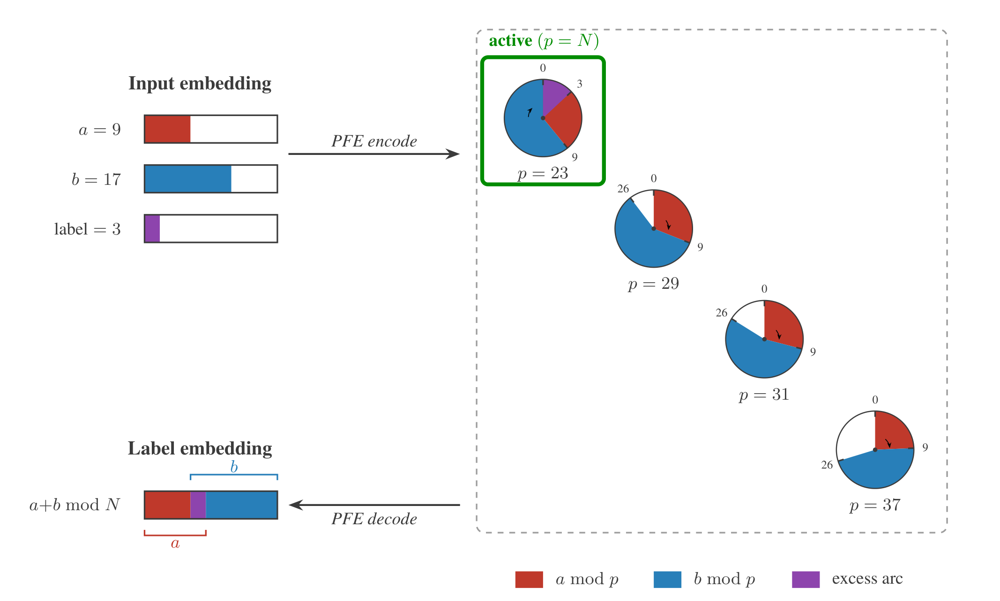

*Figure 1: PFE encoding for $(9+17)\bmod 23=3$. The active prime $p=23$ encodes the wrap-around addition where the purple region in particular, marks the overlap between the red and blue arcs — geometrically, the portion of the circle claimed by both $a$ and $b$ when their sum exceeds the modulus($=p$). Its angular size is $(a+b-p)/p$, equal to $(a+b)\bmod p$ normalized by $p$, which is the label. Inactive primes ($p=29,31,37$) carry no modulus-specific information.* **[p. 3]**

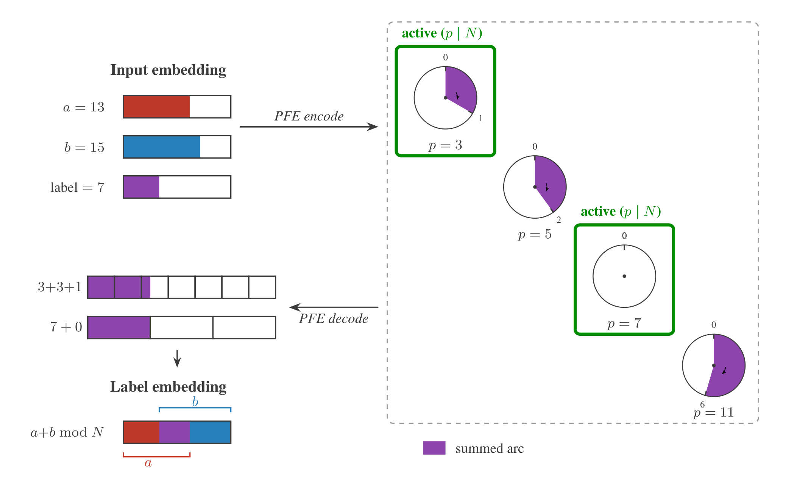

*Figure 2: PFE encoding for $(13+15)\bmod 21=7$. Since $21=3\times 7$, the prime channels $p=3$ and $p=7$ are load-bearing, carrying residues $(13+15)\bmod 3=1$ and $(13+15)\bmod 7=0$ respectively. The intermediate bars show CRT reconstruction: the unique $c\in\mathbb{Z}/21\mathbb{Z}$ satisfying $c\equiv 1\pmod{3}$ and $c\equiv 0\pmod{7}$ is $c=7$, recovered as $3+3+1\pmod{21}=7+0\pmod{21}=7$.* **[p. 4]**

The Prime Fourier Embeddings (PFE) for a prime $p$ at depth $d\ (0\leq d\leq D-1)$ maps an integer $a$ to the pair

$$
\mathrm{PFE}_{p,d}(a)=\left[\cos\!\left(\tfrac{2\pi a}{p^{d+1}}\right),\ \sin\!\left(\tfrac{2\pi a}{p^{d+1}}\right)\right]\in\mathbb{R}^{2}.
$$

This is the real decomposition of the character $\chi_{1}$ of $\mathbb{Z}/p^{d+1}\mathbb{Z}$, recording its real and imaginary parts:

$$
\chi_{1}(a)=e^{2\pi ia/p^{d+1}}=\cos\!\left(\tfrac{2\pi a}{p^{d+1}}\right)+i\sin\!\left(\tfrac{2\pi a}{p^{d+1}}\right).
$$

Since $\chi_{1}$ is a group homomorphism,

$$
\mathrm{PFE}_{p,d}(a+b\bmod p^{d+1})=R\!\left(\tfrac{2\pi b}{p^{d+1}}\right)\cdot\mathrm{PFE}_{p,d}(a),
$$

where $R(\theta)$ denotes rotation by $\theta$. Addition modulo $p^{d+1}$ therefore acts on $\mathrm{PFE}_{p,d}$ by rotation, making the embedding equivariant with respect to the action of $\mathbb{Z}/p^{d+1}\mathbb{Z}$. The $(\cos,\sin)$ pairs are not a heuristic choice but a principled one: they are a real form of the local $p$-adic characters arising from the adelic Fourier decomposition of $\mathbb{Q}$ (Ramakrishnan & Valenza, 1999).

The truncation to depth $D$ has an algebraic interpretation. For integers $0\leq a<p^{D}$, $\mathrm{PFE}_{p,d}(a)$ computes the $p$-adic character $\psi_{p}(a/p^{d+1})$. For larger inputs, only the residue $a\bmod p^{d+1}$ is retained, corresponding to the image of $a$ under the natural projection $\pi_{d}:\mathbb{Z}\twoheadrightarrow\mathbb{Z}/p^{d+1}\mathbb{Z}$. The embedding therefore implements $\psi_{p}\circ\pi_{d}$ rather than $\psi_{p}$ itself — a finite-group character rather than a $p$-adic one.

#### Parameter choices.

In all experiments we fix

$$
\mathcal{P}_{0}=\{3,5,7,11,13,17,19,23,29,\;31,37,41,43,47,53,59\},
$$

the 16 primes from $3$ to $59$, excluding $2$[^1], and depth cap $D=6$, giving total embedding dimension $2\times 16\times 6=192$ and per-prime row dimension $4D=24$ (the interleaved $(\sin,\cos)$ features of both $a$ and $b$ across all $D$ depths). This covers all odd prime factors of any odd modulus $N\leq 59$, and any squarefree composite whose prime factors lie in $\mathcal{P}_{0}$. Any task prime $p\notin\mathcal{P}_{0}$ would be invisible to the model.

## 3 Theoretical Analysis

The PFE embedding is equivariant by construction (Section 2). Any linear map $W$ that respects this equivariance is an intertwiner. Schur’s Lemma (Appendix A, Theorem A.16) then imposes rigidity: any intertwiner between non-isomorphic irreducible representations must be zero.

Since $\mathbb{Z}/p^{d+1}\mathbb{Z}$ is abelian, every irreducible representation is one-dimensional (Appendix A, Theorem A.17), so in particular $\chi_{1}(a)=e^{2\pi ia/p^{d+1}}$ is an irrep. The block $\mathrm{PFE}_{p,d}$ implements this $\chi_{1}$ specifically. Across distinct primes or distinct depths, the groups $\mathbb{Z}/p^{d+1}\mathbb{Z}$ have different orders and are therefore non-isomorphic, so their $\chi_{1}$ characters are non-isomorphic irreps. By Schur’s Lemma (Theorem A.16), any intertwiner between these blocks must be zero.

### 3.1 Block-Diagonal Structure

For each prime $p\in\mathcal{P}$ and depth $d=0,\ldots,D-1$, the block $\mathrm{PFE}_{p,d}$ carries the character $\chi_{1}$ of $\mathbb{Z}/p^{d+1}\mathbb{Z}$, realized as a $2\times 2$ rotation by angle $\theta_{p,d}=2\pi/p^{d+1}$. The full embedding is doubly indexed:

$$
\mathbf{h}=\bigoplus_{p\in\mathcal{P}}\bigoplus_{d=0}^{D-1}\mathrm{PFE}_{p,d}(a)\;\in\;\mathbb{R}^{2\cdot|\mathcal{P}|\cdot D},
$$

where $\mathcal{P}\subseteq\mathcal{P}_{0}$. This gives rise to two distinct levels of block structure characterized by the following theorem.

##### **Theorem 3.1**(Block-Diagonal Decomposition of the Classifier)**.**

*Let $W$ be any linear map that is equivariant with **[p. 3]** respect to the action of $\mathbb{Z}/p^{d+1}\mathbb{Z}$ on each block $\mathrm{PFE}_{p,d}$. Then $W$ decomposes as*

$$
W=\bigoplus_{p\in\mathcal{P}}W_{p},\qquad W_{p}=\bigoplus_{d=0}^{D-1}W_{p,d},
$$

*where each $W_{p,d}$ acts only within the $(p,d)$-subspace. In particular there is no coupling between blocks of distinct primes, and no coupling between blocks of distinct depths within the same prime.*

##### Proof.

We view each PFE block as the real two-dimensional realization of a complex character of the common additive group $\mathbb{Z}$. Specifically, $\chi_{p,d}:\mathbb{Z}\to S^{1}$ defined by $\chi_{p,d}(a)=e^{2\pi ia/p^{d+1}}$ factors through the quotient $\mathbb{Z}\twoheadrightarrow\mathbb{Z}/p^{d+1}\mathbb{Z}$. All blocks are therefore representations of the same group $\mathbb{Z}$, and two blocks $(p,d)$ and $(q,d^{\prime})$ correspond to distinct characters of this common action whenever $p^{d+1}\neq q^{d^{\prime}+1}$.

*Distinct primes.* For $p\neq q$, the periods $p^{d+1}$ and $q^{d^{\prime}+1}$ are coprime, so $p^{d+1}\neq q^{d^{\prime}+1}$. Moreover, any group homomorphism $\mathbb{Z}/p^{d+1}\mathbb{Z}\to\mathbb{Z}/q^{d^{\prime}+1}\mathbb{Z}$ is trivial, since the image order must divide both $p^{d+1}$ and $q^{d^{\prime}+1}$, which are coprime by the CRT decomposition of $\mathbb{Z}/N\mathbb{Z}$ (Theorem A.18). After complexification, $\chi_{p,d}$ and $\chi_{q,d^{\prime}}$ are non-isomorphic one-dimensional representations of $\mathbb{Z}$. By Schur’s Lemma (Theorem A.16), any $\mathbb{Z}$-equivariant linear map between non-isomorphic irreducible representations must be zero. Hence $W_{p,d;\,q,d^{\prime}}=0$ for all $p\neq q$.

*Distinct depths, same prime.* For fixed $p$ and $d\neq d^{\prime}$, the periods $p^{d+1}$ and $p^{d^{\prime}+1}$ differ, so $\chi_{p,d}$ and $\chi_{p,d^{\prime}}$ are distinct characters of $\mathbb{Z}$ and hence non-isomorphic as one-dimensional complex representations. Schur’s Lemma again forces any equivariant linear map between them to zero. Hence $W_{p,d;\,p,d^{\prime}}=0$ for $d\neq d^{\prime}$.

Combining both cases, $W$ is block-diagonal with one independent block per $(p,d)$ pair. ∎

##### *Remark 3.2*(Strength of the two independence guarantees)*.*

The between-prime and within-prime independence are of qualitatively different algebraic character. For distinct primes $p\neq q$, the CRT decomposition (Theorem A.18) separates the prime-local residue coordinates into independent coprime components. Any group homomorphism from $\mathbb{Z}/p^{d+1}\mathbb{Z}$ to $\mathbb{Z}/q^{d^{\prime}+1}\mathbb{Z}$ is trivial since the image order must divide both $p^{d+1}$ and $q^{d^{\prime}+1}$, which are coprime. **[p. 4]** This is strong independence. For distinct depths $d\neq d^{\prime}$ within the same prime $p$, there is a natural surjection $\mathbb{Z}/p^{d^{\prime}+1}\mathbb{Z}\twoheadrightarrow\mathbb{Z}/p^{d+1}\mathbb{Z}$ for $d^{\prime}>d$, so the deeper block contains strictly more information. Schur’s Lemma forces $W_{p,d;\,p,d^{\prime}}=0$ but does not force the network to distribute importance across depth levels — it only forbids cross-depth linear coupling.

With respect to the basis $\{\mathbf{e}_{p,d,\cos},\mathbf{e}_{p,d,\sin}\}$, the action of $\mathbb{Z}/p^{d+1}\mathbb{Z}$ on $\mathrm{PFE}_{p,d}$ is realized in $\mathrm{GL}(\mathbb{R}^{2})$ as

$$
R(\theta_{p,d})=\begin{bmatrix}\cos\theta_{p,d}&-\sin\theta_{p,d}\\
\sin\theta_{p,d}&\cos\theta_{p,d}\end{bmatrix},\qquad\theta_{p,d}=\frac{2\pi}{p^{d+1}}.
$$

The full weight matrix $W$ therefore has the nested block structure shown in Figure 3.

$$
W=\begin{bmatrix}R_{3}&&&&\\
&R_{5}&&&\\
&&R_{7}&&\\
&&&R_{11}&\\
&&&&\ddots\end{bmatrix}
$$

where

$$
R_{p}:=\begin{bmatrix}R(\theta_{p,0})&&&\\
&R(\theta_{p,1})&&\\
&&\ddots&\\
&&&R(\theta_{p,D-1})\end{bmatrix}
$$

*Figure 3: Nested block-diagonal structure of an equivariant linear map $W$. Each $R(\theta_{p,d})\in\mathrm{GL}(\mathbb{R}^{2})$ is a $2\times 2$ rotation with $\theta_{p,d}=2\pi/p^{d+1}$.* **[p. 5]**

##### *Remark 3.3**.*

The question of *why* gradient descent converges to an equivariant solution rather than breaking symmetry remains open and is left for future work.

## 4 Experiments

We design two ablation experiments to empirically validate the block-diagonal decomposition predicted by Theorem 3.1. Both experiments follow the same methodology: train a PFE-based classifier on a modular arithmetic task, then systematically zero out individual prime rows of the embedding and measure the resulting accuracy drop. A row is **task-relevant** if its prime divides the modulus, and **task-irrelevant** otherwise. The key prediction is that task-relevant rows cause large accuracy drops when ablated, while task-irrelevant rows cause near-zero drops.

#### Experimental setup.

All models share the same architecture: a shared per-prime encoder (two linear layers $24\to 64\to 32$, ReLU activations) processes each prime row independently, and a two-layer classifier ($|\mathcal{P}|\times 32\to 128\to N$, ReLU then linear) maps the concatenated row representations to $N$ output logits. The PFE features are deterministic and non-trainable. Each prime row contains the interleaved $(\sin,\cos)$ features of both $a$ and $b$ across all $D$ digit levels, giving row dimension $4D=24$. Models are trained with Adam ($\mathrm{lr}=3\times 10^{-3}$, default $\beta_{1},\beta_{2}$) and cross-entropy loss on $80{,}000$ uniformly sampled $(a,b)$ pairs with $a,b\in\{0,\ldots,r-1\}$, using an 80/20 train/test split (64,000 train, 16,000 test). Datasets are constructed from the complete set of distinct $(a,b)$ pairs; the 80/20 split is applied to unique pairs before any sampling, with zero train/test overlap verified for every configuration.

Experiment 1 trains for 25 epochs with batch size 1024; **[p. 5]** Experiment 2 trains for 40 epochs to accommodate the larger output space ($N$ up to $385$). All experiments use a single fixed random seed (42); variance across the sweep was negligible. Row ablation sets all $4D$ embedding dimensions of prime $p$ to zero — zeroing both the $a$ and $b$ features for that prime across all depths — and evaluates the frozen model on the held-out test set without retraining. The convergence threshold is $0.85$ for Experiment 1 and $0.70$ for Experiment 2. No error bars are reported as all experiments use a single seed; the sweep covers 35 configurations for Experiment 1 and 50 for Experiment 2, providing breadth in place of repeated trials.

### 4.1 Experiment 1: Prime Specialization on Single-Prime Tasks

#### Setup.

We train on $(a+b)\bmod p$ for each prime $p$ in a fixed subset $\mathcal{P}$ of $\mathcal{P}_{0}$, varying $|\mathcal{P}|\in\{4,6,8,10,12,14,16\}$ and input range $r\in\{100,500,1000,2000,4000\}$. For each configuration we train a separate model per task prime, ablate each row, and record the diagonal drop (ablating the task-prime row) and the off-diagonal drop (mean drop when ablating any other row). A model is considered **converged** if it achieves test accuracy above $0.85$ at any point during training. The diagonal drop $\Delta_{\text{diag}}$ is defined as the decrease in test accuracy when the task-prime row is zeroed; the off-diagonal drop $\Delta_{\text{off}}$ is the mean decrease across all other prime rows.

#### Results.

Across all configurations, the diagonal drop is substantially larger than the off-diagonal drop. At basis sizes $|\mathcal{P}|\leq 8$, the off-diagonal drop is statistically indistinguishable from zero in the majority of configurations (below a 2-standard-error bound of $0.011$–$0.032$ depending on test-set size), indicating near-perfect prime isolation. At $|\mathcal{P}|\geq 10$, off-diagonal drops are reliably above the noise floor, ranging from $0.03$ to $0.09$ across configurations, while diagonal drops remain at $0.82$–$0.92$. Convergence above $85\%$ test accuracy is consistent across all configurations once the input range exceeds the task prime. At small input ranges ($r=100$) with large prime sets, selectivity is somewhat reduced — a finite-sample effect when the input range is comparable to the task prime. These results are consistent with the block-diagonal structure predicted by Theorem 3.1: task-relevant channels dominate accuracy, and task-irrelevant channels are effectively inert.

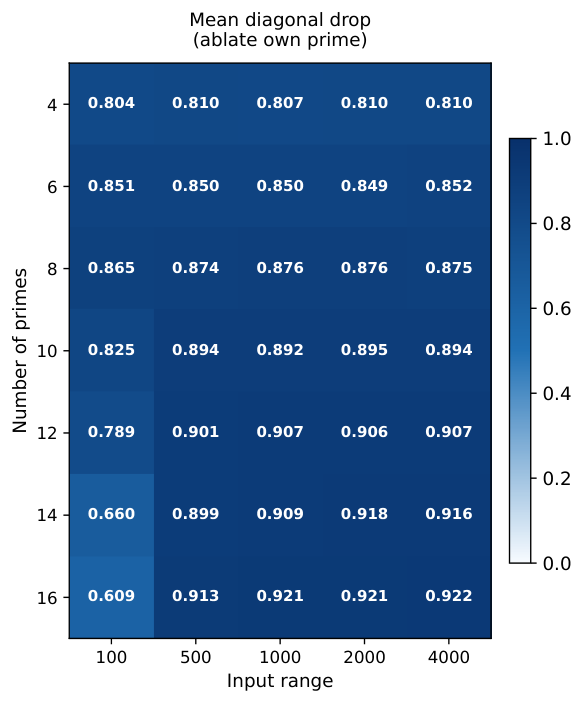

*Figure 4: Experiment 1. Mean diagonal drop (ablate own prime). Rows index $|\mathcal{P}|$; columns index input range $r$.* **[p. 5]**

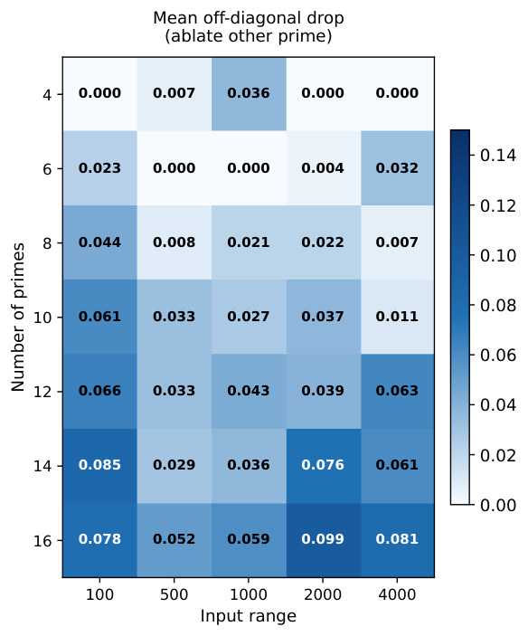

*Figure 5: Experiment 1. Mean off-diagonal drop (ablate other prime). Rows index $|\mathcal{P}|$; columns index input range $r$.* **[p. 6]**

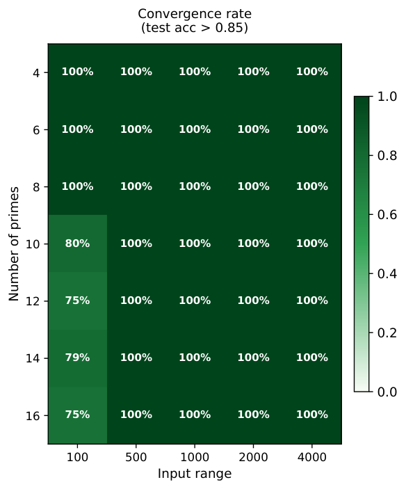

*Figure 6: Experiment 1. Convergence rate (test acc $>0.85$). Rows index $|\mathcal{P}|$; columns index input range $r$.* **[p. 6]**

#### Matched control: PFE-Shuffled ablation profiles.

To verify that the clean diagonal/off-diagonal separation is a consequence of the equivariant block structure rather than a trivial property of any model trained on modular arithmetic, we repeat the row-ablation protocol on a PFE-Shuffled variant: the same $(\cos,\sin)$ features at the same prime frequencies, but with the prime-to-row correspondence destroyed by a fixed random permutation applied at initialization. The results are shown in Figures 7 and 8.

PFE-Shuffled’s diagonal drops range from $0.10$ to $0.55$ — substantially lower than PFE’s $0.54$–$0.93$ — and do not **[p. 6]** exhibit the consistent monotone structure visible in the PFE heatmap. More strikingly, PFE-Shuffled’s off-diagonal drops range from $0.14$ to $0.46$: ablating any row, whether or not it corresponds to the task prime, causes a comparably large accuracy drop. The model has distributed the task-relevant information across all rows rather than routing it into the task-prime channel. This is the opposite of what PFE produces, and directly answers the matched-control concern: the clean ablation structure in Experiment 1 is not a property that any sufficiently expressive model exhibits, but a consequence of the equivariant block-diagonal structure that PFE provides and PFE-Shuffled destroys.

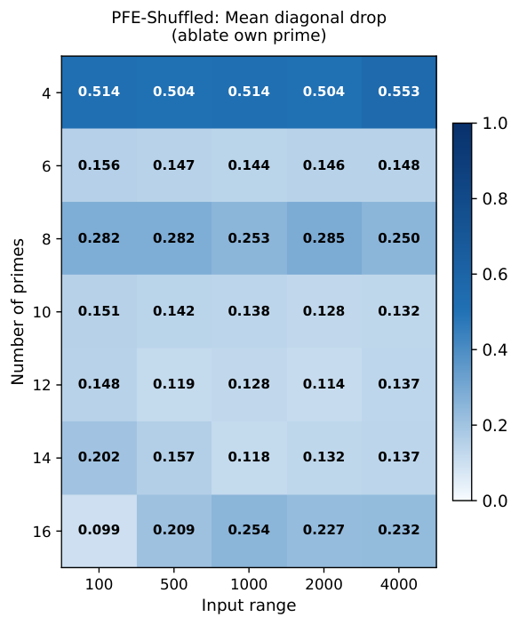

*Figure 7: PFE-Shuffled matched control: mean diagonal drop (ablate own prime row). Rows index $|\mathcal{P}|$; columns index input range $r$.* **[p. 7]**

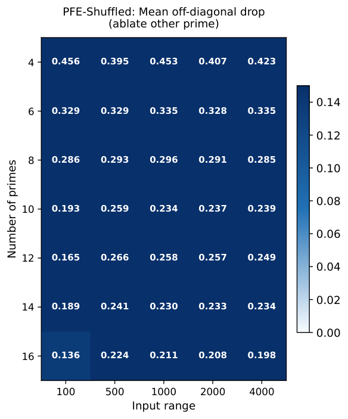

*Figure 8: PFE-Shuffled matched control: mean off-diagonal drop (ablate other prime row). Rows index $|\mathcal{P}|$; columns index input range $r$.* **[p. 7]**

### 4.2 Experiment 2: CRT Decomposition on Composite Moduli

#### Setup.

We train on $(a+b)\bmod N$ for squarefree composite moduli $N$, covering two-factor composites $N\in\{15,21,33,35,55,77\}$ and three-factor composites $N\in\{105,165,231,385\}$, each formed as a product of primes from $\{3,5,7,11\}$, embedded within the full prime basis $\mathcal{P}=\{3,5,7,11,13,17,19,23\}$. We sweep over input ranges $r\in\{100,500,1000,2000,4000\}$. The CRT prediction is that for $N=p_{1}\cdots p_{k}$,the $k$ rows corresponding to the prime factors of $N$ should activate, while all remaining rows remain near-zero. The factor drop is the mean accuracy decrease when ablating a prime $p$ that divides $N$; the nonfactor drop is the mean decrease when ablating a prime $p\nmid N$.

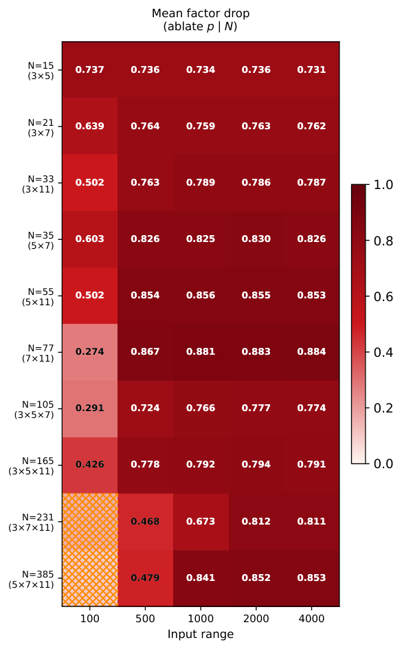

*Figure 9: Experiment 2. Mean factor drop. Rows index $N$; columns index $r$.* **[p. 8]**

#### Results.

The results confirm the CRT prediction. For all non-degenerate squarefree composites and sufficiently large input ranges, the nonfactor drop is statistically indistinguishable from zero in 77% of configurations, while factor drops range from $0.29$ to $0.88$ depending on $N$ and $r$. Perfect test accuracy ($1.00$) is achieved across all non-degenerate configurations at $r\geq 500$, confirming that the block-diagonal routing is computationally complete. For two-factor composites, factor-channel selectivity is clean at all $r\geq 500$. Three-factor composites achieve perfect accuracy at $r\geq 500$ as well, though factor-channel activation is reduced at $r=100$, where the input range is comparable to $N$ itself — a finite-sample phenomenon rather than a structural failure. The configurations $N=231$ and $N=385$ at $r=100$ are excluded as degenerate: with $\max(a+b)=198<231$, the modular sum never wraps.

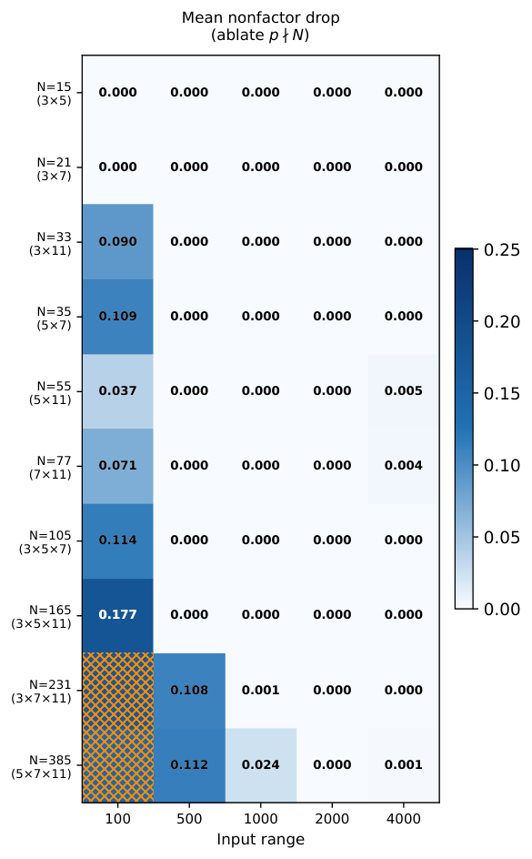

*Figure 10: Experiment 2. Mean nonfactor drop. Rows index $N$; columns index $r$.* **[p. 8]**

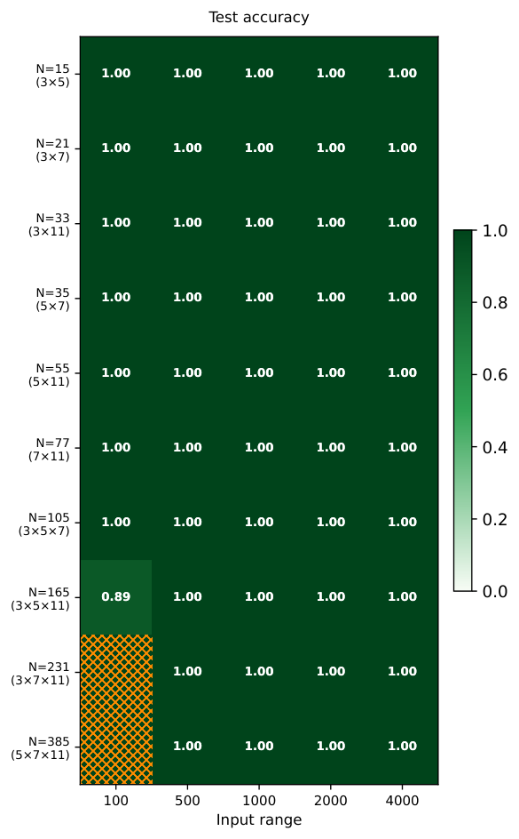

*Figure 11: Experiment 2. Test accuracy. Rows index $N$; columns index $r$.* **[p. 9]**

## 5 Discussion

#### What the experiments confirm.

The ablation results provide empirical validation of Theorem 3.1. Each prime channel operates independently, computation is routed through the particular channels relevant to the task modulus, and **[p. 7]** ablating an irrelevant channel has negligible effect. This is a falsifiable prediction of the representation theory confirmed across a systematic sweep of moduli, prime counts, and input ranges.

#### Structure from initialization.

Prior mechanistic work has shown that models trained with one-hot inputs on modular addition must reconstruct a Fourier basis from scratch through gradient descent (Nanda et al., 2023; Gromov, 2023) — confirming that the right algebraic structure exists but must be discovered implicitly. PFE provides this structure from initialization: task-relevant channels are precisely those predicted by the CRT to carry modular structure, and ablating them causes large accuracy drops while ablating irrelevant channels has negligible effect.

#### The principled basis argument.

The choice of prime frequencies is mathematically motivated rather than heuristic. By Ostrowski’s theorem (Appendix A.5, Theorem A.19), composite bases such as base-10 do not isolate prime-local structure into independent valuation channels — the $2$-adic and $5$-adic periodicities of base-10 share a single channel, leaving their separation as an implicit task for the network. The adelic character factorization (Appendix A.6, Theorem A.26) establishes that the Fourier basis on $\mathbb{A}_{\mathbb{Q}}$ factorizes into independent local components indexed by primes. PFE implements these components directly, making the prime basis a principled rather than arbitrary choice for modular arithmetic tasks whose structure is organized prime-locally by the Chinese Remainder Theorem.

#### Open questions.

Two directions remain open. First, why does gradient descent converge to an equivariant solution? The loss is invariant under simultaneous rotation but gradient descent is not guaranteed to preserve this symmetry. Second, the within-prime depth structure is not fully understood. Schur’s lemma forces zero linear coupling across depth levels within the same prime, but the depth levels are not genuinely independent: there is a natural surjection $\mathbb{Z}/p^{d^{\prime}+1}\mathbb{Z}\twoheadrightarrow\mathbb{Z}/p^{d+1}\mathbb{Z}$ for $d^{\prime}>d$, so deeper blocks subsume the information in shallower ones. The theory predicts zero cross-depth coupling but says nothing about how gradient descent distributes importance across depth levels — a question whose answer would deepen our structural understanding of the embedding.

## 6 Conclusion

We have introduced Prime Fourier Embeddings (PFE), a numerical embedding whose frequency basis is derived from the adelic harmonic analysis of $\mathbb{Q}$. PFE implements the local $p$-adic characters as prime-indexed $(\cos,\sin)$ pairs, **[p. 8]** providing a pre-structured representation in which modular arithmetic reduces to selecting the relevant prime channel rather than discovering algebraic structure from scratch.

The central theoretical contribution is the Block-Diagonal Decomposition Theorem (Theorem 3.1): any linear map equivariant with respect to the product action of $\prod_{p,d}\mathbb{Z}/p^{d+1}\mathbb{Z}$ on the PFE embedding must be block-diagonal, with one independent block per $(p,d)$ pair and zero coupling across blocks. This follows from viewing each PFE block as the real form of a character of the common additive group $\mathbb{Z}$, and applying Schur’s lemma to the resulting non-isomorphic character components. For composite moduli, the Chinese Remainder Theorem predicts which prime-local blocks are relevant to the task. Both predictions are confirmed empirically: ablation studies confirm the block-diagonal prediction directly, task-relevant channels show diagonal drops of $0.60$–$0.92$ while task-irrelevant channels are statistically inert in the majority of configurations.

The broader implication is that embedding design for arithmetic tasks can be guided by the mathematics of the objects being represented. Where the structure of learned representations is typically inferred post-hoc, here it is characterized before training and verified through targeted ablations.

## Impact Statement

This paper presents work at the intersection of numerical representation and mechanistic interpretability. The central result — that any linear map equivariant with respect to PFE must be block-diagonal with one independent block per prime — is a provable structural constraint on network behavior, not a post-hoc observation. Grounding interpretability claims in representation theory, where the structure of learned representations can be predicted and falsified before training, offers a principled path toward more reliable and transparent numerical reasoning in neural networks — and **[p. 9]** more broadly, toward the kind of falsifiable, mathematically grounded theory of deep learning called for by Simon et al. (2026). We do not foresee specific near-term harms from this work.

## References

- Bae and Lee (2026). S. Bae and D. Lee Numbers already carry their own embeddings. External Links: 2606.14108, Link Cited by: §1.

- Brandstetter et al. (2023). J. Brandstetter, R. van den Berg, M. Welling, and J. K. Gupta Clifford neural layers for PDE modeling. In The Eleventh International Conference on Learning Representations, External Links: Link Cited by: §1.

- Folland (1995). G. B. Folland A course in abstract harmonic analysis. Studies in Advanced Mathematics, CRC Press. Cited by: §A.6, §A.6, Definition A.22, Theorem A.25.

- Fulton and Harris (1991). W. Fulton and J. Harris Representation theory: a first course. Graduate Texts in Mathematics, Vol. 129, Springer-Verlag. Cited by: §A.3, Definition A.15.

- Golkar et al. (2023). S. Golkar, M. Pettee, M. Eickenberg, A. Bietti, M. Cranmer, G. Krawezik, F. Lanusse, M. McCabe, R. Ohana, L. Parker, B. R. Blancard, T. Tesileanu, K. Cho, and S. Ho XVal: a continuous number encoding for large language models. In NeurIPS 2023 AI for Science Workshop, External Links: Link Cited by: §1.

- Gorishniy et al. (2022). Y. Gorishniy, I. Rubachev, and A. Babenko On embeddings for numerical features in tabular deep learning. In Advances in Neural Information Processing Systems, A. H. Oh, A. Agarwal, D. Belgrave, and K. Cho (Eds.), External Links: Link Cited by: §1.

- Gouvêa (1997). F. Q. Gouvêa $p$-adic Numbers: An Introduction. 2nd edition, Universitext, Springer-Verlag. Cited by: §A.5.

- Gromov (2023). A. Gromov Grokking modular arithmetic. arXiv preprint arXiv:2301.02679. Cited by: §5.

- Hungerford (1974). T. W. Hungerford Algebra. Graduate Texts in Mathematics, Vol. 73, Springer-Verlag. Cited by: §A.1.

- Ireland and Rosen (1990). K. Ireland and M. Rosen A classical introduction to modern number theory. 2nd edition, Graduate Texts in Mathematics, Vol. 84, Springer-Verlag. Cited by: §A.4, §A.4.

- Lang (2002). S. Lang Algebra. 3rd edition, Graduate Texts in Mathematics, Vol. 211, Springer-Verlag. Cited by: §A.1, Appendix A.

- McLeish et al. (2024). S. McLeish, A. Bansal, A. Stein, N. Jain, J. Kirchenbauer, B. R. Bartoldson, B. Kailkhura, A. Bhatele, J. Geiping, A. Schwarzschild, and T. Goldstein Transformers can do arithmetic with the right embeddings. In Advances in Neural Information Processing Systems, A. Globerson, L. Mackey, D. Belgrave, A. Fan, U. Paquet, J. Tomczak, and C. Zhang (Eds.), Vol. 37, pp. 108012–108041. External Links: Document, Link Cited by: §1.

- Munkres (2000). J. R. Munkres Topology. 2nd edition, Prentice Hall. Cited by: §A.2, Appendix A.

- Nanda et al. (2023). N. Nanda, L. Chan, T. Lieberum, J. Smith, and J. Steinhardt Progress measures for grokking via mechanistic interpretability. arXiv preprint arXiv:2301.05217. Cited by: §5.

- Neukirch (1999). J. Neukirch Algebraic number theory. Grundlehren der mathematischen Wissenschaften, Vol. 322, Springer-Verlag. Cited by: §A.5, §A.5.

- Nickel and Kiela (2017). M. Nickel and D. Kiela Poincaré embeddings for learning hierarchical representations. In Advances in Neural Information Processing Systems, I. Guyon, U. V. Luxburg, S. Bengio, H. Wallach, R. Fergus, S. Vishwanathan, and R. Garnett (Eds.), Vol. 30, pp.. External Links: Link Cited by: §1.

- Ramakrishnan and Valenza (1999). D. Ramakrishnan and R. J. Valenza Fourier analysis on number fields. Graduate Texts in Mathematics, Vol. 186, Springer-Verlag. Cited by: §A.6, §A.6, Theorem A.26, §1, §2.

- Serre (1977). J. Serre Linear representations of finite groups. Graduate Texts in Mathematics, Vol. 42, Springer-Verlag. Cited by: §A.3, Definition A.13.

- Simon et al. (2026). J. Simon, D. Kunin, A. Atanasov, E. Boix-Adserà, B. Bordelon, J. Cohen, N. Ghosh, F. Guth, A. Jacot, M. Kamb, D. Karkada, E. J. Michaud, B. Ottlik, and J. Turnbull There will be a scientific theory of deep learning. External Links: 2604.21691, Link Cited by: Impact Statement.

- Stevens et al. (2024). S. Stevens, E. Wenger, C. Li, N. Nolte, E. Saxena, F. Charton, and K. **[p. 10]** Lauter SALSA FRESCA: angular embeddings and pre-training for ML attacks on learning with errors. External Links: 2402.01082 Cited by: §1.

- Su et al. (2024). J. Su, M. Ahmed, Y. Lu, S. Pan, W. Bo, and Y. Liu RoFormer: enhanced transformer with rotary position embedding. Neurocomput. 568 (C). External Links: ISSN 0925-2312, Link, Document Cited by: §1.

- Sun et al. (2019). Z. Sun, Z. Deng, J. Nie, and J. Tang RotatE: knowledge graph embedding by relational rotation in complex space. In 7th International Conference on Learning Representations, ICLR 2019, New Orleans, LA, USA, May 6-9, 2019, External Links: Link Cited by: §1.

- Terras (1999). A. Terras Fourier analysis on finite groups and applications. London Mathematical Society Student Texts, Vol. 43, Cambridge University Press. Cited by: §A.3, §A.3.

- Zhou et al. (2026). T. Zhou, D. Fu, M. Soltanolkotabi, R. Jia, and V. Sharan FoNE: precise single-token number embeddings via fourier features. In The Fourteenth International Conference on Learning Representations, External Links: Link Cited by: §1.

- Zhu et al. (2025). F. Zhu, D. Dai, and Z. Sui Language models encode the value of numbers linearly. In Proceedings of the 31st International Conference on Computational Linguistics, O. Rambow, L. Wanner, M. Apidianaki, H. Al-Khalifa, B. D. Eugenio, and S. Schockaert (Eds.), Abu Dhabi, UAE, pp. 693–709. External Links: Link Cited by: §1.

**[p. 11]**

## Appendix A Theoretical Background

This appendix collects definitions and results used in the main body. We assume familiarity with basic abstract algebra at the level of (Lang, 2002) and point-set topology at the level of (Munkres, 2000). Definitions are included where precision matters for the proofs or where terminology varies across communities; standard graduate material is cited rather than reproved.

### A.1 Algebraic Structures

Standard references: (Lang, 2002; Hungerford, 1974).

##### **Definition A.1**(Monoid)**.**

A **monoid** is a set $M$ equipped with a binary operation $\cdot:M\times M\to M$ satisfying: (i) associativity: $(a\cdot b)\cdot c=a\cdot(b\cdot c)$ for all $a,b,c\in M$, and (ii) existence of an identity element $e_{M}\in M$ with $e_{M}\cdot m=m\cdot e_{M}=m$ for all $m\in M$.

##### **Definition A.2**(Group)**.**

A **group** is a monoid $(G,\cdot)$ in which every element has an inverse: for each $g\in G$ there exists $g^{-1}\in G$ with $g\cdot g^{-1}=g^{-1}\cdot g=e_{G}$. A group is **abelian** if additionally $g\cdot h=h\cdot g$ for all $g,h\in G$.

##### **Definition A.3**(Ring)**.**

A **ring** is a set $R$ equipped with two binary operations $+$ and $\cdot$ such that $(R,+)$ is an abelian group with identity $0_{R}$, $(R,\cdot)$ is a monoid with identity $1_{R}$, and multiplication distributes over addition. A ring is **commutative** if additionally $a\cdot b=b\cdot a$.

##### **Definition A.4**(Ring Homomorphism and Isomorphism)**.**

A **ring homomorphism** is a map $\phi:R\to S$ satisfying $\phi(a+b)=\phi(a)+\phi(b)$, $\phi(a\cdot b)=\phi(a)\cdot\phi(b)$, and $\phi(1_{R})=1_{S}$. A bijective ring homomorphism is a **ring isomorphism**, written $R\cong S$.

### A.2 Topological Notions

Standard reference: (Munkres, 2000).

##### **Definition A.5**(Topological Space)**.**

A **topological space** is a set $X$ together with a collection $\tau$ of subsets called **open sets**, satisfying: (i) $\emptyset$ and $X$ are open; (ii) arbitrary unions of open sets are open; (iii) finite intersections of open sets are open.

##### **Definition A.6**(Discrete Topology)**.**

The **discrete topology** on a set $X$ is the topology in which every subset of $X$ is open.

##### **Definition A.7**(Continuous Map)**.**

A map $f:X\to Y$ is **continuous** if $f^{-1}(U)$ is open in $X$ for every open set $U$ in $Y$.

##### **Definition A.8**(Quotient Topology)**.**

Let $X$ be a topological space and ${\sim}$ an equivalence relation. The **quotient space** $X/{\sim}$ carries the **quotient topology**: $U\subset X/{\sim}$ is open iff its preimage under the projection $\pi:X\to X/{\sim}$ is open in $X$.

##### **Definition A.9**(Hausdorff Space)**.**

$X$ is **Hausdorff** if any two distinct points have disjoint open neighborhoods.

##### **Definition A.10**(Compact Space)**.**

$X$ is **compact** if every open cover has a finite subcover.

##### **Definition A.11**(Locally Compact Space)**.**

$X$ is **locally compact** if every point has a neighborhood contained in a compact subset.

### A.3 Representations and Characters

Standard references: (Serre, 1977; Fulton & Harris, 1991; Terras, 1999).

##### **Definition A.12**(Linear Representation)**.**

A **representation** of a group $G$ is a pair $(V,\rho)$ where $V$ is a finite-dimensional vector space over $\mathbb{C}$ and $\rho:G\to\mathrm{GL}(V)$ is a group homomorphism.

##### **Definition A.13**(Irreducible Representation)**.**

A representation $(V,\rho)$ is **irreducible** (an **irrep**) if $V\neq 0$ and the only $G$-stable subspaces are $\{0\}$ and $V$. By Maschke’s theorem, every finite-dimensional representation of a finite group decomposes as a direct sum of irreps (Serre, 1977).

##### **Definition A.14**(Character)**.**

A **character** of an abelian group $G$ is a group homomorphism $\chi:G\to S^{1}\subset\mathbb{C}^{\times}$.

##### **Definition A.15**(Equivariant Map and Intertwiner (Fulton & Harris, 1991))**.**

Let $G$ act on $V$ and $W$ via representations $\rho$ and $\sigma$. A linear map $T:V\to W$ is **equivariant** (a $G$**-intertwiner**) if

$$
T\circ\rho(g)=\sigma(g)\circ T\qquad\text{for all }g\in G.
$$

##### **Theorem A.16**(Schur’s Lemma)**.**

*Let $(V,\rho)$ and $(W,\sigma)$ be irreducible representations of $G$. If $T:V\to W$ is an intertwiner, then either $T=0$ or $T$ is an isomorphism. If $V=W$ over an algebraically closed field, then $T=\lambda I$ for some $\lambda\in\mathbb{C}$.*

##### Proof.

$\ker T$ is $G$-stable in $V$: by irreducibility, **[p. 12]** $\ker T=\{0\}$ or $V$. Similarly $\mathrm{im}\,T$ is $G$-stable in $W$: $\mathrm{im}\,T=\{0\}$ or $W$. These cases yield $T=0$ or $T$ an isomorphism. When $V=W$ over an algebraically closed field, any eigenvalue $\lambda$ makes $T-\lambda I$ a non-invertible intertwiner, hence $T-\lambda I=0$. ∎

##### **Theorem A.17**(Irreps of $\mathbb{Z}/n\mathbb{Z}$)**.**

*The irreducible complex representations of $\mathbb{Z}/n\mathbb{Z}$ are the $n$ characters*

$$
\chi_{k}(a)=e^{2\pi ika/n},\quad k=0,1,\ldots,n-1,
$$

*forming a complete orthonormal basis for $L^{2}(\mathbb{Z}/n\mathbb{Z})$.*

##### Proof.

Since $\mathbb{Z}/n\mathbb{Z}$ is abelian, every irrep is one-dimensional by Theorem A.16. A one-dimensional representation $\rho:\mathbb{Z}/n\mathbb{Z}\to\mathbb{C}^{\times}$ must map elements of order dividing $n$ into $n$-th roots of unity $\subset S^{1}$, giving the $n$ characters $\chi_{k}$. Orthonormality follows from character orthogonality relations; see (Terras, 1999), Chapters 1–2. ∎

### A.4 The Chinese Remainder Theorem

Standard reference: (Ireland & Rosen, 1990).

##### **Theorem A.18**(Chinese Remainder Theorem)**.**

*Let $n=p_{1}^{a_{1}}\cdots p_{k}^{a_{k}}$. Then*

$$
\mathbb{Z}/n\mathbb{Z}\;\cong\;\mathbb{Z}/p_{1}^{a_{1}}\mathbb{Z}\;\times\;\cdots\;\times\;\mathbb{Z}/p_{k}^{a_{k}}\mathbb{Z}.
$$

*The residues $(a\bmod p_{i}^{a_{i}})$ are mutually independent across distinct primes, and the groups $\mathbb{Z}/p_{i}^{a_{i}}\mathbb{Z}$ are pairwise non-isomorphic.*

##### Proof.

See (Ireland & Rosen, 1990), Theorem 3.4. ∎

### A.5 Ostrowski’s Theorem

Standard reference: (Neukirch, 1999).

##### **Theorem A.19**(Ostrowski’s Theorem)**.**

*Every non-trivial absolute value on $\mathbb{Q}$ is equivalent to either the real absolute value $|\cdot|_{\infty}$ or the $p$-adic absolute value $|\cdot|_{p}$ for some prime $p$. There is no valid absolute value on $\mathbb{Q}$ corresponding to a composite base.*

##### Proof sketch.

See (Neukirch, 1999), Chapter II, §3. The key dichotomy is between archimedean absolute values — all equivalent to $|\cdot|_{\infty}$ — and non-archimedean ones, satisfying the ultrametric inequality $|x+y|\leq\max(|x|,|y|)$, classified by primes via the $p$-adic valuations. ∎

The completion of $\mathbb{Q}$ with respect to $|\cdot|_{p}$ is the $p$**-adic field** $\mathbb{Q}_{p}$, with ring of integers $\mathbb{Z}_{p}=\{x\in\mathbb{Q}_{p}:|x|_{p}\leq 1\}$ (Gouvêa, 1997).

### A.6 Pontryagin Duality and the Adelic Character Factorization

Standard references: (Ramakrishnan & Valenza, 1999; Folland, 1995).

##### **Definition A.20**(Topological Group)**.**

A **topological group** is a group $G$ with a topology making multiplication and inversion continuous.

##### **Definition A.21**(Locally Compact Abelian Group)**.**

A **locally compact abelian (LCA) group** is a topological group that is abelian, locally compact, and Hausdorff.

##### **Definition A.22**(Haar Measure)**.**

A **Haar measure** on a LCA group $G$ is a nonzero translation-invariant Borel measure. Every LCA group admits a Haar measure, unique up to a positive scalar multiple (Folland, 1995).

##### **Definition A.23**(Restricted Product Topology)**.**

Let $\{G_{v}\}_{v\in V}$ be locally compact Hausdorff groups, with compact open subgroups $K_{v}\subset G_{v}$ for all but finitely many $v$. The **restricted product** $\prod^{\prime}_{v}(G_{v},K_{v})$ consists of tuples $(x_{v})$ with $x_{v}\in K_{v}$ for all but finitely many $v$, with topology generated by sets $\prod_{v\in S}U_{v}\times\prod_{v\notin S}K_{v}$ for finite $S$ and open $U_{v}\subset G_{v}$. The adele ring $\mathbb{A}_{\mathbb{Q}}=\prod^{\prime}_{v}(\mathbb{Q}_{v},\mathbb{Z}_{v})$ assembles all completions of $\mathbb{Q}$ — one archimedean place $\mathbb{R}$ and one $p$-adic place $\mathbb{Q}_{p}$ per prime — under this topology.

**[p. 13]**

The groups $\mathbb{R}$, $\mathbb{Q}_{p}$, $S^{1}=\mathbb{R}/\mathbb{Z}$, finite groups under the discrete topology, and $\mathbb{A}_{\mathbb{Q}}$ are all LCA groups of interest in this paper.

##### **Definition A.24**(Character and Pontryagin Dual)**.**

A **character** of a LCA group $G$ is a continuous homomorphism $\chi:G\to S^{1}$. The group of all characters under pointwise multiplication is the **Pontryagin dual** $\widehat{G}$, itself a LCA group.

##### **Theorem A.25**(Pontryagin Duality (Folland, 1995))**.**

*For any LCA group $G$, the map $G\to\widehat{\widehat{G}}$ sending $g\mapsto(\chi\mapsto\chi(g))$ is a topological group isomorphism.*

##### Proof sketch.

See (Folland, 1995), Chapter 4, Theorem 4.31. The key ingredients are Haar measure and the Fourier inversion theorem on LCA groups. ∎

Applied to the adele ring: $\mathbb{A}_{\mathbb{Q}}$ is self-dual ($\widehat{\mathbb{A}_{\mathbb{Q}}}\cong\mathbb{A}_{\mathbb{Q}}$), and this self-duality, together with the restricted product structure of ${\mathbb{A}_{\mathbb{Q}}}$, implies that any character factorizes into independent local components:

##### **Theorem A.26**(Factorization of Adelic Characters (Ramakrishnan & Valenza, 1999))**.**

*Any character $\psi:\mathbb{A}_{\mathbb{Q}}\to S^{1}$ factorizes as a product of local characters,*

$$
\psi(x)=\prod_{v}\psi_{v}(x_{v}),
$$

*where the product runs over all places $v$ of $\mathbb{Q}$ (one archimedean, one $p$-adic per prime), and $\psi_{v}=1$ for all but finitely many $v$. In particular, the standard choice $\psi_{\infty}(x_{\infty})=e^{-2\pi ix_{\infty}}$ and $\psi_{p}(x_{p})=e^{2\pi i\{x_{p}\}_{p}}$ gives a factorization into independent prime-local components.*

##### Proof sketch.

See (Ramakrishnan & Valenza, 1999), Chapters 4–5. The factorization follows from the restricted product structure of $\mathbb{A}_{\mathbb{Q}}$ and the fact that any character of a restricted product group decomposes into local characters that are trivial on the compact open subgroups $\mathbb{Z}_{p}$ for all but finitely many primes. ∎

**[p. 14]**

## Appendix B Additional Experimental Figures

### B.1 Experiment 1: Per-Prime Ablation Profiles

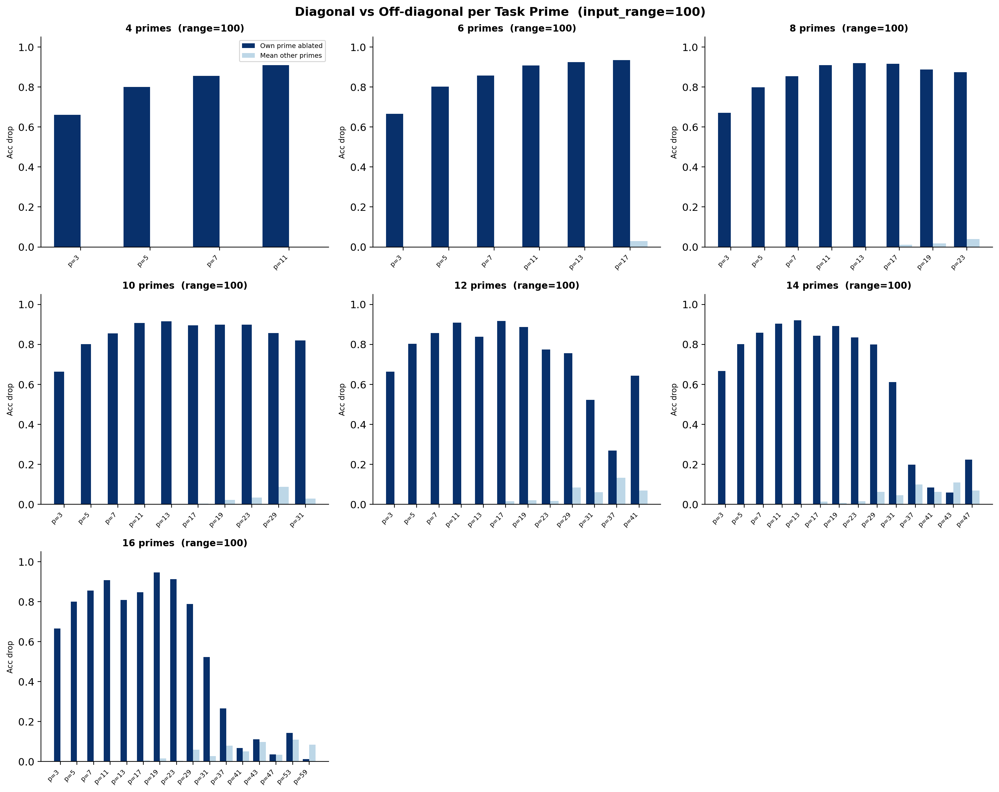

*Figure 12: Per-prime ablation profiles, Experiment 1, $r=100$.* **[p. 14]**

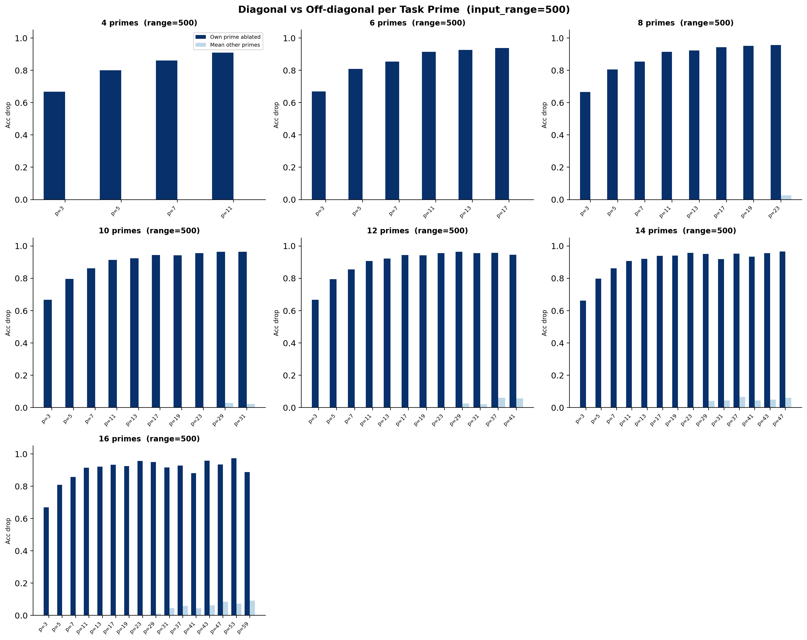

*Figure 13: Per-prime ablation profiles, Experiment 1, $r=500$.* **[p. 15]**

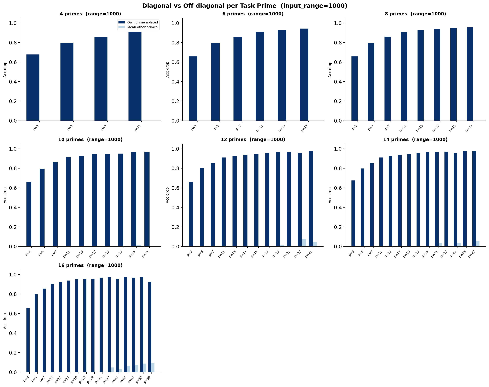

*Figure 14: Per-prime ablation profiles, Experiment 1, $r=1000$.* **[p. 16]**

*Figure 15: Per-prime ablation profiles, Experiment 1, $r=2000$.* **[p. 17]**

*Figure 16: Per-prime ablation profiles, Experiment 1, $r=4000$.* **[p. 18]**

**[p. 19]**

### B.2 Experiment 1: Supplementary Diagnostic Plots

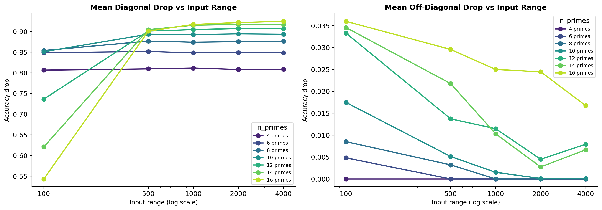

*Figure 17: Mean diagonal and off-diagonal drop as a function of input range for each value of $|\mathcal{P}|$.* **[p. 19]**

**[p. 20]**

### B.3 Experiment 2: Per-Composite Profiles Across All Input Ranges

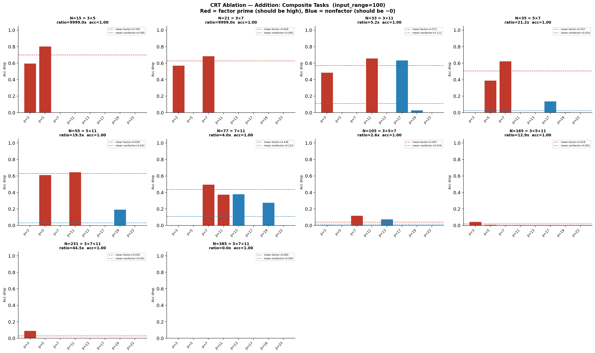

*Figure 18: CRT ablation profiles, all composites, $r=100$.* **[p. 20]**

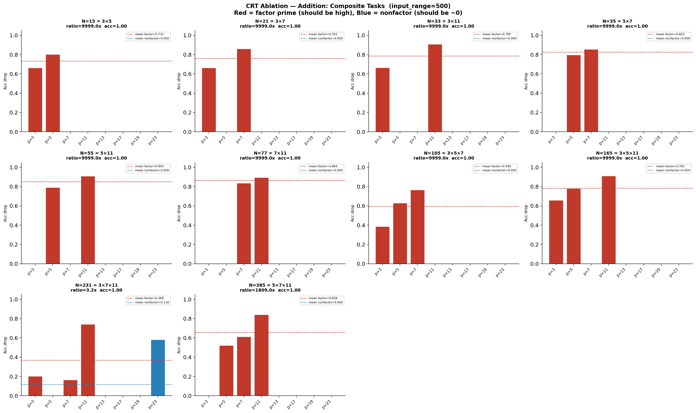

*Figure 19: CRT ablation profiles, all composites, $r=500$.* **[p. 20]**

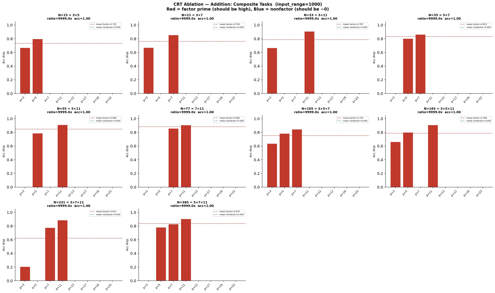

*Figure 20: CRT ablation profiles, all composites, $r=1000$.* **[p. 21]**

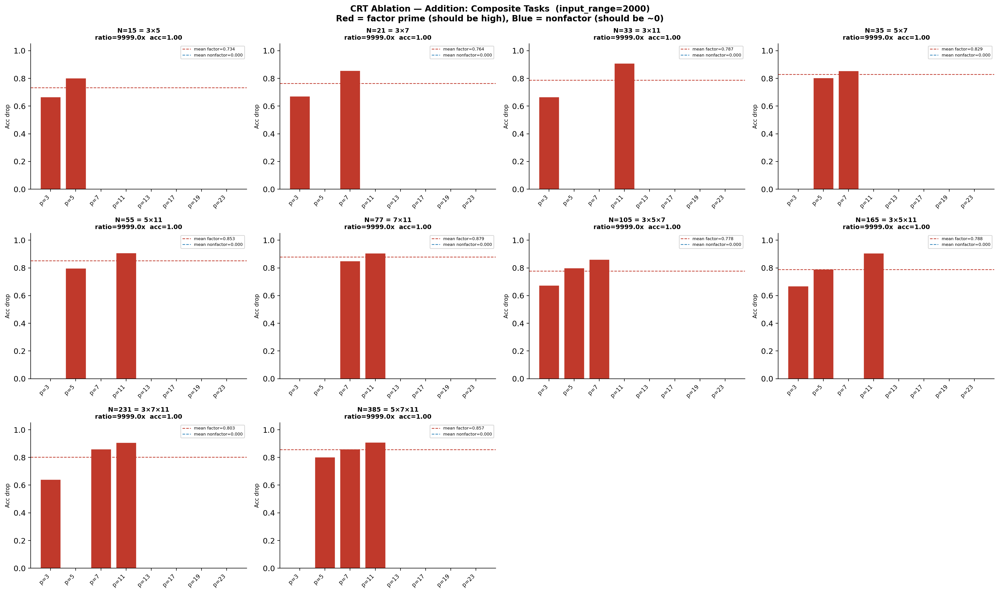

*Figure 21: CRT ablation profiles, all composites, $r=2000$.* **[p. 21]**

*Figure 22: CRT ablation profiles, all composites, $r=4000$.* **[p. 22]**

[^1]: For $p=2$, $\sin(2\pi a/2)=0$ for all integers $a$, so the sine feature carries no information. We exclude $p=2$ to avoid a structurally degenerate row.
