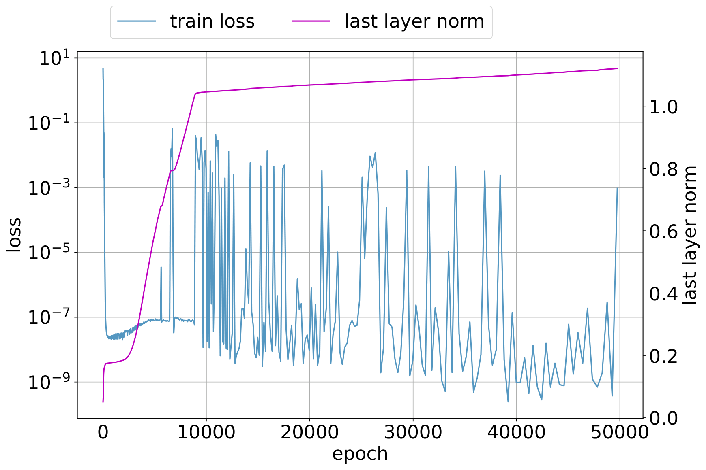
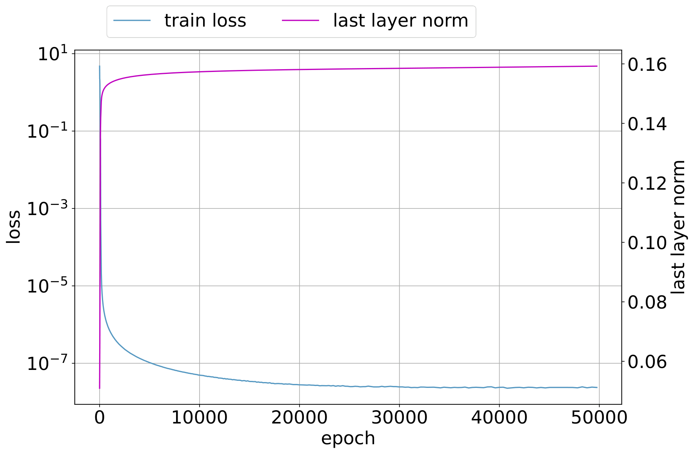
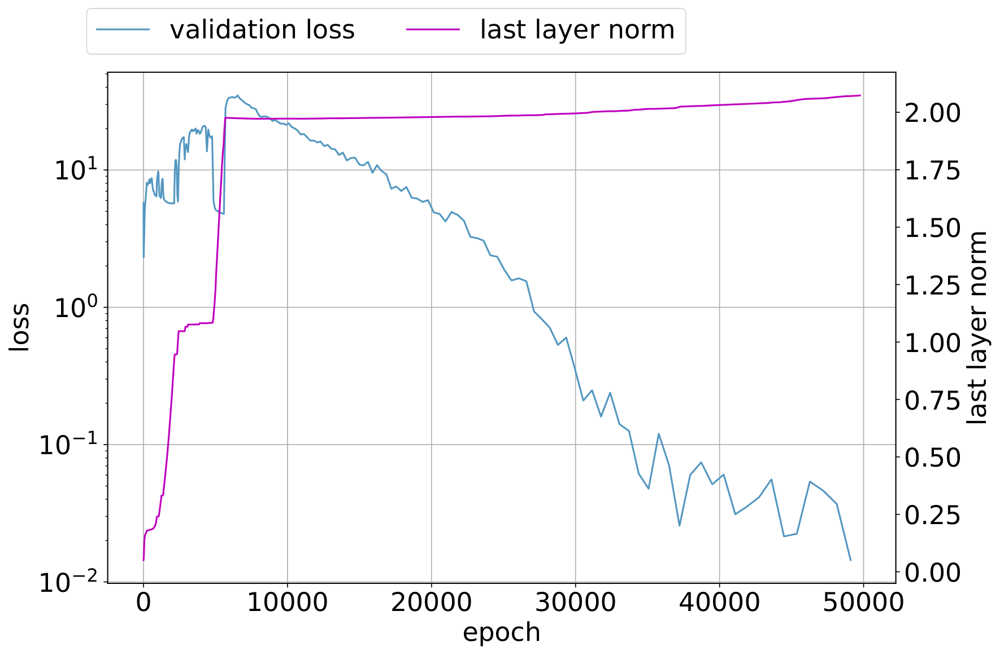
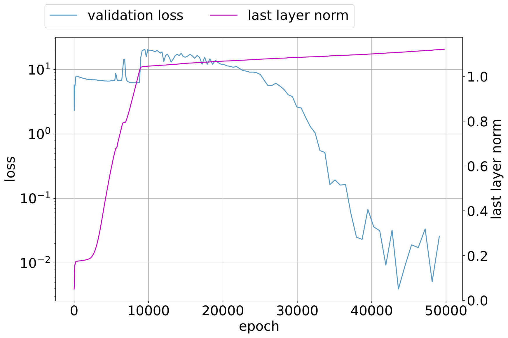
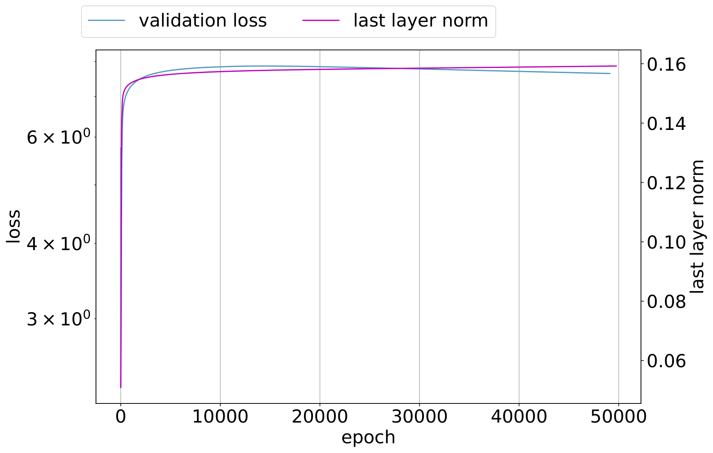
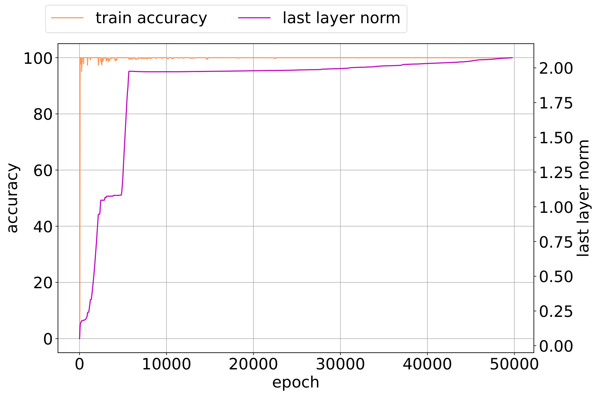
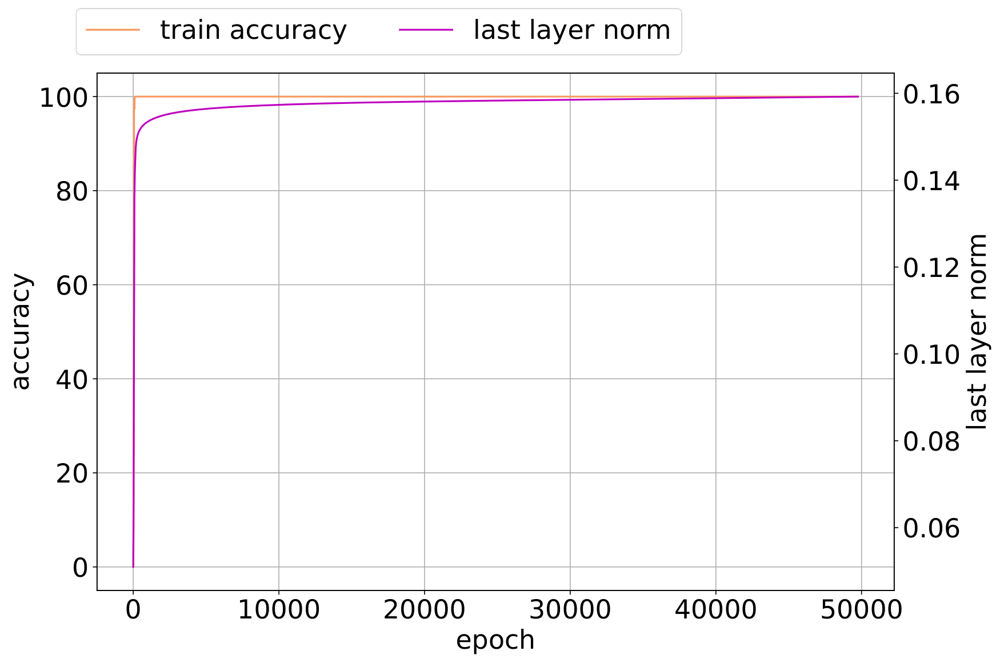
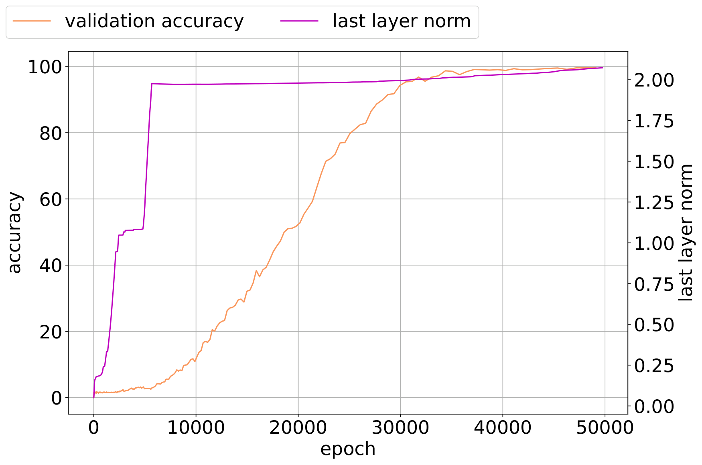
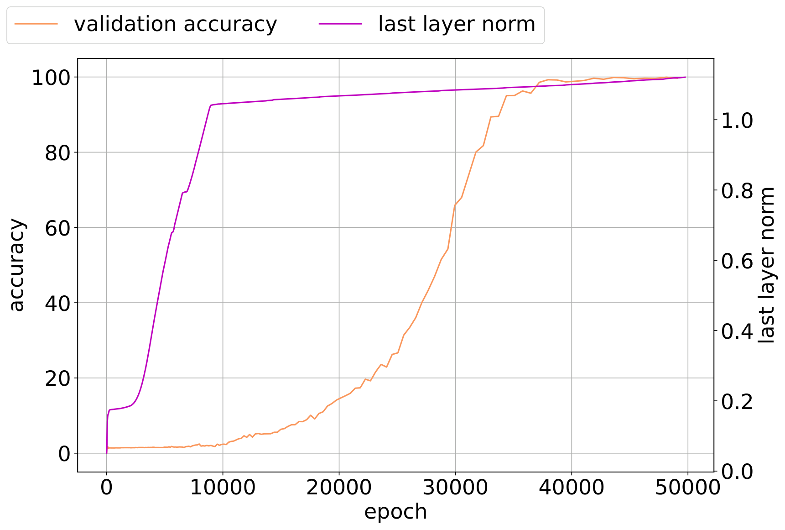
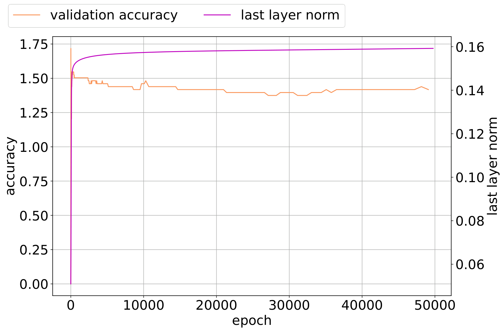

# Thilak et al. 2022 — The Slingshot Mechanism: An Empirical Study of Adaptive Optimizers and the Grokking Phenomenon

See also: [the global concept index](../../concepts/index.md).

**Vimal Thilak**, **Etai Littwin**, **Shuangfei Zhai**, **Omid Saremi**, **Roni Paiss**, **Joshua Susskind** — Apple.

arXiv [2206.04817](https://arxiv.org/abs/2206.04817), 10 June 2022. 89 citations — the sixth most cited work in the corpus. There is no native HTML for it; the source is ar5iv.

The files of this paper's analysis:

- [`2206.04817.the-slingshot-mechanism-an-empirical-study-of-adaptive-optimizers-and-grokking.license.txt`](2206.04817.the-slingshot-mechanism-an-empirical-study-of-adaptive-optimizers-and-grokking.license.txt) — the arXiv licence record for this paper.

**Repair of a conversion loss (task-022, 2026-08-26).** The body of Algorithm 1 ("Generic Adaptive Gradient Method", before section 1.1) is empty in the ar5iv rendering — both in the saved snapshot and in the current one; the pseudocode was restored in the conversion from the authors' LaTeX source (the arXiv e-print, `main.tex`, an algorithm2e environment). This is a repair of a conversion loss, not an edit of the paper.

The anchor scheme and the rules for linking into a card are in the [README of the papers folder](../README.md).

**Excerpt card.** The paper's licence (`arxiv-nonexclusive`) does not permit republishing the paper itself; what stands here are the editorial sections and the fragments the corpus quotes (right of quotation). The paper: <https://arxiv.org/abs/2206.04817>.

## Concepts covered

**[The slingshot effect](../../concepts/slingshot.md)** — the work **introduces the phenomenon and gives it a name**. The full cycle is a fast growth of the norm of the last layer's weights, a sharp phase transition with a spike of the training loss, and then a plateau of the norm ([`p5-1`](#p5-1)). It matters that the features change **only** at the moment of the transition and stand almost still during the norm-growth phase: the late stage of the training turns out to be stepwise rather than continuous.

**[Optimisers: Adam, AdamW, SGD](../../concepts/optimizer-adam-adamw-sgd.md)** — the work ascribes grokking to a **property of the optimiser rather than of the task or the architecture**. The slingshot is observed with Adam, AdamW and RMSProp and is **not** observed with Adagrad, SGD or SGD with momentum ([`p15-2`](#p15-2)); the authors relate this to the normalisation by which adaptive methods compute their step from the gradient. The controlling parameter is the $\epsilon$ in the denominator: at large $\epsilon$ both the slingshots and the grokking disappear ([`p6-5`](#p6-3)).

**[The edge of stability](../../concepts/edge-of-stability.md)** — the work itself draws the demarcation: the edge of stability is shown for full-batch gradient descent, whereas the slingshot arises under adaptive optimisers ([`p1-15`](#p3-4)). What they have in common is that both phenomena live late in the training and both are connected with curvature; the authors measure it along the trajectory as $\frac{1}{\|u_{t}\|^{2}}u_{t}^{\top}\mathcal{H}_{t}u_{t}$ and show that the curvature measure spikes exactly at the transitions.

**[Phase transition](../../concepts/phase-transition.md)** — the notion acquires a **cyclic form**. Unlike the single transition of Nanda et al., here the transitions between the stable and the unstable regimes recur: one run usually passes through several slingshot cycles, and each is accompanied by a jump in generalisation.

**[Margin maximisation](../../concepts/margin-maximization-implicit-bias.md)** — the work starts from this frame and shows it to be insufficient: the max-margin theory predicts a slow improvement of the margin as the norm grows but **predicts nothing resembling the cyclic behaviour** of the last layer's norm ([`p1-16`](#p3-5)). This is a direct statement about the limit of the explanatory power of the results of Soudry et al. and their extensions to adaptive methods.

**[Double descent](../../concepts/double-descent.md)** — noted in passing: on modular division the validation loss behaves like a double descent (a fall, a rise, a fast drop), whereas the validation accuracy does not change until the very end ([`p4-1`](#p4-2)). This is one more argument that the loss is more informative than the accuracy.

**[The emergence of features / feature learning](../../concepts/feature-emergence-feature-learning.md)** — the work gives a **measurable anchoring of the moment of feature learning**: the relative change of the features $\frac{\|h^{l}_{t+1}-h^{l}_{t}\|}{\|h^{l}_{t}\|}$ shows that the feature maps are updated in a jump at the phase transition. In appendix B this is supported by the cosine distance from the initialisation: in runs with a slingshot the representation parameters travel further.

**[Real data: vision, MNIST, CIFAR](../../concepts/vision-real-world-data-mnist-cifar.md)** — the slingshot is reproduced far beyond algorithmic tasks: ViTs and CNNs (VGG11 with and without batch normalisation), MLPs and deep linear models on subsamples of CIFAR-10, the full CIFAR-10, and synthetic Gaussian data. On the full CIFAR-10 the maximum test accuracy falls at epochs **after** the slingshot.

**[Grokking](../../concepts/grokking.md)** — the work offers an explanation through an optimisation anomaly: without explicit regularisation, grokking arises almost exclusively at the onset of a slingshot and is absent without one. The authors' formulation is meanwhile cautious — this is a **coincidence in time** rather than a proved causality, and they admit outright that they have no theoretical explanation of the slingshot itself.

Cards of corpus papers: [Power et al. 2022](../2201.02177.grokking-generalization-beyond-overfitting-on-small-algorithmic-datasets/2201.02177.grokking-generalization-beyond-overfitting-on-small-algorithmic-datasets.card.md) — the setting and the datasets on which everything here is reproduced; [Nanda et al. 2023](../2301.05217.progress-measures-for-grokking-via-mechanistic-interpretability/2301.05217.progress-measures-for-grokking-via-mechanistic-interpretability.card.md) — there the transition is explained from inside the network, here from outside, through the optimiser; [Omnigrok](../2210.01117.omnigrok-grokking-beyond-algorithmic-data/2210.01117.omnigrok-grokking-beyond-algorithmic-data.card.md) — explains the same through the weight norm and assigns the slingshot to the possible implicit regularisers; [Kumar et al. 2023](../2310.06110.grokking-as-the-transition-from-lazy-to-rich-training-dynamics/2310.06110.grokking-as-the-transition-from-lazy-to-rich-training-dynamics.card.md) — **objects directly**: there grokking is obtained with ordinary gradient descent, and hence an adaptive optimiser cannot be the cause in general; they assign this work to the explanations they "do not necessarily negate" but do not support either.

**[When regularisation is necessary](../../concepts/regularization-necessity.md)** — a conditional version of the dispute: [without explicit regularisation, grokking arises almost exclusively at the onset of a slingshot and is absent without one](#p1-2) — that is, under the cross-entropy with an adaptive optimiser the regularisation is replaced by instability.

## What is shown and what is conjectured

The card editor's remarks following the analysis of the claims (`…claims.txt`). The work honestly calls itself empirical, and it should be read exactly so: the phenomenon here is described and reproduced with a thoroughness rare in the corpus, and it is not explained — as the authors say outright.

**What is shown firmly.** The cyclic behaviour of the norm of the last layer's weights after a perfect accuracy has been reached is reproduced in a dozen settings: transformers, ViTs, CNNs with and without batch normalisation, MLPs, deep linear models, 18 algorithmic datasets, the full CIFAR-10, and synthetic data ([`p5-1`](#p5-1)). The slingshot is present in Adam, AdamW and RMSProp and absent in SGD and Adagrad. From the curvature hypothesis a checkable consequence is derived — at a sufficiently large $\epsilon$ the slingshot ought to disappear — and it was confirmed ([`p6-5`](#p6-3)). Separately valuable is an independent measurement: the cosine distance from the initialisation shows that in runs with a slingshot it is precisely the **representation** parameters that travel further, not only the classifier.

**What is absent — by the authors' own admission.** "We do not have a satisfactory theoretical explanation of the slingshot mechanism, and we have therefore removed all attempts at a more rigorous mathematical definition." A toy derivation for a quadratic cost gives the role of $\epsilon$ in the convex case, but the carry-over to deep networks remains a hypothesis.

**The connection with grokking is a coincidence, not a mechanism.** The phrase "almost exclusively" is nowhere turned into a number: the fraction of runs with grokking but no slingshot is not counted. Figure 6, meanwhile, shows the opposite cases too — configurations in which the best accuracy is attained **before** the first slingshot. Kumar et al. 2023 later produce grokking under ordinary gradient descent and conclude that the anomaly of adaptive methods cannot be the cause in general; after that the statement should be read as a description of a frequent co-occurrence.

**The mechanism is not needed for the result for whose sake it is claimed.** Appendix C shows that weight decay gives a comparable generalisation **faster** and without a pronounced slingshot, and that an explicit normalisation of the weights and the features does so stably and without its instability. The authors' own conclusion: in every case what matters is keeping the norm from an uncontrolled growth, "which may be the most important factor in improving generalisation". This effectively returns the explanation to the weight norm, that is, to the Omnigrok frame — but the connection between the two explanations is not spelled out in the paper.

**A small inconsistency within the paper.** In the introduction the rate of the norm growth in Soudry et al. is called $\mathcal{O}(t)$ and in section 2 logarithmic, $O(\log t)$; by the original work the second is correct.

**What to keep in mind when citing.** The absence of a slingshot under SGD is shown at three learning rates and on one dataset; in the ViT experiments one of the learning rates is written with a misprint and is not recoverable; and runs that diverged at $\beta_{1}>0.2,\beta_{2}=0$ were assigned a validation accuracy at the chance level, which affects the summary figure 16.

## Common misreadings and overstatements of this paper

Patterns of misreading or overstatement of this work, as observed in the citing papers of the corpus. Each entry says what exactly gets distorted in the restatement and leads to the authors' own paragraphs, where the qualification that goes missing still stands. The specific wordings are examined in the citing works' cards, in their "Common misreadings and overstatements" sections, where the "details" links lead.

**"The slingshot causes grokking" (an over-extension; refuted in its universal reading).** The authors' cautious observation — [without explicit regularisation, grokking… almost exclusively happens at the onset of slingshots and is absent without them](#p1-2) — carries the hedge "almost", the condition "without explicit regularisation" and an honest admission that the coincidence has no theory behind it. In the paraphrases all of this falls away, and a coincidence in time becomes a causality: "exclusively", "drives", "attributed grokking to adaptive optimizers". The universal reading is refuted within the corpus: [Kumar et al.](../2310.06110.grokking-as-the-transition-from-lazy-to-rich-training-dynamics/2310.06110.grokking-as-the-transition-from-lazy-to-rich-training-dynamics.card.md) and [Gromov](../2301.02679.grokking-modular-arithmetic/2301.02679.grokking-modular-arithmetic.card.md) obtain grokking under vanilla gradient descent, where there are no slingshots; and the line [Nanda et al.](../2301.05217.progress-measures-for-grokking-via-mechanistic-interpretability/2301.05217.progress-measures-for-grokking-via-mechanistic-interpretability.card.md) (app. D.2) → [Prieto et al.](../2501.04697.grokking-at-the-edge-of-numerical-stability/2501.04697.grokking-at-the-edge-of-numerical-stability.card.md) → [2605.06152](../2605.06152.grokking-or-glitching-how-low-precision-drives-slingshot-loss-spikes/2605.06152.grokking-or-glitching-how-low-precision-drives-slingshot-loss-spikes.card.md) (in float64 the slingshot disappears) re-explains the coincidence itself by numerical effects. The details: [2405.19454](../2405.19454.deep-grokking-would-deep-neural-networks-generalize-better/2405.19454.deep-grokking-would-deep-neural-networks-generalize-better.card.md#mc-2206-04817), [2601.19791](../2601.19791.to-grok-grokking-provable-grokking-in-ridge-regression/2601.19791.to-grok-grokking-provable-grokking-in-ridge-regression.card.md#mc-2206-04817); a milder echo: [2603.15492](../2603.15492.grokking-as-a-variance-limited-phase-transition-spectral-gating-and-the-epsilon-stability-threshold/2603.15492.grokking-as-a-variance-limited-phase-transition-spectral-gating-and-the-epsilon-stability-threshold.card.md).

**Attribution of content that does not exist (erroneous).** In passing lists the work is credited with things it does not contain: a decay of the weight norm at the passage to generalisation — whereas in the authors' account [the norm of the classification layer grows cyclically and levels off](#p5-1); a demonstration of grokking in computer vision — whereas on CIFAR-10 what is shown is a slingshot and a late maximum of accuracy, not grokking; "gradient noise" and a "theoretical analysis" — the work is emphatically empirical; and even the opposite claim "grokking can occur in spite of adaptivity" — even though [the slingshots are observed only in adaptive optimisers](#p2-7) and [are absent under SGD](#p5-1). The details: [2506.05718](../2506.05718.grokking-beyond-the-euclidean-norm-of-model-parameters/2506.05718.grokking-beyond-the-euclidean-norm-of-model-parameters.card.md#mc-2206-04817), [2402.16726](../2402.16726.towards-empirical-interpretation-of-internal-circuits-and-properties-in-grokked-transformers-on-modular-polynomials/2402.16726.towards-empirical-interpretation-of-internal-circuits-and-properties-in-grokked-transformers-on-modular-polynomials.card.md#mc-2206-04817), [2504.17243](../2504.17243.neuralgrok-accelerate-grokking-by-neural-gradient-transformation/2504.17243.neuralgrok-accelerate-grokking-by-neural-gradient-transformation.card.md#mc-2206-04817), [2601.03162](../2601.03162.on-the-convergence-behavior-of-preconditioned-gradient-descent-toward-the-rich-learning-regime/2601.03162.on-the-convergence-behavior-of-preconditioned-gradient-descent-toward-the-rich-learning-regime.card.md#mc-2206-04817); a milder echo: [2306.13253](../2306.13253.predicting-grokking-long-before-it-happens/2306.13253.predicting-grokking-long-before-it-happens.card.md) — an isolated lapse in an appendix alongside an exemplary main text.

**Merging the slingshot with the Edge of Stability (an over-extension).** Survey phrases call the slingshot "edge-of-stability effects" or "related to EOS", although the authors [themselves demarcated these phenomena: EOS is shown for full-batch gradient descent, the slingshot for adaptive optimisers](#p3-4). Milder echoes: [2605.06152](../2605.06152.grokking-or-glitching-how-low-precision-drives-slingshot-loss-spikes/2605.06152.grokking-or-glitching-how-low-precision-drives-slingshot-loss-spikes.card.md), [2603.13331](../2603.13331.the-norm-separation-delay-law-of-grokking-a-first-principles-theory-of-delayed-generalization/2603.13331.the-norm-separation-delay-law-of-grokking-a-first-principles-theory-of-delayed-generalization.card.md).

Examples of careful citation: [Omnigrok](../2210.01117.omnigrok-grokking-beyond-algorithmic-data/2210.01117.omnigrok-grokking-beyond-algorithmic-data.card.md) — distinguishes "supports" from "does not necessarily negate"; [Nanda et al.](../2301.05217.progress-measures-for-grokking-via-mechanistic-interpretability/2301.05217.progress-measures-for-grokking-via-mechanistic-interpretability.card.md) — reproduce the slingshots and correctly narrow their role (not necessary under weight decay); [Gromov](../2301.02679.grokking-modular-arithmetic/2301.02679.grokking-modular-arithmetic.card.md) — the only one to hold both conditions in a single sentence; [Varma et al.](../2309.02390.explaining-grokking-through-circuit-efficiency/2309.02390.explaining-grokking-through-circuit-efficiency.card.md) — "particularly in the absence of weight decay"; [2510.04930](../2510.04930.egalitarian-gradient-descent-a-simple-approach-to-accelerated-grokking/2510.04930.egalitarian-gradient-descent-a-simple-approach-to-accelerated-grokking.card.md) — an exemplary "co-occur".

---

# Quoted fragments

Only the fragments the corpus cards refer to are
reproduced here (right of quotation); the paper's licence does not permit
republishing the whole text. Anchor numbering matches the original.

###### p1-2

The *grokking phenomenon* as reported by Power et al. [17] refers to a regime where a long period of overfitting is followed by a seemingly sudden transition to perfect generalization. In this paper, we attempt to reveal the underpinnings of Grokking via a series of empirical studies. Specifically, we uncover an optimization anomaly plaguing adaptive optimizers at extremely late stages of training, referred to as the *Slingshot Mechanism*. A prominent artifact of the Slingshot Mechanism can be measured by the cyclic phase transitions between stable and unstable training regimes, and can be easily monitored by the cyclic behavior of the norm of the last layers weights. We empirically observe that without explicit regularization, Grokking as reported in [17] almost exclusively happens at the onset of *Slingshots*, and is absent without it. While common and easily reproduced in more general settings, the Slingshot Mechanism does not follow from any known optimization theories that we are aware of, and can be easily overlooked without an in depth examination. Our work points to a surprising and useful inductive bias of adaptive gradient optimizers at late stages of training, calling for a revised theoretical analysis of their origin.

###### fig-1

*Figure 1: Slingshot Effects are observed with a fully-connected ReLU network (FCN). The FCN is trained with 200 randomly chosen CIFAR-10 samples with Adam. Multiple Slingshot Effects occur in a cyclic fashion as indicated by the dotted red boxes. Each Slingshot Effect is characterized by a period of rapid growth of the last layer weights, an ensuing training loss spike, and a norm plateau.* **[p. 1]**

###### p1-3

Recently, the *grokking phenomenon* was proposed by [17], in the context of studying the optimization and generalization aspects in small, algorithmically generated datasets. Specifically, *grokking* refers to a sudden transition from chance level validation accuracy to perfect generalization, long past the **[p. 2]** point of perfect training accuracy, i.e., *Terminal Phase of Training* (TPT). This curious behavior contradicts the common belief of early stopping in the overfitting regimes, and calls for further understandings of the generalization behavior of deep neural networks.

###### p2-1

In the literature, it has been suggested that in some scenarios, marginal improvements in validation accuracy appears in TPT, which seem to directly support *grokking*. For example, it has been shown in [19] that gradient descent on logistic regression problems converges to the maximum margin solution, a result that has been since extended to cover a wider setting [13, 22]. A key finding in [19] shows that when training on linearly separable data with gradient descent using logistic regression, the classifier’s margin slowly improves at a rate of $\mathcal{O}(\frac{1}{\log t})$, while the weight norm of the predictor layer grows at a rate of $\mathcal{O}(t)$, where $t$ is the number of training steps. While specified for gradient descent, Wang et al. [22] showed that similar results also hold for adaptive optimizers (such as Adam and RMSProp). Taking these results into consideration, one could reasonably hypothesise that deep nonlinear networks could benefit from longer training time, even after achieving zero errors on the training set.

In this paper, we provide in depth empirical analyses to the mechanism behind *grokking*. We find that the phenomenology of *grokking* differs from those predicted by [19] in several key aspects. To be concrete, we find that *grokking* occurs during the onset of another intriguing phenomenon directly related to adaptive gradient methods (see Algorithm 1 for a generic description of adaptive gradient methods). In particular, leveraging the basic setup in [17], we make the following observations:

1. During the TPT, training exhibits a cyclic behaviour between stable and unstable regimes. A prominent artifact of this behaviour can be seen in the norm of a model’s last layer weights, which exhibits a cyclical behavior with distinct, sharp phase transitions that alternate between rapid growth and plateaus over the course of training.

###### p2-4

2. The norm grows rapidly sometime after the model has perfect classification accuracy on training data. A sharp phase transition then occurs when the model missclassifies training samples. This phase change is accompanied by a sudden spike in training loss, and a plateau in the norm growth of the final classification layer.

###### p2-5

3. The features (pre-classification layer) show rapid evolution as the weight norm transitions from rapid growth to a growth plateau, and change relatively little at the norm growth phase.

4. Phase transitions between norm growth and norm plateau phases are typically accompanied by a sudden bump in generalization as measured by classification accuracy on a validation set, as observed in a dramatic fashion in [17].

###### p2-7

5. It is empirically observed that grokking as reported in [17] almost exclusively happens at the onset of *Slingshots*, and is absent without it.

###### p2-8

We denote the observations above as the *Slingshot Effect*, which is defined to be the full cycle starting from the norm growth phase, and ending in the norm plateau phase. And empirically, a single training run typically exhibits multiple Slingshot Effects. Moreover, while *grokking* as described in [17] might be data dependent, we find that the Slingshot Mechanism is pervasive, and can be easily reproduced in multiple scenarios, encompassing a variety of models (Transformers and MLPs) and datasets (both vision, algorithmic and synthetic datasets). Since we only observe Slingshot Effects when training classification models with adaptive optimizers, our work can be seen as empirically characterizing an implicit bias of such optimizers. Finally, while our observations and conclusions hold for most variants of adaptive gradient methods, we focus on Adam in the main paper, and relegate all experiments with additional optimizers to the appendix.

***Algorithm 1** Generic Adaptive Gradient Method*

<!-- Recovery of a conversion loss (task-022, 2026-08-26): the body of Algorithm 1
     is empty both in the stored and in the current ar5iv rendering (an empty
     listing environment); it was recovered from the authors' LaTeX source
     (arxiv.org/e-print/2206.04817, main.tex, the algorithm2e environment).
     The format is aligned to the converter's emitter (task-024): the caption
     first, the lines with hard breaks, the mathematics rendered.
     This is a repair of a conversion loss, not an edit of the paper. -->

Input: $X_1 \in \mathcal{F}$, step size $\mu$, sequence of functions $\{\phi_t,\psi_t\}_{t=1}^T$, $\epsilon \in \mathbb{R}^+$  
Output: Fitted $\alpha$.  
for $t=1...,T$:  
$g_t = \nabla f_t(x_t)$.  
$m_t = \phi_t(g_1,...,g_t)$ and $V_t = \psi_t(g_1,...,g_t)$.  
$x_{t+1} = x_t - \frac{\mu m_t}{\sqrt{V_t^2} + \epsilon}$

**[p. 3]**

###### p3-4

Cohen et al. [4] describe a "progressive sharpening" phenomenon in which the maximum eigenvalue of the loss Hessian increases and reaches a value that is at equal to or slightly larger than $2/\eta$ where $\eta$ is the learning rate. This "progressive sharpening" phenomenon leads to model to enter a regime Cohen et al. [4] call *Edge of Stability* where-in the model shows non-monotonic training loss behavior over short time spans. *Edge of Stability* is similar to the Slingshot Mechanism in that it is shown to occur later on in training. However, *Edge of Stability* is shown for full-batch gradient descent while we observe Slingshot Mechanism with adaptive optimizers, primarily Adam [9] or AdamW [12].

###### p3-5

As noted above, the Slingshot Mechanism emerges late in training, typically longer after the model reaches perfect accuracy and has low loss on training data. The benefits of continuing to training a model in this regime has been theoretically studied in several works including [19, 13]. Soudry et al. [19] show that training a linear model on separable data with gradient using the logistic loss function leads to a max-margin solution. Furthermore Soudry et al. [19] prove that the loss decreases at a rate of $O(\frac{1}{t})$ while the margin increases much slower $O(\frac{1}{\log t})$, where $t$ is the number of training steps. Soudry et al. [19] also note that the weight norm of the predictor layer increases at a logarithmic rate, i.e., $O({\log(t)})$. Lyu and Li [13] generalize the above results to homogeneous neural networks trained with exponential-type loss function and show that loss decreases at a rate of $O(1/t(\log(t))^{2-2/L})$. This is, where $L$ is defined as the order of the homogenous neural network. Although these results indeed prove the benefits of training models, their analyses are limited to gradient descent. Moreover, the analyses developed by Soudry et al [19] do not predict any phenomenon that resembles the Slingshot Mechanism. Wang et al. [22] show that homogenous neural networks trained RMSProp [20] or Adam without momentum [22] do converge in direction to the max-margin solution. However, none of these papers can explain the Slingshot Mechanism and specifically the cyclical behavior of the norm of the last layer weights.

###### p4-2

Figure 2 shows the metrics of interest that we record on training and validation samples for modular division dataset. Specifically, we measure 1) *train loss*; 2) *train accuracy*; 3) *validation loss*; 4) *validation accuracy*; 5) *last layer norm*: denoting the norm of the classification layer’s weights and 6) *feature change*: the relative change of features of the l-th layer ($h^{l}$) after the t-th gradient update step $\frac{\|h^{l}_{t+1}-h^{l}_{t}\|}{\|h^{l}_{t}\|}$. We observe from Figure 2b that the model is able to reach high training accuracy around step 300 while validation accuracy starts improving after $10^{5}$ steps as seen in Figure 2d. Power et al. [17] originally showed this phenomenon and refer to it as grokking. We observe that while the validation accuracy does not exhibit any change until much later in training, the validation loss shown in Figure 2c exhibits a double descent behavior with an initial decrease, then a growth before rapidly decreasing to zero. Seemingly, some of these observations can be explained by the arguments in [19] and their extensions to adaptive optimizers [22]. Namely, at the point of reaching perfect classification of the training set, the cross-entropy (CE) loss by design pressures the classification layer to grow in norm at relatively fast rate. Simultaneously, the implicit bias of the optimizer coupled with the CE loss, pushes the direction of the classification layer to coincide with that of the maximum margin classifier, albeit at a much slower rate.

**[p. 5]**

###### p5-1

These insights motivate us to measure the classifier’s last layer norm during training. We observe in Figure 2a that once classification reaches perfect accuracy on the training set, the classification layers norm exhibits a distinct cyclic behavior, alternating between rapid growth and plateau, with a sharp phase transition between phases. Simultaneously, the training loss retains a low value in periods of rapid norm growth, and then wildly fluctuating in periods of norm plateau. Figure 2e and Figure 2f shows the evolution of the relative change in features output by each layer in the Transformer. We observe that the feature maps are not updated much during the norm growth phase. However, at the phase transition, we observe that the feature maps receive a rapid update, which suggests that the internal representation of the model is updating.

###### p6-4

Figure 4 shows the results for various values of $\epsilon$ considered in this experiment. We first observe that the number of Slingshot Effect cycles is higher for smaller values of $\epsilon$. Secondly, smaller values of $\epsilon$ cause grokking to appear at an earlier time step when compared to larger values. More intriguingly, models that show signs of grokking also experience Slingshot Effects while models that do not experience Slingshot Effects do not show any signs of grokking. Lastly, the model trained with the largest $\epsilon=10^{-5}$ shows no sign of generalization even after receiving 500K updates.

*Figure 4: Varying $\epsilon$ in Adam on the Division dataset. Observe that as $\epsilon$ increases, there is no Slingshot Effect or grokking behavior. **[p. 8]** Figure (a) corresponds to default $\epsilon$ suggested in [9] where the model trained with smallest value undergoes multiple Slingshot cycles.*

###### p8-2

While the Slingshot Mechanism exposes an interesting implicit bias of Adam that often promotes generalization, due to it’s arresting of the norm growth and ensuing feature learning, it also leads to some training instability and prolonged training time. In the Appendix we show that it is possible to achieve similar levels of generalization with Adam on the modular division dataset [17] using the same Transformer setup as above, while maintaining stable learning, in regimes that do not show a clear Slingshot Effect. First we employ weight decay, which causes the training loss values to converge to a higher value than the unregularized model. **[p. 9]** In this regime the model does not become unstable, but instead regularization leads to comparable generalization, and much more quickly. However, it is important to tune the regularization strength appropriately. Similarly, we find that it is possible to normalize the features and weights using the following scheme to explicitly control norm growth: $w=\frac{w}{\lVert w\rVert},f(x)=\frac{f(x)}{\lVert f(x)\rVert},$ where $w$ and $f(x)$ are the weights and inputs to the classification layer respectively, the norm used above is the $L_{2}$ norm, and $x$ is the input to the neural network. This scheme also results in stable training and similar levels of generalization. In all cases the effects rely on keeping the weight norms from growing uncontrollably, which may be the most important factor for improving generalization. These results suggest that while the Slingshot Mechanism may be an interesting self-correcting scheme for controlling norm growth, there are likely more efficient ways to leverage adaptive optimizers to similar levels of generalization without requiring the instability that is a hallmark of the Slingshot effect. Finally, we lack a satisfactory theoretical explanation for the Slingshot Mechanism, and hence removed all attempts at a more rigorous mathematical definition, which we feel would only serve as a distraction.

###### p15-2

In this set of experiments, we study the training loss behavior of deep linear models optimized full-batch with AdamW [12], RMSProp [20] and full-batch gradient descent (GD). The six layer model is trained with 200 samples. The hyperparameters used for optimizing the model with various optimizers are described in Table 1. Figure 11 shows the training loss and accuracy behavior of the three optimizers considered in this experiment. We observe Slingshot behavior with AdamW and RMSProp from Figure 11 while Slingshot behavior is absent with standard gradient descent. This observation suggests that the normalization used in adaptive optimizers to calculate the update from gradients may lead to Slingshot behavior.

*Table 1: Optimizers hyperparameters. Learning rate is set to $0.001$ and weight decay to $0$ for all optimizers*

| Optimizer | Other hyperparameters |
|---|---|
| Adam | $\beta_{1}=0.9,\beta_{2}=0.95$ |
| RMSProp | $\alpha=0.95$, momentum=$0.0$ |
| GD | momentum=$0.9$ |

###### p32-2

Weight decay is a commonly used regularization approach to improve the generalization performance of neural networks. Power et al. [17] show that weight decay has the largest positive effect on alleviating Grokking. Weight decay naturally controls the size of the parameters and consequently their norm growth. We study the effect of weight decay on stability of training Transformers with Grokking datasets in this section. We use weight decay values from $0,0.1,0.2,0.4,0.6,0.8and1.0$ with AdamW [12] optimizer. Figure 39 shows the results for division dataset. We observe from Figure 39 that as weight decay strength increases, both Slingshot Effects and Grokking phenomenon disappear with the model reaching high validation accuracy quickly as seen in Figure 39e and Figure 39f. However, we observe that the model experiences instability as can been seen with the loss plots in Figure 39b and Figure 39c or the accuracy plots in Figure 39e and Figure 39f. A similar trend is observed for addition and multiplication datasets in Figure 40 and Figure 41 respectively.

###### p32-3

The results shown above indicate that Slingshot may not be the only way to achieve good generalization. Both Slingshot and weight decay prevent the norms from growing unbounded and achieve high validation accuracy as seen in plots described above. While weight decay shows different weight norm dynamics, this regularization does not decrease training instability. These results suggest the need for alternative approaches to improve training stability.

**[p. 34]**
