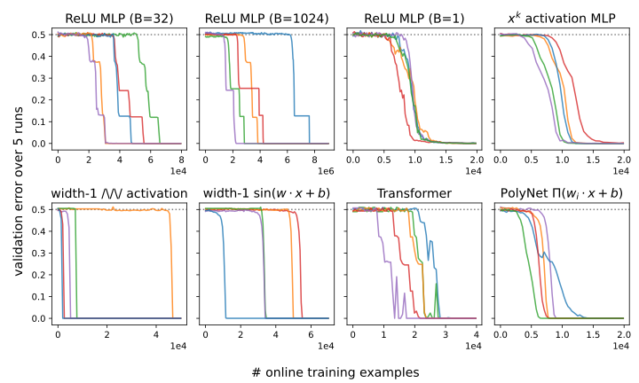
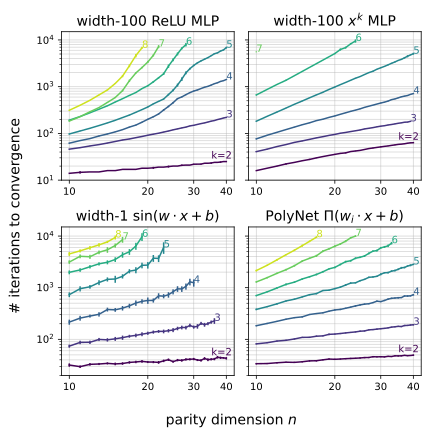
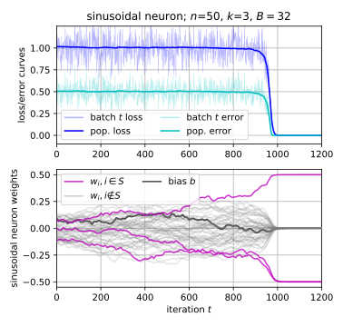
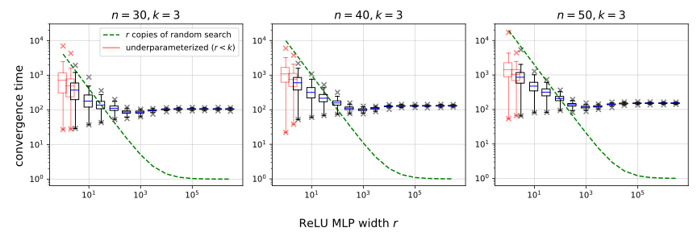
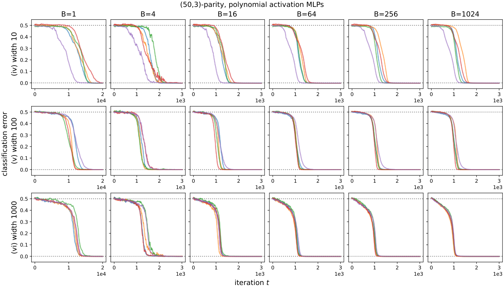

# Barak et al. 2022 — Hidden Progress in Deep Learning: SGD Learns Parities Near the Computational Limit

See also: [the global concept index](../../concepts/index.md). arXiv [2207.08799v3](https://arxiv.org/abs/2207.08799), 15 January 2023 (v1 — July 2022). The PDF has no running head naming a publication venue.

**Boaz Barak, Benjamin L. Edelman** — Harvard University.
**Surbhi Goel** — Microsoft Research; University of Pennsylvania.
**Sham Kakade** — Harvard University; Microsoft Research.
**Eran Malach** — Hebrew University of Jerusalem.
**Cyril Zhang** — Microsoft Research.

The files of this paper's analysis:

- [`2207.08799.hidden-progress-in-deep-learning-sgd-learns-parities-near-the-computational-limit.license.txt`](2207.08799.hidden-progress-in-deep-learning-sgd-learns-parities-near-the-computational-limit.license.txt) — the arXiv licence record for this paper.

The anchor scheme and the rules for linking into a card are in the [README of the papers folder](../README.md).

**Excerpt card.** The paper's licence (`arxiv-nonexclusive`) does not permit republishing the paper itself; what stands here are the editorial sections and the fragments the corpus quotes (right of quotation). The paper: <https://arxiv.org/abs/2207.08799>.

## Concepts covered

**[Sparse parity](../../concepts/sparse-parity.md)** — the work introduces the task into the corpus and sets it up as a testbed: the label is the product of $k\ll n$ signs of a random string of length $n$, the task is statistically easy ($\Theta(k\log n)$ examples) and computationally hard — from the orthogonality of parities a lower bound in the statistical-query model is derived, $\Omega(n^{k})$ queries at constant noise ([p. 4, para. 4](#p4-4)). The value of the setting for the corpus lies precisely there: the transition point is tied to a **proven** computational limit rather than to an empirical threshold. From here too come the working notations — the $(n,k)$-parity, the "relevant" and "irrelevant" coordinates, the convergence time $t_c$ — and the sweep over fifteen network configurations (two-layer MLPs with ReLU and power activations, single-neuron networks with zigzag, power, $\infty$-zigzag and sinusoidal activations, a transformer, PolyNet) under three initialization distributions, three losses, batch sizes from 1 to 1024 and four learning rates ([p. 6, para. 1](#p6-1)). What the work does not have: an analysis of parity itself as a "grokking" task. The main results are taken in the **online** setting ([p. 4, para. 5](#p4-5)), where a fresh batch at every step by construction removes overfitting and hence the gap between training and validation error.

**[Grokking](../../concepts/grokking.md)** — the work takes grokking from Power et al. 2022 as a borrowed phenomenon and reproduces it on a new substrate. Grokking here is a separate experiment at a **finite** sample size (appendix [C.5](#sec-c5)): a ReLU-MLP of width 100, $B=32$, $\eta=0.1$, hinge loss, multi-pass training on a fixed sample of size $m$ and weight decay $\lambda$ ([p. 43, para. 1](#p43-1)); at small $m$ and a suitable $\lambda$ "the model first overfits the training data, but after a large number of iterations finds a classifier that generalizes" ([p. 43, para. 2](#p43-2), [fig. 15](#fig-15), [fig. 4](#fig-4)). A distinction that matters for the corpus follows from the setting and is drawn by the authors themselves: **the plateau in the online part is not grokking**, because there is no gap there between the training and the validation error ([p. 10, para. 3](#p10-3)). What the work does not have: an explanation of grokking. Section 5 is called "preliminary investigations", the hidden-progress measures are not computed on the grokking runs, the number of seeds and the variance for figure 15 are not given, and the claim of "complementing and corroborating the findings of Nanda and Lieberum 2022" remains verbal.

**[Progress measures](../../concepts/progress-measures.md)** — here the notion is introduced and given its name. The definition is given in **general** terms, through prediction rather than through an analysis of mechanism: a progress measure is "any function of the state of the training algorithm… that predicts the time to convergence", and from the definition it follows directly that only algorithms with a memoryless convergence time lack progress measures ([p. 40, para. 2](#p40-2)). Equally important is the authors' caveat that gets lost in citation: "the purpose of exhibiting hidden progress measures $\rho$ is *not* to give additional evidence that SGD finds features by means of Fourier gaps" — empty measures will do (for exhaustive search the step number itself serves as a progress measure), and the purpose is different: to refute the conjecture of a memoryless Langevin search and to try to measure advancement where the loss and the accuracy are flat ([p. 41, para. 1](#p41-1)). Three measures are proposed: the Fourier gap of the population gradient over time, the movement of the weights on the relevant coordinates, and the $\ell_{\infty}$ path length $\rho(w_{0:t}):=||w_{t}-w_{0}||_{\infty}$ ([p. 41, para. 4](#p41-4), [fig. 3](#fig-3), [fig. 13](#fig-13)). What the work does not have: a causal connection between the measure and the transition — the word "causal" does not appear in the paper, and the authors do not undertake to describe the dynamics of $\rho$; nor is there any computation of the measures on the grokking runs of appendix C.5.

**[Phase transition](../../concepts/phase-transition.md)** — the word stands in the authors' own text, both in the abstract and in the body: "for almost all architectures… the learning curves exhibit phase transitions… long stretches of apparent lack of progress, followed by periods of rapid decrease of the validation error" ([p. 6, para. 3](#p6-3), [fig. 1](#fig-1)). The main contribution to the notion is not an observation but a **theorem**: for gradient flow on a disjoint-PolyNet at $k\geq3$ one has $\frac{T(0.49)}{T(0)}\geq 1-O\left((n^{\prime})^{1-k/2}\right)$, that is, the share of the time spent reaching "slightly better than trivial" tends to one ([p. 9, para. 3](#p9-3)); in the authors' own words: "the network spends far more time reaching slightly-better-than-trivial accuracy than it does going from slightly-better-than-trivial to perfect accuracy" ([p. 9, para. 4](#p9-4)). This plateau is obtained in **fully deterministic** dynamics, without batch noise — which thereby separates explanations of the transition through the structure of the task from explanations through a noise-driven escape from a metastable state. What the work does not have: the language of statistical physics — no order parameter, no critical exponents, no finite-size analysis; "phase transition" in the authors' usage is descriptive, and in theorem 6 the transition is a property of a trajectory rather than of a thermodynamic limit. A negative case is named separately: with wide MLPs with a power activation and large batches the plateau **disappears** ([p. 6, para. 3](#p6-3), [C.8](#sec-c8)).

**[The memorization phase / plateau](../../concepts/memorization-phase.md)** — the work gives the corpus a plateau with nothing to memorize. In the online part a long flat plateau of loss and error exists in the complete absence of a training sample as such: every batch is fresh, there is nothing to memorize, and the plateau is generated by the computational hardness of the task rather than by a competition of memorization with generalization. The observation about visibility is stated outright: "progress becomes visible in the loss only when the relevant weights become larger than all the irrelevant weights" ([p. 41, para. 3](#p41-3), [fig. 13](#fig-13)). An overfitting stage in the usual sense appears only in the finite-sample experiment [C.5](#sec-c5). What the work does not have: a measurement of what happens to the training error on the plateau in the grokking runs, and any separation of "memorizing" and "generalizing" solutions at all — the authors do not yet have this vocabulary.

**[Emergence](../../concepts/emergence.md)** — the paper is written as a response to the emergent abilities of large models: the introduction names the abrupt appearance of reasoning and few-shot learning as language models grow, the "critical scale" of Srivastava et al. 2022, and the grokking of Power et al. 2022 as a jump under the growth of training time alone ([p. 1, para. 4](#p1-4)). The contribution to the notion is a change of question: the authors separate the statistical side of the growth of capabilities from the **computational** one and build the smallest setting in which there is a jump but no statistical deficit ([p. 1, para. 2](#p1-2)). What the work does not have: a transfer to real data. The question of whether parity-like exhaustive-search subtasks are embedded in language and program tasks is posed as an open one ([p. 11, para. 1](#p11-1)); the word "emergence" is used in the section on noise still pre-terminologically, without any measures or thresholds.

**[Data fraction / critical dataset size](../../concepts/data-fraction-critical-dataset-size.md)** — the sample size $m$ acts as a control quantity in appendix [C.5](#sec-c5), and the picture has three parts: for $m$ much larger than the statistical threshold $\Theta(k\log n)$ the generalization error is negligible; for too small an $m$ the model does not learn at all; between them a delayed convergence to the correct solution is observed, that is, grokking ([fig. 15](#fig-15)). The key point for the corpus: this threshold in $m$ **is shifted by weight decay**, that is, it is not a property of the task alone. What the work does not have: a name or a formula for the threshold — neither a "critical dataset size" nor $D_{\textrm{crit}}$; the values of $m$ at the regime boundaries are not written out in the text and can only be read off the panels of figure 15, and the number of seeds behind them is not named.

**[Weight decay](../../concepts/weight-decay.md)** — here weight decay is for the first time named a knob of the **computational-statistical trade-off**: "it improves generalization (widening the set of $m$ for which training eventually finds the correct solution), but at large values of $\lambda$ the model does not train" ([p. 43, para. 2](#p43-2), [fig. 15](#fig-15), bottom row). This two-sided statement — both the benefit and the cost — is rare in the corpus and is obtained without any appeal to the weight norm or to compression. In the theoretical part weight decay appears in an entirely different role: in theorem 4 the schedule $\lambda_{0}=1$ at the first step simply **zeroes out** the initial weights of the first layer, leaving exactly one gradient step, after which $\lambda_{t}=0$ ([p. 8, para. 2](#p8-2)). What the work does not have: a claim that weight decay is necessary for grokking or that it is its cause; the online results that make up the body of the paper are obtained without it.

**[Feature emergence / feature learning](../../concepts/feature-emergence-feature-learning.md)** — the work gives an elementary example of what it itself calls *combinatorial feature learning*: the network can converge only by learning a sparse representation of small width ([p. 3, para. 5](#p3-5)). The mechanism is named and computed: the coordinates of the population gradient are the Fourier coefficients of the function $x\mapsto\sigma^{\prime}(w^{\top}x)$ — of order $k-1$ on the relevant coordinates and of order $k+1$ on the irrelevant ones, and all that is required is a distinguishable **gap** between them ([p. 7, para. 4](#p7-4)). The testable prediction that follows from such a mechanism — that width does not give parallelization — has been checked up to widths of $3\times10^{6}$ with 1000 runs per configuration: there is no $r$-fold speedup, the time levels off on a shelf, and the benefit of width turns out to be different — a reduction of the variance ([p. 41, para. 8](#p41-8), [fig. 14](#fig-14)). What the work does not have: an analysis of what happens to the features **after** their appearance, and an explanation of why the Fourier gap grows over the course of training — the authors note this twice and admit that their analysis does not describe such growth ([p. 8, para. 3](#p8-3), [fig. 12](#fig-12)).

**[Fourier features](../../concepts/fourier-features-circuits.md)** — the Fourier quantity enters the corpus here and precisely as a *Fourier gap*: definition 1 requires that for every $(k-1)$-subset the coefficient be no smaller than that of any $(k+1)$-superset, plus a gap $\gamma$ ([p. 7, para. 4](#p7-4)); for a unit initialization the derivative of ReLU is the majority function, for which the gap is computed in closed form, $\gamma=\Theta(n^{-(k-1)/2})$. The difference from the corpus's later Fourier analyses is fundamental: here Fourier lives in the **gradient**, not in the learned representation, and serves as a condition of learnability rather than as a description of the algorithm found. What the work does not have: reverse engineering of the trained network, a frequency decomposition of the learned weights, and any analysis of the final solution at all; the numerical Fourier gaps of appendix [C.1](#sec-c1) are taken by exhaustive enumeration over $2^{n}$ inputs at $n=15$ and are declared preliminary.

**[The neural tangent kernel (NTK)](../../concepts/neural-tangent-kernel-ntk.md)** — the work uses the NTK as a boundary its results step outside of. Theorem 5: no $D$-dimensional embedding with $DR^{2}<\epsilon^{2}\cdot\binom{n}{k}$ fits all $k$-parities at a large margin, and the dimension of the NTK is the number of network parameters ([p. 8, para. 4](#p8-4)); hence the conclusion that the narrow networks considered lie outside the NTK regime and are obliged to learn features ([p. 8, para. 6](#p8-6)). Valuable for the corpus too is that the authors name the cost themselves: an NTK analysis gives **better** sample-complexity bounds than their own — $O(n^{2})$ in Ji and Telgarsky 2019 against $\approx n^{k}$ here — but at incomparably larger networks ([p. 19, para. 6](#p19-6)). What the work does not have: the language of a transition from the lazy to the rich regime, and any measurement of how far the weights move from their initialization; the NTK here is the subject of an impossibility theorem, not a dynamical regime.

**[The role of gradient noise](../../concepts/gradient-noise.md)** — the work sets the corpus's hardest limit on the noise conjecture. The hypothesis being refuted is named twice: SGD "wanders in the dark", conducting a random search, for instance through stochastic gradient Langevin dynamics ([p. 2, para. 1](#p2-1)) — and again, that it "somehow implicitly performs a random Monte Carlo search, 'bouncing' around the loss landscape in the absence of a useful gradient signal" ([p. 6, para. 5](#p6-5)). Four arguments are advanced against it, obtained from outside: the convergence time adapts to $k$, whereas a random initialization is close to a solution with probability $2^{-\Omega(n)}\ll n^{-k}$; in $10^{6}$ trials there are no early successes and the histogram is not geometric; the convergence time is determined by the initialization rather than by the randomness of the batches; at large $n$ the exponent of the power law degrades ([p. 6, para. 6](#p6-6), [fig. 2](#fig-2)). The decisive point, though, is theorem 6: the plateau exists in **gradient flow**, where there is no noise at all ([p. 9, para. 3](#p9-3), [p. 9, para. 4](#p9-4)). What the work does not have: an experiment in which batch noise would be varied independently of the batch size, and any claim about the benefit or harm of noise beyond the conjecture being refuted.

**[Label noise / random labels](../../concepts/label-noise-random-labels.md)** — appendix [C.6](#sec-c6) extends the results to *noisy* parities: the labels are flipped independently with probability $\frac{1}{2}-\epsilon$, and a ReLU-MLP of width 100 converges to the correct solution even at 49 % flipped labels, that is, at $\epsilon=0.01$ ([p. 45, para. 2](#p45-2), [fig. 16](#fig-16)). The argument for which the experiment is set up is not robustness in itself but the exclusion of a bypass explanation: without noise, parity is solved by Gaussian elimination in $O(n^{3})$, and robustness to noise removes the conjecture that the network implicitly repeats it. Separately, random labels serve as a **control for the progress measure**: the same $\rho$, computed on a run with random labels, grows differently than under a genuine amplification of the feature ([fig. 3](#fig-3), on the right). What the work does not have: label noise as a technique for inducing grokking; noise here lengthens the convergence time, and at a constant learning rate the SGD iterates "do not always converge to solutions with 100 % accuracy".

**[The statistical mechanics of learning](../../concepts/effective-theory-statistical-mechanics.md)** — the work explicitly inherits the statistical-physics line and names it: phase transitions in learning curves (Gardner and Derrida 1989, Watkin et al. 1993, Engel and Van den Broeck 2001), the *parity machine* as a classical toy architecture, and works on plateaus of suboptimal generalization error ([p. 19, para. 5](#p19-5)). PolyNet and disjoint-PolyNet are declared outright to be real-valued-output variants of the parity machine, the tree variant included. The difference of their own setting the authors state themselves: earlier works did not show that $k$-sparse parities are learned in a number of iterations nearly matching the known lower bounds, and did not study phase transitions in this task specifically. What the work does not have: a thermodynamic limit, a free energy, annealing, and the apparatus generally — the kinship with physics here is at the level of the setting and the object, not of the method.

**[Initialization scale](../../concepts/initialization-scale.md)** — the initialization here is not a scale parameter but a **distribution** on which success depends. The experimental result is taken under three schemes — uniform (Xavier), Gaussian (Kaiming) and Bernoulli ([p. 48, para. 1](#p48-1)); theorem 4 works only under a sign initialization, and the authors openly acknowledge this as a limitation ([p. 8, para. 3](#p8-3)). Strongest of all is the observation that "the loss curves and convergence times are strongly coupled to the architecture's random initialization and are fairly concentrated at a fixed initialization" ([p. 6, para. 6](#p6-6), [fig. 2](#fig-2), centre): the spread of convergence times is generated by the initialization, not by the trajectory. In appendix [C.2](#sec-c2) the duality of its role is also named: $w_{0}$ must be close to the sought solution and at the same time such that SGD successfully amplifies the Fourier gap. What the work does not have: a variation of the *scale* of the initialization as a control quantity — the factor $c$ is taken by the standard convention, and the authors note that the experiments are quite tolerant of its choice.

**[Optimizer](../../concepts/optimizer-adam-adamw-sgd.md)** — the whole work rests on vanilla SGD, and this matters: the claimed mechanism — a gradual amplification of the signal in the initial population gradient — is formulated for an update rule without auxiliary variables, which the authors note separately in a footnote to the definition of a progress measure ([p. 40, para. 2](#p40-2)). The one exception is the transformer: "we were unable to observe successful convergence beyond a few small $(n,k)$ using standard SGD", so configuration (\*iii) was trained with Adam ([p. 50, para. 8](#p50-8)) and, together with the narrowest MLPs, is not part of the "reliable space" of the results ([p. 6, para. 1](#p6-1)). What the work does not have: an analysis of what exactly Adam helps with; the authors refer to Zhang et al. 2020 and Agarwal et al. 2020 and explicitly place the question outside their scope, tuning only the learning rate of Adam.

**[Learning rate](../../concepts/learning-rate.md)** — the learning rate here is both a lever and the source of the main limitation. The experimental result is claimed to hold "for at least one choice of $\eta\in\{0.001,0.01,0.1,1\}$" ([p. 6, para. 1](#p6-1)), that is, the rate is tuned per configuration. More substantial is the negative corollary: at a **constant** learning rate the power law $t_{c}\propto n^{\alpha k}$ does not continue indefinitely — the exponent degrades at large $n$ ([fig. 2](#fig-2), on the right), and the authors conjecture that the culprit is the drift of $w_{t}$ away from its starting point, because of which the population gradient "floats" ([p. 39, para. 5](#p39-5)). Both theorems get around this by scheduling: theorem 4 uses an $\eta_{0}$ depending on $|\xi_{k-1}|$, and theorem 7 relies on the existence of an **adaptive** schedule ([p. 9, para. 5](#p9-5)) — that is, the constant rate at which the experiments were run is covered by neither theorem. What the work does not have: a measurement of the dependence of the convergence time on $\eta$ as such — the best value is given, not a curve.

---

**[Sparse solutions and hidden progress](../../concepts/sparse-solutions-hidden-progress.md)** — the very phrase originates here: the outward curves give a long plateau and an abrupt transition, concealing gradual advancement inside the SGD iterates ([`fig-3`](#fig-3)). The caveat about transferability is right here as well — the original result is obtained in online training, which removes overfitting and therefore does not coincide with the grokking setting on a fixed sample ([`p10-3`](#p10-3)).

**[Overparameterization and depth](../../concepts/overparameterization-depth.md)** — the delay is reproduced without an excess of parameters too ([`p3-5`](#p3-5)), which means an explanation through capacity alone does not go through. This is reinforced by the fact that no fixed kernel solves the sparse-parity task ([`p8-4`](#p8-4)) — the matter is computational hardness, not the number of parameters.

**[Selective weight decay](../../concepts/selective-weight-decay.md)** — in the theoretical setting selectivity is built into the formulation itself: different layers are allowed different learning-rate and weight-decay schedules ([`p4-5`](#p4-5)). This is not an experimental choice but a degree of freedom the analysis reserves for itself.
## Points we could not reconcile

**The probability in theorem 7 differs threefold between the main text and the appendix.** The [main statement](#p9-5) says: "with probability 0.99 the error falls below $\epsilon$", whereas the full statement in [B.4](#p33-5) gives "with probability 1/2 over the randomness of the initialization and $1-\delta$ over the draw of the SGD sample". The factor 1/2 is neither accidental nor improvable: it comes from the condition $\prod_{j=1}^{k}\xi_{j}>0$ on the signs of the initial weights, which holds with probability exactly one half. "0.99" from the main text cannot be cited as the guarantee of theorem 7.

**The heading of B.4 speaks of gradient flow, while the section analyses SGD.** The section is titled "Global convergence and phase transition for gradient flow on disjoint-PolyNet", but its very first sentence is "in this section we will analyse training a disjoint-PolyNet with SGD with online… batches" ([p. 33, para. 4](#p33-4)), and the announcement in [B.3](#p27-5) says the same: "section B.3.1 will consider optimization by gradient flow, and section B.4 optimization by SGD at any batch size". Gradient flow is analysed in B.3.1, not in B.4. A reference to "B.4" as the gradient-flow result leads to the wrong place.

**The architecture labels in appendix D.1.7 contradict section 3.1 on three counts at once.** In the [list of architectures](#p5-2) configuration (vii) is a piecewise-linear $k$-zigzag activation, (viii) an oscillating polynomial, (iv) an MLP of width 10 with a power activation, (v) the same at width 100, (xv) PolyNet. In the [captions of figure 10](#p52-1) the same labels mean something else: "(vii): MLP of width $1$ with an oscillating power activation", "(iv): PolyNet of degree $k$", "(xv): MLP of width $100$ with the activation $\sigma(z)=z^{k}$". The neighbouring appendix D.1.5 is meanwhile consistent with section 3.1. A reader matching the panels of figure 10 to architectures should rely on section 3.1, not on the D.1.7 captions.

**The width of configuration (ii) in appendix D.1.6 differs both from section 3.1 and from the figure's own caption.** In [D.1.6](#p51-5) it is said that the first row of figure 6 uses "the ReLU-MLP configuration of width $10$ $(ii)$", whereas the [caption of figure 6](#fig-6) describes that same row as "a ReLU-MLP of width $100$", and section 3.1 assigns width 100 to (ii). The caption and section 3.1 are right; "width 10" in D.1.6 is a slip.

**A reference in the conclusion points to a section where the promised material is not.** The [conclusion](#p10-6) says: "We believe it would be instructive to investigate parity learning when the three resources — examples, time and model size — are scaled separately. Some very preliminary findings in this direction are presented in section 3". The separation of resources is the subject of section 5 and appendices C.4 and C.5; section 3 is conducted entirely in the online setting, which, by the authors' own words, precisely **couples** time and examples ([p. 10, para. 3](#p10-3)).

---

## What is proved, what is shown and what is conjectured

The work consists of three layers of differing strength, and the price of a quotation depends heavily on which layer it is taken from.

**Proved.** Theorem 5 (no low-dimensional kernel fits all parities) and theorem 6 (the plateau occupies a $1-o(1)$ share of the time in deterministic gradient flow) are finished statements requiring no caveats. Theorem 6 is at the same time the most valuable for the corpus: it separates a plateau generated by the structure of the task from a plateau generated by noise.

**Proved at a price that must be named.** Theorem 4 is end-to-end, but requires a batch size $B=\Omega(n^{k}\log(n/\epsilon))$, and in footnote 9 to [this paragraph](#p8-3) the authors write themselves: "in fact, at such a batch size the correct parity indices emerge in a single SGD step". That is, what is proved is not gradual amplification but one-step feature extraction; the gradualness remains an experimental observation. Theorem 4 covers neither small batches (down to $B=1$), nor uniform and Gaussian initializations, nor other activations — for that a "Fourier anti-concentration" is needed, for which there are no lower bounds in the literature, and the authors set them out as an open problem. Theorem 7 adds to the price an adaptive learning-rate schedule (the experiments were run with a constant one) and a probability of 1/2 over the initialization.

**Predicted before the experiment and confirmed.** From the structure of the explanation it follows that width should not give parallelization — checked at widths up to $3\times10^{6}$ ([fig. 14](#fig-14)). From it too follows a counterexample to layerwise training: in an $L$-layer MLP with a quadratic activation the population gradient of an individual layer is identically zero, yet end-to-end training still reaches 100 % ([C.7](#sec-c7)), and a check for a negative outcome is set up as well — at $k>2^{L-1}$ there is no convergence.

**Declared to be argument.** The degradation of the power-law exponent at large $n$ is explained by the drift of $w_{t}$ from its starting point: "we conjecture that the bias introduced by this drifting $w_{t}$… accounts for the degradations" ([p. 39, para. 5](#p39-5)). No experiment separating this explanation from others is set up.

**Left unexplained by the authors themselves.** The Fourier gap is not only positive at the start but also **grows** over the course of training; the authors note this twice and both times admit that their analysis does not describe such growth ([p. 8, para. 3](#p8-3), [fig. 12](#fig-12) on the right). They likewise do not undertake to describe the dynamics of the measure $\rho$ ([p. 41, para. 6](#p41-6)). Finally, an honest negative result: with wide MLPs with a power activation and large batches the plateau disappears, the advancement becomes visible in the curves, and this is named outright as an exception to the paper's main theme ([p. 47, para. 6](#p47-6), [C.8](#sec-c8)).

---

## Common misreadings and overstatements of this paper

Below are the patterns observed in the citing works of the corpus. For each one it is said what exactly gets distorted, with links to the authors' paragraphs where the qualification that goes missing still stands. The "Common misreadings and overstatements" sections on the citing side have not been started yet, so there is nothing detailed to address; the citing works are listed as plain links to their cards.

**"Barak et al. introduced progress measures as quantities causally linked to the transition" (erroneous).** The citing works regularly attribute a causal connection to the paper. Nanda et al. 2023 define the borrowed notion as `"hidden progress measures (Barak et al., 2022): metrics that precede and are causally linked to the phase transition, and which vary more smoothly"`; Humayun et al. 2024 write `"Barak et al. 2022 introduced the notion of *progress measures* for DNN training, as scalar quantities that are causally linked with the training state of a network"`; Clauw et al. 2024 — `"identify hidden progress measures – metrics causally related to the loss (Barak et al., 2023)"`. The authors' own definition is different and weaker: a progress measure is "any function of the state of the training algorithm… that predicts the time to convergence", that is, all that is required is a statistical dependence between $\rho$ and $t_c-t$ ([p. 40, para. 2](#p40-2)). Moreover, the authors warn separately that exhibiting hidden progress measures is **not** evidence about their mechanism, and give an empty example: for an exhaustive-search algorithm the step number itself serves as a progress measure ([p. 41, para. 1](#p41-1)). The word "causal" does not occur in the paper. Works affected: [Nanda et al. 2023](../2301.05217.progress-measures-for-grokking-via-mechanistic-interpretability/2301.05217.progress-measures-for-grokking-via-mechanistic-interpretability.card.md), Humayun et al. 2024 (no card yet), [Clauw et al. 2024](../2408.08944.information-theoretic-progress-measures-reveal-grokking-is-an-emergent-phase-transition/2408.08944.information-theoretic-progress-measures-reveal-grokking-is-an-emergent-phase-transition.card.md).

**"It is shown that hidden gradual progress underlies grokking" (over-extending).** Hidden progress and grokking live in different settings in Barak et al., and in citation they merge into one. Merrill et al. 2023 write `"found measures of progress towards generalization before the grokking transition (Barak et al., 2022)"`; Lee et al. 2024 — `"Barak et al. [2022] argued that optimizers reach delayed generalization by amplifying sparse solutions through hidden progress"`; Miller et al. 2024 — `"stochastic gradient descent (SGD) slowly amplifies a sparse solution to algorithmic problems which is hidden to loss and error metrics (Barak et al., 2022)"`. In fact the gradual amplification of the feature is shown in the **online** setting, where a fresh batch at every step by construction excludes overfitting and hence the gap between training and validation error ([p. 4, para. 5](#p4-5), [p. 10, para. 3](#p10-3)); grokking, meanwhile, is a separate finite-sample experiment of appendix [C.5](#sec-c5), on which none of the three progress measures is computed. The corpus also has an exemplary formulation for comparison: Edelman et al. 2023 state the setting throughout — `"in the case of *online* (infinite-data) parity learning, SGD provides a feature learning signal for a *single neuron*"` and `"In such regimes, which are far outside the online setting considered by Barak et al., 2022"`; Shehper and Vaswani 2026 are equally careful: `"Barak et al. [2022] study hidden progress measures, i.e. scalar functions of the training state predictive of convergence time, and use sparse parity learning as a testbed in which grokking-style phase transitions arise and are consistent with their hidden-progress framework"`. Works affected: [Merrill et al. 2023](../2303.11873.a-tale-of-two-circuits-grokking-as-competition-of-sparse-and-dense-subnetworks/2303.11873.a-tale-of-two-circuits-grokking-as-competition-of-sparse-and-dense-subnetworks.card.md), [Lee et al. 2024](../2405.20233.grokfast-accelerated-grokking-by-amplifying-slow-gradients/2405.20233.grokfast-accelerated-grokking-by-amplifying-slow-gradients.card.md), [Miller et al. 2024](../2310.17247.grokking-beyond-neural-networks-an-empirical-exploration-with-model-complexity/2310.17247.grokking-beyond-neural-networks-an-empirical-exploration-with-model-complexity.card.md).

**"The results rely on very wide networks" (erroneous).** In the survey of one of the corpus works the paper is placed among those `"leveraging property of very wide networks (Barak et al., 2022; Mohamadi et al., 2024; Rubin et al., 2024)"`. This is the direct opposite of its content: the positive results are claimed "even *without* any overparameterization" ([p. 1, para. 5](#p1-5)), the set includes single-neuron networks of width 1 and MLPs at $r=k$ — the smallest width at which parity is representable at all ([p. 5, para. 2](#p5-2)); theorem 5 exists precisely to show that **small** width compels feature learning ([p. 8, para. 4](#p8-4)); and appendix C.4 shows that large width gives no speedup ([fig. 14](#fig-14)). Work affected: [Tian 2025](../2509.21519.provable-scaling-laws-of-feature-emergence-from-learning-dynamics-of-grokking/2509.21519.provable-scaling-laws-of-feature-emergence-from-learning-dynamics-of-grokking.card.md).

**"Noise in the input delays generalization on sparse parity" (erroneous).** Prieto et al. 2025 write: `"It has also been shown that generalization can be delayed in the Sparse Parity task by increasing the amount of noise in the input, which makes overfitting easier (Barak et al., 2022)"`. In Barak et al. the noise is introduced not into the input but into the **label** (a flip probability of $\frac{1}{2}-\epsilon$), the experiment runs in the online setting, where there is nothing to overfit to, and what is claimed is not a delay of generalization but robustness to noise — with the caveat that at a constant learning rate convergence to 100 % is not guaranteed ([p. 45, para. 2](#p45-2), [fig. 16](#fig-16)). Work affected: [Prieto et al. 2025](../2501.04697.grokking-at-the-edge-of-numerical-stability/2501.04697.grokking-at-the-edge-of-numerical-stability.card.md).

Softer echoes not warranting separate analysis: assigning the work to "arithmetic tasks" (Qin et al. 2024, no card yet) and to explanations through "energy minimization" ([Zhang et al. 2026](../2603.29262.grokking-from-abstraction-to-intelligence/2603.29262.grokking-from-abstraction-to-intelligence.card.md)); assigning it to explanations of grokking through the implicit regularization of weight decay ([Singh et al. 2025](../2511.04760.when-data-falls-short-grokking-below-the-critical-threshold/2511.04760.when-data-falls-short-grokking-below-the-critical-threshold.card.md)), whereas weight decay appears in Barak et al. only in a single appendix experiment.

---

# Quoted fragments

Only the fragments the corpus cards refer to are
reproduced here (right of quotation); the paper's licence does not permit
republishing the whole text. Anchor numbering matches the original.

###### p1-2

There is mounting evidence of *emergent phenomena* in the capabilities of deep learning methods as we scale up datasets, model sizes, and training times. While there are some accounts of how these resources modulate statistical capacity, far less is known about their effect on the *computational* problem of model training. This work conducts such an exploration through the lens of learning a $k$-sparse parity of $n$ bits, a canonical discrete search problem which is statistically easy but computationally hard. Empirically, we find that a variety of neural networks successfully learn sparse parities, with discontinuous phase transitions in the training curves. On small instances, learning abruptly occurs at approximately $n^{O(k)}$ iterations; this nearly matches SQ lower bounds, despite the apparent lack of a sparse prior. Our theoretical analysis shows that these observations are *not* explained by a Langevin-like mechanism, whereby SGD “stumbles in the dark” until it finds the hidden set of features (a natural algorithm which also runs in $n^{O(k)}$ time). Instead, we show that SGD gradually amplifies the sparse solution via a *Fourier gap* in the population gradient, making continual progress that is invisible to loss and error metrics.

###### p1-4

These *phase transitions* cannot be explained via statistical capacity alone: they can appear even when the amount of data remains fixed, with only model size or training time increasing. A timely example is the emergence of reasoning and few-shot learning capabilities when scaling up language models (Radford et al. 2019, Brown et al. 2020, Chowdhery et al. 2022, Hoffmann et al. 2022); Srivastava et al. 2022 identify various tasks which language models are only able to solve if they are larger than a critical scale. Power et al. 2022 give examples of discontinuous improvements in population accuracy (“grokking”) when running time increases, while dataset and model sizes remain fixed.

###### p1-5

In this work, we analyze the computational aspects of scaling in deep learning, in an elementary synthetic setting which already exhibits discontinuous improvements. Specifically, we consider the supervised learning problem of *learning a sparse parity*: the label is the parity (XOR) of $k\ll n$ bits in a random length-$n$ binary string. This problem is computationally difficult for a range of algorithms, including gradient-based (Kearns 1998) and streaming (Kol et al. 2017) algorithms. We focus on analyzing the resource measure of *training time*, and demonstrate that the loss curves for sparse parities display a phase transition across a variety of **[p. 2]** architectures and hyperparameters (see Figure 1, left). Strikingly, we observe that SGD finds the sparse subset (and hence, reaches 0 error) with a variety of activation functions and initialization schemes, even with *no* over-parameterization.

###### fig-1

*Figure 1: Main empirical findings at a glance. A variety of neural networks, with standard training and initialization, can solve the $(n,k)$-parity learning problem, with a number of iterations scaling as $n^{O(k)}$. *Left:* Training curves under various algorithmic choices (architecture, batch size, learning rate) on the $(n=50,k=3)$-parity problem. *Right:* Median convergence times for small $(n,k)$.* **[p. 2]**

###### p2-1

A natural hypothesis to explain SGD’s success in learning parities, with no visible progress in error and loss for most of training, would be that it simply “stumbles in the dark”, performing random search for the unknown target (e.g. via stochastic gradient Langevin dynamics). If that were the case, we might expect to observe a convergence time of $2^{\Omega(n)}$, like a naive search over parameters or subsets of indices. However, Figure 1 *(right)*, already provides some evidence against this “random search” hypothesis: the convergence time adapts to the sparsity parameter $k$, with a scaling of $n^{O(k)}$ on small instances. Notably, such a convergence rate implies that SGD is closer to achieving the *optimal* computation time among a natural class of algorithms (namely, statistical query algorithms).

Through an extensive empirical analysis of the scaling behavior of a variety of models, as well as theoretical analysis, we give strong evidence against the “stumbling in the dark” viewpoint. Instead, there is a *hidden progress measure* under which SGD is steadily improving. Furthermore, and perhaps surprisingly, we show that SGD achieves a computational runtime much closer to the optimal SQ lower bound than simply doing (non-sparse) parameter search. More generally, our investigations reveal a number of notable phenomena regarding the dependence of SGD’s performance on resources: we identify phase transitions when varying data, model size, and training time.

###### p3-5

Our theoretical and empirical results hold in non-overparameterized regimes (including with a width-$1$ sinusoidal neuron), in which no fixed kernel, including the neural tangent kernel (NTK) (Jacot et al. 2018), is sufficiently expressive to fit all sparse parities with a large margin. Thus, our findings comprise an elementary example of *combinatorial feature learning*: SGD can only successfully converge by learning a low-width sparse representation.

###### p4-4

That is, a learner who guesses indices $S^{\prime}$ cannot use correlations (equivalently, the accuracy of the hypothesis $\chi_{S^{\prime}}$) as feedback to reveal which indices in $S^{\prime}$ are correct, unless $S^{\prime}$ is *exactly* the correct subset. This notion of indistinguishability leads to a *computational* lower bound in the statistical query (SQ) model (Kearns 1998): $\Omega(n^{k})$ constant-noise queries are necessary, which is far greater than the statistical limit of $\Theta(\log\binom{n}{k})\approx k\log n$ samples. The hardness of parity has been used to derive computational hardness results for other settings, like agnostically learning halfspaces (Klivans and Kothari 2014) and MLPs (Goel et al. 2019). Beyond the restricted computational model of statistical queries, noiseless parities can be learned in $\mathrm{poly}(n)$ time via Gaussian elimination. However, learning sparse *noisy* parities, even at a very small noise level (i.e., $o(1)$ or $n^{-\delta}$), is believed to inherently require $n^{\Omega(k)}$ computational steps.44 4 This was first explicitly conjectured by Alekhnovich 2003, and has been the basis for several cryptographic schemes (e.g., (Ishai et al. 2008, Applebaum et al. 2009, Applebaum et al. 2010, Bogdanov et al. 2019)). In all, learning sparse parities is a well-studied combinatorial problem which exemplifies the computational difficulty of learning a joint dependence on multiple relevant features.

###### p4-5

Our main results are presented in the *online learning* setting, with a stream of i.i.d. batches of examples. At each iteration $t=1,\ldots,T$, a learning algorithm $\mathcal{A}$ receives a batch of $B$ examples $\{(x_{t,i},y_{t,i})\}_{i=1}^{B}$ drawn i.i.d. from $\mathcal{D}_{S}$, then outputs a classifier $\widehat{y}_{t}:\{\pm 1\}^{n}\rightarrow\{\pm 1\}$. We say that $\mathcal{A}$ solves the parity task in $t$ steps (with error $\epsilon$) if

$$
\Pr_{(x,y)\sim\mathcal{D}_{S}}[\widehat{y}_{t}(x)=y]\geq 1-\epsilon.
$$

We will focus on the case that $\widehat{y}_{t}=\mathop{\mathrm{sign}}(f(x;\theta_{t}))$ for some parameters $\theta_{t}$ in a continuous domain $\Theta$ and for a continuous function $f:\{\pm 1\}^{n}\times\Theta\rightarrow\mathbb{R}$55 5 When $f(x;\theta)=0$ in practice (e.g. with sign initialization), we break the tie arbitrarily. We ensure in the theoretical analysis that this does not happen., updated with the ubiquitous online learning algorithm of gradient descent (GD), whose update rule is given by

$$
\theta_{t+1}\leftarrow(1-\lambda_{t})\theta_{t}-\eta_{t}\cdot\nabla_{\theta}\left(\frac{1}{B}\sum_{i=1}^{B}\ell(y_{t,i},f(x_{t,i};\theta_{t}))\right), \tag{1}
$$

for a loss function $\ell:\{\pm 1\}\times\mathbb{R}\rightarrow\mathbb{R}$, learning rate schedule $\{\eta_{t}\}_{t=1}^{T}$, and weight decay schedule $\{\lambda_{t}\}_{t=1}^{T}$66 6 We allow different layers to have different learning rate and weight decay schedules.. **[p. 5]** The initialization $\theta_{0}$ is drawn randomly from a chosen distribution.

###### fig-2

*Figure 2: Black-box observations on the training dynamics. *Left:* Histograms of convergence times over $10^{6}$ random trials, with heavy upper tails but no observed successes near $t=0$ (unlike random search). *Center:* Loss curves (and thus, convergence time) depend heavily on initialization, not the randomness of SGD; $B=128,\eta=0.01$ are shown here. *Right:* The power-law exponent ($\alpha$ such that $t_{c}\propto n^{\alpha}$) eventually worsens on larger problem instances.* **[p. 5]**

###### p5-2

- **2-layer MLPs:** ReLU $(\sigma(z)=(z)_{+})$ or polynomial ($\sigma(z)=z^{k}$) activation, in a wide variety of width regimes $r\geq k$. Settings (i), (ii), (iii) (resp. (iv), (v), (vi)) use $r=\{10,100,1000\}$ ReLU (resp. polynomial) activations. We also consider $r=k$ (exceptional settings (*i), (*ii)), the minimum width for representing a $k$-wise parity for both activations.
- **1-neuron networks:** Next, we consider non-standard activation functions $\sigma$ which allow a one-neuron architecture $f(x;w)=\sigma(w^{\top}x)$ to realize $k$-wise parities. The constructions stem from letting $w^{*}=\sum_{i\in S}e_{i}$, and constructing $\sigma(\cdot)$ to interpolate (the appropriate scaling of) $\frac{k-{w^{*}}^{\top}x}{2}\text{ mod }2$ with a piecewise linear *$k$-zigzag* activation (vii), or a degree-$k$ polynomial (viii). Going a step further, a single *$\infty$-zigzag* (ix) or *sinusoidal* (x) neuron can represent *all* $k$-wise parities. In settings (xi), (xii), (xiii), (xiv), we remove the second trainable layer (setting $u=1$). We find that wider architectures with these activations also train successfully.
- **Transformers:** There is growing interest in using parity as a benchmark for combinatorial function learning, long-range dependency learning, and length generalization in Transformers (Lu et al. 2021, Edelman et al. 2021, Hahn 2020, Anil et al. 2022, Liu et al. 2022). Motivated by these recent theoretical and empirical works, we consider a simplified specialization of the Transformer architecture to this sequence classification problem. This is the less-robust setting (*iii); the architecture and optimizer are described in Appendix D.1.3.
- **PolyNets:** Our final setting (xv) is the PolyNet, a slightly modified version of the parity machine architecture. Parity machines have been studied extensively in the statistical mechanics of ML literature (see the related work section) as well as in a line of work on ‘neural cryptography’ (Rosen-Zvi et al. **[p. 6]** 2002). A parity machine outputs the sign of the product of $k$ linear functions of the input. A PolyNet simply outputs the product itself. Both architectures can clearly realize $k$-sparse parities. The PolyNet architecture was originally motivated by the search for an idealized setting where an end-to-end optimization trajectory analysis is tractable (see Section 4.1); we found in these experiments that this architecture trains very stably and sample-efficiently.

###### p6-1

All of the networks listed above were observed to successfully learn sparse parities in a variety of settings. We summarize our findings as follows: for all combinations of $n\in\{10,20,30\}$, $k\in\{2,3,4\}$, batch sizes $B\in\{1,2,4,\ldots,1024\}$, initializations $\{$uniform, Gaussian, Bernoulli$\}$, loss functions $\{$hinge, square, cross entropy$\}$, and architecture configurations $\{\text{(i)},\text{(ii)},\ldots,\text{(xv)}\}$, SGD solved the parity problem (with $100\%$ accuracy, validated on a batch of $2^{13}$ samples) in at least $20\%$ of $25$ random trials, for at least one choice of learning rate $\eta\in\{0.001,0.01,0.1,1\}$. The models converged in $t_{c}\leq c\cdot n^{\alpha k}\leq 10^{5}$ steps, for small architecture-dependent constants $c,\alpha$ (see Appendix C). Figure 1 *(left)* shows some representative training curves.

###### p6-3

For almost all of the architectures, we find that that the training curves exhibit phase transitions in terms of running time (and thus, in the online learning setting, dataset size as well): long durations of seemingly no progress, followed by periods of rapid decrease in the validation error. Strikingly, for architectures (v) and (vi), this plateau is absent: the error in the initial phase appears to decrease with a linear slope. See Appendix C.8 for more plots.

###### p6-5

A natural hypothesis would be that SGD somehow implicitly performs Monte Carlo random search, “bouncing around” the loss landscape in the absence of a useful gradient signal. Upon closer inspection, several empirical observations clash with this hypothesis:

###### p6-6

- **Scaling of convergence times:** Without an explicit sparsity prior in the architecture or initialization, it is unclear how to account for the runtimes observed in experiments, which adapt to the sparsity $k$. The initializations, which certainly do not prefer sparse functions77 7 Indeed, under all standard architectures and initialization, the probability that a random network is $\Omega(1)$-correlated with a sparse parity would be $2^{-\Omega(n)}$, since with that probability $1-o(1)$ of the total influence would be accounted by the $n-k$ irrelevant features., are close to the correct solutions with probability $2^{-\Omega(n)}\ll n^{-k}$.
- **No early convergence:** Over a large number of random trials, no copies of this randomized algorithm get “lucky” (i.e. solve the problem in significantly fewer than the median number of iterations); see Figure 2 *(left)*. The success times of random exhaustive search would be distributed as $\mathrm{Geom}(1/\binom{n}{k})$, whose probability mass is highest at $t=0$ and decreases monotonically with $t$.
- **Sensitivity to initialization, not SGD samples:** Running these training setups over multiple stochastic batches from a common initialization, we find that loss curves and convergence times are highly correlated with the architecture’s random initialization, and are quite concentrated conditioned on initialization; see Figure 2 *(center)*.
- **Elbows in the scaling curves:** For larger $n$, the power-law scaling ceases to hold: the exponent worsens (see Figure 2 *(right)*, as well as the discussion in Appendix C.2). This would not be true for random exhaustive search.

**[p. 7]**

Even these observations, which do not probe the internal state of the algorithm, suggest that exhaustive search is an insufficient picture of the training dynamics, and a different mechanism is at play.

###### fig-3

*Figure 3: Hidden progress when learning parities with neural networks. *Left, center:* Black-box losses and accuracies exhibit a long plateau and sharp phase transition (top), hiding gradual progress in the SGD iterates (bottom). *Right:* A hidden progress measure which distinguishes gradual feature amplification (top) from training on noise (bottom).* **[p. 7]**

###### p7-4

The key insight is that each coordinate in the above expression is a correlation between a parity and the function $x\mapsto-\mathbbm{1}[\sum_{i}x_{i}\geq 0]$, and thus a Fourier coefficient of this Boolean function. At each relevant coordinate ($i\in S$), the population gradient is the order-($k-1$) Fourier coefficient $S\setminus\{i\}$; for the irrelevant features ($i\not\in S$), it is instead the order-$(k+1)$ coefficient $S\cup\{i\}$. All we require is a detectable *gap* between these quantities. Formally, letting $f(x;w)=\sigma(w^{\top}x)$, letting $\widehat{f}(S):=\mathop{\mathbb{E}}\left[f(x)\chi_{S}(x)\right]$ denote the Fourier coefficient of $f$ at $S$, we isolate the desired property:

###### p8-2

*Let $\epsilon\in(0,1)$. Let $k\geq 2$ an even integer, and let $n=\Omega(k^{4}\log(nk/\epsilon))$ be an odd integer. Then, there exist a random initialization scheme, $\eta_{t}$, and $\lambda_{t}$ such that for every $S\subseteq[n]$ of size $k$, SGD on a ReLU MLP of width $r=\Omega(2^{k}k\log(k/\epsilon))$, with batch size $B=\Omega(n^{k}\log(n/\epsilon))$ on $\mathcal{D}_{S}$ with the hinge loss, outputs a network $f(x;\theta_{t})$ with expected88 8 The expectation is over the randomness of initialization, training and sampling $(x,y)\sim\mathcal{D}_{S}$. loss $\mathop{\mathbb{E}}\left[\ell(f(x;\theta_{t}),y)\right]\leq\epsilon$ in at most $O(k^{3}r^{2}n/\epsilon^{2})$ iterations.*

###### p8-3

This does not capture the full range of settings in which we empirically observe successful convergence. First, it requires a sign vector initialization, while we observe convergence with other random initialization schemes (namely, uniform and Gaussian). Second, it requires the batch size to scale with $n^{\Omega(k)}$99 9 In fact, at this batch size, the correct parity indices emerge in a single SGD step., while we also obtain positive results when $B$ is small (even $B=1$). Analogous statements for these cases (as well as other activations and losses) would require Fourier gaps for population gradient functions other than majority; lower bounds on the degree-$(k-1)$ coefficients (*“Fourier anti-concentration”*) are particularly elusive in the literature, and we leave it as an open challenge to establish them in more general settings. We provide preliminary empirics in Appendix C.1, suggesting that the Fourier gaps in our empirical settings are sufficiently large.1010 10 Interestingly, we observe that the Fourier gap tends to *increase* over the course of training. This is not captured by our current theoretical analysis.

###### p8-4

We note that in the low-width (non-overparameterized) regimes considered in this work, no fixed kernel (including the neural tangent kernel (Jacot et al. 2018), whose dimensionality is the network’s parameter count) can solve the sparse parity problem. The following is a consequence of results in (Kamath et al. 2020, Malach and Shalev-Shwartz 2022):

###### p8-6

Thus, our low-width results lie outside the NTK regime, which requires far larger models (size $n^{\Omega(k)}$) to express parities. However, we note that better sample complexity bounds are possible in the NTK regime, with an algorithm more similar to standard SGD (see (Telgarsky 2022) and Appendix A.3).

###### p9-3

*Suppose $k\geq 3$. Let $T(\epsilon)$ denote the smallest time at which the error is at most $\epsilon$. Then,*

$$
\frac{T(0.49)}{T(0)}\geq 1-O\left((n^{\prime})^{1-k/2}\right).
$$

###### p9-4

Informally, the network takes much longer to reach slightly-better-than-trivial accuracy than it takes to go from slightly better than trivial to perfect accuracy. Returning to discrete time, we also analyze the trajectory of disjoint-PolyNets trained with online SGD at any batch size, confirming that a neural network can learn $k$-sparse disjoint parities within $n^{O(k)}$ iterations.

###### p9-5

*Suppose we train a disjoint-PolyNet, initialized as above, with online SGD. Then there exists an adaptive learning rate schedule such that for any $\epsilon>0$, with probability 0.99, the error falls below $\epsilon$ within $\tilde{O}\left((n^{\prime})^{(2k-1)}\log(1/\epsilon)\right)$ steps.*

Extended versions of these theorems, along with proofs, can be found in Appendix B.3.

###### fig-4

*Figure 4: Parity as a sandbox for understanding the effects of model size and dataset size. *Left:* Success times vs. network width $r$ on a fixed $(40,3)$-parity task: in accordance with the theory, parallelization experiences diminishing returns (unlike expected success times for random search, shown in green). Underparameterized models ($r=1,2$) were considered successful upon reaching $55\%$ accuracy. *Right:* Training curves where only the sample size $m$ is varied. The two center panels display *“grokking”*: a large gap between the time to zero train error vs. zero test error.* **[p. 9]**

So far, we have shown that sparse parity learning provides an idealized setting in which neural networks successfully learn sparse combinatorial features, with a mechanism of continual progress hiding behind discontinuous training curves. In this section, we outline preliminary explorations on a broader range of interesting phenomena which arise in this setting. Details are provided in Appendix C, while more systematic investigations are deferred to future work.

**[p. 10]**

###### p10-3

Our main results are presented in the *online learning* setting (fresh minibatches from $\mathcal{D}_{S}$ at each iteration). While this mitigates the confounding factor of overfitting, it couples the resources of training time and independent samples in a suboptimal way, due to the computational-statistical gap for parity learning. In Appendix C.5, we find empirically that minibatch SGD (with weight decay) can learn sparse parities, even with smaller sample sizes $m\ll n^{k}$. We reliably observe the *grokking* phenomenon (Power et al. 2022): an initial overfitting phase, then a *delayed* phase transition in the generalization error; see the two center panels of Figure 4 *(right)*. These results complement and corroborate the findings of Nanda and Lieberum 2022, who analyze the hidden progress of Transformers trained on arithmetic tasks (a setting which also exhibits grokking).

###### p10-6

Even in this simple setting, there are several open experimental and theoretical questions. This work largely focuses on the online learning case, which couples training iterations with fresh i.i.d. samples. We believe it would be instructive to investigate parity learning when the three resources of samples, time, and model size are scaled separately. Some very preliminary findings along these lines are presented in Section 3. It is an open problem to extend our theoretical results to the small-batch setting, as well as to the full range of architectures and losses in our experiments. Resolving these questions would require a better understanding of **[p. 11]** the anti-concentration behavior of Boolean Fourier coefficients, which is much less studied than the analogous concentration phenomena.

###### p11-1

Another important follow-up direction is understanding the extent to which these insights extend from parity learning to more complex (including real-world) combinatorial problem settings, as well as the extent to which non-synthetic tasks (in, e.g., natural language processing and program synthesis) embed within them parity-like subtasks of exhaustive combinatorial search. We hope that our results will lead to further progress towards understanding and improving the optimization dynamics behind the recent slew of dramatic empirical successes of deep learning in these types of domains.

###### p19-5

An extensive body of work originating in the statistical physics community has studied phase transitions in the learning curves of neural networks (Gardner and Derrida 1989, Watkin et al. 1993, Engel and Van den Broeck 2001). These works typically focus on student-teacher learning in the “thermodynamic limit”, in which the number of training examples is $\alpha$ times larger than the input dimension and both are taken to infinity. One of the classic toy architectures analyzed in this literature is the *parity machine* (Mitchison and Durbin 1989, Hansel et al. 1992, Opper 1994, Kabashima 1994, Simonetti and Caticha 1996). In our work, we introduce PolyNets, a variant of parity machines in which the output is real-valued rather than $\pm 1$; and we theoretically analyze disjoint-Polynets, which are the real-output analogue of the oft-considered parity machines with tree architecture. While much of the statistical mechanics of ML literature focuses on an idealized training limit in which the weights reach a Gibbs distribution equilibrium, there is a strand of the literature that aims to characterize the trajectory of SGD training in the high-dimensional limit with constant-sized sets of ordinary differential equations (Saad and Solla 1995b, Saad and Solla 1995a, Goldt et al. 2019). These papers discuss cases, including problems that share aspects with 2-sparse parities Refinetti et al. 2021, where the network gets stuck in (and then escapes from) a plateau of suboptimal generalization error. Recently, Arous et al. 2021 studied (for rank-one parameter estimation problems) the relative amount of time spent by SGD in an initial high-error “search” phase versus a final “descent” phase, which is reminiscent of the framing of Theorem 6. However, to our knowledge prior work has not shown $k$-sparse parities can be learned with a number of iterations that nearly matches known lower bounds, nor has it specifically studied phase transitions in $k$-sparse parity learning during gradient descent.

###### p19-6

Another relevant line of work studies learning the parity problem using the neural tangent kernel (NTK) (Jacot et al. 2018). Namely, in some settings, when the network’s weights stay close to their initialization throughout the training, SGD converges to a solution that is given by a linear function over the initial features of the NTK. As shown in Theorem 5, learning parities over a fixed set of features requires the size of the model to be $\Omega(n^{k})$. In contrast, the model size (number of hidden neurons) considered in this paper does not depend at all on the input dimension $n$. Nevertheless, the NTK analysis does give better sample complexity guarantees than the ones presented in this work, with a somewhat more natural version of SGD. For example, the work of Ji and Telgarsky 2019 demonstrates learning 2-sparse parities using NTK analysis with a sample complexity of $O(n^{2})$, which matches the sample complexity lower bound for learning this problem with NTK (see Wei et al. 2019). Concurrent work by Telgarsky 2022 shows that this sample complexity can be improved to $O(n)$ once the optimization leaves the NTK regime. However, this analysis is given for networks of size $O(n^{n})$, much larger than the networks considered in this paper. We refer the reader to Table 1 in Telgarsky 2022 for a complete comparison of the sample-complexity, run-time and model-size bounds achieved by different works studying 2-sparse parities.

###### p27-5

In this section we will develop theory for disjoint-PolyNets trained with correlation loss, as illustrated in Figure 5. Section B.3.1 will consider optimization with gradient flow, and section B.4 will consider optimization with SGD at any batch size $B\geq 1$.

For any $n\geq 1$ and $1\leq k\leq n$ such that $n^{\prime}:=n/k$ is an integer, let $P_{1},\ldots,P_{n^{\prime}}$ denote (without loss of generality) the partition $P_{i}:=\{n^{\prime}(i-1)+1,\ldots,n^{\prime}\cdot i\}$. Then, the $(n,k)$-*disjoint-PolyNet* is the neural architecture, with trainable parameters are $\{w_{i}\in\mathbb{R}^{n^{\prime}}\}_{i=1}^{k}$, which outputs

$$
f(x;w_{1:k}):=\prod_{i=1}^{k}\langle w_{i},x_{P_{i}}\rangle.
$$

###### p33-4

In this section we will analyze the training of a disjoint-PolyNet using SGD with online (i.i.d.) batches. We will show a convergence result for the 0-1 error of the learned classifier.

###### p33-5

*Assume we randomly initialize the disjoint-PolyNet with weights drawn uniformly from $\{\pm 1\}$. Fix $\epsilon\in(0,1/2)$ and run SGD at any batch size $B\geq 1$ for $T\geq 6\log(2nT/\delta)\log(2k/\epsilon)(3n^{\prime}-2)^{2k-1}$ iterations. There exists an adaptive learning rate schedule, such that, with probability 1/2 over the randomness of the initialization and $1-\delta$ over the sampling of SGD, the following holds:*

$$
\mathrm{err}\left(w_{1:k}^{(T+1)}\right)\leq\epsilon.
$$

###### fig-6

*Figure 6: Additional training curves (on the $(50,3)$-parity problem, except the first row); full details are in Appendix D.1.6. *1st row:* The same architecture, initialization, and training algorithm (a width-$100$ ReLU MLP in this case), without an explicit sparse prior, adapts to the computational difficulty parameters $n,k$. *2nd row:* Our positive empirical results hold over a wide range of batch sizes $B$, all the way down to $B=1$. Training is unstable (more outliers) at very large and very small batch sizes. *3rd row:* Even the least overparameterized neural networks, which are barely wide enough to represent parity, converge with reasonable probability (sometimes failing to reach a global minimum). *4th row:* Larger models (width-$1000$ MLPs and $d_{\mathrm{emb}}=1024$ Transformers) are robust to a wide range of batch sizes. Note the lack of plateaus in setting (vi), which is revisited in Appendix C.8.* **[p. 35]**

###### sec-c1

### C.1 Fourier gaps at initialization and SGD iterates

###### fig-12

*Figure 12: Numerical evidence for Fourier gaps beyond random LTFs. *Left:* Fourier gaps of exact population gradients $\mathop{\mathbb{E}}_{\mathcal{D}_{S}}[yx_{i}\sin(w^{\top}x/\sqrt{n})]$ induced by sinusoidal activations, for random initializations $w$. In these small cases, they are comparable the the Fourier gaps of majority (red dashed line). *Right:* Fourier gaps of a sinusoidal neuron’s population gradients along the SGD optimization path (10 trials shown). The Fourier gap is consistently positive at initialization, but somewhat smaller than that of majority (red dashed line). Interestingly, it amplifies through the course of training.* **[p. 40]**

###### sec-c2

### C.2 Counterintuitive roles of the building blocks of deep learning

###### p39-5

- *Activation functions.* This mechanism of features emerging via Fourier gaps (see Definition 1) is strongest with non-smooth activations such as the ReLU, whose derivatives are discontinuous threshold functions. This is an orthogonal consideration to representational capacity and mitigation of local minima (under which one might conclude that degree-$k$ polynomial activations are optimal). In summary, in feature learning settings where the Fourier gaps and low-complexity solutions are simultaneous relevant, there is a *sharpness-smoothness tradeoff* for the activation function.
- *Biases.* The symmetry of the majority function (as well as all unbiased LTFs) causes its even-degree Fourier coefficients to be zero; thus, certain variants of the setups in Section 3 fail for odd $k$. Bias terms (trainable or fixed) are necessary to break this symmetry, in theory and practice. Simultaneously, biases serve the more conventional role of shifting the loss surface; see Section D.1.2 for how this affects the details of how the biases were chosen in the experiments.
- *Initializations.* The role of the initialization distribution is similarly twofold in this setting: $w_{0}$ should be close to the desired solution $w^{*}$, but it must also be selected such that SGD will successfully amplify the Fourier gap. A third consideration, which we do not attempt to study in this work, is that multiple randomly-initialized neurons will tend to learn the correct features at different times (see the weight trajectory visualizations in Figure 3 and Figure 13, as well the staircase-like training curves seen for MLPs in Figure 1 *(left)*). We expect this *symmetry breaking* phenomenon to be present in more complex feature learning settings. Finally, as shown in the training curves from setting (vi) in Figure 6, and in more detail in Appendix C.8, the choice of activation function influences the qualitative behavior of the training curves: namely, whether the plateaus disappear at large widths and batch sizes.
- *Batch sizes and learning rates.* The empirical and theoretical results both suggest that SGD uses independent samples to gradually amplify a signal containing the correct features in the initial population gradient of the correlation $\left(\nabla_{w}\mathop{\mathbb{E}}[-yx_{i}\sigma^{\prime}(w^{\top}x)]\right)|_{w=w_{0}}$. However, it would be truer to this mechanism to stay at the initialization $w_{0}$ until the algorithm has accumulated enough data to discern the correct indices (equivalently, scale up the batch size); in contrast, standard training takes gradients with respect to $w_{t}$ along the SGD path. We hypothesize that the bias incurred by this drifting $w_{t}$ (and thus drifting population gradient) accounts for the degradations seen in Figure 2 *(right)* and Figure 10. However, Figure 12 *(right)* shows that the movement of SGD can be helpful, amplifying the Fourier gap.

###### p40-2

For a neural network training pipeline which outputs a sequence of iterates $\theta_{0},\ldots,\theta_{T}\in\Theta$, we define a *progress measure* $\rho:\Theta\rightarrow\mathbb{R}$ to be any function of the training algorithm’s state1616 16 In addition to the model’s parameters, the full state of the training procedure should also include the auxiliary variables defined by the optimization algorithm; two ubiquitous ones in deep learning are the momentum vector and the adaptive preconditioner. Here, we only consider vanilla SGD, which maintains no auxiliary variables. which is predictive of the time to convergence (i.e. conditioned on $\theta_{t}$, the random variables $\rho$ and $t_{c}-t$ are not independent). By this definition, the only algorithms which have no progress measures are those whose convergence times $t_{c}$ are *memoryless* (independent of $\theta_{t}$).

###### p41-1

Note that many trivial progress measures exist: an example to keep in mind is that for the algorithm which exhaustively enumerates over a deterministic list of hypotheses (say, the possible $k$-element subsets $S$ in lexicographical order) and terminates when it finds the correct one, the current iteration $t$ is a progress measure. Thus, the purpose of demonstrating hidden progress measures $\rho$ is *not* to provide further evidence that SGD finds the features using Fourier gaps. Rather, it is to (1) further refute the hypothesis of SGD performing a memoryless Langevin-like random search, and (2) provide a preliminary exploration of how progress can be quantified even when the natural metrics of loss and accuracy appear to be flat.

###### fig-13

*Figure 13: Supplementary plots for visualizations of the optimization trajectory $w_{t}$, and the hidden progress measure $\rho(w_{0:t})$. In the MLP plots, the single scalar $\rho$ is the $\infty$-norm of the entire first layer $W$, and weights are color-coded by row (i.e. neuron). With small batch sizes $B\in\{1,4\}$, per-iteration losses are averaged over a short window (lengths $16$ and $4$, respectively).* **[p. 42]**

###### p41-3

The most direct observation of hidden progress simply comes from the movement of the neurons’ weights at the relevant indices: that is, for a single neuron’s weights $w_{t}\in\mathbb{R}^{n}$, the quantity $\rho([w_{t}]_{i}):i\in S$. In the main paper, Figure 3 *(left, center)* directly visualizes the evolution of the weights $w_{t}$ for a single sinusoidal neuron (with a bias, but no second layer). Figure 13 supplements these plots from the main paper with additional plots of weight trajectories, at different batch sizes $B$, as well as a width-10 MLP architecture. As seen in these plots, progress only becomes visible in the loss once the relevant weights become larger than all of the irrelevant weights.

###### p41-4

Finally, we present an example of a *single* measurement of the optimization path which captures hidden progress in this setting, which can be plotted alongside loss and accuracy curves. For any iterates of a neuron’s weights $w_{t}\in\mathbb{R}^{n}$, we choose the $\infty$-norm of the movement from initialization: $\rho(w_{0:t}):=||w_{t}-w_{0}||_{\infty}$. We present a brief intuitive sketch of the motivation for this choice of $\rho(\cdot)$, and some additional visualizations.

From the theoretical analysis, under the approximation $\nabla\ell(w_{t})\approx\nabla\ell(w_{0})$ (so that feature learning is performed by estimating the initial population gradient to high precision), we can think of the $i$-th coordinate of $w_{t}$ as a biased random walk with constant variance $\sigma^{2}$; the Fourier gap condition entails that biases $\beta_{i}$ of these random walks are large when $i\in S$. Then, this choice of $\rho$ is an estimate for the drift term $t\cdot\max_{i}|\beta_{i}|$, which is larger than the $\sigma\sqrt{t}$ contribution of the variance for sufficiently large $t$.

###### p41-6

This progress measure is shown alongside the loss curves in Figure 13, in red. We do not attempt to characterize the dynamics of $\rho$; we only note that they are clearly distinguishable from the maximum of $n$ unbiased random walks, even when SGD appears to make no progress in terms of loss and accuracy. Studying hidden progress measures in deep learning more quantitatively, as well as in more general settings, presents a fruitful direction for future work.

###### p41-8

We did not find evidence of such parallel speedups over $1000$ runs in each setting; see Figure 14. This serves as further evidence that the mechanism by which standard training solves parity is best understood as deterministic and sequential, rather than behaving like random search over size-$k$ subsets. A benefit of width appears to be *variance reduction*: the upper tail of long convergence times is mitigated by a large number of randomly-initialized neurons.

###### fig-14

*Figure 14: Number of iterations for MLPs (with standard initialization and training) to converge on sparse parity problems, in terms of width $r$. Boxes denote interquartile ranges over 1000 runs; whiskers denote $\pm 1.5\cdot\mathrm{IQR}$; $\times$ markers denote minimum and maximum outliers. Underparameterized models ($r<k$) are shown in red, and considered “converged” at $55\%$ accuracy. Scaling $r$ this way does not lead to $r\times$ parallel speedups, like the expected success time for $r$ copies of random search (shown in green for comparison).* **[p. 43]**

###### sec-c5

### C.5 Learning and grokking in the finite-sample case

###### fig-15

*Figure 15: Supplementary plots for the finite-sample setting. The same configuration (width-$100$ ReLU MLP, $B=32,\eta=0.1$) varying the sample size $m$ (decreasing from left to right) and weight decay $\lambda$ (increasing from top to bottom). When $m$ is sufficiently large (much larger than the statistical threshold $\Theta(k\log n)$), generalization error is negligible. When $m$ is too small, the model fails to train. In between, we observe eventual convergence to the correct solution, with training curves exhibiting the *grokking* phenomenon. Weight decay governs a statistical-computational tradeoff in this setting: larger $\lambda$ improves generalization, but can cause optimization to fail (bottom row).* **[p. 44]**

###### p43-1

We provide some supplementary plots for the experiments outlined in Figure 4 *(right)*. In these settings, a fixed architecture (width-$100$ MLP with ReLU activations) is trained with minibatch SGD in an otherwise fixed configuration (hinge loss, learning rate $\eta=0.1$, batches of size $B=32$) on a finite training sample of size $m$. We also vary a *weight decay* parameter $\lambda$.

###### p43-2

As shown in Figure 15, the weight decay parameter $\lambda$ modulates a delicate computational-statistical tradeoff: it improves generalization (expanding the range of $m$ for which training eventually finds the correct solution), but the model fails to train at large values of $\lambda$. For small $m$ and appropriately tuned $\lambda$, we observe *grokking*: the model initially overfits the training data, but finds a classifier that generalizes after a large number of iterations.

###### sec-c6

### C.6 Learning noisy parities

###### fig-16

*Figure 16: Training curves (over $5$ random seeds) for a width-$100$ ReLU MLP on noisy $(50,3,\epsilon)$-parity learning problems at various batch sizes $B$ and noise levels (flipping labels with probability $p$, so that $\epsilon=1-2p$). The models learn the features and converge successfully (measured by accuracy on the noiseless distribution), even with $49\%$ of labels flipped randomly (i.e. $\epsilon=0.01$). This is a preliminary illustration that the phenomena investigated in this paper are robust with respect to i.i.d. label noise. Note that the scale of $t$ is much larger for small batches and high noise.* **[p. 46]**

###### p45-2

We find that the experimental findings are robust to label noise, in the sense that models are able to obtain nontrivial (and sometimes $100\%$) accuracy; see Figure 16 for some training curves under various settings of $\epsilon$. This provides concrete evidence against the (already extremely dubious) hypothesis that neural networks, with standard initialization and training, learn noiseless parities by implicitly simulating an efficient algorithm such as Gaussian elimination. Note that with a constant learning rate (here, $\eta=0.1$) and label noise, the iterates of SGD do not always converge to $100\%$ accurate solutions.

###### sec-c7

### C.7 Counterexample for layer-by-layer learning

###### sec-c8

### C.8 Lack of plateaus for wide polynomial-activation MLPs

###### p47-6

This constitutes an exception to this paper’s theme of “hidden progress” behind flat loss (or error) curves: with enough overparameterization *and* “over-sampling”, the continuous progress of SGD in this setting is no longer hidden, and manifests in the training curves. This phenomenon seems to be specific to certain activation functions (i.e. $x^{k}$ but not ReLU); we leave it for future work to understand why and when it occurs, as well as potential practical implications.

###### p48-1

Our empirical results use the following i.i.d. weight initializations:

- Uniform on the interval $[-c,c]$, where the scale $c$ is chosen for all affine transformation parameters using the “Xavier initialization” convention (Glorot and Bengio 2010). The experiments are quite tolerant to the particular choice of $c$ (as these are not deep networks); this choice, which is the default in deep learning packages, emphasizes that our positive empirical results hold under a *standard* initialization scheme.
- Gaussian with mean $0$ and variance $\sigma^{2}$, selected using the “Kaiming initialization” convention (He et al. 2015).
- Bernoulli (i.e. random sign) initialization: the discrete distribution $\mathrm{Unif}(\{-c,c\})$, for the same choice of $c$ as for the uniform distribution.

###### p50-8

Each matrix-shaped parameter was initialized using PyTorch’s default “Xavier uniform” convention. Unlike the other settings considered in this paper, we were unable to observe successful convergence beyond a few small $(n,k)$ using standard SGD. As is common practice when training Transformers, we used Adam (Kingma and Ba 2014) with default adaptive parameters $\beta_{1}=0.9,\beta_{2}=0.999,\epsilon=10^{-8}$ in our experiments. While there are more fine-grained accounts of why Adam outperforms vanilla SGD (Zhang et al. 2020, Agarwal et al. 2020), finding the optimal optimizer configuration and investigating ablations of this optimizer are outside the scope of this work. In this work, we only tune Adam’s learning rate $\eta$.

###### p51-5

The first row uses the width-$10$ ReLU MLP configuration $(ii)$, holding $B=32$ and $\eta=0.1$ while varying the task difficulty across 6 settings: $(n,k)\in\{(30,3),(60,3),(90,3),(30,4),(30,5),(30,6)\}$. The remaining plots are all for the $(50,3)$ setting.

The second row uses the $k=3$ PolyNet configuration $(xv)$, varying $(B,\eta)\in\{(1,0.005),(4,0.01),(16,0.1),\allowbreak(64,0.1),(256,0.1),(1024,0.1)\}$.

The third row uses the minimally-wide configurations (*i), (*ii), (vii), (viii), (xi), (xii) (thus presenting an example for each non-standard activation), holding batch size $B=1$. $\eta=0.1$ in each of the cases except (*ii), where $\eta=0.01$.

The fourth row uses three large architectures: settings (iii), (vi), and (*iii), with $(B,\eta)\in\{(1,0.1),(1024,0.1),\allowbreak(1,0.001),(1024,0.01),(32,0.0003),(1024,0.0003).\}$ (*iii) uses the Adam optimizer instead of SGD.

###### p52-1

- Setting (vii): width-$1$ MLP with degree-$k$ oscillating polynomial activation interpolating the parity function ($\eta=0.01$).
- Setting (xiv): single sinusoidal neuron with no second layer ($\eta=0.01$).
- Setting (*iii): Parity Transformer, with $d_{\mathrm{emb}}=1024,d_{\mathrm{attn}}=8,H=128$ ($B=32,\eta=3\times 10^{-4}$).
- Setting (iv): degree-$k$ PolyNet ($\eta=0.05$).
- Setting (ii): width-$100$ MLP with ReLU activation ($\eta=1$), showing an expanded range of $n$ for smaller $k$.
- Setting (xv): width-$100$ MLP with $\sigma(z)=z^{k}$ activation ($\eta=1$), showing an expanded range of $n$ for smaller $k$.
