# Žunkovič, Ilievski 2022 — Grokking phase transitions in learning local rules with gradient descent

See also: [the global concept index](../../concepts/index.md). arXiv [2210.15435v1](https://arxiv.org/abs/2210.15435), 26 October 2022 (cond-mat.stat-mech). The PDF has no running head naming a venue.

**Bojan Žunkovič** — Faculty of Computer and Information Science, University of Ljubljana, Ljubljana, Slovenia (correspondence: bojan.zunkovic@fri.uni-lj.si). **Enej Ilievski** — Faculty of Mathematics and Physics, University of Ljubljana, Ljubljana, Slovenia.

The files of this paper's analysis:

- [`2210.15435.grokking-phase-transitions-in-learning-local-rules-with-gradient-descent.license.txt`](2210.15435.grokking-phase-transitions-in-learning-local-rules-with-gradient-descent.license.txt) — the arXiv licence record for this paper.

The anchor scheme and the rules for linking into a card are in the [README of the papers folder](../README.md).

**Excerpt card.** The paper's licence (`arxiv-nonexclusive`) does not permit republishing the paper itself; what stands here are the editorial sections and the fragments the corpus quotes (right of quotation). The paper: <https://arxiv.org/abs/2210.15435>.

## Concepts covered

**[Grokking](../../concepts/grokking.md)** — the work gives the corpus its first exactly solvable setting in which the quantities of grokking are written out in closed form, and redefines the phenomenon itself along the way: what is called grokking here is **the difference between the time at which the test error vanishes and the time at which the training error vanishes** ([p9-1](#p9-1)) rather than a delay of generalisation after a plateau. Grokking in both models is built into the setting, and the authors say so outright: the classes are linearly separable with a margin $2\epsilon$, and "by construction this setting exhibits the grokking phenomenon owing to the separability assumption" ([p6-1](#p6-1)). What is shown, therefore, is not that grokking arises but how its probability, time and critical exponent depend on the parameters. What the work does not contain: a plateau at the level of chance (the test error falls smoothly and monotonically from $\le 1/2$ to zero), a gap of two to five orders of magnitude in the number of steps (the grokking times here are units of the dimensionless time of the gradient flow), any algorithmic datasets and any deep network. The name of the phenomenon is taken from Power et al. ([p3-3](#p3-3)) — together with the claim that "no exactly solvable model exhibiting the grokking phenomenon has been discussed hitherto"; there is no substantive comparison with the observations of Power et al. beyond two qualitative dependences ([p9-4](#p9-4)). The abstract ([p1-2](#p1-2)) formulates the result assertively and with no caveat about separability — and it is precisely that formulation that spreads through the corpus.

**[Phase transition](../../concepts/phase-transition.md)** — here the corpus gets, for the first time, grokking analysed by the full apparatus of critical phenomena: not an analogy and not a descriptive "sharp" but an exponent of non-analyticity of the test error at the point where it vanishes. In the one-dimensional model this is a transition of the **second** kind with a critical exponent equal to one, and neither the initial condition nor the strength of the regularisation changes the exponent — only the prefactor ([p7-10](#p7-10)). In the $D$-dimensional ball model the exponent is determined **only** by the dimension of the feature distribution, $\nu=(D+1)/2$ ([p12-2](#p12-2)), and for an isotropic density with an algebraic divergence, $\nu=(D+1-2\xi)/2$ ([p17-5](#p17-5)). The division of roles is stated separately: the probability and the time of grokking depend on the initial conditions and on the course of the training, whereas the exponent depends only on the data density at the boundary of the region ([p18-1](#p18-1)). What the work does not contain: an order parameter, a finite-size analysis and universality in the sense of equivalence classes. It matters too that the work itself contains a counterexample to its own thesis: with **exact** attention tensors a transition of the **first** kind is observed, with a jump of $1/4$ ([fig-9](#fig-9)), and the incompatibility with the general claim is not discussed. With random attention tensors the measured exponent is in every case smaller than one and hardly depends on $\lambda_{1,2}$ ([p24-1](#p24-1)).

**[The order parameter](../../concepts/order-parameter.md)** — the work merely uses the language of critical exponents without introducing an order parameter: the role of the non-analytic quantity is played by the test error itself, and the control parameter is the training time. The exponent obtained is declared universal for isotropic densities that do not vanish at the boundary of the ball ([p17-5](#p17-5)), and it is precisely that which the authors expect to carry beyond the model ([p18-1](#p18-1)). The work names neither a symmetry nor a quantity distinguishing the phases — a Landau framing cannot be credited to it.

**[The memorisation phase / the plateau](../../concepts/memorization-phase.md)** — the notion is touched by its **absence**, and this matters for the corpus. In the solvable models there is no plateau at all: the test error falls smoothly from $\le 1/2$ to zero, and the whole "grokking" fits into the interval between the two moments of vanishing ([p9-1](#p9-1), [p7-10](#p7-10)). Accordingly there is no memorisation here, no competition between memorising and generalising solutions and no three-phase division of the training whatever — the language in which the work is sometimes retold does not belong to it.

**[Effective theory / statistical mechanics](../../concepts/effective-theory-statistical-mechanics.md)** — the chief technical contribution: a tensor-network mapping relating the standard statistical-mechanical teacher–student setting to the grokking setting. In the standard theory the teacher's and the student's weights are drawn uniformly on the $M$-sphere, the replica method gives $E_{\rm test}\propto\frac{1}{\alpha}$, and abrupt transitions are possible only under a restriction of the phase space (the Ising perceptron) ([p18-2](#p18-2)); whence the conclusion that "the standard theory of rule learning does not describe the grokking phenomenon" ([p18-3](#p18-3)). The mapping $z_{i}(x)$ turns a variable-length input into a vector of length $2d^{2}$, and the problem of learning a local rule becomes the perceptron problem of section 3 at $D=2d^{2}$ ([p22-3](#p22-3)). The work's thesis: the power-law decay $1/\alpha$ is a consequence of a mean-field rule of infinite radius, and grokking a consequence of the teacher's **locality** ([p5-3](#p5-3)). What the work does not contain: a proof for an arbitrary local rule — the claim that "for any local rule we shall observe grokking" rests on the existence of suitable matrices $A$ and on rejection sampling ([p23-2](#p23-2)).

**[Varieties of regularisation](../../concepts/regularization-variants.md)** — the only work in the corpus in which the difference between $L_{1}$ and $L_{2}$ is **derived analytically** rather than measured. From $\epsilon_{\lambda}=\epsilon(1+\lambda_{2})+\lambda_{1}$ it follows that $L_{2}$ acts on the margin multiplicatively and $L_{1}$ additively; therefore at an infinitesimal margin and finite $N$ only $L_{1}$ retains a finite probability of zero test error ([p8-7](#p8-7)). In the ball model at $\lambda_{1}>0$ the probability of grokking rises above $90$% at any $D\geq 2$, and a lower bound gives a maximum no lower than $0.915$ at any $\epsilon$, $D$, $N$ ([p14-4](#p14-4)). Numerically the same difference holds on the cellular automaton too: at an equal regularisation strength the $L_{1}$ model always has a greater probability of grokking ([fig-10](#fig-10)), a shorter grokking time ([p28-1](#p28-1)) and a smaller effective dimension. Separately from this, in training the full model the critical exponent **begins to depend** on the regularisation ($\nu\approx 2.5$ without it, $\approx 0.7$ under $L_{1}$, $\approx 0.9$ under $L_{2}$ — [p27-1](#p27-1), [fig-14](#fig-14)) — in direct contrast to the linear case. The carry-over to deep learning is declared as an expectation rather than a result ([p14-5](#p14-5), [p29-3](#p29-3)).

**[Weight decay](../../concepts/weight-decay.md)** — weight decay enters here as the $L_{2}$ term $\lambda_{2}$ of the solvable model, and the work gives it an analytical justification in a narrow sense: at $\lambda_{1}=0$ an increase of $\lambda_{2}$ raises the probability of grokking up to a maximum depending on the other parameters, which is taken as a justification of the numerical observation of Power et al., Liu et al. and Thilak et al. that the grokking region widens at a larger weight decay ([p13-5](#p13-5), [fig-5](#fig-5)). The expected grokking time meanwhile falls as $N$ and $\epsilon_{\lambda}$ grow — which is taken as consistent with reports of a shorter grokking at a larger number of examples and a larger weight decay ([p9-4](#p9-4)). What the work does not contain: a delay law of the form $t\propto\gamma^{-1}$, experiments with an actual weight decay in a deep network, and an analysis of the fact that $\lambda_{2}$ here accompanies a squared loss rather than a cross-entropy. A caveat easily lost matters too: the works [6, 8] do not study the difference between $L_{1}$ and $L_{2}$, and the authors note this outright ([p14-5](#p14-5)).

**[Structured representation learning](../../concepts/structured-representation-learning.md)** — a direct objection to the effective theory of Liu et al. 2205.10343 and probably the work's most valuable place for the corpus. The relation of grokking to structure formation is asserted **at the level of the ensemble** rather than of the individual run: "the authors of [8] discuss a relation between grokking and structure formation at the level of an individual model. We, by contrast, prove that grokking and structure formation are related on average" ([p27-3](#p27-3)). The separation is supported from two sides: runs are shown with a distinct geometric structure at a large test error and runs with a nearly zero error at a vanishing structure ([p27-4](#p27-4), [fig-16](#fig-16), [fig-17](#fig-17)) — and an argument from the solvable model is added, which requires no geometric structure beyond linear separability. The terminology is introduced here too: **per-model structure formation** and **per-model grokking** ([p27-3](#p27-3)); the conclusion is formulated as a separation of two phenomena at the level of individual runs ([p29-4](#p29-4)). What the work does not contain: an analysis of *which* structure arises — the structures "may be different in each example", and no classification of them is proposed.

**[Compression of the representation manifold](../../concepts/manifold-representation-compression.md)** — the work gives the corpus an operational measure and its behaviour at the transition. The effective dimension is defined as the exponential of the entropy of the fractions of variance explained by the principal components, $D_{\rm eff}=\mathrm{e}^{S}$, $S=-\sum_{k}\sigma_{k}\log\sigma_{k}$ ([p24-2](#p24-2)), and the mean $D_{\rm eff}$ **falls sharply immediately before** the grokking transition ([p27-2](#p27-2), [fig-15](#fig-15)). Regularisation lowers it, $L_{1}$ most of all. From the theory side there adjoins the conclusion of the ball model: at $\lambda_{1}=0$ the probability of grokking falls exponentially with the dimension $D$, whence the general conclusion that distributions of small effective dimension are preferable for generalisation ([p13-5](#p13-5)). An essential caveat, which the work itself removes elsewhere: at $\lambda_{1}>0$ the dependence is the reverse ([p14-4](#p14-4)).

**[Neural collapse](../../concepts/neural-collapse.md)** — the notion is taken as the second of two "recent empirical observations" capable of clarifying generalisation ([p3-1](#p3-1)), is set out in four canonical points (NC1–NC4) and is furnished with a direct admission: the relation of neural collapse to grokking "has not hitherto been discussed", and in the work itself "we do not observe NC in the sense defined above" ([p3-2](#p3-2), [p5-1](#p5-1)). In training the full model the authors say only that they observe "phenomena related to neural collapse" ([p26-2](#p26-2)). Not one of the four NC quantities is measured in the work — it cannot be cited as a measurement of neural collapse under grokking.

**[The slingshot effect](../../concepts/slingshot.md)** — the work reproduces the observation of Thilak et al. about spikes of the training loss but ties them to a different mechanism. The slingshot mechanism is set out as a proposed **necessary condition** of grokking ([p4-3](#p4-3)); the coincidence is acknowledged ("the grokking coincides with spikes of the training loss"), but the spikes here are related to step changes of the effective dimension, that is, to a rearrangement of the feature space rather than to the edge of stability and to a growth of the weight norm. Whence a practical proposal: to roll a model back after a spike only when the effective dimension has grown ([p30-1](#p30-1)). Neither the cyclic nature of the spikes nor the weight norms is measured in the work.

**[The edge of stability](../../concepts/edge-of-stability.md)** — the notion is mentioned only once, in a parenthesis, in the exposition of the slingshot mechanism ([p4-3](#p4-3)). Neither the curvature, nor the eigenvalues of the Hessian, nor any quantity pertaining to the edge of stability is computed in the work.

**[The data fraction / the critical dataset size](../../concepts/data-fraction-critical-dataset-size.md)** — here the size of the training set enters the **probability** of grokking rather than a threshold: the probability of drawing a training set on which a zero test error is attainable is defined ([p8-1](#p8-1)), written out in closed form and grows with $N$; the expected grokking time falls as $N$ grows ([p9-4](#p9-4)). The critical sample size of Liu et al. is mentioned as something their effective theory allows one to compute ([p4-3](#p4-3)), but the work introduces no threshold of its own. It is worth keeping in mind separately that in the numerical part the "probability of grokking" is replaced by a different quantity — the fraction of random attention tensors yielding linearly separable features, at a fixed training set consisting of all samples of length $M=3$ ([p23-6](#p23-6)).

**[Double descent](../../concepts/double-descent.md)** — mentioned twice and only as background: the introduction opens with it ("despite recent advances in the understanding of the double-descent phenomenon… we still have no complete theory of generalisation", [p3-1](#p3-1)), and it is named among the observations supported by the usefulness of the terminal phase of training ([p4-3](#p4-3)). No comparison of grokking with double descent is made in the work.

**[The canonical grokking proving ground](../../concepts/canonical-grokking-testbed.md)** — the work deliberately leaves the canonical proving ground and puts another in its place: the one-dimensional cellular automaton "rule 30", chaotic, with one step of its evolution learnt and the test taken over all input lengths $M_{\rm test}=3,4,\ldots,\infty$ ([p19-1](#p19-1)). This is the paper's only numerical experiment; there is no modular arithmetic, no transformer, no decoder-only architecture and no fraction of training data as a control quantity here. The setting of Power et al. is present only as the source of the phenomenon's name ([p3-3](#p3-3)), and the relation to it runs through the tensor-network mapping rather than through the data ([p22-3](#p22-3)).

**[The optimiser](../../concepts/optimizer-adam-adamw-sgd.md)** — the analytical part works with a gradient flow (a continuous-time gradient descent) and a squared loss ([p5-5](#p5-5)); the numerical part with the full model is trained by Adam at its default settings and a learning rate of 0.005 ([p26-2](#p26-2)). The work does not study any dependence on the optimiser — there is no comparison of the gradient flow with Adam, no analysis of the role of batch noise and no sweep of learning rates, although it is precisely the change of optimiser that separates the linear case (in which the exponent does not depend on the regularisation) from the full model (in which it does).

---

**[Criticality / the critical point](../../concepts/criticality-critical-point.md)** — a rare case in which criticality is not postulated from the look of a curve but computed: in the solvable one-dimensional model the grokking turns out to be a second-order transition with a critical exponent of the test error equal to one ([`p7-10`](#p7-10)).

**[Grokking time](../../concepts/grokking-time.md)** — what is predicted is not a mean time but a distribution of the grokking time, together with the critical exponents and the probability of the event itself ([`p1-2`](#p1-2)). This is stronger than the usual empirical fits: a distribution is checkable entire rather than through one of its characteristics.

**[Overparameterisation and depth](../../concepts/overparameterization-depth.md)** — the work starts from an acknowledgement that there is no complete theory of generalisation in overparameterised models ([`p3-1`](#p3-1)) and therefore takes a model that is exactly solvable. Overparameterisation here is not a factor under study but a reason for choosing a tractable setting.
## Points we could not reconcile

**The regulariser in Eq. 4 is written in the wrong parameter.** In the one-dimensional model the weight is fixed, $w=1$, and the only parameter is $b$; nonetheless the $L_{1}$ penalty in [Eq. 4](#p6-7) is written as $\lambda_{1}|w|$, whereas the equation of motion [Eq. 5](#p7-2) differentiates it as though $\lambda_{1}|b|$ stood there (a term $-\mathrm{sgn}(b)\lambda_{1}$ appears in the gradient). A slip of notation, but it stands in the definition of the model from which the whole of section 3.1 is derived.

**The $L_{2}$ term of the general loss is written without a squared norm.** In [Eq. 2](#p5-5) the term stands as $\frac{\lambda_{2}}{2}||\theta||_{2}$, that is, without a square, whereas in [Eq. 19](#p11-1) the same term is written as $\frac{\lambda_{2}||w||_{2}^{2}}{2}$. All the subsequent computations (in particular the terms linear in $b$ and in $w$ in the gradient) correspond to the form with the square.

**Eq. 14 contains symbols not defined in that section.** The closed-form expression for the probability of grokking ([Eq. 14](#p8-4)) contains $\Gamma(Nd)$ and a factor $(B\epsilon_{\lambda})^{2N}$, where neither $d$ nor $B$ is introduced in section 3.1; by the sense of the computation, which proceeds from a gamma distribution with $\Gamma(N)$, $\Gamma(N)$ is required. The typo is nowhere stipulated, and it cannot be checked against the special case: the simplification given at $N=2$ is written as a separate formula.

**The dependence of the probability of grokking on the dimension is given with opposite signs.** In the [case](#p13-5) $\lambda_{1}=0$ the probability of grokking "falls exponentially with the dimension $D$ of the data distribution in the latent space", whence the general conclusion that a small effective dimension is preferable. In the [case](#p14-4) $\lambda_{1}>0$ the probability of grokking, on the contrary, **grows** with $D$ and at $D\to\infty$ becomes 100 % for $0<\lambda_{1}<\epsilon$. Both statements are true within their limits, but in the broad formulation ("models with latent-space distributions of small effective dimension are more likely to generalise well") the caveat $\lambda_{1}=0$ is dropped — and it is precisely that formulation that is carried into the ["Broader impact"](#p4-2) and into the conclusions.

**The transition is declared second-order, and in one experiment it is observed to be first-order.** Everywhere in the work the grokking is declared a second-order phase transition ([p7-10](#p7-10)); yet with exact attention tensors a transition of the **first** kind is observed, with a jump of $1/4$ in the test/training error ([p23-4](#p23-4), [fig-9](#fig-9)). The jump is explained by every position's neighbourhood having four possible values, but the incompatibility with the general thesis is not discussed and this result is not mentioned in the conclusions.

**The "probability of grokking" in section 4 does not mean what it means in section 3.** In section 3 it is a probability over the draw of the training set ([p8-1](#p8-1)); in section 4.3.1 it is the fraction of random attention tensors $A$ yielding linearly separable features at a **fixed** training set consisting of all samples of length $M=3$ ([p23-6](#p23-6)). The quantities are compared with the theory of section 3 with no caveat about the substitution.

**The measured divergence exponent lies outside the region for which Eq. 50 is derived.** The formula $\nu=(D+1-2\xi)/2$ is derived under the condition $0<\xi<1$ ([p17-5](#p17-5)), whereas the measured values are $\xi^{ * }=1.2,\mkern3mu1.8,\mkern3mu1.6$ ([tab-1](#tab-1)) — all outside the region. The caveat "we may have to relax the condition $0<\xi<1$" is present in the work ([p18-1](#p18-1)), but the derivation of the formula at $\xi>1$ is not carried out. The check of the relation itself is acknowledged to be partial by the authors: "in two of the three cases considered it turns out to be reasonably close" ([p25-2](#p25-2)) — the third case gives $1.16$ against $1.6$.

**The settings of the experiment with $L_{1}$ regularisation are written out as settings without it.** In the [description of the experiments](#p26-2) three configurations are listed thus: without regularisation ($\lambda_{1,2}=0$), with $L_{2}$ ($\lambda_{1}=0$, $\lambda_{2}=0.0001$) and with $L_{1}$ ($\lambda_{1}=0$, $\lambda_{2}=0.001$). In the third case, by the sense and by the figure captions, it ought to read $\lambda_{1}=0.001$, $\lambda_{2}=0$: otherwise "$L_{1}$ regularisation" would differ from "$L_{2}$ regularisation" only in the strength of $\lambda_{2}$, and all the conclusions about the difference between $L_{1}$ and $L_{2}$ in section 4.3.2 would lose their subject.

## What is proved, what is shown and what is conjectured

The work falls into three layers of differing solidity, and in citations they are conflated.

**Derived exactly** — in two settings in which a zero test error is attainable **by construction** ([p6-1](#p6-1)): the dynamics of the parameters, the time at which the test error vanishes, the critical exponent ([p7-10](#p7-10), [p12-2](#p12-2), [p17-5](#p17-5)), the probability of grokking in closed form ([p8-4](#p8-4), [p14-4](#p14-4)) and the PDF of the grokking time. The last carries two caveats that are the first to be lost in retellings: it is computed only to leading order in $1/\sqrt{N}$ and only at $\lambda_{1}=0$, and it is the distribution of an **upper bound** — the condition of zero training error is taken over the worst training sample ([p15-1](#p15-1)). The authors themselves expect no quantitative description of experiment from it: what carries over is only the bimodality and the qualitative dependences ([p17-2](#p17-2)).

**Shown numerically** — on a single cellular automaton, "rule 30", at a bond dimension $d\le 40$: an exponent $\nu<1$ independent of $\lambda_{1,2}$ at fixed random attention tensors ([p24-1](#p24-1)); the bimodality of the PDF of the grokking time and the splitting of the eigenvalues of $G$ into two sets ([p25-4](#p25-4)); a fall of the effective dimension before the transition ([p27-2](#p27-2)); and the separation of grokking from structure formation at the level of a run ([p27-4](#p27-4)). The authors assess the agreement with theory cautiously: the prediction of the exponent "agrees roughly with the numerical estimate", and the approximation of the PDF of the grokking time "predicts the actual numerical estimate only qualitatively" ([p29-2](#p29-2)). There is a direct disagreement too: increasing $\lambda_{2}$ in the experiment **often increases** the grokking time, whereas the ball model predicts the reverse; the discrepancy is ascribed to the off-diagonality of $G$ ([p25-4](#p25-4)).

**Declared as an expectation** — everything pertaining to deep networks. The preferability of a small effective dimension ([p4-2](#p4-2)), the advantage of $L_{1}$ over $L_{2}$ in the general classification setting ([p29-3](#p29-3)), and monitoring the effective dimension instead of early stopping ([p30-1](#p30-1)) — all of this is stated as a conjecture and an expectation; there are no experiments with deep networks in the work, and the authors themselves call extending the theory to them difficult within the construction proposed ([p30-2](#p30-2)). To the same heading belongs the claim that "for any local rule we shall observe grokking" ([p22-3](#p22-3)): it rests on the existence of suitable matrices $A$ and on rejection sampling, in which matrices not yielding linearly separable features are simply discarded ([p23-2](#p23-2)); there is no proof for an arbitrary local rule. The influence of the initial distribution of the classifying tensor $B$ is not studied either — it is "left for future research" ([p26-1](#p26-1)).

## Common misreadings and overstatements of this paper

Below are the patterns observed in the citing works of the corpus (the `original/` of twenty-five works referring to this one were surveyed). Each entry says what exactly is distorted and leads to the authors' paragraphs where the lost caveat stands. There are as yet no `mc-*` anchors in the citing cards, so there are no "details" links here; the list of candidates has been passed to the coordinator.

**"Grokking is related to structure formation / representation learning" (erroneous and widening).** The work is placed in a row with Liu et al. 2205.10343 as supporting the representational explanation: 2307.09550 writes `"Grokking has also been described as a phase transition (Žunkovič and Ilievski 2022,Liu et al. 2022b) within the framework of representation learning."` — that is, it credits the work with exactly the frame it disputes. More mildly, but with the same loss: 2310.16441 (`"analyze solvable models displaying grokking and relate results to latent-space structure formation."`) and 2410.04489 (`"analyzed solvable models exhibiting grokking and related their findings to the formation of latent-space structure"`). The authors' formulation is directly opposite: the relation is asserted **at the level of the ensemble**, while per model the two phenomena are separated ([p27-3](#p27-3), [p27-4](#p27-4), [p29-4](#p29-4)), and the solvable model of section 3 "requires no particular geometric structure (beyond the condition of linear separability)". An exemplary formulation for contrast is in 2502.01774, which captures both the thesis about the teacher's locality and the rejection sampling underlying the estimate of the probability of grokking.

**"The power law of the grokking time in the data fraction comes from here" (erroneous).** 2306.13253 twice writes `"Empirically, $t_{4}$ follows a power law of the form $t_{4}(r)=ar^{-\gamma}+b$. This was first predicted by Žunkovič & Ilievski (2022)."` No such prediction exists in the work: what is derived is the PDF of the grokking time (bimodal, with a Dirac delta in the slow branch) and the qualitative claim that the expected grokking time falls as $N$ and $\epsilon_{\lambda}$ grow ([p9-4](#p9-4)); neither a power law in the training-data fraction nor a quantity $\gamma$ appears in the paper. This is the gravest of the cases observed, because a fabricated prediction is presented as numerically confirmed.

**"Linear regression is analysed" and "modular arithmetic is analysed" (erroneous).** 2504.13292 assigns the work to `"linear regression with linear models (Žunkovič & Ilievski, 2022)"`, whereas what is here is a binary **classification** by a perceptron with a squared loss on labels $\pm 1$ ([p5-5](#p5-5), [p11-3](#p11-3)). 2509.17738 writes `"Analytical studies reveal closed-form grokking solutions in modular arithmetic tasks (Gromov, 2023; Žunkovič and Ilievski, 2024)"` — there is no modular arithmetic in the work at all, the only numerical task being the cellular automaton "rule 30" ([p19-1](#p19-1)). An exact formulation of the same place appears in 2310.02541, which names precisely what is shown: `"showed a time separation between achieving zero training error and zero test error in a binary classification task on a linearly separable distribution."`

**"The three-phase division of training comes from here" (erroneous).** 2402.16726 includes the work in a list supporting the division of the training into memorisation, circuit formation and cleanup. Not one of these phases exists in the work: a plateau at the level of chance does not arise in its models at all ([p9-1](#p9-1), [p7-10](#p7-10)), it considers no circuits, and the division itself belongs to Nanda et al. 2301.05217.

**"The delay can be eliminated" (widening).** 2606.05863 assigns the work to those that showed that the delay "can be shortened, strengthened or **eliminated**" by changing the regularisation, the data size, the initialisation and the optimisation. Shortened and strengthened — yes; eliminated — no: grokking is present here by construction ([p6-1](#p6-1)), and only its probability and time change.

Milder echoes not warranting separate entries: 2307.09550 elsewhere places the work in a paragraph about emergent phenomena of **deep** neural networks, whereas its result is a claim about a single perceptron layer, and the authors themselves call the extension to deep networks difficult ([p30-2](#p30-2)); 2607.13749 credits the works it analyses with a "universal approximation regime", whereas the model here is a single perceptron; 2601.19791 adds of its own that "the authors gave no rigorous proofs", which the work does not say of itself; and 2311.18817 calls the transition "sharp", whereas it is continuous and of the second kind.

It is worth noting separately what has **not** happened in the corpus: not one citing work has credited this paper with a **first**-order transition — in all six works in which the order of the transition is named, the first order is assigned to Rubin et al. 2310.03789 and the critical exponents to this one; and the paper's own observation of a first-order transition at exact attention tensors ([fig-9](#fig-9)) is cited by nobody. Nor has the $L_{1}$/$L_{2}$ distinction been substituted for weight decay: 2311.06597 sets it out exactly.

---
---

# Quoted fragments

Only the fragments the corpus cards refer to are
reproduced here (right of quotation); the paper's licence does not permit
republishing the whole text. Anchor numbering matches the original.

###### p1-2

We discuss two solvable grokking (generalisation beyond overfitting) models in a rule learning scenario. We show that grokking is a phase transition and find exact analytic expressions for the critical exponents, grokking probability, and grokking time distribution. Further, we introduce a tensor-network map that connects the proposed grokking setup with the standard (perceptron) statistical learning theory and show that grokking is a consequence of the locality of the teacher model. As an example, we analyse the cellular automata learning task, numerically determine the critical exponent and the grokking time distributions and compare them with the prediction of the proposed grokking model. Finally, we numerically analyse the connection between structure formation and grokking.

###### p3-1

Despite recent progress in understanding the double descend phenomena [1, 2, 3, 4] we still do not have a complete theory of generalisation in over-parameterised models. Two recent empirical observations, neural collapse [5] and grokking (generalisation beyond over-fitting) [6], can help us understand the training and generalisation properties of over-parameterised models.

###### p3-2

Neural collapse occurs in the terminal phase of training, i.e. the phase with zero train error. It refers to the collapse of the $N-$dimensional, last-layer features (input to the last/classification layer) [5] to a $(C-1)$-dimensional equiangular tight frame (ETF) structure, where $C$ is the number of classes. The feature vectors converge towards the vertices of the ETF structure such that features for each class are close to one vertex. Also, the distance between the vertices is much larger than all intra-class feature variances. We can partially understand neural collapse within the unconstrained features and local elasticity models [7]. However, its role in generalisation, relation to grokking, and appearance of different latent space structures are still not completely understood.

###### p3-3

Grokking also occurs during the terminal phase of training. When training on algorithmic datasets past the zero train error, a sudden decrease of the test error from approximately one to zero is observed [6]. The grokking phenomenon has been discussed within an effective theory approach [8], where an empirical connection between representation/structure formation and generalisation has been made. An empirical study [9] established a relation between grokking and training loss spikes and weight norm increase. However, no exactly solvable model exhibiting the grokking phenomenon has been discussed so far. Further, it is not clear how to reconcile grokking with the standard generalisation theory based on statistical learning methods [10]. The statistical learning theory predicts (in a teacher-student setting) an algebraic (as $t^{-\nu}$, where $\nu=1$ for most learning rules) decrease of the generalisation error with training time $t$ (or a number of training samples) [10].

Grokking and neural collapse (or latent-space structure formation in general) have been observed in over-parametrised models. However, we do not know what is the minimal framework within which we can understand these phenomena or if they are genuinely deep-network phenomena. We aim to formulate a simple solvable model of grokking and relate it to latent-space structure formation and other common deep-network training features, e.g. spikes in the training loss.

**Main contributions–** We have four main contributions:

- We propose a simple learning scenario that exhibits grokking (Section 3). We study two solvable models where grokking is a *phase transition* to zero test error and calculate exact critical exponents and grokking-time distributions.
- We discuss the teacher-student model within the tensor network approach and map the standard supervised statistical-learning scenario in the thermodynamic limit to the proposed grokking setup (Section 4).
- We numerically study grokking and structure formation on the example of learning a 1D cellular automaton rule 30 (Section 4). We show that sudden spikes in the training loss correspond to structural changes in the latent space representation of the data.
- Our analytical results and numerical experiments show a significant difference between $L_{1}$ and $L_{2}$ regularisations. The $L_{1}$ regularised models have a larger grokking probability, shorter grokking time, shorter generalisation time, and smaller effective dimension compared to $L_{2}$ regularised models.

**[p. 4]**

###### p4-2

Although based on simple models, our results can be relevant also for deep learning training practice. We conjecture that good generalisation is more likely in models with latent space data distributions with small effective dimension. Our results hint that $L_{1}$ regularisation can improve the generalisation properties of deep models compared to $L_{2}$ regularisation. Further, we show that spikes in the loss (which often occur during training of deep neural networks) correspond to latent space structural changes that can be beneficial or detrimental for generalisation. Assuming this is the case also in deep networks, we can use the information about the latent space effective dimension to revert the model to a state before the spike or continue training with the current model.

###### p4-3

A sudden transition from zero to 100% accuracy on algorithmic datasets in over-fitted transformer models has been first described in [6] and named grokking. In the grokking phase, a formation of simple structures reflecting the properties of the problem have been observed. This finding contradicts the common practice of early stopping and supports recent observations on the benefits of the terminal phase of training [11, 1, 12] and the double descend phenomena [1, 13, 2, 14]. In [8], an effective theory of grokking has been proposed. Within the effective theory we can calculate the critical training size to observe grokking. The authors relate grokking with a good representation (or structure formation) and introduce it as a phase between generalisation and memorisation. We go beyond these findings since we obtain exact solutions for the proposed setup and calculate even the grokking-time probability density function (PDF). A systematic experimental study of the grokking phenomena has been presented in [9]. A sling-shot mechanism (related to edge of stability [15]) has been proposed as a necessary condition for grokking. The sling-shot mechanism refers to the occurrence of cyclic spikes in the training loss and steps in the weight norms during training. The sling-shot behavior is not restricted to algorithmic datasets but is present also in various common classification tasks [9]. We find a similar behaviour, i.e. that the grokking coincides with train loss spikes. Moreover, we connect training loss spikes with discontinuous step-like evolution of the effective dimension of the latent space representation of the data, which indicate structural changes of the latent space representation.

A particular structure formation common in deep classification neural networks is the neural collapse (NC). It refers to four empirical/numerical observations in training deep neural network classifiers [5]:

- **(NC1) Variability collapse –** variations of within class features become negligible
- **(NC2) Convergence to equiangular tight frame (ETF)–** class mean vectors form an equal-sized angles between any given pair
- **(NC3) Convergence to self-duality–** the class means and linear classifiers converge to each other, up to rescaling
- **(NC4) Simplification to nearest class center–** the network classifier converges to a classifier that selects the class with the nearest train class mean.

**[p. 5]**

###### p5-1

The role of the loss function, the regularisation, the batch normalisation, and the optimizer have been discussed within the unconstrained features model [16, 17, 7] and the local elasticity assumption [7]. The relation of NC to generalisation properties has been discussed in [18, 19, 7]. However, no relation to grokking has been discussed so far. Although we do not observe NC as defined above, our findings regarding the spikes in the training loss and latent-space data structure might also be relevant for the NC dynamics.

Our main technical tools are tensor networks which are models obtained by contracting many low-dimensional tensors. Tensor networks have been very successful in modelling many-body quantum systems. Recently, they have also been applied to machine learning tasks. In particular to classification problems [20, 21, 22, 23, 24, 25, 26, 27], generative modelling [28, 29, 30, 31], sequence and language modelling [32, 33, 34, 35, 36], anomaly detection [37, 38]. Besides, tensor networks have been used as tools to advance machine learning theory by a derivation of interesting generalisation bounds [34], information theoretical insights [39, 40, 41, 42], and new connections between machine learning and physics [43, 44, 45]. Particularly relevant for latent space structure formation is the connection between recurrent neural networks (RNN) and matrix product states [46]. In [12] benefits of the terminal phase of training for state automata extraction from RNNs (and hence matrix product state tensor networks) have been discussed. The authors find internal state space compression and increased extraction in the terminal phase of training. This is similar to our findings of reduced effective dimension in the latent (internal) space. In contrast to [12], we introduce a new tensor network, similar to the tensor-network attention model [36], and study grokking and structure formation in a teacher-student learning setup.

###### p5-3

Finally, our work is related to the statistical-mechanics theory of supervised learning [10]. In the supervised perceptron teacher-student case, an algebraic decrease of the generalisation error with the training set size (training time) has been predicted [10]. A first-order phase transition has been derived only in a restricted setting of discrete weights [10]. These results are typically based on the replica method [47] which requires the thermodynamic limit, where both the number of samples and the dimension are large and their ratio is fixed. Outstanding recent results in this direction concern the analysis of optimal generalisation errors of generalised linear models [48, 49]. We study the same teacher-student scenario but with a restriction to a local teacher (still within the thermodynamic limit). The locality of the teacher/rule enables us to map the problem to a finite-dimensional latent space where we discuss grokking (a second-order phase transition) and latent-space structure formation.

###### p5-5

where $w,x\in\mathds{R}^{D}$ and $b\in\mathds{R}$. We sample $N$ positive and $N$ negative samples and then train the model with gradient descend

$$
\frac{\partial\theta}{\partial t} =-\frac{\partial\mathcal{R}}{\partial\theta}, \\
\mathcal{R} =\frac{1}{2N}\sum_{i=1}^{2N}\frac{1}{2}|\hat{y}^{i}-y^{i}|^{2}+\lambda_{1}||\theta||_{1}+\frac{\lambda_{2}}{2}||\theta||_{2}, \tag{2}
$$

**[p. 6]**

###### p6-1

where $\lambda_{1}$, $\lambda_{2}$ denote regularisation parameters, $\theta$ denotes the collection of all model parameters $w$, $b$, and $||\bullet||_{1,2}$ denote the one and two norm. By construction, the setup displays the grokking phenomena due to the separability assumption. The grokking probability, grokking time, and the critical exponent depend on the setup details.

The suggested setup is relevant in the transfer learning scenario, where we initially train a model on one task and then retrain only the final classification layer on another task. Additionally, in Section 4 we construct a tensor network map that connects the standard teacher-student statistical learning scenario in the thermodynamic limit to the setup described above.

In the following, we will explicitly calculate the model parameter dynamics, the test error dynamics, the critical exponent, the grokking probability, and the grokking-time probability density function (PDF) for particular choices of the dimension $D$ and data probability densities $P^{\pm}$.

###### p6-7

where $b$ is the sole model parameter (we fix the weight $w=1$). As described above, we train the model with gradient descend and loss

$$
\mathcal{R}=\frac{1}{2N}\sum_{i=1}^{2N}\frac{1}{2}((\tilde{x}^{i}-b)-y^{i})^{2}+\frac{\lambda_{2}b^{2}}{2}+\lambda_{1}|w|. \tag{4}
$$

We also assume that the training dataset is balanced, i.e. **[p. 7]** $\sum_{i=1}^{2N}y^{i}=0$.

###### p7-2

First, we calculate the model parameter dynamics governed by the negative gradient of the loss function

$$
\frac{\partial b}{\partial t}=-\frac{\partial\mathcal{R}}{\partial b}=\frac{1}{2N}\sum_{i=1}^{2N}(\tilde{x}^{i}-b-y^{i})-\mathrm{sgn}(b)\lambda_{1}-\lambda_{2}b=\bar{x}-\mathrm{sgn}(b)\lambda_{1}-(1+\lambda_{2})b, \tag{5}
$$

where $\bar{x}=\frac{1}{2N}\sum_{i=1}^{2N}\tilde{x}^{i}$ denotes the average over training inputs. The solution to Eq. 5 with the initial condition $b(0)$ is

$$
b(t)=\bar{x}_{\lambda}-\left(\bar{x}_{\lambda}-b(0)\right)\mathrm{e}^{-(1+\lambda_{2})t},\hskip 10.00002pt\bar{x}_{\lambda}=\begin{cases}\frac{\bar{x}-\lambda_{1}}{1+\lambda_{2}},&b(t)\geq 0\\
\frac{\bar{x}+\lambda_{1}}{1+\lambda_{2}},&b(t)<0\end{cases}. \tag{6}
$$

In the following, we assume that $b(0)>0$. To have a nontrivial train- and test-error dynamics, we also assume that $x_{\rm min}<b(0)$, where $x_{\rm min}$ denotes the minimum of the positive samples in the training dataset.

To obtain explicit expressions for the test error we choose the exponential distribution of the samples $P^{+}(x)=\mathrm{e}^{-(x-\epsilon)}\Theta(x-\epsilon)$, where $\Theta(x)$ denotes the Heaviside step function. In this case, the cumulative probability to get a sample with $b<x$ is given by $P(x>b)=\mathrm{e}^{\epsilon-b}$ and the test error is

$$
E(t)=\begin{cases}\frac{1}{2}(1-\mathrm{e}^{\epsilon-b(t)})&b(t)>\epsilon\\
0&{\rm else}\end{cases}, \tag{7}
$$

where $b(t)$ is determined by Eq. 6. We are interested in the behavior of the test error just before the test error drops to zero. The time at which the test error becomes zero ($t_{\epsilon}$) is given by

$$
t_{\epsilon}=\log\left(\frac{b(0)-\bar{x}_{\lambda}}{\epsilon-\bar{x}_{\lambda}}\right). \tag{8}
$$

By expanding the test error (Eq. 7) around $t_{\epsilon}$ we get

$$
E(t<t_{\epsilon})\approx\frac{(\epsilon-\bar{x}_{\lambda})}{2}(1+\lambda_{2})(t_{\epsilon}-t). \tag{9}
$$

Interestingly, the first-order coefficient, as well as the critical exponent, do not depend on the initial condition (assuming $b(0)>\epsilon$). We now calculate the average test error over different initial conditions by aligning the phase-transition points $t_{\epsilon}$. Since $P(-\bar{x})=P(\bar{x})$, we find the test error

$$
\langle\langle E(t)\rangle\rangle\approx\frac{\epsilon_{\lambda}}{2}(t_{\epsilon}-t),\hskip 10.00002pt\epsilon_{\lambda}=\epsilon(1+\lambda_{2})+\lambda_{1}, \tag{10}
$$

where $\langle\langle\bullet\rangle\rangle$ denotes the average over all valid initial conditions $b(0)$ and training input averages $\bar{x}$.

###### p7-10

Grokking in the considered 1D exponential model is a second-order phase transition with the test-error critical exponent equal to one. The regularisation parameters and the distance between positive and negative class distributions change only the prefactor. In general, we expect that the critical exponent depends on the distribution as well as the training parameters, e.g. regularisation strength.

**[p. 8]**

###### p8-1

We are also interested in the probability to sample a training dataset with which we can train the model to zero test error. We name this probability the *grokking probability*. In the considered 1D case the final test error vanishes only if $|\bar{x}_{\lambda}|<\epsilon$. We express this condition for zero test/generalisation error of the trained model as

$$
|\bar{x}|<\epsilon_{\lambda}, \tag{11}
$$

where $\epsilon_{\lambda}$ is given by Eq. 10. Since our training dataset has an equal number of positive and negative samples, we need to consider the distribution of the mean of $N$ independent exponentially distributed variables, which is given by the gamma distribution

$$
P_{N}^{exp}(\bar{x})=\frac{N^{N}}{\Gamma(N)}\bar{x}^{N-1}\mathrm{e}^{-N\bar{x}}\Theta(\bar{x}), \tag{12}
$$

where $\Gamma(N)$ denotes the gamma function. First, we calculate the probability $P_{N}(\bar{x})$ to get the average $\bar{x}$

$$
P_{N}(\bar{x})= \int_{\bar{x}_{+}=0}^{\infty}\mathrm{d}\bar{x}_{+}P_{N}^{\rm exp}(\bar{x}_{+})\int_{\bar{x}_{-}=0}^{\infty}\mathrm{d}\bar{x}_{-}P_{N}^{\rm exp}(\bar{x}_{-})\delta\left(\bar{x}-(\bar{x}_{+}-\bar{x}_{-})/2\right) \\
= \frac{2N^{N+\frac{1}{2}}\bar{x}^{N-\frac{1}{2}}K_{N-\frac{1}{2}}(2N\bar{x})}{\sqrt{\pi}\Gamma(N)}, \tag{13}
$$

###### p8-4

where $K_{n}(z)$ denotes a modified Bessel function of the second kind. The probability to get the dataset with zero test error is then given by

$$
P_{E(\infty)=0}(\epsilon_{\lambda},N)=  2\int_{\bar{x}=0}^{\epsilon_{\lambda}}P_{N}(\bar{x})\mathrm{d}\bar{x} \\
= \sqrt{\pi}(-1)^{N}(B\epsilon_{\lambda})^{2N}\,_{1}\tilde{F}_{2}\left(N;N+\frac{1}{2},N+1;N^{2}\epsilon_{\lambda}^{2}\right) \\
+\frac{\pi(-1)^{N+1}N\epsilon_{\lambda}\,{}_{1}\tilde{F}_{2}\left(\frac{1}{2};\frac{3}{2},\frac{3}{2}-N;N^{2}\epsilon_{\lambda}^{2}\right)}{\Gamma(Nd)}, \tag{14}
$$

where $\,{}_{p}\tilde{F}_{q}\left(a;b;z\right)$ is the regularized generalized hypergeometric function. The above expression (Eq. 14) simplifies for a particular choice of $N$, e.g. for $N=2$ we get

$$
P_{E(\infty)=0}(\epsilon_{\lambda},N=2)=  1-(1+2\epsilon_{\lambda})\mathrm{e}^{-4\epsilon_{\lambda}}. \tag{15}
$$

In Fig. 2 we show several numerically exact grokking probabilities. As expected, the grokking probability increases with the number of training samples and the effective separation between the two classes determined by $\epsilon_{\lambda}$.

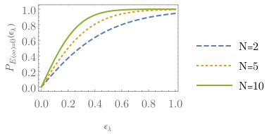

*Figure 2: Exact numerical calculation for grokking probabilities for a different number of training samples $N=2$ (dashed blue line), 5 (dotted orange line), and 10 (full green line). Grokking probability increases with $N$ and $\epsilon_{\lambda}$.* **[p. 9]**

###### p8-7

The effect of the $L_{1}$ and $L_{2}$ regularisations on the trained model is different. The $L_{2}$ regularisation is multiplicative, and the $L_{1}$ regularisation is additive concerning the gap between the positive and negative samples $\epsilon$. Hence, in the case of a small gap, the $L_{1}$ regularisation becomes much more effective. In other words, for an infinitesimal gap ($\epsilon\ll 1$) and finite $N$, the $L_{1}$ regularisation ensures that the probability of zero test error is finite. This is not the case when using the $L_{2}$ regularisation.

It would be interesting to see if $L_{1}$ regularisation is preferred to $L_{2}$ regularisation also in more realistic scenarios. In fact, we find a similar distinction between the $L_{1}$ and $L_{2}$ normalised models also in the more general grokking scenario discussed in Section 3.2.2.

**[p. 9]**

###### p9-1

We define the *grokking time* as the difference between $t_{\epsilon}$ (zero-test-error time) and the time at which the training error becomes zero. In our simple case, we have

$$
t_{G}=\frac{1}{1+\lambda_{2}}\log\left(\frac{\epsilon+x_{\rm min}-\bar{x}_{\lambda}}{\epsilon-\bar{x}_{\lambda}}\right). \tag{16}
$$

The grokking time does not depend on the initial condition as long as $b(0)>x_{\rm min}$. To find the grokking-time PDF, we need to calculate the distribution $P_{N}(\bar{x},x_{\rm min})$ and then consider only the part $|\bar{x}|\leq\epsilon_{\lambda}$. We provide the details of the calculation in the Appendix A. For a finite $N$ it is possible to obtain a closed form expression which, however, is not very instructive. Here we provide the unnormalised grokking-time PDF for $N=2$

$$
P^{\rm unnorm}_{N=2,\epsilon,\lambda_{1}}(t)= \frac{1}{8}e^{-\frac{4e^{t}\left(2e^{t}+5\right)\epsilon_{\lambda}}{e^{t}+1}-2t}\Bigg(\exp\left(\frac{4e^{t}\epsilon_{\lambda}(3\sinh(t)+\cosh(t)+4)}{e^{t}+1}+3t\right) \\
-64\epsilon_{\lambda}^{2}e^{4\left(4-\frac{3}{e^{t}+1}\right)\epsilon_{\lambda}+3t}-24\epsilon_{\lambda}e^{2\left(\left(8-\frac{6}{e^{t}+1}\right)\epsilon_{\lambda}+t\right)}-8\epsilon_{\lambda}e^{4\left(4-\frac{3}{e^{t}+1}\right)\epsilon_{\lambda}+t} \\
-2e^{\frac{4\left(4e^{t}+1\right)\epsilon_{\lambda}}{e^{t}+1}}-3e^{4\left(4-\frac{3}{e^{t}+1}\right)\epsilon_{\lambda}+t}-\left(e^{t}+1\right)e^{4\left(2e^{t}-\frac{1}{e^{t}+1}+2\right)\epsilon_{\lambda}}\left(e^{t}\left(e^{t}-8\epsilon_{\lambda}-1\right)-2\right)\Bigg), \tag{17}
$$

which we normalise by dividing with the appropriate grokking probability, see Eq. 14.

###### p9-4

In Fig. 3 we show several numerically exact grokking-time PDFs. The expected grokking time is smaller with increasing training size $N$ and effective class separation $\epsilon_{\lambda}$. This is consistent with the observations of [6, 8] where a shorter grokking time has been reported for increased number of training samples and a larger weight decay.

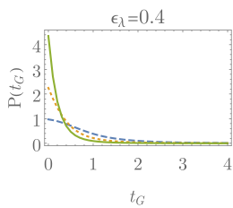

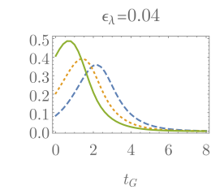

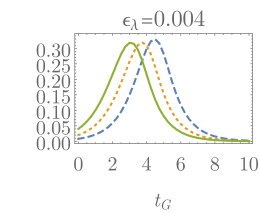

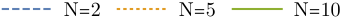

*Figure 3: Numerically exact the grokking-time $t_{\rm G}$ PDF at different number of training samples $N=$2 (dashed blue line), 5 (dotted orange line), 10 (full green line). Left, middle, and right panel correspond to $\epsilon_{\lambda}=$0.4 (left), 0.04 (middle), 0.004 (right). Grokking time is shorter with increasing $N$ and $\epsilon_{\lambda}$.* **[p. 10]**

###### p11-1

We write the training loss with $L_{1}$ and $L_{2}$ regularisation as

$$
\mathcal{R}= \frac{1}{2N}\sum_{i=1}^{2N}\frac{1}{2}(\tilde{x}^{i}\cdot w-y^{i})^{2}+\frac{\lambda_{2}||w||_{2}^{2}}{2}+\lambda_{1}|w|_{1}. \\
= \frac{1}{2}w\cdot\left(\frac{1}{2N}\sum_{i=1}^{2N}\tilde{x}^{i}\otimes\tilde{x}^{i}+\lambda_{2}\mathds{1}_{D}\right)w-w\cdot\left(\frac{1}{2N}\sum_{i=1}^{2N}y^{i}\tilde{x}^{i}-\lambda_{1}\mathrm{sgn}(w)\right)+\frac{1}{2} \\
= \frac{1}{2}w\cdot Gw-w\cdot a+\frac{1}{2}, \\
G= \frac{1}{2N}\sum_{i=1}^{2N}\tilde{x}^{i}\otimes\tilde{x}^{i}+\lambda_{2}\mathds{1}_{D}, \\
a= \frac{1}{2N}\sum_{i=1}^{2N}y^{i}\tilde{x}^{i}-\lambda_{1}\mathrm{sgn}(w). \tag{19}
$$

**[p. 11]**

Again we assume that the training dataset is balanced, i.e. $y^{i\leq N}=1$, $y^{i>N}=-1$, $\tilde{x}^{i\leq N}=x^{i}+\epsilon$, and $\tilde{x}^{i>N}=x^{i}-\epsilon$. In our model $x^{i}$ are distributed uniformly in a $D-$dimensional ball centered at the origin.

###### p11-3

The presented model is relevant in the transfer learning setting [50], if only the last layer of a network is retrained, and with sigmoid activation functions in the penultimate layer. If the model transfers well to a new classification task, the latent-space distributions of the new classes are linearly separable and can be bounded by a $D-$dimensional ball. Since we do not know the details of the distributions, we assume the uniform distribution in the ball. Further, the positive and negative feature distributions might be embedded in a higher dimensional latent space. In this case, $D$ corresponds to the effective dimension of the data, which can be calculated from the covariance matrix. As we will see in the next section, the introduced $D-$dimensional ball model qualitatively reproduces the critical exponent and the grokking-time PDF in a local-rule learning problem.

###### p12-2

where $t_{\epsilon}$ is defined as time at which the test error vanishes, and the coefficient $k_{G}$ is given by the linear expansion of $w(t)$ around $t_{\epsilon}$. The critical exponent is hence determined only by the dimensionality of the feature distribution.

###### p13-5

For a given set of parameters $\lambda_{2}$, $D$, and $\varepsilon$ we can efficiently numerically evaluate the integral in Eq. 30 (and the full formula reported in Appendix B). In Fig. 5 we show the full grokking probability as a function of $D$, $\lambda_{2}$, $N$, and $\varepsilon$. As expected, the grokking probability is larger with increasing distance $\varepsilon$ and number of samples $N$. We also observe that the grokking probability exponentially decreases with the dimensionality of the latent-space data distribution $D$. Therefore, latent-space distribution with a low effective dimension is preferred for better generalisation. This result partially explains the observation in [8] which relates grokking to structure formation and effective dimension decrease at the transition. We expect that low effective dimension in the latent space increases generalisation in a more general setting, beyond the simple grokking scenario described in this section. In other words, models with latent space distributions with small effective dimension will more likely lead to good generalisation. Finally, by increasing the $L_{2}$ regularisation strength $\lambda_{2}$ the grokking probability increases up to a maximum that depends on the remaining parameters. These results provide, some justification of the numerical observation in [6, 8, 9] that weight decay increases the parameter region where grokking is observed.

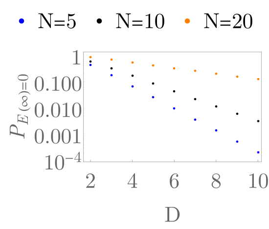

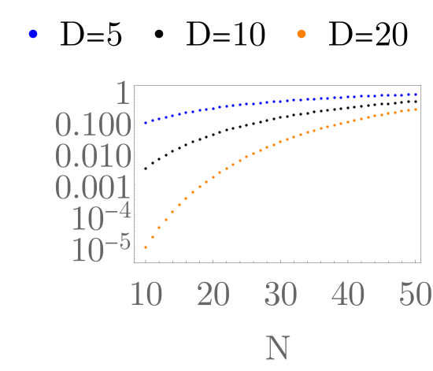

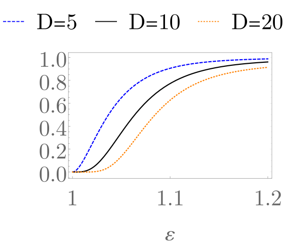

###### fig-5

*Figure 5: Grokking probability as a function of $D$, $\lambda_{2}$, $N$, and $\varepsilon$. We find that larger dimension $D$ decreases the grokking probability. In contrast, larger regularisation strength $\lambda_{2}$ increases the grokking probability. As expected, increased class separation $\varepsilon$ and number of training samples $N$ also increases the grokking probability. If not specified in the panels, additional parameters are set to: $D=10$, $\lambda_{2}=0.1$, $N=10$, and $\varepsilon=1.01$.* **[p. 14]**

###### p14-4

We find a similar distinction between the $L_{1}$ and $L_{2}$ regularisations as in the simple 1D case. At $\varepsilon=1$ and $\lambda_{1}=0$ the grokking probability vanishes for any value of $\lambda_{2}$. In contrast, for $\lambda_{1}>0$ the grokking probability can increase even above $90\%$ for any $D\geq 2$. Interestingly, the grokking probability increases with the dimensionality of the data distribution $D$. In fact, if we send $D\rightarrow\infty$ the grokking probability becomes 100% if $0<\lambda_{1}<\epsilon$. This result is a consequence of the concentration of measure of the uniform distribution ”around the equator”. Similarly, by using the lower bound Eq. 33 we estimate the best value of $\lambda_{1}$ for any $\epsilon$, $D$ and $N$ and find that the grokking probability maximum is always larger than $0.915$. In contrast, in the $\lambda_{1}=0$ case, the grokking probability becomes exponentially small with $D$, independent of the remaining parameter values. We make similar observations also if we relax the condition $\lambda_{2}\gg 1$ (see Appendix B).

###### p14-5

The discussed results could be applicable more generally. It would be interesting to check if $L_{1}$ weight regularisation in the last (classification) layer significantly improves the generalisation of deep models compared **[p. 15]** to the $L_{2}$ regularisation. The works [6, 8] do not study the differences between $L_{1}$ and $L_{2}$ regularisations. In [8] a consistent observation has been made, namely larger weight decay leads in most cases to a larger parameter region where grokking is observed. We confirm this expectation on a simple model discussed in Section 4.3.1 and Section 4.3.2.

###### p15-1

To calculate the grokking time, we first determine the condition for the zero train error. In contrast to the simple 1D case, this condition depends non-trivially on the training dataset and on the initial condition $w(0)$. To simplify the calculation, we calculate the distribution of the upper bound on the grokking time in the limit $N\gg 1$. We obtain the most conservative estimate for zero train error by selecting the training sample $\tilde{x}$ that forms the smallest angle with the plane defined shift vector $\epsilon$. We write this condition in terms of the cosine of the angle as

$$
\frac{w_{1}}{||w||_{2}}\geq\xi_{\rm train}=\max_{i}\frac{\sqrt{||x^{i}+\varepsilon||_{2}^{2}-(x^{i}_{1}+\varepsilon)^{2}}}{||x^{i}+\varepsilon||_{2}}, \tag{34}
$$

where $\xi_{\rm train}$ denotes the cosine of the smallest angle between the plane defined by $\epsilon$ and any training sample $\tilde{x}^{i}$. We will consider only the zeroth-order solution in $1/\sqrt{N}$, where the grokking probability becomes 100%. Namely, we also discard terms proportional to $1/\sqrt{N}$. In this limit the stationary solution is proportional to $\epsilon$, i.e. $w^{\lambda}\approx\frac{\epsilon}{\lambda_{D}+\varepsilon^{2}}$. The time dependent model parameters simplify to

$$
w_{1}(t)\approx \frac{\varepsilon}{\lambda_{D}+\varepsilon^{2}}+\left(w_{1}(0)-\frac{\varepsilon}{\lambda_{D}+\varepsilon^{2}}\right)\mathrm{e}^{-(\lambda_{2,D}+\varepsilon^{2})t}, \\
w_{j}(t)\approx  w_{j}(0)\mathrm{e}^{-\lambda_{2,D}t},\hskip 10.00002ptj>1. \tag{35}
$$

Since we consider only the leading (zeroth) order in $\frac{1}{\sqrt{N}}$, the value of $\lambda_{1}$ does not have such a dramatic effect as in Section 3.2.2. Therefore, we will study only the case $\lambda_{1}=0$. To further simplify the calculation we will also assume $\lambda_{2,D}=\lambda_{2}+\frac{1}{D+2}\ll 1$. In this limit we find

$$
\xi_{\rm train} \approx\max_{i}\sqrt{1-\left(\frac{x^{i}_{1}+\varepsilon}{||x^{i}+\epsilon||_{2}}\right)^{2}}\approx\frac{x_{\rm max}}{\sqrt{x_{\rm max}^{2}+\varepsilon^{2}}}\approx\frac{1}{\sqrt{1+\varepsilon^{2}}}, \tag{37}
$$

where $x_{\rm max}=\max_{i}||x^{i}||_{2}$. Similarly, Eq. 35 and Eq. 36 simplify to

$$
w_{1}(t)\approx \frac{1}{\varepsilon}+\left(w_{1}(0)-\frac{1}{\varepsilon}\right)\mathrm{e}^{-\varepsilon^{2}t}, \\
w_{j}(t)\approx  w_{j}(0)\mathrm{e}^{-\lambda_{2,D}t},\hskip 10.00002ptj>1. \tag{38}
$$

We find that the first component of $w$ relaxes much faster as the remaining components. Therefore, the parameter path can be approximated by two straight lines/paths. Along the first path, $w_{1}(t)$ quickly relaxes towards the stationary value $w_{1}^{\lambda}\approx 1/\varepsilon$. Then, along the second path, the remaining parameters slowly relax towards the stationary value $w_{j>1}^{\lambda}\approx 0$. This leads to two different zero train/test error conditions.

First, we consider the case when grokking occurs during the fast relaxation (first path). In this case, the condition for grokking to occur reads

$$
1\geq\frac{1}{\varepsilon^{2}}+||w^{\perp}(0)||_{2}^{2}, \tag{40}
$$

**[p. 16]**

where $w^{\perp}(t)$ is obtained from $w(t)$ by setting $w_{1}$ to zero. The zero train/test error is achieved after time

$$
t=\frac{1}{\varepsilon^{2}}\ln\left(\frac{\frac{1}{\varepsilon}-w_{1}(0)}{\frac{1}{\varepsilon}-\frac{\xi}{\sqrt{1-\xi^{2}}}||w^{\perp}(0)||_{2}}\right). \tag{41}
$$

We assume that $w_{1}(0)<w^{\lambda}_{1}\approx\frac{1}{\varepsilon}$ and obtain the final expression for the grokking time

$$
t_{\rm G}=\frac{1}{\varepsilon^{2}}\ln\left(\frac{\frac{1}{\varepsilon}-\frac{\xi_{\rm train}}{\sqrt{1-\xi_{\rm train}^{2}}}||w^{\perp}(0)||_{2}}{\frac{1}{\varepsilon}-\frac{\xi_{\rm test}}{\sqrt{1-\xi_{\rm test}^{2}}}||w^{\perp}(0)||_{2}}\right)\approx\frac{1}{\varepsilon^{2}}\ln\left(\frac{1-||w^{\perp}(0)||_{2}}{1-\frac{\varepsilon}{\sqrt{\varepsilon^{2}-1}}||w^{\perp}(0)||_{2}}\right). \tag{42}
$$

The grokking time in the considered limit depends only on the initial condition $w^{\perp}(0)$, i.e. on the initial distribution of the classifier weights. We assume that the initial model weights are sampled independently from a normal distribution with zero mean and unit variance. Setting $r=||w^{\perp}(0)||_{2}^{2}$, the variable $r$ follows the $\chi^{2}_{D-1}$ distribution. Therefore, we express the grokking-time PDF as

$$
P_{\rm fast}(t_{\rm G})\approx\chi_{D-1}^{2}(r(t_{\rm G}))\frac{\partial r(t_{\rm G})}{\partial t_{\rm G}}, \tag{43}
$$

where

$$
r(t_{\rm G})=\frac{\left(\varepsilon^{2}-1\right)\left(e^{t_{\rm G}\varepsilon^{2}}-1\right)^{2}\left(\varepsilon\left(\varepsilon e^{2t_{\rm G}\varepsilon^{2}}+2\sqrt{\varepsilon^{2}-1}e^{t_{\rm G}\varepsilon^{2}}+\varepsilon\right)-1\right)}{\left(\varepsilon^{2}\left(e^{2t_{\rm G}\varepsilon^{2}}-1\right)+1\right)^{2}}. \tag{44}
$$

Above result represents only one part of the grokking probability and hence the distribution $P_{\rm fast}(t_{\rm G})$ is not normalised. In fact, integrating $P_{\rm fast}(t)$ over the whole domain we obtain the probability to start with the initial condition where grokking occurs during the fast relaxation

$$
p_{\rm fast}=\int_{w}P(w)\Theta\left(1-\frac{1}{\varepsilon^{2}}-|w^{\perp}|^{2}\right)\mathrm{d}w=\int_{0}^{1-\frac{1}{\varepsilon^{2}}}\chi^{2}_{D-1}(r)\mathrm{d}r, \tag{45}
$$

where $\chi^{2}_{D-1}$ is the standard Chi-squared distribution.

The second part of the grokking-time PDF comes from the initial conditions where the zero test/train error is obtained during the slow relaxation process. In this case, we assume that the value $w_{1}(t)$ is stationary, i.e. $w_{1}(t)\approx w_{1}^{\lambda}\approx\frac{1}{\varepsilon}$. The remaining model parameters evolve according to Eq. 39. The time at which the train/test error vanishes reads

$$
t_{\rm train/test}=\frac{1}{\lambda_{2,D}}\ln\left(\frac{||w^{\perp}(0)||_{2}}{\sqrt{1-\xi_{\rm train/test}^{2}}w_{1}^{\lambda}}\right). \tag{46}
$$

After simplification we find the grokking time in the slow relaxation regime

$$
t_{\rm G}=\frac{1}{2\lambda_{2,D}}\ln\left(\frac{\varepsilon^{4}}{\varepsilon^{4}-1}\right). \tag{47}
$$

Interestingly, the grokking time is independent of the initial condition. Therefore, the distribution of the slow-relaxation grokking time is trivial, i.e. proportional to a Dirac delta distribution with the weight $1-p_{\rm fast}$, where $p_{\rm fast}$ is the probability of initialising the parameters with grokking during the fast relaxation given in Eq. 45.

**[p. 17]**

By combining the grokking-time PDFs for the fast and the slow relaxation we obtain the grokking-time PDF in the limit $\lambda_{2}\ll\varepsilon^{2}$. In Fig. 6 we show the grokking-time PDFs for several parameters sets in the considered limit. Increasing the input size $D$ reduces the probability of fast-relaxation grokking times and increases the slow-relaxation grokking time. While the fast-relaxation grokking time does not depend on the regularisation strength $\lambda_{2}$, smaller regularisation leads to increased slow-relaxation grokking time. On the contrary, larger class separation decreases both fast- and slow-relaxation grokking times.

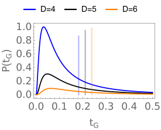

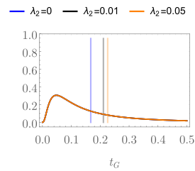

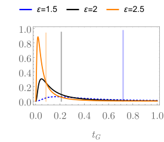

*Figure 6: Grokking-time PDF for several values of $D$, $\varepsilon$, and $\lambda_{2}$. The short relaxation grokking-time PDFs are represented by full lines. The Dirac-delta long-relaxation grokking time is represented by vertical bars. The position of the bar is the position of the Dirac-delta function and the height of the bar represents the weight of the Dirac-delta part of the distribution. If not specified in the panels, additional parameters are set to: $D=5$, $\lambda_{2}=0.01$, and $\varepsilon=2$.* **[p. 17]**

###### p17-2

We do not expect the analytically obtained grokking-time PDF to quantitatively describe real experiments, particularly because it is a zeroth-order large $N$ solution. However, the bimodal structure and the qualitative parameter dependence should also be present in more realistic scenarios. We will discuss one such example in Section 4.3.

###### p17-5

where $B(a,b)$ is the Euler beta function. Obtained critical exponent $\nu=\frac{D+1}{2}$ is universal for isotropic probability densities that do not vanish at the ball boundary and is consistent with the result in Eq. 23. **[p. 18]** If in addition the density $\rho(\delta h)$ has an algebraic divergence, e.g. $\rho(\delta h)\approx\rho_{\xi}\delta h^{-\xi}$ where $0<\xi<1$ we get

$$
E_{\rm test}(t)\propto(t-t_{\epsilon})^{\frac{D+1-2\xi}{2}}. \tag{50}
$$

###### p18-1

The critical exponent of the test error reveals the behaviour of the sample density at the boundary of the sample domain. While both the grokking probability and the grokking-time PDF depend on the details of the model’s initial parameters and the evolution, the critical exponent $\nu$ depends only on the data distribution at the boundary of the domain. Therefore, we expect that Eq. 50 describes the critical exponent quantitatively also in a more general setting. In this case we might have to relax the condition $0<\xi<1$ to accommodate a more general divergence of the data distribution at the sample domain boundary.

###### p18-2

In standard rule-learning theory the teacher-student model describes a setting where the student model has to learn a rule given by the teacher model, see [10]. In the simplest scenario where the teacher and the student models are perceptrons of the form Eq. 18 we use statistical mechanics methods to calculate the expected generalisation error for a given number of training samples (or training time). This is achieved in the thermodynamic limit where the input size $M$, and the number of training samples $N$ go to infinity such that $N=\alpha M$. The teacher and student weights are sampled uniformly on an $M$-sphere. In this setup, one can use the replica trick [47] to calculate the test-error behaviour as a function of $\alpha$. One finds $E_{\rm test}\propto\frac{1}{\alpha}$ when $\alpha\rightarrow\infty$. Although sudden transitions to zero generalisation error are possible, they are a consequence of a restriction on the phase space of parameters, e.g. in the Ising perceptron the parameters can take only values $\pm 1$.

###### p18-3

In summary, the standard rule-learning theory does not describe the grokking phenomenon and it is not clear how to reconcile the standard algebraic decay to zero test error with the grokking phase transition observed in deep models and presented in Section 3.

In this section, we fill this gap by introducing a local-rule learning scenario and a tensor-network map, allowing to interpolate between the standard mean-field like theory and the local, grokking setup. In particular, we introduce a local teacher and a tensor-network student setup which displays the grokking behaviour described in the previous section without any restriction on the values of the student model parameters. The tensor-network techniques will provide a correspondence between the standard teacher-student setup in the thermodynamic limit and the setup described in the Section 3. The grokking phase transition is then a consequence of the locality of the learned rule.

###### p19-1

We call such model a $K-$local model. The Eq. 51 describes a well-known cellular automata computational paradigm. Cellular automata are a universal discrete space-time dynamical systems with a finite set of possible states at each position [51, 52]. We define a cellular automaton by a set of rules which transform one configuration of states into another configuration. We will consider the rule 30 one-dimensional automaton ($K=1$) [51, 52], which exhibits chaotic behaviour and is defined by the rule $y_{i}=\mbox{rule30}(x_{i-1},x_{i},x_{i+1})$. The next state of the cell $i$, i.e. $y_{i}$, is determined by the current configuration at cells $i-1$, $i$, and $i+1$, i.e. $x_{i-1},x_{i},x_{i+1}$, as follows

$$
\begin{tabular}[]{c|c|c|c|c|c|c|c|c}$\mathbf{x_{i-1},x_{i},x_{i+1}}$&-1,-1,-1&-1,-1,1&-1,1,-1&-1,1,1&1,-1,-1&1,-1,1&1,1,-1&1,1,1\\
\hline\cr${\bf y_{i}=\mbox{rule30}(x_{i-1},x_{i},x_{i+1})}$&-1&1&1&1&1&-1&-1&-1\end{tabular}. \mathbf{x_{i-1},x_{i},x_{i+1}}
$$

We show an example time evolution of the rule 30 cellular automaton in Fig. 7. The initial condition is represented by the first line, black cells represent the value 1, and white cells represent the value -1. Our aim will be to learn one step of this evolution.

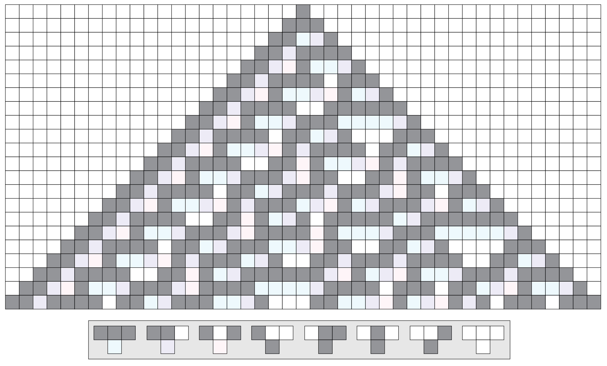

*Figure 7: Diagramatic representation of the rule-30 cellular automaton. In our convention, the black cells represent 1 and the white cells represent -1. The diagram is taken from Wikipedia [53].* **[p. 19]**

The rule-30 automaton has already been discussed in the context of sequence-to-sequence prediction with tensor networks [33, 22, 36], however, no grokking phenomena have been reported. To study the effect of the neighbourhood size $K$, we shall consider a rule defined by $K$ consecutive applications of rule 30. We will refer to such rule as a $K$–local rule.

In summary, we modify the standard perceptron teacher-student setup by restricting the teacher model to local instead of global rules. The teacher will be modelled by a local map transforming a sequence $x$ into the sequence $y$. The task will be to approximate the chosen map by training on a finite set of input samples of length $M$. For a finite $M$ we can choose open and closed boundary conditions. Open boundary conditions refer to the case when $y_{1}$ and $y_{M}$ are calculated as if $x_{0}=x_{M+1}=-1$. In the case of closed boundary conditions we have $x_{0}=x_{M}$ and $x_{M+1}=x_{1}$. The test set will include all possible input sizes from $M_{\rm test}=3,4,\ldots,\infty$. We will determine the error as the ratio of incorrectly predicted values $y_{i}$.

Besides the change from a global to a local rule, we will also modify the student model. Instead of the standard perceptron student model, we will use the uniform tensor-network attention model.

**[p. 20]**

###### p22-3

In the above formula $\vec{B}$ denotes the vectorised classification tensor $B$. By setting $D=2d^{2}$, we have mapped the local-rule learning problem in the thermodynamic limit to a (grokking) classification problem of the form discussed in Section 3. Interestingly, for a $K-$local rule, we can find $4^{K}$-dimensional matrices $A$ for which the transformed problem is solvable by a simple perceptron model and exhibits the grokking phenomena. Therefore, the $1/\alpha$ dependence on the training set size obtained from the standard rule-learning theory seems to be a consequence of the mean-field type infinite-range rule. For any local rule, we will observe grokking.


*Figure 8: The tensor network map from $\{-1,1\}^{M}$ to $\mathds{R}^{2d^{2}}$ implemented with Eq. 67, with $2\varepsilon$ denoting the distance between the closest positive and negative samples.* **[p. 22]**

###### p23-1

We now discuss the simulation results obtained by fixing the attention tensors $A$. Namely, we use the proposed tensor-network model as a map from $\{-1,1\}^{M}$ to $\mathds{R}^{2d^{2}}$ as discussed in Section 4.2.3 and shown in Fig. 8. We choose the left and the right boundary vectors $v^{\rm L,R}$ to be the eigenvectors of $A_{0}$ corresponding to the largest eigenvalue. We also fix the bond dimension $d=2$ and study the 1–local rule, which facilitates the comparison with the results discussed in Section 3.

###### p23-2

We determine the attention tensors $A$ by independently sampling each element according to the normal distribution with zero mean and unit variance. Since not all attention vectors lead to solvable problems, we perform rejection sampling by checking if the final model parameters given by Eq. 21 have zero test error. Once we obtain a solvable instance of the attention tensor $A$, we do not change its parameters during training.

###### p23-4

The minimal bond dimension of the exact solution can be reduced to 2 if we generalise the model and train different left and right attention tensors $A$. In the exact, 1-local attention case, the vectors $z_{i}(x)$ contain only information about the state of the neighbouring positions. Since the smallest size $M=3$ contains all eight possible inputs, larger training set size $M$ does not change the results. After averaging over many initialisations of the classifier part of the network $B$ we obtain the average test error shown in Fig. 9. We observe a first-order transition with a jump of 1/4 in the test/train error. Here the factor 1/4 comes from the fact that the neighbourhood of any given position has four possible different values.

###### fig-9

*Figure 9: The first-order phase transition when learning with the exact attention tensors $A$ given in Eq. 4.3.1. The jump in the transition is 1/4.* **[p. 23]**

In the following, we discuss results obtained by randomly sampling the attention tensors $A$. We show results for three different attention tensors $A$, namely Example 1, Example 2, and Example 3 reported in Appendix C.

###### p23-6

We estimate the grokking probability as the fraction of the sampled attention tensors $A$ that leads to linearly separable feature space data for the studied rule. In contrast to the grokking probabilities discussed in Section 3, we fix the training set to contain all possible samples of length $M=3$. In Fig. 10 we show the dependence of the grokking probability with respect to regularisation strengths $\lambda_{1,2}$. We observe that the $L_{2}$ regularisation decreases the grokking probability while the $L_{1}$ regularisation first slightly increases the grokking **[p. 24]** probability and then decreases compare to models without regularisation. In all cases the $L_{1}$ regularised model has larger grokking probability as the $L_{2}$ regularised model with the same regularisation strength. Larger grokking probability for $L_{1}$ regularised models is another indicator that $L_{1}$ regularisation could lead to better generalisation compared to the $L_{2}$ regularisation.

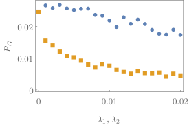

###### fig-10

*Figure 10: Grokking probability ($P_{\rm G}$), representing the fraction of the attention tensors $A$ that map the 1–local rule to linearly separable data. We show the dependence of $P_{\rm G}$ on the $L_{1}$ regularisation strength ($\lambda_{1}$ blue circles) and the $L_{2}$ regularisation strength ($\lambda_{2}$ orange squares). The $L_{1}$ regularised models have larger grokking probability compared to the $L_{2}$ regularised models. We used 20k random attention tensors to estimate the grokking probability.* **[p. 24]**

###### p24-1

Sampled attention vectors $H^{\rm L,R}(i)$ also contain information about the input beyond only the neighbouring sites. Moreover, information about the neighbours is not complete. Therefore, we observe a second-order transition, as discussed in Section 3. In Fig. 11 we show the average test error for three different but fixed attention tensors obtained by rejection sampling. The exact values of the attention vectors are reported in Appendix C. We find that the critical exponent $\nu$ does not depend on the regularisation strengths $\lambda_{1,2}$ and is in all cases smaller than one, which is in agreement with the predictions of the simple grokking model discussed in Section 3.

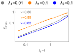

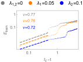

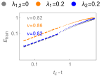

*Figure 11: Average test error during training with fixed attention vectors (log-log plot). From left to right we report results for Example 1, Example 2, and Example 3 attention tensors $A$ given in Appendix C. The fitted critical exponents $\nu$ are shown in the plots and only mildly depend on $\lambda_{1,2}$.* **[p. 24]**

###### p24-2

Besides the test-error critical exponent we estimate several properties of the feature distributions. In particular, we calculate the effective dimension $D_{\rm eff}$, the divergence exponent $\xi$ of the sample PDF at the boundary of the domain, and the distance between positive and negative samples $\varepsilon$. These quantities are calculated from the training-dataset features $z_{i}(x)$. To calculate the effective dimension $D_{\rm eff}$ we first find $\sigma_{k}$ defined as the fraction of the variance explained by the $k$th principal component of the training dataset features $z_{i}(x)$. Then we calculate the entropy $S$ of the ratios $\sigma_{k}$ defined as **[p. 25]** $S=-\sum_{k}\sigma_{k}\log\sigma_{k}$. Finally, the effective dimension is obtained as the exponent of the entropy, i.e. $D_{\rm eff}=\mathrm{e}^{S}$. We report the effective dimensions for the considered Examples 1-3 in Table 1.

We also use the vectors $z_{i}(x)$ to estimate the divergence exponent of the sample PDF at the boundary of the domain. In the considered case, the vectors $z_{i}(x)$ are a tensor product of three vectors. Therefore, we estimate the divergence in the PDF by focusing separately on each of the components of the vector $z_{i}(x)$. One of the vectors is a constant vector determined by the embedding function and does not contribute to the divergence exponent. The remaining, important parts are the left and the right context vectors, namely $v^{\rm L}H^{\rm L}_{N}(i)$ and $H^{\rm R}_{N}(i)v^{\rm R}$. We consider the normalised context vectors which, in addition, have size two (since we fix $d=2$). Therefore, they are uniquely determined by the angle with the first component and we can accordingly estimate the divergence at the boundary of the domain by studying the PDF of the angle. We estimate the divergence exponent by looking at the behaviour of the estimated PDF at the boundary with an increasing number of bins. The final exponent is obtained as a sum of the exponents obtained from the left and the right-attention part of the feature vector $z_{i}(x)$. We find (see Fig. 12) that the PDF diverges algebraically with the powers reported in Table 1.

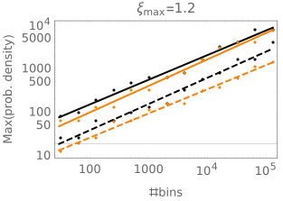

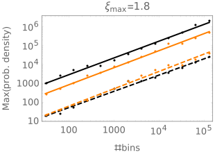

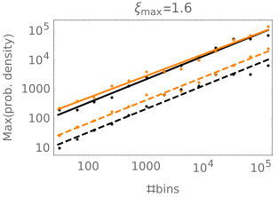

*Figure 12: The estimated PDF maximum of the positive (black) and negative (orange) samples. The dashed line fits correspond to the left context vectors $v^{\rm L}H^{\rm L}_{\rm N}(i)$ and the full line fits to the right context vectors $H^{\rm R}_{\rm N}(i)v^{\rm R}$. The final value reported in the panel title is obtained as a maximum sum of the left and right divergence exponents. From left to right we report results for Example 1, Example 2, and Example 3 attention tensors $A$ given in Appendix C.* **[p. 25]**

###### p25-2

In Section 3.2.4 we derived a relation between the exponents $\nu$, $\xi$ and the effective dimension for a simple $D-$dimensional ball model. Interestingly, we find that the relation given by Eq. 50 obtained from a simple spherically symmetric model is reasonably close in two out of the three considered cases (see Table 1).

We also estimate the class separation from the actual feature space distribution and report it in the units of the intra-class variance (see Table 1).

###### tab-1

*Table 1: Critical exponent $\nu$ and numerically calculated characteristic parameters of the feature vector $z_{i}(x)$ distribution. We also compare the numerically estimated divergence of the sample PDF at the boundary $\xi^{*}$ with the prediction of the spherical model (Eq. 50).* **[p. 25]**

|  | $D_{\rm eff}$ | $\nu$ | $\xi^{*}$ | $\xi=\tfrac{1}{2}(D_{\rm eff}-2\nu+1)$ (Eq. 50) | $\epsilon$ |
|---|---|---|---|---|---|
| Example 1 | 3.0 | 0.85 | 1.2 | 1.15 | 1.45 |
| Example 2 | 3.8 | 0.75 | 1.8 | 1.65 | 1.46 |
| Example 3 | 3.0 | 0.84 | 1.6 | 1.16 | 1.6 |

###### p25-4

Finally, we estimate grokking-time PDF, see Fig. 13. We do not expect that the prediction of Section 3.2.3 will quantitatively describe the estimated grokking-time PDF. Besides the “worst-case” initial condition assumption, the condition $N\gg 1$ is not valid. Hence, the actual value of $G$ is far from identity. However, some qualitative predictions of the $D-$dimensional ball model can still be observed. First we notice, the bimodal structure of **[p. 26]** the estimated grokking-time PDF. In the spherical model, the two peaks are a consequence of the separation between the slow and fast modes, where the dynamics of the slow modes was essentially determined by the regularisation strength $\lambda_{2}$. Similarly, in all three considered cases (i.e. Example 1-3) we can separate the eigenvalues of $G$ by size in two sets. In one set the eigenvalues are by one order of magnitude larger than in the other. However, increasing the regularisation strength $\lambda_{2}$ often leads to increased grokking time, which is not the case in the simple uniform ball model. The discrepancy is a consequence of the non-diagonal matrix $G$, which mixes different components of the vector $z_{i}(x)$. We also observe that a larger effective dimension $D_{\rm eff}$ (see Table 1) leads to longer grokking times and a larger class separation $\varepsilon$ to smaller grokking times. The last two observations are in agreement with the $D-$dimensional ball model discussed in Section 3.2.3.

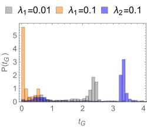

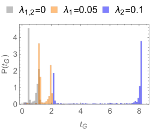

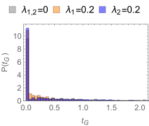

*Figure 13: We show the estimated grokking-time PDFs for three fixed attention tensors: Example 1 (left), Example 2 (middle), and Example 3 (right). In most cases, the grokking-time PDF is bimodal, which is in agreement with the prediction of the simple grokking model discussed in Section 3.2.3.* **[p. 26]**

###### p26-1

The presented results are obtained by averaging over many initialisations of the classification tensor $B$. We sample the initial elements of $B$ from a normal distribution with zero mean and unit variance. Changing the initial distribution can impact the results. Determining the effect of the initial distribution of $B$ on the grokking-time PDF and the critical exponent is left for future research.

###### p26-2

In this section, we discuss grokking and structure formation properties of the complete student model introduced in Section 4.2. We initialise the model with a random initial condition, where all the entries of the tensors $A,B$ are uncorrelated and sampled according to a normal distribution with zero mean and unit variance. We train the model with the Adam optimiser (with standard parameter setting) and learning rate 0.005. We use the same loss as in the previous sections Eq. 4 with $L_{1,2}$ regularisation strength $\lambda_{1,2}\in[0,0.001]$. The regularisation strength is the same for the attention tensor $A$ and the classifier tensor $B$. We add a sigmoid non-linearity before the final sign non-linearity to improve the training stability and reduce the training time. We consider only open boundary conditions and set $x_{-1}=x_{M+1}=-1$. Finally, in the main text we consider only the 1-local rule. We discuss the 2– and 3–local rules in Appendix D. We perform tests in three situations, namely, without regularisation ($\lambda_{1,2}=0$), with $L_{2}$ regularisation ($\lambda_{1}=0$, $\lambda_{2}=0.0001$), and with $L_{1}$ regularisation ($\lambda_{1}=0$, $\lambda_{2}=0.001$). We chose the regularisation strengths $\lambda_{1,2}$ to be the largest regularisation strengths with only few spikes in the training loss after the grokking time. To obtain zero test error it is sufficient (in almost all cases) to train only the attention parameters $A$ and fix the classification parameters $B$. This is a consequence of the gauge symmetry of the tensor attention layer [36]. However, we will always train all model parameters. Since the full tensor-attention model is non-linear, we do not expect the theory developed in Section 3 to be valid. On the other hand, we do observe phenomena related to neural collapse [5] and structure formation [8].

**[p. 27]**

###### p27-1

First, we investigate the dynamics of the average test error and calculate the critical exponent $\nu$. In Fig. 14 we show that the critical exponent decreases upon increasing regularisation. Larger regularisation leads to a sharper transition to zero test error, in contrast with the linear case studied in the Section 3.2.2 and in the Section 4.3.1, where the critical exponent was found to be independent of the regularisation strengths $\lambda_{1,2}$. The test error drops to zero at the grokking transition. Following the grokking transition, the test error is non-zero and experiences fluctuations. These fluctuations can be detected as sharp increases in the training loss and are more common in models with large regularisation. Therefore, the $L_{1,2}$ regularised models have larger average test error after the grokking transition.

###### fig-14

*Figure 14: The average test error at the phase transition. We align the first point where the test error becomes zero (i.e. the time $t_{\epsilon}$) and take the average over many ($\sim 1000$) initialisations of the model parameters. Training without regularisation results in larger critical exponent $\nu\approx 2.5$ as training with $L_{1}$ ($\nu\approx 0.7$) or $L_{2}$ ($\nu\approx 0.9$) regularisation. In all experiments we used learning rate 0.005. In the legends we report the bond dimension of the trained models $d$ and the corresponding fitted critical exponent $\nu$.* **[p. 27]**

###### p27-2

The shape of the average test error close to transition point $t_{\epsilon}$ (or the critical exponent $\nu$) depends only slightly on the model size (bond dimension $d$). This suggests that the effective dimension of the mapped data $D_{\rm eff}$ is independent of the model size. We confirm this by calculating the effective dimension of the features $z(i)$. Since we study only open boundary conditions, we consider only the effective dimension of the left context vectors $v^{\rm L}H^{\rm L}_{\rm N}(i)$. The right context vectors $H^{\rm R}_{\rm N}(i)v^{\rm R}$ have the same properties because of the model symmetry. As shown in Fig. 15, the average effective dimension drops significantly just before the grokking transition. We observe that regularisation significantly decreases the effective dimension of the mapped vectors $v^{\rm L}H^{\rm L}_{\rm N}(i)$. The effective dimension is smallest with $L_{1}$ regularisation, which is expected since the $L_{1}$ regularisation enforces sparsity while the $L_{2}$ regularisation enforces smoothness.

###### fig-15

*Figure 15: The average effective dimension corresponding to the error in Fig. 14. Larger regularisation results in a smaller effective dimension $D_{\rm eff}$ after the grokking transition. The horizontal dashed line corresponds to the average of the minimal effective dimension of data with zero test error (over all samples with fixed $d$).* **[p. 28]**

###### p27-3

We relate the decrease of the effective dimension to structure formation. As can be seen in examples shown in Fig. 16 and Fig. 17, small effective dimension signals an emergent feature space structure which, however, can be different in each example. Similarly, in [8] the authors argue that the grokking in deep models is related to structure formation. Our findings differ from those of [8] in that we discuss ensemble/average phenomena. The authors of [8] discuss the connection between grokking and structure formation on the single-model level. In contrast, we argue that grokking and structure formation are related on average as shown in Fig. 14 and Fig. 15, and not for every training run individually. We call the structure formation and grokking for a single training of a model the model-wise structure formation and the model-wise grokking. We disentangle model-wise structure formation from model-wise grokking by observing specific training samples. We typically observe the appearance of a simple structure in data in the proximity of the grokking transition. This is consistent with a sharp drop of the average effective dimension at the transition (shown in Fig. 15). Additionally, we observe that feature space structures can be different for different model parameters and initialisations.

###### p27-4

In Fig. 16 and Fig. 17 we show the structures appearing in the features $v^{\rm L}H^{\rm L}_{\rm n}(i)$ with bond dimension $d=3$. **[p. 28]** In Fig. 16 we see that the structure of the feature space data changes also during a single run. This can be detected as a spike in the training loss or as a step-like jump in the effective dimension (see Fig. 16). The structures can change from lower to higher dimensional and vice versa, e.f. see Fig. 16 – the transition between $t=1$ and $t=1.2$ increases the effective dimension $D_{\rm eff.}$ of the mapped data. Appearance of geometric structures in the latent space does not necessary lead to good generalistion, i.e. small test error (see Fig. 17 at time $t=0.57$). Finally, we also show in Fig. 17 that we can have a small generalisation/test error with complex or not apparent feature space structures (see Fig. 17 at time $t=1.19$). These empirical observations suggest that grokking and structure formation are not related model-wise. That structure formation and grokking are in general two distinct phenomena is further corroborated by our simple grokking model discussed in Section 3, which does not require any special geometric structure (aside from the condition of linear separability).

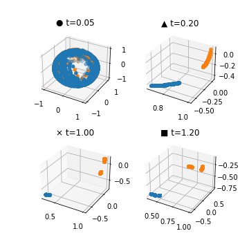

###### fig-16

*Figure 16: Several emergent structures in the feature space (Example 1). The left plots show the effective dimension $D_{\rm eff}$ (top), train loss (middle), and test error (bottom). The black markers show the value of the plotted quantities at specific times marked by vertical dotted lines and written on the top of the left panels. The right panels show the structure of the features at the marked times. We observe that an essentially one dimensional feature distribution with two distinct islands of features splits into an almost 2D feature distribution with three isolated islands. We can detect this transition as a sharp peak in the loss and a step in the effective dimension $D_{\rm eff}$.* **[p. 29]**

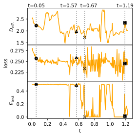

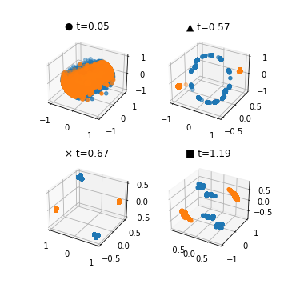

###### fig-17

*Figure 17: Several emergent structures in the feature space (Example 2). The left plots show the effective dimension $D_{\rm eff}$ (top), train loss (middle), and test error (bottom). Black markers show the value of the plotted quantities at times marked by vertical dotted lines and written on the top of the first plot. The right panels show the structure of the features at the marked times. We observe that structured data also appears in the case of high test error ($t=0.57$). The zero-test-error structure ($t=0.67$) is different compared to the example in Fig. 16. Here, we see a 2D structure with four isolated feature islands. Finally, at time $t=1.19$ the structure starts to disappear while the test error is still considerably small (smaller than $1\%$).* **[p. 30]**

###### p28-1

Finally, we estimate the PDF of the grokking times, see Fig. 18 (top panels). Taking the non-regularised case as the baseline, we find that $L_{1}$ regularisation decreases the average grokking time $\overline{t_{\rm G}}$ significantly more than $L_{2}$ regularisation. Further, grokking times for $L_{2}$ regularised models increase with the model size. On the other hand, non-regularised and $L_{1}$ regularised models have roughly a model-size-independent grokking-time PDF, and hence the grokking-time average.

###### p29-1

By studying two solvable grokking models, we show that grokking is a phase transition and calculate the critical exponent, grokking probability, and grokking-time PDF. The obtained analytic expressions allow us to determine the effect of model and training parameters on the grokking probability and the grokking-time PDF. In particular, we find a stark difference between the $L_{1}$- and $L_{2}$-regularised models. The $L_{1}$-regularised models have a higher grokking probability and a shorter grokking time as the $L_{2}$-regularised models. We also obtain a universal expression for the test-error critical exponent of spherically symmetric models, which is relevant in the transfer learning setting, where only the last layer is retrained.

###### p29-2

We use the tensor-network attention model with fixed attention tensors $A$ to test the predictions of the perceptron grokking setup on a 1D cellular-automaton rule-30 learning task. Our prediction of the critical exponent roughly agrees with the numerical estimation, thereby validating the grokking scenario on a simple problem. On the other hand, the grokking-time PDF approximation, which invokes strong assumptions, predicts the actual numerical estimate only qualitatively.

###### p29-3

We also perform the training of the full tensor-network student model. Similarly as in solvable perceptron grokking models, we observe a difference between the $L_{1}$-regularised and the $L_{2}$-regularised models. The former have a shorter grokking time and a lower effective dimension, which agrees with the analytic predictions of the perceptron grokking models. Therefore, we expect that $L_{1}$ regularisation leads to improved generalisation properties (e.g. smaller test error) compared to $L_{2}$ regularisation also in a more general classification setting.

###### p29-4

In the case of training the full tensor-network student model we discuss the connection between grokking and structure formation. We determine the grokking transition by observing the average test error. We show that the average effective dimension of the feature-space data sharply decreases at the grokking transition. **[p. 30]** By observing specific models, we also find that small effective dimensions correspond to particular feature-space structures. We accordingly relate grokking with structure formation on the ensemble level. By contrast, we find several models with zero test error without apparent feature-space structures and vice versa. This shows that in specific (though rare) cases, the test error drops to zero even if no structure is present in the data. Similarly, simple structures can appear during training also when the test error does not vanish. We thus separate the grokking and the structure formation on the level of individual training runs.

###### p30-1

As a distinct feature of the full tensor-network training we highlight the spikes in the training loss. We observe that spikes become more frequent with larger $L_{1,2}$ regularisation. We also relate the training-loss spikes to the changes in the feature-space structures, which may become less or more complex during training. We can assess the shape of the feature-space structures by observing the effective dimension, which shows a step-like behaviour whenever we observe a training-loss spike. Typically less complex structures correspond to a smaller effective dimension. These findings can be relevant for deep-neural-network training where training-loss spikes are also observed. Frequent training-loss spikes can be avoided by using a smaller regularisation. Moreover, we can determine whether the model parameters should be reverted by monitoring the feature-space effective dimension. For example, we can revert the model only if the training-loss spikes correspond to increased effective dimension.

###### p30-2

Finally, the proposed tensor-network map connects the grokking phenomena, which have so far been observed only in deep models, with the standard teacher-student learning setup. The considered local tensor-network rule learning setup is an extreme example of a learning rule. The standard teacher-student mean-field setup is the opposite extreme. It would be interesting to study if the proposed grokking setup and the tensor-network map can be extended to study algebraically decaying rules which interpolate between the two extremes. Extending the presented theory to deep neural networks appears to be difficult within the proposed framework.

**[p. 31]**
