# Bhattamishra et al. 2023 — Simplicity Bias in Transformers and their Ability to Learn Sparse Boolean Functions

See also: [the global concept index](../../concepts/index.md). arXiv [2211.12316v2](https://arxiv.org/abs/2211.12316), 10 July 2023 (v1 — 22 November 2022). The PDF has no running head naming a venue; the Comments field on arXiv says "ACL 2023".

**Satwik Bhattamishra, Varun Kanade** — University of Oxford.
**Arkil Patel** — Mila; McGill University.
**Phil Blunsom** — University of Oxford; Cohere.

The files of this paper's analysis:

- [`2211.12316.simplicity-bias-in-transformers-and-their-ability-to-learn-sparse-boolean-functions.license.txt`](2211.12316.simplicity-bias-in-transformers-and-their-ability-to-learn-sparse-boolean-functions.license.txt) — the arXiv licence record for this paper.

The anchor scheme and the rules for linking into a card are in the [README of the papers folder](../README.md).

**Excerpt card.** The paper's licence (`arxiv-nonexclusive`) does not permit republishing the paper itself; what stands here are the editorial sections and the fragments the corpus quotes (right of quotation). The paper: <https://arxiv.org/abs/2211.12316>.

## Concepts covered

**[Sparse parity](../../concepts/sparse-parity.md)** — the work gives sparse parity a second role in the corpus: not a proving ground for analysing one architecture but a **separating** task on which two families of models diverge. The notation is taken from learning theory and introduced carefully: $\text{Parity}\text{-}(n,k)$ at $k\ll n$ is a ${k\text{-sparse}}$ function of average sensitivity at most $k$ ([p. 3, para. 7](#p3-7)), and learning it by gradient methods requires "at least $n^{\Omega(k)}$ computational steps", with a reference to Kearns 1998 ([p. 7, para. 1](#p7-1)). The chief result the corpus gains from here is an inverted contrast: on full $\text{Parity}\text{-}40$ LSTMs generalise well and transformers fail; on $\text{Parity}\text{-}(40,4)$ it is exactly the reverse — transformers generalise while LSTMs "overfit severely", reaching $100\%$ on training at a validation accuracy near the level of chance ([p. 7, para. 6](#p7-6), [fig. 5](#fig-5)). The experiments run at 30k training and 10k validation examples across five datasets, with the strings drawn independently from $\{0,1\}^{40}$ rather than as fractions of one small table. What the work does not contain: theory — neither a proof nor an analysis of a mechanism; the authors refer outright to Barak et al. 2022 for a possible mechanism and stipulate that "the exact details are unclear" ([p. 8, para. 6](#p8-6)). Nor is there a claim that transformers learn arbitrary $k$-sparse functions: at $n=100$ and $k=5$ good generalisation could not be attained ([p. 8, para. 4](#p8-4)).

**[Grokking](../../concepts/grokking.md)** — grokking here is **not the subject of the work but an incidental observation of an appendix**: the main text has a single referring sentence about it ([p. 7, para. 7](#p7-7)), and it is described in a paragraph of [appendix E](#sec-e). The description is given by the shape of the curves: "the training accuracies begin to rise gradually with no change of the validation accuracy. After some number of iterations the validation accuracy rises and coincides with the training accuracy" ([p. 20, para. 2](#p20-2), [fig. 18](#fig-18), [fig. 19](#fig-19)). Three things here are valuable for the corpus. First, the grokking is obtained **without weight decay**: Adam is used throughout, and SGD with weight decay, by the authors' own admission, did not let either transformers or LSTMs generalise on parities, sparse parities or random $k$-sparse functions ([p. 22, para. 3](#p22-3)). Second, the target function is known, so "generalisation" here means agreement with the target rather than merely a rise of the validation accuracy. Third, the sample size at which grokking is visible depends on the positional encoding: under absolute encoding it is observed at relatively large datasets (30k), and under learnt positional embeddings "reliably" at small ones (5k) ([p. 19, para. 2](#p19-2)). What the work does not contain: no measure of the delay, no number of runs and no seed spread for the grokking runs in particular, and no dependence of the delay on anything whatever; the word "reliably" is not supported quantitatively. The reference to Power et al. 2022 is the only one and stands as a pointer to the similarity of what is observed, alongside Barak et al. 2022.

**[Phase transition](../../concepts/phase-transition.md)** — the work separates two phenomena often conflated in the corpus. A phase transition: the training and validation accuracies "do not change over a large number of training iterations and then abruptly reach a nearly perfect accuracy within a few iterations" ([p. 20, para. 1](#p20-1), [fig. 6](#fig-6)) — this is the same as Barak et al. 2022 report, and the authors cite them outright. Grokking is a different shape of curve, with a gradual rise of the training accuracy at a stationary validation accuracy ([p. 20, para. 2](#p20-2)). It matters too that the abruptness is not a trait of a single architecture: the same sharp transitions are observed in LSTMs on full $\text{Parity}\text{-}30$ ([fig. 17](#fig-17)). What the work does not contain: no language of statistical physics, no order parameter and no measurements of the transition itself — the word "transition" here is descriptive, and the analysis wholly qualitative.

**[The memorisation phase / the plateau](../../concepts/memorization-phase.md)** — the work gives the corpus a rare case in which "memorisation" is visible **not only in the curves but in the complexity of the function learnt**. LSTMs on $\text{Parity}\text{-}(40,4)$ reach $100\%$ on training while remaining at the level of chance on validation ([p. 7, para. 6](#p7-6)), and the same repeats on random $k$-sparse functions ([p. 8, para. 2](#p8-2)); and the sensitivity of the function learnt is measured: an overfitted LSTM "converges to functions of far higher sensitivity than that of the target function", whereas in a transformer it matches the target ([p. 8, para. 3](#p8-3), [fig. 16](#fig-16)). Memorisation thereby receives a measurable signature — an excess complexity of the solution at zero training error. What the work does not contain: the vocabulary of "memorising" and "generalising" solutions, a separation of subnetworks, and an analysis of why an LSTM in particular overfits — the last the authors declare unknown in so many words ([p. 8, para. 6](#p8-6)).

**[Label noise / random labels](../../concepts/label-noise-random-labels.md)** — label noise here is not a device for inducing delayed generalisation but a **robustness check**, and in that role it yields the paper's strongest experiment: at 5–20 % of labels flipped, transformers "achieve a perfect generalisation accuracy", while the training accuracy settles exactly at the fraction of clean labels $1-\eta$ ([p. 7, para. 3](#p7-3), [p. 7, para. 7](#p7-7), [fig. 6](#fig-6)). In the same place stands an authors' caveat that is easily lost: "In some cases, after training for a large number of iterations past convergence, transformers begin to overfit to the noise" — that is, the perfect generalisation is a property of a stretch of the training rather than of its limit. Separately, random labels serve as a yardstick of capacity: on Boolean strings with random labels both architectures are driven to zero training error ([p. 6, para. 2](#p6-2)), and on SST with random labels both "fit the training set nearly perfectly without difficulty", spending markedly more iterations on it ([p. 22, para. 1](#p22-1), [fig. 23](#fig-23)). What the work does not contain: a measurement of the moment at which the fitting to noise begins, and any quantitative dependence on $\eta$ whatever.

**[The data fraction / the critical dataset size](../../concepts/data-fraction-critical-dataset-size.md)** — the control quantity is an **absolute number of examples** rather than a fraction of a full table: the training and validation sets are drawn independently from $\{0,1\}^{n}$, so a "data fraction" in the setting of Power et al. is simply undefined here. The window, however, is bounded on both sides and named by numbers: at $1000$ training examples transformers overfit in every run ([fig. 20](#fig-20)), at $2500$ they already learn the correct function within under $10000$ computational steps, and at $5000$–$10000$ the overfitting returns in models of greater depth ([p. 8, para. 5](#p8-5)). To this is added the dependence of the convergence time on the dataset size: across five sizes ({5k, 25k, 50k, 100k and 250k}) the median, minimum and maximum numbers of iterations are plotted over 50–100 successful runs ([p. 19, para. 7](#p19-7), [fig. 22](#fig-22)). What the work does not contain: neither a name nor a formula for the threshold — no "critical dataset size" and no analysis of how the threshold shifts under regularisation; and only the successful runs are counted, so the curve of figure 22 says nothing about what fraction of runs converged.

**[The optimiser](../../concepts/optimizer-adam-adamw-sgd.md)** — the work gives the corpus clean negative evidence about the optimiser: "We were unable to make either LSTMs or transformers generalise well with SGD, either on Sparse Parities or on standard Parity. Both architectures appear to succeed with the Adam optimiser" ([p. 20, para. 1](#p20-1)), and in the implementation details it is put more strongly: SGD with weight decay was tried too — without success on all three families of tasks ([p. 22, para. 3](#p22-3)). All the paper's observations, grokking included, are thereby tied to Adam. What the work does not contain: an analysis of what exactly Adam helps with, a sweep of its settings beyond the learning rate, and even one curve for SGD — the negative result is reported in words.

**[Weight decay](../../concepts/weight-decay.md)** — the work is valuable for this notion precisely for the **absence** of weight decay: its only mention is a failed attempt to train with SGD and weight decay ([p. 22, para. 3](#p22-3)), and all the positive results, including the grokking on $\text{Parity}\text{-}(40,4)$, are obtained with Adam without it. The nearest thing to regularisation is an experiment with LSTMs: dropout and L2 lengthen the convergence, but the model "overfits all the same and converges to a function of higher sensitivity than the target", and under further strengthening it stops fitting even the training data ([p. 19, para. 4](#p19-4)). What the work does not contain: no claim that weight decay is needed for grokking and none that it is harmful; the values of $\lambda$ and the dropout rates are not named, and there are no curves for this experiment.

**[When regularisation is necessary](../../concepts/regularization-necessity.md)** — the paper is arranged so that explicit regularisation is needed in it for nothing: the transformers' generalisation on sparse functions is obtained under plain Adam, and on LSTMs explicit regularisation is tested and **does not save** them ([p. 19, para. 4](#p19-4)). The explanation the authors lay on implicit regularisation, remaining within a hedge: "there is some kind of implicit regularisation in the training procedure of neural network models that keeps them from overfitting despite their incredible capacity" ([p. 9, para. 6](#p9-6)). What the work does not contain: any attempt to name that implicit regularisation as a quantity — no weight norm, no margin and no complexity of the solution in the role of what is minimised; sensitivity is measured here but is not declared a regularisable quantity.

**[The initialisation scale](../../concepts/initialization-scale.md)** — the initialisation scale turns out to be what the chief "prior" result depends on entirely. Under a uniform draw of weights in $[-10,10]$ and under a Gaussian one with $\sigma=10$ the sensitivity distribution of transformers is sharply skewed towards zero, while that of LSTMs is markedly higher ([p. 4, para. 5](#p4-5), [p. 5, para. 1](#p5-1), [fig. 3](#fig-3)); under the initialisations used in practice (Xavier normal and Xavier uniform, $\sigma=d^{-1/2}$) a low sensitivity is given by **both** architectures, and the gap shrinks to "relatively lower". That is, the bias is visible on a broad survey of parameter space rather than at the working point. A counting experiment stands separately: among 10 million random LSTMs of depth $2$ and hidden size $8$ the Parity function occurs about once in 30 000 — "more than **60 000** times likelier than by a random draw of Boolean functions" — whereas among 10 million random transformers not one was found ([p. 15, para. 3](#p15-3)). What the work does not contain: an analysis of how the bias changes at intermediate scales between $\sigma=10$ and $\sigma=d^{-1/2}$, and any claim about the influence of the scale on learnability — the training experiments are run only at Xavier normal.

**[Kolmogorov complexity](../../concepts/kolmogorov-complexity.md)** — the work chooses sensitivity precisely as a **computable substitute** for uncomputable measures of simplicity and says so outright: functions of low sensitivity "have a low Kolmogorov complexity" (with the authors' footnote "The converse is not always true"), have simpler Fourier spectra and are representable by shallow decision trees, whereas "measures such as Kolmogorov complexity are uncomputable, while sensitivity can be estimated tractably" ([p. 1, para. 6](#p1-6)). The neighbouring measures of simplicity are not taken on trust: in [B.1](#sec-b1) the size of the smallest sum-of-products (SOP) expression, the label entropy and the critical-sample ratio (CSR) are added to sensitivity, computed at length 7 over 200k random models ([fig. 9](#fig-9)). A caveat about the direction of the relation matters too: a high sensitivity entails a high entropy and CSR, but not conversely — a dictator function gives the maximum entropy at a very low sensitivity ([p. 14, para. 7](#p14-7)). What the work does not contain: compression, description length and any estimate of the Kolmogorov complexity itself — it is mentioned only as a landmark for the choice of measure.

**[The frequency principle / spectral bias](../../concepts/frequency-principle-spectral-bias.md)** — the observation that both architectures learn functions of **increasing** sensitivity ([p. 6, para. 3](#p6-3), [fig. 16](#fig-16)) the authors themselves assign to an already known line and relate to frequency: the results "echo earlier observations" that networks trained by SGD learn functions of increasing complexity (Nakkiran et al. 2019), and "functions with a lower average sensitivity also have a lower frequency, and so these observations are closely related" to the observation of Rahaman et al. 2019 about low-frequency modes ([p. 6, para. 4](#p6-4)). The work's contribution here lies in the carry-over: sensitivity, unlike a Fourier spectrum, extends naturally to textual data, and the same "simple before complex" order is shown on SST and IMDB. What the work does not contain: a frequency analysis proper — no Fourier decomposition of the learnt functions and no spectral measures; the relation to frequency is asserted verbally, through the known relations between sensitivity and Fourier degree.

**[Progress measures](../../concepts/progress-measures.md)** — the work gives a quantity later used as a progress measure but does not do so itself. The sensitivity of the learnt function is measured **at every training epoch** ([p. 6, para. 2](#p6-2), [p. 6, para. 3](#p6-3)) and on $k$-sparse functions behaves tellingly: in a transformer it arrives exactly at the sensitivity of the target function, and in an overfitted LSTM it goes far above ([p. 8, para. 3](#p8-3), [fig. 16](#fig-16)). The term "progress measure" does not appear in the paper, the time to convergence is not predicted through sensitivity, and on the grokking runs of appendix E the sensitivity is not computed — so it was later works that made this quantity a progress measure (Vasudeva et al. 2024, `2403.06925` in the corpus; no card as yet). The negative half matters too: on real datasets the course is the same but the outcome different — "on real datasets we did not find transformers converging to functions of lower sensitivity" ([p. 17, para. 8](#p17-8)).

**[Generalisation bounds](../../concepts/generalization-bounds.md)** — in [D.1](#sec-d1) sensitivity is built into the classical machinery of capacity: a class of functions with a maximum sensitivity of at most $k$ is uniquely determined by its values on a Hamming ball of radius $2k$, whence $\mathsf{VCD}(\mathcal{F}_{k})=\mathcal{O}(n^{2k})$ and the usual bound on the gap between the true and empirical errors (Proposition D.1) ([p. 18, para. 2](#p18-2)). This is a statement about a **class of functions**, not about a trained network: nothing in it says that the function found by the network lies in $\mathcal{F}_{k}$ at a small $k$. The empirical half stands apart and is weaker: on SST a positive correlation of surrogate sensitivity measures with the generalisation gap is measured, with RoBERTa having a lower sensitivity at a better test accuracy ([p. 18, para. 7](#p18-7), [fig. 14](#fig-14)). What the work does not contain: a substitution of the measured sensitivities into the bound, numerical values of the bound, and any relation between the theoretical and empirical halves of appendix D.

**[The canonical grokking proving ground](../../concepts/canonical-grokking-testbed.md)** — the work offers the corpus a ground of a different construction from a modular operation table: a family of ${k\text{-sparse}}$ functions (sparse parities, sparse majority $\text{Maj}\text{-}(n,k)$, the dictator function $\text{Dict}\text{-}n$, random juntas $\text{Juntas}\text{-}(n,k)$) with a known target function, a difficulty tunable through $k$ and $n$ and an admissible label noise ([p. 7, para. 1](#p7-1)). Two features make it valuable: success is checked by agreement with the target rather than by validation accuracy alone ([p. 8, para. 3](#p8-3)); and an experiment is set up on it that separates the architectures' biases within a single dataset — a "mixed parity" in which the first bit selects between the full and the sparse parity, with the LSTM taking the full one and the transformer the sparse ([p. 19, para. 6](#p19-6), [fig. 21](#fig-21)). What the work does not contain: any claim to being a canon — the ground is built for the sake of comparing architectures, grokking is noticed on it in passing, and on variable-length tasks the difference between the architectures disappears altogether ([p. 21, para. 4](#p21-4), [E.1](#sec-e1)).

---

## Points we could not reconcile

**The dataset size for figure 17 is stated twice and differently.** The text of appendix E says that the LSTMs on standard parity "are trained on datasets of size 20k, where the input strings are of length 30" ([p. 19, para. 1](#p19-1)), whereas the caption of the figure itself speaks of a dataset "containing 30k examples" ([fig. 17](#fig-17)). The discrepancy is present in the published PDF too, so it is not an artefact of the conversion. Citing this experiment as an example of a sharp transition in a recurrent model, one cannot name the dataset size.

**The caption of figure 20 credits the LSTM with a training set that does not exist in the paper.** The caption says that the transformers' overfitting at 1k examples "is similar to how LSTMs overfit on far larger training sets (40k examples)" ([fig. 20](#fig-20)), whereas in section 5.2 the training set for the parities is 30k examples and 10k constitute the validation set ([p. 7, para. 5](#p7-5)). The number 40k occurs nowhere else in the paper; most likely it is obtained by adding the training and validation sets, but as the LSTM's training set size it is unconfirmed.

**The description of the Xavier uniform initialisation contradicts the definition of Xavier normal in the main text.** In the main text the standard deviation is set as $\sigma=d^{-1/2}$, where $d$ is the number of hidden units ([p. 4, para. 5](#p4-5)); in appendix B.3 it is said of Xavier uniform that "all the values in the weight matrices are drawn uniformly between $-d^{1/2}$ and $d^{1/2}$" ([p. 15, para. 2](#p15-2)), that is, with an exponent of the opposite sign — at $d=256$ that is an interval of width 32 instead of $1/8$. The formula is preserved in the translation as it stands; in reproducing the experiments with Xavier uniform one should rely on the main text and on the PyTorch scheme rather than on this line. This inconsistency is absent from the paper's claims file — it was found while checking the card against the PDF.

---

## What is shown, what is declared a conjecture and what is admitted unknown

The paper honestly lays out its own layers of solidity, and when citing it matters which layer a claim comes from.

**Measured.** The sensitivity distributions of randomly initialised models under four weight-sampling schemes and across dozens of configurations ([p. 4, para. 5](#p4-5), [fig. 3](#fig-3)); a counting experiment searching for Parity among 10 million random models of each architecture ([p. 15, para. 3](#p15-3)); the growth of sensitivity over the course of the training and its value at the point of zero training error — 20 datasets at 100 runs each and separately 15 datasets at 100 trained models each ([p. 6, para. 2](#p6-2), [fig. 4](#fig-4)); the contrast of the architectures on sparse Boolean functions, label noise included ([p. 7, para. 6](#p7-6), [p. 8, para. 2](#p8-2)); and the dependence of the number of steps to convergence on the dataset size ([fig. 22](#fig-22)).

**Declared a conjecture in so many words.** The paper's chief conclusion is hedged in the abstract itself and in the introduction: "we hypothesise that one of the reasons for the practical effectiveness of transformers may be that they are more strongly biased towards simple functions" ([p. 1, para. 5](#p1-5)). The guess about the cause of the bias of random transformers is likewise: on inspecting the attention weights they behave similarly to hard-attention transformers, and those express only $\text{AC}^{0}$, in which sensitivity is low, and "this **may help to explain** why random transformers have a low sensitivity" ([p. 15, para. 6](#p15-6)). The bridge from the prior distribution to trained models is borrowed and caveated: the equality of the Bayesian and SGD posteriors $P_{B}(f|S)\approx P_{SGD}(f|S)$ is a result of Mingard et al. 2021 obtained on other architectures and data, whence it follows only that $P_{SGD}(f|S)$ "**could** be biased towards functions of low sensitivity" ([p. 5, para. 4](#p5-4)).

**Admitted unknown by the authors themselves.** The ["Clarifications"](#sec-6) section cuts off the easy reading twice. To the question whether the bias towards low sensitivity explains the good generalisation on $k$-sparse functions, the answer is "No": a relation is possible, but "the exact details are unclear and, more importantly, why and how LSTMs overfit is unclear too" ([p. 8, para. 6](#p8-6)). To the question whether transformers are effective in practice primarily on account of a simplicity bias, the answer is "This question is difficult to answer" ([p. 9, para. 3](#p9-3)).

**Negative results named by the authors.** Arbitrary $k$-sparse functions the transformer does not learn: at $n=100$ and $k=5$ good generalisation could not be attained ([p. 8, para. 4](#p8-4)). On variable-length tasks (VarParity, VarMaj) the difference between the architectures disappears, and the authors write outright that "these results do not support the hypothesis put forward in section 1" ([p. 21, para. 4](#p21-4)). On the text datasets SST and IMDB transformers do not converge to a lower sensitivity than LSTMs ([p. 17, para. 8](#p17-8)). And no architecture could be made to generalise with SGD on any of the tasks ([p. 20, para. 1](#p20-1)).

**Not measured at all.** Grokking is analysed qualitatively: no size of the delay, no number of runs and seed spread for the grokking runs, and no dependence of the delay on the dataset size or on the positional encoding — the word "reliably" ([p. 20, para. 2](#p20-2)) is not supported quantitatively. Nor is the moment at which a transformer begins to fit the noise measured ([p. 7, para. 7](#p7-7)).

---

## Common misreadings and overstatements of this paper

Below are the patterns observed in the citing works of the corpus. For each one it is said what exactly gets distorted, with links to the authors' paragraphs where the qualification that goes missing still stands. The "Common misreadings and overstatements" sections on the citing side have not been started yet, so there is nothing detailed to address; the citing works are listed as plain links to their cards.

**"The transformers' bias towards low sensitivity explains the delayed generalisation" (erroneous).** The work is cited as one of the hypotheses about the cause of grokking. Jiang et al. 2026 list it among explanations of delayed generalisation: `"or architectural bias in transformers that favors simpler, low-sensitivity functions that generalize better (Bhattamishra et al., 2022)"`; Ahuja et al. 2024 assign it to explanations through a simplicity bias: `"The other explanations rely on *simplicity bias*, hypothesizing that the solutions that generalize are simpler but slower to learn (Shah 2023, Nanda et al. 2023, Bhattamishra et al. 2023, Varma et al. 2023)"`. The authors themselves answer this question in the negative and in a separate section: to the directly posed question whether the bias towards low sensitivity explains the good performance on $k$-sparse functions, the answer is "No", the relation is called possible but not a direct explanation, and why an LSTM overfits is declared unknown ([p. 8, para. 6](#p8-6)); to the question about the practical effectiveness of transformers the answer is "This question is difficult to answer" ([p. 9, para. 3](#p9-3)). This explanation the less concerns grokking: the grokking is observed in appendix E, and the sensitivity was not computed on the grokking runs ([p. 20, para. 2](#p20-2)). Works concerned: [Jiang et al. 2026](../2601.03162.on-the-convergence-behavior-of-preconditioned-gradient-descent-toward-the-rich-learning-regime/2601.03162.on-the-convergence-behavior-of-preconditioned-gradient-descent-toward-the-rich-learning-regime.card.md), Ahuja et al. 2024 (no card as yet).

**"The work showed that at a larger training-data fraction the validation loss falls earlier" (widening).** Zhou et al. 2024 compare their curves across split fractions with this paper: `"This observation aligns with the findings reported in Barak et al. (2022); Bhattamishra et al. (2023), corroborating the described phenomenon."` — their subject being "different train/test split fractions". In the setting of Bhattamishra et al. no such fraction exists: the training and validation sets are drawn independently from $\{0,1\}^{n}$, and the control quantity is an absolute number of examples. The nearest measurement in sense is the number of steps to convergence against the dataset size ([p. 19, para. 7](#p19-7), [fig. 22](#fig-22)), but it is taken over the successful runs alone and says nothing about the fraction that converged; besides, the dependence is not monotone in the direction implied — at 1k examples the transformer simply overfits ([p. 8, para. 5](#p8-5), [fig. 20](#fig-20)). Work concerned: [Zhou et al. 2024](../2405.17479.a-rationale-from-frequency-perspective-for-grokking-in-training-neural-network/2405.17479.a-rationale-from-frequency-perspective-for-grokking-in-training-neural-network.card.md).

**"In Bhattamishra et al. grokking was observed on sparse parity" (accurate, but requiring a caveat).** This retelling is the commonest in the corpus and is correct in itself: Lyu et al. 2024 write `"grokking has been reported in learning group operations (Chughtai et al. 2023), learning sparse parity (Barak et al. 2022; Bhattamishra et al. 2023)"`, and Mohamadi et al. 2024 that grokking occurs "beyond modular arithmetic: in learning sparse parities". The caveat lost in the process: the observation lives in a single paragraph of appendix E and in two pairs of curves ([p. 20, para. 2](#p20-2), [fig. 18](#fig-18), [fig. 19](#fig-19)), the delay is not measured, the number of runs is not named, and two conditions are named — the positional encoding and the dataset size ([p. 19, para. 2](#p19-2)). The work may rightly be cited as evidence for the existence of grokking on this task, but not as a measurement or an analysis of it. Works concerned: [Lyu et al. 2024](../2311.18817.dichotomy-of-early-and-late-phase-implicit-biases-can-provably-induce-grokking/2311.18817.dichotomy-of-early-and-late-phase-implicit-biases-can-provably-induce-grokking.card.md), [Mohamadi et al. 2024](../2407.12332.why-do-you-grok-a-theoretical-analysis-of-grokking-modular-addition/2407.12332.why-do-you-grok-a-theoretical-analysis-of-grokking-modular-addition.card.md).

Exemplary formulations for comparison are given by works that inherit the measure rather than the phenomenon: Vasudeva et al. 2024 write `"Bhattamishra et al. 2023b and Hahn & Rofin 2024 show that transformers are biased to learn functions with low sensitivity on Boolean inputs"` and separately state the negative half — that token-level sensitivity is "shown experimentally to be similar for transformers and LSTMs"; Teney et al. 2025 confine themselves to the claim that `"The simplicity bias exists in transformers Bhattamishra et al. 2022; Zhou et al. 2023"`. Neither work (`2403.06925`, `2503.10065`) has a card as yet.

---

# Quoted fragments

Only the fragments the corpus cards refer to are
reproduced here (right of quotation); the paper's licence does not permit
republishing the whole text. Anchor numbering matches the original.

###### p1-5

Although recurrent models such as LSTMs have been shown to perform better on formal languages such as Parity, we find that they struggle to generalize well on several sparse Boolean functions such as Sparse Parities. We find a clear contrast between the generalization abilities of Transformers and LSTMs on various ${k\textsc{-sparse}}$ Boolean functions which have low sensitivity. Additionally, through extensive empirical analysis, we provide strong evidence to suggest differences in the bias towards low complexity functions between Transformers and recurrent models. Based on our results, we hypothesize that one of the reasons behind Transformer’s practical effectiveness could be that they are more biased towards simple functions in comparison to recurrent models which may lead to better generalization.

###### p1-6

In particular, we focus on a complexity measure **[p. 2]** called sensitivity (Kahn et al. 1989), which measures how likely it is that a function value changes due to a ‘small’ change in input. Sensitivity is related to several other complexity measures; functions with low sensitivity have low Kolmogorov complexity,22 2 The converse is not always true. simpler Fourier spectra, and can be represented by decision trees of small depths. The relationship between sensitivity and generalization has also been previously studied in the literature (Novak et al. 2018; Franco 2006).33 3 A more thorough discussion is presented in Appendix B.2 While measures such as Kolmogorov complexity are uncomputable, sensitivity can be tractably estimated and extensions of sensitivity can be used to estimate the complexity of functions in more realistic NLP tasks (Hahn et al. 2021).

**Our Contributions.** We investigate the bias in (a) *parameter space* by analyzing randomly initialized models, and (b) *learning procedure* by examining the sensitivity of models during the training process. Motivated by our findings indicating differences between the biases of Transformers and LSTMs, we evaluate their performance on functions of low sensitivity.

**(i)** We demonstrate that random Transformers are significantly more likely to represent functions of lower sensitivity than recurrent models when the weights are sampled uniformly or according to Normal distribution (see Figure 1, bottom right). When the weights are initialized following practical strategies (such as Xavier normal), then both architectures are likely to have low sensitivity with Transformers having relatively lower sensitivity.

**(ii)** We show that both Transformers and LSTMs learn functions of increasing sensitivity when trained on a set of Boolean functions as well as practical datasets such as sentiment classification (see Figure 1, top right). For Boolean functions, Transformers converge to functions of lower sensitivity in comparison to LSTMs when both models achieve near-zero training error.

###### p3-7

**Sparse Boolean functions.** Another class of functions are the ${k\textsc{-sparse}}$ functions (also referred to as $k$-juntas) where the function value depends on at most $k$ coordinates of the input. More formally, a function $f\colon\{0,1\}^{n}\rightarrow\{\pm 1\}$ is ${k\textsc{-sparse}}$ if there exist indices $1\leq i_{1}<i_{2}<\ldots<i_{k}\leq n$ and a function **[p. 4]** $g\colon\{0,1\}^{k}\rightarrow\{\pm 1\}$, such that for every $x\in\{0,1\}^{n}$, $f(x_{1},x_{2},\ldots,x_{n})=g(x_{i_{1}},x_{i_{2}},\ldots,x_{i_{k}})$. Let $\textsc{SPARSE}\text{-}(k,n)$ be the class of ${k\textsc{-sparse}}$ functions on inputs of length $n$ that depend on at most $k$ bits. It is easy to see that, for any $f\in\textsc{SPARSE}\text{-}(k,n)$, the average sensitivity $s(f)\leq k$ (and hence $\mathcal{S}(f)\leq\frac{k}{n}$).

When $k\ll n$, $\textsc{SPARSE}\text{-}(k,n)$ can be seen as a subclass of all Boolean functions with low average sensitivity. Other functions with low average sensitivity can also be approximated with ${k\textsc{-sparse}}$ functions using Friedgut’s Junta Theorem (O’Donnell 2021, Page 269). The maximum average sensitivity $s(f)=k$ is attained by Sparse Parities denoted $f_{\mathsf{parity_{k}}}$ which is the Parity over a subset of $k$ coordinates. A sparse parity function $f_{\mathsf{parity_{k}}}$ over $S\subseteq[n]$, s.t. $|S|=k$ is $+1$ if the number of ones in the coordinates $S$ is odd and $-1$ otherwise. Other Boolean functions such as sparse majority can be defined similarly. The majority function $f_{\mathsf{maj}}$ over $\{0,1\}^{n}$ is $+1$ if the number of ones in the input is greater than the number of zeros and is $-1$ otherwise. Similarly, the sparse majority function $f_{\mathsf{maj_{k}}}$ is the majority function over coordinates $S\subseteq[n]$, s.t. $|S|=k$. Parities (and Sparse Parities) are an important class of Boolean functions since any Boolean function can be represented as a linear combination of a set of Parity functions.

###### p4-5

In our experiments, we explore four strategies to sample random networks: Uniform, Gaussian, Xavier uniform, and Xavier normal initialization. In uniform sampling, each parameter (weights and biases) is assigned a value by uniformly sampling in $[-10,10]$. Similarly, for Gaussian initialization, each parameter is assigned by sampling from $\mathcal{N}(0,\sigma^{2})$ where we set sigma as $10$. Xavier normal (Glorot and Bengio 2010) initialization is the one **[p. 5]** that is more commonly used in practice to train these models. All the weights are initialized with $\mathcal{N}(0,\sigma^{2})$ where the standard deviation $\sigma=d^{-1/2}$ where $d$ is the number of hidden units. All the input embedding vectors and positional embedding vectors are initialized with $\mathcal{N}(0,1)$ which is the default scheme in PyTorch (Paszke et al. 2019). For input lengths greater than 10, we estimate the sensitivity of each model by computing the average over a sampled set of bit strings. We sample 10k bit strings and compute the average sensitivity across the samples. For each hyperparameter configuration, we sample 75-1000 different models to estimate their sensitivity depending on the computational costs associated with it. For most of the results reported in the main paper, we consider bit strings of length $20$. But we also experiment with lengths $\in\{5,7,10,15,20,50,100,200\}$.

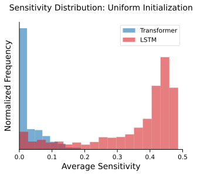

*(a)*

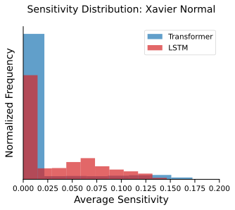

*(b)*

###### fig-3

*Figure 3: Distribution of sensitivity of randomly initialized Transformers and LSTMs for a fixed hyperparameter (layers=2, width=256).* **[p. 5]**

###### p5-1

**Results.** Figure 2 (upper row) and Figure 3 (left) shows the distribution of sensitivity for uniformly initialized Transformers and LSTMs. The distribution for Transformers is heavily skewed towards functions of very low sensitivity in comparison to LSTMs. The pattern holds across Gaussian initialization as well (see Figure 1, bottom right). For initialization strategies used in practice such as Xavier normal and Xavier uniform, we find that both Transformers and LSTMs have low sensitivity (see Figure 2, lower row and Figure 3, right) with Transformers having relatively lower average sensitivity. Refer to Section B.3 in the Appendix for results with Xavier uniform initialization.

Although we primarily discuss results with sensitivity in the main paper, similar experiments with other complexity measures are presented in Appendix B.1. Further experiments exploring the change in distribution across the number of layers, width, and lengths for both architectures are presented in Appendix B.3.

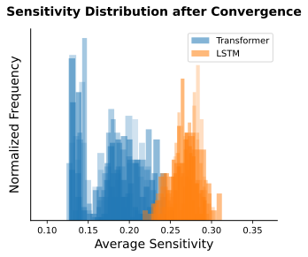

###### fig-4

*Figure 4: Distribution of sensitivity of Transformers and LSTMs trained on Boolean strings with random labels. Refer to Section 4.2 for details.* **[p. 5]**

###### p5-4

**Why randomly initialized models?** Each randomly initialized Transformer or RNN when restricted to domain $\{0,1\}^{n}$ represents one of the $2^{2^{n}}$ Boolean functions $f$ in $\mathcal{F}$. The distribution over $\mathcal{F}$ induced by randomly initialized models can be seen as their prior $P(f)$. Given a set of (training) examples $S=\{(x_{1},y_{1}),\ldots,(x_{m},y_{m})\}$, let $P_{B}(f|S)$ denote the probability of sampling $f$ conditioned on the event that the sampled function is consistent with $S$ (matches all the input-output mappings in $S$). We can apply Bayes’ rule to calculate the posterior $P_{B}(f|S)=P(S|f)P(f)/P(S)$ using the prior $P(f)$, the likelihood $P(S|f)$, and the marginal likelihood $P(S)$. Since we condition on $f$ being consistent with $S$ (zero training error), the likelihood $P(S|f)=1$ if $\forall x_{i}\in S$, $f(x_{i})=y_{i}$ and $0$ otherwise. Let $U(S)$ denote the set of all functions $f\in\mathcal{F}$ which are consistent with $S$. Note that, given a fixed training set $S$, since $P(S)$ is constant, the probability over the choice of $f\in U(S)$ ultimately depends on the prior $P(f)$. In practice, we do not fit the training set by sampling models to find one that is consistent with the training set. However, recent work Mingard et al. 2021 has shown that $P_{B}(f|S)\approx P_{SGD}(f|S)$ across a range of neural architectures and data sets. The SGD-based posterior $P_{SGD}(f|S)$ denotes the probabil**[p. 6]** ity that a neural network converges on function $f$ when trained to fit $S$. Hence, our results suggest that for Transformers, $P_{B}(f|S)$ would be concentrated on low-sensitivity functions and consequently, $P_{SGD}(f|S)$ could be biased towards low-sensitivity functions as well.

###### p6-2

**Setup.** We create datasets of size $1$k each by uniformly sampling bit strings of length $40$. The label for each input string is assigned randomly ($+1$ or $-1$ with probability $1/2$). All the weights of the models are initialized with Xavier normal initialization and the biases are initialized with zero vectors. We consider Transformers and LSTMs across various hyperparameter configurations with a similar number of parameters. We train the models until they reach zero training error and estimate the sensitivity of the models at every epoch. We conduct the experiments over $20$ different datasets with $100$ runs for Transformers and LSTMs each.

###### p6-3

**Sensitivity during training.** We find that both Transformers and LSTMs gradually learn functions of increasing sensitivity with Transformers converging to functions of much lower sensitivity than LSTMs (refer to Figure 1, top right). We observe similar behavior when the models are trained on various sparse Boolean functions including sparse parities. Even though sensitivity is defined over Boolean functions, we explore a few natural extensions to estimate the sensitivity of models trained on real datasets such as sentiment classification. On two sentiment classification datasets, namely SST and IMDB, we found similar observations where both Transformers and LSTMs seem to incrementally learn functions of increasing sensitivity. See Appendix C for more details.

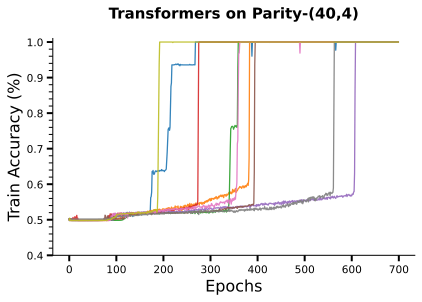

*(a)*

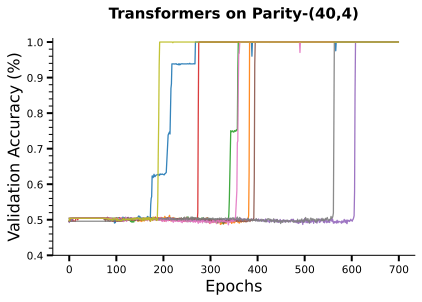

*(b)*

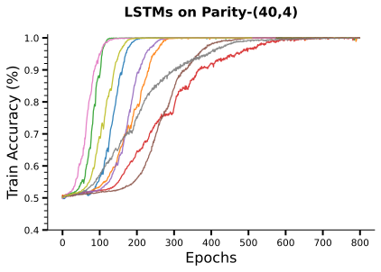

*(c)*

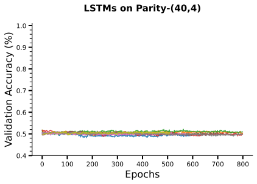

*(d)*

###### fig-5

*Figure 5: Training and validation curves for Transformers and LSTMs trained on Sparse Parities of length $n=40$ and $k=4$.* **[p. 6]**

###### p6-4

**Discussion.** Even if sequence models such as Transformers or LSTMs are capable of representing arbitrary functions, our results suggest that they prioritize learning simpler patterns first. These results echo prior observations that indicate feedforward-like neural networks trained with SGD learn functions of increasing complexity (Nakkiran et al. 2019; Arpit et al. 2017). Rahaman et al. 2019 find that ReLU neural networks learn functions of lower frequency modes first. Functions with lower average sensitivity also have a lower frequency and hence these observations are closely connected. More importantly, average sensitivity can be naturally extended to real data which allows us to empirically explore this for text data.

**Sensitivity upon convergence.** For Transformers and LSTMs trained until $0\%$ training error, we estimate the sensitivity of functions learned by the models. We create 15 datasets and for each dataset, we compute the sensitivity of $100$ trained models. The combined distribution of the sensitivity of the models across all datasets is shown in Figure 4. We observe that Transformers consistently learn functions of lower sensitivity in comparison to LSTMs. This supports our hypothesis that for Transformers the parameter search via algorithms such as Adam is more likely to find functions of lower sensitivity that fit the training set as opposed to LSTMs.

###### p7-1

**Boolean Functions.** We focus on ${k\textsc{-sparse}}$ Boolean functions which have low sensitivity when $k\ll n$ (refer to Section 3 for definition). We first consider certain Boolean functions which are widely studied in the analysis of Boolean functions. The first one is Sparse Parities which can be interpreted as the ${k\textsc{-sparse}}$ variation of standard parity. We denote an instance of Sparse Parities as $\textsc{Parity}\text{-}(n,k)$ where $n$ denotes the length of the input string and $k$ denotes the number of relevant bits. We denote an instance of standard Parity as $\textsc{Parity}\text{-}n$ where $n$ denotes the length of the input string and the output is computed based on the number of ones in all indices. Learning $\textsc{Parity}\text{-}(n,k)$ with gradient-based methods has well-known hardness results $-$ requiring at least $n^{\Omega(k)}$ computational steps to find the correct target function (Kearns 1998). The other two Boolean functions we consider are sparse majorities (denoted by $\textsc{Maj}\text{-}(n,k)$) and the dictator function (denoted by $\textsc{Dict}\text{-}n$). The output of the dictator function depends only on a single input bit, making it arguably one of the simplest Boolean functions with very low sensitivity. In $\textsc{Maj}\text{-}(n,k)$, the output for a string of length $n$ is determined by whether the number of ones is greater than the number of zeros in the $k$ relevant indices.

The second set of Boolean functions we consider is random ${k\textsc{-sparse}}$ functions (denoted by $\textsc{Juntas}\text{-}(n,k)$). For each instance of $\textsc{Juntas}\text{-}(n,k)$, the function is determined by randomly choosing $k$ indices and assigning labels to each of the $2^{k}$ distinct inputs randomly.77 7 Note that this is separate from the random Boolean functions in Section 4.2 where labels of unseen data is also random. In this scenario, the labels of the unseen inputs can be determined by learning the correct function from the training set.

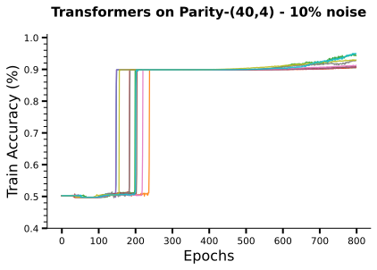

*(a)*

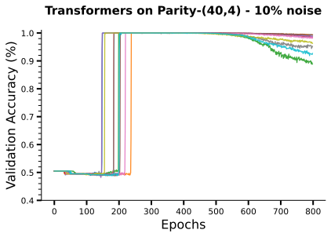

*(b)*

###### fig-6

*Figure 6: Training and validation curves for Transformers trained on $\textsc{Parity}\text{-}(40,4)$ with $10\%$ noise in the training data. See Section 5 for details.* **[p. 7]**

###### p7-3

**Noisy Labels.** We also conduct experiments to examine the ability of the models to learn in the presence of noise. In these experiments, labels of training data are flipped with a certain probability $\eta$. Thus, about $1-\eta$ fraction of the training data is clean and $\eta$ fraction of the training data has incorrect labels. The validation set is clean without any modifications. The goal is to investigate whether a model is robust to noise during the training process.

**Training Details.** The training and validation sets are created by uniformly sampling bit strings over $\{0,1\}^{n}$. In our experiments, we consider Transformers with 1-6 layers, 4-8 heads and width (usually referred to as d_model) within 8-128. We consider Transformers with both learnable and absolute positional encodings. For LSTMs, we consider up to 6 layers and widths (also referred to as hidden_size) within 8-256. The size of the token embeddings is kept the same as the width. We also consider the presence of learnable positional embeddings as a hyperparameter. We use batch sizes of 100 and 500 in all our experiments and tune across learning rates $\in\{\text{1e-1, 5e-2,}\ldots\text{, 1e-6}\}$. For each dataset, we extensively tune the models across various hyperparameters, details of which are provided in Appendix G.

###### p7-5

**Parities.** For $\textsc{Parity}\text{-}(40,4)$ and $\textsc{Parity}\text{-}40$, we create $5$ different datasets and report the results based on the maximum accuracy achieved on unseen test data. The train set consists of 30k samples and the validation sets contain 10k samples.

###### p7-6

We observe a stark contrast between the performance of Transformers and LSTMs on different forms of parity tasks. We find that Transformers struggle to fit and generalize on $\textsc{Parity}\text{-}40$ while LSTMs easily (across a range of hyperparameters) generalize well on them. On the other hand, perhaps surprisingly, on $\textsc{Parity}\text{-}(40,4)$, we find that while Transformers generalize well, LSTMs severely overfit and achieve poor validation accuracy. Although LSTMs achieve $100\%$ training accuracy over the training data, their validation accuracy does not move far beyond the chance level ($50\%$). Figure 5 depicts the training and validation accuracy curves for Transformers and LSTMs on $\textsc{Parity}\text{-}(40,4)$ task. We find similar behaviour for LSTMs even with learnable positional embeddings.

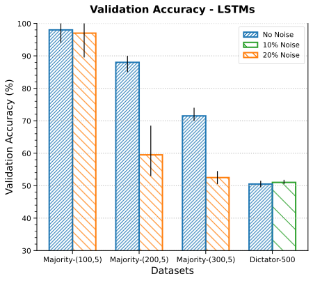

###### p7-7

**Robustness to noise.** On Sparse Parities datasets, we find that Transformers are surprisingly robust to noise. When the training data contains 5%-20% noise ($\eta$), Transformers achieve perfect generalization accuracy with training accuracy con**[p. 8]** verging at $1-\eta$. In some cases, after training for a large number of iterations post-convergence, Transformers begin to overfit on the noise. This observation echoes a similar finding in Tänzer et al. 2022 where they observed such behaviour while finetuning large pretrained models for sequence tagging tasks in the presence of noise. The training and validation accuracy curves are provided in Figure 6. The behaviour of recurrent models is the same as in the previous scenario with clean data: they overfit on the training data while achieving chance level validation accuracy. Additional results on $\textsc{Parity}\text{-}(n,k)$ across different dataset sizes, task variations, as well as exploring phenomena such as phase transitions and grokking are provided in Appendix E.

We observe this pattern across other sparse Boolean functions such as sparse majority and dictator functions as well. For sparse majority datasets $\textsc{Maj}\text{-}(n,5)$, we consider lengths $n\in\{50,75,100,200\}$ and for dictator functions $\textsc{Dict}\text{-}n$, we consider lengths $n\in\{100,200,300,500,700\}$. We experiment with various rates of noise (10 - 30%). While LSTMs do generalize well up to certain lengths, they achieve poor validation accuracy (<75%) as the lengths go higher. At the same time, they obtain $100\%$ training accuracy on all the datasets. The validation accuracies of LSTMs are reported in Figure 7. In contrast, Transformers achieve near-perfect generalization even in the presence of significant noise.

###### p8-2

**Random k-sparse functions.** For $\textsc{Juntas}\text{-}(n,k)$, we experiment with various datasets for $\textsc{Juntas}\text{-}(n,5)$ with $n\in\{30,50,80,150,200\}$. For lengths $n<150$, we find that LSTMs generalize well on some of the $\textsc{Juntas}\text{-}(n,5)$ functions. However, in the presence of $10\%$ noise (i.e., $\eta=0.1$), their performance degrades sharply. We create 10 datasets for $\textsc{Juntas}\text{-}(50,5)$ with $\eta=0.1$, and similar to previous scenarios, LSTMs struggle to generalize well (>75%) whereas Transformers are able to generalize perfectly on all the datasets (see Figure 1, top middle). However, even when the validation accuracies of LSTMs were below $75\%$, their training accuracy reached $100\%$ indicating that they overfit on the training data. Figure 1 (bottom left) shows the training and validation curves of LSTMs on the $10$ datasets.

###### p8-3

**Sensitivity During Training.** We observe that on ${k\textsc{-sparse}}$ functions, both Transformers and LSTMs learn functions of increasing sensitivity. However, when LSTMs overfit and reach zero training error, they converge to functions of much higher sensitivity than that of the target function (see Figure 16. Since Transformers generalize perfectly, their sensitivity matches that of the target function.

###### sec-6

## 6 Clarifications

###### p8-4

**(1)** *Do our results imply that Transformers can learn any ${k\textsc{-sparse}}$ functions with small (practical) number of examples?* No. For small lengths ($n=50$) and $k=3$, we could enumerate and verify that they are able to learn all functions in the presence of 10% noise. However, as the length $n$ and the number of relevant bits $k$ grow, Transformers struggle to perform well. Given the computational hardness associated with learning Sparse Parities, the task becomes much more difficult with the increase in $n$ and $k$. For $n=100$ and $k=5$, we were not able to obtain good generalization performance with Transformers.

###### p8-5

**(2)** *Do Transformers never overfit on ${k\textsc{-sparse}}$ functions?* They do overfit when the size of the training data is very small. For Sparse Parities with $n=40$ and $k=4$, it is perhaps surprising that Transformers learn the correct function even with as little as $2500$ training examples in less than $10000$ computational steps. However, for training sets of size $1000$, Transformers overfit across all runs. Additionally, with training sets of size $5000$ - $10000$, Transformers with higher depths overfit in some cases. See Appendix E for more details.

###### p8-6

**(3)** *Does the low sensitivity bias of Transformer (Section 4) explain their good generalization performance on ${k\textsc{-sparse}}$ functions such as Sparse Parities?* No. Our findings in Section 4 motivated us to compare the performance of Transformers and LSTMs on functions of low sensitiv**[p. 9]** ity such as ${k\textsc{-sparse}}$ functions. While the bias towards low sensitivity functions and strong performance on various ${k\textsc{-sparse}}$ functions could be related, it is not a direct explanation for their performance on ${k\textsc{-sparse}}$. For Sparse Parities, it is natural to expect Transformers to follow some mechanism along the lines presented in Barak et al. 2022 for FFNs trained with SGD. However, the exact details are unclear, and more importantly, why and how LSTMs overfit is unclear as well.

**(4)** *Are Transformers performing better than LSTMs because of learnable positional embeddings?* This seems unlikely since we found that Transformers with absolute positional encoding also generalize well on sparse parities (see Figure 18). Moreover, we found that LSTMs with learnable positional embeddings also fail to generalize on sparse parities and behave similarly to Figure 5.

**(5)** *Do LSTMs never succeed in learning Sparse Parities from data?* They do succeed for smaller lengths. For lengths up to 20, we find that both Transformers and LSTMs are able to learn Parity and Sparse Parities. However, for higher lengths, Transformers struggle to fit Parity and LSTMs begin to overfit on Sparse Parities. For length $n=20$ and $k=4$, we could robustly find that even LSTMs without positional embeddings succeeded in learning sparse parities. On the other hand, for $n=40$ and $k=4$, we robustly found that LSTMs with learnable positional embeddings overfit and achieve poor generalization performance. Transformers were able to generalize well in the presence of noise across various hyperparameters for Sparse Parities with $n=40$ and $k=4$. Our goal is not to identify the exact class of functions that Transformers can learn in practice. The key result is the juxtaposition of the performance between Transformer and LSTMs across various ${k\textsc{-sparse}}$ functions.

###### p9-3

**(6)** *Do Transformers work effectively in practice primarily due to their simplicity bias?* It is hard to answer this question. In our work, we try to highlight concrete differences between Transformers and LSTMs with respect to certain properties which have close connections to generalization. While these properties could partially be the reason behind their good generalization performance, it is also possible that they are ubiquitous in practice because they effectively model long-distance dependencies and can be trained efficiently.

###### p9-6

Our results indicate that while Transformers perform poorly on certain regular languages, they generalize more effectively than recurrent models on various sparse Boolean functions. Moreover, we showed that random Transformers as well as those trained with gradient-based algorithms are biased towards functions of low sensitivity. Our results add to the body of work that suggests that there is a form of implicit regularization in the procedure used to train neural models which prevent them from overfitting despite their incredible capacity.

**[p. 10]**

###### sec-b1

### B.1 Additional Measures

###### p14-7

As can be seen in Figure 9, there exists significant correlation between sensitivity and other measures. Note that, high sensitivity functions will always have high entropy and high CSR but the **[p. 15]** converse is not true. Functions with maximum entropy can also have low sensitivity. For instance, the dictator function has maximum entropy (since half the inputs have label 1 and the other half have label 0) while having very low sensitivity. Similarly, CSR can be seen as a weaker version of sensitivity.

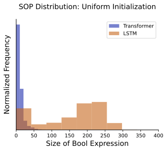

*Figure 8: Distribution of SOP measure based on 50k samples of 4-layer Transformers and 1-layer LSTMs with width 64. Refer to Section B.1 for details.* **[p. 15]**

###### fig-9

*Figure 9: The distributions (diagonals) and comparisons (off-diagonals) of 4 different complexity measures for random (a) Transformers and (b) LSTMs with weights uniformly sampled in [-10, 10]. The measures are computed over all inputs in $\{0,1\}^{7}$. CSR denotes critical sample ratio and SOP denotes the size of the smallest expression in sum-of-product form that represents the truth table. Refer to Section B.1 for details.* **[p. 16]**

###### p15-2

The distribution of the sensitivity of Transformers and LSTMs initialized with Xavier uniform distribution are given in Figure 11 respectively. For Gaussian initialization, the weights are sampled with mean 0 and $\sigma=10$. For Xavier uniform initialization all the values in weight matrices are sampled uniformly between $-d^{1/2}$ and $d^{1/2}$ where $d$ is the number of hidden units. The values in the bias vectors are set to zero and the ones in the input embedding vectors are sampled from $\mathcal{N}(0,1)$.

###### p15-3

**Finding Parity.** For strings of length $5$, the total number of possible functions is $2^{2^{5}}$. If Boolean functions are sampled uniformly, then the probability of picking the Parity function is less than 1 in two billion. However, on uniformly sampling $10$ million LSTMs of depth $2$ and hidden size $8$, we found that the probability of finding one that represents Parity is 1 in 30,000. Hence, it is over **60,000** times more likely to find Parity function by sampling LSTMs than randomly sampling Boolean functions. This indicates that the parameter space of recurrent models such as LSTMs has a significant representation of Parity functions which might help explain why it is easier for them to learn Parity. On the other hand, for Transformers, we did not find a single sample which represented Parity based on 10 million samples.

**Change across hyperparameters.** For uniform sampling, a general observation for both the architectures is that the likelihood of higher sensitivity functions increases with the number of layers (see Figure 15, left and Figure 10), however, even for Transformers with depth 12, the distribution is heavily skewed towards low sensitivity functions in comparison to recurrent models with depth 1. Unlike recurrent models, the sensitivity of Transformers decreases when the width of the model is increased (see Figure 15, middle). For Transformers, the average sensitivity decreases with the increase in the length of the strings (see Figure 15, right), whereas for LSTMs, it remains quite high even for lengths up to 200.

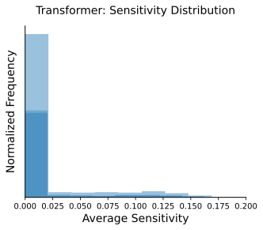

*(a)*

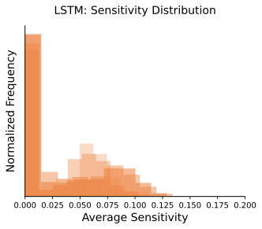

*(b)*

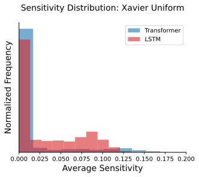

*(c)*

*Figure 11: Distribution of sensitivity of different Transformers and LSTMs with Xavier uniform initialization. Sensitivity of Transformers (left) and LSTMs (middle) across various hyperparameters. Right: Comparison for a fixed hyperparameter. Refer to Section B.3 for details.* **[p. 18]**

For LSTMs with uniform sampling, the change in sensitivity across different widths (hidden_size) and lengths is provided in Figure 10. As can be seen, the sensitivity of LSTMs does not significantly reduce across higher lengths and widths, unlike Transformers.

###### p15-6

While it is not entirely clear why random Transformers are relatively more biased towards low complexity functions, we observe that they behave similar to hard-attention Transformers upon inspection of attention weights. Recent works (Hao et al. 2022; Hahn 2020) have shown that hard-attention **[p. 17]** Transformers can only represent functions in $\text{AC}^{0}$ (which contain functions that can be represented by constant depth AND/OR circuits). Since $\text{AC}^{0}$ circuits can only represent functions of low average sensitivity (O’Donnell 2021), it might help explain why random Transformers have low sensitivity.

###### p17-8

We find that across all three measures, both Transformers and LSTMs learn functions of increasing sensitivity where they prioritize learning functions of lower sensitivity first. We found ‘word label-sensitivity’ and ‘word softmax-sensitivity’ to correlate well with *generalization gap* (i.e., the difference between train accuracy and test accuracy). Since the measures are very similar, there is a strong correlation between the two measures themselves. **[p. 18]** We did not find any non-trivial correlation between ‘embedding label-sensitivity’ and generalization gap. Note that unlike random and sparse Boolean functions, on real datasets, we did not find Transformers converging to functions with lower sensitivity.

###### sec-d1

### D.1 Sensitivity as Capacity Measure

###### p18-2

Let $\mathcal{F}_{k}\colon\{0,1\}^{n}\rightarrow\{\pm 1\}$ be a class of functions such that the maximum sensitivity for any function $f\in\mathcal{F}_{k}$ is upper bounded by $k$ where $0\leq k\leq n$. Any function $f$ with a maximum sensitivity $k$ can be uniquely determined by its values on any Hamming ball of radius $2k$ in $\{0,1\}^{n}$ (Gopalan et al. 2016). This can be used to upper bound the size of the function class $|\mathcal{F}_{k}|\leq 2^{\binom{n}{\leq 2k}}$. Since the VC Dimension (denoted $\mathsf{VCD}$) of a class of functions $\mathcal{F}$ is upper bounded by $\log|\mathcal{F}|$, we have that,

$$
\mathsf{VCD}(\mathcal{F}_{k})\leq\binom{n}{\leq 2k}\leq\binom{n+2k}{2k} \tag{4}
$$

$$
\leq\left(\frac{e(n+2k)}{2k}\right)^{2k}=\mathcal{O}(n^{2k})
$$

Let $f\in\mathcal{F}_{k}$ be a target function and $\hat{f}\in\mathcal{F}_{k}$ be a hypothesis produced by a learning algorithm. Let $L(\hat{f},f)=\Ex_{x\sim\{0,1\}^{n}}[\mathbb{I}[\hat{f}(x)\neq f(x)]]$ be the true error between $f$ and $\hat{f}$. Similarly, let $\hat{L}_{S}(\hat{f},f)=\frac{1}{m}\sum_{i=1}^{m}\mathbb{I}[\hat{f}(x)\neq f(x)]$ be the empirical error on a sample set $S$. Then using Equation (4) and basic properties of VC dimension (Mohri et al. 2018), we can upper bound the distance of the true error $L$ from the sample error $\hat{L}$ using maximum sensitivity.

###### p18-7

We train various models on SST dataset until convergence and then compare sensitivity with generalization gap. The generalization gap is simply the difference between the train error and test error; higher gap indicates overfitting. **[p. 19]** We plot the word label-sensitivity and word softmax-sensitivity (defined in Section C) for Transformers, LSTMs, and a pretrained Large Language Model (RoBERTa (Liu et al. 2019)) against the generalization gap (see Figure 14). We observe a positive correlation between the measures and generalization gap indicating that when sensitivity is higher, the models are more likely to overfit and achieve poorer generalization performance. Large language models such as RoBERTa have a lower sensitivity while achieving better test accuracies than Transformers and LSTMs trained from scratch.

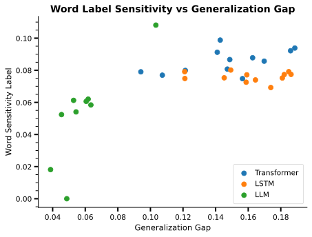

*(a)*

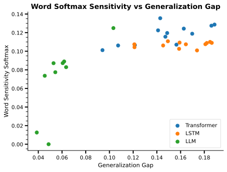

*(b)*

###### fig-14

*Figure 14: Sensitivity vs Generalization gap for Transformers, LSTMs, and RoBERTa LLM trained on SST.* **[p. 19]**

###### sec-e

## Appendix E Additional Experiments on Sparse Boolean Functions

###### p19-1

**Standard Parity.** The training curves for LSTMs on standard parity are provided in Figure 17. The models are trained on datasets of size 20k where the input strings are of length 30. Similar to Transformers on Sparse Parities, we observe phase transitions for LSTMs on standard Parity task.

###### p19-2

**Sparse Parities.** The results on sparse parities with length $n$=40 and $k$=4 relevant bits for Transformers with absolute positional encodings are provided in Figure 18. We find that Transformers with absolute positional encodings are able to generalize well on Sparse Parities task and exhibit grokking on relatively larger datasets (30k samples) in comparison to models with learnable positional embeddings. For Transformers trained with learnable encoding, we robustly observe grokking on small datasets. Figure 19 depicts the training curves for Transformers trained on datasets of size 5k.

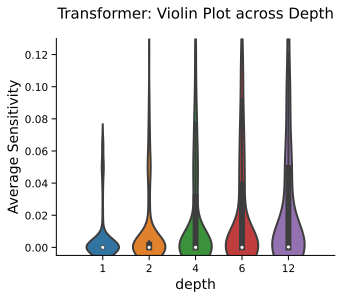

*(a)*

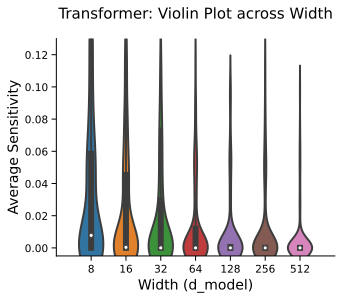

*(b)*

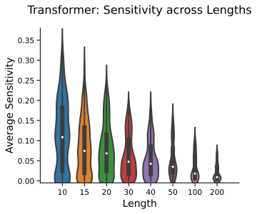

*(c)*

*Figure 15: Sensitivity of random Transformers across different depths, widths, and lengths. Refer to Section 4.1 for details.* **[p. 20]**

###### fig-16

*Figure 16: The sensitivity of Transformers and LSTMs at different stages of training on various ${k\textsc{-sparse}}$ functions of length $50$. Refer to Section 5 for details.* **[p. 20]**

**Overfitting.** We found that Transformers overfit on training data when the sample size is too low (see Figure 20). Apart from that, for datasets of certain sizes, we find that while Transformers with depth up to $6$ generalize well, those with much higher depths ($>8$) overfit across several runs.

###### p19-4

**Effect of Regularization on LSTMs.** We explore the effect of dropout and L2 regularization on training with LSTMs. While training on sparse parities, we find that increasing regularization increases the convergence time but the model still overfits and converges to a function with higher sensitivity than the target function. Upon further increasing regularization, the model fails to fit the training data.

**Mixed Parity.** To explore the difference in bias between Transformers and LSTMs, we conduct a simple experiment described as follows. We create a dataset of size 15k called ‘Mixed Parity’ where half of the examples are labelled as standard Parity (label is determined by all bits) and the other half is labelled as Sparse Parities with $4$ relevant bits. The inputs are of length $30$ and the first bit determines whether the input is labelled according to standard Parity function (when the first bit is 1) or as a Sparse Parities function (when the first bit is 0).

###### p19-6

We train Transformers and LSTMs (with learnable positional encodings) of depth $2$ and width $64$ across various learning rates $\in[0.01,0.00001]$ on the Mixed Parity dataset. We find that LSTMs obtain 100% training accuracy on the dataset (see Figure 21, right); LSTMs validation accuracy on the Parity task is near 100% whereas it is 50% on the Sparse Parities task. In contrast, the training accuracy of Transformers converges around 75% (see Figure 21, left); their validation accuracy on the Parity task is 50% whereas on Sparse Parities they achieve near 100% validation accuracy.

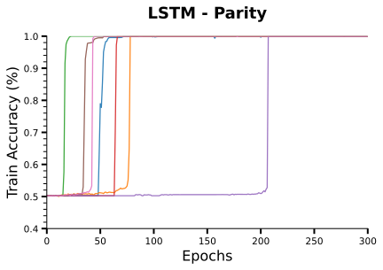

*(a)*

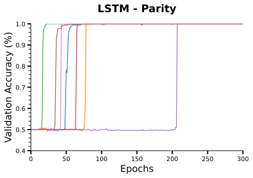

*(b)*

###### fig-17

*Figure 17: Training and validation curves for LSTMs trained on standard parity ($\textsc{Parity}\text{-}30$) dataset containing 30k samples. Similar to the behaviour of Transformers on Sparse Parities, we observe abrupt phase transitions for LSTMs where there is a sharp increase in the train and validation accuracy.* **[p. 20]**

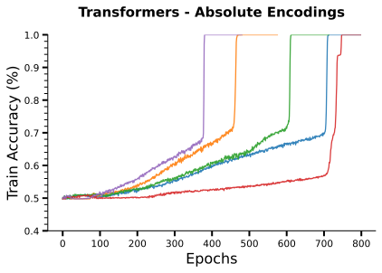

*(a)*

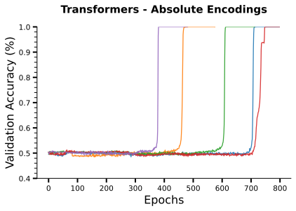

*(b)*

###### fig-18

*Figure 18: Training and validation curves for Transformers with absolute positional encodings trained on sparse parity task (length n=40 and k=4). The training accuracy gradually starts to increase with no change in validation accuracy. After a point, both training and validation accuracies match.* **[p. 20]**

###### p19-7

**Convergence time vs Sample Size.** For Transformers trained on Sparse Parities, we conduct experiments to compare the number of computational steps required to successfully learn Sparse Parities with the size of the dataset it is trained on. We consider length $n$=40 and $k$=4, and create datasets of five different sizes ({5k, 25k, 50k, 100k and 250k}). For each dataset, we train a Transformer of depth 2 and width 128 **[p. 20]** across 100 different initializations with learning rate $\in\{0.0001,0.0005\}$ and with batch size 500. We consider each iteration as a computational step. We report the median, minimum and maximum steps for each dataset in Figure 22. We find that neural networks such as Transformers can successfully learn Sparse Parities with relatively small number of computational steps on small-sized training sets. It is perhaps surprising that for Sparse Parities with $n$=40 and $k$=4, Transformers can successfully generalize well with less than $20000$ computational steps on over 75 out of 100 runs.

###### p20-1

**Phase Transitions.** As reported in Barak et al. 2022, we observe phase transitions on Parity tasks where the training and validation accuracies do not change for a large number of training iterations and then abruptly reach near-perfect accuracy in a few iterations (see Figure 6). This phenomenon was observed for feedforward networks (FFNs) and Transformers in Barak et al. 2022 and theoretically explained for ReLU FFNs trained with SGD. We observe another such behaviour for LSTMs on $\textsc{Parity}\text{-}n$ (see Figure 17 for training curves on $\textsc{Parity}\text{-}30$). For both LSTMs and Transformers, we were unable to get them to generalize well with SGD on either Sparse Parities or standard Parity. Both the architectures seem to succeed with the Adam optimizer (Kingma and Ba 2014).

###### p20-2

**Grokking.** Another interesting phenomenon we observe in Transformers is that in some cases the training accuracies start increasing gradually with no change in the validation accuracy. After some iterations, the validation accuracy increases and matches the training accuracy. We reliably observed this phenomenon while training Transformers with absolute positional encodings across training sets of various sizes (see Figure 18) and while training with learnable encodings on small-sized **[p. 21]** training sets (see Figure 19). Similar observations for grokking (Power et al. 2022) were made in Barak et al. 2022 for ReLU FFNs trained on small-sized training sets.

###### sec-e1

### E.1 Experiments on Variable Length Inputs

###### p21-4

**Results.** Contrary to the fixed length setting, we observe that both Transformers and LSTMs perform similarly on these tasks. For both $\textsc{VarParity}\text{-}(n,k)$ and $\textsc{VarMaj}\text{-}(n,k)$ we experiment with various mean lengths and variances with $k=5$. The general behaviour is that both Transformers and LSTMs generalize well when the tasks over short sequences ($<40$ for $\textsc{VarParity}\text{-}(n,k)$ and $<100$ for $\textsc{VarMaj}\text{-}(n,k)$). However as the lengths of the input go beyond that, both architectures do not generalize well.

In comparison to LSTMs, Transformers only performed better when the variance of the lengths of the inputs was very low. An interesting observation about Transformers is that they only seemed to generalize well with positional masking (also referred to as causal masking) along with positional encodings. Their performance was notably worse with only positional encodings (learnable or absolute).

These results do not support the hypothesis posed in Section 1 and we intend to explore this further in the future.

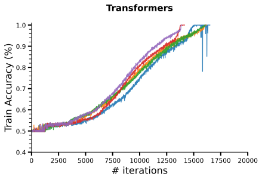

*(a)*

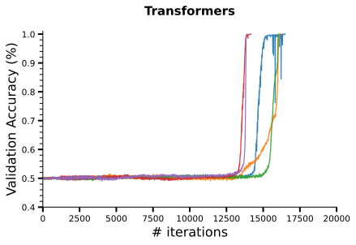

*(b)*

###### fig-19

*Figure 19: Training and validation curves for Transformers trained on sparse parity dataset (length n=40 and k=4) with only 5k training examples. The training accuracy gradually starts to increase with no change in validation accuracy. After a point, both training and validation accuracies match.* **[p. 21]**

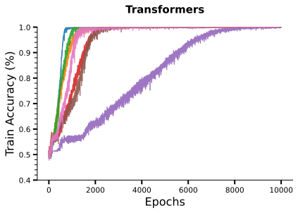

*(a)*

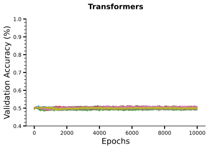

*(b)*

###### fig-20

*Figure 20: Training and validation accuracy curves for Transformers trained on sparse parity dataset (length n=40 and k=4) with 1k training examples. The behaviour is similar to how LSTMs overfit for much larger training sets (40k samples). We observe similar behaviour for Transformer with large depths on datasets of size 5k.* **[p. 21]**

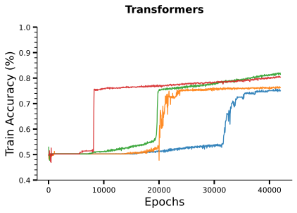

*(a)*

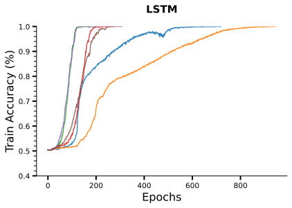

*(b)*

###### fig-21

*Figure 21: Training curves for Transformers and LSTMs trained on the Mixed Parity dataset (length n=30) with 15k training examples. Refer to Section E for details.* **[p. 22]**

###### fig-22

*Figure 22: The number of computational steps till convergence vs size of training data for Transformers trained on $\textsc{Parity}\text{-}(40,4)$. The curve depicts the median number (along with min/max) of iterations with a batch size of 500 across 50-100 successful runs for each dataset size. Refer to Section E for details.* **[p. 22]**

###### p22-1

Figure 23 depicts the training curves for Transformers and LSTMs. We find that both the models are able to conveniently fit the training set near-perfectly. For both the models, the training takes significantly more number of iterations/epochs in comparison to training on the original dataset with true labels which only takes a few epochs.

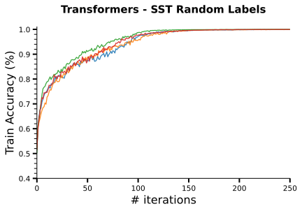

*(a)*

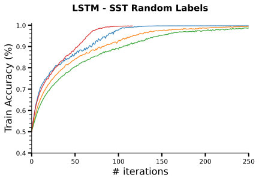

*(b)*

###### fig-23

*Figure 23: Training curves of Transformers and LSTMs when trained on SST dataset with randomly assigned labels. Both architectures conveniently fit the entire dataset although they take much longer in comparison to when trained with original labels.* **[p. 22]**

*Table 1: Different hyperparameters and the values considered for each of them. Note that certain parameters like Heads and Position Encoding Scheme are only relevant for Transformer-based models and not for LSTMs.* **[p. 23]**

| **Hyperparameter** | **Bounds** Transformer \| LSTM |
|---|---|
| D_model/Hidden Size | [16, 128] \| [8, 256] |
| Heads | [4, 8] |
| Number of Layers | [1, 6] \| [1, 6] |
| Learning Rate | [1e-2, 1e-5] |
| Position Encoding Scheme | [Learnable, Absolute] |

###### p22-3

For each dataset, we extensively tune across several hyperparameters and report the results based on the best-performing models. Table 1 lists the hyperparameters used for tuning the models for Boolean function experiments in Section 5. We use a grid search procedure to tune the hyperparameters. The models were trained with cross-entropy loss. For all our results, we used Adam Optimizer and tuned the learning rates. We also tried SGD with weight decay but could not get either Transformers or LSTMs to perform well on parities, sparse parities, or random k-sparse functions.

**Compute.** All our experiments were conducted using 16 NVIDIA Tesla V100 GPUs each with 16GB memory. Since the datasets are synthetic and relatively smaller than practical datasets, most training runs took 10-30mins on a single GPU. The larger expenditure was on tuning LSTMs to find whether any of the hyperparameters succeed. Some experiments with LSTMs on $\textsc{Parity}\text{-}(40,4)$ for over 100k steps took 3 hours and across multiple hyperparameters took $\approx$ 400 GPU hours in total. The experiments conducted for Figure 22 took similar amount of GPU hours ($\approx$ 300). The rest of the experiments took less than 10% of this time. The experiments conducted in Section 4 with random models were not as compute intensive.
