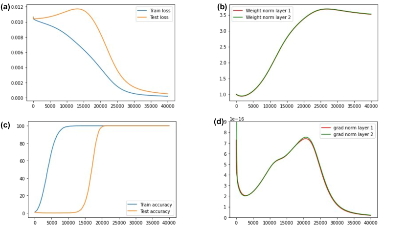
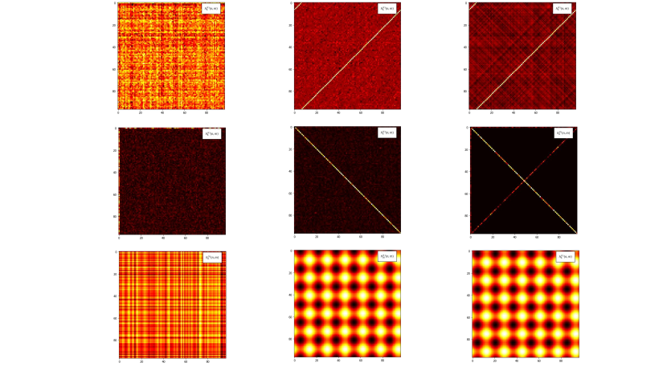
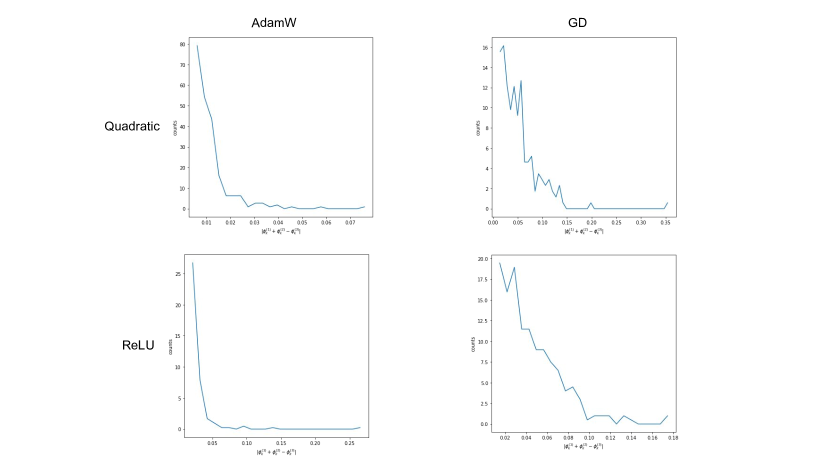
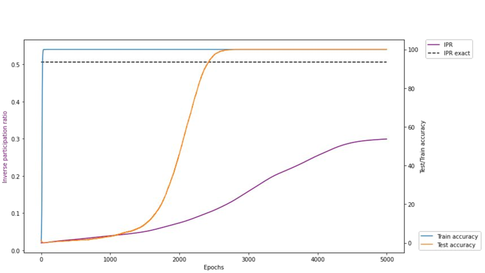

# Gromov 2023 — Grokking modular arithmetic

See also: [the global concept index](../../concepts/index.md).

**Andrey Gromov** — University of Maryland, College Park.

arXiv [2301.02679](https://arxiv.org/abs/2301.02679), 6 January 2023. 80 citations — the ninth most cited work in the corpus. There is no native HTML for it; the source is ar5iv.

The files of this paper's analysis:

- [`2301.02679.grokking-modular-arithmetic.license.txt`](2301.02679.grokking-modular-arithmetic.license.txt) — the arXiv licence record for this paper.

The anchor scheme and the rules for linking into a card are in the [README of the papers folder](../README.md).

**Excerpt card.** The paper's licence (`arxiv-nonexclusive`) does not permit republishing the paper itself; what stands here are the editorial sections and the fragments the corpus quotes (right of quotation). The paper: <https://arxiv.org/abs/2301.02679>.

## Concepts covered

**[Modular arithmetic](../../concepts/modular-arithmetic.md)** — the corpus's only work in which the task is **solved analytically** rather than analysed by reverse engineering. The weights computing $n+m\,\,\text{mod}\,\,p$ are written out in closed form: cosines with frequencies $2\pi k/p$ and three sets of phases ([`p4-9`](#p4-9)). The network is a two-layer perceptron with a quadratic activation, with no embeddings and no attention whatever.

**[Fourier features and circuits](../../concepts/fourier-features-circuits.md)** — the Fourier structure here is not discovered in a trained network but **derived from the task**: the solution is a $\delta$ function represented by a full set of trigonometric functions, and the phases are chosen so that the waves concentrated on $n+m=q$ interfere constructively while all the others cancel ([`p5-2`](#p5-2)). This answers the question of why Fourier features arise at all: they are the solution, not a convenient representation of something found.

**[Mechanistic interpretability](../../concepts/mechanistic-interpretability.md)** — the work reverses the direction of the analysis. Usually a circuit is extracted from a trained model; here an analytical solution is exhibited first, and then it is checked that the optimiser finds precisely it ([`p8-3`](#p8-3)). The author's formulation — "a complete interpretability of the representations learned by the network" — is stronger than usual, and in this setting it is earned.

**[Regularisation](../../concepts/regularization-variants.md)** and **[weight decay](../../concepts/weight-decay.md)** — the corpus's central counterexample: grokking is observed under ordinary gradient descent with an MSE loss **in the absence of any regularisation whatever** ([`p1-2`](#p1-2)). Regularisation and adaptive methods **speed grokking up** and lower the data fraction required, but are not needed for it to occur ([`p10-5`](#p10-5)). This directly limits the explanations through norm minimisation.

**[Feature learning](../../concepts/feature-emergence-feature-learning.md)** — grokking is identified with the learning of particular feature maps whose structure is set by the task. The explanation is deliberately dull: once the training loss has reached a certain value, the only way to lower it further is to begin learning the right features ([`p9-9`](#p9-9)). No additional mechanism is postulated.

**[The NTK](../../concepts/neural-tangent-kernel-ntk.md)** and **[from lazy to rich](../../concepts/lazy-to-rich-kernel-to-feature-learning.md)** — a negative statement is made: **random-feature models, infinitely wide networks in the NTK regime included, do not exhibit grokking** ([`p9-9`](#p9-9)). It is supported by the fact that the weights found are strongly correlated and knowingly not iid ([`p6-8`](#p6-8)), that is, the solution lies far from the Gaussian limit. With Kumar et al. this agrees in sign: there the lazy regime is the phase *before* grokking.

**[Progress measures](../../concepts/progress-measures.md)** and **[the order parameter](../../concepts/order-parameter.md)** — the inverse participation ratio (IPR) of the Fourier transform of the weights is introduced: a quantity distinguishing periodic weights from random ones ([`p9-4`](#p9-4)). It is computed **without a test set** and grows **from the very beginning of the training**, long before the jump in accuracy; the onset of the grokking coincides with a sharp acceleration of that growth ([`p9-7`](#p9-7)). The IPR is borrowed from the physics of localisation — it is literally an order parameter rather than a metaphor.

**[Phase transition](../../concepts/phase-transition.md)** — four regimes are distinguishable by the IPR: a slow linear growth, a transition (the grokking itself), a fast linear growth already after $100\%$ test accuracy, and a saturation. Notably, the rearrangement of the features continues **after** the accuracy has stopped changing.

**[Critical dataset size](../../concepts/data-fraction-critical-dataset-size.md)** — $\alpha_{c}$ is read as a **measure of the complexity** of the modular function rather than as a property of the training: it is computable in principle, depends on the way the training set is sampled, and empirically **decreases** as the modulus $p$ grows ([`p10-4`](#p10-4)). Below $\alpha_{c}$ generalisation does not set in at all, rather than setting in slowly ([`p9-1`](#p9-1)).

**[Optimisers](../../concepts/optimizer-adam-adamw-sgd.md)** — GD, GD with momentum and AdamW arrive at one and the same form of solution, differing only in how precisely the phases are fitted. Momentum plays a noticeable part both in the grokking time and in the data fraction required ([`p9-1`](#p9-1)).

**[The slingshot effect](../../concepts/slingshot.md)** — a direct objection: in Thilak et al. the slingshot is declared necessary for grokking without regularisation under Adam, whereas here grokking is obtained with no adaptive optimiser at all ([`p2-1`](#p2-1)). The scope of that statement turns out to be limited to Adam rather than to grokking in general.

**[Sparse parity](../../concepts/sparse-parity.md)** — the work of Barak et al. is taken as a theoretical reference point: there grokking was observed in both the under- and the over-parametrised regimes, and the grokking time scaled as $n^{O(k)}$ ([`p2-3`](#p2-3)).

**[Effective theory / statistical mechanics](../../concepts/effective-theory-statistical-mechanics.md)** — the language of the analysis is thoroughly physical: the interference of waves, localisation in Fourier space, the participation of modes. This is not decoration but a working instrument — the IPR is taken from localisation theory and carried over unchanged.

**[Real data](../../concepts/vision-real-world-data-mnist-cifar.md)** — a supposition is put forward that on real tasks grokking does occur but that the jumps after each new feature is learned are so small that the training curve is perceived as continuous ([`p11-2`](#p11-2)). There is no check; it is an open question posed carefully.

**[Grokking](../../concepts/grokking.md)** — the notion is narrowed to something checkable: if the solution can be written out analytically and the optimiser finds it, then a delayed generalisation requires no separate mechanism. What the work does not explain is stated too: there is no analytical solution for modular multiplication, and the function $n^{3}+nm^{2}+m$ does not generalise even at $\alpha>0.9$, neither for a transformer nor for an MLP ([`p7-5`](#p7-5)).

**[When regularisation is necessary](../../concepts/regularization-necessity.md)** — the "not necessary" pole: [grokking under vanilla gradient descent with an MSE loss in the absence of any regularisation whatever](#p1-2). A deterministic limit of the dispute: no weight decay, no adaptivity, no noise.

**[Quadratic networks](../../concepts/quadratic-networks.md)** — the choice of activation is made for tractability: with a quadratic activation the full function of the network takes an even simpler form ([`p4-3`](#p4-3)) — a cubic polynomial in the parameters — and it is precisely this that makes it possible to write the weights out in closed form.
## What is shown and what is conjectured

The card editor's remarks following the analysis of the claims (`…claims.txt`). The work is built differently from the rest of the corpus: it does not explain grokking by a mechanism but exhibits a closed-form solution of the task and shows that the optimiser arrives at precisely it.

**The firmest place is the solution itself.** The weights computing modular addition are written out explicitly, and the verification takes a single line of trigonometry ([`p4-9`](#p4-9)). This is not a reconstruction of a trained model and not a hypothesis about what a network might be doing: the solution exists independently of whether the training finds it. What remains is a checkable question — does it? — and the answer is affirmative ([`p8-3`](#p8-3)).

**A prediction made before the experiment was confirmed twice.** The phase constraint $\varphi^{(1)}+\varphi^{(2)}=\varphi^{(3)}$ is derived from the requirement of constructive interference, and the distribution of the phases in the solutions found by GD and AdamW is indeed concentrated near zero. The second time it is the prediction about the branches of the inverse function: for $(n+m)^{2}$ the square root is two-valued, and the accuracy of the analytical solution falls by about half, which is visible directly in the number of activation lines.

**A counterexample is worth more than an explanation.** Grokking here is obtained under ordinary GD with an MSE loss, without regularisation, without an adaptive optimiser and without a learnable encoder ([`p1-2`](#p1-2)). This simultaneously limits the scope of three of the corpus's stock explanations — through weight decay, through the slingshot and through the competition of an encoder with a decoder. It matters that none of them is refuted thereby: what is shown is that each describes its own setting rather than grokking in general.

**The statement about the NTK is unsupported.** "Random-feature models do not exhibit grokking" — the paper contains neither an experiment of its own nor a reference to somebody else's ([`p9-9`](#p9-9)). There is indirect support: the weights found are strongly correlated and knowingly not iid ([`p6-8`](#p6-8)), and the parametrisation is chosen to be mean-field precisely so that feature learning is possible. But that is an argument that the solution lies outside the random-feature regime rather than a check that there is no grokking in that regime.

**The author declares his own explanation an argument, and that is honest.** "The only way to lower the loss further is to begin learning the right features" gives neither the moment of the transition nor its abruptness. After eight cards full of mechanisms such a position reads as a matter of principle: if the solution can be written out analytically, no separate mechanism is required. But it has no predictive power either.

**The IPR measures but does not predict.** The quantity is a good one: it is computed without a test set, grows from the very beginning of the training, and distinguishes four regimes ([`p9-4`](#p9-4), [`p9-7`](#p9-7)). Nowhere is it shown, however, that the moment of grokking can be determined from it **in advance** — a coincidence in time is established, no more. As a progress measure it is for now in the same position as the restricted loss of Nanda et al.

**The numbers that are missing.** $\alpha_{c}$ is called a measure of the complexity of a function and declared to decrease as $p$ grows — with no table, no plot and not even two values ([`p10-4`](#p10-4)). The width threshold at which the approximation is adequate is not written out either: there is only an empirical curve. For a work whose strength lies in its analyticity these are notable gaps.

**The fact most awkward for the work itself is in an appendix.** For $f=n^{2}+m^{2}+nm$ the test accuracy reaches almost $100\%$, while the gap between the training and the test loss **does not close**, unlike in the main example. The author's formulation: "the network has not grokked all the right features." It follows that accuracy is an insufficient indicator of grokking — and the rest of the paper leans on precisely that.

**Its place in the corpus.** With Kumar et al. it agrees in sign: there the lazy (NTK) regime is the phase before grokking, here the random-feature regime is declared incapable of grokking at all. With Nanda et al. the relation is not worked out: the Fourier structure is common, but the algorithm differs — there a "clock" with a multiplication of phases in a transformer, here a trigonometric identity under a quadratic activation. The work is usually cited more broadly than it is written: as "grokking does not require regularisation" in general, whereas what is shown holds for modular arithmetic, a two-layer MLP and an MSE loss.

Cards of corpus papers: [Power et al. 2022](../2201.02177.grokking-generalization-beyond-overfitting-on-small-algorithmic-datasets/2201.02177.grokking-generalization-beyond-overfitting-on-small-algorithmic-datasets.card.md) — the original observation and the source of the task; [Liu et al. 2022](../2205.10343.towards-understanding-grokking-an-effective-theory-of-representation-learning/2205.10343.towards-understanding-grokking-an-effective-theory-of-representation-learning.card.md) — the reading of grokking as a competition of an encoder and a decoder, objected to here by the fact that there is no learnable encoder in this setting at all; [Omnigrok](../2210.01117.omnigrok-grokking-beyond-algorithmic-data/2210.01117.omnigrok-grokking-beyond-algorithmic-data.card.md) — the dependence on the initialisation scale; [Slingshot](../2206.04817.the-slingshot-mechanism-an-empirical-study-of-adaptive-optimizers-and-grokking/2206.04817.the-slingshot-mechanism-an-empirical-study-of-adaptive-optimizers-and-grokking.card.md) — the claim that a slingshot is necessary, limited here to the case of Adam; [Nanda et al. 2023](../2301.05217.progress-measures-for-grokking-via-mechanistic-interpretability/2301.05217.progress-measures-for-grokking-via-mechanistic-interpretability.card.md) — the Fourier algorithm obtained by reverse engineering on the same class of tasks; [Kumar et al. 2023](../2310.06110.grokking-as-the-transition-from-lazy-to-rich-training-dynamics/2310.06110.grokking-as-the-transition-from-lazy-to-rich-training-dynamics.card.md) — the exit from the lazy regime, consistent with the absence of grokking under the NTK.

## Common misreadings and overstatements of this paper

Patterns of erroneous or over-extended citation of this work observed in the citing papers of the corpus. Each entry describes what exactly is distorted in the paraphrase and leads to the authors' own paragraphs, where the lost caveat stands. The analysis of particular formulations is in the citing works' cards, in their "Erroneous citations" sections, to which the "details" links lead. Most substantive citations of this work retain its conditions (a two-layer MLP, an MSE loss, modular arithmetic) — the patterns below concern a minority.

**Somebody else's setting ascribed to it (erroneous).** The work is credited with "placing the embeddings on a circle" — whereas [in its setting there is no learnable encoder at all, and grokking is present all the same](#p9-9): this is the author's own counterexample to explanations through representation learning, and the periodic structure lives [in the weights of the first layer](#p4-9). Circular embeddings are the setting of Liu et al. and Zhong et al. The details: [2511.01938](../2511.01938.the-geometry-of-grokking-norm-minimization-on-the-zero-loss-manifold/2511.01938.the-geometry-of-grokking-norm-minimization-on-the-zero-loss-manifold.card.md#mc-2301-02679).

**Confused functions of appendix C (erroneous).** The categorical "DNNs completely fail on i²+ij+j², the accuracy is always about 0.01" contradicts appendix C of the cited work itself: for n²+m²+nm Gromov reports about 97 per cent accuracy at a large data fraction, and the complete failure concerns a different function — [n³+nm²+m, of which the author honestly writes that "it is unclear how to predict which functions generalise"](#p7-5). The details: [2504.03162](../2504.03162.beyond-progress-measures-theoretical-insights-into-the-mechanism-of-grokking/2504.03162.beyond-progress-measures-theoretical-insights-into-the-mechanism-of-grokking.card.md#mc-2301-02679).

**A construction passed off as a solution found by training (an over-extension, contested).** The work's analytical solution is a construction; about the optimiser finding it the author speaks cautiously: ["evidence that these feature maps are also found by vanilla gradient descent as well as AdamW"](#p8-3), and the correspondence is approximate at that. The paraphrases strengthen this into a "closed-form solution of final trained weights" or "showing a local minimum exists". A point of live dispute: [Mohamadi et al.](../2407.12332.why-do-you-grok-a-theoretical-analysis-of-grokking-modular-addition/2407.12332.why-do-you-grok-a-theoretical-analysis-of-grokking-modular-addition.card.md) report in a footnote that in their experiments gradient descent did not find this solution, while [2310.03789](../2310.03789.grokking-as-a-first-order-phase-transition-in-two-layer-networks/2310.03789.grokking-as-a-first-order-phase-transition-in-two-layer-networks.card.md), on the contrary, confirms the compatibility at the level of the formalism. The details: [2310.06110](../2310.06110.grokking-as-the-transition-from-lazy-to-rich-training-dynamics/2310.06110.grokking-as-the-transition-from-lazy-to-rich-training-dynamics.card.md#mc-2301-02679); milder echoes: 2505.18266 (later confirmed by Morwani et al.'s proof of maximum margin), [2509.21519](../2509.21519.provable-scaling-laws-of-feature-emergence-from-learning-dynamics-of-grokking/2509.21519.provable-scaling-laws-of-feature-emergence-from-learning-dynamics-of-grokking.card.md) — "a large initial learning rate", which is not in the text but which they checked themselves.

Examples of careful citation: [Kumar et al.](../2310.06110.grokking-as-the-transition-from-lazy-to-rich-training-dynamics/2310.06110.grokking-as-the-transition-from-lazy-to-rich-training-dynamics.card.md) — a reproduction of the setup with "Our results agree"; [2310.03789](../2310.03789.grokking-as-a-first-order-phase-transition-in-two-layer-networks/2310.03789.grokking-as-a-first-order-phase-transition-in-two-layer-networks.card.md) — a substantive comparison of formalisms; [2601.19791](../2601.19791.to-grok-grokking-provable-grokking-in-ridge-regression/2601.19791.to-grok-grokking-provable-grokking-in-ridge-regression.card.md) and [2605.06152](../2605.06152.grokking-or-glitching-how-low-precision-drives-slingshot-loss-spikes/2605.06152.grokking-or-glitching-how-low-precision-drives-slingshot-loss-spikes.card.md) — the full set of conditions in a single sentence; [2402.16726](../2402.16726.towards-empirical-interpretation-of-internal-circuits-and-properties-in-grokked-transformers-on-modular-polynomials/2402.16726.towards-empirical-interpretation-of-internal-circuits-and-properties-in-grokked-transformers-on-modular-polynomials.card.md) — retains the quadratic-activation condition; [Mohamadi et al.](../2407.12332.why-do-you-grok-a-theoretical-analysis-of-grokking-modular-addition/2407.12332.why-do-you-grok-a-theoretical-analysis-of-grokking-modular-addition.card.md) — an exact paraphrase plus an honestly framed disagreement.

---

# Quoted fragments

Only the fragments the corpus cards refer to are
reproduced here (right of quotation); the paper's licence does not permit
republishing the whole text. Anchor numbering matches the original.

###### p1-2

We present a simple neural network that can learn modular arithmetic tasks and exhibits a sudden jump in generalization known as “grokking”. Concretely, we present (i) fully-connected two-layer networks that exhibit grokking on various modular arithmetic tasks under vanilla gradient descent with the MSE loss function in the absence of any regularization; (ii) evidence that grokking modular arithmetic corresponds to learning specific feature maps whose structure is determined by the task; (iii) analytic expressions for the weights – and thus for the feature maps – that solve a large class of modular arithmetic tasks; and (iv) evidence that these feature maps are also found by vanilla gradient descent as well as AdamW, thereby establishing complete interpretability of the representations learnt by the network.

###### p1-5

- Generalization occurs long after training accuracy reached $100\%$. The jump in generalization is quite rapid and occurs after a large number of epochs (cf. Fig. 1).
- There is a minimal amount of data (dependent on the task) that needs to be included into the training set in order for generalization to occur (cf. Fig. 4b).
- Various forms of regularization improve how quickly grokking happens. Weight decay included in AdamW optimizer showed to be particularly effective (cf. Fig. 4b).

*Figure 1: Dynamics under GD for the minimal model (4) with MSE loss and $\alpha=0.49$. **(a)** Train and test loss. Train loss generally decays monotonically, while test loss reaches its maximum right before the onset of grokking. **(b)** Norms of weight matrices during training. We do not observer a large increase in weight norms as in [14], but we do see that weight norms start growing at the onset of grokking. **(c)** Train and test accuracy showing the delayed and sudden onset of generalization. **(d)** Norms of gradient vectors. The dynamics accelerates until the test loss maximum is reached and then slowly decelerates.* **[p. 2]**

###### p1-6

In subsequent work [7], the authors simplified the architecture to a single linear learnable encoder followed by a multilayer perceptron (MLP) decoder and showed that, even if the task is recast as a classification problem, grokking persists. They also interpret grokking as a competition between encoder and decoder, and developed a toy model of grokking as dynamics of the embeddings only. This model indeed leads to some quantitative predictions such as the critical amount of data needed for grokking to happen relatively fast.

*Figure 2: Preactivations. **First row**: Preactivation $h^{(2)}_{6}(n,m)$. **Second row**: Fourier image of the Preactivation $h^{(2)}_{6}(n,m)$. **Third row**: Preactivation $h^{(1)}_{6}(n,m)$ or $h^{(1)}_{30}(n,m)$. **First column**: At initialization. **Second column**: Found by vanilla GD. The Fourier image shows a single series of peaks corresponding to $m+n=6\,\,\textrm{mod}\,\,97$. **Third column**: Evaluated using the analytic solution (6)-(7). The Fourier image shows the same peak as found by GD, but also weak peaks corresponding to $2m=6\,\,\textrm{mod}\,\,97$, $2n=6\,\,\textrm{mod}\,\,97$ and $m-n=6\,\,\textrm{mod}\,\,97$ that were suppresed by the choice of phases via (12).* **[p. 3]**

###### p2-1

In more recent work [14], it was argued that if the Adam optimizer is used, then in order for grokking to happen without regularization, the training dynamics must undergo a slingshot – a sudden explosion in the training loss – which was followed by the rise of generalization. It was further shown that those slingshots and grokking can be turned on and off by tuning the $\epsilon$ parameter of the Adam optimizer.

In a blogpost [9], it was argued that the algorithm for modular addition learnt by a single-layer transformer can be reverse-engineered and is human-interpretable. It was further argued that (i) regularization is required for grokking and (ii) there should be no grokking in the infinite-data regime. Furthermore, many other algorithmic datasets were considered.

###### p2-3

On a theoretical front, the authors of [1] studied *online* learning of the $(k,n)$ sparse parity problem where the network function is asked to compute parity of $k$ bits in a length-$n$ string of random bits. In particular, they observed grokking both in under- and over-parametrized regimes. For large minibatch sizes, generalization was attributed to amplification of the information already present in the initial gradient (called Fourier gap) rather than to the diffusive search by stochastic gradient descent, and derived the scaling of grokking time with $n,k$ to be $n^{O(k)}$.

###### p2-4

Finally, [8] studied grokking for non-algorithmic datasets and its dependence on the initialization, while [16] developed a solvable model of grokking in the teacher-student setup.

To summarize, the available results, although undoubtedly inspiring, leave grokking on algorithmic datasets as a somewhat mysterious effect. Furthermore, the empirical results suggest that grokking provides a fascinating platform for quantitatively studying many fundamental questions of deep learning in a controlled setting. These include: (i) the precise role of regularization in deep nonlinear neural networks; (ii) feature learning; (iii) the role of training data distributions in optimization dynamics and generalization performance of the network; (iv) data-, parameter- and compute-efficiency of training; (v) interpretability of learnt features; and (vi) expressivity of architectures and complexity of tasks.

**[p. 3]**

This motivates the present study, proposing and analyzing a minimal yet realistic model and optimization process that lead to grokking on modular arithmetic tasks.

###### p3-4

Given this architecture, we then set up modular arithmetic tasks as classification problems. To this end, we fix an integer $p$ (that does not have to be prime) and consider functions over $\mathbb{Z}_{p}$. Each input integer is encoded as a one-hot vector. The output integer is also encoded as a one-hot vector. For the task of learning bivariate functions over $\mathbb{Z}_{p}$ the input dimension is $2p$, the output dimension is $p$, the total number of points in the dataset is $p^{2}$, while the model (1)–(2) has $3Np$ parameters. **[p. 4]** Finally, we split the dataset $\mathcal{D}$ into train $\mathcal{D}_{\rm train}$ and test $\mathcal{D}_{\rm test}$ subsets, and furnish this setup with the MSE loss function.222CSE loss can be used, if desired.

Under this minimal setting grokking occurs consistently for many modular functions, provided enough epochs of training have taken place *and* the fraction of data used for training,

$$
\alpha\equiv\frac{|\mathcal{D}_{\rm train}|}{|\mathcal{D}|}\,, \tag{3}
$$

is sufficiently large (if $\alpha$ is too small, generalization is not possible even after long training time). By adjusting width $N$, at fixed $\alpha$, we can tune between underparametrized and overparametrized regimes. The ‘simplest’ optimizer that leads to grokking is the full-batch gradient descent. *No explicit regularization is necessary for grokking to occur*. We have tried other optimizers and regularization methods such as AdamW, GD with weight decay and momentum, SGD with Batchnorm, and GD with Dropout. Generally, regularization and the use of adaptive optimizers produce two effects: (i) grokking happens after a smaller number of epochs and (ii) grokking happens at smaller $\alpha$. See Fig. 4.

###### p4-3

In passing, we note that, in the case of quadratic activation the full network function takes an even simpler form

$$
f(x)=\frac{1}{DN}W^{(2)}\left(W^{(1)}x\right)^{2}\,. \tag{4}
$$

This function is *cubic* in parameters and *quadratic* in its inputs. Eq. (4) is the simplest possible *nonlinear* generalization of the ‘$u$-$v$’ model studied in [6]. The exact results are derived for this particular choice (and can be generalized to other monomials if wished) while empirical results are only mildly sensitive to the choice of activation function.

Whether grokking happens or not depends on the modular function at hand assuming the architecture and optimizer are fixed. We show that for any function of the form $f(n,m)=f_{1}(n)+f_{2}(m)\,\,\textrm{mod}\,\,p$ as well as $\tilde{f}(n,m)=F(f_{1}(n)+f_{2}(m))\,\,\textrm{mod}\,\,p$ one can present an analytic solution for the weights that yield $100\%$ accuracy and these weights are approximately found by various optimizers with and without regularization. Functions of the form $g(n,m)=g_{1}(n)\cdot g_{2}(m)\,\,\textrm{mod}\,\,p$ can also be grokked, however we have failed to find the analytic expression for the weights. Functions of the form $f(n,m)+g(n,m)\,\,\textrm{mod}\,\,p$ are more difficult to grok: they require more epochs and larger $\alpha$.

In summary, our setup is simple enough to be analytically tractable but complex enough to exhibit representation learning and, consequently, grokking.

###### p4-9

**Claim I.** If the network function has the form (4) then the weights $W^{(1)}_{kn}$ and $W^{(2)}_{qk}$ solving the modular addition problem are given by

$$
W^{(1)}_{kn}=\begin{pmatrix}\cos\left(2\pi\frac{k}{p}n_{1}+\varphi^{(1)}_{k}\right)\\
\cos\left(2\pi\frac{k}{p}n_{2}+\varphi^{(2)}_{k}\right)\end{pmatrix}^{T}\,,\qquad n=(n_{1},n_{2}) \\
W^{(2)}_{qk}=\cos\left(-2\pi\frac{k}{p}q-\varphi^{(3)}_{k}\right)\,, \tag{6}
$$

**[p. 5]**

where we represent $W^{(1)}_{kn}$ as a row of two $N\times p$ matrices and $n_{1},n_{2}=0,1,\ldots,p-1$. The full size of $W^{(1)}_{kn}$ is $N\times 2p$. The phases $\varphi^{(1)}_{k},\varphi^{(2)}_{k}$ and $\varphi^{(3)}_{k}$ are random, sampled from a uniform distribution and satisfy the constraint (12).

###### p5-2

**Reasoning.** Here we explain why and how the solution (6)-(7) works. There are two important ingredients in (6)-(7). The first ingredient is the periodicity of weights with respect to the indices $n_{1},n_{2},q$. The set of frequencies is determined by the base of $\mathbb{Z}_{p}$. The full set of independent frequencies is obtained by varying $k$ from $0$ to $\frac{p-1}{2}$ if $p$ is odd and to $\frac{p}{2}$ if $p$ is even. The second ingredient is the set of phases $\varphi^{(1)}_{k},\varphi^{(2)}_{k},\varphi^{(3)}_{k}$. Indeed, Eqs. (6)-(7) solve modular addition *only* after these phases are chosen appropriately. We will discuss the choice shortly.

To show that (6)-(7) solve modular addition we will perform the inference step analytically. Consider a general input $(n,m)$ represented as a pair of one-hot vectors stacked into a single vector of size $2p\times 1$.

The preactivations in the first layer are given by (we drop the normalization factors)

$$
h^{(1)}_{k}(n,m)=\cos\left(2\pi\frac{k}{p}n+\varphi^{(1)}_{k}\right)+\cos\left(2\pi\frac{k}{p}m+\varphi^{(2)}_{k}\right)\,. \tag{8}
$$

The activations in the first layer are given by

$$
z^{(1)}_{k}(n,m)=\left(\cos\left(2\pi\frac{k}{p}n+\varphi^{(1)}_{k}\right)+\cos\left(2\pi\frac{k}{p}m+\varphi^{(2)}_{k}\right)\right)^{2}\,, \tag{9}
$$

which, after some trigonometry, becomes

$$
z^{(1)}_{k}(n,m) =  1+\frac{1}{2}\left(\cos\left(2\pi\frac{k}{p}2n+2\varphi^{(1)}_{k}\right)+\cos\left(2\pi\frac{k}{p}2m+2\varphi^{(2)}_{k}\right)\right) \\
+ \cos\left(2\pi\frac{k}{p}(n+m)+\varphi^{(1)}_{k}+\varphi^{(2)}_{k}\right)+\cos\left(2\pi\frac{k}{p}(n-m)+\varphi^{(1)}_{k}-\varphi^{(2)}_{k}\right)\,. \tag{10}
$$

Finally, the preactivations in the second layer take form

$$
h^{(2)}_{q}(n,m) = \frac{1}{4}\sum_{k=1}^{N}\cos\left(2\pi\frac{k}{p}(2n-q)+2\varphi^{(1)}_{k}-\varphi^{(3)}_{k}\right)+\cos\left(2\pi\frac{k}{p}(2n+q)+2\varphi^{(1)}_{k}+\varphi^{(3)}_{k}\right) \\
+ \frac{1}{4}\sum_{k=1}^{N}\cos\left(2\pi\frac{k}{p}(2m-q)+2\varphi^{(1)}_{k}-\varphi^{(3)}_{k}\right)+\cos\left(2\pi\frac{k}{p}(2m+q)+2\varphi^{(1)}_{k}+\varphi^{(3)}_{k}\right) \\
+ \frac{1}{2}\sum_{k=1}^{N}\cos\left(2\pi\frac{k}{p}(n+m-q)+\varphi^{(1)}_{k}+\varphi^{(2)}_{k}-\varphi^{(3)}_{k}\right) \\
+ \frac{1}{2}\sum_{k=1}^{N}\cos\left(2\pi\frac{k}{p}(n+m+q)+\varphi^{(1)}_{k}+\varphi^{(2)}_{k}+\varphi^{(3)}_{k}\right) \\
+ \frac{1}{2}\sum_{k=1}^{N}\cos\left(2\pi\frac{k}{p}(n-m-q)+\varphi^{(1)}_{k}-\varphi^{(2)}_{k}-\varphi^{(3)}_{k}\right) \\
+ \frac{1}{2}\sum_{k=1}^{N}\cos\left(2\pi\frac{k}{p}(n-m+q)+\varphi^{(1)}_{k}-\varphi^{(2)}_{k}+\varphi^{(3)}_{k}\right) \\
+ \sum_{k=1}^{N}\cos\left(2\pi\frac{k}{p}q+\varphi^{(3)}_{k}\right)\,. \tag{11}
$$

Expression (11) does not yet perform modular addition. Observe that each term in (11) is a sum of waves with different phases, but systematically ordered frequencies. We are going to choose the phases $\varphi^{(1)}_{k},\varphi^{(2)}_{k},\varphi^{(3)}_{k}$ to ensure constructive interference in the third line of (11). The simplest choice is to take

$$
\varphi^{(1)}_{k}+\varphi^{(2)}_{k}=\varphi^{(3)}_{k}\,. \tag{12}
$$

**[p. 6]**

Then the term in the third line of (11) takes form

$$
\frac{1}{2}\sum_{k=1}^{N}\cos\left(2\pi\frac{k}{p}(n+m-q)\right)=\frac{N}{2}\delta(n+m-q)\,, \tag{13}
$$

where $\delta(n+m-q)$ is the modular version of the $\delta$-function. It is equal to $1$ when $n+m-q=0\,\,\textrm{mod}\,\,p$ and is equal to $0$ otherwise. This concludes the constructive part of the interference.

Next, we need to ensure that all other waves (*i.e.* all terms, but the third term in (11)) interfere destructively. Fortunately, this can be accomplished by observing that the constraint (12) leaves some phases in every single term in (11) apart from the third one. We will spare the reader the explicit expression. Every remaining term takes form

$$
\frac{1}{2}\sum_{k=1}^{N}\cos\left(2\pi\frac{k}{p}s+\varphi_{k}\right)\,, \tag{14}
$$

where $s$ is an integer and $\varphi_{k}$ is a linear combination of $\varphi^{(1)}_{k}$ and $\varphi^{(2)}_{k}$. We now assume that $\varphi^{(1)}_{k}$ and $\varphi^{(2)}_{k}$ are uniformly distributed random numbers. Then so are $\varphi_{k}$. For any appreciable $N$ (see Fig. 4b) we have

$$
\sum_{k=1}^{N}\cos\left(2\pi\frac{k}{p}s+\varphi_{k}\right)\ll N\,, \tag{15}
$$

which implies that every term in (11) can be neglected compared to the third term. Thus, for reasonable values of $N$ (and restoring normalisation) the network function $h^{(2)}_{q}(n,m)$ takes form

$$
h^{(2)}_{q}(n,m)\approx\frac{1}{2}\sum_{k=1}^{N}\cos\left(2\pi\frac{k}{p}(n+m-q)\right)=\frac{1}{2D}\delta(n+m-q)\,. \tag{16}
$$

In the limit of large $N$ the approximation becomes increasingly more accurate. Note that $h^{(2)}_{q}(n,m)$ is finite in the infinite width limit.

The test accuracy of the solution (6)-(7) *increases with width*. For larger $N$ the interference is stronger leading to the better approximation of the $\delta$-function and, ultimately, to better accuracy. In this example we clearly see that larger width does *not* imply a larger number of relevant features. Instead, it introduces redundancy: each frequency appears several times with different random phases ultimately leading to a better wave interference.

###### p6-8

We emphasize that, the weights (6)-(7) are not iid. At fixed $k$ the weights $W^{(1)}_{kn},W^{(2)}_{qk}$ are strongly correlated with each other. This provides a non-trivial yet analytically tractable example of a correlated, non-linear, network far away from the Gaussian limit.

*Figure 3: Solutions found by the optimizer. In all cases distribution of $\varphi^{(1)}_{k}+\varphi^{(2)}_{k}-\varphi^{(3)}_{k}$ is strongly peaked around $0$. The solutions found by AdamW are closer to the analytic ones because the phases are peaked stronger around $0$. Note that for solutions found by the optimizer the phases are not iid which leads to the better accuracy.* **[p. 7]**

###### p7-5

Broadly speaking, a bivariate modular function is a $p\times p$ table where each entry can take values between $0$ and $p-1$. There are $p^{p^{2}}$ such tables. Clearly, grokking is not possible on the overwhelming majority of such functions, because this set includes placing random integers in each entry of the table. Some modular functions, namely the ones that involve addition *and* multiplication, *and* are not of the form $\tilde{f}$ are substantially harder to learn. They require more data, more time and do not always yield $100\%$ test accuracy after grokking. One particularly interesting example was found by [11], $f(n,m)=n^{3}+nm^{2}+m$, which does not generalize even for $\alpha>0.9$, both for transformer and MLP architectures. Some examples are discussed in Appendix. It is not clear how to predict which functions will generalize and which will not given an architecture.

**[p. 8]**

###### p8-3

We then show empirically that independently of the optimizer and the loss function the features found by optimization in the grokking phase are indeed periodic functions with frequencies $\frac{2\pi k}{p}$ where $k=0,\ldots,p-1$. If the width is larger than $\frac{p-1}{2}$ then multiple copies of these functions are found with different phases. The phases are approximately random and satisfy the constraint (12) approximately as we show in Fig.3. Given the simplicity of the setup, the basic explanation for grokking must be quite banal. At some point in training, the only way to decrease training loss is to start learning the “right” features.

###### p9-1

The grokking time scales with the amount of data. Both for GD and AdamW there is a critical amount of data $\alpha_{c}$ such that grokking is possible. The precise value of $\alpha_{c}$ is hard to determine because of the long time scales needed for grokking close to $\alpha_{c}$. This is clearly seen on Fig.4. AdamW appears to be more data-efficient than GD, however it is difficult to rule out the possibility that for $\alpha\approx 0.2$ GD requires extremely long time scales to show grokking. The value of $\alpha_{c}$ also depends on how the training set is sampled. One can imagine a random sampling or a guided algorithmic choice of training examples. The latter will lead to smaller $\alpha_{c}$.

###### p9-4

We introduce a measure of localization known as the inverse participation ratio (IPR). It is routinely used in localization physics [3] as well as network theory [10]. We define IPR in terms of the normalized Fourier-transformed weights

$$
\textrm{IPR}_{r}(k)=\sum_{\nu=1}^{D}|\tilde{w}^{(1)}_{\nu k}|^{2r}\,,\qquad\text{where}\qquad\tilde{w}^{(1)}_{\nu k}=\frac{\tilde{W}^{(1)}_{\nu k}}{\sqrt{\sum_{\nu=1}^{D}(\tilde{W}^{(1)}_{\nu k})^{2}}}\,, \tag{20}
$$

and $r$ is a parameter traditionally taken to be $2$. It follows from the definition that $\textrm{IPR}_{1}(k)=1$ for any $k$. Unfortunately, $\textrm{IPR}_{r}(k)$ is defined per neuron. We would like a single measure for all of the weights in a given layer. Thus, we introduce the average IPR

$$
\overline{\textrm{IPR}}_{r}=\frac{1}{N}\sum_{k=1}^{N}\textrm{IPR}_{r}(k)\,. \tag{21}
$$

Larger values of $\overline{\textrm{IPR}}_{r}$ indicate that the weights are more periodic, while the smaller values indicate that the weights are more random.

###### p9-7

We plot $\overline{\textrm{IPR}}_{2}$ as a function of time in Fig. 5. It is clear that there is an upward trend from the very beginning of training. Onset of grokking is correlated with the sharp increase of rate of IPR growth.

*Figure 5: Inverse participation ratio. IPR plotted against the dynamics (under AdamW) of train and test accuracy. Empirically, we see $4$ regimes: (i) early training when IPR grows linearly and slowly; (ii) transition from slow liner growth to fast linear growth. This transition period coincides with grokking; (iii) fast linear growth, that starts after $100\%$ test accuracy was reached; (iv) saturation, once weights became periodic. The dashed line indicates $\overline{\textrm{IPR}}_{2}$ for the exact solution (6)-(7). The gap between the two indicates that even in the final solution there is quite a bit of noise leading do some mild delocalization in Fourier space. More training and more data helps to reduce the gap.* **[p. 10]**

###### p9-9

As suggested in some literature before, we reiterate that grokking is likely to be intimately connected to feature learning. In particular, random feature models such as infinitely-wide neural networks (in the NTK regime) do not exhibit grokking, at least on the tasks that involve modular functions. In addition, Ref. [7] argued that grokking is due to the competition between encoder and decoder. While it is certainly true in their model, in the present case there is no learnable encoder but grokking is still present. In our minimal setup, the simplest explanation for grokking is that once training loss reached a certain value, the only way to further minimize it is to start learning the right features.

**[p. 10]**

###### p10-4

The critical amount of data needed for generalization, $\alpha_{c}$, is likely to be computable as well, and is a measure of complexity of a modular function. We would like to have an expression for the absolute minimal value of $\alpha_{c}$ (*i.e.* minimized over all possible ML methods). This value is also an implicit function of modulus $p$, and the modular functions with larger modulus are likely simpler since we find empirically that $\alpha_{c}$ is a decreasing function of $p$. The value of $\alpha_{c}$ further depends on how training set is sampled from the entire dataset; the appropriate choice of the sampling method may thus improve the data efficiency.

###### p10-5

While grokking happens in a very simple setting described here, adaptive methods and regularization improve both speed and data efficiency. It might be possible to characterize these improvements quantitatively.

Modular functions of many variables can be grokked as well and, in some cases, the corresponding analytic solution can be constructed. It is possible that the analytic solution can inform a type of architecture one should be using, e.g., in applications of deep learning to cryptography.

**[p. 11]**

Presented solutions only work for a single-hidden-layer neural network. To quantify the role of depth, we would like to have examples of algorithmic tasks that require a deeper architecture. For instance, it is possible that deep convolutional architectures, given an appropriate algorithmic dataset with hierarchical structure, would admit a solution in terms of wavelets rather than Fourier components [2].

###### p11-2

In real-world datasets and tasks that require feature learning, it is possible that grokking is happening but the jumps in generalization after learning a new feature may be so small that we perceive a continuous learning curve. To elucidate this point further, it is important to construct a realistic model of datasets and tasks with controllable amount of hierarchical structure. More broadly, it would be very interesting to characterize grokking in terms that are not specific to a particular problem or a particular model and to establish whether it occurs in more traditional ML settings.

Given the simplicity of our model (4), loss function (MSE) and optimization algorithm (vanilla GD), it is plausible that some aspects of the training dynamics – not just the solution at the end of training – can be treated analytically. As the training and test losses show peculiar dynamics, it would be interesting to understand the structure of the loss landscape to explain the dynamics, in particular what happens at the onset of generalization and why it is so abrupt. Perhaps methods described in [12] – where the feature kernel and the neural tangent kernel can be computed analytically throughout the training – will take a particularly simple form in this setting.

There are certainly many other directions that the reader may be interested in exploring.
