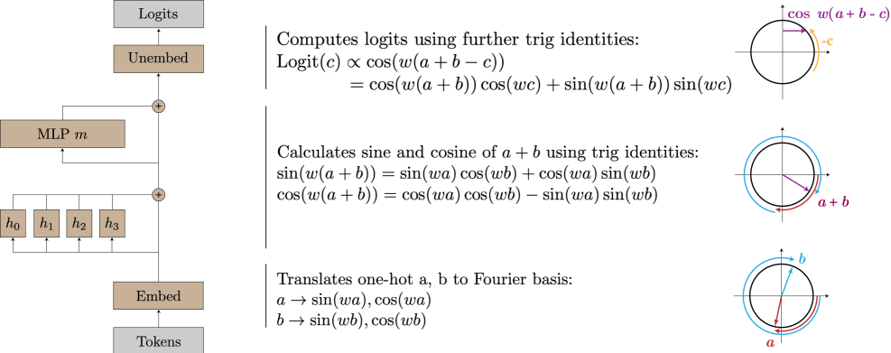
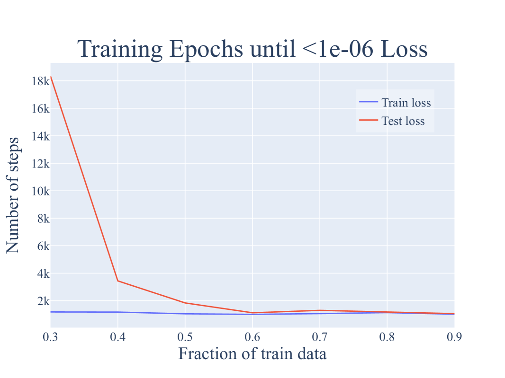
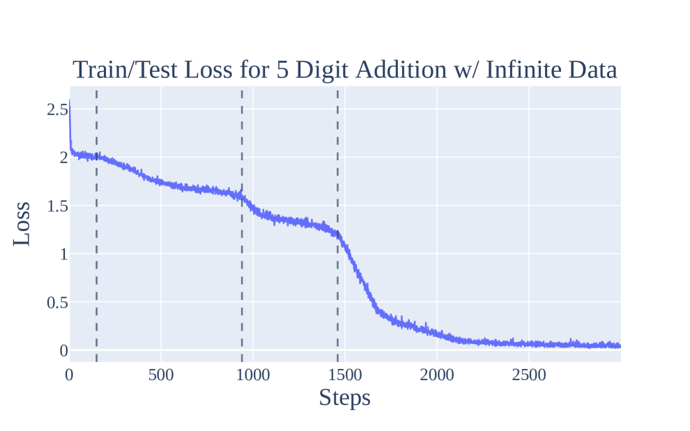
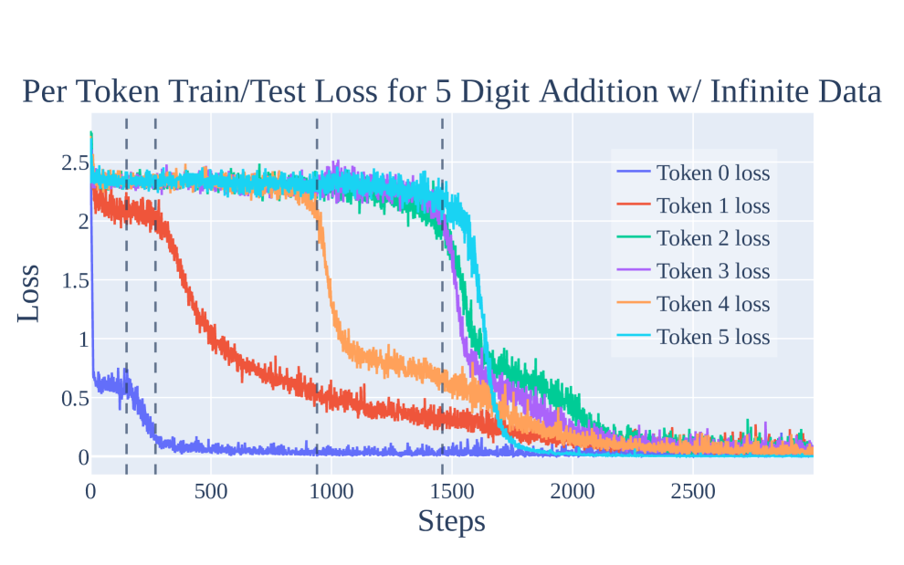

# Nanda et al. 2023 — Progress measures for grokking via mechanistic interpretability

See also: [the global concept index](../../concepts/index.md).

**Neel Nanda** — independent researcher (corresponding author).
**Lawrence Chan**, **Jacob Steinhardt** — University of California, Berkeley.
**Tom Lieberum**, **Jess Smith** — independent researchers.

arXiv [2301.05217v3](https://arxiv.org/abs/2301.05217), 12 January 2023. PDF header: "Published as a conference paper at ICLR 2023". The most cited work in this corpus after Power et al. 2022 (858 citations against 272 for the next one).

The original and the derived files of this folder:

- [`original/2301.05217.arxiv-html.html`](https://arxiv.org/abs/2301.05217) — the source: **the native arXiv HTML** (v3). Unlike Power et al. 2022, this paper has an official HTML rendering, so ar5iv was not needed.
- [`original/2301.05217.progress-measures-for-grokking-via-mechanistic-interpretability.md`](https://arxiv.org/abs/2301.05217) — the conversion of the original into Markdown, with no editing of the content.
- [`images/`](images/) — the paper's 76 figures at their original resolution.

The anchor scheme and the rules for linking into a card are in the [README of the papers folder](../README.md).

**Excerpt card.** The paper's licence (`arxiv-nonexclusive`) does not permit republishing the paper itself; what stands here are the editorial sections and the fragments the corpus quotes (right of quotation). The paper: <https://arxiv.org/abs/2301.05217>.

## Concepts covered

**[Progress measures](../../concepts/progress-measures.md)** — the paper brings the notion into the corpus and gives it a working definition: a continuous metric that precedes the sharp transition and is causally connected to it ([`p1-2`](2301.05217.progress-measures-for-grokking-via-mechanistic-interpretability.card.md#p1-2)). What matters is that the measures are not chosen from outside but **derived from an understood mechanism**: knowing that the network computes through key frequencies, the authors construct the *restricted loss* (zeroing every non-key frequency) and the *excluded loss* (zeroing the key ones). This is what sets the approach apart from metrics such as cross-entropy, which, as the authors note, move smoothly but do not explain *why* the transition happens.

**[Mechanistic interpretability](../../concepts/mechanistic-interpretability.md)** — the paper became the model of the genre: a complete reverse-engineering of a trained network rather than a partial explanation. The authors state that they "fully reverse engineered the algorithm learned by these networks" ([`p1-2`](2301.05217.progress-measures-for-grokking-via-mechanistic-interpretability.card.md#p1-2)) and support it with four independent lines of evidence — periodicity of weights and activations, composition of matrices, approximation of neurons by sines and cosines, and ablations in Fourier space. It is the pairing "mechanism first, metric second" that makes the work foundational for the whole line.

**[Modular arithmetic](../../concepts/modular-arithmetic.md)** — the paper turns the task from a testbed into a solved case. For addition modulo $P=113$ it is shown that the network maps the inputs onto a circle and adds rotations: the embeddings produce sines and cosines at a sparse set of key frequencies, the attention and MLP layers assemble $\cos(w_k(a+b))$ and $\sin(w_k(a+b))$ from them by trigonometric identities, and the output matrix "reads off" the logits by rotating by $-c$. After this work, the task of Power et al. stopped being a black box.

**[Fourier features and circuits](../../concepts/fourier-features-circuits.md)** — the source of the mechanism itself: the discrete Fourier transform as the learned representation, key frequencies as a sparse basis, trigonometric identities as the means of composition. This is where the corpus's language for describing modular-arithmetic solutions in terms of frequencies comes from.

**[Grokking](../../concepts/grokking.md)** — the paper gives the notion a **contesting position** that it still relies on: grokking, "rather than being a sudden shift, arises from the gradual amplification of structured mechanisms encoded in the weights, followed by the later removal of memorizing components" ([`p1-2`](2301.05217.progress-measures-for-grokking-via-mechanistic-interpretability.card.md#p1-2)). The suddenness turns out to be a property of the observed metric, not of the process beneath it.

**[Memorization phase](../../concepts/memorization-phase.md)** — the paper divides training into three continuous phases: memorization, circuit formation, cleanup ([`p1-2`](2301.05217.progress-measures-for-grokking-via-mechanistic-interpretability.card.md#p1-2)). Memorization stops being merely the state "before": it becomes the first phase of a process whose components are then deliberately removed, which is visible in the rising Gini coefficient of the Fourier components of $W_E$ and $W_L$ during cleanup.

**[Feature emergence](../../concepts/feature-emergence-feature-learning.md)** — takes the formulation about "the gradual amplification of structured mechanisms encoded in the weights" ([`p1-2`](2301.05217.progress-measures-for-grokking-via-mechanistic-interpretability.card.md#p1-2)): the structure does not appear at the moment of the jump, it builds up throughout the plateau.

**[Phase transition](../../concepts/phase-transition.md)** — the paper supplies the notion with a counter-argument. In this picture the sharpness of the transition is an artefact of the test error not seeing a reorganisation that is already under way; the jump itself falls in the cleanup phase.

**[Weight decay](../../concepts/weight-decay.md)** — the setup fixes weight decay as a condition for reproducible grokking: "small transformers trained with weight decay on this task consistently exhibit grokking" ([`p1-5`](2301.05217.progress-measures-for-grokking-via-mechanistic-interpretability.card.md#p1-5)), with $\lambda=1$ under full-batch AdamW. Section 5.3 examines its role as the force that cleans out the memorizing components.

**[Emergence](../../concepts/emergence.md)** — the paper places grokking in a wider frame: networks "often exhibit emergent behavior, where qualitatively new capabilities arise from scaling up" ([`p1-2`](2301.05217.progress-measures-for-grokking-via-mechanistic-interpretability.card.md#p1-2)), and offers progress measures as a general way of making such transitions predictable — with an explicit nod to the abrupt jumps on large language model benchmarks.

**[Slingshot effect](../../concepts/slingshot.md)** — mentioned as a possible implicit regulariser ([`p2-5`](2301.05217.progress-measures-for-grokking-via-mechanistic-interpretability.card.md#p2-5)); Appendix D.2 shows that the slingshot often accompanies grokking but is not necessary for it.

**[Freezing a subnetwork / lottery ticket](../../concepts/freezing-subnetwork.md)** — Appendix E ([`p35-3`](2301.05217.progress-measures-for-grokking-via-mechanistic-interpretability.card.md#p35-3)) discusses a lottery-ticket-style account of phase transitions and offers the hypothesis that transitions are intrinsic to the composition of circuits.

The card for Power et al. 2022 is [`2201.02177`](../2201.02177.grokking-generalization-beyond-overfitting-on-small-algorithmic-datasets/2201.02177.grokking-generalization-beyond-overfitting-on-small-algorithmic-datasets.card.md); this work continues it directly, taking the same task and explaining the mechanism.

**[When regularisation is necessary](../../concepts/regularization-necessity.md)** — the "necessary" pole: [without weight decay or another form of regularisation the authors' networks do not grok on modular arithmetic at all](2301.05217.progress-measures-for-grokking-via-mechanistic-interpretability.card.md#sec-5-3), and the heading of [Appendix D.1](2301.05217.progress-measures-for-grokking-via-mechanistic-interpretability.card.md#sec-d-1) asserts that both regularisation and limited data are necessary. The pole was obtained under cross-entropy with AdamW — the qualification that separates the sides in the card for that dispute.

**[Sparse solutions and hidden progress](../../concepts/sparse-solutions-hidden-progress.md)** — the paper introduces the move itself: to look behind a sharp transition for *hidden progress measures* that rise beneath the plateau ([`p1-4`](2301.05217.progress-measures-for-grokking-via-mechanistic-interpretability.card.md#p1-4)). What distinguishes it from a search over candidate quantities is that the measure is derived from a mechanistic account of the learned algorithm ([`p1-5`](2301.05217.progress-measures-for-grokking-via-mechanistic-interpretability.card.md#p1-5)) rather than selected because its curve happens to fit.

**[Approximate Chinese Remainder Theorem](../../concepts/approximate-chinese-remainder-theorem.md)** — the angle-addition algorithm reverse-engineered here, working through trigonometric identities ([`p2-1`](2301.05217.progress-measures-for-grokking-via-mechanistic-interpretability.card.md#p2-1)), was later declared a special case of a more general abstract algorithm. That generalisation is not this paper's own.

## Points we could not reconcile

These are the card editor's remarks: places where two passages of the paper itself say different things. They matter when the paper is cited, because a restatement usually picks up the wording while the qualifying numbers stay in an appendix.

**The direction of the weight-decay effect contradicts the paper's own numbers.** Appendix D.1 states: "Smaller amounts of weight decay lead to slower grokking, and larger amounts to faster grokking", and immediately gives measurements: $\lambda=0.3$ — about 3 thousand epochs, $\lambda=1.0$ — 5 to 10 thousand, $\lambda=3.0$ — 20 thousand. The numbers say the opposite: **smaller** weight decay gives faster grokking, larger gives slower. The paper neither notes nor explains the contradiction. It matters because §5.3 and D.1 both rest on this passage as evidence that weight decay drives the progress toward the generalising solution.

Taking the paper's own data together, the picture is non-monotone:

| weight decay | outcome |
|---|---|
| $\lambda=0$ | no grokking at all; the excluded loss does not rise and no circuit forms (D.1) |
| $\lambda=0.3$ | ~3 thousand epochs |
| $\lambda=1.0$ | 5–10 thousand epochs |
| $\lambda=3.0$ | ~20 thousand epochs |

So at zero there is no grokking, and beyond that the time to grokking grows with $\lambda$ — which means the dependence turns somewhere between $0$ and $0.3$ and an optimum lies there. The authors do not discuss this.

The outside half of the dispute — Omnigrok's measurement on a reproduction of this same setup ($t\propto\gamma^{-1}$, which contradicts the numbers above), Kumar's independent reading of figure 27, and the hypothesis of a task-dependent optimum in $\lambda$ — is collected in the concept card [direction of the weight-decay effect](../../concepts/weight-decay-direction.md); what remains here is only the internal disagreement between the text and its numbers.

**A pointer to a section that does not exist.** Appendix D.1 opens with "As discussed in section 7 and appendix C.2", while the paper has six top-level sections; by content, [§5.3](2301.05217.progress-measures-for-grokking-via-mechanistic-interpretability.card.md#sec-5-3) is meant.

**A pointer to the wrong table.** Appendix C.1.3 refers to "table 1" while table 2 is the one given; table 1 sits in §4.2 and contains something else — projections of MLP activations.

**The sixth frequency.** §4.1 reports that $W_E$ has substantially non-zero norm at **six** frequencies, of which "only 5 seem to be significantly used" later in the model. What becomes of the sixth is not said anywhere: it is not among the key frequencies, takes no part in the ablations and is never discussed — even though the whole construction of the progress measures rests on splitting frequencies into key and non-key.

## Common misreadings and overstatements of this paper

A remark by the card editor. The authors declare Appendix E to be reasoning rather than result: "the evidence is only suggestive, so this is a promising direction for future work" ([`sec-e-1`](2301.05217.progress-measures-for-grokking-via-mechanistic-interpretability.card.md#sec-e-1)). Nothing asserted in those two sections is measured in the paper. The corpus nevertheless cites them on a par with the results of sections 4–5, so the status is worth keeping in mind: that the complexity of memorization grows with the training set while the complexity of generalization stays constant, and "at some point they must cross"; that the lottery ticket hypothesis "seems most explanatory"; that phase transitions are intrinsic to the composition of circuits. All of these are the authors' hypotheses, not their results.

The same appendix holds the methodological caveat for which the section is worth reading — footnote 4:

> The grokking phenomenon is often incorrectly summarised as "the model learned to generalise even after reaching zero loss". **There is no zero loss under cross-entropy.** Although the model reaches perfect *accuracy*, it is trained to optimise loss, not accuracy. This means the model *always* has an incentive to improve further. In particular, the simplest way to improve performance at perfect accuracy is to increase the logits. That lowers the temperature and brings the softmax closer to an argmax.

What this means in practice for the concept cards. The formulation "generalisation sets in after the training loss has reached zero" — which appears both in restatements of Power et al. 2022 and in definitions of grokking — does not describe what happens. Training does not stop at perfect accuracy: the loss keeps falling through the growth of the logits, and it is exactly this continuing pressure, balanced by weight decay, that drives the circuit-formation and cleanup phases of [§5.2](2301.05217.progress-measures-for-grokking-via-mechanistic-interpretability.card.md#sec-5-2). The correct formulation rests on **accuracy**, not on loss: the network reaches perfect accuracy on the training set, and only much later on the test set.

This is also why the progress measures in this paper are built on loss rather than accuracy: training accuracy saturates at 100% and stops distinguishing anything, while the loss keeps carrying signal for as long as the reorganisation inside the network continues.

---

# Quoted fragments

Only the fragments the corpus cards refer to are
reproduced here (right of quotation); the paper's licence does not permit
republishing the whole text. Anchor numbering matches the original.

###### p1-2

Neural networks often exhibit emergent behavior, where qualitatively new capabilities arise from scaling up the amount of parameters, training data, or training steps. One approach to understanding emergence is to find continuous *progress measures* that underlie the seemingly discontinuous qualitative changes. We argue that progress measures can be found via mechanistic interpretability: reverse-engineering learned behaviors into their individual components. As a case study, we investigate the recently-discovered phenomenon of “grokking” exhibited by small transformers trained on modular addition tasks. We fully reverse engineer the algorithm learned by these networks, which uses discrete Fourier transforms and trigonometric identities to convert addition to rotation about a circle. We confirm the algorithm by analyzing the activations and weights and by performing ablations in Fourier space. Based on this understanding, we define progress measures that allow us to study the dynamics of training and split training into three continuous phases: memorization, circuit formation, and cleanup. Our results show that grokking, rather than being a sudden shift, arises from the gradual amplification of structured mechanisms encoded in the weights, followed by the later removal of memorizing components.

###### p1-4

Emergence is most surprising when it is abrupt, as in the case of reward hacking, chain-of-thought reasoning, or other phase transitions (Ganguli et al., 2022; Wei et al., 2022a). We could better understand and predict these phase transitions by finding *hidden progress measures* (Barak et al., 2022): metrics that precede and are causally linked to the phase transition, and which vary more smoothly. For example, Wei et al. (2022a) show that while large language models show abrupt jumps in their performance on many benchmarks, their cross-entropy loss decreases smoothly with model scale. However, cross-entropy does not explain *why* the phase changes happen.

###### p1-5

In this work, we introduce a different approach to uncovering hidden progress measures: via *mechanistic explanations*.111Interactive versions of figures, as well as the code to reproduce our results, are available at https://neelnanda.io/grokking-paper. A mechanistic explanation aims to reverse engineer the mechanisms of the network, generally by identifying the circuits (Cammarata et al., 2020; Elhage et al., 2021) within a model that implement a behavior. Using such explanations, we study *grokking*, where models abruptly transition to a generalizing solution after a large number of training steps, despite initially overfitting (Power et al., 2022). Specifically, we study modular addition, where a model takes inputs $a,b\in\{0,\ldots,P-1\}$ for some prime $P$ and predicts their sum $c$ mod $P$. Small transformers trained with weight decay on this task consistently exhibit grokking (Figure 2, Appendix C.2).

###### p2-1

We reverse engineer the weights of these transformers and find that they perform this task by mapping the inputs onto a circle and performing addition on the circle. Specifically, we show that the embedding matrix maps the inputs $a,b$ to sines and cosines at a sparse set of *key frequencies* $w_{k}$. The attention and MLP layers then combine these using trigonometric identities to compute the sine and cosine of $w_{k}(a+b)$, and the output matrices shift and combine these frequencies.

*Figure 1: The algorithm implemented by the one-layer transformer for modular addition. Given two numbers $a$ and $b$, the model projects each point onto a corresponding rotation using its embedding matrix. Using its attention and MLP layers, it then composes the rotations to get a representation of $a+b\mod P$. Finally, it “reads off” the logits for each $c\in\{0,1,...,P-1\}$, by rotating by $-c$ to get $\cos(w(a+b-c))$, which is maximized when $a+b\equiv c\mod P$ (since $w$ is a multiple of $\frac{2\pi}{P})$.*

###### p2-2

We confirm this understanding with four lines of evidence (Section 4): (1) the network weights and activations exhibit a consistent periodic structure; (2) the neuron-logit map $W_{L}$ is well approximated by a sum of sinusoidal functions of the key frequencies, and projecting the MLP activations onto these sinusoidal functions lets us “read off” trigonometric identities from the neurons; (3) the attention heads and MLP neuron are well approximated by degree-$2$ polynomials of trigonometric functions of a single frequency; and (4) ablating key frequencies used by the model reduces performance to chance, while ablating the other 95% of frequencies slightly *improves* performance.

###### p2-3

Using our understanding of the learned algorithm, we construct two progress measures for the modular addition task—*restricted loss*, where we ablate every non-key frequency, and *excluded loss*, where we instead ablate all key frequencies. Both metrics improve continuously prior to when grokking occurs. We use these metrics to understand the training dynamics underlying grokking and find that training can be split into three phases: **memorization** of the training data; **circuit formation**, where the network learns a mechanism that generalizes; and **cleanup**, where weight decay removes the memorization components. Surprisingly, the sudden transition to perfect test accuracy in grokking occurs during cleanup, *after* the generalizing mechanism is learned. These results show that grokking, rather than being a sudden shift, arises from the gradual amplification of structured mechanisms encoded in the weights, followed by the later removal of memorizing components.

###### p2-5

**Grokking.** Grokking was first reported in Power et al. (2022), which trained two-layer transformers on several algorithmic tasks and found that test accuracy often increased sharply long after achieving perfect train accuracy. Millidge (2022) suggests that this may be due to SGD being a random walk on the optimal manifold. Our results echo Barak et al. (2022) in showing that the network instead makes continuous progress toward the generalizing algorithm. Liu et al. (2022) construct small examples of grokking, which they use to compute phase diagrams with four separate “phases” of learning. Thilak et al. (2022) argue that grokking can arise without explicit regularization, from an optimization anomaly they dub the slingshot mechanism, which may act as an implicit regularizer.

**Circuits-style mechanistic interpretability.** The style of post-hoc mechanistic interpretability in Section 4 is heavily inspired by the Circuits approach of Cammarata et al. (2020), Elhage et al. (2021), and Olsson et al. (2022).

**Progress measures.** Barak et al. (2022) introduce the notion of *progress measures*—metrics that improve smoothly and that precede emergent behavior. They prove theoretically that training would amplify a certain mechanism and heuristically define a progress measure. In contrast, we use mechanistic intepretability to discover progress measures empirically.

###### sec-3

## 3 Setup and Background

###### sec-3-1

### 3.1 The Fourier multiplication algorithm

###### sec-4-1

### 4.1 Suggestive evidence: surprising periodicity

###### sec-5-2

### 5.2 Phases of grokking: memorization, circuit formation, and cleanup

###### sec-5-3

### 5.3 Grokking and Weight Decay

###### fig-20

*Figure 20: Training and test losses for a 1-layer transformer on the modular addition task with $P=113$, with varying fractions of the $113\cdot 113$ pairs of possible inputs used in training. Grokking occurs when between $30-50\%$ of the dataset is used during training and lower fractions of data lead to slower grokking. Using $\geq 60\%$ data leads to immediate generalization, while using $10\%$ or $20\%$ of the data doesn’t lead to grokking even after 40k epochs. Note the different x-axes: we only show 5k epochs for the runs with data fraction $\geq 40\%$ for more detail.*

*Figure 21: Number of steps for train/test loss to be $<10^{-6}$, as a function of the amount of training data. While train loss immediately converges to below $10^{-6}$ for all data fractions, generalization takes significantly longer with lower fractions of data. Note that the plots for other thresholds are also qualitatively similar.*

###### p22-5

We also examined smaller and larger prime moduli. For $P=53$ (Figure 24), we explored a variety of weight decays to observe grokking in the small prime case. With the original weight decay setting of $\lambda=1$, we found that the models never generalized. However, increasing the weight decay to $\lambda=5$ does allow the model to grok. We speculate that this is because the memorization solution is significantly smaller (since there are only $53\cdot 53$ total pairs), thereby requiring more aggressive weight decay for the generalizing solution to be favored.

For $P=109$, we saw exactly the same behavior as with the mainline model.

###### p22-7

For $P=401$ (Figure 25), we could not get grokking, even by varying the weight decay parameter $\lambda\in\{0.3,0.5,1,3,5,8\}$. Instead, the model immediately learns the generalizing solution. We believe this is because the amount of data seen by the model is greatly increased compared to the $P=113$ case (from 30% of $113\cdot 113$ pairs to 30% of $401\cdot 401$ pairs), thereby favoring the generalizing solution from the start. We then trained 3 models each using $5\%$, $10\%$, $20\%$ of the pairs of training data with $\lambda=1$, and found that the models trained on $5\%$ and $10\%$ of the data immediately overfit and never generalized, while the models trained on $20\%$ of the data also generalized immediately.

###### sec-d-1

### D.1 Both regularization and limited data are necessary for grokking

###### sec-d-2

### D.2 The slingshot mechanism often occurs, but is unnecessary for grokking

###### p22-17

As noted in Section C.2, our 2-layer transformers exhibit significant slingshots (Thilak et al., 2022) during training. We speculate that this is due to how gradients of different scale interact with adaptive optimizers. We were even able to induce slingshots on a 1-layer by reducing the precision of the loss calculations (as this causes many gradients to round to 0 and thus greatly increases the differences in scale of gradients).

However, as many of our 1-layer models do not exhibit slingshots but nonetheless grok, the slingshot mechanism is unnecessary for grokking to occur, in the presence of weight decay or other regularization. We speculate that the slingshots of Thilak et al. (2022) (which co-occur with grokking for training runs *without* weight decay) serve as an implicit regularization mechanism that favors the simpler, generalizing solution over the more complicated

*Figure 29: (*Top*) The training/test loss for 5 Digit Addition trained on randomly generated data. Note that training and test loss coincide, as the model does not see repeated pairs.(*Bottom*) The train/test loss *per token* for 5 Digit Addition, trained with randomly generated data at each step. Note that phase changes in the average loss correspond to phase changes in individual tokens, though one phase change (token 1, around step 270) is not visible on the averaged loss as it overlaps with the end of the first phase change (token 0, starting around step 150).*

###### sec-e-1

### E.1 An intuitive explanation of grokking

###### p22-27

Grokking occurs when models, trained on algorithmic tasks with certain hyperparameters, initially overfit the training data where train loss significantly improves while test loss worsens and the two diverge. But later in training, there is a sudden improvement in test loss, so test and train loss converge. In contrast to Power et al. (2022) but in line with Liu et al. (2022), grokking does *not* occur when both train and test loss improve together without the initial divergence, as shown in many of the figures in this paper, for example Figures 2 and 18.

The core issue is that the model has two possible solutions: memorization (with low train loss and high test loss) and a generalization (with low train loss *and* low test loss). In our case, the Fourier Multiplication Algorithm is the generalization solution. Intuitively, with very little training data, the model will overfit and memorize. With more training data, the model must generalize or suffer poor performance on both train and test loss. Since neural networks have an inductive bias favoring “simpler” solutions, memorization complexity scales with the size of the training set, whereas generalization complexity is constant. The two must cross at some point! Yet, the surprising aspect of grokking is the abrupt shift during training, when the model *switches* from memorization to generalization.

The other component of grokking is phase transitions - the phenomena where models trained on a certain task develop a specific capability fairly rapidly during a brief period of training, as shown for the case of induction heads forming in transformer language models in Olsson et al. (2022) and our results in Appendix D.3. That is, rather than slowly forming that capability over training, the model rapidly goes from being bad at it to being good at it. One interpretation of a phase transition is that there’s some feature of the loss landscape that makes the generalising solution harder to reach - rather than a smooth gradient for the model to follow, it instead initially finds it difficult to make progress, but then crosses some threshold where it can rapidly make progress.

Therefore, grokking occurs with phase transitions, limited data, and regularization. Models exhibit phase transitions despite having enough training data to avoid overfitting. Regularization (weight decay in our case) favors simpler solutions over complex ones. The model has enough data to marginally prefer generalization over memorization. The phase transition indicates that generalization is “hard to reach” while the model has no problems with memorization. But as it memorizes, the network becomes more complex until the weight decay prevents further memorization then moves towards equilibrium. The gradient to memorize balances the gradient towards smaller weights. With generalization, the model is incentivized to both memorize and simplify. Strikingly, it is capable of both while maintaining a somewhat constant training performance in this circuit formation phase. Next, as the model approaches generalization, the memorization weights are removed in the cleanup phase. The cost from complexity outweighs the benefit from lower loss. Due to the phase transition during this training period, as model’s progress towards generalization accelerates, the cleanup rate sharpens as well.

A model that learns a perfect solution and is trained with weight decay has competing incentives: larger weights (for more extreme logits and thus lower loss) and smaller weights (from weight decay). So for any solution and any level of weight decay, there will always be a level of train loss where these two forces equilibrate. Thus, memorization is not necessarily a “simpler” solution than generalization. The key is that generalization will have smaller weights *holding train loss fixed*. In fact, weight decay should be expected to equilibrate at a slightly lower train loss in generalization, since the base solution is simpler. This matches what we observe in practice. 444One subtlety: the grokking phenomena is often incorrectly summarized as “the model learned to generalize even after achieving zero loss.” Zero loss does not exist with cross-entropy loss. Although the model achieves perfect *accuracy*, it is trained to optimize loss not accuracy. This means the model is *always* incentivized to further improve. In particular, the easiest way to improve performance with perfect accuracy is by scaling up the logits. This lowers the temperature and pushes the softmax closer to an argmax.

###### p35-3

Returning to phase transitions, the lottery ticket-style explanation suggests that we might expect phase transitions as circuits form. Early in circuit formation, each part of the circuit is rough, so the effect on the loss of improving any individual component is weak, meaning gradients will be small. As each component develops, other components will become more useful, meaning all gradients will increase together non-linearly. As the circuit nears completion, we should expect an acceleration in the loss curve for this circuit, resulting in a phase transition.
