# Chughtai et al. 2023 — A Toy Model of Universality: Reverse Engineering how Networks Learn Group Operations

See also: [the global concept index](../../concepts/index.md). arXiv [2302.03025v2](https://arxiv.org/abs/2302.03025), 6 February 2023 (v2 — 24 May 2023). PDF running head: "Proceedings of the 40 th International Conference on Machine Learning, Honolulu, Hawaii, USA. PMLR 202, 2023".

**Bilal Chughtai** — Independent (correspondence: brchughtaii@gmail.com). **Lawrence Chan** — UC Berkeley. **Neel Nanda** — Independent.

The files of this paper's analysis:

- [`2302.03025.a-toy-model-of-universality-reverse-engineering-how-networks-learn-group-operations.license.txt`](2302.03025.a-toy-model-of-universality-reverse-engineering-how-networks-learn-group-operations.license.txt) — the arXiv licence record for this paper.

The anchor scheme and the rules for linking into a card are in the [README of the papers folder](../README.md).

**Excerpt card.** The paper's licence (`arxiv-nonexclusive`) does not permit republishing the paper itself; what stands here are the editorial sections and the fragments the corpus quotes (right of quotation). The paper: <https://arxiv.org/abs/2302.03025>.

## Concepts covered

**[Group representations and cosets](../../concepts/group-representations-cosets.md)** — the work introduces the very language into the corpus: the GCR algorithm (group composition via representations), in which the network embeds the inputs into representation matrices $\rho(a)$, $\rho(b)$, multiplies them through a non-linearity into $\rho(ab)$ and reads the logits off as characters $\chi_{\rho}(abc^{-1})$ ([§4](#sec-4), [fig. 1](#fig-1)). Of the algorithm it is said outright that the authors have not met it in the earlier literature ([p3-7](#p3-7)). The key move of the frame is not a single algorithm but a **family** of $k$ independent circuits, one per irreducible representation of the group, of which the network is free to take any subset ([p3-12](#p3-12)); correctness rests on theorem D.7 (the character is maximal at the group identity). What the work does not have: cosets as a separate mechanism — the word `coset` occurs only in the definition of the sign representation ([p16-11](#p16-11)) and in a failed attempt to reproduce clustering by subgroups ([E.4](#p22-2)); the explanation through coset circuits on $S_{5}$ appeared later and does not belong to the authors of this work. Nor is there completeness outside the frame: all irreducible representations are enumerated, that is, all solutions **of the GCR form**, not all solutions whatsoever.

**[Group composition / non-commutativity](../../concepts/group-composition-non-commutative-s5.md)** — the work makes the composition of an arbitrary finite group a standard testbed of the corpus and explains why: it is "a large family of related tasks, forming an algorithmic testbed for studying universality" ([p1-4](#p1-4)). Seven groups are analysed — $C_{113}$, $C_{118}$, $D_{59}$, $D_{61}$, $S_{5}$, $S_{6}$, $A_{5}$ — on two architectures with four seeds each ([p7-4](#p7-4)), while the main analysis is carried out on $S_{5}$, where the composition is non-commutative and where the choice is justified by Cayley's theorem ([p4-5](#p4-5)). From here too the names of the irreducible representations of $S_{5}$ entered the corpus — sign, standard, standard_sign, 5d_a, 5d_b, 6d of dimensions $d=\lbrace1,4,4,5,5,6\rbrace$. What the work does not have: a generalization to semigroups and to other binary operations — these are named as future work ([F](#p23-4)), and for semigroups it is said outright that there is no analogue of representation theory.

**[Mechanistic interpretability](../../concepts/mechanistic-interpretability.md)** — the work sets the corpus's framing of the question of **universality** and splits it in two: strong universality asserts that the same features and circuits arise in all similarly trained models; weak universality, that there are shared principles but any individual model embodies them "in a somewhat arbitrary manner" ([p2-3](#p2-3)). The verdict is stated as mixed: evidence for weak and against strong, with the practical corollary that "analysing a single network is not sufficient for understanding the behaviour of networks in general" ([p8-6](#p8-6)). The argument is built unusually: the task is chosen so that all solutions can be enumerated and what was learned can be checked against the complete list — on the main $S_{5}$ model only two of the six possible circuits are seen ([p12-5](#p12-5)). What the work does not have: automated methods — they are named as what should be turned to if universality is false ([p1-3](#p1-3)); nor is there any transfer to real models, which is left to future work.

**[Progress measures](../../concepts/progress-measures.md)** — the work carries the restricted and excluded loss of Nanda et al. 2023 over to a second task, and this is its direct aim: the limitation of the earlier work is named as the technique's possibly "not generalizing beyond one particular task" ([p6-10](#p6-10)). The definitions are carried over with frequencies replaced by representations: the **restricted loss** truncates the MLP activations to the $16+1$-dimensional subspace of $\rho(ab)$ in the key representations, the **excluded loss** does the reverse, removing those directions, and is therefore computed only on the training set ([E.1](#p18-2)). A caveat named outright matters: the restricted loss "assumes that the memorizing algorithm has no dedicated subspace in the MLP layer" ([p18-2](#p18-2)) — there is no check of this assumption in the work. What the work does not have: new progress measures and causality — the measures are taken ready-made, and the contribution is claimed elsewhere, in applying them to the question of universality.

**[Grokking](../../concepts/grokking.md)** — the work gives the corpus a robust reproduction of grokking on non-commutative group composition: on $S_{5}$ over 50 seeds the models "quickly overfit early in training but then suddenly generalize much later" ([fig. 2](#fig-2)). Agreement with the corpus is stated verbatim: with Liu et al. 2022c that grokking "appears to be intrinsically connected to the relationship between performance and weight norms", and with Barak et al. 2023 and Nanda et al. 2023 that networks advance continuously toward the generalizing algorithm ([p3-1](#p3-1)). A separate finding is **two phases of grokking** within one run: the model groks, having cleaned up memorization with the standard circuit in place, stagnates, and groks again after mastering the 5d_b representation around epoch 100k ([fig. 14](#fig-14)). What the work does not have: an explanation of grokking of its own — it is taken from Nanda et al. wholesale, together with the conclusion that the jump falls on the cleanup, already **after** the onset of the drop in the restricted loss ([p6-11](#p6-11)).

**[Memorization phase / plateau](../../concepts/memorization-phase.md)** — the work reproduces the three-phase division of training on a new task and gives it numerical boundaries: memorization (epochs 0–2k), circuit formation (2.2k–87k), cleanup (87k–120k) ([fig. 6](#fig-6), [E.1](#p18-5)). The phases are called partially overlapping ([p6-11](#p6-11)), and a quantity in agreement with the division is attached: the sum of squared weights peaks at the end of memorization, decreases smoothly during circuit formation and sharply during cleanup, whence the conclusion that both phases are connected with weight decay ([fig. 12](#fig-12)). What the work does not have: a check that the memorizing solution really does not occupy a dedicated subspace — without it the excluded loss remains a measure by construction rather than a measurement of the memorizing circuit.

**[Fourier features and circuits](../../concepts/fourier-features-circuits.md)** — the work embeds the Fourier description into a more general frame: the trigonometric algorithm of Nanda et al. 2023 is declared a special case of GCR, and "the different Fourier modes are better thought of as different *irreducible representations* of the cyclic group" ([p1-4](#p1-4)). The correspondence is worked out element by element ([p4-1](#p4-1), [p4-2](#p4-2)): the $\cos\left(\omega_{k}a\right)$, $\sin\left(\omega_{k}a\right)$ found there are exactly the entries of the matrix $\rho(a)$, the frequency $\omega_{k}=\frac{2\pi k}{n}$ corresponds to the two-dimensional representation $\mathbf{2_{k}}$, and the seven quadratic terms per neuron come out as $\rho(a),\rho(b),\rho(ab)$ with two degrees of freedom each plus a constant ([B](#p13-3)). What the work does not have: a claim that the Fourier description is wrong — it is called "elegant, but tied to the modular addition task" ([p13-2](#p13-2)), and on $C_{113}$ the results of the earlier work are reproduced within the new frame.

**[Modular arithmetic](../../concepts/modular-arithmetic.md)** — the work redefines the corpus's task as a special case of its own: "addition modulo $113$ is equivalent to composition with $G=C_{113}$, the cyclic group of $113$ elements" ([p3-2](#p3-2)). The practical corollary for the corpus is that modular addition ceases to be a separate task and becomes one point in a family, while non-abelian groups give the same task without commutativity. An unexplained difference is noted in passing: for cyclic groups the fraction of variance explained in the logits is noticeably higher than for other groups, and the authors merely "suspect" a connection with special orthogonality properties of the discrete Fourier transform that are not shared by arbitrary irreducible representations ([H](#p23-9)).

**[Learning structured representations](../../concepts/structured-representation-learning.md)** — the work gives the corpus a rare case in which the learned representation is checked not against the analyst's intuition but against a complete list known in advance: the representation matrices are extracted from the activations explicitly — the sign ones match exactly, the standard ones with an MSE below $10^{-8}$, and for the unlearned representations nothing is extracted at all ([p6-3](#p6-3)). The embeddings and the unembedding turned out to be low-rank: rank $16+1$ instead of the possible $120$, exactly matching the dimensions of the two key representations ([p5-2](#p5-2)); the neurons split into disjoint clusters by representation — $7$ sign, $119$ standard, $2$ always off, and the split is the same at the inputs and the outputs ([p5-4](#p5-4)). What the work does not have: a claim that the representation is chosen uniquely — the set, the number and the order in which representations are mastered vary from seed to seed.

**[Causal ablation](../../concepts/causal-ablation-intervention.md)** — the work gives the corpus a two-sided checking scheme and one of its strongest outcomes. The excluding side: at a baseline loss of $2.38\times 10^{-6}$, ablating $\rho_{standard}(ab)$ raises it to $7.55$, and $\rho_{sign}(ab)$ to $0.0009$ ([p6-2](#p6-2)); ablating the algorithm's predictions in the logits over both key representations gives $7.60$ — "substantially worse than random" ([p6-9](#p6-9)). The restricting side: replacing the neurons with the representation matrices themselves reduces the loss by $70$%, projecting onto the $16+1$ directions by another $12$%, while ablating what is predicted to be noise does not damage the loss and often **improves** it ([p2-2](#p2-2)). What the work does not have: causal language and interventions during training — all ablations are taken on the trained model.

**[Weight decay / L2 regularization](../../concepts/weight-decay.md)** — the work makes weight decay the cause of both non-initial phases rather than one: the drop in the sum of squared weights during circuit formation "suggests that circuit formation likely happens due to weight decay" ([p18-6](#p18-6)), and during cleanup weight decay "encourages the network to discard the memorized solution", since the generalizing circuit weighs less at comparable performance ([p18-7](#p18-7)). In the main experiments $\lambda=1$ with AdamW ([C](#p13-4)). What the work does not have: a check of necessity — no experiment without weight decay was run here, and the claim "without regularization there is no grokking" does not belong to this work; exactly the opposite is said as to coverage: "other regularizers can also exhibit grokking" ([p7-1](#p7-1)).

**[Weight norm minimization](../../concepts/weight-norm-minimization.md)** — the work gives the corpus an inconvenient special case of the norm-versus-performance trade-off: the network prefers the standard representation, although standard_sign "in fact gives *better* performance at a fixed weight norm" ([p8-2](#p8-2)). The same trade-off explains a small detail at the end of training too — the slight rise in the restricted loss, since multiplying the whole circuit by a constant $r>1$ reduces the loss but requires more weight ([p18-7](#p18-7)). It matters that the trade-off here obstructs building a complexity measure: representations with more degrees of freedom may give better performance at the same norm, "so it is unclear which one the model will prefer and hence which is least complex" ([p8-3](#p8-3)).

**[Spectral analysis / FVE](../../concepts/spectral-analysis-svd-esd-fve.md)** — the work makes the fraction of variance explained (FVE) the principal summary quantity of the analysis and extends it to representation subspaces: the projection is done by a QR decomposition of the $n\times d^{2}$ tensor of flattened representation matrices ([E.5](#p22-4)), and before the computation the activations are centred, otherwise the positive mean after ReLU would artificially inflate all the fractions ([p23-1](#p23-1)). Numbers are reported for all seven groups and both architectures ([table 3](#sec-6)). A caveat is set apart by the authors: the FVE of the logits is noticeably below $100$%, and this is explained not by an error of the analysis but by the fact that ReLU only approximates matrix multiplication and mixes in $\rho(a)$ and $\rho(b)$ terms that are not orthogonal to the required directions ([p23-9](#p23-9)).

**[The reference grokking testbed](../../concepts/canonical-grokking-testbed.md)** — the work inherits the setting of Power et al. 2022 and Nanda et al. 2023 almost entirely: a training fraction of $40$% of the multiplication table, full batch, AdamW, cross-entropy, $250,000$ epochs ([C](#p13-4)). A negative reproduction result deserves separate mention: the clustering of the unembedding by subgroups via t-SNE, as in Power et al., could not be obtained — it came out via PCA, and in the embeddings the clusters correspond to the cosets of a **different** subgroup, arbitrary from run to run at that, and "it is hard to say whether this observation is meaningful" ([E.4](#p22-2)). What the work does not have: a sweep over data fractions or over control quantities generally — the fraction is fixed at one value.

**[Regularization variants](../../concepts/regularization-variants.md)** — the work reports that the phenomenon is not tied to weight decay: "we find that models grok arbitrary group composition under dropout, and the progress-measure approach can also be used to understand grokking in that case" ([p7-1](#p7-1)). The reference here is to the earlier work — the result is called a mirror of Nanda et al. 2023. What the work does not have: numbers — neither the dropout rate, nor curves, nor a table for that run is given in the paper; the claim stands as a single sentence.

**[Feature emergence](../../concepts/feature-emergence-feature-learning.md)** — the work gives the corpus a measured **order** in which features are mastered and shows that it is not deterministic: the one-dimensional sign representation is consistently mastered first but generalizes poorly, whereas the high-dimensional faithful ones are the reverse — harder to learn and better at generalizing; this is related to types 1 and 3 of the taxonomy of Davies et al. 2022 ([p8-5](#p8-5)). At the same time there is no strict ordering by dimension, and this is recorded as a refutation of the authors' own prediction ([p8-2](#p8-2)). Features here are identified with irreducible representations, and circuits with how the weights make use of them ([p7-3](#p7-3)); a footnote notes that the field has no satisfactory definition of a feature. What the work does not have: a measure of a feature's complexity — it is merely named as possible on the basis of a probabilistic trend ([p8-3](#p8-3)).

**[Sparse subnetwork / lottery ticket](../../concepts/sparse-subnetwork-lottery-ticket.md)** — a mention only, and at that in future work: the authors conjecture that "lottery tickets (Frankle & Carbin 2019) may be present in the initialized weights, which would allow the features learned by the trained network to be anticipated *before training*" ([p9-1](#p9-1)). There is no experiment in this direction in the work, and the authors do not connect the probabilistic character of the choice of representations with lottery tickets.

**[Data fraction / critical dataset size](../../concepts/data-fraction-critical-dataset-size.md)** — a mention only, in the form of a fixed setting: training runs on $40$% of all $n^{2}$ cells of the group's multiplication table, and the test loss and accuracy are computed on all pairs not included in training ([C](#p13-4)). The work does not measure any dependence on the fraction and introduces no critical size.

**[Emergence / emergent abilities](../../concepts/emergence.md)** — a mention only, but one that sets the frame: grokking is called "a form of emergence" ([p3-1](#p3-1)), and progress measures a technique for understanding emergence out of mechanistic explanations ([p6-10](#p6-10)). In the related-work survey, scale observations stand alongside — the abrupt change of abilities with model growth and AlphaZero's rapid acquisition of human chess concepts between 10k and 30k training steps ([p2-7](#p2-7)). There are no scale experiments of the authors' own in the work.

**[Phase transition](../../concepts/phase-transition.md)** — a mention only, descriptive: the words "phase changes" stand in the heading of a survey paragraph ([p2-7](#p2-7)) and in the remark that "sometimes we find additional phase changes" — with a reference to the run with two grokking phases ([p7-2](#p7-2)). The work introduces neither an order parameter nor the language of phase transitions as a theory, and its division of training into phases is a division by progress measures, not by a thermodynamic analogy.

---

**[The universality hypothesis](../../concepts/universality-hypothesis.md)** — the work takes it as the object of a test rather than as a premise: networks should learn similar features and circuits on similar tasks ([`p1-3`](#p1-3)). The composition of finite-group elements was chosen as the testbed precisely because it defines a whole family of related tasks with a known answer ([`p1-4`](#p1-4)).

**[Seed variance and reproducibility](../../concepts/seed-variance-reproducibility.md)** — here the variance is not a nuisance but a measuring instrument: strong universality would require agreement of representations across seeds, and the work does not find that agreement in the general case ([`p7-6`](#p7-6)). Comparison of runs becomes a way of refuting the claim rather than a caveat to it.

**[The generalizing circuit](../../concepts/generalization-circuit.md)** — the network is described as carrying two classes of circuits, and the generalizing one is singled out by which family of irreducible representations it employs ([`p6-11`](#p6-11)). The difference from a behavioural definition is that here the circuit is addressable in the weights.

**[Intrinsic symmetry of the task](../../concepts/intrinsic-task-symmetry.md)** — the work takes grokking beyond the commutative case: $S_5$ is not abelian, the composition is non-commutative ([`p4-5`](#p4-5)), and the transition occurs all the same. This limits the naive identification of a task's symmetry with the interchangeability of its operands.
## Points we could not reconcile

**The orthogonality of characters is attributed to two different theorems.** In [§4](#p3-12) it is said that the orthogonality of characters across distinct representations is given by theorem D.9, "a fact we use in section 5.1"; in [§5.1](#p4-11) itself the same fact is derived from theorem D.8. By the statements of appendix D it is D.8 that concerns characters (the Schur orthogonality relation for characters), while D.9 concerns matrix entries; the reference to D.9 in §5.2 the work uses correctly. That is, the cross-reference in §4 is the erroneous one, and when citing the mathematical part one should check against the appendix.

**The rank $16+1$ is claimed for all three matrices, but the table does not confirm it for the unembedding.** [§5.2](#p5-2) asserts that each matrix "has rank only $16+1$, corresponding exactly to the two key representations", and that the representations contained in all three are the same. Table 1 immediately gives a residual of $0.00$% for $W_{a}$ and $W_{b}$, but $5.96$% for $W_{U}$, and [§5.5](#p6-8) works with that residual separately — the projection onto the key directions "cuts off the $5.96$% residual in $W_{U}$" and reduces the loss by $12$%. For $W_{U}$ the rank claim is therefore approximate, not exact. Of the same nature is a small discrepancy in §5.3: in the text the residual of the standard neurons is called $12.0$%, in table 2 it is $12.1$%.

**Two adjacent sentences of §5.1 describe one intervention and give different results.** [There](#p4-11) it is said that approximating the logits by two directions reduces the loss by $70$% relative — and immediately that "if we cut off the remaining $15$% of the logits, the loss does not change". But approximating the logits by two directions is precisely the cutting off of the residual: two directions explain $84.8$% of the variance. One of the two numbers describes an intervention other than the one named; which of them cannot be recovered from the text.

**The identity for the sign neurons does not agree with the coefficients written out a line above.** In [E.2](#p20-2) the seven neurons are written out explicitly, with $n_{113}$ the only one carrying a coefficient $y$ and the rest carrying $x$; the very next line asserts $n_{2}+n_{8}+n_{111}+n_{113}=2x\times sign(a)\times sign(b)$. Substituting the values $\pm 1$, the equality holds only if, first, $y=x$ and, second, the two "negative" neurons enter the sum with a minus sign — as the mapping into the logits described in the same subsection indeed prescribes. The first condition is not confirmed by the figure: in figure 15 neuron $113$ is noticeably stronger than the other six, that is, $y$ and $x$ differ. The substantive conclusion (the network computes an XOR of signs rather than a general multiplication) is not changed by this, but the identity as written is literally incorrect.

**The number of sign neurons is given twice and differently.** [§5.3](#p5-4) reports that the main model has $7$ sign neurons; [E.2](#p21-1) says that "empirically we found the number of sign neurons was often exactly four", and explains the seventh neuron by $n_{113}$ apparently being involved in two such computations at once. There is no contradiction between the model under analysis and the general observation, but the work does not settle which number is typical, and "seven sign neurons" cannot be cited as a stable quantity.

---

## What is proved, what is shown and what is conjectured

The analysis of this work is best read along three different supports, because its parts rest on different things.

**Proved.** The correctness of GCR — theorem D.7: the character does not exceed the dimension of the representation and attains it only at the group identity, whence $ab\in\operatorname*{arg\,max}_{c}\chi_{\rho}(abc^{-1})$, and for a faithful representation the argmax is unique ([p3-9](#p3-9)). This is a statement about mathematics, not about networks: it says that the algorithm works, not that a network chooses it.

**Shown by measurement.** That the main $S_{5}$ model implements GCR — by four independent lines of evidence, including a two-sided ablation with the outcome "worse than random" ([p6-9](#p6-9)). That weak universality holds — on seven groups and two architectures ([table 3](#sec-6)). That strong universality does not hold — in three different ways: the set of learned representations varies, their **number** varies, the order of mastery varies ([p7-6](#p7-6), [p8-4](#p8-4), [p8-5](#p8-5)). That transformers consistently learn **fewer** representations than MLPs despite having more parameters — the authors call this unexpected ([p8-4](#p8-4)).

**Predicted before the experiment and refuted by it — by the authors, outright.** It was expected that networks would prefer the lowest-dimensional representations and that on $S_{5}$ the matter would be confined to the four-dimensional ones; empirically this "turned out to be false", the networks regularly take higher-dimensional ones, and never take the six-dimensional one ([p8-2](#p8-2), [fig. 7](#fig-7)).

**Conjectured.** Why the network chooses GCR specifically — appendix G: almost all steps of the algorithm are multiplications of activations by parameters, and only one requires multiplying an activation by an activation, which networks find noticeably harder ([p23-6](#p23-6)); from there too comes the guess that the number of neurons in a cluster corresponds to the number of ReLUs needed for a matrix multiplication ([p22-1](#p22-1)). That meaningful measures of feature complexity exist — on the basis of a probabilistic trend, with no measure itself ([p8-3](#p8-3)). That the high FVE for cyclic groups is connected with the orthogonality of the discrete Fourier transform — said with the word "suspect" ([p23-9](#p23-9)). That a "periodic table" of universal features may exist for real tasks as well — a closing hope, not a result ([p8-6](#p8-6)).

**Limitations, acknowledged but lying in the appendices.** The assumption on which the restricted loss rests — that the memorizing solution has no dedicated subspace in the MLP layer ([p18-2](#p18-2)). The threshold for a "key" representation — logit similarity above $0.005$ — is set as a number without justification, and the whole division into key and non-key rests on it ([p4-10](#p4-10)). Attention is removed from the architecture with the justification "empirically unimportant in the earlier work and not predicted by our algorithm" ([p13-5](#p13-5)) — that is, the architecture is aligned with the hypothesis before it is tested; the transformer branch of §6 partly covers this.

---

## Common misreadings and overstatements of this paper

Below are the patterns observed in the corpus works that cite this one; each entry says what exactly is distorted and leads to the relevant authorial paragraphs. There are no "details" links here: no `mc-2302-03025` anchors have been set up on the citing cards yet, and some of the citing works have no cards at all; the candidates are listed in the import working materials.

**"Networks universally solve group composition through representation theory" (over-extending, contested on the same setting).** The most frequent pattern is to cite the work as having established that models converge to a representation-theoretic solution: `"In such settings, it is now established that models like Transformers generalize by recovering the representation of the group itself"` (2602.19533), `"models converge to structured Fourier circuits or symmetry-aligned representations"` (2603.13331), and once even with the modality of the proven — `"a task whose grokking circuit is provably *not* one-dimensional Fourier"` (2606.12966). The authors assert the opposite in strength: their verdict is evidence for weak and **against strong** universality, and "the precise circuits learned — as well as the order in which they develop — are arbitrary" ([abstract](#p1-2), [p2-3](#p2-3), [p8-6](#p8-6)). The thesis in its extended form was later contested on the same setting: [Stander et al. 2024](../2312.06581.grokking-group-multiplication-with-cosets/2312.06581.grokking-group-multiplication-with-cosets.card.md) (2312.06581, "Grokking Group Multiplication with Cosets") reproduced the same setting on $S_{5}$ and $S_{6}$ and found circuits on cosets, stating that `"most of the evidence [Chughtai et al. 2023] put forward is also consistent with coset circuits"` and that they were unable to find `"any evidence that the linear layer implements matrix multiplication, again excluding scalar multiplication of the sign irrep"` Following them, [Sharma et al. 2025](../2505.18266.uncovering-a-universal-abstract-algorithm-for-modular-addition-in-neural-networks/2505.18266.uncovering-a-universal-abstract-algorithm-for-modular-addition-in-neural-networks.card.md) write of `"refuting the GCR universality claim"`. An exemplary formulation for contrast is in [Prieto et al. 2025](../2501.04697.grokking-at-the-edge-of-numerical-stability/2501.04697.grokking-at-the-edge-of-numerical-stability.card.md): `"although some of these findings were disputed in Stander et al. (2024) which propose that grokked networks learn a coset based algorithm for these same tasks"`.

**"The result is generalized to arbitrary groups" (over-extending).** The work is cited as having extended the analysis to groups in general: `"Chughtai et al. (2023) extend this result to arbitrary group compositions"` ([Varma et al. 2023](../2309.02390.explaining-grokking-through-circuit-efficiency/2309.02390.explaining-grokking-through-circuit-efficiency.card.md)), `"Chughtai et al. (2023) generalize this to arbitrary group operations"` (2607.05104). The generalization "to an arbitrary finite group" refers in the authors' text to the **algorithm** ([p3-7](#p3-7)), not to the coverage of the experiments: seven groups were measured on two architectures with four seeds each ([p7-4](#p7-4)), the architectures being a single-hidden-layer MLP and a one-layer transformer ([C](#p13-5)). The second formulation additionally reverses the chronology, declaring the work a generalization of the clock/pizza dichotomy, which came out later than it.

**"Networks learn the irreducible representations of the group" without the caveat about the arbitrariness of the choice (over-extending).** Citations of the form `"Chughtai et al. (2023) showed that grokked networks learn irreducible representations of the underlying group"` ([Yildirim 2026](../2604.13123.spectral-entropy-collapse-as-a-phase-transition-in-delayed-generalisation/2604.13123.spectral-entropy-collapse-as-a-phase-transition-in-delayed-generalisation.card.md)) and `"networks trained on group operations learn irreducible representations of the relevant group"` (2606.17399) are correct in substance but lose exactly what the work was written for: **which** representations, **how many** of them and **in what order** they are mastered varies from seed to seed ([p7-6](#p7-6), [p8-4](#p8-4), [p8-5](#p8-5)), the six-dimensional representation of $S_{5}$ is never learned ([fig. 7](#fig-7)), and the authors' own prediction of a preference for simple representations is refuted by their own experiment ([p8-2](#p8-2)). Lost too is an incompleteness of the explanation acknowledged by the authors: the fraction of variance explained in the logits is noticeably below $100$%, and the reason for this is analysed separately ([H](#p23-9)).

**Fourier language and modular addition attributed to this work (erroneous).** Some citations transfer claims about the cyclic case onto it: `"Others analyzed the trigonometric algorithms learned by networks after grokking (Nanda et al., 2023; Chughtai et al., 2023; ...)"` ([Beck et al. 2024](../2410.04489.grokking-at-the-edge-of-linear-separability/2410.04489.grokking-at-the-edge-of-linear-separability.card.md)), `"this ffn layer in transformer is also crucial for the generalization process in the modular addition task (Nanda et al., 2023; Chughtai et al., 2023)"` ([Wang et al. 2024](../2402.15175.unified-view-of-grokking-double-descent-and-emergent-abilities/2402.15175.unified-view-of-grokking-double-descent-and-emergent-abilities.card.md)), while 2602.22600 cites it for the count of $\lfloor p/2\rfloor$ Fourier modes of modular addition. The authors say the opposite: the trigonometry is "elegant, but tied to the modular addition task", and they "instead work with representation matrices and subspaces" ([B](#p13-2)); the word "trigonometric" is inapplicable in the non-abelian case, and modular addition is for them one of the seven cases analysed, borrowed wholesale from Nanda et al. ([p3-2](#p3-2)).

**Corruption of the reference itself (erroneous).** A separate pattern is the work being cited under someone else's name or replaced outright by a non-existent one: 2509.06931 attributes the reference to it to "Nanda", 2505.18266 splits one and the same work into two bibliographic entries and cites them interchangeably, and in the work 2504.16041 ("Muon Optimizer Accelerates Grokking") the bibliography contains two entries with Chughtai among the authors — `"Grokking Shows Long Optimization Dynamics"` and `"Grokking as Competition of Functions"` — which do not exist, while the real work is not cited at all. This is not a dispute about wording but an incorrect reference: it should be checked against the arXiv identifier 2302.03025, not against the name.

Softer echoes not warranting separate analysis are enumerations of the form "grokking has also been observed on group operations (Chughtai et al., 2023)": [2311.18817](../2311.18817.dichotomy-of-early-and-late-phase-implicit-biases-can-provably-induce-grokking/2311.18817.dichotomy-of-early-and-late-phase-implicit-biases-can-provably-induce-grokking.card.md), [2405.17479](../2405.17479.a-rationale-from-frequency-perspective-for-grokking-in-training-neural-network/2405.17479.a-rationale-from-frequency-perspective-for-grokking-in-training-neural-network.card.md), [2504.13292](../2504.13292.let-me-grok-for-you-accelerating-grokking-via-embedding-transfer-from-a-weaker-model/2504.13292.let-me-grok-for-you-accelerating-grokking-via-embedding-transfer-from-a-weaker-model.card.md), [2512.03437](../2512.03437.grokked-models-are-better-unlearners/2512.03437.grokked-models-are-better-unlearners.card.md). They are correct as to fact ([fig. 2](#fig-2)), but say nothing about what the work actually showed.

---

# Quoted fragments

Only the fragments the corpus cards refer to are
reproduced here (right of quotation); the paper's licence does not permit
republishing the whole text. Anchor numbering matches the original.

###### p1-2

Universality is a key hypothesis in mechanistic interpretability – that different models learn similar features and circuits when trained on similar tasks. In this work, we study the universality hypothesis by examining how small neural networks learn to implement group composition. We present a novel algorithm by which neural networks may implement composition for any finite group via mathematical representation theory. We then show that networks consistently learn this algorithm by reverse engineering model logits and weights, and confirm our understanding using ablations. By studying networks of differing architectures trained on various groups, we find mixed evidence for universality: using our algorithm, we can completely characterize the family of circuits and features that networks learn on this task, but for a given network the precise circuits learned – as well as the order they develop – are arbitrary.

###### fig-1

*Figure 1: The algorithm implemented by a one hidden layer MLP for arbitrary group composition. Given two input group elements $a$ and $b$, the model learns representation matrices $\rho(a)$ and $\rho(b)$ in its embeddings. Using the ReLU activations in its MLP layer, it then multiplies these matrices, computing $\rho(a)\rho(b)=\rho(ab)$. Finally, it ‘reads off’ the logits for each output group element $c$ by computing *characters* – the matrix trace $\tr\rho(abc^{-1})$, denoted $\chi_{\rho}(abc^{-1})$, which is maximized when $c=ab$.* **[p. 1]**

###### p1-3

Do models converge on the same solutions to a task, or are the algorithms implemented arbitrary and unpredictable? The *universality hypothesis* (Olah et al. 2020; Li et al. 2016) asserts that models learn similar features and circuits across different models when trained on similar tasks. This is an open question of significant importance to the field of *mechanistic interpretability*. The field focuses on reverse engineering state-of-the-art models by identifying circuits (Elhage et al. 2021; Olsson et al. 2022; Nanda et al. 2023; Wang et al. 2022), subgraphs of networks consisting sets of tightly linked features and the weights between them.(Olah et al. 2020). Recently, the field of mechanistic interpretability has increasingly shifted towards finding small, toy models easier to interpret, and employing labor intensive approaches to reverse-engineering specific features and circuits in detail (Elhage et al. 2021; Wang et al. 2022; Nanda et al. 2023). If the universality hypothesis holds, then the insights and principles found by studying small models will transfer to state-of-the-art models that are used in practice. But if universality is false, then although we may learn some general principles from small models, we should shift focus to developing scalable, more automated interpretability techniques that can directly interpret models of genuine interest.

###### p1-4

In this work, we study to what extent the universality hypothesis is true by interpreting networks trained on composition of group elements in various finite groups 11 1 Code and a demo notebook are available at https://github.com/bilal-chughtai/rep-theory-mech-interp. We focus on composition of arbitrary groups as this defines a large family of related tasks, forming an algorithmic test bed for investigating universality. We first exhibit a general algorithm by which networks can compute compositions of elements in an arbitrary finite group, using concepts from the mathematical field of representation22 2 We note our use of the word ‘representation’ is distinct to the usual use of the word representation in the ML literature. and character theory. **[p. 2]** We do this by building upon the work of Nanda et al. 2023, that reverse-engineered networks trained to grok modular addition$\pmod{p}$ and found the networks used a Fourier transform and trigonometry (trig) identity based algorithm to compute logits. We show that this ad-hoc, trig identity-based algorithm is a special case of our algorithm and that distinct Fourier modes are better thought of as distinct *irreducible representations* of the cyclic group. Our algorithm and how we find it implemented in network components is described in Figure 1.

Representation theory bridges linear algebra and group theory, and studies how group elements can be thought of as matrices. At a high level, our algorithm embeds group elements as such matrices, uses its ReLU activations to perform matrix multiplication, and uses the unembed to convert back to group elements. We prove correctness of our algorithm using results from representation theory in Section 4.

###### p2-2

We verify our understanding of a model trained to perform group composition with four lines of evidence in Section 5. (1) the logits are as predicted by the algorithm over a set of key representations $\rho$. (2) the embeddings and unembeddings purely consist of a memorized lookup table, converting the inputs and outputs to the relevant representation matrices $\rho(a)$, $\rho(b)$ and $\rho(c^{-1})$. (3) the MLP neurons calculate $\rho(ab)$, and we can explicitly extract these representation matrices from network activations. Further, we can read off the neuron-logit map directly from weights, and neurons cluster by representation. (4) ablating the components of weights and activations predicted by our algorithm destroys performance, while ablating parts we predict are noise does not affect loss, and often *improves* it.

###### p2-3

Finally, we use our mechanistic understanding of models to investigate the universality hypothesis in Section 6. We break universality down into strong and weak forms. Strong universality claims that the same features and circuits arise in all models that are trained in similar ways; weak universality claims that there are underlying principles to be understood, but that any given model will implement these principles in features and circuits in a somewhat arbitrary way. While models consistently implement our algorithm across groups and architectures by learning representation-theoretic features and circuits, we find that the choice of specific representations used by networks varies considerably. Moreover, the number of representations learned and order of representations learned is not consistent across different hyperparameters or random seeds. We consider this to be compelling evidence for weak universality, but against strong universality: interpreting a single network is insufficient for understanding behavior across networks.

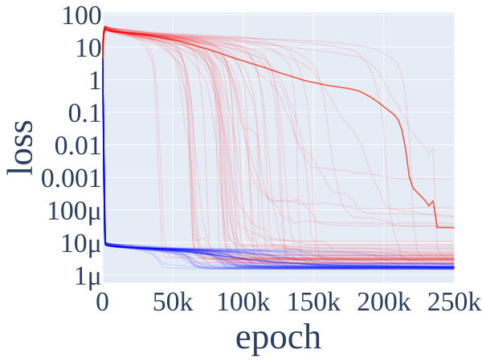

###### fig-2

*Figure 2: Train (blue) and test (red) accuracy (**left**) and train and test loss (**right**) of an MLP trained on group composition on $S_{5}$, the permutation group of order 5, over 50 random seeds. These models consistently exhibit grokking: they quickly overfit early in training, but then suddenly generalize much later. The bolded line denotes average accuracy/loss.* **[p. 2]**

###### p2-7

**Phase Changes and Emergence.** Recent work has observed emergent behavior in neural networks: models often **[p. 3]** quickly develop qualitatively different behavior as they are scaled up (Ganguli et al. 2022; Wei et al. 2022). Brown et al. 2020 find that, while total loss scales predictably with model size, models’ ability to perform specific tasks can change abruptly with scale. McGrath et al. 2022 find that AlphaZero quickly learns many human chess concepts between 10k and 30k training steps and reinvents human opening theory between 25k and 60k training steps.

###### p3-1

**Grokking.** Grokking is a form of emergence, first reported by (Power et al. 2022), who trained small networks on algorithmic tasks, finding that test accuracy often increased sharply, long after maximizing train accuracy. Liu et al. 2022b construct further small examples of grokking, which they use to compute phase diagrams with four separate ‘phases’ of learning. Davies et al. 2022 unify the phenomena of grokking and double descent as instances of phenomena dependent on ‘pattern learning speeds’. Our findings agree with Liu et al. 2022c in that grokking seems intrinsically linked to the relationship between performance and weight norms; and with Barak et al. 2023 and Nanda et al. 2023 in showing that the networks make continuous progress toward a generalizing algorithm, which may be tracked over training using continuous *progress measures*.

###### p3-2

We train models to perform group composition on finite groups $G$ of order $|G|=n$. The input to the model is an ordered pair $(a,b)$ with $a,b\in G$ and we train to predict the group element $c=ab$. In our mainline experiment, we use an architecture consisting of left and right embeddings33 3 We do not tie the left and right embeddings as we study non abelian groups., a one hidden layer MLP, and unembedding $W_{U}$. This architecture is presented in Figure 1 and elaborated upon in Appendix C. We note that the task presented in Nanda et al. 2023 is a special case of our task, as addition mod $113$ is equivalent to composition for $G=C_{113}$, the cyclic group of $113$ elements. We train our models in a similar manner to Nanda et al. 2023, details may be found in Appendix C.

###### p3-7

We now present an algorithm, which we call group composition via representations (GCR), on an arbitrary group $G$ equipped with a representation $\rho$ of dimension $d$. The algorithm and it’s map onto network components are described in Figure 1. We are not aware of this algorithm existing in any prior literature.

1. Map inputs $a$ and $b$ to $d\times d$ matrices $\rho(a)$, $\rho(b)$.
2. Compute the matrix product $\rho(a)\rho(b)=\rho(ab)$.
3. For each output logit $c$, compute the characters $\tr(\rho(ab)\rho(c^{-1}))=\tr(\rho(abc^{-1}))=\chi_{\rho}(abc^{-1})$.

###### p3-9

Crucially, Theorem D.7 implies $ab\in\argmax_{c}\chi_{\rho}(abc^{-1})$, so that logits are maximised on $c^{*}=ab$, where $abc^{-1}=e$. If $\rho$ is *faithful* (see Definition D.5), this argmax is unique.

In our networks, we find the terms $\rho(a)$ and $\rho(b)$ in the embeddings and $\rho(ab)$ in MLP activations. Note, as $\rho(ab)$ is present in the final hidden layer activations and $W_{U}$ learns $\rho(c^{-1})$ in weights, the map to logits is entirely linear:

$$
\rho(ab)\rightarrow\tr\rho(ab)\rho(c^{-1})=\sum_{ij}\left(\rho(ab)\odot\rho(c^{-1})^{T}\right)_{ij} \tag{1}
$$

where $\odot$ denotes the element-wise product of matrices.

###### p3-12

Each finite group $G$ is equipped with a finite set of $k$ *irreducible* representations (Definition D.2) Since any representation may be decomposed into a finite set of irreducible **[p. 4]** representations (Theorems D.3 and D.4) we may restrict our attention to these irreducible representations. It is then useful to think about our algorithm for a fixed group $G$ as a *family* of $k$ independent circuits indexed by choice irreducible representation $\rho$. In general, a single network may choose any subset of these $k$ circuits to implement, so that the observed logits are a linear combination of characters from multiple representations. From now on, each representation may be assumed to be irreducible, and we will drop the word. Since each representation has $\chi_{\rho}(abc^{-1})$ maximized on the correct answers, using multiple representations gives constructive interference at $c^{*}=ab$, giving $c^{*}$ a large logit. Theorem D.9 implies characters are orthogonal over distinct representations, a fact we use in Section 5.1.

###### p4-1

Our GCR algorithm is a generalization of the seemingly ad-hoc algorithm presented in Nanda et al. 2023 for modular addition, which in our framing is composition on the cyclic group of 113 elements, $C_{113}$. Each element of our algorithm maps onto their Fourier multiplication algorithm, with representations $\rho=\mathbf{2_{k}}$ (which we define in Appendix D.1.1) corresponding to frequency $\omega_{k}=\frac{2\pi k}{n}$.

###### p4-2

Nanda et al. 2023 found embeddings learn the terms $\cos\left(\omega_{k}a\right)$, $\sin\left(\omega_{k}a\right)$, $\cos\left(\omega_{k}b\right)$ and $\sin\left(\omega_{k}b\right)$, precisely the matrix elements of $\rho(a)$ and $\rho(b)$. The terms $\cos\left(\omega_{k}(a+b)\right)$ and $\sin\left(\omega_{k}(a+b)\right)$ found in the MLP neurons correspond directly to the matrix elements of $\rho(ab)$. Finally we find by direction calculation, or by using the group homomorphism property of representations, that the characters:

$$
\chi(abc^{-1}) \\
=\tr\left(\rho(abc^{-1})\right) \\
=\tr\begin{pmatrix}\cos\left(\omega_{k}(a+b-c)\right)&-\sin\left(\omega_{k}(a+b-c)\right)\\
\sin\left(\omega_{k}(a+b-c)\right)&\cos\left(\omega_{k}(a+b-c)\right)\end{pmatrix} \\
=2\cos\left(\omega_{k}(a+b-c)\right)
$$

are precisely the form of logits found, which summed over many key frequencies $k$, corresponding to distinct irreducible representations.

###### p4-5

In our mainline experiment, we train the MLP architecture described in Section 3.1 on the permutation (or symmetric) group of 5 elements, $S_{5}$, of order $|G|=n=120$. Note that unlike $C_{113}$ studied by Nanda et al. 2023, $S_{5}$ is not abelian, so the composition is non-commutative. We present a detailed analysis of this case as symmetric groups are in some sense the most fundamental group, as every group is isomorphic to a subgroup of a symmetric group (Cayley’s Theorem D.10). So, understanding composition on the symmetric group implies understanding, in theory, of composition on any group. The (non trivial) irreducible representations of $S_{5}$ are named sign, standard, standard_sign, 5d_a, 5d_b, and 6d, are of dimensions $d=\{1,4,4,5,5,6\}$ and are listed in Appendix D.1.3.

The GCR algorithm predicts that **logits** are sums of characters. This is a strong claim, which we directly verify in a black-box manner – we need not peer directly into network internals to check this. We do so by comparing the model’s logits $l(a,b,c)$ on all input pairs $(a,b)$ and outputs $c$ with the algorithms character predictions $\chi_{\rho}(abc^{-1})$ for each representation $\rho$. We find the logits can be explained well with only a very sparse set of directions in logit space, corresponding to the characters of the ‘standard’ and ‘sign’ representations. From now on we call these two representations the *key representations*.

The remainder of our approaches are white-box and involve direct access to internal model weights and activations. First, we inspect the **mechanisms** implemented in model weights. We find the embeddings and unembeddings to be memorized look up tables, converting inputs and outputs to the relevant representation element in the key representations. As the number of representations learned is low, the embedding and unembedding matrices are low rank.

We then find **MLP activations** calculate $\rho(ab)$, and are able to explicitly extract these representation matrices. Additionally, MLP neurons cluster into distinct representations, and we can read off the linear map from neurons to logits as being precisely the final step of the GCR algorithm.

Finally, we use **ablations** to confirm our interpretation is faithful. We ablate components predicted by our algorithm to verify performance is hampered, and ablate components predicted to be noise, leaving only our algorithm, and show performance is maintained.

###### p4-10

**Logit similarity**. We call the correlation between the logits $l(a,b,c)$ and characters $\chi_{\rho}(abc^{-1})$ the *logit similarity*. We call representations with logit similarity (see Appendix E.5) greater than $0.005$ ‘key’.

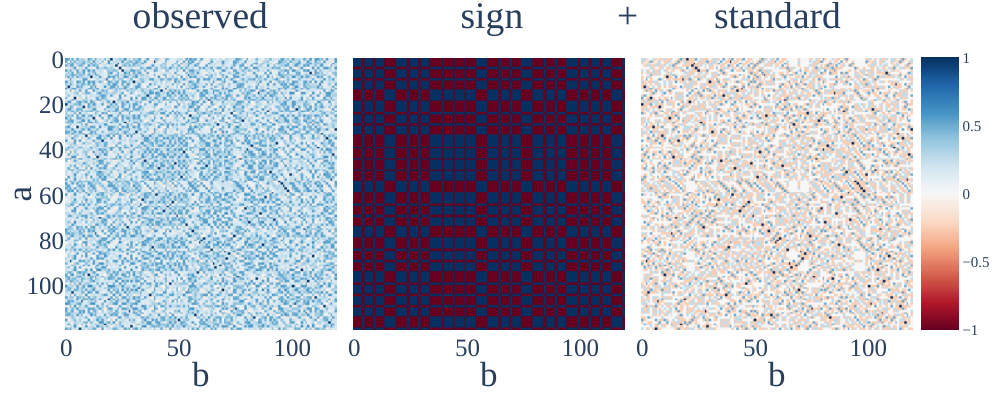

*Figure 3: The observed $0^{\textrm{th}}$ logit (**left**) over all pairs of inputs $a$ (y-axis) and $b$ (x-axis). The GCR algorithm’s logit predictions $\chi_{sign}$ (**middle**) and $\chi_{standard}$ (**right**) in the key representations. The observed logit appears to be a linear combination of the characters in the key representations. Note that all logits here have been normalized to range [-1, 1].* **[p. 5]**

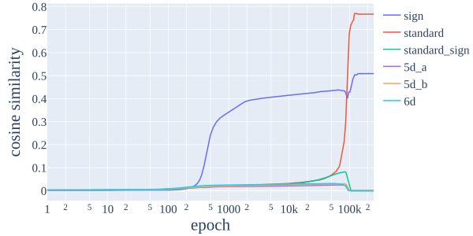

*Figure 4: Evolution of logit similarity over training for each of the six non trivial representations. We see the sign representation is learned around epoch 250, and the standard around epoch 50k. None of the other representations contribute to logits via the GCR algorithm at the end of training. We therefore call the sign and standard representations ‘key’.* **[p. 5]**

###### p4-11

Our model has logit similarity $0.509$ with $\chi_{sign}$ and $0.767$ with $\chi_{standard}$, and zero with all other representation characters. Theorem D.8 implies these character vectors are **[p. 5]** orthogonal, so we may approximate the logits with these two directions. Doing so explains $84.8\%$ of the variance of logits. This is surprising – the $120$ output logits are explained well by only two directions. As confirmation for the correctness of our algorithm, if we evaluate test loss only using this logit approximation, we see a *reduction* in loss by $70\%$ relatively. If we ablate the remaining $15\%$ of logits, loss does not change.

###### p5-2

**We find evidence of representations in embeddings and unembeddings**. We find that the embedding matrices and the unembed matrix are well approximated by a sparse set of representations (Table 1), and that the representations contained in all three are the same. This is surprising: each embedding and unembedding can potentially be of rank $120$, but is only of rank $16+1$, corresponding precisely to the two key representations. Qualitatively, the progress of representation learning is similar across all three embedding and unembedding matrices, with each representation being learned suddenly at roughly the same time, see Figure 9.

*Table 1: Percentage of embedding matrices explained by subspaces corresponding to representations. We see the same two key representations explain almost all of the variance of each embedding matrix, and the non-key representations explain almost none.* **[p. 5]**

|  | $W_{a}$ | $W_{b}$ | $W_{U}$ |
|---|---|---|---|
| Sign | 6.95% | 6.95% | 9.58% |
| Standard | 93.0% | 93.0% | 84.5% |
| Residual | 0.00% | 0.00% | 5.96% |

###### p5-4

**Neurons cluster by representation**. Our neurons cluster into disjoint categories, corresponding to key representations. This clustering is identical on neuron inputs and outputs. $7$ neurons are ‘sign neurons’: these neurons completely represent $\rho_{sign}(a)$ in the left embedding and $\rho_{sign}(b)$ in the right embedding. On post-activation outputs, they represent some linear combination of $\rho_{sign}(a)$, $\rho_{sign}(b)$, and $\rho_{sign}(ab)$, but not any other representation. $119$ neurons are correspondingly ‘standard neurons’. The final $2$ neurons are always off.

In Table 2 we find $88.0\%$ of the variance of standard neurons can be explained by the directions corresponding to $\rho(a),\rho(b)$ and $\rho(ab)$. For sign neurons, this fraction of variance of neurons explained is $99.9\%$. We validate by ablation the residual $12.0\%$ of standard neurons does not affect performance. We hypothesize this term is a side product of the network performing multiplication with a single ReLU, and discuss this multiplication step further in Appendix E.2. Evolution of percentage of MLP activations explained by each representation is presented in Figure 10.

*Table 2: Percentage of the variance of MLP neurons explained by subspaces corresponding to representations of group elements $a$, $b$ and $ab$. Almost all of the variance of neurons within each key representation cluster is explained by subspaces corresponding to the representation, and all neurons are in a single cluster.* **[p. 6]**

**[p. 6]**

| Cluster | $\rho(a)$ | $\rho(b)$ | $\rho(ab)$ | Residual |
|---|---|---|---|---|
| sign | 33.3% | 33.3% | 33.3% | 0.00% |
| standard | 39.6% | 37.1% | 11.3% | 12.1% |

**Only the $\rho(ab)$ component of MLP neurons is important**. The GCR algorithm doesn’t make use of $\rho(a)$ or $\rho(b)$ directly to compute $\chi_{\rho}(abc^{-1})$. We confirm the model too only makes use of $\rho(ab)$ type terms by ablating directions corresponding to $\rho(a)$ and $\rho(b)$ or otherwise in MLP activations and verifying loss doesn’t change.

###### p6-2

On the other hand, ablating directions corresponding to $\rho(ab)$ in the key representations severely damages loss. Baseline loss is $2.38\times 10^{-6}$. Ablating $\rho_{standard}(ab)$ increases loss to $7.55$, while ablating $\rho_{sign}(ab)$ increases loss to $0.0009$.

###### p6-3

**We may explicitly recover representation matrices from hidden activations**. By changing basis (via Figure 11) on the hidden representation subspace corresponding to $\rho(ab)$, we may recover the matrices $\rho(ab)$. The learned sign representation matrices agree with $\rho_{sign}(ab)$ completely, and the learned standard representation matrices agree with $\rho_{standard}(ab)$ with MSE loss $<10^{-8}$. We cannot recover representation matrices for representations not learned.

###### p6-8

**Unembeddings.** In Section 5.4, we found $W_{U}$ is well approximated by $16+1$ directions, corresponding to representation space on the two key representations. If we project MLP neurons to only these directions, ablating the $5.96\%$ residual in $W_{U}$, we find loss decreases by $12\%$, while if we project to only this residual, loss increases to $4.80$, random.

###### p6-9

**Logits.** In Section 5.1 we found observed logits were well approximated by the GCR algorithm in the key representations. We find ablating our algorithm’s predictions in the key representations damages loss, to 0.0006 by excluding the sign representation, to 7.23 excluding the standard representation, and to 7.60 excluding both, significantly worse than random. Ablating other directions improves performance.

###### fig-6

*Figure 6: Evolution of the two progress measures over training. The vertical lines delineate 3 phases of training: memorization, circuit formation, and cleanup (and a final stable phase). Excluded loss tracks the progress of the memorization circuit, and accordingly falls during the first phase, rising after during circuit formation and cleanup. Restricted loss tracks the progress of the generalized algorithm, and has started falling by the end of circuit formation. Note that grokking occurs during cleanup, only after restricted loss has started to fall.* **[p. 7]**

###### p6-10

A limitation of prior work on using *hidden progress measures* from mechanistic explanations as a methodology for understanding emergence (Nanda et al. 2023) is that the technique developed may not generalize beyond one specific task. We demonstrate their results are robust by replicating them in our network trained on $S_{5}$.

###### p6-11

We argue that the network implements two classes of cir**[p. 7]** cuit – first, ‘memorizing’ circuits, and later, ‘generalizing’ circuits. Both are valid solutions on the training distribution. To disentangle these, we define two progress measures. **Restricted loss** tracks only the performance of the generalizing circuit via our algorithm. **Excluded loss** is the opposite, tracking the performance of only the memorizing circuit, and so is only evaluated on the training data. We find that on our mainline model, training splits into three partially overlapping phases – memorization, circuit formation, and cleanup. During circuit formation, the network smoothly transitions from memorizing to generalizing. Since test performance requires a general solution and no memorization, grokking occurs during cleanup. Further discussion may be found in Appendix E.1.

###### p7-1

In our mainline experiments, we use weight decay as the primary regularization scheme. Other regularizers are also capable of exhibiting grokking. Our results mirror (Nanda et al. 2023): we find models grok generic group composition under dropout, and the methodology of progress measures can too be used to understand grokking in this case.

###### p7-2

We sometimes find further phase changes. Figure 14 demonstrates two *phases of grokking* in a seperate run, caused by learning of different representations at distinct times.

###### sec-6

*Table 3: Results from all groups on both MLP and Transformer architectures, averaged over 4 seeds. We find that that features for matrices in the key representations are learned consistently, and explain almost all of the variance of embeddings and unembeddings. We find that terms corresponding to $\rho(ab)$ are consistently present in the MLP neurons, as expected by our algorithm. Excluding and restricting to these terms in the key representations damages performance/does not affect performance respectively.* **[p. 8]**

|  | **MLP** | **Transformer** |  |  |  |  |  |  |  |  |  |  |  |  |  |
|---|---|---|---|---|---|---|---|---|---|---|---|---|---|---|---|
|  | FVE | Loss | FVE | Loss |  |  |  |  |  |  |  |  |  |  |  |
| *Group* | $W_{a}$ | $W_{b}$ | $W_{U}$ | *MLP* | $\rho(ab)$ | *Test* | *Exc.* | *Res.* | $W_{E}$ | $W_{L}$ | *MLP* | $\rho(ab)$ | *Test* | *Exc.* | *Res.* |
| $C_{113}$ | 99.53% | 99.39% | 98.05% | 90.25% | 12.03% | 1.63e-05 | 5.95 | 6.88e-03 | 95.18% | 99.52% | 92.12% | 16.77% | 2.67e-07 | 9.42 | 2.12e-02 |
| $C_{118}$ | 99.75% | 99.74% | 98.43% | 95.84% | 13.26% | 5.39e-06 | 8.72 | 3.60e-03 | 94.05% | 99.64% | 94.63% | 17.11% | 1.73e-07 | 15.93 | 2.55e-01 |
| $D_{59}$ | 99.71% | 99.73% | 98.52% | 87.68% | 12.44% | 6.34e-06 | 12.37 | 1.60e-06 | 98.58% | 98.53% | 85.01% | 10.85% | 3.20e-06 | 46.42 | 2.82e-05 |
| $D_{61}$ | 99.26% | 99.45% | 98.26% | 87.61% | 12.48% | 1.79e-05 | 12.00 | 1.69e-06 | 98.33% | 97.40% | 85.59% | 11.11% | 1.63e-02 | 41.64 | 9.60e-02 |
| $S_{5}$ | 100.00% | 99.99% | 94.14% | 88.91% | 12.13% | 1.02e-05 | 11.72 | 2.21e-07 | 99.84% | 99.97% | 85.28% | 10.23% | 1.43e-07 | 17.77 | 4.44e-09 |
| $S_{6}$ | 99.65% | 99.78% | 93.67% | 86.38% | 8.98% | 4.95e-05 | 12.17 | 2.66e-06 | 99.94% | 99.93% | 86.32% | 9.35% | 2.21e-06 | 291.67 | 1.05e-06 |
| $A_{5}$ | 99.04% | 99.31% | 93.27% | 86.69% | 10.26% | 1.94e-05 | 9.82 | 5.28e-07 | 97.53% | 97.40% | 83.56% | 8.22% | 4.88e-02 | 19.76 | 7.70e-04 |

###### p7-3

In this section, we investigate to what extent the universality hypothesis (Olah et al. 2020; Li et al. 2016) holds on our collection of group composition tasks. Here, ‘features’ correspond to irreducible representations of group elements44 4 Defining a ‘feature’ in a satisfying way is surprisingly hard. Nanda 2022 discusses some of the commonly used definitions. and ‘circuits’ correspond to precisely how networks manipulate these with their weights.

###### p7-4

We interpret models of MLP and Transformer architectures (Appendix C) trained on group composition for seven groups: $C_{113}$, $C_{118}$, $D_{59}$, $D_{61}$, $S_{5}$, $S_{6}$ and $A_{5}$, each on four seeds. We find evidence for *weak universality*: our models are all characterized by a family of circuits corresponding to our GCR algorithm across all group representations. We however find evidence against *strong universality*: our models learn different representations, implying that specific features and circuits will differ across models.

**All our networks implement the GCR algorithm**. We first argue for weak universality via universality of our algorithm and universality of a *family* of features and circuits involving them. Following the approach of Section 5, we understand each layer of our network as steps in the algorithm as presented in Section 4. (Table 3). Steps 1 and 3 – we analyze embedding and unembedding matrices, showing that their fraction of variance explained (FVE) by subspaces corresponding to the key representations is high. Each group has its own family of representations, and each model learns its own set of key representations (i.e. representations with non-zero logit similarity). Where applicable, our metrics track only these key representations of any given model. For Step 2, we show the MLP activations are well explained by the terms $\rho(a)$, $\rho(b)$, and importantly $\rho(ab)$ in the key representations. Finally, as evidence our algorithm is entirely responsible for performance, we show the final values of the progress measures of restricted and excluded loss.

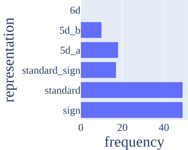

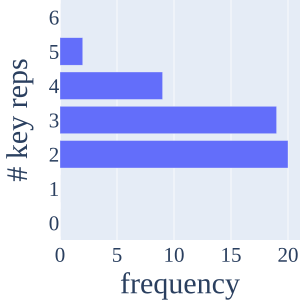

###### fig-7

*Figure 7: (**Left**) The number of times each representation is learned over 50 seeds, for $S_{5}$ trained on the MLP architecture. We see the 1d sign and 4d standard representations are most commonly learned, standard_sign (4d), 5d_a and 5d_b are learned approximately equally and less often, and 6d is never learned. (**Right**) The number of key representations of these 50 runs. Most commonly we have two key representations (typically sign and standard), but sometimes we learn more.* **[p. 7]**

###### p7-6

**Specific representations learned vary between random seeds.** Each group has several representations that can be learned. Under strong universality, we would expect the representations learned to be consistent across random seeds when trained on the same group. In general, we do not find this to be true (Figure 7). When there are multiple valid solutions to a problem, the model somewhat arbitrarily chooses between them – even when the training data and architecture are identical.

**[p. 8]**

**It is not the case that networks learn simple representations over complex representations.** If strong universality is true, we hypothesized networks would learn ‘simple’ representations over more complex ones, according to some sensible measure of complexity.

###### p8-2

We naively thought that the complexity of a general representation would correlate with it’s dimension55 5 In particular, we thought a reasonable definition would be the number of linear degrees of freedom in the $n\times d^{2}$ tensor of flattened representation matrices – i.e. the rank of the representation subspace of $\mathbb{R}^{n}$ (from Section 5.2).. For $S_{5}$, since the 4 dimensional representations are the lowest faithful representations, we expected representations of at most this dimension to be learned, and the model to choose arbitrarily between learning either of the two of them, or both. Empirically, we found this claim to be false. In particular, networks commonly learned higher dimensional representations, as can be seen in Figure 7. We also see in Figures 7 and 8 that the network preferred the standard representation over the standard_sign representation, when in fact standard_sign offers *better* performance for fixed weight norm.

###### p8-3

While not deterministic, Figure 7 shows at least a probabilistic trend between our naive feature complexity and learning frequency, suggesting meaningful measures of feature complexity may exist. One complication here is that, as discussed in Section 5.6, models are trading off weight against performance. Representations with more degrees of freedom may also offer better performance for fixed total weight norm, so which the model may prefer, and thus which is least complex, is unclear.

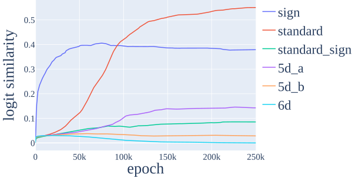

###### p8-4

**Number of representations learned varies.** Across seeds, in addition to different representations being learned, we too find different *numbers* of representations are learned, also shown in Figure 7. This is surprising to us. We additionally find that Transformers consistently learn fewer representations than MLPs, despite having *more* parameters. We view this as further evidence against the strongest forms of circuit and feature universality, and suggests there is a degree of randomness in what solutions models learn.

###### p8-5

**Lower dimensional representations are generally (but not always) learned first.** Under any reasonable definition of complexity, the 1d sign representation is simpler than other $S_{5}$ representations. Figure 8 shows that the sign representation is consistently learned first. While it is very easily learned, it also generalizes poorly. In contrast, higher dimensional faithful features are harder to learn but generalize better. These correspond to type 1 and type 3 patterns according to the taxonomy presented in Davies et al. 2022. We however *do not find evidence that all representations are learned in strict order of dimension*, against our naive hypothesis’s predictions, further evidence against strong universality.

###### p8-6

In this work, we use mechanistic interpretability to show that small neural networks perform group composition via an interpretable, representation theory–based algorithm, across several groups and architectures. We then define progress measures (Barak et al. 2023; Nanda et al. 2023) to study how the internals of networks develop over the course of **[p. 9]** training. We use this understanding to study the universality hypothesis – that networks trained on similar tasks learn analogous features and algorithms. We find evidence for weak but not strong forms of universality: while all the networks studied use a variant of the GCR algorithm, different networks (with the same architecture) may learn different sets of representations, and even networks that use the same representations may learn them in different orders. This suggests that reverse engineering particular behaviors in single networks is insufficient for fully understanding that network behavior in general. That being said, even if strong universality fails in general, there is still promise that a ‘periodic table’ of universal features, akin to the representations in our group theoretic task, may exist in general for real tasks. We include further discussion on how this work fits into the wider field of mechanistic interpretability in Appendix A. Below, we discuss some areas of future work, with further discussion in Appendix F.

###### p9-1

**Further investigation of universality in algorithmic tasks.** We raise many questions in Section 6 regarding which representations networks learn. Better understanding the learning rates and generalization properties of features offers a promising direction for future work in understanding network universality. Further understanding the probabilistic nature of which features are learned and at what time may too have future relevance. In particular, lottery tickets (Frankle & Carbin 2019) may be present in initialized weights that could allow the learned features of a trained network to be anticipated *before training*.

**More realistic tasks and models.** In this work, we studied the behaviour of small models on group composition tasks. However, we did not explore whether our results apply to larger models that perform practical tasks. Future work could, for example, study universality in language models in the style of induction heads in Olsson et al. 2022.

**Understanding inductive biases of neural networks.** A key question in the science of deep learning is understanding which classes of algorithms are natural for neural networks to express. Our work suggests that the GCR algorithm is in some sense a ‘natural’ way for networks to perform group composition (Appendix G). A more comprehensive understanding of the building blocks of neural networks could speed up interpretability work while helping us better understand larger models.

###### p12-5

In our work, we sought to answer this question. We chose a toy task, where we were (to our surprise) able to fully enumerate all possible solutions through the different representations which were of varying complexity. Our methods allowed us to inspect which of these ground truth features networks had learned. Through doing so, we found that reverse engineering one model was insufficient to understand behavior in general. Our mainline S5 model only gave us insights into two of the possible circuits used to solve the task (corresponding to the sign and standard representations), out of a possible six. Only after studying many more models were we able to observe all the different mechanisms used to implement the single behavior.

We view our work as a proof of concept that by reverse-engineering circuits in many models, one can build a comprehensive periodic table of features that permits understanding of how networks implement behavior in general. Practically speaking, we then suggest that those studying model behaviors should perform “robustness checks” in many models to truly understand all possible mechanisms behind behavior. This may have future relevance to auditing models via mechanistic interpretability. There exist resources that permit the study of universality in language models already, such as MultiBert (Sellam et al. 2022), which offers a set of similar models trained on different random seeds, much like our models. One could begin by studying the IOI circuit (Wang et al. 2022) in these models, and examining whether the same mechanism is universally learned, and if not, how large the family of possible mechanisms truly are.

###### p13-2

We follow this approach closely. Our techniques in Section 5 are heavily inspired by Nanda et al.’s approach. Our precise analysis though differs substantially. Fourier transforms are elegant, but specific to the modular addition task. We instead work with representation matrices, and subspaces.

###### p13-3

On modular addition of 113 elements, i.e. group composition on $C_{113}$, we are able to replicate their results in our framing. As discussed in Section 4, their algorithm maps precisely onto our GCR algorithm, and both approaches may be used to understand the cyclic group task. The mapping of their findings onto ours is fairly clear for embeddings, unembeddings and logits. For MLP neurons, they found that most neurons were well explained by a quadratic form of sinusoidal functions of the 9 terms within a single frequency. This quadratic form shared coefficients in such a way such that this had 2 redundant degrees of freedom, giving 7 terms. In our case, MLP neurons contain information pertaining to $\rho(a)$, $\rho(b)$ and $\rho(ab)$. In the special case of cyclic representations (see Appendix D.1.1), each of these terms has 2 degrees of freedom by antisymmetry. Adding a constant gives precisely the same seven terms.

###### p13-4

Our mainline model is trained on $40\%$ of all $n^{2}$ entries in the multiplication table of the group. We use full batch gradient descent. We use weight decay with $\lambda=1$, and the AdamW optimizer, with learning rate $\gamma=0.001,\beta_{1}=0.9$ and $\beta_{2}=0.98$. We perform $250,000$ epochs of training. As there are only $n^{2}$ possible input pairs, we evaluate test loss and accuracy on all pairs of inputs not used for training.

###### p13-5

Our MLP architecture is summarized in Figure 1. Inputs $a$ and $b$ are encoded as $n$ dimensional one-hot vectors. Each one-hot vector is embedded with $d=256$. These are concatenated to form a $512$ dimensional vector, which is fed into a $h=128$ linear layer, with no bias term. 66 6 Emperically, we found adding a bias made little difference to our results, though we hypothesize that training models with a bias may improve the model’s ability to perform matrix multiplication of activations, and hence interpretability. The output is mapped via an unembedding linear map, $W_{U}$, to $n$ logits, corresponding to each of the $n$ group elements. We did not tie the left embedding, right embedding or unembedding matrices. This is a simplified version of the Transformer architecture used by Nanda et al. 2023 (described below) which removes attention. Attention is both empirically irrelevant in this prior work, and not predicted to be necessary by our algorithm. The form of logits is therefore

Logits = W_U @ ReLU(W_MLP @ [W_left @ a, W_right @ b])

Note that the embedding matrices and linear layer have no non-linearity between them. When interpreting model calculations we will tie these matrices, and think of the $a$ and $b$ embeddings as the result of passing inputs through both layers. This methodology is inspired by (Elhage et al. 2021), 77 7 Here, the authors tie Transformer’s Q and K matrices, and O and V matrices for the same reason.. The remainder of the operation of the linear layer is then to add these two ‘total’ embeddings and pass them through a ReLU. That is,

Logits = W_U @ ReLU(W_a @ a + W_b @ b)

where

W_a = W_MLP[:d,:] @ W_left W_b = W_MLP[d:,:] @ W_right

**[p. 14]**

###### p16-11

The sign representation are a set of $1\times 1$ matrices representing a kind of parity. Permutations may be decomposed as a (non unique) sequence of swaps. The parity of this number of swaps is in fact well defined, and defines a subgroup of the symmetric group named the alternating group. Mapping this alternating group to $+1$, and the coset to $-1$ gives the sign **[p. 17]** representation. In general, any group containing a subgroup of index 2 is naturally endowed with a sign representation in a similar manner.

Next is the standard representation. This is essentially the set of permutation matrices – $n\times n$ square binary matrices, with only one 1 in each row and column, and 0s elsewhere. This representation has dimension $n$, though, not $n-1$. This is because it turns out to be reducible. Recalling Definition D.2, this has an invariant subspace under the action of $G$, spanned by the vector sum of all basis elements. The irreducible representations recovered are the standard and trivial representations.

Standard $\otimes$ Sign denotes the tensor product of the standard and sign representations, which is just their matrix product as the sign representation is 1 dimensional.

$S_{5}$ has three higher degree representations, which I denote 5d_a, 5d_b, 6d. We omit their construction here.

###### fig-12

*Figure 12: The sum of squared weights (**left**), and ratio of test loss and restricted loss (**right**). The sum of squared weights decreases smoothly during circuit formation and more sharply during cleanup, indicating both phases are linked to weight decay. Intuitively, restricted loss is us artificially cleaning up some the model (besides $W_{U}$), while test loss requires both circuit formation and cleanup. So a large discrepancy shows the rate of circuit formation outstrips the rate of cleanup during grokking.* **[p. 20]**

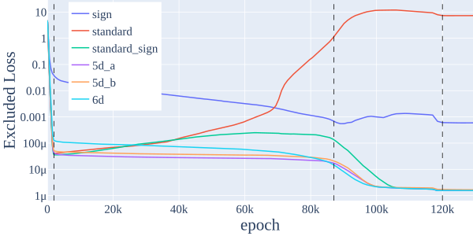

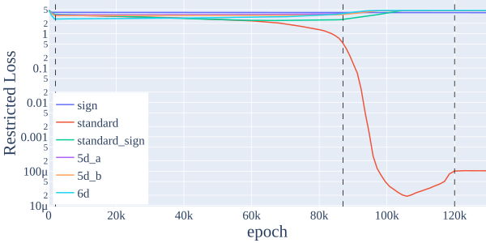

*Figure 13: Excluded (**left**) and restricted loss (**right**), separated out by representation. As with the results of Section 5.6, this shows the model interpolates between memorizing and generalizing. In the restricted loss plot, we see the sign representation is incapable of solving the task alone, but contributes several orders of loss improvement when coupled with the standard representation, as can be seen in excluded loss.* **[p. 20]**

Here, we provide further discussion on how we use progress measures to understand grokking generalization in our models. We first give more full definitions of our progress measures below.

###### p18-2

**Restricted Loss.** We restrict the MLP activations to the terms corresponding to $\rho(ab)$ in the key representations, a $16+1$ dimensional subspace of $\mathbb{R}^{128}$, and then map this restricted MLP layer to logits. By doing so, we isolate the performance of the generalising algorithm. This assumes that the memorising algorithm has no privileged subspace in the MLP layer.

**Excluded Loss.** The opposite of restricted loss. Instead of keeping the key representations, we remove only those representations from the MLP neurons, and see how this affects loss. Having removed the generalising solution, this isolates the performance of the memorising solution. This therefore makes sense to measure only on the *training* data, which we do.

The three phases of training we define are as follows, and can be seen in Figures 6 and 12.

###### p18-5

**Memorization.** (Epochs 0-2k) We first observe a decline of both excluded and train loss, with test and restricted loss both remaining high. In other words, the model memorizes the training data. The sum of squared weights peaks at the end of memorization, so weight decay does not prefer these memorized circuits. As test loss increases but restricted loss stays constant as no progress towards generalization is made, the ratio of test loss to restricted loss rises.

###### p18-6

**Circuit Formation.** (Epochs 2.2k-87k) In this phase, excluded loss rises, sum of squared weights falls (Figure 12), restricted loss starts to fall, and train and test loss stay flat. This suggests that the models behavior on the train set transitions smoothly from the memorising solution to the generalizing solution. The fall in the sum of squared weights suggests that circuit formation likely happens due to weight decay. Notably, the circuit is formed well before grokking.

###### p18-7

**Cleanup.** (Epochs 87k-120k) In this phase, restricted loss continues to drop, test loss suddenly drops, sum of squared weights sharply drops, and the ratio of test to restricted loss is variable and then sharply decreases (Figure 12). As the generalising circuit both solves the task well and has lower weight at comparable performance as compared with memorisation circuits on the training set, weight decay encourages the network to shed the memorised solution. Weight decay contributes an important inductive bias of our networks (Neyshabur et al. 2015). The slight rise in restricted loss at the very end of training **[p. 19]** is too a result of weight being traded off against performance – multiplying the entire circuit by a fixed constant $r>1$ will reduce loss, though also requires more weight.

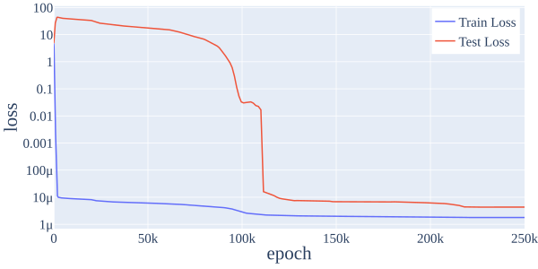

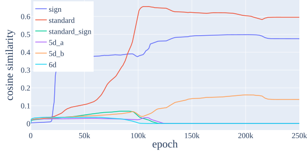

###### fig-14

*Figure 14: (**Left**) Train and test loss of the mainline model, only on a different random seed. (**Right**) Logit similarity of this run over training. We see two phases of grokking. The model initially groks as the memorizing circuit is cleaned up in presence of the valid general standard circuit. Loss then plateaus as the 5d_b circuit is learned around epoch 100k, before the model groks again as cleanup continues.* **[p. 21]**

###### p20-2

We then can write out, for $x,y$ some positive constants and $n_{i}$ neuron $i$:

$$
n_{2} =xReLU\left(+sign(a)+sign(b)\right) \\
n_{8} =xReLU\left(-sign(a)-sign(b)\right) \\
n_{17} =xReLU\left(+sign(a)+sign(b)\right) \\
n_{65} =xReLU\left(-sign(a)-sign(b)\right) \\
n_{111} =xReLU\left(+sign(a)-sign(b)\right) \\
n_{113} =yReLU\left(-sign(a)+sign(b)\right) \\
n_{120} =xReLU\left(+sign(a)-sign(b)\right)
$$

###### p21-1

This is essentially computing an XOR gate on the inputs, and in particular not multiplication of arbitrary inputs, which is why the network can implement this operation perfectly. Note that we need a minimum of four neurons to implement this operation in this manner 88 8 If $x,y\in\{0,1\}$ then $x$ XOR $y=ReLU(x-y)+ReLU(y-x)$ is a solution in two neurons.. Empirically, we found that the number of sign neurons was often four exactly. In this case, neuron 113 appears to be used in two such multiplication calculations.

We expect that higher dimensional matrix multiplication is implemented similarly – see further discussion in Appendix E.3.

**Map to logits**. Calling neurons 2, 8, 17 and 65 positive, and neurons 111, 113, and 120 negative, we find that $W_{U}|_{+}\sim+sign(c^{-1})$ and $W_{U}|_{-}\sim-sign(c^{-1})$, thus this circuit contributes positively to logits on correct signs and negatively to wrong signs, giving a contribution $\chi_{sign}(abc^{-1})$ to logits.

###### p22-1

We hypothesize that the number of neurons in each representation cluster learned is linked to the number of such ReLU activations required to compute the matrix multiply, explaining why we have many more standard neurons than sign even after accounting for higher dimensionality of representation. Of course networks won’t implement elementwise multiplication but rather some efficient matrix algorithm, such as Strassens.

###### p22-2

Power et al. 2022 found it useful to use t-SNE to vizualize the unembedding in their networks trained on $S_{5}$. Here, we replicate their results, and show an additional meaningful visualization in Figure 16. We did not find the unembedding $W_{U}$ to cluster into subgroups as they did via t-SNE, but did via PCA. We did find clustering in embeddings into cosets of a subgroup of $S_{5}$, though found the cosets to be of a different subgroup. Over different runs, these subgroups were arbitrary, though given the stochastic nature of t-SNE it is hard to say whether this observation is meaningful.

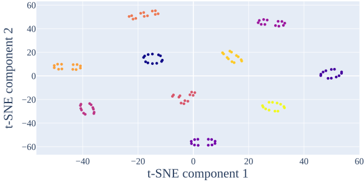

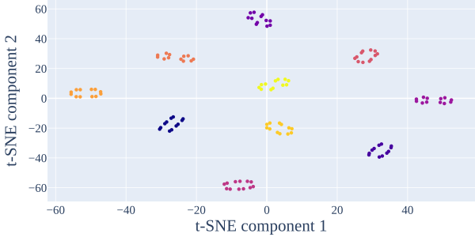

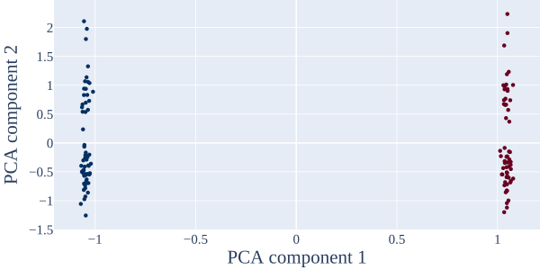

*Figure 16: Left embedding (left) and right embedding (right) visualized in two dimensions via t-SNE. We see a large amount of structure. Clusters correspond to cosets of an order 12 subgroup of $S_{5}$. (Bottom) Visualization of the unembedding via PCA. The two clusters correspond to cosets of $A_{5}$, the alternating group i.e. the sign of group elements.* **[p. 22]**

###### p22-4

**Representation Space and Projection.** We perform an operation analogous to extracting the Fourier modes of a periodic function at each frequency. 99 9 The Fourier transform of a $\mathbb{C}$ valued function over $G$ can in fact be defined rigorously via representation theory. We omit details here. Each representation gives a set of $n$ $d\times d$ matrices, one for each group element. We wish to investigate to what degree these are present in various model weights or activations. We can think of each representation as an $n\times d^{2}$ tensor of flattened matrices $R$. We call the $n$-dimensional space spanned by these $d^{2}$ columns *representation space*. In order to project onto this space, we apply QR decomposition to $R$, obtaining $\tilde{R}$.

Any embedding or unembedding can be thought of an an $n\times h$ tensor $W$. Then $\tilde{R}^{T}W$ is a $d^{2}\times h$ matrix. **[p. 23]** By inspecting the $h$ dimension of this matrix, we may understand neuron clustering, and by comparing the norm of it relative to the norm of the embedding or unembedding, we understand the percentage contribution of the subspace. An entirely analogous methodology is applied to understanding the MLP neurons via hidden representation spaces.

###### p23-1

**Centering.** Neural network activations often contain large biases, even without the presence of explicit bias terms in the architecture. MLP neurons follow a ReLU activation, so necessarily have a mean positive activation. Accounting for this would artificially increase all ‘fraction of variance explained’ metrics. To avoid this, we remove this bias by subtracting the mean over the batch dimension before interpreting the MLP activations.

Similarly, since softmax is a function of relative logit difference, on each fixed input logits have some learned and unimportant bias. Accounting for this would artificially contribute to ‘logit similarity’ under the trivial representation, and artificially increase the fraction of logits explained metric. To avoid this, we remove this by subtracting the mean over output dimension.

###### p23-4

**Further group theoretic tasks.** In this work we focus on the task of group composition. Power et al. 2022 find that several other binary operations on pairs of input elements also grok, some of which are valid on any group. A trivial extension would be to the task $(a,b)\to ab^{-1}$, which may be solved simply by learning a permutation of the right embedding. A non trivial extension would be to conjugacy $(a,b)\to aba^{-1}$, which is of mathematical significance. Or to $(a,b,c)\to abc$. Each of these may be solved via similar representation theoretic algorithms, though we hypothesize would require two ReLU layers to implement two matrix multiplies. Other classes of group theoretic tasks include those of group actions (a superset of group composition type tasks) or to group theoretic automata, where we expect representation theoretic algorithms to apply too. Extending to semigroups (arbitrary associative multiplication tables) expands the set of tasks one could model, though there is no equivalent of representation theory for semigroups.

###### p23-6

Our work is useful in demonstrating the importance of *linearity* in networks. At a first glance, our algorithm seems an overly complex solution to the problem to us, requiring some advanced mathematics to understand. Yet, networks are extremely good at multiplying vectors of activations by matrices of parameters. Our algorithm consists mostly of these operations, with a single step of activation-activation multiplication in the middle to implement the matrix multiply $\rho(a),\rho(b)\to\rho(a)\rho(b)$. We discuss how networks may implement this operation in Appendix E.3. Note that the distinction between parameter-activation multiplication and activation-activation is important, with the former substantially easier for networks to implement. We also use a factored architecture (Appendix C), which results in a low-rank implicit bias, which may encourage a sparse number of representations to be learned. More subjectively, we found the process of reasoning through the algorithm and its implementation in the model to be insightful for better understanding networks ourselves.

We view this as evidence that the class of functions natural to humans and natural to networks are fundamentally different. Gaining examples like these is a step forward, but much more future work remains to be done in gaining a better understanding on these topics. Findings like these have in the past been beneficial in understanding real behaviour in networks, for instance the induction heads found by Olsson et al. 2022 are an important part of the circuit for indirect object identification found by Wang et al. 2022.

###### p23-9

**Why are logit FVE scores relatively low?** We note that our algorithm’s prediction does not explain all of the logits, as can be seen from FVE being less than 100%. Here, we provide some discussion on this. We do not believe this is evidence against our claim that we completely understand the important algorithms our network is implementing. **[p. 24]** Rather, we believe this is a side product of limitations of our architecture. In particular, as we discuss in Section 5.3 and Appendix E.3, the model uses the ReLU activations to implement matrix multiplication of $\rho(a)$ and $\rho(b)$ to $\rho(ab)$. This can only be approximated by ReLUs, and produces other terms, notably significant components of $\rho(a)$ and $\rho(b)$. This means that the network cannot perfectly extract the components of $\rho(ab)$ because they do not correspond to directions orthogonal to all other terms, resulting in the map to logits $W_{U}$ extracting other terms and non-character terms being present in the logits. We suspect the high FVE of models trained on composition in the cyclic group is related to orthogonality properties of the discrete Fourier transform not shared by general irreducible representations.

*Table 5: Results from MLP runs on various groups and seeds. Our algorithm is universally learned. Key representations are listed in order learned.* **[p. 25]**

|  |  |  | Loss | FVE |  |  |  |  |  |  |  |
|---|---|---|---|---|---|---|---|---|---|---|---|
| Group | Seed | Key Representations | Test | Exc. | Res. | Logit | $W_{a}$ | $W_{b}$ | $W_{U}$ | MLP | $\rho(ab)$ |
| $C_{113}$ | 1 | 32, 50, 44, 16, 17, 34, 4, 11, 22, 1, 8, 13, 25 | 2.86e-05 | 6.22 | 9.84e-03 | 93.68% | 99.23% | 99.07% | 97.95% | 91.08% | 11.80% |
| $C_{113}$ | 2 | 7, 22, 25, 24, 36, 30, 14, 41, 44, 48, 50 | 5.89e-06 | 5.15 | 1.96e-06 | 98.08% | 99.65% | 99.81% | 98.35% | 89.95% | 11.71% |
| $C_{113}$ | 3 | 37, 14, 55, 47, 52, 34, 9, 5, 54, 45, 2, 3, 18, 28, 39 | 2.46e-05 | 5.69 | 8.29e-03 | 92.69% | 99.57% | 98.96% | 97.85% | 90.01% | 12.14% |
| $C_{113}$ | 4 | 55, 11, 30, 27, 43, 34, 29, 22, 3, 53 | 6.15e-06 | 6.74 | 9.38e-03 | 97.89% | 99.65% | 99.72% | 98.06% | 89.98% | 12.46% |
| $C_{118}$ | 1 | 31, 49, 1, 12, 22, 45, 2, 20, 24, 28, 44, 56 | 5.75e-06 | 8.53 | 3.90e-06 | 97.22% | 99.55% | 99.55% | 98.46% | 94.61% | 12.66% |
| $C_{118}$ | 2 | 47, 23, 19, 29, 16, 44, sign, 30, 32, 38, 46, 58 | 5.19e-06 | 7.52 | 2.90e-03 | 98.25% | 99.88% | 99.81% | 98.36% | 94.67% | 13.59% |
| $C_{118}$ | 3 | 16, 30, 39, 8, 43, 48, sign, 11, 32, 40, 58 | 5.51e-06 | 10.92 | 7.93e-03 | 96.84% | 99.84% | 99.77% | 98.40% | 99.00% | 13.63% |
| $C_{118}$ | 4 | sign, 14, 5, 25, 57, 1, 22, 2, 4, 10, 28, 50 | 5.11e-06 | 7.90 | 3.56e-03 | 98.19% | 99.73% | 99.82% | 98.49% | 95.09% | 13.17% |
| $D_{59}$ | 1 | 19, 20, 15, 6, 14, 8, 3, 7, 12, 16, 21, 29 | 9.50e-06 | 9.17 | 7.41e-07 | 48.65% | 99.46% | 99.40% | 98.58% | 86.81% | 11.65% |
| $D_{59}$ | 2 | 18, 10, sign, 19, 6, 26, 7, 20, 21, 23 | 4.30e-06 | 12.74 | 1.77e-06 | 54.92% | 99.90% | 99.93% | 98.57% | 88.05% | 12.66% |
| $D_{59}$ | 3 | sign, 20, 22, 16, 9, 12, 11, 15, 18, 19, 24 | 6.88e-06 | 11.06 | 1.91e-06 | 56.79% | 99.57% | 99.71% | 98.50% | 87.82% | 13.05% |
| $D_{59}$ | 4 | sign, 7, 10, 15, 21, 17, 19, 20, 29 | 4.68e-06 | 16.52 | 1.98e-06 | 53.05% | 99.90% | 99.89% | 98.42% | 88.03% | 12.41% |
| $D_{61}$ | 1 | sign, 19, 23, 6, 7, 3, 24, 5, 12, 13, 14, 15 | 2.33e-05 | 11.21 | 1.76e-06 | 51.46% | 99.17% | 99.63% | 98.05% | 87.71% | 12.05% |
| $D_{61}$ | 2 | sign, 4, 29, 8, 27, 26, 19, 28, 14, 9, 2, 7, 3, 16, 18 | 2.87e-05 | 10.20 | 1.48e-06 | 53.04% | 99.30% | 99.05% | 98.44% | 87.15% | 13.00% |
| $D_{61}$ | 3 | 15, 14, 9, 26, 2, 25, sign, 28, 4, 18, 30 | 5.58e-06 | 14.86 | 1.74e-06 | 54.99% | 99.68% | 99.89% | 98.28% | 88.44% | 12.60% |
| $D_{61}$ | 4 | 20, 21, 19, 7, 17, 15, 23, sign, 14, 27, 30 | 1.39e-05 | 11.75 | 1.77e-06 | 50.33% | 98.90% | 99.24% | 98.28% | 87.15% | 12.26% |
| $S_{5}$ | 1 | sign, standard-sign, standard, 5d-a | 3.14e-05 | 10.09 | 1.52e-07 | 39.05% | 100.00% | 99.96% | 94.38% | 87.95% | 10.53% |
| $S_{5}$ | 2 | sign, standard | 2.94e-06 | 7.59 | 7.08e-07 | 84.81% | 100.00% | 100.00% | 94.05% | 88.88% | 12.97% |
| $S_{5}$ | 3 | sign, standard, 5d-b | 4.32e-06 | 11.97 | 2.17e-08 | 59.89% | 100.00% | 99.99% | 94.97% | 88.85% | 12.38% |
| $S_{5}$ | 4 | sign, standard | 2.25e-06 | 17.21 | 1.96e-09 | 59.25% | 100.00% | 100.00% | 93.18% | 89.95% | 12.66% |
| $S_{6}$ | 1 | 5d-b, standard-sign, 5d-a, standard | 5.12e-05 | 12.97 | 1.98e-06 | 34.50% | 99.77% | 99.87% | 93.25% | 86.69% | 8.38% |
| $S_{6}$ | 2 | sign, standard, 5d-b | 1.36e-05 | 13.42 | 2.52e-07 | 64.15% | 100.00% | 100.00% | 93.42% | 87.05% | 10.27% |
| $S_{6}$ | 3 | sign, standard-sign, 5d-a, 5d-b, standard | 9.09e-05 | 10.86 | 6.87e-06 | 40.97% | 98.96% | 99.42% | 94.42% | 84.15% | 7.52% |
| $S_{6}$ | 4 | sign, 5d-b, standard-sign, standard | 4.21e-05 | 11.41 | 1.54e-06 | 56.96% | 99.86% | 99.83% | 93.60% | 87.64% | 9.75% |
| $A_{5}$ | 1 | standard, 3d-a, 3d-b | 6.27e-05 | 7.23 | 1.56e-06 | 51.38% | 98.52% | 98.69% | 93.08% | 84.13% | 9.46% |
| $A_{5}$ | 2 | standard, 3d-a, 3d-b | 5.09e-06 | 9.45 | 3.96e-07 | 43.86% | 98.99% | 99.08% | 92.94% | 85.11% | 10.62% |
| $A_{5}$ | 3 | 3d-a, 5d-a, standard | 3.73e-06 | 11.55 | 5.70e-08 | 49.96% | 99.53% | 99.74% | 92.73% | 89.12% | 10.81% |
| $A_{5}$ | 4 | 5d-a, 3d-a, standard, 3d-b | 5.93e-06 | 11.03 | 9.81e-08 | 45.57% | 99.14% | 99.73% | 94.32% | 88.39% | 10.14% |

*Table 6: Results from Transformer runs on various groups and seeds. Our algorithm is universally learned. Key representations are listed in order learned.* **[p. 25]**

|  |  |  | Loss | FVE |  |  |  |  |  |  |
|---|---|---|---|---|---|---|---|---|---|---|
| Group | Seed | Key Representations | Test | Exc. | Res. | Logit | $W_{E}$ | $W_{U}$ | MLP | $\rho(ab)$ |
| $C_{113}$ | 1 | 16, 30, 56 | 1.88e-07 | 9.77 | 2.26e-02 | 96.85% | 90.08% | 99.49% | 92.67% | 16.05% |
| $C_{113}$ | 2 | 43, 53, 52, 49 | 3.89e-07 | 8.45 | 1.45e-02 | 96.70% | 96.91% | 99.71% | 89.72% | 17.17% |
| $C_{113}$ | 3 | 25, 56, 33, 19 | 3.39e-07 | 8.76 | 8.19e-03 | 95.21% | 95.70% | 99.23% | 93.32% | 16.23% |
| $C_{113}$ | 4 | 11, 12, 18 | 1.53e-07 | 10.69 | 3.96e-02 | 97.93% | 98.05% | 99.64% | 92.77% | 17.62% |
| $C_{118}$ | 1 | 37, 10, 16, sign, 19 | 1.67e-07 | 9.54 | 1.63e-03 | 98.55% | 93.88% | 99.82% | 94.81% | 17.54% |
| $C_{118}$ | 2 | 8, 12, 27, 57 | 1.94e-07 | 12.67 | 2.42e-03 | 98.35% | 98.12% | 99.49% | 92.76% | 16.36% |
| $C_{118}$ | 3 | 53, 51, 4, 46 | 1.74e-07 | 6.25 | 3.16e-03 | 98.59% | 92.74% | 99.84% | 93.49% | 14.48% |
| $C_{118}$ | 4 | 17, sign, 29 | 1.59e-07 | 35.28 | 1.01e+00 | 97.29% | 91.46% | 99.42% | 97.46% | 20.05% |
| $D_{59}$ | 1 | sign, 21, 5, 2 | 7.83e-06 | 54.66 | 1.06e-04 | 46.36% | 98.36% | 95.46% | 85.38% | 11.30% |
| $D_{59}$ | 2 | 1, 15, 23 | 3.76e-06 | 69.84 | 6.62e-08 | 51.28% | 98.10% | 99.80% | 84.26% | 10.00% |
| $D_{59}$ | 3 | 22, 20, 26 | 4.21e-07 | 31.95 | 6.76e-06 | 67.51% | 99.12% | 99.36% | 85.09% | 10.57% |
| $D_{59}$ | 4 | 1, 16, sign, 24, 4 | 8.07e-07 | 29.24 | 1.23e-07 | 51.58% | 98.76% | 99.49% | 85.31% | 11.53% |
| $D_{61}$ | 1 | 13, 26, 6, 16, 4, 1, 14, 12, 18 | 6.50e-02 | 27.57 | 3.41e-03 | 59.47% | 95.48% | 95.39% | 86.08% | 10.62% |
| $D_{61}$ | 2 | sign, 24, 4, 18 | 9.56e-06 | 51.42 | 3.80e-01 | 40.88% | 98.91% | 94.59% | 85.70% | 11.50% |
| $D_{61}$ | 3 | 8, sign, 23, 28 | 4.23e-07 | 53.44 | 6.87e-08 | 51.71% | 99.06% | 99.82% | 85.38% | 11.30% |
| $D_{61}$ | 4 | 2, 6, 13 | 1.89e-07 | 34.13 | 7.29e-08 | 56.37% | 99.88% | 99.79% | 85.20% | 11.04% |
| $S_{5}$ | 1 | sign, standard-sign | 1.42e-07 | 16.63 | 1.78e-09 | 62.85% | 99.86% | 99.98% | 80.51% | 8.44% |
| $S_{5}$ | 2 | sign, standard-sign | 2.41e-07 | 12.66 | 1.60e-08 | 73.46% | 99.69% | 99.92% | 80.85% | 7.58% |
| $S_{5}$ | 3 | sign, standard | 9.39e-08 | 20.86 | 1.73e-11 | 59.06% | 99.91% | 99.99% | 89.87% | 12.44% |
| $S_{5}$ | 4 | sign, standard | 9.51e-08 | 20.93 | 1.77e-11 | 59.07% | 99.90% | 99.99% | 89.88% | 12.46% |
| $S_{6}$ | 1 | 5d-b | 2.26e-06 | 531.31 | 4.93e-16 | 44.50% | 99.97% | 100.00% | 88.06% | 9.57% |
| $S_{6}$ | 2 | sign, 5d-b | 2.91e-06 | 62.67 | 4.19e-06 | 65.69% | 99.86% | 99.74% | 80.58% | 7.90% |
| $S_{6}$ | 3 | sign, 5d-b | 1.82e-06 | 286.64 | 9.78e-12 | 49.53% | 99.96% | 100.00% | 88.32% | 9.96% |
| $S_{6}$ | 4 | sign, 5d-b | 1.87e-06 | 286.08 | 1.02e-11 | 49.58% | 99.96% | 100.00% | 88.32% | 9.96% |
| $A_{5}$ | 1 | 3d-a, 3d-b | 1.35e-07 | 15.65 | 1.40e-03 | 63.19% | 94.62% | 95.00% | 77.00% | 6.30% |
| $A_{5}$ | 2 | 3d-a, 3d-b | 1.30e-07 | 15.52 | 1.68e-03 | 63.29% | 94.55% | 94.95% | 77.08% | 6.33% |
| $A_{5}$ | 3 | 5d-a, 3d-b, 3d-a | 1.95e-01 | 27.92 | 1.30e-10 | 25.23% | 101.04% | 99.68% | 90.65% | 8.52% |
| $A_{5}$ | 4 | standard | 8.06e-08 | 19.95 | 1.21e-11 | 52.84% | 99.92% | 99.98% | 89.52% | 11.75% |
