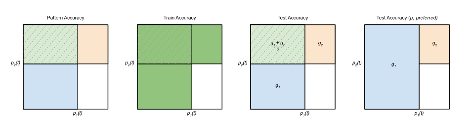

# Davies et al. 2023 — Unifying Grokking and Double Descent

See also: [the global concept index](../../concepts/index.md). arXiv [2303.06173v1](https://arxiv.org/abs/2303.06173), 10 March 2023 (the workshop presentation — December 2022). PDF running head: "ML Safety Workshop, 36th Conference on Neural Information Processing Systems (NeurIPS 2022)".

**Xander Davies** — Harvard University; equal contribution, correspondence: alexander_davies@college.harvard.edu. **Lauro Langosco** — University of Cambridge; equal contribution. **David Krueger** — University of Cambridge.

The files of this paper's analysis:

- [`2303.06173.unifying-grokking-and-double-descent.license.txt`](2303.06173.unifying-grokking-and-double-descent.license.txt) — the arXiv licence record for this paper.

The anchor scheme and the rules for linking into a card are in the [README of the papers folder](../README.md).

**Excerpt card.** The paper's licence (`arxiv-nonexclusive`) does not permit republishing the paper itself; what stands here are the editorial sections and the fragments the corpus quotes (right of quotation). The paper: <https://arxiv.org/abs/2303.06173>.

## Concepts covered

**[Double descent](../../concepts/double-descent.md)** — here for the first time in the corpus double descent is placed not beside [grokking](../../concepts/grokking.md) but in its stead: the work claims that both "are better viewed as two manifestations of one and the same phenomenon" ([p. 1, para. 4](#p1-4)), and thereby becomes the primary source of the whole later line of unification. Three things matter for the corpus. The first is the observation that in the setting of Power et al. themselves a double descent **is** present, but is visible only on a logarithmic accuracy scale and is more distinct in the loss than in the accuracy, the authors themselves calling it "slight" ([fig. 1](#fig-1)). The second is the conceptual frame: both curves are generated by the interaction of patterns learnt at different speeds, and the passage between the two pictures is obtained by changing exactly one kind of parameter ([p. 3, para. 4](#p3-4)). The third is the placing of double descent and grokking on a common axis: the authors present heat maps in the number of steps and the embedding dimension, in which the delayed generalisation is visible both vertically and horizontally ([fig. 4](#fig-4), [fig. 6](#fig-6)). What the work does not contain: not a single attempt to address the objection of Power et al. — that grokking differs from double descent because the generalisation sets in far beyond the interpolation threshold. The objection is quoted verbatim ([p. 5, para. 2](#p5-2)) and left unaddressed; neither the interpolation threshold nor the memorisation capacity is computed in the work.

**[Grokking](../../concepts/grokking.md)** — the work gives grokking a new axis. From its Claim 2 ("patterns may be regarded as a function of model size on a par with a function of training time") the authors derive, **before the experiment**, a consequence: grokking should be observable in model size too — and declare its first demonstration ([p. 2, para. 6](#p2-6), [p. 4, para. 2](#p4-2)). The term *model-wise grokking* enters the corpus from here, and later works refer to it as introduced precisely here. The second contribution to the notion is a quantitatively confirmed prediction about the early era of the training: the frame requires a fast, well-generalising pattern to give a spike of accuracy **above** chance, and such a spike is found and computed — a peak at 96 correct examples, corresponding to being error-free on $0/b=0$ and at chance (1/97) on the rest of the data ([fig. 7](#fig-7)). What the work does not contain: a definition of grokking — it is taken from Power et al. entire; nor is there any analysis of the network's internal arrangement. The experimental part rests on one task (division modulo 97) and one architecture, no number of seeds and no confidence bands are given, and the frame itself was fitted to not a single measured curve.

**[The canonical grokking proving ground](../../concepts/canonical-grokking-testbed.md)** — the setting of Power et al. is taken over entire and unchanged: a decoder-only transformer with a causal attention mask on the binary operation of division modulo 97, each residue encoded as a separate symbol, with the loss and the accuracy computed only on the part of the equation carrying the answer ([p. 4, para. 1](#p4-1), [p. 8, para. 3](#p8-3)). The work adds to the proving ground a **second control quantity**: the capacity is varied by the embedding dimension, while the other settings are fixed (2 layers, width 128, one attention head, 400 thousand optimisation steps, AdamW, learning rate 1e-3, weight decay 1e-5). It is precisely this two-dimensional sweep "steps × embedding dimension" that the corpus inherited from here. What the work does not contain: neither a second task, nor a second architecture, nor an analysis of how model-wise grokking differs from the long-known model-wise double descent other than in being delayed.

**[Modular arithmetic](../../concepts/modular-arithmetic.md)** — the work's only task, and taken in one particular form: division modulo 97. The value of that choice for the corpus is that it was on division that the frame gave a checkable prediction about a particular subset of examples: early in the training the model learns that for all $b$ it holds that $0/b=0\bmod n$ — a pattern that generalises well and is learnt fast ([p. 4, para. 3](#p4-3)). Thereafter a dip **below** the chance level is observed, explained by the accumulation of poorly generalising patterns and, by the authors' conjecture, by an anticorrelation of the training and validation values in the dividend and the divisor. It is noted that this bump is discernible in the plots of Power et al. 2022 too, but was not noticed there by the authors. What the work does not contain: a decomposition of the learnt solution — neither by frequencies nor by representations; a "pattern" here remains a notion of the frame rather than a quantity measured in the network.

**[The emergence of features](../../concepts/feature-emergence-feature-learning.md)** — the work proposes an abstract model of a network's learning as the *learning of patterns*: the network is represented by a set of $n$ patterns, and the probability that point $i$ is correctly classified by a pattern is given by a sigmoid with three parameters — a limiting predictiveness $\gamma_{i}$, an inflection point $b_{i}$ and a learning speed $\alpha_{i}$ ([p. 2, para. 8](#p2-8)). The authors name the difference from their predecessors themselves: in Heckel & Yilmaz 2020 and Pezeshki et al. 2021 patterns were already present, but here separate generalisation parameters $g_{i}$ are added to them, the limiting predictiveness is separated from the learning speed, and the notion of a *preferred pattern* is introduced ([p. 4, para. 4](#p4-4)). Three kinds of pattern — heuristic (fast, generalises well), overfitting (fast, though slower than the heuristic, generalises poorly) and slow generalising, which is eventually preferred — are the work's whole vocabulary ([p. 3, para. 3](#p3-3)). What the work does not contain: the measurement of even one pattern in an actual network. The parameters of the sigmoids are set by hand so as to yield the curves required; not a single numerical comparison of the model with the experimental curves is given, and the "preferred pattern" is a hand-made insertion on which the whole final passage to generalisation rests and which is derived from nothing and measured by nothing.

**[The memorisation phase / the plateau](../../concepts/memorization-phase.md)** — memorisation enters the frame as an *overfitting pattern* (Type 2): fast, though slower than the heuristic, and generalising poorly ([p. 3, para. 3](#p3-3)). What matters for the corpus is the prediction of what this pattern does to the validation accuracy in the early era: the accumulation of poorly generalising Type 2 patterns leads to a performance **worse than chance** on the remaining data, and this observation is confirmed by experiment ([p. 4, para. 3](#p4-3), [fig. 7](#fig-7)). What the work does not contain: a separation of the "memorising" and "generalising" solutions at the level of weights or subnetworks — the authors do not yet have that vocabulary, and the cause of the anticorrelation of training and validation values is explained by the word "likely" and is not checked.

**[Weight decay](../../concepts/weight-decay.md)** — to the work belongs the formulation of a conjecture that the later corpus repeats often: "We speculate that this is because weight decay hinders solutions via memorisation, thereby accelerating the formation of a better-generalising solution" ([p. 5, para. 3](#p5-3)). Its value for the corpus lies in the conjecture's being placed beside the opposite observation from the double-descent line: in Nakkiran et al. 2021 and Pezeshki et al. 2021 weight decay works as a capacity constraint and **hinders** the learning of slow features, whereas in the grokking setting it substantially accelerates the onset of generalisation. What the work does not contain: not a single experiment with weight decay — the value 1e-5 is fixed in appendix B and is never varied; the word "speculate" stands in the authors, and it cannot be removed when citing.

**[The learning rate](../../concepts/learning-rate.md)** — the learning rate appears here in an unaccustomed role: as a lever that **equalises the speeds of the patterns**. The work reads the finding of Liu et al. 2022 — that grokking is accelerated by a larger learning rate for the embedding than for the decoder — as consistent with the finding of Heckel & Yilmaz 2020 that lowering the learning rates in the later layers (which learn faster) equalises the learning speeds of the patterns, and declares this additional evidence for Claim 1 ([p. 5, para. 2](#p5-2)). What the work does not contain: an experiment of its own with learning rates. The value 1e-3 is fixed, layerwise rates were not tried, and the relation "equalising the speeds → the disappearance of grokking", checked in Heckel & Yilmaz for double descent, is not reproduced here on grokking but merely borrowed as an argument.

**[The optimiser](../../concepts/optimizer-adam-adamw-sgd.md)** — the work only mentions the optimiser: AdamW with $\beta_{1}=0.9$, $\beta_{2}=0.98$ is named in appendix B as part of the setting inherited from Power et al. ([p. 8, para. 3](#p8-3)) and is nowhere else discussed. Neither the properties of the adaptive step nor a comparison with SGD is analysed in the work, although an explanation of grokking through an anomaly of adaptive optimisers already existed by then. It matters for reading the heat maps that all the model-size results are taken at one optimiser and one schedule.

---

**[The complexity–error trade-off](../../concepts/model-complexity-error-tradeoff.md)** — complexity here is set from outside, by the number of parameters, and it is the outcome that is observed rather than the complexity of the trained network that is measured ([`p4-1`](#p4-1)). The work itself points to a rival explanation of the non-monotonicity: a mismatch of the learning speeds of different parts of the network ([`p4-4`](#p4-4)).
## Points we could not reconcile

**One and the same quantity is called now optimisation steps and now epochs.** [Section 3.1](#p4-2) says: "Figure 5 shows model-wise grokking in models trained for 400 thousand epochs", whereas [the caption of figure 5 itself](#fig-5) says "trained for 400 thousand optimisation steps", and [appendix B](#p8-3) fixes it: "We typically train for 400 thousand optimisation steps via AdamW". The caption and the appendix are correct; "epochs" in section 3.1 is a slip. The difference matters: at the training-data fraction of Power et al. an epoch and a step differ by orders of magnitude.

**The double descent in the heat maps is called both "distinct" and "slight".** [Section 3.1](#p4-2) asserts: "Figure 6 shows the corresponding accuracy heat maps with distinct double-descent behaviour both epoch-wise and model-wise", whereas [the caption of figure 6](#fig-6) says of the same plot: "A slight double descent is visible in the validation accuracy". The same caution stands in [the caption of figure 1](#fig-1) ("a slight double descent"). When citing the strength of the observation one must take the captions rather than the text of the section.

**The sum in formula (2) runs over subsets on some of which the summand is undefined.** The validation accuracy is defined as $\text{acc}_{\text{test}}(t)=\sum_{A\subseteq\{1,\dots,n\}}P_{A}(t)G(A)$, where the sum is explicitly taken over **all** subsets of $\{1,\dots,n\}$, including the empty one — and the mean generalisation ability is defined as $G(A)=1/{|A|}\sum_{i\in A}g_{i}$, which is undefined at $A=\emptyset$ ([p. 3, para. 1](#p3-1)). There is no convention in the paper for what the summand equals at $A=\emptyset$ (that is, for what the validation accuracy equals when no pattern has fired).

**The index range in appendix A does not match the main text.** The patterns are everywhere numbered $1,\dots,n$, whereas the preferredness condition in [appendix A](#p8-2) is written as $\forall j\in\{0,\cdots,n\},i\neq j\implies\mathcal{D}_{i}\cap\mathcal{D}_{j}=\emptyset$ — from zero. A slip, but it stands in the appendix's only formula.

---

## What is shown and what is conjectured

The work is a six-page workshop paper, and its layers differ in solidity more than in an ordinary article; the price of a quotation depends strongly on which layer it comes from.

**Predicted before the experiment and confirmed quantitatively.** From the frame it follows that a fast, well-generalising pattern must give a spike of validation accuracy above chance **before** the dip. The spike is found, identified ($0/b=0\bmod n$) and computed: a peak at 96 correct examples corresponds to being error-free on such examples and at chance (1/97) on the rest ([fig. 7](#fig-7)). This is the one place in the work where the frame said what to look for before anyone looked — and it incidentally points to a bump discernible in Power et al. and not noticed there ([p. 4, para. 3](#p4-3)).

**Shown by experiment.** A delayed generalisation is observed in model size as well as in the number of steps ([fig. 4](#fig-4), [fig. 5](#fig-5), [fig. 6](#fig-6)). This is a consequence of Claim 2, derived before the experiment and then checked; the experiment, however, is run on one task and one architecture, with no seeds and no spreads, and in figure 5 the curves are smoothed by a Gaussian filter whose width is not named in the caption and is visible only in the illustration's file name.

**Shown as a possibility rather than as a fact about a network.** The chief claim — that grokking and double descent are one mechanism — rests on a toy model whose parameters are set by hand. The model is fitted to no data, no numerical comparison of its curves with experimental ones appears in the work, and what is therefore shown is only that both shapes of curve are **generable** by one family of sigmoids, not that they **are generated** by it in an actual network. The passage between the two pictures is obtained by changing the limiting predictiveness $\gamma$ alone in the heuristic and in the slow generalising pattern ([p. 3, para. 4](#p3-4)) — a handsome property of the model rather than a measurement.

**Declared a conjecture.** The role of weight decay: "We speculate that this is because weight decay hinders solutions via memorisation" ([p. 5, para. 3](#p5-3)) — there is no experiment. The cause of the dip below chance: "apparently owing to an anticorrelation of the training and validation values" ([p. 4, para. 3](#p4-3)) — all that is checked is that the dip exists, not that the cause is correctly named. The argument of appendix C about the usefulness of the science of deep learning for safety the authors themselves call speculative and possibly mistaken ([p. 8, para. 6](#p8-6)).

**Acknowledged by the authors as a caveat within the model itself.** The dependence of the outcome on whether a point belongs to the training or the validation set "makes no sense in the case of i.i.d. data" — the authors write this themselves and nonetheless introduce such a dependence in order to model overfitting networks ([p. 3, para. 1](#p3-1)).

**Left unaddressed.** The objection of Power et al. — that grokking differs from double descent because the generalisation sets in far beyond the interpolation threshold — is quoted verbatim and addressed by neither a number nor an experiment ([p. 5, para. 2](#p5-2)). Nor is a single intervention set up: to accelerate or slow one pattern in an actual network and see whether the grokking changes — although the frame invites exactly that, and such experiments already existed in Heckel & Yilmaz 2020 and Stephenson & Lee 2021 for double descent ([p. 4, para. 4](#p4-4)).

---

## Common misreadings and overstatements of this paper

Below are the patterns observed in the citing works of the corpus. For each one it is said what exactly gets distorted, with links to the authors' paragraphs where the qualification that goes missing still stands. The "Common misreadings and overstatements" sections on the citing side have not been started yet, so there is nothing detailed to address; the citing works are listed as plain links to their cards.

**"Davies et al. explain grokking by the geometry of the loss landscape" (erroneous).** Two surveys in the corpus credit the work with a subject it does not contain in any form. Abramov et al. 2025 write: `"Subsequent work has linked grokking to double descent (Belkin et al., 2019; Nakkiran et al., 2020), the geometry of deep-network loss landscapes (Davies et al., 2023), and weight decay (Pezeshki et al., 2022; Nanda et al., 2023)"`; Truong et al. 2026 repeat the same twice — `"Existing accounts appeal to weight-norm dynamics (Liu et al., 2023; Kumar et al., 2024), Fourier-feature formation (Nanda et al., 2023; Gromov, 2023), circuit efficiency (Varma et al., 2023; Merrill et al., 2023), group-theoretic representations (Chughtai et al., 2023), and loss-landscape geometry (Davies et al., 2022)"`. There is no loss landscape in the paper: its only quantity is the probability $p_{i}(t)$ of correct classification by an individual pattern, given by a sigmoid in the step number ([p. 2, para. 8](#p2-8)), and the work does not touch the weights, their norm or the relief of the loss at all. The landscape explanation of grokking belongs to Liu et al. 2022 (Omnigrok), whom both surveys cite alongside. Works concerned: [Abramov et al. 2025](../2504.20752.grokking-in-the-wild-data-augmentation-for-real-world-multi-hop-reasoning-with-transformers/2504.20752.grokking-in-the-wild-data-augmentation-for-real-world-multi-hop-reasoning-with-transformers.card.md), [Truong et al. 2026](../2604.13123.spectral-entropy-collapse-as-a-phase-transition-in-delayed-generalisation/2604.13123.spectral-entropy-collapse-as-a-phase-transition-in-delayed-generalisation.card.md).

**"The frame of Davies speaks of a competition of circuits and of progress measures" (erroneous).** Later works regularly rewrite the patterns of Davies into the vocabulary that took shape after the paper. Liu and Lu 2026 write: `"Davies et al. [35], Huang et al. [36] further unify double descent with grokking by framing both phenomena as a competition between memorization and generalization circuits"`; Truong et al. 2026, `"Davies et al. (2022) hypothesised connections between grokking and double descent via hidden progress measures"`; Notsawo et al. 2025 place the work in a list of progress measures as `"time scales of pattern formation (Davies et al., 2023)"`; and Furuta et al. 2024 assign it to works in which `"the training process could be a phase transition divided into memorization, circuit formation, and cleanup phase"`. Neither the word "circuit", nor the words "progress measure", nor a three-phase division appears in the paper: the authors have three **kinds of pattern** — heuristic, overfitting and slow generalising ([p. 3, para. 3](#p3-3)) — and not a single quantity growing over the course of the training and heralding the transition is proposed. The competition of circuits as a frame of unification belongs to Huang et al. 2024, whom Liu and Lu name alongside; the three-phase division to Nanda et al. 2023. Works concerned: Liu and Lu 2026 (no card as yet), [Truong et al. 2026](../2604.13123.spectral-entropy-collapse-as-a-phase-transition-in-delayed-generalisation/2604.13123.spectral-entropy-collapse-as-a-phase-transition-in-delayed-generalisation.card.md), [Notsawo et al. 2025](../2506.05718.grokking-beyond-the-euclidean-norm-of-model-parameters/2506.05718.grokking-beyond-the-euclidean-norm-of-model-parameters.card.md), [Furuta et al. 2024](../2402.16726.towards-empirical-interpretation-of-internal-circuits-and-properties-in-grokked-transformers-on-modular-polynomials/2402.16726.towards-empirical-interpretation-of-internal-circuits-and-properties-in-grokked-transformers-on-modular-polynomials.card.md).

**"The unification has taken place" instead of "we hypothesise" (widening).** The paper's title is assertive, and when cited it displaces the authors' own formulation, which is everywhere hedged: "We hypothesise that grokking and double descent can be understood as manifestations of the same training dynamics" ([p. 1, para. 2](#p1-2)) — and this is a hypothesis rather than a result. Zhao et al. 2024 write: `"A unified framework has been developed to integrate grokking with double descent, treating them as two manifestations of the same underlying process (Davies et al. 2023)"`; Zhou et al. 2025, `"Davies et al. (2023) unified grokking with the double-descent phenomenon, attributing delayed generalization to the interplay between model capacity and data complexity"` — where "data complexity" does not occur in the paper at all, and model capacity serves as an axis of the experiment rather than as an explanation. Notably, accurate citations in the corpus are the more numerous: Xu et al. 2026 write `"Davies et al. (2023) hypothesized that grokking and double descent can be understood using the same pattern-learning model, and provided the first demonstration of model-wise grokking"`; Das et al. 2026, `"The connection between double descent (Nakkiran et al. 2019) and grokking has been explored (Davies et al. 2023), but without theoretical justification"`; Miller et al. 2024 quote Claim 1 verbatim; and Lyu et al. 2023 add to their retelling an objection of their own — `"it is unclear how these notions can be rigorously defined for general training dynamics"`. Works concerned: Zhao et al. 2024 (no card as yet), [Zhou et al. 2025](../2504.17243.neuralgrok-accelerate-grokking-by-neural-gradient-transformation/2504.17243.neuralgrok-accelerate-grokking-by-neural-gradient-transformation.card.md).

**"The duality hypothesis has still not been checked" (erroneous, in the opposite direction).** Huang et al. 2024, a work directly continuing this line, write: `"Davies et al. (2022) attempted to bridge the concepts of *double descent* and *grokking*. This was approached through a proposed duality between model size and scaling time, though this hypothesis remains to be empirically verified"`. The experimental check of the consequence of Claim 2 constitutes the whole of section 3.1 and three figures out of seven ([fig. 4](#fig-4), [fig. 5](#fig-5), [fig. 6](#fig-6)), and the abstract declares "the first demonstration of model-wise grokking". Amusingly, the same authors a few pages earlier credit Davies et al. with the very term *model-wise grokking* and observe the phenomenon themselves. Work concerned: [Huang et al. 2024](../2402.15175.unified-view-of-grokking-double-descent-and-emergent-abilities/2402.15175.unified-view-of-grokking-double-descent-and-emergent-abilities.card.md).

Milder echoes not warranting separate analysis: crediting the work with an observation of grokking "across a wide set of settings and architectures" (Xu 2026, no card as yet), whereas the task and the architecture here are single; assigning it to explanations through a preference for "simpler" solutions ([Liang and Li 2025](../2512.03437.grokked-models-are-better-unlearners/2512.03437.grokked-models-are-better-unlearners.card.md)), whereas simplicity nowhere figures in the authors and the preference is postulated; assigning it to works on emergent abilities ([Saheb Pasand and Dohmatob 2026](../2510.04930.egalitarian-gradient-descent-a-simple-approach-to-accelerated-grokking/2510.04930.egalitarian-gradient-descent-a-simple-approach-to-accelerated-grokking.card.md)), which are absent from the paper; and retelling the difference between double descent and grokking as a question of whether "heuristic patterns are learnt early or late" (Kubo, Uda, Iida 2026, no card as yet), whereas in the authors the two pictures are separated by the limiting predictiveness $\gamma$ rather than by the order of learning.

---

# Quoted fragments

Only the fragments the corpus cards refer to are
reproduced here (right of quotation); the paper's licence does not permit
republishing the whole text. Anchor numbering matches the original.

###### p1-2

A principled understanding of generalization in deep learning may require unifying disparate observations under a single conceptual framework. Previous work has studied *grokking*, a training dynamic in which a sustained period of near-perfect training performance and near-chance test performance is eventually followed by generalization, as well as the superficially similar *double descent*. These topics have so far been studied in isolation. We hypothesize that grokking and double descent can be understood as instances of the same learning dynamics within a framework of pattern learning speeds. We propose that this framework also applies when varying model capacity instead of optimization steps, and provide the first demonstration of model-wise grokking.

###### fig-1

*Figure 1: Three views of the same training run, replicated from Power et al. 2022.* **[p. 1]**

On some datasets, neural networks exhibit surprising training dynamics termed *grokking* by Power et al. 2022. In grokking, the model initially overfits, achieving perfect performance on the training set while remaining at near-chance performance on the test set. Later in training, test performance improves and the model eventually achieves perfect test accuracy. Grokking is reminiscent of the *double descent* phenomenon (Belkin et al. 2018; Nakkiran et al. 2021), in which test performance initially improves, then worsens as the model overfits, and then eventually improves again as model capacity increases.

###### p1-4

We argue that double descent and grokking are best viewed as two instances of the same phenomenon, in which inductive biases prefer better-generalizing but slower to learn patterns, leading to a transition from poorly-generalizing to well-generalizing patterns. This transition happens both *epoch-wise* as a function of training time (Figure 1) and *model-wise* as a function of model size (Figure 4).

**[p. 2]**

###### p2-6

*Patterns can be viewed as a function of model size as well as a function of training time, and learning dynamics are similar between these two cases.11 1 It is reasonable to speak of pattern learning as a function of effective capacity (Arpit et al. 2017) or effective model complexity (Nakkiran et al. 2021), though we avoid doing so in this work so as to stay agnostic about the precise metric.*

If Claim 2 is correct, then grokking, like double descent, should happen model-wise as well as epoch-wise. We confirm this hypothesis empirically in Section 3.1.

###### p2-8

In our model, a neural network consists of a set of $n$ patterns that develop over time during training. For any training point, the probability that pattern $i$ classifies it correctly at time-step $t$ is $p_{i}(t)$.We model $p_{i}$ as a sigmoid

$$
p_{i}(t)=\frac{\gamma_{i}}{1+e^{-\alpha_{i}(t-b_{i})}},
$$

parameterized by a maximum predictiveness $0\leq\gamma_{i}\leq 1$, inflection point $b_{i}\geq 0$, and learning speed $\alpha_{i}\geq 0$. The probability that the overall model classifies the training point correctly is then given by **[p. 3]** the probability that any of the patterns does so. Since each data-point is classified independently, the probability of classifying a single training point correctly is equal to the overall training accuracy,

$$
\text{acc}_{\text{train}}(t)=1-\prod_{i=1}^{n}\left(1-p_{i}(t)\right). \tag{1}
$$

###### p3-1

To calculate test accuracy of our model we assign additional generalization parameters $g_{1},\dots,g_{n}\in[0,1]$ to represent the idea that some patterns generalize better than others.22 2 In this model whether the network classifies a given input correctly depends on whether it is in the training set or the test set, which does not make sense in the case of i.i.d. data: in the real world, whether a given example $(x,y)$ is classified correctly or not is purely a fact about the value of $(x,y)$ and the parameters of the model, and doesn’t depend on whether its in the training or test set. However, we include such a dependence to model neural networks that overfit the training set and thus are better able to classify training examples. Intuitively, every pattern corresponds to a ‘generalization set’ of inputs that are classified using that pattern even if they did not occur during training. The generalization parameter can then be viewed as the fraction of the generalization set that is classified correctly. We assume that patterns that are more frequently successful during training are more used at test time. For any subset $A$ of $\{1,\dots,n\}$, we define the probability $P_{A}(t)=\prod_{i\in A}p_{i}(t)\prod_{j\notin A}(1-p_{j}(t))$ that only the patterns in $A$ are successful, as well as the average generalization ability $G(A)=1/{|A|}\sum_{i\in A}g_{i}$ of the patterns in $A$. Overall test accuracy at time $t$ is then given by the average generalization ability weighted the probability of success at train time,

$$
\text{acc}_{\text{test}}(t)=\sum_{A\subseteq\{1,\dots,n\}}P_{A}(t)G(A). \tag{2}
$$

We additionally introduce the notion of a *preferred pattern*, which we use to model the effect of inductive biases on pattern development. When pattern $k$ is preferred, $g_{k}$ is weighted more highly in Equation 2 by setting $G(A)=g_{k}$ if $k\in A$ and otherwise $G(A)=1/|A|\sum_{i\in A}g_{i}$ as usual.

*Figure 3: **Two pattern model.** Full square represents the data set. Left to right, (1) blue shows training samples correctly classified by $p_{1}(t)$, red shows training samples correctly classified by $p_{2}(t)$, dashed green shows samples correctly classified by both; (2) accuracy is the union of patterns 1 and 2; (3) test accuracy is the sum of correct classifications weighted by generalization parameters, and by their average generalization in the case both correctly classifying; (4) test accuracy given pattern 1 is *preferred*, causing all examples correctly classified by pattern 1 to generalize according to $g_{1}$.* **[p. 3]**

###### p3-3

We model learning in double descent and grokking as interactions between three patterns learned at different speeds during training: a **heuristic pattern** that is fast and generalizes well; an **overfitting pattern** that is fast, though slower than the heuristic, and generalizes poorly; and a **slow-generalizing pattern** that is slow and generalizes well. This last pattern is ultimately preferred by the inductive biases of the model.

###### p3-4

As shown in Figure 2, this simple model can produce grokking as well as double descent; the two can be interpolated between by solely modulating the maximum predictiveness ($\gamma$) of the heuristic and the slow-generalizing patterns.33 3 Code replicating our results is available at github.com/xanderdavies/unifying-grok-dd, including an interactive notebook to explore the pattern learning model and interpolate between grokking and double descent.

###### fig-4

*Figure 4: **Model-Wise Grokking.** Darker color indicates lower loss, dotted line represents 90% training accuracy. *Left:* Test loss as function of training steps and model size. *Right:* Training loss. Epoch-Wise Grokking: Moving vertically from zero training steps, test loss initially falls, then rises dramatically (beginning near perfect fitting of the training set), and then falls again. Model-Wise Grokking: Moving horizontally along training step counts which will eventually lead to low loss, we see the same pattern of initial test loss decrease, followed by rapid increase around training-set fitting, and then eventual decrease. See Figure 5 for a horizontal cross-section.* **[p. 4]**

**[p. 4]**

###### p4-1

Following the original grokking setting of Power et al. 2022, we train decoder-only transformers (Vaswani et al. 2017) with causal attention masking on the binary operation of division mod 97 (details in Appendix B). We explore the effects of regulating effective model complexity by varying parameter-count.

###### p4-2

Figure 4 shows train and test loss with respect to optimization steps and embedding dimension. For a range of values, delayed generalization occurs both when moving vertically (epoch-wise grokking), as well as when moving horizontally (model-wise grokking). Figure 6 shows the corresponding accuracy heatmaps, with clear double descent behavior both epoch-wise and model-wise. Figure 5 shows model-wise grokking with models trained for 400k epochs.

###### p4-3

In the modular division setting of Power et al. 2022 the test accuracy is non-monotonic (Figure 1). Early in training, the model learns that for all $b$, $0/b=0\mod n$. This pattern generalizes well and is learned quickly, corresponding to a Type 1 pattern in our model. As predicted by our model, this leads to an initial spike above chance in test accuracy. Interestingly, the development of poorly-generalizing Type 2 features then leads to *worse-than-chance* performance on the rest of the data, likely due to anti-correlation between train and test set values for every dividend and divisor in modular division, causing a descent in test performance. This small bump is noticeable in Power et al. 2022, but not noted by the authors. We validate this hypothesis experimentally (Figure 7).

###### p4-4

Heckel & Yilmaz 2020 find different parts of networks learning at different speeds can cause two bias-variance trade-off curves with different minima, leading to double descent in test error; they show that adjusting step-sizes of different layers can align the learning curves and eliminate double descent behavior. They argue that epoch-wise double descent occurs due to this difference in learning speed, as opposed to due to regulating model complexity. Pezeshki et al. 2021 use a linear teacher-student model to demonstrate that epoch-wise double descent can be explained by different patterns being learned at different speeds. Stephenson & Lee 2021 experimentally demonstrate double descent can be avoided by removing or accelerating slow-to-learn features. In this work, we extend this pattern learning framework to interpret grokking behavior as well as double descent behavior, and propose a mathematical model uniting both phenomena. Our framework uses the concept of distinct patterns with individual strengths (Heckel & Yilmaz 2020; Pezeshki et al. 2021), but is distinct in allowing for specific **[p. 5]** per-pattern generalization parameters and separating maximum predictiveness from learning speed, as well as introducing the notion of a “preferred” pattern.

###### fig-5

*Figure 5: Model-wise grokking, with each point a transformer of the corresponding embedding dimension trained for 400K optimization steps. Lines are smoothed data via a Gaussian filter. **Left:** Accuracy, with delayed generalization. **Right:** Loss, with a rise in test loss followed by a fast descent.* **[p. 5]**

###### p5-2

Grokking was first demonstrated by Power et al. 2022, who state that grokking is distinct from double descent because generalization occurs far past the interpolation threshold. Liu et al. 2022 demonstrate that grokking generalization speed can be accelerated in a simple embedding- decoder model by using a larger learning rate for the embedding than for the decoder. This is in line with findings by Heckel & Yilmaz 2020 on epoch-wise double descent, where decreasing learning rates in later layers (which learn faster) aligns pattern learning speeds. We consider this further evidence that both grokking and epoch-wise double descent occur as a result of similar learning dynamics resulting from different speeds of pattern development. Nanda & Lieberum 2022 investigate grokking through mechanistic interpretability, with findings in line with our results (specifically observing the development of a Type 3 pattern).

###### p5-3

Both Nakkiran et al. 2021 and Pezeshki et al. 2021 find that weight decay acts as a capacity constraint, resulting in both weight decay-wise double descent and preventing the learning of slower features. In the grokking setting, however, weight decay plays a significant role in speeding up time to generalization (Power et al. 2022). We speculate that this occurs due to weight decay hindering the memorization-based solutions, thus accelerating the development of the better-generalizing solution.

###### p8-2

We can then say that a *preferred pattern* enforces that its domain $\mathcal{D}_{i}$ is disjoint from all other pattern domains on the test set; that is $\mathcal{D}_{i}$ is preferred if $\forall j\in\{0,\cdots,n\},i\neq j\implies\mathcal{D}_{i}\cap\mathcal{D}_{j}=\emptyset$.

###### p8-3

In all of our experiments, we train decoder-only transformer with causal attention masking. Each residue is encoded as a symbol, and loss and accuracy are only evaluated on the answer part of the equation. Unless otherwise stated, we use a 2-layer network of width 128, with a single attention head. We typically train for 400 thousand optimization steps via AdamW ($\beta_{1}=0.9$, $\beta_{2}=0.98$), with learning rate of 1e-3 and weight decay of 1e-5.

###### p8-6

A science of deep learning may also be harmful if theoretical or empirical breakthroughs result in faster advancement of potentially dangerous capabilities. This is a major drawback of this line of research. A tentative argument in favor of scientific / conceptual work is that it seems possible to build human-level AI systems without a radically improved understanding of deep learning; however, building *safe* human-level AI is a harder problem that will likely require a more robust theory. Thus advancing the science of deep learning seems somewhat more critical for solving problems of safety than of capabilities. This argument is speculative, and may turn out to be wrong.

###### fig-6

*Figure 6: **Left:** Test accuracy as function of training steps and model size. A faint double descent in test accuracy is visible, and delayed generalization is clear both epoch-wise (vertically) and model-wise (horizontally). **Right:** Training accuracy as a function of training steps and model size.* **[p. 9]**

###### fig-7

*Figure 7: Early in training, the model learns $0/b=0\mod n$, as the no. $0/b=0\mod n$ correct (green) matches all such examples (dashed gray). This leads to a brief peak of 96 correct examples, corresponding to perfect performance on the $0/b=0$ and chance performance (1/97) on other data. Test accuracy on all other examples then falls below chance due to memorization.* **[p. 9]**
