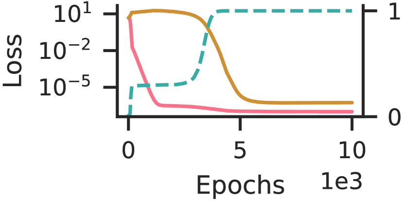
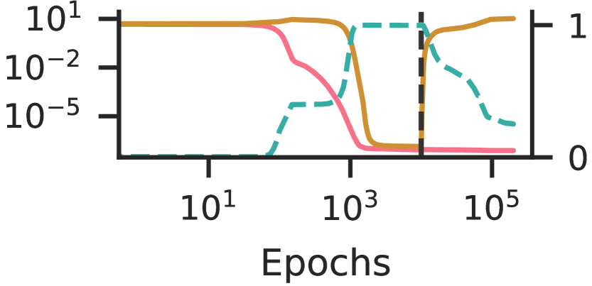
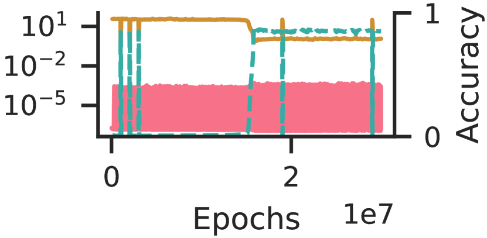
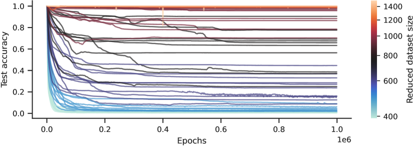
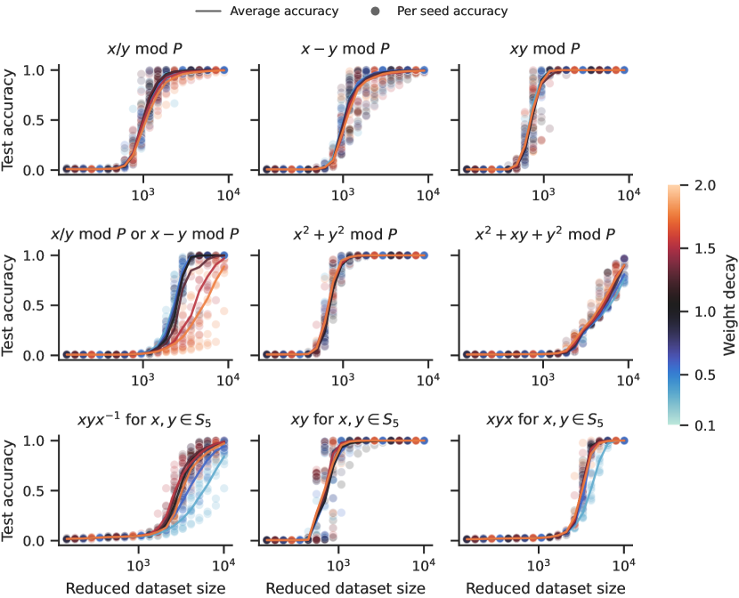

# Varma et al. 2023 — Explaining grokking through circuit efficiency

See also: [the global concept index](../../concepts/index.md).

**Vikrant Varma**, **Rohin Shah** (equal contribution), **Zachary Kenton**, **János Kramár**, **Ramana Kumar** — Google DeepMind.

arXiv [2309.02390](https://arxiv.org/abs/2309.02390), 5 September 2023. 100 citations — the sixth most cited work in the corpus. There is no native HTML for it; the source is ar5iv.

The files of this paper's analysis:

- [`2309.02390.explaining-grokking-through-circuit-efficiency.license.txt`](2309.02390.explaining-grokking-through-circuit-efficiency.license.txt) — the arXiv licence record for this paper.

The anchor scheme and the rules for linking into a card are in the [README of the papers folder](../README.md).

**Excerpt card.** The paper's licence (`arxiv-nonexclusive`) does not permit republishing the paper itself; what stands here are the editorial sections and the fragments the corpus quotes (right of quotation). The paper: <https://arxiv.org/abs/2309.02390>.

## Concepts covered

**[Circuit efficiency](../../concepts/circuit-efficiency.md)** — the work introduces the notion and makes it the centre of its explanation. Efficiency is defined operationally: a circuit is the more efficient the less parameter norm it needs in order to produce a given logit value ([`p1-6`](#p1-6)). The key thesis is that when several circuits solve the training set equally well, **weight decay prefers the more efficient one**. Hence the answer to grokking's original question: if the generalising circuit is more efficient than the memorising one, gradient descent goes on reducing an already near-zero loss, strengthening the first and weakening the second.

**[Weight norm minimisation](../../concepts/weight-norm-minimization.md)** — receives from the work a mechanism relating the norm to the choice of solution. Not "the smaller the norm the better the generalisation" but "at an equal norm the circuit producing larger logits wins". This moves the discussion of weight decay out of heuristics and into the comparison of two concrete solutions.

**[Margin maximisation](../../concepts/margin-maximization-implicit-bias.md)** — takes the same formulation from another side: the generalising solution "produces larger logits at the same parameter norm" ([`p1-3`](#p1-3)), that is, efficiency is a form of implicit bias towards a larger margin.

**[Data fraction / critical dataset size](../../concepts/data-fraction-critical-dataset-size.md)** — the work introduces the **critical dataset size** $D_{\textrm{crit}}$ ([`p1-9`](#p2-1)) as the intersection point of two efficiency curves. The justification is simple and checkable: the generalising circuit works on any new data, so its efficiency does not depend on the sample size, whereas the memorising one must memorise every added point, so its efficiency falls. In Power et al. 2022 there was a curve "less data — longer to generalisation"; here it acquires a threshold and a cause.

**[Ungrokking](../../concepts/ungrokking.md)** — the work **introduces the phenomenon**: a network that has already grokked successfully returns to a low test accuracy if training is continued on a sample substantially smaller than $D_{\textrm{crit}}$. This is a prediction derived from the theory before the experiment, and therein lies its value: grokking turns out to be reversible.

**[Semi-grokking](../../concepts/semi-grokking.md)** — the second phenomenon introduced: at a sample size near $D_{\textrm{crit}}$, where the two circuits are comparable in efficiency, a phase transition occurs but only to a middling test accuracy rather than a perfect one.

**[Phase transition](../../concepts/phase-transition.md)** — takes semi-grokking from the work as a case of a transition leading short of full generalisation ([`p1-9`](#p2-1)). This refines the notion: the abruptness of a transition and its endpoint are independent characteristics.

**[Grokking](../../concepts/grokking.md)** — the work gives the notion a mechanistic explanation through a competition of two families of circuits and formulates **three sufficient conditions**: the generalising circuit generalises and the memorising one does not; the generalising one is more efficient; the generalising one is learned more slowly. The sufficiency is demonstrated by a constructed simulation rather than by observation alone.

**[The memorisation phase](../../concepts/memorization-phase.md)** — takes the formulation that a network first "memorises" the data, reaching a low and stable training loss with poor generalisation ([`p1-4`](#p1-4)). Unlike in Power et al., memorisation here is not merely a preceding state but a competing solution with an efficiency of its own, which is then deliberately weakened.

**[Mechanistic interpretability](../../concepts/mechanistic-interpretability.md)** — the work borrows the language of circuits from that field, but with an explicit caveat: internal mechanisms "which we loosely call circuits" ([`p1-6`](#p1-6)). There is no reverse engineering here — the circuits remain a theoretical construct rather than a disassembled algorithm as in Nanda et al.

**[The Goldilocks zone](../../concepts/goldilocks-zone.md)** — mentioned in the discussion of how long the regularisation takes to bring the parameter norm into the required range ([`p10-6`](#p10-6)).

Cards of corpus papers: [Power et al. 2022](../2201.02177.grokking-generalization-beyond-overfitting-on-small-algorithmic-datasets/2201.02177.grokking-generalization-beyond-overfitting-on-small-algorithmic-datasets.card.md) — the phenomenon explained here; [Nanda et al. 2023](../2301.05217.progress-measures-for-grokking-via-mechanistic-interpretability/2301.05217.progress-measures-for-grokking-via-mechanistic-interpretability.card.md) — the authors say outright that they develop the explanation from its appendix E, that is, they take the speculative part of a predecessor and turn it into a checkable theory.

**[Behavioural against true grokking](../../concepts/behavioral-vs-true-grokking.md)** — the transition is explained by a change of winner between two solutions rather than by the appearance of a new ability ([`p1-3`](#p1-3)). Near the boundary set by the critical dataset size ([`p2-1`](#p2-1)) regimes are predicted in which "has grokked" ceases to be a binary property — that is, the behavioural definition itself loses its sharpness.
## What is predicted and what is conjectured

The card editor's remarks following the analysis of the claims (`…claims.txt`). The work is markedly uneven in the strength of its justification, and when citing it, it helps to know which part a thesis is taken from.

**The predictive part is strong and stands apart within the corpus.** The critical dataset size is derived from a simple consideration — the generalising circuit does not change as data are added, the memorising one does — and from it two statements are obtained **before the experiment** and then confirmed quantitatively: a sharp transition of the test accuracy near $D_{\textrm{crit}}$, and the independence of the final accuracy after ungrokking from the strength of the weight decay (the curves for different values overlay). The phenomenon of ungrokking itself had not been described before this work. This is a case rare for the corpus in which a theory first predicted and then found.

**The explanatory part around semi-grokking rests on a chain of suppositions.** The observations are firm: a run holds at a middling accuracy for millions of epochs, sometimes passing through several plateaus, and then generalises perfectly. The interpretation, however, is built in steps, not one of which is checked: the seed-to-seed spread is explained by one algorithm having many circuits of differing efficiency; then it is supposed that $C_{\text{gen}}$ has several such circuits and that the more efficient ones are learned more slowly; then this explains a transient semi-grokking; and finally it is suggested that under longer training most runs would have reached full grokking. The last matters: if it is right, semi-grokking is not a stable state but a stage of under-training. The authors themselves concur with this assessment, noting in [§5.3](#sec-5-3) that semi-grokking does not follow strictly from their theory.

**Three limitations the authors admit themselves, and two of them are buried in the appendices.**

- The explanation leans on weight decay, whereas grokking is observed without it too — "this shows that our explanation is incomplete" ([§7](#sec-7)). The answer to this (there is probably another effect with a similar action) is not checked, and "on the whole we are confident" stands beside it.
- $D_{\textrm{crit}}$ is called "an oversimplified notion", since the initialisation and the dynamics decide which circuits will be found ([A.2](#sec-a-2)). This concerns the theory's central notion and is not carried into the main text.
- The proxy metrics of circuit strength are biased, and how exactly is enumerated by the authors: the logits of the two circuits are correlated, so the projection captures memorisation too and the strength of the generalising circuit is overestimated ([appendix B](#sec-b)). The conclusions of appendices A.3 and A.4 are built on those same metrics.

**Separately: the carry-over of the explanation to in-context learning is a hypothesis in the literature survey, and it is cited more often than it deserves.** In [§6](#sec-6) the authors suppose that circuit efficiency also explains the observation of Singh et al.: in-context learning from induction heads is displaced by in-weights learning in the absence of weight decay but is retained in its presence. This is the only place where the theory leaves modular arithmetic, and the claim is a large one — the same mechanism in language models. There is not a single experiment behind it: the work relied on is listed in the bibliography as *Forthcoming*, and the carry-over itself rests on the identification "induction heads = the generalising algorithm", which is accepted here rather than justified. The authors' formulation is honest ("we **hypothesise**"), and the paragraph stands in the literature survey rather than in the results — but this place is usually cited as "Varma et al. extended the explanation to in-context learning", losing its hypothetical status. In the structure of the risk this is the same case as [appendix E](../2301.05217.progress-measures-for-grokking-via-mechanistic-interpretability/2301.05217.progress-measures-for-grokking-via-mechanistic-interpretability.card.md#sec-e-1) in Nanda et al.

**Methodological conditions worth remembering when citing the quantitative results.** The contribution of memorisation is defined **as the residue** after a projection onto the trigonometric subspace — with an explicit caveat that the memorisation algorithm is not understood by the authors, and under the hypothesis that there are exactly two substantial families of circuits. The criterion of a "pure" generalising network ($>95$% of the logit norm in the trigonometric subspace) is meaningful only for modular addition, so the key experiment about efficiency is set up on a single task. And in A.4 all the parameters were initialised from an already trained $C_{\text{gen}}$ network, that is, what is shown is the behaviour of a mixture of circuits rather than its emergence.

## Common misreadings and overstatements

These are the card editor's remarks, not the authors' text: places where this paper restates someone else's results with an error, or without the qualifications their authors attached. The "details" links in the "Common misreadings and overstatements of this paper" sections of the cited works' cards lead here.

###### mc-2301-05217
**Nanda et al. (2301.05217) — "slower and harder" ascribed to appendix D.1.** `"grokking has been observed even when weight decay is not present (Power et al., 2021; Thilak et al., 2022) (though it is slower and often much harder to elicit (Nanda et al., 2023, Appendix D.1))"`: the phrase about grokking without weight decay is itself accurate and is a model of care, but the support for the caveat is badly chosen: [D.1 asserts the necessity of regularisation](../2301.05217.progress-measures-for-grokking-via-mechanistic-interpretability/2301.05217.progress-measures-for-grokking-via-mechanistic-interpretability.card.md#sec-d-1) — [without weight decay or another regularisation the authors' networks do not grok at all](../2301.05217.progress-measures-for-grokking-via-mechanistic-interpretability/2301.05217.progress-measures-for-grokking-via-mechanistic-interpretability.card.md#sec-5-3) — rather than "slower and harder". The "slower" in D.1 refers to a small but non-zero weight decay — and it contradicts D.1's own numbers at that (see the target's card, "Internal inconsistencies"). In every other place the paper cites the target exemplarily: pinned references to figures, and appendix E correctly called a "perspective".

## Common misreadings and overstatements of this paper

Patterns of misreading or overstatement of this work, as observed in the citing papers of the corpus. Each entry says what exactly gets distorted in the restatement and leads to the authors' own paragraphs, where the qualification that goes missing still stands. The specific wordings are examined in the citing works' cards, in their "Common misreadings and overstatements" sections, where the "details" links lead.

**"Sparse generalising against dense memorising subnetworks" (an over-extension — somebody else's thesis ascribed to this work too).** Four works of the corpus present this paper's competition of circuits as a contest between a sparse generalising and a dense memorising subnetwork. The structural thesis about sparsity belongs to [Merrill et al.](../2303.11873.a-tale-of-two-circuits-grokking-as-competition-of-sparse-and-dense-subnetworks/2303.11873.a-tale-of-two-circuits-grokking-as-competition-of-sparse-and-dense-subnetworks.card.md) and is confirmed there for sparse parity; in Varma the circuits are ["internal mechanisms… which we loosely call circuits"](#p1-6): they are not localised, and the work says nothing whatever about their sparsity or density. The group citation "(Merrill et al., 2023; Varma et al., 2023)" erases the boundary between a measured structure and an abstract efficiency. The details: [2504.13292](../2504.13292.let-me-grok-for-you-accelerating-grokking-via-embedding-transfer-from-a-weaker-model/2504.13292.let-me-grok-for-you-accelerating-grokking-via-embedding-transfer-from-a-weaker-model.card.md#mc-2309-02390); milder echoes: [2603.15492](../2603.15492.grokking-as-a-variance-limited-phase-transition-spectral-gating-and-the-epsilon-stability-threshold/2603.15492.grokking-as-a-variance-limited-phase-transition-spectral-gating-and-the-epsilon-stability-threshold.card.md), [2512.03437](../2512.03437.grokked-models-are-better-unlearners/2512.03437.grokked-models-are-better-unlearners.card.md), [2403.03942](../2403.03942.the-heuristic-core-understanding-subnetwork-generalization-in-pretrained-language-models/2403.03942.the-heuristic-core-understanding-subnetwork-generalization-in-pretrained-language-models.card.md).

**Ungrokking and semi-grokking without the authors' conditions (erroneous).** Both terms introduced by the work lose their defining conditions in paraphrase. Ungrokking is a regression [of an already grokked network under fine-tuning on a dataset much smaller than the critical one](#p2-1); training from scratch on small data, in which generalisation simply never sets in, is not ungrokking. Semi-grokking arises [in the vicinity of the critical dataset size, and the authors themselves warn that "it does not follow strictly from our theory"](#sec-5-3), and under longer training many runs would have grokked fully; the "below the threshold" regime and a "stable equilibrium" are imported readings. And the critical size $D_{crit}$ the authors themselves call ["an oversimplified notion"](#sec-a-2) — those who cite it turn it into a definite number, "about 25 per cent". The details: [2402.15175](../2402.15175.unified-view-of-grokking-double-descent-and-emergent-abilities/2402.15175.unified-view-of-grokking-double-descent-and-emergent-abilities.card.md#mc-2309-02390), [2511.04760](../2511.04760.when-data-falls-short-grokking-below-the-critical-threshold/2511.04760.when-data-falls-short-grokking-below-the-critical-threshold.card.md#mc-2309-02390).

**Circuit efficiency as a mechanism of grokking in general (an over-extension).** The efficiency explanation is cited without the limitation the authors placed in a limitations section of their own: ["it relies crucially on weight decay… our explanation is incomplete"](#sec-7). Formulations of the kind "once both circuits have formed, the generalising one dominates" lose both that condition and the dependence on the amount of data. A separate case is the carry-over of the mechanism into new domains with "efficiency" itself redefined: [2405.15071](../2405.15071.grokked-transformers-are-implicit-reasoners/2405.15071.grokked-transformers-are-implicit-reasoners.card.md#mc-2309-02390) applies it to multi-hop reasoning in knowledge graphs, measuring efficiency by the number of stored facts instead of by parameter norm; the carry-over is partly confirmed by their own weight-decay experiment but is presented as an explanation rather than a hypothesis. Within the corpus nobody cites the authors' own hypothetical carry-over to in-context learning (section 6, the overcited entry in the facts block) — that case of over-citation lives outside the corpus. The details: [2405.15071](../2405.15071.grokked-transformers-are-implicit-reasoners/2405.15071.grokked-transformers-are-implicit-reasoners.card.md#mc-2309-02390), [2510.04930](../2510.04930.egalitarian-gradient-descent-a-simple-approach-to-accelerated-grokking/2510.04930.egalitarian-gradient-descent-a-simple-approach-to-accelerated-grokking.card.md#mc-2309-02390); a milder echo: [2504.20752](../2504.20752.grokking-in-the-wild-data-augmentation-for-real-world-multi-hop-reasoning-with-transformers/2504.20752.grokking-in-the-wild-data-augmentation-for-real-world-multi-hop-reasoning-with-transformers.card.md).

Examples of careful citation: [2310.06110](../2310.06110.grokking-as-the-transition-from-lazy-to-rich-training-dynamics/2310.06110.grokking-as-the-transition-from-lazy-to-rich-training-dynamics.card.md) — a structured disagreement with the central thesis while accepting two peripheral ones; 2506.04434 and 2602.02859 — an exact definition of ungrokking with its conditions and an explicit limit of the theory's applicability (the weight-decay premise); [2509.21519](../2509.21519.provable-scaling-laws-of-feature-emergence-from-learning-dynamics-of-grokking/2509.21519.provable-scaling-laws-of-feature-emergence-from-learning-dynamics-of-grokking.card.md) — the thesis called an "empirical hypothesis", with the paper's own reinterpretation marked as its own.

---

# Quoted fragments

Only the fragments the corpus cards refer to are
reproduced here (right of quotation); the paper's licence does not permit
republishing the whole text. Anchor numbering matches the original.

###### p1-3

One of the most surprising puzzles in neural network generalisation is *grokking*: a network with perfect training accuracy but poor generalisation will, upon further training, transition to perfect generalisation. We propose that grokking occurs when the task admits a generalising solution and a memorising solution, where the generalising solution is slower to learn but more *efficient*, producing larger logits with the same parameter norm. We hypothesise that memorising circuits become more inefficient with larger training datasets while generalising circuits do not, suggesting there is a critical dataset size at which memorisation and generalisation are equally efficient. We make and confirm four novel predictions about grokking, providing significant evidence in favour of our explanation. Most strikingly, we demonstrate two novel and surprising behaviours: *ungrokking*, in which a network regresses from perfect to low test accuracy, and *semi-grokking*, in which a network shows delayed generalisation to partial rather than perfect test accuracy.

###### p1-4

When training a neural network, we expect that once training loss converges to a low value, the network will no longer change much. Power et al. (2021) discovered a phenomenon dubbed *grokking* that drastically violates this expectation. The network first “memorises” the data, achieving low and stable training loss with poor generalisation, but with further training transitions to perfect generalisation. We are left with the question: *why does the network’s test performance improve dramatically upon continued training, having already achieved nearly perfect training performance?*

Recent answers to this question vary widely, including the difficulty of representation learning (Liu et al., 2022), the scale of parameters at initialisation (Liu et al., 2023), spikes in loss ("slingshots") (Thilak et al., 2022), random walks among optimal solutions (Millidge, 2022), and the simplicity of the generalising solution (Nanda et al., 2023, Appendix E). In this paper, we argue that the last explanation is correct, by stating a specific theory in this genre, deriving novel predictions from the theory, and confirming the predictions empirically.

###### p1-6

We analyse the interplay between the internal mechanisms that the neural network uses to calculate the outputs, which we loosely call “circuits” (Olah et al., 2020). We hypothesise that there are two families of circuits that both achieve good training performance: one which generalises well ($C_{\text{gen}}\,$) and one which memorises the training dataset ($C_{\text{mem}}\,$). The key insight is that *when there are multiple circuits that achieve strong training performance, weight decay prefers circuits with high “efficiency”*, that is, circuits that require less parameter norm to produce a given logit value.

Efficiency answers our question above: if $C_{\text{gen}}\,$is more efficient than $C_{\text{mem}}\,$, gradient descent can reduce nearly perfect training loss even further by strengthening $C_{\text{gen}}\,$while weakening $C_{\text{mem}}\,$, which then leads to a transition in test performance. With this understanding, we demonstrate in Section 3 that three key properties are sufficient for grokking: (1) $C_{\text{gen}}\,$generalises well while $C_{\text{mem}}\,$does not, (2) $C_{\text{gen}}\,$is more efficient than $C_{\text{mem}}\,$, and (3) $C_{\text{gen}}\,$is learned more slowly than $C_{\text{mem}}\,$.

Since $C_{\text{gen}}\,$generalises well, it automatically works for any new data points that are added to the training dataset, and so its efficiency should be independent of the size of the training dataset. In contrast, $C_{\text{mem}}\,$must memorise any additional data points added to the training dataset, and so its efficiency should decrease as training dataset size increases. We validate these predictions by quantifying efficiencies for various dataset sizes for both $C_{\text{mem}}\,$and $C_{\text{gen}}\,$.

###### p2-1

This suggests that there exists a crossover point at which $C_{\text{gen}}\,$becomes more efficient than $C_{\text{mem}}\,$, which we call the critical dataset size $D_{\textrm{crit}}$. By analysing dynamics at $D_{\textrm{crit}}$, we predict and demonstrate two new behaviours (Figure 1). In *ungrokking*, a model that has successfully grokked returns to poor test accuracy when further trained on a dataset much smaller than $D_{\textrm{crit}}$. In *semi-grokking*, we choose a dataset size where $C_{\text{gen}}\,$and $C_{\text{mem}}\,$are similarly efficient, leading to a phase transition but only to middling test accuracy.

*(a) **Grokking. The original behaviour from Power et al. (2021). We train on a dataset with $D\gg D_{\textrm{crit}}$. As a result, $C_{\text{gen}}\,$is strongly preferred to $C_{\text{mem}}\,$at convergence, and we observe a transition to very low test loss (100% test accuracy).***

We make the following contributions:

1. We demonstrate the sufficiency of three ingredients for grokking through a constructed simulation (Section 3).
2. By analysing dynamics at the “critical dataset size” implied by our theory, we *predict* two novel behaviours: *semi-grokking* and *ungrokking* (Section 4).
3. We confirm our predictions through careful experiments, including demonstrating semi-grokking and ungrokking in practice (Section 5).

###### p3-6

When we have *multiple* circuits that achieve strong training accuracy, this constraint applies to each individually. But how will they relate to each other? Intuitively, the answer depends on the *efficiency* of each circuit, that is, the extent to which the circuit can convert relatively small parameters into relatively large logits. For more efficient circuits, the $\mathcal{L}_{\textrm{x-ent}}$ force towards larger parameters is stronger, and the $\mathcal{L}_{\textrm{wd}}$ force towards smaller parameters is weaker. So, we expect that more efficient circuits will be stronger at any local minimum.

Given this notion of efficiency, we can explain grokking as follows. In the first phase, $C_{\text{mem}}\,$is learned quickly, leading to strong train performance and poor test performance. In the second phase, $C_{\text{gen}}\,$is now learned, and parameter norm is “reallocated” from $C_{\text{mem}}\,$to $C_{\text{gen}}\,$, eventually leading to a mixture of strong $C_{\text{gen}}\,$and weak $C_{\text{mem}}\,$, causing an increase in test performance.

This overall explanation relies on the presence of three ingredients:

###### p3-9

1. **Generalising circuit:** There are two families of circuits that achieve good training performance: a memorising family $C_{\text{mem}}\,$with poor test performance, and a generalising family $C_{\text{gen}}\,$with good test performance.
2. **Efficiency:** $C_{\text{gen}}\,$is more “efficient” than $C_{\text{mem}}\,$, that is, it can produce equivalent cross-entropy loss on the training set with a lower parameter norm.
3. **Slow vs fast learning:** $C_{\text{gen}}\,$is learned more slowly than $C_{\text{mem}}\,$, such that during early phases of training $C_{\text{mem}}\,$is stronger than $C_{\text{gen}}\,$.

To illustrate the sufficiency of these ingredients, we construct a minimal example containing all three ingredients, and demonstrate that it leads to grokking. We emphasise that this example is to be treated as a validation of the three ingredients, rather than as a quantitative prediction of the dynamics of existing examples of grokking. Many of the assumptions and design choices were made on the basis of simplicity and analytical tractability, rather than a desire to reflect examples of grokking in practice. The clearest difference is that $C_{\text{gen}}\,$and $C_{\text{mem}}\,$are modelled as hardcoded input-output lookup tables whose outputs can be strengthened through learned scalar weights, whereas in existing examples of grokking $C_{\text{gen}}\,$and $C_{\text{mem}}\,$are learned internal mechanisms in a neural network that can be strengthened by scaling up the parameters implementing those mechanisms.

###### p6-6

Ungrokking can be seen as a special case of catastrophic forgetting (McCloskey and Cohen, 1989; Ratcliff, 1990), where we can make much more precise predictions. First, since ungrokking should only be expected once $D^{\prime}<D_{\textrm{crit}}$, if we vary $D^{\prime}$ we predict that there will be a sharp transition from very strong to near-random test accuracy (around $D_{\textrm{crit}}$). Second, we predict that ungrokking would arise even if we only remove examples from the training dataset, whereas catastrophic forgetting typically involves training on new examples as well. Third, since $D_{\textrm{crit}}$ does not depend on weight decay, we predict the amount of “forgetting” (i.e. the test accuracy at convergence) also does not depend on weight decay.

###### p7-5

1. **Generalising circuit:** Nanda et al. (2023, Figure 1) identify and characterise the generalising circuit learned at the end of grokking in the case of modular addition.
2. **Slow vs fast learning:** Nanda et al. (2023, Figure 7) demonstrate “progress measures” showing that the generalising circuit develops and strengthens long after the network achieves perfect training accuracy in modular addition.

To further validate our explanation, we empirically test our predictions from Section 4:

1. **Efficiency:** We confirm our prediction that $C_{\text{gen}}\,$efficiency is independent of dataset size, while $C_{\text{mem}}\,$efficiency decreases as training dataset size increases.
2. **Ungrokking (phase transition):** We confirm our prediction that ungrokking shows a phase transition around $D_{\textrm{crit}}$.
3. **Ungrokking (weight decay):** We confirm our prediction that the final test accuracy after ungrokking is independent of the strength of weight decay.
4. **Semi-grokking:** We demonstrate that semi-grokking occurs in practice.

###### p7-12

We produce $C_{\text{mem}}\,$-only networks by using completely random labels for the training data (Zhang et al., 2021), and assume that the entire parameter norm at convergence is allocated to memorisation. We produce $C_{\text{gen}}\,$-only networks by training on large dataset sizes and checking that $>95\%$ of the logit norm comes from just the trigonometric subspace (see Appendix B for details).

###### sec-5-3

### 5.3 Semi-grokking: evenly matched circuits

###### sec-6

## 6 Related work

###### p10-6

Since Power et al. (2021) discovered grokking, many works have attempted to understand why it happens. Thilak et al. (2022) suggest that “slingshots” could be responsible for grokking, particularly in the absence of weight decay, and Notsawo Jr et al. (2023) discuss a similar phenomenon of “oscillations”. In contrast, our explanation applies even where there are no slingshots or oscillations (as in most of our experiments). Liu et al. (2022) show that for a specific (non-modular) addition task with an inexpressive architecture, perfect generalisation occurs when there is enough data to determine the appropriate structured representation. However, such a theory does not explain semi-grokking. We argue that for more typical tasks on which grokking occurs, the critical factor is instead the relative efficiencies of $C_{\text{mem}}\,$and $C_{\text{gen}}\,$. Liu et al. (2023) show that grokking occurs even in non-algorithmic tasks when parameters are initialised to be very large, because memorisation happens quickly but it takes longer for regularisation to reduce parameter norm to the “Goldilocks zone” where generalisation occurs. This observation is consistent with our theory: in non-algorithmic tasks, we expect there exist efficient, generalising circuits, and the increased parameter norm creates the final ingredient (slow learning), leading to grokking. However, we expect that in algorithmic tasks such as the ones we study, the slow learning is caused by some factor other than large parameter norm at initialisation.

Davies et al. (2023) is the most related work. The authors identify three ingredients for grokking that mirror ours: a *generalising* circuit that is *slowly learned* but is *favoured by inductive biases*, a perspective also mirrored in Nanda et al. (2023, Appendix E). We operationalise the “inductive bias” ingredient as *efficiency* at producing large logits with small parameter norm, and to provide significant empirical support by predicting and verifying the existence of the critical threshold $D_{\textrm{crit}}$ and the novel behaviours of semi-grokking and ungrokking.

Nanda et al. (2023) identify the trigonometric algorithm by which the networks solve modular addition after grokking, and show that it grows smoothly over training, and Chughtai et al. (2023) extend this result to arbitrary group compositions. We use these results to define metrics for the strength of the different circuits (Appendix B) which we used in preliminary investigations and for some results in Appendix A (Figures 9 and 10). Merrill et al. (2023) show similar results on sparse parity: in particular, they show that a sparse subnetwork is responsible for the well-generalising logits, and that it grows as grokking happens.

###### sec-7

## 7 Discussion

###### sec-a

## Appendix A Experimental details and more evidence

###### fig-6

*Figure 6: **Examining a single semi-grokking run in detail. We plot accuracy, loss, and parameter norm over training for a single cherry-picked modular addition run at a dataset size of 1532 (12% of the full dataset). This run shows transient semi-grokking. At epoch $0.8\times 10^{7}$, test accuracy rises to around $0.55$, and then stays there for $10^{7}$ epochs, because $C_{\text{gen}}\,$and $C_{\text{mem}}\,$efficiencies are balanced. At epoch $1.8\times 10^{7}$, we speculate that gradient descent finds an even more efficient $C_{\text{gen}}\,$circuit, as parameter norm drops suddenly and test accuracy rises to 1. At epoch $3.2\times 10^{7}$ we see test loss *rise*, we do not know why. There seem to be multiple phases, perhaps corresponding to the network transitioning between mixtures of multiple circuits with increasing efficiencies, but further investigation is needed.***

In Section 5.3 we looked at all semi-grokking training runs in Figure 5. Here, we investigate a single example of transient semi-grokking in more detail (see Figure 6). We speculate that there are multiple circuits with increasing efficiencies for $C_{\text{gen}}\,$, and in these cases the more efficient circuits are slower to learn. This would explain transient semi-grokking: gradient descent first finds a less efficient $C_{\text{gen}}\,$and we see middling generalisation, but since we are using the upper range of $D_{\textrm{crit}}$, eventually gradient descent finds a more efficient $C_{\text{gen}}\,$leading to full generalisation.

###### sec-a-2

### A.2 Ungrokking

###### p17-3

We have already seen that $D_{\textrm{crit}}$ is affected by the random initialisation. It is interesting to compare $D_{\textrm{crit}}$ when starting with a given random initialisation, and when ungrokking from a network that was trained to full generalisation with the same random initialisation. Figure 5 shows a semi-grokking run that achieves a test accuracy of $\sim$0.7 with a dataset size of $\sim$2000, while Figure 7 shows ungrokking runs that achieve a test accuracy of $\sim$0.7 with a dataset size of around 800–1000, less than half of what the semi-grokking run required.

In Figure 10(b), the final test accuracy after *ungrokking* shows a smooth relationship with dataset size, which we might expect if $C_{\text{gen}}\,$is getting stronger on a smoothly increasing number of inputs compared to $C_{\text{mem}}\,$. However due to the difficulties discussed previously, we don’t see a smooth relationship between test accuracy and dataset size in *semi-grokking*.

These results suggest that $D_{\textrm{crit}}$ is an oversimplified concept, because in reality the initialisation and training dynamics affect which circuits are found, and therefore the dataset size at which we see middling generalisation.

*Figure 7: **Many ungrokking runs. We show test accuracy over epochs for a range of ungrokking runs for modular addition. Each line represents a single run, and we sweep over 7 geometrically spaced dataset sizes in $[390,1494]$ with 10 seeds each. Each run is initialised with parameters from a network trained on the full dataset (the initialisation runs are not shown), so test accuracy starts at 1 for all runs. When the dataset size is small enough, the network ungroks to poor test accuracy, while train accuracy remains at 1 (not shown). For an intermediate dataset size, we see ungrokking to middling test accuracy as $C_{\text{gen}}\,$and $C_{\text{mem}}\,$efficiencies are balanced.***

*Figure 8: **Ungrokking on many other tasks. We plot test accuracy against reduced dataset size for many other modular arithmetic and symmetric group tasks (Power et al., 2021). For each run, we train on the full dataset (achieving 100% accuracy), and then further train on a reduced subset of the dataset for 100k steps. The results show clear ungrokking, since in many cases test accuracy falls below 100%, often to nearly 0%. For most datasets the transition point is independent of weight decay (different coloured lines almost perfectly overlap).***

###### sec-b

## Appendix B $C_{\text{gen}}\,$and $C_{\text{mem}}\,$in modular addition
