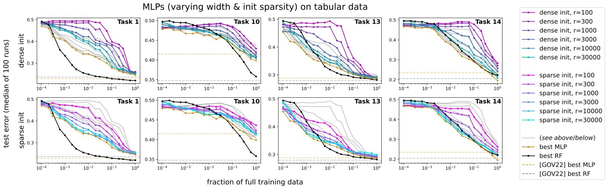
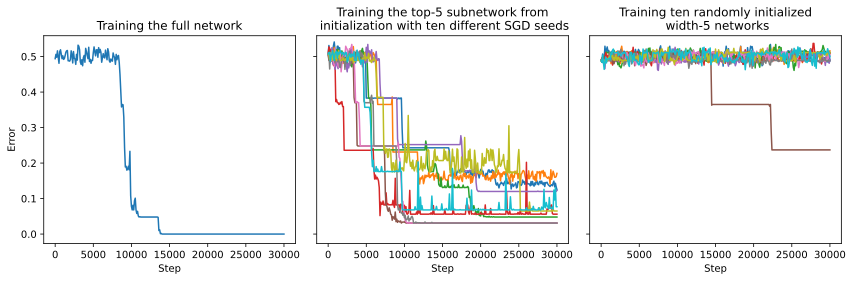

# Edelman, Goel, Kakade, Malach & Zhang 2023 — Pareto Frontiers in Neural Feature Learning: Data, Compute, Width, and Luck

See also: [the global concept index](../../concepts/index.md).

**Benjamin L. Edelman** (Harvard), **Surbhi Goel** (University of Pennsylvania), **Sham Kakade** (Harvard), **Eran Malach** (the Hebrew University of Jerusalem), **Cyril Zhang** (Microsoft Research NYC).

arXiv [2309.03800](https://arxiv.org/abs/2309.03800), September 2023, version v2 (October 2023), NeurIPS 2023, 38 pages, 6 figures (9 panels), 2 tables. Citations by Semantic Scholar — 14, in the corpus — 1. A direct continuation of Barak et al. 2022 "Hidden Progress" by the same team (five authors out of six): offline sparse parity is analysed as a **provable multi-resource trade-off frontier** — learning succeeds if the learner is sufficiently rich (width), knowledgeable (data), patient (time) or lucky (restarts) — and the width takes on the role of a parallel search for "lottery tickets". Grokking here is an observation at the edge of that frontier: at the lower bound of the workable sample sizes the optimisation requires a considerably larger number of steps.

The files of this paper's analysis:

- [`2309.03800.pareto-frontiers-in-neural-feature-learning-data-compute-width-and-luck.license.txt`](2309.03800.pareto-frontiers-in-neural-feature-learning-data-compute-width-and-luck.license.txt) — the arXiv licence record for this paper.

The anchor scheme and the rules for linking into a card are in the [README of the papers folder](../README.md).

**Excerpt card.** The paper's licence (`arxiv-nonexclusive`) does not permit republishing the paper itself; what stands here are the editorial sections and the fragments the corpus quotes (right of quotation). The paper: <https://arxiv.org/abs/2309.03800>.

## Concepts covered

**[Sparse parity](../../concepts/sparse-parity.md)** — the carrier of the whole work: offline $(n,k)$-parity as a problem that is statistically easy ($\Theta(k\log n)$ examples) and computationally hard ($n^{\Omega(k)}$), and "maximally hard" in the strict sense at that — its SQ dimension equals the number of hypotheses ([`p4-1`](#p4-1), [`p4-3`](#p4-3), [`p10-1`](#p10-1)). The classical statistical-query lower bound is read not as a prohibition but as a frontier trading four resources ([`p5-2`](#p5-2)).

**[Grokking](../../concepts/grokking.md)** — the paper gives the corpus its most coherent attachment of the phenomenon to a **proved** limit: since $m\approx 1/\tau^{2}$, the success condition requires $rT/(\tau^{2}\delta)>\binom{n}{k}/2$, and as $m$ falls the time $T$ must grow ([`p5-10`](#p5-10)). Experimentally the "data against time" trade is localised "in the grokking regime (at the edge of feasibility)" ([`fig-2`](#fig-2), [`p9-1`](#p9-1)): grokking here is not a property of the task in general but a **boundary** phenomenon of the resource frontier. The definition itself is taken over from elsewhere — "an abrupt and delayed generalisation caused by the dynamics of the optimisation" ([`p2-3`](#p2-3)).

**[Critical dataset size](../../concepts/data-fraction-critical-dataset-size.md)** — the "smallest workable $m$" acquires the sense of an edge of the resource frontier, below which a proved lower bound lies; it is meanwhile admitted outright that neither the theory nor the experiment has the resolution to predict how it depends on $n,k,r$ ([`p33-3`](#p33-3)).

**[Double descent](../../concepts/double-descent.md)** — a "sample-wise double descent" is recorded on the same runs as the grokking: as $m$ grows the network enters a first region of success and leaves it, and at large $m$ the success returns; the authors do not undertake to explain it ([`p9-1`](#p9-1), [`p33-3`](#p33-3)). An attachment useful to the corpus: both phenomena are neighbours on the same axis $m$.

**[The sparse subnetwork and the lottery ticket](../../concepts/sparse-subnetwork-lottery-ticket.md)** — the central mechanism: each neuron has its own sample complexity by the Fourier gap at initialisation, the network works as an ensemble, and the overall complexity is set by the "lucky tickets" ([`p2-2`](#p2-2), [`p7-6`](#p7-6)). A direct check in the style of Frankle & Carbin: a pruning down to the five best neurons with the weights rolled back to the initialisation learns quickly, while random subnetworks of the same size do not ([`p33-4`](#p33-4), [`fig-5`](#fig-5)).

**[The neural tangent kernel](../../concepts/neural-tangent-kernel-ntk.md)** — the claimed contrast: in the NTK regime over-parametrisation **removes** the data-dependent selection of features, whereas here it parallelises it; no fixed kernel solves $(n,k)$-parity without $\Omega(n^{k})$ examples ([`p6-6`](#p6-6), [`p2-2`](#p2-2)).

**[The emergence of features](../../concepts/feature-emergence-feature-learning.md)** — the upper bounds (Theorems 4 and 5) give a family of provable mechanisms of feature selection: an over-sparse start with an end-to-end guarantee, and an under-sparse one in which, after a single gradient step, a subnetwork computing the parity exists ([`p7-5`](#p7-5), [`p8-1`](#p8-1)). The width is monotonically useful in all the settings of the grid — directly against the estimates of uniform convergence ([`p9-1`](#p9-1)).

**[Weight decay](../../concepts/weight-decay.md)** — in the theorems the $\ell_{2}$ regularisation is a working instrument of the proofs (the cutting off of bad neurons); in the experiments $\lambda=0.01$ is fixed across the whole grid, and it is reported at the same time that the positions of the double-descent transitions are sensitive to the weight decay ([`p33-3`](#p33-3)).

## What is shown and what is conjectured

These are the card editor's remarks, not the authors' text, drawn from a numbered pass over the paper's claims.

**Exactly two trades are proved, and neither of them is "data against time".** The lower bound (Proposition 3) ties four resources ($r$, $T$, $\tau$, $\delta$) as a necessary condition; the upper bounds (Theorems 4 and 5) trade **data against width** through the single sparsity parameter $s$ of the initialisation. The "data against time" trade for which the paper is most often cited is an experimental observation of the median time to a threshold, with no demonstrative part behind it: the time in the theorems is either $O(1/\epsilon^{2})$ or a single step.

**The strong places.** The frontier of success at $m\ll n^{k}$ lies far outside the online regime of Barak et al. 2022, and is secured precisely by the width; the width is monotonically useful in **all** the settings of the grid (about $2\times10^{5}$ runs, 50 per point); Theorem 4 reproduces the result of Barak et al. as an extreme point of a one-parameter family — a rare case in which an earlier result becomes a particular case of a new one.

**Caveats to the experimental part.** The experiments barely intersect the conditions of the theorems: in the grid $s=2$ is the under-sparse case, covered only by Theorem 5, which requires even $k$ and $s$ (so that $k=3$ falls outside the analysis) and guarantees that a subnetwork exists rather than that the training will single it out. Success is censored by the threshold $T=10^{5}$: a run that would have grokked later is counted as a failure, and part of the non-monotonicity in $m$ may be a consequence of the cut-off — the authors do not discuss this. The hyperparameters are tuned at a single point of the grid and then fixed; there are no sweeps over $\lambda$. The gap between the training and the test curves — the thing that distinguishes grokking from a long plateau — is not measured off quantitatively in any experiment. The lottery-ticket experiment is set up in a single online setting. The best sparsity $s=2$ is admitted to be not understood ("we do not fully understand why this is the case").

**The tabular part is preliminary — by the authors' own admission.** On the full data the best MLP beats the random forest in about half of the 16 tasks, and on 1 % of the data in only two; it is precisely in the low-data region for whose sake the theory was built that the gap with the trees is not closed. The "best MLP" is a maximum over the whole architecture search space.

**Internal roughness.** One and the same statement is called now "Theorem 3" (the introduction, §3.1, §4.2), now "Proposition 3" (the statement and the proof). The dense initialisation has no theorems at all: the carry-over to it of the principle "a parallel search with a random per-subnetwork complexity" is declared an article of faith supported by the experiment.

**How the work will be cited** ("a trade of data against time at grokking is proved") — more precisely: what is proved is an SQ barrier tying $r,T,\tau,\delta$, and a data–width trade; the data–time trade is an experimental observation on a grid $n\le300$, $k\in\lbrace3,4\rbrace$ at fixed $\eta,\lambda,B$ and a cut-off $T=10^{5}$.

---

# Quoted fragments

Only the fragments the corpus cards refer to are
reproduced here (right of quotation); the paper's licence does not permit
republishing the whole text. Anchor numbering matches the original.

###### p2-2

Intuitively, this analysis reveals a feature learning mechanism by which overparameterization (i.e. large network width) plays a role of parallel search over randomized subnetworks. Each individual hidden-layer neuron has its own sample complexity for identifying the relevant coordinates, based on its *Fourier gap* (Barak et al., 2022) at initialization. Trained with parallel gradient updates, the full network implicitly acts as an ensemble model over these neurons, whose overall sample complexity is determined by the “winning lottery tickets” (Frankle and Carbin, 2018) (i.e. the lucky neurons initialized to have the lowest sample complexity). This departs significantly from the *neural tangent kernel* (Jacot et al., 2018) regime of function approximation with wide networks, in which overparameterization *removes* data-dependent feature selection (rather than parallelizing it across subnetworks).

###### p2-3

We corroborate the theoretical analysis with a systematic empirical study of offline sparse parity learning using SGD on MLPs, demonstrating some of the (perhaps) counterintuitive effects of width, data, and initialization. For example, Figure 1 highlights our empirical investigation into the interactions between data, width, and success probability. The left figure shows the fractions of successful training runs as a function of dataset size (x-axis) and width (y-axis). Roughly, we see a “success frontier”, where having a larger width can be traded off with smaller sample sizes. The right figure depicts some training curves (for various widths and sample sizes). Grokking (Power et al., 2022; Liu et al., 2022) (discontinuous and delayed generalization behavior induced by optimization dynamics) is evident in some of these figures.

###### p4-1

A light bulb is controlled by $k$ out of $n$ binary switches; each of the $k$ influential switches can toggle the light bulb’s state from any configuration. The task in parity learning is to identify the subset of $k$ important switches, given access to $m$ i.i.d. uniform samples of the state of all $n$ switches. Formally, for any $1\leq k\leq n$ and $S\subseteq[n]$ such that $|S|=k$, the parity function $\chi_{S}:\{\pm 1\}^{n}\rightarrow\pm 1$ is defined as $\chi_{S}(x_{1:n}):=\prod_{i\in S}x_{i}$.11 1 Equivalently, parity can be represented as a function of a bit string $b\in\{0,1\}^{n}$, which computes the XOR of the influential subset of indices $S$: $\chi_{S}(b_{1:n}):=\oplus_{i\in S}b_{i}$. The $(n,k)$-parity learning problem is to identify $S$ from samples $(x\sim\mathrm{Unif}(\{\pm 1\}^{n},y=\chi_{S}(x)))$; i.e. output a classifier with $100$% accuracy on this distribution, without prior knowledge of $S$.

This problem has a rich history in theoretical computer science, information theory, and cryptography. There are several pertinent ways to think about the fundamental role of parity learning:

###### p4-3

1. **Monomial basis elements:** A $k$-sparse parity is a degree-$k$ monomial, and thus the analogue of a Fourier coefficient with “frequency” $k$ in the harmonic analysis of Boolean functions (O’Donnell, 2014). Parities form an important basis for polynomial learning algorithms (e.g. Andoni et al., 2014).
2. **Computational hardness:** There is a widely conjectured *computational-statistical gap* for this problem (Applebaum et al., 2009; Applebaum et al., 2010), which has been proven in restricted models such as SQ (Kearns, 1998) and streaming (Kol et al., 2017) algorithms. The statistical limit is $\Theta(\log(\text{number of possibilities for }S))=\Theta(k\log n)$ samples, but the amount of computation needed (for an algorithm that can tolerate an $O(1)$ fraction of noise) is believed to scale as $\Omega(n^{ck})$ for some constant $c>0$ – i.e., there is no significant improvement over trying all subsets.
3. **Feature learning:** This setting captures the learning of a concept which depends jointly on multiple attributes of the inputs, where the lower-order interactions (i.e. correlations with degree-$k^{\prime}<k$ parities) give no information about $S$. Intuitively, samples from the sparse parity distribution look like random noise until the learner has identified the sparse interaction. This notion of feature learning complexity is also captured by the more general *information exponent* (Ben Arous et al., 2021).

###### p5-2

We show a version of the SQ lower bound in this section. Assume we optimize some model $h_{\theta}$, where $\theta\in{\mathbb{R}}^{r}$ (i.e., $r$ parameters). Let $\ell$ be some loss function satisfying: $\ell^{\prime}(\hat{y},y)=-y+\ell_{0}(\hat{y})$; for example, one can choose $\ell_{2}(\hat{y},y)=\frac{1}{2}(y-\hat{y})^{2}$. Fix some hypothesis $h$, target $f$, a sample ${\cal S}\subseteq\{\pm 1\}^{n}$ and distribution ${\cal D}$ over $\{\pm 1\}^{n}$. We denote the empirical loss by $L_{\cal S}(h,f)=\frac{1}{\left\lvert{\cal S}\right\rvert}\sum_{{\mathbf{x}}\in{\cal S}}\ell(h({\mathbf{x}}),f({\mathbf{x}}))$ and the population loss by $L_{\cal D}(h,f):=\mathbb{E}_{{\mathbf{x}}\sim{\cal D}}\left[\ell(h({\mathbf{x}}),f({\mathbf{x}}))\right]$. We consider SGD updates of the form:

$$
\theta_{t+1}=\theta_{t}-\eta_{t}\left(\nabla_{\theta}\left(L_{{\cal S}_{t}}(h_{\theta_{t}},f)+R(\theta_{t})\right)+\xi_{t}\right),
$$

for some sample ${\cal S}_{t}$, step size $\eta_{t}$, regularizer $R(\cdot)$, and adversarial noise $\xi_{t}\in[-\tau,\tau]^{r}$. For normalization, we assume that $\left\lVert\nabla h_{\theta}({\mathbf{x}})\right\rVert_{\infty}\leq 1$ for all $\theta$ and ${\mathbf{x}}\in{\cal X}$.

Denote by $\mathbf{0}$ the constant function, mapping all inputs to $0$. Let $\theta^{\star}_{t}$ be the following trajectory of SGD that is independent of the target. Define $\theta^{\star}_{t}$ recursively s.t. $\theta^{\star}_{0}=\theta_{0}$ and

$$
\theta^{\star}_{t+1}=\theta^{\star}_{t}-\eta_{t}\nabla_{\theta}\left(L_{\cal D}(h_{\theta^{\star}_{t}},\mathbf{0})+R(\theta^{\star}_{t})\right)
$$

###### p5-10

*Assume that $\theta_{0}$ is randomly drawn from some distribution. For every $r,T,\delta,\tau>0$, if $\frac{rT}{\tau^{2}\delta}\leq\frac{1}{2}\binom{n}{k}$, then there exists some $(n,k)$-parity s.t. with probability at least $1-\delta$ over the choice of $\theta_{0}$, the first $T$ iterates of SGD are statistically independent of the target function.*

**[p. 6]**

The proof follows standard SQ lower bound arguments (Kearns, 1998; Feldman, 2008), and for completeness is given in Appendix B. The core idea of the proof is the observation that any gradient step has very little correlation (roughly $n^{-k}$) with most sparse-parity functions, and so there exists a parity function that has small correlation with all steps. In this case, the noise can force the gradient iterates to follow the trajectory $\theta^{\star}_{1},\dots,\theta^{\star}_{T}$, which is independent of the true target. We note that, while the focus of this paper is on sparse parities, similar analysis applies for a broader class of functions that are characterized by large SQ dimension (see Blum et al., 1994).

Observe that there are various ways for an algorithm to escape the lower bound of Theorem 3. We can scale a single resource with $\binom{n}{k}$, keeping the rest small, e.g. by training a network of size $n^{k}$, or using a sample size of size $n^{k}$. Crucially, we note the possibility of *interpolating* between these extremes: one can spread this homogenized “cost” across multiple resources, by (e.g.) training a network of size $n^{k/2}$ using $n^{k/2}$ samples. In the next section, we show how neural networks can be tailored to solve the task in these interpolated resource scaling regimes.

###### p6-6

When neural networks trained with gradient descent stay close to their initial weights, optimization behaves like kernel regression on the neural tangent kernel (Jacot et al., 2018; Du et al., 2018): the resulting function is approximately of the form ${\mathbf{x}}\mapsto\left\langle\psi({\mathbf{x}}),{\mathbf{w}}\right\rangle$, where $\psi$ is a *data-independent* infinite-dimensional embedding of the input, and ${\mathbf{w}}$ is some weighting of the features. However, it has been shown that the NTK (more generally, any fixed kernel) cannot achieve low $\ell_{2}$ error on the $(n,k)$-parity problem, unless the sample complexity grows as $\Omega(n^{k})$ (see Kamath et al., 2020). Thus, no matter how we scale the network size or training time, neural networks trained in the NTK regime cannot learn parities with low sample complexity, and thus do not enjoy the flexibility of resource allocation discussed above.

###### p7-5

Intuitively, by varying the sparsity parameter in Theorem 4, we obtain a family of algorithms which smoothly interpolate between the *small-data/large-width* and *large-data/small-width* regimes of tractability. First, consider a sparsity level linear in $n$ (i.e. $s=\alpha\cdot n$). In this case, a small network (with width $r$ independent of the input dimension) is sufficient for solving the problem, but the sample size must be large ($\Omega(n^{k+1})$) for successful learning; this recovers the result of Barak et al., 2022. At the other extreme, if the sparsity is independent of $n$, the sample complexity grows only as $O(n^{2}\log n)$44 4 We note that the additional $n^{2}$ factor in the sample complexity can be removed if we apply gradient truncation, thus allowing only a logarithmic dependence on $n$ in the small-sample case., but the requisite width becomes $\Omega(n^{k})$.

###### p7-6

*Proof sketch.* The proof of Theorem 4 relies on establishing a Fourier anti-concentration condition, separating the relevant (i.e. indices in $S$) and irrelevant weights in the initial population gradient, similarly as the main result in Barak et al., 2022. When we initialize an $s$-sparse neuron, there is a probability of $\gtrsim(s/n)^{k}$ that the subset of activated weights contains the “correct” subset $S$. In this case, to detect the subset $S$ via the Fourier gap, it is sufficient to observe $s^{k-1}$ examples instead of $n^{k-1}$. Initializing the neurons more sparsely makes it less probable to draw a *lucky* neuron, but once we draw a lucky neuron, it requires fewer samples to find the right features. Thus, increasing the width reduces overall sample complexity, by sampling a large number of “lottery tickets”.

###### p8-1

*For even $k,s$, sparsity level $s<k$, network width $r=O((n/k)^{s})$, and $\varepsilon$-perturbed55 5 For ease of analysis, we use a close variant of the sparse initialization scheme: $s$ coordinates out of the $n$ coordinates are chosen randomly and set to 1, and the rest of the coordinates are set to $\epsilon<(n-s)^{-1}$. Without the small norm dense component in the initialization, the population gradient will be 0 at initialization. $s$-sparse random initialization scheme s.t. for every $(n,k)$-parity distribution ${\cal D}$, with probability at least $0.99$ over the choice of sample and initialization after one step of batch gradient descent (with gradient clipping) with sample size $m=O((n/k)^{k-s-1})$ and appropriate learning rate, there is a subnetwork in the ReLU MLP that approximately computes the parity function.*

Here, the sample complexity can be improved by a factor of $n^{s}$, at the cost of requiring the width to be $n^{s}$ times larger. The proof of Theorem 5 relies on a novel analysis of improved Fourier gaps with “partial progress”: intuitively, if a neuron is randomly initialized with a subset of the relevant indices $S$, it only needs to identify $k-s$ more coordinates, inheriting the improved sample complexity for the $(n-s,k-s)$-parity problem. Note that the probability of finding such a lucky neuron scales as $(n/k)^{-s}$, which governs how wide (number of lottery tickets) the network needs to be.

###### fig-2

*Figure 2: Zoomed-in views of the interactions between width, data, time, and luck. *Left:* Locations of these runs in the larger parameter space. *Center:* Success probability vs. dataset size. In accordance with our theory, **width buys luck, and improves end-to-end sample efficiency**, despite increasing the network’s capacity. *Right:* Number of iterations to convergence vs. dataset size. We observe a **data vs. time tradeoff** in the grokking regime (at the edge of feasibility), as well as a **“sample-wise double descent”** performance drop with more data (which can also be seen in Figure 1, and disappears with larger widths). Comparing dense vs. sparse initializations (upper vs. lower plots; sparse inits are colored more brightly), we see computational and statistical benefits of the sparse initialization scheme from Section 3.2.1.* **[p. 9]**

On various instances of the $(n,k)$-sparse parity learning problem, we train a 2-layer MLP with identical hyperparameters, varying the network width $r\in\{10,30,100,\ldots,10^{5}\}$ and the dataset size $m\in\{100,200,300,600,1000,\ldots,10^{6}\}$. Alongside standard algorithmic choices, we consider one non-standard augmentation of SGD: the *under-sparse* initialization scheme from Section 3.2.1; we have proven that these give rise to “lottery ticket” neurons which learn the influential coordinates more sample-efficiently. **[p. 9]** Figure 1 (in the introduction) and Figure 2 illustrate our findings at a high level; details and additional discussion are in Appendix C.1). We list our key findings below:

###### p9-1

1. **A “success frontier”: large width can compensate for small datasets.** We observe convergence and perfect generalization when $m\ll n^{k}$. In such regimes, which are far outside the online setting considered by Barak et al., 2022, high-probability sample-efficient learning is enabled by large width. This can be seen in Figure 1 (left), and analogous plots in Appendix C.1.
2. **Width is monotonically beneficial, and buys data, time, and luck.** In this setting, increasing the model size yields exclusively positive effects on success probability, sample efficiency, and the number of serial steps to convergence (see Figure 2). This is a striking example where end-to-end generalization behavior runs *opposite* to uniform convergence-based upper bounds, which predict that enlarging the model’s capacity *worsens* generalization.
3. **Sparse axis-aligned initialization buys data, time, and luck.** Used in conjunction with a wide network, we observe that a sparse, axis-aligned initialization scheme yields strong improvements on all of these axes; see Figure 2 (bottom row). In smaller hyperparameter sweeps, we find that $s=2$ (i.e. initialize every hidden-layer neuron with a random $2$-hot weight vector) works best.
4. **Intriguing effects of dataset size.** As we vary the sample size $m$, we note two interesting phenomena; see Figure 2 (right). The first is grokking (Power et al., 2022), which has been previously documented in this setting (Barak et al., 2022; Merrill et al., 2023). This entails a *data vs. time* tradeoff: for small $m$ where learning is marginally feasible, optimization requires significantly more training iterations $T$. Our second observation is a “sample-wise double descent” (Nakkiran et al., 2021): success probability and convergence times can worsen with *increasing* data. Both of these effects are also evident in Figure 1).

###### p10-1

Sparse parity learning is a toy problem, in that it is defined by an idealized distribution, averting the ambiguities inherent in reasoning about real-life datasets. However, due to its provable hardness (Theorem 3, as well as the discussion in Section 2.1), it is a *maximally hard* toy problem in a rigorous sense66 6 Namely, its SQ dimension is equal to the number of hypotheses, which is what leads to Theorem 3.. In this section, we perform a preliminary investigation of how the empirical and algorithmic insights gleaned from Section 4.1 can be transferred to more realistic learning scenarios.

To this end, we use the benchmark assembled by Grinsztajn et al., 2022, a work which specifically investigates the performance gap between neural networks and tree-based classifiers (e.g. random forests, gradient-boosted trees), and includes a standardized suite of 16 classification benchmarks with numerical input features. The authors identify three common aspects of tabular77 7 “Tabular data” refers to the catch-all term for data sources where each coordinate has a distinct semantic meaning which is consistent across points. tasks which present difficulties for neural networks, especially vanilla MLPs:

- **The feature spaces are not rotationally invariant.** In state-of-the-art deep learning, MLPs are often tasked with function representation in rotation-invariant domains (token embedding spaces, convolutional channels, etc.).
- **Many of the features are uninformative.** In order to generalize effectively, especially from a limited amount of data, it is essential to avoid overfitting to these features.
- **There are meaningful high-frequency/non-smooth patterns in the target function.** Combined with property (i), decision tree-based methods (which typically split on axis-aligned features) can appear to have the ideal inductive bias for tabular modalities of data.

*Figure 3: Analogous investigation of MLP width $r$ and sparse initialization for real-world tabular datasets (OpenML benchmarks assembled by Grinsztajn et al., 2022), varying the dataset size $m$ via downsampling. Large width and sparse initialization tend to improve generalization, in accordance with the theory and experiments for synthetic parity tasks. In some settings, our best MLPs outperform tuned random forests. Dotted lines denote the test errors reported by Grinsztajn et al., 2022 of tuned MLPs and RFs on the full datasets. Full results on all 16 tasks are in Appendix C.3.* **[p. 10]**

**[p. 11]**

Noting that the sparse parity task possesses all three of the above qualities, we conduct a preliminary investigation on whether our empirical findings in the synthetic case carry over to natural tabular data. In order to study the impact of algorithmic choices (mainly width and sparse initialization) on sample efficiency, we create low-data problem instances by subsampling varying fractions of each dataset for training. Figure 3 provides a selection of our results. We note the following empirical findings, which are the tabular data counterparts of results (2) and (3) in Section 4.1:

- **Wide networks generalize on small tabular datasets.** Like in the synthetic experiments, width yields nearly monotonic end-to-end benefits for learning. This suggests that the “parallel search + pruning” mechanisms analyzed in our paper are also at play in these settings. In some (but not all) cases, these MLPs perform competitively with tuned tree-based classifiers.
- **Sparse axis-aligned initialization sometimes improves end-to-end performance.** This effect is especially pronounced on datasets which are downsampled to be orders of magnitude smaller. We believe that this class of drop-in replacements for standard initialization merits further investigation, and may contribute to closing the remaining performance gap between deep learning and tree ensembles on small tabular datasets.

###### p33-3

1. **A “success frontier”: large width can compensate for small datasets.** We observe convergence and perfect generalization when $m\ll n^{k}$. In such regimes, which are far outside the online setting considered by Barak et al., 2022, high-probability sample-efficient learning is enabled by large width. Note that neither our theoretical or empirical results have sufficient granularity to predict or measure the precise way the smallest feasible sample size $m$ scales with the other size parameters (like $n,k,r$). The theoretical upper bounds show that if $r=\Omega(n^{k})$, idealized algorithms (modified for tractability of analysis) can obtain $O(\mathrm{poly}(n))$ or even $O(\log(n))$ sample complexity, and smaller $r$ can yield milder reductions of the exponent.
2. **Width is monotonically beneficial, and buys data, time, and luck.** Despite the capacity of wider neural networks to overfit larger datasets, we find that there are *monotonic sample-efficiency benefits* to increasing network width, in *all* of the hyperparameter settings considered in the grid sweep. This can be quickly quantitatively confirmed by starting at any point in Figure 4, and noting that success probabilities only increase99 9 Small exceptions (such as $98\%\rightarrow 96\%$ for $n=100,k=4,m=2000$) are all within the standard error margins of Bernoulli confidence intervals. going upwards (increasing $r$, keeping all other parameters equal). Along some of these vertical slices, we observe that transitions from $0\%$ to $100\%$ are present: at these corresponding dataset sizes $m$, *large width makes sample-efficient learning possible*. Figure 2 (center) shows this in greater detail, by choosing a denser grid of sample sizes $m$ near the empirical statistical limit.
3. **Sparse axis-aligned initialization buys data, time, and luck.** Used in conjunction with a wide network, we observe that a sparse, axis-aligned initialization scheme yields strong improvements on all of these axes. This can be seen by comparing the pairs of subplots in columns 1 vs. 3 and 2 vs. 4 in Figure 4. We found that $s=2$ (i.e. initialize every hidden-layer neuron with a random $2$-hot weight vector) works best for the settings considered in this study.
4. **Intriguing effects of dataset size.** Unlike the monotonicity along vertical slices in Figure 4, some of the *horizontal* slices exhibit non-monotonic success probabilities. Namely, as $m$ increases, keeping all else the same, the network enters and exits a first feasible regime; then, at large enough sample sizes (including the online setting), learning is observed to succeed again. Sparse initialization reduces this counterintuitive behavior, but not entirely (see, e.g., the $n=200,k=3$ cell). We do not attempt to explain this phenomenon; however, we found in preliminary investigations that the locations of the transitions are sensitive to the choice of weight decay hyperparameter. Figure 2 (right) shows this in greater detail, plotting median convergence times (as defined above) instead of success probabilities.

###### p33-4

Our theoretical analysis of sparse networks and experimental findings suggest that width provides a form of parallelization: wider networks have a higher probability of containing lucky neurons which have sufficient Fourier gaps at initialization to learn from the dataset. In Figure 5 we perform an experiment in the style of Frankle and Carbin, 2018, showing that indeed the neurons which end up being important in a wide sparsely-initialized network form an unusually lucky ‘winning ticket’ subnetwork. When we rewind the weights of this subnetwork to initialization, its test error starts out poor, but when we train just this subnetwork from initialization its performance quickly improves, unlike the large majority of randomly initialized subnetworks of the same size. For this experiment, batch size=32 and learning rate=0.1.

###### fig-5

*Figure 5: (Lottery tickets) Left: Training a width-100 MLP on the (n=50, k=5)-online sparse parity task, where each hidden neuron initialized with 2 non-zero incoming weights. Center: We prune all but the top 5 neurons by weight norm at the end of training; rewind weights to the original initialization, and retrain with various SGD random seeds. Right: The same as Center, but the weights are randomly reinitialized in each run.* **[p. 34]**
