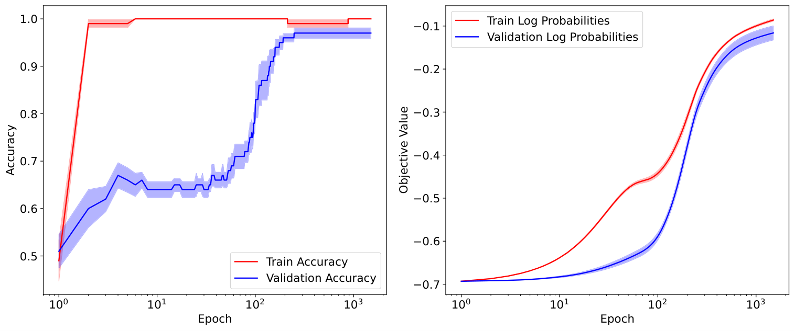
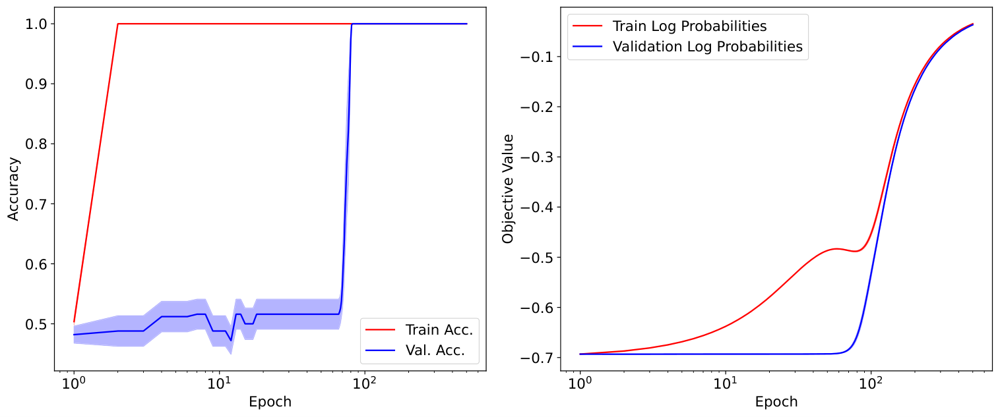
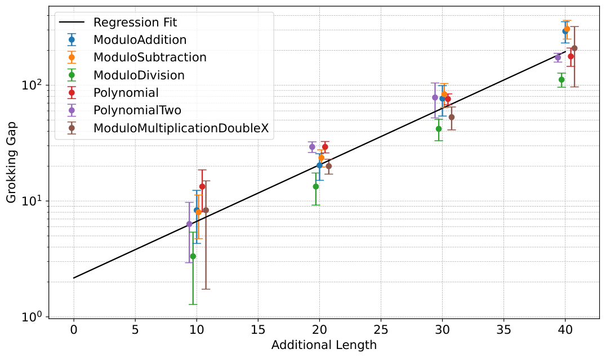
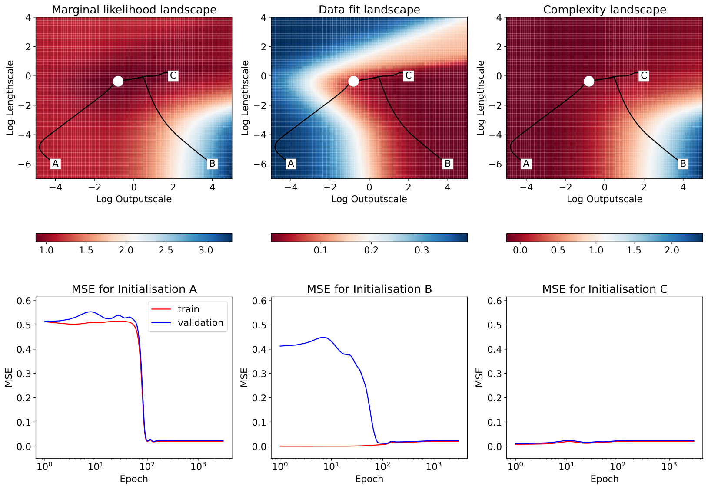
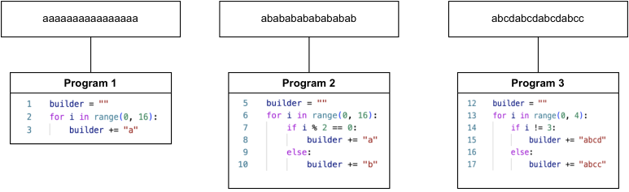
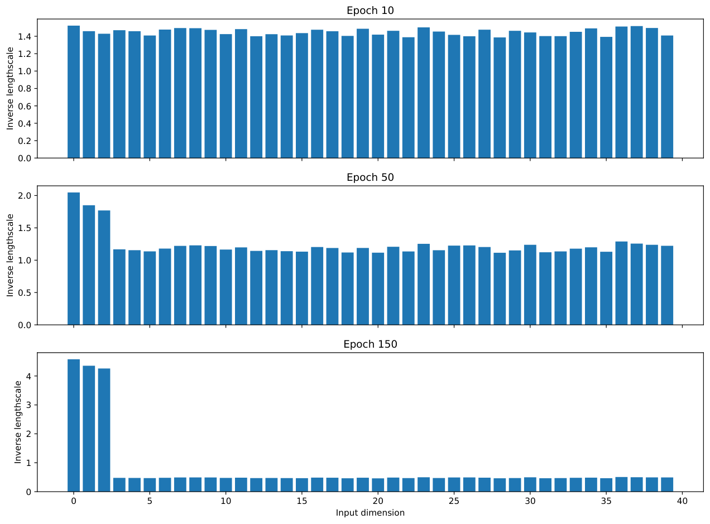

# Miller, O'Neill, Bui 2024 — Grokking Beyond Neural Networks: An Empirical Exploration with Model Complexity

See also: [the global concept index](../../concepts/index.md).

**Jack Miller**, **Charles O'Neill**, **Thang Bui** (Australian National University).

arXiv [2310.17247](https://arxiv.org/abs/2310.17247), October 2023, version v2 (TMLR, 2024). There is no citation count for it in the corpus table. The work is in the corpus as one widening the scope of the phenomenon: grokking is shown outside neural networks — in Gaussian processes, linear regression and Bayesian networks. The source is the LaTeX e-print of version v2: the native arXiv HTML delivers 16 of the 22 figures empty (`ltx_missing_image`), and ar5iv rendered only v1 (15 figures instead of 22).

The files of this paper's analysis:

- [`2310.17247.grokking-beyond-neural-networks-an-empirical-exploration-with-model-complexity.license.txt`](2310.17247.grokking-beyond-neural-networks-an-empirical-exploration-with-model-complexity.license.txt) — the arXiv licence record for this paper.

The anchor scheme and the rules for linking into a card are in the [README of the papers folder](../README.md).

**Excerpt card.** The paper's licence (`arxiv-nonexclusive`) does not permit republishing the paper itself; what stands here are the editorial sections and the fragments the corpus quotes (right of quotation). The paper: <https://arxiv.org/abs/2310.17247>.

## Concepts covered

**[Grokking](../../concepts/grokking.md)** — the work widens the notion itself. The definition is given through the gap $\Delta_{k} = |E_2-E_1|$ between the epoch at which the training error becomes small and the epoch at which the validation error does; the abruptness of the transition is declared inessential ([`p2-4`](#p2-4)). And then it turns out that grokking arises in Gaussian-process classification, in Gaussian-process regression, in linear regression and in a Bayesian neural network ([`p1-1`](#p1-1)).

**[Kolmogorov complexity](../../concepts/kolmogorov-complexity.md)** — the conceptual support of the whole work. Three measures of complexity are examined: the uncomputable Kolmogorov one, its approximation through entropy, and the description length of the model ([`p2-3`](#p2-3)). It matters that under an assumption of normally distributed weights the approximate Kolmogorov complexity is proportional to the square of the weights, that is, reduces to ordinary weight decay ([`p16-2`](#p16-2) and appendix B.1).

**[The sparse subnetwork](../../concepts/sparse-subnetwork-lottery-ticket.md)** — the mechanism is formulated in terms of the reachability of regions of weight space: a low error at a high complexity (LEHC) is reachable from an ordinary initialisation, a low error at a low complexity (LELC) is not; and the regularisation slowly leads from the first to the second ([`p9-5`](#p9-5)). A direct correspondence: the competition of dense and sparse subnetworks in Merrill et al. is read as a transition LEHC → LELC ([`p10-2`](#p10-2)).

**[The basins of the loss landscape](../../concepts/loss-landscape-basins.md)** — the work's most vivid experiment. A Gaussian process has only two hyperparameters, so the "error — complexity" landscape is visible in its entirety, and of three initialisations only one gives grokking — the one that begins in the LEHC region ([`p8-1`](#p8-1), [`fig-5`](#fig-5)). It is said in passing that the spherical Goldilocks zone of the theory of Liu et al. is not visible here: the loss surface is more complicated.

**[The Goldilocks zone](../../concepts/goldilocks-zone.md)** — the theory of Liu et al. is not rejected but absorbed: the weight norm is a measure of description length, and hence the Goldilocks zone is the LELC region and the overfitted solutions are LEHC ([`p3-1`](#p3-1) and appendix G).

**[Weight decay](../../concepts/weight-decay.md)** — the necessity of the regularisation is checked by ablation. Removing the weight penalty from the linear model, the authors see no grokking even after a million epochs ([`p5-3`](#p5-3)); removing the complexity term from the variational bound of the Gaussian process gives the same ([`p5-8`](#p5-8)). For the work this is the key: their mechanism requires a complexity penalty, and they show where without it there is no grokking.

**[Critical dataset size](../../concepts/data-fraction-critical-dataset-size.md)** — a **concealment** device is proposed: random binary digits $v_0 \ldots v_l$ are appended to an example, and the grokking gap grows with their number ([`p6-2`](#p6-2)). The dependence is checked on 6 algorithmic datasets and, by a fit in logarithmic space, is exponential: a Pearson correlation of $0.92$ over the pooled data at $p = 1.46\cdot 10^{-37}$ ([`p7-1`](#p7-1), [`tab-2`](#tab-2)).

**[Double descent](../../concepts/double-descent.md)** — the work gathers the competing explanations into one frame: the theories through the loss, through representations and through the LMN are read as particular cases of the LEHC → LELC transition ([`p10-1`](#p10-1), [`p10-2`](#p10-2)).

**[Structured representation learning](../../concepts/structured-representation-learning.md)** — the same holds for the representational theories: if the parsimony rule holds, then a more general representation is simpler by a suitable measure of complexity, and hence "the emergence of a general circuit after a memorising one" is a transition from LEHC into LELC ([`p10-2`](#p10-2)).

**[Initialisation scale](../../concepts/initialization-scale.md)** — the initialisation here is not a trifle but a control knob. For the linear regression the grokking required a particular initial weight vector, strongly biased against the first dimension ([`p5-1`](#p5-1)); in the Bayesian network the grokking gap grows with the deviation used to set the variational mean ([`p8-4`](#p8-4)); and in the Gaussian process the choice among three initial regions decides whether there will be grokking at all ([`p8-1`](#p8-1)).

**[Progress measures](../../concepts/progress-measures.md)** — the observables taken are not accuracies but the two terms of the loss separately: the data fit and the complexity. It is precisely their divergence over the epochs that is declared the picture of grokking — first the error falls, then the complexity, and the grokking sets in where the complexity falls the most ([`p8-4`](#p8-4)).

**[The compression of representations](../../concepts/manifold-representation-compression.md)** — for a Gaussian process, "not noticing" the spurious dimensions means growing their length-scale: the inverse length-scale falls for the dimensions above the third and rises for the first three ([`p27-1`](#p27-1) and appendix J.1). This is the most direct measurement of how a model discards the spurious part of the input.

It is worth saying separately what the work does **not** contain. There is no theory — mechanism 1 is formulated in words, with no derivations and no numerical predictions. Nor is the setting general: the grokking in the linear regression is obtained with two training points, three spurious dimensions and a hand-picked initial weight vector ([`p4-4`](#p4-4)), and the authors admit it ([`p11-2`](#p11-2)). Finally, the complexity measure for the Gaussian process is admitted to be unreliable: under a variational inference the approximation and the hyperparameters are optimised at once, so the complexity at two points of the training is not necessarily comparable ([`p11-4`](#p11-4)).

Cards of corpus papers: [Power et al. 2022](../2201.02177.grokking-generalization-beyond-overfitting-on-small-algorithmic-datasets/2201.02177.grokking-generalization-beyond-overfitting-on-small-algorithmic-datasets.card.md) — the original phenomenon; [Liu et al. 2022](../2205.10343.towards-understanding-grokking-an-effective-theory-of-representation-learning/2205.10343.towards-understanding-grokking-an-effective-theory-of-representation-learning.card.md) and [Omnigrok](../2210.01117.omnigrok-grokking-beyond-algorithmic-data/2210.01117.omnigrok-grokking-beyond-algorithmic-data.card.md) — the Goldilocks zone and the explanation through the weight norm, absorbed here as a particular case; [Liu, Zhong, Tegmark 2023](../2310.05918.grokking-as-compression-a-nonlinear-complexity-perspective/2310.05918.grokking-as-compression-a-nonlinear-complexity-perspective.card.md) — grokking as compression and the LMN measure, the nearest work in spirit; [Nanda et al. 2023](../2301.05217.progress-measures-for-grokking-via-mechanistic-interpretability/2301.05217.progress-measures-for-grokking-via-mechanistic-interpretability.card.md) — the three eras and the cleanup of the memorising part; [Merrill et al. 2023](../2303.11873.a-tale-of-two-circuits-grokking-as-competition-of-sparse-and-dense-subnetworks/2303.11873.a-tale-of-two-circuits-grokking-as-competition-of-sparse-and-dense-subnetworks.card.md) — dense and sparse subnetworks, whence the concealment idea also comes; [Varma et al. 2023](../2309.02390.explaining-grokking-through-circuit-efficiency/2309.02390.explaining-grokking-through-circuit-efficiency.card.md) — circuit efficiency; [Davies et al. 2023](../2402.15175.unified-view-of-grokking-double-descent-and-emergent-abilities/2402.15175.unified-view-of-grokking-double-descent-and-emergent-abilities.card.md) — the unification of grokking with double descent; [Kumar et al. 2024](../2310.06110.grokking-as-the-transition-from-lazy-to-rich-training-dynamics/2310.06110.grokking-as-the-transition-from-lazy-to-rich-training-dynamics.card.md) — grokking with no explicit complexity penalty, a direct limitation on this work's claim.

**[The complexity–error trade-off](../../concepts/model-complexity-error-tradeoff.md)** — the work runs into the weak point of the frame and names it: there are many definitions of complexity, and they differ across classes of models ([`p2-3`](#p2-3)). Without a single measure the trade-off cannot be compared across settings.
## What is shown and what is conjectured

The card editor's remarks following the analysis of the claims (`…claims.txt`). The work appeared in TMLR; the authors are two students and a supervisor from the Australian National University.

**The main result is simple and checkable: grokking is not a neural-network phenomenon.** It is shown in Gaussian-process classification, in Gaussian-process regression, in linear regression and in a Bayesian neural network ([`p1-1`](#p1-1)). None of the theories available at the time — neither through circuits, nor through the lazy and rich regimes, nor through the NTK — could explain this, and the authors say so outright ([`p2-6`](#p2-6)).

**The choice of the Gaussian process as the object is a shrewd one.** It has only two hyperparameters, so the "error — complexity" landscape is drawn in full rather than projected ([`p7-3`](#p7-3)). Three initialisations give three outcomes, and grokking arises exactly where mechanism 1 predicts ([`p8-1`](#p8-1)).

**The concealment device is a contribution in its own right.** To the authors' knowledge it is the first data-augmentation technique that invariably produces grokking ([`p11-6`](#p11-6)). It is simple: append random digits to an example. The dependence of the gap on their number is checked on six datasets, and the correlations with significance levels are given ([`p7-1`](#p7-1)).

**The necessity of the regularisation is checked by ablation rather than declared.** Without a weight penalty the linear model does not grok even in a million epochs ([`p5-3`](#p5-3)); without a complexity term the Gaussian process does not grok either ([`p5-8`](#p5-8)). This is a case in which a condition of a theory is checked by violating it.

**The earlier theories are not rejected but absorbed.** The Goldilocks zone is read as the LELC region, the LMN as one of the complexity measures, and "the assembly of a circuit" as a transition from LEHC into LELC ([`p10-1`](#p10-1), [`p10-2`](#p10-2)). For the survey part of the corpus this is a useful frame, even if it predicts nothing itself.

**Mechanism 1, however, is not a theory.** It is stated in words: "if LEHC is reachable and LELC is not, and there is a path of non-increasing loss between them, then…" ([`p9-5`](#p9-5)). Neither a derivation, nor a number, nor a condition under which it could be refuted is given. It cannot be checked — a description can only be fitted to it.

**The parsimony rule is taken as an assumption rather than checked.** Assumption 1 states that minimum-complexity solutions generalise better ([`p9-3`](#p9-3)). It is plausible for algorithmic tasks, but the whole conclusion rests on it, and that very connection the work does not measure.

**The grokking in the linear regression is obtained by hand.** Two training points, three spurious dimensions, the form $[x_0, x_0^2, x_0^3, \sin(100x_0)]$ and an initial weight vector deliberately biased against the first dimension ([`p4-4`](#p4-4), [`p5-1`](#p5-1)). The authors answer this reproach wittily — under "ordinary" conditions there is no grokking either ([`p11-2`](#p11-2)) — but the claim that "grokking is possible in any model" rests in this part on a single tuned setting.

**The complexity measure for the Gaussian process is unreliable, and this is admitted.** Under a variational inference the variational approximation and the hyperparameters are optimised at once, so the KL divergence at two points of the training is not necessarily comparable ([`p11-4`](#p11-4)). Appendix O discusses this in detail and proposes workarounds (the entropy of the prior, a Laplace complexity term), but the experiments of the main text remain on the unreliable measure.

**The validation accuracy does not always reach 100 %.** In the linear model it does not always attain $100\%$ ([`p5-2`](#p5-2)), nor does the Gaussian process on the zero-and-one task ([`p5-6`](#p5-6)). By the authors' own definition this suffices, but when set against works in which grokking reaches $100\%$ the difference matters.

**The exponential relation between the gap and the dimension is a fit rather than a derivation.** The correlations are high, but the model $\delta = \exp(al+b)$ is chosen in advance rather than derived; and the conjecture about a connection with the exponential decay of the volume of a region in $n$ dimensions is called by the authors themselves only a supposition ([`p11-6`](#p11-6)).

**Its place in the corpus.** This is one of the few works widening the scope of the phenomenon beyond neural networks, and it should be cited precisely so. Three things are valuable: the demonstration of grokking in Gaussian processes and linear regression; the concealment device, which induces grokking predictably; and the frame "the reachability of LEHC against LELC", into which the earlier explanations fit. The price: the mechanism is named but not derived; the parsimony rule is taken as an assumption; the linear case is hand-tuned; and the complexity measure in the main Gaussian-process experiments is admitted by the authors themselves to be doubtful.

## Common misreadings and overstatements of this paper

Patterns of erroneous or over-extended citation of this work observed in the citing papers of the corpus. Each entry describes what exactly is distorted in the paraphrase and leads to the authors' own paragraphs, where the lost caveat stands. The analysis of particular formulations is in the citing works' cards, in their "Erroneous citations" sections, to which the "details" links lead. There is almost no substantive inflation with this target: the corpus cites it in one accurate line, "grokking beyond neural networks". The risks that materialised are of another kind.

**A substitution of Merrill for Miller (erroneous).** One paper twice ascribes other people's theses to this work — "the sparsity of the generalizing network" and "the amplification of the weights of the good subnetwork": both belong to [Merrill et al.](../2303.11873.a-tale-of-two-circuits-grokking-as-competition-of-sparse-and-dense-subnetworks/2303.11873.a-tale-of-two-circuits-grokking-as-competition-of-sparse-and-dense-subnetworks.card.md), whom the same citing work cites correctly elsewhere; whereas in Miller [the range of models is widened — GP classification and regression, linear regression, a Bayesian neural network](#p1-1), and the sparsity thesis is only paraphrased with a reference to Merrill. The details: [2310.19470](../2310.19470.bridging-lottery-ticket-and-grokking-understanding-grokking-from-inner-structure-of-networks/2310.19470.bridging-lottery-ticket-and-grokking-understanding-grokking-from-inner-structure-of-networks.card.md#mc-2310-17247).

**Invisible features (for the reader's information).** The weakened definition of grokking — [the abruptness of the transition is inessential, and the accuracy does not always reach 100 per cent](#p2-4) — is caveated by not one citing work; and the paper's argument with the spherical Goldilocks zone (["the requirement appears overly strict"](#p3-1)) is not cited in the corpus — the anti-Goldilocks arguments are taken from later works. A milder echo: [2603.29262](../2603.29262.grokking-from-abstraction-to-intelligence/2603.29262.grokking-from-abstraction-to-intelligence.card.md) — "widened the range of tasks" instead of the range of models. A separate practical risk with this target is surname collisions: the corpus contains at least five unrelated Millers and a second work by the same group on sharpness (2402.08946), which get conflated with this paper in a surname search.

Examples of careful citation: [2506.05718](../2506.05718.grokking-beyond-the-euclidean-norm-of-model-parameters/2506.05718.grokking-beyond-the-euclidean-norm-of-model-parameters.card.md) — the full range of models, the core of the mechanism and the right verbs ("show" for the experiment, "argue" for the frame); [2603.01192](../2603.01192.a-basin-selection-perspective-on-grokking-via-singular-learning-theory/2603.01192.a-basin-selection-perspective-on-grokking-via-singular-learning-theory.card.md) — "analogous behaviour", exactly reflecting the weakened definition; [2601.19791](../2601.19791.to-grok-grokking-provable-grokking-in-ridge-regression/2601.19791.to-grok-grokking-provable-grokking-in-ridge-regression.card.md) — a minimal accurate reference.

---

# Quoted fragments

Only the fragments the corpus cards refer to are
reproduced here (right of quotation); the paper's licence does not permit
republishing the whole text. Anchor numbering matches the original.

###### p1-1

In some settings neural networks exhibit a phenomenon known as *grokking*, where they achieve perfect or near-perfect accuracy on the validation set long after the same performance has been achieved on the training set. In this paper, we discover that grokking is not limited to neural networks but occurs in other settings such as Gaussian process (GP) classification, GP regression, linear regression and Bayesian neural networks. We also uncover a mechanism by which to induce grokking on algorithmic datasets via the addition of dimensions containing spurious information. The presence of the phenomenon in non-neural architectures shows that grokking is not restricted to settings considered in current theoretical and empirical studies. Instead, grokking may be possible in any model where solution search is guided by complexity and error.

###### p2-3

While Equation 1 may seem simple, it is often difficult to characterise the complexity term(footnote: There exist standard choices for $\mathscr{G}(X,Y)$ such as the cross entropy in classification or the $L_2$ norm in regression). Not only are there multiple definitions for model complexity across different model categories, definitions also change among the same category. When using a decision tree, we might measure complexity by tree depth and the number of leaf nodes (Hu et al., 2021). Alternatively, for deep neural networks, we could count the number and magnitude of parameters or use a more advanced measure such as the linear mapping number (LMN) (Liu et al.(2023 b)). Fortunately, in this wide spectrum of complexity measures, there are some unifying formalisms we can apply. One such formalism was developed by Kolmogorov (Yueksel et al., 2019). In this formalism, we measure the complexity as the length of the minimal program required to generate a given model. Unfortunately, the difficulty of computing this measure makes it impractical. A more pragmatic alternative is the model description length. This defines the complexity of a model as the minimal message length required to communicate its parameters between two parties (Hinton & van Camp, 1993). We discuss Kolmogorov complexity in Appendix B and the model description length in Appendix C. We also provide a note on measuring complexity in GPs which can be found in Appendix D.

###### p2-4

Grokking was recently discovered by (Power et al., 2022) and has garnered attention from the machine learning community. It is a phenomenon in which the performance of a model $f_\theta$ on the training set reaches a low error at epoch $E_1$, then following further optimisation, the model reaches a similarly low error on the validation dataset at epoch $E_2$. Importantly the value $\Delta_{k} = |E_2-E_1|$ must be non-trivial. In many settings, the value of $\Delta_k$ is much greater than $E_1$. Additionally, the change from poor performance on the validation set to good performance can be quite sudden.(footnote: Whether this sharp transition is required to fulfil the definition of grokking is somewhat unclear. In this paper, we tend to accept both sharp and soft transitions.) A prototypical illustration of grokking is provided in Figure A.13 (Appendix J.2).

To the best of our knowledge, all notable existing empirical literature on the grokking phenomenon is summarised in Table A.1 (Appendix A). The literature has focused primarily on neural network architectures and algorithmic datasets(footnote: We define an algorithmic dataset as one in which labels are produced via a predefined algorithmic process such as a mathematical operation between two integers.). We use a variety of similar algorithmic datasets outlined in Appendix E.

###### p2-6

No paper has yet demonstrated the existence of the phenomenon using a GP. In addition, several theories have been presented to explain grokking. They can be categorised into three main classes based on the mechanism they use to analyse the phenomenon. Loss-based theories such as (Liu et al.(2023 a)) appeal to the loss landscape of the training and test sets under different measures of complexity and data fit. Representation-based theories such as (Davies et al., 2023), (Barak et al., 2022), (Nanda et al., 2023) and (Varma et al., 2023) claim that grokking occurs as a result of feature learning (or circuit formation) and associated training dynamics. Finally, there are a set of theories which use the neural tangent kernel (NTK) (**[p. 3]** Jacot et al., 2018) to explain grokking. Namely, (Kumar et al., 2023) and (Lyu et al., 2023). Importantly, no existing theory could explain grokking if it were found in GPs.

###### p3-1

**Loss based theory.** Liu et al.(2023 a) assume that there is a spherical shell (Goldilocks zone) in the weight space where generalisation is better than outside the shell. They claim that, in a typical case of grokking, a model will have large weights and quickly reach an over-fitting solution outside of the Goldilocks zone. Then regularisation will slowly move weights towards the Goldilocks zone. That is, grokking occurs due to the mismatch in time between the discovery of the overfitting solution and the general solution. While some empirical evidence is presented in (Liu et al.(2023 a)) for their theory, and the mechanism itself seems plausible, the requirement of a spherical Goldilocks zone seems too stringent. It may be the case that a more complicated weight-space geometry is at play in the case of grokking.

Liu et al.(2023 b) also recently explored some cases of grokking using the LMN metric. They find that during periods they identify with generalisation, the LMN decreases. They claim that this decrease in LMN is responsible for grokking.

###### p3-3

**Representation or circuit based theory.** Representation or circuit based theories require the emergence of certain general structures within neural architectures. These general structures become dominant in the network well after other less general ones are sufficient for low training loss. For example, (Davies et al., 2023) claim that grokking occurs when, «slow patterns generalize well and are ultimately favoured by the training regime, but are preceded by faster patterns which generalise poorly.» Similarly, it has been shown that stochastic gradient descent (SGD) slowly amplifies a sparse solution to algorithmic problems which is hidden to loss and error metrics (Barak et al., 2022). This is mirrored somewhat in the work of (Liu et al., 2022) which looks to explain grokking via a slow increase in representation quality(footnote: See Figure 1 of this paper for a high quality visualisation of what is meant by a general representation.). (Nanda et al., 2023) claim in the setting of an algorithmic dataset and transformer architecture, training dynamics can be split into three phases based on the network's representations: memorisation, circuit formation and cleanup. Additionally, the structured mechanisms (circuits) encoded in the weights are gradually amplified with later removal of memorising components. (Varma et al., 2023) are in general agreement with (Nanda et al., 2023). Representation (or circuit) theories seem the most popular, based on the number of research papers published which use these ideas. They also seem to have a decent empirical backing. For example, (Nanda et al., 2023) explicitly discover circuits in a learning setting where grokking occurs.

###### p3-4

**NTK based theory**. Recently, (Kumar et al., 2023) and (Lyu et al., 2023) used the neural tangent kernel to explain the grokking phenomenon. Specifically, (Kumar et al., 2023) found that a form of grokking still occurs without an explicit complexity penalty. They argue that in this case, grokking is caused by the transition between lazy and feature-rich training regimes. This is distinct from previous theories of grokking in neural networks, many of which require weight decay to remove «memorising» solutions. (Lyu et al., 2023) worked concurrently on grokking with small values of weight decay, demonstrating that under idealised conditions, grokking could be provably induced through a sharp transition from an early kernel regime to a rich regime.

**Grokking in Linear Estimators**. Concurrently to the writing of this paper, (Levi et al., 2023) studied grokking in a linear student-teacher setting. In that work they proved that a significant gap between the training and validation accuracy can arise when the two networks are given Gaussian inputs. This shows that grokking can occur in linear settings without the need for a complex model that might transition from «memorisation» to «understanding.»

**Our contributions.** Unlike previous work, in this paper, we choose another axis by which to explore grokking. We restrict ourselves to cases where the loss function can be decomposed into the form of Equation 1 but expand the set of models we study. In particular, we contribute to the existing grokking literature in the following ways:

- We demonstrate that grokking occurs when tuning the hyperparameters of GPs and in the case of linear models. This necessitates a new theory of grokking outside of neural networks.

- We create a new data augmentation technique which we call concealment that can increase the grokking gap via control of additional spurious dimensions added to input examples.

**[p. 4]**

- We suggest a mechanism for grokking in cases where solution search is guided by complexity and error. This mechanism is model-agnostic and can explain grokking outside of neural networks.

###### p4-4

As previously mentioned, to demonstrate the existence of grokking with linear regression, a very specific learning setting was required. We employed Dataset 9 with three additional spurious dimensions and two training points. Given a particular example $x_0$ from the dataset, the spurious dimensions were added as follows to produce the new example $x'$:

$$
x' = \begin{bmatrix}
        x_0 & x_0^2 & x_0^3 & \sin(100x_0)
    \end{bmatrix}^T \tag{2}
$$

The model was trained as though the problem were a regression task with outputs later transformed into binary categories based on the sign of the predictions.(footnote: If $f_\theta(x) < 0$ then the classification of a given point was negative and if $f_\theta(x) > 0$, then the class was positive.) To find the model weights, we used SGD over a standard loss function with a mean squared error (MSE) data fit component and a scaled weight-decay complexity term(footnote: As demonstrated by (Hinton & van Camp, 1993), this loss function has an equivalence with the MDL principle when we fix the standard deviations of prior and posterior Gaussian distributions.):

**[p. 5]**

$$
L = \frac{\text{MSE}(y, \hat{y})}{\epsilon_0} + \sum_{i=0}^{d} \frac{(w^{i} - \mu_0^{i})^2}{\sigma_0^{i}}. \tag{3}
$$

###### p5-1

In Equation 3, the term $w^{i}$ represents the individual weights of the linear regression model corresponding to each feature dimension. Further, $i$ indexes the dimensionality of the variables $w$, $\mu_0$ and $\sigma_0$, $\epsilon_0$ is the noise variance, $\mu_0$ is the prior mean, and $\sigma_0$ is the prior variance. For our experiment, $\mu_i$ was taken to be $0$ and $\sigma_i$ to be $0.5$ for all $i$. Regarding initialisation, $w$ was heavily weighted against the first dimension of the input examples(footnote: $w^0 = \begin{bmatrix} 5 \cdot 10^{-4} & 9 \cdot 10^{-1} & 9 \cdot 10^{-1} & 9 \cdot 10^{-1} \end{bmatrix}^T$.). This unusual alteration to the initial weights was required for a clear demonstration of grokking with linear regression.

###### p5-2

The accuracy, complexity and data fit of the linear model under five random seeds governing dataset generation is shown in Figure 1. Clearly, in the region between epochs $2 \cdot 10^{1}$ and $10^{3}$, validation accuracy was significantly worse than training accuracy and then, in the region $2 \cdot 10^{3}$, the validation accuracy was very similar to that of the training accuracy. This satisfies our definition of grokking, although the validation accuracy did not always reach $100\%$ in every case. Provided in Appendix H.1 is the accuracy and loss of a training run with a specific seed that reaches $100\%$ accuracy.

###### p5-3

We also completed a series of further experiments concerning model initialisation, weight evolution and the necessity of weight decay which we present in Appendix K. We find that the resulting trends are consistent with the grokking mechanism we suggest in Section 3 and so are the evolution of the weights. Further, we show that without weight decay we do not see grokking. This demonstrates that some form of regularisation is required, providing evidence that the grokking mechanism we suggest might be both sufficient and necessary in this setting.

###### p5-6

The result of training the model using five random seeds for dataset generation and model initialisation can be seen in Figure 2. The final validation accuracy is not $100\%$ like the cases we will see in the proceeding sections. However, it is sufficiently high to say that the model has grokked. In Appendix H.2, we also provide the loss curves during training. As we later discuss in Section 4, there are some subtleties associated with interpreting the role of the complexity term.

*Figure 2: Accuracy and log likelihoods on zero-one classification task with a RBF Gaussian process. Note that the shaded region corresponds to the standard error of five training runs.* **[p. 6]**

In our third learning scenario, we also looked at GP classification. However, this time on a more complex algorithmic dataset – a modified version of Dataset 1 (with $k=3$) where additional spurious dimensions are added and populated using values drawn from a normal distribution. In particular, the number of additional dimensions is $n=37$ making the total input dimensionality $d=40$. We use the same training setup as in Section 2.1.2. The results (again with five seeds) can be seen in Figure 3 with a complexity plot in Appendix H.3 and discussion of the limitations of this complexity measure in Section 4.

###### p5-8

For both GP learning scenarios we also completed experiments without the complexity term arising under the variational approximation. The results of these experiments, namely a lack of grokking, can be seen in Appendix L. This demonstrates that some form of regularisation is needed in this scenario and provides further evidence for the possible necessity of the grokking mechanism we propose in Section 3.

*Figure 3: Accuracy and log likelihoods on hidden parity prediction task with RBF Gaussian process. Note that the shaded region corresponds to the standard error of five training runs. *Acc.* is *Accuracy* and *Val.* is *Validation*.* **[p. 6]**

**[p. 6]**

###### p6-2

Our strategy is to extend this «concealment» idea to other algorithmic datasets. Consider $(x,y)$, an example and target pair in supervised learning. Under concealment, one augments the example $x$ by adding random bits, labeled $v_0$ to $v_l$, where the values $0$ and $1$ have equal probability. The new concealed example $x'$ is:

$$
\begin{aligned}x' = \begin{bmatrix}
        x_0 & x_1 & \cdots & x_d & v_0 & \cdots & v_l
    \end{bmatrix}^T.\end{aligned}
$$

To determine the generality of this strategy in the algorithmic setting, we applied it to 6 different datasets (2-7). These datasets were chosen as they share a regular form(footnote: They are all governed by the same prime $p$ and take two input numbers.) and seem to cover a fairly diverse variety of algorithmic operations. In each case, we used the prime $7$, and varied the additional dimensionality $k$. For the model, we used a simple neural network analogous to that of (Merrill et al., 2023). **[p. 7]** This neural network consisted of $1$ hidden layer of size $1000$ and was optimised using SGD with cross-entropy loss. The weight decay was set to $10^{-2}$ and the learning rate to $10^{-1}$. Loss plots for all experiments are shown in Appendix N.

###### p7-1

To discover the relationship between concealment and grokking, we measured the «grokking gap» $\Delta_k$. In particular, we considered how an increase in the number of spurious dimensions relates to this gap. The algorithm used to run the experiment is detailed in Algorithm A.1 (Appendix I.1). The result of running this algorithm can be seen in Figure 4. In addition to visual inspection of the data, a regression analysis was completed to determine whether the relationship between grokking gap and additional dimensionality might be exponential. The details of the regression are provided in Appendix F and its result is denoted as *Regression Fit* in the figure. The Pearson correlation coefficient (Pearson, 1895; SciPy developers, 2023) was also calculated in log space for all points available and for each dataset individually. Further, we completed a test of the null hypothesis that the distributions underlying the samples are uncorrelated and normally distributed. The Pearson correlation $r$ and $p$-values are presented in Table A.2 (Appendix F.2) The Pearson correlation coefficients are high in aggregate and individually, indicating a positive linear trend in log space. Further, $p$ values in both the aggregate and individual cases are well below the usual threshold of $\alpha = 0.05$.

*Figure 4: Relationship between grokking gap and number of additional dimensions using the grokking via concealment strategy. Note that $x$-values are artificially perturbed to allow for easier visibility of error bars. In reality they are either $10$, $20$, $30$ or $40$. Also, the data of zero additional length is removed (although still influences the regression fit). See Appendix I.2 for the plot without these changes.* **[p. 7]**

In Appendix M, one can also find an analysis of this data augmentation technique with regards to the grokking mechanism we suggest in Section 3. This analysis involved scaling the magnitude of weight matrices to determine how this would alter trends seen in Figure 4.

###### p7-3

Our last set of experiments was designed to interrogate the parameter space of models which grok. We completed this kind of interrogation in two different settings. The first was GP regression on Dataset 10 and the second was BNN classification on a concealed version of Dataset 1. Since the GP only had two hyperparameters governing the kernel, we could see directly the contribution of complexity and data fit terms. Alternatively, for the BNN we aggregated data regarding training trajectories across several initialisations to investigate the possible dynamics between complexity and data fit.

###### p8-1

To see how grokking might be related to the complexity and data fit landscapes, we altered hyperparameter initialisations. We considered three different initialisation types. In case A, we started regression in a region of high error and low complexity (HELC) where a region of low error and high complexity (LEHC) was relatively inaccessible when compared a region of low error and low complexity (LELC). For case B, we initialised the model in a region of LEHC where LELC solutions were less accessible. Finally, in case C, we initialised the model in a region of LELC. As evident in Figure 5, we only saw grokking for case B. It is interesting that, in this GP regression case, we did not see a clear example of the spherical geometry mentioned in the Goldilocks zone theory of (Liu et al.(2023 a)). Instead, a more complicated loss surface is present which results in grokking.

###### fig-5

*Figure 5: Trajectories through parameter landscape for GP regression. Initialisation points A-C refer to those mentioned in Section 2.3.1.* **[p. 8]**

###### p8-4

To explore the weight-space trajectories of the BNN we altered the network's initialisation by changing the standard deviation of the normal distribution used to seed the variational mean of the weights. This resulted in network initialisations with differing initial complexity and error. We then trained the network based on these initialisations using three random seeds, recording values of complexity, error and accuracy. The outcomes of this process are in Figure 6. Notably, initialisations which resulted in an increased grokking **[p. 9]** gap correlate with increased optimisation time in regions of LEHC. Further, there seems to be a trend across epochs with error and complexity. At first, there is a significant decrease in error followed by a decrease in complexity and it is in this region, where complexity is decreasing most, that grokking occurs.

###### p9-3

For the task of interest, the principle of parsimony holds. That is, solutions with minimal possible complexity will generalise better.

We then suggest Mechanism 1 which we refer to as the *complexity route to grokking*.

###### p9-5

If the low error, high complexity (LEHC) weight space is readily accessible from typical initialisation but the low error, low complexity (LELC) weight space is not, models will quickly find a low error solution which does not generalise. Given a path between LEHC and LELC regions which has non-increasing loss, solutions in regions of LEHC will slowly be guided toward regions of LELC due to regularisation. This causes an eventual decrease in validation error, which we see as grokking.

We do not claim that this is an exclusive route to the grokking phenomenon. (Kumar et al., 2023) and others have demonstrated that grokking does not require an explicit regularisation scheme in the neural network cases. However, we believe it could be a sufficient mechanism there. In addition, it may be the dominant mechanism in the non-neural network cases we present. Evidence for this is provided in Appendices K and L where we demonstrate the need for regularisation in our linear regression and GP grokking cases.

**[p. 10]**

###### p10-1

We now discuss the congruence between our hypothesised mechanism and existing empirical observations. In Appendix G we draw parallels between our work and existing theory.

###### p10-2

Learning with algorithmic datasets benefits from the principle of parsimony as a small encoding is required for the solution. In addition, when learning on these datasets, there appear to be many other more complex solutions which do not generalise but attain low training error. For example, with a neural network containing one hidden layer completing a parity prediction problem, there is competition between dense subnetworks which are used to achieve high accuracy on the training set (LEHC) and sparse subnetworks (LELC) which have better generalisation performance (Merrill et al., 2023). In this case, the reduced accessibility of LELC regions compared to LEHC regions seems to cause the grokking phenomenon. This general story is supported by further empirical analysis completed by (Liu et al., 2022) and (Nanda et al., 2023). (Liu et al., 2022) found that a less accessible, but more general representation, emerges over time within the neural network they studied and that after this representation's emergence, grokking occurs. If the principle of parsimony holds, this general representation should be simpler under an appropriate complexity measure. Consequently, the shift could be explained by Mechanism 1. (Nanda et al., 2023) discovered that a set of trigonometric identities were employed by a transformer to encode an algorithm for solving modular arithmetic. Additionally, this trigonometric solution was gradually amplified over time with the later removal of high complexity «memorising» structures. Indeed, it is stated in that paper that circuit formation likely happens due to weight decay. This fits under Mechanism 1 – the model is moving from an accessible LEHC region where memorising solutions exist to a LELC region via regularisation.

The work by (Liu et al.(2023 a)) showed the existence of grokking on non-algorithmic datasets via alteration of the initialisation and dataset size. From Mechanism 1, we can see why these factors would alter the existence of grokking. Changing the initialisation alters the relative accessibility of LEHC and LELC regions and reducing the dataset size may lessen constraints on LEHC regions which otherwise do not exist.

The study by (Levi et al., 2023) on grokking in linear models complements our hypothesis on grokking's nature, particularly in the linear regression context. Their focus on the divergence between training and generalisation loss in linear teacher-student models, influenced by input dimensionality and weight decay, parallels our findings in inducing grokking via dataset manipulation. Our approach, especially with Dataset 9, where we add spurious dimensions, aligns with their emphasis on input structure's role. This similarity bolsters our claim that grokking emerges due to the initial inaccessibility of LELC solutions. Furthermore, our exploration in GP models through data concealment, adding uninformative dimensions, demonstrates that these relationships extend into more complex scenarios beyond linear estimators.

###### p11-2

In Section 2.1, experimentation with linear regression may be criticised for the specificity of the learning setup required to demonstrate grokking and for the value of the final validation accuracy. We note that the first critique is not reasonable in the sense that we should be able to show grokking under «normal» circumstances since grokking does not appear under «normal circumstances.» However, if one wanted to widen the scope of learning settings where Mechanism 1 applies, further experimentation is needed. It could be the case that, with only one setting, we saw results consistent with Mechanism 1 but under another learning scenario, our mechanism could become inconsistent. We do not consider the second critique to be significant. For our purposes, grokking need not have $100\%$ accuracy as not all general solutions provide that. However, if this is desired, we provide a case where this occurs in Appendix H.1.

There are also reasonable critiques concerning the experimentation completed on GP classification. The most pressing might be concerns over the measurement of complexity as presented in Appendices H.2 and H.3. This is due to the way the model is optimised. Namely, via maximisation of the evidence lower bound:

$$
\mathcal{L}_{\text{ELBO}}(\phi, \theta) = \sum_{i=1}^N \mathbb{E}_{q_\phi(f_i)} [\log p(y_i | f_i)] - \beta \text{KL}[q_\phi(f) || p_\theta(f)]. \tag{6}
$$

###### p11-4

Unfortunately, optimisation of this value leads to changes in both the variational approximation and the hyperparameters of the prior GP. This presents a problem when trying to use the results of GP classification to validate Mechanism 1. The hyperparameters control the complexity of the prior which then influences the measured complexity of the model via the KL divergence. Consequently, the complexity measurement at any two points in training are not necessarily comparable. To disentangle optimisation of the hyperparameters and the variational approximation, one could complete a set of ablation studies. For this, one would keep either the hyperparameters or the variational approximation constant and alter the other variable. By doing so, one would be able to validate more directly Mechanism 1 with GP classification. Additionally, one might need to alter the learning setting to retain grokking under a new approximation scheme such as Laplace's method. Further discussion and experimentation are provided in Appendix O.

Due to the simplicity of the model considered in Figure 5, it is hard to criticise experimentation completed there. However, the experimental design of the BNN lacks generality. Indeed, it is difficult to know if the subspace from which the BNN was initialised is indicative of general trends about the weight space. However, the values chosen were indicative of typical initialisation values. Thus, we can say that for «normal» cases that might be encountered by a practitioner, the BNN weight trajectories are representative.

###### p11-6

An interesting outcome of experimentation in this paper was the discovery of the concealment data augmentation strategy. As far as the authors are aware, this is the first data augmentation strategy found which consistently results in grokking. Additionally, its likely exponential trend with the degree of grokking is of great interest. Indeed, we know that the volume of a region in an $n$-dimensional space decreases exponentially with an increase in $n$. This fact and the exponential increase in grokking with additional dimensionality could be connected. Unfortunately, at this point in time, such a connection is only speculative. Thus, a more theoretical analysis might be warranted which seeks to examine this relationship.

Additional work should also be conducted to investigate the need for regularisation in grokking. In our work, we have suggested a mechanism for grokking which requires a complexity penalty. **[p. 12]** We believe this mechanism to be broadly compatible with previous experimentation and theory produced for cases with such a penalty. However, the work completed by (Levi et al., 2023) and (Kumar et al., 2023) show that grokking need not require a complexity penalty in every case. Through the novel ablation studies provided, we have begun to draw a boundary around cases where grokking does seem to need a penalty like weight decay or KL divergence. Nonetheless, there is much still left to do in order to investigate the role of explicit regularisation in grokking.

###### p16-2

According to (Yueksel et al., 2019), the Kolmogorov complexity $K_U$ of a string $x$ with respect to a universal computer $U$ is: $$K_U(x) = \min_{p: U(p) = x} l(p)$$ where $p$ denotes a program and $l(p)$ is the length of the program in some standard language.

###### p16-3

Essentially, the Kolmogorov complexity is the length of the minimal program required to produce a string representation of a model. To illustrate this point, consider the three strings presented in Figure. A.7. Let us assume that each of the associated programs are minimal under some language understood by a universal computer $U$(footnote: For example, we ignore the fact that we could simply print the strings using fewer character than these programs.). In this case, the first string would have the least complexity as the program specifying it requires $52$ characters, the second string would be more complex requiring $105$ and the third would be most complex requiring $106$. In the Kolmogorov formalism, if we have members $f,h \in \mathscr{F}$ and the minimal program to produce the string representation of $f$ is longer than $h$, it is more complex.

*Figure A.7: Illustration of Kolmogorov Complexity* **[p. 16]**

With this Kolmogorov measure of complexity we can formalism the principle of parsimony under a computational picture. To do so, we use Solomonoff's theory of inductive inference. In Solomonoff induction, we assume that we have an observation about the world $o \in \mathscr{O}$ which can be encoded in a binary string. In addition, we have a set of hypothesis $\mathscr{H}$ about that observation. We assume that these hypothesises are computable in the sense that each can be run on a Turing machine producing $o$. Further, we make a metaphysical assumption that true hypothesises are generated randomly using an unbiased process whereby the binary sequence defining $h \in \mathscr{H}$ is generated by choosing between three options at every point in the sequence: $0$, $1$ or $\text{END}$. In this setting if a hypothesis $h$ generates an observation $o$ but has a smaller Kolmogorov complexity than other hypotheses generating $o$, it is more likely (Altair, 2012).

###### p17-5

Notably, $K(f)$ is proportional to the square of the weights of the network. Consequently, by minimising the approximate Kolmogorov complexity under the assumption of normality, we also minimise the $L_2$ norm of the weights. This is equivalent to the familiar weight decay regularisation strategy.

###### tab-2

*Table A.2: Table summarising the Person correlation $r$ and null hypothesis likelihood $p$ for concealment data in log space. Note that all datasets are under a modulo argument.* **[p. 21]**

| Dataset | $r$ | $p$ |
|---|---|---|
| Combined | $0.92$ | $1.46 \cdot 10^{-37}$ |
| Addition | $0.933$ | $3.91 \cdot 10^{-7}$ |
| Subtraction | $0.914$ | $1.84 \cdot 10^{-6}$ |
| Division | $0.967$ | $4.659 \cdot 10^{-9}$ |
| Polynomial | $0.959$ | $1.860 \cdot 10^{-8}$ |
| Extended Polynomial | $0.906$ | $2.981 \cdot 10^{-6}$ |
| Extended Multiplication | $0.942$ | $1.484 \cdot 10^{-7}$ |

**[p. 22]**

###### p22-4

Theories which use representation dynamics as a means of explaining grokking can also be placed in our framework. Via Assumption 1, more general representations should have a relatively low complexity. Thus, representation descriptions which talk of an emergence of general structures after the initial creation of memorising structures are talking of a transition from LEHC to LELC. Indeed, in neural networks it may be the case that LEHC solutions can often be characterised as «memorising» and LELC as «general circuits.» However, in other models we require the more abstract language of Mechanism 1.

**[p. 23]**

###### p27-1

In Section 2.1.2, a GP is used for the hidden parity prediction task. With this dataset, models should learn to disregard dimensions with spurious data. In this case, the spurious dimensions are those above three. Presented in Figure A.12 is a plot of the length scale parameter over the course of hyperparameters. As can be seen in that figure, length scale increases for for input dimensions above three but decrease for input dimensions three and below. This is expected – a larger length scale cannot discern small changes in the input dimension and thus renders them uninformative.

*Figure A.12: Example of GP kernel length scale for hidden parity prediction task. Note that inverse length scale refers to $1/l_i$ where $l_i$ is the length scale associated with dimension $i$.* **[p. 27]**
