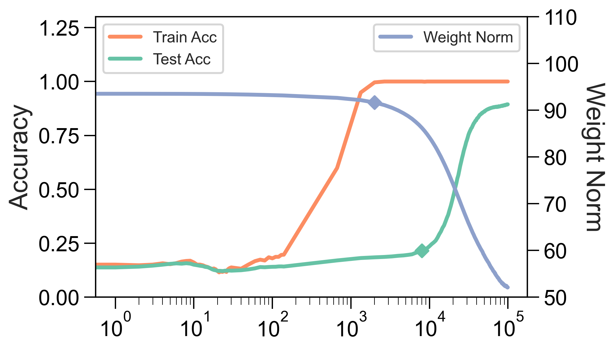
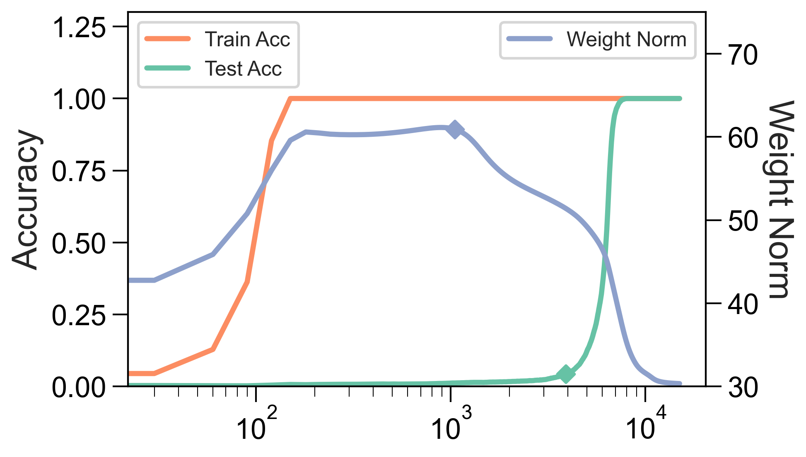
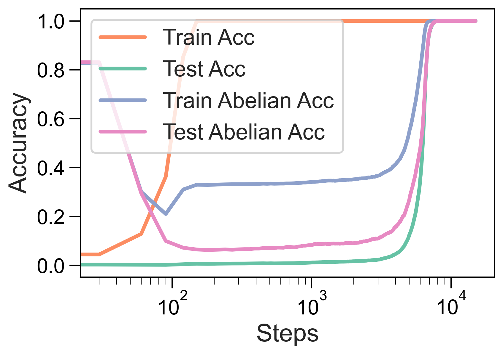
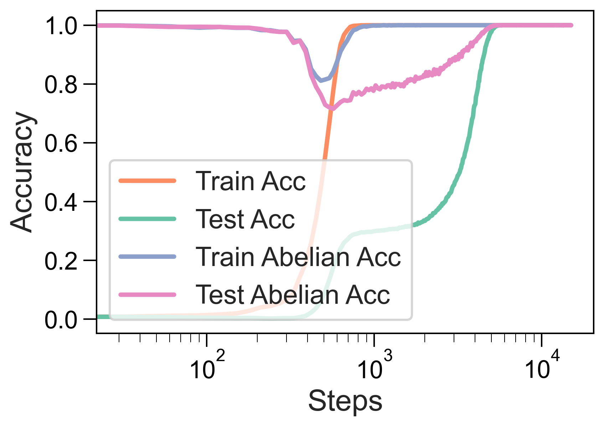
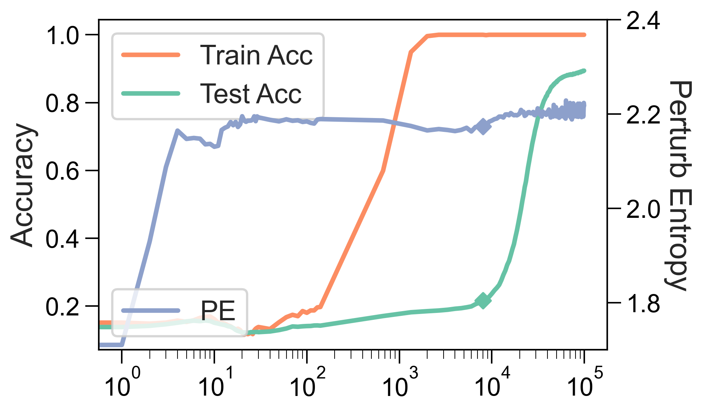
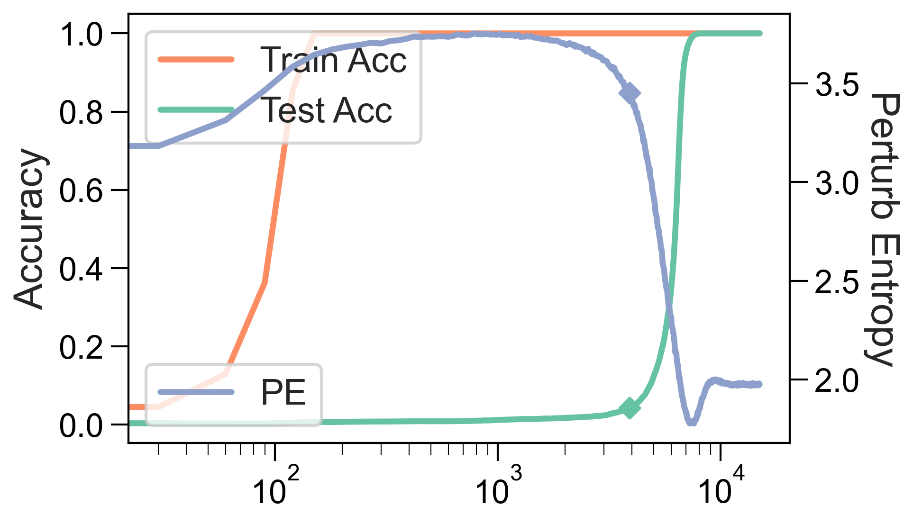

# Tan, Huang 2023 — Understanding Grokking Through A Robustness Viewpoint

See also: [the global concept index](../../concepts/index.md).

**Zhiquan Tan** (Department of Mathematical Sciences, Tsinghua University), **Weiran Huang** (Qing Yuan Research Institute, SEIEE, Shanghai Jiao Tong University). Correspondence with Weiran Huang.

arXiv [2311.06597](https://arxiv.org/abs/2311.06597), 11 November 2023 (version v2 — 2 February 2024). 11 citations — the twenty-first most cited work in the corpus. The source is the native arXiv HTML of version v2.

The files of this paper's analysis:

- [`2311.06597.understanding-grokking-through-a-robustness-viewpoint.license.txt`](2311.06597.understanding-grokking-through-a-robustness-viewpoint.license.txt) — the arXiv licence record for this paper.

The anchor scheme and the rules for linking into a card are in the [README of the papers folder](../README.md).

**Excerpt card.** The paper's licence (`arxiv-nonexclusive`) does not permit republishing the paper itself; what stands here are the editorial sections and the fragments the corpus quotes (right of quotation). The paper: <https://arxiv.org/abs/2311.06597>.

## Concepts covered

**[Weight norm minimisation](../../concepts/weight-norm-minimization.md)** — the work gives the weight norm a **precise logical status**: the decay of the $l_{2}$ norm is a *sufficient* but not a necessary condition for grokking ([`p1-4`](#p1-4)). The argument is not empirical but derivable: by a lemma taken from Ma & Ying, the weight norm and the sharpness bound the perturbation error; the smaller the norm, the more robust the network; and from robustness it follows that test points with a sufficiently close training neighbour are classified correctly ([`p4-7`](#p4-7)). Corollary 3.4 carries the same reasoning over to the $l_{1}$ norm, and explains along the way the observation of Žunkovič & Ilievski that $l_{1}$ works better: it imposes more constraints.

**[The norm delay law](../../concepts/norm-separation-delay-law.md)** — the weakness of the norm as an indicator is named here too: it changes **not simultaneously** with the grokking on the test set ([`p1-2`](#p1-2)) but earlier. Hence the whole subsequent search for quantities that coincide with the grokking in time ([`p9-8`](#p9-8)).

**[Progress measures](../../concepts/progress-measures.md)** — two new ones are proposed: the **perturbed mutual information** (PMI) and the **perturbed entropy** (PE), computed from $l_{2}$-normalised Gram matrices of the features on a perturbed training set ([`p2-4`](#p2-4)). Their difference from the weight norm is that they change sharply *at the moment of* the grokking rather than before it.

**[Spectral analysis](../../concepts/spectral-analysis-svd-esd-fve.md)** — both quantities are Rényi matrix entropies: $\operatorname{H}_{\alpha}(\mathbf{R})=\frac{1}{1-\alpha}\log\operatorname{tr}((\mathbf{R}/n)^{\alpha})$ over a Gram matrix, that is, spectral quantities that require no density estimation. At $\alpha=1$ this is the von Neumann entropy. An ablation shows that the trend is robust to the choice of $\alpha$.

**[Causal interventions](../../concepts/causal-ablation-intervention.md)** — a technique is derived from the explanation: add a Gaussian noise $\Delta\sim\mathcal{N}(0,\sigma^{2}\mathbf{I})$ to the input with a strength adapted during the training, $\sigma=\max(\lambda_{1}(1-\text{train acc}),\lambda_{2})$. The authors call this "degrokking" ([`p2-4`](#p2-4)); the generalisation is sped up on both MNIST and modular addition.

**[Variants of regularisation](../../concepts/regularization-variants.md)** — an incidental explanation: if perturbing the input speeds the generalisation up, then the ordinary data-augmentation techniques are a kind of perturbation too, and that is why grokking is rare in ordinary settings. This is one of the simplest explanations of the rarity of grokking in the corpus.

**[Groups](../../concepts/group-composition-non-commutative-s5.md)** — the work's most unexpected observation. Since the task is addition in an abelian group, a model that has learned the general rule must obey the law of commutativity ([`p7-1`](#p7-1)). The authors introduce an "abelian test": does the prediction for $a+b$ coincide with the prediction for $b+a$? It turns out that under ordinary training the model **does not acquire commutativity until the grokking itself**, although this is a necessary condition of the task; under training with perturbations it acquires it immediately after reaching 100 % on the training set.

**[Modular arithmetic](../../concepts/modular-arithmetic.md)** — the setting of Nanda et al. is reproduced (a single-layer transformer, $P=113$, 30 % of the data for training) but posed with a new question: not "which algorithm has been learned" but "which properties of the operation are learned before the others" ([`p1-2`](#p1-2)).

**[Real data](../../concepts/vision-real-world-data-mnist-cifar.md)** — all the conclusions are checked in parallel on MNIST in the Omnigrok setting and on modular addition ([`p1-3`](#p1-3)); running both lines simultaneously is a habit rare in the corpus.

**[Phase transition](../../concepts/phase-transition.md)** — the sharpness of the transition receives a **quantitative model**: if the neighbourhood probability $P(r)$ is taken to be Gaussian and the product of the norm and the sharpness to decay as $\max\lbrace a-b\log_{10}(\text{steps}),0\rbrace$, then the predicted accuracy curve lies close to the real one ([`fig-3`](#fig-3)). This is a fit with three free parameters, but it shows that a sharp jump is compatible with a smooth decay of the norm.

**[Grokking](../../concepts/grokking.md)** — the notion is split in two: "eventually generalises" and "generalises abruptly". The first is explained by the robustness, the second by the shape of $P(r)$ ([`p1-3`](#p1-3)).

It is worth saying separately what the work does **not** contain. There is no check of the predictive rule: the hypothesis "grokking will happen if MID and ED are small or fall sharply before the training accuracy reaches 100 %" is formulated but not turned into a decision rule with a threshold and an error estimate — only two pairs of plots. And there is no explanation of *why* ordinary training does not acquire commutativity: the observation is given, the mechanism is not analysed.

Cards of corpus papers: [Power et al. 2022](../2201.02177.grokking-generalization-beyond-overfitting-on-small-algorithmic-datasets/2201.02177.grokking-generalization-beyond-overfitting-on-small-algorithmic-datasets.card.md) — the task; [Omnigrok](../2210.01117.omnigrok-grokking-beyond-algorithmic-data/2210.01117.omnigrok-grokking-beyond-algorithmic-data.card.md) — the MNIST setting and the explanation through the norm, to which the status of a sufficient condition is given here; [Nanda et al. 2023](../2301.05217.progress-measures-for-grokking-via-mechanistic-interpretability/2301.05217.progress-measures-for-grokking-via-mechanistic-interpretability.card.md) — the modular-addition setting and progress measures tied to the task; [Notsawo et al. 2023](../2306.13253.predicting-grokking-long-before-it-happens/2306.13253.predicting-grokking-long-before-it-happens.card.md) — another attempt to predict grokking in advance, likewise without a decision rule; [Merrill et al. 2023](../2303.11873.a-tale-of-two-circuits-grokking-as-competition-of-sparse-and-dense-subnetworks/2303.11873.a-tale-of-two-circuits-grokking-as-competition-of-sparse-and-dense-subnetworks.card.md) and [Varma et al. 2023](../2309.02390.explaining-grokking-through-circuit-efficiency/2309.02390.explaining-grokking-through-circuit-efficiency.card.md) — the explanations through subnetworks and efficiency, named in the survey.

**[The internal symmetry of the task](../../concepts/intrinsic-task-symmetry.md)** — the work brings a direct objection to this line: ordinary training on modular addition does not learn the law of commutativity before the grokking ([`p2-4`](#p2-4)). If generalisation proceeded through the acquisition of the symmetry, the order would be the reverse.
## What is shown and what is conjectured

The card editor's remarks following the analysis of the claims (`…claims.txt`). The work is short and rests on three supports of differing strength: a logical clarification of the status of the weight norm, an empirical finding about commutativity, and two new quantities.

**The clarification of the status of the norm is the main contribution.** Before this work the corpus used the weight norm as an explanation; here it is shown that it is sufficient but not necessary, and it is explained **through what** it acts: through robustness to a perturbation of the input ([`p4-7`](#p4-7)). The chain "a small norm → a small perturbation error → the correct classification of the neighbours of training points" is derived rather than postulated.

**The price of the derivation is strong assumptions.** Theorem 3.2 requires an interpolating solution, a Lipschitz gradient and that a fraction $\delta$ of the test points have a training neighbour within a radius $\epsilon(W^{ * })$. For MNIST this is plausible; for modular addition with one-hot inputs a "neighbour within a radius" is a far more conventional notion, and the work does not discuss this.

**The finding about commutativity is the most valuable observation.** The model does not acquire $a+b=b+a$ until the grokking itself ([`p7-1`](#p7-1)), although this is a necessary condition of the correct algorithm. This is direct evidence that the training does not proceed "from the simple to the complex", and it is checkable: the abelian test is reproduced in a couple of lines.

**The explanation of the effectiveness of the perturbations is plausible but unproved.** The authors link the speed-up to the acquisition of commutativity and support this with a third technique — a direct penalty on the divergence of the logits of "$a+b=$" and "$b+a=$", which works better still. The argument is strong but remains correlational: it is shown that both techniques acquire commutativity and both speed things up, not that the first causes the second.

**The representations, meanwhile, differ.** The abelian test on the logits shows that after the grokking ordinary training gives a stable zero divergence while training with perturbations gives chaotic behaviour. The speed-up is therefore achieved not by reproducing the same solution faster but by arriving at a different solution.

**The new quantities coincide with the grokking in time — and that is all.** PMI and PE change sharply precisely at the moment of the jump in test accuracy ([`p9-8`](#p9-8)), which makes them better indicators than the norm. But the prediction remains a hypothesis: the rule "MID and ED are small or fall sharply before 100 % on the training set" is illustrated by two pairs of plots, with no threshold, no rate of correct forecasts and no negative examples.

**The theoretical part about the quantities proves something other than what is needed.** Theorems 5.9 and 5.12 bound MID and ED through the perturbation error of the representations — that is, they show that these quantities **reflect robustness**. That robustness is connected with grokking is shown separately; the link "the quantities → a prediction of grokking" closes only through that chain and therefore inherits all its assumptions.

**Its place in the corpus.** The work occupies an intermediate position between the explanations through the weight norm and the attempts to predict grokking in advance. Its contribution to the wiki is twofold: it carefully demotes the weight norm from an explanation to a sufficient condition, and it adds to the corpus a checkable fact — that the necessary properties of the task (commutativity) are learned not earlier than, but simultaneously with, the task itself.

## Common misreadings and overstatements

These are the card editor's remarks, not the authors' text: places where this paper restates someone else's results with an error, or without the qualifications their authors attached. The "details" links in the "Common misreadings and overstatements of this paper" sections of the cited works' cards lead here.

###### mc-2210-01117
**Omnigrok (2210.01117) — priority, the caveat about inducement, and the norm as an explanation.** Three inaccuracies in one introduction. (1) `"the MNIST image classification task introduced by [Liu et al., 2022b]"`: grokking on MNIST was introduced not in Omnigrok but in the same authors' earlier work — [2205.10343, section 4.3](../2205.10343.towards-understanding-grokking-an-effective-theory-of-representation-learning/original/2205.10343.towards-understanding-grokking-an-effective-theory-of-representation-learning.md#p9-2), which begins with the words "We now demonstrate, for the first time…". (2) `"later found in traditional tasks such as image classification"`: "found" presents grokking as encountered, whereas in the cited work it is induced — ["in a slightly non-standard setting where it is relatively weak"](../2210.01117.omnigrok-grokking-beyond-algorithmic-data/original/2210.01117.omnigrok-grokking-beyond-algorithmic-data.md#p1-9). (3) `"One popular explanation for grokking is based on the decay of the network's ($l_{2}$) weight norm [Liu et al., 2022b; Nanda et al., 2023]"`: the explanation is conveyed as a general one, without the original authors' caveat that [the "U" shape is better regarded as empirically widespread than as provably universal](../2210.01117.omnigrok-grokking-beyond-algorithmic-data/original/2210.01117.omnigrok-grokking-beyond-algorithmic-data.md#sec-6). Tellingly, the paper goes on to argue with that explanation itself from the standpoint of robustness — it is the paraphrase of somebody else's position that is inaccurate, not its own.

---

# Quoted fragments

Only the fragments the corpus cards refer to are
reproduced here (right of quotation); the paper's licence does not permit
republishing the whole text. Anchor numbering matches the original.

###### p1-2

Recently, an interesting phenomenon called grokking has gained much attention, where generalization occurs long after the models have initially overfitted the training data. We try to understand this seemingly strange phenomenon through the robustness of the neural network. From a robustness perspective, we show that the popular $l_{2}$ weight norm (metric) of the neural network is actually a *sufficient* condition for grokking. Based on the previous observations, we propose perturbation-based methods to speed up the generalization process. In addition, we examine the standard training process on the modulo addition dataset and find that it hardly learns other basic group operations before grokking, for example, the commutative law. Interestingly, the speed-up of generalization when using our proposed method can be explained by learning the commutative law, a *necessary* condition when the model groks on the test dataset. We also empirically find that $l_{2}$ norm correlates with grokking on the test data not in a timely way, we propose new metrics based on robustness and information theory and find that our new metrics correlate well with the grokking phenomenon and may be used to predict grokking.

###### p1-3

The generalization of overparameterized neural networks has been a fascinating topic in the machine learning community, challenging classical learning theory intuitions. Recently, researchers have discovered a interesting phenomenon called grokking, initially observed in training on unconventional Algorithmic datasets [Power et al., 2022], and later found in traditional tasks such as image classification [Liu et al., 2022b]. Grokking refers to the unexpected generalization of learning tasks that occurs long after the models have initially overfitted the training data. This phenomenon has garnered increasing attention due to its resemblance to “phase transition” [Nanda et al., 2023]. Since its initial report [Power et al., 2022], this phenomenon has garnered numerous explanations from various aspects [Nanda et al., 2023; Liu et al., 2022b; Merrill et al., 2023; Barak et al., 2022; Davies et al., 2023; Thilak et al., 2022; Gromov, 2023; Notsawo Jr et al., 2023; Varma et al., 2023].

###### p1-4

One popular explanation for grokking is based on the decay of the network’s ($l_{2}$) weight norm [Liu et al., 2022b; Nanda et al., 2023]. We plot the accuracies and weight norm curve during training on two standard datasets in Figure 1. We can see that when the test accuracy quickly increases, the weight norm quickly drops correspondingly. Then a natural question arises: Is this metric a necessary and sufficient signal for grokking? From Figure 1 we can see the decrease of weight norm usually happens before the grokking on the test dataset, making it seemingly a sufficient condition for grokking but not a necessary condition. Indeed, we can prove that this is the case. Roughly speaking, when the network’s robustness increases to a certain level, then grokking happens. When the weight norm decreases, the robustness increases, indicating that decay of the weight norm is a sufficient condition for grokking. Motivated by the goal of enhancing robustness, we explore the application of perturbation-based training to accelerate generalization.

**[p. 2]**

For one of the tasks (on Modulo Addition Dataset) in Figure 1, comprehending the commutative law of modulo addition is necessary for grokking on this task. One may expect the model to first comprehend this “easy” (necessary condition) task and then understand the full task of modulo addition. However, we discover an unusual observation during standard training on the modulo addition dataset [Power et al., 2022]: the model fails to recognize the commutative law of modulo addition before fully understanding the task, which goes against our intuition. Leveraging this finding, we can explain the effectiveness of our perturbation-based approach by verifying that it successfully learns commutative law on the training dataset before grokking.

On the other hand, recall that in Figure 1, we have observed that there is no *simultaneous* change between the $l_{2}$ norm decay and grokking on the test dataset. In light of this, we propose the utilization of novel metrics derived from robustness theory. Our findings indicate that these new metrics exhibit a strong correlation with the grokking phenomenon. Moreover, we have discovered evidence suggesting that these metrics could be valuable in predicting the presence of grokking.

###### p2-4

- We theoretically explain why decay of $l_{2}$ weight norm leads to grokking through the robustness of network.
- Motivated by improving robustness, we use perturbation-based training to speed up generalization.
- We find a surprising fact that standard training on Modulo Addition Dataset fails to learn commutative law before grokking, which contradicts intuition. We further use this to explain the success of our new perturbation-based strategy.
- Borrowing ideas from robustness and information theory, we introduce new metrics that correlate better with the grokking process and may be used to predict grokking.

###### p3-4

Suppose a positive semi-definite matrix $\mathbf{R}\in\mathbb{R}^{n\times n}$ which $\mathbf{R}(i,i)=1$ for every $i=1,\cdots,n$ and $\alpha>0$. The $\alpha$-order (Rényi) entropy for matrix $\mathbf{R}$ is defined as follows:

$$
\operatorname{H}_{\alpha}\left(\mathbf{R}\right)=\frac{1}{1-\alpha}\log\left[\operatorname{tr}\left(\left(\frac{1}{n}\mathbf{R}\right)^{\alpha}\right)\right],
$$

where $\mathbf{R}^{\alpha}$ is the matrix power.

The case of $\alpha=1$ recovers the von Neumann (matrix) entropy, i.e.,

$$
\operatorname{H}_{1}\left(\mathbf{R}\right)=-\operatorname{tr}\left(\frac{1}{n}\mathbf{R}\log\frac{1}{n}\mathbf{R}\right).
$$

In this paper, if not stated otherwise, we will always use $\alpha=1$. Using the definition of matrix entropy, we can define matrix mutual information as follows.

###### p4-7

From theorem 3.2, it is clear that when $l_{2}$ norm decays, the distance threshold $\epsilon(W^{*})$ increases thus the ratio of test samples who has a train dataset neighbour of distance at most $\epsilon(W^{*})$ increases. Then it is clear that the test accuracy increases, which means that $l_{2}$ weight decay is indeed a sufficient condition for the generalization on test dataset.

The name grokking consists of two things. One is that it generalizes on test data eventually, which we have discussed previously. Another is that when it generalizes, the accuracy increases sharply, mimicking a sort of “phase transition” phenomenon. We will further analyze the latter in detail in the following.

**[p. 5]**

Define the distance function to the training dataset as follows:

$$
d(\mathbf{x},\mathcal{D}_{train})=\min_{\mathbf{y}\in\mathcal{D}_{train}}\|\mathbf{x}-\mathbf{y}\|_{2}.
$$

Motivated by theorem 3.2, we can define the neighbouring probability of test data distribution $P_{test}$ as: $P(r)=\mathbb{E}_{\mathbf{X}\sim P_{test}}\mathbb{I}(d(\mathbf{X},\mathcal{D}_{train})\leq r)=\Pr(d(\mathbf{X},\mathcal{D}_{train})\leq r).$

###### fig-3

*Figure 3: The predicted accuracy matches the real test accuracy.* **[p. 5]**

We will then analyze another type of regularization techniques, for example, $l_{1}$ weight decay.

###### p7-1

As the task is modulo adding, from group theory, it shall obey the commutative law once it actually learns the general addition rule.

Formally, the commutative law in an abelian group is

$$
a+b=b+a,
$$

where $+$ is the binary group operation considered.

###### p9-8

From the above observations, we find that the proposed two metrics PMI and PE change sharply *at the time* of grokking. This makes them better indicators for grokking than the $l_{2}$ weight norm.

**[p. 10]**

*Figure 9: Perturb entropy on the training dataset.* **[p. 10]**
