# Morwani et al. 2024 — Feature emergence via margin maximization: case studies in algebraic tasks

See also: [the global concept index](../../concepts/index.md). arXiv [2311.07568v2](https://arxiv.org/abs/2311.07568), 13 November 2023 (v2 — 19 February 2024). The PDF has no running head; the work is published at ICLR 2024, but the PDF stored is the arXiv version with no conference header.

**Depen Morwani, Benjamin L. Edelman\*, Costin-Andrei Oncescu\*, Rosie Zhao\*, Sham Kakade** — Harvard University. The asterisk stands in the PDF header as reproduced above, with the footnote "These authors contributed equally to this work".

The files of this paper's analysis:

- [`2311.07568.feature-emergence-via-margin-maximization-case-studies-in-algebraic-tasks.license.txt`](2311.07568.feature-emergence-via-margin-maximization-case-studies-in-algebraic-tasks.license.txt) — the arXiv licence record for this paper.

The anchor scheme and the rules for linking into a card are in the [README of the papers folder](../README.md).

**Excerpt card.** The paper's licence (`arxiv-nonexclusive`) does not permit republishing the paper itself; what stands here are the editorial sections and the fragments the corpus quotes (right of quotation). The paper: <https://arxiv.org/abs/2311.07568>.

## Concepts covered

**[Margin maximisation / implicit bias](../../concepts/margin-maximization-implicit-bias.md)** — the work turns the maximum-margin principle from an instrument for generalisation bounds into an instrument that **determines the features**: it asserts that this principle alone suffices to describe the features a network learns "exhaustively and precisely" ([p. 2, para. 1](#p2-1)). The technique consists of two moves that the corpus inherits. The first is a "certificate pair" $(\theta^{ * },q^{ * })$: if the distribution $q^{ * }$ minimises the expected margin at $\theta^{ * }$ and $\theta^{ * }$ maximises it at $q^{ * }$, then by a max-min inequality $\theta^{ * }$ is a maximum-margin solution, and exhibiting **one** such pair suffices to describe **all** the maximum-margin solutions ([p. 7, para. 3](#p7-3)). The second is a class-weighted margin $g^{\prime}$, in which the $\max$ over the incorrect labels is replaced by a weighted sum; it restores the decomposability over neurons lost in the multiclass problem, and condition C.1 restores the equality $g^{\prime}=g$ on the support of $q^{ * }$ ([p. 8, para. 6](#p8-6)). What the work does not contain: the connection with training rests on exactly one borrowed theorem — Wei et al. 2019a about the **global** minima of a weakly regularised cross-entropy as $\lambda\to 0$ ([p. 5, para. 9](#p5-9), [theorem 1](#p5-10)); that gradient descent arrives at a global minimum is neither proved nor checked, and the authors call the maximum margin outright a "proxy" for the understanding of global minima ([p. 5, para. 11](#p5-11)). The claim pertains to the limit point rather than to the path to it.

**[The emergence of features](../../concepts/feature-emergence-feature-learning.md)** — the work reframes the question: not "how does the network compute the target function" but "why does it arrive at just this way of computing" ([p. 3, para. 3](#p3-3)). It matters for the corpus that "to classify correctly" and "to learn structured features" are here **separated**: appendix D exhibits a network of $2p^{2}$ neurons that solves modular addition exactly while being dense in the spectrum — all its weights are signed one-hot vectors ([p. 22, para. 2](#p22-2)) — whence it follows directly that Fourier sparsity is not a property of every correct classifier ([p. 22, para. 3](#p22-3)). Such solutions have a smaller margin and therefore "are not reached by training" ([p. 3, para. 8](#p3-8)). What the work does not contain: not a single claim about the order in which features arise over the course of the training, and no quantity measured in time other than the margin itself.

**[Fourier features and circuits](../../concepts/fourier-features-circuits.md)** — here the Fourier structure is for the first time not observed but **derived as necessary**. Theorem 7: at a width $m\geq 4(p-1)$ the maximum $L_{2,3}$ margin equals exactly $\gamma^{ * }=\sqrt{\frac{2}{27}}\cdot\frac{1}{p^{1/2}(p-1)}$ ([p. 10, para. 3](#p10-3)), and every solution attaining it is arranged so ([the informal statement](#p3-7)) that each neuron's input and output vectors are cosines of a **single** frequency $\zeta$ with phases related by the condition $\theta_{u}^{ * }+\theta_{v}^{ * }=\theta_{w}^{ * }$, and every frequency is occupied by at least one neuron ([p. 10, para. 5](#p10-5), [para. 6](#p10-6)). The pivotal step of the derivation is the identity $\mathbb{E}_ {a,b}[\psi^{\prime}(\lbrace u,v,w\rbrace,a,b)]=\frac{2}{(p-1)p^{2}}\sum_{j\neq 0}\hat{u}(j)\hat{v}(j)\hat{w}(-j)$: the sparsity in Fourier space arises as the solution of maximising this form under a quadratic norm constraint rather than being postulated ([p. 10, para. 7](#p10-7), [para. 8](#p10-8)). The empirical check: in the quadratic network the maximum normalised spectral power is almost exactly $1$ for every neuron ([fig. 4](#fig-4)), and the final distribution of neurons over frequencies is close to uniform ([fig. 7](#fig-7)) — the latter **beyond** the theorem, which requires only one neuron per frequency.

**[Modular arithmetic](../../concepts/modular-arithmetic.md)** — the task is taken in the narrowest form the proof allows: $\mathcal{X}={\mathbb{Z}}_ {p}\times{\mathbb{Z}}_ {p}$, $\mathcal{Y}={\mathbb{Z}}_ {p}$, $D_{p}=\lbrace((a,b),a+b)\rbrace$, that is, the **full population sample** ([p. 10, para. 2](#p10-2)); the network is a single hidden layer with no biases and an activation $x^{2}$, with a one-hot input ([p. 4, para. 5](#p4-5)). The experiment: $p=71$, $m=500$, full gradient descent, 40000 steps, with the learning rate doubled ten times from $0.05$ to $51.2$ and a regularisation of $10^{-4}$ ([p. 19, para. 2](#p19-2)). What the work does not contain: no train/test split, no test-accuracy curve, no number of seeds and no confidence bands — there is one measured quantity, the margin, and the experiment serves as an illustration of the theorem.

**[Sparse parity](../../concepts/sparse-parity.md)** — the third analysis and the only binary one: for $(n,k)$-parity with an activation $x^{k}$ and $m\geq 2^{k-1}$ the maximum $L_{2,k+1}$ margin equals $\gamma^{ * }=k!\sqrt{2(k+1)^{-(k+1)}}$ ([p. 11, para. 2](#p11-2)), and every solution attaining it has the support of each non-zero $u_{i}$ exactly on the relevant set $S$, all the $|u_{i}[j]|$ equal to $\Vert w_{i}\Vert$ and the output vector along $[1,-1]$ ([p. 11, para. 4](#p11-4)). The case is simpler than the other two precisely because the task is binary: then $g^{\prime}=g$ and condition C.1 holds for free. What the work does not contain: a connection with the computational hardness of parity — no statistical queries and no number of steps to a solution; the subject is only the structure of the limiting solution.

**[Group representations and cosets](../../concepts/group-representations-cosets.md)** — the work gives a theoretical derivation of what Chughtai et al. 2023 observed empirically: the network maps the inputs $a,b$ to matrices $R(a),R(b)$ of some irreducible representation and outputs logits proportional to the character $\chi_{R}(abc^{-1})=\mathrm{tr}(R(a)R(b)R(c^{-1}))$ ([p. 12, para. 4](#p12-4)). Theorem 9: at $m\geq 2\sum_{n=2}^{K}{d_{R_{n}}}^{3}$ and under a condition on the characters, $\sum_{n=2}^{K}{d_{R_{n}}}^{1.5}\chi_{R_{n}}(C)<0$ for every non-trivial conjugacy class, the maximum $L_{2,3}$ margin equals $\gamma^{ * }=\frac{2}{3\sqrt{3|G|}}\frac{1}{\left(\sum_{n=2}^{K}d_{R_{n}}^{2.5}\right)}$ ([p. 13, para. 2](#p13-2)), the weights of each neuron span exactly one **non-trivial** representation, and each such representation is occupied by at least one neuron ([p. 13, para. 4](#p13-4)). Lemma 20 exhibits a construction of $2{d_{R}}^{3}$ neurons realising $\mathrm{tr}(R(a)R(b)R(c)^{-1})$ ([p. 39, para. 1](#p39-1)). What the work does not contain: cosets — the word does not occur in the paper, there is no decomposition into cosets, and a conjugacy class enters the analysis only as a region on which a character is constant.

**[Group composition / the non-commutativity of S5](../../concepts/group-composition-non-commutative-s5.md)** — the experimental part is on symmetric groups: $S_{3}$ ($m=30$, [p. 19, para. 5](#p19-5)), $S_{4}$ ($m=200$) and $S_{5}$ ($m=2000$, stochastic gradient descent with a batch of 1000, [p. 20, para. 1](#p20-1)); in all three cases the neurons by the end of the training are concentrated on a single representation and the margin approaches the theoretical one, with representations of larger dimension receiving more neurons — as in the construction ([fig. 6](#fig-6)). An essential limitation to keep in mind when citing: the condition on the characters is verified to hold for $S_{k}$ **only up to $k=5$** ([p. 13, para. 6](#p13-6)); for other finite groups theorem 9 in its stated form does not apply, and the generalisation in appendix I.2 is a scheme with three solvability conditions through which not a single concrete group is worked out in the paper ([p. 13, para. 7](#p13-7), [p. 41, para. 1](#p41-1)).

**[Mechanistic interpretability](../../concepts/mechanistic-interpretability.md)** — the work defines itself as a **complement** to this area rather than a dispute with it: a mechanistic analysis, in the authors' formulation, usually leaves open the question of *why* the representations observed arise from training ([p. 1, para. 3](#p1-3)), and this work answers precisely the "why", whereas Nanda et al. 2023 and Chughtai et al. 2023 answered the "how" ([p. 18, para. 5](#p18-5)). What the work does not contain: not a single piece of reverse engineering — no ablations and no decomposition of trained weights into circuits; the only things looked at in a trained network are the spectrum of the embeddings and the size of the margin.

**[Grokking](../../concepts/grokking.md)** — the work stands in the corpus as a theoretical support but does not study the phenomenon itself. The word "grokking" occurs in it only in retellings of others' works: modular addition is called a task "first studied in Power et al. 2022 in an investigation of „grokking“" ([p. 2, para. 1](#p2-1)), and once more, in a mention that the progress measures of Nanda et al. precede "the grokking phase transition" ([p. 18, para. 5](#p18-5)). Neither the generalisation delay nor the order of the training phases is derived from the maximum margin or discussed: max-margin describes the end of the path, and grokking the path itself. This work cannot be credited with an explanation of grokking, and that is the commonest error in citations of it — see the section on retellings below.

**[When regularisation is necessary](../../concepts/regularization-necessity.md)** — here regularisation is not a lever but a **load-bearing structure**: the training runs on the objective ${\mathcal{L}}_ {\lambda}(\theta)=\frac{1}{|D|}\sum_{(x,y)\in D}l(f(\theta,x),y)+\lambda\Vert\theta\Vert^{r}$ with cross-entropy, and the whole bridge from training to the maximum margin is the limit $\lambda\to 0$ ([p. 5, para. 8](#p5-8), [para. 9](#p5-9)). The norm is meanwhile not the ordinary one: $L_{2,\nu}$ is taken, where $\nu$ is the homogeneity constant of the network ($L_{2,3}$ for the quadratic network, $L_{2,k+1}$ for $k$-parity), and the choice $b=\nu$ the authors explain by its being the only one that gives the freedom to assemble a $\theta^{ * }$ satisfying equation 1 ([p. 5, para. 4](#p5-4), [p. 23, para. 1](#p23-1)). In the experiment a ReLU network was trained with ordinary $L_{2}$ regularisation — and gave a power of about $0.9$ rather than $1$ ([fig. 4](#fig-4)); the theory does not extend to ReLU. It cannot be asserted with a reference to this work that features arise "even without explicit regularisation".

**[Weight norm minimisation](../../concepts/weight-norm-minimization.md)** — the authors give margin maximisation an informal reading as precisely a norm minimisation: the network maximises the margin if it attains a given level of confidence on every point of the set "with the smallest possible total parameter norm" ([p. 2, para. 1](#p2-1)). Formally the work computes the **normalised** margin $h(\theta/\Vert\theta\Vert)$ ([p. 5, para. 7](#p5-7)), that is, it works on the sphere $\Theta=\lbrace\Vert\theta\Vert\leq 1\rbrace$ and does not track the growth of the norm in time. What the work does not contain: no zero-loss manifold and no discussion of how the norm behaves over the course of the training.

**[The canonical grokking proving ground](../../concepts/canonical-grokking-testbed.md)** — the work takes three of the proving ground's tasks (modular addition, sparse parity, composition in finite groups) and deliberately **removes** from them the part of the setting that makes the proving ground one of grokking: the training runs on the full population sample, there is no train/test split ([p. 10, para. 2](#p10-2)), the architecture is replaced from a transformer by a network with a single hidden layer and a polynomial activation ([p. 4, para. 3](#p4-3)), and what is measured is not the accuracy but the margin ([fig. 1](#fig-1)). This makes the result stronger as a theorem and weaker as evidence about grokking: there is nothing here to generalise to.

**[Progress measures](../../concepts/progress-measures.md)** — the work only mentions them, retelling others: Nanda et al. 2023 "fully analysed how single-layer transformers perform modular addition, and used that knowledge to define progress measures preceding the grokking phase transition", and Chughtai et al. 2023 extended the analysis to composition in finite groups and found similar measures ([p. 18, para. 5](#p18-5)). The work introduces no progress measure of its own and measures no quantity over the course of the training other than the normalised margin and the spectrum of the embeddings.

---

**[Quadratic networks](../../concepts/quadratic-networks.md)** — the work places its construction in a row with its predecessor: Gromov's analytical construction gives a scheme of which the proof of theorem 7 turns out to be a particular case ([`p4-1`](#p4-1)).
## Points we could not reconcile

**The network's activation in the parity experiment is named in two different ways.** The caption of figure 5 speaks of a "quartic network (activation $x^{4}$)" trained on $(10,4)$-parity with $L_{2,5}$ regularisation ([fig. 5](#fig-5)), while appendix B.2 for the same task and the same norm writes "quadratic network" ([p. 19, para. 3](#p19-3)). By theorem 8 at $k=4$ the activation must be $x^{4}$ and the norm $L_{2,5}$ ([p. 11, para. 2](#p11-2)); it is therefore B.2 that diverges from the theorem. In citing the settings of the parity experiment one should take the figure caption rather than the appendix.

**The first item of lemma 6 is typeset without the minimum over the dataset.** The statement has $\theta^{ * }\in\operatorname*{arg\,max}_{\theta\in\Theta}g(\theta,x,y)$ ([p. 8, para. 9](#p8-9)) — that is, a maximum of a quantity defined for an individual point $(x,y)$ and, as written, tied to nothing. Both lemma 2, to which the proof refers, and the proof itself give the correct form $\operatorname*{arg\,max}_{\theta\in\Theta}\min_{(x,y)\in D}g(\theta,x,y)$ ([p. 6, para. 3](#p6-3)). The typo stands in the statement of the central lemma of the whole technique.

**A fraction is inverted in the proof of lemma 19.** The statement sets $z_{R}=\frac{d_{R}^{1.5}}{\sum_{m=2}^{K}d_{R_{m}}^{2.5}}$, whence for the one-dimensional sign representation $z_{R_{\mathrm{sign}}}=1/\sum_{m=2}^{K}d_{R_{m}}^{2.5}$ ([p. 38, para. 2](#p38-2)). The proof, however, from the equality $\sum_{m=2}^{K}z_{R_{m}}d_{R_{m}}=\sum_{m=2}^{K}d_{R_{m}}^{2.5}z_{R_{\mathrm{sign}}}=1$ derives $z_{R_{\mathrm{sign}}}=\sum_{m=2}^{K}d_{R_{m}}^{2.5}$ ([p. 38, para. 7](#p38-7)) — the reciprocal of what is required. This does not affect theorem 9's final expression: there $\frac{1}{\sum_{n=2}^{K}d_{R_{n}}^{2.5}}$ stands, that is, the correct variant.

**The chain of equality 19 closes on itself.** In the proof of lemma 21 it is written that $\sum_{n=2}^{K}\frac{d_{R_{n}}\chi_{R}(C)}{\Delta^{3}}=-\frac{1}{\Delta^{3}}\sum_{n=2}^{K}\frac{d_{R_{n}}\chi_{R}(C)}{\Delta^{3}}=-\frac{1}{\Delta^{3}}$ ([p. 39, para. 8](#p39-8)): the middle term repeats the left one multiplied by $-1/\Delta^{3}$, and the equality as written is false. Besides, the character under the sum carries the index $R$ rather than $R_{n}$, although the summation runs over $n$. The argument is unambiguously recoverable from the column orthogonality named in the same place ($\sum_{n=1}^{K}\chi_{R_{n}}(e)\chi_{R_{n}}(C)=0$), but as typeset the computation does not go through.

**Some of the references to formula numbers in the appendices lead nowhere.** After the formula numbered (5) the text twice speaks of "expression 6" ([p. 25, para. 8](#p25-8)); lemma 16 refers to "the weighted margin in 10" ([p. 34, para. 8](#p34-8)) and the proof of lemma 18 to "Equation 16" ([p. 37, para. 6](#p37-6)), whereas the numbers (6), (10) and (16) are assigned to no formula in the paper. A reader checking the computation has to recover the referent from the sense.

**Appendix D mixes notation and calls neurons norms.** The construction is declared for an arbitrary function $r:[n]^{2}\to[n]$, but the number of neurons is written straight away as $2p^{2}$, and $n$ and $p$ are not distinguished thereafter ([p. 22, para. 2](#p22-2)); the next sentence says that "these two norms help to „memorise“ the output for $(a,b)$", although the subject is two neurons ([p. 22, para. 3](#p22-3)).

## What is proved, what is shown and what is conjectured

**Proved** — the structure of the set of maximum-margin solutions for three tasks: modular addition at an activation $x^{2}$ and a norm $L_{2,3}$ ([theorem 7](#p10-3)), $(n,k)$-parity at an activation $x^{k}$ and a norm $L_{2,k+1}$ ([theorem 8](#p11-2)), and composition in finite groups with real irreducible representations at an activation $x^{2}$ and a norm $L_{2,3}$ ([theorem 9](#p13-2)). In all three cases both the exact value of the margin and the fact that **every** maximum-margin solution has the form described are proved — the strength of lemma 4 and lemma 6 lies precisely in one exhibited certificate pair describing all the solutions rather than only the constructed one ([p. 7, para. 3](#p7-3)). To the same heading belongs appendix D: an explicit counterexample showing that correct classification does not entail sparsity of the spectrum ([p. 22, para. 3](#p22-3)).

**Shown experimentally** — that networks trained by gradient descent with a weak regularisation **approach** the predicted margin and acquire the predicted weight structure: in the quadratic network on modular addition the maximum normalised spectral power is almost exactly $1$ ([fig. 4](#fig-4)), the normalised margin asymptotically attains $\gamma^{ * }$ ([fig. 1](#fig-1)), all the frequencies are occupied and distributed nearly uniformly ([fig. 7](#fig-7)); on $S_{3},S_{4},S_{5}$ the neurons by the end of the training are concentrated on a single representation ([fig. 6](#fig-6)). Both predictions — the value of the margin and the single-component spectrum — were made before the experiment, and this is the work's strong side. It must be stipulated, however, that the training runs on the full population sample, that there is no test curve at all, that the number of seeds and the confidence bands are not given, and that the ReLU network, to which the theory does not extend, gives a power of about $0.9$ — "nearly 1-sparse in frequency space but not quite" ([fig. 4](#fig-4)).

**Not proved but taken on trust** — that gradient descent arrives precisely at the global minimum of the regularised objective. There is one bridge from training to the maximum margin: the theorem of Wei et al. 2019a about the **global** minima as $\lambda\to 0$ ([p. 5, para. 9](#p5-9)); the authors themselves call the maximum margin a "proxy" ([p. 5, para. 11](#p5-11)), and in place of a proof of convergence they show experimentally that the margin creeps up to the predicted value. Hence a gap worth keeping in mind when citing: the title and the abstract speak of "features learned by neural networks", whereas what is proved is a property of the set of maximum-margin solutions.

**Declared a conjecture** — the carry-over to other architectures and norms. In the discussion: "Empirical findings suggest that the results may be transferable to other architectures and norms" ([p. 13, para. 8](#p13-8)). The condition on the characters, without which theorem 9 does not work, is verified only for $S_{k}$ up to $k=5$ ([p. 13, para. 6](#p13-6)), and the generalisation in appendix I.2 is a scheme with three solvability conditions illustrated by no concrete group ([p. 41, para. 1](#p41-1)). The width bounds are lower bounds and with a large margin relative to the experiment: $4(p-1)=280$ at $m=500$, $2^{k-1}=8$ at $m=40$; what happens below the bound is not analysed.

**The domain of applicability and Gromov 2023.** The authors write outright that the construction in the proof of theorem 7 is a particular case of Gromov's scheme ([p. 4, para. 1](#p4-1)), and the direction of their derivation is the reverse: in Gromov the cosine solution is exhibited (sufficiency), here necessity is proved. But the domains of applicability do not coincide: in [Gromov](../2301.02679.grokking-modular-arithmetic/2301.02679.grokking-modular-arithmetic.card.md) grokking is obtained under ordinary gradient descent with MSE **and no regularisation whatever**, whereas the whole argument here rests on a weak $L_{2,\nu}$ regularisation of the cross-entropy and the limit $\lambda\to 0$ ([p. 5, para. 8](#p5-8)). Morwani's "why Fourier" does not answer Gromov's "why Fourier".

## Common misreadings and overstatements of this paper

Below are the patterns observed in the citing works of the corpus. Each entry says what exactly is distorted and leads to the authors' paragraphs where the lost caveat stands; the citing works' particular formulations are given verbatim.

**"Margin maximisation provably causes grokking" (erroneous).** Citing works carry the result over from the structure of the limiting solution to the cause of the generalisation delay. The formulation observed: `"Morwani et al. 2023 and Mohamadi et al. 2024 show that on certain classes of tasks, margin maximization during overtraining provably causes grokking."` (2411.03541, no card). In the authors, meanwhile, there is not a single claim about time: the word "grokking" occurs in the paper only in retellings of others' works ([p. 2, para. 1](#p2-1), [p. 18, para. 5](#p18-5)), the connection with training goes through the theorem about global minima as $\lambda\to 0$ ([p. 5, para. 9](#p5-9)), and the maximum margin is called a "proxy" for their understanding ([p. 5, para. 11](#p5-11)). The same work also cites this paper accurately — that what is proved is "the reason that neural networks often solve particular tasks … using very specific types of features … is because the regularized optimization trajectories are implicitly biased towards margin-maximizing solutions"; the warning concerns the formulation about "provably causes" rather than the work as a whole.

**"Features arise even without explicit regularisation" (erroneous).** The formulation observed: `"This behavior arises from the principle of margin maximization, even without explicit regularization, providing a theoretical explanation for grokking as a delayed transition from memorization to structured feature learning."` ([Notsawo, Dumas, Rabusseau 2025](../2506.05718.grokking-beyond-the-euclidean-norm-of-model-parameters/2506.05718.grokking-beyond-the-euclidean-norm-of-model-parameters.card.md)). Both halves diverge from the text: the training objective in the paper is explicitly regularised, ${\mathcal{L}}_ {\lambda}(\theta)=\frac{1}{|D|}\sum_{(x,y)\in D}l(f(\theta,x),y)+\lambda\Vert\theta\Vert^{r}$, and the whole bridge is the limit $\lambda\to 0$ in that norm ([p. 5, para. 8](#p5-8), [para. 9](#p5-9)), while in the experiments the regularisation is given by a number — $10^{-4}$ for modular addition, $10^{-3}$ for parity, $10^{-7}$ and $10^{-5}$ for the groups ([p. 19, para. 2](#p19-2), [para. 3](#p19-3), [para. 5](#p19-5), [p. 20, para. 1](#p20-1)); and there is no explanation of grokking as a delayed transition in the paper at all. It is worth noting that the source of the confusion may have been the neighbouring line of the same paragraph — about Lyu et al. 2023, where the subject really is a change of implicit biases over the course of the training.

**"The grokking delay is the time needed by this bias" (widening).** The formulation observed: `"Morwani et al. (2024) showed theoretically that the emergence of structured circuits is driven by implicit margin maximization under cross-entropy loss—the grokking delay corresponding to the time required for this bias to sculpt optimal geometry from an unstructured parameter space."` ([Yildirim 2026](../2603.05228.the-geometric-inductive-bias-of-grokking-bypassing-phase-transitions-via-architectural-topology/2603.05228.the-geometric-inductive-bias-of-grokking-bypassing-phase-transitions-via-architectural-topology.card.md)). The first half is correct; the second, after the dash, is the citing author's addition: there is no time, no rate and no dynamics whatever in the paper, and the proof is entirely about the set of solutions ([p. 5, para. 11](#p5-11)).

**"The features were revealed through a Fourier transform of the logits or an analysis of gradients" (erroneous — about the method).** The formulation observed: `"several works have revealed what kind of algorithmic pattern was obtained inside the model when it worked on modular addition (Zhong et al., 2023; Nanda et al., 2023; Morwani et al., 2023) or group composition (Chughtai et al., 2023; Stander et al., 2023) through the Fourier transform of logits or investigating gradients"` ([Furuta et al. 2024](../2402.16726.towards-empirical-interpretation-of-internal-circuits-and-properties-in-grokked-transformers-on-modular-polynomials/2402.16726.towards-empirical-interpretation-of-internal-circuits-and-properties-in-grokked-transformers-on-modular-polynomials.card.md)). There is neither a Fourier transform of the logits nor an analysis of gradients in the paper: the pattern is not "revealed inside the model" but derived from the maximum-margin principle ([p. 18, para. 5](#p18-5)), and the only things looked at in a trained network are the spectrum of the embeddings and the size of the margin.

Examples of accurate citation, useful for comparison: [Lyu et al. 2024](../2311.18817.dichotomy-of-early-and-late-phase-implicit-biases-can-provably-induce-grokking/2311.18817.dichotomy-of-early-and-late-phase-implicit-biases-can-provably-induce-grokking.card.md) — "derived analytical formulas for the weights of two-layer neural nets, **assuming** the margin is ultimately maximized" (with the caveat preserved); [Tian 2025](../2509.21519.provable-scaling-laws-of-feature-emergence-from-learning-dynamics-of-grokking/2509.21519.provable-scaling-laws-of-feature-emergence-from-learning-dynamics-of-grokking.card.md) — "study the structure of **final** grokked solutions … None of them tackle the dynamics of grokking"; [McCracken et al. 2025](../2505.18266.uncovering-a-universal-abstract-algorithm-for-modular-addition-in-neural-networks/2505.18266.uncovering-a-universal-abstract-algorithm-for-modular-addition-in-neural-networks.card.md) — "it gives that the maximum margin solution requires all frequencies to be learned"; [Stander et al. 2024](../2312.06581.grokking-group-multiplication-with-cosets/2312.06581.grokking-group-multiplication-with-cosets.card.md) — "We hypothesize that it may have something to do with the margin maximization effect discussed in …" (the hedge in place).

A separate reference trap: "Morwani et al. 2023" in the corpus denotes both this work (the arXiv version v1 is dated 2023) and another — "Simplicity bias in 1-hidden layer neural networks" by Morwani, Batra, Jain and Netrapalli, cited in discussions of simplicity bias. Both stand in this paper's own bibliography.

---

# Quoted fragments

Only the fragments the corpus cards refer to are
reproduced here (right of quotation); the paper's licence does not permit
republishing the whole text. Anchor numbering matches the original.

###### p1-3

Opening the black box of neural networks has the potential to enable safer and more reliable deployments, justifications for model outputs, and clarity on how model behavior will be affected by changes in the input distribution. The research area of mechanistic interpretability (Olah et al. 2020; Elhage et al. 2021; Olsson et al. 2022; Elhage et al. 2022) aims to dissect individual trained neural networks in order to shed light on internal representations, identifying and interpreting sub-circuits that contribute to the networks’ functional behavior. Mechanistic interpretability analyses typically leave open the question of *why* the observed representations arise as a result of training.

Meanwhile, the theoretical literature on inductive biases in neural networks (Soudry et al. 2018; Shalev-Shwartz & Ben-David 2014; Vardi 2023) aims to derive general principles governing which solutions will be preferred by trained neural networks—in particular, in the presence of underspecification, where there are many distinct ways a network with a given architecture could perform well on the training data. Most work on inductive bias in deep learning is motivated by the question of understanding why networks generalize from their training data to unobserved test data. It can be non-obvious how to apply the results from this literature to understand what solution will be found when a particular architecture is trained on a particular type of dataset.

**[p. 2]**

###### p2-1

In this work, we show that the empirical findings of Nanda et al. 2023 and Chughtai et al. 2023, about the representations found by networks trained to perform finite group operations, can be analytically explained by the inductive bias of the regularized optimization trajectory towards *margin maximization*. Informally, the network maximizes the margin if it attains a given confidence level on all the points in the dataset, with the smallest total parameter norm possible. Perhaps surprisingly, the margin maximization property alone — typically used for the study of generalization — is sufficient to *comprehensively and precisely* characterize the richly structured features that are actually learned by neural networks in these settings. Let’s begin by reviewing the case of learning modular addition with neural networks, first studied in Power et al. 2022 in their study of “grokking”.

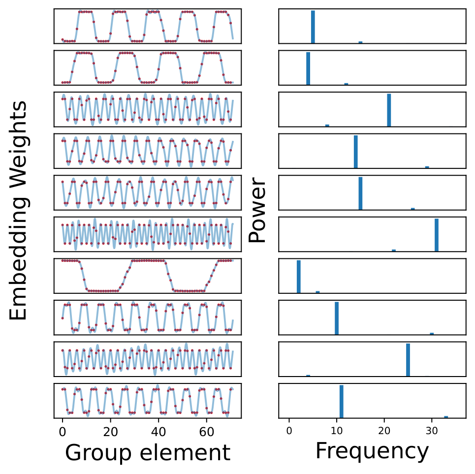

*(a) ReLU activation*

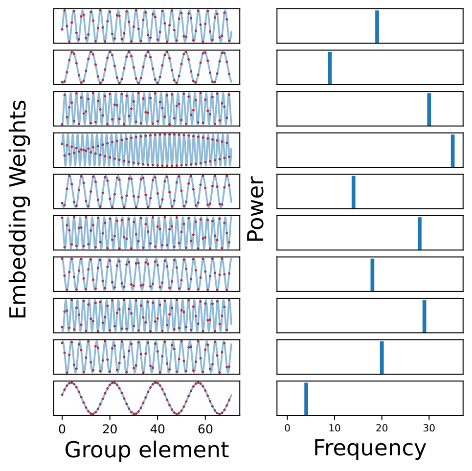

*(b) Quadratic activation*

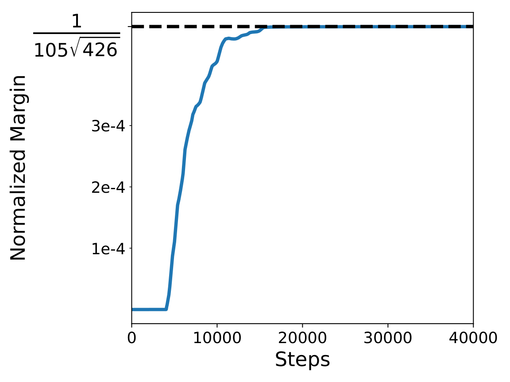

*(c) Normalized $L_{2,3}$ Margin*

###### fig-1

*Figure 1: (a) Final trained embeddings and their Fourier power spectrum for a 1-hidden layer ReLU network trained on a mod-71 addition dataset with $L_{2}$ regularization. Each row corresponds to an arbitrary neuron from the trained network. The red dots represent the actual value of the weights, while the light blue interpolation is obtained by finding the function over the reals with the same Fourier spectrum as the weight vector. (b) Similar plot for 1-hidden layer quadratic activation, trained with $L_{2,3}$ regularization (Section 2) (c) For the quadratic activation, the network asymptotically reaches the maximum $L_{2,3}$ margin predicted by our analysis.* **[p. 2]**

###### p3-3

These findings prompt the question: why does the network consistently prefer such Fourier-based circuits, amidst other potential circuits capable of performing the same modular addition function?

###### p3-7

- *For every neuron, there exists a frequency such that the Fourier spectra of the input and output weight vectors are supported only on that frequency.*
- *There exists at least one neuron of each frequency in the network.*

###### p3-8

Note that even with this activation function, there are solutions that fit all the data points, but where the weights do not exhibit any sparsity in Fourier space—see Appendix D for an example construction. Such solutions, however, have lower margin and thus are not reached by training.

In the case of $k$-sparse parity learning with an $x^{k}$-activation network, we show margin maximization implies that the weights assigned to all relevant bits are of the same magnitude, and the sign pattern of the weights satisfies a certain condition.

For learning on the symmetric group (or other groups with real representations), we use the machinery of representation theory (Kosmann-Schwarzbach et al. 2010) to show that **[p. 4]** learned features correspond to the irreducible representations of the group, as observed by Chughtai et al. 2023.

###### p4-1

Two closely related works to ours are Gromov 2023 and Bronstein et al. 2022. Gromov 2023 provides an analytic construction of various two-layer quadratic networks that can solve the modular addition task. The construction used in the proof of Theorem 7 is a special case of the given scheme. Bronstein et al. 2022 shows that all max margin solutions of a one-hidden-layer ReLU network (with fixed top weights) trained on read-once DNFs have neurons which align with clauses. However, their proof technique for characterizing max margin solutions is very different. For more details, refer to Appendix A.

**Paper organization:** In section 1, we delineate our contributions and discuss a few related works. In section 2, we state preliminary definitions. In section 3, we sketch our theoretical methodology, and state general lemmas which will be applied in all three case studies. In sections 4, 5, and 6, we use the above lemmas to characterize the max margin features for the modular addition, sparse parity and group operation tasks respectively. We discuss and conclude the paper in section 7. Further related work, full proofs, hyperparameter choices, and additional experimental results can be found in the Appendix.

###### p4-3

In this work, we will consider one-hidden layer neural networks with homogeneous polynomial activations, such as $x^{2}$, and no biases. The network output for a given input $x$ will be represented as $f(\theta,x)$, where $\theta\in\Theta$ represents the parameters of the neural network. The homogeneity constant of the network is defined as a constant $\nu$ such that for any scaling factor $\lambda>0$, $f(\lambda\theta,x)=\lambda^{\nu}f(\theta,x)$ for all inputs $x$.

In the case of $1$-hidden layer networks, $f$ can be further decomposed as: $f(\theta,x)=\sum_{i=1}^{m}{\phi(\omega_{i},x)}$, where $\theta=\{\omega_{1},\ldots,\omega_{m}\}$, $\phi$ represents an individual neuron within the network, and $\omega_{i}\in\Omega$ denotes the weights from the input to the $i$th neuron and from the neuron to the output. $\theta=\{\omega_{1},\ldots,\omega_{m}\}$ is said to have directional support on $\Omega^{\prime}\subseteq\Omega$ if for all $i\in\{1,\ldots,m\}$, either $\omega_{i}=0$ or $\lambda_{i}\omega_{i}\in\Omega^{\prime}$ for some $\lambda_{i}>0$. In this work, we will be primarily concerned with networks that have homogeneous neurons, i.e, $\phi(\lambda\omega_{i},x)=\lambda^{\nu}\phi(\omega_{i},x)$ for any scaling constant $\lambda>0$.

###### p4-5

For Sections 4 and 6 corresponding to cyclic and general finite groups respectively, we will consider neural networks with quadratic activations (Figure 2). A single neuron will be represented as $\phi(\{u,v,w\},x^{(1)},x^{(2)})=(u^{\top}x^{(1)}+v^{\top}x^{(2)})^{2}w$, where $u,v,w\in\mathbb{R}^{d}$ are the weights associated with a neuron and $x^{(1)},x^{(2)}\in\mathbb{R}^{d}$ are the inputs provided to the network (note that $\phi(\{u,v,w\},x^{(1)},x^{(2)})\in\mathbb{R}^{d}$). For these tasks, we set $d=|G|$, where $G$ refers to either the cyclic group or a general group. We will also consider the inputs $x^{(1)}$ and $x^{(2)}$ to be **[p. 5]** one-hot vectors, representing the group elements being provided as inputs. Thus, for given input elements $(a,b)$, a single neuron can be simplified as $\phi(\{u,v,w\},a,b)=(u_{a}+v_{b})^{2}w$, where $u_{a}$ and $v_{b}$ represent the $a^{th}$ and $b^{th}$ component of $u$ and $v$ respectively. Overall, the network will be given by

$$
f(\theta,a,b)=\sum_{i=1}^{m}\phi(\{u_{i},v_{i},w_{i}\},a,b),
$$

with $\theta=\{u_{i},v_{i},w_{i}\}_{i=1}^{m}$ (note that $f(\theta,a,b)\in\mathbb{R}^{d}$).

For Section 5, we will consider the $(n,k)$-sparse parity problem, where the parity is computed on $k$ bits out of $n$. For this task, we will consider a neural network with the activation function $x^{k}$. A single neuron within the neural network will be represented as $\phi(\{u,w\},x)=(u^{\top}x)^{k}w$, where $u\in\mathbb{R}^{n}$, $w\in\mathbb{R}^{2}$ are the weights associated with a neuron and $x\in\mathbb{R}^{n}$ is the input provided to the network. The overall network will represented as

$$
f(\theta,x)=\sum_{i=1}^{m}\phi(\{u_{i},w_{i}\},x),
$$

where $\theta=\{u_{i},w_{i}\}_{i=1}^{m}$.

###### p5-4

For any vector $v$ and $k\geq 1$, $\|v\|_{k}$ represents $\left(\sum|v_{i}|^{k}\right)^{1/k}$. For a given neural network with parameters $\theta=\{\omega_{i}\}_{i=1}^{m}$, the $L_{a,b}$ norm of $\theta$ is given by $\|\theta\|_{a,b}=\left(\sum_{i=1}^{m}\|\omega_{i}\|_{a}^{b}\right)^{1/b}$. Here $\{\omega_{i}\}$ represents the concatenated vector of parameters corresponding to a single neuron.

###### p5-7

Similarly, we define the normalized margin for a given $\theta$ as $h(\theta/\|\theta\|)$.

###### p5-8

We train using the regularized objective

$$
{\mathcal{L}}_{\lambda}(\theta)=\frac{1}{|D|}\sum_{(x,y)\in D}l(f(\theta,x),y)+\lambda\|\theta\|^{r}
$$

###### p5-9

where $l$ is the cross-entropy loss. Let $\theta_{\lambda}\in\argmin_{\theta\in\mathbb{R}^{U}}{\mathcal{L}}_{\lambda}(\theta)$ be a minimum of this objective, and let $\gamma_{\lambda}=h(\theta_{\lambda}/\|\theta_{\lambda}\|)$ be the normalized margin of $\theta_{\lambda}$. Let $\gamma^{*}=\max_{\theta\in\Theta}h(\theta)$ be the maximum normalized margin. The following theorem of Wei et al. 2019a states that, when using vanishingly small regularization $\lambda$, the normalized margin of global optimizers of ${\mathcal{L}}_{\lambda}$ converges to $\gamma^{*}$.

###### p5-10

*For any norm $\|\cdot\|$, a fixed $r>0$ and any homogeneous function $f$ with homogeneity constant $\nu>0$, if $\gamma^{*}>0$, then $\lim_{\lambda\to 0}\gamma_{\lambda}=\gamma^{*}$.*

###### p5-11

This provides the motivation behind studying maximum margin classifiers as a proxy for understanding the global minimizers of ${\mathcal{L}}_{\lambda}$ as $\lambda\to 0$. Henceforth, we will focus on characterizing the maximum margin solution: $\Theta^{*}:=\argmax_{\theta\in\Theta}{h(\theta)}$.

Note that the maximum margin $\gamma^{*}$ is given by

$$
\gamma^{*} =\max_{\theta\in\Theta}\min_{(x,y)\in D}g(\theta,x,y) \\
=\max_{\theta\in\Theta}\min_{q\in\mathcal{P}(D)}\mathop{{}\mathbb{E}}_{(x,y)\sim q}\left[g(\theta,x,y)\right]
$$

**[p. 6]**

where $q$ represents a distribution over data points in $D$. The primary approach in this work for characterizing the maximum margin solution is to exhibit a pair $(\theta^{*},q^{*})$ such that

$$
q^{*}\in\argmin_{q\in\mathcal{P}(D)}\mathop{{}\mathbb{E}}_{(x,y)\sim q}\left[g(\theta^{*},x,y)\right] \tag{1}
$$

$$
\theta^{*}\in\argmax_{\theta\in\Theta}\mathop{{}\mathbb{E}}_{(x,y)\sim q^{*}}\left[g(\theta,x,y)\right] \tag{2}
$$

That is, $q^{*}$ is one of the minimizers of the expected margin with respect to $\theta^{*}$ and $\theta^{*}$ is one of the maximizers of the expected margin with respect to $q^{*}$. The lemma below uses the max-min inequality (Boyd & Vandenberghe 2004) to show that exhibiting such a pair is sufficient for establishing that $\theta^{*}$ is indeed a maximum margin solution. The proof for the lemma can be found in Appendix E.

###### p6-3

*If a pair $(\theta^{*},q^{*})$ satisfies Equations 1 and 2, then*

$$
\theta^{*}\in\argmax_{\theta\in\Theta}\min_{(x,y)\in D}g(\theta,x,y)
$$

In the following subsections, we will describe our approach for finding such a pair for 1-hidden layer homogeneous neural networks. Furthermore, we will show how exhibiting just a single pair of the above form can enable us to characterize the set of *all* maximum margin solutions. We start off with the case of binary classification, and then extend the techniques to multi-class classification.

###### p7-3

We think of $(\theta^{*},q^{*})$ as a “certificate pair”. By just identifying this single solution, we can characterize the set of *all* maximum margin solutions. Denoting $\text{spt}(q)=\{(x,y)\in D\mid q(x,y)>0\}$, the following lemma holds:

###### p8-6

1. For any $(x,y)\in\text{spt}(q^{*})$, it holds that $g^{\prime}(\theta^{*},x,y)=g(\theta^{*},x,y)$. This translates to any label with non-zero weight being one of the incorrect labels where $f$ is maximized: $\{\ell\in\mathcal{Y}\setminus\{y\}:\tau(x,y)[\ell]>0\}\subseteq\argmax\limits_{\ell\in\mathcal{Y}\setminus\{y\}}f(\theta^{*},x)[\ell]$.

The main lemma used for finding the maximum margin solutions for multi-class classification is stated below:

###### p8-9

- $\theta^{*}\in\argmax_{\theta\in\Theta}g(\theta,x,y)$
- *Any*$\hat{\theta}\in\argmax_{\theta\in\Theta}\min_{(x,y)\in D}g(\theta,x,y)$*satisfies the following:* $\hat{\theta}$*has directional support only on*$\Omega^{\prime*}_{q^{*}}$*.* *For any*$(x,y)\in\text{spt}(q^{*})$*,*$f(\hat{\theta},x,y)-\max_{y^{\prime}\in\mathcal{Y}\backslash\{y\}}f(\hat{\theta},x,y^{\prime})=\gamma^{*}$*, i.e, all points in the support of*$q^{*}$*are on the margin for any maximum margin solution.*

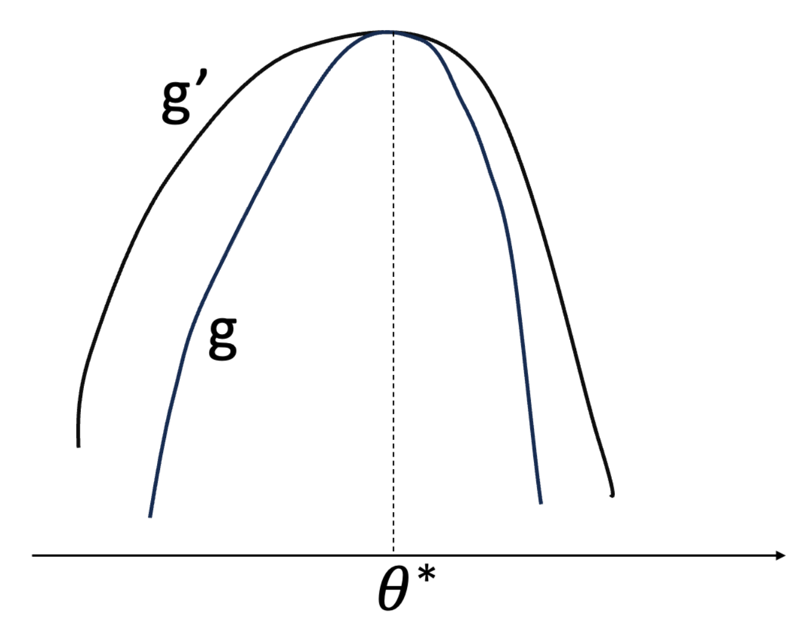

*Figure 3: A schematic illustration of the relation between class-weighted margin $g^{\prime}$ and maximum margin $g$.* **[p. 8]**

The first part of the above lemma follows from the fact that $g^{\prime}(\theta,x,y)\geq g(\theta,x,y)$. Thus, any maximizer of $g^{\prime}$ satisfying $g^{\prime}=g$ is also a maximizer of $g$ (See Figure 3). The second part states that the neurons found using Lemma 5 are indeed the exhaustive set of neurons for any maximum margin network. Moreover, any maximum margin solution has the support of $q^{*}$ on margin. The proof for the lemma can be found in Appendix E.2.

Overall, to find a $(\theta^{*},q^{*})$ pair, we will start with a guess of $q^{*}$ (which will be uniform in our case as the datasets are symmetric) and a guess of the weighing $\tau$ (which will be uniform for the modular addition case). Then, using the first part of Lemma 5, we will find all neurons which can be in the support of $\theta^{*}$ satisfying Equation 3 for the given $q^{*}$. Finally, for specific norms of the form $\|\cdot\|_{a,\nu}$, we will combine the obtained neurons using the second part of Lemma 5 to obtain a $\theta^{*}$ such that it satisfies C.1 and $q^{*}$ satisfies Equation 1. Thus, we will primarily focus on maximum margin with respect to $L_{2,\nu}$ norm in this work.

###### fig-4

*Figure 4: The maximum normalized power of the embedding vector of a neuron is given by $\max_{i}|\hat{u}[i]|^{2}/(\sum|\hat{u}[j]|^{2})$, where $\hat{u}[i]$ represents the $i^{th}$ component of the Fourier transform of $u$. (a) Initially, the maximum power is randomly distributed. (b) For 1-hidden layer ReLU network trained with $L_{2}$ regularization, the final distribution of maximum power seems to be concentrated around 0.9, meaning neurons are nearly 1-sparse in frequency space but not quite. (c) For 1-hidden layer quadratic network trained with $L_{2,3}$ regularization, the final maximum power is almost exactly 1 for all the neurons, so the embeddings are 1-sparse in frequency space, as predicted by the maximum margin analysis.* **[p. 9]**

**[p. 10]**

For a prime $p>2$, let ${\mathbb{Z}}_{p}$ denote the cyclic group on $p$ elements. For a function $f:{\mathbb{Z}}_{p}\to{\mathbb{C}}$, the discrete Fourier transform of $f$ at a frequency $j\in{\mathbb{Z}}_{p}$ is defined as

$$
\hat{f}(j):=\sum_{k\in{\mathbb{Z}}_{p}}f(k)\exp(-2\pi i\cdot jk/p).
$$

###### p10-2

Note that we can treat a vector $v\in{\mathbb{C}}^{p}$ as a function $v:{\mathbb{Z}}_{p}\to{\mathbb{C}}$, thereby endowing it with a Fourier transform. Consider the input space $\mathcal{X}:={\mathbb{Z}}_{p}\times{\mathbb{Z}}_{p}$ and output space $\mathcal{Y}:={\mathbb{Z}}_{p}$. Let the dataset $D_{p}:=\{((a,b),a+b):a,b\in{\mathbb{Z}}_{p}\}$.

###### p10-3

*Consider one-hidden layer networks $f(\theta,a,b)$ of the form given in section 2 with $m\geq 4(p-1)$ neurons. The maximum $L_{2,3}$-margin of such a network on the dataset $D_{p}$ is:*

$$
\gamma^{*}=\sqrt{\frac{2}{27}}\cdot\frac{1}{p^{1/2}(p-1)}.
$$

*Any network achieving this margin satisfies the following conditions:*

###### p10-5

1. *for each neuron*$\phi(\{u,v,w\};a,b)$*in the network, there exists a scaling constant*$\lambda\in{\mathbb{R}}$*and a frequency*$\zeta\in\{1,\dots,\frac{p-1}{2}\}$*such that*

$$
u(a) =\lambda\cos(\theta_{u}^{*}+2\pi\zeta a/p) \\
v(b) =\lambda\cos(\theta_{v}^{*}+2\pi\zeta b/p) \\
w(c) =\lambda\cos(\theta_{w}^{*}+2\pi\zeta c/p)
$$

###### p10-6

*for some phase offsets*$\theta_{u}^{*},\theta_{v}^{*},\theta_{w}^{*}\in{\mathbb{R}}$*satisfying*$\theta_{u}^{*}+\theta_{v}^{*}=\theta_{w}^{*}$*.*
2. *For every frequency*$\zeta\in\{1,\dots,\frac{p-1}{2}\}$*, at least one neuron in the network uses this frequency.*

###### p10-7

Following the blueprint described in the previous section, we first prove that neurons of the form above (and only these neurons) maximize the expected class-weighted margin $\mathbb{E}_{a,b}[\psi^{\prime}(u,v,w)]$ with respect to the uniform distribution $q^{*}=\mathrm{unif}(\mathcal{X})$. We will use the uniform class weighting: $\tau(a,b)[c^{\prime}]:=1/(p-1)$ for all $c^{\prime}\neq a+b$. As a crucial intermediate step, we prove that

$$
\mathbb{E}_{a,b}[\psi^{\prime}(\{u,v,w\},a,b)]=\frac{2}{(p-1)p^{2}}\sum_{j\neq 0}\hat{u}(j)\hat{v}(j)\hat{w}(-j),
$$

###### p10-8

Maximizing the above expression subject to the max-margin norm constraint $\sum_{j\neq 0}\left(|\hat{u}(j)|^{2}+|\hat{v}(j)|^{2}+|\hat{w}(j)|^{2}\right)\leq 1$ leads to sparsity in Fourier space.

Then, we describe a network $\theta^{*}$ (of width $4(p-1)$) composed of such neurons, and that satisfies Equation 1 and condition C.1. By Lemma 6, part (1) of Theorem 7 will follow, and $\theta^{*}$ will be an example of a max-margin network. Finally, in order to show that all frequencies are used, we introduce the multidimensional discrete Fourier transform. We prove that each neuron only contributes a single frequency to the multi-dimensional DFT of the network; but that second part of Lemma 6 implies that all frequencies are present in the full network’s multidimensional DFT. The full proof can be found in Appendix F. ∎

As demonstrated in Figure 1 and 4, empirical networks trained with gradient descent with $L_{2,3}$ regularization approach the theoretical maximum margin, and have single frequency neurons. Figure 7 in the Appendix verifies that all frequencies are present in the network.

###### fig-5

*Figure 5: Final neurons with highest norm and the evolution of normalized $L_{2,5}$ margin over training of a 1-hidden layer quartic network (activation $x^{4}$) on $(10,4)$ sparse parity dataset with $L_{2,5}$ regularization. The network approaches the theoretical maximum margin that we predict.* **[p. 11]**

**[p. 11]**

In this section, we will establish the max margin features that emerge when training a neural network on the sparse parity task. Consider the $(n,k)$-sparse parity problem, where the parity is computed over $k$ bits out of $n$. To be precise, consider inputs $x_{1},...,x_{n}\in\{\pm 1\}$. For a given subset $S\subseteq[n]$ such that $|S|=k$, the parity function is given by $\Pi_{j\in S}x_{j}$.

###### p11-2

*Consider a single hidden layer neural network of width $m$ with the activation function given by $x^{k}$, i.e, $f(x)=\sum_{i=1}^{m}(u_{i}^{\top}x)^{k}w_{i}$, where $u_{i}\in\mathbb{R}^{n}$ and $w_{i}\in\mathbb{R}^{2}$, trained on the $(n,k)-$sparse parity task. Without loss of generality, assume that the first coordinate of $w_{i}$ corresponds to the output for class $y=+1$. Denote the vector $[1,-1]$ by ${\bm{b}}$. Provided $m\geq 2^{k-1}$, the $L_{2,k+1}$ maximum margin is:*

$$
\gamma^{*}=k!\sqrt{2(k+1)^{-(k+1)}}.
$$

*Any network achieving this margin satisfies the following conditions:*

###### p11-4

1. *For every*$i$*having*$\|u_{i}\|>0$*,*$\text{spt}(u_{i})=S$*,*$w_{i}$*lies in the span of*${\bm{b}}$*and*$\forall j\in S$*,*$|u_{i}[j]|=\|w_{i}\|$*.*
2. *For every*$i$*,*$\left(\Pi_{j\in S}u_{i}[j]\right)(w_{i}^{\top}{\bm{b}})\geq 0$*.*

As shown in Figure 5, a network trained with gradient descent and $L_{2,k+1}$ regularization exhibits these properties, and approaches the theoretically-predicted maximum margin. The proof for Theorem 8 can be found in Appendix G.

###### fig-6

*Figure 6: This figure demonstrates the training of a 1-hidden layer quadratic network on the symmetric group $S5$ with $L_{2,3}$ regularization. (a) Evolution of the normalized $L_{2,3}$ margin of the network with training. It approaches the theoretical maximum margin that we predict. (b) Distribution of neurons spanned by a given representation. Higher dimensional representations have more neurons as given by our construction. (c) and (d) Maximum normalized power is given by $\max_{i}\hat{u}[i]^{2}/(\sum_{j}\hat{u}[j]^{2})$ where $\hat{u}[i]$ refers to the component of weight vector $u$ spanned by the basis vectors corresponding to $i^{th}$ representation. This is random at initialization, but towards the end of training, all neurons are concentrated in a single representation, as predicted by maximum margin.* **[p. 12]**

We conclude our case study on algebraic tasks by studying group composition on finite groups $G$. Namely, here we set $\mathcal{X}:=G\times G$ and output space $\mathcal{Y}:=G$. Given inputs $a,b\in G$ we train the network to predict $c=ab$. We wish to characterize the maximum margin features similarly to the case of modular addition; here, our analysis relies on principles from group representation theory.

###### p12-4

A quantity important to our analysis is the *character* of a representation $R$, denoted $\chi_{R}:G\to\mathbb{R}$ given by $\chi_{R}(g)=\mathrm{tr}(R(g))$. It was previously observed by Chughtai et al. 2023 that one-layer ReLU MLPs and transformers learn the task by mapping inputs $a,b$ to their respective matrices $R(a),R(b)$ for some irreducible representation $R$ and performing matrix multiplication with $R(c^{-1})$ to output logits proportional to the character $\chi_{R}(abc^{-1})=\mathrm{tr}(R(a)R(b)R(c^{-1}))$, which is in particular maximized when $c=ab$. They also find evidence of network weights being *spanned by representations*, which we establish rigorously here.

For each representation $R$ we will consider the $|G|$-dimensional vectors by fixing one index in the matrices outputted by $R$, i.e. vectors $(R(g)_{(i,j)})_{g\in G}$ for some $i,j\in[d_{R}]$. For each $R$, this gives ${d_{R}}^{2}$ vectors. Letting $K$ be the number of conjugacy classes and $R_{1},\dots,R_{K}$ be the corresponding irreducible representations, since $|G|=\sum_{n=1}^{K}d_{R_{n}}^{2}$, taking all such vectors for each representation will form a set of $|G|$ vectors which we will denote $\rho_{1},...,\rho_{|G|}$ ($\rho_{1}$ **[p. 13]** is always the vector corresponding to the trivial representation). These vectors are in fact orthogonal, which follows from orthogonality relations of the representation matrix elements $R(g)_{(i,j)}$ (see Appendix H for details). Thus, we refer to this set of vectors as *basis vectors* for $\mathbb{R}^{|G|}$. One can ask whether the maximum margin solution in this case has neurons which are spanned only by basis vectors corresponding to a single representation $R$, and if all representations are present in the network— the analogous result we obtained for modular addition in Theorem 7. We show that this is indeed the case.

###### p13-2

*Consider a single hidden layer neural network of width $m$ with quadratic activation trained on learning group composition for $G$ with real irreducible representations. Provided $m\geq 2\sum_{n=2}^{K}{d_{R_{n}}}^{3}$ and $\sum_{n=2}^{K}{d_{R_{n}}}^{1.5}\chi_{R_{n}}(C)<0$ for every non-trivial conjugacy class $C$, the $L_{2,3}$ maximum margin is:*

$$
\gamma^{*}=\frac{2}{3\sqrt{3|G|}}\frac{1}{\left(\sum_{n=2}^{K}d_{R_{n}}^{2.5}\right)}.
$$

*Any network achieving this margin satisfies the following conditions:*

###### p13-4

1. *For every neuron, there exists a non-trivial representation such that the input and output weight vectors are spanned only by that representation.*
2. *There exists at least one neuron spanned by each representation (except for the trivial representation) in the network.*

The complete proof for Theorem 9 can be found in Appendix I.

###### p13-6

The condition that $\sum_{n=2}^{K}{d_{R_{n}}}^{1.5}\chi_{R_{n}}(C)<0$ for every non-trivial conjugacy class $C$ holds for the symmetric group $S_{k}$ up until $k=5$. In this case, as shown in Figure 6, network weights trained with gradient descent and $L_{2,3}$ regularization exhibit similar properties. The maximum margin of the network approaches what we have predicted in theory. Analogous results for training on $S_{3}$ and $S_{4}$ in Figures 8 and 9 are in the Appendix.

###### p13-7

Although Theorem 9 does not apply to all finite groups with real representations, it can be extended to apply more generally. The theorem posits that *every* representation is present in the network, and *every* conjugacy class is present on the margin. Instead, for general finite groups, each neuron still satisfies the characteristics of max margin solutions in that it is only spanned by one non-trivial representation, but only a *subset* of representations are present in the network; moreover, only a subset of conjugacy classes are present on the margin. More details are given in Appendix I.2.

###### p13-8

We have shown that the simple condition of margin maximization can, in certain algebraic learning settings, imply very strong conditions on the representations learned by neural networks. The mathematical techniques we introduce are general, and may be able to be adapted to other settings than the ones we consider. Our proof holds for the case of $x^{2}$ activations ($x^{k}$ activations, in the $k$-sparse parity case) and $L_{2,\nu}$ norm, where $\nu$ is the homogeneity constant of the network. Empirical findings suggest that the results may be transferable to other architectures and norms. In general, we think explaining how neural networks adapt their representations to symmetries and other structure in data is an important subject for future theoretical and experimental inquiry.

**[p. 14]**

###### p18-5

The area of mechanistic interpretability aims to understand the internal representations of individual neural networks by analyzing its weights. This form of analysis has been applied to understand the motifs and features of neurons in *circuits*— particular subsets of a neural network— in computer vision models (Olah et al. 2020; Cammarata et al. 2020) and more recently in language models (Elhage et al. 2021; Olsson et al. 2022). However, the ability to fully reverse engineer a neural network is extremely difficult for most tasks and architectures. **[p. 19]** Some work in this area has shifted towards finding small, toy models that are easier to interpret, and employing labor intensive approaches to reverse-engineering specific features and circuits in detail(Elhage et al. 2022). In Nanda et al. 2023, the authors manage to fully interpret how one-layer transformers implement modular addition and use this knowledge to define progress measures that precede the grokking phase transition which was previously observed to occur for this task (Power et al. 2022). Chughtai et al. 2023 extends this analysis to learning composition for various finite groups, and identifies analogous results and progress measures. In this work, we show that these empirical findings can be analytically explained via max margin analysis, due to the implicit bias of gradient descent towards margin maximization.

###### p19-2

We train a 1-hidden layer network with $m=500$, using gradient descent on the task of learning modular addition for $p=71$ for $40000$ steps. The initial learning rate of the network is $0.05$, which is doubled on the steps - $[1e3,2e3,3e3,4e3,5e3,6e3,7e3,8e3,9e3,10e3]$. Thus, the final learning rate of the network is $51.2$. This is done to speed up the training of the network towards the end, as the gradient of the loss goes down exponentially. For quadratic network, we use a $L_{2,3}$ regularization of $1e-4$. For ReLU network, we use a $L_{2}$ regularization of $1e-4$.

###### p19-3

We train a 1-hidden layer quadratic network with $m=40$ on $(10,4)-$sparse parity task. It is trained by gradient descent for $30000$ steps with a learning rate of $0.1$ and $L_{2,5}$ regularization of $1e-3$.

###### p19-5

We train a 1-hidden layer quadratic network with $m=30$, using gradient descent for $50000$ steps, with a $L_{2,3}$ regularization of $1e-7$. The initial learning rate is $0.05$, which is doubled on the steps - $[200,400,600,800,1000,1200,1400,1600,1800,2000,2200,2400,2600,5000,10000]$. Thus, the final learning rate is $1638.4$. This is done to speed up the training of the network towards the end, as the gradient of the loss goes down exponentially.

###### p20-1

We train a 1-hidden layer quadratic network with $m=2000$, using stochastic gradient descent for $75000$ steps, with a batch size of $1000$ and $L_{2,3}$ regularization of $1e-5$. The initial learning rate is $0.05$, which is doubled on the steps - $[3000,6000,9000,12000,15000,18000,21000,24000]$. Thus, the final learning rate is $12.8$. This is done to speed up the training of the network towards the end, as the gradient of the loss goes down exponentially.

###### fig-7

*Figure 7: Final distribution of the neurons corresponding to a particular frequency in (a) ReLU network trained with $L_{2}$ regularization and (b) Quadratic network trained with $L_{2,3}$ regularization. Similar to our construction, the final distribution across frequencies is close to uniform.* **[p. 20]**

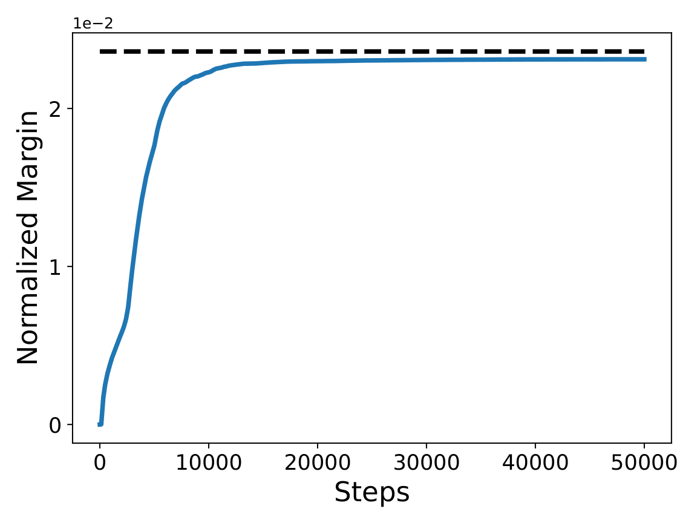

*(a) Normalized Margin*

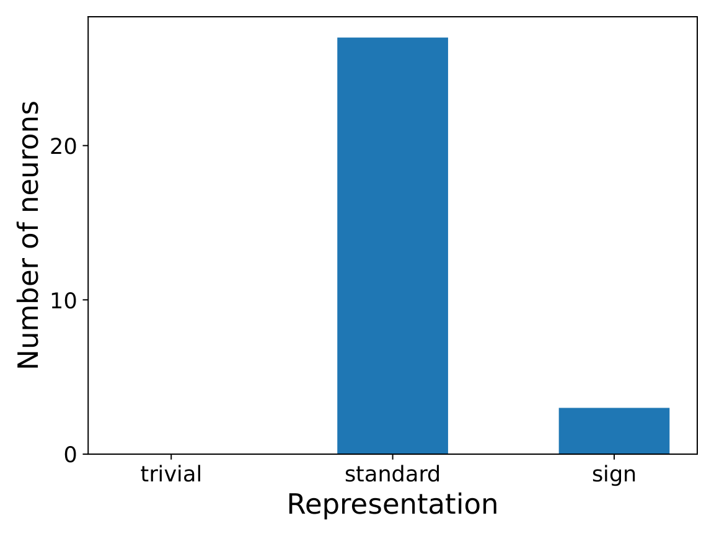

*(b) Representation distribution*

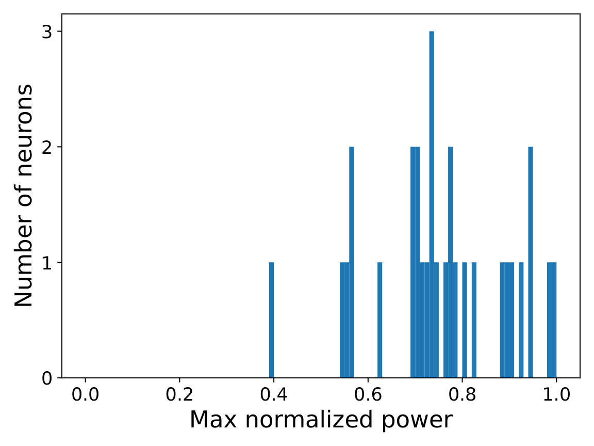

*(c) Initial Maximum Power Distribution*

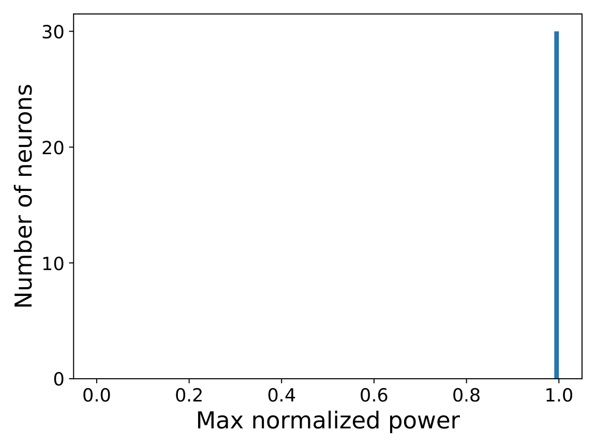

**[p. 21]**

*(d) Final Maximum Power Distribution*

*Figure 8: This figure demonstrates the training of a 1-hidden layer quadratic network on the symmetric group $S3$ with $L_{2,3}$ regularization. (a) Evolution of the normalized $L_{2,3}$ margin of the network with training. It approaches the theoretical maximum margin that we predict. (b) Distribution of neurons spanned by a given representation. Higher dimensional representations have more neurons as given by our construction. (c) and (d) Maximum normalized power is given by $\frac{\max\hat{u}[i]^{2}}{\sum_{j}\hat{u}[j]^{2}}$ where $\hat{u}[i]$ refers to the component of weight $u$ along $i^{th}$ representation. Initially, it’s random, but towards the end of training, all neurons are concentrated in a single representation, as predicted by maximum margin.* **[p. 21]**

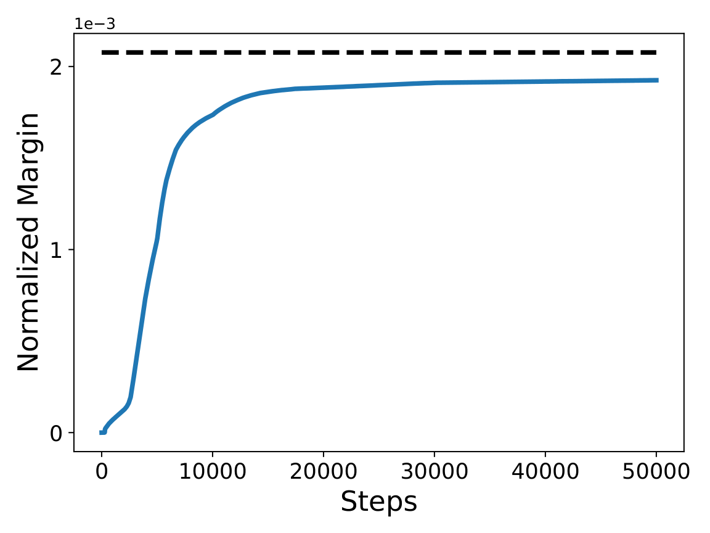

*(a) Normalized Margin*

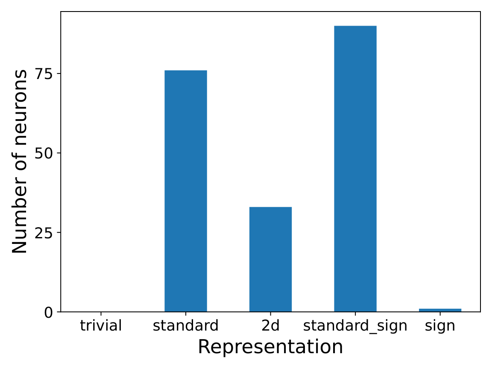

*(b) Representation distribution*

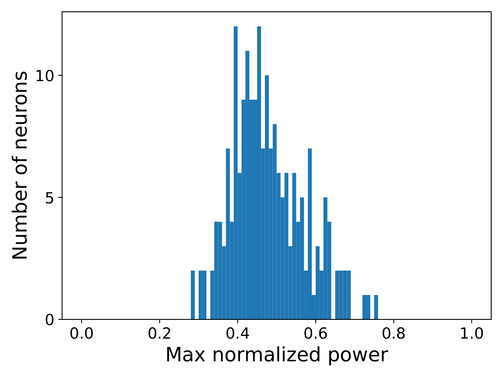

*(c) Initial Maximum Power Distribution*

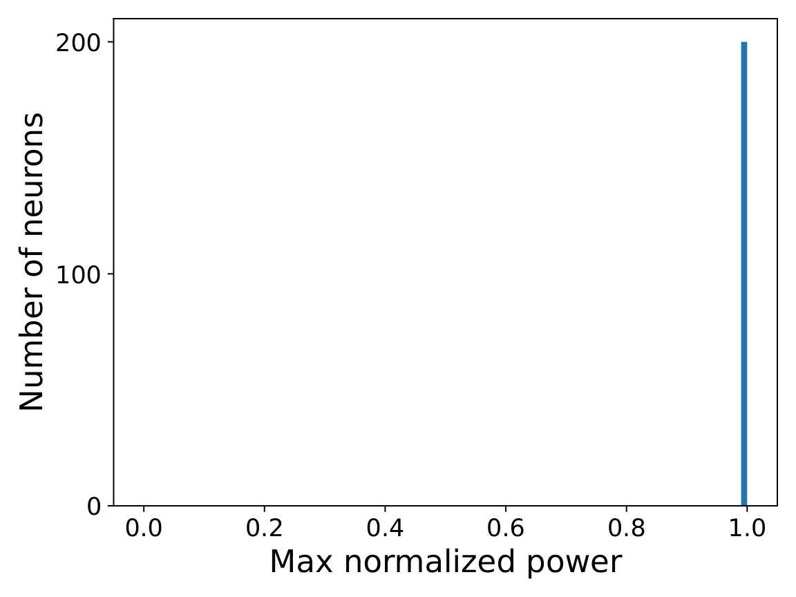

**[p. 22]**

*(d) Final Maximum Power Distribution*

*Figure 9: This figure demonstrates the training of a 1-hidden layer quadratic network on the symmetric group $S4$ with $L_{2,3}$ regularization. (a) Evolution of the normalized $L_{2,3}$ margin of the network with training. It approaches the theoretical maximum margin that we predict. (b) Distribution of neurons spanned by a given representation. Higher dimensional representations have more neurons as given by our construction. (c) and (d) Maximum normalized power is given by $\frac{\max\hat{u}[i]^{2}}{\sum_{j}\hat{u}[j]^{2}}$ where $\hat{u}[i]$ refers to the component of weight $u$ along $i^{th}$ representation. Initially, it is random, but towards the end of training, all neurons are concentrated on a single representation, as predicted by the maximum margin analysis.* **[p. 22]**

###### p22-2

For any function $r:[n]^{2}\to[n]$, there exists a neural network parameterized by $\theta$ of the form considered in Sections 4 and 6 with $2p^{2}$ neurons such that $f(\theta,(a,b))[c]=\bm{1}_{c=r(a,b)}$ and that is “dense” in the Fourier spectrum. For each pair $(a,b)$ we use two neurons given by $\{u,v,w\}$ and $\{u^{\prime},v^{\prime},w^{\prime}\}$, where $u_{i}=u^{\prime}_{i}=\bm{1}_{i=a}$, $v_{i}=\bm{1}_{i=b}$, $v^{\prime}_{i}=-1_{i=b}$, $w_{i}=\bm{1}_{i=r(a,b)}/4$and $w^{\prime}_{i}=-\bm{1}_{i=r(a,b)}/4$. When adding together the outputs for these two neurons, for an input of $(i,j)$ we get $k$th logit equal to:

$$
\frac{1}{4}\left((\bm{1}_{i=a}+\bm{1}_{j=b})^{2}\bm{1}_{k=r(i,j)}-(\bm{1}_{i=a}-\bm{1}_{j=b})^{2}\bm{1}_{k=r(i,j)}\right)=\bm{1}_{i=a}\bm{1}_{j=b}\bm{1}_{k=r(a,b)}
$$

###### p22-3

Hence, these two norms help “memorize” the output for $(a,b)$ while not influencing the output for any other input, so when summing together all these neurons we get an $f$ with the aforementioned property. Note that all the vectors used are (up to sign) one-hot encodings and thus have an uniform norm in the Fourier spectrum. This is to show that Fourier sparsity is not present in any correct classifier.

###### p23-1

*Note that the analysis in above proof can be used to compute optimal norms for $b\neq\nu$ as well - however, for any such $b$ we would not get the same flexibility to build a $\theta^{*}$ satisfying Equation 1. This is the reason behind choosing $b=\nu$.*

Now, we will provide the proof of Lemma 4.

###### p25-8

We have arrived at the crux of why any max margin solution must be sparse in the Fourier domain: in order to maximize expression 6, we must concentrate the mass of $\hat{u}$, $\hat{v}$, and $\hat{w}$ on the same frequencies, the fewer the better. We will now work this out carefully. Since $u,v,w$ are real-valued, we have

$$
\hat{u}(-j)=\overline{\hat{u}(j)},\hat{v}(-j)=\overline{\hat{v}(j)},\hat{w}(-j)=\overline{\hat{w}(j)}
$$

for all $j\in{\mathbb{Z}}_{p}$. Let $\theta_{u},\theta_{v},\theta_{w}\in[0,2\pi)^{p}$ be the phase components of $u,v,w$ respectively; so, e.g., for $\hat{u}$:

$$
\hat{u}(j)=|\hat{u}(j)|\exp(i\theta_{u}(j)).
$$

Then, for odd $p$, expression 6 becomes:

$$
\quad\frac{2}{(p-1)p^{2}}\sum_{j=1}^{(p-1)/2}\left[\hat{u}(j)\hat{v}(j)\overline{\hat{w}(j)}+\overline{\hat{u}(j)}\overline{\hat{v}(j)}\hat{w}(j)\right] \\
=\frac{2}{(p-1)p^{2}}\sum_{j=1}^{(p-1)/2}|\hat{u}(j)||\hat{v}(j)||\hat{w}(j)|\left[\exp(i(\theta_{u}(j)+\theta_{v}(j)-\theta_{w}(j))+\exp(i(-\theta_{u}(j)-\theta_{v}(j)+\theta_{w}(j))\right] \\
=\frac{4}{(p-1)p^{2}}\sum_{j=1}^{(p-1)/2}|\hat{u}(j)||\hat{v}(j)||\hat{w}(j)|\cos(\theta_{u}(j)+\theta_{v}(j)-\theta_{w}(j)).
$$

Thus, we need to optimize:

$$
\max_{u,v,w:\|u\|^{2}+\|v\|^{2}+\|w\|^{2}\leq 1}\frac{4}{(p-1)p^{2}}\sum_{j=1}^{(p-1)/2}|\hat{u}(j)||\hat{v}(j)||\hat{w}(j)|\cos(\theta_{u}(j)+\theta_{v}(j)-\theta_{w}(j)). \tag{7}
$$

By Plancherel’s theorem, the norm constraint is equivalent to

**[p. 26]**

$$
\|\hat{u}\|^{2}+\|\hat{v}\|^{2}+\|\hat{w}\|^{2}\leq p,
$$

so the choice of $\theta_{u}(j),\theta_{v}(j),\theta_{w}(j)$ is unconstrained. Therefore, we can (and must) choose them to satisfy $\theta_{u}(j)+\theta_{v}(j)=\theta_{w}(j)$, so that $\cos(\theta_{u}(j)+\theta_{v}(j)-\theta_{w}(j))=1$ is maximized for each $j$ (unless the amplitude part of the $j$th term is 0, in which case the phase doesn’t matter). The problem is thus further reduced to:

$$
\max_{|\hat{u}|,|\hat{v}|,|\hat{w}|:\|\hat{u}\|^{2}+\|\hat{v}\|^{2}+\|\hat{w}\|^{2}\leq p}\frac{4}{(p-1)p^{2}}\sum_{j=1}^{(p-1)/2}|\hat{u}(j)||\hat{v}(j)||\hat{w}(j)|. \tag{8}
$$

By the inequality of quadratic and geometric means,

$$
|\hat{u}(j)||\hat{v}(j)||\hat{w}(j)|\leq\left(\frac{|\hat{u}(j)|^{2}+|\hat{v}(j)|^{2}+|\hat{w}(j)|^{2}}{3}\right)^{3/2}. \tag{9}
$$

Let $z:\{1,\dots,\frac{p-1}{2}\}\to{\mathbb{R}}$ be defined as $z(j):=|\hat{u}(j)|^{2}+|\hat{v}(j)|^{2}+|\hat{w}(j)|^{2}$. Then, since we must have $\hat{u}(0)=\hat{v}(0)=\hat{w}(0)=0$ in the optimization above, we can upper-bound expression 8 by

$$
\quad\frac{4}{(p-1)p^{2}}\cdot\max_{\|z\|_{1}\leq\frac{p}{2}}\sum_{j=1}^{(p-1)/2}\left(\frac{z(j)}{3}\right)^{3/2} \\
\leq\frac{4}{3^{3/2}(p-1)p^{2}}\cdot\max_{\|z\|_{1}\leq\frac{p}{2}}\left(\sum_{j=1}^{(p-1)/2}z(j)^{2}\right)^{1/2}\cdot\left(\sum_{j=1}^{(p-1)/2}z(j)\right)^{1/2} \\
=\frac{2^{3/2}}{3^{3/2}(p-1)p^{3/2}}\cdot\max_{\|z\|_{1}\leq\frac{p}{2}}\|z\|_{2} \\
\leq\frac{2^{3/2}}{3^{3/2}(p-1)p^{3/2}}\cdot\frac{p}{2}=\sqrt{\frac{2}{27}}\cdot\frac{1}{p^{1/2}(p-1)}.
$$

The only way to turn inequality 9 into an equality is to set $|\hat{u}(j)|=|\hat{v}(j)|=|\hat{w}(j)|$, and the only way to achieve $\|z\|_{2}=\frac{p}{2}$ is to place all the mass on a single frequency, so the only possible way to achieve the upper bound is to set

$$
|\hat{u}(j)|=|\hat{v}(j)|=|\hat{w}(j)|=\begin{cases}\sqrt{p/6}&\text{if }j=\pm\zeta\\
0&\text{otherwise}\end{cases}.
$$

**[p. 27]**

for some frequency $\zeta\in\{1,\dots,\frac{p-1}{2}\}$. In this case, we indeed match the upper bound:

$$
\frac{4}{(p-1)p^{2}}\cdot\left(\frac{p}{6}\right)^{3/2}=\sqrt{\frac{2}{27}}\cdot\frac{1}{p^{1/2}(p-1)}.
$$

so this is the maximum margin.

Putting it all together, and abusing notation by letting $\theta_{u}^{*}:=\theta_{u}(\zeta)$, we obtain that all neurons maximizing the expected class-weighted margin are of the form (up to scaling):

$$
u(a) =\frac{1}{p}\sum_{j=0}^{p-1}\hat{u}(j)\rho^{ja} \\
=\frac{1}{p}\left[\hat{u}(\zeta)\rho^{\zeta a}+\hat{u}(-\zeta)\rho^{-\zeta a}\right] \\
=\frac{1}{p}\left[\sqrt{\frac{p}{6}}\exp(i\theta_{u}^{*})\rho^{\zeta a}+\sqrt{\frac{p}{6}}\exp(-i\theta_{u}^{*})\rho^{-\zeta a}\right] \\
=\sqrt{\frac{2}{3p}}\cos(\theta_{u}^{*}+2\pi\zeta a/p)
$$

and

$$
v(b) =\sqrt{\frac{2}{3p}}\cos(\theta_{v}^{*}+2\pi\zeta b/p) \\
w(c) =\sqrt{\frac{2}{3p}}\cos(\theta_{w}^{*}+2\pi\zeta c/p)
$$

for some phase offsets $\theta_{u}^{*},\theta_{v}^{*},\theta_{w}^{*}\in{\mathbb{R}}$ satisfying $\theta_{u}^{*}+\theta_{v}^{*}=\theta_{w}^{*}$ and some $\zeta\in{\mathbb{Z}}_{p}\setminus\{0\}$ (where $\zeta$ is the same for $u$, $v$, and $w$). ∎

It remains to construct a network $\theta^{*}$ which uses neurons of the above form and satisfies condition C.1 and Equation 1 with respect to $q=\textrm{unif}({\mathbb{Z}}_{p})$.

###### p34-8

*Suppose the weights $\tau_{c}$ in the expression for the weighted margin in 10 were constant over conjugacy classes, i.e. we have $\tau_{c}=\tau_{C_{i}}$ for all $c\in C_{i}$ and $i\in[K]$. Then the weighted margin can be simplified as*

$$
\sum_{m=2}^{K}\left(1-\sum_{n=2}^{K}\frac{\tau_{C_{n}}|C_{n}|\chi_{R_{m}}(C_{n})}{d_{R_{m}}}\right)\frac{\mathrm{tr}({\bm{\alpha}_{R_{m}}\bm{\beta}_{R_{m}}{\bm{\gamma}_{R_{m}}}^{T}})}{{d_{R_{m}}}^{2}}.
$$

###### p37-6

Now consider the general case when $u,v,w$ were spanned by the representations $R_{2},...,R_{K}$ (as $R_{1}$ does not appear in Equation 16). The norm constraint now becomes

$$
\sum_{m=2}^{K}\frac{|G|}{d_{R_{m}}}\left(\|\bm{\alpha}_{R_{m}}\|_{F}^{2}+\|\bm{\beta}_{R_{m}}\|_{F}^{2}+\|\bm{\gamma}_{R_{m}}\|_{F}^{2}\right)\leq 1.
$$

This can be equivalently written as

$$
\|\bm{\alpha}_{R_{m}}\|_{F}^{2}+\|\bm{\beta}_{R_{m}}\|_{F}^{2}+\|\bm{\gamma}_{R_{m}}\|_{F}^{2}\leq\frac{d_{R_{m}}\varepsilon_{m}}{|G|}\quad\forall m\in\{2,...,K\} \\
\epsilon_{m}\geq 0\quad\forall m\in\{2,...,K\} \\
\sum_{m=2}^{K}\epsilon_{m}\leq 1
$$

Repeating the calculation above, we get that for a given $\epsilon_{2},...,\epsilon_{K}$, the maximum margin is given by

$$
\sum_{m=2}^{K}\frac{\epsilon_{m}^{3/2}}{3\sqrt{3}|G|^{3/2}}\frac{1}{\sqrt{d_{R_{m}}}}\left[1-\sum_{n=2}^{K}\frac{\tau_{C_{n}}|C_{n}|\chi_{R_{m}}(C_{n})}{d_{R_{m}}}\right]
$$

We want to maximize the expression above under the constraint that $\epsilon_{m}\geq 0\quad\forall m\in\{2,...,K\}$ and $\sum\epsilon_{m}\leq 1$.

Clearly, this is maximized only when one of the $\epsilon_{i}=1$ and everything else is 0, with $i\in\argmax_{m=2,..,K}\frac{1}{\sqrt{d_{R_{m}}}}\left[1-\sum_{n=2}^{K}\frac{\tau_{C_{n}}|C_{n}|\chi_{R_{m}}(C_{n})}{d_{R_{m}}}\right]$. ∎

**[p. 38]**

Up until this point, we have kept our weighted margin problem generic without setting the $\tau_{C_{n}}$. If we naively chose $\tau_{C_{n}}$ to weigh the conjugacy classes uniformly, then the maximizers for this specific weighted margin would be only neuron weights spanned by the sign representation (of dimension 1). However, we cannot hope to correctly classify all pairs $a,b\in G$ using only the sign representation for our network $\theta^{*}$ and thus the maximizers for this weighted margin cannot be the maximizers for the original max margin problem. The next lemma establishes an appropriate assignment for each $\tau_{C_{n}}$ such that the expression in Lemma 18 is equal for all non-trivial representations $R$, provided some conditions pertaining to the group are satisfied. Since the function $g\mapsto\tau_{C}$ (where $C$ is the conjugacy class containing $g$) is a class function, each $\tau_{C_{n}}$ can be expressed as a linear combination of characters $\chi_{R}(C_{n})$.

###### p38-2

*For the group $G$ if we have $\sum_{R}d_{R}^{1.5}\chi_{R}(C)<0$ for every non-trivial conjugacy class $C$, then the weights $\tau_{C_{n}}$ can be set as*

$$
\tau_{C_{n}}=\sum_{R}z_{R}\chi_{R}(C_{n})
$$

*where $z_{R_{\text{triv}}}=0$ and $z_{R}=\frac{d_{R}^{1.5}}{\sum_{m=2}^{K}d_{R_{m}}^{2.5}}$ otherwise, such that the maximum value from Lemma 18 is equal for all non-trivial representations $R$.*

###### p38-7

Furthermore, since $1-\sum_{n=2}^{K}\tau_{C_{n}}=0$ and $\mathrm{char}(R_{\mathrm{triv}})$ is a vector with strictly positive values that is orthogonal to all other character vectors, we must have $z_{R_{\mathrm{triv}}}=0$. To solve for $z_{R_{\mathrm{sign}}}$, since the first component of $\tau$ equals $1$ and $\chi_{R}(C_{1})=d_{R}$ for all $R$, we have

$$
\sum_{m=2}^{K}z_{R_{m}}d_{R_{m}}=\sum_{m=2}^{K}d_{R_{m}}^{2.5}z_{R_{\mathrm{sign}}}=1\implies z_{R_{\mathrm{sign}}}=\sum_{m=2}^{K}d_{R_{m}}^{2.5}.
$$

To conclude the proof, note that we need the weights $\tau_{C_{n}}$ to be positive; this is guaranteed as long as for each conjugacy class $C$, we have $\sum_{n=2}^{K}\chi_{R_{n}}(C){d_{R_{n}}}^{3/2}<0$ (recall the entries of $\tau$ being $-\tau_{C_{n}}$).

∎

Up until now, we have established a weighted margin problem and proven that the neurons which maximize this are spanned by only one representation out of any of the non-trivial representations. Now we give a precise construction of the neuron weights $u,v,w$ such that they implement $\mathrm{tr}(R(a)R(b)R(c)^{-1})$ for all inputs $a,b\in G$ and outputs $c\in G$ for a given representation $R$. These neuron weights expressed in terms of the basis vectors will have coefficients that also maximize $\mathrm{tr}(\bm{\alpha}_{R}\bm{\beta}_{R}{\bm{\gamma}_{R}}^{T})$.

**[p. 39]**

###### p39-1

*For every non-trivial representation $R$, there exists a construction of the network weights such that given inputs $a,b\in G$, the output at $c$ is $\mathrm{tr}(R(a)R(b)R(c)^{-1})$ using $2{d_{R}}^{3}$ neurons and the corresponding coefficients $\bm{\alpha}_{R},\bm{\beta}_{R},\bm{\gamma}_{R}$ for each neuron achieve the maximum value $\mathrm{tr}(\bm{\alpha}_{R}\bm{\beta}_{R}{\bm{\gamma}_{R}}^{T})={(d_{R}/3|G|)}^{3/2}.$*

###### p39-8

For a given neuron spanned by a non-trivial representation $R$, we know that its output for at $c$ for each input pair $(a,b)$ is $\chi_{R}(abc^{-1})=\chi_{R}(C)$ where $C$ is the conjugacy class containing $abc^{-1}$. After scaling each weight by $d_{R}^{1/3}/\Delta$, the corresponding output is scaled by $d_{R}/\Delta^{3}$. Due to column orthogonality of the characters with the trivial conjugacy class (i.e. $\sum_{n=1}^{K}\chi_{R_{n}}(e)\chi_{R_{n}}(C)=0$ for for all non-trivial conjugacy classes $C$), this output simplifies to

$$
\sum_{n=2}^{K}\frac{d_{R_{n}}\chi_{R}(C)}{\Delta^{3}}=-\frac{1}{\Delta^{3}}\sum_{n=2}^{K}\frac{d_{R_{n}}\chi_{R}(C)}{\Delta^{3}}=-\frac{1}{\Delta^{3}}, \tag{19}
$$

which is constant for all non-trivial conjugacy classes $C$.

∎

With this lemma, we define the network $\theta^{*}$ according to this scaling and guarantee that it satisfies C.1 and Equation 1. Applying Lemma 5 gives us our final result that the solutions for the max margin problem have the desired properties in Theorem 9.

**[p. 40]**

###### p41-1

As mentioned in section 6, Theorem 9 does not hold for all groups because of the required condition that $\sum_{n=2}^{K}d_{R_{n}}^{1.5}\chi_{R_{n}}(C)<0$ for every non-trivial conjugacy class. Recall that in the previous section, we had to define an appropriate weighting over *all* conjugacy classes such that the margin of a neuron did not scale down with the dimension of the neuron’s spanning representation. We also had to define an appropriate scaling over *all* representations so we could use the neuron maximizers of the weighted margin to construct a network $\theta^{*}$ to invoke Lemma 5. This is akin to selecting the entire character table for our margin analysis; in this section, we show how our analysis is amenable to selecting a *subset* of the character table for the margin analysis of a general finite group $G$, which can lead to a max margin solution in the same way as above. This will occur upon solving a system of two linear equations, as long as these solutions satisfy some conditions.

Namely, let $\kappa_{R},\kappa_{C}\subset[K]\setminus\{1\}$ be subsets indicating which representations and which conjugacy classes will be considered in the scaling and weighting respectively, with $|\kappa_{R}|=|\kappa_{C}|$. If we view the character table as a matrix and consider the square submatrix pertaining to only the representations indexed by elements in $\kappa_{R}$ and the conjugacy classes indexed by elements in $\kappa_{C}$, the rows are $\chi_{R_{m}}$ for fixed $m\in\kappa_{R}$ and the columns are $[\chi_{R_{m}}(C_{n})]_{m\in\kappa_{R}}$ for fixed $n\in\kappa_{C}$.

Instead of requiring expression (18) to be equal for all representations in the proof of Lemma 19, we can instead require that they are equal across representations in $\kappa_{R}$. To be precise, consider the following set of equations over variables $\tau_{C_{n}},n\in\kappa_{C}$:

$$
\left(1-\sum_{n\in\kappa_{C}}\frac{\tau_{C_{n}}|C_{n}|\chi_{R_{m}}}{d_{R_{m}}}\right)=\sqrt{\frac{d_{R_{m}}}{d_{R_{m^{\prime}}}}}\left(1-\sum_{n\in\kappa_{C}}\frac{\tau_{C_{n}}|C_{n}|\chi_{R_{m^{\prime}}}}{d_{R_{m^{\prime}}}}\right)\;\forall\;m,m^{\prime}\in\kappa_{R}, \\
\sum_{n\in\kappa_{C}}\tau_{C_{n}}=1.
$$

This gives a system of $|\kappa_{C}|$ linear equations in $|\kappa_{C}|$ variables. Let the solution be denoted as $\tau_{C_{n}}^{*}$ for each $n\in\kappa_{C}$.

Furthermore, just as we established in equation 19, we can identify a scaling dependent on each representation such that the output remains constant for all conjugacy classes in $\kappa_{C}$ and such that if we had used this scaling for neurons maximizing the weighted margin, the $L_{2,3}$ norm constraint is maintained. This can be represented using the following set of equations with variables $\lambda_{R_{m}}$:

$$
\sum_{m\in\kappa_{R}}\lambda_{R_{m}}\chi_{R_{m}}(C_{n})=\sum_{m\in\kappa_{R}}\lambda_{R_{m}}\chi_{R_{m}}(C_{n^{\prime}})\;\forall\;n,n^{\prime}\in\kappa_{C} \\
\sum_{m\in\kappa_{R}}\lambda_{R_{m}}=1.
$$

This again forms a system of $|\kappa_{R}|$ linear equations in $|\kappa_{R}|$ variables. Let the solution be denoted as $\lambda_{R_{m}}^{*}$. Suppose the following conditions are satisfied:

1. The weighting and scaling are positive: $\lambda_{R_{m}}^{*},\tau_{C_{n}}^{*}\geq 0$ for all $m\in\kappa_{R},n\in\kappa_{C}$.
2. For any $m\in\kappa_{R}$ and $m^{\prime}\notin\kappa_{R}$, we have

$$
\left(1-\sum_{n\in\kappa_{C}}\frac{\tau_{C_{n}}|C_{n}|\chi_{R_{m}}}{d_{R_{m}}}\right)\geq\sqrt{\frac{d_{R_{m}}}{d_{R_{m^{\prime}}}}}\left(1-\sum_{n\in\kappa_{C}}\frac{\tau_{C_{n}}|C_{n}|\chi_{R_{m^{\prime}}}}{d_{R_{m^{\prime}}}}\right).
$$
3. For any $n\in\kappa_{C}$ and $n^{\prime}\notin\kappa_{C}$, we have

$$
\sum_{m\in\kappa_{R}}\lambda_{R_{m}}\chi_{R_{m}}(C_{n})\geq\sum_{m\in\kappa_{R}}\lambda_{R_{m}}\chi_{R_{m}}(C_{n^{\prime}}).
$$

**[p. 42]**

The second condition ensures that the representations in $\kappa_{R}$ indeed maximize the weighted margin, and no other representations maximize it. The third condition above ensures that the conjugacy classes in $\kappa_{C}$ are on the margin, and no other conjugacy class can be on the margin. Then it follows that neurons spanned by the representations in $\kappa_{R}$ will maximize the weighted margin defined using $\tau^{*}$ with all conjugacy classes in $\kappa_{C}$ on the margin, and thus scaling these neurons by $\lambda^{*}$, we have a network $\theta^{*}$ that is a max margin solution for the group $G$.
