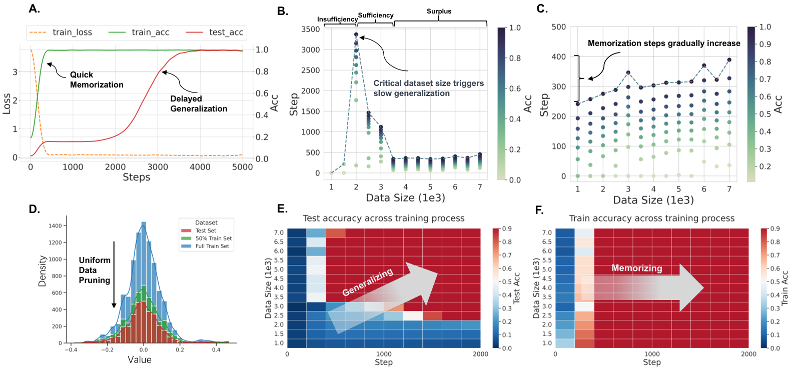
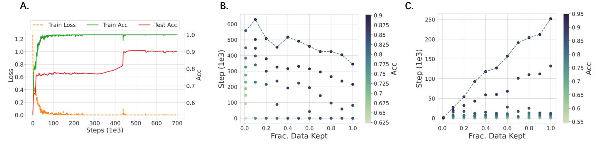
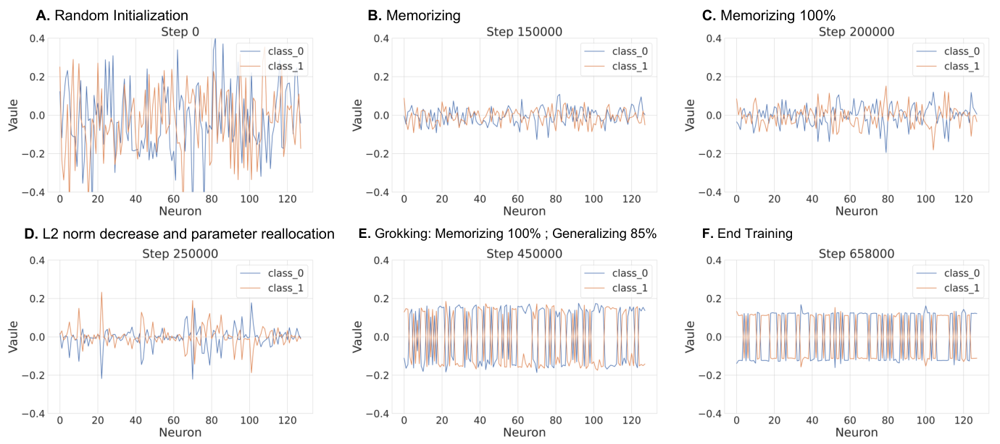
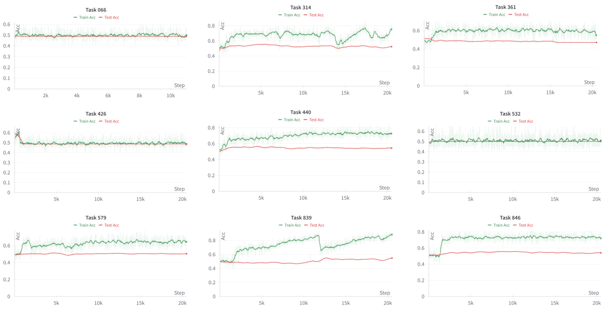
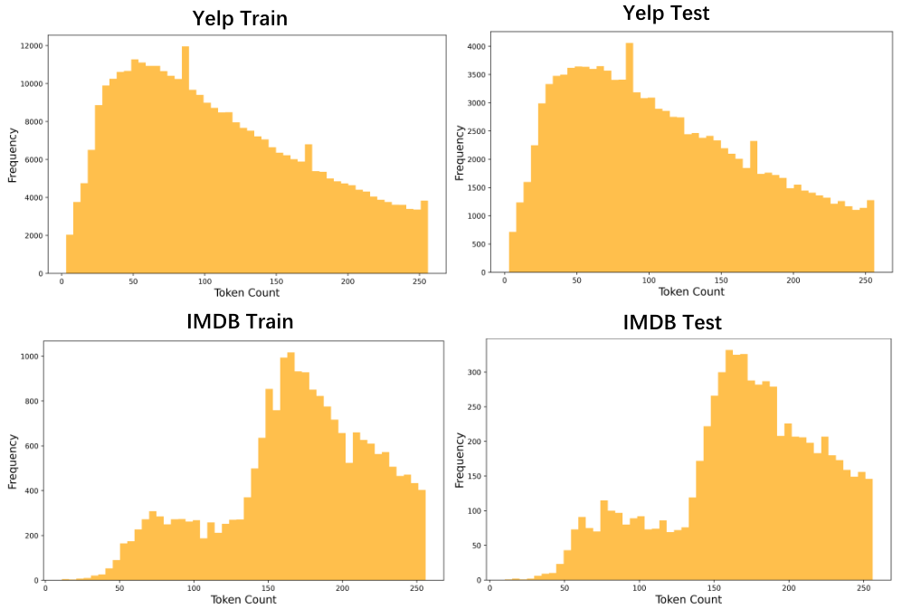

# Zhu et al. 2024 — Critical Data Size of Language Models from a Grokking Perspective

See also: [the global concept index](../../concepts/index.md). arXiv [2401.10463v3](https://arxiv.org/abs/2401.10463), 19 January 2024 (v3 — 23 May 2024). PDF running head: "Preprint. Under review.".

**Xuekai Zhu** — Shanghai Jiao Tong University; correspondence: xuekaizhu0@gmail.com. **Yao Fu** — University of Edinburgh. **Bowen Zhou** — Tsinghua University. **Zhouhan Lin** — Shanghai Jiao Tong University.

The files of this paper's analysis:

- [`2401.10463.critical-data-size-of-language-models-from-a-grokking-perspective.license.txt`](2401.10463.critical-data-size-of-language-models-from-a-grokking-perspective.license.txt) — the arXiv licence record for this paper.

The anchor scheme and the rules for linking into a card are in the [README of the papers folder](../README.md).

**Excerpt card.** The paper's licence (`arxiv-nonexclusive`) does not permit republishing the paper itself; what stands here are the editorial sections and the fragments the corpus quotes (right of quotation). The paper: <https://arxiv.org/abs/2401.10463>.

## Concepts covered

**[The data fraction / the critical dataset size](../../concepts/data-fraction-critical-dataset-size.md)** — here the work gives the corpus a whole definition rather than an observation: the **critical data size (CDS)** is introduced as the smallest number of examples $n$ at which a roughly hundred-per-cent training accuracy and a converged test accuracy $\epsilon$ are attained ([p. 3, para. 2](#p3-2), [definition 1](#p3-3)). Around it a **data-efficiency hypothesis** is built with three regimes — [insufficiency](#p3-6), [sufficiency](#p3-7) and [surplus](#p3-8) of data. More important in practice than the definition itself is the **identifying feature** proposed: a peak in the number of steps to generalisation on the curve "data fraction → steps", to the left of which there is no generalisation, at which it is slowest, and to the right of which it accelerates ([fig. 1B](#fig-1), [fig. 2B](#fig-2), [fig. 3B](#fig-3)); this feature is cheap and carries over to any dataset. The authors themselves separate their notion outright from the identically named $D_{crit}$ of Varma et al.: in them it is the number of points at which the memorising and generalising circuits give equal logits, and here a threshold beyond which generalisation occurs at all ([A.1](#p12-2)). The fractions are obtained by a uniform thinning without replacement preserving the proportions of the original distribution ([§3.2](#p4-6), [fig. 12](#fig-12)). What the work does not contain: the CDS is not predicted but measured after the fact by a full sweep of fractions with training to completion at each; the authors themselves call the hypothesis informal, since it relies on a $\epsilon$ and a distribution $\mathcal{D}$ known in advance ([p. 3, para. 9](#p3-9)). The CDS figures for the language datasets are not named in the work at all — there is only the position of the peak on a graph.

**[Grokking](../../concepts/grokking.md)** — the work takes grokking not as a subject of explanation but as an instrument: "to use grokking as a lens through which to understand the training dynamics of language models, rather than to explain grokking as previous studies have done" ([E](#p16-4)). Whence its contribution to the notion is an **inducement setting**: a rescaling of all the weights by a factor $\alpha$ (taken from Omnigrok) with dropout set to 0, so that after the training loss vanishes the only driver of the optimisation left is weight decay ([§3.1](#p3-10), [p. 4, para. 2](#p4-2)). In this setting grokking is obtained on IMDB by a single-layer encoder-only transformer: the test accuracy holds near the level of chance and rises in a jump at around 350 000 steps ([p. 5, para. 2](#p5-2), [fig. 2A](#fig-2)). What the work does not contain: not one model here is trained on the task of language modelling — three settings of four are text classification by an encoder, and the fourth is modular arithmetic by a decoder; on models of order 7B the authors expressly admit an inability to reproduce grokking with their setting ([H](#p18-1)). The **robustness** of the reproduction claimed in the abstract ([p. 1, para. 2](#p1-2)) is refuted by their own appendices ([C](#p14-1), [I](#p18-2)).

**[The memorisation phase / the plateau](../../concepts/memorization-phase.md)** — the work makes the length of the plateau a measurable quantity dependent on the volume of data and presents it on three datasets at once. On modular addition the memorisation fits into the first 500 steps at any data fraction, while the generalisation at the critical size comes at 3500 steps and at a surplus of data accelerates to 500, that is, merges with the memorisation ([§4.1](#p5-1), [fig. 10](#fig-10)). On the language datasets the picture of the plateau is different: there the number of steps to memorisation **grows** with the size of the dataset ([p. 5, para. 3](#p5-3), [fig. 2C](#fig-2), [fig. 3C](#fig-3)) — the divergence from the modular case is analysed below. What the work does not contain: the work does not analyse the structure of the plateau — there are no internal measures in it beyond the L2 norm of the whole model and histograms of the last layer's weights.

**[Phase transition](../../concepts/phase-transition.md)** — "phase transition" here is the authors' own word, standing in the abstract ([p. 1, para. 2](#p1-2)), and the work gives the corpus an observation about its **shape**: on the language datasets the transition is markedly smoother than on modular addition ([p. 5, para. 3](#p5-3)). A twofold explanation is proposed and is marked by the authors themselves as a conjecture ("we believe there are two causes"): a larger initial volume leads to un-grokking, and the representations of language tasks are "messier", that is, nonlinear, whereas modular addition requires more precisely aligned linear representations ([p. 6, para. 1](#p6-1)). What the work does not contain: no order parameter, no critical exponents and no apparatus whatever of the theory of phase transitions — the word is used descriptively.

**[The initialisation scale](../../concepts/initialization-scale.md)** — the factor $\alpha$ is taken from Omnigrok directly, together with its equation ([§3.1](#p3-10), [E](#p16-3)), and serves here as the first of two levers of the delay: "a huge initialisation $\alpha$ and a small weight decay $\gamma$ lead to a delayed generalisation, that is, to grokking" ([p. 4, para. 5](#p4-5)). An ablation over the hyperparameters gives a qualitative dependence: a larger factor slows the convergence ([C](#p14-1), [fig. 8](#fig-8)). What the work does not contain: only two values of the factor are swept (5 and 10), no dependence of the delay on $\alpha$ is measured, and for modular addition the declared value $\alpha=0$ is incompatible with the work's own equation (2) ([§3.3](#p4-9)).

**[Weight decay / L2 regularisation](../../concepts/weight-decay.md)** — the second lever and, by the construction of the setting, the only source of further optimisation: dropout is set to 0, and after the training loss approaches zero, "weight decay becomes the sole source driving the model's further optimisation" ([p. 4, para. 2](#p4-2)). Whence too an estimate of the time to generalisation, $t\approx\frac{\ln(w_{0}/w^{*})}{\gamma}$, with an inverse dependence $t\propto\gamma^{-1}$ ([p. 4, para. 4](#p4-4)). The ablation confirms the direction: a larger weight decay accelerates the convergence ([C](#p14-1)). What the work does not contain: the estimate of the time is obtained from a pure exponential decay of the weights at zero gradient and is nowhere checked against experiment; the notation for the decay wanders between $\lambda$ and $\gamma$, and the penalty itself is written as $\mathcal{L}_{\text{WD}}(\mathbf{w})=\frac{\lambda}{2}\|\mathbf{w}\|_{2}$, without the square of the norm.

**[When regularisation is necessary](../../concepts/regularization-necessity.md)** — the setting is arranged so that regularisation is not one of the factors but the **only** one: dropout is deliberately zeroed, and the model's training "is determined solely by the cross-entropy and the weight decay" ([p. 4, para. 2](#p4-2)). Whence too the authors' explanation of why grokking is rarely seen in large language models: in those a whole set of regularisation techniques accelerating convergence is at work, whereas here one is left ([p. 6, para. 3](#p6-3)). What the work does not contain: experiments with no regularisation whatever — that is, a check that at $\lambda=0$ there will be no grokking — are absent from the paper; the nearest thing to one, the ablation of [fig. 8](#fig-8), sweeps four non-zero values.

**[Real data and vision](../../concepts/vision-real-world-data-mnist-cifar.md)** — the work's chief experimental claim: inducing grokking not on synthetic data but on genuine language datasets, IMDB and Yelp ([contribution II](#p2-4)). The scale has grown by two orders of magnitude relative to the nearest predecessor: Omnigrok induced grokking on 1 thousand IMDB examples with a two-layer LSTM, whereas here the full IMDB (21 thousand) and Yelp (350 thousand) are taken with a single-layer transformer on the BERT vocabulary ([D](#p15-2)). What the work does not contain: on Yelp the grokking is obtained only on a 10 % subset, and on the full set un-grokking sets in ([§4.3](#p6-2), [fig. 11](#fig-11)); and below the critical size on IMDB the model gives about 67 % — a weak generalisation rather than memorisation alone ([p. 5, para. 3](#p5-3)).

**[Modular arithmetic](../../concepts/modular-arithmetic.md)** — the setting is taken unchanged and serves as a control: addition modulo $p=113$ in the form `a + b % p = n`, a split of 75 % : 25 %, a full volume of $p^{2}=12769$ ([p. 4, para. 8](#p4-8), [B](#p12-6)). The source of the setting is named as Varma et al., while the dependence of grokking on the dataset size is assigned to Power et al. Here too the cleanest form of the identifying feature is obtained — a sharp peak in the number of steps to generalisation at 2000 examples ([fig. 1B](#fig-1)). What the work does not contain: no analysis whatever of the algorithm learnt — modular addition serves only as a proving ground for checking the hypothesis about data.

**[The canonical grokking proving ground](../../concepts/canonical-grokking-testbed.md)** — the work presents a summary table of the settings of preceding works on grokking beside its own ([B, table 2](#p13-6)) and formulates its position relative to the proving ground outright: almost all the earlier studies kept to modular arithmetic (7–9 thousand examples, a single-layer transformer with a vocabulary of 115), whereas here the dataset and the scope are extended to 350 thousand ([D](#p15-1)). What the work does not contain: a simultaneous increase of the dataset **and** the model — the authors call this very difficult "owing to the fragile nature of grokking" and leave it outside the work.

**[Weight norm minimisation](../../concepts/weight-norm-minimization.md)** — the only internal quantity the work tracks is the L2 norm of the whole model, and on it the entire analysis of the phases is built: the norm first falls under the loss, grows during the memorisation (the most profitable memorisation strategy being to increase the parameters, allotting individual ones to individual examples), then falls under the weight decay, and grokking sets in when it has fallen to a certain level ([§6](#p9-1), [fig. 5](#fig-5), [fig. 7](#fig-7)). What the work does not contain: the norm as a predictive quantity — the level to which it must fall is not computed and is not named in advance; the relation is recorded post hoc on a single run.

**[Structured representation learning](../../concepts/structured-representation-learning.md)** and **[effective theory](../../concepts/effective-theory-statistical-mechanics.md)** — brought in as an explanation of the transition's smoothness: by the "effective theory of representation learning", tasks such as modular addition require more precisely aligned (linear) representations, whereas the representations of language tasks are markedly more complex, or "messier", that is, nonlinear ([p. 6, para. 1](#p6-1)). To the same theory is assigned a kindred reading of the threshold — the smallest volume that determines a representation ([A.1](#p12-1)). What the work does not contain: measurements of representations of its own — not a single quantity characterising their structure is computed here, and "messiness" remains a word rather than a measure.

**[Double descent](../../concepts/double-descent.md)** — the frame of the hypothesis is borrowed directly: "following the theoretical framework [11]", the three regimes in volume of data are laid out after the model of the regimes in Nakkiran et al. ([§2](#p3-1)). What the work does not contain: the work neither observes nor measures double descent as a phenomenon — only the form of exposition through regimes is taken.

**[Emergence / emergent abilities](../../concepts/emergence.md)** — mentioned once, in a list of discoveries about generalisation beside scaling laws, double descent and grokking ([introduction](#p1-3)); there is no analysis of its own.

**[Circuit efficiency](../../concepts/circuit-efficiency.md)**, **[semi-grokking](../../concepts/semi-grokking.md)** and **[ungrokking](../../concepts/ungrokking.md)** — mentioned as the content of the nearest related work: Varma et al. uncovered a crossover point beyond which generalisation becomes more efficient than memorisation, and identified semi-grokking and ungrokking ([p. 2, para. 1](#p2-1), [A.1](#p12-1)). It matters that the work immediately **separates** these notions from its own: "the phenomenon they explain and the settings are entirely different from ours" ([A.1](#p12-2)). What the work does not contain: neither circuits nor their efficiency in its own analysis — there is no mechanistic part in the paper at all.

**[The optimiser](../../concepts/optimizer-adam-adamw-sgd.md)** — AdamW in every experiment: for modular addition full-batch training with $\beta_{1}=0.9,\beta_{2}=0.98$, for the language datasets a mini-batch of $128$ and $\beta_{1}=0.9,\beta_{2}=0.999$, and a learning rate of 1e-3 throughout ([B](#p13-2)). What the work does not contain: a comparison of optimisers and any role for the optimiser in the explanation — it is fixed and takes no part in the analysis.

---

**[The phases: comprehension, grokking, memorisation, confusion](../../concepts/comprehension-confusion-phases.md)** — the work carries the division over from the time axis to the data axis: the regimes differ not in when the transition occurs but in whether the sample suffices for it to occur at all ([`p1-2`](#p1-2)). The boundary between fast memorisation and slow generalisation is set by the critical data size, and so this division is comparable with a phase diagram over hyperparameters but does not coincide with it.

**[Criticality / the critical point](../../concepts/criticality-critical-point.md)** — the word "critical" here denotes a threshold between regimes rather than a critical point in the sense of statistical physics ([`p1-2`](#p1-2)). The work claims neither a divergence nor critical exponents, and the distinction matters: the critical data size is a control quantity beyond which the outcome changes rather than a point near which the dynamics slows.

**[The generalising circuit](../../concepts/generalization-circuit.md)** — defined operationally, through a comparison with the memorising one: the critical data size is the number of examples at which both circuits give equal logits ([`p12-2`](#p12-2)). Such a definition requires no decomposition of the scheme by weights — it suffices to measure whose contribution to the prediction prevails.

**[The complexity–error trade-off](../../concepts/model-complexity-error-tradeoff.md)** — the trade-off is visible as a boundary on a map of settings: beyond the threshold an increase in the model's complexity ceases to give a commensurate return ([`p7-2`](#p7-2)). The measure of complexity here is the model size rather than a characteristic of the function learnt, and so the claim pertains to the choice of scale rather than to the structure of the solution.

**[Scaling laws](../../concepts/scaling-laws.md)** — grokking is placed in one row with them as a phenomenon requiring an explanation from the same theory ([`p1-3`](#p1-3)). The work brings a divergence from their customary reading too: in this setting some smaller models attain a better performance than slightly larger ones at the same volume of data ([`p8-1`](#p8-1)).
## Points we could not reconcile

**A factor $\alpha=0$ for modular addition would zero all the weights.** [§3.3](#p4-9) says: "We set $\alpha$ and the weight decay to $0$ and $1$ respectively". By [equation (2)](#p3-10) $\mathbf{w}=\alpha*\mathbf{w_{0}}$, so $\alpha=0$ would mean a zero initialisation of the whole model. By the sense, "with no rescaling" was meant, that is, $\alpha=1$; this value cannot be cited as a setting.

**The final test accuracy on IMDB is named by three different numbers.** [P. 5, para. 2](#p5-2) — "the model's accuracy jumps to about 87 %"; [§6, stage E](#p9-1) and the label inside [fig. 5](#fig-5) ("Grokking: Memorizing 100 % ; Generalizing 85 %") and [fig. 7](#fig-7) — 85 %; [p. 5, para. 3](#p5-3) and the caption of [fig. 7](#fig-7) — "about 80 %". The spread is explained by figures 2 and 5/7 showing different runs (the first jumping at around 410 thousand steps and the second at around 450 thousand), but [§6](#p9-1) refers for the figure 85 % precisely to figure 2A, in which 87 % stands.

**The data-insufficiency regime is declared "memorisation only", and 67 % is measured.** [Hypothesis 1](#p3-6) for the insufficiency regime states: "memorisation without generalisation". On IMDB [below the critical size](#p5-3) the model attains "a weak generalisation (about 67 %)" — markedly above the 50 % of chance on a binary task. The regime called "without generalisation" gives generalisation in the work's own data.

**The steps to memorisation both "hardly depend on" and "grow with" the dataset size.** [§4.1, item 3](#p5-1): "the number of steps to memorisation is almost unaffected by the dataset size" (modular addition). [P. 5, para. 3](#p5-3): "the number of steps to memorisation in training grows with the size of the data" (IMDB), and the same on Yelp ([fig. 3C](#fig-3)). The hypothesis, meanwhile, is formulated for both families of tasks at once. To this same discrepancy belongs the label inside [fig. 1C](#fig-1) — "Memorization steps gradually increase" — contradicting that figure's own caption ("the difference in memorisation steps is very small") and the text of §4.1.

**The robustness of the reproduction is claimed in the abstract and refuted in the appendices.** [The abstract](#p1-2): "We devise a grokking setting in order to **stably** reproduce grokking in simplified language models". [Appendix C](#p14-1): "Determining the particular values of the weight decay $\lambda$ and the rescaling factor $\alpha$ required extensive experimentation. Unsuitable combinations of hyperparameters may fail to induce the grokking phenomenon". [Appendix I](#p18-2): "owing to the instability of grokking across settings…". "Stably" cannot be cited without these two places.

**Yelp is presented both as 352 thousand and as 10 % of it.** [§4.3](#p6-2): the grokking is "attained on a smaller, 10 % subset of the Yelp dataset", while at larger volumes un-grokking sets in. Meanwhile [table 1](#p13-1) and [appendix D](#p15-2) declare the scope of the setting as "Yelp 352 232 / 117 411" and "the full Yelp (350 thousand examples)". The grokking experiment on Yelp is run on about 35 thousand training examples rather than on 350 thousand.

**The verbal definition of CDS is wider than the formula.** [P. 3, para. 2](#p3-2) requires simultaneously "about 100 % training accuracy **and** a converged test accuracy $\epsilon$", whereas [formula (1)](#p3-3) contains only the condition $\mathbb{E}\left[\operatorname{Acc}_{S}(\mathcal{M})\right]\geq\epsilon$. The condition on the training accuracy does not enter the formula — and it is precisely that which separates CDS from an ordinary sample-complexity threshold.

**The notation for the weight decay wanders through the paper.** In [equation (3)](#p3-11) the penalty is written through $\lambda$, in [equations (6)–(7)](#p4-4) and in [§3.3](#p4-9) the same coefficient is called $\gamma$, and in [appendix C](#p14-1) $\lambda$ again. In the same place the penalty is written out as $\mathcal{L}_{\text{WD}}(\mathbf{w})=\frac{\lambda}{2}\|\mathbf{w}\|_{2}$ — with a half but with no square of the norm — on account of which the pure exponential decay $w(t)\approx\exp(-\gamma t)w_{0}$ derived thereafter does not follow from that expression.

**The stages in the text of §6 and in figure 5 differ by a factor of ten.** [The text](#p9-1) dates stage B to step 15 000 and stage C to step 20 000 ("The performance at step 20 000 in figure 2A indicates that the model has probably overfitted"). The panel captions of [fig. 5](#fig-5) give for those same stages Step 150000 and Step 200000, and the subsequent stages D, E and F 250000, 450000 and 658000, which agrees with the axis of [fig. 7](#fig-7). In the text a digit appears to have been lost.

**The weight-decay ablation does not reproduce the work's own working setting.** In [fig. 8](#fig-8) at a weight decay of 1e-2 — the very value that [§3.3](#p4-9) declares to be the working one for IMDB and Yelp — the test accuracy over 800 thousand steps stays at 0.5, whereas [§4.2](#p5-2) reports a grokking to 87 % at around 350 thousand steps at that same setting. The data fraction on which the ablation is run is not stated, so the discrepancy may be explained by different volumes; this cannot be checked from the paper.

---

## What is proved, what is shown and what is conjectured

The work rests on one reproducible observation and on several markedly weaker supports, and the difference between them is not drawn in the text.

**Shown and reproduced three times.** The peak in the number of steps to generalisation over the data fraction is obtained on modular addition, IMDB and Yelp ([fig. 1B](#fig-1), [fig. 2B](#fig-2), [fig. 3B](#fig-3)). This is the hypothesis's chief support and the most transferable thing in the work. The caveats attached to it: on Yelp the peak falls at the leftmost non-zero fraction, that is, it has almost no ascending branch ([fig. 3B](#fig-3)); the number of seeds is nowhere stated, and the only uncertainty band mentioned — a "95 % confidence interval" in [fig. 4B](#fig-4) — is taken over data fractions rather than over repeated runs.

**Shown on one run.** The analysis of the six stages of the weights' evolution ([§6](#p9-1)) and the link "grokking sets in when the L2 norm falls to a certain level" are built on a single training curve; neither the level nor its dependence on the settings is measured.

**Derived by argument, not measured.** The estimate of the time to generalisation, $t\approx\frac{\ln(w_{0}/w^{*})}{\gamma}$ ([p. 4, para. 4](#p4-4)), is obtained from a pure exponential decay of the weights at zero gradient; the agreement of this estimate with the observed times is nowhere checked.

**Declared a conjecture by the authors themselves.** The twofold explanation of the transition's smoothness ([p. 6, para. 1](#p6-1)) is introduced by the words "we believe there are two causes"; the guess that grokking is a fundamental phenomenon hidden beneath complex conditions, by the words "we hypothesise" ([p. 6, para. 3](#p6-3)); and the inverse scaling is explained through "we hypothesise that" ([p. 8, para. 1](#p8-1)).

**The conclusion about model size rests on the data most weakly of all.** "The critical data size grows with the size of the model" ([§5](#p7-2)) is obtained at an $\alpha=10$, a weight decay and a step budget fixed for all the sizes ([the experimental setting](#p7-1)); the mean accuracy falls from 0.835 to 0.818 as the hidden size grows from 16 to 256 ([fig. 4B](#fig-4)), that is, by 1.7 percentage points, and there is no comparison at equal compute in the work. The training accuracy meanwhile is near one over the whole grid ([fig. 14](#fig-14)), so the fall is on the test side.

**The instruction-tuning case rests on the data equally weakly.** [§7](#p9-3) concludes that a critical size exists in that task too, but the test accuracy in [fig. 6A](#fig-6) nowhere exceeds about 0.575, and on the nine Natural-Instructions tasks of [fig. 9](#fig-9) the test curves stay at the level of chance while the training ones rise to 0.85. No delayed generalisation is visible in those figures; what is visible is only a non-uniformity of the number of steps across fractions.

---

## Common misreadings and overstatements of this paper

Patterns observed in the citing works of the corpus. Each entry says what exactly is distorted and leads to the authors' paragraphs where the lost caveat stands. The section is built only from formulations observed.

**"Grokking has been reproduced in large language models" (erroneous).** The work is placed in a list of evidence that grokking occurs "in large language models too": in Xu, Vardi and Safran it opens the list `"as well as in large language models (Zhu et al., 2024; Wang et al., 2024; Xu et al., 2025)"`. Yet not one model in this paper is a large language model: they are single-layer transformers (encoder-only with the BERT vocabulary for text classification, decoder-only for arithmetic), trained from scratch. Moreover, [appendix H](#p18-1) is devoted entire to the opposite: "reproducing grokking on more complex tasks and larger models (for instance 7B) is a potential difficulty of our work", and both reasons are named there — a weakening of the weight decay may not sufficiently affect an LLM's ability to generalise, and thinning the dataset may have almost no effect on such models. The same conclusion is repeated in [appendix D](#p15-2) ("our present grokking setting may not cope with the slowing of the training") and in [appendix G](#p17-2), in which the authors caveat outright: "these controlled conditions still pertain only to simplified models; we have merely extended the dataset size and the range of tasks". A detailed analysis of the formulation is in the card of [Kim, Yun 2026](../2601.19791.to-grok-grokking-provable-grokking-in-ridge-regression/2601.19791.to-grok-grokking-provable-grokking-in-ridge-regression.card.md).

**"A structural grokking of hierarchical sentence structures" (erroneous).** In the card of Egalitarian Gradient Descent the work is named among those that showed `"structural grokking has been shown to occur in language models, where models discover hierarchical sentence structures after extensive training (Murty et al., 2023; Zhu et al., 2024)"`. Nothing of the kind appears in the paper: its language tasks are a binary sentiment classification on IMDB and Yelp and one classification task from Natural-Instructions ([§3.3](#p4-8)), syntax is not mentioned in it, and there are no internal analyses in it at all. The origin of the error is visible from the sentence itself: the observation about structural grokking belongs to the second work named there — [Murty et al. 2023](../2305.18741.grokking-of-hierarchical-structure-in-vanilla-transformers/2305.18741.grokking-of-hierarchical-structure-in-vanilla-transformers.card.md) — and has been extended to the neighbouring reference. More in the card of [Egalitarian Gradient Descent](../2510.04930.egalitarian-gradient-descent-a-simple-approach-to-accelerated-grokking/2510.04930.egalitarian-gradient-descent-a-simple-approach-to-accelerated-grokking.card.md).

**"Zhu et al. introduced the critical dataset size $D_{crit}$" (erroneous — a conflation with Varma).** The work is cited as the source of a notion it did not introduce: `"Initial understanding of grokking focused on the size of the dataset and some studies proposed the concept of ’critical dataset size’ (Zhu et al., 2024; Huang et al., 2024)"`. The work of Huang et al. named alongside uses precisely the $D_{crit}$ of [Varma et al.](../2309.02390.explaining-grokking-through-circuit-efficiency/2309.02390.explaining-grokking-through-circuit-efficiency.card.md) — the crossover of circuit efficiency — whereas here a different quantity is at issue. The authors made the caveat themselves and in a separate paragraph: "Varma et al. 2023 is the nearest related work, which also introduced a notion of a „critical data size“. The phenomenon they explain and the settings, however, are entirely different from ours" ([A.1](#p12-2)). The conflation reverberates in the numbers too: in a work about data below the critical threshold the critical size of algorithmic tasks is called "about 25 % of the dataset" with a reference to both Varma et al. and this paper — `"prior studies define the critical data size to be around 25% of the dataset (Varma et al., 2023; Zhu et al., 2024)"`; no percentage fraction is named here at all, and the peak on modular addition falls at 2000 examples out of 9576 training ones ([fig. 1B](#fig-1)). More in the cards of [Beyond Progress Measures](../2504.03162.beyond-progress-measures-theoretical-insights-into-the-mechanism-of-grokking/2504.03162.beyond-progress-measures-theoretical-insights-into-the-mechanism-of-grokking.card.md) and [When Data Falls Short](../2511.04760.when-data-falls-short-grokking-below-the-critical-threshold/2511.04760.when-data-falls-short-grokking-below-the-critical-threshold.card.md).

**"Below the critical size the model only memorises" (widening).** The formula `"models only grok when the training data exceeds some critical size"` is true for modular addition, in which below the threshold the test accuracy does not even reach 50 % ([§4.1](#p5-1)), but on the language datasets the paper itself reports a weak generalisation of about 67 % below the threshold ([p. 5, para. 3](#p5-3)). The thesis in that form is stronger than the work's own data, and its own [hypothesis about the insufficiency regime](#p3-6) diverges from that data. More in the card of [Let Me Grok for You](../2504.13292.let-me-grok-for-you-accelerating-grokking-via-embedding-transfer-from-a-weaker-model/2504.13292.let-me-grok-for-you-accelerating-grokking-via-embedding-transfer-from-a-weaker-model.card.md).

**Crediting the work with what it does not contain: data diversity, structured representations and an explanation of the geometry of the weights.** In several surveys the work's conclusion is supplemented with what it did not measure: that a sufficiently large dataset works because it is "more diverse"; that above the threshold "structured representations arise"; and that the geometry of the learnt representations "is customarily ascribed to weight decay", with a reference among others to this paper. The work measures neither diversity nor the structure of the representations: its only internal quantities are the L2 norm of the whole model and histograms of the classifying layer's weights ([§6](#p9-1)), and the "messiness" of language representations is mentioned as a borrowed explanation rather than as a measurement ([p. 6, para. 1](#p6-1)).

An example of accurate citation is the formulation from a position paper on layerwise linear models: `"Zhu et al. (Zhu et al. 2024) studied the impact of dataset size on grokking in text classification tasks"`. It names both the subject (the dataset size) and the actual experimental domain (text classification), crediting the work with neither language modelling nor LLMs.

Milder echoes not warranting separate analysis: [Grokked Transformers are Implicit Reasoners](../2405.15071.grokked-transformers-are-implicit-reasoners/2405.15071.grokked-transformers-are-implicit-reasoners.card.md) (only in the bibliography), [Grokking Beyond the Euclidean Norm](../2506.05718.grokking-beyond-the-euclidean-norm-of-model-parameters/2506.05718.grokking-beyond-the-euclidean-norm-of-model-parameters.card.md) (the retelling is correct, but "language models" is left without the qualification of a single-layer classifier), [Grokked Models are Better Unlearners](../2512.03437.grokked-models-are-better-unlearners/2512.03437.grokked-models-are-better-unlearners.card.md) ("data-dependent thresholds for a reliable grokking" — the word "reliable" resting on the "stably" refuted by the appendices), and [Intrinsic Task Symmetry](../2603.01968.intrinsic-task-symmetry-drives-generalization-in-algorithmic-tasks/2603.01968.intrinsic-task-symmetry-drives-generalization-in-algorithmic-tasks.card.md) (ascribing the geometry of the representations to weight decay).

---

# Quoted fragments

Only the fragments the corpus cards refer to are
reproduced here (right of quotation); the paper's licence does not permit
republishing the whole text. Anchor numbering matches the original.

###### p1-2

We explore the critical data size in language models, a threshold that marks a fundamental shift from quick memorization to slow generalization. We formalize the phase transition under the grokking configuration into the Data Efficiency Hypothesis and identify data insufficiency, sufficiency, and surplus regimes in language models training dynamics. We develop a grokking configuration to reproduce grokking on simplistic language models stably by rescaling initialization and weight decay. We show that generalization occurs only when language models reach a critical size. We analyze grokking across sample-wise and model-wise, verifying the proposed data efficiency hypothesis. Our experiments reveal smoother phase transitions occurring at the critical dataset size for language datasets. As the model size increases, this critical point also becomes larger, indicating that larger models require more data. Our results deepen the understanding of language model training, offering a novel perspective on the role of data in the learning mechanism of language models.

###### fig-1

*Figure 1: Comprehensive analysis of training dynamics and accuracy curves verifies the data efficiency hypothesis on vanilla grokking [15, 21]. **A:** Reproduced grokking phenomenon on modular addition using a 1-layer decoder-only Transformer trained on 2000 samples. Delayed generalization ($\approx 100\%$ test acc) occurs during continuous training after memorization completion ($\approx 100\%$ train acc, overfitting). **B:** Step-wise Analysis of Test Accuracy. We observe a clear peak indicating slow generalization at the critical data size, while more training samples markedly speed up generalization. Below the critical data size, no generalization happens. **C:** Step-wise Analysis of Training Accuracy. Within 400 steps, the model can memorize all training data. Across various dataset sizes, there is a very small difference in memorization steps. **D:** 1D PCA visualization of modular addition datasets. Data pruning uniformly samples from the initial distribution. **E** and **F:** Test / Training accuracy across the whole training process. The detailed training process is presented in Figure 10.* **[p. 2]**

###### p1-3

How does large data drive language models from memorization to generalization? Aiming to understand the generalization mechanism, researchers have made a series of striking discoveries across generalization abilities, including neural scaling laws [4], double descent [11], grokking [15] and emergent abilities [23]. Combining with recent powerful large language models (LLMs) [20, 14, 2], we get a solid wisdom: *Generalization comes from large data.* The complex interplay between data and generalization compels us back to the heart of machine learning, a fundamental puzzle about the role of data.

This paper studies the question of how data scaling influences generalization by investigating the grokking phenomenon, and our answer is that *there is a critical data size inside the learning process of language models, driving language models from memorizing to generalizing*. Specifically, once we pass critical data size, the model transitions toward generalization. As illustrated in Figure 1, with insufficient data, the language model only memorizes training data. As the data scale approaches a critical size, slow generalization happens. After the data size progressively exceeds this critical size, the model not only memorizes but also generalizes more effectively, demonstrating a swift convergence in its learning process. We formulate these findings into the *Data Efficiency Hypothesis*. Furthermore, the sample-wise grokking conforms to this hypothesis on modular addition, IMDB, and Yelp datasets. Model-wise grokking provides evidence that the critical data size increases with model **[p. 2]** sizes. The case study on instruction tuning validates our hypothesis on more complex tasks. Note that all results are observed under a simplistic grokking configuration expanding from [7]11 1 Liu et al. 2022b proposed that rescaling initialization parameters can induce grokking on MNIST and IMDB using MLPs and LSTM, respectively..

###### p2-1

Recent discoveries have partially explained the role of the data through high-quality data pruning and grokking-related data efficiency analysis. Sorscher et al. 2022 reproduced exponential scaling law via data pruning, indicating many highly redundant examples in training sets. Power et al. 2022 firstly identified the grokking phenomenon, delayed generalization after overfitting, and coupled generalization with the data size [6, 7]. Varma et al. 2023 uncovered a crossover point where generalization becomes more efficient than memorization, revealing semi-grokking and ungrokking. Building upon these insights, we investigate the critical data size that triggers generalization. Our approach involves an expansion of data-dependent grokking and a detailed analysis of the learning phase transition in language models.

Our work deepens the understanding of language models’ data efficiency and grokking from three perspectives:

**I.** We introduce the critical data size in language models under the grokking configuration, a distinct threshold marking the phase transition between memorization and generalization. We formalize the data efficiency hypothesis to define the critical data size in language models precisely. (§ 2);

###### p2-4

**II.** By rescaling parameters initialization and weight decay, we construct a method to stably build grokking phenomena on *real* language model tasks (Yelp and IMDB, § 3), a step forward from existing work which is usually on *synthetic* settings, e.g., modular addition;

**III.** We thoroughly verify the data efficiency hypothesis across sample-wise grokking (§ 4) and model-wise grokking (§ 5). Additionally, we provide a detailed phase analysis in language models during the grokking process (§ 6) and an expanded case study on the instruction tuning task (§ 7).

**[p. 3]**

###### p3-1

Following the theory framework in [11], we formulate a hypothesis about critical data size under grokking, which demonstrates that generalization depends on effective data size.

###### p3-2

We introduce the concept of *Critical Data Size* (**CDS**) for grokking-related model training. Given a model $\mathcal{M}$ and a data distribution $\mathcal{D}$, the *Critical Data Size* denotes the minimum number of samples $n$ required to achieve approximately 100% training accuracy on $S_{train}$ and a converged test accuracy $\epsilon$ on $S_{test}$.

###### p3-3

**Definition 1 (Critical Data Size)** *For a given data distribution $\mathcal{D}$, model $\mathcal{M}$, and converged test performance $\epsilon$, the CDS is*:

$$
\operatorname{CDS}(\mathcal{D},\mathcal{M})\coloneqq\min\left\{n\mid\mathbb{E}_{S\sim\mathcal{D}^{n}}\left[\operatorname{Acc}_{S}(\mathcal{M})\right]\geq\epsilon\right\}, \tag{1}
$$

*where $Acc_{S}(\mathcal{M})$ is the mean accuracy of model $\mathcal{M}$ on test samples $S_{test}\in S$.*

**Hypothesis 1 (Data Efficiency Hypothesis, informal)** Given any natural data distribution $\mathcal{D}$ and a model $\mathcal{M}$ with a convergence threshold $\epsilon$, when predicting labels based on $n$ samples drawn from $\mathcal{D}$, the following regimes are proposed:

###### p3-6

**Data Insufficiency Regime** When $n$ is significantly less than $\operatorname{CDS}(\mathcal{D},\mathcal{M})$, the performance of model $\mathcal{M}$ might not reach optimality, irrespective of the complexity of the model. Suggesting: memorization only, no generalization.

###### p3-7

**Data Sufficiency Regime** When $n\approx\operatorname{CDS}(\mathcal{D},\mathcal{M})$, model $\mathcal{M}$ will approach the desired optimal performance level $\epsilon$. We will observe delayed generalization, and further data addition may only accelerate the convergence without enhancing performance. Suggesting: memorization, then delayed generalization – grokking.

###### p3-8

**Data Surplus Regime** When $n$ significantly surpasses $\operatorname{CDS}(\mathcal{D},\mathcal{M})$, extra data will accelerate the convergence, manifesting as simultaneous memorization and generalization. Suggesting: concurrent memorization and generalization – no grokking.

###### p3-9

Our hypothesis is informal, as it depends on prior knowledge of the model’s optimal performance $\epsilon$ and the current dataset distribution $\mathcal{D}$. We have yet to formally define the concepts of ‘Insufficiency,’ ‘Sufficiency,’ and ‘Surplus,’ which are contingent upon the practical context of the initial dataset and the experimental model. However, under a specific and determined setting, we are able to observe these phase changes through experimental phenomena.

###### p3-10

As aforementioned, the grokking is heavily coupled with data sizes. We try to investigate the role of data by inducing the grokking in language models. To this end, we introduce a grokking configuration derived from Omnigrok [7]. In the grokking configuration, each weight of models is rescaled by a factor $\alpha$, derived as follows:

$$
\mathbf{w}=\alpha*\mathbf{w_{0}},~~\text{where}~\alpha\equiv\frac{\|\mathbf{w}\|_{2}}{\|\mathbf{w_{0}}\|_{2}}, \tag{2}
$$

###### p3-11

and $\mathbf{w_{0}}$ represents standard Pytorch initialization of model parameters. The parameter $\alpha$ serves the purpose of amplifying the grokking phenomenon, as is suggested by Liu et al. 2022b. Then, we optimize rescaled models $\mathbf{w}$ by cross-entropy loss and weight decay. Given a set of inputs $\mathbf{X}$, a set of labels $\mathbf{Y}$ and a training dataset $\mathcal{D}=\{(x_{1},y_{1}),(x_{2},y_{2}),...,(x_{n},y_{n})\}$, the optimization objective is formalized as follows:

$$
\mathcal{L}(\mathbf{w})=\mathcal{L}_{\text{CE}}(\mathbf{w})+\mathcal{L}_{\text{WD}}(\mathbf{w}), \\
\mathcal{L}_{\text{CE}}(\mathbf{w})=-\frac{1}{n}\sum_{(x,y)\in\mathcal{D}}\log\left(\frac{\exp(h(x,y))}{\sum_{y^{\prime}\in\mathbf{Y}}\exp(h(x,y^{\prime}))}\right), \\
\mathcal{L}_{\text{WD}}(\mathbf{w})=\frac{\lambda}{2}\|\mathbf{w}\|_{2}, \tag{3}
$$

**[p. 4]**

where $\mathcal{L}_{\text{CE}}(\mathbf{w})$ represents the cross-entropy loss, and $\mathcal{L}_{\text{WD}}(\mathbf{w})$ denotes the weight decay.

###### p4-2

Previous studies have demonstrated that generalization significantly depends on regularization [15, 1]. In our approach, we set the dropout ratio to 0, indicating that the learning process of the model $\mathbf{w}$ is exclusively influenced by cross-entropy loss and weight decay. As illustrated in Figure 1A, the training loss first quickly drops to 0, achieving training set memorization. Since the gradient of the training loss is also near zero, without any regularization, the model weights would remain static (i.e., overfitting). Consequently, when the training loss approaches zero, weight decay becomes the only source that drives further model optimization, leading to generalization. Formally, we formalize the weight decay as follows:

$$
w(t)\approx\exp(-\gamma t)w_{0}, \tag{6}
$$

where $w=\|\mathbf{w}\|_{2}$, $w_{0}=\|\mathbf{w}_{0}\|_{2}$, and $\gamma$ is the decay constant, which determines the decay rate. The generalization time $t$ can be derived as:

$$
t\approx\frac{\ln(w_{0}/w^{*})}{\gamma}, \tag{7}
$$

###### p4-4

where $t\propto\gamma^{-1}$, and $w^{*}$ is the L2 norm of optimal weights in generalization.

###### p4-5

In summary, as discussed in [15, 7], huge initialization $\alpha$ and small weight decay $\gamma$ leads to a delay generalization, i.e., grokking. We use these two factors to induce grokking on language datasets. The detailed implementation setting is presented in Appendix B.

###### p4-6

We verify our data efficiency hypothesis by analyzing training dynamics and seeing insights through data pruning. Specifically, we employ uniform data pruning to investigate the data dependence in grokking, which is a simple but effective analysis method to disentangle data dependence. The uniform data pruning randomly selects $n$ elements from a dataset of size $N$ without replacement, each with an equal probability of $\frac{1}{N}$. This approach ensures a statistically uniform subset, maintaining the original dataset’s proportional characteristics. As illustrated in Figure 1D and 12, uniform data pruning obtains a sub-dataset by proportionally extracting from the source distribution (i.e., distribution of the training set). More details are provided in Appendix F.

###### p4-8

We include four datasets in our experiments: modular addition [15], IMDB [8], Yelp [26] and Natural-Instructions [22]. Following Varma et al. 2023, we construct the modular addition using the formula a+b%p=n. Specifically, we set p to 113. This dataset serves as a basic model for vanilla grokking studies. In contrast, IMDB and Yelp are well-known text classification datasets, offering more realistic samples than the synthetic modular addition dataset. The instruction tuning task is used as validation for more complex setting, which closely resembles real-world human usage scenarios.

###### p4-9

For vanilla grokking experiments, we employ a 1-layer decoder-only Transformer, similar to the models used in [15] and [21]. We set $\alpha$ and weight decay to $0$ and $1$, respectively. For grokking on the IMDB and Yelp datasets, we opt for a 1-layer encoder-only Transformer, which is a more common setting for text classification tasks. We set $\alpha$ and weight decay $\gamma$ to 10 and 1e-2, respectively. All experiments are conducted on NVIDIA GeForce RTX 3090 GPU by training from scratch. Each reported result can be reproduced within three hours using a single GPU.

###### p5-1

To validate our proposed data efficiency hypothesis in vanilla grokking, we visualized training and test set accuracies with increasing training samples $N$ in modular addition. As illustrated in Figure 1, we can see the grokking (i.e., slow generalization) is heavily data-size dependent. These results reveal: **(1) Generalization occurs at the critical data set size.** As shown in Figure 1B, there is a distinct peak, where the model slowly arrives at $100\%$ test accuracy. Specifically, upon reaching approximately 3500 steps, the model achieves perfect generalization, reflected in 100% test accuracy. Interestingly, the model has already memorized all training data by this point, reaching 100% training accuracy within the first 500 steps. When the dataset reaches this critical size, the grokking phenomenon becomes notably apparent, as illustrated in Figure 1A. **(2) Memorization and generalization occur almost simultaneously when the dataset is sufficient.** As data sizes pass the critical data size, generalization steps significantly decrease from 3500 to 500. This aligns closely with the number of steps necessary to fully learn all training samples. **(3) Generalization cannot occur with insufficient data.** Below the critical data size, the model can only memorize the training samples but cannot generalize to test samples. For instance, as shown in Figure 1E, 1000 and 1500 training samples cannot even achieve 50% accuracy (blue rows). Conversely, in Figure 1F, the number of memorization steps is almost unaffected by the dataset size.

###### fig-2

*Figure 2: **A:** We induce the grokking phenomenon on IMDB [8] using a 1-layer encoder-only Transformer. The model suddenly flipped from memorizing training data to generalizing unseen test data after training for much longer. **B:** Step-wise Analysis of Test Accuracy in IMDB. We can observe a growth of steps, moving from very weak generalization (the light dot) to full-fledged generalization (the dark dot). As data fraction increases, generalization steps rapidly reach and maintain stability. **C:** Step-wise Analysis of Training Accuracy in IMDB. The memorization steps gradually increase with the fraction of the dataset. And it can finally achieve 100% accuracy on the training data.* **[p. 5]**

###### p5-2

As previously discussed, through the grokking configuration, we successfully build the grokking phenomenon on the IMDB dataset [8] using a single-layer, encoder-only Transformer. This is achieved by strategically rescaling parameter initialization and weight decay. As illustrated in Figure 2A, the training loss (yellow line) rapidly diminishes to zero, while the training accuracy nears 100%. On the contrary, the test accuracy remains at the chance level ($\approx$50%). Upon continual training for about 350,000 steps, a sudden leap in generalization occurs, and the model’s accuracy jumps to about 87% accuracy. These observations are consistent with the initial grokking [15] on the modular addition task. However, given that the IMDB dataset is more complex than modular addition, the model cannot generalize perfectly.

###### p5-3

Under the grokking configuration, we visualize the phased learning process across various fractions of the whole dataset. These results reveal: **(1) the data efficiency hypothesis also applies to language models learning from the IMDB dataset.** As depicted in Figure 2B, there is a clear peak of generalization steps, indicating the critical data size. Before this threshold, the model achieves weak generalization ($\approx$67%); as the data fraction grows, it gradually achieves high-quality generalization ($\approx$80%). As the critical data size surpasses, the generalization steps stay around 400,000. As shown in Figure 2C, the memorization steps in training increase with the data size increases. This is obvious, as the larger the dataset, the more samples to be memorized. **(2) The memorization and generalization phase change is smoother in realistic datasets.** Compared with vanilla grokking, phase transition on the IMDB is less abrupt and more gradual in nature.

**[p. 6]**

###### p6-1

We speculate there are two main reasons: the initial data size and task complexity. Larger data sizes can lead to de-grokking [7, 21]. The model, training from a larger initial dataset, can learn a greater number of correlations. Consequently, the relationship between the phase transition and dataset size becomes increasingly smooth. The “Effective Theory of Representation Learning” [6] suggests that tasks such as modular addition require more refined (linear) representations. However, representations for language tasks tend to be significantly more complex or “messier” (i.e., nonlinear).

###### fig-3

*Figure 3: **A:** We employ a 1-layer, encoder-only Transformer to trigger the grokking phenomenon on $10\%$ Yelp data [26]. The delayed generalization occurs after overfitting. **B:** Step-wise Analysis of Test Accuracy in Yelp. The generalization steps first increase and subsequently decrease as the data fraction grows, which is consistent with results on modular addition and IMDB datasets. **C:** Step-wise Analysis of Training Accuracy in Yelp. Similar to experiments of modular addition and IMDB datasets, we obtain the same conclusion: memorization steps increase as the dataset size expands. The detailed training process is presented in Figure 11.* **[p. 6]**

###### p6-2

As shown in Figure 3A, we successfully induced the grokking phenomenon on Yelp. This was achieved using a smaller, 10% subset of the Yelp dataset. As illustrated in Figure 11, we discovered that using larger datasets could lead to ‘de-grokking’, i.e., memorization and generalization co-occur. To promote grokking in the Yelp dataset, we strategically pruned the data under the grokking configuration. Under various fractions of Yelp training samples, the results align with the proposed data efficiency hypothesis. This is evident in Figures 3B and 3C, where we observe two fundamental phenomena: **(1) The presence of critical data size.** However, the transition from slow to faster generalization has become smoother. As illustrated in Figure 11, reducing the data size from 100% to 10% results in only about a 5% decrease in performance. **(2) A trend where increasing the training sample size leads to a decrease in generalization steps.** Compared with IMDB and modular addition datasets, the Yelp dataset contains more samples, which leads to faster model fitting. Additional data did not lead to an improvement, but it did accelerate convergence. On the contrary, faster fitting weakens the manifestations associated with the data efficiency hypothesis, thus the phenomena we observe on Yelp are somewhat less pronounced.

###### fig-4

*Figure 4: Model-wise grokking experiments on IMDB demonstrate that the critical data size increases as the model size increases. **A:** Test accuracy variations by hidden layer size and data fraction of the IMDB dataset. The data fraction required for higher accuracy increases as the model size increases. Training acc visualization is presented in Figure 14. **B:** Average accuracy across all data fractions from 10% to 100%. The white arrows indicate that the average accuracy decreases as the model size increases, suggesting that larger models require more data to maintain performance. The light blue area represents a 95% confidence interval. **C:** Training curves for models with different layer counts under various data fractions. As the number of layers increases, larger models require larger data sizes for effective generalization.* **[p. 7]**

###### fig-5

*Figure 5: Visualization about how the model transits from memorization to generalization throughout the training process. We visualize the classification layer’s weights during the learning process using a 1-layer, encoder-only Transformer on the IMDB dataset. Notably, the parameter distribution evolves from a randomly initialized state to a fixed range of values, which we have categorized into stages from A to F. The transition from memorization to generalization is influenced by weight decay and loss, leading to a decrease in the L2 norm. More explanations of the L2 Norm evolution are in Figure 7.* **[p. 8]**

###### p6-3

(1) The model converges faster with larger datasets. If we have a ‘magnifying glass’ to observe the learning process carefully, perhaps we can witness the grokking phenomenon in LLMs. Specifically, our experiments suggest that grokking can be more readily induced through strategic data pruning and grokking configuration. This approach essentially represents a ‘slow’ learning version (i.e., reduce dataset size, increase initialization, decrease weight decay) of modern learning systems. From this perspective, we conjecture that grokking is a fundamental phenomenon hidden under complex conditions, which can only be seen under the dual effects of dataset pruning and grokking configuration. (2) Large language models incorporate a variety of regularization methods, while our grokking simplistic model is limited to using only weight decay. As is well known, various regularization techniques in modern large models help accelerate convergence and prevent overfitting. In our simplified setting, the model’s convergence speed is slowed down, allowing us to observe clear phase changes.

**[p. 7]**

###### p7-1

In this section, we present model-wise grokking experiments conducted on the IMDB dataset. We aim to investigate the correlation between critical data size and various model sizes. To achieve this, we systematically vary the models’ hidden sizes and number of layers for a comprehensive analysis. We adjust the model’s hidden size from 16 to 256 and train on proportionally increasing subsets. The interval between each model size is 16. Each subset of the original dataset ranges from 10% to 100%, in increments of 10%. Similarly, we vary the number of layers from 2 to 6 across different data sizes. The 1D PCA visualization of data fractions of IMDB is presented in Figure 12. We visualize the accuracy landscapes across hidden sizes and data fractions, as well as the training curves for models with different numbers of layers. The main results reported in Figure 4 and 14.

###### p7-2

As shown in Figure 4A, a clear trend is observed: as the hidden layer size increases from 16 to 256, the area of low accuracy ($\leq 0.8$) gradually increases. The delineated contour line represents the performance around the critical data size. This suggests a threshold beyond which increasing the model complexity does not yield proportional gains in performance. This pattern implies that larger models may require more data to achieve similar levels of accuracy, compared to smaller models. On the other hand, the delineated contour line also indicates the optimal combinations of hidden sizes and data fractions. It’s clear that the highest accuracies are concentrated in the lower-right quadrant, corresponding to larger data fractions and model sizes. Figure 4B illustrates the relationship between the average accuracy (Avg Acc) and the hidden layer size. The average accuracy is the mean performance across all data fractions. The results reveal a downward trend, indicating that the average accuracy decreases as the hidden size increases. In general, under fixed training data sizes, larger hidden sizes may not **[p. 8]** improve performance and can even damage the performance, while optimal accuracy is achieved at more minor scales. Figure 4C further supports these findings: as the number of layers increases, larger models need more data to generalize effectively.

###### p8-1

According to neural scaling law [4, 3], reaching the same level loss, the smaller model needs more data. In other words, large models can achieve better performance under the same data sizes. But things are different in our simplistic setting. As shown in Figure 4A, some smaller models achieve better performance than slightly larger models when trained with smaller datasets. These observations are similar to inverse scaling [10], indicating worse performance with increased scale. From this perspective, we speculate that: (1) Learning real language tasks under the simplistic grokking configuration is challenging, similar to an inverse-scaling task. Since only using 1-layer parameters and weak regularization, the grokking configuration has limited capabilities on real-world language datasets. However, training LLMs often involves multi-task learning and huge parameters, which can significantly enhance the individually challenging task. While conventional wisdom suggests that increased model size generally improves performance, inverse scaling indicates a more complex interaction between model size and data sufficiency, i.e., the critical data size increases with model size. On the contrary, larger models do not always guarantee superior results when the available data does not meet the critical data size. This finding emphasizes balancing model size with data quantity in learning a single challenging task. (2) Effective generalization in learning single challenging tasks may require a minimum necessary training set size, termed as the critical data size. As shown in Figure 4A, the lighter area on the left of the 0.8 contour line conforms to the normal scaling law phenomenon. Thus, only when the minimum data size is met can the scaling law be observed (i.e., data sufficiency/surplus regime); larger models perform better. However, due to surplus data of multi-task learning and modern, optimized machine learning systems, the scaling law in LLMs can be assured in a realistic setting. Our inverse scaling phenomenon in grokking configuration can provide insight into learning a single challenging task.

###### p9-1

Figure 5 showcases the dynamic evolution of the classification layer’s weights. There is a sequential progression of the weights across six distinctive phases of the learning process, marked from A to F. We explain these phrases: **A**. Random Initialization: At the outset (Step 0), the weights display a high degree of variability, indicating a stochastic starting point for the learning process. **B**. Memorizing: By Step 15,000, the weights begin to show patterns of convergence (L2 norm decreases), suggesting the memorization where the model starts to fit the training data. **C**. Memorizing 100%: At Step 20,000, the weights begin to exhibit a regular increase, characterized by the emergence of multiple pronounced peaks. Similar results in [21], the most efficient strategy for memorizing training samples is to increase its parameters. The insight of this phenomenon is to allocate distinct parameters to individual samples, reflected by the L2 norm increase. The performance at Step 20,000 in Figure 2A indicates it has likely overfitted to the training data. **D**. L2 Norm Decrease and Parameter Reallocation: There is a notable reduction in the amplitude of weight fluctuations, reflecting the effect of weight decay. Given that the loss approaches zero, the gradient has consequently no impact on the optimization. This phase suggests an optimization shift towards a more generalizable model [21]. **E**. Grokking: Memorizing 100%; Generalizing 85%: As shown in Figure 2A, the model suddenly groks and achieves 85% accuracy after overfitting. Concurrently, the parameters converge towards a fixed interval. **F**. End Training: Under the effect of weight decay, the overall value of the parameters decreases compared to the previous stage, but they still converge at a fixed range of values. The shift from random to fixed ranges of weights sheds light on the intricate relationship between memorization and generalization. The evolution of the L2 norm in Figure 7 also validate our explanation of the grokking phase.

###### fig-6

*Figure 6: A case study of the instruction tuning task using a 1-layer, encoder-only Transformer. **A:** Step-wise analysis of test accuracy demonstrates clear phase transition on critical data size. **B:** Training Accuracy exhibits more fluctuations across steps, due to the complexity of the instruction tuning task.* **[p. 9]**

###### p9-3

Figure 6A demonstrates that a critical data size also exists in the complex instruction tuning task. As the dataset size increases, the model gradually transitions from slow generalization to rapid generalization, supporting our previous findings. Figure 6B shows the training accuracy, which generally aligns with our hypothesis. However, due to the complexity of the instruction tuning dataset, there is greater instability during training, leading to fluctuations in accuracy.

###### p12-1

Grokking [15] presents a fascinating puzzle in the generalization problem of machine learning: neural networks start to generalize long after achieving 100% accuracy on their training sets. Subsequently, a series of studies have been devoted to explaining this delayed generalization phenomenon. Thilak et al. 2022 connected the grokking with the slingshot mechanism, marked by cyclic transitions between stable and unstable training. Liu et al. 2022a developed an effective theory of representation learning, suggesting generalization originated from structured representations. Notsawo Jr et al. 2023 proposed to predict grokking using the spectral signature from the Fourier transform to detect specific oscillations in the early training phase. Liu et al. 2022b discovered that adjusting the initial scale of parameters can lead to grokking or de-grokking on the modular addition task. By manipulating the initialization scale, Liu et al. 2022b firstly induced the grokking on MNIST [5], IMDB [8], and QM9 [16] datasets with MLPs, LSTM and GCNN (graph convolutional neural network), respectively. Nanda et al. 2023 demonstrated that grokking emerges not as a sudden shift, but as a gradual intensification of structured mechanisms embedded in the weights. This process is followed by the systematic elimination of memorization components. Varma et al. 2023 employed circuit efficiency analysis to reveal that generalization is slower to learn but more efficient. Doshi et al. 2023 indicated that regularization methods could correct errors in the training samples.

###### p12-2

Varma et al. 2023 is the closest related work, which also introduced a concept of ‘critical data size.’ However, the phenomenon they explain and the settings are completely different from ours. They define ‘critical data size’ as the number of data points at which memorizing and generalizing circuits produce identical logits. Training with these data points will result in suboptimal test loss (i.e., semi-grokking). And fine-tuning grokked models with smaller data sizes will lead to poor test performance (i.e., ungrokking). However, we focus on the threshold that causes phase changes in language models, interpreted as the conditions under which generalization occurs. Power et al. 2022 and Liu et al. 2022b also provided partial data efficiency analysis.

The above work explains grokking through the trade-off balance of memorization and generalization. Inspired by these findings, we leverage the grokking to explore critical aspects of the phase transition in language models.

###### p12-6

For modular addition, we follow [21] to develop a dataset in the format of a + b % p = n, where each character represents a token. We use the split function in Python as the tokenizer. And we set p=113, so the full data size is $p^{2}=12769$ and $d_{vocab}=117$. **[p. 13]** The dataset is divided into train and test sets at a 75%:25% ratio. For sentiment classification, we include IMDB [8] and Yelp [26] datasets. The statistics of datasets are shown in Table 1. We import IMDB and Yelp datasets from the HuggingFace. For the instruction tuning task, we use task846_pubmedqa_classification in Natural-Instruction [22]. Considering the model’s length constraints, we’ve set the maximum sample length at 256 tokens, filtering out samples exceeding this limit. Subsequently, sample statistics and length distribution are detailed in Table 1 and Figure 13, respectively. The source datasets are from the following links:

###### p13-1

- **IMDB**: https://huggingface.co/datasets/imdb
- **Yelp**: https://huggingface.co/datasets/yelp_polarity
- **Natural-Instruction**: https://github.com/allenai/natural-instructions/tree/master

*Table 1: Statistics of the datasets used in our experiments.* **[p. 13]**

| **Tasks** | **Datasets** | **Train** | **Test** |
|---|---|---|---|
| Modular Arithmetic | Addition | 9,576 | 3,193 |
| Sentiment Classification | IMDB | 21,072 | 7,025 |
| Yelp | 352,232 | 117,411 |  |
| Instruction Tuning | Natural-Instructions | 6,500 | 650 |

###### p13-2

For vanilla grokking, we use a 1-layer decoder-only transformer network to train from scratch. We adjust the parameters in HuggingFace Openai-GPT config: the number of layers ($n_{\text{layer}}$) to 1, embedding size ($n_{\text{embd}}$) to 128, context window size ($n_{\text{ctx}}$) to 128, and the number of attention heads ($n_{\text{head}}$) to 4, vocabulary size ($vocab\_size$) to 117, with both attention ($attn\_pdrop$) and embedding dropout ($embd\_pdrop$) rates set to 0. We optimize the model with full batch training (i.e., using the whole training data as the training batch in each step.), using AdamW optimizer with $\beta_{1}=0.9,\beta_{2}=0.98$. The learning rate is set at 1e-3, with a weight decay of $1$.

For grokking on IMDB, we use 1-layer encoder-only transformer networks to train from scratch. Specifically, we adjust the source config of HuggingFace Bert: the number of layers ($num\_hidden\_layer$) to 1, embedding size ($hidden\_size$) to 128, the number of attention heads ($num\_attention\_heads$) to 4, with both attention dropout ($attention\_probs\_dropout\_prob$) and hidden dropout ($hidden\_dropout\_prob$) to 0. We train the model with mini-batch $128$, using AdamW optimizer with $\beta_{1}=0.9,\beta_{2}=0.999$. The learning rate is set at 1e-3, with a weight decay of 1e-2 (default). The parameters are rescaled by the factor $\alpha=10$.

For grokking on Yelp and Natural-Instructions, we use the same setting as IMDB.

The source configs are from HuggingFace [24]:

###### p13-6

- **openai-gpt:** https://huggingface.co/openai-gpt/blob/main/config.json
- **bert-base-uncased:** https://huggingface.co/bert-base-uncased/blob/main/config.json

*Table 2: Comparison of datasets and models used in previous grokking-related research and ours.* **[p. 13]**

|  | **Training** | **Test** | **Data type** | **Task** | Dataset | **Model** |
|---|---|---|---|---|---|---|
| [15] | 7K | 2k | synthetic data | Modular Arithmetic | Addition | 1-layer Transformer |
| [18] | 7K | 2k | synthetic data | Modular Arithmetic | Addition | 1-layer Transformer |
| [6] | 7K | 2k | synthetic data | Modular Arithmetic | Addition | 1-layer Transformer |
| [13] | 7K | 2k | synthetic data | Modular Arithmetic | Addition | 1-layer Transformer |
| [7] | 1K | 0.25k | human data | Sentiment Classification | IMDB | 2-layer LSTM |
| [21] | 9k | 3k | synthetic data | Modular Arithmetic | Addition | 1-layer Transformer |
| **Ours** | 9k | 3k | synthetic data | Modular Arithmetic | Addition | 1-layer Transformer |
| 21k | 7K | human data | Sentiment Classification | IMDB | 1/2/4/6-layer Transformer |  |
| 352k | 117k | human data | Sentiment Classification | Yelp | 1-layer Transformer |  |
| 6.2k | 0.6k | human data | Instruction Tuning | Natural-Instructions | 1-layer Transformer |  |

###### fig-7

*Figure 7: The evolution of the L2 norm of model parameters during the training process. Initially, the L2 norm declines driven by the loss. At ➀, both the L2 norm and training accuracy increase, indicating the onset of memorization. By ➁, the training loss decreases to 0 and training accuracy reaches $\approx 100\%$, signifying complete memorization. From ➂ to ➃, the L2 norm and test loss continue to decline due to weight decay. When the L2 norm declines to ➃, test accuracy rapidly shifts to $\approx 80\%$, indicating grokking. From ➃ to ➄, continued training leads to the L2 norm exhibiting constant oscillations.* **[p. 14]**

###### fig-8

*Figure 8: Impact analysis of weight decay and rescale factor: experimental results indicate that a larger weight decay accelerates convergence, while a larger rescale factor slows it down.* **[p. 14]**

###### fig-9

*Figure 9: More training cases on instruction tuning tasks from Natural Instruction datasets [22].* **[p. 15]**

###### fig-10

*Figure 10: The detailed training process on different data sizes of modular addition under grokking setting.* **[p. 15]**

###### fig-11

*Figure 11: The training procedure on the Yelp dataset employed a 1-layer, encoder-only Transformer under the grokking framework.* **[p. 16]**

###### fig-12

*Figure 12: The 1D PCA [19] visualization of uniform data pruning on IMDB. The data pruning method uniformly removes a proportion from each principal component.* **[p. 16]**

*Figure 13: The statistics of the data length in the IMDB and Yelp datasets.* **[p. 17]**

**[p. 14]**

###### p14-1

Identifying the specific values for weight decay $\lambda$ and rescale factor $\alpha$ required extensive experimentation. Inappropriate hyperparameter combinations may not induce the grokking phenomenon, as grokking requires a slower fitting speed. We supplement the ablation studies of weight decay and rescale factor in Figure 8. Ablation results illustrate larger weight decay will accelerate the convergence and a larger rescale factor will slow down the convergence.

**[p. 15]**

###### p15-1

As illustrated in Table 2, compared to previous grokking studies, we significantly expand dataset size and scope (7-9K $\rightarrow$ 350K) within simplified language models. However, due to the fragile nature of the grokking, simultaneously enlarging both dataset and model sizes is very difficult, which requires precise control like regularization.

###### p15-2

Our setup is currently the closest to a real-world scenario. Specifically, most previous grokking studies only focused on the Modular Arithmetic task (7-9K data) with a 1-layer Transformer (vocab_size=115). Omnigrok [7] expanded this scope to language data by employing a 2-layer LSTM **[p. 16]** on 1K samples of IMDB. We further extend to full IMDB (21K samples) and Yelp (350K samples) datasets using a 1-layer Transformer (vocab_size=30K, the same as BERT). However, when faced with LLMs, our current grokking configuration may struggle to slow down the learning process.

The challenge lies in that (1) adjusting weight decay may not sufficiently affect the generalization ability of LLMs to slow down convergence; (2) dataset pruning might also have minimal impact on LLMs. Thus, it will be difficult to observe such clear phase transitions. So we followed the experimental settings in [15] to vary the hidden size. As illustrated in Figure 4A and 4B, minor trend shifts are due to small changes in model sizes (i.e., from 16 to 256 hidden size). As illustrated in Figure 4C, we also conducted ablation experiments on the number of layers, which similarly confirmed that larger models require larger dataset sizes to achieve generalization.

###### p16-3

Compared with Omnigrok [7], we have a different optimizing objective. Specifically, we dynamically adjust the initialization scale $\alpha$ and weight decay $\gamma$ to induce the grokking on classification tasks. However, Omnigrok [7] used a regression task to imitate the behavior of a classification task and only rescaled initialization. Furthermore, the approach of rescaling initialization (Eq. 2) is derived from Omnigrok [7].

###### p16-4

We aim to utilize grokking as a lens through which to understand the training dynamics of language models, rather than explaining grokking like previous studies (only on the modular addition task). **[p. 17]** Therefore, we conducted experiments under more realistic language datasets (Yelp, IMDB and Natural-Instructions).

###### p17-2

We posit that grokking is an underlying mechanism within the model learning process. From scaling laws, we know that more samples accelerate convergence, i.e., prompt rapid generalization. Faster convergence leads to the grokking phenomenon becoming invisible in large-scale data. Regarding the IMDB and Yelp datasets in our paper, we created a “magnifying glass” to closely observe the training process by weakening regularization, increasing the scale initialization parameters, and reducing the dataset size. This approach slows down the model training process, allowing us to closely observe the phase transition within the model. Ultimately, this methodology enabled us to witness the grokking phenomenon even in the context of large datasets. However, note that these controlled conditions still only apply to simplified models; we’ve merely expanded the dataset size and tasks.

###### p18-1

We utilize grokking as a lens to uncover the critical data size in language models. However, reproducing grokking on more complex tasks and larger models (e.g., 7B) is a potential challenge of our work. Because grokking is not commonly observed in large language models with big datasets. As previously discussed, due to complex regularization methods and training systems, it is challenging to control LLMs to induce grokking using our current configuration. The challenges include: (1) adjusting weight decay may not sufficiently affect the generalization ability of LLMs to slow down convergence; and (2) dataset pruning might have minimal impact on these models. As a result, observing clear phase transitions is difficult. Additionally, the use of toy settings is also a typical issue in grokking-related papers. However, this paper is still a good start in applying the insights of grokking to language models. We will further address these issues in future work.

###### fig-14

*Figure 14: Training accuracy as a function of hidden size and data fraction.* **[p. 18]**

###### p18-2

In our existing results, we have explored vast sizes of datasets. However, the challenge with LLMs is their stronger generalization capability and rapid fitting speed. Due to the unstable grokking across different settings, inappropriate hyperparameter combinations may not induce the grokking phenomenon, as grokking requires a slower fitting speed. Grokking phenomenon requires regularized representational learning and weakened regularization conditions, a process that necessitates careful control. We provide detailed comparisons of experimental settings in grokking-related papers in Table 2.

We will include this in our future directions. Below, we’ll discuss in detail how we plan to tackle this challenge. Specifically, we will explore the following two directions of critical data size in LLMs:

- How to control the convergence speed under LLMs conditions, then carefully observe the phase changes during the training process ? Our methods include weakening regularization and dataset pruning.
- We will explore the representation dynamics on more complex tasks (e.g., unsupervised pre-training, instruction tuning). We aim to seek the phase change effects between memorization and generalization in LLMs.
